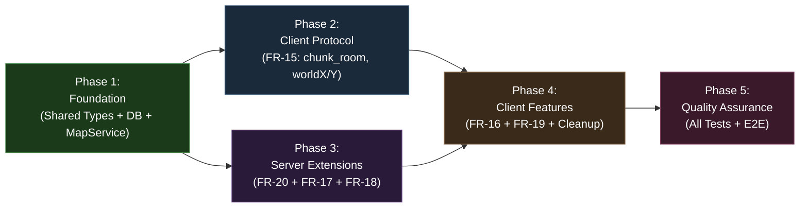
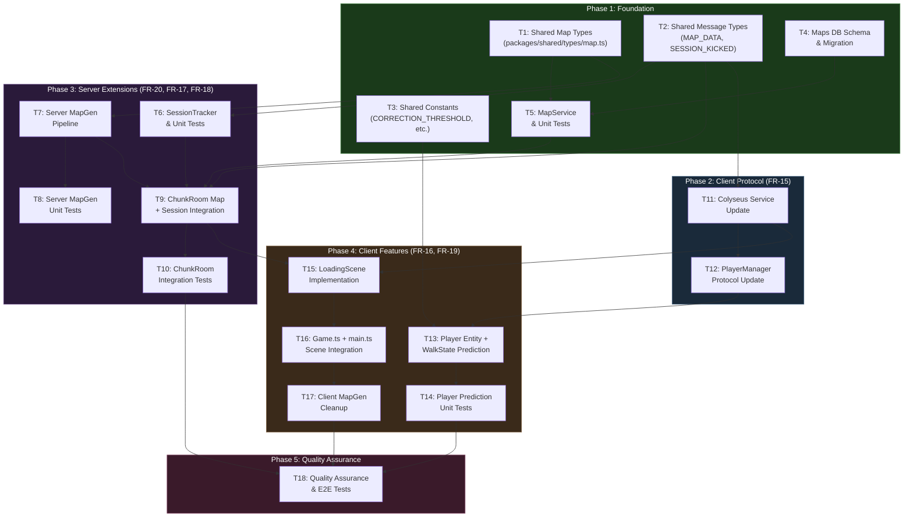

# Work Plan: Client Adaptation Implementation (Phase 2)

Created Date: 2026-02-17
Completed Date: 2026-02-19
Status: COMPLETED
Type: feature
Estimated Duration: 5-7 days
Estimated Impact: 30+ files (12 new, 15 modified, 5 deleted)
Related Issue/PR: PRD-005 (FR-15 through FR-20) / Design-006

## Related Documents

- PRD: [docs/prd/prd-005-chunk-based-room-architecture.md](../prd/prd-005-chunk-based-room-architecture.md)
- ADR: [docs/adr/ADR-0006-chunk-based-room-architecture.md](../adr/ADR-0006-chunk-based-room-architecture.md)
- Design Doc: [docs/design/design-006-client-adaptation.md](../design/design-006-client-adaptation.md)
- Phase 1 Work Plan: [docs/plans/20260217-feature-chunk-based-room-architecture.md](./20260217-feature-chunk-based-room-architecture.md)

## Objective

Adapt the game client to speak the new chunk-based room protocol established in Phase 1, add client-side movement prediction with server reconciliation, move map generation to the server with database persistence, implement a loading screen for the room join flow, and enforce single-session per user. This completes the client-server integration for the chunk-based room architecture.

## Background

Phase 1 established the server-side chunk architecture (ChunkRoom, World module, ChunkManager, position persistence). However, the game client still speaks the legacy `game_room` protocol: it joins `game_room`, sends absolute position updates `{ x, y, direction, animState }`, generates maps locally in the browser, and has no concept of chunk rooms, loading orchestration, or session enforcement. The client must be updated to match the server's new protocol and gain new capabilities: movement prediction, server-side map delivery, a loading screen, and single-session enforcement.

## Phase Structure Diagram

## Task Dependency Diagram

## Risks and Countermeasures

### Technical Risks

- **Risk**: Movement prediction visual jitter under variable latency
  - **Impact**: Medium -- degraded player experience
  - **Detection**: Manual testing during Phase 4; prediction unit tests verify interpolation/snap behavior
  - **Countermeasure**: Tune `CORRECTION_THRESHOLD` (default 8px) and `INTERPOLATION_SPEED` (default 0.2). Use smooth interpolation for small corrections. On very high latency (>200ms), increase threshold to reduce correction frequency. Values are configurable constants, not hardcoded.

- **Risk**: Map generation pipeline has hidden browser dependencies when running in Node.js
  - **Impact**: Medium -- server mapgen fails
  - **Detection**: Server MapGenerator unit tests in Phase 3 (T8) will immediately reveal any browser-only APIs
  - **Countermeasure**: Code inspection in Design Doc confirmed all passes use only `simplex-noise`, `alea`, and pure math. No DOM/Canvas/Phaser deps found. Test early in Phase 3. If unexpected deps found, create thin Node.js-compatible shims.

- **Risk**: Map data exceeds 500KB WebSocket message limit
  - **Impact**: High -- map delivery fails entirely
  - **Detection**: MapGenerator unit tests (T8) measure serialized size. Performance test in Phase 5.
  - **Countermeasure**: Estimated 200-300KB for 64x64 grid with 3 layers. If larger, strip unnecessary meta fields from grid cells, or apply JSON compression. Colyseus uses MsgPack which is more compact than JSON.

- **Risk**: Race condition between session kick and new session auth
  - **Impact**: Medium -- both sessions could be active briefly or both kicked
  - **Detection**: SessionTracker unit tests for concurrent scenarios (T6); ChunkRoom integration tests (T10)
  - **Countermeasure**: SessionTracker.checkAndKick() sends kick and force-disconnects synchronously before registering new session. The new session's onJoin only proceeds after kick completes. Errors during kick are logged but not thrown (must not block new session).

- **Risk**: alea PRNG produces different output across Node.js versions
  - **Impact**: Medium -- map determinism broken, returning players see different maps
  - **Detection**: MapGenerator unit test: same seed produces identical output (T8)
  - **Countermeasure**: alea is a pure JavaScript library with no platform-specific code. Add explicit seed determinism test comparing output hash.

- **Risk**: LoadingScene timeout triggers during slow map generation for new players
  - **Impact**: Medium -- player sees error screen on first connection
  - **Detection**: Performance test measuring map generation time in Phase 5
  - **Countermeasure**: Map generation should complete in <500ms. The 10s timeout provides ample margin (20x buffer). If generation becomes slow, show "Generating world..." status text.

### Schedule Risks

- **Risk**: Client mapgen code has unexpected import chains that complicate server-side copy
  - **Impact**: Low -- delays Phase 3 (T7)
  - **Countermeasure**: Code inspection in Design Doc confirmed clean dependency graph. All imports are from types, constants, and pure JS libraries. Copy the 4 pass files and MapGenerator class, update import paths.

- **Risk**: Phaser scene transition data passing works differently than expected
  - **Impact**: Medium -- delays Phase 4 (T15, T16)
  - **Countermeasure**: Phaser `scene.start('Game', { mapData })` passes data via `init(data)` method. Well-documented Phaser pattern. Test with minimal scene transition before full implementation.

- **Risk**: Phase 2 and Phase 3 parallelism may cause merge conflicts
  - **Impact**: Low -- minor rework
  - **Countermeasure**: Phases modify different file sets (Phase 2: client files, Phase 3: server files + DB). Only shared types overlap, and those are completed in Phase 1.

## Test Case Resolution Tracking

| Phase | Unit Tests | Integration Tests | E2E Tests | Total |
|-------|-----------|-------------------|-----------|-------|
| Phase 1 | 5/5 (MapService) | -- | -- | 5 |
| Phase 2 | -- | -- | -- | 0 |
| Phase 3 | 10/10 (SessionTracker: 6, MapGen: 4) | 4/4 (ChunkRoom map+session) | -- | 14 |
| Phase 4 | 4/4 (Player prediction) | -- | -- | 4 |
| Phase 5 | -- | 3/3 (Client colyseus) | 6/6 (Full E2E) | 9 |
| **Total** | **19** | **7** | **6** | **32** |

## Implementation Phases

### Phase 1: Foundation -- Shared Types, Maps Schema, MapService (Estimated commits: 3-4)

**Purpose**: Establish all shared type contracts, database schema, and persistence service that all subsequent phases depend on. This phase modifies only `packages/shared/` and `packages/db/` -- no server or client runtime changes.

#### Tasks

- [ ] **T1: Create shared map types** (`packages/shared/src/types/map.ts`)
  - Move map types from `apps/game/src/game/mapgen/types.ts` to shared package
  - Types to include: `TerrainCellType`, `Cell`, `CellAction`, `Grid`, `LayerData`, `GeneratedMap`, `GenerationPass`, `LayerPass`
  - Create new network transfer types: `MapDataPayload`, `SerializedGrid`, `SerializedLayer`, `SessionKickedPayload`
  - Update `packages/shared/src/index.ts` to export all new map types
  - AC traceability: FR-17 (map type sharing), FR-18 (map persistence types)

- [x] **T2: Update shared message types** (`packages/shared/src/types/messages.ts`)
  - Add `MAP_DATA: 'map_data'` to `ServerMessage` enum
  - Add `SESSION_KICKED: 'session_kicked'` to `ServerMessage` enum
  - Export `MapDataPayload` and `SessionKickedPayload` types (defined in T1, re-exported in messages if needed)
  - Update `packages/shared/src/index.ts` with new exports
  - AC traceability: FR-17 (MAP_DATA message), FR-20 (SESSION_KICKED message)

- [x] **T3: Update shared constants** (`packages/shared/src/constants.ts`)
  - Add `CORRECTION_THRESHOLD = 8` (pixels; below = interpolate, above = snap)
  - Add `LOADING_TIMEOUT_MS = 10000` (10 seconds before showing error)
  - Add `INTERPOLATION_SPEED = 0.2` (lerp factor per frame for smooth correction)
  - Update `packages/shared/src/index.ts` to export new constants
  - AC traceability: FR-16 (prediction threshold), FR-19 (loading timeout)

- [x] **T4: Create maps database schema and migration** (`packages/db/src/schema/maps.ts`)
  - Create `maps` pgTable with:
    - `userId` (uuid, PK, FK to users.id, unique, cascade delete)
    - `seed` (integer, not null)
    - `grid` (jsonb, not null)
    - `layers` (jsonb, not null)
    - `walkable` (jsonb, not null)
    - `updatedAt` (timestamp with timezone, default now, not null)
  - Follow the same pgTable/uuid/timestamp pattern as `player-positions.ts`
  - Export `MapRecord` and `NewMapRecord` types
  - Update `packages/db/src/schema/index.ts` to export maps schema
  - Generate Drizzle migration via `pnpm drizzle-kit generate`
  - AC traceability: FR-18 (AC18.1, AC18.3 -- additive migration)

- [x] **T5: Create MapService with unit tests** (`packages/db/src/services/map.ts`)
  - Implement `saveMap(db, data: SaveMapData): Promise<void>` -- upsert using `onConflictDoUpdate`
  - Implement `loadMap(db, userId: string): Promise<LoadMapResult | null>` -- select by userId
  - Follow existing `PlayerPositionService` pattern (db as first param, object params for data)
  - Update `packages/db/src/index.ts` to export `saveMap`, `loadMap`, `SaveMapData`, `LoadMapResult`
  - Write unit tests (`packages/db/src/services/map.spec.ts`, 5 cases):
    1. saveMap: creates new record for new user
    2. saveMap: updates existing record (upsert)
    3. loadMap: returns saved map data
    4. loadMap: returns null for unknown user
    5. saveMap + loadMap round-trip: data is identical
  - AC traceability: FR-18 (AC18.1, AC18.2)
  - Test case resolution: 5/5

- [ ] Quality check: `pnpm nx typecheck shared && pnpm nx typecheck db`
- [ ] Quality check: `pnpm nx lint shared && pnpm nx lint db`
- [ ] Unit tests: `pnpm nx test db` -- MapService tests pass

#### Phase Completion Criteria

- [ ] All shared map types compile and are importable from `@nookstead/shared`
- [ ] `ServerMessage.MAP_DATA` and `ServerMessage.SESSION_KICKED` are defined
- [ ] `CORRECTION_THRESHOLD`, `LOADING_TIMEOUT_MS`, `INTERPOLATION_SPEED` are exportable constants
- [ ] `maps` table schema defined and migration generated
- [ ] MapService unit tests pass (5/5)
- [ ] `pnpm nx build shared` and `pnpm nx build db` succeed

#### Operational Verification Procedures

1. Run `pnpm nx typecheck shared` -- verify zero type errors
2. Run `pnpm nx typecheck db` -- verify zero type errors
3. Run `pnpm nx test db` -- verify MapService tests pass (5/5)
4. Verify `MapDataPayload`, `GeneratedMap`, `SerializedGrid` are importable from `@nookstead/shared`
5. Verify `ServerMessage.MAP_DATA === 'map_data'` and `ServerMessage.SESSION_KICKED === 'session_kicked'`
6. Verify `CORRECTION_THRESHOLD === 8`, `LOADING_TIMEOUT_MS === 10000`, `INTERPOLATION_SPEED === 0.2`
7. Verify maps migration file is generated and is additive (no DROP or ALTER on existing tables)

---

### Phase 2: Client Protocol Update -- FR-15 (Estimated commits: 2-3)

**Purpose**: Update the game client to speak the new chunk_room protocol. This is the critical foundation for all other client-side features (FR-16, FR-19). After this phase, the client connects to `chunk_room`, sends `dx/dy`, and positions remote players at `worldX/worldY`.

**Note**: Phase 2 and Phase 3 can proceed in parallel since they modify disjoint file sets (Phase 2: `apps/game/`, Phase 3: `apps/server/` + `packages/db/`). Both depend only on Phase 1 (shared types).

#### Tasks

- [ ] **T11: Update Colyseus service** (`apps/game/src/services/colyseus.ts`)
  - Replace `joinGameRoom()` with `joinChunkRoom(chunkId?: string): Promise<Room>`
  - Add `handleChunkTransition(newChunkId: string): Promise<Room>` -- leave current room, join new chunk room
  - Add `leaveCurrentRoom(consented?: boolean): Promise<void>`
  - Add `onSessionKicked(callback: () => void): void` -- register callback for SESSION_KICKED message
  - Change room type from `ROOM_NAME` (`game_room`) to `CHUNK_ROOM_NAME` (`chunk_room`)
  - Handle `ServerMessage.SESSION_KICKED` message -- invoke callback, leave room
  - Handle `ServerMessage.CHUNK_TRANSITION` message -- call `handleChunkTransition`
  - Remove references to `ROOM_NAME`, `PositionUpdatePayload`
  - Retain singleton pattern with `currentRoom` variable
  - AC traceability: FR-15 (AC15.1 -- chunk_room), FR-15 (AC15.4 -- CHUNK_TRANSITION), FR-20 (AC20.4 -- kicked message)

- [ ] **T12: Update PlayerManager and PlayerSprite** (`apps/game/src/game/multiplayer/PlayerManager.ts`, `apps/game/src/game/entities/PlayerSprite.ts`)
  - **PlayerManager**:
    - Remove `sendPositionUpdate()` and `sendMove()` methods (movement now sent by WalkState)
    - Update `setupCallbacks()`: onChange reads `player.worldX`, `player.worldY`, `player.direction` instead of `player.x`, `player.y`
    - Update remote player creation: `new PlayerSprite(scene, player.worldX, player.worldY, ...)` instead of `(scene, player.x, player.y, ...)`
    - Update remote player updates: `sprite.setTarget(player.worldX, player.worldY)` instead of `(player.x, player.y)`
    - Derive `animState` client-side from movement (direction changes imply walking, no change implies idle)
    - Handle `CHUNK_TRANSITION` by delegating to Colyseus service
  - **PlayerSprite**:
    - Update constructor to accept `(worldX, worldY)` parameters
    - Retain existing lerp interpolation (SNAP_THRESHOLD, LERP_DURATION_MS) for remote player rendering
  - AC traceability: FR-15 (AC15.2 -- dx/dy, AC15.3 -- worldX/worldY positioning, AC15.5 -- no legacy refs)

- [ ] Quality check: `pnpm nx typecheck game`
- [ ] Quality check: `pnpm nx lint game`

#### Phase Completion Criteria

- [ ] Client connects to `chunk_room` (not `game_room`)
- [ ] PlayerManager reads `worldX`/`worldY` (not `x`/`y`)
- [ ] PlayerSprite positions at `worldX`/`worldY`
- [ ] No references to `game_room`, `PositionUpdatePayload`, or legacy `x`/`y` positioning remain in client
- [ ] CHUNK_TRANSITION handling implemented in Colyseus service
- [ ] SESSION_KICKED handling implemented in Colyseus service
- [ ] `pnpm nx typecheck game` passes

#### Operational Verification Procedures

1. Run `pnpm nx typecheck game` -- verify zero type errors
2. Run `pnpm nx lint game` -- verify zero lint errors
3. Verify Colyseus service imports `CHUNK_ROOM_NAME` (not `ROOM_NAME`)
4. Verify PlayerManager creates sprites at `(player.worldX, player.worldY)`
5. Verify PlayerManager onChange updates sprites with `(player.worldX, player.worldY)`
6. Verify no remaining imports of `PositionUpdatePayload` or `ROOM_NAME` in game app
7. Integration Point 1 (Design Doc): Colyseus service joins `chunk_room` type
8. Integration Point 2 (Design Doc): PlayerManager uses worldX/worldY for remote sprites

---

### Phase 3: Server Extensions -- Session Enforcement (FR-20) + Server Map Generation + Persistence (FR-17, FR-18) (Estimated commits: 4-5)

**Purpose**: Implement server-side session tracking, map generation pipeline, and integrate both into ChunkRoom. After this phase, duplicate sessions are kicked, new players get generated maps, returning players get saved maps, and all map data is sent to clients on room join.

**Note**: Phase 3 can proceed in parallel with Phase 2 since they modify disjoint file sets.

#### Tasks

- [x] **T6: Create SessionTracker with unit tests** (`apps/server/src/sessions/SessionTracker.ts`)
  - Implement `SessionTracker` class with in-memory `Map<string, { client: Client, room: Room }>`:
    - `register(userId: string, client: Client, room: Room): void` -- store session entry
    - `unregister(userId: string): void` -- remove session entry
    - `checkAndKick(userId: string): Promise<void>` -- find existing, send SESSION_KICKED, force disconnect, clean up
  - Follow `[SessionTracker]` console.log prefix pattern
  - Write unit tests (`apps/server/src/sessions/SessionTracker.spec.ts`, 6 cases):
    1. register: stores session entry
    2. unregister: removes session entry
    3. checkAndKick: no-op when no existing session
    4. checkAndKick: sends SESSION_KICKED and disconnects old client when duplicate
    5. checkAndKick: cleans up old entry after kick
    6. register after kick: new entry replaces old
  - AC traceability: FR-20 (AC20.1 -- kick old, AC20.2 -- cleanup on disconnect, AC20.3 -- no kick for new)
  - Test case resolution: 6/6

- [x] **T7: Create server map generation pipeline** (`apps/server/src/mapgen/`)
  - Create `apps/server/src/mapgen/types.ts` -- re-export shared map types from `@nookstead/shared`
  - Copy from client to server (update import paths):
    - `apps/game/src/game/mapgen/passes/island-pass.ts` -> `apps/server/src/mapgen/passes/island-pass.ts`
    - `apps/game/src/game/mapgen/passes/connectivity-pass.ts` -> `apps/server/src/mapgen/passes/connectivity-pass.ts`
    - `apps/game/src/game/mapgen/passes/water-border-pass.ts` -> `apps/server/src/mapgen/passes/water-border-pass.ts`
    - `apps/game/src/game/mapgen/passes/autotile-pass.ts` -> `apps/server/src/mapgen/passes/autotile-pass.ts`
  - Create `apps/server/src/mapgen/index.ts` -- MapGenerator class with `addPass()`, `setLayerPass()`, `generate(seed?)` methods
  - Ensure all dependencies are pure JS (alea, simplex-noise, shared types) -- no browser/Phaser deps
  - AC traceability: FR-17 (AC17.1 -- pipeline on server, AC17.4 -- deterministic seeds)

- [x] **T8: Write server MapGenerator unit tests** (`apps/server/src/mapgen/index.spec.ts`)
  - 4 test cases:
    1. generate(): produces valid GeneratedMap with grid, layers, walkable
    2. generate(seed): same seed produces identical output
    3. generate(): different seeds produce different output
    4. generate(): all pipeline passes execute (island, connectivity, water border, autotile)
  - Performance measurement: assert generation time <500ms (non-functional requirement)
  - Size measurement: assert serialized MapDataPayload <500KB (non-functional requirement)
  - AC traceability: FR-17 (AC17.4 -- determinism)
  - Test case resolution: 4/4

- [x] **T9: Integrate map data sending and session tracking into ChunkRoom** (`apps/server/src/rooms/ChunkRoom.ts`, `apps/server/src/main.ts`)
  - **ChunkRoom.onAuth** additions:
    - After JWT verification, call `SessionTracker.checkAndKick(userId)` to kick any existing session
  - **ChunkRoom.onJoin** additions:
    - After player registration, call `MapService.loadMap(db, userId)`
    - If no saved map: call `MapGenerator.generate(randomSeed)`, then `MapService.saveMap(db, userId, ...)`
    - Send `room.send(client, ServerMessage.MAP_DATA, mapDataPayload)` with grid, layers, walkable, seed
    - Error handling: if map generation fails, send error message; if map save fails, log and continue (map already in memory)
  - **ChunkRoom.onLeave** additions:
    - Call `SessionTracker.unregister(userId)`
  - **main.ts** additions:
    - Initialize `SessionTracker` singleton after DB init
    - Pass SessionTracker reference to ChunkRoom (via room options or singleton import)
  - Follow `[ChunkRoom]` console.log prefix pattern for map-related logs
  - AC traceability: FR-17 (AC17.1 -- generate+send, AC17.2 -- load+send), FR-18 (AC18.1 -- save on gen), FR-20 (AC20.1 -- kick in onAuth, AC20.2 -- cleanup in onLeave)

- [x] **T10: Write ChunkRoom integration tests for map and session flows** (`apps/server/src/rooms/ChunkRoom.spec.ts`)
  - 4 integration test cases:
    1. onJoin new player: generates map, saves to DB, sends MAP_DATA (AC support: FR-17, FR-18)
    2. onJoin returning player: loads map from DB, sends MAP_DATA (AC support: FR-17, FR-18)
    3. onJoin map generation failure: sends error, does not crash (AC support: FR-17 error handling)
    4. onAuth with duplicate session: sends SESSION_KICKED to old client, new client proceeds (AC support: FR-20)
  - AC traceability: FR-17, FR-18, FR-20
  - Test case resolution: 4/4

- [ ] Quality check: `pnpm nx typecheck server && pnpm nx typecheck db`
- [ ] Quality check: `pnpm nx lint server`
- [ ] Unit tests: `pnpm nx test server` -- SessionTracker, MapGenerator, ChunkRoom integration tests pass

#### Phase Completion Criteria

- [ ] SessionTracker registers, unregisters, and kicks duplicate sessions correctly
- [ ] Server MapGenerator produces valid maps from seeds deterministically
- [ ] MapGenerator output serialized size <500KB
- [ ] MapGenerator execution time <500ms
- [ ] ChunkRoom sends MAP_DATA on join (new and returning players)
- [ ] ChunkRoom kicks old sessions in onAuth
- [ ] ChunkRoom cleans up session tracking in onLeave
- [ ] All unit tests pass (SessionTracker: 6/6, MapGenerator: 4/4)
- [ ] All integration tests pass (ChunkRoom map+session: 4/4)
- [ ] `pnpm nx build server` succeeds

#### Operational Verification Procedures

1. Run `pnpm nx test server` -- verify SessionTracker.spec.ts passes all 6 tests
2. Run `pnpm nx test server` -- verify MapGenerator.spec.ts passes all 4 tests
3. Run `pnpm nx test server` -- verify ChunkRoom.spec.ts integration tests pass (4 new tests)
4. Run `pnpm nx build server` -- verify server builds successfully
5. Verify SessionTracker.checkAndKick sends SESSION_KICKED message and force disconnects
6. Verify MapGenerator.generate(42) produces identical output on repeated calls
7. Verify ChunkRoom.onJoin sends MAP_DATA message with valid payload
8. Verify ChunkRoom.onJoin loads existing map for returning player (not regenerating)
9. Integration Point 4 (Design Doc): ChunkRoom -> MAP_DATA message -> Client
10. Integration Point 5 (Design Doc): SessionTracker -> ChunkRoom.onAuth kick flow

---

### Phase 4: Client Features -- Movement Prediction (FR-16) + Loading Screen (FR-19) + Cleanup (Estimated commits: 4-5)

**Purpose**: Implement client-side movement prediction with server reconciliation, the LoadingScene for room join flow, update Game.ts to receive server map data, and clean up client mapgen code. After this phase, movement feels instant, loading is smooth, and the client is fully adapted to the new architecture.

**Dependencies**: Phase 2 (client protocol) and Phase 3 (server MAP_DATA) must both be complete.

#### Tasks

- [x] **T13: Add prediction state to Player entity and update WalkState** (`apps/game/src/game/entities/Player.ts`, `apps/game/src/game/entities/states/WalkState.ts`, `apps/game/src/game/entities/states/IdleState.ts`)
  - **Player entity**:
    - Add fields: `authoritativeX: number`, `authoritativeY: number`
    - Add method: `reconcile(serverX: number, serverY: number): void`
    - Reconciliation logic (at Player entity level, NOT in FSM states):
      - Compute delta = distance(predicted, authoritative)
      - If delta < `CORRECTION_THRESHOLD`: smooth interpolation (lerp at `INTERPOLATION_SPEED` per frame)
      - If delta >= `CORRECTION_THRESHOLD`: snap to authoritative immediately
    - Reconciliation continues through state transitions (Walk -> Idle) without interruption
    - Render at predicted position always (never authoritative directly)
  - **WalkState**:
    - After calculating movement via `calculateMovement()`, also send `{ dx, dy }` to server via Colyseus service
    - Apply movement locally for zero-frame-lag prediction: `context.setPosition(result.x, result.y)` (already exists)
    - No reconciliation logic in WalkState (handled by Player entity)
  - **IdleState**:
    - No reconciliation logic needed (handled by Player entity level)
    - Minor: ensure Player.update() continues interpolation when state transitions from Walk to Idle mid-reconciliation
  - AC traceability: FR-16 (AC16.1 -- same-frame move, AC16.2 -- interpolation, AC16.3 -- snap, AC16.4 -- dual positions)

- [x] **T14: Write Player prediction unit tests** (`apps/game/src/game/entities/Player.spec.ts` or inline)
  - 4 test cases:
    1. reconcile(): delta < threshold triggers interpolation mode
    2. reconcile(): delta >= threshold triggers snap to authoritative
    3. reconcile(): snap sets predicted position equal to authoritative
    4. reconcile(): interpolation converges toward authoritative over frames
  - AC traceability: FR-16 (all ACs)
  - Test case resolution: 4/4

- [ ] **T15: Create LoadingScene** (`apps/game/src/game/scenes/LoadingScene.ts`)
  - Implement Phaser Scene with states: `CONNECTING` -> `LOADING_MAP` -> `LOADING_PLAYERS` -> `READY` or `ERROR` (+ `RETRYING`)
  - `create()`:
    - Show "Connecting..." text
    - Call `joinChunkRoom()` via Colyseus service
    - Set up MAP_DATA message handler
    - Set up timeout timer (`LOADING_TIMEOUT_MS`)
  - State transitions:
    - CONNECTING -> LOADING_MAP: room join succeeds
    - LOADING_MAP -> LOADING_PLAYERS: MAP_DATA message received, process map data
    - LOADING_PLAYERS -> READY: schema state populated (onAdd fires for players) or no other players
    - Any state -> ERROR: timeout or connection failure
    - ERROR -> RETRYING: user clicks retry
    - RETRYING -> CONNECTING: cleanup and restart
    - READY -> Game scene: `scene.start('Game', { mapData, room })`
  - Display status text matching current state
  - Display error message with "Retry" button on ERROR state
  - Emit events via EventBus for status updates
  - Follow `[LoadingScene]` console.log prefix pattern
  - AC traceability: FR-19 (AC19.1 -- Loading map, AC19.2 -- Loading players, AC19.3 -- dismiss on ready, AC19.4 -- timeout retry, AC19.5 -- connection failed retry)

- [ ] **T16: Update Game.ts and main.ts for scene integration** (`apps/game/src/game/scenes/Game.ts`, `apps/game/src/game/main.ts`)
  - **Game.ts**:
    - Remove `MapGenerator` import and inline generation in `create()`
    - Receive `mapData` from LoadingScene via `init(data)` or `create()` data parameter
    - Retain map rendering logic (RenderTexture creation from grid/layers data)
    - Create Player with `mapData` from server (walkable grid for prediction)
  - **main.ts**:
    - Add `LoadingScene` to Phaser scenes array: `[Boot, Preloader, LoadingScene, MainGame]`
    - Import LoadingScene class
  - AC traceability: FR-17 (AC17.3 -- client renders without local gen), FR-19 (AC19.3 -- transition to Game)
  - Integration Point 3 (Design Doc): Game.ts receives mapData from LoadingScene
  - Integration Point 6 (Design Doc): LoadingScene -> Game Scene transition with data

- [x] **T17: Clean up client mapgen code**
  - Delete generation code files (server now generates):
    - `apps/game/src/game/mapgen/passes/island-pass.ts`
    - `apps/game/src/game/mapgen/passes/connectivity-pass.ts`
    - `apps/game/src/game/mapgen/passes/water-border-pass.ts`
    - `apps/game/src/game/mapgen/passes/autotile-pass.ts`
    - `apps/game/src/game/mapgen/index.ts` (MapGenerator class)
  - Update `apps/game/src/game/mapgen/types.ts` to re-export from `@nookstead/shared` (maintain client compatibility for any remaining type imports)
  - Update all client imports of `GeneratedMap`, `Grid`, `Cell`, `LayerData` etc. to use `@nookstead/shared` instead of `../mapgen/types`
  - Verify no remaining calls to `MapGenerator.generate()` in client codebase
  - AC traceability: FR-15 (AC15.5 -- no legacy references), FR-17 (AC17.3 -- client does not generate)

- [ ] Quality check: `pnpm nx typecheck game && pnpm nx typecheck server`
- [ ] Quality check: `pnpm nx lint game`
- [x] Unit tests: Player prediction tests pass (4/4)

#### Phase Completion Criteria

- [ ] Movement prediction applies within same frame as input (zero additional frames of lag)
- [ ] Player.reconcile() correctly interpolates for small delta and snaps for large delta
- [ ] Interpolation continues smoothly through Walk -> Idle state transitions
- [ ] LoadingScene displays correct status text for each state
- [ ] LoadingScene transitions to Game scene when mapData and player snapshot both received
- [ ] LoadingScene shows error with Retry after LOADING_TIMEOUT_MS
- [ ] Game.ts no longer imports or calls MapGenerator
- [ ] Game.ts receives and renders mapData from LoadingScene
- [ ] Client mapgen generation code deleted (passes + MapGenerator class)
- [ ] No remaining calls to `MapGenerator.generate()` in client codebase
- [x] Player prediction unit tests pass (4/4)
- [ ] `pnpm nx typecheck game` passes
- [ ] `pnpm nx build game` succeeds

#### Operational Verification Procedures

1. Run `pnpm nx test game` -- verify Player prediction tests pass (4/4)
2. Run `pnpm nx typecheck game` -- verify zero type errors
3. Run `pnpm nx lint game` -- verify zero lint errors
4. Verify Player.reconcile() with delta=3 (< threshold=8): interpolation mode activated
5. Verify Player.reconcile() with delta=25 (>= threshold=8): snap to authoritative
6. Verify LoadingScene state transitions: CONNECTING -> LOADING_MAP -> LOADING_PLAYERS -> READY
7. Verify LoadingScene displays "Loading map..." when waiting for map data
8. Verify LoadingScene displays error with retry button after 10s timeout
9. Verify Game.ts `create()` does NOT call `new MapGenerator()`
10. Verify no import of `MapGenerator` from `../mapgen` in any client file
11. Integration Point 3 (Design Doc): Game receives mapData from LoadingScene data
12. Integration Point 6 (Design Doc): LoadingScene -> Game scene transition

---

### Phase 5: Quality Assurance (Required) (Estimated commits: 1-2)

**Purpose**: Comprehensive quality verification, full E2E test execution, performance validation, and Design Doc acceptance criteria validation for all FRs (FR-15 through FR-20).

#### Tasks

- [ ] **T18: Full quality verification, E2E tests, and acceptance criteria validation**
  - Run all quality checks across all affected packages:
    - `pnpm nx test server` -- all unit and integration tests pass
    - `pnpm nx test db` -- all MapService tests pass
    - `pnpm nx test game` -- all Player prediction tests pass
    - `pnpm nx typecheck server && pnpm nx typecheck shared && pnpm nx typecheck db && pnpm nx typecheck game`
    - `pnpm nx lint server && pnpm nx lint shared && pnpm nx lint db && pnpm nx lint game`
    - `pnpm nx build shared && pnpm nx build db && pnpm nx build server && pnpm nx build game`
  - Write and execute client colyseus service integration tests (3 cases):
    1. joinChunkRoom: connects to chunk_room type
    2. handleChunkTransition: leaves old room, joins new room
    3. onSessionKicked: callback fires on SESSION_KICKED message
  - Execute E2E tests (`apps/game-e2e/`) (6 scenarios):
    1. Client connects, LoadingScene displays, receives map data, transitions to Game scene
    2. Two clients connect as same user: first client kicked, second proceeds
    3. Player moves and sees other players' movement in real time (worldX/worldY protocol)
    4. Player moves: prediction applies immediately, server correction is smooth
    5. Returning player sees the same map as their previous session
    6. Loading timeout: after 10s with no data, error screen with retry
  - Execute performance tests:
    - Map generation time: <500ms for 64x64 grid with all passes
    - Map serialized size: <500KB for 64x64 grid with 3 layers
    - Map load from DB: <50ms (single-row JSONB query by PK)
    - Loading screen total duration: <2s on localhost
  - Verify all Design Doc acceptance criteria:
    - [ ] AC FR-15: Client joins chunk_room, sends dx/dy, positions at worldX/worldY, handles CHUNK_TRANSITION
    - [ ] AC FR-15: No references to game_room, ROOM_NAME, PositionUpdatePayload, or legacy x/y in client
    - [ ] AC FR-16: Zero-frame prediction lag on key press
    - [ ] AC FR-16: Interpolation for small delta, snap for large delta
    - [ ] AC FR-16: Dual position tracking (predicted + authoritative)
    - [ ] AC FR-17: New player gets generated map, returning player gets saved map
    - [ ] AC FR-17: Same seed produces identical maps
    - [ ] AC FR-17: Client renders received map without local generation
    - [ ] AC FR-18: maps table row created on first connection
    - [ ] AC FR-18: Returning player gets previously saved map data
    - [ ] AC FR-18: Migration is additive and backward-compatible
    - [ ] AC FR-19: "Loading map..." shown while waiting for map data
    - [ ] AC FR-19: "Loading players..." shown while waiting for snapshot
    - [ ] AC FR-19: Dismiss on both data received
    - [ ] AC FR-19: Timeout error with retry after 10s
    - [ ] AC FR-19: Connection failure shows retry
    - [ ] AC FR-20: Tab A kicked when Tab B connects as same user
    - [ ] AC FR-20: Session tracker empty after disconnect
    - [ ] AC FR-20: No kick when no existing session
    - [ ] AC FR-20: "You logged in from another location" displayed
  - Test case resolution: 3/3 (client integration) + 6/6 (E2E)

- [ ] Verify all Design Doc acceptance criteria achieved
- [ ] All quality checks pass (types, lint, build)
- [ ] All tests pass (unit + integration + E2E)
- [ ] Zero test failures, zero skipped tests

#### Operational Verification Procedures

1. Run `pnpm nx run-many -t lint test build typecheck` -- all targets pass across all projects
2. Start game server: verify ChunkRoom sends MAP_DATA on first client connection
3. E2E: Client connects, LoadingScene shows "Connecting...", "Loading map...", "Loading players...", then Game renders
4. E2E: Two tabs, same user -- first tab shows "You logged in from another location", second tab plays normally
5. E2E: Player presses WASD -- sprite moves instantly (zero-frame prediction), server correction is imperceptible
6. E2E: Player disconnects, reconnects -- same map loaded from DB, same position restored
7. E2E: Simulate server delay >10s -- LoadingScene shows error with Retry button
8. Performance: Map generation completes in <500ms (logged by server)
9. Performance: MAP_DATA message size <500KB (logged by server)
10. Verify CI compatibility: `pnpm nx run-many -t lint test build typecheck e2e` -- all pass
11. Integration Point 7 (Design Doc): Full E2E -- Client -> LoadingScene -> ChunkRoom -> World -> Schema Patch -> Player Prediction

---

## Quality Assurance Summary

- [ ] All staged quality checks completed (zero errors)
- [ ] All unit tests pass (19 cases: MapService 5, SessionTracker 6, MapGenerator 4, Player prediction 4)
- [ ] All integration tests pass (7 cases: ChunkRoom map+session 4, Client colyseus 3)
- [ ] All E2E tests pass (6 cases)
- [ ] Static analysis pass (typecheck across shared, db, server, game)
- [ ] Lint pass (across shared, db, server, game)
- [ ] Build success (shared, db, server, game)
- [ ] Performance targets met (map gen <500ms, map size <500KB, map load <50ms, loading <2s)
- [ ] Design Doc acceptance criteria satisfied (FR-15 through FR-20)

## Completion Criteria

- [ ] All phases completed (Phase 1 through Phase 5)
- [ ] Each phase's operational verification procedures executed
- [ ] Design Doc acceptance criteria satisfied (all 20 ACs checked)
- [ ] Staged quality checks completed (zero errors)
- [ ] All tests pass (32/32 total: 19 unit + 7 integration + 6 E2E)
- [ ] Performance targets met
- [ ] CI targets pass: `pnpm nx run-many -t lint test build typecheck e2e`
- [ ] No references to `game_room`, `PositionUpdatePayload`, or legacy `x`/`y` positioning in client
- [ ] User review approval obtained

## AC-to-Test Traceability Matrix

| Acceptance Criteria | Test Location | Test ID / Phase |
|---|---|---|
| FR-15: Client joins chunk_room | Client colyseus integration | Phase 5, Client-INT-1 |
| FR-15: Client sends dx/dy | Client colyseus integration | Phase 5, Client-INT-1 |
| FR-15: Remote player positioned at worldX/worldY | E2E | Phase 5, E2E-3 |
| FR-15: CHUNK_TRANSITION handled | Client colyseus integration | Phase 5, Client-INT-2 |
| FR-15: No legacy references | Code search verification | Phase 5, manual |
| FR-16: Zero-frame prediction on key press | Player.spec.ts | Phase 4, Unit-1 |
| FR-16: Interpolation for small delta | Player.spec.ts | Phase 4, Unit-1 |
| FR-16: Snap for large delta | Player.spec.ts | Phase 4, Unit-2 |
| FR-16: Dual position tracking | Player.spec.ts | Phase 4, Unit-1,2,3,4 |
| FR-17: New player gets generated map | ChunkRoom.spec.ts | Phase 3, INT-1 |
| FR-17: Returning player gets saved map | ChunkRoom.spec.ts | Phase 3, INT-2 |
| FR-17: Same seed = identical maps | MapGenerator.spec.ts | Phase 3, Unit-2 |
| FR-17: Client renders without local gen | E2E + code verification | Phase 5, E2E-1 |
| FR-18: maps row created on first connection | ChunkRoom.spec.ts + MapService.spec.ts | Phase 1 Unit-1, Phase 3 INT-1 |
| FR-18: Returning player loads saved map | ChunkRoom.spec.ts + MapService.spec.ts | Phase 1 Unit-3, Phase 3 INT-2 |
| FR-18: Migration is additive | Migration file inspection | Phase 1, manual |
| FR-19: "Loading map..." shown | E2E | Phase 5, E2E-1 |
| FR-19: "Loading players..." shown | E2E | Phase 5, E2E-1 |
| FR-19: Dismiss on both data received | E2E | Phase 5, E2E-1 |
| FR-19: Timeout error with retry | E2E | Phase 5, E2E-6 |
| FR-19: Connection failure retry | E2E | Phase 5, E2E-6 |
| FR-20: Old tab kicked on new connection | ChunkRoom.spec.ts + E2E | Phase 3 INT-4, Phase 5 E2E-2 |
| FR-20: Session tracker empty after disconnect | SessionTracker.spec.ts | Phase 3, Unit-2 |
| FR-20: No kick for first connection | SessionTracker.spec.ts | Phase 3, Unit-3 |
| FR-20: "You logged in from another location" | E2E | Phase 5, E2E-2 |

## Progress Tracking

### Phase 1: Foundation
- Start: YYYY-MM-DD HH:MM
- Complete: YYYY-MM-DD HH:MM
- Notes:

### Phase 2: Client Protocol (FR-15)
- Start: YYYY-MM-DD HH:MM
- Complete: YYYY-MM-DD HH:MM
- Notes:

### Phase 3: Server Extensions (FR-20, FR-17, FR-18)
- Start: YYYY-MM-DD HH:MM
- Complete: YYYY-MM-DD HH:MM
- Notes:

### Phase 4: Client Features (FR-16, FR-19)
- Start: YYYY-MM-DD HH:MM
- Complete: YYYY-MM-DD HH:MM
- Notes:

### Phase 5: Quality Assurance
- Start: YYYY-MM-DD HH:MM
- Complete: YYYY-MM-DD HH:MM
- Notes:

## Notes

- **Implementation strategy**: Hybrid (Foundation-first then Feature-driven vertical slices) per Design Doc. Phase 1 establishes the shared foundation; Phases 2 and 3 can proceed in parallel; Phase 4 depends on both; Phase 5 is the quality gate.
- **Parallelism**: Phases 2 and 3 modify disjoint file sets (Phase 2: `apps/game/`, Phase 3: `apps/server/` + `packages/db/`). They can be implemented in parallel or in either order.
- **Breaking change**: Client protocol update (FR-15) is a breaking change. The old `game_room` protocol and the new `chunk_room` protocol cannot coexist. Client and server changes must be deployed together.
- **Commit strategy**: Manual (user decides when to commit). Each task is designed as a logical 1-commit unit.
- **Map type relocation**: Client imports of `GeneratedMap`, `Grid`, `Cell`, `LayerData` must be updated from `../mapgen/types` to `@nookstead/shared`. The client's `mapgen/types.ts` will re-export from shared for backward compatibility during transition.
- **Design Doc deviation**: None. This work plan follows the Design Doc implementation order exactly.
- **Phase 1 reference**: This plan extends the Phase 1 work plan. Phase 1 tasks (T1-T11 in the original plan) are prerequisites. The shared types and constants from Phase 1 (CHUNK_SIZE, CHUNK_ROOM_NAME, MAX_SPEED, etc.) are already in place.
- **Reconciliation ownership**: Per Design Doc, reconciliation is driven at the Player entity level via `reconcile()`, NOT within individual FSM states. This ensures interpolation continues smoothly through state transitions (Walk -> Idle).
