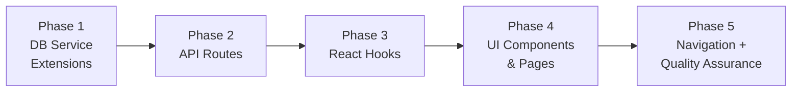
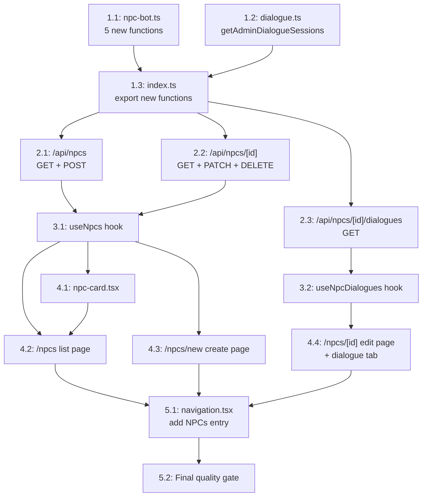

# Work Plan: NPC Editor (genmap Admin CRUD + Dialogue Viewer)

Created Date: 2026-03-04
Type: feature
Estimated Duration: 2-3 days
Estimated Impact: ~14 files (3 existing modified + 11 new)
Related Issue/PR: N/A

## Related Documents
- Design Doc: [docs/design/design-011-npc-editor.md](../design/design-011-npc-editor.md)
- ADR: [docs/adr/ADR-0013-npc-bot-entity-architecture.md](../adr/ADR-0013-npc-bot-entity-architecture.md)
- ADR: [docs/adr/ADR-0014-ai-dialogue-openai-sdk.md](../adr/ADR-0014-ai-dialogue-openai-sdk.md)

## Objective

Add a full CRUD admin interface for NPC bots and a read-only dialogue history viewer to the genmap admin tool, enabling admins to create, view, edit, and delete NPCs and review player-NPC conversations for QA purposes.

## Background

NPC bots can currently only be created programmatically via the Colyseus server at runtime. There is no admin interface to view all NPCs, edit personality parameters, create test NPCs, or review AI-generated dialogue quality. The genmap admin tool already has established CRUD patterns (Objects, Sprites, Maps, etc.) that this feature will follow exactly.

### Current State
- `packages/db/src/services/npc-bot.ts` -- has `createBot`, `loadBots`, `saveBotPositions` (runtime functions only)
- `packages/db/src/services/dialogue.ts` -- has per-user dialogue queries but no admin (all-users) query
- `apps/genmap/` -- full CRUD patterns exist for Objects, Sprites, Maps, etc.
- No NPC editor pages, hooks, or API routes exist

### Constraints
- No database schema changes (use existing `npc_bots`, `dialogue_sessions`, `dialogue_messages`, `users` tables)
- Follow existing genmap CRUD patterns exactly (Objects editor is the primary reference)
- shadcn/ui components already installed; toast via `sonner`
- `AVAILABLE_SKINS` imported from `@nookstead/shared`

## Risks and Countermeasures

### Technical Risks
- **Risk**: NPC personality edits do not take effect on active Colyseus rooms until restart
  - **Impact**: Medium -- admin may expect immediate effect
  - **Countermeasure**: Display warning banner on edit page (AC requirement)

- **Risk**: Large dialogue history for popular NPCs causes slow page loads
  - **Impact**: Low -- admin tool, low traffic
  - **Countermeasure**: Pagination (20 per page) with DB-level LIMIT/OFFSET; existing DB indexes on botId/userId

- **Risk**: Deleting NPC with active dialogue sessions
  - **Impact**: Low -- cascade delete handles cleanup
  - **Countermeasure**: Confirmation dialog warns that all dialogue history will be deleted

### Schedule Risks
- **Risk**: None significant -- all patterns are established, no new technology, purely additive feature
  - **Impact**: N/A
  - **Countermeasure**: Follow existing Objects editor pattern line-by-line

## Implementation Strategy

**Approach**: Foundation-driven (Horizontal Slice) with 5 phases

**Rationale**: Each layer (DB services -> API routes -> hooks -> pages -> navigation) has strict upward dependencies. Building bottom-up ensures each layer can be verified before the next layer consumes it. This matches the Design Doc's specified implementation order and minimizes integration risk.

## Phase Structure Diagram

## Task Dependency Diagram

## Implementation Phases

---

### Phase 1: DB Service Extensions (Estimated commits: 1)

**Purpose**: Add CRUD functions for NPC bots and an admin dialogue query to the DB package. This is the foundation that all API routes depend on.

**Owner**: mechanics-developer

#### Tasks

- [ ] **Task 1.1**: Add 5 new functions to `packages/db/src/services/npc-bot.ts`
  - `createBotAdmin(db, data: AdminCreateBotData): Promise<NpcBot>` -- insert with default worldX=0, worldY=0, direction='down'
  - `getBotById(db, id): Promise<NpcBot | null>` -- select by ID
  - `listAllBots(db, params?: {limit, offset}): Promise<NpcBot[]>` -- select all, ordered by createdAt DESC
  - `updateBot(db, id, data: UpdateBotData): Promise<NpcBot | null>` -- partial update with updatedAt timestamp
  - `deleteBot(db, id): Promise<NpcBot | null>` -- delete with RETURNING
  - Define `AdminCreateBotData` and `UpdateBotData` interfaces per Design Doc contracts
  - Follow `game-object.ts` CRUD pattern exactly (DrizzleClient param, RETURNING, null for not found)
  - AC coverage: FR-1 (list), FR-2 (create), FR-3 (edit), FR-4 (delete)
  - Dependencies: none
  - Files: `packages/db/src/services/npc-bot.ts` (modify)

- [ ] **Task 1.2**: Add `getAdminDialogueSessions` to `packages/db/src/services/dialogue.ts`
  - `getAdminDialogueSessions(db, botId, params?: {limit, offset}): Promise<AdminDialogueSession[]>`
  - JOIN `dialogue_sessions` with `users` table on userId, COUNT `dialogue_messages` per session
  - Order by startedAt DESC (newest first)
  - Define `AdminDialogueSession` interface: sessionId, startedAt, endedAt, userId, userName, userEmail, messageCount
  - AC coverage: FR-5 (session list), FR-7 (pagination)
  - Dependencies: none
  - Files: `packages/db/src/services/dialogue.ts` (modify)

- [ ] **Task 1.3**: Export new functions and types from `packages/db/src/index.ts`
  - Add exports: `createBotAdmin`, `getBotById`, `listAllBots`, `updateBot`, `deleteBot`, `AdminCreateBotData`, `UpdateBotData`
  - Add exports: `getAdminDialogueSessions`, `AdminDialogueSession`
  - Dependencies: Tasks 1.1, 1.2
  - Files: `packages/db/src/index.ts` (modify)

- [ ] **Quality check**: `pnpm nx typecheck db && pnpm nx lint db`

#### Phase Completion Criteria
- [ ] All 5 NPC bot functions compile and export from `@nookstead/db`
- [ ] `getAdminDialogueSessions` compiles and exports from `@nookstead/db`
- [ ] `AdminCreateBotData`, `UpdateBotData`, `AdminDialogueSession` types exported
- [ ] Existing `createBot`, `loadBots`, `saveBotPositions` functions unchanged
- [ ] Typecheck and lint pass for db package

#### Operational Verification Procedures
1. `pnpm nx typecheck db` -- zero errors
2. Verify imports resolve: `import { getBotById, listAllBots, updateBot, deleteBot, createBotAdmin, getAdminDialogueSessions } from '@nookstead/db'`
3. Verify existing exports still work: `import { createBot, loadBots, saveBotPositions } from '@nookstead/db'`

---

### Phase 2: API Routes (Estimated commits: 1)

**Purpose**: Create REST endpoints for NPC CRUD and dialogue viewing. These endpoints follow the exact same pattern as `/api/objects/` routes.

**Owner**: mechanics-developer

#### Tasks

- [ ] **Task 2.1**: Create `apps/genmap/src/app/api/npcs/route.ts` -- GET (list) + POST (create)
  - **GET**: Parse `limit`/`offset` query params, validate as positive/non-negative integers, call `listAllBots(db, params)`, return JSON array
  - **POST**: Parse body, validate required fields (name: non-empty max 64, skin: in AVAILABLE_SKINS, mapId: required), validate optional fields (role: max 64), call `createBotAdmin(db, data)`, return 201
  - Follow `apps/genmap/src/app/api/objects/route.ts` pattern exactly
  - AC coverage: FR-1 (GET list), FR-2 (POST create)
  - Dependencies: Phase 1 complete
  - Files: `apps/genmap/src/app/api/npcs/route.ts` (new)

- [ ] **Task 2.2**: Create `apps/genmap/src/app/api/npcs/[id]/route.ts` -- GET + PATCH + DELETE
  - **GET**: Call `getBotById(db, id)`, return 404 if null, else return NpcBot JSON
  - **PATCH**: Check exists (404), parse body, validate fields (name: non-empty max 64 if provided, skin: in AVAILABLE_SKINS if provided, role: max 64 if provided), build updates object from defined fields, call `updateBot(db, id, updates)`, return updated NpcBot
  - **DELETE**: Check exists (404), call `deleteBot(db, id)`, return 204
  - Follow `apps/genmap/src/app/api/objects/[id]/route.ts` pattern exactly (Promise<{id: string}> params destructuring)
  - AC coverage: FR-3 (GET/PATCH edit), FR-4 (DELETE)
  - Dependencies: Phase 1 complete
  - Files: `apps/genmap/src/app/api/npcs/[id]/route.ts` (new)

- [ ] **Task 2.3**: Create `apps/genmap/src/app/api/npcs/[id]/dialogues/route.ts` -- GET
  - If `sessionId` query param present: call `getDialogueSessionMessages(db, sessionId)`, return DialogueMessage[] -- this reuses the existing function
  - Otherwise: verify NPC exists via `getBotById` (404 if not), parse `limit`/`offset`, call `getAdminDialogueSessions(db, botId, params)`, return AdminDialogueSession[]
  - AC coverage: FR-5 (session list), FR-6 (session messages), FR-7 (pagination)
  - Dependencies: Phase 1 complete
  - Files: `apps/genmap/src/app/api/npcs/[id]/dialogues/route.ts` (new)

- [ ] **Quality check**: `pnpm nx typecheck game && pnpm nx lint game` (genmap is the `game` project -- verify correct target name)

#### Phase Completion Criteria
- [ ] GET /api/npcs returns paginated NpcBot array
- [ ] POST /api/npcs validates and creates NPC, returns 201
- [ ] GET /api/npcs/[id] returns NpcBot or 404
- [ ] PATCH /api/npcs/[id] validates and updates, returns updated NpcBot
- [ ] DELETE /api/npcs/[id] returns 204 or 404
- [ ] GET /api/npcs/[id]/dialogues returns AdminDialogueSession[] or DialogueMessage[]
- [ ] All validation errors return 400 with descriptive error messages
- [ ] Typecheck and lint pass

#### Operational Verification Procedures (Integration Point 1: DB Service -> API Route)
1. Start dev server: `pnpm nx dev genmap` (or equivalent)
2. Test list: `curl http://localhost:3001/api/npcs?limit=5` -- returns JSON array (may be empty)
3. Test create: `curl -X POST http://localhost:3001/api/npcs -H 'Content-Type: application/json' -d '{"name":"TestBot","skin":"scout_1","mapId":"<valid-map-id>"}'` -- returns 201 with NpcBot
4. Test get: `curl http://localhost:3001/api/npcs/<created-id>` -- returns NpcBot
5. Test update: `curl -X PATCH http://localhost:3001/api/npcs/<id> -H 'Content-Type: application/json' -d '{"personality":"Friendly farmer"}'` -- returns updated NpcBot
6. Test delete: `curl -X DELETE http://localhost:3001/api/npcs/<id>` -- returns 204
7. Test validation: POST with empty name -> 400, POST with invalid skin -> 400, GET with nonexistent id -> 404

---

### Phase 3: React Hooks (Estimated commits: 1)

**Purpose**: Create client-side data fetching hooks with pagination, following the exact `useGameObjects` pattern.

**Owner**: ui-ux-agent

#### Tasks

- [ ] **Task 3.1**: Create `apps/genmap/src/hooks/use-npcs.ts` -- NPC list with pagination
  - PAGE_SIZE = 20
  - State: npcs[], isLoading, isLoadingMore, error, hasMore
  - Functions: fetchNpcs (initial load), loadMore (append next page), refetch
  - Follow `use-game-objects.ts` pattern exactly (useState, useEffect, useCallback, fetch pattern)
  - AC coverage: FR-1 (list), FR-1 pagination (Load More)
  - Dependencies: Phase 2 complete (API routes exist)
  - Files: `apps/genmap/src/hooks/use-npcs.ts` (new)

- [ ] **Task 3.2**: Create `apps/genmap/src/hooks/use-npc-dialogues.ts` -- dialogue sessions + messages
  - PAGE_SIZE = 20
  - State: sessions[], isLoading, isLoadingMore, error, hasMore
  - Functions: fetchSessions(botId) (initial load), loadMore, fetchSessionMessages(sessionId)
  - `fetchSessionMessages` returns DialogueMessage[] for expanding a session inline
  - AC coverage: FR-5 (session list), FR-6 (session messages), FR-7 (pagination)
  - Dependencies: Phase 2 complete (dialogue API route exists)
  - Files: `apps/genmap/src/hooks/use-npc-dialogues.ts` (new)

- [ ] **Quality check**: `pnpm nx typecheck genmap && pnpm nx lint genmap`

#### Phase Completion Criteria
- [ ] `useNpcs()` hook returns {npcs, isLoading, isLoadingMore, error, hasMore, refetch, loadMore}
- [ ] `useNpcDialogues(botId)` hook returns {sessions, isLoading, isLoadingMore, error, hasMore, loadMore, fetchSessionMessages}
- [ ] Both hooks follow the `useGameObjects` pattern (PAGE_SIZE=20, offset-based pagination)
- [ ] Typecheck and lint pass

#### Operational Verification Procedures (Integration Point 2: API Route -> React Hook)
1. Import hooks in a temporary test component to verify compilation
2. Verify hooks fetch from correct API endpoints: `/api/npcs` and `/api/npcs/[id]/dialogues`
3. Verify pagination: initial fetch with limit=20&offset=0, loadMore increments offset by items.length

---

### Phase 4: UI Components & Pages (Estimated commits: 2-3)

**Purpose**: Build the NPC list, create, and edit pages with the dialogue viewer tab. Follow the Objects editor page pattern exactly.

**Owner**: ui-ux-agent

#### Tasks

- [ ] **Task 4.1**: Create `apps/genmap/src/components/npc-card.tsx` -- NPC card for list grid
  - Display: name, skin, role (or "No role"), map ID
  - Buttons: "Edit" (navigates to /npcs/[id]), "Delete" (triggers onDelete callback)
  - Use shadcn/ui Card, Button components
  - AC coverage: FR-1 (card display)
  - Dependencies: Task 3.1 (NPC type defined in hook)
  - Files: `apps/genmap/src/components/npc-card.tsx` (new)

- [ ] **Task 4.2**: Create `apps/genmap/src/app/(app)/npcs/page.tsx` -- NPC list page
  - Grid layout with NPC cards (responsive: 1-4 columns)
  - Skeleton loading state (6 skeleton cards)
  - Empty state with "New NPC" button when no NPCs exist
  - Error state with retry button
  - "Load More" button when hasMore is true
  - "New NPC" button in header (navigates to /npcs/new)
  - Delete with ConfirmDialog (warn about cascade delete of dialogue history)
  - Delete calls `DELETE /api/npcs/[id]` then refetch
  - Toast notifications on delete success/failure
  - Follow `apps/genmap/src/app/(app)/objects/page.tsx` pattern
  - AC coverage: FR-1 (list), FR-4 (delete from list)
  - Dependencies: Tasks 3.1, 4.1
  - Files: `apps/genmap/src/app/(app)/npcs/page.tsx` (new)

- [ ] **Task 4.3**: Create `apps/genmap/src/app/(app)/npcs/new/page.tsx` -- NPC create page
  - Form fields: name (Input, required), skin (Select dropdown from AVAILABLE_SKINS), mapId (Select dropdown fetched from `/api/editor-maps`), role (Input, optional), personality (Textarea, optional), speechStyle (Textarea, optional)
  - Client-side validation: name required and max 64 chars, skin required, mapId required, role max 64 chars
  - On submit: POST /api/npcs, on success toast + redirect to /npcs/[id], on failure toast error
  - Cancel button navigates back to /npcs
  - AC coverage: FR-2 (create)
  - Dependencies: Phase 2 complete (POST API route)
  - Files: `apps/genmap/src/app/(app)/npcs/new/page.tsx` (new)

- [ ] **Task 4.4**: Create `apps/genmap/src/app/(app)/npcs/[id]/page.tsx` -- NPC edit page with tabs
  - **Details tab**: Pre-populated form with current NPC data (fetched via GET /api/npcs/[id])
  - Editable fields: name, skin (dropdown), role, personality (textarea), speechStyle (textarea)
  - Read-only display: mapId (show map name if available, or ID)
  - Warning banner: "Personality changes will not take effect on active game rooms until the room restarts"
  - Save button: PATCH /api/npcs/[id] with only changed fields, toast success/failure
  - Delete button: ConfirmDialog with cascade warning, DELETE /api/npcs/[id], redirect to /npcs
  - **Dialogues tab**: Uses `useNpcDialogues(botId)` hook
  - Session list: grouped by user (userName/userEmail), each showing startedAt, endedAt (or "Active"), messageCount
  - Expandable sessions: click to fetch and display messages via `fetchSessionMessages(sessionId)`
  - Each message: role badge (user/assistant), content, timestamp
  - "Load More Sessions" button when hasMore
  - Loading and empty states for both tabs
  - Not found state: if NPC not found (404), display error with back button
  - Use shadcn/ui Tabs component for Details/Dialogues switching
  - AC coverage: FR-3 (edit), FR-4 (delete), FR-5 (dialogue sessions), FR-6 (messages), FR-7 (pagination)
  - Dependencies: Tasks 3.1, 3.2, Phase 2 complete
  - Files: `apps/genmap/src/app/(app)/npcs/[id]/page.tsx` (new)

- [ ] **Quality check**: `pnpm nx typecheck genmap && pnpm nx lint genmap`

#### Phase Completion Criteria
- [ ] NPC list page renders card grid, skeleton loading, empty state, error state
- [ ] "Load More" button appends next page of NPCs
- [ ] NPC create form validates required fields, creates NPC, redirects to edit page
- [ ] NPC edit page loads current data, saves changes, shows warning banner
- [ ] Delete confirmation dialog warns about cascade, deletes NPC, redirects
- [ ] Dialogues tab lists sessions grouped by user with message counts
- [ ] Expanding a session shows messages in chronological order
- [ ] Toast notifications on all mutation success/failure
- [ ] All pages handle loading, error, and not-found states
- [ ] Typecheck and lint pass

#### Operational Verification Procedures (Integration Points 3 & 4: Hook -> Page, Dialogue flow)
1. Navigate to `/npcs` -- page renders (empty state if no NPCs, or card grid)
2. Click "New NPC" -- form renders with skin and map dropdowns populated
3. Fill form and submit -- NPC created, redirected to edit page with data pre-filled
4. Edit personality field, click Save -- toast "NPC saved", page reflects changes
5. Click "Dialogues" tab -- sessions load (empty if no dialogue history)
6. If sessions exist: click a session -- messages expand inline
7. Navigate back to `/npcs` -- new NPC visible in grid
8. Click Delete on a card -- confirmation dialog appears, confirm deletes NPC, toast shown
9. Verify skeleton loading states by throttling network in browser devtools

---

### Phase 5: Navigation + Quality Assurance (Required) (Estimated commits: 1)

**Purpose**: Add the NPCs entry to the genmap navigation bar and perform final quality assurance across all layers.

**Owner**: mechanics-developer

#### Tasks

- [ ] **Task 5.1**: Add NPCs entry to `apps/genmap/src/components/navigation.tsx`
  - Add `{ href: '/npcs', label: 'NPCs' }` to the navItems array
  - Position: after 'Templates' (last in current list)
  - Dependencies: Phase 4 complete (pages exist, no broken links)
  - Files: `apps/genmap/src/components/navigation.tsx` (modify)

- [ ] **Task 5.2**: Final quality gate
  - [ ] Verify all Design Doc acceptance criteria (FR-1 through FR-7) are satisfied
  - [ ] `pnpm nx typecheck db` -- zero errors
  - [ ] `pnpm nx typecheck genmap` -- zero errors
  - [ ] `pnpm nx lint db` -- zero errors
  - [ ] `pnpm nx lint genmap` -- zero errors
  - [ ] `pnpm nx build genmap` -- build succeeds
  - [ ] Manual walkthrough of complete CRUD workflow (create -> list -> edit -> delete)
  - [ ] Manual verification of dialogue viewer with real data (if available)
  - [ ] Verify existing genmap pages (Objects, Sprites, Maps, etc.) are unaffected (regression check)

#### Phase Completion Criteria
- [ ] "NPCs" link appears in navigation bar and highlights when active
- [ ] Clicking "NPCs" navigates to `/npcs` list page
- [ ] All typecheck, lint, and build commands pass with zero errors
- [ ] Complete CRUD workflow verified manually
- [ ] No regressions in existing genmap functionality

#### Operational Verification Procedures (Final)

**Automated verification**:
1. `pnpm nx typecheck db` -- zero errors
2. `pnpm nx typecheck genmap` -- zero errors
3. `pnpm nx lint db` -- zero errors
4. `pnpm nx lint genmap` -- zero errors
5. `pnpm nx build genmap` -- build succeeds

**Manual E2E verification**:
1. Navigate to genmap -- "NPCs" link visible in nav bar
2. Click "NPCs" -- list page renders (empty state or NPC cards)
3. Click "New NPC" -- create form renders with skin/map dropdowns
4. Fill all fields, submit -- NPC created, redirected to edit page, success toast
5. Edit personality text, click Save -- changes saved, success toast
6. Click "Dialogues" tab -- session list renders (or empty state)
7. If sessions exist: expand a session -- messages render in chronological order
8. Navigate back to `/npcs` -- NPC visible in grid
9. Click Delete on NPC card -- confirmation dialog warns about cascade
10. Confirm delete -- NPC removed, success toast, list refreshes
11. Navigate to other genmap pages (Objects, Maps, etc.) -- no regressions

---

## Acceptance Criteria Traceability Matrix

| AC / FR | Description | Phase | Task | Verification |
|---------|-------------|-------|------|--------------|
| FR-1 | List all NPCs with pagination (20/page) | P1, P2, P3, P4 | 1.1, 2.1, 3.1, 4.2 | Manual |
| FR-2 | Create NPC with validation | P1, P2, P4 | 1.1, 2.1, 4.3 | Manual |
| FR-3 | View and edit NPC personality | P1, P2, P4 | 1.1, 2.2, 4.4 | Manual |
| FR-4 | Delete NPC with cascade confirmation | P1, P2, P4 | 1.1, 2.2, 4.2, 4.4 | Manual |
| FR-5 | View dialogue sessions grouped by user | P1, P2, P3, P4 | 1.2, 2.3, 3.2, 4.4 | Manual |
| FR-6 | View messages within a session | P2, P3, P4 | 2.3, 3.2, 4.4 | Manual |
| FR-7 | Paginated dialogue sessions (20/page) | P1, P2, P3 | 1.2, 2.3, 3.2 | Manual |

## New Files Summary

| File | Phase | Purpose |
|------|-------|---------|
| `apps/genmap/src/app/api/npcs/route.ts` | P2 | GET (list) + POST (create) API |
| `apps/genmap/src/app/api/npcs/[id]/route.ts` | P2 | GET + PATCH + DELETE API |
| `apps/genmap/src/app/api/npcs/[id]/dialogues/route.ts` | P2 | GET dialogue sessions/messages API |
| `apps/genmap/src/hooks/use-npcs.ts` | P3 | NPC list hook with pagination |
| `apps/genmap/src/hooks/use-npc-dialogues.ts` | P3 | Dialogue sessions hook |
| `apps/genmap/src/components/npc-card.tsx` | P4 | Card component for NPC list grid |
| `apps/genmap/src/app/(app)/npcs/page.tsx` | P4 | NPC list page |
| `apps/genmap/src/app/(app)/npcs/new/page.tsx` | P4 | NPC create page |
| `apps/genmap/src/app/(app)/npcs/[id]/page.tsx` | P4 | NPC edit page with dialogue tab |

## Modified Files Summary

| File | Phase | Change Description |
|------|-------|--------------------|
| `packages/db/src/services/npc-bot.ts` | P1 | Add 5 new functions + 2 interfaces |
| `packages/db/src/services/dialogue.ts` | P1 | Add getAdminDialogueSessions + AdminDialogueSession interface |
| `packages/db/src/index.ts` | P1 | Add exports for new functions and types |
| `apps/genmap/src/components/navigation.tsx` | P5 | Add NPCs nav item |

## Completion Criteria

- [ ] All phases (1-5) completed
- [ ] Each phase's operational verification procedures executed
- [ ] All Design Doc acceptance criteria (FR-1 through FR-7) satisfied
- [ ] Staged quality checks completed (zero errors)
- [ ] Typecheck, lint, and build pass: `pnpm nx typecheck db && pnpm nx typecheck genmap && pnpm nx lint db && pnpm nx lint genmap && pnpm nx build genmap`
- [ ] No regressions in existing genmap functionality
- [ ] No regressions in existing DB service functions (createBot, loadBots, saveBotPositions)
- [ ] User review approval obtained

## Progress Tracking

### Phase 1: DB Service Extensions
- Start:
- Complete:
- Notes:

### Phase 2: API Routes
- Start:
- Complete:
- Notes:

### Phase 3: React Hooks
- Start:
- Complete:
- Notes:

### Phase 4: UI Components & Pages
- Start:
- Complete:
- Notes:

### Phase 5: Navigation + Quality Assurance
- Start:
- Complete:
- Notes:

## Notes

- **No test phase**: The Design Doc explicitly states E2E tests are not required for this admin tool. Manual verification covers all acceptance criteria. Unit tests for DB service functions could be added later but are not in scope for this plan.
- **genmap vs game project**: The genmap app is in `apps/genmap/` -- verify the correct Nx project name for typecheck/lint/build commands (may be `genmap` or `@nookstead/genmap`).
- **Existing dialogue function reuse**: The dialogues API route reuses the existing `getDialogueSessionMessages` function from `packages/db/src/services/dialogue.ts` for fetching individual session messages. No new function needed for this.
- **Cascade delete**: NPC deletion cascades to dialogue sessions and messages via FK constraints already defined in the DB schema. No application-level cascade logic needed.
- **AVAILABLE_SKINS**: Import from `@nookstead/shared` for skin dropdown validation (API) and options (UI).
- **Maps dropdown**: The NPC create form fetches maps from the existing `/api/editor-maps` endpoint. No new API needed for this.
