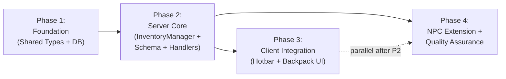
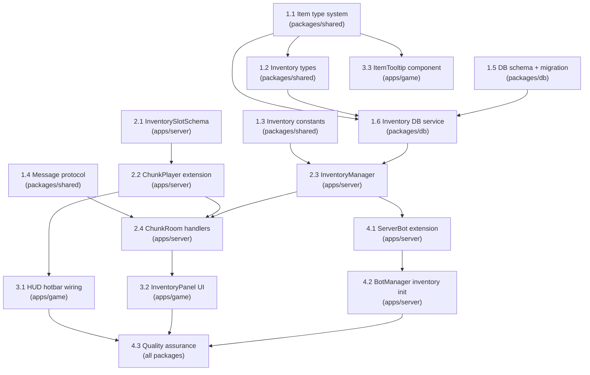

# Work Plan: Item & Inventory System Implementation

Created Date: 2026-03-15
Type: feature
Estimated Duration: 4-5 days
Estimated Impact: 19 files (9 new, 10 modified)
Related Issue/PR: N/A

## Related Documents
- Design Doc: [docs/design/design-025-item-inventory-system.md](../design/design-025-item-inventory-system.md)
- ADR: [docs/adr/ADR-0018-inventory-system-architecture.md](../adr/ADR-0018-inventory-system-architecture.md)
- Game Design Spec: [docs/documentation/plans/plan-item-inventory.md](../documentation/plans/plan-item-inventory.md)

## Objective

Implement the universal Item & Inventory system that gives players and NPCs the ability to carry, manage, and display items. The system uses a hybrid synchronization strategy: hotbar slots (1-10) sync via Colyseus Schema for real-time visibility to all room clients; backpack slots (11-20+) sync via explicit request/response messages (unicast to the owning client). Item definitions are static TypeScript constants in the shared package. Each inventory slot tracks item ownership independently.

## Background

The game client has a Hotbar UI with 10 empty slots (`Array(10).fill(null)` in `HUD.tsx`). Players and NPCs have no concept of items, tools, or carried objects. The NPC bot system is operational with `BotManager` managing bot lifecycle, but bots carry no items despite having roles (farmer, baker) that imply tool/material usage. This feature fills that gap by providing a data model and sync pipeline across all 4 packages (shared, db, server, game).

## Risks and Countermeasures

### Technical Risks
- **Risk**: Colyseus Schema 64-field limit exceeded on ChunkPlayer
  - **Impact**: Schema fails to compile or sync; players cannot see hotbar items
  - **Countermeasure**: InventorySlotSchema uses 6 fields per nested schema. Nested schemas count separately from the parent. ChunkPlayer adds 1 ArraySchema reference field (7 total, well under 64). Monitor with `console.log(ChunkPlayer._definition)` during development.

- **Risk**: Race conditions on concurrent NPC inventory mutations (two clients interacting with same NPC)
  - **Impact**: Item duplication or loss
  - **Countermeasure**: InventoryManager operations are synchronous per inventory (in-memory Map). For MVP, Colyseus message handlers are inherently sequential per room (single-threaded event loop), so no mutex is needed. Document the constraint for future multi-room scenarios.

- **Risk**: DB save failure on player leave loses inventory state
  - **Impact**: Player loses items between sessions
  - **Countermeasure**: Log error and do not block leave. This is acceptable for MVP. Future: add periodic auto-save (like existing 30s position auto-save).

- **Risk**: Item sprite coordinates are placeholder values
  - **Impact**: Items render with wrong or missing icons
  - **Countermeasure**: Use placeholder `[0,0,16,16]` coordinates initially. Sprites will be updated when the item sprite sheet is created (out of scope for this plan).

### Schedule Risks
- **Risk**: Drizzle ORM migration complexity for new tables + enum
  - **Impact**: Adds half-day if migration tooling has issues
  - **Countermeasure**: Test migration against local dev DB early in Phase 2. The `ownerTypeEnum` pgEnum is the only new enum.

## Phase Structure Diagram



## Task Dependency Diagram



## Implementation Phases

### Phase 1: Foundation -- Shared Types + DB Schema (Estimated commits: 3-4)

**Purpose**: Establish the leaf dependencies that all other packages consume: item type definitions, inventory types, message protocol extensions, DB tables, and DB service functions. This phase has zero integration risk because it only adds new files and extends existing const objects.

**AC Coverage**: FR-1 (item type system), FR-2 partial (DB tables for persistence), FR-4 partial (message types), FR-7 partial (ownership types)

#### Tasks

- [x] **Task 1.1**: Create item type system (`packages/shared/src/types/item.ts`)
  - **Files**: `packages/shared/src/types/item.ts` (new), `packages/shared/src/index.ts` (modify)
  - **Dependencies**: None (leaf module)
  - **Work**:
    - Define `ITEM_CATEGORIES` array (`tool`, `seed`, `crop`, `material`, `consumable`, `gift`, `special`) as `const`
    - Define `ItemCategory` type from the const array
    - Define `ITEM_TYPES` object mapping each category to its item type strings, using `as const satisfies Record<ItemCategory, readonly string[]>` (follow `GAME_OBJECT_TYPES` pattern)
    - Define `ItemType<C>` generic type
    - Define `ItemDefinition` interface: `{ itemType, displayName, category, stackable, maxStack, spriteRect, description }`
    - Define `ITEM_DEFINITIONS` registry with seed items: `hoe`, `watering_can`, `sickle`, `seed_radish`, `seed_potato`, `radish`, `potato`, `wood`, `stone`, `bouquet_mixed`, `town_key` (representative set from each category)
    - Implement type guards: `isItemCategory()`, `isItemType()`, `getItemDefinition()`
    - Add exports to `packages/shared/src/index.ts`
  - **Acceptance Criteria**:
    - `ITEM_CATEGORIES` includes all 7 categories from game design spec
    - `isItemCategory('tool')` returns `true`; `isItemCategory('invalid')` returns `false`
    - `getItemDefinition('hoe')` returns a valid `ItemDefinition`
    - TypeScript compiler enforces type safety on both client and server (AC: FR-1)

- [x] **Task 1.2**: Create inventory types (`packages/shared/src/types/inventory.ts`)
  - **Files**: `packages/shared/src/types/inventory.ts` (new), `packages/shared/src/index.ts` (modify)
  - **Dependencies**: Task 1.1 (uses `ItemCategory`)
  - **Work**:
    - Define `OwnerType = 'player' | 'npc'` type
    - Define `InventorySlotData` interface: `{ slotIndex, itemType, quantity, ownedByType, ownedById }`
    - Define `InventoryData` interface: `{ inventoryId, maxSlots, slots }`
    - Define message payloads: `InventoryMovePayload`, `InventoryAddPayload`, `InventoryDropPayload`, `InventoryUpdatePayload`
    - Add exports to shared index
  - **Acceptance Criteria**:
    - All payload types are importable from `@nookstead/shared` on both client and server
    - `OwnerType` discriminator supports `'player'` and `'npc'` (AC: FR-7 partial)

- [x] **Task 1.3**: Add inventory constants (`packages/shared/src/constants.ts`)
  - **Files**: `packages/shared/src/constants.ts` (modify), `packages/shared/src/index.ts` (modify)
  - **Dependencies**: None
  - **Work**:
    - Add `DEFAULT_PLAYER_INVENTORY_SIZE = 20`
    - Add `HOTBAR_SLOT_COUNT = 10`
    - Add `DEFAULT_NPC_INVENTORY_SIZE = 10`
    - Add `MAX_INVENTORY_SIZE = 40`
    - Export all from shared index
  - **Acceptance Criteria**:
    - Constants are importable from `@nookstead/shared`
    - `HOTBAR_SLOT_COUNT` equals 10 (matches game design: slots 1-10)

- [x] **Task 1.4**: Extend message protocol (`packages/shared/src/types/messages.ts`)
  - **Files**: `packages/shared/src/types/messages.ts` (modify), `packages/shared/src/index.ts` (modify)
  - **Dependencies**: None
  - **Work**:
    - Add to `ClientMessage`: `INVENTORY_REQUEST`, `INVENTORY_MOVE`, `INVENTORY_ADD`, `INVENTORY_DROP`
    - Add to `ServerMessage`: `INVENTORY_DATA`, `INVENTORY_UPDATE`, `INVENTORY_ERROR`
    - Export new message payload types from shared index
  - **Acceptance Criteria**:
    - `ClientMessage.INVENTORY_REQUEST` resolves to `'inventory_request'`
    - `ServerMessage.INVENTORY_DATA` resolves to `'inventory_data'`
    - Existing message entries are unchanged (AC: FR-4 partial)

- [x] **Task 1.5**: Create DB schema and migration (`packages/db`)
  - **Files**: `packages/db/src/schema/inventories.ts` (new), `packages/db/src/schema/inventory-slots.ts` (new), `packages/db/src/schema/index.ts` (modify)
  - **Dependencies**: None (independent of shared types at DB layer)
  - **Work**:
    - Create `ownerTypeEnum` pgEnum with values `['player', 'npc']`
    - Create `inventories` table: `id` (UUID PK), `ownerType`, `ownerId` (UUID), `maxSlots` (int, default 20), `createdAt`, `updatedAt` with unique index on `(ownerType, ownerId)`
    - Create `inventorySlots` table: `id` (UUID PK), `inventoryId` (FK to inventories with cascade delete), `slotIndex` (smallint), `itemType` (varchar(64), nullable), `quantity` (int, default 0), `ownedByType` (ownerTypeEnum, nullable), `ownedById` (UUID, nullable), `createdAt`, `updatedAt` with unique index on `(inventoryId, slotIndex)`
    - Export table types: `Inventory`, `NewInventory`, `InventorySlot`, `NewInventorySlot`
    - Add exports to `packages/db/src/schema/index.ts`
    - Generate and run Drizzle migration
  - **Acceptance Criteria**:
    - Migration creates both tables successfully on local dev DB
    - Unique constraint prevents duplicate `(ownerType, ownerId)` rows
    - Unique constraint prevents duplicate `(inventoryId, slotIndex)` rows
    - Cascade delete removes slots when inventory is deleted (AC: FR-2 partial)

- [x] **Task 1.6**: Create inventory DB service (`packages/db/src/services/inventory.ts`)
  - **Files**: `packages/db/src/services/inventory.ts` (new), `packages/db/src/services/inventory.spec.ts` (new), `packages/db/src/index.ts` (modify)
  - **Dependencies**: Task 1.1 (item type references), Task 1.2 (OwnerType), Task 1.5 (DB schema)
  - **Work**:
    - Implement `createInventory(db, { ownerType, ownerId, maxSlots? })` -- creates inventory row + N empty slot rows in a transaction
    - Implement `loadInventory(db, ownerType, ownerId)` -- returns `{ inventory, slots }` or `null`
    - Implement `saveSlots(db, updates[])` -- batch updates slot contents (itemType, quantity, ownedByType, ownedById)
    - Implement `findEmptySlot(db, inventoryId, startIndex?)` -- finds first slot where `itemType IS NULL`
    - Implement `deleteInventory(db, inventoryId)` -- cascade deletes inventory and slots
    - Follow `(db: DrizzleClient, ...) => Promise<T>` pattern from existing services
    - Write unit tests for all functions (mock DB or test DB)
    - Export all functions from `packages/db/src/index.ts`
  - **Acceptance Criteria**:
    - `createInventory` returns an `Inventory` with `maxSlots` empty slot rows
    - `loadInventory` returns all slots ordered by `slotIndex`
    - `saveSlots` persists changes to specified slots
    - All tests pass
    - Errors propagate (fail-fast, no silent fallbacks) (AC: FR-2 partial)

- [ ] Quality check: `pnpm nx typecheck shared && pnpm nx lint shared && pnpm nx typecheck db && pnpm nx lint db`
- [ ] Unit tests: `pnpm nx test db` -- inventory service tests pass

#### Phase 1 Completion Criteria
- [ ] All 7 item categories defined with `as const` pattern matching `GAME_OBJECT_TYPES`
- [ ] Type guards pass for valid categories/types, reject invalid strings
- [ ] DB migration runs successfully, tables created with correct constraints
- [ ] Inventory service CRUD functions work end-to-end against test DB
- [ ] All exports available from `@nookstead/shared` and `@nookstead/db`
- [ ] `pnpm nx run-many -t typecheck lint test -p shared db` passes clean

#### Operational Verification Procedures
1. Import `ITEM_CATEGORIES`, `isItemCategory`, `getItemDefinition` in a scratch file -- verify compile-time types resolve
2. Run Drizzle migration against local PostgreSQL: `pnpm nx generate db` then apply
3. Manually insert an inventory with slots via `psql`; verify unique constraints fire on duplicates
4. Run `pnpm nx test db` -- all inventory service tests green

---

### Phase 2: Server Core -- InventoryManager + Schema + Message Handlers (Estimated commits: 4-5)

**Purpose**: Build the server-side inventory engine. The `InventoryManager` manages in-memory state and produces update arrays (following the `BotManager` decoupling pattern). `InventorySlotSchema` extends `ChunkPlayer` for hotbar sync. `ChunkRoom` registers message handlers for backpack operations. After this phase, the server is fully functional -- a connected client (or test harness) can create, load, move, add, and drop items.

**AC Coverage**: FR-2 (persistence on join/leave), FR-3 (hotbar schema sync), FR-4 (backpack messages), FR-5 (stacking), FR-6 (slot operations), FR-7 (ownership tracking)

#### Tasks

- [x] **Task 2.1**: Create InventorySlotSchema (`apps/server/src/rooms/InventorySlotSchema.ts`)
  - **Files**: `apps/server/src/rooms/InventorySlotSchema.ts` (new)
  - **Dependencies**: Phase 1 complete
  - **Work**:
    - Define Colyseus `Schema` class with `@type` decorators: `itemType` (string, default `''`), `quantity` (int16, default 0), `spriteX` (int16), `spriteY` (int16), `spriteW` (int8, default 16), `spriteH` (int8, default 16)
    - Empty string for `itemType` represents an empty slot (Colyseus Schema does not support null strings)
  - **Acceptance Criteria**:
    - Schema class compiles with `@colyseus/schema` decorators
    - Default values produce a valid "empty slot" representation
    - Total fields per nested schema = 6 (well within budget)

- [x] **Task 2.2**: Extend ChunkPlayer with hotbar ArraySchema (`apps/server/src/rooms/ChunkRoomState.ts`)
  - **Files**: `apps/server/src/rooms/ChunkRoomState.ts` (modify)
  - **Dependencies**: Task 2.1
  - **Work**:
    - Import `ArraySchema` from `@colyseus/schema` and `InventorySlotSchema`
    - Add `@type([InventorySlotSchema]) hotbar = new ArraySchema<InventorySlotSchema>()` field to `ChunkPlayer`
    - Initialize hotbar with 10 empty `InventorySlotSchema` instances in the constructor or at field level
  - **Acceptance Criteria**:
    - `ChunkPlayer` now has 7 top-level fields (6 existing + 1 hotbar ArraySchema reference)
    - Existing player sync (position, direction, skin, name) still works
    - Hotbar array has exactly 10 elements after construction (AC: FR-3 partial)

- [x] **Task 2.3**: Implement InventoryManager (`apps/server/src/inventory/InventoryManager.ts`)
  - **Files**: `apps/server/src/inventory/InventoryManager.ts` (new), `apps/server/src/inventory/InventoryManager.spec.ts` (new), `apps/server/src/inventory/index.ts` (new)
  - **Dependencies**: Task 1.6 (DB service), Task 1.1 (item definitions), Task 1.3 (constants)
  - **Work**:
    - Define `RuntimeInventory` internal type: `{ inventoryId, ownerType, ownerId, maxSlots, slots: RuntimeSlot[] }`
    - Define `RuntimeSlot` internal type: `{ slotIndex, itemType, quantity, ownedByType, ownedById, dirty }`
    - Define `InventoryOperationResult`: `{ success, error?, changedSlots, hotbarChanged }`
    - Implement `initInventory(db, ownerType, ownerId, maxSlots?)` -- load from DB or create new; cache in memory Map
    - Implement `getHotbarSlots(inventoryId)` -- return slots 0-9 as `InventorySlotData[]`
    - Implement `getBackpackSlots(inventoryId)` -- return slots 10+ as `InventorySlotData[]`
    - Implement `moveSlot(inventoryId, fromSlot, toSlot, quantity?)` -- validate, execute swap/move/merge/split
    - Implement `addItem(inventoryId, itemType, quantity, ownership?, targetSlot?)` -- validate item exists in `ITEM_DEFINITIONS`, find slot (stack or empty), respect `maxStack`
    - Implement `dropItem(inventoryId, slotIndex, quantity?)` -- remove items from slot
    - Implement `saveInventory(db, inventoryId)` -- persist dirty slots via `saveSlots` DB service
    - Implement `unloadInventory(inventoryId)` -- remove from memory
    - Stacking logic per Design Doc algorithm:
      1. Find existing slot with same itemType where quantity < maxStack
      2. Add min(quantity, maxStack - existingQuantity)
      3. Overflow to next empty slot (recurse)
      4. If no empty slot: return `{ success: false, error: 'Inventory full' }`
    - Move logic per Design Doc:
      - Both/source empty: no-op
      - Dest empty: move source to dest
      - Same stackable type: merge up to maxStack, remainder stays in source
      - Different type or non-stackable: swap
    - Write comprehensive unit tests covering: add to empty, add with stacking, add overflow, add to full inventory, move to empty, swap different types, merge same type, split stack, drop partial, drop all, invalid slot index, invalid item type, ownership preservation
  - **Acceptance Criteria**:
    - `addItem` with stackable items merges into existing stacks before using empty slots (AC: FR-5)
    - `moveSlot` swaps contents when both slots occupied with different types (AC: FR-6)
    - `moveSlot` merges stacks when same stackable type (AC: FR-6)
    - Overflow to next empty slot when stack is full (AC: FR-5)
    - Returns `{ success: false }` when inventory is full (AC: FR-5)
    - `hotbarChanged` flag is true when slots 0-9 are affected
    - Ownership fields default to inventory owner when not specified (AC: FR-7)
    - Explicit ownership params override defaults (AC: FR-7)
    - Total item count is conserved across move/swap operations (system invariant)
    - All unit tests pass

- [x] **Task 2.4**: Wire InventoryManager into ChunkRoom (`apps/server/src/rooms/ChunkRoom.ts`)
  - **Files**: `apps/server/src/rooms/ChunkRoom.ts` (modify)
  - **Dependencies**: Task 2.2 (schema extension), Task 2.3 (InventoryManager), Task 1.4 (message types)
  - **Work**:
    - Import `InventoryManager`, new message types, and `InventorySlotSchema`
    - Add `inventoryManager: InventoryManager` field to ChunkRoom
    - Instantiate in `onCreate()`
    - **onJoin**: After existing player setup, call `inventoryManager.initInventory(db, 'player', userId)`. Populate `ChunkPlayer.hotbar` ArraySchema from `getHotbarSlots()`. Map each slot's `itemType` to sprite coords via `getItemDefinition()`.
    - **onLeave**: After existing position save, call `inventoryManager.saveInventory(db, inventoryId)` then `unloadInventory(inventoryId)`. Wrap in try/catch -- log error but do not block leave.
    - **Register message handlers in onCreate**:
      - `INVENTORY_REQUEST`: Call `getBackpackSlots()`, respond with `INVENTORY_DATA` via `client.send()`
      - `INVENTORY_MOVE`: Call `moveSlot()`, if `hotbarChanged` update `ChunkPlayer.hotbar` schema, respond with `INVENTORY_UPDATE` via `client.send()`, persist dirty slots
      - `INVENTORY_ADD`: Call `addItem()`, handle schema + persistence (debug/admin use)
      - `INVENTORY_DROP`: Call `dropItem()`, handle schema + persistence
    - **Helper**: Create `syncHotbarToSchema(player: ChunkPlayer, slots: InventorySlotData[])` function to map InventorySlotData to InventorySlotSchema fields
    - Add logging for all inventory operations per Design Doc logging spec
  - **Acceptance Criteria**:
    - Player join creates/loads inventory and populates hotbar schema (AC: FR-2, FR-3)
    - Player leave persists inventory to DB (AC: FR-2)
    - `INVENTORY_REQUEST` returns backpack slots to requesting client only (unicast) (AC: FR-4)
    - `INVENTORY_MOVE` validates, mutates, syncs schema if hotbar affected, persists, responds (AC: FR-4, FR-6)
    - `INVENTORY_ADD` and `INVENTORY_DROP` work end-to-end
    - Invalid operations return `INVENTORY_ERROR` message (AC: FR-4)
    - Existing message handlers (MOVE, NPC_INTERACT, DIALOGUE_*) continue to work
    - Server starts without errors

- [ ] Quality check: `pnpm nx typecheck server && pnpm nx lint server`
- [ ] Unit tests: `pnpm nx test server` -- InventoryManager tests pass, existing ChunkRoom tests pass

#### Phase 2 Completion Criteria
- [ ] InventoryManager unit tests cover: add, stack, overflow, full, move, swap, merge, split, drop, ownership, validation errors
- [ ] ChunkPlayer schema includes hotbar ArraySchema with 10 slots
- [ ] Server starts and player join creates inventory + populates hotbar schema
- [ ] All 4 inventory message handlers registered and functional
- [ ] Existing player/bot systems unaffected (movement, dialogue, bot wandering)
- [ ] `pnpm nx run-many -t typecheck lint test -p server` passes clean

#### Operational Verification Procedures
1. Start server locally: `pnpm nx dev server`
2. Connect a test client (or use Colyseus playground): verify player join logs `[Inventory] Created` or `[Inventory] Loaded`
3. Send `INVENTORY_ADD` message with `{ itemType: 'hoe', quantity: 1 }` -- verify server logs `[Inventory] Add` and hotbar schema updates
4. Send `INVENTORY_REQUEST` -- verify server responds with `INVENTORY_DATA` containing backpack slots
5. Send `INVENTORY_MOVE` from hotbar to backpack -- verify server logs, schema update, and client receives `INVENTORY_UPDATE`
6. Disconnect and reconnect -- verify inventory is restored from DB
7. Verify `pnpm nx test server` passes (all existing + new tests green)

---

### Phase 3: Client Integration -- Hotbar Wiring + InventoryPanel + Tooltip (Estimated commits: 3-4)

**Purpose**: Replace the placeholder hotbar data with real Colyseus state. Add the backpack/inventory panel UI and item tooltips. After this phase, the full player-facing inventory experience is functional.

**AC Coverage**: FR-9 (hotbar wiring), FR-4 (backpack UI consumer)

#### Tasks

- [x] **Task 3.1**: Wire HUD hotbar to Colyseus state (`apps/game/src/components/hud/HUD.tsx`)
  - **Files**: `apps/game/src/components/hud/HUD.tsx` (modify)
  - **Dependencies**: Task 2.2 (ChunkPlayer has hotbar schema)
  - **Work**:
    - Replace `const [hotbarItems] = useState(DEFAULT_HUD_STATE.hotbarItems)` with a Colyseus state listener
    - On room connection, read `room.state.players[sessionId].hotbar` and map each `InventorySlotSchema` to `HotbarItem | null`:
      - If `slot.itemType === ''` -> `null` (empty slot)
      - Otherwise -> `{ id: slot.itemType, spriteRect: [slot.spriteX, slot.spriteY, slot.spriteW, slot.spriteH], quantity: slot.quantity }`
    - Subscribe to hotbar `onChange` events to update React state when server pushes schema patches
    - Import `ITEM_DEFINITIONS` and `getItemDefinition` from `@nookstead/shared` for tooltip data (used in Task 3.3)
    - Preserve existing keyboard slot selection (1-0 keys) and `EventBus.emit('hud:select-slot')` behavior
  - **Acceptance Criteria**:
    - Hotbar renders items from Colyseus state, not placeholder data (AC: FR-9)
    - Empty slots render correctly (no icon, no quantity)
    - Hotbar re-renders within one Colyseus patch cycle (~100ms) when server updates a slot (AC: FR-9)
    - Keyboard slot selection (1-0) still works
    - Slot click still works (`EventBus.emit('hud:select-slot')`)

- [x] **Task 3.2**: Create InventoryPanel UI (`apps/game/src/components/hud/InventoryPanel.tsx`)
  - **Files**: `apps/game/src/components/hud/InventoryPanel.tsx` (new), `apps/game/src/components/hud/HUD.tsx` (modify)
  - **Dependencies**: Task 2.4 (message handlers exist on server), Task 1.4 (message types)
  - **Work**:
    - Create `InventoryPanel` component: a modal/panel that opens on `E` or `I` keypress
    - On open: send `INVENTORY_REQUEST` via `room.send()`, listen for `INVENTORY_DATA` response
    - Render backpack as 5x2 grid of slots (slots 10-19, 0-based)
    - Display hotbar slots (0-9) below the backpack grid for unified view
    - Click on a slot: send `INVENTORY_MOVE` to swap between hotbar and backpack (game design: click in backpack moves to first free hotbar slot, and vice versa)
    - Listen for `INVENTORY_UPDATE` responses to refresh display
    - Handle `INVENTORY_ERROR` with visual feedback (e.g., flash slot red)
    - Close on `E`/`I`/`Esc` keypress or close button
    - Integrate into `HUD.tsx` -- add state for inventory panel open/close
    - When panel is open, emit `EventBus.emit('dialogue:lock-movement')` to prevent walking
    - On close, emit `EventBus.emit('dialogue:unlock-movement')`
  - **Acceptance Criteria**:
    - Panel opens on `E`/`I` and closes on `E`/`I`/`Esc`
    - Backpack slots display correct items from server response
    - Click-to-move items between hotbar and backpack works
    - Movement is locked while panel is open
    - Error responses are handled gracefully

- [x] **Task 3.3**: Create ItemTooltip component (`apps/game/src/components/hud/ItemTooltip.tsx`)
  - **Files**: `apps/game/src/components/hud/ItemTooltip.tsx` (new), `apps/game/src/components/hud/HotbarSlot.tsx` (modify), `apps/game/src/components/hud/InventoryPanel.tsx` (modify)
  - **Dependencies**: Task 1.1 (item definitions for display data)
  - **Work**:
    - Create `ItemTooltip` component that displays on hover over any slot with an item
    - Look up item data from `ITEM_DEFINITIONS[itemType]` for: display name, category, description
    - Show: item name, category badge (color-coded), description, sell price if applicable
    - Position tooltip relative to the hovered slot (above for hotbar, beside for backpack)
    - Integrate with `HotbarSlot.tsx` and `InventoryPanel.tsx` slots
  - **Acceptance Criteria**:
    - Tooltip appears on hover over occupied slots
    - Tooltip shows correct item name, category, and description from `ITEM_DEFINITIONS`
    - Tooltip disappears when cursor leaves the slot
    - Empty slots do not show tooltips

- [ ] Quality check: `pnpm nx typecheck game && pnpm nx lint game`
- [ ] Visual verification: Start game client, verify hotbar displays items, inventory panel opens/closes

#### Phase 3 Completion Criteria
- [ ] Hotbar displays items from Colyseus state (no more `Array(10).fill(null)`)
- [ ] Inventory panel opens/closes with keyboard shortcuts
- [ ] Click-to-move items between hotbar and backpack functional
- [ ] Tooltips display item information on hover
- [ ] Movement locked while inventory panel is open
- [ ] All existing HUD functionality preserved (settings modal, chat modal, keyboard shortcuts)
- [ ] `pnpm nx run-many -t typecheck lint -p game` passes clean

#### Operational Verification Procedures
1. Start full stack (server + client): `pnpm nx dev server` and `pnpm nx dev game`
2. Log in and enter the game world
3. Verify hotbar shows items (if player has items from Phase 2 testing; otherwise use admin INVENTORY_ADD)
4. Press `E` -- verify inventory panel opens showing backpack grid
5. Click an item in hotbar -- verify it moves to backpack (or vice versa)
6. Hover over an occupied slot -- verify tooltip shows item name and description
7. Press `Esc` -- verify panel closes and movement unlocks
8. Verify keyboard slot selection (1-0) still works on hotbar
9. Verify chat modal still opens/closes correctly (no regression)

---

### Phase 4: NPC Extension + Quality Assurance (Estimated commits: 3-4)

**Purpose**: Extend the inventory system to NPCs via BotManager. Initialize NPC inventories with role-appropriate starting items on bot creation. Verify the complete system against all acceptance criteria. Run full quality checks.

**AC Coverage**: FR-8 (NPC inventory initialization), FR-7 (NPC ownership semantics), all AC verification

#### Tasks

- [x] **Task 4.1**: Extend ServerBot with inventory reference (`apps/server/src/npc-service/types/bot-types.ts`)
  - **Files**: `apps/server/src/npc-service/types/bot-types.ts` (modify)
  - **Dependencies**: Task 2.3 (InventoryManager exists)
  - **Work**:
    - Add optional `inventoryId: string | null` field to `ServerBot` interface
    - Update `createServerBot()` factory to set `inventoryId: null` (will be populated by BotManager)
  - **Acceptance Criteria**:
    - `ServerBot` has `inventoryId` field
    - Existing bot creation still works (field defaults to null)
    - No changes to `BotUpdate` or `ChunkBot` schema (NPC hotbar is not synced to clients in MVP)

- [x] **Task 4.2**: Initialize NPC inventories in BotManager (`apps/server/src/npc-service/lifecycle/BotManager.ts`)
  - **Files**: `apps/server/src/npc-service/lifecycle/BotManager.ts` (modify), `apps/server/src/npc-service/lifecycle/BotManager.spec.ts` (modify)
  - **Dependencies**: Task 4.1 (ServerBot has inventoryId), Task 2.3 (InventoryManager)
  - **Work**:
    - Accept `InventoryManager` as a constructor parameter or via a setter (follows existing dependency injection pattern)
    - In `init()` (or `addBot()`), after creating `ServerBot`: call `inventoryManager.initInventory(db, 'npc', botId, DEFAULT_NPC_INVENTORY_SIZE)`
    - Store returned `inventoryId` on `ServerBot`
    - Define NPC role-to-starting-items mapping:
      ```
      farmer: [{ itemType: 'hoe', qty: 1 }, { itemType: 'watering_can', qty: 1 }, { itemType: 'sickle', qty: 1 }]
      baker: [{ itemType: 'wood', qty: 5 }]
      default: [] (empty inventory)
      ```
    - Call `inventoryManager.addItem()` for each starting item with ownership `{ type: 'npc', id: botId }`
    - On bot despawn/cleanup: call `inventoryManager.saveInventory()` then `unloadInventory()`
    - Update BotManager tests to mock InventoryManager
  - **Acceptance Criteria**:
    - NPC bots created with role `farmer` have hoe, watering_can, sickle in inventory (AC: FR-8)
    - NPC inventory items have `ownedByType: 'npc'`, `ownedById: botId` by default (AC: FR-7)
    - NPC inventories persist across room lifecycle (load on spawn, save on despawn) (AC: FR-8)
    - Existing bot movement, dialogue, and pathfinding unaffected
    - BotManager tests pass with mocked InventoryManager

- [ ] **Task 4.3**: Final quality assurance and acceptance verification
  - **Files**: All packages
  - **Dependencies**: All previous tasks
  - **Work**:
    - Run full quality checks across all packages:
      - `pnpm nx run-many -t typecheck lint test -p shared db server game`
    - Verify all Design Doc acceptance criteria (FR-1 through FR-9) -- checklist below
    - Verify existing systems are not broken:
      - Player movement works
      - NPC dialogue works
      - Bot pathfinding/wandering works
      - Chat modal works
      - Game clock works
    - Schema field count verification: log `ChunkPlayer` schema definition and count top-level fields
    - Test reconnection: disconnect player, reconnect, verify inventory restored from DB
    - Clean up any TODO/FIXME comments added during development
    - Update `packages/shared/src/index.ts` and `packages/db/src/index.ts` for completeness
  - **Acceptance Criteria** (all Design Doc AC):
    - [ ] FR-1: Item categories defined as TypeScript constants; type guards work; compile-time type checking on both client and server
    - [ ] FR-2: Player join creates/loads inventory; NPC bot creation creates inventory; inventory changes persist to DB
    - [ ] FR-3: Hotbar changes broadcast to all clients via Schema patching; new players receive existing hotbar data; reconnect restores hotbar
    - [ ] FR-4: `INVENTORY_REQUEST` returns backpack; `INVENTORY_MOVE` validates and responds with `INVENTORY_UPDATE`; failures return `INVENTORY_ERROR`
    - [ ] FR-5: Items stack up to maxStack; overflow goes to next empty slot; full inventory rejects with error
    - [ ] FR-6: Move to empty slot works; swap between occupied slots works; merge same stackable type works
    - [ ] FR-7: Slots have `ownedByType`/`ownedById`; explicit ownership overrides defaults; defaults to inventory holder
    - [ ] FR-8: NPC bots get role-appropriate starting items; NPC inventories persist across room lifecycle
    - [ ] FR-9: Hotbar component displays items from Colyseus state; re-renders within patch cycle

- [ ] Quality check: `pnpm nx run-many -t typecheck lint test build -p shared db server game`

#### Phase 4 Completion Criteria
- [ ] All FR-1 through FR-9 acceptance criteria verified
- [ ] All tests pass across all packages
- [ ] TypeScript type checking passes with zero errors
- [ ] ESLint passes with zero errors
- [ ] Build succeeds for all packages
- [ ] Existing systems verified working (movement, dialogue, bots, clock)
- [ ] Schema field count logged and confirmed under 64

#### Operational Verification Procedures
1. Start full stack and create a new player -- verify inventory created with 20 empty slots
2. Use admin `INVENTORY_ADD` to add items to hotbar -- verify all room clients see the hotbar update
3. Open inventory panel, move items between hotbar and backpack -- verify server validates and responds
4. Add 99 of a stackable item, then add 1 more -- verify overflow to next slot
5. Fill all 20 slots, then try to add another item -- verify "inventory full" error
6. Verify NPC bots have role-appropriate items in their inventories (check server logs)
7. Disconnect and reconnect -- verify player inventory is restored identically
8. Run `pnpm nx run-many -t typecheck lint test build -p shared db server game` -- all green
9. Verify player movement, NPC dialogue, bot wandering, and game clock are unaffected

---

## Files Impact Summary

### New Files (8)
| File | Phase | Description |
|------|-------|-------------|
| `packages/shared/src/types/item.ts` | 1 | Item categories, types, definitions, type guards |
| `packages/shared/src/types/inventory.ts` | 1 | Inventory and slot types, message payloads |
| `packages/db/src/schema/inventories.ts` | 1 | Inventories table schema |
| `packages/db/src/schema/inventory-slots.ts` | 1 | Inventory slots table schema |
| `packages/db/src/services/inventory.ts` | 1 | Inventory DB service functions |
| `apps/server/src/rooms/InventorySlotSchema.ts` | 2 | Colyseus schema for hotbar slots |
| `apps/server/src/inventory/InventoryManager.ts` | 2 | Server-side inventory logic |
| `apps/game/src/components/hud/InventoryPanel.tsx` | 3 | Backpack grid UI |
| `apps/game/src/components/hud/ItemTooltip.tsx` | 3 | Item hover tooltip |

### Modified Files (9)
| File | Phase | Change |
|------|-------|--------|
| `packages/shared/src/constants.ts` | 1 | Add inventory constants |
| `packages/shared/src/types/messages.ts` | 1 | Add inventory message types |
| `packages/shared/src/index.ts` | 1 | Export new types and constants |
| `packages/db/src/schema/index.ts` | 1 | Export new table schemas |
| `packages/db/src/index.ts` | 1 | Export new service functions |
| `apps/server/src/rooms/ChunkRoomState.ts` | 2 | Add hotbar ArraySchema to ChunkPlayer |
| `apps/server/src/rooms/ChunkRoom.ts` | 2 | Add InventoryManager + message handlers |
| `apps/game/src/components/hud/HUD.tsx` | 3 | Wire hotbar to Colyseus state |
| `apps/server/src/npc-service/types/bot-types.ts` | 4 | Add inventoryId to ServerBot |
| `apps/server/src/npc-service/lifecycle/BotManager.ts` | 4 | Initialize NPC inventories |

### Test Files (3 new)
| File | Phase | Coverage |
|------|-------|----------|
| `packages/db/src/services/inventory.spec.ts` | 1 | Inventory DB service functions |
| `apps/server/src/inventory/InventoryManager.spec.ts` | 2 | Stacking, moving, swapping, ownership, validation |
| `apps/server/src/npc-service/lifecycle/BotManager.spec.ts` | 4 | Updated with mocked InventoryManager |

## Completion Criteria
- [ ] All phases completed (Phase 1 through Phase 4)
- [ ] Each phase's operational verification procedures executed
- [ ] Design Doc acceptance criteria (FR-1 through FR-9) satisfied
- [ ] Staged quality checks completed (zero errors)
- [ ] All tests pass across shared, db, server, game packages
- [ ] Necessary documentation updated (shared index exports are complete)
- [ ] User review approval obtained

## Testing Strategy

| Test Type | Location | Coverage |
|-----------|----------|----------|
| Unit: Item type guards | `packages/shared` | `isItemCategory`, `isItemType`, `getItemDefinition` |
| Unit: DB service | `packages/db/src/services/inventory.spec.ts` | CRUD operations, constraint enforcement |
| Unit: InventoryManager | `apps/server/src/inventory/InventoryManager.spec.ts` | All slot operations, edge cases, validation |
| Integration: ChunkRoom | `apps/server/src/rooms/ChunkRoom.spec.ts` | Join/leave with inventory, message handler dispatch |
| Integration: BotManager | `apps/server/src/npc-service/lifecycle/BotManager.spec.ts` | Bot creation with inventory initialization |
| Manual: E2E | Full stack | Hotbar rendering, inventory panel, item moving, reconnect |

## Progress Tracking

### Phase 1: Foundation
- Start: ___
- Complete: ___
- Notes: ___

### Phase 2: Server Core
- Start: ___
- Complete: ___
- Notes: ___

### Phase 3: Client Integration
- Start: ___
- Complete: ___
- Notes: ___

### Phase 4: NPC Extension + QA
- Start: ___
- Complete: ___
- Notes: ___

## Notes

- Sprite coordinates in `ITEM_DEFINITIONS` are placeholders (`[0,0,16,16]`). They will be updated when the item sprite sheet is created (separate art task).
- The `consumable` item category is defined in the type system but no consumable items are included in the initial `ITEM_DEFINITIONS` registry. This is intentional -- the category exists for future use.
- NPC inventory contents are not synced to other clients in MVP (no ChunkBot schema extension). Only the NPC's own server-side inventory is populated. Future: sync equipped item for visual display.
- The `INVENTORY_ADD` message is intended for debug/admin use during development. In production, items will be added through game mechanics (farming, shopping, quest rewards).
- Currency (gold/coins) is out of scope. The `HUDState.gold` field and `HeaderState` remain unchanged.
