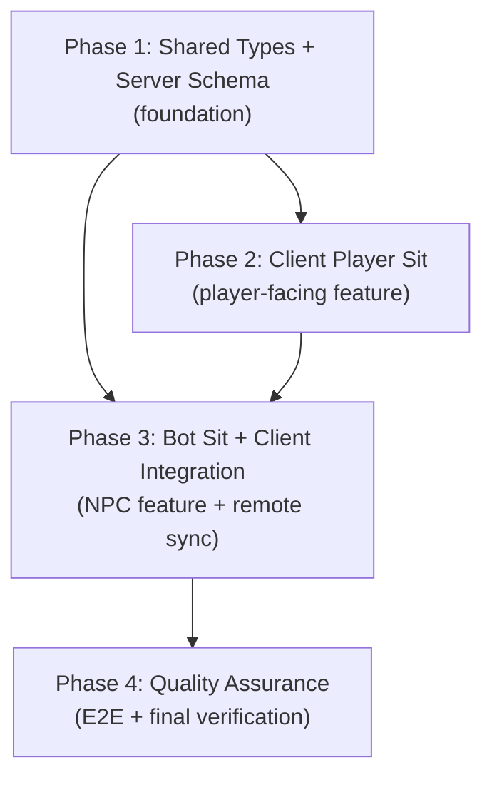
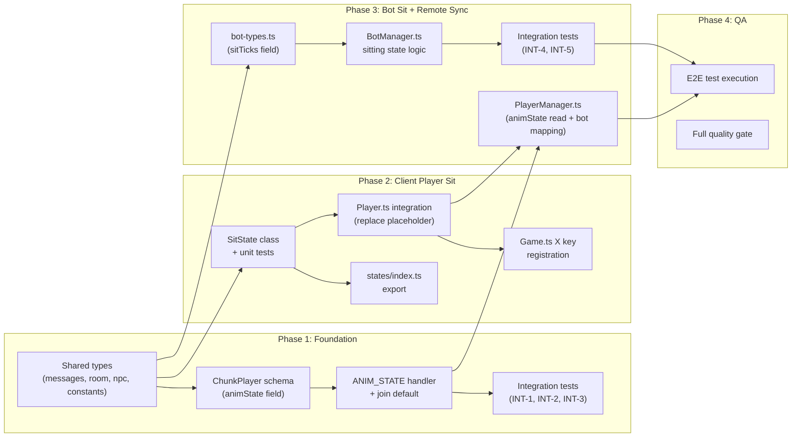

# Work Plan: Player + Bot Sit Action Implementation

Created Date: 2026-03-26
Type: feature
Estimated Duration: 2 days
Estimated Impact: 14 files (2 new, 12 modified)
Related Issue/PR: N/A

## Related Documents
- Design Doc: [docs/design/design-026-player-sit-action.md](../design/design-026-player-sit-action.md)
- ADR: [docs/adr/ADR-0019-player-animation-state-sync.md](../adr/ADR-0019-player-animation-state-sync.md) (Accepted)

## Objective

Add a sit action for players (X key toggle with auto-stand on movement) and autonomous sit behavior for NPC bots. Both animations are visible to all multiplayer clients via Colyseus schema sync, establishing the foundation for all future non-movement animation states.

## Background

Players currently have no way to perform non-movement actions visible to other players. Remote player animations are derived purely from position deltas in `PlayerManager.ts`, which fundamentally cannot represent stationary actions like sitting. ADR-0019 established schema-based `animState` sync (matching the existing `ChunkBot.state` pattern). The player's FSM currently uses a `createPlaceholderState('sit')` that plays the animation on enter but has no logic. This plan replaces the placeholder with a full implementation and extends bot behavior with autonomous sitting.

## Risks and Countermeasures

### Technical Risks
- **Risk**: Sit animation does not hold final frame (Phaser auto-resets to frame 0)
  - **Impact**: Player appears to flicker between sit and idle
  - **Countermeasure**: Phaser play-once animations (`repeat: 0`) naturally hold the last frame. Verify in SitState unit test.

- **Risk**: Remote animation flickers during rapid sit/stand toggle
  - **Impact**: Low -- cosmetic glitch for remote players
  - **Countermeasure**: Schema patches are atomic per field; one patch cycle resolves. Human input speed is well below patch rate.

- **Risk**: Schema addition breaks existing Colyseus serialization
  - **Impact**: High -- room state sync fails for all players
  - **Countermeasure**: Schema additions are backward-compatible in Colyseus. L3 build verification before proceeding.

- **Risk**: Bot sit randomness clusters (multiple bots sitting simultaneously)
  - **Impact**: Low -- visual oddity but not a bug
  - **Countermeasure**: Independent per-bot timers with random thresholds provide natural distribution.

### Schedule Risks
- **Risk**: Integration test setup complexity (ChunkRoom mocking pattern)
  - **Impact**: Could add 0.5 day to Phase 1
  - **Countermeasure**: Follow existing `bot-integration.spec.ts` mock structure. Test skeletons already generated.

## Testing Strategy

### Strategy Selection: TDD (test skeletons provided)

Test skeleton files were provided from the acceptance test generator. Integration tests are implemented alongside their corresponding phase. E2E tests execute only in the final phase.

### Test Skeleton Meta Information Summary

| Test ID | File | Category | Dependency | Complexity | ROI | Phase Placement |
|---------|------|----------|------------|------------|-----|-----------------|
| INT-1 | `player-sit-sync.integration.spec.ts` | integration | ChunkRoom, ChunkPlayer schema | medium | 82 | Phase 1 |
| INT-2 | `player-sit-sync.integration.spec.ts` | integration | ChunkRoom, VALID_ANIM_STATES | low | 68 | Phase 1 |
| INT-3 | `player-sit-sync.integration.spec.ts` | integration | ChunkRoom, onJoin handler | medium | 75 | Phase 1 |
| INT-4 | `bot-sit.integration.spec.ts` | integration | ChunkRoom, BotManager, BOT_SIT_* | high | 78 | Phase 3 |
| INT-5 | `bot-sit.integration.spec.ts` | integration | ChunkRoom, BotManager, interaction state | medium | 65 | Phase 3 |
| E2E-1 | `player-sit-action.spec.ts` | e2e | full-system | high | 88 | Phase 4 (execute only) |

### Cumulative Test Resolution Progress

| Phase | Unit Tests | Integration Tests | E2E Tests | Cumulative GREEN |
|-------|-----------|-------------------|-----------|-----------------|
| Phase 1 | 0 | 0/3 -> 3/3 | 0 | 3 |
| Phase 2 | 0 -> 10+ | 3/3 | 0 | 13+ |
| Phase 3 | 10+ -> 15+ | 3/5 -> 5/5 | 0 | 20+ |
| Phase 4 (QA) | 15+ | 5/5 | 0/1 -> 1/1 | 21+ |

## Phase Structure Diagram

## Task Dependency Diagram

## Implementation Phases

### Phase 1: Shared Types + Server Schema (Estimated commits: 1-2)

**Purpose**: Establish the shared contract layer and server-side infrastructure for `animState` sync. All downstream work (client, bot) depends on these types and the server being ready to receive/validate messages.

**AC Coverage**: AC-10 (server validation), AC-11 (join default), AC-12 (late-join sync)

#### Tasks

- [ ] **Task 1.1**: Add `ANIM_STATE` to `ClientMessage` and create `AnimStatePayload` interface in `packages/shared/src/types/messages.ts`
  - Add `ANIM_STATE: 'anim_state'` entry to `ClientMessage` const
  - Add `AnimStatePayload { animState: string }` interface
  - Verification: L3 (typecheck passes)

- [ ] **Task 1.2**: Add `animState: string` field to `PlayerState` interface in `packages/shared/src/types/room.ts`
  - Verification: L3 (typecheck passes)

- [ ] **Task 1.3**: Add `'sitting'` to `BotAnimState` union type in `packages/shared/src/types/npc.ts`
  - Verification: L3 (typecheck passes)

- [ ] **Task 1.4**: Add `BOT_SIT_*` timing constants to `packages/shared/src/constants.ts`
  - `BOT_SIT_CHANCE` (probability per idle tick check)
  - `BOT_SIT_MIN_IDLE_TICKS` / `BOT_SIT_MAX_IDLE_TICKS` (idle time before sit eligible)
  - `BOT_SIT_MIN_DURATION_TICKS` / `BOT_SIT_MAX_DURATION_TICKS` (sit duration range)
  - Verification: L3 (typecheck passes)

- [x] **Task 1.5**: Add `@type('string') animState` field to `ChunkPlayer` schema in `apps/server/src/rooms/ChunkRoomState.ts`
  - Mirrors existing `ChunkBot` `state` field pattern
  - Verification: L3 (server builds successfully)

- [ ] **Task 1.6**: Add `ANIM_STATE` message handler and join default in `apps/server/src/rooms/ChunkRoom.ts`
  - Register `onMessage(ClientMessage.ANIM_STATE, handler)` in `onCreate()`
  - Handler validates `animState` against `VALID_ANIM_STATES` set (`idle`, `walk`, `sit`)
  - On valid: update `chunkPlayer.animState`
  - On invalid: `console.warn` with sessionId and value, do not update schema (AC-10)
  - In `onJoin`: set `chunkPlayer.animState = 'idle'` (AC-11)
  - Verification: L3 (server builds successfully)

- [ ] **Task 1.7**: Implement integration tests (make `player-sit-sync.integration.spec.ts` GREEN)
  - Complete mock setup following `bot-integration.spec.ts` pattern
  - INT-1: Valid ANIM_STATE message updates ChunkPlayer.animState schema (AC-8, AC-9)
  - INT-2: Unknown animState rejected, schema unchanged, warning logged (AC-10)
  - INT-3: Late-join player gets idle default; existing seated player's state preserved (AC-11, AC-12)
  - Test resolution: 0/3 -> 3/3
  - Verification: L2 (all 3 integration tests pass)

- [ ] Quality check: `pnpm nx typecheck @nookstead/shared` and `pnpm nx typecheck server` pass

#### Phase Completion Criteria
- [ ] `ClientMessage.ANIM_STATE` and `AnimStatePayload` exported from shared package
- [ ] `PlayerState.animState` field present in shared types
- [ ] `BotAnimState` includes `'sitting'`
- [ ] `BOT_SIT_*` constants exported from shared package
- [ ] `ChunkPlayer` schema has `animState` field
- [ ] ANIM_STATE handler validates and updates schema
- [ ] Player join defaults `animState` to `'idle'`
- [ ] 3/3 integration tests GREEN (INT-1, INT-2, INT-3)
- [ ] Server and shared packages typecheck cleanly

#### Operational Verification Procedures
1. Run `pnpm nx typecheck @nookstead/shared` -- passes with no errors
2. Run `pnpm nx typecheck server` -- passes with no errors
3. Run `pnpm nx test server --testPathPattern=player-sit-sync` -- all 3 tests GREEN
4. Inspect `ChunkPlayer` schema to confirm `animState` field is `@type('string')`
5. Inspect `onJoin` handler to confirm `animState = 'idle'` initialization

---

### Phase 2: Client Player Sit (Estimated commits: 1-2)

**Purpose**: Implement the player-facing sit action: SitState FSM class, X key binding, Player.ts integration. After this phase, a local player can sit/stand but remote visibility is deferred to Phase 3.

**AC Coverage**: AC-1 (sit on X), AC-2 (stand on X), AC-3 (auto-stand on movement), AC-4 (auto-stand on click/waypoint), AC-5 (text input gate), AC-6 (walk state gate), AC-6a (movement lock gate), AC-7 (position blocked)

#### Tasks

- [ ] **Task 2.1**: Create `SitState` class in `apps/game/src/game/entities/states/SitState.ts`
  - Implements `State` interface with `name = 'sit'`
  - Constructor takes `PlayerContext` (same as IdleState/WalkState)
  - `enter()`: Play sit animation for current facing direction via `ctx.play()`; send `ANIM_STATE { animState: 'sit' }` to server via room
  - `update(delta)`:
    - Check `isTextInputFocused()` -- if true, ignore X key (AC-5)
    - Check X key `JustDown` -- if true, transition to idle (AC-2)
    - Check `ctx.inputController.isMoving()` -- if true, transition to walk (AC-3)
    - Check `ctx.moveTarget` or `ctx.waypoints.length > 0` -- if true, transition to walk (AC-4)
    - No position changes occur (AC-7)
  - `exit()`: Send `ANIM_STATE` with next state's animation value; clear any pending movement
  - Verification: L2 (unit tests pass)

- [ ] **Task 2.2**: Create `SitState.spec.ts` unit tests in `apps/game/src/game/entities/states/SitState.spec.ts`
  - Follow existing `WalkState.spec.ts` mock pattern (`PlayerContext` mock, `jest.mock` for modules)
  - Test cases:
    - `enter()` plays sit animation with correct direction key (AC-1)
    - `enter()` sends ANIM_STATE 'sit' to server
    - `update()` transitions to idle on X key press (AC-2)
    - `update()` transitions to walk on `isMoving()` true (AC-3)
    - `update()` transitions to walk on `moveTarget` set (AC-4)
    - `update()` transitions to walk on non-empty `waypoints` (AC-4)
    - `update()` ignores X key when `isTextInputFocused()` true (AC-5)
    - `update()` ignores X key when `isMovementLocked()` true (AC-6a)
    - `update()` does not call position-changing methods (AC-7)
    - `exit()` sends correct animState for the transition target
  - Test resolution: 0/10 -> 10/10
  - Verification: L2 (all unit tests pass)

- [x] **Task 2.3**: Replace placeholder sit state in `apps/game/src/game/entities/Player.ts`
  - Replace `this.createPlaceholderState('sit')` with `new SitState(this)` at line 110
  - Add `sendAnimState(state: string): void` method (sends `ANIM_STATE` message to room)
  - Import `SitState` from `./states`
  - Verification: L3 (typecheck passes)

- [x] **Task 2.4**: Register X key and sit trigger in `apps/game/src/game/scenes/Game.ts`
  - In `create()`: Register X key via `this.input.keyboard!.addKey('X')`
  - In `update()`: Add sit trigger check (following E key pattern):
    - Guard: `isTextInputFocused()` false, `isMovementLocked()` false
    - Guard: Current state is `'idle'` (cannot sit from walk -- AC-6)
    - On `Phaser.Input.Keyboard.JustDown(xKey)`: Call `player.stateMachine.setState('sit')`
  - Verification: L3 (typecheck passes)

- [x] **Task 2.5**: Add `SitState` export to `apps/game/src/game/entities/states/index.ts`
  - Verification: L3 (typecheck passes)

- [ ] Quality check: `pnpm nx typecheck game` and `pnpm nx test game --testPathPattern=SitState` pass

#### Phase Completion Criteria
- [ ] `SitState` class implements full enter/update/exit lifecycle
- [ ] 10+ unit tests GREEN in `SitState.spec.ts`
- [ ] Player.ts uses `SitState` instead of placeholder
- [x] X key registered in Game.ts with correct gating (text focus, movement lock, idle-only)
- [x] `SitState` exported from states barrel
- [ ] Game app typechecks cleanly

#### Operational Verification Procedures
1. Run `pnpm nx test game --testPathPattern=SitState` -- all unit tests GREEN
2. Run `pnpm nx typecheck game` -- passes with no errors
3. Manual verification (optional): Start dev server, press X while idle -- player plays sit animation locally; press X again -- returns to idle; press WASD while sitting -- transitions to walk

---

### Phase 3: Bot Sit + Client Remote Sync (Estimated commits: 1-2)

**Purpose**: Implement bot autonomous sitting behavior and client-side remote animation reading from schema. After this phase, both player sit (visible to all) and bot sit (visible to all) are fully functional.

**AC Coverage**: AC-8 (remote player sees sit), AC-9 (correct direction), AC-13 (bot idle-to-sit), AC-14 (bot schema update), AC-15 (bot sit duration), AC-16 (interaction blocks sit), AC-17 (direction preserved)

#### Tasks

- [ ] **Task 3.1**: Add `sitTicks: number` field to `ServerBot` interface in `apps/server/src/npc-service/types/bot-types.ts`
  - Initialize to `0` in `createServerBot()` factory function
  - Verification: L3 (typecheck passes)

- [ ] **Task 3.2**: Implement bot sitting state logic in `apps/server/src/npc-service/lifecycle/BotManager.ts`
  - Add `'sitting'` branch in `tickBot()` dispatch (alongside existing `'idle'`, `'walking'` branches)
  - Modify `tickIdle()`: After idle ticks reach random threshold (BOT_SIT_MIN/MAX_IDLE_TICKS), check `Math.random() < BOT_SIT_CHANCE`; if true, call `transitionToSitting()`
  - New `transitionToSitting(bot)`: Set `bot.state = 'sitting'`, `bot.sitTicks = 0`, return `BotUpdate` with `state: 'sitting'`
  - New `tickSitting(bot)`: Increment `sitTicks`; when exceeds random duration (BOT_SIT_MIN/MAX_DURATION_TICKS), call `transitionToIdle()` (existing method, also reset `sitTicks = 0`)
  - Guard: `tickBot()` already returns early for `'interacting'` bots (AC-16)
  - Direction preserved: No direction change during sit transitions (AC-17)
  - Verification: L2 (BotManager unit tests added and pass)

- [x] **Task 3.3**: Update `PlayerManager.ts` for remote animation sync in `apps/game/src/game/multiplayer/PlayerManager.ts`
  - **Player animation**: Replace position-delta derivation (lines 141-153) with `player.animState` schema read
    - Read `player.animState` from Colyseus schema
    - Pass to `sprite.updateAnimation(player.direction, player.animState)`
    - This makes remote players see sit/idle/walk animations from schema (AC-8, AC-9)
  - **Bot animation mapping** (lines 224-231): Add `'sitting' -> 'sit'` mapping
    - Existing: `'walking' -> 'walk'`, else `'idle'`
    - Add: `'sitting' -> 'sit'` before the else clause
  - Verification: L3 (typecheck passes)

- [x] **Task 3.4**: Implement bot sit integration tests (make `bot-sit.integration.spec.ts` GREEN)
  - Complete mock setup following existing `bot-integration.spec.ts` pattern
  - Control `Math.random` via `jest.spyOn` for deterministic tick thresholds
  - INT-4: Bot transitions idle -> sitting -> idle through tick-driven lifecycle (AC-13, AC-14, AC-15)
  - INT-5: Bot in interacting state does not transition to sitting (AC-16)
  - Test resolution: 0/2 -> 2/2
  - Verification: L2 (all 2 integration tests pass)

- [ ] Quality check: `pnpm nx typecheck server`, `pnpm nx typecheck game`, `pnpm nx test server --testPathPattern=bot-sit` pass

#### Phase Completion Criteria
- [ ] `ServerBot` has `sitTicks` field initialized to 0
- [ ] BotManager has `transitionToSitting()`, `tickSitting()` methods
- [ ] Bot idle-to-sit and sit-to-idle transitions work with random timing
- [ ] Interacting bots cannot transition to sitting
- [x] PlayerManager reads `player.animState` from schema for remote players
- [x] PlayerManager maps bot `'sitting'` to `'sit'` animation key
- [ ] 5/5 integration tests GREEN (INT-1 through INT-5)
- [ ] Server and game typechecks pass cleanly

#### Operational Verification Procedures
1. Run `pnpm nx test server --testPathPattern=bot-sit` -- all 2 integration tests GREEN
2. Run `pnpm nx test server --testPathPattern=player-sit-sync` -- all 3 integration tests still GREEN (no regression)
3. Run `pnpm nx typecheck server` -- passes with no errors
4. Run `pnpm nx typecheck game` -- passes with no errors
5. Manual verification (optional): Start full stack (server + client), observe bots periodically sitting and standing; open two browser tabs, sit in one, confirm remote player shows sit animation in the other

---

### Phase 4: Quality Assurance (Estimated commits: 1)

**Purpose**: Final quality gate -- execute E2E test, verify all acceptance criteria, run full CI pipeline equivalent.

**AC Coverage**: All AC-1 through AC-17 (final verification)

#### Tasks

- [ ] **Task 4.1**: Execute E2E test `apps/game-e2e/src/player-sit-action.spec.ts`
  - Implement the E2E-1 test body: Two-client sit visibility and auto-stand
  - Requires full system stack (client + server + DB) running
  - Covers: AC-1, AC-2, AC-3, AC-7, AC-8, AC-9
  - Test resolution: 0/1 -> 1/1
  - Verification: L1 (E2E test passes with full system)

- [ ] **Task 4.2**: Run full quality gate
  - `pnpm nx run-many -t lint test build typecheck` -- all pass
  - Verify zero lint errors in all changed files
  - Verify zero typecheck errors across all packages

- [ ] **Task 4.3**: Acceptance criteria final checklist
  - [ ] AC-1: X key while idle -> sit animation plays (correct direction, final frame held)
  - [ ] AC-2: X key while sitting -> returns to idle
  - [ ] AC-3: Movement key while sitting -> transitions to walk
  - [ ] AC-4: Click-to-move / waypoint while sitting -> transitions to walk
  - [ ] AC-5: X key ignored during text input focus
  - [ ] AC-6: X key ignored during walk state
  - [ ] AC-6a: X key ignored during movement lock (dialogue)
  - [ ] AC-7: No position changes while sitting
  - [ ] AC-8: Remote players see sit/stand animation via schema sync
  - [ ] AC-9: Remote players see correct facing direction on sit
  - [ ] AC-10: Server rejects unknown animState values with warning
  - [ ] AC-11: New player joins with animState = 'idle'
  - [ ] AC-12: Late-joining player sees existing seated player immediately
  - [ ] AC-13: Bot transitions to sitting after random idle ticks with configurable probability
  - [ ] AC-14: Bot sitting updates ChunkBot.state schema to 'sitting'
  - [ ] AC-15: Bot auto-stands after random sit duration
  - [ ] AC-16: Bot does not sit during interaction/dialogue
  - [ ] AC-17: Bot preserves direction through sit transitions

- [ ] **Task 4.4**: Verify test coverage
  - SitState: 10+ unit tests covering all AC paths
  - Server: 3 player-sync integration tests GREEN
  - Server: 2 bot-sit integration tests GREEN
  - E2E: 1 two-client visibility test GREEN
  - Total: 16+ automated tests

#### Phase Completion Criteria
- [ ] E2E test passes (1/1)
- [ ] All 16+ automated tests GREEN
- [ ] Zero lint errors
- [ ] Zero typecheck errors across all packages
- [ ] Build succeeds for all projects
- [ ] All 17 acceptance criteria verified

#### Operational Verification Procedures
1. Run `pnpm nx run-many -t lint test build typecheck` -- all targets pass
2. Run `pnpm nx e2e game-e2e --grep "sit"` -- E2E test passes
3. Walk through AC checklist above, confirming each item against test evidence or manual verification
4. Final manual smoke test: Two browser tabs, full sit/stand/auto-stand cycle, bot sit observed

## Completion Criteria

- [ ] All 4 phases completed
- [ ] Each phase's operational verification procedures executed
- [ ] Design Doc acceptance criteria satisfied (AC-1 through AC-17)
- [ ] All quality checks passed (zero errors across lint, typecheck, build)
- [ ] All 16+ tests pass (10+ unit, 5 integration, 1 E2E)
- [ ] ADR-0019 implementation guidance followed (schema-based sync, fail-fast validation)
- [ ] User review approval obtained

## Progress Tracking

### Phase 1: Shared Types + Server Schema
- Start:
- Complete:
- Notes:

### Phase 2: Client Player Sit
- Start:
- Complete:
- Notes:

### Phase 3: Bot Sit + Client Remote Sync
- Start:
- Complete:
- Notes:

### Phase 4: Quality Assurance
- Start:
- Complete:
- Notes:

## Notes

- **Commit strategy**: Manual -- user decides when to commit. Suggested commit points align with phase boundaries.
- **No migration needed**: All changes are additive (new schema field, new message type, new FSM state). No backward compatibility concerns.
- **Animation assets already exist**: `frame-map.ts` defines sit animation (row 4, 3 frames, repeat: 0). No asset work required.
- **Future extensibility**: The `animState` schema field and `ANIM_STATE` message infrastructure established here will be reused for all future non-movement animations (wave, dance, fish, craft) with zero architectural changes.
- **Bot timing constants**: Exact values for `BOT_SIT_*` constants should be tuned during implementation. Reasonable defaults: chance ~0.15, idle ticks 50-150, duration 60-180.
