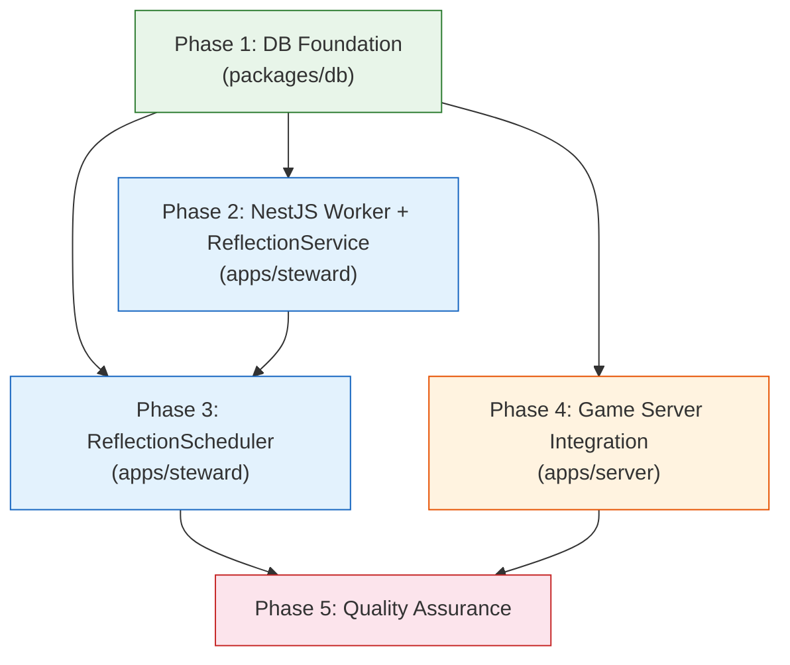
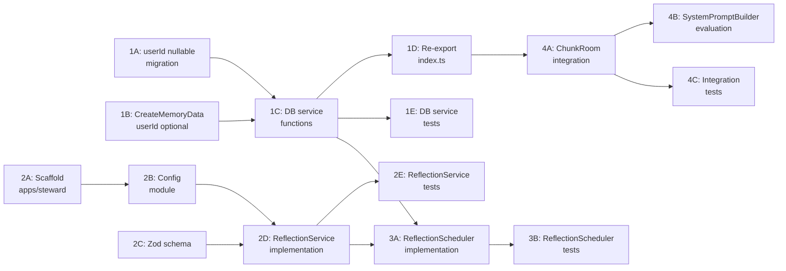

# Work Plan: NPC Daily Reflection (P0.3) Implementation

Created Date: 2026-03-28
Type: feature
Estimated Duration: 3-4 days
Estimated Impact: ~15 files (8 new, 5 modified, 2 migration)
Related Issue/PR: N/A

## Related Documents
- Design Doc: [docs/design/design-028-npc-daily-reflection.md]
- ADR: [docs/adr/ADR-0014-ai-dialogue-openai-sdk.md] (AI SDK pattern)
- ADR: [docs/adr/ADR-0015-npc-prompt-architecture.md] (SystemPromptBuilder)
- ADR: [docs/adr/ADR-0020-vector-search-architecture.md] (EmbeddingService/VectorStore)

## Objective

Implement a daily reflection system for homestead NPC bots. A separate NestJS worker process generates a reflection per NPC per real-world day -- summarizing recent interactions, updating mood with rationale, and forming a next-day plan. Reflections are stored as high-importance records in the existing `npc_memories` table so they automatically surface in memory retrieval and semantic search, giving NPCs inter-session continuity and agency.

## Background

Currently, NPCs have no sense of continuity between play sessions. They lack high-level day summaries, reflective mood updates, and next-day plans. This makes them feel stateless and reactive. P0.2 (semantic memory retrieval) established the EmbeddingService and VectorStore infrastructure that this feature leverages for automatic embedding of reflection memories.

## Implementation Approach

**Selected**: Vertical Slice (DB Foundation -> Worker Service -> Game Server Integration)

Each layer depends on the one below it. DB schema and service functions must exist before the worker can persist reflections, and the worker must produce data before the game server integration can read it. Each phase is independently testable.

## Phase Structure Diagram

## Task Dependency Diagram

## Risks and Countermeasures

### Technical Risks
- **Risk**: NestJS is a new framework dependency in the monorepo
  - **Impact**: Learning curve, build/config complexity
  - **Countermeasure**: Minimal NestJS surface area (DI + @nestjs/schedule only, ~5 files). Can be replaced with plain cron + Node.js if NestJS proves too heavy.

- **Risk**: LLM structured output (generateObject) fails consistently with gpt-5-mini
  - **Impact**: NPCs get no reflections
  - **Countermeasure**: Zod schema with `.describe()` hints; null fallback on failure; monitoring log line. Single-call pattern already proven in similar systems.

- **Risk**: userId nullability migration affects existing memory queries
  - **Impact**: High -- memory retrieval returns wrong data
  - **Countermeasure**: Existing `getMemoriesForBot(botId, userId)` uses `AND userId = ?` which excludes null rows. Migration is backward-compatible by design. Verified via code inspection (npc-memory.ts:44-49).

### Schedule Risks
- **Risk**: NestJS scaffold + Nx integration takes longer than expected
  - **Impact**: Delays Phase 2-3
  - **Countermeasure**: Phase 4 (ChunkRoom integration) only depends on Phase 1 (DB), so it can proceed in parallel with Phase 2-3.

## Implementation Phases

### Phase 1: DB Foundation (Estimated commits: 2-3)
**Purpose**: Establish the data layer that all other components depend on -- make userId nullable, create reflection-specific DB service functions, and verify backward compatibility.

**AC Coverage**: AC7 (persistence), AC8 (retrieval after restart), AC9 (one-per-day dedup)

#### Tasks
- [x] **1A**: DB migration -- make `npc_memories.userId` nullable
  - Run `pnpm drizzle-kit generate` after modifying schema
  - Migration SQL: `ALTER COLUMN user_id DROP NOT NULL`
  - Verify: existing rows unaffected (all have non-null userId)
- [x] **1B**: Update `CreateMemoryData.userId` from `string` to `string | undefined` in `packages/db/src/services/npc-memory.ts`
  - Existing callers (MemoryStream) always pass userId -- no breakage
- [x] **1C**: Create `packages/db/src/services/npc-reflection.ts` with 4 functions:
  - `getRecentMemoriesForBot(db, botId, since)` -- all types, all users, within time window
  - `getReflectionMemories(db, botId, limit?)` -- type='reflection', newest first, default limit 3
  - `getBotsNeedingReflection(db, since)` -- bots without reflection today
  - `createReflectionMemory(db, data)` -- insert with type='reflection', userId=null
- [x] **1D**: Re-export new functions from `packages/db/src/index.ts`
- [x] **1E**: Write integration tests (`packages/db/src/services/__tests__/npc-reflection.spec.ts`)
  - AC7: createReflectionMemory persists with type='reflection', importance=10, userId=null
  - AC8: getReflectionMemories returns most recent reflections for a bot
  - AC9: getBotsNeedingReflection excludes bots with today's reflection
  - AC9: getBotsNeedingReflection includes bots with yesterday's reflection
  - Backward compat: getMemoriesForBot(db, botId, userId) does NOT return null-userId reflections
- [x] Quality check: `pnpm nx typecheck db` passes
- [x] Quality check: `pnpm nx test db` passes (if DB test target exists, else manual verification)

#### Phase Completion Criteria
- [x] `npc_memories.userId` is nullable in schema and migration generated
- [x] All 4 DB service functions implemented and exported
- [x] Integration tests written and passing
- [x] Existing `getMemoriesForBot` behavior verified (null-userId rows excluded)

#### Operational Verification Procedures
1. Apply migration to local DB: `pnpm drizzle-kit push`
2. Verify existing npc_memories rows still have userId populated
3. Insert a test reflection memory with userId=null via DB service function
4. Call `getMemoriesForBot(db, botId, userId)` and confirm null-userId row is NOT returned
5. Call `getReflectionMemories(db, botId)` and confirm the reflection IS returned
6. Call `getBotsNeedingReflection(db, startOfToday)` and confirm bot is NOT listed (has today's reflection)

---

### Phase 2: NestJS Worker + ReflectionService (Estimated commits: 3-4)
**Purpose**: Scaffold the NestJS worker app and implement ReflectionService -- the component that generates structured reflection output from an LLM call.

**AC Coverage**: AC1 (day summary), AC2 (empty day), AC4 (mood vocabulary), AC5 (mood intensity 1-10), AC6 (next-day plan), AC15 (LLM failure handling)

#### Tasks
- [x] **2A**: Scaffold `apps/steward/` NestJS app
  - `src/main.ts` -- NestJS bootstrap entrypoint
  - `src/app.module.ts` -- Root module with ScheduleModule
  - `src/reflection/reflection.module.ts` -- Feature module
  - `tsconfig.json`, `package.json` (or shared workspace deps)
  - Verify: `pnpm install` succeeds, app bootstraps without errors
- [x] **2B**: Create config module (`apps/steward/src/config/config.module.ts`)
  - Load env vars: `OPENAI_API_KEY`, `DATABASE_URL`, `GOOGLE_GENERATIVE_AI_API_KEY`, `QDRANT_URL`
  - Use `@nestjs/config` or simple env loading
- [x] **2C**: Create Zod schema (`apps/steward/src/reflection/reflection.schema.ts`)
  - `reflectionOutputSchema` with fields: summary, mood (enum), moodIntensity (int 1-10), moodRationale, plan
  - Export `ReflectionOutput` type inferred from schema
- [x] **2D**: Implement `ReflectionService` (`apps/steward/src/reflection/reflection.service.ts`)
  - `generateReflection(input: ReflectionInput): Promise<ReflectionOutput | null>`
  - Uses AI SDK `generateObject` with Zod schema and gpt-5-mini
  - AbortController with 15s timeout
  - Returns null on any error (logged, never throws)
  - Handles empty memories array (empty day scenario -- AC2)
- [x] **2E**: Write unit tests (`apps/steward/src/reflection/__tests__/reflection.service.spec.ts`)
  - AC1: Generates structured reflection from memories (mock LLM returns valid output)
  - AC2: Generates idle reflection when memories array is empty
  - AC4: Mood value is valid emotion vocabulary (Zod enum enforced)
  - AC5: Mood intensity is 1-10 (Zod int validation)
  - AC6: Plan is present and non-empty in output
  - AC15: Returns null on LLM failure (mock LLM throws)
  - AC15: Returns null on LLM timeout (mock AbortController)
- [x] Quality check: `pnpm nx typecheck steward` passes (or manual tsc check)
- [x] Quality check: Unit tests pass

#### Phase Completion Criteria
- [x] NestJS app scaffolded and bootstraps successfully
- [x] ReflectionService generates valid ReflectionOutput from mocked LLM
- [x] ReflectionService returns null on LLM failure/timeout
- [x] Zod schema enforces mood enum and intensity range
- [x] All unit tests passing

#### Operational Verification Procedures
1. Run `npx ts-node apps/steward/src/main.ts` (or equivalent) -- app bootstraps without errors
2. Run unit tests: all 7 test cases pass
3. (Optional) Manual smoke test with real LLM API: call generateReflection with sample input and verify structured output

---

### Phase 3: ReflectionScheduler (Estimated commits: 2-3)
**Purpose**: Implement the cron-triggered scheduler that orchestrates the daily reflection cycle -- querying bots, running ReflectionService, persisting results, updating mood, and embedding.

**AC Coverage**: AC3 (mood update), AC7 (persistence), AC9 (one-per-day), AC12 (embedding), AC13 (separate process), AC14 (restart idempotency), AC15 (per-NPC error handling)

#### Tasks
- [x] **3A**: Implement `ReflectionScheduler` (`apps/steward/src/reflection/reflection.scheduler.ts`)
  - `@Cron('0 4 * * *')` decorator (configurable via env)
  - `handleCron()` -- guards against concurrent runs (isRunning flag)
  - `runOnce()` -- public method for testing/manual trigger
  - For each bot needing reflection:
    1. Load bot persona from npc_bots
    2. Load recent memories (last 24h) via `getRecentMemoriesForBot`
    3. Call `reflectionService.generateReflection(input)`
    4. On success: persist via `createReflectionMemory`, update mood via raw Drizzle, fire-and-forget embed
    5. On failure: log error, continue to next bot
  - Structured logging per Design Doc logging spec
- [x] **3B**: Write unit tests (`apps/steward/src/reflection/__tests__/reflection.scheduler.spec.ts`)
  - AC9: Does not re-reflect bots that already reflected today (mock DB returns empty needs list)
  - AC14: Idempotent across worker restarts (mock DB returns already-reflected)
  - AC15: Continues to next bot when one fails (mock reflectionService throws for first bot)
  - AC7: Creates memory with type='reflection' and importance >= 9 (verify DB call args)
  - AC3: Updates mood on npc_bots after successful reflection (verify DB update call args)
  - AC12: Calls embedding service after successful reflection (verify embed call)
  - Concurrency guard: second handleCron() call is no-op while first is running
- [x] **3C**: Wire up EmbeddingService and VectorStore in reflection module
  - Instantiate from config (googleApiKey, qdrantUrl)
  - Fire-and-forget pattern matching `MemoryStream._fireAndForgetEmbed()`
  - Reflections pass `userId: 'system'` for Qdrant payload
- [x] Quality check: All unit tests pass
- [x] Quality check: TypeScript typecheck passes

#### Phase Completion Criteria
- [x] ReflectionScheduler.runOnce() completes full cycle with mocked dependencies
- [x] Per-NPC error isolation verified (one failure does not stop others)
- [x] Concurrency guard prevents overlapping runs
- [x] Mood update confirmed via DB assertions
- [x] Embedding queued via fire-and-forget
- [x] All unit tests passing

#### Operational Verification Procedures
1. Run unit tests: all scheduler test cases pass
2. (Integration) With test DB + mocked LLM: call `runOnce()`, verify:
   - Memory record created in npc_memories with type='reflection', importance=10, userId=null
   - npc_bots.mood, moodIntensity, moodUpdatedAt updated
   - Calling `runOnce()` again immediately produces no new reflections (idempotent)
3. Verify structured log output matches Design Doc logging spec

---

### Phase 4: Game Server Integration (Estimated commits: 1-2)
**Purpose**: Wire up reflection memory retrieval in the game server so reflections surface during NPC dialogue. Verify that SystemPromptBuilder works without modification.

**AC Coverage**: AC10 (reflections in dialogue context), AC11 (no-reflection graceful handling), AC16 (dialogue unaffected by reflection failure)

#### Tasks
- [x] **4A**: Modify `ChunkRoom.handleNpcInteract()` in `apps/server/src/rooms/ChunkRoom.ts`
  - After `getMemoriesForBot(db, botId, userId)`, also call `getReflectionMemories(db, botId, 3)`
  - Merge: `const allMemories = [...rawMemories, ...reflectionMemories]`
  - Pass merged array to `scoreAndRankMemories()`
  - Wrap `getReflectionMemories` in try/catch: log warning, continue without reflections on failure (AC16)
- [x] **4B**: Evaluate SystemPromptBuilder
  - Reviewed `buildMemorySection()` -- formats as `- ${m.memory.content}`. Reflection content renders as `- [Day reflection] ...` with sufficient LLM signal.
  - Decision: No dedicated `buildReflectionSection()` needed. Natural inclusion via regular memory bullets suffices.
- [x] **4C**: Write integration/unit tests (`apps/server/src/rooms/__tests__/chunk-room-reflection.spec.ts`)
  - AC10: Scored memories include reflection entries when they exist in DB
  - AC11: Dialogue flow works normally when no reflection memories exist
  - AC16: Dialogue flow works when `getReflectionMemories` throws (try/catch verification)
- [x] Quality check: `pnpm nx typecheck server` passes
- [x] Quality check: `pnpm nx test server` passes
- [x] Quality check: `pnpm nx lint server` passes

#### Phase Completion Criteria
- [x] ChunkRoom merges reflection memories into scored set
- [x] Dialogue works with and without reflection memories
- [x] getReflectionMemories failure does not break dialogue
- [x] SystemPromptBuilder evaluation documented
- [x] All tests passing

#### Operational Verification Procedures
1. Insert a reflection memory into test DB for a specific bot
2. Start dialogue with that bot -- verify reflection content appears in system prompt (via log inspection or test assertion)
3. Start dialogue with a bot that has NO reflection memories -- verify dialogue works normally
4. Simulate `getReflectionMemories` failure (e.g., disconnect DB briefly) -- verify dialogue still works with warning logged

---

### Phase 5: Quality Assurance (Required) (Estimated commits: 1)
**Purpose**: Overall quality assurance, acceptance criteria verification, and Design Doc consistency check.

#### Tasks
- [ ] Verify all Design Doc acceptance criteria achieved (AC1-AC16 checklist below)
- [ ] Quality checks: types, lint, format across all affected packages
  - `pnpm nx typecheck server`
  - `pnpm nx typecheck db` (if available)
  - `pnpm nx lint server`
  - Steward app typecheck
- [ ] Execute all tests
  - `pnpm nx test server`
  - DB package tests
  - Steward app tests
- [ ] Verify no regressions in existing NPC dialogue flow
- [ ] Review structured logging output matches Design Doc spec
- [ ] Document any deviations from Design Doc with rationale

#### Acceptance Criteria Checklist

| AC | Description | Phase | Status |
|----|-------------|-------|--------|
| AC1 | Day summary generation (1-3 sentences, stored as reflection memory) | P2, P3 | [ ] |
| AC2 | Idle summary for zero-interaction days | P2 | [ ] |
| AC3 | Mood update (mood, moodIntensity, moodUpdatedAt) on npc_bots | P3 | [ ] |
| AC4 | Mood value from emotion vocabulary | P2 | [ ] |
| AC5 | Mood intensity 1-10 | P2 | [ ] |
| AC6 | Next-day plan present in reflection | P2 | [ ] |
| AC7 | Persistence: type='reflection', importance >= 9 | P1, P3 | [ ] |
| AC8 | Reflections retrievable after restart | P1 | [ ] |
| AC9 | At most one reflection per NPC per day | P1, P3 | [ ] |
| AC10 | Reflections appear in dialogue memory retrieval | P4 | [x] |
| AC11 | Dialogue works with no reflection memories | P4 | [x] |
| AC12 | Reflection embedded in Qdrant (fire-and-forget) | P3 | [ ] |
| AC13 | Worker runs as separate NestJS process | P2, P3 | [ ] |
| AC14 | Restart does not cause re-reflection (DB dedup) | P3 | [ ] |
| AC15 | LLM failure logged and skipped, no crash | P2, P3 | [ ] |
| AC16 | Reflection failure does not affect dialogue | P4 | [x] |

#### Operational Verification Procedures
1. Full E2E: Start steward worker -> trigger `runOnce()` -> verify DB state -> start dialogue with reflected NPC -> verify reflection content in prompt
2. Graceful degradation: Stop steward worker -> start dialogue -> verify NPC functions normally without reflections
3. Error path: Provide invalid LLM API key -> trigger `runOnce()` -> verify error logged, no crash, NPC dialogue unaffected

## Testing Strategy

### Test Distribution

| Phase | Test Type | Files | Test Cases |
|-------|-----------|-------|------------|
| P1 | Integration (DB) | `packages/db/src/services/__tests__/npc-reflection.spec.ts` | 5 |
| P2 | Unit (Service) | `apps/steward/src/reflection/__tests__/reflection.service.spec.ts` | 7 |
| P3 | Unit (Scheduler) | `apps/steward/src/reflection/__tests__/reflection.scheduler.spec.ts` | 7 |
| P4 | Unit/Integration | Tests in `apps/server/` (file TBD based on existing test structure) | 3 |
| **Total** | | **4 files** | **22 cases** |

### Strategy Notes

- No TDD (no pre-existing spec files) -- Strategy B: Implementation-First
- Unit tests mock LLM calls (AI SDK) and DB calls
- DB integration tests use real database connection
- E2E verification is manual (Phase 5 operational procedures)
- No performance tests required (Design Doc: "Not required per constraints")

## File Impact Summary

### New Files (~8)
| File | Phase | Description |
|------|-------|-------------|
| `apps/steward/src/main.ts` | P2 | NestJS bootstrap entrypoint |
| `apps/steward/src/app.module.ts` | P2 | Root module with ScheduleModule |
| `apps/steward/src/config/config.module.ts` | P2 | Config module (env vars) |
| `apps/steward/src/reflection/reflection.module.ts` | P2 | Feature module |
| `apps/steward/src/reflection/reflection.service.ts` | P2 | LLM reflection generation |
| `apps/steward/src/reflection/reflection.schema.ts` | P2 | Zod schema for structured output |
| `apps/steward/src/reflection/reflection.scheduler.ts` | P3 | Cron-triggered orchestration |
| `packages/db/src/services/npc-reflection.ts` | P1 | DB service functions |

### Modified Files (~5)
| File | Phase | Change |
|------|-------|--------|
| `packages/db/src/schema/npc-memories.ts` | P1 | Remove `.notNull()` from userId |
| `packages/db/src/services/npc-memory.ts` | P1 | `CreateMemoryData.userId` becomes optional |
| `packages/db/src/index.ts` | P1 | Re-export npc-reflection functions |
| `apps/server/src/rooms/ChunkRoom.ts` | P4 | Merge reflection memories at dialogue start |
| DB migration file (auto-generated) | P1 | `ALTER COLUMN user_id DROP NOT NULL` |

### Test Files (~4)
| File | Phase | Cases |
|------|-------|-------|
| `packages/db/src/services/__tests__/npc-reflection.spec.ts` | P1 | 5 |
| `apps/steward/src/reflection/__tests__/reflection.service.spec.ts` | P2 | 7 |
| `apps/steward/src/reflection/__tests__/reflection.scheduler.spec.ts` | P3 | 7 |
| `apps/server/src/rooms/__tests__/chunk-room-reflection.spec.ts` | P4 | 3 |

## Completion Criteria
- [ ] All phases completed
- [ ] Each phase's operational verification procedures executed
- [ ] Design Doc acceptance criteria satisfied (AC1-AC16 all checked)
- [ ] Staged quality checks completed (zero errors)
- [ ] All 22 test cases pass
- [ ] Necessary documentation updated

## Progress Tracking
### Phase 1: DB Foundation
- Start: 2026-03-28
- Complete:
- Notes: Task 1A+1B completed (userId nullable migration + CreateMemoryData type update). Also fixed downstream VectorPayload.userId type in server (string -> string | null) to prevent type errors from schema change. Migration: 0023_smart_ender_wiggin.sql

### Phase 2: NestJS Worker + ReflectionService
- Start: 2026-03-28
- Complete:
- Notes: Task 2A+2B completed (NestJS scaffold + config module). Used @nx/nest generator, installed @nestjs/schedule + @nestjs/config. Worker uses createApplicationContext (no HTTP). Removed boilerplate controller/service. Build + typecheck pass.

### Phase 3: ReflectionScheduler
- Start: 2026-03-28
- Complete: 2026-03-28
- Notes: Task 5 completed. ReflectionScheduler implemented with cron, concurrency guard, per-NPC error isolation. EmbeddingService+VectorStore created as lightweight copies in apps/steward/src/shared/ (Nx module boundaries prevent importing from apps/server/). Added @ai-sdk/google, @qdrant/js-client-rest, drizzle-orm to steward deps. Used eq from @nookstead/db re-exports to avoid drizzle-orm dual-package type conflict. All 7 scheduler tests + 7 service tests pass. Typecheck passes.

### Phase 4: Game Server Integration
- Start: 2026-03-27
- Complete: 2026-03-27
- Notes: Task 06 completed. ChunkRoom.handleNpcInteract() modified to fetch reflection memories via getReflectionMemories(db, botId, 3) and merge with user memories before scoring. Reflection fetch wrapped in narrowly-scoped try/catch for graceful degradation (AC16). SystemPromptBuilder evaluated -- no changes needed; reflection content renders as `- [Day reflection] ...` bullets with sufficient LLM signal. Created 3 integration tests in chunk-room-reflection.spec.ts. All tests pass, typecheck clean, lint clean.

### Phase 5: Quality Assurance
- Start:
- Complete:
- Notes:

## Notes
- **Solo developer**: No team coordination needed; phases are sequential but Phase 4 can start after Phase 1 completes (parallel with Phase 2-3 if desired)
- **P0.2 dependency**: EmbeddingService and VectorStore from semantic memory (P0.2) are leveraged directly -- no changes needed to those components
- **NestJS is new to this monorepo**: First NestJS app. May need to configure Nx to recognize it (tsconfig paths, workspace inclusion). Budget extra time for Phase 2A scaffold.
- **Emotion vocabulary**: The `mood` enum in the Zod schema must match the `EMOTIONS` array from `express-emotion.ts` for consistency
- **Cron default**: 04:00 UTC, configurable via env var `REFLECTION_CRON`
