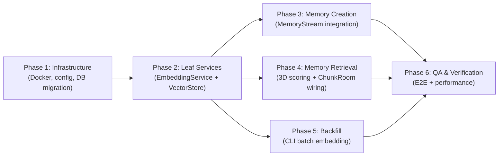
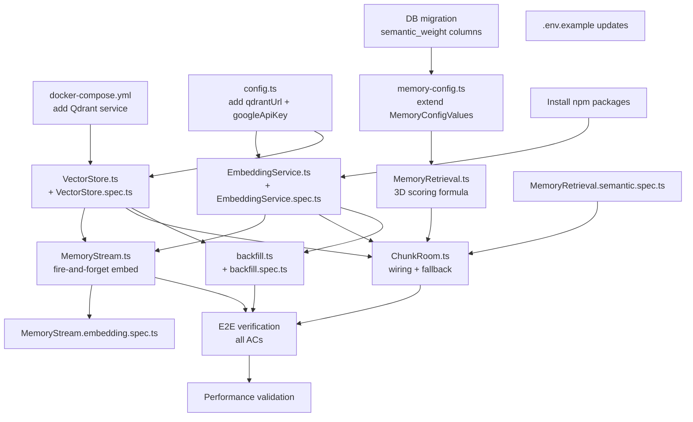

# Work Plan: P0.2 -- Semantic Memory Retrieval

Created Date: 2026-03-28
Type: feature
Estimated Duration: 3-4 days
Estimated Impact: 15 files (6 new + 9 modified)
Related Issue/PR: N/A

## Related Documents
- Design Doc: [docs/design/design-027-semantic-memory-retrieval.md](../design/design-027-semantic-memory-retrieval.md)
- ADR: [docs/adr/ADR-0020-vector-search-architecture.md](../adr/ADR-0020-vector-search-architecture.md)
- Predecessor: [docs/plans/plan-memory-stream-impl.md](plan-memory-stream-impl.md) (Phase 0)

## Objective

Add the third dimension -- semantic similarity -- to the NPC memory retrieval formula. After this work, NPCs can recall contextually relevant memories regardless of age or importance score (e.g., a 3-week-old memory about the harvest festival surfaces when the player mentions the harvest festival). The formula becomes `alpha * recency + beta * importance + gamma * semantic`. Setting `gamma = 0` (the default) preserves Phase 0 behavior exactly.

## Background

The Phase 0 memory system (Design-023) retrieves memories using two dimensions: recency (exponential decay) and importance (linear weight). Feature spec F-002 defines a three-dimensional formula with semantic similarity as the third axis, but Phase 0 explicitly deferred it (`gamma = 0`). This causes topic recall failure: old-but-relevant memories are buried by newer trivial memories. P0.2 completes the F-002 retrieval formula by adding Gemini embeddings stored in Qdrant.

## Phase Structure Diagram

## Task Dependency Diagram

## Risks and Countermeasures

### Technical Risks

- **Risk**: Gemini API latency exceeds 2s consistently or rate limits are too restrictive for backfill
  - **Impact**: Embedding generation slows down; backfill may not complete in reasonable time
  - **Countermeasure**: Fire-and-forget on creation path ensures zero latency impact. Backfill uses configurable batch size and rate limiting. Kill criteria: switch to OpenAI embeddings (one-line change in AI SDK model reference)

- **Risk**: Qdrant query adds >100ms to dialogue-start path
  - **Impact**: Player-perceived delay before NPC responds
  - **Countermeasure**: 500ms timeout with automatic fallback to Phase 0 scoring. Qdrant HNSW is <10ms for <1000 points in practice. Performance test in Phase 6 validates this

- **Risk**: Dual-store consistency drift (memory in PG but not in Qdrant)
  - **Impact**: Some memories lack semantic scoring, reducing retrieval quality
  - **Countermeasure**: Graceful degradation (semanticScore=0.0 for missing vectors); backfill command as manual recovery; brief consistency window (~1s) is acceptable per ADR-0020

- **Risk**: Embedding quality poor for Russian-language NPC memory summaries
  - **Impact**: Semantic search returns irrelevant results
  - **Countermeasure**: Gemini supports Russian; test with real dialogues in Phase 6; provider switch is one-line change

### Schedule Risks

- **Risk**: `@ai-sdk/google` or `@qdrant/js-client-rest` has unexpected API differences from documentation
  - **Impact**: Implementation takes longer than estimated
  - **Countermeasure**: Phase 2 implements and tests these in isolation first; issues discovered early before integration

## Implementation Phases

### Phase 1: Infrastructure Foundation (Estimated commits: 2-3)
**Purpose**: Establish all infrastructure prerequisites so leaf services can be developed. Covers Docker setup, environment config, database migration, and npm dependencies.

**Affected files**: `docker-compose.yml`, `apps/server/src/config.ts`, `packages/db/src/schema/memory-stream-config.ts`, `packages/db/src/services/memory-config.ts`, `packages/db/src/index.ts`, `.env.example`, `apps/server/.env.example`, `package.json`

#### Tasks

- [x] **T1.1**: Install npm dependencies `@ai-sdk/google` and `@qdrant/js-client-rest`
- [ ] **T1.2**: Add Qdrant service to `docker-compose.yml` following Redis pattern (image `qdrant/qdrant:v1.17`, ports 6333:6333, persistent volume `qdrant_data`, healthcheck via `/healthz` endpoint) -- SKIPPED: Qdrant runs externally per orchestrator instruction
- [x] **T1.3**: Add `qdrantUrl` (optional, default `http://localhost:6333`) and `googleApiKey` (optional) to `ServerConfig` interface and `loadConfig()` in `apps/server/src/config.ts`
- [x] **T1.4**: Update `.env.example` and `apps/server/.env.example` with `QDRANT_URL` and `GOOGLE_GENERATIVE_AI_API_KEY` entries
- [x] **T1.5**: Add `semantic_weight` column (type `real`, NOT NULL, default `0.0`) to `memoryStreamConfig` table in `packages/db/src/schema/memory-stream-config.ts`
- [x] **T1.6**: Add `semantic_weight` column (type `real`, nullable) to `npcMemoryOverrides` table in `packages/db/src/schema/memory-stream-config.ts`
- [x] **T1.7**: Generate Drizzle migration via `drizzle-kit generate`
- [x] **T1.8**: Extend `MemoryConfigValues` interface in `packages/db/src/services/memory-config.ts` with `semanticWeight: number`; add to `rowToConfig()` mapping and `getEffectiveConfig()` merge logic (nullish coalescing)
- [x] **T1.9**: Verify barrel re-exports in `packages/db/src/index.ts` include updated `MemoryConfigValues` type
- [x] **T1.10**: Quality check -- `pnpm nx typecheck server`, lint, all DB tests pass

#### Phase Completion Criteria
- [ ] `docker-compose up` starts Qdrant alongside existing services; health check passes (AC11)
- [ ] `loadConfig()` reads `QDRANT_URL` and `GOOGLE_GENERATIVE_AI_API_KEY` without error
- [ ] DB migration runs successfully; `semantic_weight` columns exist in both tables
- [ ] `getEffectiveConfig()` returns `semanticWeight: 0.0` by default
- [ ] TypeScript compiles cleanly (`pnpm nx typecheck`)

#### Operational Verification Procedures
1. Run `docker-compose up -d` and verify Qdrant responds at `http://localhost:6333/healthz`
2. Run `pnpm nx typecheck` -- zero errors
3. Run Drizzle migration against dev database; verify `semantic_weight` column in `memory_stream_config` table
4. Verify `getEffectiveConfig()` output includes `semanticWeight: 0.0` (can check via existing tests or manual DB query)

---

### Phase 2: Leaf Services -- EmbeddingService + VectorStore (Estimated commits: 2)
**Purpose**: Implement the two new modules that wrap external dependencies (Gemini API via AI SDK, Qdrant client). These are independently testable with mocked dependencies and have zero coupling to existing modules.

**New files**: `apps/server/src/npc-service/memory/EmbeddingService.ts`, `apps/server/src/npc-service/memory/VectorStore.ts`, `apps/server/src/npc-service/memory/__tests__/EmbeddingService.spec.ts`, `apps/server/src/npc-service/memory/__tests__/VectorStore.spec.ts`
**Modified files**: `apps/server/src/npc-service/memory/index.ts` (barrel exports)

#### Tasks

- [x] **T2.1**: Implement `EmbeddingService` class
  - Constructor: accepts `{ googleApiKey: string }`
  - `embedText(text: string): Promise<number[] | null>` -- calls `embed()` from AI SDK with `google.embeddingModel('gemini-embedding-001')` and `outputDimensionality: 768` via `providerOptions`; returns null on error
  - `embedTexts(texts: string[]): Promise<(number[] | null)[]>` -- calls `embedMany()` for batch operations; returns null for individually failed entries
  - All API calls wrapped in try/catch with structured logging; errors never propagate
  - Validate `text.length > 0` before calling API

- [x] **T2.2**: Write `EmbeddingService.spec.ts` unit tests (mock AI SDK `embed`/`embedMany`)
  - `embedText` returns 768-dim array on success
  - `embedText` returns null and logs error on API failure (AC2)
  - `embedTexts` returns array of embeddings on success
  - `embedTexts` returns null entries for individual failures
  - Empty string input is handled without API call

- [x] **T2.3**: Implement `VectorStore` class
  - Constructor: accepts `{ qdrantUrl: string }`; creates Qdrant client
  - `ensureCollection()` -- checks if `npc_memories` collection exists via `collectionExists()`; creates with 768-dim cosine distance config if not (AC4)
  - `upsertMemoryVector(memoryId, vector, payload)` -- upserts point with UUID as point ID and `VectorPayload` (AC3)
  - `searchSimilar(queryVector, botId, userId, limit)` -- searches with `must` clause filter on botId+userId; returns `[{id, score}]`
  - `deleteMemoryVector(memoryId)` -- deletes single point by ID
  - `healthCheck()` -- returns boolean based on Qdrant response

- [x] **T2.4**: Write `VectorStore.spec.ts` unit tests (mock `@qdrant/js-client-rest` client)
  - `ensureCollection` creates collection with correct dimension (768) and distance (Cosine) when not exists
  - `ensureCollection` is no-op when collection already exists
  - `upsertMemoryVector` sends correct point structure (UUID id, 768-dim vector, payload with botId/userId/importance/createdAt) (AC3)
  - `searchSimilar` applies botId+userId filter via must clause; returns results sorted by score
  - `searchSimilar` returns empty array when no matches
  - `deleteMemoryVector` calls delete with correct point ID
  - `healthCheck` returns true/false based on Qdrant availability

- [x] **T2.5**: Export `EmbeddingService`, `VectorStore`, and `VectorPayload` from `apps/server/src/npc-service/memory/index.ts`
- [x] **T2.6**: Quality check -- all new unit tests pass (`pnpm nx test server`); typecheck passes; lint clean

#### Phase Completion Criteria
- [x] `EmbeddingService.spec.ts` -- all tests GREEN (AC1, AC2 coverage)
- [x] `VectorStore.spec.ts` -- all tests GREEN (AC3, AC4 coverage)
- [x] Both modules export cleanly from barrel index
- [x] Zero lint/type errors

#### Operational Verification Procedures
1. Run `pnpm nx test server --testPathPattern=EmbeddingService` -- all pass
2. Run `pnpm nx test server --testPathPattern=VectorStore` -- all pass
3. Run `pnpm nx typecheck` -- zero errors
4. Run `pnpm nx lint server` -- zero errors
5. Verification level: L2 (unit tests with mocked external deps)

---

### Phase 3: Memory Creation Integration (Estimated commits: 1-2)
**Purpose**: Wire EmbeddingService + VectorStore into MemoryStream so that every new memory gets an embedding asynchronously. This is the "write path" integration.

**Modified files**: `apps/server/src/npc-service/memory/MemoryStream.ts`
**New files**: `apps/server/src/npc-service/memory/__tests__/MemoryStream.embedding.spec.ts`

#### Tasks

- [ ] **T3.1**: Extend `MemoryStreamOptions` interface to accept optional `embeddingService?: EmbeddingService | null` and `vectorStore?: VectorStore | null`
- [ ] **T3.2**: After `createMemory()` call (returns `NpcMemoryRow` with `.id`), add fire-and-forget chain:
  - If both `embeddingService` and `vectorStore` are available:
    - `embeddingService.embedText(memory.content)`
    - If embedding is non-null: `vectorStore.upsertMemoryVector(memory.id, vector, { botId, userId, importance, createdAt })`
  - Use `.then().catch()` pattern (matching existing ChunkRoom fire-and-forget pattern at L1174-1194)
  - Failures logged with memory ID context, never propagated to caller (AC2)
- [ ] **T3.3**: Write `MemoryStream.embedding.spec.ts` unit tests
  - After `createDialogueMemory`, `embedText` and `upsertMemoryVector` are called with correct arguments (AC1)
  - When `embedText` returns null, `upsertMemoryVector` is not called
  - When `upsertMemoryVector` throws, error is logged but `createDialogueMemory` does not throw (AC2)
  - When `embeddingService` is null, no embedding is attempted
  - When `vectorStore` is null, no upsert is attempted
- [ ] **T3.4**: Quality check -- all MemoryStream tests pass (existing + new); typecheck; lint

#### Phase Completion Criteria
- [ ] Fire-and-forget embedding runs after every `createMemory()` call when services are available (AC1)
- [ ] Embedding failures never propagate to `createDialogueMemory` callers (AC2)
- [ ] All existing MemoryStream tests remain GREEN (backward compatibility)
- [ ] New `MemoryStream.embedding.spec.ts` tests all GREEN

#### Operational Verification Procedures
1. Run `pnpm nx test server --testPathPattern=MemoryStream` -- all pass (existing + new)
2. Run `pnpm nx typecheck` -- zero errors
3. Verification level: L2 (unit tests with mocked EmbeddingService/VectorStore)
4. **Integration Point 1 verification** (Design Doc): Create memory via MemoryStream; verify `embedText` called with `memory.content` and `upsertMemoryVector` called with `memory.id`

---

### Phase 4: Memory Retrieval Integration (Estimated commits: 2-3)
**Purpose**: Extend the scoring formula to three dimensions and wire semantic retrieval into ChunkRoom's dialogue-start path. This is the "read path" integration and completes the core feature.

**Modified files**: `apps/server/src/npc-service/memory/MemoryRetrieval.ts`, `apps/server/src/rooms/ChunkRoom.ts`
**New files**: `apps/server/src/npc-service/memory/__tests__/MemoryRetrieval.semantic.spec.ts`

#### Tasks

- [x] **T4.1**: Extend `RetrievalConfig` interface with `semanticWeight: number` (default 0.0)
- [x] **T4.2**: Extend `ScoredMemory` interface with `semanticScore: number` (default 0.0)
- [x] **T4.3**: Modify `scoreAndRankMemories()` function signature to accept optional `semanticScores?: Map<string, number>` parameter; update formula to `totalScore = recencyWeight * recency + importanceWeight * importance + semanticWeight * (semanticScores.get(id) ?? 0.0)`
- [x] **T4.4**: Write `MemoryRetrieval.semantic.spec.ts` unit tests
  - 3D scoring: memory with high semantic score ranks above memory with only high recency (AC5)
  - Backward compatibility: `semanticWeight=0` produces identical output to Phase 0 (AC6)
  - Backward compatibility: `semanticScores=undefined` produces identical output to Phase 0 (AC6)
  - Memories not in `semanticScores` map get `semanticScore=0.0`
  - Weights are configurable: verify `semanticWeight` multiplier applied correctly
- [ ] **T4.5**: Wire into ChunkRoom dialogue start handler (around L1488-1501):
  - After `getEffectiveConfig()`, check if `semanticWeight > 0`
  - If yes: call `embeddingService.embedText(playerText)` to get query vector
  - If vector obtained: call `vectorStore.searchSimilar(queryVector, botId, userId, SEMANTIC_TOP_K)` with 500ms timeout via `AbortController` or `Promise.race`
  - Convert results to `Map<string, number>` (memoryId -> score)
  - Pass map to `scoreAndRankMemories()` as 4th argument
  - If embedding fails or Qdrant fails/times out: log warning, pass empty map (fallback to Phase 0) (AC7, AC8)
- [x] **T4.6**: Define module-level constant `SEMANTIC_TOP_K = 20` in MemoryRetrieval.ts (AC5)
- [ ] **T4.7**: Initialize `EmbeddingService` and `VectorStore` in ChunkRoom (conditional on config: only create instances when `googleApiKey` and `qdrantUrl` are present)
- [ ] **T4.8**: Call `vectorStore.ensureCollection()` during ChunkRoom initialization
- [ ] **T4.9**: Pass `EmbeddingService` and `VectorStore` instances to `MemoryStream` constructor
- [ ] **T4.10**: Quality check -- all retrieval tests pass (existing + new semantic tests); all MemoryStream tests pass; typecheck; lint

#### Phase Completion Criteria
- [ ] Three-dimensional scoring formula works correctly when `semanticWeight > 0` (AC5)
- [ ] `semanticWeight=0` produces output identical to Phase 0 (AC6)
- [ ] Qdrant unavailability triggers graceful fallback with warning log (AC7)
- [ ] Gemini embedding failure triggers graceful fallback (AC8)
- [ ] All existing MemoryRetrieval tests remain GREEN
- [ ] New `MemoryRetrieval.semantic.spec.ts` tests all GREEN

#### Operational Verification Procedures
1. Run `pnpm nx test server --testPathPattern=MemoryRetrieval` -- all pass (existing + new)
2. Run `pnpm nx typecheck` -- zero errors
3. Verification level: L2 (unit tests for scoring formula); L1 target deferred to Phase 6
4. **Integration Point 2 verification** (Design Doc): Verify scoring output changes when semanticScores map is provided vs empty
5. **Integration Point 3 verification** (Design Doc): Verify `scoreAndRankMemories` with `semanticWeight=0` matches Phase 0 output exactly

---

### Phase 5: Backfill Mechanism (Estimated commits: 1)
**Purpose**: Implement a CLI-callable batch function that identifies existing PostgreSQL memories without Qdrant vectors and batch-embeds them. Required for transitioning existing data and for recovery from embedding failures.

**New files**: `apps/server/src/npc-service/memory/backfill.ts`, `apps/server/src/npc-service/memory/__tests__/backfill.spec.ts`

#### Tasks

- [x] **T5.1**: Implement `backfillMemoryEmbeddings()` function in `backfill.ts`
  - Accept params: `{ embeddingService, vectorStore, db, batchSize?, delayMs? }`
  - Query all memories from PostgreSQL
  - For each batch: check Qdrant for existing vectors (via scroll or get), filter to unembedded ones
  - Batch-embed via `embeddingService.embedTexts(contents)` (AC9)
  - Upsert successful embeddings to Qdrant
  - Log progress: batch N/total, embedded count, failed count
  - Rate limiting: configurable delay between batches (`delayMs`, default 1000ms) (AC10)
  - Return summary: `{ total, embedded, failed, skipped, durationMs }`

- [x] **T5.2**: Write `backfill.spec.ts` unit tests (mock EmbeddingService, VectorStore, DB)
  - Identifies memories without Qdrant vectors (AC9)
  - Processes in batches of configurable size (AC10)
  - Handles partial failures (some embeddings fail, others succeed)
  - Respects rate limiting (verifiable via mock timers)
  - Returns correct summary counts

- [x] **T5.3**: Export `backfillMemoryEmbeddings` from barrel index
- [x] **T5.4**: Quality check -- backfill tests pass; typecheck; lint

#### Phase Completion Criteria
- [x] Backfill function correctly identifies and processes unembedded memories (AC9)
- [x] Batch processing with rate limiting works correctly (AC10)
- [x] Partial failures handled gracefully (failed entries logged, successful ones persisted)
- [x] `backfill.spec.ts` all GREEN

#### Operational Verification Procedures
1. Run `pnpm nx test server --testPathPattern=backfill` -- all pass
2. Run `pnpm nx typecheck` -- zero errors
3. Verification level: L2 (unit tests with mocked deps)
4. **Integration Point 4 verification** (Design Doc): Deferred to Phase 6 (requires running Qdrant)

---

### Phase 6: QA & Integration Verification (Estimated commits: 1)
**Purpose**: End-to-end verification of all acceptance criteria, performance validation, and final quality gate. This phase validates that all components work together correctly against real Qdrant and (optionally) real Gemini API.

#### Tasks

- [ ] **T6.1**: Verify all acceptance criteria achievement (manual verification against running system):
  - AC1: Create memory -> embedding appears in Qdrant within 2s
  - AC2: Disable Gemini API key -> memory creation still succeeds, error logged
  - AC3: Inspect Qdrant point -> UUID matches PG id, payload has botId/userId/importance/createdAt
  - AC4: Delete Qdrant volume, restart -> collection auto-created on first use
  - AC5: Start dialogue with `semanticWeight > 0` mentioning a topic -> topically relevant old memory ranks high
  - AC6: Set `semanticWeight = 0` -> retrieval identical to Phase 0
  - AC7: Stop Qdrant -> dialogue still works, warning logged
  - AC8: Invalid Gemini API key -> retrieval falls back, warning logged
  - AC9: Run backfill -> unembedded memories gain vectors
  - AC10: Backfill respects batch size and delay
  - AC11: `docker-compose up` starts Qdrant with health check
- [ ] **T6.2**: Performance validation:
  - Qdrant search latency with ~200 vectors (target: < 50ms)
  - Full retrieval path latency (target: < 200ms)
  - Embedding generation latency (expected: 200-400ms, fire-and-forget)
- [ ] **T6.3**: Run full test suite: `pnpm nx test server` -- all tests pass (existing + all new)
- [ ] **T6.4**: Run `pnpm nx typecheck` -- zero errors across entire workspace
- [ ] **T6.5**: Run `pnpm nx lint server` -- zero lint errors
- [ ] **T6.6**: Verify backward compatibility: existing MemoryRetrieval tests and MemoryStream tests unchanged and passing
- [ ] **T6.7**: Verify graceful degradation: stop Qdrant mid-operation, confirm no errors propagate to dialogue flow
- [ ] **T6.8**: Verify config toggle: set `semanticWeight` from 0 to 0.3 in DB, confirm semantic scoring activates

#### Phase Completion Criteria
- [ ] All 11 acceptance criteria verified (AC1-AC11)
- [ ] Performance targets met: Qdrant < 50ms, total retrieval < 200ms
- [ ] Full test suite passes with zero failures
- [ ] Zero typecheck/lint errors
- [ ] Graceful degradation confirmed
- [ ] Backward compatibility confirmed (`gamma=0` identical to Phase 0)

#### Operational Verification Procedures
1. Start full Docker environment: `docker-compose up -d`
2. Verify Qdrant health: `curl http://localhost:6333/healthz`
3. Run the server, create a dialogue, end it -- verify embedding appears in Qdrant (AC1, AC3)
4. Start a new dialogue mentioning the same topic -- verify relevant memory ranks higher (AC5)
5. Set `semanticWeight = 0` in DB -- verify retrieval matches Phase 0 (AC6)
6. Stop Qdrant: `docker-compose stop qdrant` -- start dialogue, verify it works (AC7)
7. Run backfill function against dev DB -- verify all memories gain embeddings (AC9)
8. Measure Qdrant query latency via structured logs -- confirm < 50ms (Performance)
9. **Integration Point 1**: Memory creation -> embedding pipeline verified end-to-end
10. **Integration Point 2**: Retrieval with semantic scoring verified end-to-end
11. **Integration Point 3**: Graceful degradation verified end-to-end
12. **Integration Point 4**: Backfill verified end-to-end

---

## Testing Strategy

**Strategy B: Implementation-First Development** (no pre-existing test skeletons)

Tests are created alongside each phase's implementation. All tests use Jest with `@jest/globals` imports and follow the `makeMemory()` helper pattern from `MemoryRetrieval.spec.ts`.

### Test File Summary

| Test File | Phase | AC Coverage | Estimated Tests |
|-----------|-------|-------------|-----------------|
| `EmbeddingService.spec.ts` | 2 | AC1, AC2 | 5 |
| `VectorStore.spec.ts` | 2 | AC3, AC4 | 7 |
| `MemoryStream.embedding.spec.ts` | 3 | AC1, AC2 | 5 |
| `MemoryRetrieval.semantic.spec.ts` | 4 | AC5, AC6, AC7, AC8 | 5 |
| `backfill.spec.ts` | 5 | AC9, AC10 | 4 |
| **Total** | | **AC1-AC10** | **~26** |

### AC Traceability Matrix

| AC | Description | Test Files | Phase |
|----|-------------|------------|-------|
| AC1 | Async embedding after memory creation | EmbeddingService.spec, MemoryStream.embedding.spec | 2, 3 |
| AC2 | Gemini failure logged, memory creation unblocked | EmbeddingService.spec, MemoryStream.embedding.spec | 2, 3 |
| AC3 | Qdrant point structure (UUID, payload) | VectorStore.spec | 2 |
| AC4 | Collection auto-creation | VectorStore.spec | 2 |
| AC5 | Three-dimensional scoring with semantic boost | MemoryRetrieval.semantic.spec | 4 |
| AC6 | semanticWeight=0 identical to Phase 0 | MemoryRetrieval.semantic.spec | 4 |
| AC7 | Qdrant unavailable -> fallback to Phase 0 | MemoryRetrieval.semantic.spec, Phase 6 manual | 4, 6 |
| AC8 | Gemini embed failure -> fallback to Phase 0 | MemoryRetrieval.semantic.spec, Phase 6 manual | 4, 6 |
| AC9 | Backfill identifies and embeds missing memories | backfill.spec | 5 |
| AC10 | Backfill respects batch size and rate limiting | backfill.spec | 5 |
| AC11 | Docker Compose starts Qdrant with health check | Phase 1 manual, Phase 6 manual | 1, 6 |

## New Dependencies

| Package | Version | Purpose |
|---------|---------|---------|
| `@ai-sdk/google` | latest | Gemini provider for AI SDK `embed()`/`embedMany()` |
| `@qdrant/js-client-rest` | latest | Qdrant TypeScript REST client |

## Migration Strategy

1. **Database**: Additive migration only -- `semantic_weight` columns with defaults. Non-breaking.
2. **Default disabled**: `semanticWeight = 0.0` means Phase 0 behavior is unchanged after deployment.
3. **Backward compatible**: `scoreAndRankMemories` new parameter is optional (undefined = Phase 0).
4. **Rollback path**: Set `semanticWeight = 0.0` in DB to disable semantic retrieval. Stop Qdrant container. Zero code changes needed.

## Completion Criteria

- [ ] All 6 phases completed
- [ ] All 11 acceptance criteria verified (AC1-AC11)
- [ ] ~26 new unit tests GREEN
- [ ] All existing tests remain GREEN (backward compatibility)
- [ ] Performance: Qdrant < 50ms, total retrieval < 200ms
- [ ] Zero typecheck/lint errors
- [ ] Graceful degradation confirmed (Qdrant down -> Phase 0 fallback)
- [ ] Backfill function operational against dev database
- [ ] User review approval obtained

## Progress Tracking

### Phase 1: Infrastructure Foundation
- Start:
- Complete:
- Notes:

### Phase 2: Leaf Services
- Start:
- Complete:
- Notes:

### Phase 3: Memory Creation Integration
- Start:
- Complete:
- Notes:

### Phase 4: Memory Retrieval Integration
- Start: 2026-03-27
- Complete: 2026-03-27
- Notes: T4.1-T4.4, T4.6 completed (scoring formula + tests + SEMANTIC_TOP_K). Task 05 completed: ChunkRoom wiring -- EmbeddingService/VectorStore initialized conditionally, MemoryStream receives services, retrieval path includes semanticWeight + fetchSemanticScores with 500ms timeout + fallback. Pre-existing MemoryStream.embedding.spec.ts type error fixed (retrievalTopK -> topK, added tokenBudget). All typecheck/lint/test pass.

### Phase 5: Backfill Mechanism
- Start: 2026-03-27
- Complete: 2026-03-27
- Notes: T5.1-T5.4 completed. backfill.ts implements batch embedding with configurable batchSize/delayMs, getExistingIds added to VectorStore for Qdrant point existence checks, getAllMemoriesForBackfill added to DB service layer. 8 backfill tests + 3 VectorStore.getExistingIds tests pass (508 total). Barrel export updated. Typecheck/lint zero errors.

### Phase 6: QA & Integration Verification
- Start:
- Complete:
- Notes:

## Notes

- This work plan follows the Design Doc's vertical slice approach (infrastructure -> leaf services -> write path -> read path -> backfill -> QA)
- Phases 3, 4, and 5 can be partially parallelized after Phase 2 completes (3 and 5 are independent; 4 depends on 1.5-1.8 for config but not on Phase 3)
- The `SEMANTIC_TOP_K = 20` constant is a module-level value in MemoryRetrieval.ts, not a DB config field
- Qdrant collection name is hardcoded as `npc_memories` in VectorStore
- No admin UI changes are included in this plan (can be added later via existing genmap patterns)
