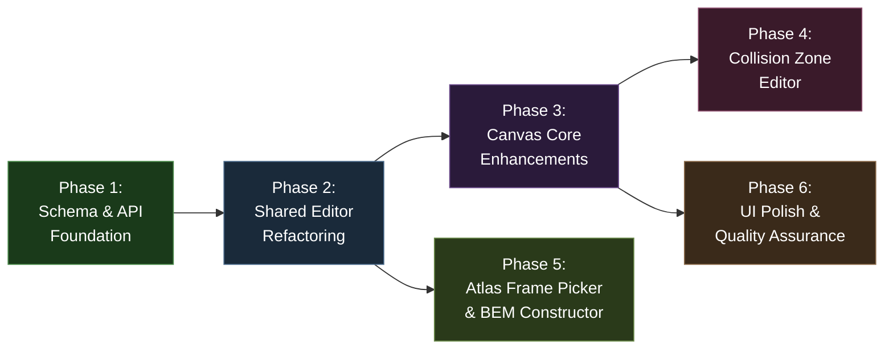
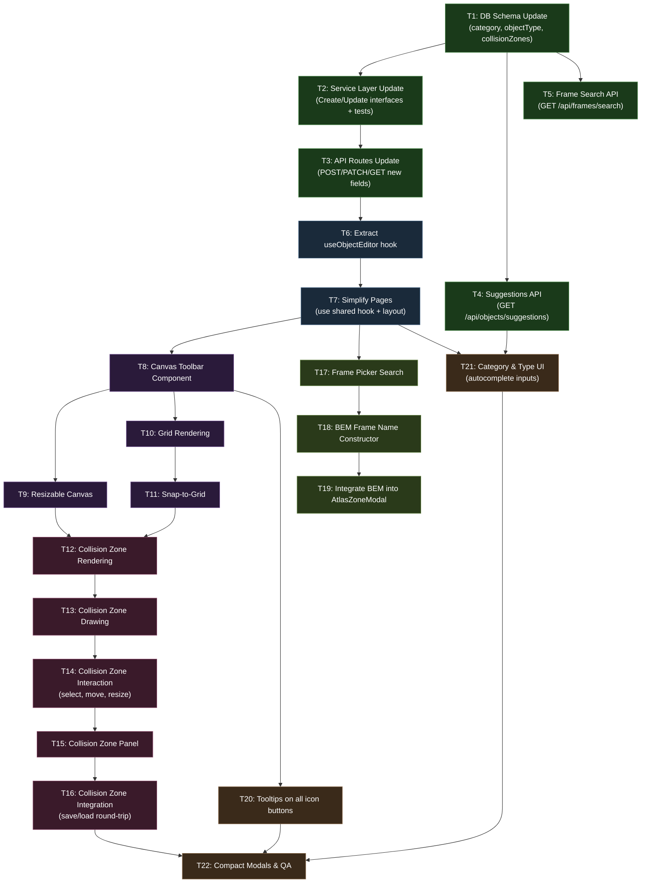

# Work Plan: Advanced Object Editor Enhancement

Created Date: 2026-02-19
Type: feature
Estimated Duration: 10-12 days
Estimated Impact: ~20 files (7 new, 13 modified)
Related Issue/PR: Design-010 / ADR-0008

## Related Documents

- Design Doc: [docs/design/design-010-advanced-object-editor.md](../design/design-010-advanced-object-editor.md)
- ADR: [docs/adr/ADR-0008-object-editor-collision-zones-and-metadata.md](../adr/ADR-0008-object-editor-collision-zones-and-metadata.md)
- ADR: [docs/adr/ADR-0007-sprite-management-storage-and-schema.md](../adr/ADR-0007-sprite-management-storage-and-schema.md)

## Objective

Transform the genmap object editor from a basic layer compositor into a full-featured game object authoring tool. This enhancement adds a resizable canvas with grid snapping, object classification metadata (category/objectType), a visual collision zone editor, improved atlas frame selection with search, a BEM-style frame name constructor, shared component extraction to eliminate code duplication, and tooltips on all icon-only buttons.

## Background

The object editor currently has a fixed 256x256 canvas, no grid assistance, no object classification, no collision zone authoring, no frame search capability, and ~80% code duplication between the create (`objects/new/page.tsx`, 425 lines) and edit (`objects/[id]/page.tsx`, 615 lines) pages. Artists and designers need a more capable editor to produce game-ready object data including collision boundaries, classification metadata, and precise grid-aligned positioning.

## Phase Structure Diagram

## Task Dependency Diagram

## Risks and Countermeasures

### Technical Risks

- **Risk**: Canvas performance degradation at 2048x2048 with grid lines + collision zone overlays + layers rendering simultaneously
  - **Impact**: Medium -- editor becomes sluggish, impacting authoring workflow
  - **Countermeasure**: Grid lines use simple `moveTo`/`lineTo` calls (minimal GPU cost). Limit collision zone overlays to ~10 per object. Profile rendering if frame time exceeds 16ms and optimize by caching grid to offscreen canvas if needed.

- **Risk**: Shared hook extraction (`useObjectEditor`) introduces regressions in existing create/edit workflows
  - **Impact**: High -- existing functionality breaks
  - **Countermeasure**: Extract incrementally: move layer logic first, verify manually, then tags, verify again, then add new features. Run full create/edit/delete flow after each extraction step.

- **Risk**: Collision zone drawing interaction conflicts with existing layer drag interaction on the same canvas
  - **Impact**: Medium -- users cannot reliably draw zones or drag layers
  - **Countermeasure**: Editor mode toggle completely separates the two interaction paths. When in zones mode, layer pointer handlers are disabled. When in layers mode, zone pointer handlers are disabled. No ambiguity.

- **Risk**: Migration conflicts with concurrent schema changes from other feature branches
  - **Impact**: Medium -- migration ordering breaks
  - **Countermeasure**: Check for pending migrations before generating. Coordinate migration numbering with team. Migration is additive-only (new nullable columns), minimizing conflict surface.

### Schedule Risks

- **Risk**: Collision zone interaction (T14: select, move, resize) is the most complex single task, requiring 4 canvas interaction states
  - **Impact**: Could take 2x estimated time
  - **Countermeasure**: Reuse proven patterns from `atlas-zone-canvas.tsx` (drag state machine, rectangle normalization, snap functions). Implement select/move first, add resize handles as a second step.

- **Risk**: BEM autocomplete responsiveness with a large number of existing frame names
  - **Impact**: Low -- suggestions could lag
  - **Countermeasure**: Limit suggestions to 20 entries. Debounce input with 200ms delay. Parse BEM segments client-side from cached frame list.

## Implementation Phases

### Phase 1: Schema & API Foundation (Estimated commits: 5)

**Purpose**: Establish the database schema changes and API endpoints that all subsequent phases depend on. Add `category`, `objectType`, and `collisionZones` columns to `game_objects`, update the service layer interfaces, update API routes, and create new API endpoints for suggestions and frame search.

**Dependencies**: None (starting phase)

#### Tasks

- [ ] **Task 1: DB Schema Update** -- Add `category`, `objectType`, and `collisionZones` columns to `game_objects` schema and generate Drizzle migration
  - Add `CollisionZone` interface to `packages/db/src/schema/game-objects.ts`
  - Add `category: varchar('category', { length: 100 })` column
  - Add `objectType: varchar('object_type', { length: 100 })` column
  - Add `collisionZones: jsonb('collision_zones')` column (nullable, default `null`)
  - Run `drizzle-kit generate` to produce migration file `packages/db/src/migrations/0005_*.sql`
  - Apply migration to local database
  - **Files**: `packages/db/src/schema/game-objects.ts`, `packages/db/src/migrations/0005_*.sql`, `packages/db/src/migrations/meta/_journal.json`, `packages/db/src/migrations/meta/0005_snapshot.json`
  - **Acceptance Criteria**:
    - [ ] `CollisionZone` interface matches ADR-0008 definition (id, label, type, shape, x, y, width, height)
    - [ ] Migration SQL contains `ALTER TABLE game_objects ADD COLUMN category VARCHAR(100)`
    - [ ] Migration SQL contains `ALTER TABLE game_objects ADD COLUMN object_type VARCHAR(100)`
    - [ ] Migration SQL contains `ALTER TABLE game_objects ADD COLUMN collision_zones JSONB`
    - [ ] Existing game_objects rows are unaffected (columns nullable, no data loss)
    - [ ] `drizzle-kit generate` completes without errors

- [ ] **Task 2: Service Layer Update** -- Update `CreateGameObjectData` and `UpdateGameObjectData` interfaces with new fields. Add `getDistinctFieldValues` function. Update unit tests.
  - Add `category?: string | null`, `objectType?: string | null`, `collisionZones?: CollisionZone[] | null` to both interfaces
  - Add `getDistinctFieldValues(db, field: 'category' | 'object_type')` function using `SELECT DISTINCT`
  - Add `searchFramesByFilename(db, query: string, limit?: number)` function joining atlas_frames with sprites
  - Update `game-object.spec.ts`: add test cases for create/update with new fields, test `getDistinctFieldValues`, test `searchFramesByFilename`
  - **Files**: `packages/db/src/services/game-object.ts`, `packages/db/src/services/game-object.spec.ts`
  - **Acceptance Criteria**:
    - [ ] `CreateGameObjectData` and `UpdateGameObjectData` include `category`, `objectType`, `collisionZones` as optional fields
    - [ ] `getDistinctFieldValues` returns `string[]` of non-null distinct values sorted alphabetically
    - [ ] `searchFramesByFilename` returns frames matching query (case-insensitive), limited to 100 results
    - [ ] All existing tests continue to pass (no regressions)
    - [ ] New test cases pass for create/update with new fields
    - [ ] New test cases pass for `getDistinctFieldValues` and `searchFramesByFilename`

- [ ] **Task 3: API Routes Update** -- Update POST/PATCH/GET routes for objects to handle new fields (`category`, `objectType`, `collisionZones`)
  - Update `apps/genmap/src/app/api/objects/route.ts` POST handler to extract and pass-through `category`, `objectType`, `collisionZones` from request body
  - Update `apps/genmap/src/app/api/objects/[id]/route.ts` PATCH handler to conditionally update new fields using `if (field !== undefined)` pattern
  - Validate `collisionZones` array structure at API layer before passing to service (check array, check each zone has required fields, check positive dimensions, valid `type` values)
  - GET responses automatically include new columns (no changes needed for GET handlers)
  - **Files**: `apps/genmap/src/app/api/objects/route.ts`, `apps/genmap/src/app/api/objects/[id]/route.ts`
  - **Acceptance Criteria**:
    - [ ] POST `/api/objects` accepts and persists `category`, `objectType`, `collisionZones`
    - [ ] PATCH `/api/objects/[id]` accepts and updates `category`, `objectType`, `collisionZones`
    - [ ] GET `/api/objects` and GET `/api/objects/[id]` return new fields in response
    - [ ] Invalid `collisionZones` format returns HTTP 400 with descriptive error message
    - [ ] Existing create/edit/delete API flows work unchanged when new fields are omitted

- [ ] **Task 4: Suggestions API** -- Create new `GET /api/objects/suggestions?field=category|objectType` endpoint returning distinct values
  - Create `apps/genmap/src/app/api/objects/suggestions/route.ts`
  - Validate `field` query parameter is `category` or `objectType`
  - Call `getDistinctFieldValues` from service layer
  - Return JSON array of distinct non-null values, sorted alphabetically
  - Return HTTP 400 if `field` is missing or invalid
  - **Files**: `apps/genmap/src/app/api/objects/suggestions/route.ts`
  - **Acceptance Criteria**:
    - [ ] `GET /api/objects/suggestions?field=category` returns `string[]` of distinct categories
    - [ ] `GET /api/objects/suggestions?field=objectType` returns `string[]` of distinct object types
    - [ ] Returns empty array `[]` when no objects have values for the requested field
    - [ ] Returns HTTP 400 with error message for missing or invalid `field` parameter
    - [ ] Response does not contain `null` values

- [ ] **Task 5: Frame Search API** -- Create new `GET /api/frames/search?q=term` endpoint searching frame filenames across all sprites
  - Create `apps/genmap/src/app/api/frames/search/route.ts`
  - Validate `q` query parameter is non-empty
  - Call `searchFramesByFilename` from service layer
  - Return JSON array of `{ filename, spriteId, spriteName }` objects, limited to 100 results
  - Return HTTP 400 if `q` is missing or empty
  - **Files**: `apps/genmap/src/app/api/frames/search/route.ts`
  - **Acceptance Criteria**:
    - [ ] `GET /api/frames/search?q=tree` returns frames with "tree" in their filename (case-insensitive)
    - [ ] Each result includes `filename`, `spriteId`, and `spriteName`
    - [ ] Results are limited to 100 entries maximum
    - [ ] Returns HTTP 400 for missing or empty `q` parameter
    - [ ] Returns empty array when no frames match the query

- [ ] Quality check: TypeScript typecheck passes, lint passes, all existing tests pass
- [ ] Unit tests: All service layer tests pass including new test cases

#### Phase Completion Criteria

- [ ] Migration applied successfully; existing data intact
- [ ] All CRUD operations work with and without new fields
- [ ] Both new API endpoints return correct responses
- [ ] All unit tests pass (existing + new)
- [ ] `pnpm nx typecheck db` passes

#### Operational Verification Procedures

1. **Schema Migration**: Run `pnpm nx drizzle:generate db` and apply migration. Query `game_objects` table to verify three new columns exist with null values for existing rows.
2. **Service Layer**: Run `pnpm nx test db --testFile=services/game-object.spec.ts` and verify all tests pass.
3. **API Routes**: Use `curl` or browser to test:
   - `POST /api/objects` with `category`, `objectType`, and `collisionZones` fields -- verify 200 response with new fields populated
   - `PATCH /api/objects/:id` updating only `category` -- verify only that field changes
   - `GET /api/objects/suggestions?field=category` -- verify distinct values returned
   - `GET /api/frames/search?q=<term>` -- verify matching frames returned
4. **Backward Compatibility**: Create an object without new fields (omit category, objectType, collisionZones). Verify it saves correctly with null values.

---

### Phase 2: Shared Editor Refactoring (Estimated commits: 2)

**Purpose**: Extract shared logic from `objects/new/page.tsx` and `objects/[id]/page.tsx` into a reusable `useObjectEditor` hook, eliminating ~80% code duplication. This refactoring establishes the component architecture that all subsequent feature additions build upon.

**Dependencies**: Phase 1 (schema must exist for hook to reference new field types)

#### Tasks

- [ ] **Task 6: Extract `useObjectEditor` hook** -- Move layer management, tag management, collision zone management, and save/load logic from page components into a shared hook
  - Create `apps/genmap/src/hooks/use-object-editor.ts`
  - Extract layer management functions: `handleLayerAdd`, `handleLayerUpdate`, `handleLayerDelete`, `handleMoveLayerUp`, `handleMoveLayerDown`
  - Extract tag management functions: `addTag`, `removeTag`, `handleTagKeyDown`
  - Add collision zone management functions: `handleZoneAdd`, `handleZoneUpdate`, `handleZoneDelete`
  - Add metadata state: `category`, `setCategory`, `objectType`, `setObjectType`
  - Add save state management: `isSaving`, `error`, `handleSave`
  - Hook interface matches Design Doc `UseObjectEditorOptions` and `UseObjectEditorReturn`
  - **Files**: `apps/genmap/src/hooks/use-object-editor.ts`
  - **Acceptance Criteria**:
    - [ ] Hook encapsulates all layer CRUD operations (add, update, delete, move up/down)
    - [ ] Hook encapsulates all tag operations (add, remove, key down handler)
    - [ ] Hook encapsulates collision zone operations (add, update, delete)
    - [ ] Hook manages metadata state (name, description, category, objectType)
    - [ ] Hook manages save workflow (isSaving flag, error state, handleSave callback)
    - [ ] Hook interface matches Design Doc `UseObjectEditorReturn` type
    - [ ] Hook accepts `initialData` for edit mode and empty defaults for create mode

- [ ] **Task 7: Simplify Pages** -- Refactor `objects/new/page.tsx` and `objects/[id]/page.tsx` to use `useObjectEditor` hook
  - Replace inline state and functions in `objects/new/page.tsx` with `useObjectEditor` hook call
  - Replace inline state and functions in `objects/[id]/page.tsx` with `useObjectEditor` hook call (keep edit-specific loading logic in page component)
  - Verify both pages render identically before and after refactoring
  - Total lines of code across both pages should decrease by at least 30%
  - **Files**: `apps/genmap/src/app/objects/new/page.tsx`, `apps/genmap/src/app/objects/[id]/page.tsx`
  - **Acceptance Criteria**:
    - [ ] `objects/new/page.tsx` uses `useObjectEditor` hook instead of inline state management
    - [ ] `objects/[id]/page.tsx` uses `useObjectEditor` hook instead of inline state management
    - [ ] Edit page retains `loadLayersWithSpriteUrls()` logic (edit-specific data fetching)
    - [ ] Create new object flow works identically (add layers, add tags, save)
    - [ ] Edit existing object flow works identically (load, modify, save)
    - [ ] Delete object flow works identically
    - [ ] Combined line count reduction is at least 30% compared to current state
    - [ ] No console errors or warnings introduced

- [ ] Quality check: TypeScript typecheck passes, lint passes
- [ ] Manual integration test: Create an object, edit an object, delete an object -- all work identically to pre-refactor behavior

#### Phase Completion Criteria

- [ ] Both pages use `useObjectEditor` hook
- [ ] All existing create/edit/delete functionality works unchanged
- [ ] No duplicate layer management or tag management code remains in page components
- [ ] Combined line count reduction is at least 30%
- [ ] `pnpm nx typecheck genmap` passes
- [ ] `pnpm nx lint genmap` passes

#### Operational Verification Procedures

1. **Create Flow**: Navigate to `/objects/new`, add 2-3 layers from the frame picker, add tags, enter name/description, save. Verify object appears in list with correct data.
2. **Edit Flow**: Open the saved object in edit mode. Verify layers, tags, name, description load correctly. Modify a layer position, change the name, save. Verify changes persist.
3. **Delete Flow**: Delete the test object. Verify it is removed from the list.
4. **Regression Check**: Repeat all steps from pre-refactor manual test to confirm identical behavior.

---

### Phase 3: Canvas Core Enhancements (Estimated commits: 4)

**Purpose**: Add the canvas toolbar, resizable canvas, grid rendering, and snap-to-grid functionality. These are the core canvas improvements that the collision zone editor (Phase 4) and UI polish (Phase 6) depend on.

**Dependencies**: Phase 2 (toolbar integrates with refactored editor state via `useObjectEditor`)

#### Tasks

- [ ] **Task 8: Canvas Toolbar Component** -- Create new `CanvasToolbar` component with all canvas controls
  - Create `apps/genmap/src/components/canvas-toolbar.tsx`
  - Implement canvas size inputs (width, height) with min 64 / max 2048 clamping
  - Implement "Fit" button (calculates bounding box of all layers, adds 16px padding each side)
  - Implement grid preset buttons: 8x8, 16x16 (default), 32x32, 64x64
  - Implement grid visibility toggle (show/hide grid lines)
  - Implement snap mode toggle (snap-to-grid / free placement)
  - Implement editor mode toggle ("Layers" / "Collision Zones")
  - All buttons wrapped with shadcn `<Tooltip>` showing descriptive text
  - Persist grid settings (gridSize, showGrid, snapToGrid) to `localStorage` following `useCanvasBackground` pattern
  - Props interface matches Design Doc `CanvasToolbarProps`
  - **Files**: `apps/genmap/src/components/canvas-toolbar.tsx`
  - **Acceptance Criteria**:
    - [ ] Toolbar renders width/height inputs, fit button, grid presets, grid toggle, snap toggle, editor mode toggle
    - [ ] Width/height inputs clamp to range [64, 2048]
    - [ ] Width/height inputs step by the current grid cell size
    - [ ] Fit button calculates correct bounding box from layers (with 16px padding)
    - [ ] Fit button is disabled when no layers exist (uses `hasLayers` prop)
    - [ ] Grid presets set gridSize to 8, 16, 32, or 64
    - [ ] Grid toggle shows/hides grid lines
    - [ ] Snap toggle switches between snap and free mode
    - [ ] Editor mode toggle switches between "Layers" and "Collision Zones"
    - [ ] Grid settings persist to `localStorage` across browser sessions
    - [ ] All icon-only buttons have tooltip wrappers

- [ ] **Task 9: Resizable Canvas** -- Wire toolbar canvas size inputs to `ObjectGridCanvas` `canvasWidth`/`canvasHeight` props and implement fit-to-content
  - Add controlled `canvasWidth` and `canvasHeight` state to `useObjectEditor` or page-level state
  - Wire `CanvasToolbar.onCanvasSizeChange` to update canvas dimensions
  - Implement fit-to-content logic: iterate all layers, compute min/max coordinates including frame dimensions, add 16px padding
  - When no layers exist and fit is clicked, keep current canvas size unchanged
  - **Files**: `apps/genmap/src/components/object-grid-canvas.tsx`, `apps/genmap/src/app/objects/new/page.tsx`, `apps/genmap/src/app/objects/[id]/page.tsx`
  - **Acceptance Criteria**:
    - [ ] Canvas resizes when width or height inputs change in the toolbar
    - [ ] Canvas respects min 64 and max 2048 boundaries
    - [ ] Fit button sets canvas to bounding box of all layers plus 16px padding on each side
    - [ ] Fit button does nothing when no layers exist
    - [ ] Canvas renders correctly at all sizes within the valid range
    - [ ] Default canvas size remains 256x256 (AC: Feature 1)

- [ ] **Task 10: Grid Rendering** -- Add grid line rendering to `ObjectGridCanvas` render loop
  - Insert grid rendering step between background fill and layer rendering in the `render()` callback
  - Grid lines rendered as semi-transparent strokes (e.g., `rgba(255, 255, 255, 0.15)`)
  - Grid line width: 1px (or 0.5px for finer grids)
  - Use `showGrid` prop to control visibility
  - Use `gridSize` prop for line spacing
  - Follow rendering pattern from `atlas-zone-canvas.tsx` lines 342-361
  - **Files**: `apps/genmap/src/components/object-grid-canvas.tsx`
  - **Acceptance Criteria**:
    - [ ] Grid lines render on canvas after background and before frame layers (AC: Feature 2)
    - [ ] Grid lines are semi-transparent and do not obscure layer content
    - [ ] Grid spacing matches all preset sizes: 8, 16, 32, 64 pixels
    - [ ] Grid lines toggle on/off via `showGrid` prop
    - [ ] Canvas renders at 60fps with grid lines enabled at maximum canvas size (2048x2048)
    - [ ] Grid is not rendered when `showGrid` is false (default behavior preserved)

- [ ] **Task 11: Snap-to-Grid** -- Implement snap logic in drag handler
  - When `snapToGrid` is true and user drags a layer, snap `xOffset`/`yOffset` to nearest grid boundary: `Math.round(value / gridSize) * gridSize`
  - When `snapToGrid` is false, layer positions are set to exact pixel values (current behavior)
  - Modify `handlePointerMove` in `ObjectGridCanvas` to apply snap formula conditionally
  - Reference `atlas-zone-canvas.tsx` lines 129-131 for `snapToTile()` and `snapToTileCeil()` patterns
  - **Files**: `apps/genmap/src/components/object-grid-canvas.tsx`
  - **Acceptance Criteria**:
    - [ ] When snap mode is active, dragged layer coordinates are multiples of gridSize (AC: Feature 2)
    - [ ] When free mode is active, layers are placed at exact pixel positions (current behavior) (AC: Feature 2)
    - [ ] Snap applies to both xOffset and yOffset independently
    - [ ] Snap works correctly with all grid preset sizes (8, 16, 32, 64)
    - [ ] Layer add (click-to-place) also respects snap mode
    - [ ] No visual jitter or unexpected jumps during drag

- [ ] Quality check: TypeScript typecheck passes, lint passes
- [ ] Manual integration test: Toolbar controls work, canvas resizes, grid renders, snap mode functions correctly

#### Phase Completion Criteria

- [ ] Canvas toolbar renders all controls with tooltips
- [ ] Canvas resizes dynamically within valid range
- [ ] Grid lines render correctly at all preset sizes
- [ ] Snap-to-grid constrains layer positions to grid boundaries
- [ ] Free placement mode works as before (regression check)
- [ ] Grid settings persist across browser sessions via `localStorage`
- [ ] `pnpm nx typecheck genmap` passes
- [ ] `pnpm nx lint genmap` passes

#### Operational Verification Procedures

1. **Toolbar Rendering**: Open object editor. Verify toolbar appears above canvas with all controls (size inputs, fit, grid presets, grid toggle, snap toggle, mode toggle).
2. **Canvas Resize**: Change width to 512, height to 384. Verify canvas visually resizes. Enter value below 64 -- verify it clamps to 64. Enter value above 2048 -- verify it clamps to 2048.
3. **Fit Button**: Add 3 layers at different positions. Click "Fit". Verify canvas resizes to contain all layers with padding. Remove all layers, click "Fit" -- verify no change.
4. **Grid Rendering**: Toggle grid on. Verify lines appear. Switch between preset sizes (8, 16, 32, 64) -- verify grid spacing changes. Toggle grid off -- verify lines disappear.
5. **Snap-to-Grid**: Enable snap mode with 16px grid. Drag a layer -- verify it snaps to 16px increments. Switch to free mode -- verify layer moves to exact pixel position. Switch to 32px grid in snap mode -- verify snaps to 32px increments.
6. **Grid Persistence**: Set grid to 32px snap mode. Refresh the browser page. Verify grid settings are restored from `localStorage`.

---

### Phase 4: Collision Zone Editor (Estimated commits: 5)

**Purpose**: Implement the visual collision zone editor -- the most complex feature in this enhancement. Users can draw, select, move, resize, and delete rectangular collision zones on the canvas. Zones are saved as JSONB data with the game object and map directly to Phaser 3 Arcade Physics `StaticBody` API.

**Dependencies**: Phase 3 (collision zone rendering requires enhanced canvas with grid support; editor mode toggle lives in the toolbar)

#### Tasks

- [ ] **Task 12: Collision Zone Rendering** -- Add collision zone overlay rendering to `ObjectGridCanvas`
  - Add rendering step after layer rendering and before selection highlight in the `render()` callback
  - Render each collision zone as a semi-transparent colored rectangle:
    - `type: 'collision'` -> red fill (`rgba(255, 0, 0, 0.2)`) with red stroke
    - `type: 'walkable'` -> green fill (`rgba(0, 255, 0, 0.2)`) with green stroke
  - Render zone labels (text) centered inside each zone
  - Highlight selected zone with thicker stroke and resize handles (8px squares on corners and edge midpoints)
  - When editor mode is "zones", render frame layers at reduced opacity (0.3)
  - Adapt rendering patterns from `atlas-zone-canvas.tsx` lines 364-410
  - **Files**: `apps/genmap/src/components/object-grid-canvas.tsx`
  - **Acceptance Criteria**:
    - [ ] Collision zones render as semi-transparent rectangles overlaid on the canvas (AC: Feature 4)
    - [ ] `collision` type zones render red; `walkable` type zones render green (AC: Feature 4)
    - [ ] Selected zone shows thicker stroke and resize handles
    - [ ] Zone labels display centered inside each zone
    - [ ] In collision zone mode, frame layers render at opacity 0.3 (AC: Feature 4)
    - [ ] In layers mode, collision zones are still visible but non-interactive

- [ ] **Task 13: Collision Zone Drawing** -- Implement click+drag to create new zones on canvas when in collision zone mode
  - Add `drawing-zone` interaction state to canvas state machine
  - On `pointerdown` (in zones mode, on empty area): start drawing zone, record start coordinates
  - On `pointermove` (while drawing): render zone preview rectangle from start to current position
  - On `pointerup` (after drawing): normalize rectangle (ensure positive width/height), discard if area is zero, call `onZoneAdd` with `{label: 'Zone N', type: 'collision', shape: 'rectangle', x, y, width, height}`
  - Apply snap-to-grid to zone coordinates if snap mode is active
  - Reuse `dragToRect()` normalization pattern from `atlas-zone-canvas.tsx` lines 144-169
  - **Files**: `apps/genmap/src/components/object-grid-canvas.tsx`
  - **Acceptance Criteria**:
    - [ ] Click-drag on empty canvas area in zones mode creates a new collision zone (AC: Feature 4)
    - [ ] Zone preview renders during drag
    - [ ] Zone dimensions are normalized to positive values (dragging any direction works)
    - [ ] Zones with zero width or height are discarded
    - [ ] New zones receive default label "Zone N" (where N is index + 1) and type "collision"
    - [ ] Zone coordinates respect snap-to-grid when active
    - [ ] Drawing does not occur in layers mode

- [ ] **Task 14: Collision Zone Interaction** -- Implement select, move, and resize for zones
  - **Select**: Click on an existing zone to select it. Click on empty area to deselect. Call `onZoneSelect(index)` or `onZoneSelect(null)`.
  - **Move**: Drag a selected zone's body to reposition it. Update x/y coordinates. Apply snap if active. Call `onZoneUpdate(index, {x, y})`.
  - **Resize**: Drag a resize handle (corner or edge midpoint) on a selected zone to resize it. Maintain minimum 8px width/height. Apply snap if active. Call `onZoneUpdate(index, {x, y, width, height})`.
  - Add interaction states: `idle`, `dragging-zone`, `resizing-zone` to canvas state machine (alongside existing `drawing-zone`)
  - Hit-test resize handles (8px squares) before zone body to allow resizing small zones
  - **Files**: `apps/genmap/src/components/object-grid-canvas.tsx`
  - **Acceptance Criteria**:
    - [ ] Clicking a zone selects it and shows selection highlight with resize handles (AC: Feature 4)
    - [ ] Clicking empty area deselects any selected zone
    - [ ] Dragging a selected zone repositions it (AC: Feature 4)
    - [ ] Dragging a resize handle resizes the zone (AC: Feature 4)
    - [ ] Minimum zone size is 8x8 pixels (prevents zero-size zones)
    - [ ] Move and resize respect snap-to-grid when active
    - [ ] Only one zone can be selected at a time
    - [ ] Switching to layers mode deselects any selected zone

- [ ] **Task 15: Collision Zone Panel** -- Create `CollisionZonePanel` component for right sidebar
  - Create `apps/genmap/src/components/collision-zone-panel.tsx`
  - Render zone list showing label, type badge (red/green), and clickable selection
  - For selected zone, show editable fields: label (text input), type toggle (collision/walkable), x, y, width, height (number inputs)
  - Delete button for selected zone
  - "Add Zone" button that creates an empty zone at canvas center
  - Zone type toggle changes color between red (collision) and green (walkable)
  - Props interface matches Design Doc `CollisionZonePanelProps`
  - **Files**: `apps/genmap/src/components/collision-zone-panel.tsx`
  - **Acceptance Criteria**:
    - [ ] Zone list displays all collision zones with label and type color badge (AC: Feature 4)
    - [ ] Clicking a zone in the list selects it (syncs with canvas selection)
    - [ ] Selected zone shows editable label, type toggle, position/size fields (AC: Feature 4)
    - [ ] Changing type toggles color between red (collision) and green (walkable) (AC: Feature 4)
    - [ ] Delete button removes the selected zone
    - [ ] "Add Zone" button creates a new zone at canvas center
    - [ ] Number inputs for x, y, width, height update the zone in real-time
    - [ ] Panel is visible when editor mode is "Collision Zones"

- [ ] **Task 16: Collision Zone Integration** -- Wire collision zones into `useObjectEditor` hook, save/load with API
  - Connect `CollisionZonePanel` callbacks to `useObjectEditor` hook zone management functions
  - Connect `ObjectGridCanvas` zone callbacks to `useObjectEditor` hook
  - Include `collisionZones` in the save payload sent to API (POST/PATCH)
  - Parse `collisionZones` from API response when loading an existing object (GET)
  - Test full round-trip: draw zones -> save -> reload page -> zones appear at correct positions
  - **Files**: `apps/genmap/src/hooks/use-object-editor.ts`, `apps/genmap/src/app/objects/new/page.tsx`, `apps/genmap/src/app/objects/[id]/page.tsx`
  - **Acceptance Criteria**:
    - [ ] Collision zones are included in POST payload when creating an object (AC: Feature 4)
    - [ ] Collision zones are included in PATCH payload when updating an object (AC: Feature 4)
    - [ ] Collision zones are loaded from GET response when editing an existing object
    - [ ] Zones persist across page reloads (save -> navigate away -> return -> zones intact)
    - [ ] Deleting all zones results in empty array `[]` being saved (not null)
    - [ ] Creating an object without zones works correctly (null or empty array)

- [ ] Quality check: TypeScript typecheck passes, lint passes
- [ ] Manual integration test: Full collision zone workflow verified

#### Phase Completion Criteria

- [ ] Users can draw, select, move, resize, and delete collision zones on the canvas
- [ ] Zone list panel shows all zones with editable properties
- [ ] Zone type toggle changes overlay color (red/green)
- [ ] Collision zones save to database and load correctly on page refresh
- [ ] Full round-trip verified: create with zones -> save -> reload -> zones intact
- [ ] Canvas interaction states (idle, drawing, dragging, resizing) work correctly
- [ ] No conflicts between layer interaction and zone interaction (mode separation)
- [ ] `pnpm nx typecheck genmap` passes
- [ ] `pnpm nx lint genmap` passes

#### Operational Verification Procedures

1. **Zone Drawing**: Switch to "Collision Zones" mode. Click-drag on the canvas to draw a rectangle. Verify a red zone appears. Verify layers render at reduced opacity.
2. **Zone Selection**: Click the drawn zone. Verify selection highlight and resize handles appear. Click empty area. Verify zone is deselected.
3. **Zone Move**: Select a zone, drag its body. Verify it repositions. Enable snap mode -- verify zone snaps to grid.
4. **Zone Resize**: Select a zone, drag a corner handle. Verify zone resizes. Verify minimum 8x8 size.
5. **Zone Panel**: Verify zone appears in right panel list. Select zone via panel click -- verify canvas syncs. Edit label, toggle type to "walkable" -- verify green color. Edit x/y/width/height via number inputs -- verify canvas updates.
6. **Round-Trip**: Create an object with 2 collision zones (one collision, one walkable). Save. Navigate to object list. Open the object in edit mode. Verify both zones appear at correct positions with correct types.
7. **Delete Zone**: Select a zone, click delete in panel. Verify zone is removed from canvas and list. Save. Reload. Verify zone is gone.

---

### Phase 5: Atlas Frame Picker & BEM Constructor (Estimated commits: 3)

**Purpose**: Enhance the atlas frame picker with search/filter functionality and add a BEM-style frame name constructor as an alternative input mode in the AtlasZoneModal. These features are independent of the collision zone editor and can run in parallel after Phase 2.

**Dependencies**: Phase 2 (shared hook must be extracted before modifying picker integration); Task 5 (Frame Search API must exist for search)

#### Tasks

- [ ] **Task 17: Frame Picker Search** -- Add search input to `AtlasFramePicker`, filter frames by filename across all sprites
  - Add search text input at the top of the `AtlasFramePicker` component
  - When text is entered, filter displayed frames by filename match (case-insensitive `includes`)
  - Auto-expand sprite sections that contain matching frames
  - Show frame count badges on sprite section headers
  - Increase frame filename label max-width or add tooltip for full name display
  - Search is client-side filtering of already-loaded frame data (no API call needed for filtering; API is available for cross-sprite search if sprites are lazily loaded)
  - **Files**: `apps/genmap/src/components/atlas-frame-picker.tsx`
  - **Acceptance Criteria**:
    - [ ] Search input renders at the top of the frame picker (AC: Feature 5)
    - [ ] Typing in search input filters visible frames by filename match (AC: Feature 5)
    - [ ] Sprites with matching frames auto-expand when searching (AC: Feature 5)
    - [ ] Frame count badges display on sprite section headers (AC: Feature 5)
    - [ ] Full filename is visible via increased max-width or tooltip on hover (AC: Feature 5)
    - [ ] Clearing the search input restores the full unfiltered list
    - [ ] Search is case-insensitive

- [ ] **Task 18: BEM Frame Name Constructor** -- Create new component with 3-field input (block/element/modifier) and autocomplete
  - Create `apps/genmap/src/components/bem-frame-name-constructor.tsx`
  - Three input fields: Block, Element, Modifier
  - Live preview showing constructed name: `block_element--modifier`
  - Block field autocomplete: unique first segments of existing frame filenames (split by `_` and `--`)
  - Element field autocomplete: segments that appear after the selected block
  - Modifier field autocomplete: segments that appear after the selected block+element
  - Parse existing filenames client-side to extract BEM segments
  - Props interface matches Design Doc `BemFrameNameConstructorProps`
  - **Files**: `apps/genmap/src/components/bem-frame-name-constructor.tsx`
  - **Acceptance Criteria**:
    - [ ] Three input fields render: Block, Element, Modifier (AC: Feature 6)
    - [ ] Live preview shows constructed name in `block_element--modifier` format (AC: Feature 6)
    - [ ] Block field shows autocomplete suggestions from unique first segments of existing filenames (AC: Feature 6)
    - [ ] Element field shows cascading suggestions based on selected block (AC: Feature 6)
    - [ ] Modifier field shows cascading suggestions based on selected block+element (AC: Feature 6)
    - [ ] Omitting element or modifier produces correct partial names (e.g., `block` or `block_element`)
    - [ ] `onChange` callback fires with constructed filename whenever any field changes

- [ ] **Task 19: Integrate BEM Constructor into AtlasZoneModal** -- Add BEM constructor as an alternative filename input mode
  - Add a mode toggle in `AtlasZoneModal`: "Manual" (existing plain text Input) and "Constructor" (BEM component)
  - When in "Constructor" mode, the `BemFrameNameConstructor` replaces the plain filename Input
  - Both modes write to the same filename state
  - Pass `existingFilenames` from current sprite's frames to BEM constructor for autocomplete
  - **Files**: `apps/genmap/src/components/atlas-zone-modal.tsx`
  - **Acceptance Criteria**:
    - [ ] AtlasZoneModal shows a mode toggle: "Manual" and "Constructor" (AC: Feature 6)
    - [ ] Toggling to "Constructor" shows BEM name builder instead of plain input
    - [ ] Toggling back to "Manual" preserves the current filename value
    - [ ] Constructed BEM name is written to the same filename field used by manual mode
    - [ ] Autocomplete suggestions work correctly with the current sprite's frame names

- [ ] Quality check: TypeScript typecheck passes, lint passes
- [ ] Manual integration test: Frame search and BEM constructor work correctly

#### Phase Completion Criteria

- [ ] Frame picker search filters frames by filename across all sprites
- [ ] BEM constructor builds valid filenames from block/element/modifier fields
- [ ] BEM autocomplete shows relevant suggestions from existing filenames
- [ ] AtlasZoneModal supports both manual and constructor input modes
- [ ] `pnpm nx typecheck genmap` passes
- [ ] `pnpm nx lint genmap` passes

#### Operational Verification Procedures

1. **Frame Search**: Open the frame picker in the object editor. Type a partial frame name in the search input. Verify only matching frames are shown. Verify sprites with matches auto-expand. Clear search -- verify full list restores.
2. **Frame Count Badges**: Verify sprite section headers show frame count numbers.
3. **BEM Constructor**: Open AtlasZoneModal (e.g., when defining a new atlas zone in the sprite editor). Toggle to "Constructor" mode. Type a block name -- verify autocomplete suggestions appear. Select or type an element -- verify suggestions cascade. Type a modifier. Verify the live preview shows `block_element--modifier`. Verify the filename field updates.
4. **Mode Toggle**: Switch between "Manual" and "Constructor". Verify filename value persists across mode switches.

---

### Phase 6: UI Polish & Quality Assurance (Estimated commits: 3)

**Purpose**: Add tooltips to all remaining icon-only buttons, implement category/type autocomplete UI fields, compact modal styling, and perform final quality assurance including full acceptance criteria verification, test execution, and regression testing.

**Dependencies**: Phase 3 (toolbar must exist for tooltip wrapping); Phase 4 Task 16 (collision zone integration must be complete for full QA); Phase 5 (BEM constructor and frame search for complete feature set)

#### Tasks

- [ ] **Task 20: Tooltips** -- Add `Tooltip` wrappers to all icon-only buttons throughout the editor
  - Audit all icon-only buttons in: canvas toolbar, layer list (move up, move down, delete), collision zone panel (type toggle, delete, add), frame picker (collapse/expand), and any other identified locations
  - Wrap each icon button with `<Tooltip><TooltipTrigger asChild>...<TooltipContent>description</TooltipContent></Tooltip>`
  - Use the existing shadcn Tooltip component from `@/components/ui/tooltip`
  - **Files**: `apps/genmap/src/components/canvas-toolbar.tsx`, `apps/genmap/src/app/objects/new/page.tsx`, `apps/genmap/src/app/objects/[id]/page.tsx`, `apps/genmap/src/components/collision-zone-panel.tsx`, `apps/genmap/src/components/atlas-frame-picker.tsx`
  - **Acceptance Criteria**:
    - [ ] All icon-only buttons in the editor display descriptive tooltips on hover (AC: Feature 7)
    - [ ] Tooltips use the existing shadcn Tooltip component (AC: Feature 7)
    - [ ] Tooltip text is descriptive and helps discoverability (e.g., "Move layer up", "Delete zone", "Toggle grid")
    - [ ] Tooltips do not interfere with button click behavior
    - [ ] No tooltip appears on buttons that already have visible text labels

- [ ] **Task 21: Category & Type UI** -- Add `category` and `objectType` input fields with autocomplete to the right panel metadata section
  - Add text input fields for `category` and `objectType` in the right panel metadata section (alongside name, description, tags)
  - Implement autocomplete dropdown using `GET /api/objects/suggestions?field=category` and `GET /api/objects/suggestions?field=objectType`
  - Fetch suggestions on component mount and on field focus
  - Filter suggestions as user types (client-side filtering of fetched list)
  - Wire field values to `useObjectEditor` hook `category`/`setCategory` and `objectType`/`setObjectType`
  - **Files**: `apps/genmap/src/app/objects/new/page.tsx`, `apps/genmap/src/app/objects/[id]/page.tsx`
  - **Acceptance Criteria**:
    - [ ] Category and objectType input fields appear in the right panel metadata section (AC: Feature 3)
    - [ ] Typing shows autocomplete dropdown with existing distinct values from other objects (AC: Feature 3)
    - [ ] Selecting a suggestion populates the field
    - [ ] Fields accept free-text input (not limited to existing values)
    - [ ] Field values are saved with the object (POST/PATCH payload includes category, objectType) (AC: Feature 3)
    - [ ] Field values load correctly when editing an existing object
    - [ ] Empty fields save as null (not empty string)
    - [ ] Autocomplete fetches suggestions from `/api/objects/suggestions` endpoint (AC: Feature 3)

- [ ] **Task 22: Compact Modals & Final QA** -- Reduce sizing in AtlasZoneModal, perform comprehensive quality assurance
  - Reduce padding and input heights in `AtlasZoneModal` and related dialogs (use `size="sm"` on inputs, reduce dialog padding)
  - **Full Acceptance Criteria Verification**: Walk through every AC from Design Doc Features 1-7 and Shared Component Extraction
  - **Regression Testing**: Verify all existing create/edit/delete object flows work correctly
  - **Cross-Feature Integration**: Test scenarios combining multiple features (e.g., create object with layers + collision zones + category + type, save, reload, verify all data)
  - **Edge Cases**: Test boundary values (min/max canvas size, zero-area collision zones, empty category, very long frame filenames)
  - Run `pnpm nx typecheck genmap` -- zero errors
  - Run `pnpm nx lint genmap` -- zero errors
  - **Files**: `apps/genmap/src/components/atlas-zone-modal.tsx`
  - **Acceptance Criteria**:
    - [ ] AtlasZoneModal uses compact form fields (reduced padding, smaller inputs) (AC: Feature 7)
    - [ ] All Design Doc acceptance criteria (Features 1-7 + Shared Component Extraction) are satisfied
    - [ ] All existing create/edit/delete functionality works correctly (regression)
    - [ ] Canvas renders smoothly at 2048x2048 with grid + zones + layers
    - [ ] TypeScript typecheck passes with zero errors
    - [ ] ESLint passes with zero errors
    - [ ] No console errors or warnings during normal editor usage

- [ ] Quality check: TypeScript typecheck passes, lint passes, format check passes
- [ ] Comprehensive manual testing of all features end-to-end

#### Phase Completion Criteria

- [ ] All icon-only buttons have descriptive tooltips
- [ ] Category and objectType fields with autocomplete work correctly
- [ ] AtlasZoneModal uses compact styling
- [ ] All 7 Design Doc features verified against acceptance criteria
- [ ] All shared component extraction criteria met
- [ ] Backward compatibility verified (existing objects load and work unchanged)
- [ ] Zero TypeScript errors, zero lint errors
- [ ] No console errors during normal usage

#### Operational Verification Procedures

1. **Tooltip Audit**: Hover over every icon-only button in the editor. Verify each shows a descriptive tooltip. Verify no buttons are missing tooltips.
2. **Category Autocomplete**: Create object A with category "Furniture". Create object B -- type "F" in category field. Verify "Furniture" appears as suggestion. Select it. Save. Verify category persists.
3. **ObjectType Autocomplete**: Repeat the above for `objectType` field.
4. **Compact Modals**: Open AtlasZoneModal. Verify reduced padding and smaller input heights compared to current state.
5. **Full E2E Workflow**: Create a new object with:
   - Name: "Test Tree"
   - Category: "Nature"
   - ObjectType: "Tree"
   - 3 layers (positioned using snap-to-grid)
   - 2 collision zones (one collision, one walkable)
   - 2 tags
   - Save. Navigate to object list. Open in edit mode. Verify all data loads correctly. Modify one layer position and one zone label. Save. Reload. Verify changes persisted.
6. **Backward Compatibility**: Open an existing object created before the enhancement. Verify it loads correctly with null category, null objectType, and no collision zones. Edit and save without adding new fields. Verify no data corruption.
7. **Performance Check**: Set canvas to 2048x2048. Enable grid (16px). Add 10 collision zones. Verify the editor remains responsive (no visible lag).

---

## Completion Criteria

- [ ] All 6 phases completed
- [ ] Each phase's operational verification procedures executed
- [ ] All Design Doc acceptance criteria satisfied (Features 1-7 + Shared Component Extraction)
- [ ] All ADR-0008 decisions implemented correctly (collision zone JSONB column, free-text varchar fields, localStorage grid persistence)
- [ ] Staged quality checks completed (zero TypeScript errors, zero lint errors)
- [ ] Backward compatibility verified (existing game objects unaffected)
- [ ] Canvas rendering smooth at maximum size (2048x2048) with all overlays
- [ ] Shared hook extraction reduces combined page line count by at least 30%
- [ ] Database migration is additive-only with no breaking changes
- [ ] All 22 tasks completed with acceptance criteria met

## Progress Tracking

### Phase 1: Schema & API Foundation
- Start:
- Complete:
- Notes:

### Phase 2: Shared Editor Refactoring
- Start:
- Complete:
- Notes:

### Phase 3: Canvas Core Enhancements
- Start:
- Complete:
- Notes:

### Phase 4: Collision Zone Editor
- Start:
- Complete:
- Notes:

### Phase 5: Atlas Frame Picker & BEM Constructor
- Start:
- Complete:
- Notes:

### Phase 6: UI Polish & Quality Assurance
- Start:
- Complete:
- Notes:

## Notes

- **Implementation Strategy**: Vertical Slice (Feature-driven) with shared infrastructure first, as specified in Design Doc. Phase 1 (schema/API) and Phase 2 (shared hook) establish horizontal infrastructure; Phases 3-6 deliver vertical feature slices.
- **Parallel Execution**: Phase 5 (Frame Picker & BEM) can run in parallel with Phase 4 (Collision Zones) once Phase 2 is complete. This reduces critical path duration.
- **Performance Target**: 60fps is a subjective target for this internal tool. No automated performance tests are required, but manual verification at 2048x2048 canvas size is part of Phase 6 QA.
- **Migration Safety**: The database migration adds only nullable columns with no default constraints. Existing `game_objects` rows are completely unaffected. Migration can be applied at any time without downtime.
- **Frame-Level vs Object-Level Collision**: `atlas_frames.customData.collisionRect` (per-tile) and `game_objects.collision_zones` (per-object) serve different purposes. Both are documented in ADR-0008 and schema comments.
- **Grid Settings Not Persisted to DB**: Per ADR-0008 Decision 3, grid mode/size are editor session state in `localStorage`, not database columns. This keeps game object data clean of editor-only preferences.
