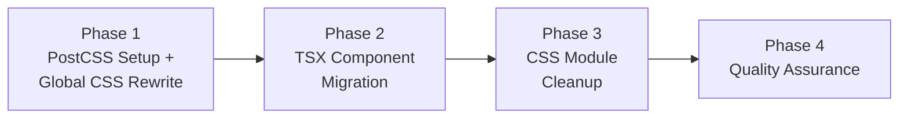
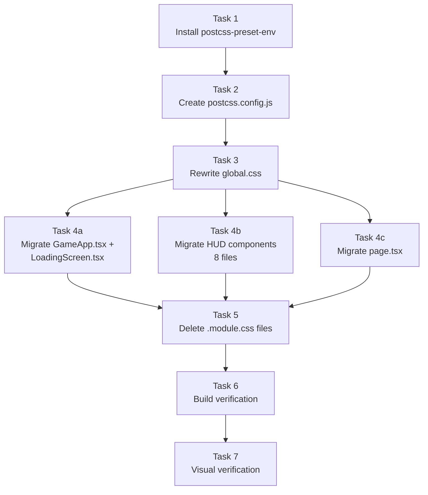

# Work Plan: CSS Modules to Global CSS with PostCSS Migration

Created Date: 2026-02-14
Type: refactor
Estimated Duration: 1 day
Estimated Impact: 24 files (1 new, 12 modified, 11 deleted)
Related Issue/PR: N/A

## Related Documents

- Design Doc: [docs/design/css-modules-to-global-postcss.md](../design/css-modules-to-global-postcss.md)

## Objective

Migrate all 11 CSS Module files to a single global stylesheet with PostCSS (postcss-preset-env) to consolidate scattered styles, remove module import boilerplate, enable CSS nesting, and clean up Nx boilerplate from global.css.

## Background

The Nookstead game client currently uses CSS Modules for component styling. With only ~15 UI components and no class name collision risk, CSS Modules add unnecessary indirection (hashed class names, import boilerplate, styles scattered across 11 files). The global.css file contains ~502 lines of unused Nx starter template CSS. This migration consolidates all styles into a single file with CSS nesting via postcss-preset-env.

This is an **atomic / vertical slice migration** -- all changes happen together since CSS Modules and global CSS cannot be mixed incrementally for the same component set.

## Phase Structure Diagram

## Task Dependency Diagram

**Parallelizable tasks**: Tasks 4a, 4b, and 4c can be done in any order (no dependencies between them), but all three must complete before Task 5.

## Risks and Countermeasures

### Technical Risks

- **Risk**: Class name typo in TSX breaks component styling (no runtime error, just missing styles)
  - **Impact**: Medium -- visual bug in specific component
  - **Probability**: Medium
  - **Countermeasure**: Use the naming convention mapping table in Design Doc Section "Naming Convention Mapping" as a checklist during TSX migration. Cross-reference each `styles.xxx` replacement against the table. Run visual inspection after migration.

- **Risk**: postcss-preset-env version incompatibility with Next.js 16
  - **Impact**: High -- build failure
  - **Probability**: Low
  - **Countermeasure**: Run `npx nx build game` immediately after Phase 1 (PostCSS setup + global.css). If build fails, pin a known compatible version. Rollback: remove postcss.config.js and postcss-preset-env.

- **Risk**: CSS nesting compiled incorrectly by postcss-preset-env
  - **Impact**: Medium -- broken styles for nested selectors
  - **Probability**: Low
  - **Countermeasure**: Verify build output after Phase 1 to confirm nesting compiles to flat CSS. postcss-preset-env nesting is well-tested and widely used.

- **Risk**: Global class name collision with future components
  - **Impact**: Low -- styling conflict
  - **Probability**: Low
  - **Countermeasure**: BEM-lite naming convention with component prefix (e.g., `.clock-panel__content`, `.energy-bar__fill`) prevents collisions. Document convention for future component additions.

- **Risk**: Landing page (page.tsx) loses Nx boilerplate styling
  - **Impact**: Low -- cosmetic only
  - **Probability**: High (intentional)
  - **Countermeasure**: This is expected and documented in the Design Doc. The landing page is Nx scaffold content to be replaced with the actual game entry point.

## Implementation Phases

### Phase 1: PostCSS Setup and Global CSS Rewrite

**Purpose**: Install PostCSS tooling, create configuration, and rewrite global.css with all component styles using CSS nesting. After this phase, the new CSS infrastructure is in place.

#### Tasks

- [ ] **Task 1: Install postcss-preset-env**
  - Run `npm install -D postcss-preset-env` from workspace root
  - Verify package appears in root `package.json` devDependencies
  - Design Doc reference: Section "2. Package Installation"

- [ ] **Task 2: Create postcss.config.js**
  - Create `apps/game/postcss.config.js` with postcss-preset-env stage 2 config
  - Enable `nesting-rules` feature explicitly
  - Use plain object export (not function) per Next.js requirement
  - Design Doc reference: Section "1. PostCSS Configuration"

- [ ] **Task 3: Rewrite global.css**
  - Replace entire contents of `apps/game/src/app/global.css`
  - Remove all Nx boilerplate (~502 lines)
  - Write new content with sections: CSS Reset, Game App Wrapper, Loading Screen, HUD System (HUD container, Nine-Slice Panel, Clock Panel, Currency Display, Menu Button, Energy Bar, Hotbar, Hotbar Slot)
  - Use CSS nesting syntax for component sub-elements
  - Preserve all CSS custom properties (`--ui-scale`, `--font-pixel`)
  - Preserve all `image-rendering: pixelated` declarations
  - Preserve `pointer-events` interaction model
  - Include `@keyframes loading` animation
  - Include `@media (prefers-reduced-motion: reduce)` query for energy bar
  - Design Doc reference: Section "3. Complete Global CSS" (full CSS provided)

#### Phase 1 Completion Criteria

- [ ] `postcss-preset-env` listed in root `package.json` devDependencies
- [ ] `apps/game/postcss.config.js` exists with valid config
- [ ] `apps/game/src/app/global.css` contains all component styles with CSS nesting
- [ ] `npx nx build game` succeeds (verifies PostCSS pipeline works with new global.css)

#### Operational Verification Procedures

1. Run `npm install -D postcss-preset-env` and confirm clean install (no peer dependency warnings)
2. Verify `apps/game/postcss.config.js` matches Design Doc specification exactly
3. Verify `global.css` contains all sections from Design Doc Section "3. Complete Global CSS"
4. Run `npx nx build game` -- must succeed without PostCSS errors
5. Verify CSS nesting compiles correctly (build output should contain flat selectors)

---

### Phase 2: TSX Component Migration

**Purpose**: Update all 11 TSX component files to remove CSS Module imports and use string class names matching the new global CSS naming convention.

#### Tasks

- [ ] **Task 4a: Migrate game components (GameApp.tsx, LoadingScreen.tsx)**
  - `GameApp.tsx`: Remove `import styles from './GameApp.module.css'`, replace `styles.wrapper` with `"game-app"`
  - `LoadingScreen.tsx`: Remove `import styles from './LoadingScreen.module.css'`, replace 6 class references (`styles.overlay` -> `"loading-screen"`, `styles.container` -> `"loading-screen__container"`, `styles.title` -> `"loading-screen__title"`, `styles.barOuter` -> `"loading-screen__bar-outer"`, `styles.barInner` -> `"loading-screen__bar-inner"`, `styles.text` -> `"loading-screen__text"`)
  - Design Doc reference: Section "4. TSX Component Changes" -- GameApp.tsx, LoadingScreen.tsx diffs

- [ ] **Task 4b: Migrate HUD components (8 files)**
  - `HUD.tsx`: Remove module import, replace `styles.hud` with `"hud"` in template literal (preserve `${pixelFont.variable}`)
  - `ClockPanel.tsx`: Remove module import, replace 6 class references per naming table (note: `styles.line` + `styles.time` combo becomes `"clock-panel__line clock-panel__time"`)
  - `CurrencyDisplay.tsx`: Remove module import, replace 4 class references per naming table
  - `MenuButton.tsx`: Remove module import, replace 3 class references per naming table
  - `EnergyBar.tsx`: Remove module import, replace 5 class references per naming table
  - `NineSlicePanel.tsx`: Remove module import, replace 4 class references (note: preserve `${className ?? ''}` prop passthrough pattern)
  - `HotbarSlot.tsx`: Remove module import, replace 7 class references per naming table
  - `Hotbar.tsx`: Remove module import, replace 2 class references per naming table
  - Design Doc reference: Section "4. TSX Component Changes" -- all HUD component diffs; Section "Naming Convention Mapping" -- authoritative class name table

- [ ] **Task 4c: Migrate page.tsx**
  - Remove `import styles from './page.module.css'`
  - Remove `styles.page` className (was empty class, effectively unused)
  - Note: Landing page also uses Nx boilerplate global classes (`wrapper`, `container`, etc.) which will no longer exist. This is intentional per Design Doc.
  - Design Doc reference: Section "4. TSX Component Changes" -- page.tsx diff

#### Phase 2 Completion Criteria

- [ ] Zero `import styles from` statements referencing `.module.css` files in any TSX file
- [ ] All className attributes use string class names matching Design Doc naming convention mapping
- [ ] NineSlicePanel `className` prop passthrough preserved (`nine-slice ${className ?? ''}`)
- [ ] HUD.tsx font variable class preserved (`hud ${pixelFont.variable}`)
- [ ] No TypeScript errors from removed imports (`npx nx typecheck game` passes)

#### Operational Verification Procedures

1. Search for `import styles from` across `apps/game/src/` -- must return zero results
2. Search for `styles.` references across `apps/game/src/` -- must return zero results
3. Cross-reference each component's className values against Design Doc "Naming Convention Mapping" table
4. Verify NineSlicePanel still accepts and applies external `className` prop
5. Verify HUD.tsx template literal includes both `"hud"` and `pixelFont.variable`

---

### Phase 3: CSS Module File Cleanup

**Purpose**: Delete all 11 `.module.css` files that are no longer imported by any component.

#### Tasks

- [ ] **Task 5: Delete all .module.css files**
  - Delete `apps/game/src/app/page.module.css`
  - Delete `apps/game/src/components/hud/HUD.module.css`
  - Delete `apps/game/src/components/hud/ClockPanel.module.css`
  - Delete `apps/game/src/components/hud/CurrencyDisplay.module.css`
  - Delete `apps/game/src/components/hud/MenuButton.module.css`
  - Delete `apps/game/src/components/hud/EnergyBar.module.css`
  - Delete `apps/game/src/components/hud/NineSlicePanel.module.css`
  - Delete `apps/game/src/components/hud/HotbarSlot.module.css`
  - Delete `apps/game/src/components/hud/Hotbar.module.css`
  - Delete `apps/game/src/components/game/LoadingScreen.module.css`
  - Delete `apps/game/src/components/game/GameApp.module.css`
  - Design Doc reference: Section "Deleted Files (11)"

#### Phase 3 Completion Criteria

- [ ] Zero `.module.css` files exist under `apps/game/src/`
- [ ] `npx nx build game` still succeeds (no dangling import references)

#### Operational Verification Procedures

1. Run `find apps/game/src/ -name "*.module.css"` (or equivalent glob) -- must return zero results
2. Run `npx nx build game` -- must succeed without "module not found" errors

---

### Phase 4: Quality Assurance (Required)

**Purpose**: Full build verification, linting, type checking, and visual correctness confirmation. Verify all Design Doc acceptance criteria are met.

#### Tasks

- [ ] **Task 6: Build verification**
  - Run `npx nx build game` -- must complete without errors
  - Run `npx nx typecheck game` -- must complete without errors
  - Run `npx nx lint game` -- must complete without errors
  - Design Doc reference: Section "Acceptance Criteria -- FR-4: Build Verification"

- [ ] **Task 7: Visual verification and acceptance criteria sign-off**
  - Run `npx nx dev game` and visually inspect all components
  - Verify loading screen displays correctly (title, progress bar, text)
  - Verify HUD renders with correct positioning (clock top-left, currency top-right, energy bar right-center, hotbar bottom-center, menu button bottom-right)
  - Verify clock panel shows day, time, and season icon
  - Verify currency display shows gold amount with coin icon
  - Verify energy bar fills/drains with correct colors
  - Verify hotbar slots display with key hints
  - Verify menu button shows hover/active states
  - Verify nine-slice panels render with correct corner/edge stretching
  - Verify pixel font renders correctly via `--font-pixel` variable
  - Design Doc reference: Section "Testing Strategy -- Manual verification checklist"

#### Acceptance Criteria Verification

Design Doc AC mapped to verification:

| AC | Verification | Task |
|----|-------------|------|
| FR-1: HUD components render identically | Visual inspection (Task 7) | Task 7 |
| FR-1: global.css contains all migrated styles | File inspection (Phase 1) | Task 3 |
| FR-1: No .module.css files remain | File search (Phase 3) | Task 5 |
| FR-2: Build processes CSS through postcss-preset-env | Build succeeds (Task 6) | Task 6 |
| FR-2: CSS nesting compiles to flat CSS | Build output check (Phase 1) | Task 3 |
| FR-2: postcss.config.js exists with valid config | File inspection (Phase 1) | Task 2 |
| FR-3: No `import styles from` statements remain | Code search (Phase 2) | Task 4a/4b/4c |
| FR-3: Components apply correct global class names | Visual inspection (Task 7) | Task 7 |
| FR-3: NineSlicePanel className prop works | Visual inspection (Task 7) | Task 7 |
| FR-4: `npx nx build game` succeeds | Build command (Task 6) | Task 6 |
| FR-4: `npx nx typecheck game` succeeds | Typecheck command (Task 6) | Task 6 |
| FR-4: `npx nx lint game` succeeds | Lint command (Task 6) | Task 6 |

#### Phase 4 Completion Criteria

- [ ] `npx nx build game` passes
- [ ] `npx nx typecheck game` passes
- [ ] `npx nx lint game` passes
- [ ] All Design Doc acceptance criteria verified (table above)
- [ ] Visual inspection confirms pixel-identical rendering

#### Operational Verification Procedures

1. Run `npx nx build game` -- must exit with code 0
2. Run `npx nx typecheck game` -- must exit with code 0
3. Run `npx nx lint game` -- must exit with code 0
4. Start dev server with `npx nx dev game`, navigate to the game route, and visually confirm all HUD components render correctly
5. Verify no console errors related to missing styles or CSS

## File Change Summary

| Action | Count | Files |
|--------|-------|-------|
| New | 1 | `apps/game/postcss.config.js` |
| Modified | 12 | `global.css`, `page.tsx`, `HUD.tsx`, `ClockPanel.tsx`, `CurrencyDisplay.tsx`, `MenuButton.tsx`, `EnergyBar.tsx`, `NineSlicePanel.tsx`, `HotbarSlot.tsx`, `Hotbar.tsx`, `LoadingScreen.tsx`, `GameApp.tsx` |
| Deleted | 11 | All `.module.css` files |
| Package | 1 | `postcss-preset-env` added to devDependencies |

## Completion Criteria

- [ ] All phases completed (Phase 1 through Phase 4)
- [ ] Each phase's operational verification procedures executed
- [ ] Design Doc acceptance criteria satisfied (all 12 items in AC table)
- [ ] Build, typecheck, and lint all pass with zero errors
- [ ] Zero `.module.css` files remain under `apps/game/src/`
- [ ] Zero `import styles from` statements remain in TSX files
- [ ] Visual rendering matches pre-migration appearance

## Progress Tracking

### Phase 1: PostCSS Setup and Global CSS Rewrite
- Start:
- Complete:
- Notes:

### Phase 2: TSX Component Migration
- Start:
- Complete:
- Notes:

### Phase 3: CSS Module File Cleanup
- Start:
- Complete:
- Notes:

### Phase 4: Quality Assurance
- Start:
- Complete:
- Notes:

## Notes

- **Commit strategy**: Manual -- the user decides when to commit. No commit steps are included in this plan.
- **Rollback plan**: `git revert` to the commit before migration. Since this is an atomic change, partial rollback is not meaningful.
- **Implementation approach**: Vertical slice (all changes together) as specified in Design Doc. There is no incremental migration path since CSS Modules and global CSS cannot coexist for the same component set.
- **No test code changes needed**: This migration does not change component logic, props, or behavior. Existing tests should pass without modification.
- **Landing page styling**: page.tsx will lose its Nx boilerplate styling. This is intentional and documented -- the landing page is scaffold content to be replaced.
