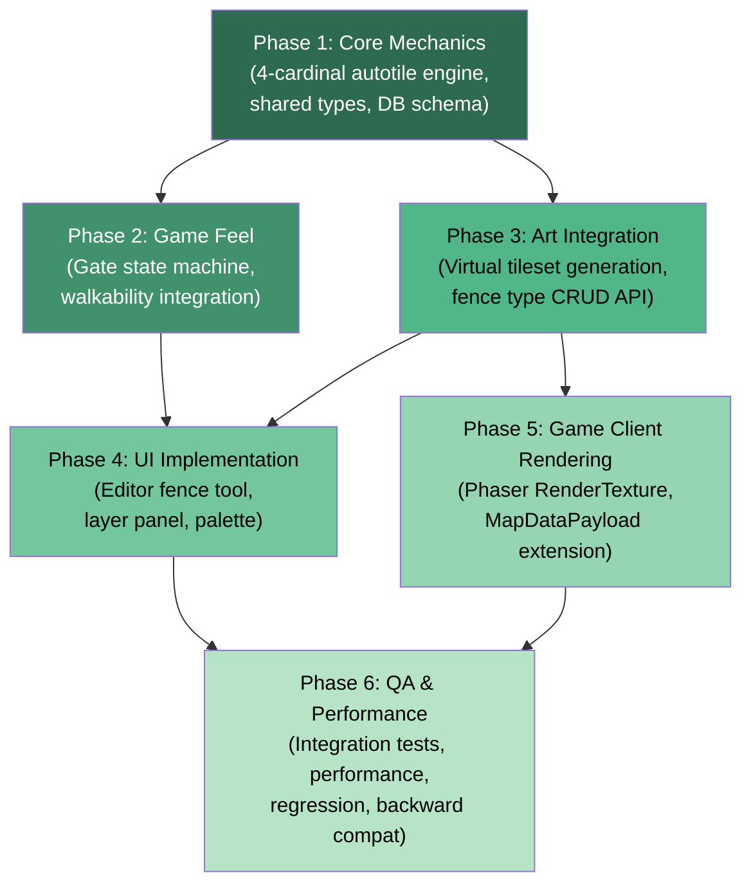
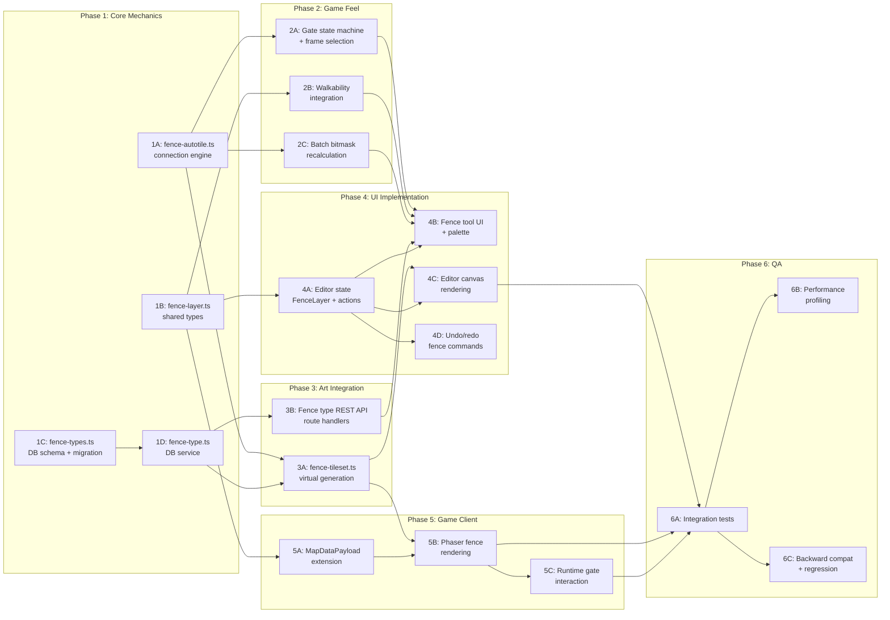

# Work Plan: Fence System Implementation

Created Date: 2026-02-21
Type: feature
Estimated Duration: 6 days
Estimated Impact: ~18 files (10 new, 8 modified)
Related Issue/PR: N/A

## Related Documents
- Design Doc: [docs/design/design-012-fence-system.md](../design/design-012-fence-system.md)
- ADR: [docs/adr/ADR-0010-fence-system-architecture.md](../adr/ADR-0010-fence-system-architecture.md)
- ADR (related): [docs/adr/ADR-0009-tileset-management-architecture.md](../adr/ADR-0009-tileset-management-architecture.md)

## Objective

Implement a fence system for Nookstead maps that provides auto-connecting fence segments using a 4-cardinal bitmask engine, DB-driven fence type definitions with atlas frame mappings, virtual tileset generation, gate functionality with open/closed state, and rendering in both the GenMap editor (HTML Canvas) and the Phaser game client (RenderTexture stamping).

## Background

The current map system supports terrain layers (Blob-47 autotile) and object layers (individually placed game objects). Fences require a third layer type -- connectable grid structures that auto-connect along 4 cardinal directions, producing 16 visual configurations from a 4-bit bitmask. The existing `alpha_props_fence` terrain type (terrain-17) is limited to a single visual style with no gate support. ADR-0010 selected a dedicated fence layer with 4-cardinal autotile as the architecture, using RenderTexture stamping for rendering performance.

## Risks and Countermeasures

### Technical Risks
- **Risk**: Virtual tileset generation latency on maps with many fence types
  - **Impact**: Slow map load times in both editor and game client
  - **Countermeasure**: Cache generated tilesets by fence type key; only regenerate when fence type definition changes. Profile generation time with 4+ fence types.

- **Risk**: Gate placement validation edge cases at corners and T-junctions
  - **Impact**: Invalid gate state or visual glitches
  - **Countermeasure**: Strict corridor-only validation (bitmask 5 or 10). Unit tests cover all 16 bitmask states for gate placement rejection/acceptance.

- **Risk**: Walkability grid inconsistency during bulk fence operations
  - **Impact**: Player pathfinding through fences or blocked by invisible barriers
  - **Countermeasure**: Use the `updateCellWalkability` function that checks ALL fence layers, not just the modified one. Integration tests verify walkability after batch operations.

- **Risk**: Backward compatibility -- existing maps without fences must continue to work
  - **Impact**: Breaking existing map loading
  - **Countermeasure**: `fenceLayers` field is optional in `MapDataPayload`. Editor layer normalization treats layers without `type` as `TileLayer`. Tests verify old maps load correctly.

### Schedule Risks
- **Risk**: Editor UI complexity for fence tool with multiple modes (single, rectangle, line, gate)
  - **Impact**: Phase 4 (UI) may take longer than estimated
  - **Countermeasure**: Implement single segment mode first as MVP; rectangle perimeter and line modes as progressive enhancements. Gate placement is a modifier (Shift-click), not a separate tool.

## Phase Structure Diagram



## Task Dependency Diagram



---

## Implementation Phases

### Phase 1: Core Mechanics (Estimated commits: 4)
**Owner**: mechanics-developer
**Purpose**: Establish the foundational data types, connection engine, and database schema that all subsequent phases depend on. Everything in this phase is pure logic with no UI or rendering dependencies.

#### Tasks

- [x] **Task 1A**: Implement 4-cardinal connection engine (`packages/map-lib/src/core/fence-autotile.ts`)
  - Define constants: `FENCE_N=1`, `FENCE_E=2`, `FENCE_S=4`, `FENCE_W=8`, `FENCE_EMPTY_FRAME=0`, `FENCE_TILESET_COLS=4`, `FENCE_FRAME_COUNT=16`, `FENCE_GATE_FRAME_COUNT=4`, `FENCE_TOTAL_FRAMES=20`, `GATE_BITMASK_NS=5`, `GATE_BITMASK_EW=10`
  - Implement `computeFenceBitmask(cells, x, y, mapWidth, mapHeight): number` -- scans 4 cardinal neighbors, returns 4-bit bitmask (0-15)
  - Implement `getFenceFrame(neighbors: number): number` -- returns `neighbors + 1` (offset for empty frame sentinel)
  - Implement `canPlaceGate(cells, x, y, mapWidth, mapHeight): boolean` -- validates bitmask is 5 or 10
  - Implement `getGateFrameIndex(bitmask: number, isOpen: boolean): number` -- returns frame 17-20 based on orientation + state
  - Unit tests: all 16 bitmask states, boundary conditions, isolated cell, gate placement validation on all 16 states
  - **Completion criteria**: All unit tests pass. Pure functions with zero external dependencies.

- [x] **Task 1B**: Define shared fence types (`packages/shared/src/types/fence-layer.ts`)
  - Define `FenceCellData { fenceTypeId: string, isGate: boolean, gateOpen: boolean }`
  - Define `SerializedFenceLayer { name: string, fenceTypeKey: string, frames: number[][], gates: SerializedGateData[] }`
  - Define `SerializedGateData { x: number, y: number, open: boolean }`
  - Extend `MapDataPayload` with optional `fenceLayers?: SerializedFenceLayer[]`
  - Export all types from `packages/shared/src/types/` index
  - **Completion criteria**: Types compile. `MapDataPayload` remains backward compatible (field is optional). `pnpm nx typecheck shared` passes.

- [ ] **Task 1C**: Create `fence_types` DB schema and migration (`packages/db/src/schema/fence-types.ts`)
  - Define Drizzle table: `id` (UUID PK), `name` (varchar 255), `key` (varchar 100, unique), `category` (varchar 100), `frame_mapping` (JSONB), `gate_frame_mapping` (JSONB), `sort_order` (integer), `created_at`, `updated_at`
  - Define relations to `atlasFrames` (JSONB values reference atlas frame UUIDs)
  - Export `FenceType` and `NewFenceType` inferred types
  - Register in `packages/db/src/schema/index.ts`
  - Generate Drizzle migration with `drizzle-kit generate`
  - **Completion criteria**: Migration runs successfully. Schema matches Design Doc Section 6.1. `pnpm nx typecheck db` passes.

- [x] **Task 1D**: Implement fence type CRUD service (`packages/db/src/services/fence-type.ts`)
  - `createFenceType(db, data)` -- insert with validation (16 frame entries, valid UUIDs)
  - `getFenceType(db, id)` -- fetch by UUID
  - `getFenceTypeByKey(db, key)` -- fetch by unique key
  - `listFenceTypes(db, params?)` -- list with sort_order ordering, optional category filter
  - `updateFenceType(db, id, data)` -- partial update with validation
  - `deleteFenceType(db, id)` -- delete by UUID
  - Unit tests with mocked DB: validate frame_mapping has exactly 16 entries ("0"-"15"), validate gate_frame_mapping has exactly 4 entries
  - **Completion criteria**: All CRUD operations tested. Validation rejects malformed frame mappings. `pnpm nx test db` passes.

- [ ] Quality check: Run `pnpm nx run-many -t lint typecheck test -p map-lib shared db`

#### Phase Completion Criteria
- [ ] 4-cardinal autotile engine produces correct bitmask for all 16 configurations
- [ ] Shared types compile and are importable from `@nookstead/shared`
- [ ] DB migration creates `fence_types` table successfully
- [x] CRUD service passes all unit tests including validation edge cases
- [ ] Zero lint errors, zero type errors across map-lib, shared, db packages

#### Operational Verification Procedures
1. Run `pnpm nx test map-lib` -- all fence-autotile unit tests pass (16 bitmask states + edge cases)
2. Run `pnpm nx test db` -- fence-type service tests pass (CRUD + validation)
3. Run `pnpm nx typecheck shared` -- MapDataPayload extension compiles
4. Run Drizzle migration on local DB -- `fence_types` table created with correct columns and constraints
5. Verify `SELECT * FROM fence_types` returns empty result (no seed data required)

---

### Phase 2: Game Feel (Estimated commits: 3)
**Owner**: game-feel-developer
**Depends on**: Phase 1 (needs connection engine and shared types)
**Purpose**: Implement the gate state machine, walkability grid integration, and batch bitmask recalculation. These are the gameplay-affecting mechanics that determine how fences interact with player movement.

#### Tasks

- [x] **Task 2A**: Implement gate state machine and frame selection
  - Gate states: CLOSED (walkable=false, closed frame) and OPEN (walkable=terrain_base, open frame)
  - Gate frame selection: `getGateFrame(bitmask, isOpen)` returning frame indices 17-20
  - Gate placement validation: only on straight corridors (bitmask 5 or 10)
  - Gate toggle logic: flip `isGate`/`gateOpen` with side-effect list (walkability change, frame change)
  - Unit tests: state transitions, invalid placement rejection, frame index correctness
  - **Completion criteria**: Gate state machine transitions are deterministic and tested for all valid/invalid inputs.

- [x] **Task 2B**: Implement walkability grid integration
  - Implement `computeFenceWalkability(grid, fenceLayers, mapWidth, mapHeight): boolean[][]` for full recomputation
  - Implement `updateCellWalkability(walkable, grid, fenceLayers, x, y)` for incremental updates
  - Walkability composite: `walkable[y][x] = terrainWalkable AND NOT blockedByFence`
  - Open gate handling: open gates do not block (check `isGate && gateOpen`)
  - Multi-layer handling: check ALL fence layers for each cell, any closed fence blocks
  - Unit tests: fence placement blocks, fence removal restores terrain walkability, open gate allows movement, multi-layer blocking
  - **Completion criteria**: Walkability correctly reflects fence state. Incremental update matches full recomputation result.

- [x] **Task 2C**: Implement batch bitmask recalculation
  - Implement `recalculateAffectedCells(layer, changedPositions, mapWidth, mapHeight)` per Design Doc Section 2.3
  - Affected set: changed cells UNION cardinal neighbors of changed cells that are non-empty
  - For each affected cell: recompute bitmask via `computeFenceBitmask`, update frame via `getFenceFrame`
  - Performance: O(N) for N changed cells (each touches at most 4 neighbors, O(1) per cell)
  - Unit tests: single cell change recalculates neighbors, bulk rectangle perimeter recalculation, removal recalculates neighbors
  - **Completion criteria**: Batch recalculation produces correct frames for all affected cells. Performance is O(N).

- [ ] Quality check: Run `pnpm nx run-many -t lint typecheck test -p map-lib shared`

#### Phase Completion Criteria
- [ ] Gate state transitions produce correct walkability and frame changes
- [ ] Walkability grid correctly composites terrain + fence state across multiple layers
- [ ] Batch recalculation handles placement, removal, and gate toggle with correct neighbor updates
- [ ] All unit tests pass with coverage of edge cases (boundary cells, multi-layer, empty neighbors)

#### Operational Verification Procedures
1. Run `pnpm nx test map-lib` -- all fence mechanics tests pass
2. Verify batch recalculation test: place 4-cell rectangle perimeter, verify all 4 cells have correct bitmask and frame
3. Verify walkability test: place fence on walkable terrain, confirm cell becomes non-walkable; open gate on same cell, confirm cell becomes walkable again
4. Verify multi-layer test: place fence on layer A, place fence on layer B at same position, remove from layer A -- cell remains non-walkable due to layer B

---

### Phase 3: Art Integration (Estimated commits: 3)
**Owner**: technical-artist
**Depends on**: Phase 1 (needs connection engine constants and DB service)
**Purpose**: Build the virtual tileset generation pipeline and REST API for fence type management. This phase makes fence type data accessible to both editor and game client.

#### Tasks

- [x] **Task 3A**: Implement virtual tileset generation (`packages/map-lib/src/core/fence-tileset.ts`)
  - Implement `generateFenceTileset(frameImages: { bitmask: number, image: ImageSource, srcRect: Rect }[], gateImages: { key: string, image: ImageSource, srcRect: Rect }[]): Canvas`
  - Canvas dimensions: 64x80 pixels (4 columns x 5 rows, 20 slots)
  - Slot 0 (frame 0): transparent (empty sentinel)
  - Slots 1-16 (frames 1-16): 16 connection state frames stamped from atlas source rectangles
  - Slots 17-20 (frames 17-20): 4 gate frames stamped from atlas source rectangles
  - Source rectangle formula: `srcX = ((frameIndex - 1) % 4) * 16`, `srcY = Math.floor((frameIndex - 1) / 4) * 16`
  - Tileset key convention: `fence-{fenceTypeKey}` (e.g., `fence-wooden_fence`)
  - Abstract canvas creation (accept factory function) to support both `HTMLCanvasElement` (editor) and `OffscreenCanvas` (game/worker)
  - Unit tests: verify canvas dimensions, verify frame placement positions, verify empty slot is transparent
  - **Completion criteria**: Virtual tileset generated with correct dimensions and frame positions. Fallback: transparent 1x1 pixel for missing atlas frames.

- [x] **Task 3B**: Implement fence type REST API (`apps/genmap/src/app/api/fence-types/`)
  - `GET /api/fence-types` -- list fence types (optional `category` query param)
  - `POST /api/fence-types` -- create fence type (validate frame_mapping 16 entries, gate_frame_mapping 4 entries, key uniqueness, atlas frame UUID existence)
  - `GET /api/fence-types/[id]` -- get fence type by UUID
  - `PUT /api/fence-types/[id]` -- update fence type
  - `DELETE /api/fence-types/[id]` -- delete fence type
  - `GET /api/fence-types/by-key/[key]` -- get fence type by key (for game client loading)
  - Response format: include resolved atlas frame data (spriteId, frameX/Y/W/H) alongside UUIDs
  - Error responses: 400 for validation errors, 404 for not found, 409 for duplicate key
  - **Completion criteria**: All CRUD endpoints functional. Validation prevents invalid fence type creation. Integration test with test DB.

- [ ] Quality check: Run `pnpm nx run-many -t lint typecheck -p map-lib genmap`

#### Phase Completion Criteria
- [ ] Virtual tileset generation produces correct 64x80 canvas with 20 frame slots
- [ ] REST API supports full CRUD with proper validation and error handling
- [ ] API response includes resolved atlas frame source rectangles for client-side tileset generation
- [ ] Fallback behavior for missing atlas frames is transparent pixel (does not crash)

#### Operational Verification Procedures
1. Run `pnpm nx test map-lib` -- fence-tileset generation tests pass
2. Start GenMap dev server (`pnpm nx dev genmap`), call `POST /api/fence-types` with valid payload -- 201 response with created fence type
3. Call `GET /api/fence-types` -- returns list including newly created type
4. Call `POST /api/fence-types` with invalid frame_mapping (missing key "5") -- 400 response with validation error
5. Call `POST /api/fence-types` with duplicate key -- 409 response

---

### Phase 4: UI Implementation (Estimated commits: 5)
**Owner**: ui-ux-agent
**Depends on**: Phase 1 (shared types), Phase 2 (gate mechanics, walkability), Phase 3 (tileset generation, API)
**Purpose**: Integrate fence functionality into the GenMap editor: fence layer type in editor state, fence tool with placement modes, canvas rendering, and undo/redo support.

#### Tasks

- [x] **Task 4A**: Extend editor state model with FenceLayer (`apps/genmap/src/hooks/map-editor-types.ts`)
  - Define `FenceLayer extends BaseLayer { type: 'fence', fenceTypeKey: string, cells: (FenceCellData | null)[][], frames: number[][] }`
  - Extend `EditorTool` union: add `'fence'`, `'fence-eraser'`
  - Extend `SidebarTab` union: add `'fence-types'`
  - Extend `MapEditorAction` union with fence-specific actions:
    - `ADD_FENCE_LAYER` (name, fenceTypeKey)
    - `PLACE_FENCE` (layerIndex, positions: {x,y}[])
    - `ERASE_FENCE` (layerIndex, positions: {x,y}[])
    - `TOGGLE_GATE` (layerIndex, x, y)
    - `SET_FENCE_TYPE` (fenceTypeKey)
  - Extend `LoadMapPayload` to include fence layers
  - Extend `MapEditorState` to differentiate fence layers from tile layers (layers array now contains both TileLayer and FenceLayer, discriminated by `type` field)
  - **Completion criteria**: Types compile. Existing tile layer code continues to work via type narrowing. `pnpm nx typecheck genmap` passes.

- [x] **Task 4B**: Implement fence tool UI and palette
  - Fence type palette component: fetches available fence types from API, displays grid of fence style previews
  - Fence tool toolbar: mode selector (single segment, rectangle perimeter, line)
  - Active fence type state management (selected fence type key)
  - Canvas interaction handlers:
    - Single segment: click to place
    - Rectangle perimeter: mousedown for corner 1, drag for preview, mouseup for corner 2, fill perimeter
    - Line: click for start, click for end (constrained to H/V)
    - Gate toggle: Shift-click on existing fence corridor cell
  - Eraser: click/drag to remove fence cells from active layer
  - **Completion criteria**: All three placement modes functional. Gate placement validates corridor constraint. Fence palette loads types from API.

- [x] **Task 4C**: Implement fence layer canvas rendering (`apps/genmap/src/components/map-editor/canvas-renderer.ts`)
  - Extend `renderMapCanvas` to accept fence tileset images and fence layer data
  - Render fence layers ABOVE terrain layers but BELOW object layers
  - For each fence layer: iterate grid, skip frame=0, draw source rect from virtual tileset image
  - Source rect formula: `srcX = ((frame - 1) % 4) * 16`, `srcY = Math.floor((frame - 1) / 4) * 16`
  - Preview rendering: semi-transparent rectangle outline during fence drag (reuse `previewRect` mechanism)
  - Layer visibility and opacity support (same as terrain layers)
  - **Completion criteria**: Fence layers render correctly with proper frame selection. Visibility/opacity toggles work. Preview renders during drag.

- [x] **Task 4D**: Implement fence undo/redo commands (`apps/genmap/src/hooks/map-editor-commands.ts`)
  - Define `FenceCellDelta { layerIndex, x, y, oldCell: FenceCellData|null, newCell: FenceCellData|null, oldFrame, newFrame, oldWalkable, newWalkable }`
  - Implement `FencePlaceCommand` (execute: apply deltas forward, undo: apply backward)
  - Implement `FenceEraseCommand` (execute: clear cells + recalculate, undo: restore cells + recalculate)
  - Implement `GateToggleCommand` (execute: toggle gate state, undo: revert)
  - All commands include walkability delta tracking
  - **Completion criteria**: Place fence, undo restores previous state exactly. Redo re-applies. Multi-cell operations undo as a single atomic command.

- [x] **Task 4E**: Extend layer panel for fence layers
  - Layer panel shows fence layers alongside tile and object layers
  - Add "Add Fence Layer" button that opens fence type selector
  - Fence layer list item shows fence type name, visibility toggle, opacity slider
  - Layer reordering includes fence layers
  - Active layer indicator for fence layers
  - **Completion criteria**: Fence layers appear in layer panel. Add/remove/toggle/reorder work correctly.

- [ ] Quality check: Run `pnpm nx run-many -t lint typecheck -p genmap`

#### Phase Completion Criteria
- [ ] Editor state model supports fence layers alongside tile and object layers
- [ ] All three fence placement modes (single, rectangle, line) work correctly
- [ ] Gate toggle via Shift-click works on corridor cells, rejected on other configurations
- [ ] Fence layers render correctly on canvas with proper layer ordering
- [ ] Undo/redo works for all fence operations (place, erase, gate toggle)
- [ ] Layer panel displays and manages fence layers
- [ ] Fence type palette loads available types from API

#### Operational Verification Procedures
1. Start GenMap dev server, open a map in the editor
2. Click "Add Fence Layer" -- fence type selector appears, select a type -- new fence layer appears in layer panel
3. Select fence tool, single segment mode -- click on canvas -- fence segment appears at clicked position
4. Click adjacent cells -- fences auto-connect (visual connections update)
5. Switch to rectangle mode -- drag a rectangle -- fences appear along perimeter with correct connections
6. Shift-click on a corridor fence segment -- gate icon appears
7. Shift-click the gate again -- gate is removed, reverts to fence segment
8. Use eraser on a fence -- segment disappears, neighbors update their connections
9. Press Ctrl+Z -- last operation undone. Press Ctrl+Y -- operation re-applied
10. Toggle fence layer visibility -- layer hides/shows correctly
11. Save map, reload -- fence layers persist correctly

---

### Phase 5: Game Client Rendering (Estimated commits: 3)
**Owner**: mechanics-developer
**Depends on**: Phase 1 (shared types), Phase 3 (virtual tileset generation)
**Purpose**: Extend the Phaser game client to load, render, and interact with fence layers received from the game server via MapDataPayload.

#### Tasks

- [x] **Task 5A**: Extend `MapDataPayload` handling in game client
  - Update map data receiver in the game client to parse optional `fenceLayers` field
  - Extract unique `fenceTypeKey` values from all fence layers
  - Fetch fence type definitions from API for each unique key
  - Load all referenced atlas images (sprite textures) for fence types
  - Store fence layer data alongside terrain layer data for rendering
  - **Completion criteria**: Game client correctly parses MapDataPayload with and without fenceLayers. Missing fenceLayers field does not break loading.

- [x] **Task 5B**: Implement Phaser fence layer rendering (`apps/game/src/game/scenes/Game.ts`)
  - Generate virtual tileset textures using Phaser's `this.textures.addCanvas('fence-{key}', canvas)` API
  - Register frame data for each of the 21 frames (0=empty + 16 connection + 4 gate)
  - Render fence layers to RenderTexture using stamp technique (same pattern as terrain layers):
    ```
    For each fenceLayer:
      For y, x in grid:
        frame = fenceLayer.frames[y][x]
        if frame == 0: continue
        stamp.setTexture('fence-{fenceTypeKey}', frameKey)
        rt.draw(stamp, x * TILE_SIZE, y * TILE_SIZE)
    ```
  - Fence RenderTexture renders ABOVE terrain RenderTexture, BELOW player/NPC sprites
  - Multiple fence layers render in order (first to last)
  - **Completion criteria**: Fence layers render correctly in game scene. Frame budget maintained (no significant FPS drop with 3+ fence layers on 60x60 map).

- [ ] **Task 5C**: Implement runtime gate interaction
  - Register gate positions during map load for interaction system
  - Player proximity detection: gate must be within 1 tile distance (adjacent)
  - Interaction key (E key or click) sends gate toggle request to server (Colyseus message)
  - On server confirmation: update local gate state (`gateOpen` toggle)
  - Update walkability grid cell for the toggled gate
  - Update gate display frame (swap between open/closed variant) on the RenderTexture
  - Re-stamp the single affected tile on the RenderTexture (avoid full re-render)
  - **Completion criteria**: Player can toggle gates in-game. Walkability updates immediately. Visual frame swaps correctly between open/closed.

- [ ] Quality check: Run `pnpm nx run-many -t lint typecheck build -p game shared`

#### Phase Completion Criteria
- [ ] Game client loads and renders fence layers from MapDataPayload
- [ ] Virtual tileset textures generated correctly in Phaser
- [ ] Fence layers render above terrain, below sprites
- [ ] Gate interaction works: proximity check, toggle request, visual + walkability update
- [ ] Backward compatible: maps without fenceLayers load and render normally

#### Operational Verification Procedures
1. Create a map with fence layers in the editor, save and export to game
2. Load the map in the game client -- fence layers render correctly above terrain
3. Walk player character toward a fence segment -- character stops (cannot walk through)
4. Walk toward a closed gate -- character stops. Press E key -- gate opens (visual frame changes to open variant)
5. Walk through the now-open gate -- character passes through
6. Press E key again -- gate closes. Character can no longer walk through.
7. Load an existing map without fences -- map loads normally, no errors
8. Verify FPS counter on 60x60 map with 100+ fence segments: sustained 60fps on target platform

---

### Phase 6: QA & Performance (Estimated commits: 2)
**Owner**: qa-agent
**Depends on**: All previous phases
**Purpose**: Comprehensive testing, performance validation, and regression suite execution.

#### Tasks

- [x] **Task 6A**: Integration tests
  - **Editor integration**: Load map with fence layers -> render -> place fences -> save -> reload -> verify persistence
  - **Game client integration**: MapDataPayload with fenceLayers -> texture generation -> rendering -> gate interaction -> walkability
  - **Cross-layer test**: Two fence layers (wooden + stone) on same map, verify no cross-layer connection
  - **Gate lifecycle test**: Place fence corridor -> place gate -> toggle open -> toggle closed -> remove gate -> verify all state transitions
  - **Undo/redo stress test**: 20 fence operations -> undo all -> redo all -> verify final state matches
  - **Completion criteria**: All integration tests pass. No state inconsistencies.

- [x] **Task 6B**: Performance profiling and optimization
  - Profile virtual tileset generation: target < 50ms per fence type on desktop
  - Profile editor canvas rendering with 200+ fence segments: target < 16ms frame time (60fps)
  - Profile game client RenderTexture stamping with 200+ fence segments: target < 16ms frame time
  - Profile batch bitmask recalculation for 100-cell rectangle perimeter: target < 5ms
  - Memory profiling: no memory leaks from tileset generation or layer switching
  - **Completion criteria**: All performance targets met. No memory leaks detected.

- [x] **Task 6C**: Verify all Design Doc acceptance criteria
  - [x] 4-cardinal bitmask produces 16 unique connection states
  - [x] Gate placement restricted to corridor cells (bitmask 5 or 10)
  - [x] Gate state machine transitions between CLOSED and OPEN correctly
  - [x] Virtual tileset dimensions: 64x80 pixels (4 columns x 5 rows)
  - [x] Fence layers render above terrain, below sprites
  - [x] Walkability grid correctly composites terrain + fence state
  - [x] Multiple fence types supported via separate layers (no cross-layer connection)
  - [x] `fence_types` DB table with JSONB frame mappings
  - [x] REST API provides full CRUD for fence types

- [x] Quality check: Run `pnpm nx run-many -t lint typecheck test build e2e`

#### Phase Completion Criteria
- [x] All integration tests pass
- [x] Performance targets met (60fps sustained on target platform with 200+ fence segments)
- [x] Zero regression failures across all packages
- [x] All Design Doc acceptance criteria verified
- [ ] Memory profiling shows no leaks

#### Operational Verification Procedures
1. Run full test suite: `pnpm nx run-many -t lint test typecheck build` -- all pass
2. Run E2E: `pnpm nx e2e game-e2e` -- all pass
3. Open GenMap editor, load an old map without fences -- renders correctly
4. Create fence layers on the map, save, reload -- fences persist
5. Open game client, load map with fences -- renders correctly, gates interactive
6. Open browser dev tools Performance tab, record 30 seconds of gameplay with 200+ fence segments -- frame times consistently < 16ms
7. Run Chrome DevTools Memory snapshot before and after map load -- no leaked fence textures or canvas elements

---

## File Impact Summary

### New Files (10)

| File | Package | Phase |
|------|---------|-------|
| `packages/map-lib/src/core/fence-autotile.ts` | map-lib | Phase 1 |
| `packages/map-lib/src/core/fence-autotile.spec.ts` | map-lib | Phase 1 |
| `packages/shared/src/types/fence-layer.ts` | shared | Phase 1 |
| `packages/db/src/schema/fence-types.ts` | db | Phase 1 |
| `packages/db/src/services/fence-type.ts` | db | Phase 1 |
| `packages/db/src/services/fence-type.spec.ts` | db | Phase 1 |
| `packages/map-lib/src/core/fence-tileset.ts` | map-lib | Phase 3 |
| `apps/genmap/src/app/api/fence-types/route.ts` | genmap | Phase 3 |
| `apps/genmap/src/app/api/fence-types/[id]/route.ts` | genmap | Phase 3 |
| `apps/genmap/src/app/api/fence-types/by-key/[key]/route.ts` | genmap | Phase 3 |

### Modified Files (8)

| File | Package | Phase | Change Description |
|------|---------|-------|--------------------|
| `packages/shared/src/types/map.ts` | shared | Phase 1 | Add `fenceLayers?` to `MapDataPayload` |
| `packages/db/src/schema/index.ts` | db | Phase 1 | Export `fenceTypes` schema |
| `apps/genmap/src/hooks/map-editor-types.ts` | genmap | Phase 4 | Add `FenceLayer`, fence actions, fence tool types |
| `apps/genmap/src/hooks/map-editor-commands.ts` | genmap | Phase 4 | Add fence command types (`FenceCellDelta`, commands) |
| `apps/genmap/src/components/map-editor/canvas-renderer.ts` | genmap | Phase 4 | Add fence layer rendering path |
| `apps/game/src/game/scenes/Game.ts` | game | Phase 5 | Add fence layer loading + RenderTexture rendering |
| `packages/map-lib/src/core/index.ts` (if exists) | map-lib | Phase 1 | Export fence-autotile module |
| `packages/shared/src/types/index.ts` (if exists) | shared | Phase 1 | Export fence-layer types |

---

## Quality Assurance Checklist

- [ ] Design Doc and GDD consistency verification
- [ ] 6-phase composition based on game development lifecycle
- [ ] Phase dependencies correctly mapped (Core Mechanics -> Game Feel -> Art Integration -> UI -> Game Client -> QA)
- [ ] All requirements converted to tasks with correct phase owner assignment
- [ ] Frame budget targets specified: 60fps sustained with 200+ fence segments
- [ ] Quality assurance exists in Phase 6
- [ ] E2E verification procedures placed at integration points (Phases 4, 5, 6)
- [ ] Asset format specified: 16x16 atlas frames -> 64x80 virtual tileset (4x5 grid)
- [ ] Fence types are DB-driven with JSONB frame mappings (ADR-0009 aligned)
- [ ] Game state transitions from Design Doc referenced in gate mechanics (CLOSED <-> OPEN)
- [ ] Walkability grid integration tested for multi-layer scenarios
- [ ] Backward compatibility verified: existing maps without fences unaffected

---

## Completion Criteria
- [ ] All 6 phases completed
- [ ] Each phase's operational verification procedures executed
- [ ] Design Doc acceptance criteria satisfied (all 10 criteria from Task 6D)
- [ ] Staged quality checks completed (zero lint/type/test errors)
- [ ] All tests pass: unit, integration, E2E
- [ ] Performance targets met (60fps, <50ms tileset generation)
- [ ] Backward compatibility verified with existing maps
- [ ] Necessary documentation updated
- [ ] User review approval obtained

## Progress Tracking
### Phase 1: Core Mechanics
- Start: 2026-02-21
- Complete:
- Notes: Task 1B (shared fence types) completed 2026-02-21. Task 1A (connection engine) completed 2026-02-21. Task 1D (fence type CRUD service) completed 2026-02-21.

### Phase 2: Game Feel
- Start: 2026-02-21
- Complete:
- Notes: Task 2A (gate state machine) completed 2026-02-21.

### Phase 3: Art Integration
- Start:
- Complete:
- Notes:

### Phase 4: UI Implementation
- Start: 2026-02-21
- Complete:
- Notes: Task 4A (editor state model extension) completed 2026-02-21. Task 4B (fence tool UI and palette) completed 2026-02-21.

### Phase 5: Game Client Rendering
- Start: 2026-02-21
- Complete:
- Notes: Task 5A (MapDataPayload handling) completed 2026-02-21.

### Phase 6: QA & Performance
- Start:
- Complete:
- Notes:

## Notes

### Implementation Strategy
This plan follows a **Foundation-driven (Horizontal)** approach per the implementation-approach skill:
- Phase 1 establishes the data model and logic foundation (types, engine, schema)
- Phases 2-3 build gameplay mechanics and asset pipeline on that foundation
- Phases 4-5 integrate into editor and game client
- Phase 6 validates the complete system

This was selected over Vertical Slice because the fence system's core engine (bitmask computation, tileset generation) is shared between editor and game client, making a horizontal approach more efficient than duplicating foundation work across vertical features.

### Parallel Work Opportunities
- Phase 2 and Phase 3 can proceed in parallel after Phase 1 completes (no dependencies between them)
- Task 3B (REST API) can proceed as soon as Task 1D (DB service) completes, independent of Task 3A (tileset generation)
- Task 5A (MapDataPayload) can proceed as soon as Task 1B (shared types) completes

### Migration Consideration
The existing `alpha_props_fence` terrain type (terrain-17) is not migrated in this plan. It remains as a legacy terrain for existing maps. A future plan can address migration if needed. New fence functionality should use the fence layer system exclusively.
