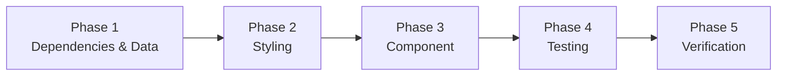
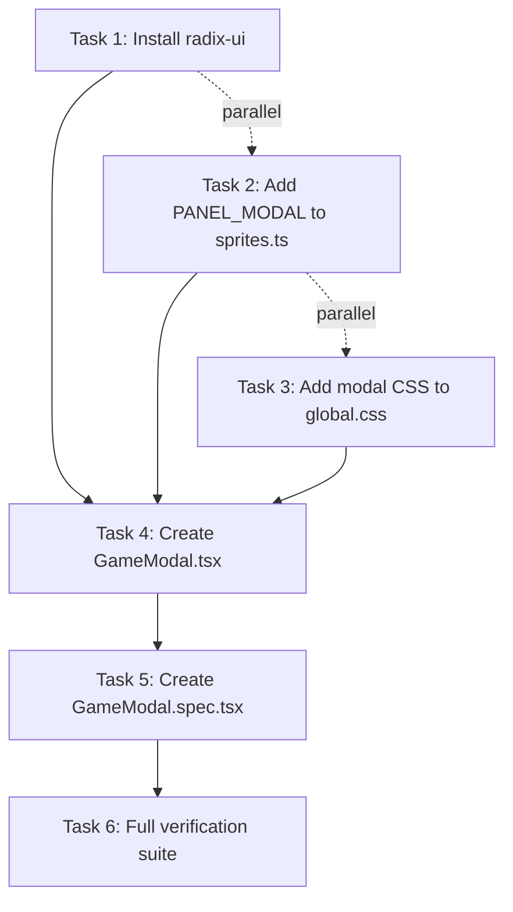

# Work Plan: GameModal Component Implementation

Created Date: 2026-02-15
Type: feature
Estimated Duration: 1 day
Estimated Impact: 5 files (2 new, 2 modified, 1 package dependency)
Related Issue/PR: N/A

## Related Documents
- Design Doc: [docs/design/game-modal.md](../design/game-modal.md)

## Objective

Implement a reusable, accessible GameModal component that wraps Radix UI Dialog primitives with the existing NineSlicePanel pixel-art border system. This provides modal overlay infrastructure for future game features (NPC dialogue, inventory, settings).

## Risks and Countermeasures

| Risk | Impact | Countermeasure |
|------|--------|----------------|
| `radix-ui` incompatible with React 19 / Next.js 16 | High (build failure) | Verify with `pnpm nx build game` immediately after install; radix-ui v1.4.x supports React 19 |
| PANEL_MODAL sprite coordinates incorrect | Medium (visual bug) | Verify coordinates against `hud_32.png` in image editor before production use |
| Radix Dialog Portal breaks SSR / hydration | Medium (hydration error) | `'use client'` directive ensures client-only rendering; Radix Portal only mounts on client |
| jsdom limitations with portal rendering in tests | Low (test failure) | Use `screen.getByRole('dialog')` which searches entire document including portals |

## Phase Structure



## Task Dependencies



Note: Tasks 1, 2, and 3 have no mutual dependencies and can be completed in parallel or any order. Task 4 depends on all three. Task 5 depends on Task 4. Task 6 depends on Task 5.

---

## Phase 1: Dependencies & Data (Estimated commits: 1)

**Purpose**: Install the Radix UI dependency and add the PANEL_MODAL sprite data required by the component.

### Tasks

- [ ] **Task 1**: Install `radix-ui` package
  - Command: `pnpm add radix-ui`
  - Verify: `pnpm nx build game` succeeds with the new dependency

- [ ] **Task 2**: Add `PANEL_MODAL` NineSliceSet to `apps/game/src/components/hud/sprites.ts`
  - Add the constant following the existing pattern (see Design Doc, "PANEL_MODAL Sprite Definition" section)
  - The constant must conform to the `NineSliceSet` interface from `types.ts`

### Completion Criteria

- [ ] `radix-ui` appears in `package.json` dependencies
- [ ] `PANEL_MODAL` is exported from `sprites.ts` and conforms to `NineSliceSet` type
- [ ] `pnpm nx typecheck game` passes

---

## Phase 2: Styling (Estimated commits: 1)

**Purpose**: Add the modal CSS styles to the global stylesheet so the component renders correctly.

### Tasks

- [ ] **Task 3**: Add Section 7 (Game Modal CSS) to `apps/game/src/app/global.css`
  - Append the full CSS block from Design Doc, "CSS Structure" section
  - Classes: `.game-modal-overlay`, `.game-modal-content`, `.game-modal-panel`, `.game-modal-close`, `.game-modal-title`, `.game-modal-description`
  - z-index: overlay=50, content=51
  - Follows existing BEM-lite naming convention and PostCSS nesting syntax

### Completion Criteria

- [ ] Section 7 appended to `global.css` with all six class definitions
- [ ] No existing CSS selectors modified
- [ ] `pnpm nx build game` succeeds (PostCSS compiles without errors)

---

## Phase 3: Component (Estimated commits: 1)

**Purpose**: Implement the GameModal component using Radix Dialog primitives and NineSlicePanel.

### Tasks

- [ ] **Task 4**: Create `apps/game/src/components/hud/GameModal.tsx`
  - Implement the `GameModal` component as specified in Design Doc, "Implementation Sample" section
  - Must include `'use client'` directive
  - Props interface: `open`, `onOpenChange`, `title?`, `description?`, `children`, `className?`, `slices?`
  - Composition: Dialog.Root > Dialog.Portal > Dialog.Overlay + Dialog.Content > NineSlicePanel > [Dialog.Close, Dialog.Title?, Dialog.Description?, children]
  - Conditional rendering: title and description only rendered when provided
  - Default slices: `PANEL_MODAL`

### Completion Criteria

- [ ] `GameModal.tsx` created with full component implementation
- [ ] Component exports `GameModal` function and `GameModalProps` interface
- [ ] `pnpm nx typecheck game` passes
- [ ] `pnpm nx lint game` passes

### Operational Verification

1. Run `pnpm nx typecheck game` -- verify zero type errors
2. Run `pnpm nx lint game` -- verify zero lint errors
3. Run `pnpm nx build game` -- verify production build succeeds with Radix Dialog import

---

## Phase 4: Testing (Estimated commits: 1)

**Purpose**: Create unit tests covering all acceptance criteria from the Design Doc.

### Tasks

- [ ] **Task 5**: Create `apps/game/src/components/hud/GameModal.spec.tsx`
  - Test cases derived from Design Doc acceptance criteria (12 test cases):

  | AC | Test Case |
  |----|-----------|
  | FR-1 | renders content when `open=true` |
  | FR-1 | renders nothing when `open=false` |
  | FR-2 | calls `onOpenChange(false)` on Escape key |
  | FR-2 | calls `onOpenChange(false)` on overlay click |
  | FR-2 | dialog has `role="dialog"` attribute |
  | FR-2 | title creates `aria-labelledby` linkage |
  | FR-3 | NineSlicePanel renders with `.game-modal-panel` class |
  | FR-3 | custom slices override default PANEL_MODAL |
  | FR-5 | content renders in portal (child of `document.body`) |
  | FR-6 | renders arbitrary children inside dialog |
  | FR-6 | applies custom `className` to content wrapper |
  | FR-6 | close button has `aria-label="Close"` |

  - Coverage target: 80%+ line coverage for GameModal.tsx

### Completion Criteria

- [ ] `GameModal.spec.tsx` created with all 12 test cases implemented
- [ ] `pnpm nx test game` passes with all tests green
- [ ] Coverage for `GameModal.tsx` meets 80%+ threshold

---

## Phase 5: Verification (Estimated commits: 0)

**Purpose**: Full quality assurance -- run the complete verification suite to confirm everything works together.

### Tasks

- [ ] **Task 6**: Run full verification suite
  ```bash
  pnpm nx lint game && pnpm nx typecheck game && pnpm nx test game && pnpm nx build game
  ```

### Completion Criteria

- [ ] `lint` -- zero errors and warnings
- [ ] `typecheck` -- zero type errors
- [ ] `test` -- all tests pass (including existing specs)
- [ ] `build` -- production build succeeds

### Acceptance Criteria Verification

All Design Doc acceptance criteria must be confirmed:

- [ ] **FR-1**: Modal renders when open=true, nothing when open=false
- [ ] **FR-2**: Focus trap, ESC close, overlay click close, ARIA role/labelledby/describedby
- [ ] **FR-3**: NineSlicePanel with PANEL_MODAL default, custom slices override supported
- [ ] **FR-4**: Overlay covers viewport with `rgba(10, 10, 26, 0.75)` at z-index 50
- [ ] **FR-5**: Portal rendering above canvas and HUD
- [ ] **FR-6**: Children, className, and accessible close button

---

## File Changes Summary

| File | Action | Phase |
|------|--------|-------|
| `package.json` | Modified (add radix-ui) | Phase 1 |
| `apps/game/src/components/hud/sprites.ts` | Modified (add PANEL_MODAL) | Phase 1 |
| `apps/game/src/app/global.css` | Modified (add Section 7) | Phase 2 |
| `apps/game/src/components/hud/GameModal.tsx` | New | Phase 3 |
| `apps/game/src/components/hud/GameModal.spec.tsx` | New | Phase 4 |

## Notes

- Design Doc reference: `docs/design/game-modal.md` contains full implementation samples, CSS definitions, sprite coordinates, and component composition details
- No E2E tests required for MVP -- GameModal has no consumer yet
- No integration tests required -- NineSlicePanel is rendered as a real component (not mocked) in unit tests, providing implicit integration coverage
- PANEL_MODAL sprite coordinates should be verified against `public/assets/ui/hud_32.png` before production use
