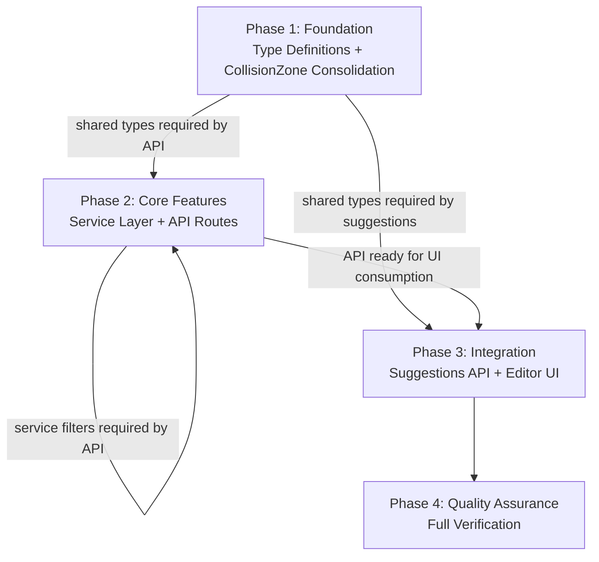
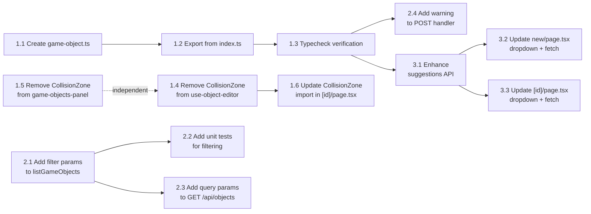

# Work Plan: Game Object Type System Implementation

Created Date: 2026-02-21
Type: feature
Estimated Duration: 1 day
Estimated Impact: 11 files (1 new, 10 modified)
Related Issue/PR: N/A

## Related Documents
- Design Doc: [docs/design/design-013-game-object-type-system.md](../design/design-013-game-object-type-system.md)
- ADR: [docs/adr/ADR-0011-game-object-type-system.md](../adr/ADR-0011-game-object-type-system.md)
- ADR (referenced): [docs/adr/ADR-0008-object-editor-collision-zones-and-metadata.md](../adr/ADR-0008-object-editor-collision-zones-and-metadata.md)

## Objective

Implement soft-enforced TypeScript types for game object classification with a two-level hierarchy (Category -> ObjectType) as decided in ADR-0011. This provides developer guidance via autocomplete and type guards while preserving the flexibility of VARCHAR(100) columns established in ADR-0008. The implementation also consolidates a duplicated `CollisionZone` interface, adds service-layer filtering, enhances the suggestions API, and updates the editor UI with searchable dropdowns.

## Background

The `category` and `objectType` fields on `game_objects` are nullable `varchar(100)` columns with no TypeScript-level guidance. The GDD defines clear spatial domains (interior, exterior, farm, public) but the codebase has no constants, union types, or type guards for these values. Developers must guess valid strings or query the database. The `CollisionZone` interface is duplicated identically in 3 files. The `listGameObjects()` service function lacks category/objectType filtering. The editor UI uses free-text inputs with no indication of predefined values.

## Diagrams

### Phase Structure Diagram



### Task Dependency Diagram



## Risks and Countermeasures

### Technical Risks
- **Risk**: CollisionZone import change breaks downstream types
  - **Impact**: Low -- interface is identical, only import path changes
  - **Countermeasure**: TypeScript compiler catches any mismatch; run `pnpm nx typecheck game` after each change
- **Risk**: Suggestions API latency increase from DB query + merge
  - **Impact**: Low -- DB query already exists, merge is O(n) on arrays under 50 values
  - **Countermeasure**: No action needed; monitor if editor responsiveness degrades
- **Risk**: Developer forgets to update shared types when GDD evolves
  - **Impact**: Low -- soft enforcement means the system never blocks creation
  - **Countermeasure**: Warning logs in POST handler detect vocabulary drift; kill criteria (>30% custom values) triggers review per ADR-0011

### Schedule Risks
- **Risk**: Editor UI dropdown pattern more complex than anticipated
  - **Impact**: Low -- the existing suggestion popup pattern is preserved; only the data source changes
  - **Countermeasure**: The Design Doc specifies minimal JSX changes (placeholder text + fetch URL), not a new component

## Implementation Strategy

**Selected**: Implementation-First Development (Strategy B) -- no test design information was provided.

**Implementation Approach**: Vertical Slice (Feature-driven) per Design Doc. Each phase produces a working, testable increment.

**Verification Levels**: L3 (Build Success) for Phases 1-2, L1 (Functional Operation) for Phase 3, L2 (Test Operation) for Phase 4.

## Implementation Phases

### Phase 1: Foundation Implementation (Estimated commits: 1-2)
**Purpose**: Establish type definitions in `@nookstead/shared` and consolidate the duplicated `CollisionZone` interface. These are prerequisites for all downstream changes.

**Dependencies**: None (starting phase)

#### Tasks

**Task 1.1**: Create type definitions file `packages/shared/src/types/game-object.ts`
- Create new file with `GAME_OBJECT_CATEGORIES` const array, `GameObjectCategory` union type, `GAME_OBJECT_TYPES` const object with `satisfies` constraint, `GameObjectType` generic union type, `isGameObjectCategory` type guard, `isGameObjectType` type guard, and `getAllGameObjectTypes` utility function
- Content exactly as specified in Design Doc "Contract Definitions" section and ADR-0011 Decision 1
- Completion: File exists with all 7 exports; follows existing `fence-layer.ts` file structure pattern
- AC traceability: AC1 (all items)

**Task 1.2**: Export new types from `packages/shared/src/index.ts`
- Add value exports: `GAME_OBJECT_CATEGORIES`, `GAME_OBJECT_TYPES`, `isGameObjectCategory`, `isGameObjectType`, `getAllGameObjectTypes`
- Add type exports: `GameObjectCategory`, `GameObjectType`
- Follow existing barrel export pattern (see `fence-layer.ts` exports at lines 65-70)
- Completion: Types importable from `@nookstead/shared`
- AC traceability: AC1 (export requirement)

**Task 1.3**: Verify typecheck passes
- Run `pnpm nx typecheck game`
- Verify the `satisfies Record<GameObjectCategory, readonly string[]>` constraint works (adding a category without types would cause a compile error)
- Completion: Zero type errors
- AC traceability: AC1 (compiler constraint verification)

**Task 1.4**: Remove duplicate `CollisionZone` from `apps/genmap/src/hooks/use-object-editor.ts`
- Delete the local `CollisionZone` interface definition (lines 8-17)
- Remove the `export` on `CollisionZone` from this file
- Add `import type { CollisionZone } from '@nookstead/db'` at top of file
- Completion: No local `CollisionZone` definition in this file; import resolves correctly
- AC traceability: AC6

**Task 1.5**: Remove duplicate `CollisionZone` from `apps/genmap/src/components/map-editor/game-objects-panel.tsx`
- Delete the local `CollisionZone` interface definition (lines 26-35)
- Add `import type { CollisionZone } from '@nookstead/db'` at top of file
- Completion: No local `CollisionZone` definition in this file; import resolves correctly
- AC traceability: AC6

**Task 1.6**: Update `CollisionZone` import in `apps/genmap/src/app/(app)/objects/[id]/page.tsx`
- Change `import { useObjectEditor, type CollisionZone } from '@/hooks/use-object-editor'`
- To: `import { useObjectEditor } from '@/hooks/use-object-editor'` and `import type { CollisionZone } from '@nookstead/db'`
- Completion: File compiles with new import path
- AC traceability: AC6

- [ ] Task 1.1: Create `packages/shared/src/types/game-object.ts` with const arrays, union types, type guards
- [ ] Task 1.2: Export new types from `packages/shared/src/index.ts` barrel
- [ ] Task 1.3: Run `pnpm nx typecheck game` -- verify zero type errors
- [ ] Task 1.4: Remove duplicate `CollisionZone` from `use-object-editor.ts`, import from `@nookstead/db`
- [ ] Task 1.5: Remove duplicate `CollisionZone` from `game-objects-panel.tsx`, import from `@nookstead/db`
- [ ] Task 1.6: Update `CollisionZone` import in `[id]/page.tsx` to import from `@nookstead/db`
- [ ] Quality check: `pnpm nx typecheck game` passes with zero errors

#### Phase Completion Criteria
- [ ] All 7 exports available from `@nookstead/shared` (AC1)
- [ ] `satisfies` constraint verified -- TypeScript compiler enforces category-types mapping
- [ ] `CollisionZone` interface defined in exactly one location: `packages/db/src/schema/game-objects.ts` (AC6)
- [ ] All files importing `CollisionZone` use the canonical source
- [ ] `pnpm nx typecheck game` passes

#### Operational Verification Procedures
1. Run `pnpm nx typecheck game` -- expect zero errors
2. Verify `CollisionZone` is defined in exactly one file:
   - Search codebase for `interface CollisionZone` -- expect exactly 1 result in `packages/db/src/schema/game-objects.ts`
3. Verify exports: confirm the following are importable from `@nookstead/shared`:
   - `GAME_OBJECT_CATEGORIES` (4 entries: interior, exterior, farm, public)
   - `GAME_OBJECT_TYPES` (object with 4 keys)
   - `GameObjectCategory` (union type)
   - `GameObjectType` (generic union type)
   - `isGameObjectCategory` (function)
   - `isGameObjectType` (function)
   - `getAllGameObjectTypes` (function)

---

### Phase 2: Core Feature Implementation (Estimated commits: 1-2)
**Purpose**: Add category/objectType filtering to the service layer and API route. These changes enable filtered queries and non-standard value warnings.

**Dependencies**: Phase 1 Tasks 1.1-1.3 (shared types needed for API POST warning)

#### Tasks

**Task 2.1**: Add `category` and `objectType` filter params to `listGameObjects` in `packages/db/src/services/game-object.ts`
- Add `and` import from `drizzle-orm`
- Extend params type: `{ limit?, offset?, category?: string, objectType?: string }`
- Build conditions array; apply `and(...conditions)` via `.where()` when conditions exist
- Implementation follows the chaining pattern already used for `.limit()` and `.offset()`
- Backward compatible: no filters provided = no WHERE clause = all objects returned
- Completion: Function accepts new params; existing callers unaffected
- AC traceability: AC2 (all items)

**Task 2.2**: Add unit tests for filtering in `packages/db/src/services/game-object.spec.ts`
- Test: `listGameObjects(db, { category: 'interior' })` returns only matching objects
- Test: `listGameObjects(db, { objectType: 'furniture' })` returns only matching objects
- Test: both filters combined applies AND logic
- Test: no filters returns all objects (backward compatible)
- Test: `listGameObjects(db, { limit: 10 })` still works (backward compatible)
- Completion: All unit tests pass
- AC traceability: AC2 (all items)

**Task 2.3**: Add `category`/`objectType` query param parsing to GET handler in `apps/genmap/src/app/api/objects/route.ts`
- Parse `category` and `objectType` from `searchParams`
- Trim values; skip empty strings
- Pass to `listGameObjects` as filter params
- Completion: `GET /api/objects?category=interior` returns filtered results
- AC traceability: AC3 (all items)

**Task 2.4**: Add non-standard value warning to POST handler in `apps/genmap/src/app/api/objects/route.ts`
- Import `isGameObjectCategory`, `isGameObjectType` from `@nookstead/shared`
- After successful `createGameObject`, check category and objectType against predefined types
- Log `console.warn('Non-standard game object category used', { category, objectId })` if non-standard
- Log `console.warn('Non-standard game object type used', { objectType, category, objectId })` if non-standard
- Completion: Non-standard values logged; standard values not logged
- AC traceability: Design Doc "Logging and Monitoring" section

- [ ] Task 2.1: Add `and` import and filter params to `listGameObjects` service function
- [ ] Task 2.2: Add unit tests for category/objectType filtering (5 test cases)
- [ ] Task 2.3: Add `category`/`objectType` query param parsing to GET `/api/objects`
- [ ] Task 2.4: Add non-standard value warning to POST `/api/objects` with shared type imports
- [ ] Quality check: `pnpm nx typecheck game` and `pnpm nx test game` pass

#### Phase Completion Criteria
- [ ] `listGameObjects` supports optional `category` and `objectType` filter params (AC2)
- [ ] Filter params apply AND logic when both provided (AC2)
- [ ] No filters = all objects returned (backward compatible) (AC2)
- [ ] `GET /api/objects?category=interior` returns filtered results (AC3)
- [ ] `GET /api/objects?category=interior&objectType=furniture` applies both filters (AC3)
- [ ] Non-standard category/objectType values logged as warnings
- [ ] All unit tests pass (5 test cases for filtering)
- [ ] `pnpm nx typecheck game` passes

#### Operational Verification Procedures
1. Run `pnpm nx test game` -- verify filtering unit tests pass
2. Run `pnpm nx typecheck game` -- expect zero errors
3. **Integration Point 2 (Service -> API)**: Start dev server (`pnpm nx dev game`), then:
   - `GET /api/objects` -- returns all objects (backward compatible)
   - `GET /api/objects?category=interior` -- returns only interior objects
   - `GET /api/objects?category=interior&objectType=furniture` -- returns objects matching both filters
4. Verify POST handler logs warning for non-standard values (check console output)

---

### Phase 3: Integration Implementation (Estimated commits: 1-2)
**Purpose**: Enhance the suggestions API to merge predefined values with DB-sourced values, and update the editor UI to show searchable dropdowns with category-aware objectType fetching.

**Dependencies**: Phase 1 Tasks 1.1-1.3 (shared types for suggestions API), Phase 2 Task 2.3 (not strictly required but API should be filtering-ready before UI work)

#### Tasks

**Task 3.1**: Enhance suggestions API in `apps/genmap/src/app/api/objects/suggestions/route.ts`
- Import `GAME_OBJECT_CATEGORIES`, `GAME_OBJECT_TYPES`, `isGameObjectCategory` from `@nookstead/shared`
- For `field=category`: merge predefined categories (first) with DB-only values (after)
- For `field=objectType`: accept optional `category` query param; if valid category, use that category's predefined types; otherwise use all types
- Merge logic: predefined values first, then DB-only values not in predefined set; no duplicates
- Replace the existing implementation as specified in Design Doc "File 5"
- Completion: Suggestions endpoint returns merged arrays; predefined values always present regardless of DB state
- AC traceability: AC4 (all items)

**Task 3.2**: Update category/objectType suggestions fetch in `apps/genmap/src/app/(app)/objects/new/page.tsx`
- Split the single `useEffect` into two: one for category suggestions (on mount), one for objectType suggestions (on `editor.category` change)
- ObjectType fetch URL includes `category` param when category is set: `/api/objects/suggestions?field=objectType&category=${encodeURIComponent(categoryValue)}`
- Update placeholder text: `"Select or type category..."` and `"Select or type object type..."`
- Completion: Dropdown shows predefined values first; objectType refreshes when category changes
- AC traceability: AC5 (all items)

**Task 3.3**: Update category/objectType suggestions fetch in `apps/genmap/src/app/(app)/objects/[id]/page.tsx`
- Same pattern as Task 3.2: split useEffect, add category-aware objectType fetch, update placeholders
- Completion: Edit page has same dropdown behavior as new page
- AC traceability: AC5 (all items)

- [ ] Task 3.1: Enhance suggestions API to merge predefined + DB values with `@nookstead/shared` imports
- [ ] Task 3.2: Update `new/page.tsx` -- split suggestion fetch, category-aware objectType, placeholder text
- [ ] Task 3.3: Update `[id]/page.tsx` -- split suggestion fetch, category-aware objectType, placeholder text
- [ ] Quality check: `pnpm nx typecheck game` and `pnpm nx lint game` pass

#### Phase Completion Criteria
- [ ] `GET /api/objects/suggestions?field=category` returns predefined categories even with empty DB (AC4)
- [ ] `GET /api/objects/suggestions?field=objectType&category=interior` returns interior-specific types (AC4)
- [ ] Predefined values appear before DB-only values in response array (AC4)
- [ ] No duplicates in suggestion responses (AC4)
- [ ] Editor new/edit pages show category-aware objectType dropdown (AC5)
- [ ] Custom values still accepted in dropdown inputs (AC5 -- soft enforcement)
- [ ] ObjectType suggestions refresh when category selection changes (AC5)
- [ ] `pnpm nx typecheck game` passes

#### Operational Verification Procedures
1. **Integration Point 3 (Shared Types -> Suggestions API)**: Start dev server, then:
   - `GET /api/objects/suggestions?field=category` -- expect response includes `["interior", "exterior", "farm", "public", ...]`
   - `GET /api/objects/suggestions?field=objectType&category=interior` -- expect `["furniture", "decor", "lighting", ...]`
   - `GET /api/objects/suggestions?field=objectType` (no category) -- expect all known types
   - Verify predefined values appear first in array
   - Verify no duplicates between predefined and DB values
2. **Integration Point 4 (Suggestions API -> Editor UI)**:
   - Open editor new object page -- verify category dropdown shows predefined values
   - Select "interior" category -- verify objectType dropdown updates to show interior types
   - Clear category -- verify objectType dropdown shows all types
   - Type a custom value not in dropdown -- verify it is accepted
3. Open editor edit object page -- verify same dropdown behavior as new page
4. Run `pnpm nx typecheck game` -- expect zero errors
5. Run `pnpm nx lint game` -- expect zero errors

---

### Phase 4: Quality Assurance (Required) (Estimated commits: 1)
**Purpose**: Full verification of all acceptance criteria, quality checks, and type guard unit tests.

**Dependencies**: All previous phases complete

#### Tasks

**Task 4.1**: Add unit tests for type guards in `@nookstead/shared`
- Test `isGameObjectCategory('interior')` returns `true`
- Test `isGameObjectCategory('exterior')` returns `true`
- Test `isGameObjectCategory('farm')` returns `true`
- Test `isGameObjectCategory('public')` returns `true`
- Test `isGameObjectCategory('custom_value')` returns `false`
- Test `isGameObjectType('interior', 'furniture')` returns `true`
- Test `isGameObjectType('interior', 'custom_thing')` returns `false`
- Test `getAllGameObjectTypes()` returns flat array of all types across categories
- Test `GAME_OBJECT_CATEGORIES` has exactly 4 entries
- AC traceability: AC1 (type guard assertions)

**Task 4.2**: Run `pnpm nx typecheck game` -- verify all types resolve
- AC traceability: AC1

**Task 4.3**: Run `pnpm nx lint game` -- fix any issues
- AC traceability: Applicable Standards (Prettier, ESLint)

**Task 4.4**: Run `pnpm nx test game` -- verify all existing and new tests pass
- AC traceability: AC1, AC2

**Task 4.5**: Verify all Design Doc acceptance criteria achieved
- Walk through AC1 through AC6 and confirm each criterion is met

- [ ] Task 4.1: Add unit tests for type guards in shared package (9 test cases)
- [ ] Task 4.2: Run `pnpm nx typecheck game` -- zero type errors
- [ ] Task 4.3: Run `pnpm nx lint game` -- zero lint errors
- [ ] Task 4.4: Run `pnpm nx test game` -- all tests pass
- [ ] Task 4.5: Verify all Design Doc acceptance criteria (AC1-AC6) achieved
- [ ] Quality check: All static analysis, lint, typecheck, and tests pass with zero errors

#### Phase Completion Criteria
- [ ] Type guard unit tests pass (9 test cases for AC1)
- [ ] Service filtering unit tests pass (5 test cases for AC2)
- [ ] `pnpm nx typecheck game` -- zero errors
- [ ] `pnpm nx lint game` -- zero errors
- [ ] `pnpm nx test game` -- all tests pass
- [ ] All 6 acceptance criteria (AC1-AC6) verified

#### Operational Verification Procedures
1. Run full quality check suite:
   ```bash
   pnpm nx typecheck game
   pnpm nx lint game
   pnpm nx test game
   ```
2. Verify AC1 -- Type Definitions:
   - `isGameObjectCategory('interior')` returns `true`
   - `isGameObjectCategory('custom_value')` returns `false`
   - `GAME_OBJECT_CATEGORIES` has exactly 4 entries
   - `satisfies` constraint enforced (compiler error if category added without types)
3. Verify AC2 -- Service Layer Filtering:
   - Unit tests for all 5 filter scenarios pass
4. Verify AC3 -- API Route Filtering:
   - `GET /api/objects?category=interior` returns filtered results
   - `GET /api/objects` without filters returns all (backward compatible)
5. Verify AC4 -- Suggestions API Merge:
   - `GET /api/objects/suggestions?field=category` returns predefined values even with empty DB
   - Predefined values appear before DB-only values
6. Verify AC5 -- Editor Dropdowns:
   - Category dropdown shows predefined categories
   - ObjectType dropdown updates when category changes
   - Custom values accepted (soft enforcement)
7. Verify AC6 -- CollisionZone Consolidation:
   - Search for `interface CollisionZone` -- exactly 1 result in `packages/db/src/schema/game-objects.ts`

---

## Acceptance Criteria Traceability Matrix

| AC | Description | Phase | Tasks | Test Cases |
|----|-------------|-------|-------|------------|
| AC1 | Type definitions in @nookstead/shared | Phase 1 + Phase 4 | 1.1, 1.2, 1.3, 4.1 | 9 unit tests |
| AC2 | Service layer filtering | Phase 2 | 2.1, 2.2 | 5 unit tests |
| AC3 | API route filtering | Phase 2 | 2.3 | Manual verification |
| AC4 | Suggestions API merge | Phase 3 | 3.1 | Manual verification |
| AC5 | Editor dropdowns | Phase 3 | 3.2, 3.3 | Manual verification |
| AC6 | CollisionZone consolidation | Phase 1 | 1.4, 1.5, 1.6 | Codebase search |

**Test case resolution target**: 14 unit test cases (9 type guard + 5 service filter)

## File Change Summary

| File | Action | Phase |
|------|--------|-------|
| `packages/shared/src/types/game-object.ts` | NEW | Phase 1 |
| `packages/shared/src/index.ts` | MODIFY (add exports) | Phase 1 |
| `apps/genmap/src/hooks/use-object-editor.ts` | MODIFY (remove CollisionZone, add import) | Phase 1 |
| `apps/genmap/src/components/map-editor/game-objects-panel.tsx` | MODIFY (remove CollisionZone, add import) | Phase 1 |
| `apps/genmap/src/app/(app)/objects/[id]/page.tsx` | MODIFY (CollisionZone import + dropdown) | Phase 1 + Phase 3 |
| `packages/db/src/services/game-object.ts` | MODIFY (add filter params) | Phase 2 |
| `packages/db/src/services/game-object.spec.ts` | MODIFY (add filter tests) | Phase 2 |
| `apps/genmap/src/app/api/objects/route.ts` | MODIFY (query params + warning) | Phase 2 |
| `apps/genmap/src/app/api/objects/suggestions/route.ts` | MODIFY (merge predefined + DB) | Phase 3 |
| `apps/genmap/src/app/(app)/objects/new/page.tsx` | MODIFY (dropdown fetch + placeholder) | Phase 3 |
| Shared package test file (new or existing) | NEW/MODIFY (type guard tests) | Phase 4 |

## Quality Assurance
- [ ] All static analysis passes (TypeScript strict mode)
- [ ] All tests pass (14 unit test cases)
- [ ] Lint check pass (`pnpm nx lint game`)
- [ ] Typecheck pass (`pnpm nx typecheck game`)
- [ ] Build success (`pnpm nx build game`)

## Completion Criteria
- [ ] All 4 phases completed
- [ ] Each phase's operational verification procedures executed
- [ ] Design Doc acceptance criteria satisfied (AC1-AC6)
- [ ] Quality checks completed (zero errors in typecheck, lint, test)
- [ ] All 14 unit tests pass (9 type guard + 5 service filter)
- [ ] `CollisionZone` defined in exactly 1 location
- [ ] User review approval obtained

## Constraints
- Manual commit strategy -- user decides when to commit
- No database migration needed -- schema unchanged
- Soft enforcement only -- API never rejects custom values
- All new code follows Prettier (single quotes, 2-space indent) and ESLint rules
- Lowercase snake_case for all predefined values

## Progress Tracking

### Phase 1: Foundation Implementation
- Start:
- Complete:
- Notes:

### Phase 2: Core Feature Implementation
- Start:
- Complete:
- Notes:

### Phase 3: Integration Implementation
- Start:
- Complete:
- Notes:

### Phase 4: Quality Assurance
- Start:
- Complete:
- Notes:

## Notes
- **Implementation approach**: Vertical Slice (Feature-driven) per Design Doc. Each phase produces a working increment.
- **CollisionZone cleanup**: The `GameObjectLayer` interface in `game-objects-panel.tsx` is also duplicated from `@nookstead/db` schema, but this is out of scope per Design Doc.
- **No E2E tests required**: The genmap editor is an internal tool; the existing Playwright E2E setup tests the game client, not the editor.
- **Fence types remain separate**: Per ADR-0010, fences use their own `fence_types` table. The `exterior.fence` and `exterior.gate` entries in `GAME_OBJECT_TYPES` refer to decorative fence/gate objects, not the fence system's auto-connecting segments.
- **Kill criteria**: If more than 30% of game objects use custom (non-predefined) category values, the predefined types should be revisited per ADR-0011.
