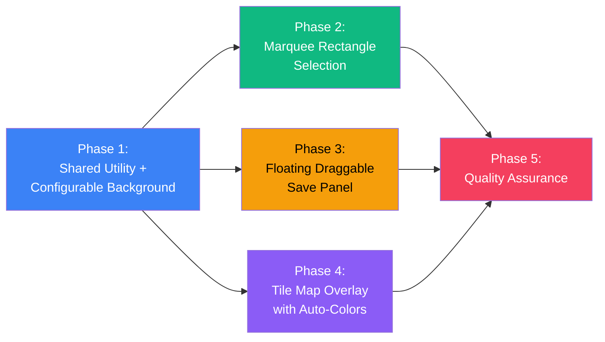
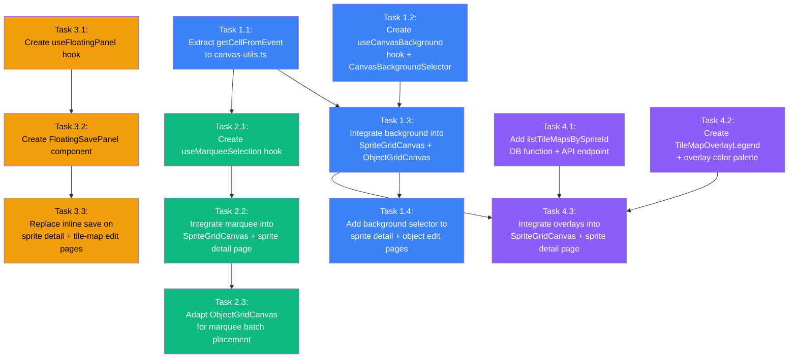

# Work Plan: Genmap Editor UX Improvements

Created Date: 2026-02-18
Type: feature
Estimated Duration: 3 days
Estimated Impact: 8 new files, 7 modified files (15 total)
Related Issue/PR: N/A

## Related Documents

- Design Doc: [docs/design/design-008-genmap-ux-improvements.md](../design/design-008-genmap-ux-improvements.md)
- UXRD: [docs/uxrd/uxrd-002-genmap-editor-ux-improvements.md](../uxrd/uxrd-002-genmap-editor-ux-improvements.md)
- ADR: [docs/adr/ADR-0007-sprite-management-storage-and-schema.md](../adr/ADR-0007-sprite-management-storage-and-schema.md)

## Objective

Implement four targeted UX improvements to the Genmap sprite/tile map editor that address three workflow bottlenecks: tedious single-click tile selection, no background control for transparency verification, and scroll-to-save workflow friction. A fourth feature adds overlay visualization for existing tile maps.

## Background

The Genmap editor (`apps/genmap/`) is an internal tool for managing sprite sheets, tile maps, and game objects. Current limitations require 30 clicks to select 30 tiles, force users to scroll away from the canvas to save, and provide no way to preview sprites against different backgrounds or see existing tile map boundaries.

## Implementation Strategy

**Approach**: Vertical Slice (Feature-driven) with shared utility extraction first

The four features have a natural dependency chain:
1. Shared utility extraction + configurable background (establishes canvas render layer architecture)
2. Marquee selection (requires `getCellFromEvent` from shared utility)
3. Floating save panel (independent of canvas, but placed after to avoid sprite detail page conflicts)
4. Tile map overlays (requires API endpoint + canvas render layers from Phase 1)

**Commit Strategy**: Manual (user decides when to commit). Tasks are designed at single-commit granularity.

**Test Strategy**: Implementation-First (Strategy B) -- no test skeletons were generated. Tests added as needed per phase.

## Risks and Countermeasures

### Technical Risks

- **Risk**: Canvas render performance with multiple tile map overlay layers (>500 tiles across 10 tile maps)
  - **Impact**: Low (internal tool, no SLA targets)
  - **Countermeasure**: Batch fill operations by color; profile with large datasets; use offscreen canvas compositing as fallback if needed

- **Risk**: `setPointerCapture` browser inconsistencies during fast drag
  - **Impact**: Low (modern browsers support Pointer Events Level 2)
  - **Countermeasure**: Fallback to mouse events if pointerId is unavailable; 3px drag threshold prevents accidental drags

- **Risk**: Floating panel z-index conflicts with existing shadcn/ui dialogs
  - **Impact**: Low
  - **Countermeasure**: Use z-index 40 (below shadcn Dialog at 50); test with ConfirmDialog open while panel is visible

- **Risk**: `getCellFromEvent` extraction breaks existing click/hover behavior
  - **Impact**: Medium (could break core tile selection)
  - **Countermeasure**: Extraction is a pure refactor with identical logic; manual verification of click+hover before and after

- **Risk**: localStorage unavailable in Safari private mode
  - **Impact**: Low (graceful degradation to defaults)
  - **Countermeasure**: All localStorage access wrapped in try/catch per Design Doc contract

### Schedule Risks

- **Risk**: Marquee selection has complex pointer event edge cases (leave during drag, Escape cancel, modifier key tracking)
  - **Impact**: Medium (could delay Phase 2)
  - **Countermeasure**: Hook is isolated and testable independently of canvas rendering; edge cases documented in Design Doc

## Phase Structure Diagram

## Task Dependency Diagram

## Implementation Phases

### Phase 1: Shared Utility + Configurable Background (Estimated commits: 4)

**Purpose**: Extract shared `getCellFromEvent` utility, create the background preference system, and integrate configurable backgrounds into both canvas components and pages. This establishes the canvas render layer architecture that all subsequent phases build on.

**Dependencies**: None (first phase)

#### Task 1.1: Extract `getCellFromEvent` to shared `canvas-utils.ts`

**Files**: 3 files (1 new, 2 modified)
- Create `apps/genmap/src/lib/canvas-utils.ts` (new)
- Modify `apps/genmap/src/components/sprite-grid-canvas.tsx` (replace inline function with import)
- Modify `apps/genmap/src/components/object-grid-canvas.tsx` (replace inline function with import)

**Work**:
- [ ] Create `apps/genmap/src/lib/canvas-utils.ts` with `getCellFromEvent` function and `CellFromEventOptions` interface
- [ ] Export `CanvasBackground` type and `TILE_MAP_OVERLAY_COLORS` palette from canvas-utils (shared types needed by multiple phases)
- [ ] Export `getOverlayColorIndex` helper function
- [ ] In `sprite-grid-canvas.tsx`: remove inline `getCellFromEvent` (lines 134-161), import from `canvas-utils.ts`, adapt call site to pass options object
- [ ] In `object-grid-canvas.tsx`: remove inline `getCellFromEvent` (lines 173-194), import from `canvas-utils.ts`, adapt call site to pass options object
- [ ] Verify existing click and hover behavior works identically after refactor

**Completion Criteria**:
- [ ] `getCellFromEvent` exists only in `canvas-utils.ts` (no duplication)
- [ ] `CellFromEventOptions` interface matches Design Doc specification
- [ ] Click on any tile in SpriteGridCanvas produces correct TileCoord
- [ ] Click on any cell in ObjectGridCanvas produces correct cell coordinates
- [ ] Hover highlight works on both canvases
- [ ] TypeScript compiles without errors

---

#### Task 1.2: Create `useCanvasBackground` hook and `CanvasBackgroundSelector` component

**Files**: 2 files (both new)
- Create `apps/genmap/src/hooks/use-canvas-background.ts`
- Create `apps/genmap/src/components/canvas-background-selector.tsx`

**Work**:
- [ ] Create `useCanvasBackground` hook with localStorage read/write under key `genmap-canvas-background`
- [ ] Implement `readFromStorage` / `writeToStorage` helpers with try/catch (per Design Doc localStorage contract)
- [ ] Default to `{ type: 'checkerboard' }` when no stored preference or localStorage unavailable
- [ ] Create `CanvasBackgroundSelector` component with 5 swatch buttons: checkerboard, black (#000000), white (#ffffff), grass green (#4a7c3f), custom color picker
- [ ] Active swatch shows `ring-2 ring-primary` outline
- [ ] Checkerboard swatch uses CSS gradient pattern inside 24x24px button
- [ ] Custom color swatch wraps hidden `<input type="color">`
- [ ] Add `aria-label` and `aria-pressed` to each swatch button

**Completion Criteria**:
- [ ] Hook returns `{ background, setBackground }` matching Design Doc interface
- [ ] Five swatch options render correctly
- [ ] Active swatch visually distinguished with ring outline
- [ ] Custom color picker opens native color dialog
- [ ] localStorage persistence works (set background, reload page, preference restored)
- [ ] Graceful fallback when localStorage unavailable (no errors thrown)
- [ ] TypeScript compiles without errors

---

#### Task 1.3: Integrate configurable background into SpriteGridCanvas and ObjectGridCanvas

**Files**: 2 files (both modified)
- Modify `apps/genmap/src/components/sprite-grid-canvas.tsx`
- Modify `apps/genmap/src/components/object-grid-canvas.tsx`

**Work**:
- [ ] Add optional `background?: CanvasBackground` prop to `SpriteGridCanvasProps`
- [ ] In `SpriteGridCanvas.render()`: insert Layer 1 (background) before the image draw. For 'checkerboard': iterate cells with alternating colors; for 'solid': `ctx.fillRect` with the color
- [ ] Add optional `background?: CanvasBackground` prop to `ObjectGridCanvasProps`
- [ ] In `ObjectGridCanvas.render()`: replace hardcoded checkerboard (lines 77-88) with background prop logic. When no prop provided, default to existing checkerboard behavior (backward compatibility)
- [ ] Import `CanvasBackground` type from `canvas-utils.ts`

**Completion Criteria**:
- [ ] SpriteGridCanvas renders checkerboard background behind sprite image when `background` is `{ type: 'checkerboard' }`
- [ ] SpriteGridCanvas renders solid color background when `background` is `{ type: 'solid', color: '#000000' }`
- [ ] ObjectGridCanvas uses configurable background when prop is provided
- [ ] ObjectGridCanvas falls back to existing hardcoded checkerboard when no prop (backward compat)
- [ ] Transparent sprite pixels reveal the background color
- [ ] Empty ObjectGridCanvas cells show the configured background
- [ ] TypeScript compiles without errors

---

#### Task 1.4: Add CanvasBackgroundSelector to sprite detail and object edit pages

**Files**: 2 files (both modified)
- Modify `apps/genmap/src/app/sprites/[id]/page.tsx`
- Modify `apps/genmap/src/app/objects/[id]/page.tsx`

**Work**:
- [ ] In sprite detail page: import and call `useCanvasBackground()` hook; render `CanvasBackgroundSelector` in toolbar row alongside `TileSizeSelector`; pass `background` prop to `SpriteGridCanvas`
- [ ] In object edit page: import and call `useCanvasBackground()` hook; render `CanvasBackgroundSelector` above canvas area; pass `background` prop to `ObjectGridCanvas`
- [ ] Background setting shared globally (both pages use same localStorage key)

**Completion Criteria**:
- [ ] Background selector visible on sprite detail page below canvas, next to tile size selector
- [ ] Background selector visible on object edit page above the canvas area
- [ ] Selecting a background on one page persists and applies on the other page
- [ ] AC: All 5 background options work (checkerboard, black, white, grass green, custom)
- [ ] AC: Active swatch has 2px ring outline
- [ ] AC: Background persists to localStorage under `genmap-canvas-background`
- [ ] AC: Page load restores saved preference, defaulting to checkerboard
- [ ] AC: ObjectGridCanvas empty cells show configured background
- [ ] TypeScript compiles without errors

#### Phase 1 Completion Criteria

- [ ] `getCellFromEvent` extracted with zero behavior change
- [ ] Background selector functional on both sprite detail and object edit pages
- [ ] All 5 background options render correctly on both canvas types
- [ ] localStorage persistence works cross-page
- [ ] No regressions in existing tile selection or tile placement functionality

#### Phase 1 Operational Verification Procedures

1. **getCellFromEvent extraction** (Integration Point 1):
   - Open sprite detail page, click various tiles at edges and center -- verify correct tile highlights and selection
   - Open object edit page, click cells with active brush -- verify tiles placed at correct positions
   - Hover across canvas boundaries -- verify hover highlight follows cursor correctly

2. **Canvas background rendering** (Integration Point 2):
   - Select each of the 5 background options on sprite detail page -- verify canvas re-renders with correct background
   - Verify transparent pixels in sprite image reveal the selected background color
   - Switch to object edit page -- verify same background preference is applied
   - Select custom color via color picker -- verify custom color renders
   - Reload page -- verify stored preference is restored
   - Test in browser private mode (if possible) -- verify graceful fallback to checkerboard

---

### Phase 2: Marquee Rectangle Selection (Estimated commits: 3)

**Purpose**: Implement click-and-drag rectangle selection for tiles with modifier key support (Shift to add, Ctrl to subtract). Adapt for batch tile placement on ObjectGridCanvas.

**Dependencies**: Phase 1 complete (requires `getCellFromEvent` from `canvas-utils.ts` and restructured canvas render function)

#### Task 2.1: Create `useMarqueeSelection` hook

**Files**: 1 file (new)
- Create `apps/genmap/src/hooks/use-marquee-selection.ts`

**Work**:
- [ ] Implement `useMarqueeSelection` hook per Design Doc interface
- [ ] Track `startPixel` on `pointerdown`; track `currentPixel` on `pointermove`
- [ ] Use `setPointerCapture(e.pointerId)` for reliable drag tracking
- [ ] Only transition to `isDragging=true` when movement exceeds 3px threshold
- [ ] Track modifier keys: `shift` and `ctrl` (or `metaKey` for Mac)
- [ ] Snap selection rectangle to tile grid: `minCol/maxCol/minRow/maxRow` from start and current positions
- [ ] Implement `getTilesInRect()` to enumerate all tiles within the rectangle
- [ ] Implement `cancelDrag()` to reset state (called on mouse leave and Escape)
- [ ] Handle `pointerup`: if dragging, return tiles in rect; if click (no drag), return single cell
- [ ] Import and use `getCellFromEvent` from `canvas-utils.ts`

**Completion Criteria**:
- [ ] Hook returns `{ marquee, handlers, getTilesInRect, cancelDrag }` matching Design Doc
- [ ] 3px drag threshold correctly distinguishes click from drag
- [ ] Modifier keys tracked: shift and ctrl/meta
- [ ] `getTilesInRect` returns correct tile array for any rectangle
- [ ] `cancelDrag` resets all internal state
- [ ] Pointer capture set on drag start, released on drag end
- [ ] TypeScript compiles without errors

---

#### Task 2.2: Integrate marquee selection into SpriteGridCanvas and sprite detail page

**Files**: 2 files (both modified)
- Modify `apps/genmap/src/components/sprite-grid-canvas.tsx`
- Modify `apps/genmap/src/app/sprites/[id]/page.tsx`

**Work**:
- [ ] Add `onSelectionChange?: (tiles: TileCoord[]) => void` prop to SpriteGridCanvas
- [ ] Replace `onClick`/`onMouseMove`/`onMouseLeave` event handlers with pointer event handlers from `useMarqueeSelection`
- [ ] Maintain backward compat: when only `onCellClick` is provided (no `onSelectionChange`), existing single-click toggle still works
- [ ] Add Layer 6 (marquee rectangle rendering) to canvas render function: `rgba(59,130,246,0.25)` fill + 1px dashed blue border, snapped to grid
- [ ] Add Escape key handler: cancel drag during active drag, clear selection when not dragging
- [ ] Handle mouse leave during drag: cancel drag and revert to pre-drag selection
- [ ] In sprite detail page: add `onSelectionChange` callback that implements modifier logic:
  - No modifier: replace entire selection with tiles in rect
  - Shift: union (add to existing selection)
  - Ctrl/Cmd: subtract (remove from existing selection)
  - Single click without modifier: toggle (existing behavior)
  - Single click with Shift: add to selection
  - Single click with Ctrl/Cmd: toggle without affecting rest

**Completion Criteria**:
- [ ] AC: Click without modifier toggles single tile (existing behavior preserved)
- [ ] AC: Click-and-drag beyond 3px renders dashed blue marquee rectangle snapped to grid
- [ ] AC: Release after drag without modifier replaces selection with tiles in rectangle
- [ ] AC: Shift + drag adds tiles to existing selection (union)
- [ ] AC: Ctrl/Cmd + drag removes tiles from existing selection (subtract)
- [ ] AC: Ctrl/Cmd + click toggles single tile without affecting rest
- [ ] AC: Shift + click adds single tile to selection
- [ ] AC: Mouse leave during drag cancels drag, reverts to pre-drag selection
- [ ] AC: Escape during drag cancels drag, reverts to pre-drag selection
- [ ] AC: Drag starting and ending on same tile (after 3px threshold) selects that one tile
- [ ] AC: `onSelectionChange` provides full TileCoord[] array after any operation
- [ ] AC: Existing `onCellClick` prop works when no `onSelectionChange` provided
- [ ] TypeScript compiles without errors

---

#### Task 2.3: Adapt ObjectGridCanvas for marquee batch placement

**Files**: 1 file (modified)
- Modify `apps/genmap/src/components/object-grid-canvas.tsx`

**Work**:
- [ ] Integrate `useMarqueeSelection` hook into ObjectGridCanvas
- [ ] When `activeTile` is set and user drags, fill all cells in the marquee rectangle with the active tile (batch placement)
- [ ] When no `activeTile` and user drags, batch-erase cells in the marquee rectangle
- [ ] Add marquee rectangle rendering layer during drag (same visual as SpriteGridCanvas)
- [ ] Replace mouse event handlers with pointer event handlers

**Completion Criteria**:
- [ ] AC: Click-and-drag on ObjectGridCanvas with active brush fills all cells in rectangle
- [ ] Existing single-click placement still works
- [ ] Marquee rectangle visible during drag
- [ ] Batch placement uses the same `activeTile` as single-click placement
- [ ] TypeScript compiles without errors

#### Phase 2 Completion Criteria

- [ ] Marquee selection functional on SpriteGridCanvas with all modifier key combinations
- [ ] Backward compatibility: `onCellClick` still works without `onSelectionChange`
- [ ] ObjectGridCanvas supports marquee batch placement
- [ ] No regressions in Phase 1 features (background still works)

#### Phase 2 Operational Verification Procedures

1. **Marquee selection** (Integration Point 3):
   - On sprite detail page, click-and-drag across a 4x3 region -- verify 12 tiles selected
   - Hold Shift, drag another region -- verify new tiles added to existing selection
   - Hold Ctrl, drag over some selected tiles -- verify those tiles deselected
   - Single click a tile without modifier -- verify single tile toggle (existing behavior)
   - Start drag, press Escape -- verify drag cancelled, selection reverted
   - Start drag, move mouse out of canvas -- verify drag cancelled
   - Drag from tile (2,3) back to tile (2,3) -- verify exactly 1 tile selected
   - Switch to tile-map edit page -- verify `onCellClick` still works (no `onSelectionChange` provided)

2. **ObjectGridCanvas marquee placement**:
   - Select a brush tile, drag across a 3x2 region on object canvas -- verify 6 cells filled with brush tile
   - Single click a cell with brush -- verify single cell placement (existing behavior)

---

### Phase 3: Floating Draggable Save Panel (Estimated commits: 3)

**Purpose**: Create a floating, draggable save panel using React portal that replaces the inline save forms on both the sprite detail page and tile-map edit page. Panel persists position across sessions via localStorage.

**Dependencies**: Phase 1 complete (for page layout context); independent of Phase 2

#### Task 3.1: Create `useFloatingPanel` hook

**Files**: 1 file (new)
- Create `apps/genmap/src/hooks/use-floating-panel.ts`

**Work**:
- [ ] Implement `useFloatingPanel` hook per Design Doc interface
- [ ] Read initial position from localStorage (key configurable via `storageKey` option)
- [ ] Clamp position to viewport on mount and on window resize (at least 50% panel width visible, title bar always visible)
- [ ] On `pointerdown` on drag handle: `setPointerCapture`, record offset between pointer and panel top-left
- [ ] Document-level `pointermove` listener updates position (clamped to viewport)
- [ ] Document-level `pointerup` listener persists position to localStorage
- [ ] Window `resize` listener re-clamps position
- [ ] Manage `isCollapsed` state, persisted alongside position in localStorage
- [ ] Use `readFromStorage` / `writeToStorage` pattern from Design Doc (try/catch)
- [ ] Clean up all event listeners on unmount

**Completion Criteria**:
- [ ] Hook returns `{ position, isCollapsed, isDragging, setCollapsed, dragHandlers }` matching Design Doc
- [ ] Position restored from localStorage on mount
- [ ] Position clamped to viewport bounds
- [ ] Drag updates position in real-time
- [ ] Position persisted to localStorage on drag end
- [ ] Window resize re-clamps position
- [ ] Collapse state persisted alongside position
- [ ] Graceful fallback when localStorage unavailable
- [ ] TypeScript compiles without errors

---

#### Task 3.2: Create `FloatingSavePanel` component

**Files**: 1 file (new)
- Create `apps/genmap/src/components/floating-save-panel.tsx`

**Work**:
- [ ] Create `FloatingSavePanel` component per Design Doc interface
- [ ] Render via `ReactDOM.createPortal` to `document.body`
- [ ] SSR guard: check `document.body` exists before creating portal
- [ ] Use `useFloatingPanel` hook with `storageKey='genmap-floating-panel-save'`
- [ ] Panel layout: drag handle bar (with grip icon), collapse/expand button, tile count in title
- [ ] Expanded state: name input, GroupSelector dropdown, tile count display, save button
- [ ] Collapsed state: title bar only showing "Save as Tile Map (N)"
- [ ] Visual: 320px fixed width, `z-index: 40`, `shadow-lg`, `rounded-lg`, `border`, `bg-background`
- [ ] Fade-in animation (200ms ease-out) on appear; fade-out (150ms ease-in) on disappear
- [ ] Configurable `saveButtonLabel` prop for variant usage (default: "Save Tile Map")
- [ ] Add `role="dialog"` and `aria-label="Save as Tile Map"`
- [ ] Import and use `GroupSelector` component for group dropdown

**Completion Criteria**:
- [ ] Panel renders in portal (not in document flow)
- [ ] Panel shows/hides based on `isVisible` prop
- [ ] Drag handle allows repositioning
- [ ] Collapse/expand toggle works with animation
- [ ] Name input, group selector, and save button functional
- [ ] z-index 40 (below shadcn dialogs at 50)
- [ ] Fade-in/out animations on visibility change
- [ ] TypeScript compiles without errors

---

#### Task 3.3: Replace inline save forms with FloatingSavePanel on sprite detail and tile-map edit pages

**Files**: 2 files (both modified)
- Modify `apps/genmap/src/app/sprites/[id]/page.tsx`
- Modify `apps/genmap/src/app/tile-maps/[id]/page.tsx`

**Work**:
- [ ] **Sprite detail page**: Remove inline save form (lines 223-253: the `
` block). Add `<FloatingSavePanel>` with same state bindings: `tileMapName`, `tileMapGroupId`, `isSaving`, `handleSaveTileMap`, `selectedTiles.length`
- [ ] Set `isVisible={selectedTiles.length > 0}` to show panel when tiles are selected
- [ ] **Tile-map edit page**: Replace inline save button section (lines 239-246: the `
` with save button). Add `<FloatingSavePanel>` with: `name`, `groupId`, `isSaving`, `handleSave`, `selectedTiles.length`, `saveButtonLabel="Save Changes"`, `isVisible={true}` (always visible since this is an edit page)
- [ ] Verify same state variables flow correctly through props

**Completion Criteria**:
- [ ] AC: FloatingSavePanel appears when at least 1 tile selected on sprite detail page (fade-in)
- [ ] AC: Panel disappears when all tiles deselected or save completes
- [ ] AC: Drag handle moves panel to new position
- [ ] AC: Position saved to localStorage under `genmap-floating-panel-save`
- [ ] AC: Position restored on page load, clamped to viewport
- [ ] AC: Viewport resize re-clamps position
- [ ] AC: Collapse button shrinks to title bar showing tile count
- [ ] AC: Panel renders via portal to document.body
- [ ] AC: z-index 40 (below dialogs at 50)
- [ ] AC: Panel width 320px, 8px border radius, drop shadow
- [ ] AC: Panel contains name input, group selector, tile count, save button
- [ ] AC: FloatingSavePanel also works on tile-map edit page with PATCH save
- [ ] AC: localStorage unavailable uses default position (bottom-right, 16px margin)
- [ ] Save on sprite detail page creates tile map (POST) -- existing flow preserved
- [ ] Save on tile-map edit page updates tile map (PATCH) -- existing flow preserved
- [ ] Inline save form completely removed from both pages
- [ ] TypeScript compiles without errors

#### Phase 3 Completion Criteria

- [ ] Floating save panel replaces inline save forms on both pages
- [ ] Panel draggable, collapsible, position-persistent
- [ ] Save flows unchanged (POST on sprite detail, PATCH on tile-map edit)
- [ ] No regressions in Phase 1 or Phase 2 features

#### Phase 3 Operational Verification Procedures

1. **Floating save panel on sprite detail page** (Integration Point 4):
   - Select tiles on sprite detail page -- verify panel appears with fade-in
   - Enter tile map name, select group, click Save -- verify tile map created (check in tile-maps list)
   - Verify panel disappears after save, selection cleared
   - Drag panel to a new position, reload page -- verify panel appears at saved position
   - Resize browser window so panel would be outside viewport -- verify panel re-clamps to visible area
   - Click collapse button -- verify panel shrinks to title bar with tile count
   - Open ConfirmDialog (delete sprite) -- verify dialog renders above panel (z-index)

2. **Floating save panel on tile-map edit page** (Integration Point 5):
   - Open a tile map edit page -- verify floating panel visible with "Save Changes" button
   - Modify selection, click Save -- verify PATCH save works
   - Drag panel, reload -- verify position persisted

---

### Phase 4: Tile Map Overlay with Auto-Colors (Estimated commits: 3)

**Purpose**: Add an API endpoint to query tile maps by sprite ID, visualize existing tile maps as colored overlays on the SpriteGridCanvas, and provide a legend with visibility toggles.

**Dependencies**: Phase 1 complete (canvas render layers, overlay color palette in `canvas-utils.ts`); DB service function and API endpoint can be built independently

#### Task 4.1: Add `listTileMapsBySpriteId` DB service function and API endpoint

**Files**: 3 files (1 new, 2 modified)
- Modify `packages/db/src/services/tile-map.ts` (add function)
- Modify `packages/db/src/index.ts` (add export)
- Create `apps/genmap/src/app/api/sprites/[id]/tile-maps/route.ts` (new)

**Work**:
- [ ] Add `listTileMapsBySpriteId(db: DrizzleClient, spriteId: string)` function to `tile-map.ts`
- [ ] Query: SELECT from tileMaps WHERE spriteId = param, LEFT JOIN tileMapGroups for groupName, ORDER BY createdAt ASC
- [ ] Import `asc` from drizzle-orm for ascending order
- [ ] Return type: `Array<{ id, name, groupId, groupName, tileWidth, tileHeight, selectedTiles, createdAt }>`
- [ ] Export `listTileMapsBySpriteId` from `packages/db/src/index.ts`
- [ ] Create API route `GET /api/sprites/[id]/tile-maps` per Design Doc implementation
- [ ] Validate sprite exists (404 if not); return tile maps as JSON array; 500 on DB error

**Completion Criteria**:
- [ ] AC: `GET /api/sprites/[id]/tile-maps` returns tile maps ordered by createdAt ASC
- [ ] AC: Response includes id, name, groupId, groupName, tileWidth, tileHeight, selectedTiles, createdAt
- [ ] AC: Returns 404 when sprite not found
- [ ] AC: Returns empty array when sprite has no tile maps
- [ ] Service function follows DrizzleClient first-param pattern
- [ ] Function exported from `packages/db/src/index.ts`
- [ ] TypeScript compiles without errors

---

#### Task 4.2: Create `TileMapOverlayLegend` component

**Files**: 1 file (new)
- Create `apps/genmap/src/components/tile-map-overlay-legend.tsx`

**Work**:
- [ ] Create `TileMapOverlayLegend` component per Design Doc interface
- [ ] Render collapsible list of existing tile maps with: eye toggle (Lucide Eye/EyeOff icons), color swatch (16x16px), clickable name (`<a href="/tile-maps/[id]">`), tile count
- [ ] "Current Selection" row always last with blue swatch (index 0)
- [ ] Collapsed by default when `tileMaps.length === 0`, expanded when tileMaps exist
- [ ] Use `TILE_MAP_OVERLAY_COLORS` from `canvas-utils.ts` for color swatches
- [ ] Eye toggle buttons with `aria-label="Hide/Show [name] overlay"` and `aria-pressed`
- [ ] Hidden entirely when no tile maps exist

**Completion Criteria**:
- [ ] Legend shows each tile map with color swatch, name, and tile count
- [ ] Visibility toggle shows/hides per-tile-map overlay
- [ ] Tile map names link to `/tile-maps/[id]`
- [ ] Current selection row shows blue swatch
- [ ] Legend hidden when no tile maps exist
- [ ] Accessibility attributes on eye toggles
- [ ] TypeScript compiles without errors

---

#### Task 4.3: Integrate tile map overlays into SpriteGridCanvas and sprite detail page

**Files**: 2 files (both modified)
- Modify `apps/genmap/src/components/sprite-grid-canvas.tsx`
- Modify `apps/genmap/src/app/sprites/[id]/page.tsx`

**Work**:
- [ ] Add `existingTileMaps` prop to SpriteGridCanvas (per Design Doc interface)
- [ ] Add Layer 3 (existing tile map overlays) to render function: for each visible tile map, render filled rectangles at 40% opacity using assigned color, with 1px border at 70% opacity
- [ ] In sprite detail page: fetch tile maps on mount via `GET /api/sprites/${id}/tile-maps`
- [ ] Filter fetched tile maps by current `tileSize` (only show tile maps with matching tileWidth/tileHeight)
- [ ] Assign color indices: `(index % 9) + 1` for each tile map (index 0 reserved for active selection)
- [ ] Manage visibility state: `Record<string, boolean>` (all visible by default)
- [ ] Render `TileMapOverlayLegend` above canvas area
- [ ] Pass overlay data to SpriteGridCanvas as `existingTileMaps` prop
- [ ] When tile size changes, re-filter overlays
- [ ] After successful tile map save (`handleSaveTileMap`), re-fetch tile maps list so new map appears as overlay
- [ ] When colors cycle (>9 tile maps), they wrap correctly via `getOverlayColorIndex`

**Completion Criteria**:
- [ ] AC: Page loads and fetches tile maps via GET /api/sprites/[id]/tile-maps
- [ ] AC: Tile maps rendered as colored overlays at 40% opacity on SpriteGridCanvas
- [ ] AC: Each tile map uses distinct color from 10-color palette (index 0 reserved for active selection)
- [ ] AC: TileMapOverlayLegend shows each tile map with visibility toggle, color swatch, clickable name, tile count
- [ ] AC: Visibility toggle click shows/hides that tile map's overlay
- [ ] AC: Tile size selector change filters overlays to matching tileWidth/tileHeight
- [ ] AC: New tile map save triggers re-fetch; new overlay appears immediately
- [ ] AC: No tile maps = legend hidden
- [ ] AC: >9 tile maps = colors cycle through indices 1-9
- [ ] Canvas render order: background > image > overlays > selection > grid > marquee > hover
- [ ] TypeScript compiles without errors

#### Phase 4 Completion Criteria

- [ ] API endpoint returns correct data
- [ ] Overlays render on SpriteGridCanvas with correct colors and opacity
- [ ] Legend functional with visibility toggles
- [ ] Tile size filtering works
- [ ] Re-fetch after save shows new overlay
- [ ] No regressions in Phases 1-3

#### Phase 4 Operational Verification Procedures

1. **API endpoint** (Integration Point 4 from Design Doc):
   - Create 2-3 tile maps for a sprite at different tile sizes
   - Call `GET /api/sprites/{id}/tile-maps` -- verify all tile maps returned, ordered by createdAt ASC
   - Call with non-existent sprite ID -- verify 404 response

2. **Tile map overlay rendering** (Integration Point 5):
   - Open sprite detail page with existing tile maps -- verify colored overlays visible on canvas
   - Verify each tile map has a distinct color
   - Click eye toggle in legend -- verify overlay hides/shows
   - Change tile size selector -- verify overlays filter to matching tile size
   - Save a new tile map -- verify overlay appears immediately with new color
   - Verify overlays render below active selection (correct z-order)
   - Check legend with >9 tile maps -- verify colors cycle

---

### Phase 5: Quality Assurance (Estimated commits: 1)

**Purpose**: Overall quality assurance, Design Doc consistency verification, and final integration testing across all 4 features.

#### Tasks

- [ ] Verify all Design Doc acceptance criteria achieved (Features 1-4, all AC items checked)
- [ ] Run TypeScript type checking: `pnpm nx typecheck` (all genmap files)
- [ ] Run ESLint: `pnpm nx lint` (genmap project)
- [ ] Run Prettier format check
- [ ] Verify canvas render layer order matches specification (7 layers)
- [ ] Cross-feature integration test: select tiles with marquee, change background, save via floating panel, verify overlay appears
- [ ] Verify backward compatibility: tile-map edit page `onCellClick` still works
- [ ] Verify backward compatibility: ObjectGridCanvas without `background` prop defaults to checkerboard
- [ ] Verify localStorage keys: `genmap-canvas-background` and `genmap-floating-panel-save` both work
- [ ] Test z-index layering: open ConfirmDialog with floating panel visible -- dialog should be on top

#### Operational Verification Procedures

**Full Integration Walkthrough:**

1. Open sprite detail page for a sprite with existing tile maps
2. Verify overlays visible with correct colors; legend shows tile maps
3. Change background to black -- verify background changes, overlays still visible
4. Use marquee to select a 5x5 tile region -- verify 25 tiles selected
5. Hold Shift, marquee another region -- verify union selection
6. Verify floating save panel appeared with correct tile count
7. Drag panel to new position
8. Enter name, select group, click Save
9. Verify: save succeeds, panel disappears, selection clears, new overlay appears in legend
10. Reload page -- verify background preference restored, panel position restored, overlays visible
11. Navigate to tile-map edit page -- verify floating save panel works with PATCH
12. Navigate to object edit page -- verify background selector works with ObjectGridCanvas
13. On object edit page, select brush tile, marquee-drag to fill area -- verify batch placement

**Performance Spot Check:**
- Load a sprite with 10+ tile maps and 500+ overlay tiles -- verify no visible lag during mouse interaction

#### Phase 5 Completion Criteria

- [ ] All Phase 1-4 tasks completed
- [ ] All Design Doc acceptance criteria satisfied (Features 1-4)
- [ ] TypeScript compiles without errors
- [ ] ESLint passes
- [ ] Prettier format clean
- [ ] Full integration walkthrough passes
- [ ] No regressions in existing functionality
- [ ] Build succeeds: `pnpm nx build`

---

## Quality Assurance

- [ ] Implement staged quality checks at each phase
- [ ] All TypeScript strict mode checks pass
- [ ] ESLint passes with zero errors
- [ ] Prettier formatting clean
- [ ] Build succeeds
- [ ] Canvas render layer order verified (7 layers)
- [ ] All localStorage access wrapped in try/catch
- [ ] All new props are optional (backward compatible)
- [ ] All new components have 'use client' directive

## Completion Criteria

- [ ] All phases completed (Phase 1 through Phase 5)
- [ ] Each phase's operational verification procedures executed
- [ ] Design Doc acceptance criteria satisfied (all Feature 1-4 ACs)
- [ ] Staged quality checks completed (zero errors)
- [ ] Build succeeds
- [ ] Necessary documentation updated
- [ ] User review approval obtained

## Files Summary

### New Files (8)
| File | Phase | Purpose |
|------|-------|---------|
| `apps/genmap/src/lib/canvas-utils.ts` | 1.1 | Shared getCellFromEvent, types, overlay colors |
| `apps/genmap/src/hooks/use-canvas-background.ts` | 1.2 | localStorage-backed background preference hook |
| `apps/genmap/src/components/canvas-background-selector.tsx` | 1.2 | Color swatch row component |
| `apps/genmap/src/hooks/use-marquee-selection.ts` | 2.1 | Marquee drag logic hook |
| `apps/genmap/src/hooks/use-floating-panel.ts` | 3.1 | Drag positioning + persistence hook |
| `apps/genmap/src/components/floating-save-panel.tsx` | 3.2 | Floating draggable save panel |
| `apps/genmap/src/components/tile-map-overlay-legend.tsx` | 4.2 | Tile map legend with visibility toggles |
| `apps/genmap/src/app/api/sprites/[id]/tile-maps/route.ts` | 4.1 | API endpoint for listing tile maps by sprite |

### Modified Files (7)
| File | Phase(s) | Changes |
|------|----------|---------|
| `apps/genmap/src/components/sprite-grid-canvas.tsx` | 1.1, 1.3, 2.2, 4.3 | Extract getCellFromEvent, add background + overlay + marquee layers, add new props |
| `apps/genmap/src/components/object-grid-canvas.tsx` | 1.1, 1.3, 2.3 | Extract getCellFromEvent, add background prop, add marquee batch placement |
| `apps/genmap/src/app/sprites/[id]/page.tsx` | 1.4, 2.2, 3.3, 4.3 | Add background selector, marquee selection, floating panel, overlay legend |
| `apps/genmap/src/app/tile-maps/[id]/page.tsx` | 3.3 | Replace inline save with floating panel |
| `apps/genmap/src/app/objects/[id]/page.tsx` | 1.4 | Add background selector |
| `packages/db/src/services/tile-map.ts` | 4.1 | Add listTileMapsBySpriteId function |
| `packages/db/src/index.ts` | 4.1 | Export listTileMapsBySpriteId |

## Progress Tracking

### Phase 1: Shared Utility + Configurable Background
- Start:
- Complete:
- Notes:

### Phase 2: Marquee Rectangle Selection
- Start:
- Complete:
- Notes:

### Phase 3: Floating Draggable Save Panel
- Start:
- Complete:
- Notes:

### Phase 4: Tile Map Overlay with Auto-Colors
- Start:
- Complete:
- Notes:

### Phase 5: Quality Assurance
- Start:
- Complete:
- Notes:

## Notes

- **Manual commit strategy**: User decides when to commit. Tasks are designed at single-commit granularity but commits are not forced.
- **No test skeletons**: Strategy B (Implementation-First) is used. Tests are added as needed per phase rather than upfront.
- **No new npm dependencies**: All features use native browser APIs (Pointer Events, Canvas 2D, React Portals, localStorage).
- **No database schema changes**: Only additive DB service function and API endpoint.
- **Desktop-focused**: This is an internal tool. Mobile responsiveness is not a priority for MVP.
