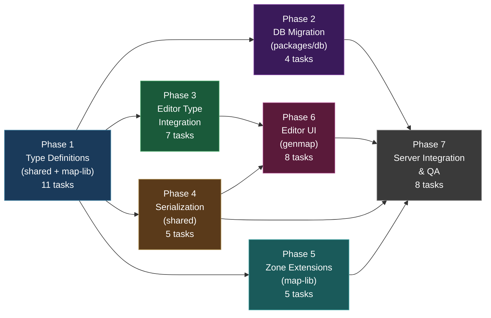

# Work Plan: Interactive Map System Implementation

Created Date: 2026-03-15
Type: feature
Estimated Duration: 5 days
Estimated Impact: ~20 files (4 new, 16 modified)
Related Issue/PR: N/A

## Related Documents

- Design Doc: [docs/design/design-024-interactive-map-system.md](../design/design-024-interactive-map-system.md)
- ADR: [docs/adr/ADR-0017-interactive-map-architecture.md](../adr/ADR-0017-interactive-map-architecture.md)
- Reference: [docs/plans/fence-system-work-plan.md](fence-system-work-plan.md) (FenceLayer implementation pattern)

## Objective

Implement the Interactive Map System -- a 3-level architecture that adds tile-level interactions (warps, shops, triggers), material-level tile properties (diggable, fishable), zone-level behavior configuration (spawn rules, NPC schedules), and server-authoritative farm state types to Nookstead maps. This unblocks the farming gameplay loop, warp/transition system, and NPC schedule locations.

## Background

Maps currently store terrain, elevation, walkability, and visual layers (tile, object, fence), but have no system for defining what happens when a player interacts with a tile. The existing `CellAction` type on `Cell` is exported but entirely unused. Material properties lack farming-specific flags (diggable, fishable). Zones have a `properties: Record<string, unknown>` bag with no structured schemas. No data structure exists for server-side farm state.

The implementation follows the Design Doc's vertical-slice approach: type definitions first (all downstream work depends on them), then DB migration, editor type integration, serialization, zone extensions, editor UI, and server integration. Phases 1-5 form the foundation; Phases 6-7 add editor tools and server integration.

## Risks and Countermeasures

### Technical Risks

- **Risk**: InteractionLayer serialization/deserialization roundtrip data loss
  - **Impact**: High -- triggers silently dropped during save/load cycle
  - **Countermeasure**: Comprehensive roundtrip unit tests for all 5 trigger types, empty layer, multi-trigger tile. Fail-fast on invalid trigger type during deserialization.

- **Risk**: Materials DB migration fails on production data
  - **Impact**: High -- schema change blocks material queries
  - **Countermeasure**: Test migration on staging first. All new columns have `DEFAULT` values (false/null), so existing rows are unaffected. Migration has rollback path.

- **Risk**: Colyseus schema exceeds 64-field limit for FarmTileState
  - **Impact**: Medium -- farm state sync fails
  - **Countermeasure**: FarmTileState has only 5 top-level fields. Use nested schemas for CropState/DebrisState. Verified against Colyseus schema limits in Design Doc.

- **Risk**: EditorLayerUnion extension breaks existing layer-handling code
  - **Impact**: Medium -- editor crashes on maps with interaction layers
  - **Countermeasure**: Audit all `switch`/`if` chains on layer.type in use-map-editor.ts and canvas-renderer.ts. InteractionLayer follows FenceLayer pattern. RESIZE_MAP and LOAD_MAP must handle the new type.

- **Risk**: Backward compatibility regression -- existing maps fail to load
  - **Impact**: High -- data loss for existing work
  - **Countermeasure**: All new fields are optional with defaults. `interactionLayers` field on MapDataPayload is optional (same as `fenceLayers`). LOAD_MAP handler treats missing interaction layers as empty. Unit test verifies old maps load.

### Schedule Risks

- **Risk**: Phase 6 (Editor UI) complexity -- sidebar tab, trigger config panel, canvas overlays
  - **Impact**: Phase 6 may take longer than estimated
  - **Countermeasure**: Implement interaction-place tool with default trigger config first. Config panel is a progressive enhancement. Phase 6 can be split into sub-phases if needed.

## Phase Structure Diagram

## Task Dependency Diagram

```mermaid
graph TD
    subgraph "Phase 1: Type Definitions"
        T1_1["1.1 Create CellTrigger<br/>discriminated union<br/>(interaction-layer.ts)"]
        T1_2["1.2 Create serialization<br/>types<br/>(interaction-layer.ts)"]
        T1_3["1.3 Create FarmTileState<br/>types<br/>(farm-state.ts)"]
        T1_4["1.4 Deprecate Cell.action<br/>(map.ts)"]
        T1_5["1.5 Add interactionLayers<br/>to MapDataPayload<br/>(map.ts)"]
        T1_6["1.6 Re-export new types<br/>(shared/index.ts)"]
        T1_7["1.7 Add InteractionLayer<br/>to EditorLayerUnion<br/>(editor-types.ts)"]
        T1_8["1.8 Extend MaterialInfo<br/>(material-types.ts)"]
        T1_9["1.9 Add interaction tools<br/>and sidebar tab<br/>(editor-types.ts)"]
        T1_10["1.10 Typecheck shared<br/>and map-lib"]
        T1_11["1.11 Unit tests for<br/>type guards"]
    end

    subgraph "Phase 2: DB Migration"
        T2_1["2.1 Add 5 columns to<br/>materials schema<br/>(materials.ts)"]
        T2_2["2.2 Generate Drizzle<br/>migration SQL"]
        T2_3["2.3 Verify migration<br/>up/down"]
        T2_4["2.4 Typecheck<br/>packages/db"]
    end

    subgraph "Phase 3: Editor Type Integration"
        T3_1["3.1 Add MapEditorAction<br/>variants (4 new actions)"]
        T3_2["3.2 Extend MapEditorState<br/>(activeTriggerType)"]
        T3_3["3.3 Extend LoadMapPayload<br/>(interactionLayers)"]
        T3_4["3.4 Implement reducer<br/>ADD_INTERACTION_LAYER"]
        T3_5["3.5 Implement reducer<br/>PLACE/REMOVE/UPDATE_TRIGGER"]
        T3_6["3.6 Implement LOAD_MAP<br/>normalization"]
        T3_7["3.7 Unit tests for<br/>new reducer actions"]
    end

    subgraph "Phase 4: Serialization"
        T4_1["4.1 serializeInteractionLayer()"]
        T4_2["4.2 deserializeInteractionLayer()"]
        T4_3["4.3 isInteractionLayer()<br/>type guard"]
        T4_4["4.4 Roundtrip unit tests<br/>(all 5 trigger types)"]
        T4_5["4.5 Re-export serialization<br/>functions"]
    end

    subgraph "Phase 5: Zone Extensions"
        T5_1["5.1 Add 6 zone types<br/>to ZoneType union"]
        T5_2["5.2 Add ZONE_COLORS<br/>for new types"]
        T5_3["5.3 Add ZONE_OVERLAP<br/>rules (16 new pairs)"]
        T5_4["5.4 Define zone property<br/>schema interfaces"]
        T5_5["5.5 Unit tests for<br/>zone types"]
    end

    subgraph "Phase 6: Editor UI"
        T6_1["6.1 Interaction sidebar<br/>tab component"]
        T6_2["6.2 interaction-place<br/>tool handler"]
        T6_3["6.3 interaction-eraser<br/>tool handler"]
        T6_4["6.4 Trigger config<br/>panel component"]
        T6_5["6.5 Canvas overlay for<br/>trigger icons"]
        T6_6["6.6 RESIZE_MAP handler<br/>for InteractionLayer"]
        T6_7["6.7 Save/load integration<br/>for interaction layers"]
        T6_8["6.8 Integration tests<br/>for editor workflow"]
    end

    subgraph "Phase 7: Server Integration & QA"
        T7_1["7.1 Include interactionLayers<br/>in MAP_DATA payload"]
        T7_2["7.2 FarmTileState Colyseus<br/>schema definition"]
        T7_3["7.3 Tool action message<br/>handlers (stub)"]
        T7_4["7.4 Backward compat test<br/>(maps without interactions)"]
        T7_5["7.5 Typecheck all projects"]
        T7_6["7.6 Lint all projects"]
        T7_7["7.7 Full CI verification"]
        T7_8["7.8 AC verification<br/>checklist"]
    end

    %% Phase 1 internal deps
    T1_1 --> T1_2
    T1_1 --> T1_5
    T1_2 --> T1_5
    T1_3 --> T1_6
    T1_4 --> T1_6
    T1_5 --> T1_6
    T1_1 --> T1_7
    T1_7 --> T1_9
    T1_6 --> T1_10
    T1_7 --> T1_10
    T1_8 --> T1_10
    T1_9 --> T1_10
    T1_10 --> T1_11

    %% Phase 1 -> Phase 2
    T1_8 --> T2_1

    %% Phase 1 -> Phase 3
    T1_7 --> T3_1
    T1_9 --> T3_1
    T1_7 --> T3_2
    T1_7 --> T3_3
    T3_1 --> T3_4
    T3_1 --> T3_5
    T3_3 --> T3_6
    T3_5 --> T3_7

    %% Phase 1 -> Phase 4
    T1_2 --> T4_1
    T1_2 --> T4_2
    T1_2 --> T4_3
    T4_1 --> T4_4
    T4_2 --> T4_4
    T4_3 --> T4_5

    %% Phase 1 -> Phase 5
    T1_10 --> T5_1

    %% Phase 3 + 4 -> Phase 6
    T3_5 --> T6_2
    T3_5 --> T6_3
    T4_1 --> T6_7
    T4_2 --> T6_7
    T3_4 --> T6_6

    %% All -> Phase 7
    T6_7 --> T7_1
    T2_3 --> T7_1
    T1_3 --> T7_2
    T7_1 --> T7_4
    T7_4 --> T7_5
```

## Implementation Phases

### Phase 1: Type Definitions (Estimated commits: 3)

**Purpose**: Define all new types in `@nookstead/shared` and `packages/map-lib`. This phase has zero dependencies and unblocks all subsequent phases. Corresponds to Design Doc Implementation Step 1.

**AC Coverage**: FR1 (partial), FR2 (partial), FR5 (full), FR7 (partial)

#### Tasks

- [ ] **1.1** Create `CellTrigger` discriminated union in `packages/shared/src/types/interaction-layer.ts`
  - Define `Direction`, `TriggerActivation`, `WarpTransition`, `WarpCondition` types
  - Define 5 trigger interfaces: `WarpTrigger`, `InteractTrigger`, `EventTrigger`, `SoundTrigger`, `DamageTrigger`
  - Define `InteractionType` union (shop, crafting_station, mailbox, etc.)
  - Export `CellTrigger` union type
  - All types must be exported (used by editor, server, and game client)

- [ ] **1.2** Create serialization types in `packages/shared/src/types/interaction-layer.ts`
  - Define `SerializedTriggerEntry` (x, y, triggers)
  - Define `SerializedInteractionLayer` (type: 'interaction', name, triggers)
  - Follow `SerializedFenceLayer` pattern from `fence-layer.ts`

- [ ] **1.3** Create `FarmTileState` types in `packages/shared/src/types/farm-state.ts`
  - Define `CropStage`, `FertilizerType`, `DebrisType` type aliases
  - Define `CropState` interface (cropId, growthPoints, stage, wateredToday, totalWateredDays)
  - Define `DebrisState` interface (type, spawnedAt)
  - Define `FarmTileState` interface (soilState, watered, fertilizer?, crop?, debris?)
  - Include JSDoc with growth-point arithmetic documentation

- [ ] **1.4** Deprecate `Cell.action` in `packages/shared/src/types/map.ts`
  - Add `@deprecated Use InteractionLayer triggers instead. See ADR-0017.` JSDoc to `Cell.action` field
  - Add `@deprecated` JSDoc to `CellAction` interface
  - No runtime behavior change

- [ ] **1.5** Add `interactionLayers` field to `MapDataPayload` in `packages/shared/src/types/map.ts`
  - Add `interactionLayers?: SerializedInteractionLayer[]` optional field
  - Import `SerializedInteractionLayer` from `./interaction-layer`
  - Follow `fenceLayers?: SerializedFenceLayer[]` pattern
  - Add `isInteractionLayer()` type guard function

- [ ] **1.6** Re-export new types from `packages/shared/src/index.ts`
  - Re-export from `./types/interaction-layer`: `CellTrigger`, `WarpTrigger`, `InteractTrigger`, `EventTrigger`, `SoundTrigger`, `DamageTrigger`, `TriggerActivation`, `Direction`, `WarpTransition`, `WarpCondition`, `InteractionType`, `SerializedTriggerEntry`, `SerializedInteractionLayer`
  - Re-export from `./types/farm-state`: `FarmTileState`, `CropState`, `CropStage`, `FertilizerType`, `DebrisType`, `DebrisState`
  - Re-export `isInteractionLayer` from `./types/map`

- [ ] **1.7** Add `InteractionLayer` to `EditorLayerUnion` in `packages/map-lib/src/types/editor-types.ts`
  - Define `InteractionLayer` interface extending `BaseLayer` with `type: 'interaction'` and `triggers: Map<string, CellTrigger[]>`
  - Add `InteractionLayer` to `EditorLayerUnion` discriminated union
  - Import `CellTrigger` from `@nookstead/shared`

- [ ] **1.8** Extend `MaterialInfo` in `packages/map-lib/src/types/material-types.ts`
  - Add `diggable: boolean`, `fishable: boolean`, `waterSource: boolean`, `buildable: boolean`, `surfaceType: string | null` fields
  - All new fields required (not optional) -- populated from DB with defaults

- [ ] **1.9** Add interaction tools and sidebar tab to `packages/map-lib/src/types/editor-types.ts`
  - Add `'interaction-place' | 'interaction-eraser'` to `EditorTool` union
  - Add `'interactions'` to `SidebarTab` union
  - Add `'interactions'` to `SIDEBAR_TABS` constant array

- [ ] **1.10** Quality check: Typecheck shared and map-lib
  - Run `pnpm nx typecheck shared` -- zero errors
  - Run `pnpm nx typecheck map-lib` -- zero errors
  - Verify no circular dependencies introduced

- [ ] **1.11** Unit tests for type guards and type narrowing
  - Test `isInteractionLayer()` with all layer types
  - Test CellTrigger narrowing by `type` field for all 5 trigger subtypes

#### Phase Completion Criteria

- [ ] All types defined per Design Doc contract definitions
- [ ] `pnpm nx typecheck shared` passes with zero errors
- [ ] `pnpm nx typecheck map-lib` passes with zero errors
- [ ] Type guard tests pass
- [ ] No existing tests broken

#### Operational Verification Procedures

1. Run `pnpm nx run-many -t typecheck --projects=shared,map-lib` -- verify zero errors
2. Run `pnpm nx test map-lib` -- verify existing tests still pass
3. Verify `InteractionLayer` is included in `EditorLayerUnion` (type narrowing works)
4. Verify `MaterialInfo` has all 5 new fields (compile-time check)

---

### Phase 2: DB Migration (Estimated commits: 2)

**Purpose**: Add 5 new columns to the `materials` table for tile properties. Corresponds to Design Doc Implementation Step 2.

**AC Coverage**: FR3 (full)

**Dependencies**: Phase 1 (MaterialInfo type must exist)

#### Tasks

- [ ] **2.1** Add 5 columns to materials Drizzle schema in `packages/db/src/schema/materials.ts`
  - Add `diggable: boolean('diggable').notNull().default(false)`
  - Add `fishable: boolean('fishable').notNull().default(false)`
  - Add `waterSource: boolean('water_source').notNull().default(false)`
  - Add `buildable: boolean('buildable').notNull().default(false)`
  - Add `surfaceType: varchar('surface_type', { length: 50 })`
  - All boolean columns `NOT NULL DEFAULT false`; surfaceType nullable

- [ ] **2.2** Generate Drizzle migration SQL
  - Run `pnpm nx run db:generate` (or equivalent Drizzle migration command)
  - Verify generated SQL adds columns with correct defaults
  - Migration file should be `packages/db/src/migrations/0016_*.sql`

- [ ] **2.3** Verify migration runs without error
  - Test migration up (columns added with defaults)
  - Verify existing material rows have `false`/`null` defaults
  - Verify migration rollback removes new columns cleanly

- [ ] **2.4** Quality check: Typecheck packages/db
  - Run `pnpm nx typecheck db` -- zero errors
  - Verify `Material` and `NewMaterial` inferred types include new fields

#### Phase Completion Criteria

- [ ] Migration SQL generated and verified
- [ ] Existing materials data unaffected (default values applied)
- [ ] `pnpm nx typecheck db` passes
- [ ] `Material` type includes `diggable`, `fishable`, `waterSource`, `buildable`, `surfaceType`

#### Operational Verification Procedures

1. Run `pnpm nx typecheck db` -- verify zero errors
2. Inspect generated SQL: confirm `ALTER TABLE materials ADD COLUMN` with defaults
3. Verify `Material` inferred type includes all 5 new fields

---

### Phase 3: Editor Type Integration (Estimated commits: 3)

**Purpose**: Extend the editor reducer to handle interaction layer operations (add layer, place/remove/update triggers, load from DB). Corresponds to Design Doc Implementation Step 3.

**AC Coverage**: FR1 (full), FR2 (full), FR7 (partial)

**Dependencies**: Phase 1 (InteractionLayer, MapEditorAction types)

#### Tasks

- [ ] **3.1** Add 4 new action variants to `MapEditorAction` in `packages/map-lib/src/types/editor-types.ts`
  - `ADD_INTERACTION_LAYER` (name: string)
  - `PLACE_TRIGGER` (layerIndex, x, y, trigger: CellTrigger)
  - `REMOVE_TRIGGER` (layerIndex, x, y, triggerIndex?: number)
  - `UPDATE_TRIGGER` (layerIndex, x, y, triggerIndex, trigger: CellTrigger)

- [ ] **3.2** Extend `MapEditorState` in `packages/map-lib/src/types/editor-types.ts`
  - Add `activeTriggerType: CellTrigger['type']` field (default: 'warp')
  - Add `SET_TRIGGER_TYPE` action to `MapEditorAction`

- [ ] **3.3** Extend `LoadMapPayload` in `packages/map-lib/src/types/editor-types.ts`
  - Add `interactionLayers?: unknown[]` field (matching fenceLayers pattern)

- [ ] **3.4** Implement `ADD_INTERACTION_LAYER` reducer case in `apps/genmap/src/hooks/use-map-editor.ts`
  - Create a new `InteractionLayer` with empty `Map<string, CellTrigger[]>()`
  - Append to `state.layers` array
  - Set `isDirty: true`
  - Set active layer to the new layer

- [ ] **3.5** Implement `PLACE_TRIGGER`, `REMOVE_TRIGGER`, `UPDATE_TRIGGER` reducer cases
  - **PLACE_TRIGGER**: If tile has existing trigger of same type, replace it (FR2 AC). Otherwise append.
  - **REMOVE_TRIGGER**: If `triggerIndex` provided, remove specific trigger. If omitted, remove all triggers at position. If position becomes empty, delete the map key.
  - **UPDATE_TRIGGER**: Replace trigger at specific index.
  - All cases set `isDirty: true`
  - All cases validate that `layerIndex` points to an InteractionLayer

- [ ] **3.6** Implement `LOAD_MAP` normalization for interaction layers
  - In the `LOAD_MAP` case of the reducer, extract interaction layer data from `map.interactionLayers` (if present)
  - Deserialize each `SerializedInteractionLayer` to `InteractionLayer` (convert sparse array to Map)
  - Append deserialized InteractionLayers to the `editorLayers` array
  - If no interaction layers in payload, skip (backward compatible)

- [ ] **3.7** Unit tests for new reducer actions
  - Test `ADD_INTERACTION_LAYER` creates empty interaction layer
  - Test `PLACE_TRIGGER` on empty tile adds trigger
  - Test `PLACE_TRIGGER` on tile with same type replaces (FR2)
  - Test `PLACE_TRIGGER` on tile with different type appends
  - Test `REMOVE_TRIGGER` with triggerIndex removes specific trigger
  - Test `REMOVE_TRIGGER` without triggerIndex removes all
  - Test `UPDATE_TRIGGER` replaces trigger at index
  - Test `LOAD_MAP` with interaction layers restores triggers
  - Test `LOAD_MAP` without interaction layers (backward compat)

#### Phase Completion Criteria

- [ ] All 5 new reducer cases implemented and tested
- [ ] LOAD_MAP backward compatibility verified (maps without interactions load)
- [ ] Unit tests pass for all new action types
- [ ] `pnpm nx typecheck map-lib` passes
- [ ] `pnpm nx typecheck genmap` passes (genmap imports map-lib types)

#### Operational Verification Procedures

1. Run `pnpm nx test map-lib` -- all tests pass including new reducer tests
2. Run `pnpm nx typecheck genmap` -- verify no type errors in use-map-editor.ts
3. Verify LOAD_MAP handler: load a fixture map without interaction layers -- no errors
4. Verify LOAD_MAP handler: load a fixture map with interaction layers -- triggers restored

---

### Phase 4: Serialization (Estimated commits: 2)

**Purpose**: Implement serialize/deserialize functions for InteractionLayer data, ensuring lossless roundtrip. Corresponds to Design Doc Implementation Step 4.

**AC Coverage**: FR6 (full)

**Dependencies**: Phase 1 (CellTrigger, SerializedInteractionLayer types)

#### Tasks

- [ ] **4.1** Implement `serializeInteractionLayer()` function
  - Location: `packages/shared/src/types/interaction-layer.ts` (or a dedicated `interaction-layer-utils.ts`)
  - Input: `InteractionLayer` (or equivalent with `triggers: Map<string, CellTrigger[]>`)
  - Output: `SerializedInteractionLayer`
  - Convert Map entries to sparse `SerializedTriggerEntry[]` array
  - Skip empty trigger arrays (sparse serialization)
  - Parse `"x,y"` key to numeric x, y fields

- [ ] **4.2** Implement `deserializeInteractionLayer()` function
  - Input: `SerializedInteractionLayer`
  - Output: Map<string, CellTrigger[]> (the triggers map)
  - Convert sparse array entries back to Map with `"x,y"` string keys
  - Validate trigger type discriminant (warn and skip invalid entries)

- [ ] **4.3** Implement `isInteractionLayer()` type guard for serialized data
  - Input: `unknown` (from JSONB layers array)
  - Returns `layer is SerializedInteractionLayer` when `type === 'interaction'`
  - Follow `isTileLayer()` / `isObjectLayer()` pattern from map.ts

- [ ] **4.4** Roundtrip unit tests for serialization
  - Test roundtrip for each of 5 trigger types individually
  - Test roundtrip for multi-trigger tile (warp + sound on same tile)
  - Test roundtrip for empty interaction layer (zero triggers)
  - Test roundtrip for layer with 100 triggers (scale test)
  - Verify: `serialize(deserialize(serialize(layer))) === serialize(layer)`
  - Test ordering preservation within a position
  - Performance benchmark: serialize/deserialize 64x64 map with 100 triggers (<5ms target)

- [ ] **4.5** Re-export serialization functions from `packages/shared/src/index.ts`
  - Export `serializeInteractionLayer`, `deserializeInteractionLayer`

#### Phase Completion Criteria

- [ ] Roundtrip is lossless for all trigger types (verified by tests)
- [ ] Sparse serialization: only non-empty positions appear in output
- [ ] Performance target met: <5ms for 100-trigger layer
- [ ] All tests pass
- [ ] Functions exported from `@nookstead/shared`

#### Operational Verification Procedures

1. Run roundtrip tests: `pnpm nx test shared` -- all serialization tests pass
2. Verify sparse output: serializing a layer with triggers at 3 positions produces exactly 3 `SerializedTriggerEntry` items
3. Verify performance: 100-trigger benchmark completes in <5ms

---

### Phase 5: Zone Type Extensions (Estimated commits: 1)

**Purpose**: Add 6 new zone types with colors, overlap rules, and property schema interfaces. Corresponds to Design Doc zone extension requirements.

**AC Coverage**: FR4 (full)

**Dependencies**: Phase 1 (types must compile)

#### Tasks

- [ ] **5.1** Add 6 new zone types to `ZoneType` union in `packages/map-lib/src/types/map-types.ts`
  - Add: `'warp_zone'`, `'no_dig'`, `'no_build'`, `'no_fish'`, `'no_spawn'`, `'farmland'`
  - Union grows from 11 to 17 members

- [ ] **5.2** Add `ZONE_COLORS` entries for new zone types
  - `warp_zone: '#AB47BC'` (purple)
  - `no_dig: '#D32F2F'` (red)
  - `no_build: '#C62828'` (dark red)
  - `no_fish: '#E53935'` (red)
  - `no_spawn: '#B71C1C'` (deep red)
  - `farmland: '#66BB6A'` (green)

- [ ] **5.3** Add `ZONE_OVERLAP_ALLOWED` pairs for new zone types
  - 16 new overlap pairs per Design Doc:
    - Farmland: `['farmland', 'crop_field']`, `['farmland', 'lighting']`, `['farmland', 'decoration']`
    - Restriction + gameplay: `['no_dig', 'farmland']`, `['no_dig', 'crop_field']`, `['no_dig', 'building_footprint']`, `['no_build', 'farmland']`, `['no_build', 'crop_field']`, `['no_fish', 'water_feature']`, `['no_spawn', 'farmland']`, `['no_spawn', 'crop_field']`, `['no_spawn', 'spawn_point']`
    - Warp: `['warp_zone', 'transition']`, `['warp_zone', 'lighting']`
    - Restriction stacking: `['no_dig', 'no_build']`, `['no_dig', 'no_spawn']`, `['no_build', 'no_spawn']`

- [ ] **5.4** Define zone property schema interfaces in `packages/map-lib/src/types/map-types.ts`
  - `WarpZoneProperties` (targetMap, targetX, targetY, targetDirection?, transition?, conditions?, promptText?)
  - `SpawnRuleConfig` (allowedTypes, probability, maxDensity, neglectDays?)
  - `NpcScheduleConfig` (locationName, npcIds?, capacity?)
  - `OperatingHoursConfig` (openHour, closeHour, closedMessage?)
  - Type guard: `isWarpZone(zone: ZoneData)` helper function
  - Export all from `packages/map-lib/src/index.ts`

- [ ] **5.5** Unit tests for zone types
  - Verify `ZONE_COLORS` has entry for every `ZoneType` value
  - Verify new zone types are valid `ZoneType` values (compile-time + runtime)
  - Verify `isWarpZone()` type guard narrows correctly
  - Verify overlap rules contain expected pairs

#### Phase Completion Criteria

- [ ] `ZoneType` has 17 members
- [ ] `ZONE_COLORS` has 17 entries (one per type)
- [ ] `ZONE_OVERLAP_ALLOWED` includes all 16 new pairs
- [ ] Property schema interfaces defined and exported
- [ ] All tests pass

#### Operational Verification Procedures

1. Run `pnpm nx typecheck map-lib` -- zero errors
2. Run `pnpm nx test map-lib` -- zone tests pass
3. Verify: assigning a string not in ZoneType to a ZoneType variable produces a type error

---

### Phase 6: Editor UI Integration (Estimated commits: 4)

**Purpose**: Implement the editor tools, sidebar tab, canvas overlay, and save/load integration for interaction layers. Corresponds to Design Doc Implementation Step 5 (Editor UI).

**AC Coverage**: FR1 (complete), FR2 (complete), FR7 (partial)

**Dependencies**: Phase 3 (reducer actions), Phase 4 (serialization)

#### Tasks

- [ ] **6.1** Create interactions sidebar tab component in `apps/genmap/src/components/map-editor/`
  - List trigger types with icons (warp, interact, event, sound, damage)
  - Allow selecting active trigger type (dispatches `SET_TRIGGER_TYPE`)
  - Show active interaction layer info (trigger count)
  - "Add Interaction Layer" button (dispatches `ADD_INTERACTION_LAYER`)

- [ ] **6.2** Implement `interaction-place` tool handler
  - Create tool file `apps/genmap/src/components/map-editor/tools/interaction-place-tool.ts` (or integrate into existing tool pattern)
  - On mouse click: dispatch `PLACE_TRIGGER` with active trigger type and default config
  - If no InteractionLayer exists, auto-create one first (dispatch `ADD_INTERACTION_LAYER`)
  - Follow brush-tool.ts / fence-tool.ts tool handler pattern

- [ ] **6.3** Implement `interaction-eraser` tool handler
  - On mouse click: dispatch `REMOVE_TRIGGER` (no triggerIndex = remove all at position)
  - Follow eraser-tool.ts pattern

- [ ] **6.4** Create trigger configuration panel component
  - Displayed when selecting a tile with triggers in the interactions tab
  - Shows all triggers at selected position
  - Allows editing trigger properties (e.g., warp target map, target coordinates)
  - "Delete" button per trigger (dispatches `REMOVE_TRIGGER` with triggerIndex)
  - "Update" button (dispatches `UPDATE_TRIGGER`)

- [ ] **6.5** Canvas overlay rendering for trigger type icons
  - In `canvas-renderer.ts` (or interaction-specific overlay), render trigger type indicators on tiles with triggers
  - Only visible when InteractionLayer is visible
  - Use distinct colors per trigger type (warp=purple, interact=blue, event=yellow, sound=green, damage=red)
  - Semi-transparent overlay at 0.5 opacity

- [ ] **6.6** Implement `RESIZE_MAP` handler for InteractionLayer
  - In the `RESIZE_MAP` case of the reducer, handle InteractionLayer:
  - Filter out trigger entries outside new bounds
  - Preserve trigger entries within new bounds
  - Follow the pattern used for FenceLayer resize (lines 480-492 of use-map-editor.ts)

- [ ] **6.7** Save/load integration for interaction layers
  - In the save function: serialize InteractionLayers from `state.layers` using `serializeInteractionLayer()`
  - Include serialized interaction layers in the save payload
  - In the load function (already handled in Phase 3 via LOAD_MAP): verify round-trip
  - Interaction layers should be stored within the JSONB `layers` array alongside tile/object/fence layers

- [ ] **6.8** Integration tests for editor workflow
  - Test: place trigger -> save -> reload -> trigger exists at same position
  - Test: place trigger -> resize map (shrink) -> trigger outside bounds removed
  - Test: place trigger -> undo -> trigger removed (when undo/redo implemented for triggers)
  - Test: open map without interactions -> add interaction layer -> place trigger -> save

#### Phase Completion Criteria

- [ ] User can select interaction-place tool and click tiles to place triggers
- [ ] User can select interaction-eraser tool and click tiles to erase triggers
- [ ] Interactions sidebar tab shows trigger types and active layer info
- [ ] Trigger icons visible on canvas when interaction layer is visible
- [ ] Save/load roundtrip preserves all trigger data
- [ ] RESIZE_MAP handles InteractionLayer correctly

#### Operational Verification Procedures

1. Start genmap editor (`pnpm nx dev genmap`)
2. Verify "Interactions" tab appears in sidebar
3. Click "Add Interaction Layer" -- layer appears in layers panel
4. Select interaction-place tool, click a tile -- trigger icon appears on canvas
5. Save map, reload -- trigger persists at same position
6. Select interaction-eraser tool, click tile with trigger -- trigger removed
7. Resize map to smaller dimensions -- triggers outside bounds removed

---

### Phase 7: Server Integration & Quality Assurance (Estimated commits: 3)

**Purpose**: Include interaction layers in the MAP_DATA payload sent by ChunkRoom, define FarmTileState Colyseus schema (stub), and perform final quality assurance. Corresponds to Design Doc Implementation Steps 6-7 and QA.

**AC Coverage**: FR5 (Colyseus schema), FR7 (complete), all ACs verified

**Dependencies**: Phase 2 (DB migration), Phase 4 (serialization), Phase 5 (zones), Phase 6 (editor UI)

#### Tasks

- [ ] **7.1** Include `interactionLayers` in MAP_DATA payload in `apps/server/src/rooms/ChunkRoom.ts`
  - After loading map data from DB (line ~358), extract interaction layers from the layers JSONB
  - Use `isInteractionLayer()` type guard to filter interaction layers from mixed layers array
  - Set `mapPayload.interactionLayers` with filtered `SerializedInteractionLayer[]`
  - If no interaction layers found, omit the field (backward compatible)

- [ ] **7.2** Define FarmTileState Colyseus schema in `apps/server/src/rooms/`
  - Create `FarmTileSchema.ts` with Colyseus `@type()` decorated classes
  - `CropSchema` with fields: cropId (string), growthPoints (number), stage (string), wateredToday (boolean), totalWateredDays (number)
  - `FarmTileSchema` with fields: soilState (string), watered (boolean), fertilizer (string), crop (CropSchema), debris type/spawnedAt
  - Stub only -- no farm logic implementation (deferred to farming feature)

- [ ] **7.3** Define tool action message types (stub)
  - Add `TOOL_ACTION` to client message types in `packages/shared/src/types/messages.ts`
  - Define `ToolActionPayload` (action: string, x: number, y: number, data?: Record<string, unknown>)
  - Server handler stub: log received action, no state mutation (implementation deferred)

- [ ] **7.4** Backward compatibility integration test
  - Load a map created before this feature (no interaction layers, no new material columns)
  - Verify MAP_DATA payload is valid and client can consume it
  - Verify no errors in ChunkRoom map loading path
  - Verify new material columns have default values for existing rows

- [ ] **7.5** Quality check: Typecheck all affected projects
  - `pnpm nx run-many -t typecheck --projects=shared,map-lib,db,server,genmap,game`
  - Zero errors across all projects

- [ ] **7.6** Quality check: Lint all affected projects
  - `pnpm nx run-many -t lint --projects=shared,map-lib,db,server,genmap,game`
  - Zero errors

- [ ] **7.7** Full CI verification
  - `pnpm nx run-many -t lint test build typecheck`
  - All targets pass

- [ ] **7.8** AC verification checklist
  - [ ] FR1: interaction-place tool places triggers, interaction-eraser removes them
  - [ ] FR1: Overlay renders trigger icons on visible InteractionLayer
  - [ ] FR1: Auto-creates InteractionLayer if none exists
  - [ ] FR2: Placing same trigger type replaces; different type appends
  - [ ] FR3: materials table has diggable, fishable, water_source, buildable, surface_type columns
  - [ ] FR3: MaterialInfo exposes all tile property fields
  - [ ] FR4: ZoneType includes warp_zone, no_dig, no_build, no_fish, no_spawn, farmland
  - [ ] FR4: Zone property schemas defined (WarpZoneProperties, SpawnRuleConfig, etc.)
  - [ ] FR5: FarmTileState defines soilState, watered, fertilizer, crop, debris
  - [ ] FR5: CropState uses growth points, CropStage has all 6 stages
  - [ ] FR6: Serialization roundtrip is lossless for all trigger types
  - [ ] FR6: Sparse serialization (only non-empty positions)
  - [ ] FR7: Maps without interactionLayers load without error
  - [ ] FR7: Materials without new columns use defaults
  - [ ] FR7: Cell.action has @deprecated annotation

#### Phase Completion Criteria

- [ ] MAP_DATA payload includes interaction layers when present
- [ ] FarmTileState Colyseus schema defined (stub)
- [ ] All acceptance criteria verified
- [ ] All CI checks pass (lint, test, typecheck, build)
- [ ] No regressions in existing functionality

#### Operational Verification Procedures

1. Run full CI: `pnpm nx run-many -t lint test build typecheck` -- all pass
2. Start server and connect a client -- verify MAP_DATA payload structure
3. Load existing map via editor -- verify no errors (backward compat)
4. Create map with interaction layer, save, start server with that map -- verify interactionLayers field in MAP_DATA
5. Verify AC checklist (task 7.8) -- all items checked

---

## Testing Strategy

| Phase | Test Type | Test Count (Est.) | Cumulative |
|-------|-----------|-------------------|------------|
| Phase 1 | Unit (type guards) | 7 | 7 |
| Phase 2 | Migration verification | 3 | 10 |
| Phase 3 | Unit (reducer actions) | 9 | 19 |
| Phase 4 | Unit (serialization roundtrip) | 8 | 27 |
| Phase 5 | Unit (zone types) | 4 | 31 |
| Phase 6 | Integration (editor workflow) | 4 | 35 |
| Phase 7 | Integration (server, backward compat) | 3 | 38 |

**Strategy**: Implementation-First (Strategy B) -- no pre-existing test skeleton files. Tests are written alongside implementation in each phase.

## Files Impact Summary

### New Files (4)

| File | Phase | Purpose |
|------|-------|---------|
| `packages/shared/src/types/interaction-layer.ts` | 1 | CellTrigger union, SerializedInteractionLayer, serialize/deserialize |
| `packages/shared/src/types/farm-state.ts` | 1 | FarmTileState, CropState, CropStage types |
| `apps/server/src/rooms/FarmTileSchema.ts` | 7 | Colyseus schema for farm state (stub) |
| `apps/genmap/src/components/map-editor/tools/interaction-place-tool.ts` | 6 | Editor tool handler for placing triggers |

### Modified Files (16)

| File | Phase | Change |
|------|-------|--------|
| `packages/shared/src/types/map.ts` | 1 | Deprecate CellAction, add interactionLayers to MapDataPayload |
| `packages/shared/src/index.ts` | 1, 4 | Re-export new types and functions |
| `packages/map-lib/src/types/editor-types.ts` | 1, 3 | InteractionLayer, EditorTool, SidebarTab, MapEditorAction |
| `packages/map-lib/src/types/map-types.ts` | 5 | ZoneType, ZONE_COLORS, ZONE_OVERLAP_ALLOWED, property schemas |
| `packages/map-lib/src/types/material-types.ts` | 1 | MaterialInfo extension (5 new fields) |
| `packages/map-lib/src/index.ts` | 5 | Re-export zone property types |
| `packages/db/src/schema/materials.ts` | 2 | 5 new columns |
| `packages/db/src/migrations/0016_*.sql` | 2 | Migration SQL |
| `apps/genmap/src/hooks/use-map-editor.ts` | 3, 6 | Reducer cases, LOAD_MAP, RESIZE_MAP, save/load |
| `apps/server/src/rooms/ChunkRoom.ts` | 7 | MAP_DATA payload with interactionLayers |
| `apps/server/src/rooms/ChunkRoomState.ts` | 7 | FarmTileState schema import (stub) |
| `packages/shared/src/types/messages.ts` | 7 | TOOL_ACTION message type |
| `apps/genmap/src/components/map-editor/canvas-renderer.ts` | 6 | Trigger icon overlay |
| `apps/genmap/src/components/map-editor/sidebar/*` | 6 | Interactions tab |
| `apps/genmap/src/components/map-editor/tools/*` | 6 | interaction-eraser tool |
| Test files (co-located *.spec.ts) | 1-7 | New test files alongside source |

## Completion Criteria

- [ ] All 7 phases completed
- [ ] Each phase's operational verification procedures executed
- [ ] Design Doc acceptance criteria (FR1-FR7) satisfied
- [ ] Quality checks completed (typecheck, lint, test -- zero errors)
- [ ] All tests pass (est. 38 new tests)
- [ ] Backward compatibility verified (existing maps load)
- [ ] User review approval obtained

## Progress Tracking

### Phase 1: Type Definitions
- Start:
- Complete:
- Notes:

### Phase 2: DB Migration
- Start:
- Complete:
- Notes:

### Phase 3: Editor Type Integration
- Start:
- Complete:
- Notes:

### Phase 4: Serialization
- Start:
- Complete:
- Notes:

### Phase 5: Zone Extensions
- Start:
- Complete:
- Notes:

### Phase 6: Editor UI
- Start:
- Complete:
- Notes:

### Phase 7: Server Integration & QA
- Start:
- Complete:
- Notes:

## Notes

- **Parallel execution**: Phases 2, 3, 4, 5 can all run in parallel after Phase 1 completes. Phase 6 requires Phases 3+4. Phase 7 requires all preceding phases.
- **Scope boundary**: FarmTileState Colyseus schema is defined but not implemented (no farm logic, no growth-point arithmetic). Farm gameplay logic is deferred to a dedicated farming feature.
- **Editor UI scope**: The trigger configuration panel (task 6.4) is the most complex UI piece. If schedule pressure exists, it can be simplified to show trigger JSON directly with a basic editor, deferring the rich form-based config to a follow-up PR.
- **Cell.action removal**: Deprecated but not removed. Removal is deferred to a future major version bump.
- **Migration safety**: Materials migration uses only `ADD COLUMN` with defaults -- no data transformation, no risk to existing rows.
