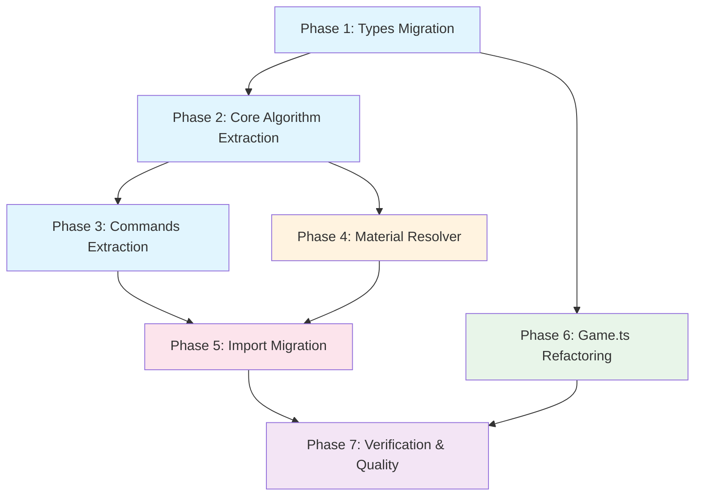
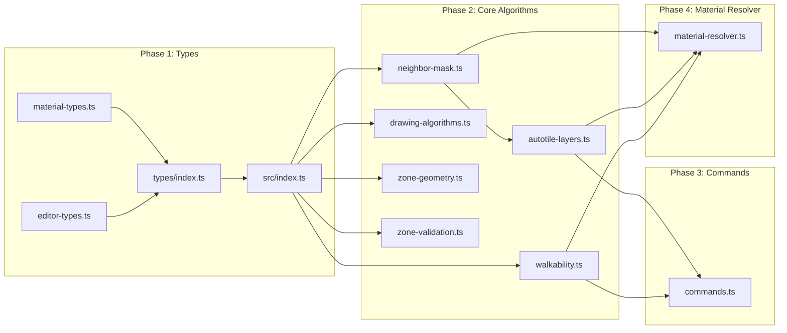

# Work Plan: Map Algorithm Extraction and Material Painting Pipeline

Created Date: 2026-02-21
Type: refactor
Estimated Duration: 5 days
Estimated Impact: ~28-30 files
Commit Strategy: Manual (user decides when to commit)
Related Issue/PR: N/A

## Related Documents

- Design Doc: [docs/design/design-013-map-lib-extraction.md](../design/design-013-map-lib-extraction.md)
- ADR: [docs/adr/ADR-0010-map-lib-algorithm-extraction.md](../adr/ADR-0010-map-lib-algorithm-extraction.md)
- ADR (prereq): [docs/adr/adr-006-map-editor-architecture.md](../adr/adr-006-map-editor-architecture.md)
- ADR (prereq): [docs/adr/ADR-0009-tileset-management-architecture.md](../adr/ADR-0009-tileset-management-architecture.md)

## Objective

Extract all pure map algorithms from `apps/genmap/` into `packages/map-lib/`, add a material-based painting resolution pipeline, and refactor `Game.ts` to use `MapRenderer`. This creates a testable, reusable foundation of pure functions, resolves a documented out-of-bounds behavior divergence, and enables material-level painting.

## Background

Pure algorithms (autotile computation, drawing algorithms, zone geometry, zone validation, editor commands) are embedded in UI-coupled files within the genmap app, making them untestable without mocking React dispatch and UI types. Two implementations of neighbor bitmask computation exist with divergent out-of-bounds behavior. No material-based painting pipeline exists. `Game.ts` duplicates rendering logic that already exists in `MapRenderer`.

## Phase Structure Diagram

## Task Dependency Diagram

## Risks and Countermeasures

### Technical Risks

- **Risk**: Import migration misses a file, causing runtime/compilation errors
  - **Impact**: Medium (caught by TypeScript compiler)
  - **Probability**: Low
  - **Countermeasure**: Use Grep to find all import sites before migration. Run `pnpm nx typecheck` across all projects after migration. TypeScript strict mode will catch missing imports.

- **Risk**: OOB parameterization introduces subtle rendering bugs
  - **Impact**: High (visual artifacts in autotile rendering)
  - **Probability**: Low
  - **Countermeasure**: Unit tests for both OOB modes (true and false). Default value preserves existing editor behavior. transition-test-canvas explicitly passes `false`.

- **Risk**: MaterialResolver transition lookup returns wrong tileset
  - **Impact**: High (wrong terrain rendered for material transitions)
  - **Probability**: Medium
  - **Countermeasure**: Unit tests with known material pairs and expected tileset matches. TransitionWarning diagnostic output for missing transitions.

- **Risk**: Game.ts MapRenderer produces different visual output
  - **Impact**: Medium (visual regression)
  - **Probability**: Low
  - **Countermeasure**: MapRenderer.render() was built to match the inline pattern. Visual verification during testing.

### Schedule Risks

- **Risk**: Rectangle fill extraction requires non-trivial refactoring (inline logic, not a named function)
  - **Impact**: Low (0.5 day additional effort)
  - **Countermeasure**: Design Doc already specifies the `rectangleFill` interface. Extract logic from `createRectangleTool.onMouseUp`.

---

## Implementation Phases

### Phase 1: Types Migration (Estimated commits: 1-2)

**Purpose**: Create the type foundation that all subsequent modules depend on. Move `TilesetInfo`, `MaterialInfo`, `EditorLayer`, `MapEditorState`, and all related types to `packages/map-lib/src/types/`.

**Dependencies**: None (first phase)

#### Tasks

- [ ] **Task 1.1**: Create `packages/map-lib/src/types/material-types.ts`
  - Define `TilesetInfo` interface with fields: `key`, `name`, `fromMaterialId?`, `toMaterialId?`
  - Define `MaterialInfo` interface with fields: `key`, `walkable`, `renderPriority`
  - Add JSDoc documentation on all exported types
  - **Completion**: File exists, exports compile, matches Design Doc Component 10 interface

- [ ] **Task 1.2**: Create `packages/map-lib/src/types/editor-types.ts`
  - Define all editor types: `EditorTool`, `SidebarTab`, `SIDEBAR_TABS`, `BaseLayer`, `TileLayer`, `PlacedObject`, `ObjectLayer`, `EditorLayer`, `CellDelta`, `EditorCommand`, `MapEditorState`, `MapEditorAction`, `LoadMapPayload`
  - Import `Cell` from `@nookstead/shared`, `MapType`/`ZoneData` from `../types/map-types`, `TilesetInfo`/`MaterialInfo` from `./material-types`
  - Add JSDoc documentation on all exported types
  - **Completion**: File exists, exports compile, matches Design Doc Component 9 interface

- [ ] **Task 1.3**: Update `packages/map-lib/src/types/index.ts`
  - Add re-exports for all types from `material-types.ts` and `editor-types.ts`
  - Preserve existing re-exports from `map-types.ts` and `template-types.ts`
  - **Completion**: All new types importable via `@nookstead/map-lib/types`

- [ ] **Task 1.4**: Update `packages/map-lib/src/index.ts`
  - Add re-exports for all new types and the `SIDEBAR_TABS` constant
  - Preserve all existing exports (autotile engine, map types, template types)
  - **Completion**: All new types importable via `@nookstead/map-lib`

#### Phase Completion Criteria

- [ ] `TilesetInfo`, `MaterialInfo`, `EditorLayer`, `MapEditorState`, `MapEditorAction`, `CellDelta`, `EditorCommand`, and all other types listed in AC2 are importable from `@nookstead/map-lib`
- [ ] `pnpm nx typecheck map-lib` passes
- [ ] No module exceeds 300 lines (Design Doc NFR)

#### Operational Verification

1. Run `pnpm nx typecheck map-lib` -- must pass with zero errors
2. Verify `import type { EditorLayer, MapEditorState } from '@nookstead/map-lib'` resolves correctly

---

### Phase 2: Core Algorithm Extraction (Estimated commits: 2-3)

**Purpose**: Extract all pure algorithms from genmap into map-lib core modules. These are leaf modules (no cross-dependencies except neighbor-mask depending on autotile.ts which is already in map-lib).

**Dependencies**: Phase 1 (types must exist)

#### Tasks

- [x] **Task 2.1**: Create `packages/map-lib/src/core/neighbor-mask.ts`
  - Extract `computeNeighborMask` from `apps/genmap/src/hooks/autotile-utils.ts`
  - Extract `checkTerrainPresence` from same file
  - Export `NEIGHBOR_OFFSETS` constant
  - Add `NeighborMaskOptions` interface with `outOfBoundsMatches?: boolean` (default `true`)
  - Parameterize OOB behavior: when `true`, OOB neighbors have bit set; when `false`, bit clear
  - Import direction constants (N, NE, E, etc.) from `../core/autotile`
  - Add JSDoc on all exports
  - **Completion**: Functions compile and match Design Doc Component 1 interface. AC1 computeNeighborMask OOB behavior criteria satisfiable.

- [x] **Task 2.2**: Create `packages/map-lib/src/core/autotile-layers.ts`
  - Extract `recomputeAutotileLayers` from `apps/genmap/src/hooks/autotile-utils.ts`
  - Import `computeNeighborMask` from `./neighbor-mask`
  - Import `getFrame`, `EMPTY_FRAME` from `./autotile`
  - Import `EditorLayer` from `../types/editor-types`
  - Add JSDoc
  - **Completion**: Function compiles and matches Design Doc Component 2 interface. AC1 empty affectedCells criteria satisfiable.

- [x] **Task 2.3**: Create `packages/map-lib/src/core/walkability.ts`
  - Extract `recomputeWalkability` from `apps/genmap/src/hooks/autotile-utils.ts`
  - Import `MaterialInfo` from `../types/material-types`
  - Add JSDoc
  - **Completion**: Function compiles and matches Design Doc Component 3 interface.

- [x] **Task 2.4**: Create `packages/map-lib/src/core/drawing-algorithms.ts`
  - Extract `bresenhamLine` from `apps/genmap/src/components/map-editor/tools/brush-tool.ts`
  - Extract `floodFill` from `apps/genmap/src/components/map-editor/tools/fill-tool.ts`
  - Create new `rectangleFill` function by extracting inline logic from `apps/genmap/src/components/map-editor/tools/rectangle-tool.ts` `onMouseUp` handler
  - Define `RectangleFillOptions` interface
  - Import `CellDelta`, `EditorLayer` from `../types/editor-types`
  - Add JSDoc on all exports
  - **Completion**: All three functions compile and match Design Doc Component 4 interface. AC1 bresenhamLine and floodFill criteria satisfiable.

- [ ] **Task 2.5**: Create `packages/map-lib/src/core/zone-geometry.ts`
  - Extract `computeRectBounds`, `clampBounds`, `isSimplePolygon`, `polygonArea`, `toZoneVertices` from `apps/genmap/src/components/map-editor/zone-drawing.ts`
  - Define `TileCoord` interface
  - Import `ZoneBounds`, `ZoneVertex` from `../types/map-types`
  - Add JSDoc
  - **Completion**: All functions compile and match Design Doc Component 6 interface. AC5 geometry criteria satisfiable.

- [x] **Task 2.6**: Create `packages/map-lib/src/core/zone-validation.ts`
  - Extract `getZoneTiles`, `rasterizePolygon`, `detectZoneOverlap`, `validateAllZones` from `apps/genmap/src/lib/zone-validation.ts`
  - Define `OverlapResult`, `ValidationError` interfaces
  - Import `ZoneData`, `ZoneType`, `ZONE_OVERLAP_ALLOWED` from `../types/map-types`
  - Import `TileCoord` from `./zone-geometry`
  - Add JSDoc
  - **Completion**: All functions compile and match Design Doc Component 7 interface. AC5 rasterizePolygon and validateAllZones criteria satisfiable.

- [ ] **Task 2.7**: Update `packages/map-lib/src/index.ts` with core algorithm re-exports
  - Add re-exports for all functions and types from the 6 new core modules
  - Preserve existing exports
  - **Completion**: All new functions importable via `@nookstead/map-lib`

#### Phase Completion Criteria

- [ ] All functions listed in AC1 and AC5 are importable from `@nookstead/map-lib`
- [ ] `computeNeighborMask` accepts `outOfBoundsMatches` option parameter
- [ ] No module exceeds 300 lines
- [ ] `pnpm nx typecheck map-lib` passes
- [ ] All functions are pure (no React, DOM, or Phaser dependencies in import chain)

#### Operational Verification

1. Run `pnpm nx typecheck map-lib` -- must pass with zero errors
2. Verify import chain purity: grep for `react`, `phaser`, `document`, `window` in new core modules -- must find zero matches

---

### Phase 3: Commands Extraction (Estimated commits: 1)

**Purpose**: Extract the editor command infrastructure (applyDeltas, PaintCommand, FillCommand) which depends on autotile-layers and walkability from Phase 2.

**Dependencies**: Phase 2 (commands use `recomputeAutotileLayers` and `recomputeWalkability`)

#### Tasks

- [ ] **Task 3.1**: Create `packages/map-lib/src/core/commands.ts`
  - Extract `applyDeltas` function from `apps/genmap/src/hooks/map-editor-commands.ts`
  - Extract `PaintCommand` class from same file
  - Extract `FillCommand` class from same file
  - Import `recomputeAutotileLayers` from `./autotile-layers`
  - Import `recomputeWalkability` from `./walkability`
  - Import `MapEditorState`, `CellDelta`, `EditorCommand` from `../types/editor-types`
  - Use `readonly` on class fields per existing convention
  - Add JSDoc
  - **Completion**: All exports compile and match Design Doc Component 5 interface.

- [ ] **Task 3.2**: Update `packages/map-lib/src/index.ts` with commands re-exports
  - Add re-exports for `applyDeltas`, `PaintCommand`, `FillCommand`
  - **Completion**: Commands importable via `@nookstead/map-lib`

#### Phase Completion Criteria

- [ ] `applyDeltas`, `PaintCommand`, `FillCommand` importable from `@nookstead/map-lib`
- [ ] `pnpm nx typecheck map-lib` passes
- [ ] Module does not exceed 300 lines

#### Operational Verification

1. Run `pnpm nx typecheck map-lib` -- must pass with zero errors

---

### Phase 4: Material Resolver (Estimated commits: 1)

**Purpose**: Create the new material-based painting resolution pipeline. This is the only truly new code in the project -- everything else is extraction.

**Dependencies**: Phase 2 (material resolver composes neighbor-mask, autotile-layers, walkability)

#### Tasks

- [x] **Task 4.1**: Create `packages/map-lib/src/core/material-resolver.ts`
  - Implement `TransitionEntry` interface
  - Implement `TransitionMap` type (ReadonlyMap<string, TransitionEntry>)
  - Implement `buildTransitionMap(tilesets, materials)` function
    - Iterate tilesets with `fromMaterialId` and `toMaterialId`
    - Resolve material IDs to keys via materials map
    - Build key format: `"fromMaterialKey:toMaterialKey"`
  - Implement `TransitionWarning` interface
  - Implement `PaintResult` interface
  - Implement `ResolvePaintOptions` interface
  - Implement `resolvePaint(options)` function
    - Set `grid[y][x].terrain` to materialKey (immutable update)
    - Scan 8 neighbors for unique adjacent materials
    - For each (materialKey, neighborMaterial) pair, look up tileset in transitionMap
    - Ensure layer exists for each transition tileset
    - Collect painted cell + 8 neighbors as affectedCells
    - Return PaintResult with warnings for missing transitions
  - Implement `createTransitionLayer(tilesetKey, tilesetName, width, height)`
  - Add JSDoc on all exports
  - **Completion**: All exports compile and match Design Doc Component 8 interface. AC3 criteria satisfiable.

- [x] **Task 4.2**: Update `packages/map-lib/src/index.ts` with material resolver re-exports
  - Add re-exports for `buildTransitionMap`, `resolvePaint`, `createTransitionLayer` and all types
  - **Completion**: Material resolver importable via `@nookstead/map-lib`

#### Phase Completion Criteria

- [x] `buildTransitionMap`, `resolvePaint`, `createTransitionLayer` importable from `@nookstead/map-lib`
- [x] All interfaces (`TransitionEntry`, `TransitionMap`, `TransitionWarning`, `PaintResult`, `ResolvePaintOptions`) importable
- [x] `pnpm nx typecheck map-lib` passes
- [x] Module does not exceed 300 lines
- [x] No database imports (data passed as parameters per ADR-0010)

#### Operational Verification

1. Run `pnpm nx typecheck map-lib` -- must pass with zero errors
2. Verify no `@nookstead/db` or database-related imports in material-resolver.ts

---

### Phase 5: Import Migration (Estimated commits: 2-3)

**Purpose**: Update all genmap imports to use `@nookstead/map-lib` instead of local files. Replace original source files with re-export shims for backward compatibility. This is the highest-risk phase.

**Dependencies**: Phases 1-4 (all map-lib modules must exist before redirecting imports)

#### Tasks

- [ ] **Task 5.1**: Replace `apps/genmap/src/hooks/autotile-utils.ts` with re-export shim
  - Replace file contents with re-exports from `@nookstead/map-lib`:
    - `checkTerrainPresence`, `computeNeighborMask`, `recomputeAutotileLayers`, `recomputeWalkability`
    - Type re-exports: `TilesetInfo`, `MaterialInfo`
  - **Completion**: All existing imports from this file continue to resolve

- [x] **Task 5.2**: Replace `apps/genmap/src/hooks/map-editor-types.ts` with re-export shim
  - Replace file contents with re-exports from `@nookstead/map-lib`:
    - All type exports: `EditorLayer`, `MapEditorState`, `MapEditorAction`, `EditorTool`, `SidebarTab`, `SIDEBAR_TABS`, `BaseLayer`, `TileLayer`, `ObjectLayer`, `PlacedObject`, `CellDelta`, `EditorCommand`, `LoadMapPayload`
  - **Completion**: All existing imports from this file continue to resolve

- [x] **Task 5.3**: Replace `apps/genmap/src/hooks/map-editor-commands.ts` with re-export shim
  - Replace file contents with re-exports from `@nookstead/map-lib`:
    - `applyDeltas`, `PaintCommand`, `FillCommand`
  - **Completion**: All existing imports from this file continue to resolve

- [x] **Task 5.4**: Update `apps/genmap/src/components/map-editor/tools/brush-tool.ts`
  - Change `bresenhamLine` import to `@nookstead/map-lib` (was local or from `./brush-tool`)
  - Update type imports (`MapEditorState`, `MapEditorAction`, `CellDelta`, `PaintCommand`) to `@nookstead/map-lib`
  - **Completion**: File compiles with new imports

- [x] **Task 5.5**: Update `apps/genmap/src/components/map-editor/tools/fill-tool.ts`
  - Change `floodFill` import to `@nookstead/map-lib`
  - Update type imports (`MapEditorState`, `MapEditorAction`, `CellDelta`, `FillCommand`) to `@nookstead/map-lib`
  - **Completion**: File compiles with new imports

- [x] **Task 5.6**: Update `apps/genmap/src/components/map-editor/tools/rectangle-tool.ts`
  - Change to import `rectangleFill` from `@nookstead/map-lib` (replacing inline logic)
  - Update type imports (`MapEditorState`, `MapEditorAction`, `CellDelta`, `PaintCommand`) to `@nookstead/map-lib`
  - Refactor `onMouseUp` handler to call `rectangleFill(options)` instead of inline loop
  - **Completion**: File compiles with new imports, rectangle tool behavior unchanged

- [x] **Task 5.7**: Update `apps/genmap/src/components/map-editor/tools/eraser-tool.ts`
  - Change `bresenhamLine` import to `@nookstead/map-lib` (was from `./brush-tool`)
  - Update type imports (`MapEditorState`, `MapEditorAction`, `CellDelta`, `PaintCommand`) to `@nookstead/map-lib`
  - **Completion**: File compiles with new imports

- [ ] **Task 5.8**: Replace `apps/genmap/src/components/map-editor/zone-drawing.ts` with re-export shim
  - Replace file contents with re-exports from `@nookstead/map-lib`:
    - `computeRectBounds`, `clampBounds`, `isSimplePolygon`, `polygonArea`, `toZoneVertices`, `TileCoord`
  - **Completion**: All existing imports from this file continue to resolve

- [ ] **Task 5.9**: Replace `apps/genmap/src/lib/zone-validation.ts` with re-export shim
  - Replace file contents with re-exports from `@nookstead/map-lib`:
    - `getZoneTiles`, `rasterizePolygon`, `detectZoneOverlap`, `validateAllZones`, `OverlapResult`, `ValidationError`
  - **Completion**: All existing imports from this file continue to resolve

- [x] **Task 5.10**: Update `apps/genmap/src/components/transition-test-canvas.tsx`
  - Replace local `computeBitmask` function with import of `computeNeighborMask` from `@nookstead/map-lib`
  - Call with `{ outOfBoundsMatches: false }` to preserve existing OOB=not-matching behavior
  - Adapt call site: `computeBitmask(grid, r, c)` becomes `computeNeighborMask(cellGrid, c, r, w, h, key, tilesets, { outOfBoundsMatches: false })`
  - Remove the local `computeBitmask` function
  - **Completion**: File compiles, transition test canvas renders identical autotile frames (AC1 OOB=false)

- [x] **Task 5.11**: Update `apps/genmap/src/hooks/use-map-editor.ts`
  - Update imports to use `@nookstead/map-lib` for all editor types, commands, and autotile functions
  - Verify all type references resolve correctly
  - **Completion**: File compiles with new imports

- [x] **Task 5.12**: Grep for any remaining imports from old locations
  - Search for imports from `./autotile-utils`, `./map-editor-types`, `./map-editor-commands`, `./zone-drawing`, `../lib/zone-validation`
  - Update any missed files (found and migrated: use-zones.ts, map-editor-canvas.tsx, page.tsx, activity-bar.tsx, canvas-renderer.ts, editor-options-bar.tsx, editor-sidebar.tsx, layer-panel.tsx, terrain-palette.tsx, map-properties-panel.tsx, crop-field-properties.tsx)
  - **Completion**: Zero remaining imports from old locations in any file except the shims themselves

#### Phase Completion Criteria

- [x] No genmap source file imports types from `hooks/map-editor-types.ts`, `hooks/map-editor-commands.ts`, or `hooks/autotile-utils.ts` directly (only through shims or directly from `@nookstead/map-lib`) -- AC2
- [x] `pnpm nx typecheck genmap` passes (or equivalent for the genmap app)
- [x] All tool files compile with updated imports
- [x] `transition-test-canvas.tsx` uses `computeNeighborMask` with `outOfBoundsMatches: false`

#### Operational Verification

1. Run `pnpm nx typecheck` across all projects -- must pass with zero errors
2. Grep for `from './autotile-utils'`, `from './map-editor-types'`, `from './map-editor-commands'` in non-shim files -- must find zero matches
3. Grep for `from '../lib/zone-validation'` and `from './zone-drawing'` in non-shim files -- must find zero matches

---

### Phase 6: Game.ts MapRenderer Refactoring (Estimated commits: 1)

**Purpose**: Refactor `Game.ts` to use `MapRenderer` instead of inline rendering logic. This phase is independent and can run in parallel with Phase 5.

**Dependencies**: None (MapRenderer already exists in `packages/map-renderer`). Can proceed after Phase 1 or in parallel with Phase 5.

#### Tasks

- [x] **Task 6.1**: Refactor `apps/game/src/game/scenes/Game.ts`
  - Add `import { MapRenderer } from '@nookstead/map-renderer'`
  - Remove inline stamp rendering loop (lines 52-69 per Design Doc)
  - Replace with `MapRenderer` instantiation and `.render()` call
  - Use `this.mapData.width` and `this.mapData.height` instead of hardcoded `MAP_WIDTH`/`MAP_HEIGHT` constants
  - Remove `EMPTY_FRAME` import if no longer needed directly
  - Store `MapRenderer` instance as class field if `updateCell` support is needed later
  - **Completion**: File compiles, uses MapRenderer.render(). AC4 criteria satisfiable.

#### Phase Completion Criteria

- [x] `Game.ts` uses `MapRenderer.render()` for all map layer rendering -- AC4
- [x] `Game.ts` uses `map.width`/`map.height` from `GeneratedMap` data instead of hardcoded constants -- AC4
- [x] `pnpm nx typecheck game` passes
- [ ] Rendered output is visually identical to current inline rendering

#### Operational Verification

1. Run `pnpm nx typecheck game` -- must pass with zero errors
2. Visual verification: game map rendering appears identical before and after change

---

### Phase 7: Verification & Quality (Estimated commits: 1-2)

**Purpose**: All reviews, tests, quality checks, and verification consolidated at the end per user instruction.

**Dependencies**: All previous phases (1-6) must be complete.

#### Tasks

- [x] **Task 7.1**: Write unit tests for `packages/map-lib/src/core/neighbor-mask.ts`
  - Test `computeNeighborMask` with `outOfBoundsMatches: true` (OOB neighbors have bits set)
  - Test `computeNeighborMask` with `outOfBoundsMatches: false` (OOB neighbors have bits clear)
  - Test corner cells, edge cells, center cells
  - Test all-same terrain, mixed terrain
  - Test `checkTerrainPresence` with matching and non-matching terrains
  - **AC coverage**: AC1 (computeNeighborMask OOB behavior)

- [x] **Task 7.2**: Write unit tests for `packages/map-lib/src/core/autotile-layers.ts`
  - Test empty `affectedCells` returns layers unchanged -- AC1
  - Test single cell update produces correct frame
  - Test multi-cell update
  - Test layer frame immutability (original layers not mutated)

- [x] **Task 7.3**: Write unit tests for `packages/map-lib/src/core/walkability.ts`
  - Test all-walkable terrain
  - Test all-unwalkable terrain
  - Test mixed terrain
  - Test unknown terrain defaults to walkable

- [x] **Task 7.4**: Write unit tests for `packages/map-lib/src/core/drawing-algorithms.ts`
  - Test `bresenhamLine(0, 0, 5, 3)` returns contiguous points with no diagonal gaps -- AC1
  - Test `bresenhamLine` horizontal, vertical, diagonal, single point cases
  - Test `floodFill` with same terrain (returns empty delta array) -- AC1
  - Test `floodFill` bounded fill, full grid fill
  - Test `rectangleFill` single cell, full grid, out-of-bounds clamping

- [x] **Task 7.5**: Write unit tests for `packages/map-lib/src/core/commands.ts`
  - Test `PaintCommand` execute/undo roundtrip
  - Test `FillCommand` execute/undo roundtrip
  - Test `applyDeltas` forward/backward

- [x] **Task 7.6**: Write unit tests for `packages/map-lib/src/core/zone-geometry.ts`
  - Test `computeRectBounds` normal and reversed drag -- AC5
  - Test `clampBounds` within bounds and exceeding
  - Test `isSimplePolygon` with triangle and self-intersecting polygon
  - Test `polygonArea` with known shapes
  - Test `toZoneVertices` conversion

- [x] **Task 7.7**: Write unit tests for `packages/map-lib/src/core/zone-validation.ts`
  - Test `rasterizePolygon` with triangle `[(0,0), (4,0), (2,4)]` -- AC5
  - Test `getZoneTiles` for rectangle and polygon zones
  - Test `detectZoneOverlap` overlapping, non-overlapping, and allowed overlap
  - Test `validateAllZones` with no errors and with disallowed overlaps -- AC5

- [x] **Task 7.8**: Write unit tests for `packages/map-lib/src/core/material-resolver.ts`
  - Test `buildTransitionMap` with normal tileset/material data
  - Test `buildTransitionMap` with missing material IDs
  - Test `resolvePaint` single material paint -- AC3
  - Test `resolvePaint` two-material transition (grass adjacent to sand) -- AC3
  - Test `resolvePaint` missing transition produces warning -- AC3
  - Test `resolvePaint` cascades to 8 neighbors -- AC3
  - Test `resolvePaint` edge cell (fewer than 8 neighbors)
  - Test `createTransitionLayer` creates correct EditorLayer structure

- [ ] **Task 7.9**: Run typecheck across all projects
  - `pnpm nx run-many -t typecheck`
  - All projects must pass with zero errors

- [ ] **Task 7.10**: Run lint across all projects
  - `pnpm nx run-many -t lint`
  - All projects must pass with zero errors

- [ ] **Task 7.11**: Run existing tests
  - `pnpm nx run-many -t test`
  - All existing tests must continue to pass (no regressions)

- [ ] **Task 7.12**: Run new map-lib unit tests
  - `pnpm nx test map-lib`
  - All new tests pass

- [ ] **Task 7.13**: Verify Design Doc acceptance criteria
  - Manually verify each AC item from the Design Doc:
    - [ ] AC1: Algorithm Extraction (all functions importable, OOB behavior correct, bresenhamLine contiguous, floodFill no-op, recomputeAutotileLayers empty cells)
    - [ ] AC2: Type Migration (all types importable, no direct old-location imports)
    - [ ] AC3: Material Resolver (resolvePaint terrain set, transition lookup, missing transition warning, neighbor cascade)
    - [ ] AC4: Game.ts MapRenderer Integration (uses MapRenderer.render, visually identical, uses map dimensions)
    - [ ] AC5: Zone Algorithm Extraction (rasterizePolygon, validateAllZones, all geometry functions importable)

- [ ] **Task 7.14**: Final quality review
  - Verify no module exceeds 300 lines
  - Verify all public functions have JSDoc
  - Verify immutable update pattern used throughout
  - Verify `ReadonlyArray` used for input collections
  - Verify row-major grid convention `grid[y][x]` consistent
  - Verify `readonly` on class fields per convention
  - Verify zero-build pattern maintained (no dist/ directory)

#### Phase Completion Criteria

- [ ] All unit tests pass (Tasks 7.1-7.8)
- [ ] `pnpm nx run-many -t typecheck lint test` passes with zero errors
- [ ] All 5 acceptance criteria groups (AC1-AC5) verified
- [ ] Code quality standards met (JSDoc, 300-line limit, immutability, ReadonlyArray)
- [ ] No regressions in existing test suite

#### Operational Verification

1. Run `pnpm nx run-many -t typecheck lint test` -- all pass
2. Run `pnpm nx test map-lib` -- all new tests pass
3. Verify AC1-AC5 checklist items above are all checked

---

## Acceptance Criteria Traceability

| AC | Description | Phase | Tasks |
|----|-------------|-------|-------|
| AC1 | Algorithm Extraction | Phase 2 (impl), Phase 7 (verify) | 2.1-2.7, 7.1-7.4 |
| AC2 | Type Migration | Phase 1 (impl), Phase 5 (migration), Phase 7 (verify) | 1.1-1.4, 5.1-5.12, 7.9, 7.13 |
| AC3 | Material Resolver | Phase 4 (impl), Phase 7 (verify) | 4.1-4.2, 7.8, 7.13 |
| AC4 | Game.ts MapRenderer | Phase 6 (impl), Phase 7 (verify) | 6.1, 7.9, 7.13 |
| AC5 | Zone Algorithm Extraction | Phase 2 (impl), Phase 7 (verify) | 2.5-2.6, 7.6-7.7, 7.13 |

## Files Affected Summary

### New Files (~12)

| File | Phase | Description |
|------|-------|-------------|
| `packages/map-lib/src/types/material-types.ts` | 1 | TilesetInfo, MaterialInfo types |
| `packages/map-lib/src/types/editor-types.ts` | 1 | EditorLayer, MapEditorState, all editor types |
| `packages/map-lib/src/core/neighbor-mask.ts` | 2 | computeNeighborMask with OOB param |
| `packages/map-lib/src/core/autotile-layers.ts` | 2 | recomputeAutotileLayers |
| `packages/map-lib/src/core/walkability.ts` | 2 | recomputeWalkability |
| `packages/map-lib/src/core/drawing-algorithms.ts` | 2 | bresenhamLine, floodFill, rectangleFill |
| `packages/map-lib/src/core/zone-geometry.ts` | 2 | Zone geometry algorithms |
| `packages/map-lib/src/core/zone-validation.ts` | 2 | Zone validation algorithms |
| `packages/map-lib/src/core/commands.ts` | 3 | applyDeltas, PaintCommand, FillCommand |
| `packages/map-lib/src/core/material-resolver.ts` | 4 | MaterialResolver pipeline |
| Test files (8 spec files) | 7 | Unit tests for all new modules |

### Modified Files (~16)

| File | Phase | Change |
|------|-------|--------|
| `packages/map-lib/src/types/index.ts` | 1 | Add re-exports |
| `packages/map-lib/src/index.ts` | 1, 2, 3, 4 | Add re-exports progressively |
| `apps/genmap/src/hooks/autotile-utils.ts` | 5 | Replace with re-export shim |
| `apps/genmap/src/hooks/map-editor-types.ts` | 5 | Replace with re-export shim |
| `apps/genmap/src/hooks/map-editor-commands.ts` | 5 | Replace with re-export shim |
| `apps/genmap/src/components/map-editor/tools/brush-tool.ts` | 5 | Update imports |
| `apps/genmap/src/components/map-editor/tools/fill-tool.ts` | 5 | Update imports |
| `apps/genmap/src/components/map-editor/tools/rectangle-tool.ts` | 5 | Update imports, use rectangleFill |
| `apps/genmap/src/components/map-editor/tools/eraser-tool.ts` | 5 | Update imports |
| `apps/genmap/src/components/map-editor/zone-drawing.ts` | 5 | Replace with re-export shim |
| `apps/genmap/src/lib/zone-validation.ts` | 5 | Replace with re-export shim |
| `apps/genmap/src/components/transition-test-canvas.tsx` | 5 | Replace local computeBitmask |
| `apps/genmap/src/hooks/use-map-editor.ts` | 5 | Update imports |
| `apps/game/src/game/scenes/Game.ts` | 6 | Use MapRenderer, dynamic dimensions |

## Completion Criteria

- [ ] All phases (1-7) completed
- [ ] All Design Doc acceptance criteria (AC1-AC5) satisfied
- [ ] All new unit tests pass
- [ ] `pnpm nx run-many -t typecheck lint test` passes with zero errors
- [ ] No module exceeds 300 lines
- [ ] All public functions have JSDoc documentation
- [ ] Zero-build pattern maintained (no dist/ directory in map-lib)
- [ ] No database dependencies in map-lib
- [ ] User review approval obtained

## Progress Tracking

### Phase 1: Types Migration
- Start:
- Complete:
- Notes:

### Phase 2: Core Algorithm Extraction
- Start:
- Complete:
- Notes:

### Phase 3: Commands Extraction
- Start:
- Complete:
- Notes:

### Phase 4: Material Resolver
- Start:
- Complete:
- Notes:

### Phase 5: Import Migration
- Start:
- Complete:
- Notes:

### Phase 6: Game.ts Refactoring
- Start:
- Complete:
- Notes:

### Phase 7: Verification & Quality
- Start:
- Complete:
- Notes:

## Notes

- **Implementation approach**: Horizontal Slice (Foundation-driven) per Design Doc. Build map-lib foundation first, then migrate consumers in a single pass.
- **Re-export shim strategy**: Original genmap files become thin re-export shims pointing to `@nookstead/map-lib`. This provides a non-breaking migration path. Shims can be removed in a follow-up cleanup.
- **Parallelism**: Phase 6 (Game.ts) is independent and can run in parallel with Phase 5 (Import Migration). All Phase 2 tasks (2.1-2.6) can largely be done in parallel since they are leaf modules.
- **Highest risk**: Phase 5 (Import Migration) -- must update all import sites correctly. Mitigated by TypeScript compiler catching missing imports and Grep verification.
- **Only new code**: Phase 4 (Material Resolver) is the only phase creating truly new functionality. All other phases are extraction/migration of existing code.
