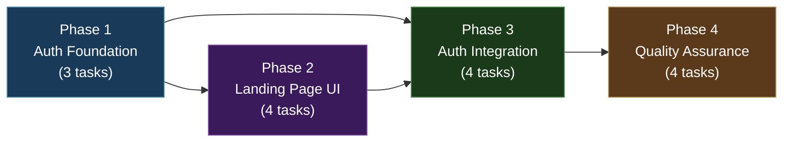
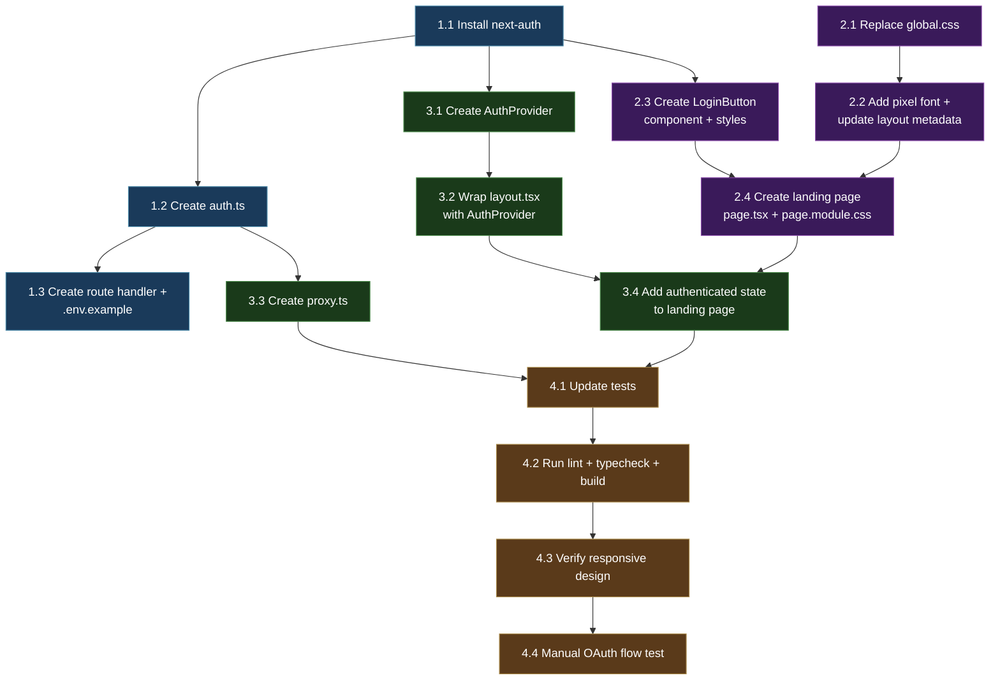

# Work Plan: Landing Page and Authentication Implementation

Created Date: 2026-02-14
Type: feature
Estimated Duration: 2 days
Estimated Impact: 12 files (4 modified, 8 new)
Related Issue/PR: N/A

## Related Documents

- PRD: [docs/prd/prd-001-landing-page-auth.md](../prd/prd-001-landing-page-auth.md)
- ADR: [docs/adr/adr-002-nextauth-authentication.md](../adr/adr-002-nextauth-authentication.md)
- Design Doc: [docs/design/design-001-landing-page-auth.md](../design/design-001-landing-page-auth.md)

## Objective

Replace the default Nx boilerplate landing page with a pixel art themed Nookstead entry point and add social authentication (Google + Discord OAuth) via NextAuth.js v5, gating access to the `/game` route behind login.

## Background

The current landing page is the out-of-box Nx template with no brand identity and no authentication. Before the game can be tested with real users, a branded landing page and an auth layer are required. This plan follows the vertical slice implementation approach defined in the Design Doc, building the auth foundation first, then the UI, then integrating them.

## Phase Structure Diagram

## Task Dependency Diagram

## Risks and Countermeasures

### Technical Risks

- **Risk**: NextAuth v5 peer dependency mismatch with Next.js 16
  - **Impact**: Installation fails without workaround flag
  - **Countermeasure**: Use `--legacy-peer-deps` flag; pin exact version `5.0.0-beta.30`

- **Risk**: NextAuth v5 `authorized` callback incompatible with Next.js 16 `proxy.ts`
  - **Impact**: Route protection may not work via direct NextAuth export
  - **Countermeasure**: Manual session cookie check in `proxy.ts` as primary defense (already designed in Design Doc)

- **Risk**: Global CSS replacement breaks game page styling
  - **Impact**: Phaser game canvas or HUD components render incorrectly
  - **Countermeasure**: Game page uses CSS Modules exclusively; verify game page after global.css change

- **Risk**: Press Start 2P font fails to load from Google Fonts CDN
  - **Impact**: Logo text renders in fallback font
  - **Countermeasure**: CSS fallback font stack (`monospace`); logo remains readable

### Schedule Risks

- **Risk**: OAuth provider configuration delays (Google Cloud Console, Discord Developer Portal)
  - **Impact**: Cannot test OAuth flows end-to-end without credentials
  - **Countermeasure**: Auth config and UI can be built and tested structurally without credentials; manual OAuth testing is in Phase 4

## Implementation Phases

### Phase 1: Authentication Foundation (Estimated commits: 2)

**Purpose**: Install the auth library, create the centralized NextAuth configuration, and set up the API route handler so OAuth endpoints are functional.

**Derives from**: Design Doc technical dependencies 1-3 (Package Installation, auth.ts, Route Handler)
**ACs covered**: AC-2 (partial), AC-3 (partial), AC-4

#### Tasks

- [ ] **Task 1.1**: Install `next-auth@5.0.0-beta.30` with `--legacy-peer-deps`
  - **File(s)**: `apps/game/package.json`
  - **Description**: Run `npm install next-auth@5.0.0-beta.30 --legacy-peer-deps` from the workspace root. Verify the package appears in `apps/game/package.json` dependencies and the install completes without runtime errors.
  - **Dependencies**: None (first task)

- [ ] **Task 1.2**: Create `auth.ts` with Google + Discord providers, JWT strategy
  - **File(s)**: `apps/game/src/auth.ts` (new)
  - **Description**: Create the centralized NextAuth configuration file exporting `handlers`, `auth`, `signIn`, `signOut`. Configure Google and Discord providers, JWT session strategy with 30-day maxAge, custom signIn page set to `/`, and the `authorized` callback for route protection logic. Follow the contract defined in Design Doc section "auth.ts".
  - **Dependencies**: Task 1.1

- [ ] **Task 1.3**: Create API route handler and `.env.example`
  - **File(s)**: `apps/game/src/app/api/auth/[...nextauth]/route.ts` (new), `.env.example` (new, workspace root)
  - **Description**: Create the catch-all route handler that re-exports `GET` and `POST` from `handlers` in `auth.ts`. Create `.env.example` listing `AUTH_SECRET`, `AUTH_GOOGLE_ID`, `AUTH_GOOGLE_SECRET`, `AUTH_DISCORD_ID`, `AUTH_DISCORD_SECRET` with placeholder comments.
  - **Dependencies**: Task 1.2

#### Phase Completion Criteria

- [ ] `next-auth@5.0.0-beta.30` is listed in `apps/game/package.json` dependencies
- [ ] `auth.ts` exports `handlers`, `auth`, `signIn`, `signOut` with correct provider and session config
- [ ] Route handler at `api/auth/[...nextauth]/route.ts` re-exports `GET` and `POST`
- [ ] `.env.example` documents all required environment variables
- [ ] `npx nx build game` succeeds (L3 verification)

#### Operational Verification Procedures

1. Run `npx nx build game` and confirm no TypeScript or build errors
2. Start dev server (`npx nx dev game`), navigate to `/api/auth/providers` and confirm JSON response listing `google` and `discord` (requires `.env.local` with dummy values or AUTH_SECRET at minimum)
3. Verify `auth.ts` imports resolve correctly with the `@/*` path alias

---

### Phase 2: Landing Page UI (Estimated commits: 2)

**Purpose**: Replace the Nx boilerplate with the pixel art themed landing page, including global dark theme styles, pixel font, login button component, and the main page layout.

**Derives from**: Design Doc technical dependencies 5-7 (global.css, LoginButton, page.tsx) and FR-1, FR-6
**ACs covered**: AC-1, AC-6

#### Tasks

- [ ] **Task 2.1**: Replace `global.css` with pixel art dark theme styles
  - **File(s)**: `apps/game/src/app/global.css` (replace)
  - **Description**: Replace the entire Nx boilerplate CSS with the dark theme reset defined in Design Doc: CSS reset (`box-sizing`, margin/padding zero), `html` with `Press Start 2P` font, dark background (`#0a0a1a`), light text (`#e0e0e0`), anti-aliasing disabled for pixel rendering, `image-rendering: pixelated`. Include `body` min-height and overflow rules.
  - **Dependencies**: None (independent of auth tasks)

- [ ] **Task 2.2**: Add Press Start 2P font to `layout.tsx` and update metadata
  - **File(s)**: `apps/game/src/app/layout.tsx` (modify)
  - **Description**: Add `<link>` tag for Google Fonts `Press Start 2P` in the `<head>`. Update `metadata.title` to `'Nookstead'` and `metadata.description` to the game's tagline. Do NOT add AuthProvider yet (that is Phase 3).
  - **Dependencies**: Task 2.1 (global.css must be replaced first to avoid style conflicts)

- [ ] **Task 2.3**: Create `LoginButton` component and `LoginButton.module.css`
  - **File(s)**: `apps/game/src/components/auth/LoginButton.tsx` (new), `apps/game/src/components/auth/LoginButton.module.css` (new)
  - **Description**: Create the `'use client'` LoginButton component accepting a `provider` prop (`'google' | 'discord'`). On click, call `signIn(provider, { callbackUrl: '/game' })` from `next-auth/react`. Show loading state ("Redirecting...") and disable button during redirect. Style with pixel art borders, 44px minimum height for touch targets, provider-specific hover colors (Google blue `#4285f4`, Discord purple `#5865f2`).
  - **Dependencies**: Task 1.1 (next-auth must be installed for imports)

- [ ] **Task 2.4**: Create landing page `page.tsx` and `page.module.css`
  - **File(s)**: `apps/game/src/app/page.tsx` (replace), `apps/game/src/app/page.module.css` (replace)
  - **Description**: Replace the Nx boilerplate page with the pixel art landing page. Render the "NOOKSTEAD" logo with glow animation, tagline text, animated background stars (CSS box-shadow + keyframe animation), and LoginButton components for Google and Discord. Use `clamp()` for responsive font sizes. Initially render only the unauthenticated view (login buttons); the authenticated view will be added in Phase 3 Task 3.4. Create `page.module.css` with all styles from the Design Doc specification: container, stars, logo, tagline, actions, playButton, glow keyframe, and responsive media queries.
  - **Dependencies**: Task 2.2 (font must be loaded), Task 2.3 (LoginButton must exist)

#### Phase Completion Criteria

- [ ] Landing page renders with pixel art logo, tagline, and styled login buttons
- [ ] Global styles apply dark theme to all pages without breaking game page CSS Modules
- [ ] Press Start 2P font loads and applies to the logo and body text
- [ ] Layout metadata shows "Nookstead" as the page title
- [ ] Logo has glow animation, background has twinkling star effect
- [ ] Login buttons meet 44px minimum touch target height

#### Operational Verification Procedures

1. Start dev server (`npx nx dev game`) and navigate to `/`
2. Verify the pixel art logo "NOOKSTEAD" renders with glow animation
3. Verify tagline text appears below the logo
4. Verify "Sign in with Google" and "Sign in with Discord" buttons render with correct styling
5. Verify animated background stars are visible
6. Navigate to `/game` and verify the Phaser game canvas still renders correctly (global.css change did not break it)
7. Open browser DevTools, set viewport to 360px width, and verify no horizontal scrolling occurs

---

### Phase 3: Auth Integration (Estimated commits: 2)

**Purpose**: Wire authentication into the application by wrapping the layout in SessionProvider, adding route protection via proxy.ts, and adding the authenticated state to the landing page.

**Derives from**: Design Doc technical dependencies 4, 6, 8, 9 (proxy.ts, AuthProvider, layout.tsx wrapping, authenticated landing page)
**ACs covered**: AC-2 (complete), AC-3 (complete), AC-5, AC-7

#### Tasks

- [ ] **Task 3.1**: Create `AuthProvider.tsx` (SessionProvider wrapper)
  - **File(s)**: `apps/game/src/components/auth/AuthProvider.tsx` (new)
  - **Description**: Create a `'use client'` component that wraps children in NextAuth's `SessionProvider` from `next-auth/react`. Export as named export `AuthProvider`. This enables `useSession()` in all client components.
  - **Dependencies**: Task 1.1 (next-auth must be installed)

- [ ] **Task 3.2**: Wrap `layout.tsx` with `AuthProvider`
  - **File(s)**: `apps/game/src/app/layout.tsx` (modify)
  - **Description**: Import `AuthProvider` from `@/components/auth/AuthProvider` and wrap `{children}` in `<AuthProvider>{children}</AuthProvider>` inside the `<body>` tag. This provides session context to all pages.
  - **Dependencies**: Task 3.1

- [ ] **Task 3.3**: Create `proxy.ts` for route protection
  - **File(s)**: `apps/game/src/proxy.ts` (new)
  - **Description**: Create the Next.js 16 proxy file that intercepts requests matching the config matcher pattern. For `/game` routes, check for the NextAuth session cookie (`authjs.session-token` or `__Secure-authjs.session-token`). If no cookie is present, redirect to `/`. All other routes pass through. Exclude API routes, static assets, image optimization, and auth endpoints from the matcher.
  - **Dependencies**: Task 1.2 (auth.ts defines the session cookie naming convention)

- [ ] **Task 3.4**: Add authenticated state to landing page
  - **File(s)**: `apps/game/src/app/page.tsx` (modify)
  - **Description**: Import `auth` from `@/auth` and call `await auth()` in the server component to check session state. When authenticated, hide login buttons and show a welcome message with the user's name and a "Play" button (Link to `/game`). When unauthenticated, show the login buttons. Follow the conditional rendering pattern from the Design Doc `page.tsx` specification.
  - **Dependencies**: Task 2.4 (landing page must exist), Task 3.2 (AuthProvider must be in layout)

#### Phase Completion Criteria

- [ ] `AuthProvider` wraps all pages via `layout.tsx`
- [ ] `useSession()` is available in client components throughout the app
- [ ] Unauthenticated requests to `/game` redirect to `/` (proxy.ts working)
- [ ] Authenticated requests to `/game` pass through to the game page
- [ ] Landing page shows "Play" button when session is active
- [ ] Landing page shows login buttons when no session is active
- [ ] `/api/auth/*` routes are not intercepted by proxy

#### Operational Verification Procedures

**Integration Point 1: Auth Configuration to Route Handler**
1. Navigate to `/api/auth/providers`
2. Confirm JSON response lists `google` and `discord` providers

**Integration Point 2: Proxy to Auth Session**
1. Open an incognito/private browser window (no session cookie)
2. Navigate directly to `/game`
3. Confirm redirect to `/`
4. (After manual OAuth setup) Log in, then navigate to `/game` and confirm game page loads

**Integration Point 3: AuthProvider to Landing Page**
1. Click "Sign in with Google" button
2. Confirm redirect to Google OAuth consent screen (or error page if credentials not configured)
3. Click "Sign in with Discord" button
4. Confirm redirect to Discord OAuth authorization screen (or error page if credentials not configured)

**Integration Point 4: Landing Page Session Check**
1. While authenticated, visit `/`
2. Confirm "Play" button appears and login buttons are hidden
3. Confirm welcome message displays the user's name

---

### Phase 4: Quality Assurance (Estimated commits: 1)

**Purpose**: Verify all acceptance criteria, run quality checks, update tests, and perform manual OAuth flow verification.

**ACs verified**: All (AC-1 through AC-7, AC-NFR-1)

#### Tasks

- [ ] **Task 4.1**: Update existing test (`specs/index.spec.tsx`)
  - **File(s)**: `apps/game/specs/index.spec.tsx` (modify)
  - **Description**: The existing test renders `<Page />` which is now an async server component calling `auth()`. Update or rewrite the test to handle the new landing page component. Mock `next-auth` and `@/auth` to return null session for the unauthenticated state. Verify the page renders login buttons when unauthenticated. Add a second test case mocking an active session to verify the "Play" button renders.
  - **Dependencies**: Task 3.4 (landing page must have auth integration)

- [ ] **Task 4.2**: Run lint, typecheck, and build
  - **File(s)**: All modified and new files
  - **Description**: Run `npx nx lint game`, `npx nx typecheck game`, and `npx nx build game`. Fix any errors that arise. All three commands must pass with zero errors.
  - **Dependencies**: Task 4.1

- [ ] **Task 4.3**: Verify responsive design at key breakpoints
  - **File(s)**: No file changes; verification only
  - **Description**: Using browser DevTools responsive mode, verify the landing page at three viewports: 360px (mobile), 768px (tablet), and 1440px (desktop). Confirm: no horizontal scrolling at 360px, login buttons have 44px minimum tap height, content centers appropriately at wider viewports, logo text scales correctly via `clamp()`, and background stars animation runs smoothly.
  - **Dependencies**: Task 4.2 (build must pass first)

- [ ] **Task 4.4**: Test OAuth flows manually (with real credentials)
  - **File(s)**: No file changes; verification only
  - **Description**: With real OAuth credentials configured in `.env.local`: (1) Click "Sign in with Google", complete consent, verify redirect to `/game` with valid session. (2) Click "Sign in with Discord", complete authorization, verify redirect to `/game` with valid session. (3) Visit `/` while authenticated and verify "Play" button appears. (4) Visit `/game` while unauthenticated and verify redirect to `/`. (5) Refresh `/game` while authenticated and verify session persists.
  - **Dependencies**: Task 4.3, requires OAuth credentials in `.env.local`

#### Phase Completion Criteria

- [ ] All unit tests pass (`npx nx test game`)
- [ ] Lint passes with zero errors (`npx nx lint game`)
- [ ] TypeScript type checking passes (`npx nx typecheck game`)
- [ ] Production build succeeds (`npx nx build game`)
- [ ] Responsive design verified at 360px, 768px, 1440px
- [ ] Google OAuth login flow completes successfully (manual)
- [ ] Discord OAuth login flow completes successfully (manual)
- [ ] Route protection redirects unauthenticated /game to / (manual)
- [ ] Session persists across page refresh (manual)
- [ ] Authenticated landing page shows "Play" button (manual)

#### Operational Verification Procedures

1. Run `npx nx run-many -t lint test build typecheck` and confirm all pass
2. Open the dev server and walk through the complete user journey:
   - Visit `/` as unauthenticated user -- see logo, tagline, login buttons
   - Click a login button -- redirect to OAuth provider
   - Complete OAuth -- redirect to `/game` with game canvas visible
   - Navigate back to `/` -- see welcome message and "Play" button
   - Open incognito window, navigate to `/game` -- redirect to `/`
3. Test responsive design at 360px, 768px, 1440px viewports

## Completion Criteria

- [ ] All 4 phases completed
- [ ] Each phase's operational verification procedures executed
- [ ] Design Doc acceptance criteria satisfied (AC-1 through AC-7, AC-NFR-1)
- [ ] All quality checks pass (lint, typecheck, build, test -- zero errors)
- [ ] All tests pass
- [ ] OAuth login works with both Google and Discord providers

## File Summary

### New Files (8)

| File | Phase | Description |
|------|-------|-------------|
| `apps/game/src/auth.ts` | 1 | NextAuth v5 centralized configuration |
| `apps/game/src/app/api/auth/[...nextauth]/route.ts` | 1 | NextAuth route handler (GET/POST) |
| `.env.example` | 1 | Environment variable documentation |
| `apps/game/src/components/auth/LoginButton.tsx` | 2 | OAuth login button component |
| `apps/game/src/components/auth/LoginButton.module.css` | 2 | LoginButton pixel art styles |
| `apps/game/src/components/auth/AuthProvider.tsx` | 3 | SessionProvider client wrapper |
| `apps/game/src/proxy.ts` | 3 | Route protection (Next.js 16 convention) |
| `.env.local` | -- | OAuth credentials (not committed, manual setup) |

### Modified Files (4)

| File | Phase | Description |
|------|-------|-------------|
| `apps/game/package.json` | 1 | Add next-auth dependency |
| `apps/game/src/app/global.css` | 2 | Replace with dark theme reset |
| `apps/game/src/app/layout.tsx` | 2, 3 | Add font, metadata, AuthProvider wrapper |
| `apps/game/src/app/page.tsx` | 2, 3 | Replace with landing page, add auth state |

### Replaced Files (2)

| File | Phase | Description |
|------|-------|-------------|
| `apps/game/src/app/page.module.css` | 2 | Replace with pixel art landing page styles |
| `apps/game/specs/index.spec.tsx` | 4 | Update test for new landing page component |

## Progress Tracking

### Phase 1: Authentication Foundation
- Start:
- Complete:
- Notes:

### Phase 2: Landing Page UI
- Start:
- Complete:
- Notes:

### Phase 3: Auth Integration
- Start:
- Complete:
- Notes:

### Phase 4: Quality Assurance
- Start:
- Complete:
- Notes:

## Notes

- **OAuth credentials**: Phases 1-3 can be built and verified structurally without OAuth credentials. Only Phase 4 Task 4.4 requires real credentials in `.env.local`. An `AUTH_SECRET` value is needed for the dev server to start (generate with `openssl rand -base64 32`).
- **Parallel work potential**: Phase 2 Tasks 2.1 and 2.2 (CSS/font) are independent of Phase 1. In practice, since Phase 1 is small, sequential execution is simpler. Tasks 2.1 and 1.1 can start simultaneously if desired.
- **Next.js 16 proxy.ts**: The Design Doc notes that NextAuth v5 documentation references `middleware.ts` but Next.js 16 renamed this to `proxy.ts`. The implementation uses a manual cookie check rather than the NextAuth middleware export for compatibility.
- **Beta dependency**: `next-auth@5.0.0-beta.30` is pinned. Do not run `npm update` on this package without consulting ADR-002 kill criteria.
