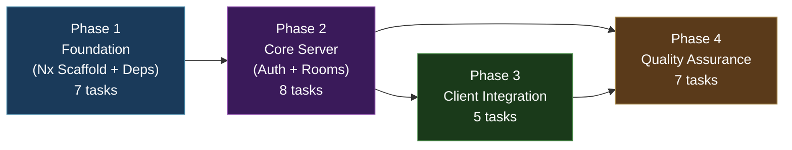
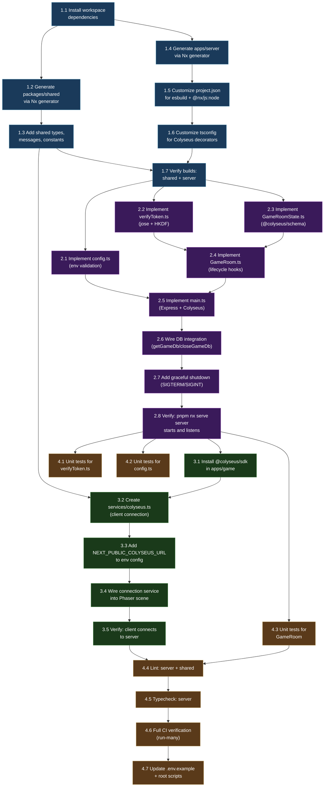

# Work Plan: Colyseus Game Server Implementation

Created Date: 2026-02-15
Completed Date: 2026-02-19
Status: COMPLETED
Type: feature
Estimated Duration: 3 days
Estimated Impact: 25+ files (2 modified, 23+ new)
Related Issue/PR: N/A

## Related Documents

- PRD: [docs/prd/prd-002-colyseus-game-server.md](../prd/prd-002-colyseus-game-server.md)
- ADR-003: [docs/adr/adr-003-colyseus-auth-bridge.md](../adr/adr-003-colyseus-auth-bridge.md)
- ADR-004: [docs/adr/adr-004-colyseus-build-tooling.md](../adr/adr-004-colyseus-build-tooling.md)
- Design Doc: [docs/design/design-003-colyseus-game-server.md](../design/design-003-colyseus-game-server.md)

## Objective

Add a Colyseus multiplayer game server to the Nx monorepo that provides authoritative real-time state synchronization, authenticates players via the existing NextAuth JWT (shared AUTH_SECRET), and enables the Phaser game client to establish WebSocket connections for multiplayer gameplay. This is the foundational server infrastructure for all multiplayer and AI agent features.

## Background

The Nookstead project has a Next.js 16 game client with Phaser.js 3 integration and social authentication (Google/Discord via NextAuth.js v5), but no game server. Without an authoritative server, no multiplayer interactions, NPC synchronization, or shared world state are possible. This plan implements the server foundation: Nx app scaffold, build tooling, authentication bridge, shared types, database wiring, and client connection layer.

The implementation follows a vertical slice (feature-driven) approach with bottom-up dependency ordering, as defined in the Design Doc. Each layer depends on the one below it (shared types -> build config -> server app -> auth bridge -> room logic -> client service).

## Phase Structure Diagram



## Task Dependency Diagram



## Risks and Countermeasures

### Technical Risks

- **Risk**: NextAuth v5 JWE format changes in beta updates break auth bridge decryption
  - **Impact**: High -- players cannot authenticate with the game server
  - **Detection**: Unit tests for `verifyNextAuthToken` fail after NextAuth update
  - **Countermeasure**: Pin `next-auth@5.0.0-beta.30`; unit tests for token decryption; ADR-003 documents kill criteria with fallback to Game-Token API route approach

- **Risk**: Colyseus `@colyseus/schema` decorators not preserved through esbuild bundling
  - **Impact**: High -- state serialization breaks at runtime despite successful build
  - **Detection**: Server crashes on first client connection with schema errors
  - **Countermeasure**: Test early in Phase 1 Task 1.7 with a minimal schema class build; esbuild preserves decorators by default (no transform step)

- **Risk**: esbuild bundling fails with native WebSocket modules (`bufferutil`, `utf-8-validate`)
  - **Impact**: Medium -- build fails or server crashes at runtime
  - **Detection**: Build error or runtime import error during Phase 1 Task 1.7
  - **Countermeasure**: Mark as `external` in esbuild config; `platform: "node"` auto-externalizes Node builtins

- **Risk**: `experimentalDecorators` + `useDefineForClassFields: false` conflicts with `tsconfig.base.json` strict settings
  - **Impact**: Medium -- TypeScript compilation errors in server project
  - **Detection**: `pnpm nx typecheck server` fails
  - **Countermeasure**: Server `tsconfig.json` overrides these specific settings; does not affect other projects since overrides are scoped

- **Risk**: CORS misconfiguration blocks WebSocket upgrade requests
  - **Impact**: Medium -- client cannot connect to server in development
  - **Detection**: Browser console shows CORS error during Phase 3 Task 3.5
  - **Countermeasure**: Test WebSocket connection early; document correct `CORS_ORIGIN` setup; Colyseus `@colyseus/ws-transport` may need explicit CORS config

- **Risk**: `@nx/js:node` watch mode instability (known Nx issue #32385)
  - **Impact**: Low -- developer needs manual restart occasionally
  - **Detection**: Server does not auto-restart after code changes
  - **Countermeasure**: Documented in ADR-004; fallback to manual restart; monitor Nx releases for fix

- **Risk**: ESM/CJS interop issues with `@nookstead/db` import in esbuild bundle
  - **Impact**: Medium -- server crashes at runtime when importing DB adapter
  - **Detection**: Runtime error on `getGameDb()` call during Phase 2 Task 2.6
  - **Countermeasure**: Use `format: ["esm"]` in esbuild config; add `createRequire` banner for CJS fallback; test DB import in Phase 2 Task 2.8

### Schedule Risks

- **Risk**: Nx generator output does not match expected structure and requires extensive customization
  - **Impact**: Phase 1 may take longer than estimated
  - **Countermeasure**: Nx generators produce well-documented scaffolds; customizations are documented in the Design Doc; can manually create files if generators produce incompatible structure

- **Risk**: Colyseus 0.17.x API differences from documentation
  - **Impact**: Implementation samples from Design Doc may need adjustments
  - **Countermeasure**: Verify against latest Colyseus docs during implementation; the Design Doc implementation samples are based on 0.17.x API

## Implementation Phases

### Phase 1: Foundation -- Nx Scaffold and Dependencies (Estimated commits: 3)

**Purpose**: Install all required dependencies, scaffold the `packages/shared` and `apps/server` projects using Nx generators, customize the build and TypeScript configuration for Colyseus, add shared type definitions, and verify both projects build successfully.

**Derives from**: Design Doc technical dependencies 1-2 (shared types, server scaffold and build config)
**ACs covered**: AC "Shared Types Package" (partial), AC "Server Startup" build (partial)

#### Tasks

- [ ] **Task 1.1**: Install workspace dependencies
  - **File(s)**: `package.json` (root)
  - **Description**: Install new devDependencies at the workspace root: `@nx/node@22.5.0`, `@nx/esbuild@22.5.0`. Install runtime dependencies: `colyseus`, `@colyseus/ws-transport`, `@colyseus/schema`, `@colyseus/sdk`, `express`, `@types/express`, `jose`, `@panva/hkdf`. Run `pnpm install` and verify no peer dependency conflicts.
  - **Commands**:
    ```bash
    pnpm add -D @nx/node@22.5.0 @nx/esbuild@22.5.0
    pnpm add colyseus @colyseus/ws-transport @colyseus/schema @colyseus/sdk express jose @panva/hkdf
    pnpm add -D @types/express
    ```
  - **Dependencies**: None (first task)
  - **Completion**: All packages appear in `package.json`; `pnpm install` exits 0

- [ ] **Task 1.2**: Generate `packages/shared` via Nx generator
  - **File(s)**: `packages/shared/` (new directory, multiple files)
  - **Description**: Run `pnpm nx g @nx/js:lib shared --directory=packages/shared` to scaffold the shared types library. After generation, customize `package.json` to set `"type": "module"`, add package name `@nookstead/shared`, add Nx tags `["scope:shared", "type:lib"]`, and set up exports map pointing to `./src/index.ts`. Remove any unnecessary generated files (e.g., default lib file). Ensure `tsconfig.json` extends `../../tsconfig.base.json`.
  - **Dependencies**: Task 1.1
  - **Completion**: `packages/shared/` exists with proper `package.json`, `tsconfig.json`, and barrel `src/index.ts`

- [ ] **Task 1.3**: Add shared types, messages, and constants
  - **File(s)**: `packages/shared/src/index.ts`, `packages/shared/src/types/room.ts` (new), `packages/shared/src/types/messages.ts` (new), `packages/shared/src/constants.ts` (new)
  - **Description**: Create type definitions per Design Doc contract definitions:
    - `types/room.ts`: `PlayerState` interface (x, y, name, userId, connected), `GameRoomState` interface, `AuthData` interface
    - `types/messages.ts`: `ClientMessage` and `ServerMessage` const objects, `MovePayload` interface
    - `constants.ts`: `COLYSEUS_PORT`, `TICK_RATE`, `TICK_INTERVAL_MS`, `PATCH_RATE_MS`, `ROOM_NAME`, `MAX_PLAYERS_PER_ROOM`
    - `index.ts`: Barrel re-export all modules
  - **Dependencies**: Task 1.2
  - **Completion**: All types and constants are exported from `@nookstead/shared`; TypeScript compilation succeeds

- [ ] **Task 1.4**: Generate `apps/server` via Nx generator
  - **File(s)**: `apps/server/` (new directory, multiple files)
  - **Description**: Run `pnpm nx g @nx/node:app server` to scaffold the Node.js server application. This generates `project.json`, `tsconfig.json`, `tsconfig.app.json`, `jest.config.ts`, `eslint.config.mjs`, `package.json`, and a default `src/main.ts`. The generated files will be customized in subsequent tasks.
  - **Dependencies**: Task 1.1
  - **Completion**: `apps/server/` exists with Nx project structure; `pnpm nx show project server` lists available targets

- [ ] **Task 1.5**: Customize `project.json` for esbuild build and @nx/js:node serve
  - **File(s)**: `apps/server/project.json` (modify)
  - **Description**: Replace or update the generated `project.json` to use:
    - **build target**: `@nx/esbuild:esbuild` executor with `platform: "node"`, `format: ["esm"]`, `bundle: true`, `thirdParty: true`, `external: ["bufferutil", "utf-8-validate"]`, `main: "apps/server/src/main.ts"`, `outputPath: "dist/apps/server"`, ESM output extension (`.mjs`), and `createRequire` banner per Design Doc
    - **serve target**: `@nx/js:node` executor with `buildTarget: "server:build"`, `watch: true`
    - **production configuration**: minification enabled
    - Add `tags: ["scope:server", "type:app"]`
  - **Dependencies**: Task 1.4
  - **Completion**: `project.json` matches Design Doc specification; `pnpm nx show project server --json` shows correct build/serve targets

- [ ] **Task 1.6**: Customize tsconfig for Colyseus decorators
  - **File(s)**: `apps/server/tsconfig.json` (modify), `apps/server/tsconfig.app.json` (modify)
  - **Description**: Update `tsconfig.json` to extend `../../tsconfig.base.json` and add Colyseus-required overrides: `"experimentalDecorators": true`, `"useDefineForClassFields": false`, `"esModuleInterop": true`, `"types": ["jest", "node"]`. Add project references for `packages/db` and `packages/shared`. Update `tsconfig.app.json` to extend `./tsconfig.json` with app-specific settings (exclude test files, set declaration output). Add `"type": "module"` to `apps/server/package.json` and add workspace dependencies (`@nookstead/db: "workspace:*"`, `@nookstead/shared: "workspace:*"`).
  - **Dependencies**: Task 1.5
  - **Completion**: TypeScript compilation recognizes decorators; `tsconfig.json` properly extends base config

- [ ] **Task 1.7**: Verify builds: `pnpm nx build shared` and `pnpm nx build server`
  - **File(s)**: No new files; verification only
  - **Description**: Create a minimal `apps/server/src/main.ts` that imports from `@nookstead/shared` (e.g., `import { COLYSEUS_PORT } from '@nookstead/shared'`) and logs the port. Run `pnpm nx build shared` (if applicable) and `pnpm nx build server`. Verify both complete with exit code 0 and the server bundle appears in `dist/apps/server`. Also verify that `@colyseus/schema` decorator metadata survives esbuild bundling by including a minimal schema class in the test build.
  - **Dependencies**: Task 1.3, Task 1.6
  - **Completion**: `pnpm nx build server` exits 0; `dist/apps/server/main.mjs` exists; shared type imports resolve

#### Phase Completion Criteria

- [ ] All dependencies installed (`colyseus`, `@colyseus/ws-transport`, `@colyseus/schema`, `@colyseus/sdk`, `express`, `jose`, `@panva/hkdf`, `@nx/node`, `@nx/esbuild`, `@types/express`)
- [ ] `packages/shared/` scaffolded via Nx generator with custom types, messages, and constants
- [ ] `apps/server/` scaffolded via Nx generator with esbuild build and @nx/js:node serve targets
- [ ] Server tsconfig has `experimentalDecorators: true` and `useDefineForClassFields: false`
- [ ] `pnpm nx build server` exits 0 with ESM bundle in `dist/apps/server`
- [ ] Shared package imports resolve in server build

#### Operational Verification Procedures

1. Run `pnpm nx show project server --json` and confirm `build` and `serve` targets exist with correct executors
2. Run `pnpm nx build server` and verify `dist/apps/server/main.mjs` is produced with exit code 0
3. Verify `@nookstead/shared` imports resolve: check that the built bundle contains shared constants
4. Run `pnpm nx show project shared --json` and confirm the shared library is recognized by Nx
5. Verify no regressions: `pnpm nx build game` still succeeds

---

### Phase 2: Core Server -- Auth Bridge and Game Rooms (Estimated commits: 3)

**Purpose**: Implement the core server logic: environment configuration validation, NextAuth JWT decryption (auth bridge), @colyseus/schema state definitions, GameRoom lifecycle hooks, Express + Colyseus server entry point, database integration, and graceful shutdown handling.

**Derives from**: Design Doc technical dependencies 3-5 (auth module, rooms, server main.ts)
**ACs covered**: AC "Server Startup and Configuration", AC "Authentication Bridge", AC "GameRoom State Management", AC "Database Integration"

#### Tasks

- [ ] **Task 2.1**: Implement `apps/server/src/config.ts` -- environment variable loading and validation
  - **File(s)**: `apps/server/src/config.ts` (new)
  - **Description**: Create the `ServerConfig` interface and `loadConfig()` function per Design Doc. Validate required env vars: `AUTH_SECRET` (throw descriptive error if missing), `DATABASE_URL` (throw descriptive error if missing). Parse optional env vars: `COLYSEUS_PORT` (default 2567), `CORS_ORIGIN` (default `http://localhost:3000`). Never log or expose `AUTH_SECRET` value.
  - **Dependencies**: Task 1.7 (server build verified)
  - **Completion**: `loadConfig()` returns `ServerConfig`; throws on missing required vars

- [ ] **Task 2.2**: Implement `apps/server/src/auth/verifyToken.ts` -- NextAuth JWE decryption
  - **File(s)**: `apps/server/src/auth/verifyToken.ts` (new)
  - **Description**: Implement per Design Doc and ADR-003:
    - `deriveEncryptionKey(secret, cookieName)`: HKDF key derivation using `@panva/hkdf` with `sha256`, secret = AUTH_SECRET, salt = cookie name, info = `Auth.js Generated Encryption Key (<cookie-name>)`, key length = 64 bytes
    - `verifyNextAuthToken(token, secret, isProduction?)`: Use `jose.jwtDecrypt` with derived key and 15s clock tolerance. Validate `userId` and `email` in payload. Return `TokenPayload` interface.
    - Export `TokenPayload` interface with fields: `userId`, `email`, `sub`, `name?`, `picture?`, `iat`, `exp`, `jti`
    - Handle both dev (`authjs.session-token`) and prod (`__Secure-authjs.session-token`) cookie names
  - **Dependencies**: Task 1.7 (server build verified; jose and @panva/hkdf installed)
  - **Completion**: `verifyNextAuthToken` correctly decrypts JWE tokens; throws on invalid/expired/missing tokens

- [ ] **Task 2.3**: Implement `apps/server/src/rooms/GameRoomState.ts` -- @colyseus/schema state
  - **File(s)**: `apps/server/src/rooms/GameRoomState.ts` (new)
  - **Description**: Create Colyseus schema classes per Design Doc:
    - `Player extends Schema`: `@type('string') userId`, `@type('number') x`, `@type('number') y`, `@type('string') name`, `@type('boolean') connected`
    - `GameRoomState extends Schema`: `@type({ map: Player }) players = new MapSchema<Player>()`
  - **Dependencies**: Task 1.7 (server build verified; @colyseus/schema installed; decorators enabled)
  - **Completion**: Schema classes compile with decorators; build succeeds

- [ ] **Task 2.4**: Implement `apps/server/src/rooms/GameRoom.ts` -- room lifecycle hooks
  - **File(s)**: `apps/server/src/rooms/GameRoom.ts` (new)
  - **Description**: Create `GameRoom extends Room<GameRoomState>` per Design Doc:
    - `static onAuth(token, options, context)`: Validate token presence, call `verifyNextAuthToken`, return `AuthData { userId, email }`
    - `onCreate()`: Set state, set patch rate (`PATCH_RATE_MS`), set simulation interval (`TICK_INTERVAL_MS`), register message handlers
    - `onJoin(client, options, auth)`: Create `Player` in state with userId, name (from email), default position (0,0)
    - `onLeave(client, consented)`: Remove player from state; log session/user IDs
    - `onDispose()`: Log room disposal
    - `handleMove(client, payload)`: Validate MovePayload, update player position
    - Import types and constants from `@nookstead/shared`
  - **Dependencies**: Task 2.2 (auth module), Task 2.3 (state schema)
  - **Completion**: GameRoom has all lifecycle hooks; compiles successfully

- [ ] **Task 2.5**: Implement `apps/server/src/main.ts` -- Express + Colyseus server setup
  - **File(s)**: `apps/server/src/main.ts` (replace placeholder from Phase 1)
  - **Description**: Create server entry point per Design Doc:
    - Import and call `loadConfig()`
    - Use `defineServer` from Colyseus with `WebSocketTransport` from `@colyseus/ws-transport`
    - Register `GameRoom` under `ROOM_NAME` constant using `defineRoom`
    - Set up Express middleware for CORS headers
    - Add `/health` endpoint returning `{ status: 'ok', uptime: process.uptime() }`
    - Call `server.listen(config.port)` with startup log
    - Configure `pingInterval: 10000` on transport
  - **Dependencies**: Task 2.1 (config), Task 2.4 (GameRoom)
  - **Completion**: `main.ts` wires all components; TypeScript compilation succeeds

- [ ] **Task 2.6**: Wire database integration via `@nookstead/db/adapters/colyseus`
  - **File(s)**: `apps/server/src/main.ts` (modify)
  - **Description**: Add `getGameDb()` import and call at server startup (after `loadConfig()`). Import `closeGameDb()` for use in shutdown handler. Log database connection initialization. This tests the ESM import from `@nookstead/db` (which uses `"type": "module"`) through the esbuild bundle.
  - **Dependencies**: Task 2.5 (main.ts exists)
  - **Completion**: `getGameDb()` called on startup; `closeGameDb` imported for shutdown

- [ ] **Task 2.7**: Add graceful shutdown handling (SIGTERM/SIGINT)
  - **File(s)**: `apps/server/src/main.ts` (modify)
  - **Description**: Add process signal handlers per Design Doc:
    - `process.on('SIGTERM', shutdown)` and `process.on('SIGINT', shutdown)`
    - `shutdown` function: log initiation, call `await closeGameDb()`, log completion, `process.exit(0)`
  - **Dependencies**: Task 2.6 (DB integration wired)
  - **Completion**: Server handles SIGTERM/SIGINT gracefully; closes DB connections before exit

- [ ] **Task 2.8**: Verify: `pnpm nx serve server` starts and accepts connections
  - **File(s)**: No new files; verification only
  - **Description**: Set required environment variables (`AUTH_SECRET`, `DATABASE_URL`) in `apps/server/.env` (not committed). Run `pnpm nx serve server`. Verify:
    1. Server logs "Colyseus server listening on port 2567"
    2. `GET http://localhost:2567/health` returns `{ status: "ok" }`
    3. Server auto-restarts on source file change (watch mode)
    4. `Ctrl+C` triggers graceful shutdown logs
  - **Dependencies**: Task 2.7
  - **Completion**: Server starts, serves health endpoint, watch mode works, shutdown is graceful

#### Phase Completion Criteria

- [ ] `config.ts` validates required env vars and returns `ServerConfig`
- [ ] `verifyToken.ts` decrypts NextAuth JWE tokens via jose + HKDF with correct parameters
- [ ] `GameRoomState.ts` defines Player and GameRoomState @colyseus/schema classes
- [ ] `GameRoom.ts` implements onAuth, onCreate, onJoin, onLeave, onDispose, handleMove
- [ ] `main.ts` wires Express, Colyseus, rooms, DB, CORS, health check, and shutdown
- [ ] `pnpm nx serve server` starts and listens on port 2567
- [ ] `/health` endpoint returns valid JSON response
- [ ] Server handles SIGTERM/SIGINT with graceful shutdown

#### Operational Verification Procedures

**Integration Point 1: Server Startup**
1. Set `AUTH_SECRET` and `DATABASE_URL` in environment
2. Run `pnpm nx serve server`
3. Confirm log: `[server] Colyseus server listening on port 2567`
4. Confirm log: `[server] Database connection initialized`

**Integration Point 2: Health Check**
1. With server running, execute `curl http://localhost:2567/health`
2. Confirm response: `{ "status": "ok", "uptime": <number> }`

**Integration Point 3: Watch Mode**
1. With server running via `pnpm nx serve server`
2. Modify a source file (e.g., add a comment to `config.ts`)
3. Confirm server automatically rebuilds and restarts within 5 seconds

**Integration Point 4: Graceful Shutdown**
1. With server running, press `Ctrl+C`
2. Confirm logs: `[server] Shutting down gracefully...` followed by `[server] Database connections closed`
3. Confirm process exits with code 0

---

### Phase 3: Client Integration (Estimated commits: 2)

**Purpose**: Install the Colyseus client SDK in the game app, create the connection service for Phaser, configure environment variables, and verify end-to-end client-server connectivity.

**Derives from**: Design Doc technical dependency 6 (client connection service)
**ACs covered**: AC "Client Connection"

#### Tasks

- [x] **Task 3.1**: Install `@colyseus/sdk` in `apps/game`
  - **File(s)**: `apps/game/package.json` (modify)
  - **Description**: Add `@colyseus/sdk` as a dependency of the game app. Also add `@nookstead/shared` as a workspace dependency (`"workspace:*"`). Run `pnpm install`. Verify game build still succeeds after adding new dependencies.
  - **Dependencies**: Task 2.8 (server running and verified)
  - **Completion**: `@colyseus/sdk` and `@nookstead/shared` in `apps/game/package.json`; `pnpm nx build game` succeeds

- [x] **Task 3.2**: Create `apps/game/src/services/colyseus.ts` -- client connection service
  - **File(s)**: `apps/game/src/services/colyseus.ts` (new)
  - **Description**: Implement per Design Doc:
    - `getSessionToken()`: Extract `authjs.session-token` or `__Secure-authjs.session-token` from `document.cookie`
    - `getClient()`: Singleton Colyseus `Client` using `NEXT_PUBLIC_COLYSEUS_URL` env var (default `ws://localhost:2567`)
    - `joinGameRoom()`: Extract token, call `client.joinOrCreate(ROOM_NAME, { token })`, return Room instance
    - `leaveGameRoom(consented?)`: Leave current room and clean up
    - `getRoom()`: Return current room instance (null if not connected)
    - `disconnect()`: Full cleanup of room and client
    - Import types from `@nookstead/shared`
  - **Dependencies**: Task 3.1 (SDK installed), Task 1.3 (shared types exist)
  - **Completion**: Connection service exports all functions; TypeScript compilation succeeds

- [x] **Task 3.3**: Add `NEXT_PUBLIC_COLYSEUS_URL` to environment config
  - **File(s)**: `apps/server/.env.example` (new), root `.env.example` (modify)
  - **Description**: Create `apps/server/.env.example` documenting all server env vars: `AUTH_SECRET`, `DATABASE_URL`, `COLYSEUS_PORT`, `CORS_ORIGIN`. Update root `.env.example` to add `NEXT_PUBLIC_COLYSEUS_URL=ws://localhost:2567` and `COLYSEUS_PORT=2567`, `CORS_ORIGIN=http://localhost:3000`.
  - **Dependencies**: Task 3.2
  - **Completion**: Both `.env.example` files document all required variables

- [ ] **Task 3.4**: Wire connection service into Phaser scene integration point
  - **File(s)**: Documentation/comments only (no production code change to scenes)
  - **Description**: Add a JSDoc comment to the connection service explaining how to integrate with Phaser scenes (e.g., call `joinGameRoom()` from `Game.ts` scene `create()` method). The actual wiring into the Phaser scene is outside the scope of this plan (it depends on gameplay features not yet implemented). The connection service is designed as a standalone module that Phaser scenes can import when ready.
  - **Dependencies**: Task 3.3
  - **Completion**: Connection service has integration documentation; Phaser scene import pattern documented

- [ ] **Task 3.5**: Verify: client connects to server with authenticated WebSocket
  - **File(s)**: No new files; manual verification only
  - **Description**: Manual E2E verification:
    1. Start server: `pnpm nx serve server`
    2. Start client: `pnpm nx dev game`
    3. Log in via Google/Discord OAuth
    4. Open browser console
    5. Import and call `joinGameRoom()` from the connection service
    6. Verify WebSocket connection established (no error)
    7. Verify server logs: `[GameRoom] Player joined: sessionId=..., userId=...`
    8. Call `leaveGameRoom()` and verify server logs player left
  - **Dependencies**: Task 3.4
  - **Completion**: Client successfully connects and authenticates; player appears in room state

#### Phase Completion Criteria

- [ ] `@colyseus/sdk` installed in `apps/game`
- [ ] `@nookstead/shared` added as workspace dependency in game app
- [ ] Connection service (`services/colyseus.ts`) exports `getClient`, `joinGameRoom`, `leaveGameRoom`, `getRoom`, `disconnect`
- [ ] `NEXT_PUBLIC_COLYSEUS_URL` documented in `.env.example`
- [ ] Game build succeeds after adding new dependencies (`pnpm nx build game`)
- [ ] Manual verification: client connects to server with valid session token

#### Operational Verification Procedures

**Integration Point: Client -> Server (E2E)**
1. Start server: `pnpm nx serve server` (port 2567)
2. Start client: `pnpm nx dev game` (port 3000)
3. Log in with OAuth credentials
4. Open browser DevTools console
5. Execute: `import { joinGameRoom } from '@/services/colyseus'; const room = await joinGameRoom();`
6. Verify no console errors; WebSocket connection visible in Network tab
7. Verify server terminal logs player join with sessionId and userId
8. In a second browser tab, repeat login and join
9. Verify server shows 2 players in room
10. Execute `leaveGameRoom()` in one tab; verify server logs player leave and remaining player count

---

### Phase 4: Quality Assurance (Estimated commits: 2)

**Purpose**: Add comprehensive unit tests, verify lint/typecheck/build across all projects, ensure full CI pipeline passes, and update documentation and scripts.

**ACs verified**: All Design Doc acceptance criteria

#### Tasks

- [x] **Task 4.1**: Unit tests for `verifyToken.ts`
  - **File(s)**: `apps/server/src/auth/verifyToken.spec.ts` (new)
  - **Description**: Test cases per Design Doc test strategy:
    - Valid token decode: mock jose `jwtDecrypt` to return payload with userId and email; assert `TokenPayload` returned correctly
    - Missing userId: mock payload without userId; assert throws "Token payload missing userId"
    - Missing email: mock payload without email; assert throws "Token payload missing email"
    - Expired token: mock jose to throw `JWTExpired`; assert error propagates
    - Invalid token format: mock jose to throw `JWEDecryptionFailed`; assert error propagates
    - Wrong secret: mock HKDF and jose to fail decryption; assert error propagates
    - Production cookie name: verify `isProduction=true` uses `__Secure-authjs.session-token`
  - **Dependencies**: Task 2.8 (server implementation complete)
  - **Completion**: All test cases pass; `pnpm nx test server --testFile=src/auth/verifyToken.spec.ts` exits 0

- [x] **Task 4.2**: Unit tests for `config.ts`
  - **File(s)**: `apps/server/src/config.spec.ts` (new)
  - **Description**: Test cases per Design Doc test strategy:
    - Missing AUTH_SECRET: assert throws descriptive error
    - Missing DATABASE_URL: assert throws descriptive error
    - Default port: no COLYSEUS_PORT env; assert returns 2567
    - Custom port: COLYSEUS_PORT=3000; assert returns 3000
    - Default CORS origin: no CORS_ORIGIN env; assert returns `http://localhost:3000`
    - Custom CORS origin: CORS_ORIGIN set; assert returns configured value
  - **Dependencies**: Task 2.8 (server implementation complete)
  - **Completion**: All test cases pass; `pnpm nx test server --testFile=src/config.spec.ts` exits 0

- [x] **Task 4.3**: Unit tests for GameRoom
  - **File(s)**: `apps/server/src/rooms/GameRoom.spec.ts` (new)
  - **Description**: Test cases per Design Doc test strategy:
    - Player join: mock client and auth data; assert player added to state.players with correct fields (userId, x=0, y=0, name, connected=true)
    - Player leave: set up connected player; call onLeave; assert player removed from state
    - Valid move message: send MOVE with `{ x: 10, y: 20 }`; assert player position updated
    - Invalid move message: send MOVE with `{ x: "abc" }`; assert state unchanged, warning logged
    - Auth rejection (no token): call onAuth with empty string; assert throws
    - Note: Mocking Colyseus Room internals -- may need to instantiate a mock Room or use Colyseus test utilities
  - **Dependencies**: Task 2.8 (server implementation complete)
  - **Completion**: All test cases pass; `pnpm nx test server --testFile=src/rooms/GameRoom.spec.ts` exits 0

- [ ] **Task 4.4**: Verify lint passes: `pnpm nx lint server` and `pnpm nx lint shared`
  - **File(s)**: `apps/server/eslint.config.mjs` (verify/fix), `packages/shared/eslint.config.mjs` (verify/fix)
  - **Description**: Run ESLint on both new projects. Fix any lint errors or warnings. Verify both pass with zero errors. If the shared package lacks an `eslint.config.mjs`, create one extending the root config.
  - **Dependencies**: Task 4.3, Task 3.5
  - **Completion**: `pnpm nx lint server` and `pnpm nx lint shared` both exit 0

- [ ] **Task 4.5**: Verify typecheck passes: `pnpm nx typecheck server`
  - **File(s)**: No new files; may fix type errors
  - **Description**: Run TypeScript type checking on the server project. Fix any type errors. Verify exit code 0.
  - **Dependencies**: Task 4.4
  - **Completion**: `pnpm nx typecheck server` exits 0

- [ ] **Task 4.6**: Full CI verification: `pnpm nx run-many -t lint test build typecheck`
  - **File(s)**: No new files; fix any regressions
  - **Description**: Run the full CI command across all projects. Verify that adding the server and shared packages does not break any existing targets (game lint, game test, game build, game typecheck, game-e2e e2e). All targets must pass with zero errors.
  - **Dependencies**: Task 4.5
  - **Completion**: `pnpm nx run-many -t lint test build typecheck` exits 0 for all projects

- [ ] **Task 4.7**: Update `.env.example` files and root `package.json` scripts
  - **File(s)**: `package.json` (root, modify), `apps/server/.env.example` (verify), root `.env.example` (modify)
  - **Description**:
    - Add convenience scripts to root `package.json`: `"dev:server": "nx serve server"`, `"dev:all": "nx run-many -t dev serve --projects=game,server"` (or similar parallel command)
    - Verify `apps/server/.env.example` documents: `AUTH_SECRET`, `DATABASE_URL`, `COLYSEUS_PORT`, `CORS_ORIGIN`
    - Verify root `.env.example` includes: `NEXT_PUBLIC_COLYSEUS_URL`, `COLYSEUS_PORT`, `CORS_ORIGIN`
  - **Dependencies**: Task 4.6
  - **Completion**: Scripts added; env examples are complete and accurate

#### Phase Completion Criteria

- [ ] All unit tests pass (`pnpm nx test server` exits 0)
- [ ] Lint passes for server and shared (`pnpm nx lint server`, `pnpm nx lint shared` exit 0)
- [ ] TypeScript type checking passes (`pnpm nx typecheck server` exits 0)
- [ ] Full CI pipeline passes (`pnpm nx run-many -t lint test build typecheck` exits 0)
- [ ] No regressions in existing projects (game, game-e2e, db)
- [ ] `.env.example` files document all required environment variables
- [ ] Root `package.json` has `dev:server` and `dev:all` convenience scripts

#### Operational Verification Procedures

**Full CI Verification**
1. Run `pnpm nx run-many -t lint test build typecheck` and confirm all targets pass
2. Verify `pnpm nx test server` runs all unit tests with zero failures
3. Verify `pnpm nx lint server` and `pnpm nx lint shared` produce zero errors

**Acceptance Criteria Verification Checklist**

| AC | Verification | Status |
|---|---|---|
| Server starts on port 2567 | `pnpm nx serve server` logs listening message | [ ] |
| Build produces ESM bundle | `pnpm nx build server` -> `dist/apps/server/main.mjs` exists | [ ] |
| Missing AUTH_SECRET throws | Start server without AUTH_SECRET -> descriptive error | [ ] |
| Missing DATABASE_URL throws | Start server without DATABASE_URL -> descriptive error | [ ] |
| Valid token accepted | Unit test: mock JWE -> userId extracted | [ ] |
| Invalid token rejected | Unit test: bad token -> connection rejected | [ ] |
| No token rejected | Unit test: empty string -> throws | [ ] |
| Player join adds to state | Unit test: onJoin -> player in state.players | [ ] |
| Player leave removes from state | Unit test: onLeave -> player removed | [ ] |
| 10 ticks/sec simulation | onCreate sets `setSimulationInterval` at 100ms | [ ] |
| Shared types compile | `pnpm nx typecheck server` and `pnpm nx typecheck game` pass | [ ] |
| DB initialized on startup | Server startup log: "Database connection initialized" | [ ] |
| DB closed on shutdown | SIGTERM -> "Database connections closed" log | [ ] |
| CORS allows localhost:3000 | Client on :3000 connects to :2567 WebSocket | [ ] |
| Client connection service works | Manual E2E: browser connects with token | [ ] |
| All CI targets pass | `pnpm nx run-many -t lint test build typecheck` exits 0 | [ ] |

---

## Completion Criteria

- [ ] All 4 phases completed
- [ ] Each phase's operational verification procedures executed
- [ ] Design Doc acceptance criteria satisfied (all ACs in Server Startup, Auth Bridge, GameRoom, Client Connection, Shared Types, DB Integration, CORS sections)
- [ ] All quality checks pass (lint, typecheck, build, test -- zero errors)
- [ ] All unit tests pass with meaningful coverage of auth, config, and room logic
- [ ] No regressions in existing projects (game, game-e2e, db)
- [ ] Manual E2E verification: authenticated client connects to game server

## File Summary

### New Files (23+)

| File | Phase | Description |
|------|-------|-------------|
| `packages/shared/package.json` | 1 | Shared types package config (ESM, Nx tags) |
| `packages/shared/tsconfig.json` | 1 | TypeScript config extending base |
| `packages/shared/src/index.ts` | 1 | Barrel export for all shared modules |
| `packages/shared/src/types/room.ts` | 1 | PlayerState, GameRoomState, AuthData interfaces |
| `packages/shared/src/types/messages.ts` | 1 | ClientMessage, ServerMessage, MovePayload types |
| `packages/shared/src/constants.ts` | 1 | COLYSEUS_PORT, TICK_RATE, ROOM_NAME, etc. |
| `packages/shared/eslint.config.mjs` | 1 | ESLint config extending root |
| `apps/server/project.json` | 1 | Nx targets: esbuild build, @nx/js:node serve |
| `apps/server/package.json` | 1 | Server package config (ESM, workspace deps) |
| `apps/server/tsconfig.json` | 1 | TypeScript config with decorator overrides |
| `apps/server/tsconfig.app.json` | 1 | App-specific TypeScript config |
| `apps/server/jest.config.ts` | 1 | Jest config for server tests |
| `apps/server/eslint.config.mjs` | 1 | ESLint flat config extending root |
| `apps/server/src/main.ts` | 1, 2 | Server entry point (Express + Colyseus) |
| `apps/server/src/config.ts` | 2 | Environment variable validation |
| `apps/server/src/auth/verifyToken.ts` | 2 | JWE token decryption (jose + HKDF) |
| `apps/server/src/rooms/GameRoomState.ts` | 2 | @colyseus/schema Player + GameRoomState |
| `apps/server/src/rooms/GameRoom.ts` | 2 | Room lifecycle: onAuth, onJoin, onLeave |
| `apps/server/.env.example` | 3 | Server environment variable documentation |
| `apps/game/src/services/colyseus.ts` | 3 | Client connection service |
| `apps/server/src/auth/verifyToken.spec.ts` | 4 | Auth verification unit tests |
| `apps/server/src/config.spec.ts` | 4 | Config loading unit tests |
| `apps/server/src/rooms/GameRoom.spec.ts` | 4 | GameRoom lifecycle unit tests |

### Modified Files (2-3)

| File | Phase | Description |
|------|-------|-------------|
| `package.json` (root) | 1, 4 | Add Colyseus/esbuild/jose dependencies; add dev scripts |
| `apps/game/package.json` | 3 | Add @colyseus/sdk, @nookstead/shared dependencies |
| `.env.example` (root) | 3 | Add COLYSEUS_PORT, CORS_ORIGIN, NEXT_PUBLIC_COLYSEUS_URL |

### Generated Files (via Nx generators, then customized)

| Generator Command | Produces | Customization |
|---|---|---|
| `pnpm nx g @nx/js:lib shared --directory=packages/shared` | `packages/shared/` scaffold | ESM package.json, custom types, barrel exports |
| `pnpm nx g @nx/node:app server` | `apps/server/` scaffold | esbuild project.json, decorator tsconfig, Colyseus source files |

## Progress Tracking

### Phase 1: Foundation -- Nx Scaffold and Dependencies
- Start:
- Complete:
- Notes:

### Phase 2: Core Server -- Auth Bridge and Game Rooms
- Start:
- Complete:
- Notes:

### Phase 3: Client Integration
- Start:
- Complete:
- Notes:

### Phase 4: Quality Assurance
- Start:
- Complete:
- Notes:

## Notes

- **Nx generators are mandatory**: Both `apps/server` and `packages/shared` MUST be created using Nx generators (`pnpm nx g @nx/node:app server` and `pnpm nx g @nx/js:lib shared --directory=packages/shared`), not manually. The generators produce proper Nx project structure with build targets, tsconfig files, jest config, and eslint config. After generation, customize the generated files for project-specific needs.
- **Colyseus version**: 0.17.x is the target version. The Design Doc implementation samples use the `defineServer`/`defineRoom` APIs. Verify these match the installed version.
- **ESM-first**: Both `apps/server` and `packages/shared` use `"type": "module"` in their `package.json`. The esbuild output format is ESM (`.mjs` extension) to align with `packages/db`.
- **Auth HKDF parameters**: The salt is the cookie name (`authjs.session-token` for dev, `__Secure-authjs.session-token` for production), the info string is `Auth.js Generated Encryption Key (<cookie-name>)`, and the key length is 64 bytes. These must match exactly what Auth.js v5 uses internally.
- **Decorator requirements**: @colyseus/schema requires `experimentalDecorators: true` and `useDefineForClassFields: false` in tsconfig. These are set only in the server project and do not affect other projects.
- **Beta dependency pinning**: `next-auth@5.0.0-beta.30` is pinned in the root `package.json`. Do not update without reviewing ADR-003 kill criteria.
- **Parallel work potential**: Within Phase 1, Tasks 1.2 and 1.4 can run in parallel after Task 1.1 (they scaffold different projects). Within Phase 2, Tasks 2.1, 2.2, and 2.3 can run in parallel after Phase 1 completes (they are independent server modules).
- **No E2E test automation**: The full connection flow (browser -> WebSocket -> auth -> room) is verified manually in Phase 3 Task 3.5. Automated E2E tests for WebSocket connections are outside the scope of this plan.
- **Database**: The `@nookstead/db/adapters/colyseus` adapter already exists and provides `getGameDb()`/`closeGameDb()` with a 20-connection pool. No database schema changes are needed.
