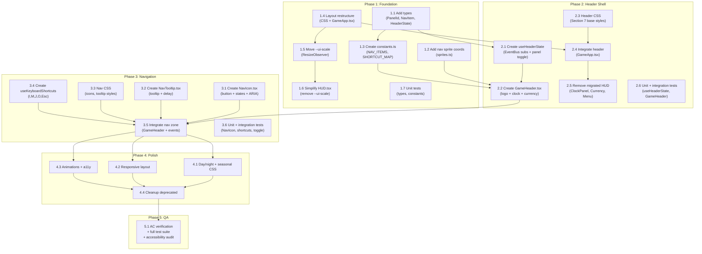

# Work Plan: Game Header and Navigation Implementation

Created Date: 2026-02-15
Type: feature
Estimated Duration: 5-7 days
Estimated Impact: 14 files (6 new, 5 modified, 3 deprecated)
Related Issue/PR: N/A

## Related Documents

- Design Doc: [docs/design/design-003-game-header-navigation.md](../design/design-003-game-header-navigation.md)
- ADR: [docs/adr/adr-003-game-header-layout-architecture.md](../adr/adr-003-game-header-layout-architecture.md)
- PRD: [docs/prd/prd-002-game-header-navigation.md](../prd/prd-002-game-header-navigation.md)

## Objective

Introduce a persistent game header bar that consolidates existing scattered HUD elements (ClockPanel, CurrencyDisplay, MenuButton) into a unified strip at the top of the game screen, adds the Nookstead text logo, and provides five icon-based navigation buttons (Inventory, Map, Quests, Social, Settings) with keyboard shortcut support. This requires restructuring the game layout from a single full-viewport container to a vertical flexbox (fixed-height header + flex-grow canvas area) per ADR-003.

## Background

The current HUD uses absolutely positioned overlays on the full-viewport Phaser canvas: ClockPanel floats top-left, CurrencyDisplay floats top-right, and MenuButton sits bottom-right. There is no brand presence during gameplay, no visible navigation to game systems, and no persistent way for players to discover available features. The header consolidates status, navigation, and brand into one predictable horizontal strip while restructuring the layout to give Phaser accurate container dimensions.

## Risks and Countermeasures

### Technical Risks

- **Risk**: Phaser canvas receives zero-height container on first frame before flexbox layout resolves
  - **Impact**: High (blank canvas or visual glitch on load)
  - **Probability**: Low
  - **Countermeasure**: Use ResizeObserver callback to confirm non-zero dimensions before rendering dependent components. Add `requestAnimationFrame` guard if needed. Validate in Phase 1 operational verification.
  - **Detection**: Visual inspection on game load; E2E test for canvas rendering

- **Risk**: Keyboard shortcuts conflict with Phaser input handling (double-processing)
  - **Impact**: Medium (game actions triggered unintentionally)
  - **Probability**: Medium
  - **Countermeasure**: Use `e.preventDefault()` in the React handler. Verify Phaser's input system does not listen for the same keys (I, M, J, O). Test both systems active simultaneously.
  - **Detection**: Manual testing in Phase 3; unit tests for shortcut isolation

- **Risk**: `--ui-scale` regression in existing HUD elements when switching from window to container dimensions
  - **Impact**: Medium (EnergyBar, Hotbar sizing incorrect)
  - **Probability**: Low
  - **Countermeasure**: Container dimensions are very close to window dimensions minus header height. Test all HUD elements at each `--ui-scale` tier (2-6) after migration.
  - **Detection**: Visual regression at multiple viewports in Phase 1 verification

- **Risk**: Nav icon sprites not found at expected coordinates in hud_32.png
  - **Impact**: Low (visual quality reduction, not functional)
  - **Probability**: Medium
  - **Countermeasure**: Implement text-only fallback labels. Mark `spriteKey` as optional in NavItem interface. Verify coordinates at 1:1 zoom before implementation.
  - **Detection**: Visual inspection during Phase 2 implementation

- **Risk**: Header height exceeds 10% viewport on small mobile screens
  - **Impact**: Medium (reduced playable area)
  - **Probability**: Medium
  - **Countermeasure**: Enforce `max-height: 10vh` on `.game-header`. Test at 375x667 (iPhone SE) and 360x640 (Android small).
  - **Detection**: Responsive layout testing in Phase 4 verification

### Schedule Risks

- **Risk**: Sprite coordinate verification delays Phase 2
  - **Impact**: Low (1-2 hour delay)
  - **Countermeasure**: Text fallback labels allow proceeding without verified sprite coordinates; coordinates can be updated later
- **Risk**: EventBus dual-subscription testing reveals timing issues
  - **Impact**: Low (EventBus is synchronous)
  - **Countermeasure**: EventBus uses Phaser.Events.EventEmitter which is synchronous; both subscribers receive events in registration order

## Phase Structure Diagram

```mermaid
graph TD
    P1["Phase 1: Foundation<br/>Layout Restructure + Types + Constants<br/>(Est. 3 commits)"]
    P2["Phase 2: Header Shell<br/>GameHeader + Clock/Currency Migration<br/>(Est. 3 commits)"]
    P3["Phase 3: Navigation + Shortcuts<br/>NavIcon + NavTooltip + Keyboard Hooks<br/>(Est. 3 commits)"]
    P4["Phase 4: Visual Polish + Cleanup<br/>Animations + Responsive + Deprecation<br/>(Est. 2 commits)"]
    P5["Phase 5: Quality Assurance<br/>All ACs + Tests + Accessibility<br/>(Est. 1 commit)"]

    P1 --> P2
    P2 --> P3
    P3 --> P4
    P4 --> P5

    style P1 fill:#1a3a5c,stroke:#4a8adc
    style P2 fill:#1a3a5c,stroke:#4a8adc
    style P3 fill:#1a3a5c,stroke:#4a8adc
    style P4 fill:#1a3a5c,stroke:#4a8adc
    style P5 fill:#3a1a1a,stroke:#dc4a4a
```

## Task Dependency Diagram

## Implementation Phases

### Phase 1: Foundation - Layout Restructure, Types, and Constants (Estimated commits: 3)

**Purpose**: Establish the type system, sprite data, navigation constants, and restructure the game layout from full-viewport to vertical flexbox. This phase is the foundation that all subsequent phases depend on.

**Implementation Approach**: Horizontal (foundation-driven) -- type definitions and layout restructure must be in place before any header components are created.

#### Tasks

- [ ] **Task 1.1**: Add type definitions to `apps/game/src/components/hud/types.ts`
  - Add `PanelId` union type (`'inventory' | 'map' | 'quests' | 'social' | 'settings'`)
  - Add `NavItem` interface (id, label, tooltipLabel, shortcut, ariaLabel, spriteKey, eventName)
  - Add `HeaderState` interface (day, time, season, gold, activePanel)
  - Add `DEFAULT_HEADER_STATE` constant
  - **AC Coverage**: Prerequisite for AC-5.1, AC-5.2, AC-5.5
  - **Completion**: Types compile without errors; no changes to existing type exports

- [ ] **Task 1.2**: Add nav icon sprite coordinates to `apps/game/src/components/hud/sprites.ts`
  - Add `navInventory`, `navMap`, `navQuests`, `navSocial`, `navSettings` entries to SPRITES object
  - Coordinates are TBD pending 1:1 zoom verification; use best estimates or placeholder values
  - **AC Coverage**: AC-5.1 support (nav icon rendering)
  - **Completion**: SPRITES object contains all five nav icon entries; existing sprites unchanged

- [ ] **Task 1.3**: Create `apps/game/src/components/header/constants.ts`
  - Define `NAV_ITEMS` array of `NavItem` objects (5 items: Inventory, Map, Quests, Social, Settings)
  - Define `SHORTCUT_MAP` record (`KeyI -> 'inventory'`, `KeyM -> 'map'`, `KeyJ -> 'quests'`, `KeyO -> 'social'`)
  - Define `HEADER_HEIGHT_BASE` constant (16px)
  - **AC Coverage**: AC-5.1 (five navigation items in order), AC-7.1-7.4 (shortcut mapping)
  - **Completion**: Constants export correctly; NAV_ITEMS has 5 items with all required fields

- [ ] **Task 1.4**: Restructure layout in CSS and GameApp.tsx
  - Modify `.game-app` in `global.css` Section 4: change from `position: relative` to `display: flex; flex-direction: column`
  - Add `.game-canvas-area` CSS class (`flex: 1; position: relative; min-height: 0; overflow: hidden`)
  - Modify `GameApp.tsx`: wrap PhaserGame and HUD inside `.game-canvas-area` div
  - Add `canvasAreaRef` to `.game-canvas-area` div
  - **AC Coverage**: AC-6.1 (flexbox layout), AC-6.2 (canvas renders correctly), AC-6.3 (HUD relative to canvas area)
  - **Completion**: Game page renders with flexbox layout; Phaser canvas fills canvas area; HUD overlay scoped to canvas area

- [ ] **Task 1.5**: Move `--ui-scale` computation to ResizeObserver on canvas area
  - Add `ResizeObserver` in `GameApp.tsx` watching `.game-canvas-area` element
  - Compute `uiScale` from container dimensions (scaleX = floor(width/480), scaleY = floor(height/270), clamped 2-6)
  - Set `--ui-scale` as CSS custom property on `.game-canvas-area` element
  - Store `uiScale` in state for passing to future header component
  - **AC Coverage**: AC-6.4 (--ui-scale from container dimensions)
  - **Completion**: --ui-scale updates correctly on window resize; value matches expected integer (2-6)

- [ ] **Task 1.6**: Simplify HUD.tsx - remove `--ui-scale` computation
  - Remove the `useEffect` that computes `--ui-scale` from `window.innerWidth`/`window.innerHeight`
  - Remove the `uiScale` state from HUD.tsx
  - HUD now reads `--ui-scale` from the parent `.game-canvas-area` CSS custom property (inherited)
  - Remove `style={{ '--ui-scale': uiScale }}` from the `.hud` div (inherits from parent)
  - **AC Coverage**: AC-6.4 support (single source of truth for --ui-scale)
  - **Completion**: HUD.tsx no longer contains --ui-scale computation; EnergyBar and Hotbar render at correct scale

- [ ] **Task 1.7**: Unit tests for types and constants
  - Test `NAV_ITEMS` has exactly 5 items
  - Test each `NavItem` has all required fields (id, label, tooltipLabel, shortcut, ariaLabel, spriteKey, eventName)
  - Test `SHORTCUT_MAP` maps correct keys to correct PanelId values
  - Test `DEFAULT_HEADER_STATE` has correct default values
  - **AC Coverage**: AC-5.1 (five items verification)
  - **Completion**: All tests pass; typecheck passes

- [ ] Quality check: `pnpm nx lint game && pnpm nx typecheck game`

#### Phase Completion Criteria

- [ ] `.game-app` uses flexbox column layout
- [ ] `.game-canvas-area` wraps game-container and HUD overlay
- [ ] Phaser canvas renders correctly in reduced container (no cropping, no overflow)
- [ ] HUD overlay (EnergyBar, Hotbar) positioned within canvas area
- [ ] `--ui-scale` computed from canvas area container via ResizeObserver
- [ ] HUD.tsx no longer has its own --ui-scale computation
- [ ] All new types and constants compile without errors
- [ ] Unit tests for constants and types pass
- [ ] `pnpm nx lint game` passes
- [ ] `pnpm nx typecheck game` passes
- [ ] `pnpm nx build game` succeeds

#### Operational Verification Procedures

1. Run `pnpm nx dev game` and load the game page at `http://localhost:3000/game`
2. **Canvas rendering**: Verify the Phaser canvas fills the area below where the header will be placed (currently full viewport since header is not yet added). The canvas should not have overflow or cropping.
3. **HUD overlay**: Verify EnergyBar appears at its expected position within the canvas area. Verify Hotbar appears at the bottom center within the canvas area.
4. **Resize behavior**: Resize the browser window to several sizes (960x540, 1440x810, 1920x1080). Verify the canvas resizes smoothly and the HUD elements maintain correct positioning.
5. **--ui-scale**: Inspect the `.game-canvas-area` element in DevTools. Verify the `--ui-scale` CSS custom property updates to correct integer values as the window resizes (e.g., 2 at small viewports, 3-4 at medium, 5-6 at large).
6. **Build**: Run `pnpm nx build game` and verify it completes without errors.

---

### Phase 2: Header Shell and Data Migration (Estimated commits: 3)

**Purpose**: Create the GameHeader component with logo, clock, and currency zones. Migrate clock and currency data display from HUD components into the header. Remove ClockPanel, CurrencyDisplay, and MenuButton from HUD.tsx.

**Implementation Approach**: Vertical slice -- delivers visible header with live data updates.

#### Tasks

- [ ] **Task 2.1**: Create `apps/game/src/components/header/useHeaderState.ts`
  - `'use client'` directive
  - Subscribe to EventBus `hud:time` event (updates day, time, season in HeaderState)
  - Subscribe to EventBus `hud:gold` event (updates gold in HeaderState)
  - Implement `togglePanel(panelId: PanelId)` function:
    - If `activePanel === panelId`: set to null, emit `hud:close-panel`
    - If `activePanel !== panelId`: emit `hud:close-panel` (if previous non-null), set to panelId, emit `hud:open-panel:{panelId}`
  - Implement `closePanel()` function: set activePanel to null, emit `hud:close-panel`
  - Return `{ state: HeaderState, togglePanel, closePanel }`
  - Memoize togglePanel and closePanel with `useCallback`
  - Clean up EventBus subscriptions on unmount
  - **AC Coverage**: AC-3.1 (clock updates), AC-4.1 (currency updates), AC-5.2 (panel open), AC-5.3 (panel toggle), AC-5.4 (panel switch)
  - **Completion**: Hook returns correct state; EventBus events fire correctly on panel toggle

- [ ] **Task 2.2**: Create `apps/game/src/components/header/GameHeader.tsx`
  - `'use client'` directive
  - Props: `{ uiScale: number }`
  - Uses `useHeaderState` hook for state management
  - Renders `<header>` with `role="banner"`, class `.game-header`
  - Sets `--ui-scale` CSS custom property on header element
  - **Logo zone**: `` with "NOOKSTEAD" text
    - Full text in `.game-header__logo-full`, "N" in `.game-header__logo-mono`
  - **Clock zone**: NineSlicePanel background, season icon via `spriteCSSStyle`, "Day X" text, "HH:MM" text
    - `role="status"`, `aria-live="polite"`, aria-label "Day X of Season, HH:MM"
  - **Nav zone**: `<nav aria-label="Game navigation">` (placeholder - nav icons added in Phase 3)
  - **Currency zone**: NineSlicePanel background, coin icon via `spriteCSSStyle`, formatted gold via `toLocaleString()`
    - `role="status"`, `aria-label="Gold: X"`
  - **AC Coverage**: AC-1.1 (header renders), AC-1.3 (NineSlicePanel background), AC-2.1 (logo text), AC-2.4 (logo aria-hidden), AC-3.2 (clock display), AC-3.3 (clock ARIA), AC-4.2 (currency format), AC-4.3 (currency ARIA)
  - **Completion**: Header renders with all four zones; clock and currency show default values

- [ ] **Task 2.3**: Add header CSS to `apps/game/src/app/global.css` Section 7
  - `.game-header` base styles: flexbox row, fixed height `calc(16px * var(--ui-scale))`, max-height 10vh, z-index 5, `image-rendering: pixelated` triple fallback
  - `.game-header__logo` styles: teal color, scaled font, static glow (animation added in Phase 4)
  - `.game-header__logo-full` and `.game-header__logo-mono` display rules
  - `.game-header__clock` and `.game-header__clock-content` styles
  - `.game-header__currency` and `.game-header__currency-content` styles
  - All sprite-containing elements: `image-rendering: pixelated` triple fallback
  - All dimensions using `calc(Xpx * var(--ui-scale))`
  - **AC Coverage**: AC-1.2 (header height), AC-1.4 (z-index 5), AC-2.2 (logo font scaling)
  - **Completion**: Header CSS renders correctly at --ui-scale 2-6; pixel-perfect alignment

- [ ] **Task 2.4**: Integrate GameHeader into `apps/game/src/components/game/GameApp.tsx`
  - Import GameHeader component
  - Render `<GameHeader uiScale={uiScale} />` as first child of `.game-app` (before `.game-canvas-area`)
  - Pass `uiScale` state from ResizeObserver to GameHeader
  - **AC Coverage**: AC-1.1 (header at top of game screen), AC-6.1 (header + canvas flexbox)
  - **Completion**: Header visible above Phaser canvas; layout is header + canvas area

- [ ] **Task 2.5**: Remove migrated components from `apps/game/src/components/hud/HUD.tsx`
  - Remove imports: `ClockPanel`, `CurrencyDisplay`, `MenuButton`
  - Remove JSX renders: `<ClockPanel>`, `<CurrencyDisplay>`, `<MenuButton>`
  - Remove EventBus subscriptions for `hud:time` and `hud:gold` (these now live in useHeaderState)
  - Remove `day`, `time`, `season`, `gold` from HUDState usage (no longer needed in HUD)
  - Retain `hud:energy` subscription, EnergyBar, Hotbar, hotbar keyboard handler
  - **AC Coverage**: AC-3.4 (ClockPanel removed from HUD), AC-4.4 (CurrencyDisplay removed from HUD), AC-8.1 (MenuButton removed), AC-8.2 (hud:menu-toggle deprecated)
  - **Completion**: HUD renders only EnergyBar and Hotbar; no clock, currency, or menu button visible

- [ ] **Task 2.6**: Unit and integration tests for header
  - Unit: `useHeaderState.test.ts`
    - Returns DEFAULT_HEADER_STATE initially
    - Updates state on EventBus `hud:time` event
    - Updates state on EventBus `hud:gold` event
    - `togglePanel('inventory')` sets activePanel to 'inventory' and emits event
    - `togglePanel('inventory')` again sets activePanel to null and emits close event
    - Only one panel active at a time (switch behavior)
  - Unit: `GameHeader.test.tsx`
    - Renders header element with role="banner"
    - Renders logo text "NOOKSTEAD" with aria-hidden
    - Renders clock zone with default day/time/season
    - Renders currency zone with default gold value
    - Updates clock on EventBus event
    - Updates currency on EventBus event
  - Integration: EventBus -> GameHeader data flow
    - Render GameHeader, emit `hud:time`, verify DOM updates
    - Render GameHeader, emit `hud:gold`, verify DOM updates
  - **AC Coverage**: AC-1.1, AC-2.1, AC-3.1, AC-3.2, AC-4.1, AC-4.2, AC-5.2, AC-5.3, AC-5.4
  - **Completion**: All tests pass; coverage >= 80% for new files

- [ ] Quality check: `pnpm nx lint game && pnpm nx typecheck game && pnpm nx test game`

#### Phase Completion Criteria

- [ ] GameHeader component renders with logo, clock, currency, and nav placeholder
- [ ] Clock zone updates in real-time from EventBus `hud:time` events
- [ ] Currency zone updates in real-time from EventBus `hud:gold` events
- [ ] Header renders with DEFAULT_HEADER_STATE before EventBus connects
- [ ] ClockPanel, CurrencyDisplay, MenuButton removed from HUD
- [ ] HUD renders only EnergyBar and Hotbar
- [ ] No `hud:menu-toggle` event emission
- [ ] All unit and integration tests pass
- [ ] `pnpm nx lint game` passes
- [ ] `pnpm nx typecheck game` passes

#### Operational Verification Procedures

1. Run `pnpm nx dev game` and load the game page
2. **Header visibility**: Verify the header bar appears at the top of the screen with the Nookstead logo on the left, clock in the center-left, and currency on the right.
3. **Clock updates** (Integration Point 2): If the Phaser game emits `hud:time` events, verify the header clock updates in real-time. If no game scene is emitting yet, manually emit from browser console: `EventBus.emit('hud:time', 5, '14:30', 'summer')` and verify the header reflects "Day 5 14:30" with summer icon.
4. **Currency updates** (Integration Point 3): Manually emit `EventBus.emit('hud:gold', 1234)` from console and verify the header shows "1,234" formatted gold amount.
5. **HUD cleanup**: Verify no ClockPanel appears in the top-left, no CurrencyDisplay appears in the top-right, and no MenuButton appears in the bottom-right.
6. **Canvas below header** (Integration Point 1): Verify the Phaser canvas fills the area below the header without overflow. Resize the window and verify the canvas resizes correctly.
7. **HUD overlay**: Verify EnergyBar and Hotbar continue to render at correct positions within the canvas area.
8. **Accessibility**: Inspect header element in DevTools -- verify `role="banner"`, clock zone has `role="status"` and `aria-live="polite"`, currency zone has `role="status"` and appropriate `aria-label`.

---

### Phase 3: Navigation Icons, Panel Toggle, and Keyboard Shortcuts (Estimated commits: 3)

**Purpose**: Implement the five navigation icon buttons with sprite rendering, active/hover/focus states, panel toggle behavior, tooltip component, and keyboard shortcut handler. This phase delivers the core new functionality of the header.

**Implementation Approach**: Vertical slice -- delivers complete navigation interaction.

#### Tasks

- [ ] **Task 3.1**: Create `apps/game/src/components/header/NavIcon.tsx`
  - `'use client'` directive
  - Props: `{ item: NavItem, isActive: boolean, onClick: () => void }`
  - Renders `<button>` element with:
    - `aria-label={item.ariaLabel}` (e.g., "Open inventory")
    - `aria-pressed={isActive}`
    - Class `.nav-icon`, conditional `.nav-icon--active`
    - Minimum 44x44 CSS pixel touch target
  - Sprite icon via `spriteCSSStyle(SPRITES[item.spriteKey])` with `aria-hidden="true"`
  - Text label below icon (`.nav-icon__label`)
  - Active state: NineSlicePanel with SLOT_SELECTED (golden frame)
  - Hover state: managed via CSS
  - Focus state: `:focus-visible` with `#ffdd57` outline
  - Text fallback if spriteKey not found in SPRITES
  - **AC Coverage**: AC-5.1 (five icons in order), AC-5.2 (click -> event + active state), AC-5.5 (ARIA attributes), AC-5.6 (44x44 touch target)
  - **Completion**: NavIcon renders with sprite, label, and correct ARIA; visual states work

- [ ] **Task 3.2**: Create `apps/game/src/components/header/NavTooltip.tsx`
  - `'use client'` directive
  - Props: `{ label: string, shortcut: string, visible: boolean }`
  - Renders absolutely positioned div below parent (`.nav-tooltip`)
  - Shows label + shortcut text (e.g., "Inventory (I)")
  - Visible when `visible=true`, hidden otherwise
  - Pixel art styled border (simple CSS border, no NineSlicePanel)
  - **AC Coverage**: AC-5.1 support (tooltip displays shortcut hint)
  - **Completion**: Tooltip renders text correctly; visibility controlled by prop

- [ ] **Task 3.3**: Add navigation CSS to `apps/game/src/app/global.css` Section 7
  - `.game-header__nav` and `.game-header__nav-list` styles
  - `.nav-icon` base styles: button reset, flex column, touch target sizing, cursor pointer
  - `.nav-icon:hover` styles: scale or brightness change
  - `.nav-icon--active` styles: golden frame via NineSlicePanel or border
  - `.nav-icon__sprite` styles: image-rendering pixelated, scaled dimensions
  - `.nav-icon__label` styles: scaled font, text alignment
  - `.nav-icon:focus-visible` styles: `2px solid #ffdd57` outline, `2px` offset
  - `.nav-tooltip` styles: absolute positioning, background, border, padding, font, z-index, opacity transitions
  - **AC Coverage**: AC-5.2 (active visual state), AC-5.6 (touch target sizing)
  - **Completion**: Nav icons and tooltips render correctly at all --ui-scale tiers

- [ ] **Task 3.4**: Create `apps/game/src/components/header/useKeyboardShortcuts.ts`
  - `'use client'` directive
  - Params: `{ togglePanel: (panelId: PanelId) => void, closePanel: () => void, activePanel: PanelId | null }`
  - Register global `keydown` listener
  - `isTextInput()` function: returns true if activeElement is input (text types), textarea, select, or contentEditable
  - Skip if `e.repeat` is true
  - Map `e.code` to PanelId via SHORTCUT_MAP from constants.ts
  - If matched: `e.preventDefault()`, call `togglePanel(panelId)`
  - If `Escape`: `e.preventDefault()`, if activePanel non-null call `closePanel()`, else call `togglePanel('settings')`
  - Clean up listener on unmount
  - **AC Coverage**: AC-7.1 (I -> Inventory), AC-7.2 (M -> Map), AC-7.3 (J -> Quests), AC-7.4 (O -> Social), AC-7.5 (Escape behavior), AC-7.6 (text input exclusion)
  - **Completion**: Shortcuts toggle panels correctly; no firing during text input

- [ ] **Task 3.5**: Integrate navigation zone into GameHeader
  - Import NavIcon, NavTooltip, useKeyboardShortcuts, NAV_ITEMS
  - Call `useKeyboardShortcuts({ togglePanel, closePanel, activePanel: state.activePanel })`
  - Map `NAV_ITEMS` to `<NavIcon>` components inside the nav zone
  - Pass `isActive={state.activePanel === item.id}` and `onClick={() => togglePanel(item.id)}`
  - Add tooltip visibility state management (hover delay, focus show/hide)
  - **AC Coverage**: AC-5.1 (five icons rendered), AC-5.2 (click toggles), AC-5.3 (re-click closes), AC-5.4 (switch panels)
  - **Completion**: Five nav icons visible in header; clicking toggles panel state; keyboard shortcuts work

- [ ] **Task 3.6**: Unit and integration tests for navigation
  - Unit: `NavIcon.test.tsx`
    - Renders button with correct aria-label
    - Shows aria-pressed=true when isActive
    - Calls onClick when clicked
    - Renders sprite icon and label text
  - Unit: `NavTooltip.test.tsx`
    - Renders label and shortcut text when visible
    - Hidden when visible=false
  - Unit: `useKeyboardShortcuts.test.ts`
    - Calls togglePanel('inventory') on KeyI press
    - Calls togglePanel('map') on KeyM press
    - Calls togglePanel('quests') on KeyJ press
    - Calls togglePanel('social') on KeyO press
    - Calls closePanel() on Escape when activePanel non-null
    - Calls togglePanel('settings') on Escape when activePanel null
    - Does NOT fire when text input is focused
    - Does NOT fire on repeat key events
  - Integration: NavIcon + useHeaderState
    - Click nav icons, verify active state changes
    - Click active icon again, verify deactivation
    - Click different icon while one active, verify switch
    - Verify EventBus events emitted correctly
  - Integration: Keyboard + NavIcon state
    - Press shortcut keys, verify header icon state reflects panel toggle
    - Focus text input, press shortcut, verify no toggle
  - **AC Coverage**: AC-5.1 through AC-5.6, AC-7.1 through AC-7.6
  - **Completion**: All tests pass; coverage >= 80% for NavIcon, NavTooltip, useKeyboardShortcuts

- [ ] Quality check: `pnpm nx lint game && pnpm nx typecheck game && pnpm nx test game`

#### Phase Completion Criteria

- [ ] Five navigation icons visible in header (Inventory, Map, Quests, Social, Settings)
- [ ] Clicking nav icon emits `hud:open-panel:{name}` EventBus event
- [ ] Clicking active nav icon emits `hud:close-panel` event
- [ ] Only one panel active at a time (switch behavior)
- [ ] Active icon shows SLOT_SELECTED golden frame visual state
- [ ] All icons have correct ARIA attributes (aria-label, aria-pressed)
- [ ] All icons meet 44x44 CSS pixel minimum touch target
- [ ] Keyboard shortcuts (I, M, J, O, Escape) toggle correct panels
- [ ] Shortcuts do not fire when text input is focused
- [ ] Shortcuts do not fire on repeated key events
- [ ] NavTooltip displays label and shortcut on hover/focus
- [ ] All unit and integration tests pass
- [ ] `pnpm nx lint game` passes
- [ ] `pnpm nx typecheck game` passes

#### Operational Verification Procedures

1. Run `pnpm nx dev game` and load the game page
2. **Nav icon visibility**: Verify five navigation icons appear in the header center area, in order: Inventory, Map, Quests, Social, Settings.
3. **Click toggle** (Integration Point 4): Click the Inventory icon. Verify the icon shows an active visual state (golden frame). Open browser console and verify `hud:open-panel:inventory` event was emitted. Click the Inventory icon again. Verify the icon returns to default state and `hud:close-panel` event was emitted.
4. **Panel switching**: Click Inventory icon (opens). Click Map icon. Verify Inventory icon deactivates and Map icon activates. Verify `hud:close-panel` then `hud:open-panel:map` events fire.
5. **Keyboard shortcuts** (Integration Point 5): Press `I` key. Verify Inventory icon activates. Press `M` key. Verify Map icon activates and Inventory deactivates. Press `Escape`. Verify active panel closes (icon deactivates). Press `Escape` again (no panel open). Verify Settings icon activates.
6. **Text input exclusion**: If a text input exists on the page (e.g., chat), focus it and press `I`. Verify no panel toggle occurs. If no text input exists, create a temporary one in DevTools and test.
7. **Tooltip**: Hover over each nav icon on desktop. Verify tooltip appears after ~300ms showing the system name and keyboard shortcut (e.g., "Inventory (I)").
8. **ARIA inspection**: Inspect a nav icon in DevTools. Verify `<button>` element with `aria-label` and `aria-pressed`. Tab through nav icons to verify focus order is left-to-right with visible focus ring.
9. **Touch target**: Inspect a nav icon's computed dimensions. Verify at least 44x44 CSS pixels.

---

### Phase 4: Visual Polish, Responsive Layout, and Cleanup (Estimated commits: 2)

**Purpose**: Add day/night tinting, seasonal theming, logo animation, responsive adaptations, and remove deprecated CSS and component references.

**Implementation Approach**: Horizontal -- CSS refinements and cleanup across all header elements.

#### Tasks

- [ ] **Task 4.1**: Add day/night tinting and seasonal accent CSS
  - Add `.game-header::after` pseudo-element for `--time-tint` overlay
  - Add transition: `background-color 2000ms ease-in-out`
  - Add `prefers-reduced-motion: reduce` support (500ms transition)
  - Add seasonal accent CSS variables (`--season-accent-spring`, etc.)
  - Add logic in `useHeaderState` or `GameHeader` to set `--time-tint` based on time value
  - Add logic to set `--season-accent` based on current season
  - **AC Coverage**: AC-2.3 (reduced motion), Design Doc seasonal theming
  - **Completion**: Header tints with time of day; accent colors change with season

- [ ] **Task 4.2**: Add responsive layout CSS
  - `@media (max-width: 639px)`: hide `.game-header__logo-full`, show `.game-header__logo-mono`
  - `@media (max-width: 639px)`: hide `.nav-icon__label`
  - `@media (max-width: 639px)`: hide `.game-header__clock-day`
  - `@media (min-width: 640px)`: hide `.game-header__logo-mono`
  - Verify all nav icons remain visible and tappable at 360px width
  - **AC Coverage**: FR-11 (responsive header layout)
  - **Completion**: Header adapts correctly at narrow viewports; all icons remain accessible

- [ ] **Task 4.3**: Add animations and accessibility polish
  - Add logo glow animation (`text-shadow` pulsing, 3s loop)
  - Add `prefers-reduced-motion: reduce` media query to disable glow animation (static glow)
  - Add nav icon hover transition (brightness or scale, ~150ms)
  - Add focus-visible styles on all interactive header elements
  - Verify color contrast ratios (4.5:1 minimum against header background)
  - **AC Coverage**: AC-2.1 (glow effect), AC-2.3 (reduced motion), AC-NFR-3 (accessibility)
  - **Completion**: Animations play smoothly; respect reduced motion; contrast passes WCAG AA

- [ ] **Task 4.4**: Clean up deprecated CSS and verify no dead references
  - Remove or mark as deprecated `.clock-panel` styles from global.css Section 6
  - Remove or mark as deprecated `.currency-display` styles from global.css Section 6
  - Remove or mark as deprecated `.menu-button` styles from global.css Section 6
  - Verify no remaining imports of ClockPanel, CurrencyDisplay, MenuButton in any file
  - Verify no remaining references to `hud:menu-toggle` event
  - **AC Coverage**: AC-8.1 (MenuButton removed), AC-8.2 (hud:menu-toggle deprecated)
  - **Completion**: No dead CSS; no dead imports; build succeeds

- [ ] Quality check: `pnpm nx lint game && pnpm nx typecheck game && pnpm nx test game && pnpm nx build game`

#### Phase Completion Criteria

- [ ] Logo glow animation plays (pulsing text-shadow, 3s loop)
- [ ] Logo glow static when `prefers-reduced-motion: reduce` is active
- [ ] Day/night tint overlay visible on header
- [ ] Seasonal accent colors applied based on current season
- [ ] Header adapts at narrow viewports (logo abbreviates, labels hidden, clock condensed)
- [ ] All nav icons visible and tappable at 360px width
- [ ] Nav icon hover and focus transitions work
- [ ] Focus ring visible on all interactive elements (#ffdd57)
- [ ] Deprecated CSS (clock-panel, currency-display, menu-button) removed
- [ ] No dead imports or references to removed components
- [ ] Build succeeds
- [ ] All tests pass

#### Operational Verification Procedures

1. Run `pnpm nx dev game` and load the game page
2. **Logo animation**: Verify the "NOOKSTEAD" logo has a pulsing teal glow effect. Open browser accessibility settings and enable "reduce motion". Reload and verify the glow is static (no animation).
3. **Day/night tinting**: Set `--time-tint` to `rgba(0, 0, 40, 0.3)` via DevTools on `.game-header`. Verify a blue overlay tint appears on the header.
4. **Seasonal accents**: Change the season in state or via DevTools. Verify the accent color CSS variable updates.
5. **Responsive - narrow viewport**: Resize the browser to 360px width. Verify: logo shows "N" monogram (not full "NOOKSTEAD"), nav icon labels are hidden, clock shows time only (no "Day X"). Verify all 5 nav icons are still visible and tappable (44x44px minimum).
6. **Responsive - wide viewport**: Return to 1440px width. Verify full logo, labels, and day text are visible.
7. **Focus management**: Tab through all header interactive elements. Verify focus ring (`#ffdd57`) appears on each. Verify tab order: Inventory > Map > Quests > Social > Settings.
8. **Cleanup verification**: Search codebase for "ClockPanel", "CurrencyDisplay", "MenuButton" imports. Verify no active imports remain (only the deprecated files themselves exist).
9. **Build**: Run `pnpm nx build game` and verify success.

---

### Phase 5: Quality Assurance (Required) (Estimated commits: 1)

**Purpose**: Final quality gate. Verify all Design Doc acceptance criteria are met, run the complete test suite, perform accessibility audit, and validate performance requirements.

#### Tasks

- [ ] Verify all Design Doc acceptance criteria achieved:
  - [ ] AC-1.1: Header renders at top, full viewport width
  - [ ] AC-1.2: Header height `calc(16px * var(--ui-scale))`, pixel-aligned at scale 2-6
  - [ ] AC-1.3: NineSlicePanel (SLOT_NORMAL) background
  - [ ] AC-1.4: Header z-index 5, below HUD z-index 10
  - [ ] AC-2.1: "NOOKSTEAD" in Press Start 2P, teal #48C7AA, pulsing glow
  - [ ] AC-2.2: Logo font scales with --ui-scale
  - [ ] AC-2.3: Glow static with prefers-reduced-motion
  - [ ] AC-2.4: Logo has aria-hidden="true"
  - [ ] AC-3.1: Clock updates on hud:time event
  - [ ] AC-3.2: Clock shows season icon, "Day X", "HH:MM"
  - [ ] AC-3.3: Clock has role="status", aria-live="polite", SR label
  - [ ] AC-3.4: Standalone ClockPanel no longer in HUD
  - [ ] AC-4.1: Currency updates on hud:gold event
  - [ ] AC-4.2: Currency shows coin icon and formatted gold
  - [ ] AC-4.3: Currency has role="status" and aria-label
  - [ ] AC-4.4: Standalone CurrencyDisplay no longer in HUD
  - [ ] AC-5.1: Five nav icons in order (Inventory, Map, Quests, Social, Settings)
  - [ ] AC-5.2: Click nav icon -> event + active state
  - [ ] AC-5.3: Click active icon -> close panel
  - [ ] AC-5.4: Click different icon -> switch panels
  - [ ] AC-5.5: Button elements with aria-label and aria-pressed
  - [ ] AC-5.6: 44x44 CSS pixel touch targets
  - [ ] AC-6.1: .game-app flexbox column layout
  - [ ] AC-6.2: Phaser canvas renders correctly in reduced container
  - [ ] AC-6.3: HUD overlay relative to canvas area
  - [ ] AC-6.4: --ui-scale from canvas area container
  - [ ] AC-7.1: I -> Inventory toggle
  - [ ] AC-7.2: M -> Map toggle
  - [ ] AC-7.3: J -> Quests toggle
  - [ ] AC-7.4: O -> Social toggle
  - [ ] AC-7.5: Escape close/settings behavior
  - [ ] AC-7.6: No shortcuts during text input focus
  - [ ] AC-8.1: No MenuButton in HUD
  - [ ] AC-8.2: hud:menu-toggle deprecated
  - [ ] AC-NFR-1: Header renders within 16ms
  - [ ] AC-NFR-2: Phaser maintains 60fps with header
  - [ ] AC-NFR-3: Zero critical/serious axe-core violations
- [ ] Run quality checks: `pnpm nx run-many -t lint test build typecheck`
- [ ] Run all unit tests: `pnpm nx test game`
- [ ] Run E2E tests: `pnpm nx e2e game-e2e`
- [ ] Verify test coverage >= 80% for new header components
- [ ] Accessibility audit: Run axe-core on game page header
- [ ] Performance verification: Use React Profiler or Performance API to verify header render time < 16ms
- [ ] FPS verification: Verify Phaser canvas maintains 60fps on desktop with header present

#### Operational Verification Procedures

1. **Full test suite**: Run `pnpm nx run-many -t lint test build typecheck e2e` -- all targets must pass with zero errors.
2. **Accessibility audit**: Load game page, open browser DevTools, run axe-core audit on the `<header>` element and its children. Verify zero critical or serious violations.
3. **Performance**: Open Chrome DevTools Performance tab. Record a page load. Find the GameHeader component render in the flame chart. Verify the render time is < 16ms.
4. **FPS**: With the header present, open the Phaser debug overlay or use Chrome FPS meter. Verify 60fps on desktop (no regression from baseline).
5. **Cross-scale verification**: Test the complete header at --ui-scale values 2, 3, 4, 5, 6 by resizing the browser window. Verify pixel-perfect alignment at each scale.
6. **Mobile viewport**: Set viewport to 375x667 (iPhone SE). Verify header renders correctly, all nav icons tappable, canvas fills remaining height.
7. **E2E scenarios**: Verify E2E tests cover:
   - Header renders on game load
   - Layout structure (header top, canvas below)
   - Nav icon click toggles active state
   - Keyboard shortcuts toggle panels
   - No MenuButton in HUD
   - Accessibility checks pass

## Completion Criteria

- [ ] All 5 phases completed
- [ ] Each phase's operational verification procedures executed
- [ ] All 35 Design Doc acceptance criteria (AC-1.1 through AC-NFR-3) satisfied
- [ ] Staged quality checks completed (zero errors)
- [ ] All unit tests pass (80%+ coverage for new components)
- [ ] All integration tests pass
- [ ] E2E tests pass
- [ ] Accessibility audit passes (zero critical/serious violations)
- [ ] Performance requirements met (header < 16ms, canvas 60fps)
- [ ] No deprecated component imports remain in active code
- [ ] Build succeeds (`pnpm nx build game`)
- [ ] User review approval obtained

## AC Traceability Matrix

| AC | Description | Phase | Task(s) |
|----|-------------|-------|---------|
| AC-1.1 | Header renders at top, full width | P2 | 2.2, 2.4 |
| AC-1.2 | Header height calc with --ui-scale | P2 | 2.3 |
| AC-1.3 | NineSlicePanel SLOT_NORMAL background | P2 | 2.2 |
| AC-1.4 | Header z-index 5 | P2 | 2.3 |
| AC-2.1 | Logo text, teal, glow | P2, P4 | 2.2, 4.3 |
| AC-2.2 | Logo font scales | P2 | 2.3 |
| AC-2.3 | Reduced motion static glow | P4 | 4.3 |
| AC-2.4 | Logo aria-hidden | P2 | 2.2 |
| AC-3.1 | Clock updates on event | P2 | 2.1, 2.2 |
| AC-3.2 | Clock shows season, day, time | P2 | 2.2 |
| AC-3.3 | Clock ARIA (role, aria-live) | P2 | 2.2 |
| AC-3.4 | ClockPanel removed from HUD | P2 | 2.5 |
| AC-4.1 | Currency updates on event | P2 | 2.1, 2.2 |
| AC-4.2 | Currency shows coin icon + formatted gold | P2 | 2.2 |
| AC-4.3 | Currency ARIA (role, aria-label) | P2 | 2.2 |
| AC-4.4 | CurrencyDisplay removed from HUD | P2 | 2.5 |
| AC-5.1 | Five nav icons in order | P3 | 3.1, 3.5 |
| AC-5.2 | Click -> event + active state | P3 | 3.1, 3.5 |
| AC-5.3 | Re-click closes panel | P3 | 3.5 |
| AC-5.4 | Different click switches panel | P3 | 3.5 |
| AC-5.5 | Button ARIA (aria-label, aria-pressed) | P3 | 3.1 |
| AC-5.6 | 44x44 touch target | P3 | 3.1, 3.3 |
| AC-6.1 | Flexbox column layout | P1 | 1.4 |
| AC-6.2 | Canvas renders correctly | P1 | 1.4 |
| AC-6.3 | HUD relative to canvas area | P1 | 1.4 |
| AC-6.4 | --ui-scale from container | P1 | 1.5 |
| AC-7.1 | I -> Inventory toggle | P3 | 3.4 |
| AC-7.2 | M -> Map toggle | P3 | 3.4 |
| AC-7.3 | J -> Quests toggle | P3 | 3.4 |
| AC-7.4 | O -> Social toggle | P3 | 3.4 |
| AC-7.5 | Escape close/settings | P3 | 3.4 |
| AC-7.6 | No shortcuts in text input | P3 | 3.4 |
| AC-8.1 | No MenuButton | P2 | 2.5 |
| AC-8.2 | hud:menu-toggle deprecated | P2 | 2.5 |
| AC-NFR-1 | Header render < 16ms | P5 | 5.1 |
| AC-NFR-2 | Canvas 60fps with header | P5 | 5.1 |
| AC-NFR-3 | Zero axe-core critical/serious | P5 | 5.1 |

## Files Summary

### New Files (6)

| File | Phase | Description |
|------|-------|-------------|
| `apps/game/src/components/header/constants.ts` | P1 | NAV_ITEMS, SHORTCUT_MAP, header constants |
| `apps/game/src/components/header/useHeaderState.ts` | P2 | EventBus subscriptions + panel toggle state |
| `apps/game/src/components/header/GameHeader.tsx` | P2 | Root header with 4 zones |
| `apps/game/src/components/header/NavIcon.tsx` | P3 | Navigation button component |
| `apps/game/src/components/header/NavTooltip.tsx` | P3 | Hover/focus tooltip |
| `apps/game/src/components/header/useKeyboardShortcuts.ts` | P3 | Keyboard shortcut handler |

### Modified Files (5)

| File | Phase | Changes |
|------|-------|---------|
| `apps/game/src/components/hud/types.ts` | P1 | Add PanelId, NavItem, HeaderState, DEFAULT_HEADER_STATE |
| `apps/game/src/components/hud/sprites.ts` | P1 | Add 5 nav icon sprite coordinates |
| `apps/game/src/app/global.css` | P1-P4 | Modify Section 4 (flexbox), add Section 7 (header), deprecate clock/currency/menu styles |
| `apps/game/src/components/game/GameApp.tsx` | P1-P2 | Add canvas-area wrapper, ResizeObserver, GameHeader integration |
| `apps/game/src/components/hud/HUD.tsx` | P1-P2 | Remove --ui-scale, remove ClockPanel/CurrencyDisplay/MenuButton |

### Deprecated Files (3)

| File | Phase | Reason |
|------|-------|--------|
| `apps/game/src/components/hud/ClockPanel.tsx` | P2 | Absorbed into GameHeader clock zone |
| `apps/game/src/components/hud/CurrencyDisplay.tsx` | P2 | Absorbed into GameHeader currency zone |
| `apps/game/src/components/hud/MenuButton.tsx` | P2 | Replaced by NavIcon components |

## Progress Tracking

### Phase 1: Foundation
- Start:
- Complete:
- Notes:

### Phase 2: Header Shell
- Start:
- Complete:
- Notes:

### Phase 3: Navigation
- Start:
- Complete:
- Notes:

### Phase 4: Visual Polish
- Start:
- Complete:
- Notes:

### Phase 5: Quality Assurance
- Start:
- Complete:
- Notes:

## Notes

- **Implementation Strategy**: Vertical Slice (Feature-driven) as selected in the Design Doc. Each phase delivers visible, testable progress with L1/L3 verification at each step.
- **Commit Strategy**: Per-task commits recommended. Each task is designed as a logical 1-commit unit with clear completion criteria.
- **Sprite Coordinates**: Nav icon sprite coordinates (navInventory, navMap, navQuests, navSocial, navSettings) are TBD pending 1:1 zoom verification of hud_32.png. Text fallback labels are the mitigation path.
- **CSS Organization**: All styles go in `global.css` (PostCSS, no CSS Modules). Header styles are in Section 7. Section 4 modifications documented.
- **Dependency Chain**: P1 -> P2 -> P3 -> P4 -> P5 (linear, max 1-level dependency between adjacent phases). No circular dependencies.
- **Parallel Work**: Within each phase, tasks 1.1/1.2/1.3 can be done in parallel; tasks 3.1/3.2/3.3/3.4 can be done in parallel. Cross-phase parallelism is not recommended due to dependencies.
