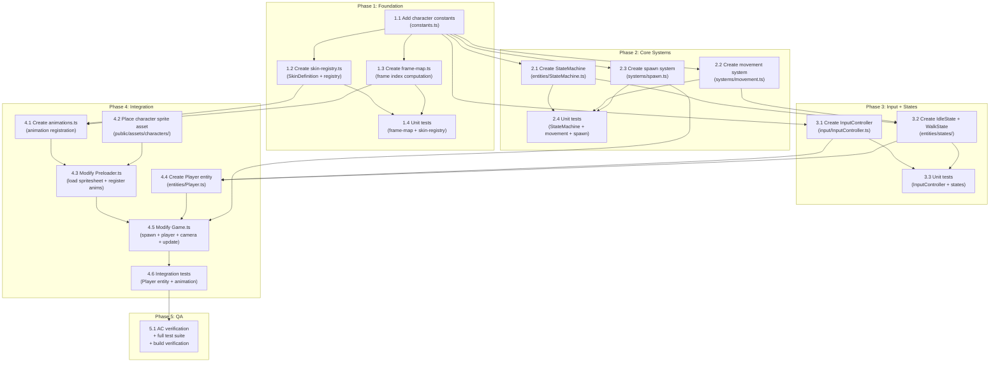

# Work Plan: Player Character System Implementation

Created Date: 2026-02-15
Type: feature
Estimated Duration: 8-10 days
Estimated Impact: 17 files (12 new, 3 modified, 2 asset files)
Related Issue/PR: N/A

## Related Documents

- Design Doc: [docs/design/design-004-player-character-system.md](../design/design-004-player-character-system.md)
- ADR: [docs/adr/adr-004-player-entity-architecture.md](../adr/adr-004-player-entity-architecture.md)
- PRD: [docs/prd/prd-003-player-character-system.md](../prd/prd-003-player-character-system.md)

## Objective

Introduce the first interactive game entity -- a player-controlled character that moves freely across the procedurally generated island map with sprite-based animations, tile-based collision, terrain speed modifiers, and camera follow behavior. This establishes the entity, state machine, animation, and movement patterns that all future game entities (NPCs, multiplayer characters) will reuse.

## Background

The game currently renders a static procedurally generated island map with no interactive entities. Players cannot explore the world or interact with anything. The camera is fixed at a zoom-to-fit level with drag-scroll navigation, which is a developer tool rather than a gameplay experience. The player character is the foundational entity through which all future gameplay systems operate: movement, NPC dialogue, farming, combat, and multiplayer synchronization.

The character sprite system uses LimeZu Modern Exteriors character assets at 16x32 frame size (one tile wide, two tiles tall) with an irregular sprite sheet layout (927px width, variable frame counts and direction orders per animation row).

## Risks and Countermeasures

### Technical Risks

- **Risk**: Frame index computation errors due to 927px sheet width (57.9375 columns)
  - **Impact**: High (incorrect animation frames displayed)
  - **Probability**: Medium
  - **Countermeasure**: Compute `COLS_PER_ROW` from actual texture dimensions at runtime via `computeColumnsPerRow(textureWidth, frameWidth)`. Unit test all frame indices against known values from Design Doc tables. Verify early in Phase 1.
  - **Detection**: Unit tests for frame-map.ts comparing computed indices against Design Doc exact frame indices table

- **Risk**: Collision wall-sliding feels janky on narrow passages or map corners
  - **Impact**: Medium (poor gameplay feel)
  - **Probability**: Medium
  - **Countermeasure**: Axis-independent collision with independent X/Y checks. Unit test single-tile corridors, corners, L-shaped boundaries. Manual playtesting in Phase 4.
  - **Detection**: Unit tests for movement.ts edge cases; manual testing in Phase 4 operational verification

- **Risk**: Wall tunneling when browser tab is backgrounded (large delta spikes)
  - **Impact**: High (player passes through walls)
  - **Probability**: Medium
  - **Countermeasure**: Clamp delta to 50ms maximum in `calculateMovement`. Unit test with large delta values.
  - **Detection**: Unit test in movement.ts verifying delta clamping behavior

- **Risk**: Camera behavior change (drag-scroll removal) disrupts developer workflow
  - **Impact**: Medium (developer inconvenience)
  - **Probability**: Low
  - **Countermeasure**: Preserve zoom controls. Developers can zoom out to see full map. Debug camera mode can be added later if needed.
  - **Detection**: Manual verification in Phase 4 operational procedures

- **Risk**: Sprite anchor misalignment causes collision offset (feet not aligned to tile)
  - **Impact**: High (collision checks offset from visual position)
  - **Probability**: Low
  - **Countermeasure**: Set `origin(0.5, 1.0)` so sprite bottom-center is the anchor. Verify feet tile matches collision tile in unit tests.
  - **Detection**: Unit tests verifying spawn position alignment; visual inspection in Phase 4

- **Risk**: 8 FPS animation rate feels wrong at 100px/sec movement speed
  - **Impact**: Low (visual quality, not functional)
  - **Probability**: Medium
  - **Countermeasure**: `ANIMATION_FPS` is a configurable constant. Adjust after playtesting.
  - **Detection**: Visual inspection during Phase 4 operational verification

### Schedule Risks

- **Risk**: Sprite sheet layout does not match Design Doc frame mapping
  - **Impact**: Medium (1-2 day delay to re-map frames)
  - **Countermeasure**: Verify frame layout by visual inspection of the PNG early in Phase 1, before building frame-map.ts
- **Risk**: Phaser pixelArt mode causes unexpected rendering artifacts with 16x32 frames on 16x16 grid
  - **Impact**: Low (pixel-art rendering already configured and working for terrain)
  - **Countermeasure**: Verify in Phase 4 operational testing; `roundPixels: true` already enabled

## Phase Structure Diagram

```mermaid
graph TD
    P1["Phase 1: Foundation<br/>Constants + Types + Character Config<br/>(Est. 3 commits)"]
    P2["Phase 2: Core Systems<br/>StateMachine + Movement + Spawn<br/>(Est. 3 commits)"]
    P3["Phase 3: Input and Character States<br/>InputController + IdleState + WalkState<br/>(Est. 2 commits)"]
    P4["Phase 4: Entity, Animation, and Scene Integration<br/>Player Entity + Preloader + Game.ts<br/>(Est. 4 commits)"]
    P5["Phase 5: Quality Assurance<br/>All ACs + Full Test Suite + Build<br/>(Est. 1 commit)"]

    P1 --> P2
    P1 --> P3
    P2 --> P3
    P3 --> P4
    P4 --> P5

    style P1 fill:#1a3a5c,stroke:#4a8adc
    style P2 fill:#1a3a5c,stroke:#4a8adc
    style P3 fill:#1a3a5c,stroke:#4a8adc
    style P4 fill:#1a3a5c,stroke:#4a8adc
    style P5 fill:#3a1a1a,stroke:#dc4a4a
```



## Task Dependency Diagram



## Implementation Phases

### Phase 1: Foundation - Constants, Types, and Character Config (Estimated commits: 3)

**Purpose**: Establish the foundational constants, type definitions, skin registry, and frame index mapping that all subsequent components depend on. These are pure data modules with no Phaser runtime dependency, enabling thorough unit testing.

**Implementation Approach**: Horizontal (foundation-driven) -- these data definitions must exist before any Phaser integration code is written.

#### Tasks

- [ ] **Task 1.1**: Add character constants to `apps/game/src/game/constants.ts`
  - Add `CHARACTER_FRAME_HEIGHT = 32` (character sprite is 16x32, taller than tile)
  - Add `PLAYER_SPEED = 100` (pixels per second, per GDD Section 7.7)
  - Add `ANIMATION_FPS = 8` (frames per second, per GDD Section 7.7)
  - Keep existing constants unchanged
  - **AC Coverage**: Prerequisite for FR-1, FR-2, FR-5
  - **Completion**: Constants compile without errors; existing code unaffected; `pnpm nx typecheck game` passes

- [x] **Task 1.2**: Create `apps/game/src/game/characters/skin-registry.ts`
  - Define `SkinDefinition` interface (`key: string`, `sheetPath: string`, `sheetKey: string`)
  - Create `SKIN_REGISTRY` array with Scout entry:
    - `key: 'scout'`, `sheetPath: 'characters/scout_6.png'`, `sheetKey: 'char-scout'`
  - Export `getSkins(): SkinDefinition[]` function
  - Export `getDefaultSkin(): SkinDefinition` function (returns first entry)
  - **AC Coverage**: FR-8 (multi-skin architecture), FR-1 (sprite sheet path)
  - **Completion**: Module exports types and functions; TypeScript compiles; no Phaser dependency

- [ ] **Task 1.3**: Create `apps/game/src/game/characters/frame-map.ts`
  - Define `AnimationDef` interface (`key: string`, `frames: number[]`, `frameRate: number`, `repeat: number`)
  - Define `Direction` type (`'up' | 'down' | 'left' | 'right'`)
  - Implement `computeColumnsPerRow(textureWidth: number, frameWidth: number): number` (returns `Math.floor(textureWidth / frameWidth)`)
  - Implement `getAnimationDefs(skinKey: string, sheetKey: string): AnimationDef[]` that computes frame index arrays for all 7 animation states x 4 directions (28 animation defs, minus hurt_down which does not exist = 27 total)
  - Use frame index formula: `row * COLS_PER_ROW + column` (0-indexed)
  - Handle irregular direction orders: idle/walk/hit/punch use LEFT/UP/RIGHT/DOWN; sit uses LEFT/DOWN/RIGHT/UP
  - Handle variable frame counts: idle/walk/hit/punch = 6 frames; sit = 3 frames; hurt = 4 frames x 3 directions only
  - Implement `animKey(sheetKey: string, state: string, direction: Direction): string` helper
  - Import `ANIMATION_FPS` from constants for frameRate; idle/walk loop (`repeat: -1`), others play once (`repeat: 0`)
  - **AC Coverage**: FR-2 (animation state registration data), FR-8 (skin-agnostic frame computation)
  - **Completion**: All 27 animation definitions generated with correct frame indices matching Design Doc exact frame indices table

- [ ] **Task 1.4**: Unit tests for frame-map and skin-registry
  - Test `computeColumnsPerRow(927, 16)` returns 57
  - Test `computeColumnsPerRow(1024, 16)` returns 64 (exact division)
  - Test idle frame indices: left=[57..62], up=[63..68], right=[69..74], down=[75..80]
  - Test walk frame indices: left=[114..119], up=[120..125], right=[126..131], down=[132..137]
  - Test sit frame indices with different direction order: left=[228..230], down=[231..233], right=[234..236], up=[237..239]
  - Test hurt frame indices: left=[1083..1086], up=[1087..1090], right=[1091..1094], no down variant
  - Test `getAnimationDefs` returns 27 definitions (7 states x 4 directions - 1 missing hurt_down)
  - Test each `AnimationDef` has correct `key` format (`{sheetKey}_{state}_{direction}`)
  - Test `getSkins()` returns array with Scout entry
  - Test `getDefaultSkin()` returns Scout entry
  - **AC Coverage**: FR-2 verification (correct frame sequences)
  - **Completion**: All tests pass; `pnpm nx test game` passes

- [ ] Quality check: `pnpm nx lint game && pnpm nx typecheck game && pnpm nx test game`

#### Phase Completion Criteria

- [ ] `CHARACTER_FRAME_HEIGHT`, `PLAYER_SPEED`, `ANIMATION_FPS` constants exported from `constants.ts`
- [ ] `SkinDefinition` type and registry functions exported from `skin-registry.ts`
- [ ] `AnimationDef`, `Direction` types and frame computation functions exported from `frame-map.ts`
- [ ] All 27 animation definitions produce correct frame indices (verified by unit tests)
- [ ] `computeColumnsPerRow` derives column count from dimensions (not hardcoded)
- [ ] All unit tests pass
- [ ] `pnpm nx lint game` passes
- [ ] `pnpm nx typecheck game` passes
- [ ] `pnpm nx build game` succeeds

#### Operational Verification Procedures

1. Run `pnpm nx test game --testFile=specs/frame-map.spec.ts` (or equivalent test file path) -- all frame index tests must pass
2. Run `pnpm nx typecheck game` -- verify no type errors in new files
3. Run `pnpm nx build game` -- verify build succeeds with new modules included
4. Manually review frame-map.ts frame index output against Design Doc Section "Exact Frame Indices" table to confirm no off-by-one errors

---

### Phase 2: Core Systems - StateMachine, Movement, and Spawn (Estimated commits: 3)

**Purpose**: Implement the three core logic systems that are independent of Phaser rendering: the finite state machine, the movement/collision system, and the spawn algorithm. These are pure logic modules that can be thoroughly unit tested without a Phaser scene.

**Implementation Approach**: Horizontal (foundation-driven) -- these systems must be complete before character states and the player entity can be built.

#### Tasks

- [ ] **Task 2.1**: Create `apps/game/src/game/entities/StateMachine.ts`
  - Define `State` interface (`name: string`, optional `enter(): void`, `update(delta: number): void`, `exit(): void`)
  - Implement `StateMachine` class:
    - Constructor: `(context: unknown, initialState: string, states: Record<string, State>)`
    - `setState(name: string): void` -- calls `exit()` on current state, sets new state, calls `enter()` on new state
    - `update(delta: number): void` -- delegates to current state's `update()`
    - `get currentState(): string` -- returns current state name
    - Throws on unknown state name in `setState()` (fail fast per Design Doc error handling)
    - Calls `enter()` on initial state during construction
  - No Phaser dependency (framework-agnostic)
  - **AC Coverage**: Prerequisite for FR-3 (player entity), FR-5 (movement state transitions)
  - **Completion**: StateMachine manages state lifecycle correctly; independent of Phaser; TypeScript strict mode compliant

- [x] **Task 2.2**: Create `apps/game/src/game/systems/movement.ts`
  - Define `MovementInput` interface (`position`, `direction`, `speed`, `delta`, `walkable`, `grid`, `mapWidth`, `mapHeight`, `tileSize`)
  - Define `MovementResult` interface (`x`, `y`, `blocked: { x: boolean; y: boolean }`)
  - Implement `calculateMovement(input: MovementInput): MovementResult`:
    - Clamp delta to 50ms max (prevent tunneling on background tab)
    - Compute terrain speed modifier at current feet tile
    - Calculate desired displacement: `dx = direction.x * speed * speedMod * (delta / 1000)`
    - Try X movement independently: check walkable at new X position, accept or block
    - Try Y movement independently (using accepted X): check walkable at new Y, accept or block
    - Clamp to map bounds: `0..mapWidth*tileSize-1`, `0..mapHeight*tileSize-1`
    - Return new position and blocked axes
  - Implement `getTerrainSpeedModifier(x, y, grid, tileSize): number`:
    - Convert pixel position to tile coordinates
    - Look up terrain type from `grid[tileY][tileX]`
    - Return `getSurfaceProperties(terrain).speedModifier`
  - Import `getSurfaceProperties` from `terrain-properties.ts`
  - **AC Coverage**: FR-5 (movement speed, diagonal normalization, terrain speed), FR-6 (collision, wall-sliding)
  - **Completion**: Pure functions with no Phaser dependency; all collision, speed, and boundary logic implemented

- [ ] **Task 2.3**: Create `apps/game/src/game/systems/spawn.ts`
  - Define `SpawnTile` interface (`tileX: number`, `tileY: number`)
  - Implement `findSpawnTile(walkable, grid, mapWidth, mapHeight): SpawnTile`:
    - Start at center: `centerX = floor(mapWidth / 2)`, `centerY = floor(mapHeight / 2)`
    - Check center first
    - Expanding concentric squares: top/bottom edges, then left/right edges (excluding corners)
    - Priority: walkable grass tile nearest to center
    - Fallback: any walkable tile if no grass found
    - Throw `Error('No walkable tile found')` if map has no walkable tiles
  - Implement `isValidSpawn(x, y, walkable, grid): boolean`:
    - Returns `walkable[y][x] && grid[y][x].terrain === 'grass'`
  - No Phaser dependency
  - **AC Coverage**: FR-4 (smart spawn on walkable grass near center)
  - **Completion**: Pure function finds correct spawn tile; handles edge cases; throws on degenerate maps

- [ ] **Task 2.4**: Unit tests for StateMachine, movement, and spawn
  - **StateMachine tests**:
    - Initial state `enter()` called on construction
    - `setState()` triggers `exit()` on old state, `enter()` on new state
    - `update(delta)` delegates to current state's `update()`
    - `currentState` getter returns correct state name
    - Unknown state name in `setState()` throws Error
    - State with no optional hooks does not crash
  - **Movement tests**:
    - Cardinal movement at correct speed (100px/sec * 1.0 terrain * 16ms delta)
    - Diagonal speed normalized by sqrt(2)
    - Terrain speed modifier applied (test with mock grid having 0.5 modifier)
    - Collision prevents entering unwalkable tile (blocked.x or blocked.y = true)
    - Wall-sliding: diagonal into corner, one axis blocked, other axis moves
    - Position clamped to map bounds (0..mapWidth*tileSize-1)
    - Delta clamped to 50ms max (test with delta=200ms, verify clamped movement)
    - Zero direction input results in no movement
    - `getTerrainSpeedModifier` returns correct value for grass (1.0)
  - **Spawn tests**:
    - Finds grass tile at exact center when center is grass
    - Finds nearest grass tile when center is water
    - Falls back to any walkable tile when no grass exists
    - Throws Error on map with no walkable tiles
    - Handles edge map: all grass (returns center)
    - Handles edge map: single walkable tile at corner (finds it)
    - Search is deterministic for same map layout
  - **AC Coverage**: FR-4, FR-5, FR-6 verification
  - **Completion**: All tests pass; coverage >= 80% for `systems/` and `entities/StateMachine.ts`

- [ ] Quality check: `pnpm nx lint game && pnpm nx typecheck game && pnpm nx test game`

#### Phase Completion Criteria

- [ ] `StateMachine` class manages state lifecycle (enter/update/exit) correctly
- [ ] `calculateMovement` handles collision, speed modifiers, wall-sliding, delta clamping, and boundary clamping
- [ ] `findSpawnTile` finds walkable grass nearest to center with concentric square search
- [ ] All unit tests pass (StateMachine, movement, spawn)
- [ ] Coverage >= 80% for `systems/movement.ts`, `systems/spawn.ts`, `entities/StateMachine.ts`
- [ ] `pnpm nx lint game` passes
- [ ] `pnpm nx typecheck game` passes

#### Operational Verification Procedures

1. Run `pnpm nx test game` -- all Phase 2 tests pass
2. Verify movement tests cover: cardinal movement, diagonal normalization, terrain speed, collision blocking, wall-sliding, map bounds, delta clamping
3. Verify spawn tests cover: center spawn, nearest-grass search, fallback, degenerate map
4. Verify StateMachine tests cover: lifecycle hooks, transitions, error on unknown state
5. Run `pnpm nx build game` -- verify build succeeds

---

### Phase 3: Input and Character States (Estimated commits: 2)

**Purpose**: Implement the keyboard input controller and the two MVP character states (idle and walk). These bridge the gap between the pure systems (Phase 2) and the player entity (Phase 4) by defining how input maps to character behavior.

**Implementation Approach**: Vertical slice -- InputController and states together enable the complete input-to-behavior pipeline.

**Dependencies**: Phase 1 (constants, Direction type), Phase 2 (StateMachine, movement system)

#### Tasks

- [x] **Task 3.1**: Create `apps/game/src/game/input/InputController.ts`
  - Define `Direction` type import from `frame-map.ts`
  - Implement `InputController` class:
    - Constructor: `(scene: Phaser.Scene)` -- creates cursor keys and WASD keys via `scene.input.keyboard`
    - `getDirection(): { x: number; y: number }` -- reads current key state, returns direction vector:
      - `x = -1` (A/Left), `x = 1` (D/Right), `x = 0` (neither/both)
      - `y = -1` (W/Up), `y = 1` (S/Down), `y = 0` (neither/both)
    - `isMoving(): boolean` -- returns `true` if any direction key is pressed
    - `getFacingDirection(): Direction` -- returns facing direction based on last horizontal/vertical input:
      - Priority: last horizontal direction pressed (for diagonal movement visual clarity)
      - Default: `'down'` (initial facing)
    - `destroy(): void` -- cleanup keyboard listeners
  - **AC Coverage**: FR-5 (WASD + arrow keys, diagonal movement input)
  - **Completion**: InputController reads keyboard state and produces normalized direction vector; tracks facing direction

- [x] **Task 3.2**: Create `apps/game/src/game/entities/states/IdleState.ts` and `WalkState.ts`
  - **IdleState**:
    - Implements `State` interface (name = `'idle'`)
    - `enter()`: plays idle animation in current facing direction (`animKey(sheetKey, 'idle', facingDirection)`)
    - `update(delta)`: checks InputController; if input detected, transitions to `'walk'`
    - Receives `Player` context for accessing animation and input
  - **WalkState**:
    - Implements `State` interface (name = `'walk'`)
    - `enter()`: plays walk animation in current facing direction
    - `update(delta)`:
      - Gets direction from InputController
      - If no input, transitions to `'idle'`
      - Calls `calculateMovement()` with current position, direction, speed, delta, map data
      - Updates player position with result
      - Updates facing direction
      - Updates walk animation if direction changed
    - Receives `Player` context for accessing position, animation, input, and map data
  - Create `apps/game/src/game/entities/states/index.ts` barrel export
  - **AC Coverage**: FR-5 (walk animation during movement, idle on stop), FR-6 (collision via movement system)
  - **Completion**: States implement correct lifecycle hooks; transitions triggered by input state changes

- [ ] **Task 3.3**: Unit tests for InputController and states
  - **InputController tests** (requires Phaser keyboard mock):
    - No keys pressed: `getDirection()` returns `{x: 0, y: 0}`, `isMoving()` returns `false`
    - W key: `getDirection()` returns `{x: 0, y: -1}`
    - S key: `getDirection()` returns `{x: 0, y: 1}`
    - A key: `getDirection()` returns `{x: -1, y: 0}`
    - D key: `getDirection()` returns `{x: 1, y: 0}`
    - W+D keys (diagonal): `getDirection()` returns `{x: 1, y: -1}`
    - Opposing keys (W+S): `getDirection()` returns `{x: 0, y: 0}`
    - `getFacingDirection()` defaults to `'down'`
    - Arrow keys work identically to WASD
  - **IdleState tests**:
    - `enter()` triggers idle animation play
    - `update()` with no input stays in idle state
    - `update()` with input detected triggers transition to walk
  - **WalkState tests**:
    - `enter()` triggers walk animation play
    - `update()` with input calls `calculateMovement` and updates position
    - `update()` with no input triggers transition to idle
    - Direction change updates animation key
    - Facing direction persists to idle transition
  - **AC Coverage**: FR-5 (input mapping, state transitions, animation changes)
  - **Completion**: All tests pass; input-to-behavior pipeline verified

- [ ] Quality check: `pnpm nx lint game && pnpm nx typecheck game && pnpm nx test game`

#### Phase Completion Criteria

- [ ] `InputController` produces correct direction vectors for all key combinations
- [ ] `InputController.getFacingDirection()` tracks last direction with horizontal priority
- [x] `IdleState` plays idle animation and transitions to walk on input
- [x] `WalkState` plays walk animation, calls movement system, and transitions to idle on input release
- [x] Direction changes during walk update the animation key
- [x] Facing direction persists across state transitions (idle remembers last walk direction)
- [ ] All unit tests pass
- [ ] `pnpm nx lint game` passes
- [ ] `pnpm nx typecheck game` passes

#### Operational Verification Procedures

1. Run `pnpm nx test game` -- all Phase 3 tests pass
2. Verify InputController tests cover all key combinations (single keys, diagonals, opposing keys)
3. Verify state tests cover enter/update/exit hooks, state transitions, and animation key selection
4. Run `pnpm nx build game` -- verify build succeeds
5. Verify no circular dependencies between input, states, and systems modules

---

### Phase 4: Entity, Animation, and Scene Integration (Estimated commits: 4)

**Purpose**: Bring all components together: create the animation registration system, the Player entity class, integrate with Preloader and Game scenes, set up camera follow, and verify the complete end-to-end experience. This is the integration phase that produces the visible, playable result.

**Implementation Approach**: Vertical slice (feature-driven) -- each task adds visible progress toward the complete player character experience.

**Dependencies**: All of Phase 1 (config data), Phase 2 (systems), Phase 3 (input, states)

#### Tasks

- [x] **Task 4.1**: Create `apps/game/src/game/characters/animations.ts`
  - Implement `registerAnimations(scene: Phaser.Scene, sheetKey: string, textureWidth: number, frameWidth: number): void`:
    - Call `computeColumnsPerRow(textureWidth, frameWidth)` to derive column count
    - Call `getAnimationDefs(skinKey, sheetKey)` to get all 27 animation definitions
    - For each `AnimationDef`, call `scene.anims.create()` with:
      - `key: def.key`
      - `frames: scene.anims.generateFrameNumbers(sheetKey, { frames: def.frames })`
      - `frameRate: def.frameRate`
      - `repeat: def.repeat`
    - Log `console.info` with columns-per-row value for verification
  - **AC Coverage**: FR-2 (animation state registration with correct frame sequences and directions)
  - **Completion**: All 27 animations registered in Phaser AnimationManager when called with scene reference

- [ ] **Task 4.2**: Place character sprite asset in `apps/game/public/assets/characters/`
  - Copy `scout_6.png` to `apps/game/public/assets/characters/`
  - Create `characters/` directory if it does not exist
  - Verify file dimensions match expected (927 x 656 pixels)
  - **AC Coverage**: FR-1 (character sprite sheet available for loading)
  - **Completion**: PNG file exists at correct path; accessible via Phaser loader at `assets/characters/scout_6.png`

- [x] **Task 4.3**: Modify `apps/game/src/game/scenes/Preloader.ts`
  - Import `getSkins` from `skin-registry.ts`
  - Import `registerAnimations` from `animations.ts`
  - Import `CHARACTER_FRAME_HEIGHT`, `TILE_SIZE` from `constants.ts`
  - In `preload()`: for each skin in `getSkins()`, load sprite sheet:
    ```typescript
    this.load.spritesheet(skin.sheetKey, skin.sheetPath, {
      frameWidth: TILE_SIZE,
      frameHeight: CHARACTER_FRAME_HEIGHT,
    });
    ```
  - In `create()`: for each skin, get texture dimensions and call `registerAnimations()`:
    ```typescript
    for (const skin of getSkins()) {
      const texture = this.textures.get(skin.sheetKey);
      const source = texture.getSourceImage();
      registerAnimations(this, skin.sheetKey, source.width, TILE_SIZE);
    }
    ```
  - Ensure animation registration happens before `this.scene.start('Game')`
  - Keep existing terrain spritesheet loading unchanged
  - **AC Coverage**: FR-1 (sprite loading with 16x32 frames), FR-2 (all animations registered before Game scene)
  - **Completion**: Character textures loaded and animations registered; Preloader still loads terrain spritesheets

- [x] **Task 4.4**: Create `apps/game/src/game/entities/Player.ts`
  - Extend `Phaser.GameObjects.Sprite`:
    - Constructor: `(scene: Phaser.Scene, x: number, y: number, skinKey: string, mapData: GeneratedMap)`
    - Set texture to skin's `sheetKey`
    - Set `origin(0.5, 1.0)` (bottom-center anchor for feet alignment)
    - Set depth to 2 (above hover highlight at depth 1)
    - Add to scene: `scene.add.existing(this)`
    - Create `InputController` from scene
    - Create `StateMachine` with `idle` as initial state, register all 7 states:
      - `idle` and `walk` as functional states (IdleState, WalkState instances)
      - `waiting`, `sit`, `hit`, `punch`, `hurt` as registered-only placeholder states (enter plays animation, update does nothing)
    - Store reference to `mapData` for collision/terrain lookups
  - Implement `preUpdate(time: number, delta: number)`:
    - Call `super.preUpdate(time, delta)` (required for Phaser animation system)
    - Call `this.stateMachine.update(delta)` to drive state logic
  - Expose `get facingDirection(): Direction` for external consumers
  - **AC Coverage**: FR-3 (player entity visible on map at correct size), FR-2 (7 states registered)
  - **Completion**: Player entity renders as animated sprite; FSM drives behavior; all 7 states registered

- [ ] **Task 4.5**: Modify `apps/game/src/game/scenes/Game.ts`
  - Import `Player` from `entities/Player.ts`
  - Import `findSpawnTile` from `systems/spawn.ts`
  - Import `getDefaultSkin` from `characters/skin-registry.ts`
  - Import `TILE_SIZE` (already imported)
  - Add `private player!: Player;` field
  - In `create()`, after map rendering:
    - Find spawn tile: `const spawn = findSpawnTile(this.mapData.walkable, this.mapData.grid, MAP_WIDTH, MAP_HEIGHT)`
    - Convert tile to pixel: `const spawnX = spawn.tileX * TILE_SIZE + TILE_SIZE / 2` (feet center X), `const spawnY = (spawn.tileY + 1) * TILE_SIZE` (feet bottom Y, since origin is bottom-center)
    - Create player: `this.player = new Player(this, spawnX, spawnY, getDefaultSkin().key, this.mapData)`
    - Log spawn position: `console.info('Player spawned at tile', spawn.tileX, spawn.tileY)`
  - Replace camera block:
    - Remove: `cam.setZoom(Math.min(zoomX, zoomY))`, `cam.centerOn(mapPixelW / 2, mapPixelH / 2)`
    - Add: `cam.setBounds(0, 0, mapPixelW, mapPixelH)`, `cam.startFollow(this.player, true, 0.1, 0.1)` (roundPixels=true, lerp=0.1)
  - Modify drag-scroll handler:
    - Remove the `if (pointer.isDown)` block that implements drag-scroll
    - Keep the hover highlight logic (pointer not down)
  - Modify resize handler:
    - Remove `cam.setZoom(Math.min(zx, zy))` and `cam.centerOn(mapPixelW / 2, mapPixelH / 2)`
    - Keep `cam.setSize(gameSize.width, gameSize.height)`
  - Keep mouse wheel zoom handler unchanged
  - Keep hover highlight at depth 1 (player is at depth 2, renders above it)
  - **AC Coverage**: FR-3 (entity on map), FR-4 (smart spawn), FR-7 (camera follows player), FR-9 (camera lerp), FR-10 (hover highlight preserved)
  - **Completion**: Player character visible on map at spawn position, moves with keyboard, camera follows, hover highlight works below player

- [ ] **Task 4.6**: Integration tests for Player entity and animation system
  - **Player entity integration tests**:
    - Player creates at spawn position with idle-down animation
    - Player is visible (depth 2, above hover highlight)
    - Player origin is (0.5, 1.0) (feet anchor)
    - State machine starts in 'idle' state
    - All 7 states registered in state machine
  - **Animation registration integration tests**:
    - All 27 animation keys registered in Phaser AnimationManager for scout skin
    - Each animation has correct frame count (6 for idle/walk/hit/punch, 3 for sit, 4 for hurt)
    - idle and walk animations have `repeat: -1` (loop)
    - Non-MVP animations have `repeat: 0` (play once)
    - Adding second skin entry registers duplicate animation set under different keys
  - **AC Coverage**: FR-2, FR-3, FR-8 verification
  - **Completion**: All integration tests pass

- [ ] Quality check: `pnpm nx lint game && pnpm nx typecheck game && pnpm nx test game && pnpm nx build game`

#### Phase Completion Criteria

- [x] Character sprite sheet loaded in Preloader with 16x32 frame size
- [x] All 27 animations registered with correct frame sequences before Game scene starts
- [ ] Player sprite visible on map at walkable grass tile near center
- [ ] Player idle-down animation plays automatically on creation
- [ ] Player moves with WASD/arrow keys at 100px/sec with terrain speed modifiers
- [ ] Diagonal movement normalized by sqrt(2)
- [ ] Collision prevents entering unwalkable tiles
- [ ] Wall-sliding works on corners (one axis blocked, other free)
- [ ] Camera follows player with lerp smoothing (0.1)
- [ ] Camera bounded by map edges (no empty space beyond map)
- [ ] Mouse wheel zoom preserved and functional
- [ ] Hover highlight renders below player sprite (depth 1 vs depth 2)
- [ ] Drag-scroll removed (replaced by player-following camera)
- [ ] All unit and integration tests pass
- [ ] `pnpm nx lint game` passes
- [ ] `pnpm nx typecheck game` passes
- [ ] `pnpm nx build game` succeeds

#### Operational Verification Procedures

1. **Asset verification**: Confirm `apps/game/public/assets/characters/scout_6.png` exists and has dimensions 927 x 656 pixels
2. Run `pnpm nx dev game` and load the game page at `http://localhost:3000/game`
3. **Spawn verification** (Integration Point 3): Verify the player character appears on a grass tile near the center of the island. Open browser console and confirm "Player spawned at tile X, Y" log.
4. **Idle animation** (FR-3): Verify the character plays a subtle idle animation (breathing/swaying) facing downward without any input.
5. **Movement** (Integration Point 4): Press W, A, S, D keys. Verify the character moves in the corresponding direction with walk animation. Press W+D simultaneously. Verify diagonal movement at consistent speed (not faster than cardinal). Release all keys. Verify character returns to idle animation facing the last movement direction.
6. **Collision** (FR-6): Walk the character toward the water boundary. Verify the character stops at the last walkable tile and cannot enter water. Approach a corner diagonally. Verify wall-sliding behavior (character slides along the wall in the free direction).
7. **Camera follow** (Integration Point 5): Move the character across the map. Verify the camera smoothly follows (slight lerp delay visible). Move toward a map edge. Verify the camera clamps to the map boundary and the character moves off-center. Verify no empty space beyond the map appears.
8. **Zoom** (FR-7): Use mouse wheel to zoom in and out. Verify zoom works alongside camera follow. Verify the character remains correctly positioned at different zoom levels.
9. **Hover highlight** (FR-10): Move the mouse over tiles while the character is on screen. Verify the tile hover highlight appears below the character sprite (when the mouse is on the character's tile, the highlight is behind the character).
10. **Drag-scroll removed**: Click and drag on the map. Verify the map does NOT scroll (drag-scroll behavior removed). The camera is now always following the player.
11. **Animation correctness** (FR-2): Move in all four directions. Verify walk animation faces the correct direction. Stop moving. Verify idle animation faces the last movement direction.
12. **Performance**: Verify the game maintains smooth 60 FPS with the player character present. Open Performance panel in DevTools if needed.
13. Run `pnpm nx build game` -- verify production build succeeds

---

### Phase 5: Quality Assurance (Required) (Estimated commits: 1)

**Purpose**: Final quality gate. Verify all Design Doc acceptance criteria are met, run the complete test suite, verify build, and validate performance requirements.

#### Tasks

- [ ] Verify all Design Doc acceptance criteria achieved:
  - [ ] FR-1: Character sprite loaded with frameWidth=16, frameHeight=32; all frames accessible
  - [ ] FR-2: All 7 animation states registered (idle, waiting, walk, sit, hit, punch, hurt) with correct frame sequences; idle/walk loop at 8 FPS; waiting uses idle frames
  - [ ] FR-3: Player sprite visible on map at correct size (16x32); renders above map RenderTexture; idle-down plays on creation
  - [ ] FR-4: Player spawns on walkable grass tile nearest to map center; feet aligned to tile center; fallback to any walkable if no grass
  - [ ] FR-5: WASD/arrow movement at 100px/sec with terrain speed modifier; diagonal normalized by sqrt(2); walk animation plays in movement direction; idle on release facing last direction
  - [ ] FR-6: Collision prevents entering unwalkable tiles; wall-sliding on corners; collision bounds are bottom 16x16 feet
  - [ ] FR-7: Camera follows player centered; map bounds clamp camera; wheel zoom preserved; drag-scroll removed
  - [ ] FR-8: Skin registry contains Scout entry; adding second skin works without code changes
  - [ ] FR-9: Camera lerp 0.1 smooths camera movement
  - [ ] FR-10: Hover highlight renders above map but below player sprite
- [ ] Run quality checks: `pnpm nx run-many -t lint test build typecheck`
- [ ] Run all unit tests: `pnpm nx test game`
- [ ] Verify test coverage >= 80% for `systems/`, `characters/`, `entities/StateMachine.ts`
- [ ] FPS verification: Verify game maintains 60 FPS on desktop with player character active
- [ ] Run E2E tests (if applicable): `pnpm nx e2e game-e2e`

#### Operational Verification Procedures

1. **Full test suite**: Run `pnpm nx run-many -t lint test build typecheck` -- all targets must pass with zero errors
2. **E2E verification**: Run `pnpm nx e2e game-e2e` (if E2E tests exist for player character)
3. **Performance**: Load the game at `http://localhost:3000/game`. Open Chrome DevTools Performance tab. Record 10 seconds of gameplay with player movement. Verify consistent 60 FPS (no drops below 55 FPS). Verify input-to-movement latency is under 16ms (one frame).
4. **Collision edge cases**: Walk along the entire water boundary of the island. Verify no position where the character can enter water. Test single-tile-wide grass passages if any exist.
5. **Animation continuity**: Rapidly alternate between directions (tap W, D, S, A quickly). Verify no animation glitches, missing frames, or stuck animations.
6. **Camera boundary**: Walk to all four map edges. Verify the camera clamps correctly at each edge with no empty space visible beyond the map.
7. **Zoom + follow**: Zoom to minimum (0.25x) and maximum (4x). Verify the character is still visible and camera follow works at both extremes.
8. **Spawn consistency**: Reload the game several times. Verify the character always spawns on a walkable grass tile near the center. Try different seeds via `?seed=12345` URL parameter.
9. **Build verification**: Run `pnpm nx build game` and verify production build succeeds with zero warnings related to new code

## Completion Criteria

- [ ] All 5 phases completed
- [ ] Each phase's operational verification procedures executed
- [ ] All 10 Design Doc functional requirement acceptance criteria (FR-1 through FR-10) satisfied
- [ ] Staged quality checks completed (zero errors)
- [ ] All unit tests pass (coverage >= 80% for core modules)
- [ ] All integration tests pass
- [ ] Build succeeds (`pnpm nx build game`)
- [ ] `pnpm nx lint game` passes
- [ ] `pnpm nx typecheck game` passes
- [ ] 60 FPS maintained on desktop with player character active
- [ ] User review approval obtained

## AC Traceability Matrix

| AC | Description | Phase | Task(s) |
|----|-------------|-------|---------|
| FR-1 | Character sprite loading (16x32 frames) | P1, P4 | 1.1, 4.2, 4.3 |
| FR-2 | Animation state registration (7 states, all directions) | P1, P4 | 1.3, 4.1, 4.3, 4.6 |
| FR-3 | Player entity creation (visible, correct size, idle-down) | P4 | 4.4, 4.5 |
| FR-4 | Smart spawn (walkable grass near center) | P2, P4 | 2.3, 4.5 |
| FR-5 | Movement (WASD/arrows, speed, diagonal, terrain, animation) | P2, P3, P4 | 2.2, 3.1, 3.2, 4.4, 4.5 |
| FR-6 | Collision (walkable grid, wall-sliding, feet bounds) | P2, P3 | 2.2, 3.2 |
| FR-7 | Camera follows player (centered, map bounds, wheel zoom) | P4 | 4.5 |
| FR-8 | Multi-skin architecture (registry, addable without code changes) | P1, P4 | 1.2, 4.1, 4.6 |
| FR-9 | Camera lerp (0.1 smoothing) | P4 | 4.5 |
| FR-10 | Hover highlight preserved (above map, below player) | P4 | 4.5 |

## Files Summary

### New Files (12)

| File | Phase | Description |
|------|-------|-------------|
| `apps/game/src/game/characters/skin-registry.ts` | P1 | Skin definitions and registry lookup |
| `apps/game/src/game/characters/frame-map.ts` | P1 | Animation frame index computation |
| `apps/game/src/game/characters/animations.ts` | P4 | Phaser animation registration from frame map |
| `apps/game/src/game/entities/StateMachine.ts` | P2 | Lightweight finite state machine |
| `apps/game/src/game/entities/Player.ts` | P4 | Player entity (Phaser.Sprite subclass) |
| `apps/game/src/game/entities/states/IdleState.ts` | P3 | Idle state implementation |
| `apps/game/src/game/entities/states/WalkState.ts` | P3 | Walk state implementation |
| `apps/game/src/game/entities/states/index.ts` | P3 | State barrel export |
| `apps/game/src/game/input/InputController.ts` | P3 | WASD/arrow key input handler |
| `apps/game/src/game/systems/movement.ts` | P2 | Movement and collision pure functions |
| `apps/game/src/game/systems/spawn.ts` | P2 | Smart spawn algorithm |
| `apps/game/public/assets/characters/scout_6.png` | P4 | Scout character sprite sheet |

### Modified Files (3)

| File | Phase | Changes |
|------|-------|---------|
| `apps/game/src/game/constants.ts` | P1 | Add CHARACTER_FRAME_HEIGHT, PLAYER_SPEED, ANIMATION_FPS |
| `apps/game/src/game/scenes/Preloader.ts` | P4 | Load character spritesheets, register animations |
| `apps/game/src/game/scenes/Game.ts` | P4 | Create player, smart spawn, camera follow, update loop, remove drag-scroll |

### Test Files (new, estimated)

| File | Phase | Coverage |
|------|-------|----------|
| `apps/game/specs/characters/frame-map.spec.ts` | P1 | frame-map.ts |
| `apps/game/specs/characters/skin-registry.spec.ts` | P1 | skin-registry.ts |
| `apps/game/specs/entities/StateMachine.spec.ts` | P2 | StateMachine.ts |
| `apps/game/specs/systems/movement.spec.ts` | P2 | movement.ts |
| `apps/game/specs/systems/spawn.spec.ts` | P2 | spawn.ts |
| `apps/game/specs/input/InputController.spec.ts` | P3 | InputController.ts |
| `apps/game/specs/entities/states/IdleState.spec.ts` | P3 | IdleState.ts |
| `apps/game/specs/entities/states/WalkState.spec.ts` | P3 | WalkState.ts |
| `apps/game/specs/entities/Player.spec.ts` | P4 | Player.ts |
| `apps/game/specs/characters/animations.spec.ts` | P4 | animations.ts |

## Progress Tracking

### Phase 1: Foundation
- Start:
- Complete:
- Notes:

### Phase 2: Core Systems
- Start:
- Complete:
- Notes:

### Phase 3: Input and States
- Start:
- Complete:
- Notes:

### Phase 4: Integration
- Start: 2026-02-15
- Complete:
- Notes: Task 4.3 (Preloader modification) completed -- character spritesheet loading and animation registration added

### Phase 5: Quality Assurance
- Start:
- Complete:
- Notes:

## Notes

- **Implementation Strategy**: Vertical Slice (Feature-driven) as selected in the Design Doc. Phases 1-2 establish pure data/logic foundations, Phase 3 bridges input to behavior, Phase 4 integrates everything into a visible feature. Each phase delivers testable progress.
- **Commit Strategy**: Manual commits controlled by the user. Tasks are designed as logical 1-commit units with clear completion criteria.
- **Test Strategy**: Implementation-first development (Strategy B) since no test design information was provided. Tests are included in each phase alongside implementation.
- **Phaser Mocking**: InputController and Player entity tests require Phaser keyboard and scene mocks. Consider using a lightweight Phaser mock setup or testing the pure logic portions separately.
- **Asset Dependency**: The Scout sprite sheet PNG (`scout_6.png`) must be obtained from the LimeZu Modern Exteriors asset pack. Without this file, Phase 4 cannot produce visible results.
- **Parallel Work**: Within Phase 1, tasks 1.2 and 1.3 can be done in parallel (both depend only on 1.1). Within Phase 2, tasks 2.1, 2.2, and 2.3 are independent and can be done in parallel. Phase 3 task 3.1 is independent of 2.x and could theoretically start after Phase 1.
- **Grid Indexing**: All collision and terrain lookups use row-major `[y][x]` indexing as established in `GeneratedMap.walkable` and `GeneratedMap.grid`. This must be consistently respected in movement.ts and spawn.ts.
- **Camera Behavior Change**: The drag-scroll camera is intentionally removed per PRD FR-7. This is a known developer workflow change.
- **Dependency Chain Max Depth**: P1 -> P2 -> P3 -> P4 -> P5 (4 levels, with P1 also feeding directly into P3 and P4). This exceeds the 2-level guideline but is justified by the technical dependency graph of the feature. Each phase can be verified independently.
