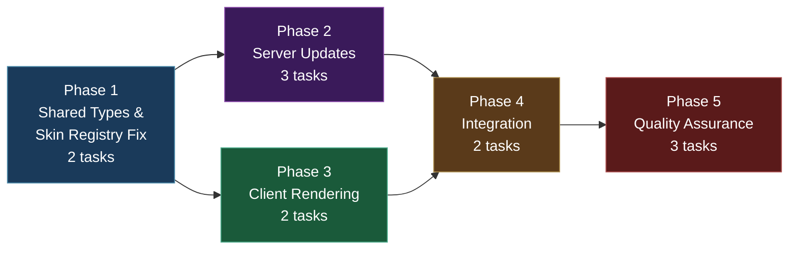
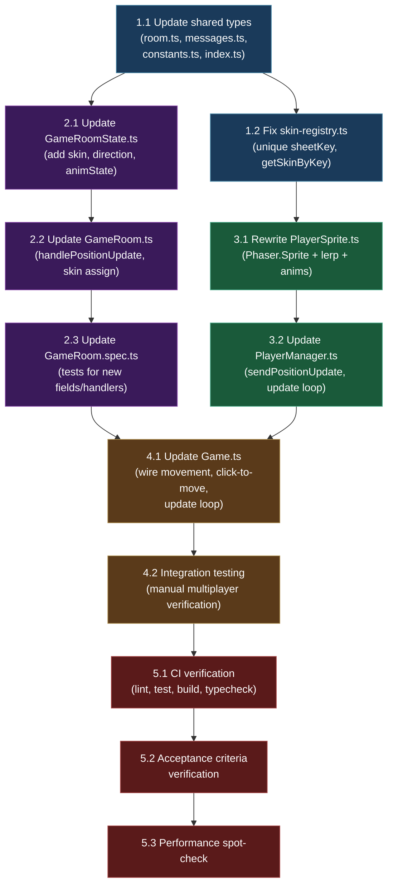

# Work Plan: Multiplayer Player Movement Synchronization and Skin Display

Created Date: 2026-02-16
Type: feature
Estimated Duration: 2 days
Estimated Impact: 11 files (9 modified, 2 no-change verification)
Related Issue/PR: N/A

## Related Documents

- PRD: [docs/prd/prd-004-multiplayer-player-sync.md](../prd/prd-004-multiplayer-player-sync.md)
- ADR-005: [docs/adr/adr-005-multiplayer-position-sync.md](../adr/adr-005-multiplayer-position-sync.md)
- Design Doc: [docs/design/design-004-multiplayer-player-sync.md](../design/design-004-multiplayer-player-sync.md)

## Objective

Deliver the first visually functional multiplayer experience: synchronize local player keyboard movement to the Colyseus server in real-time, replace remote player colored rectangles with animated Phaser sprites displaying server-assigned character skins, fix the skin registry bug preventing multiple skins from loading, and wire click-to-move to actually move the local Player entity. This extends the multiplayer foundation delivered in Plan-002 (Colyseus Game Server).

## Background

The Colyseus multiplayer infrastructure from PRD-002 is operational (connections, auth, state sync), but the player experience is non-functional for multiplayer gameplay:

1. **No movement sync**: Keyboard movement (WASD/arrows) is purely local; the server never receives position updates from keyboard input. Only click-to-move sends tile coordinates.
2. **No visual identity**: Remote players render as colored rectangles (Graphics objects), not character sprites.
3. **Broken skin system**: All 6 scout skins share `sheetKey: 'char-scout'`, causing Phaser texture overwrites. Only `scout_6` renders.
4. **Incomplete server state**: Player schema lacks `skin`, `direction`, and `animState` fields needed to render remote player sprites.
5. **Click-to-move disconnection**: The Game scene sends click coordinates to the server but never moves the local Player entity.

The implementation follows a vertical slice approach with bottom-up dependency ordering (per Design Doc): shared types first, then server and client in parallel, then integration wiring.

## Phase Structure Diagram



## Task Dependency Diagram



## Risks and Countermeasures

### Technical Risks

- **Risk**: Skin registry `sheetKey` change from `'char-scout'` to `'scout_1'` breaks local Player rendering
  - **Impact**: High -- local player sprite cannot find its texture or animations
  - **Detection**: Local player appears as a white rectangle or throws a Phaser animation warning after Task 1.2
  - **Countermeasure**: The `Player` constructor calls `getDefaultSkin().sheetKey`, which automatically picks up the new value. `WalkState` and `IdleState` use `this.context.sheetKey`. All references are indirect via the registry. Verify local player animations immediately after the registry fix.

- **Risk**: PlayerSprite rewrite from Graphics to Sprite breaks existing PlayerManager callbacks
  - **Impact**: Medium -- remote players may not appear or throw errors on join/leave
  - **Detection**: Console errors when remote players join during Task 3.2
  - **Countermeasure**: PlayerManager `setupCallbacks` is modified in the same task (3.2) that depends on the new PlayerSprite (3.1). The `onRemove` callback calls `sprite.destroy()` which works on both old and new implementations. Both changes are coordinated.

- **Risk**: Linear interpolation produces visible jitter at inconsistent network latency
  - **Impact**: Medium -- remote player movement appears choppy despite lerp
  - **Detection**: Visual inspection during Task 4.2 integration testing
  - **Countermeasure**: Use fixed 100ms lerp duration matching the server tick interval. If jitter persists, the documented upgrade path (ADR-005 kill criteria) is buffer-based interpolation with a 100ms buffer.

- **Risk**: Click-to-move and keyboard movement conflict when both are active simultaneously
  - **Impact**: Medium -- player oscillates or gets stuck
  - **Detection**: Manual testing during Task 4.2
  - **Countermeasure**: Design rule from ADR-005: keyboard input always takes priority. When WASD is pressed, the click-to-move target is cleared. WalkState checks keyboard first; if active, clears move target.

- **Risk**: Remote player sprites not cleaned up on disconnect, causing ghost sprites
  - **Impact**: Medium -- stale sprites remain on screen
  - **Detection**: Disconnect one browser tab; observe the other for orphaned sprites
  - **Countermeasure**: The `PlayerManager` `onRemove` callback destroys sprites. `PlayerManager.destroy()` iterates all sprites. Both paths are verified in Task 4.2.

### Schedule Risks

- **Risk**: PlayerSprite rewrite takes longer than expected due to Phaser animation system nuances
  - **Impact**: Phase 3 may take longer
  - **Countermeasure**: The Design Doc provides the complete `PlayerSprite` class implementation. The frame-map and animation systems are already parameterized by sheetKey and require no changes. The rewrite is a replacement, not an extension.

- **Risk**: Click-to-move wiring requires WalkState modifications that interact with existing keyboard movement
  - **Impact**: Phase 4 Task 4.1 may require careful state machine integration
  - **Countermeasure**: The Design Doc specifies a minimal approach: add `moveTarget` property to Player, have WalkState check for target when no keyboard input. Keyboard always takes priority. The WalkState change is limited to the update method's direction calculation.

## Implementation Phases

### Phase 1: Shared Types and Skin Registry Fix (Estimated commits: 2)

**Purpose**: Establish the shared type contracts and fix the skin registry bug. These are foundational changes with no runtime behavior changes on their own. All subsequent phases depend on Phase 1.

**Derives from**: Design Doc components 1 (Shared Types Extensions) and 5 (Skin Registry Fix)
**ACs covered**: FR-2 (Skin Registry Fix), FR-5 (Shared Type and Protocol Updates)

#### Tasks

- [ ] **Task 1.1**: Update shared types -- add PlayerState fields, new message type, skin constants

  **Description**: Extend the `@nookstead/shared` package with the new type contracts required by both server and client. This adds compile-time safety for the extended protocol.

  **Files to modify**:
  - `packages/shared/src/types/room.ts` -- add `skin: string`, `direction: string`, `animState: string` to `PlayerState`
  - `packages/shared/src/types/messages.ts` -- add `POSITION_UPDATE: 'position_update'` to `ClientMessage`, add `ClientMessageType` type, add `PositionUpdatePayload` interface
  - `packages/shared/src/constants.ts` -- add `AVAILABLE_SKINS` readonly array and `SkinKey` type
  - `packages/shared/src/index.ts` -- re-export new types (`PositionUpdatePayload`, `ClientMessageType`, `AVAILABLE_SKINS`, `SkinKey`)

  **Implementation details** (from Design Doc contract definitions):
  - `PlayerState` becomes: `{ userId, x, y, name, connected, skin, direction, animState }` (all required string fields)
  - `PositionUpdatePayload`: `{ x: number, y: number, direction: string, animState: string }`
  - `AVAILABLE_SKINS = ['scout_1', 'scout_2', 'scout_3', 'scout_4', 'scout_5', 'scout_6'] as const`
  - `SkinKey = typeof AVAILABLE_SKINS[number]`
  - Keep existing `MovePayload` unchanged (backward compat for click-to-move)

  **Acceptance criteria**:
  - [ ] `PlayerState` includes `skin`, `direction`, `animState` as required string fields
  - [ ] `ClientMessage.POSITION_UPDATE` equals `'position_update'`
  - [ ] `PositionUpdatePayload` interface has `x`, `y`, `direction`, `animState`
  - [ ] `AVAILABLE_SKINS` contains 6 skin keys matching `scout_1` through `scout_6`
  - [ ] `SkinKey` type is a union of the 6 skin key strings
  - [ ] All new types re-exported through barrel `index.ts`
  - [ ] `pnpm nx build server` and `pnpm nx build game` succeed (compile-time verification)

  **Dependencies**: None (first task)
  **Estimated complexity**: Low

---

- [x] **Task 1.2**: Fix skin-registry.ts -- unique sheetKey per skin, add `getSkinByKey()`

  **Description**: Fix the skin registry bug where all 6 scout skins share the same Phaser texture key `'char-scout'`, causing only the last-loaded spritesheet to be available. Change each entry's `sheetKey` to match its unique `key` field. Add a `getSkinByKey()` lookup function needed by `PlayerSprite` to resolve server-assigned skin keys to Phaser texture keys.

  **Files to modify**:
  - `apps/game/src/game/characters/skin-registry.ts` -- change all `sheetKey` values, add `getSkinByKey()` function

  **Implementation details** (from Design Doc):
  - Change `sheetKey: 'char-scout'` to `sheetKey: 'scout_1'` (matching `key`) for each of the 6 entries
  - Add exported function: `getSkinByKey(key: string): SkinDefinition | undefined` that returns `SKIN_REGISTRY.find((s) => s.key === key)`
  - Existing `getSkins()` and `getDefaultSkin()` remain unchanged (they return the same data, just with updated sheetKey values)

  **Cascade impact** (no additional code changes needed):
  - `Preloader.preload()` calls `this.load.spritesheet(skin.sheetKey, ...)` which now loads 6 distinct textures
  - `Preloader.create()` calls `registerAnimations(this, skin.sheetKey, ...)` which now registers animations as `scout_1_idle_down` etc.
  - `Player.ts` constructor calls `getDefaultSkin().sheetKey` which now returns `'scout_1'` instead of `'char-scout'`
  - `WalkState` and `IdleState` use `this.context.sheetKey` which picks up the new value automatically

  **Acceptance criteria**:
  - [x] All 6 skin entries have unique `sheetKey` values (`scout_1` through `scout_6`)
  - [x] Each `sheetKey` equals its corresponding `key` field
  - [x] `getSkinByKey('scout_3')` returns the entry with key `'scout_3'`
  - [x] `getSkinByKey('invalid')` returns `undefined`
  - [x] After Preloader completes, 6 distinct textures exist in the Phaser texture manager
  - [x] Local Player entity animations still work correctly (regression check)

  **Dependencies**: Task 1.1 (shared types used for validation context, though not a hard code dependency)
  **Estimated complexity**: Low

#### Phase Completion Criteria

- [ ] Shared package exports `PlayerState` with 8 fields, `PositionUpdatePayload`, `ClientMessage.POSITION_UPDATE`, `AVAILABLE_SKINS`, `SkinKey`
- [ ] Skin registry has 6 unique `sheetKey` values and exports `getSkinByKey()`
- [ ] `pnpm nx build server` succeeds (server consumes shared types)
- [ ] `pnpm nx build game` succeeds (game app consumes shared types and has fixed registry)
- [ ] No regressions: existing `MOVE` message type and `MovePayload` unchanged

#### Operational Verification Procedures

1. Run `pnpm nx build server && pnpm nx build game` and confirm both exit 0
2. Verify TypeScript recognizes new fields: attempt to access `PlayerState.skin` in server code
3. Start the game client (`pnpm nx dev game`), log in, and verify the local player still renders correctly with animations (the sheetKey changed from `'char-scout'` to `'scout_1'`)

---

### Phase 2: Server Updates (Estimated commits: 2)

**Purpose**: Extend the server-side Player schema with new fields and add the `POSITION_UPDATE` message handler with input validation. Assign random skins on player join. Add tests for the new functionality.

**Derives from**: Design Doc components 2 (Server Schema and Room Extensions)
**ACs covered**: FR-3 (Server-Side Skin Assignment), FR-5 (Protocol handling on server)
**Can run in parallel with**: Phase 3 (both depend only on Phase 1)

#### Tasks

- [ ] **Task 2.1**: Update GameRoomState.ts -- add skin, direction, animState fields with @type decorators

  **Description**: Extend the Colyseus `Player` schema class with three new `@type('string')` fields for character rendering state. These fields are delta-serialized automatically by Colyseus and broadcast to all connected clients.

  **Files to modify**:
  - `apps/server/src/rooms/GameRoomState.ts` -- add 3 `@type` fields to `Player` class

  **Implementation details** (from Design Doc):
  ```
  @type('string') skin = '';
  @type('string') direction = 'down';
  @type('string') animState = 'idle';
  ```

  **Acceptance criteria**:
  - [ ] `Player` schema has `@type('string') skin` with default `''`
  - [ ] `Player` schema has `@type('string') direction` with default `'down'`
  - [ ] `Player` schema has `@type('string') animState` with default `'idle'`
  - [ ] `pnpm nx build server` succeeds with the new @type decorators
  - [ ] Colyseus delta sync transmits the new fields (verified in Phase 4)

  **Dependencies**: Task 1.1 (shared types define the contract)
  **Estimated complexity**: Low

---

- [ ] **Task 2.2**: Update GameRoom.ts -- handlePositionUpdate() and random skin assignment in onJoin()

  **Description**: Add a new message handler for `POSITION_UPDATE` that validates the payload and updates the Player schema fields. Update `onJoin()` to assign a random skin from `AVAILABLE_SKINS` and set default direction/animState values.

  **Files to modify**:
  - `apps/server/src/rooms/GameRoom.ts` -- add `handlePositionUpdate()` method, register in `onCreate()`, update `onJoin()`

  **Implementation details** (from Design Doc):

  **handlePositionUpdate**:
  - Validate payload has numeric `x`/`y` and string `direction`/`animState`
  - On invalid payload: log warning with sessionId, return without modifying state
  - On valid payload: update `player.x`, `player.y`, `player.direction`, `player.animState`
  - Register in `onCreate()` alongside existing `ClientMessage.MOVE` handler

  **onJoin updates**:
  - `player.skin = AVAILABLE_SKINS[Math.floor(Math.random() * AVAILABLE_SKINS.length)]`
  - `player.direction = 'down'`
  - `player.animState = 'idle'`
  - Log the assigned skin

  **New imports**: `AVAILABLE_SKINS` and `PositionUpdatePayload` from `@nookstead/shared`

  **Acceptance criteria**:
  - [ ] `onCreate()` registers both `ClientMessage.MOVE` and `ClientMessage.POSITION_UPDATE` handlers
  - [ ] Valid `POSITION_UPDATE` payload updates `player.x`, `player.y`, `player.direction`, `player.animState`
  - [ ] Invalid payload (missing fields, wrong types) logs warning and does not modify state
  - [ ] `onJoin()` assigns `player.skin` from `AVAILABLE_SKINS` (random selection)
  - [ ] `onJoin()` sets `player.direction = 'down'` and `player.animState = 'idle'`
  - [ ] Server log includes the assigned skin key on player join
  - [ ] Existing `MOVE` handler continues to work unchanged (backward compatibility)

  **Dependencies**: Task 2.1 (Player schema has the new fields)
  **Estimated complexity**: Medium

---

- [ ] **Task 2.3**: Update GameRoom.spec.ts -- tests for new fields and message handling

  **Description**: Add unit tests for the new `POSITION_UPDATE` handler, skin assignment logic, and default field values. Extend the existing test suite structure.

  **Files to modify**:
  - `apps/server/src/rooms/GameRoom.spec.ts` -- add new describe blocks for position update handling and skin assignment

  **Test cases** (derived from Design Doc test strategy):

  **Skin assignment tests**:
  - `onJoin` sets `player.skin` to a value from `AVAILABLE_SKINS`
  - `onJoin` sets `player.direction` to `'down'` (default)
  - `onJoin` sets `player.animState` to `'idle'` (default)

  **POSITION_UPDATE handler tests**:
  - Valid `PositionUpdatePayload` updates `player.x`, `player.y`, `player.direction`, `player.animState`
  - Payload with non-numeric `x` logs warning, state unchanged
  - Payload with missing `direction` logs warning, state unchanged
  - Null payload does not modify state
  - Handler registered in `onCreate()` (messageHandlers has `'position_update'`)

  **Backward compatibility test**:
  - Existing `MOVE` handler still updates `player.x` and `player.y` (existing test may cover this, but verify)

  **Acceptance criteria**:
  - [ ] All new test cases pass (`pnpm nx test server`)
  - [ ] Existing tests continue to pass (no regressions)
  - [ ] `pnpm nx test server` exits 0 with zero failures

  **Dependencies**: Task 2.2 (GameRoom has new handler and skin assignment)
  **Estimated complexity**: Medium

#### Phase Completion Criteria

- [ ] `Player` schema has `skin`, `direction`, `animState` @type fields
- [ ] `GameRoom.handlePositionUpdate()` validates and applies position updates
- [ ] `GameRoom.onJoin()` assigns random skins from `AVAILABLE_SKINS`
- [ ] Both `MOVE` and `POSITION_UPDATE` message handlers registered in `onCreate()`
- [ ] All server tests pass including new test cases
- [ ] `pnpm nx build server` succeeds

#### Operational Verification Procedures

**Integration Point: Server message handling**
1. Run `pnpm nx test server` and confirm all tests pass with zero failures
2. Run `pnpm nx serve server` and confirm server starts without errors
3. Verify server log includes room creation message and accepts connections

---

### Phase 3: Client Rendering (Estimated commits: 2)

**Purpose**: Rewrite the `PlayerSprite` class to use actual Phaser.Sprite objects with animations and linear interpolation. Update `PlayerManager` to create skin-aware sprites, add throttled position sync, and drive the interpolation update loop.

**Derives from**: Design Doc components 3 (PlayerSprite Rewrite) and 4 (PlayerManager Extensions)
**ACs covered**: FR-1 (Position Sync, client side), FR-4 (Remote Player Sprite Rendering), FR-7 (Linear Interpolation), FR-8 (Name Labels)
**Can run in parallel with**: Phase 2 (both depend only on Phase 1)

#### Tasks

- [ ] **Task 3.1**: Rewrite PlayerSprite.ts -- Phaser.Sprite with animations, interpolation, name label

  **Description**: Complete rewrite of `PlayerSprite` from `Phaser.GameObjects.Graphics` (colored rectangles) to `Phaser.GameObjects.Sprite` with animated character sprites, linear position interpolation, and a name label. This is the core visual upgrade for remote players.

  **Files to modify**:
  - `apps/game/src/game/entities/PlayerSprite.ts` -- complete rewrite

  **Implementation details** (from Design Doc):

  **Constructor** `(scene, x, y, skinKey, name, sessionId)`:
  - Look up skin via `getSkinByKey(skinKey)`; fall back to `'scout_1'` if not found
  - Create `Phaser.GameObjects.Sprite` at (x, y) with the skin's `sheetKey` as texture
  - Set origin to (0.5, 1.0) (bottom-center, consistent with local Player)
  - Set depth to 2
  - Play default idle animation: `animKey(sheetKey, 'idle', 'down')`
  - Create name label `Phaser.GameObjects.Text` positioned above sprite
  - Initialize interpolation anchors (startX/Y, targetX/Y)

  **setTarget(x, y)**:
  - Calculate distance from current sprite position to target
  - If distance > `SNAP_THRESHOLD` (80 pixels / 5 tiles): snap immediately
  - Otherwise: begin lerp from current position to target (reset lerpElapsed to 0)

  **updateAnimation(direction, animState)**:
  - If direction or animState changed from current: play new animation key via `animKey(sheetKey, animState, direction)`

  **update(delta)**:
  - If not lerping: return
  - Advance `lerpElapsed += delta`
  - Calculate `t = Math.min(lerpElapsed / LERP_DURATION_MS, 1)`
  - Interpolate x and y using `Phaser.Math.Linear(start, target, t)`
  - Update sprite and name label positions
  - If `t >= 1`: mark lerp complete

  **destroy()**:
  - Destroy sprite and name label

  **Constants**:
  - `SNAP_THRESHOLD = TILE_SIZE * 5` (80 pixels)
  - `LERP_DURATION_MS = 100` (matches server tick interval)

  **Removed**: `tileToPixel()` helper function (no longer needed; positions are in pixel coords)

  **Acceptance criteria**:
  - [ ] `PlayerSprite` constructor creates a `Phaser.GameObjects.Sprite` with correct texture from skin registry
  - [ ] Sprite uses bottom-center origin (0.5, 1.0)
  - [ ] `setTarget()` initiates lerp for distances <= 80px
  - [ ] `setTarget()` snaps immediately for distances > 80px
  - [ ] `updateAnimation()` plays the correct animation key when direction or animState changes
  - [ ] `update(delta)` smoothly interpolates position from start to target over 100ms
  - [ ] Name label displays above the sprite
  - [ ] `destroy()` cleans up both sprite and name label
  - [ ] Falls back to `'scout_1'` skin if the provided skin key is not found in the registry

  **Dependencies**: Task 1.2 (skin registry has unique sheetKeys and `getSkinByKey()`)
  **Estimated complexity**: High

---

- [ ] **Task 3.2**: Update PlayerManager.ts -- sendPositionUpdate() throttled, skin-aware sprite creation, update() loop

  **Description**: Extend `PlayerManager` with three major additions: (1) a throttled `sendPositionUpdate()` method that sends `POSITION_UPDATE` messages at 10/sec, (2) updated `setupCallbacks` that creates animated `PlayerSprite` instances with skin data for remote players only, and (3) an `update(delta)` method that drives interpolation on all remote sprites.

  **Files to modify**:
  - `apps/game/src/game/multiplayer/PlayerManager.ts` -- add methods, update callbacks

  **Implementation details** (from Design Doc):

  **New private state**:
  - `lastSentTime = 0` -- timestamp of last position update sent
  - `lastSentX = 0`, `lastSentY = 0` -- last sent position (for dirty check)
  - `lastSentDirection = ''`, `lastSentAnimState = ''` -- last sent visual state

  **sendPositionUpdate(x, y, direction, animState)**:
  - Return early if `this.room` is null
  - Throttle check: `Date.now() - lastSentTime < TICK_INTERVAL_MS` (100ms) -> return
  - Dirty check: skip if x, y, direction, animState all match last sent values
  - Send `ClientMessage.POSITION_UPDATE` with `{ x, y, direction, animState }`
  - Update last-sent tracking state

  **update(delta)**:
  - Iterate `this.sprites`; for each sprite where `sessionId !== this.room?.sessionId` (remote only), call `sprite.update(delta)`

  **setupCallbacks changes**:
  - `onAdd`: only create `PlayerSprite` for non-local players (skip if `sessionId === room.sessionId`)
  - Pass `player.skin || 'scout_1'` and `player.name || sessionId` to `PlayerSprite` constructor
  - `onChange`: call `sprite.setTarget(player.x, player.y)` and `sprite.updateAnimation(player.direction || 'down', player.animState || 'idle')`
  - Keep `onRemove` callback unchanged (destroys sprite and removes from map)

  **Keep existing**: `sendMove()` for click-to-move backward compatibility, `connect()`, `setupRoomEvents()`, `destroy()`

  **New import**: `TICK_INTERVAL_MS` from `@nookstead/shared`

  **Acceptance criteria**:
  - [ ] `sendPositionUpdate()` sends at most 10 messages/sec (100ms throttle)
  - [ ] `sendPositionUpdate()` skips duplicate messages when state has not changed
  - [ ] `sendPositionUpdate()` returns silently when room is null
  - [ ] `update(delta)` calls `sprite.update(delta)` on all remote sprites
  - [ ] `setupCallbacks` creates `PlayerSprite` only for remote players (not local)
  - [ ] Remote sprites are created with correct skin from server state
  - [ ] `onChange` updates interpolation target and animation on remote sprites
  - [ ] `sendMove()` still works for click-to-move
  - [ ] `destroy()` cleans up all sprites and detaches callbacks

  **Dependencies**: Task 3.1 (PlayerSprite is the new class this depends on)
  **Estimated complexity**: High

#### Phase Completion Criteria

- [ ] `PlayerSprite` renders animated Phaser sprites (not colored rectangles)
- [ ] `PlayerSprite` interpolates positions smoothly over 100ms
- [ ] `PlayerSprite` snaps for teleport distances (>80px)
- [ ] `PlayerManager` sends throttled position updates at 10/sec
- [ ] `PlayerManager` creates remote sprites with correct skins
- [ ] `PlayerManager.update()` drives interpolation each frame
- [ ] No sprite created for the local player in `setupCallbacks`
- [ ] `pnpm nx build game` succeeds

#### Operational Verification Procedures

**Integration Point: Remote player rendering**
1. Run `pnpm nx build game` and confirm build succeeds with new PlayerSprite and PlayerManager
2. Verify that the `PlayerSprite` constructor signature matches what `PlayerManager.setupCallbacks` passes
3. Verify `PlayerManager.update()` is a public method available for Game scene to call

---

### Phase 4: Integration (Estimated commits: 2)

**Purpose**: Wire everything together in the Game scene: connect the local Player's movement state to the PlayerManager position reporting, fix click-to-move to actually move the local Player entity, and add the `update()` loop that drives interpolation. Then manually verify the full multiplayer flow.

**Derives from**: Design Doc Game.ts Integration section and click-to-move flow
**ACs covered**: FR-1 (full position sync path), FR-6 (Click-to-Move Fix), FR-4 (visual integration)

#### Tasks

- [ ] **Task 4.1**: Update Game.ts -- wire Player movement to position sync, fix click-to-move, add update() loop

  **Description**: Three changes to the Game scene: (1) override `update()` to call `playerManager.update(delta)` for interpolation and `playerManager.sendPositionUpdate()` for position reporting; (2) update the click-to-move handler to call `Player.setMoveTarget()` so the local player actually moves; (3) add `setMoveTarget()` and `clearMoveTarget()` to the Player entity with WalkState integration.

  **Files to modify**:
  - `apps/game/src/game/scenes/Game.ts` -- add `update()` override, modify click-to-move handler
  - `apps/game/src/game/entities/Player.ts` -- add `moveTarget` property, `setMoveTarget()`, `clearMoveTarget()`
  - `apps/game/src/game/entities/states/WalkState.ts` -- add move-target handling (move toward target when no keyboard input; clear target on keyboard input)

  **Implementation details** (from Design Doc):

  **Game.ts update() override**:
  ```
  override update(_time: number, delta: number): void {
    this.playerManager.update(delta);
    this.playerManager.sendPositionUpdate(
      this.player.x,
      this.player.y,
      this.player.facingDirection,
      this.player.stateMachine.currentStateName
    );
  }
  ```

  **Game.ts click-to-move handler update**:
  - Calculate pixel target from clicked tile: `targetX = tileX * TILE_SIZE + TILE_SIZE / 2`, `targetY = (tileY + 1) * TILE_SIZE`
  - Call `this.player.setMoveTarget(targetX, targetY)` to start local movement
  - Keep existing `this.playerManager.sendMove(tileX, tileY)` for backward compatibility

  **Player.ts additions**:
  - `public moveTarget: { x: number; y: number } | null = null`
  - `setMoveTarget(x, y)`: sets `moveTarget`, transitions to walk if idle
  - `clearMoveTarget()`: sets `moveTarget = null`

  **WalkState.ts modifications**:
  - In `update()`: check keyboard input first (existing behavior)
  - If keyboard active: call `this.context.clearMoveTarget()` and use keyboard direction
  - If no keyboard input but `moveTarget` exists: calculate direction toward target, check arrival proximity (within 2px), transition to idle on arrival
  - If no keyboard input and no moveTarget: transition to idle (existing behavior)

  **Acceptance criteria**:
  - [ ] `Game.update()` calls `playerManager.update(delta)` each frame for interpolation
  - [ ] `Game.update()` calls `playerManager.sendPositionUpdate()` each frame (throttled internally)
  - [ ] Clicking a tile sets `Player.moveTarget` and starts movement toward the tile
  - [ ] Click-to-move moves the local player in pixel space (not just sending to server)
  - [ ] Keyboard input cancels any active click-to-move target
  - [ ] Player stops and transitions to idle when reaching click-to-move target
  - [ ] Position updates include correct `facingDirection` and animation state name
  - [ ] Existing keyboard movement continues to work unchanged
  - [ ] `sendMove()` still called for backward compat with server MOVE handler

  **Dependencies**: Task 2.3 (server can handle POSITION_UPDATE), Task 3.2 (PlayerManager has sendPositionUpdate and update)
  **Estimated complexity**: Medium

---

- [ ] **Task 4.2**: Integration testing -- manual verification of multiplayer movement and skins

  **Description**: Execute the end-to-end manual verification procedure to confirm all components work together. This is the primary integration test for the feature.

  **Verification procedure** (from Design Doc E2E Tests section):

  1. Start server: `pnpm nx serve server`
  2. Start client: `pnpm nx dev game`
  3. Open Browser Tab A, log in, enter game
  4. Open Browser Tab B, log in, enter game
  5. **Skin verification**: Both tabs show the other player as an animated character sprite (not a colored rectangle). Visually confirm the sprite texture matches an assigned skin.
  6. **Movement sync**: In Tab A, press WASD to walk. In Tab B, verify the remote player sprite moves smoothly with correct facing direction and walk animation.
  7. **Idle transition**: In Tab A, stop moving. In Tab B, verify the remote sprite switches to idle animation within 200ms.
  8. **Click-to-move**: In Tab A, click a grass tile. Verify the local player walks toward it. In Tab B, verify the remote sprite shows the movement.
  9. **Keyboard interrupt**: In Tab A, start click-to-move, then press WASD. Verify keyboard takes over immediately.
  10. **Disconnect cleanup**: Close Tab B. In Tab A, verify the remote sprite is removed cleanly (no ghost sprites).

  **Acceptance criteria**:
  - [ ] Remote players render as animated character sprites with correct skins
  - [ ] Remote player movement appears smooth (linear interpolation working)
  - [ ] Direction and animation state sync correctly (walk/idle, up/down/left/right)
  - [ ] Click-to-move causes local player to walk to the clicked tile
  - [ ] Keyboard input overrides click-to-move navigation
  - [ ] Player sprites cleaned up properly on disconnect
  - [ ] No console errors during the full test flow

  **Dependencies**: Task 4.1 (Game.ts integration complete)
  **Estimated complexity**: Low

#### Phase Completion Criteria

- [ ] Game.ts `update()` loop drives both interpolation and position reporting
- [ ] Click-to-move moves the local Player entity (not just sending to server)
- [ ] Full multiplayer movement sync verified with 2 browser tabs
- [ ] Remote players display as animated sprites with server-assigned skins
- [ ] Smooth remote player movement via linear interpolation
- [ ] Click-to-move and keyboard movement coexist correctly
- [ ] No ghost sprites after disconnect

#### Operational Verification Procedures

**Integration Point: Full client-server sync path**
1. Start server (`pnpm nx serve server`) and client (`pnpm nx dev game`)
2. Open two browser tabs, log in to both
3. Verify server logs show 2 players joined with skin assignments
4. Move Player A with WASD; verify Player B's screen shows smooth remote movement
5. Click a tile in Player A's tab; verify local player walks to it
6. Press WASD during click-to-move; verify keyboard takes priority
7. Close one tab; verify the other tab removes the remote sprite cleanly

**Integration Point: Position update rate verification**
1. Open browser DevTools Network tab in one browser
2. Filter for WebSocket messages
3. Walk continuously for 10 seconds
4. Count `position_update` messages (expect 95-105, approximately 10/sec)

---

### Phase 5: Quality Assurance (Estimated commits: 1)

**Purpose**: Final quality gate. Verify all CI targets pass, all Design Doc acceptance criteria are met, and perform a performance spot-check.

**ACs verified**: All Design Doc acceptance criteria (FR-1 through FR-7)

#### Tasks

- [ ] **Task 5.1**: CI verification -- lint, test, build, typecheck across all projects

  **Description**: Run the full CI command across all projects to ensure no regressions. Fix any lint errors, type errors, or test failures introduced by the changes.

  **Commands**:
  ```bash
  pnpm nx run-many -t lint test build typecheck
  ```

  **Acceptance criteria**:
  - [ ] `pnpm nx lint server` exits 0
  - [ ] `pnpm nx lint game` exits 0
  - [ ] `pnpm nx test server` exits 0 (all tests pass, including new ones from Task 2.3)
  - [ ] `pnpm nx build server` exits 0
  - [ ] `pnpm nx build game` exits 0
  - [ ] `pnpm nx typecheck server` exits 0
  - [ ] `pnpm nx typecheck game` exits 0
  - [ ] No regressions in any existing project

  **Dependencies**: Task 4.2 (all implementation complete)
  **Estimated complexity**: Low

---

- [ ] **Task 5.2**: Acceptance criteria verification checklist

  **Description**: Systematically verify each Design Doc acceptance criterion is met.

  | AC | Verification Method | Status |
  |---|---|---|
  | FR-1: Position updates sent at ~10/sec | DevTools WebSocket message count over 10s | [ ] |
  | FR-1: Final idle update sent when stopping | Observe WebSocket messages after releasing WASD | [ ] |
  | FR-1: No duplicates when stationary | Observe no messages sent while standing still | [ ] |
  | FR-2: 6 distinct textures in Phaser | Inspect Phaser texture manager in DevTools console | [ ] |
  | FR-2: Correct skin-specific animation keys | Verify animation plays `scout_N_idle_down` format | [ ] |
  | FR-3: Skin assigned on join | Check server log for skin assignment | [ ] |
  | FR-3: Direction defaults to 'down' | Inspect server state after join | [ ] |
  | FR-3: AnimState defaults to 'idle' | Inspect server state after join | [ ] |
  | FR-4: Remote sprite uses correct skin texture | Visual inspection in second browser tab | [ ] |
  | FR-4: Animation updates on direction/animState change | Walk in different directions, verify remote sprite | [ ] |
  | FR-4: Sprite removed on disconnect | Close tab, verify cleanup in other tab | [ ] |
  | FR-5: PlayerState has 8 fields | TypeScript compilation succeeds | [ ] |
  | FR-5: POSITION_UPDATE message type exists | Import succeeds in both server and client | [ ] |
  | FR-6: Click moves local player | Click tile, verify player walks toward it | [ ] |
  | FR-6: Keyboard cancels click-to-move | Press WASD during click navigation | [ ] |
  | FR-7: Smooth interpolation | Visual inspection (no jumps between updates) | [ ] |
  | FR-7: Teleport snap for >80px | N/A at this stage (would need to force large position delta) | [ ] |
  | CI: All targets pass | `pnpm nx run-many -t lint test build typecheck` | [ ] |

  **Dependencies**: Task 5.1 (CI must pass first)
  **Estimated complexity**: Low

---

- [ ] **Task 5.3**: Performance spot-check

  **Description**: Verify performance targets from PRD are met under normal conditions.

  **Checks**:
  - Position update rate: ~10/sec (count WebSocket messages over 10s window)
  - Interpolation smoothness: 60fps rendering with no visible jumps on localhost
  - Frame rate: Phaser debug overlay shows >= 30fps with 2 players
  - No memory leaks: sprites are cleaned up on disconnect (check Phaser display list count)

  **Acceptance criteria**:
  - [ ] Position update rate approximately 10/sec (95-105 over 10 seconds)
  - [ ] Remote player movement appears smooth at 60fps on localhost
  - [ ] Frame rate >= 30fps with 2 connected players
  - [ ] No orphaned sprites or text objects after player disconnect

  **Dependencies**: Task 5.2 (acceptance criteria verified)
  **Estimated complexity**: Low

#### Phase Completion Criteria

- [ ] All CI targets pass across all projects (zero errors)
- [ ] All Design Doc acceptance criteria verified and checked off
- [ ] Performance targets met (10/sec updates, smooth interpolation, >= 30fps)
- [ ] No regressions in any existing functionality

#### Operational Verification Procedures

**Full CI Verification**
1. Run `pnpm nx run-many -t lint test build typecheck` and confirm all targets pass
2. Verify `pnpm nx test server` runs all unit tests including new ones with zero failures

**Final E2E Verification**
1. Start server and client
2. Connect two browser tabs
3. Execute the full integration test procedure from Task 4.2
4. Verify all acceptance criteria in the checklist above
5. Check performance metrics (update rate, frame rate)

---

## Completion Criteria

- [ ] All 5 phases completed
- [ ] Each phase's operational verification procedures executed
- [ ] Design Doc acceptance criteria satisfied (FR-1 through FR-7)
- [ ] All quality checks pass (lint, typecheck, build, test -- zero errors)
- [ ] Server tests pass including new `POSITION_UPDATE` and skin assignment tests
- [ ] No regressions in existing projects (game, game-e2e, db, shared)
- [ ] Manual E2E verification: two browsers see each other move as animated sprites with correct skins
- [ ] Click-to-move works for local player
- [ ] Remote player movement appears smooth via linear interpolation

## File Summary

### Modified Files (11)

| File | Phase.Task | Change Type | Description |
|------|------------|-------------|-------------|
| `packages/shared/src/types/room.ts` | 1.1 | Modify | Add `skin`, `direction`, `animState` to `PlayerState` |
| `packages/shared/src/types/messages.ts` | 1.1 | Modify | Add `POSITION_UPDATE`, `PositionUpdatePayload`, `ClientMessageType` |
| `packages/shared/src/constants.ts` | 1.1 | Modify | Add `AVAILABLE_SKINS` array and `SkinKey` type |
| `packages/shared/src/index.ts` | 1.1 | Modify | Re-export new types and constants |
| `apps/game/src/game/characters/skin-registry.ts` | 1.2 | Modify | Fix `sheetKey` values, add `getSkinByKey()` |
| `apps/server/src/rooms/GameRoomState.ts` | 2.1 | Modify | Add 3 `@type('string')` fields to `Player` class |
| `apps/server/src/rooms/GameRoom.ts` | 2.2 | Modify | Add `handlePositionUpdate()`, skin assignment in `onJoin()` |
| `apps/server/src/rooms/GameRoom.spec.ts` | 2.3 | Modify | Add tests for position update and skin assignment |
| `apps/game/src/game/entities/PlayerSprite.ts` | 3.1 | Rewrite | Replace Graphics with Phaser.Sprite + interpolation + animations |
| `apps/game/src/game/multiplayer/PlayerManager.ts` | 3.2 | Modify | Add `sendPositionUpdate()`, `update()`, skin-aware sprite creation |
| `apps/game/src/game/scenes/Game.ts` | 4.1 | Modify | Add `update()` override, fix click-to-move wiring |

### Additionally Modified (via Task 4.1)

| File | Phase.Task | Change Type | Description |
|------|------------|-------------|-------------|
| `apps/game/src/game/entities/Player.ts` | 4.1 | Modify | Add `moveTarget`, `setMoveTarget()`, `clearMoveTarget()` |
| `apps/game/src/game/entities/states/WalkState.ts` | 4.1 | Modify | Add click-to-move target handling |

### No-Change Files (verified)

| File | Reason |
|------|--------|
| `apps/game/src/game/characters/frame-map.ts` | Already parameterized by sheetKey |
| `apps/game/src/game/characters/animations.ts` | Already parameterized by sheetKey |
| `apps/game/src/game/scenes/Preloader.ts` | Already iterates skins correctly |
| `apps/game/src/game/entities/states/IdleState.ts` | State transition logic unchanged |
| `apps/game/src/game/input/InputController.ts` | Input reading unchanged |
| `apps/game/src/game/systems/movement.ts` | Movement calculation unchanged |
| `apps/game/src/game/systems/spawn.ts` | Spawn logic unchanged |
| `apps/game/src/services/colyseus.ts` | Connection service unchanged |

## Progress Tracking

### Phase 1: Shared Types and Skin Registry Fix
- Start:
- Complete:
- Notes:

### Phase 2: Server Updates
- Start:
- Complete:
- Notes:

### Phase 3: Client Rendering
- Start:
- Complete:
- Notes:

### Phase 4: Integration
- Start:
- Complete:
- Notes:

### Phase 5: Quality Assurance
- Start:
- Complete:
- Notes:

## Notes

- **Parallel phases**: Phase 2 (Server Updates) and Phase 3 (Client Rendering) can be implemented in parallel since both depend only on Phase 1 (Shared Types and Skin Registry Fix). This reduces the critical path.
- **No test design information**: This plan follows Implementation Strategy B (implementation-first development) since no test skeleton files were provided from a previous process. Tests are included in Phase 2 for server logic.
- **Client-authoritative movement**: Per ADR-005, the server accepts client-reported positions without validation. This is an intentional simplification for MVP. Server-authoritative movement is the documented upgrade path.
- **Skin persistence**: Skin assignments are in-memory only (Colyseus schema). Each join gets a fresh random skin. Database persistence is out of scope.
- **No E2E test automation**: WebSocket-based multiplayer flows are verified manually in Phase 4 Task 4.2. Automated E2E tests for multiplayer are outside this plan's scope.
- **Backward compatibility**: The existing `MOVE` message and `MovePayload` are preserved. Both `MOVE` and `POSITION_UPDATE` handlers are registered in `GameRoom.onCreate()`.
- **Skin registry cascade**: Changing `sheetKey` from `'char-scout'` to `'scout_1'` cascades automatically through Preloader, animation registration, and Player entity because all consumers use the registry's `sheetKey` field indirectly. No changes needed in Preloader, animations.ts, or frame-map.ts.
- **Design Doc is the primary reference**: All implementation details, contract definitions, and acceptance criteria in this plan are derived from `docs/design/design-004-multiplayer-player-sync.md`. Implementers should reference the Design Doc for complete code samples and data flow diagrams.
