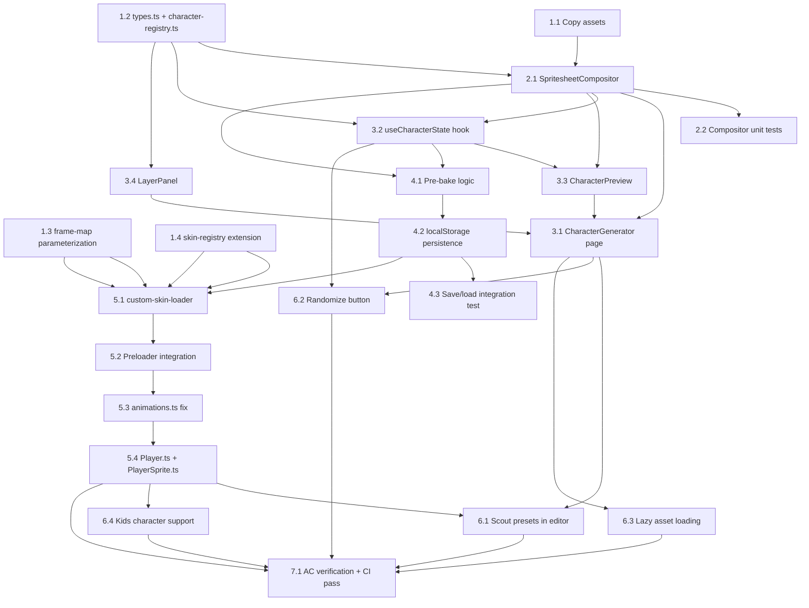

# Work Plan: Character Generator Implementation

Created Date: 2026-02-17
Type: feature
Estimated Duration: 8-12 days
Estimated Impact: ~22 files (10 new, 8 modified, 4 test files)
Commit Strategy: manual (user-initiated commits at phase boundaries)

## Related Documents

- PRD: [docs/prd/prd-005-character-generator.md](../prd/prd-005-character-generator.md)
- Design Doc: [docs/design/design-005-character-generator.md](../design/design-005-character-generator.md)
- ADR: [docs/adr/adr-004-player-entity-architecture.md](../adr/adr-004-player-entity-architecture.md), [docs/adr/adr-005-multiplayer-position-sync.md](../adr/adr-005-multiplayer-position-sync.md)

## Objective

Implement a browser-based Character Generator at `/character-generator` that enables players to composite multiple sprite layers (body, eyes, hairstyle, outfit, accessories) into a unique in-game character skin. The feature uses a pre-bake hybrid approach: real-time canvas compositing for editor preview, and a single pre-baked spritesheet for Phaser game rendering with zero runtime overhead.

## Background

Players currently have no control over their character appearance. The game randomly assigns one of 6 pre-made scout skins. The LimeZu Modern Interiors Character Generator asset pack provides comprehensive sprite layers (9 bodies, 7 eye styles, 29+ hairstyles, 33+ outfits, 20+ accessories) that can be composited in-browser. An existing Portrait Generator at `/portrait-generator` establishes the architectural pattern for canvas compositing and layer selection UI.

Key technical challenges:
- Column count mismatch: body sheets (927px, 57 cols) vs overlay sheets (896px, 56 cols)
- Pre-baked output (896x656, 56 cols) must integrate with existing Phaser animation system designed for 57-col scouts
- The `frame-map.ts` module has a hardcoded `TEXTURE_WIDTH = 927` that must be parameterized
- `animations.ts` has a hardcoded `'scout'` skinKey that must be fixed

## Phase Structure Diagram

## Task Dependency Diagram

## Risks and Countermeasures

### Technical Risks

- **Risk**: Column mismatch (57 cols body vs 56 cols overlay) causes frame misalignment in composited spritesheet
  - **Impact**: High -- all custom character animations would be visually broken
  - **Countermeasure**: Comprehensive unit tests for `extractFrame()` at boundary columns (col 0, col 23, col 55, col 56). Visual verification with reference composites. Test early in Phase 2 before building UI.

- **Risk**: Pre-baked spritesheet incompatible with Phaser animation definitions
  - **Impact**: High -- custom characters would not animate correctly in-game
  - **Countermeasure**: Unit test `getAnimationDefs()` with both 927px and 896px texture widths. Integration test that loads pre-baked sheet into Phaser and verifies all 27 animations play.

- **Risk**: Scout sheet pixel layout differs from character generator body sheets (e.g., indicator row, Y-offset)
  - **Impact**: Medium -- may require Y-offset compensation in compositor
  - **Countermeasure**: Visual comparison of scout sheet and character generator body sheet during Phase 1 asset setup. Document any differences before proceeding.

- **Risk**: Smartphone partial sheets (384x192) cause compositor errors expecting full-size sheets
  - **Impact**: Low -- smartphones are a Should Have feature
  - **Countermeasure**: Detect sheet dimensions in compositor. Defer smartphone support to Phase 6 (Should Have). For partial sheets, composite only covered frames.

- **Risk**: localStorage quota exceeded with spritesheet data URLs
  - **Impact**: Medium -- users could not save custom characters
  - **Countermeasure**: Measure actual data URL sizes during Phase 4. Expected 100-300KB, well within 5MB limit. Show clear error message if quota exceeded.

### Schedule Risks

- **Risk**: Character generator asset pack has unexpected layout differences from documentation
  - **Impact**: Medium -- may require additional investigation and compositor adjustments
  - **Countermeasure**: Inspect actual asset files in Phase 1 before writing compositor logic. Document exact pixel layouts.

- **Risk**: Phaser TextureManager's `addBase64` or `addSpriteSheet` has runtime limitations for data URL textures
  - **Impact**: Medium -- may require alternative loading approach
  - **Countermeasure**: Prototype custom skin loading in Phase 5 early. If `addBase64` fails, fall back to creating an `Image` element, setting its `src` to the data URL, then using `textures.addSpriteSheet(key, img, config)`.

## Implementation Phases

### Phase 1: Foundation (Estimated commits: 2-3)

**Purpose**: Set up assets, define types, and make backward-compatible modifications to existing modules that all subsequent phases depend on.

#### Tasks

- [ ] **Task 1.1**: Copy character generator assets to `apps/game/public/assets/character-generator/`
  - Copy from `D:\git\github\lmz-tile-search\moderninteriors-win\2_Characters\Character_Generator`
  - Organize into subdirectories: `body/`, `eyes/`, `hairstyle/`, `outfit/`, `accessory/`, `smartphone/`, `book/`
  - Verify asset dimensions match documentation (body: 927x656, overlays: 896x656)
  - Inspect actual pixel layout and document any differences from scout sheets
  - **Commit point**: "Add character generator sprite assets"

- [ ] **Task 1.2**: Create `types.ts` and `character-registry.ts` for layer definitions
  - New file: `apps/game/src/components/character-generator/types.ts`
    - Define `LayerCategory`, `LayerOption`, `SkinRecipe`, `PresetSkinRecipe`, `StoredSkin`, `CharacterState`, `PreBakeResult`, `CustomSkinData`
    - Define localStorage key constants: `SKIN_RECIPE_KEY`, `SKIN_SHEET_KEY`
  - New file: `apps/game/src/components/character-generator/character-registry.ts`
    - Define `getLayerOptions(category, isKid?)` function
    - Define `getDefaultOptions()` function
    - Enumerate all adult body (9), eyes (7), hairstyle (29+variants), outfit (33+variants), accessory (20) options with paths, display names, columns, sheet dimensions
  - AC traceability: Supports AC-1 (default character), AC-4 (layer options display)
  - **Commit point**: "Add character generator type definitions and layer registry"

- [ ] **Task 1.3**: Parameterize `frame-map.ts` `getAnimationDefs()` to accept optional `textureWidth`
  - Modify: `apps/game/src/game/characters/frame-map.ts`
  - Add optional third parameter `textureWidth?: number` with default value `927`
  - Change `const colsPerRow = computeColumnsPerRow(TEXTURE_WIDTH, FRAME_WIDTH)` to use the parameter
  - Backward compatible: all existing callers pass no third argument and get the same 927px behavior
  - Unit test: verify `getAnimationDefs('test', 'test-key')` produces 57-col frames (unchanged)
  - Unit test: verify `getAnimationDefs('test', 'test-key', 896)` produces 56-col frames
  - AC traceability: Supports AC-10 (Phaser integration with custom sheet)

- [ ] **Task 1.4**: Extend `skin-registry.ts` with `type` and `textureWidth` fields
  - Modify: `apps/game/src/game/characters/skin-registry.ts`
  - Add `type: 'preset' | 'custom'` and `textureWidth: number` to `SkinDefinition`
  - Add `type: 'preset'` and `textureWidth: 927` to all existing scout entries
  - Add `getActiveSkin(): SkinDefinition` function that checks localStorage for custom skin, falls back to `getDefaultSkin()`
  - Add `registerCustomSkin(definition: SkinDefinition): void` for runtime registration
  - Unit test: verify `getSkins()` returns skins with new fields, backward compatible
  - AC traceability: Supports AC-11 (backward compatibility), AC-12 (scout presets)

- [ ] Quality check: `pnpm nx lint game && pnpm nx typecheck game && pnpm nx test game`

#### Phase Completion Criteria

- [ ] Assets are accessible at `/assets/character-generator/` and dimensions verified
- [ ] `types.ts` exports all contract types matching Design Doc definitions
- [ ] `character-registry.ts` returns layer options for all adult categories
- [ ] `getAnimationDefs()` accepts optional `textureWidth` and produces correct frame indices for both 927px and 896px
- [ ] `SkinDefinition` has `type` and `textureWidth` fields; all existing skins have `type: 'preset'`
- [ ] All existing tests continue to pass (zero regression)

#### Operational Verification Procedures

1. Run `pnpm nx test game` -- all existing tests pass
2. Run `pnpm nx build game` -- build succeeds with no TypeScript errors
3. Manually verify asset files exist at `apps/game/public/assets/character-generator/body/`, etc.
4. Open one body spritesheet and one overlay spritesheet in an image viewer -- confirm dimensions match documentation

---

### Phase 2: Compositing Engine (Estimated commits: 1-2)

**Purpose**: Implement the core `SpritesheetCompositor` module that handles per-layer frame extraction with column mismatch handling, multi-layer compositing, and full-sheet pre-baking. This is the highest-risk component and must be validated with thorough unit tests before building the UI.

#### Tasks

- [ ] **Task 2.1**: Implement `spritesheet-compositor.ts`
  - New file: `apps/game/src/components/character-generator/spritesheet-compositor.ts`
  - Implement `extractFrame(layer, row, col, dims)` -- returns source rectangle using per-layer column count
  - Implement `drawCompositeFrame(ctx, layers, row, col, dims, scale)` -- draws layers bottom-to-top
  - Implement `prebakeSpritesheet(layers, dims)` -- produces 896x656 canvas with 56 columns
  - Layer draw order: body (bottom) -> eyes -> outfit -> hairstyle -> accessory (top)
  - Handle column mismatch: body frame extraction uses 57-col indexing, overlay uses 56-col indexing
  - Output canvas is exactly 896x656 pixels; columns 56+ from body sheet are discarded
  - No Phaser dependency (pure data module using Canvas API)
  - AC traceability: AC-5 (column mismatch compositing), AC-6 (pixel-identical output), AC-7 (pre-bake output dimensions)

- [ ] **Task 2.2**: Write comprehensive unit tests for SpritesheetCompositor
  - New file: `apps/game/src/components/character-generator/spritesheet-compositor.spec.ts`
  - Test `extractFrame()` source coordinates for body (57 cols) at col 0, col 23, col 55
  - Test `extractFrame()` source coordinates for overlay (56 cols) at col 0, col 23, col 55
  - Test boundary: col 55 (last common column) extracts correctly from both
  - Test `prebakeSpritesheet()` output canvas dimensions are exactly 896x656
  - Test that body-only column 56 is not present in output
  - Test `drawCompositeFrame()` calls `ctx.drawImage()` in correct layer order
  - Test with mock HTMLImageElement and CanvasRenderingContext2D
  - AC traceability: AC-5 (7 test cases), AC-6 (2 test cases), AC-7 (2 test cases)
  - **Commit point**: "Add SpritesheetCompositor engine with unit tests"

- [ ] Quality check: `pnpm nx lint game && pnpm nx typecheck game && pnpm nx test game`

#### Phase Completion Criteria

- [ ] `extractFrame()` returns correct source rectangles for both 57-col and 56-col sheets
- [ ] `prebakeSpritesheet()` produces a canvas of exactly 896x656 pixels
- [ ] All compositing unit tests pass (target: 11+ test cases)
- [ ] No Phaser imports in `spritesheet-compositor.ts`
- [ ] Lint, typecheck, and test all pass

#### Operational Verification Procedures

1. Run compositor unit tests: `pnpm nx test game --testFile=spritesheet-compositor.spec.ts`
2. Verify all frame extraction boundary tests pass (col 0, 23, 55, 56)
3. Verify pre-bake output dimension test passes (896x656)
4. Confirm zero Phaser imports in the compositor module

---

### Phase 3: Editor UI + Preview (Estimated commits: 2-3)

**Purpose**: Build the Character Generator page with layer selection UI, state management hook, and animated canvas preview. At the end of this phase, users can browse layers and see real-time composited preview.

#### Tasks

- [ ] **Task 3.1**: Create `useCharacterState.ts` state management hook
  - New file: `apps/game/src/components/character-generator/useCharacterState.ts`
  - Manage `CharacterState` (selected layers, type, isKid)
  - Implement `setLayer(category, option)` -- update single layer, trigger image loading
  - Implement `randomize()` -- randomly select valid options for all categories
  - Implement image loading with `loadImage()` pattern (Map-based cache, following portrait-canvas pattern)
  - Implement localStorage load on mount (restore saved recipe)
  - Track `isLoading`, `isSaving`, `hasUnsavedChanges` states
  - AC traceability: AC-2 (preview updates within 100ms), AC-9 (restore from localStorage), AC-14 (randomize)

- [ ] **Task 3.2**: Create `CharacterPreview.tsx` animated canvas preview
  - New file: `apps/game/src/components/character-generator/CharacterPreview.tsx`
  - Canvas-based component using `requestAnimationFrame` for idle animation cycling
  - Accept `layerImages` map and render composited frames using `drawCompositeFrame()`
  - Display at 4x+ native scale (64x128 pixels or larger) for visibility
  - Show 4 directional views or toggle between directions
  - Update within 100ms of layer change (re-render on layerImages change)
  - AC traceability: AC-1 (preview with idle animation), AC-2 (update within 100ms), AC-3 (body required)

- [ ] **Task 3.3**: Create `LayerPanel.tsx` layer selection component
  - New file: `apps/game/src/components/character-generator/LayerPanel.tsx`
  - Category-based panel with thumbnail previews of available options
  - Single-select per category (one active option at a time)
  - Body always required; eyes, hairstyle, outfit, accessory individually optional (show "None" option)
  - Display loading indicator while category assets load
  - AC traceability: AC-3 (body required, others optional), AC-4 (selectable thumbnails)

- [ ] **Task 3.4**: Create `CharacterGenerator.tsx` main editor and `page.tsx`
  - New file: `apps/game/src/components/character-generator/CharacterGenerator.tsx`
    - Main editor layout: preview panel (left) + layer selection (right)
    - Action buttons: Save, Randomize (Save wired in Phase 4)
    - Dark theme UI with CSS Modules
  - New file: `apps/game/src/components/character-generator/CharacterGenerator.module.css`
    - Responsive layout: desktop (1440px+) and tablet (768px+)
    - Dark theme consistent with game aesthetic
  - New file: `apps/game/src/app/character-generator/page.tsx`
    - `'use client'` directive
    - Thin wrapper rendering `<CharacterGenerator />`
  - AC traceability: AC-1 (page at `/character-generator`), AC-4 (category panels)
  - **Commit point**: "Add Character Generator page with preview and layer selection"

- [ ] Quality check: `pnpm nx lint game && pnpm nx typecheck game && pnpm nx build game`

#### Phase Completion Criteria

- [ ] `/character-generator` page loads and displays editor UI
- [ ] Default character (first body + first eyes + first hairstyle + first outfit) renders in preview with idle animation
- [ ] Changing a layer option updates the preview immediately
- [ ] Body cannot be deselected; other layers can be set to "None"
- [ ] Responsive layout renders correctly at 768px and 1440px widths
- [ ] Build succeeds with no TypeScript errors

#### Operational Verification Procedures

1. Run `pnpm nx dev game` and navigate to `http://localhost:3000/character-generator`
2. Verify the editor page loads with a preview canvas showing an animated character
3. Open each layer category panel -- verify options are displayed as thumbnails
4. Select a different hairstyle -- verify preview updates immediately (visually < 100ms)
5. Deselect eyes (set to None) -- verify preview shows character without eyes layer
6. Attempt to deselect body -- verify it is not possible (body always required)
7. Test at 768px viewport width -- verify layout is usable (browser DevTools responsive mode)
8. Verify `pnpm nx build game` succeeds

---

### Phase 4: Pre-bake + localStorage Persistence (Estimated commits: 1-2)

**Purpose**: Implement the Save action that pre-bakes all selected layers into a single 896x656 spritesheet and persists both the recipe JSON and data URL to localStorage. Implement the load-on-revisit flow.

#### Tasks

- [ ] **Task 4.1**: Implement pre-bake logic in `useCharacterState`
  - Extend `useCharacterState.ts` with `save()` method
  - Call `prebakeSpritesheet()` from compositor to produce 896x656 canvas
  - Convert canvas to data URL via `canvas.toDataURL('image/png')`
  - Validate output: canvas width === 896, canvas height === 656
  - Measure and log pre-bake timing with `performance.now()`
  - AC traceability: AC-7 (pre-bake to 896x656 PNG), AC-8 (under 2 seconds)

- [ ] **Task 4.2**: Implement localStorage persistence
  - Store recipe JSON at `nookstead:skin:recipe` key
  - Store data URL at `nookstead:skin:sheet` key
  - Handle `QuotaExceededError` with user-facing error message
  - Handle localStorage unavailable (private browsing) with informational message
  - On component mount, load saved recipe and restore layer selections
  - AC traceability: AC-7 (store in localStorage), AC-9 (restore on revisit)

- [ ] **Task 4.3**: Write save/load round-trip integration test
  - Test: save recipe -> read from localStorage -> verify all fields preserved
  - Test: pre-bake -> store data URL -> create Image from data URL -> verify dimensions
  - Test: corrupt recipe in localStorage -> verify fallback to defaults
  - Test: localStorage unavailable -> verify editor still functions for preview
  - AC traceability: AC-7 (2 test cases), AC-9 (2 test cases)
  - **Commit point**: "Add pre-bake save and localStorage persistence"

- [ ] Quality check: `pnpm nx lint game && pnpm nx typecheck game && pnpm nx test game`

#### Phase Completion Criteria

- [ ] Clicking Save pre-bakes all layers into a single 896x656 PNG spritesheet
- [ ] Recipe JSON and data URL are stored in localStorage
- [ ] Pre-bake completes in under 2 seconds (verified by console timing log)
- [ ] Revisiting `/character-generator` restores all layer selections from saved recipe
- [ ] Graceful handling of localStorage errors (quota exceeded, unavailable)
- [ ] All tests pass

#### Operational Verification Procedures

1. Navigate to `/character-generator`, select layers, click Save
2. Open browser DevTools > Application > localStorage -- verify `nookstead:skin:recipe` contains valid JSON and `nookstead:skin:sheet` contains a `data:image/png;base64,...` string
3. Measure pre-bake time in console output -- confirm < 2 seconds
4. Close and reopen `/character-generator` -- verify all selections are restored
5. Clear localStorage, revisit page -- verify editor loads with defaults (no crash)

---

### Phase 5: Phaser Integration (Estimated commits: 2-3)

**Purpose**: Connect the pre-baked custom skin to the Phaser game engine. Load the custom spritesheet from localStorage, register it as a Phaser texture, fix the hardcoded skinKey in animations.ts, and update Player/PlayerSprite to support custom skins.

#### Tasks

- [ ] **Task 5.1**: Create `custom-skin-loader.ts`
  - New file: `apps/game/src/game/characters/custom-skin-loader.ts`
  - Implement `getCustomSkinData(): CustomSkinData | null` -- read recipe + data URL from localStorage
  - Implement `loadCustomSkin(scene, data): Promise<SkinDefinition>` -- create Image from data URL, register as Phaser spritesheet texture with `textures.addSpriteSheet(key, img, { frameWidth: 16, frameHeight: 32 })`
  - Return `SkinDefinition` with `type: 'custom'`, `textureWidth: 896`, `sheetKey: 'custom-skin'`
  - Handle errors: if data URL is invalid or texture creation fails, return null
  - AC traceability: AC-10 (register pre-baked as Phaser texture), AC-11 (fallback to scout)

- [ ] **Task 5.2**: Integrate custom skin loading into `Preloader.ts`
  - Modify: `apps/game/src/game/scenes/Preloader.ts`
  - In `create()`, before existing animation registration:
    1. Call `getCustomSkinData()` to check for custom skin
    2. If found, call `loadCustomSkin()` to register texture
    3. Call `registerAnimations()` for the custom skin with `textureWidth=896`
    4. Call `registerCustomSkin()` to add to skin registry
  - Preserve existing scout skin loading (all scouts still loaded and registered)
  - AC traceability: AC-10 (load on game boot), AC-11 (preserve scout loading)

- [ ] **Task 5.3**: Fix hardcoded `'scout'` in `animations.ts`
  - Modify: `apps/game/src/game/characters/animations.ts` line 37
  - Change `getAnimationDefs('scout', sheetKey)` to `getAnimationDefs(sheetKey, sheetKey)` or pass actual skin key
  - This is a bug fix: currently all skins use `'scout'` as the skinKey parameter, which happens to work because `getAnimationDefs` only uses it as a reference (frame computation does not depend on skinKey)
  - However, for consistency and to pass the correct `textureWidth`, update to use the parameterized version:
    - Accept `textureWidth` parameter in `registerAnimations()` and pass to `getAnimationDefs()`
  - AC traceability: AC-10 (correct animation registration for custom sheets)

- [ ] **Task 5.4**: Update `Player.ts` and `PlayerSprite.ts` for custom skin support
  - Modify: `apps/game/src/game/entities/Player.ts`
    - Change constructor to call `getActiveSkin()` instead of `getDefaultSkin()`
    - `getActiveSkin()` checks localStorage for custom skin recipe, returns custom SkinDefinition if found, otherwise returns default scout
  - Modify: `apps/game/src/game/entities/PlayerSprite.ts`
    - Update constructor to handle `skinKey` that may be `'custom-skin'`
    - If `getSkinByKey(skinKey)` returns undefined and skinKey starts with `{` (JSON), parse as recipe for future multiplayer support
  - Modify: `packages/shared/src/constants.ts`
    - Add `'custom-skin'` to `SkinKey` union type (or make the type more flexible)
  - AC traceability: AC-10 (local player uses custom skin), AC-11 (fallback to scout)
  - **Commit point**: "Integrate custom skin loading with Phaser game engine"

- [ ] Quality check: `pnpm nx lint game && pnpm nx typecheck game && pnpm nx test game && pnpm nx build game`

#### Phase Completion Criteria

- [ ] Custom skin loads from localStorage into Phaser TextureManager on game boot
- [ ] All 7 animation states (idle, waiting, walk, sit, hit, punch, hurt) play correctly with custom skin
- [ ] Local player renders with custom skin when one is saved
- [ ] Game falls back to default scout skin when no custom skin exists (zero regression)
- [ ] All existing scout skins still load and render correctly
- [ ] `animations.ts` no longer hardcodes `'scout'` skinKey
- [ ] All tests pass, build succeeds

#### Operational Verification Procedures

**Integration Point 3: localStorage -> Phaser** (from Design Doc):
1. Save a custom skin in `/character-generator` (from Phase 4)
2. Navigate to `/game` (or reload the game page)
3. Verify the local player character renders with the custom spritesheet (not a scout skin)
4. Verify idle animation plays correctly (character animates, no visual glitches)
5. Move the character -- verify walk animation plays correctly in all 4 directions
6. Clear localStorage, reload game -- verify player renders with default scout skin (backward compatible)
7. Verify all 6 scout skins still display correctly when assigned by server

---

### Phase 6: Polish + Should-Have Features (Estimated commits: 2-4)

**Purpose**: Add scout preset selection in the editor, randomize button, lazy asset loading, and kids character support. These complete the user-facing feature set.

#### Tasks

- [ ] **Task 6.1**: Scout presets in Character Generator UI
  - Add preset skin selection panel to `CharacterGenerator.tsx`
  - Display 6 scout skins as preset options alongside the custom editor
  - Selecting a preset sets `type: 'preset'` with the scout key in localStorage
  - Selecting a preset does NOT delete custom skin data (custom skin can be restored later)
  - Game loads the correct preset scout spritesheet when type is 'preset'
  - AC traceability: AC-12 (scout preset selection), AC-13 (custom data preserved)
  - **Commit point**: "Add scout preset selection to Character Generator"

- [ ] **Task 6.2**: Randomize button implementation
  - Wire the Randomize button in `CharacterGenerator.tsx`
  - Call `randomize()` from `useCharacterState` hook
  - Randomly select valid options for every visible layer category (body, eyes, hairstyle, outfit, accessory)
  - Respect compatibility constraints (only adult options when `isKid === false`)
  - Preview updates immediately after randomization
  - AC traceability: AC-14 (random selection + immediate preview update)

- [ ] **Task 6.3**: Lazy asset loading by category
  - Modify `useCharacterState.ts` and `LayerPanel.tsx`
  - On page load, fetch only assets for default character (1 body, 1 eyes, 1 hairstyle, 1 outfit) -- fewer than 20 spritesheets
  - When player opens a category panel, load that category's assets on-demand
  - Show loading indicator (skeleton UI or spinner) while category assets load
  - Use single-frame thumbnail extraction for fast category browsing
  - AC traceability: AC-15 (fewer than 20 initial fetches), AC-16 (on-demand loading with indicator)
  - **Commit point**: "Add lazy asset loading and randomize to Character Generator"

- [ ] **Task 6.4**: Kids character support (Should Have)
  - Extend `character-registry.ts` with kids layer options: body (4), eyes (6), hairstyle (6), outfit (7)
  - Add Adult/Kids toggle to `CharacterGenerator.tsx`
  - Switching mode resets incompatible layer selections
  - Set `isKid` flag in recipe
  - Kids body sheets: 384x128; kids overlay sheets: 384x96 or 384x128
  - Update compositor to handle kids sheet dimensions
  - AC traceability: PRD FR-11 (kids character support)
  - **Commit point**: "Add kids character type support"

- [ ] Quality check: `pnpm nx lint game && pnpm nx typecheck game && pnpm nx test game && pnpm nx build game`

#### Phase Completion Criteria

- [ ] Scout presets are selectable in the editor; selecting a preset preserves custom skin data
- [ ] Randomize button generates a complete character with all layers filled
- [ ] Initial page load fetches fewer than 20 spritesheet files
- [ ] Opening a category panel triggers on-demand loading with visible indicator
- [ ] Kids toggle switches between adult and kids layer options
- [ ] All tests pass, build succeeds

#### Operational Verification Procedures

1. Open `/character-generator` -- count network requests in DevTools Network tab -- confirm < 20 spritesheet files on initial load
2. Open the Hairstyle category -- verify loading indicator appears, then hairstyle options load
3. Click Randomize -- verify all layer categories are populated and preview updates
4. Select scout_3 preset -- navigate to game -- verify scout_3 renders
5. Return to character generator -- verify custom skin data is still available (can switch back to custom)
6. Toggle to Kids mode -- verify only kids options are shown
7. Toggle back to Adult -- verify adult options return

---

### Phase 7: Quality Assurance (Required) (Estimated commits: 1)

**Purpose**: Final quality gate. Verify all Design Doc acceptance criteria are met, all tests pass, CI pipeline succeeds, and no regressions in existing functionality.

#### Tasks

- [ ] **Task 7.1**: Verify all Design Doc acceptance criteria
  - [ ] AC-1: Page loads at `/character-generator` with default character and idle animation
  - [ ] AC-2: Layer selection updates preview within 100ms
  - [ ] AC-3: Body required, other layers optional
  - [ ] AC-4: All options displayed as selectable thumbnails, single-select per category
  - [ ] AC-5: Body (57-col) + overlay (56-col) composited without misalignment
  - [ ] AC-6: Compositor output pixel-identical to manual layering (verified by unit tests)
  - [ ] AC-7: Save produces 896x656 PNG in localStorage
  - [ ] AC-8: Pre-bake under 2 seconds
  - [ ] AC-9: Revisit restores saved selections
  - [ ] AC-10: Custom skin renders in Phaser with all 7 animation states
  - [ ] AC-11: No custom skin = identical scout behavior (no regression)
  - [ ] AC-12: Scout preset selection works in game
  - [ ] AC-13: Scout preset does not delete custom data
  - [ ] AC-14: Randomize fills all categories and updates preview
  - [ ] AC-15: Initial load < 20 spritesheet fetches
  - [ ] AC-16: Category opening triggers on-demand loading with indicator

- [ ] **Task 7.2**: Run full CI pipeline
  - `pnpm nx run-many -t lint test build typecheck`
  - Verify zero lint errors
  - Verify zero TypeScript errors
  - Verify all unit tests pass
  - Verify build succeeds
  - Note: E2E tests (`pnpm nx e2e game-e2e`) run if Playwright is configured

- [ ] **Task 7.3**: Regression verification
  - Verify existing scout skins render correctly in game
  - Verify portrait generator (`/portrait-generator`) still works (no shared state conflict)
  - Verify multiplayer player sync works with scout skins (no regression from shared type changes)

- [ ] **Task 7.4**: Code quality review
  - Verify no unused imports or dead code in new files
  - Verify all new files follow project conventions (single quotes, 2-space indent, `@/` path aliases)
  - Verify CSS Modules used for all styling (no inline styles or Tailwind)
  - Verify no `console.log` (only `console.info` and `console.error` as per logging standards)
  - **Commit point**: "Character Generator: final quality verification pass"

#### Phase Completion Criteria

- [ ] All 16 acceptance criteria verified and checked off
- [ ] CI pipeline passes: lint, test, build, typecheck
- [ ] Zero regressions in existing functionality
- [ ] Code follows all project conventions

#### Operational Verification Procedures

Full end-to-end workflow:
1. Navigate to `/character-generator` -- editor loads with default character
2. Select custom body, eyes, hairstyle, outfit, accessory -- preview updates in real-time
3. Click Randomize -- all layers change, preview updates
4. Click Save -- pre-bake completes, confirmation shown
5. Close browser tab, reopen `/character-generator` -- selections restored
6. Navigate to game -- custom character renders with correct animations
7. Select scout_3 preset in character generator -- save
8. Navigate to game -- scout_3 renders (custom data preserved in localStorage)
9. Return to character generator -- switch back to custom -- save
10. Navigate to game -- custom character renders again
11. Clear all localStorage -- navigate to game -- default scout renders (no crash)

## Completion Criteria

- [ ] All 7 phases completed with checkboxes checked
- [ ] All 16 Design Doc acceptance criteria satisfied (AC-1 through AC-16)
- [ ] Each phase's operational verification procedures executed successfully
- [ ] CI pipeline passes: `pnpm nx run-many -t lint test build typecheck`
- [ ] All unit tests pass with reasonable coverage for new code
- [ ] Zero regressions in existing scout skin system
- [ ] Portrait generator continues to work independently
- [ ] Code follows all project conventions (Prettier, ESLint, TypeScript strict, CSS Modules, @/ aliases)

## Quality Checklist

- [ ] Design Doc consistency verification
- [ ] Phase composition based on technical dependencies
- [ ] All requirements converted to tasks
- [ ] Quality assurance exists in final phase
- [ ] E2E verification procedures placed at integration points
- [ ] Risk level-based prioritization applied (compositor tested before UI)
- [ ] AC and test case traceability specified per task

## Files Summary

### New Files (10)

| File | Phase | Purpose |
|------|-------|---------|
| `apps/game/src/components/character-generator/types.ts` | 1 | Type definitions and contracts |
| `apps/game/src/components/character-generator/character-registry.ts` | 1 | Layer asset definitions and registry |
| `apps/game/src/components/character-generator/spritesheet-compositor.ts` | 2 | Frame extraction and compositing engine |
| `apps/game/src/components/character-generator/spritesheet-compositor.spec.ts` | 2 | Compositor unit tests |
| `apps/game/src/components/character-generator/useCharacterState.ts` | 3 | State management hook |
| `apps/game/src/components/character-generator/CharacterPreview.tsx` | 3 | Animated canvas preview |
| `apps/game/src/components/character-generator/LayerPanel.tsx` | 3 | Layer selection UI |
| `apps/game/src/components/character-generator/CharacterGenerator.tsx` | 3 | Main editor component |
| `apps/game/src/components/character-generator/CharacterGenerator.module.css` | 3 | Editor styles |
| `apps/game/src/app/character-generator/page.tsx` | 3 | Next.js page |
| `apps/game/src/game/characters/custom-skin-loader.ts` | 5 | Phaser custom skin loading |

### Modified Files (8)

| File | Phase | Change |
|------|-------|--------|
| `apps/game/src/game/characters/frame-map.ts` | 1 | Add optional `textureWidth` parameter |
| `apps/game/src/game/characters/skin-registry.ts` | 1 | Add `type`, `textureWidth` fields; add `getActiveSkin()`, `registerCustomSkin()` |
| `apps/game/src/game/characters/animations.ts` | 5 | Fix hardcoded `'scout'` skinKey; pass `textureWidth` |
| `apps/game/src/game/scenes/Preloader.ts` | 5 | Add custom skin detection and loading before scout loading |
| `apps/game/src/game/entities/Player.ts` | 5 | Use `getActiveSkin()` instead of `getDefaultSkin()` |
| `apps/game/src/game/entities/PlayerSprite.ts` | 5 | Handle custom skin keys |
| `packages/shared/src/constants.ts` | 5 | Extend `SkinKey` type |
| `apps/game/public/assets/character-generator/` | 1 | Asset files (directory, not code) |

## Progress Tracking

### Phase 1: Foundation
- Start:
- Complete:
- Notes:

### Phase 2: Compositing Engine
- Start:
- Complete:
- Notes:

### Phase 3: Editor UI + Preview
- Start:
- Complete:
- Notes:

### Phase 4: Pre-bake + Persistence
- Start:
- Complete:
- Notes:

### Phase 5: Phaser Integration
- Start:
- Complete:
- Notes:

### Phase 6: Polish + Should-Have
- Start:
- Complete:
- Notes:

### Phase 7: Quality Assurance
- Start:
- Complete:
- Notes:

## Notes

- **Commit Strategy**: Manual commits. Good commit points are marked in each phase's tasks. Each phase boundary is a natural commit point.
- **Implementation Approach**: Vertical slice (feature-driven) as specified in the Design Doc. The compositing engine is built and tested first (highest risk), then the UI, then Phaser integration.
- **Dependency Chain**: The maximum dependency depth is 2 levels (e.g., compositor -> pre-bake -> Phaser loader), satisfying the 2-level maximum rule.
- **Parallel Work**: Tasks 1.3 and 1.4 (frame-map and skin-registry modifications) can be done in parallel with Task 1.2 (types and registry). Tasks 3.2, 3.3, 3.4 can be developed in parallel once the compositor and hook are ready.
- **Smartphone/Book layers**: Deferred to Phase 6 or a follow-up. Partial sheet handling (384x192) adds complexity and is a Should Have feature.
- **Multiplayer recipe sync** (FR-14): The foundation is laid in Phase 5 (PlayerSprite recipe detection), but full multiplayer baking of remote custom skins is deferred to a follow-up plan. The current plan focuses on local custom skin rendering.
