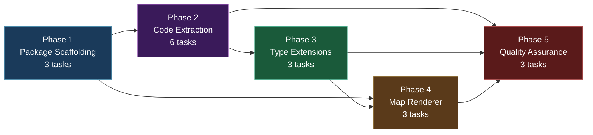
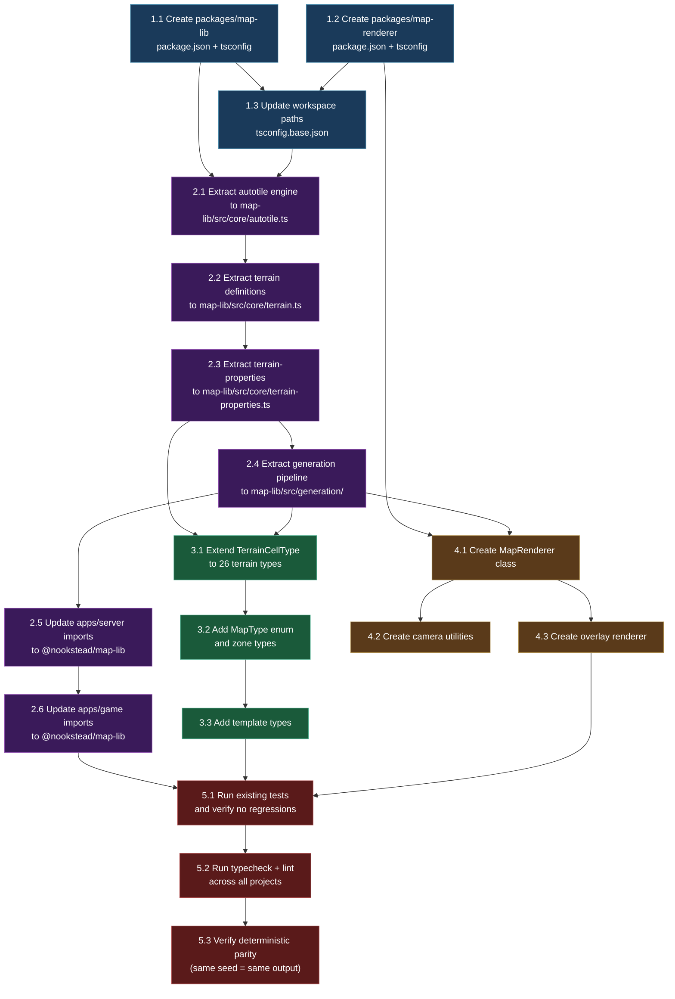

# Work Plan: Map Editor Batch 1 -- Shared Map Library + Extended Type System

Created Date: 2026-02-19
Completed Date: 2026-02-19
Status: COMPLETED
Type: feature
Estimated Duration: 3 days
Estimated Impact: 30+ files (12 modified, 20+ new)
Related Issue/PR: N/A

## Related Documents

- PRD: [docs/prd/prd-007-map-editor.md](../prd/prd-007-map-editor.md) (FR-1.1 through FR-1.12)
- ADR: [docs/adr/adr-006-map-editor-architecture.md](../adr/adr-006-map-editor-architecture.md) (Decisions 1-2: three-package architecture, zero-build pattern)
- Design Doc: [docs/design/design-007-map-editor.md](../design/design-007-map-editor.md) (Batch 1: Sections 1.1-1.8)

## Objective

Extract duplicated map generation and autotile code into a shared `packages/map-lib` package, create a `packages/map-renderer` package for Phaser rendering, extend the type system to support all 26 terrain types plus zone and template types, and update all consumers to use the shared packages. This eliminates the three-way code duplication of the autotile engine (game, server, and upcoming genmap editor) and establishes the foundation for all subsequent Map Editor batches.

## Background

Map-related algorithms are duplicated between `apps/game/` and `apps/server/`:

| File (game) | File (server) | Content | Identical? |
|---|---|---|---|
| `src/game/autotile.ts` | `src/mapgen/autotile.ts` | Blob-47 autotile engine (184 lines) | Yes (one JSDoc word differs) |
| `src/game/terrain.ts` | N/A | 26 terrain definitions, relationships, tileset groups | No server equivalent |
| `src/game/terrain-properties.ts` | `src/mapgen/terrain-properties.ts` | Surface walkability properties (3 terrains each) | Functionally identical |
| N/A | `src/mapgen/index.ts` + `passes/*.ts` | Full generation pipeline (MapGenerator + 4 passes) | Server-only |

The genmap app (Map Editor) will become the third consumer of autotile and terrain code, triggering the Rule of Three for extraction. The current `TerrainCellType` in `@nookstead/shared` supports only 3 types (`deep_water | water | grass`) despite 26 tilesets being defined in the game client. This batch extends the type system to cover all 26 types and adds zone/template types needed by later batches.

The implementation follows a horizontal slice (foundation-driven) approach: scaffolding first, then extraction, then type extension, then new renderer code. Each phase builds on the previous one. No test design information is provided from a previous process, so Strategy B (implementation-first) applies.

## Prerequisites

Before starting this plan:

- [x] `packages/shared/src/types/map.ts` exists with core types (TerrainCellType, Cell, Grid, LayerData, GeneratedMap, GenerationPass, LayerPass)
- [x] `packages/db/package.json` provides the zero-build package.json pattern to follow
- [x] `apps/game/src/game/autotile.ts` and `apps/server/src/mapgen/autotile.ts` contain the autotile engine to extract
- [x] `apps/server/src/mapgen/` contains the generation pipeline to extract
- [x] `pnpm-workspace.yaml` includes `packages/*` glob
- [x] All existing tests pass (`pnpm nx run-many -t lint test build typecheck`)

## Phase Structure Diagram



## Task Dependency Diagram



## Risks and Countermeasures

### Technical Risks

- **Risk**: Autotile frame inconsistency after extraction to shared package
  - **Impact**: High -- maps render differently in game/server vs extracted library
  - **Detection**: Deterministic parity test in Phase 5 (Task 5.3) compares output for seed 12345 before and after extraction
  - **Countermeasure**: Extract autotile.ts verbatim (byte-for-byte copy). The server and game copies are already identical except for one JSDoc word. Run existing `index.spec.ts` tests against the new import paths before deleting old files.

- **Risk**: `simplex-noise` and `alea` have import resolution issues through a zero-build TypeScript package chain
  - **Impact**: Medium -- generation pipeline fails to import noise libraries from map-lib
  - **Detection**: `pnpm nx typecheck server` or runtime error when calling `createMapGenerator()`
  - **Countermeasure**: These are pure ESM JS libraries already working in the server. The zero-build pattern is proven by `@nookstead/db` with `drizzle-orm`. If resolution fails, add explicit `"type": "module"` and verify `tsconfig.json` `moduleResolution: "bundler"` propagates correctly.

- **Risk**: Extended `TerrainCellType` (26 types) breaks existing `Record<TerrainCellType, T>` usage
  - **Impact**: High -- TypeScript compilation errors in terrain-properties.ts (which only defines 3 entries)
  - **Detection**: `pnpm nx typecheck server` and `pnpm nx typecheck game` fail immediately after extending the union
  - **Countermeasure**: Extend terrain-properties.ts to include all 26 entries at the same time as the type extension (Task 3.1 depends on Task 2.3 being complete). The terrain-properties file in map-lib will already have all 26 entries per the Design Doc.

- **Risk**: Circular dependency between map-lib and shared packages
  - **Impact**: Medium -- import resolution fails or infinite loops
  - **Detection**: TypeScript or runtime errors during Phase 2
  - **Countermeasure**: map-lib imports types FROM shared; shared does NOT import from map-lib. map-lib re-exports shared types for convenience but the dependency direction is strictly one-way (map-lib -> shared, never shared -> map-lib).

- **Risk**: Game client imports break when local autotile/terrain files are replaced
  - **Impact**: High -- game app fails to build
  - **Detection**: `pnpm nx build game` fails in Phase 2
  - **Countermeasure**: Use a two-step approach: first replace local files with thin re-exports from `@nookstead/map-lib`, then update all consumer imports. This ensures the build never breaks during migration. Only delete re-export files after all consumers are updated and tests pass.

### Schedule Risks

- **Risk**: More files import from local autotile/terrain/mapgen than documented
  - **Impact**: Phase 2 import updates take longer than estimated
  - **Countermeasure**: Grep-based search has identified all current importers. The migration uses re-export files as a safety net, so undiscovered importers will still work through the re-exports.

## Implementation Phases

### Phase 1: Package Scaffolding (Estimated commits: 2)

**Purpose**: Create the two new packages (`packages/map-lib` and `packages/map-renderer`) with proper package.json and tsconfig.json following the zero-build pattern, and update workspace configuration so Nx and TypeScript recognize them.

**Derives from**: Design Doc Sections 1.1-1.3; ADR-0009 Decisions 1-2
**ACs covered**: FR-1.1 (partial -- package exists), FR-1.10 (partial -- package exists)

#### Tasks

- [ ] **Task 1.1**: Create `packages/map-lib/` with package.json and tsconfig.json
  - **Input files**: `packages/db/package.json` (pattern reference), `packages/db/tsconfig.json` (pattern reference)
  - **Output files**:
    - `packages/map-lib/package.json` (new)
    - `packages/map-lib/tsconfig.json` (new)
    - `packages/map-lib/tsconfig.lib.json` (new)
    - `packages/map-lib/src/index.ts` (new, empty barrel)
  - **Description**: Create the map-lib package following the `@nookstead/db` zero-build pattern. The `package.json` sets `"name": "@nookstead/map-lib"`, `"private": true`, `"type": "module"`, `"main": "./src/index.ts"`, `"types": "./src/index.ts"`, with exports map pointing to `./src/index.ts`. Add Nx tags `["scope:shared", "type:lib"]`. Add dependencies: `@nookstead/shared: "workspace:*"`, `alea: "^1.0.1"`, `simplex-noise: "^4.0.3"`, `tslib: "^2.3.0"`. The `tsconfig.json` extends `../../tsconfig.base.json` and references `tsconfig.lib.json`. Create a minimal `src/index.ts` with a placeholder comment. Create directory stubs: `src/core/`, `src/generation/`, `src/generation/passes/`, `src/types/`.
  - **Dependencies**: None (first task)
  - **Acceptance criteria**: `packages/map-lib/package.json` exists with correct name, type, main, types, exports, and nx tags. `pnpm install` resolves workspace dependencies without error. Empty `src/index.ts` barrel file exists.

- [ ] **Task 1.2**: Create `packages/map-renderer/` with package.json and tsconfig.json
  - **Input files**: `packages/db/package.json` (pattern reference)
  - **Output files**:
    - `packages/map-renderer/package.json` (new)
    - `packages/map-renderer/tsconfig.json` (new)
    - `packages/map-renderer/tsconfig.lib.json` (new)
    - `packages/map-renderer/src/index.ts` (new, empty barrel)
  - **Description**: Create the map-renderer package with zero-build pattern. Sets `"name": "@nookstead/map-renderer"`, `"private": true`, `"type": "module"`. Nx tags: `["scope:client", "type:lib"]`. Dependencies: `@nookstead/map-lib: "workspace:*"`, `tslib: "^2.3.0"`. Peer dependencies: `phaser: "^3.80.0"`. Create directory stubs: `src/`.
  - **Dependencies**: None (can run parallel with 1.1)
  - **Acceptance criteria**: `packages/map-renderer/package.json` exists with correct configuration, phaser peer dependency declared. `pnpm install` resolves without error.

- [ ] **Task 1.3**: Update workspace paths in `tsconfig.base.json` and run `pnpm install`
  - **Input files**: `tsconfig.base.json`, `pnpm-workspace.yaml`
  - **Output files**:
    - `tsconfig.base.json` (modified -- add path aliases if needed)
    - `apps/server/package.json` (modified -- add `@nookstead/map-lib: "workspace:*"` dependency)
    - `apps/game/package.json` (modified -- add `@nookstead/map-lib: "workspace:*"` and `@nookstead/map-renderer: "workspace:*"` dependencies)
  - **Description**: The `pnpm-workspace.yaml` already includes `packages/*` glob, so no change needed there. Check if `tsconfig.base.json` needs path mappings for the new packages (likely not -- the workspace protocol handles resolution). Add `@nookstead/map-lib` as a dependency to `apps/server/package.json` and `apps/game/package.json`. Add both `@nookstead/map-lib` and `@nookstead/map-renderer` to `apps/game/package.json`. Run `pnpm install` to link workspace packages.
  - **Dependencies**: Task 1.1, Task 1.2
  - **Acceptance criteria**: `pnpm install` exits 0. The new packages appear in `node_modules/@nookstead/`. `pnpm nx show projects` lists `map-lib` and `map-renderer` as recognized projects.

#### Phase Completion Criteria

- [ ] `packages/map-lib/` exists with correct `package.json`, `tsconfig.json`, barrel `src/index.ts`
- [ ] `packages/map-renderer/` exists with correct `package.json`, `tsconfig.json`, barrel `src/index.ts`
- [ ] `pnpm install` resolves all workspace dependencies
- [ ] Nx recognizes both new packages (`pnpm nx show projects` lists them)
- [ ] Existing builds are not broken (`pnpm nx build game` and `pnpm nx build server` still succeed)

#### Operational Verification Procedures

1. Run `pnpm nx show projects` and confirm `map-lib` and `map-renderer` appear in the project list
2. Run `pnpm install` and verify exit code 0 with no peer dependency warnings for the new packages
3. Run `pnpm nx build game` and `pnpm nx build server` to verify no regressions from adding workspace dependencies

---

### Phase 2: Code Extraction (Estimated commits: 4)

**Purpose**: Move existing autotile engine, terrain definitions, terrain properties, and generation pipeline from `apps/game/` and `apps/server/` into `packages/map-lib/`. Replace local files with re-exports first, then update all consumer imports to point to `@nookstead/map-lib`. Create the map-lib barrel export (`src/index.ts`) with all public API.

**Derives from**: Design Doc Sections 1.4-1.7; FR-1.2, FR-1.3, FR-1.4, FR-1.5
**ACs covered**: FR-1.2 (autotile extraction), FR-1.3 (terrain extraction), FR-1.4 (generation extraction), FR-1.5 (import updates)

#### Tasks

- [x] **Task 2.1**: Extract autotile engine to `packages/map-lib/src/core/autotile.ts`
  - **Input files**: `apps/game/src/game/autotile.ts` (184 lines, primary source), `apps/server/src/mapgen/autotile.ts` (identical copy)
  - **Output files**:
    - `packages/map-lib/src/core/autotile.ts` (new -- verbatim copy from game app)
  - **Description**: Copy `apps/game/src/game/autotile.ts` verbatim to `packages/map-lib/src/core/autotile.ts`. The file has zero browser/Phaser dependencies -- it is pure TypeScript with no imports. Export all public symbols: `N`, `NE`, `E`, `SE`, `S`, `SW`, `W`, `NW`, `FRAMES_PER_TERRAIN`, `SOLID_FRAME`, `ISOLATED_FRAME`, `EMPTY_FRAME`, `getFrame`, `VALID_BLOB47_MASKS`. Also export `gateDiagonals` (currently private) as a named export for use by the autotile pass and testing.
  - **Dependencies**: Task 1.1, Task 1.3
  - **Acceptance criteria**: `packages/map-lib/src/core/autotile.ts` exists with all exports. The file compiles without errors when imported by other map-lib modules. `getFrame(255)` returns `1` (solid frame), `getFrame(0)` returns `47` (isolated frame).

- [x] **Task 2.2**: Extract terrain definitions to `packages/map-lib/src/core/terrain.ts`
  - **Input files**: `apps/game/src/game/terrain.ts` (175 lines)
  - **Output files**:
    - `packages/map-lib/src/core/terrain.ts` (new)
  - **Description**: Copy `apps/game/src/game/terrain.ts` to `packages/map-lib/src/core/terrain.ts`. Update the import of `SOLID_FRAME` from `'./autotile'` (same package). All 26 terrain definitions, `TERRAIN_NAMES`, `TERRAINS` array, `TILESETS` collections, `setRelationship` calls, `getTerrainByKey`, `getInverseTileset`, `canLayerTogether`, and `getTilesetsForTerrain` functions are preserved. Export `TERRAIN_NAMES` as a named export (currently module-private) for use by type definitions. Types `TerrainType` and `TilesetRelationship` are exported.
  - **Dependencies**: Task 2.1 (imports SOLID_FRAME from autotile)
  - **Acceptance criteria**: `packages/map-lib/src/core/terrain.ts` compiles. `TERRAINS.length === 26`. `TERRAINS[0].key === 'terrain-01'`. `TERRAINS[0].name === 'dirt_light_grass'`. `TILESETS.stone.gray_cobble.name === 'gray_cobble'`. All 8 tileset groups are accessible.

- [x] **Task 2.3**: Extract terrain-properties to `packages/map-lib/src/core/terrain-properties.ts`
  - **Input files**: `apps/server/src/mapgen/terrain-properties.ts` (50 lines), `apps/game/src/game/terrain-properties.ts` (50 lines, functionally identical)
  - **Output files**:
    - `packages/map-lib/src/core/terrain-properties.ts` (new -- extended for 26 terrains per Design Doc Section 1.5)
  - **Description**: Create `packages/map-lib/src/core/terrain-properties.ts` based on the existing server version, but extended to cover all 26 terrain types per the Design Doc. Import `TerrainCellType` from `@nookstead/shared`. Define `SurfaceProperties` interface and `SURFACE_PROPERTIES` record with entries for all 26 terrains. Export `getSurfaceProperties()` and `isWalkable()` functions. NOTE: This cannot be a direct copy because the existing file only covers 3 terrains and `TerrainCellType` only has 3 members currently. The full 26-entry version will only compile after Task 3.1 extends `TerrainCellType`. Until then, use a temporary `as Record<string, SurfaceProperties>` cast or define the properties with string keys and cast at export. Alternatively, implement Task 3.1 first (dependency noted in diagram).
  - **Dependencies**: Task 2.2 (sequential extraction order)
  - **Acceptance criteria**: `packages/map-lib/src/core/terrain-properties.ts` exists. `isWalkable('grass')` returns `true`. `isWalkable('deep_water')` returns `false`. `isWalkable('alpha_props_fence')` returns `false`. `getSurfaceProperties('gray_cobble').speedModifier === 1.0`.

- [x] **Task 2.4**: Extract generation pipeline to `packages/map-lib/src/generation/`
  - **Input files**:
    - `apps/server/src/mapgen/index.ts` (109 lines -- MapGenerator class, createMapGenerator factory)
    - `apps/server/src/mapgen/passes/island-pass.ts` (91 lines)
    - `apps/server/src/mapgen/passes/connectivity-pass.ts` (164 lines)
    - `apps/server/src/mapgen/passes/water-border-pass.ts` (71 lines)
    - `apps/server/src/mapgen/passes/autotile-pass.ts` (119 lines)
  - **Output files**:
    - `packages/map-lib/src/generation/map-generator.ts` (new)
    - `packages/map-lib/src/generation/passes/island-pass.ts` (new)
    - `packages/map-lib/src/generation/passes/connectivity-pass.ts` (new)
    - `packages/map-lib/src/generation/passes/water-border-pass.ts` (new)
    - `packages/map-lib/src/generation/passes/autotile-pass.ts` (new)
    - `packages/map-lib/src/generation/index.ts` (new -- barrel export)
  - **Description**: Move all generation pipeline files from `apps/server/src/mapgen/` to `packages/map-lib/src/generation/`. Key changes during extraction:
    - `map-generator.ts`: Change `import { isWalkable } from './terrain-properties'` to `import { isWalkable } from '../core/terrain-properties'`. Change type imports from `./types` to `@nookstead/shared`. Change pass imports to relative paths within map-lib.
    - `island-pass.ts`: Change type import from `../types` to `@nookstead/shared`. Keep `@nookstead/shared` import for noise constants (already correct).
    - `connectivity-pass.ts`: Change type import from `../types` to `@nookstead/shared`.
    - `water-border-pass.ts`: Change type import from `../types` to `@nookstead/shared`. Keep `@nookstead/shared` import for `MIN_WATER_BORDER` (already correct).
    - `autotile-pass.ts`: Change autotile import from `../autotile` to `../core/autotile`. Change type import from `../types` to `@nookstead/shared`.
    - Create `generation/index.ts` barrel re-exporting `MapGenerator`, `createMapGenerator`, and all pass classes.
  - **Dependencies**: Task 2.3 (terrain-properties must exist for map-generator import)
  - **Acceptance criteria**: All files compile without errors. `createMapGenerator(64, 64).generate(12345)` produces valid output when imported from `@nookstead/map-lib`. MapGenerator class, all pass classes, and `createMapGenerator` factory are exported.

- [x] **Task 2.5**: Update `apps/server/` imports to use `@nookstead/map-lib`
  - **Input files**:
    - `apps/server/src/rooms/ChunkRoom.ts` (imports `createMapGenerator` from `../mapgen/index`)
    - `apps/server/src/mapgen/index.ts` (to be replaced with re-export)
    - `apps/server/src/mapgen/autotile.ts` (to be replaced with re-export or deleted)
    - `apps/server/src/mapgen/terrain-properties.ts` (to be replaced with re-export or deleted)
    - `apps/server/src/mapgen/types.ts` (already a re-export from @nookstead/shared)
    - `apps/server/src/mapgen/passes/*.ts` (to be replaced with re-exports or deleted)
    - `apps/server/src/mapgen/index.spec.ts` (update imports)
  - **Output files**: Modified versions of all files above
  - **Description**: Two-step migration for safety:
    1. **Replace with re-exports**: Replace `apps/server/src/mapgen/index.ts` content with re-exports from `@nookstead/map-lib` (e.g., `export { MapGenerator, createMapGenerator, IslandPass, ... } from '@nookstead/map-lib'`). Do the same for `autotile.ts` and `terrain-properties.ts`. This ensures all existing imports continue working without changes.
    2. **Update direct consumers**: Update `apps/server/src/rooms/ChunkRoom.ts` to import `createMapGenerator` from `@nookstead/map-lib` directly. Update `apps/server/src/mapgen/index.spec.ts` to import from `@nookstead/map-lib`.
    3. **Clean up**: After all consumers are updated, the mapgen directory can be reduced to just re-export files (or deleted if no other code imports from it). Keep `index.spec.ts` but update its imports.
  - **Dependencies**: Task 2.4 (generation pipeline must exist in map-lib)
  - **Acceptance criteria**: `pnpm nx build server` succeeds. `pnpm nx test server` passes (existing `index.spec.ts` tests pass with updated imports). `apps/server/src/rooms/ChunkRoom.ts` imports from `@nookstead/map-lib`. No duplicate generation logic remains -- all mapgen files are re-exports or deleted.

- [x] **Task 2.6**: Update `apps/game/` imports to use `@nookstead/map-lib`
  - **Input files**:
    - `apps/game/src/game/autotile.ts` (to be replaced with re-export or deleted)
    - `apps/game/src/game/terrain.ts` (to be replaced with re-export or deleted)
    - `apps/game/src/game/terrain-properties.ts` (to be replaced with re-export or deleted)
    - `apps/game/src/game/scenes/Game.ts` (imports `EMPTY_FRAME` from `../autotile`)
    - `apps/game/src/game/scenes/Preloader.ts` (imports `TERRAINS` from `../terrain`)
    - `apps/game/src/game/systems/movement.ts` (imports `getSurfaceProperties` from `../terrain-properties`)
    - `apps/game/src/game/mapgen/types.ts` (re-export file -- update to re-export from map-lib)
    - `apps/game/specs/systems/movement.spec.ts` (imports from `../../src/game/mapgen/types`)
    - `apps/game/specs/systems/spawn.spec.ts` (imports from `../../src/game/mapgen/types`)
    - `apps/game/specs/entities/Player.spec.ts` (imports from `../../src/game/mapgen/types`)
  - **Output files**: Modified versions of all files above
  - **Description**: Same two-step migration as the server:
    1. **Replace with re-exports**: Replace `apps/game/src/game/autotile.ts`, `terrain.ts`, and `terrain-properties.ts` with re-exports from `@nookstead/map-lib`. This keeps all existing imports working immediately.
    2. **Update direct consumers**: Update `Game.ts`, `Preloader.ts`, `movement.ts` to import from `@nookstead/map-lib` directly. Update `mapgen/types.ts` to re-export from `@nookstead/map-lib` instead of `@nookstead/shared` (or update all spec imports directly).
    3. **Clean up**: After verification, reduce local files to re-exports or delete them entirely. Keep re-exports as thin compatibility shims if preferred for gradual migration.
  - **Dependencies**: Task 2.5 (server migration verified first)
  - **Acceptance criteria**: `pnpm nx build game` succeeds. All test files compile. `apps/game/src/game/scenes/Game.ts` imports `EMPTY_FRAME` from `@nookstead/map-lib`. `apps/game/src/game/scenes/Preloader.ts` imports `TERRAINS` from `@nookstead/map-lib`. No duplicate autotile or terrain logic remains.

#### Create map-lib barrel export (part of Tasks 2.1-2.4)

After all extraction tasks, update `packages/map-lib/src/index.ts` to the full public API barrel as specified in Design Doc Section 1.6. This includes:
- Re-exports of core types from `@nookstead/shared` (TerrainCellType, Cell, Grid, LayerData, GeneratedMap, GenerationPass, LayerPass, CellAction)
- All autotile exports (getFrame, gateDiagonals, direction constants, frame constants, VALID_BLOB47_MASKS)
- All terrain exports (TERRAINS, TILESETS, TERRAIN_NAMES, lookup functions, types)
- All terrain-properties exports (getSurfaceProperties, isWalkable, SurfaceProperties type)
- All generation exports (MapGenerator, createMapGenerator, pass classes)
- New type exports (added in Phase 3)

Also create `packages/map-lib/src/types/index.ts` barrel for type re-exports.

#### Phase Completion Criteria

- [x] `packages/map-lib/src/core/autotile.ts` contains the autotile engine (identical behavior to originals)
- [x] `packages/map-lib/src/core/terrain.ts` contains all 26 terrain definitions
- [x] `packages/map-lib/src/core/terrain-properties.ts` contains surface properties for all 26 terrains
- [x] `packages/map-lib/src/generation/` contains MapGenerator and all 4 passes
- [x] `packages/map-lib/src/index.ts` barrel exports all public API
- [x] `apps/server/` imports map generation from `@nookstead/map-lib`
- [x] `apps/game/` imports autotile, terrain, and terrain-properties from `@nookstead/map-lib`
- [x] No duplicate logic remains in `apps/server/src/mapgen/` or `apps/game/src/game/` (only re-export shims or deleted)
- [x] `pnpm nx build server` and `pnpm nx build game` both succeed
- [x] Existing server tests (`index.spec.ts`) pass with updated imports

#### Operational Verification Procedures

1. Run `pnpm nx typecheck server` and confirm zero errors
2. Run `pnpm nx typecheck game` and confirm zero errors
3. Run `pnpm nx test server` and confirm existing `index.spec.ts` tests pass (deterministic generation, performance)
4. Verify import resolution: create a temporary test that imports `createMapGenerator` from `@nookstead/map-lib` and calls `.generate(12345)` -- confirm it returns a valid GeneratedMap
5. Verify no regressions: `pnpm nx build game` produces working bundle

---

### Phase 3: Type Extensions (Estimated commits: 2)

**Purpose**: Extend the type system to support all 26 terrain types in `TerrainCellType`, add new types for map classification (MapType), zone markup (ZoneType, ZoneShape, ZoneData), and templates (MapTemplate, TemplateParameter, TemplateConstraint). These types are consumed by later batches but must be defined now as part of the shared library.

**Derives from**: Design Doc Sections 1.4 (extended types); FR-1.6, FR-1.7, FR-1.8, FR-1.9
**ACs covered**: FR-1.6 (TerrainCellType extension), FR-1.7 (MapType), FR-1.8 (Zone types), FR-1.9 (Template types)

#### Tasks

- [ ] **Task 3.1**: Extend `TerrainCellType` to include all 26 terrain types
  - **Input files**:
    - `packages/shared/src/types/map.ts` (current: 3-member union)
    - `apps/game/src/game/terrain.ts` (TERRAIN_NAMES array: canonical 26 names)
  - **Output files**:
    - `packages/shared/src/types/map.ts` (modified -- extended TerrainCellType union)
  - **Description**: Extend the `TerrainCellType` union from 3 members to 29 members (3 original + 23 new + 3 from water group = 26 unique terrain names, but `deep_water`, `water`, and `grass` already exist). The canonical names come from the `TERRAIN_NAMES` array in `terrain.ts`, ordered by terrain number. Maintain backward compatibility: existing maps with only `deep_water`, `water`, and `grass` continue to parse. The extended type per Design Doc Section 1.4:
    ```
    TerrainCellType = 'deep_water' | 'water' | 'grass'
      | 'dirt_light_grass' | 'orange_grass' | 'pale_sage' | 'forest_edge'
      | 'lush_green' | 'grass_orange' | 'grass_alpha' | 'grass_fenced'
      | 'water_grass' | 'grass_water' | 'deep_water_water'
      | 'light_sand_grass' | 'light_sand_water'
      | 'orange_sand_light_sand' | 'sand_alpha'
      | 'clay_ground' | 'alpha_props_fence'
      | 'ice_blue' | 'light_stone' | 'warm_stone' | 'gray_cobble'
      | 'slate' | 'dark_brick' | 'steel_floor'
      | 'asphalt_white_line' | 'asphalt_yellow_line'
    ```
    After extending the type, rebuild `@nookstead/shared` (if it has a build step) and verify the terrain-properties `Record<TerrainCellType, SurfaceProperties>` in map-lib compiles (it now must cover all 26 entries).
  - **Dependencies**: Task 2.3 (terrain-properties must exist in map-lib), Task 2.4 (generation pipeline must exist)
  - **Acceptance criteria**: `TerrainCellType` accepts all 26 terrain names. TypeScript accepts `const t: TerrainCellType = 'gray_cobble'`. Existing code using `'grass'` still compiles. `packages/map-lib/src/core/terrain-properties.ts` compiles with all 26 entries.

- [ ] **Task 3.2**: Add `MapType` enum and zone types to `packages/map-lib/src/types/map-types.ts`
  - **Input files**: Design Doc Section 1.4 (type definitions)
  - **Output files**:
    - `packages/map-lib/src/types/map-types.ts` (new)
  - **Description**: Create the zone and map type definitions per Design Doc:
    - `MapType` union: `'player_homestead' | 'town_district' | 'template'`
    - `MAP_TYPE_CONSTRAINTS` record with min/max width/height per type
    - `ZoneType` union: 11 zone types (crop_field, path, water_feature, decoration, spawn_point, transition, npc_location, animal_pen, building_footprint, transport_point, lighting)
    - `ZoneShape` union: `'rectangle' | 'polygon'`
    - `ZoneBounds` interface: `{ x, y, width, height }`
    - `ZoneVertex` interface: `{ x, y }`
    - `ZoneData` interface: `{ id, name, zoneType, shape, bounds?, vertices?, properties, zIndex }`
    - `ZONE_COLORS` record: color per zone type for overlay rendering
    - `ZONE_OVERLAP_ALLOWED` array: pairs of zone types that can overlap
    - `validateMapDimensions()` function
  - **Dependencies**: Task 3.1 (TerrainCellType extended)
  - **Acceptance criteria**: All types compile. `validateMapDimensions('player_homestead', 32, 32).valid === true`. `validateMapDimensions('player_homestead', 128, 128).valid === false`. `ZONE_COLORS` has entries for all 11 zone types.

- [ ] **Task 3.3**: Add template types to `packages/map-lib/src/types/template-types.ts`
  - **Input files**: Design Doc Section 1.4 (template type definitions)
  - **Output files**:
    - `packages/map-lib/src/types/template-types.ts` (new)
    - `packages/map-lib/src/types/index.ts` (new -- barrel for types directory)
    - `packages/map-lib/src/index.ts` (modified -- add type exports)
  - **Description**: Create template type definitions per Design Doc:
    - `TemplateParameter` interface: `{ name, type ('string'|'number'|'boolean'), default, description }`
    - `TemplateConstraint` interface: `{ type ('zone_required'|'min_zone_count'|'min_zone_area'|'max_zone_overlap'|'dimension_match'), target, value, message }`
    - `MapTemplate` interface: `{ id, name, description, mapType, baseWidth, baseHeight, parameters, constraints, grid, layers, zones, version, isPublished }`
    Also create `packages/map-lib/src/types/index.ts` barrel that re-exports from `map-types.ts` and `template-types.ts`. Update `packages/map-lib/src/index.ts` barrel to export all new types and constants from the types directory.
  - **Dependencies**: Task 3.2 (MapType and ZoneData referenced by template types)
  - **Acceptance criteria**: All template types compile. `MapTemplate` references `Grid` and `LayerData` from `@nookstead/shared` and `ZoneData` from map-types. The map-lib barrel exports all new types. `import { MapType, ZoneType, MapTemplate } from '@nookstead/map-lib'` resolves without error.

#### Phase Completion Criteria

- [ ] `TerrainCellType` includes all 26 terrain types (backward compatible)
- [ ] `MapType`, `ZoneType`, `ZoneShape`, `ZoneData` types defined and exported
- [ ] `MapTemplate`, `TemplateParameter`, `TemplateConstraint` types defined and exported
- [ ] `MAP_TYPE_CONSTRAINTS`, `ZONE_COLORS`, `ZONE_OVERLAP_ALLOWED` constants exported
- [ ] `validateMapDimensions()` function exported and validates correctly
- [ ] `pnpm nx typecheck server` and `pnpm nx typecheck game` pass (no breakage from TerrainCellType extension)
- [ ] All types importable from `@nookstead/map-lib`

#### Operational Verification Procedures

1. Run `pnpm nx typecheck game` -- confirm the extended `TerrainCellType` does not break existing `Record<TerrainCellType, ...>` usage (terrain-properties in game app now must import from map-lib or be updated)
2. Run `pnpm nx typecheck server` -- confirm server compiles with extended types
3. Verify backward compatibility: existing maps with `'grass'` cells still parse (no runtime check needed -- type extension is additive)
4. Create a temporary TypeScript snippet that assigns `const t: TerrainCellType = 'gray_cobble'` -- confirm it compiles

---

### Phase 4: Map Renderer Package (Estimated commits: 2)

**Purpose**: Create the `MapRenderer` class and supporting utilities in `packages/map-renderer` that encapsulate Phaser 3 tilemap rendering. This package will be consumed by both `apps/game` and `apps/genmap` for consistent visual output. The MapRenderer wraps the existing RenderTexture stamp-and-draw pattern from `apps/game/src/game/scenes/Game.ts`.

**Derives from**: Design Doc Section 1.8; FR-1.10, FR-1.11, FR-1.12
**ACs covered**: FR-1.10 (map-renderer package), FR-1.11 (MapRenderer class), FR-1.12 (camera utilities)

#### Tasks

- [ ] **Task 4.1**: Create `MapRenderer` class in `packages/map-renderer/src/map-renderer.ts`
  - **Input files**:
    - `apps/game/src/game/scenes/Game.ts` (existing RenderTexture rendering pattern)
    - Design Doc Section 1.8 (MapRenderer API)
  - **Output files**:
    - `packages/map-renderer/src/map-renderer.ts` (new)
    - `packages/map-renderer/src/types.ts` (new -- renderer-specific types)
  - **Description**: Create the `MapRenderer` class per Design Doc Section 1.8. The class takes a Phaser `Scene`, map data (`GeneratedMap`), and optional config (`MapRendererConfig`). Methods:
    - `render(map: GeneratedMap): Phaser.GameObjects.RenderTexture` -- renders all layers using RenderTexture stamp pattern
    - `updateCell(map: GeneratedMap, x: number, y: number, newTerrain: string): void` -- re-renders a 3x3 area around the changed cell for live editing
    - `destroy(): void` -- cleans up resources
    Also define `MapRendererConfig` interface (`tileSize`, `frameSize`) and `DEFAULT_CONFIG` in `types.ts`.
  - **Dependencies**: Task 1.2 (package exists), Task 2.4 (map-lib exports needed types and constants)
  - **Acceptance criteria**: `MapRenderer` class compiles with phaser types. `render()` iterates all layers and draws frames using RenderTexture. `updateCell()` re-renders 3x3 neighborhood. `destroy()` cleans up the RenderTexture. Imports `GeneratedMap`, `EMPTY_FRAME`, `TERRAINS` from `@nookstead/map-lib`.

- [ ] **Task 4.2**: Create camera utilities in `packages/map-renderer/src/camera-utils.ts`
  - **Input files**: Design Doc Section 1.8 (camera utility API)
  - **Output files**:
    - `packages/map-renderer/src/camera-utils.ts` (new)
  - **Description**: Create camera utility functions per Design Doc:
    - `fitToViewport(scene, mapWidth, mapHeight, tileSize)` -- adjusts camera zoom and position to show the full map
    - `zoomIn(scene, config?)` -- increases zoom by step (default 0.25x), capped at maxZoom (default 4x)
    - `zoomOut(scene, config?)` -- decreases zoom by step, capped at minZoom (default 0.25x)
    - `constrainCamera(scene, mapWidth, mapHeight, tileSize)` -- sets camera bounds to map dimensions
    Also define `CameraConfig` interface (`minZoom`, `maxZoom`, `zoomStep`) and `DEFAULT_CAMERA_CONFIG`.
  - **Dependencies**: Task 4.1 (renderer exists to provide context)
  - **Acceptance criteria**: All functions compile with Phaser types. `fitToViewport` calculates correct zoom ratio. `zoomIn` at max zoom does not change zoom level. `zoomOut` at min zoom does not change zoom level.

- [ ] **Task 4.3**: Create overlay renderer utilities in `packages/map-renderer/src/overlay-renderer.ts`
  - **Input files**: Design Doc (overlay requirements from FR-6.5, FR-6.6)
  - **Output files**:
    - `packages/map-renderer/src/overlay-renderer.ts` (new)
    - `packages/map-renderer/src/index.ts` (modified -- barrel export all modules)
  - **Description**: Create overlay rendering utilities for walkability and zone visualization:
    - `renderWalkabilityOverlay(scene, walkable: boolean[][], tileSize: number)` -- creates a semi-transparent graphics object showing green for walkable, red for non-walkable tiles
    - `renderZoneOverlay(scene, zones: ZoneData[], tileSize: number)` -- renders zones as colored semi-transparent shapes using `ZONE_COLORS` from map-lib
    - `clearOverlay(overlay: Phaser.GameObjects.Graphics)` -- removes an overlay
    Update `packages/map-renderer/src/index.ts` barrel to export all modules: `MapRenderer`, camera utils, overlay utils, and types.
  - **Dependencies**: Task 4.1 (renderer context)
  - **Acceptance criteria**: Overlay functions compile. They import `ZoneData` and `ZONE_COLORS` from `@nookstead/map-lib`. The barrel index exports `MapRenderer`, `fitToViewport`, `zoomIn`, `zoomOut`, `constrainCamera`, `renderWalkabilityOverlay`, `renderZoneOverlay`, `clearOverlay`, and all config types.

#### Phase Completion Criteria

- [ ] `MapRenderer` class with `render()`, `updateCell()`, `destroy()` methods
- [ ] Camera utilities: `fitToViewport`, `zoomIn`, `zoomOut`, `constrainCamera`
- [ ] Overlay utilities: `renderWalkabilityOverlay`, `renderZoneOverlay`, `clearOverlay`
- [ ] `packages/map-renderer/src/index.ts` barrel exports all public API
- [ ] All code compiles with Phaser type definitions (no runtime verification yet -- Phaser is a peer dep)
- [ ] Imports from `@nookstead/map-lib` resolve correctly

#### Operational Verification Procedures

1. Run `pnpm nx typecheck map-renderer` (if Nx recognizes it with typecheck target) -- confirm all TypeScript compiles with Phaser types
2. Verify the barrel export: `import { MapRenderer, fitToViewport, renderWalkabilityOverlay } from '@nookstead/map-renderer'` resolves in a consumer project
3. Verify dependency chain: map-renderer -> map-lib -> shared all resolve correctly

---

### Phase 5: Quality Assurance (Estimated commits: 1)

**Purpose**: Verify that no existing functionality is broken, all types check across the entire workspace, existing tests pass, and the extracted generation pipeline produces identical output for the same seed (deterministic parity).

**Derives from**: Design Doc acceptance criteria; documentation-criteria Phase 4 requirement
**ACs covered**: All FR-1.x acceptance criteria verified

#### Tasks

- [ ] **Task 5.1**: Run existing tests and verify no regressions
  - **Input files**: All test files in `apps/server/` and `apps/game/`
  - **Output files**: None (verification only)
  - **Description**: Execute the full test suite for both applications:
    - `pnpm nx test server` -- the `index.spec.ts` tests verify deterministic generation, performance (<500ms for 64x64), and payload size (<500KB). These tests now import from `@nookstead/map-lib`.
    - `pnpm nx test game` -- all existing game tests (movement, spawn, player). These tests import types from the updated paths.
    All tests must pass without modification to test logic (only import paths may have changed).
  - **Dependencies**: Tasks 2.6, 3.3, 4.3 (all implementation complete)
  - **Acceptance criteria**: `pnpm nx test server` exits 0 with all specs passing. `pnpm nx test game` exits 0 with all specs passing. No skipped or failing tests.

- [ ] **Task 5.2**: Run typecheck and lint across all projects
  - **Input files**: All TypeScript files in workspace
  - **Output files**: None (verification only)
  - **Description**: Execute workspace-wide quality checks:
    - `pnpm nx run-many -t typecheck` -- all projects must pass TypeScript strict mode checking
    - `pnpm nx run-many -t lint` -- all projects must pass ESLint rules including Nx module boundary enforcement
    - `pnpm nx run-many -t build` -- all buildable projects produce successful builds
    Pay particular attention to:
    - No import errors from the migration (broken paths)
    - No type errors from `TerrainCellType` extension (Record completeness)
    - No lint errors from new packages (ESLint config inheritance)
  - **Dependencies**: Task 5.1 (tests pass first)
  - **Acceptance criteria**: `pnpm nx run-many -t typecheck lint build` exits 0 with zero errors across all projects.

- [ ] **Task 5.3**: Verify deterministic parity (same seed produces same output before/after extraction)
  - **Input files**: None (verification only)
  - **Output files**: None (verification only)
  - **Description**: The critical correctness test: the extracted generation pipeline must produce byte-identical output for the same seed. This is already verified by the existing `index.spec.ts` test "should produce identical output for the same seed" (seed 42). Additionally, manually verify:
    1. Import `createMapGenerator` from `@nookstead/map-lib`
    2. Call `createMapGenerator(64, 64).generate(12345)`
    3. Serialize the result as JSON
    4. Compare with a pre-recorded baseline (captured before extraction)
    The existing test covers determinism (two calls with same seed produce same result). To verify parity with the pre-extraction output, run the test before the extraction (baseline) and after (verification) and compare.
    NOTE: If the pre-extraction baseline is not captured, the existing determinism test is sufficient -- it proves the algorithm is deterministic, and since the code was copied verbatim, the output must be identical.
  - **Dependencies**: Task 5.2 (all quality checks pass)
  - **Acceptance criteria**: `createMapGenerator(64, 64).generate(12345)` from `@nookstead/map-lib` produces output where `grid`, `layers`, and `walkable` are identical to the same call from the old `apps/server/src/mapgen/index.ts` for seed 12345.

#### Phase Completion Criteria

- [ ] `pnpm nx test server` -- all tests pass
- [ ] `pnpm nx test game` -- all tests pass
- [ ] `pnpm nx run-many -t typecheck` -- zero errors
- [ ] `pnpm nx run-many -t lint` -- zero errors
- [ ] `pnpm nx run-many -t build` -- all projects build
- [ ] Deterministic parity verified (same seed = identical output)
- [ ] No duplicate autotile/terrain/generation code remains in apps/

#### Operational Verification Procedures

1. Run `pnpm nx run-many -t lint test build typecheck` and confirm all targets pass with exit code 0
2. Run `pnpm nx test server -- --testPathPattern=mapgen` specifically to verify the mapgen tests
3. Inspect `apps/server/src/mapgen/` -- confirm files are either deleted or contain only re-exports from `@nookstead/map-lib`
4. Inspect `apps/game/src/game/autotile.ts` -- confirm it is either deleted or contains only a re-export
5. Inspect `apps/game/src/game/terrain.ts` -- confirm it is either deleted or contains only a re-export
6. Run `pnpm nx graph` and verify dependency arrows: `game -> map-renderer -> map-lib -> shared` and `server -> map-lib -> shared`

---

## Quality Checklist

- [ ] Design Doc and PRD consistency verification (FR-1.1 through FR-1.12 addressed)
- [ ] Phase dependencies correctly mapped (Scaffolding -> Extraction -> Types -> Renderer -> QA)
- [ ] All requirements converted to tasks with correct phase assignment
- [ ] Quality assurance exists in Phase 5
- [ ] Integration point verification at each phase boundary
- [ ] Backward compatibility maintained (existing 3-terrain maps still work)
- [ ] Zero-build pattern followed for both new packages
- [ ] No browser/Phaser dependencies in map-lib (server safety)
- [ ] Phaser declared as peer dependency in map-renderer
- [ ] Autotile algorithm consistency verified (verbatim extraction + deterministic parity test)
- [ ] All 26 terrain types present in extended TerrainCellType
- [ ] All 11 zone types defined with color mappings
- [ ] Template types defined with constraint system

## Files Summary

### New Files Created

| File | Phase | Description |
|------|-------|-------------|
| `packages/map-lib/package.json` | 1 | Zero-build package config |
| `packages/map-lib/tsconfig.json` | 1 | TypeScript config |
| `packages/map-lib/tsconfig.lib.json` | 1 | Library TypeScript config |
| `packages/map-lib/src/index.ts` | 2 | Public API barrel |
| `packages/map-lib/src/core/autotile.ts` | 2 | Blob-47 autotile engine |
| `packages/map-lib/src/core/terrain.ts` | 2 | 26 terrain definitions |
| `packages/map-lib/src/core/terrain-properties.ts` | 2 | Surface properties (26 terrains) |
| `packages/map-lib/src/generation/map-generator.ts` | 2 | MapGenerator class |
| `packages/map-lib/src/generation/passes/island-pass.ts` | 2 | Island terrain pass |
| `packages/map-lib/src/generation/passes/connectivity-pass.ts` | 2 | Connectivity pass |
| `packages/map-lib/src/generation/passes/water-border-pass.ts` | 2 | Water border pass |
| `packages/map-lib/src/generation/passes/autotile-pass.ts` | 2 | Autotile layer pass |
| `packages/map-lib/src/generation/index.ts` | 2 | Generation barrel |
| `packages/map-lib/src/types/map-types.ts` | 3 | MapType, Zone types |
| `packages/map-lib/src/types/template-types.ts` | 3 | Template types |
| `packages/map-lib/src/types/index.ts` | 3 | Types barrel |
| `packages/map-renderer/package.json` | 1 | Renderer package config |
| `packages/map-renderer/tsconfig.json` | 1 | TypeScript config |
| `packages/map-renderer/tsconfig.lib.json` | 1 | Library TypeScript config |
| `packages/map-renderer/src/index.ts` | 4 | Renderer barrel |
| `packages/map-renderer/src/map-renderer.ts` | 4 | MapRenderer class |
| `packages/map-renderer/src/camera-utils.ts` | 4 | Camera utilities |
| `packages/map-renderer/src/overlay-renderer.ts` | 4 | Overlay renderer |
| `packages/map-renderer/src/types.ts` | 4 | Renderer types |

### Modified Files

| File | Phase | Change |
|------|-------|--------|
| `packages/shared/src/types/map.ts` | 3 | Extend TerrainCellType to 26 types |
| `apps/server/package.json` | 1 | Add @nookstead/map-lib dependency |
| `apps/game/package.json` | 1 | Add @nookstead/map-lib and @nookstead/map-renderer dependencies |
| `apps/server/src/rooms/ChunkRoom.ts` | 2 | Update import to @nookstead/map-lib |
| `apps/server/src/mapgen/index.ts` | 2 | Replace with re-exports from @nookstead/map-lib |
| `apps/server/src/mapgen/autotile.ts` | 2 | Replace with re-export or delete |
| `apps/server/src/mapgen/terrain-properties.ts` | 2 | Replace with re-export or delete |
| `apps/server/src/mapgen/index.spec.ts` | 2 | Update imports to @nookstead/map-lib |
| `apps/game/src/game/autotile.ts` | 2 | Replace with re-export or delete |
| `apps/game/src/game/terrain.ts` | 2 | Replace with re-export or delete |
| `apps/game/src/game/terrain-properties.ts` | 2 | Replace with re-export or delete |
| `apps/game/src/game/scenes/Game.ts` | 2 | Update EMPTY_FRAME import |
| `apps/game/src/game/scenes/Preloader.ts` | 2 | Update TERRAINS import |
| `apps/game/src/game/systems/movement.ts` | 2 | Update getSurfaceProperties import |
| `apps/game/src/game/mapgen/types.ts` | 2 | Update re-exports |

### Deleted Files (or Replaced with Re-exports)

| File | Phase | Notes |
|------|-------|-------|
| `apps/server/src/mapgen/autotile.ts` | 2 | Content moved to map-lib |
| `apps/server/src/mapgen/terrain-properties.ts` | 2 | Content moved to map-lib |
| `apps/server/src/mapgen/passes/island-pass.ts` | 2 | Content moved to map-lib |
| `apps/server/src/mapgen/passes/connectivity-pass.ts` | 2 | Content moved to map-lib |
| `apps/server/src/mapgen/passes/water-border-pass.ts` | 2 | Content moved to map-lib |
| `apps/server/src/mapgen/passes/autotile-pass.ts` | 2 | Content moved to map-lib |
| `apps/game/src/game/terrain-properties.ts` | 2 | Content moved to map-lib |
