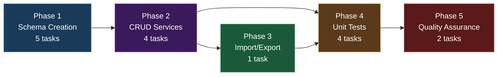
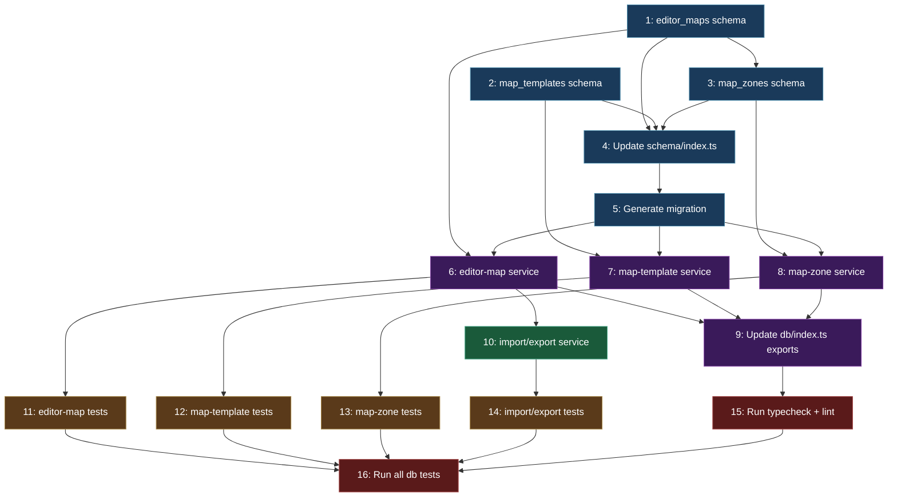

# Work Plan: Map Editor Batch 2 -- DB Schema + Services

Created Date: 2026-02-19
Status: complete
Completed Date: 2026-02-19
Type: feature
Estimated Duration: 2 days
Estimated Impact: 12 files (5 new service files, 3 new schema files, 2 modified index files, 1 migration, 4 test files)
Related Issue/PR: N/A

## Related Documents

- PRD: [docs/prd/prd-007-map-editor.md](../prd/prd-007-map-editor.md) (FR-2.1 through FR-2.7)
- ADR: [docs/adr/adr-006-map-editor-architecture.md](../adr/adr-006-map-editor-architecture.md) (Decision 3: Hybrid DB schema)
- Design Doc: [docs/design/design-007-map-editor.md](../design/design-007-map-editor.md) (Batch 2: Sections 2.1-2.4)

## Objective

Create the database persistence layer for the Map Editor: three new Drizzle ORM schemas (`editor_maps`, `map_templates`, `map_zones`), CRUD services for each table, an import/export service bridging editor maps and live player maps, a migration file, and unit tests for all services. This batch establishes the data access layer consumed by the editor UI (Batch 3) and the template system (Batch 5).

## Background

The Map Editor requires database-backed persistence for authored maps, reusable templates, and zone markup. ADR-0009 Decision 3 selected a hybrid schema: relational columns for fixed, queryable metadata (name, dimensions, status, timestamps) and JSONB columns for flexible map data (grid, layers, walkable arrays, zone geometry). This matches the existing `maps` table pattern and avoids the performance issues of a fully normalized per-cell schema.

The existing `packages/db/` provides established patterns for this work:
- **Schema pattern**: `packages/db/src/schema/game-objects.ts` uses `uuid().defaultRandom().primaryKey()`, JSONB columns, and timestamp fields
- **Service pattern**: `packages/db/src/services/map.ts` takes `DrizzleClient` as first parameter, uses object parameter pattern for 3+ params, and propagates errors (fail-fast)
- **Test pattern**: `packages/db/src/services/map.spec.ts` uses a mock Drizzle client with chained builder pattern to verify service contracts without a real database

The implementation follows a horizontal slice (foundation-driven) approach: schemas first, then services, then integration services, then tests. No test design information is provided from a previous process, so Strategy B (implementation-first) applies.

## Prerequisites

Before starting this plan:

- [x] Batch 1 completed: `packages/map-lib` exists with types (`MapType`, `ZoneType`, `ZoneShape`, `ZoneData`, `MapTemplate`, `TemplateParameter`, `TemplateConstraint`)
- [x] `packages/db/src/schema/maps.ts` exists (player maps table -- used by import/export service)
- [x] `packages/db/src/services/map.ts` exists (existing service pattern to follow)
- [x] `packages/db/src/schema/index.ts` exports all current schemas
- [x] `packages/db/src/index.ts` exports all current services
- [x] All existing tests pass (`pnpm nx test db`)

## Phase Structure Diagram



## Task Dependency Diagram



## Risks and Countermeasures

### Technical Risks

- **Risk**: Migration conflicts with existing tables or previous dropped tables (migration 0003/0004 dropped `tile_maps`/`tile_map_groups`)
  - **Impact**: High -- migration fails or corrupts schema
  - **Detection**: `drizzle-kit generate` produces invalid SQL or migration fails on apply
  - **Countermeasure**: New tables use distinct names (`editor_maps`, `map_templates`, `map_zones`) that do not conflict with any existing or previously dropped tables. Review generated migration SQL before applying. The migration is additive-only (CREATE TABLE, no ALTER or DROP).

- **Risk**: JSONB column type mismatch between what the service writes and what the schema expects
  - **Impact**: Medium -- runtime insert errors
  - **Detection**: Unit tests fail when calling service functions with realistic data
  - **Countermeasure**: Use `unknown` type for JSONB fields in service interfaces (matching the existing `map.ts` pattern). Drizzle handles JSONB serialization automatically. Include integration-style assertions in unit tests that verify data round-trips through the mock correctly.

- **Risk**: Cascade delete on `map_zones` via `editor_maps.id` foreign key may not work if Drizzle schema definition is incorrect
  - **Impact**: Medium -- orphaned zone records after map deletion
  - **Detection**: Test in Phase 4 verifies that deleting an editor map also cleans up associated zones (mock verification)
  - **Countermeasure**: Follow the exact Drizzle `references(() => editorMaps.id, { onDelete: 'cascade' })` syntax from the Design Doc. Verify in the generated migration SQL that `ON DELETE CASCADE` appears.

- **Risk**: Import/export service incorrectly derives grid dimensions, causing width/height mismatch
  - **Impact**: Medium -- editor map has wrong dimensions metadata
  - **Detection**: Import/export unit tests verify dimension derivation from grid data
  - **Countermeasure**: Derive `height = grid.length` and `width = grid[0].length` with bounds checking (empty grid returns 0x0). Include edge case test for empty grids.

### Schedule Risks

- **Risk**: More service methods needed than documented
  - **Impact**: Low -- design doc defines all service interfaces explicitly
  - **Countermeasure**: The Design Doc Section 2.3 provides complete service implementations. Follow them precisely.

## Implementation Phases

### Phase 1: Schema Creation (Estimated commits: 2)

**Purpose**: Define the three new Drizzle ORM schemas (`editor_maps`, `map_templates`, `map_zones`), update the schema barrel export, and generate the database migration. These schemas follow the hybrid pattern from ADR-0009 Decision 3 and match the existing `game-objects.ts` pattern.

**Derives from**: Design Doc Sections 2.1-2.2; FR-2.1, FR-2.2, FR-2.3
**ACs covered**: FR-2.1 (editor_maps table), FR-2.2 (map_templates table), FR-2.3 (map_zones table)

#### Tasks

- [x] **Task 1**: Create `editor_maps` Drizzle schema at `packages/db/src/schema/editor-maps.ts`
  - **Input files**:
    - `packages/db/src/schema/game-objects.ts` (pattern reference: uuid PK, JSONB, timestamps)
    - `packages/db/src/schema/maps.ts` (pattern reference: JSONB grid/layers/walkable)
    - Design Doc Section 2.1 (exact schema definition)
  - **Output files**:
    - `packages/db/src/schema/editor-maps.ts` (new)
  - **Description**: Create the `editorMaps` table definition using `pgTable('editor_maps', {...})`. Columns: `id` (uuid, defaultRandom, PK), `name` (varchar 255, not null), `mapType` (varchar 50, not null), `width` (integer, not null), `height` (integer, not null), `seed` (integer, nullable), `grid` (jsonb, not null), `layers` (jsonb, not null), `walkable` (jsonb, not null), `metadata` (jsonb, nullable), `createdBy` (varchar 255, nullable), `createdAt` (timestamp with timezone, defaultNow, not null), `updatedAt` (timestamp with timezone, defaultNow, not null). Export `EditorMap` (inferSelect) and `NewEditorMap` (inferInsert) types.
  - **Dependencies**: None (first task)
  - **Acceptance criteria**:
    - `packages/db/src/schema/editor-maps.ts` exists with all columns matching the Design Doc
    - `EditorMap` and `NewEditorMap` types are exported
    - File compiles without TypeScript errors
    - Follows `game-objects.ts` pattern: `uuid('id').defaultRandom().primaryKey()`

- [x] **Task 2**: Create `map_templates` Drizzle schema at `packages/db/src/schema/map-templates.ts`
  - **Input files**:
    - Design Doc Section 2.1 (exact schema definition)
  - **Output files**:
    - `packages/db/src/schema/map-templates.ts` (new)
  - **Description**: Create the `mapTemplates` table definition. Columns: `id` (uuid, defaultRandom, PK), `name` (varchar 255, not null), `description` (text, nullable), `mapType` (varchar 50, not null), `baseWidth` (integer, not null), `baseHeight` (integer, not null), `parameters` (jsonb, nullable), `constraints` (jsonb, nullable), `grid` (jsonb, not null), `layers` (jsonb, not null), `zones` (jsonb, nullable), `version` (integer, not null, default 1), `isPublished` (boolean, not null, default false), `createdAt` (timestamp with timezone, defaultNow, not null), `updatedAt` (timestamp with timezone, defaultNow, not null). Export `MapTemplateRecord` (inferSelect) and `NewMapTemplateRecord` (inferInsert) types.
  - **Dependencies**: None (can run parallel with Task 1)
  - **Acceptance criteria**:
    - `packages/db/src/schema/map-templates.ts` exists with all columns
    - `MapTemplateRecord` and `NewMapTemplateRecord` types are exported
    - `version` defaults to 1, `isPublished` defaults to false
    - File compiles without TypeScript errors

- [x] **Task 3**: Create `map_zones` Drizzle schema at `packages/db/src/schema/map-zones.ts`
  - **Input files**:
    - `packages/db/src/schema/editor-maps.ts` (FK reference)
    - Design Doc Section 2.1 (exact schema definition)
  - **Output files**:
    - `packages/db/src/schema/map-zones.ts` (new)
  - **Description**: Create the `mapZones` table definition. Columns: `id` (uuid, defaultRandom, PK), `mapId` (uuid, not null, FK to `editorMaps.id` with `onDelete: 'cascade'`), `name` (varchar 255, not null), `zoneType` (varchar 50, not null), `shape` (varchar 20, not null), `bounds` (jsonb, nullable), `vertices` (jsonb, nullable), `properties` (jsonb, nullable), `zIndex` (integer, not null, default 0), `createdAt` (timestamp with timezone, defaultNow, not null), `updatedAt` (timestamp with timezone, defaultNow, not null). Export `MapZone` (inferSelect) and `NewMapZone` (inferInsert) types. Import `editorMaps` from `./editor-maps` for the FK reference.
  - **Dependencies**: Task 1 (editor-maps schema must exist for FK reference)
  - **Acceptance criteria**:
    - `packages/db/src/schema/map-zones.ts` exists with all columns
    - FK to `editor_maps.id` with `ON DELETE CASCADE` is defined
    - `MapZone` and `NewMapZone` types are exported
    - `zIndex` defaults to 0
    - File compiles without TypeScript errors

- [x] **Task 4**: Update `packages/db/src/schema/index.ts` to export new schemas
  - **Input files**:
    - `packages/db/src/schema/index.ts` (currently exports 7 schemas)
  - **Output files**:
    - `packages/db/src/schema/index.ts` (modified -- add 3 exports)
  - **Description**: Add three new export lines to the schema barrel file:
    ```typescript
    export * from './editor-maps';
    export * from './map-templates';
    export * from './map-zones';
    ```
    This makes the new table definitions and their inferred types available to consumers importing from `@nookstead/db`.
  - **Dependencies**: Tasks 1, 2, 3 (all schemas must exist)
  - **Acceptance criteria**:
    - `packages/db/src/schema/index.ts` exports `editorMaps`, `mapTemplates`, `mapZones` tables
    - `EditorMap`, `NewEditorMap`, `MapTemplateRecord`, `NewMapTemplateRecord`, `MapZone`, `NewMapZone` types are accessible via `import { ... } from '@nookstead/db'`
    - File compiles without errors

- [x] **Task 5**: Generate migration via `drizzle-kit generate`
  - **Input files**:
    - All schema files in `packages/db/src/schema/`
    - `packages/db/drizzle.config.ts` (Drizzle Kit config)
  - **Output files**:
    - `packages/db/src/migrations/0006_*.sql` (new migration file)
    - `packages/db/src/migrations/meta/0006_snapshot.json` (new snapshot)
    - `packages/db/src/migrations/meta/_journal.json` (updated)
  - **Description**: Run `pnpm drizzle-kit generate` from the `packages/db/` directory to generate the migration SQL. Review the generated SQL to verify:
    1. Three `CREATE TABLE` statements: `editor_maps`, `map_templates`, `map_zones`
    2. `map_zones.map_id` has `REFERENCES editor_maps(id) ON DELETE CASCADE`
    3. Indexes: `idx_editor_maps_map_type` on `editor_maps(map_type)`, `idx_map_templates_published` partial index on `map_templates(is_published) WHERE is_published = true`, `idx_map_zones_map_id` on `map_zones(map_id)`
    4. No ALTER or DROP statements affecting existing tables
    NOTE: The indexes specified in the Design Doc Section 2.2 should be added manually to the generated migration if Drizzle Kit does not produce them automatically (Drizzle Kit does not infer indexes from schema -- they must be defined in the schema or added to the migration manually).
  - **Dependencies**: Task 4 (schema exports must be complete for Drizzle Kit to read all tables)
  - **Acceptance criteria**:
    - Migration file `0006_*.sql` exists in `packages/db/src/migrations/`
    - SQL contains `CREATE TABLE editor_maps`, `CREATE TABLE map_templates`, `CREATE TABLE map_zones`
    - `ON DELETE CASCADE` is present for `map_zones.map_id`
    - No existing tables are altered or dropped
    - Migration applies cleanly to the database (`pnpm drizzle-kit push` or manual apply)

#### Phase Completion Criteria

- [x] `packages/db/src/schema/editor-maps.ts` exists with correct columns and types
- [x] `packages/db/src/schema/map-templates.ts` exists with correct columns and types
- [x] `packages/db/src/schema/map-zones.ts` exists with FK and cascade delete
- [x] `packages/db/src/schema/index.ts` exports all new schemas
- [x] Migration file generated and reviewed
- [x] `pnpm nx typecheck db` passes (if available) or no TypeScript errors in schema files

#### Operational Verification Procedures

1. Verify each schema file compiles: run `pnpm nx typecheck` or manually check for TypeScript errors in the new files
2. Verify the migration SQL: open the generated `0006_*.sql` and confirm `CREATE TABLE` statements match the Design Doc Section 2.2
3. Verify `ON DELETE CASCADE` is present in the `map_zones` table creation SQL
4. Verify the schema barrel export: `import { editorMaps, mapTemplates, mapZones } from './schema'` resolves from `packages/db/src/`

---

### Phase 2: CRUD Services (Estimated commits: 2)

**Purpose**: Create the CRUD service functions for `editor_maps`, `map_templates`, and `map_zones` following the established service pattern. Update the `packages/db/src/index.ts` barrel to export all new services.

**Derives from**: Design Doc Section 2.3; FR-2.4, FR-2.5, FR-2.6
**ACs covered**: FR-2.4 (editor map CRUD), FR-2.5 (template CRUD + publish + getPublished), FR-2.6 (zone CRUD)

#### Tasks

- [x] **Task 6**: Create editor-map service at `packages/db/src/services/editor-map.ts`
  - **Input files**:
    - `packages/db/src/services/map.ts` (pattern reference)
    - `packages/db/src/services/game-object.ts` (pattern reference: full CRUD with list/update/delete)
    - Design Doc Section 2.3 (exact service implementation)
  - **Output files**:
    - `packages/db/src/services/editor-map.ts` (new)
  - **Description**: Create service with 5 functions following the Design Doc:
    - `createEditorMap(db: DrizzleClient, data: CreateEditorMapData): Promise<EditorMap>` -- Insert record, return created record via `.returning()`
    - `getEditorMap(db: DrizzleClient, id: string): Promise<EditorMap | null>` -- Fetch by ID, return record or null
    - `listEditorMaps(db: DrizzleClient, params?: ListEditorMapsParams): Promise<EditorMap[]>` -- List with optional filters (`mapType`, `createdBy`), pagination (`limit`, `offset`), ordered by `updatedAt` desc
    - `updateEditorMap(db: DrizzleClient, id: string, data: UpdateEditorMapData): Promise<EditorMap | null>` -- Partial update with `updatedAt` set to `new Date()`, return updated record
    - `deleteEditorMap(db: DrizzleClient, id: string): Promise<void>` -- Delete by ID (cascade deletes zones via FK)
    Also export interfaces: `CreateEditorMapData`, `ListEditorMapsParams`, `UpdateEditorMapData`.
    Follow fail-fast pattern: errors propagate to caller, no try/catch in service.
  - **Dependencies**: Task 1 (schema), Task 5 (migration exists)
  - **Acceptance criteria**:
    - All 5 functions implemented and exported
    - All 3 interfaces exported
    - `DrizzleClient` is the first parameter of every function
    - `updateEditorMap` sets `updatedAt: new Date()` on every update
    - `listEditorMaps` supports filtering by `mapType` and `createdBy`, ordered by `updatedAt` desc
    - File compiles without TypeScript errors

- [x] **Task 7**: Create map-template service at `packages/db/src/services/map-template.ts`
  - **Input files**:
    - Design Doc Section 2.3 (exact service implementation)
  - **Output files**:
    - `packages/db/src/services/map-template.ts` (new)
  - **Description**: Create service with 7 functions following the Design Doc:
    - `createTemplate(db, data: CreateTemplateData): Promise<MapTemplateRecord>` -- Insert template
    - `getTemplate(db, id): Promise<MapTemplateRecord | null>` -- Fetch by ID
    - `listTemplates(db, params?: ListTemplatesParams): Promise<MapTemplateRecord[]>` -- List with optional filters (`mapType`, `isPublished`), pagination, ordered by `updatedAt` desc
    - `updateTemplate(db, id, data: UpdateTemplateData): Promise<MapTemplateRecord | null>` -- Partial update, sets `updatedAt`
    - `deleteTemplate(db, id): Promise<void>` -- Delete by ID
    - `publishTemplate(db, id): Promise<MapTemplateRecord | null>` -- Set `isPublished: true`, increment `version`, set `updatedAt`
    - `getPublishedTemplates(db, mapType: string): Promise<MapTemplateRecord[]>` -- Return all published templates for a map type, ordered by `updatedAt` desc
    Also export interfaces: `CreateTemplateData`, `UpdateTemplateData`, `ListTemplatesParams`.
  - **Dependencies**: Task 2 (schema), Task 5 (migration exists)
  - **Acceptance criteria**:
    - All 7 functions implemented and exported
    - All 3 interfaces exported
    - `publishTemplate` reads existing record to get current version, then increments it
    - `getPublishedTemplates` filters by both `mapType` and `isPublished = true`
    - File compiles without TypeScript errors

- [x] **Task 8**: Create map-zone service at `packages/db/src/services/map-zone.ts`
  - **Input files**:
    - Design Doc Section 2.3 (exact service implementation)
  - **Output files**:
    - `packages/db/src/services/map-zone.ts` (new)
  - **Description**: Create service with 4 functions following the Design Doc:
    - `createMapZone(db, data: CreateMapZoneData): Promise<MapZone>` -- Verify map exists first (query `editorMaps` by `data.mapId`), throw error if not found, then insert zone with defaults (`bounds ?? null`, `vertices ?? null`, `properties ?? null`, `zIndex ?? 0`)
    - `getZonesForMap(db, mapId: string): Promise<MapZone[]>` -- Fetch all zones for a map, ordered by `zIndex` ascending
    - `updateMapZone(db, id, data: UpdateMapZoneData): Promise<MapZone | null>` -- Partial update, sets `updatedAt`
    - `deleteMapZone(db, id): Promise<void>` -- Delete by ID
    Also export interfaces: `CreateMapZoneData`, `UpdateMapZoneData`.
    NOTE: The `validateZones` function from FR-2.6 is deferred to Batch 4 (Zone Markup Tools) where zone overlap rules are needed in the UI. The service focuses on pure CRUD for now.
  - **Dependencies**: Task 3 (schema), Task 1 (editor-maps schema for map existence check), Task 5 (migration exists)
  - **Acceptance criteria**:
    - All 4 functions implemented and exported
    - `createMapZone` verifies map exists before inserting (throws `Error` with message if not found)
    - `getZonesForMap` orders by `zIndex` ascending
    - `updateMapZone` sets `updatedAt: new Date()`
    - File compiles without TypeScript errors

- [x] **Task 9**: Update `packages/db/src/index.ts` to export new services
  - **Input files**:
    - `packages/db/src/index.ts` (currently exports 6 service groups)
  - **Output files**:
    - `packages/db/src/index.ts` (modified -- add 3 new export blocks)
  - **Description**: Add three new export blocks to the db barrel file for the new services:
    ```typescript
    export {
      createEditorMap,
      getEditorMap,
      listEditorMaps,
      updateEditorMap,
      deleteEditorMap,
      type CreateEditorMapData,
      type ListEditorMapsParams,
      type UpdateEditorMapData,
    } from './services/editor-map';
    export {
      createTemplate,
      getTemplate,
      listTemplates,
      updateTemplate,
      deleteTemplate,
      publishTemplate,
      getPublishedTemplates,
      type CreateTemplateData,
      type UpdateTemplateData,
      type ListTemplatesParams as ListTemplatesParams,
    } from './services/map-template';
    export {
      createMapZone,
      getZonesForMap,
      updateMapZone,
      deleteMapZone,
      type CreateMapZoneData,
      type UpdateMapZoneData,
    } from './services/map-zone';
    ```
    NOTE: `ListTemplatesParams` may conflict with `ListEditorMapsParams` at the consumer level. Use distinct names. The map-template service already uses `ListTemplatesParams` as its type name.
  - **Dependencies**: Tasks 6, 7, 8 (all services must exist)
  - **Acceptance criteria**:
    - All new service functions and types are accessible via `import { ... } from '@nookstead/db'`
    - No naming conflicts with existing exports
    - File compiles without TypeScript errors

#### Phase Completion Criteria

- [x] `packages/db/src/services/editor-map.ts` exists with 5 functions and 3 interfaces
- [x] `packages/db/src/services/map-template.ts` exists with 7 functions and 3 interfaces
- [x] `packages/db/src/services/map-zone.ts` exists with 4 functions and 2 interfaces
- [x] `packages/db/src/index.ts` exports all new services
- [x] All service files compile without TypeScript errors
- [x] Services follow established patterns: `DrizzleClient` first param, fail-fast error propagation

#### Operational Verification Procedures

1. Verify all service files compile: run TypeScript type checking on `packages/db/`
2. Verify barrel exports: `import { createEditorMap, createTemplate, createMapZone } from '@nookstead/db'` resolves without error
3. Verify service interfaces: check that `CreateEditorMapData`, `CreateTemplateData`, `CreateMapZoneData` have all required fields per the Design Doc

---

### Phase 3: Import/Export + Direct Editing Service (Estimated commits: 1)

**Purpose**: Create the bridge service that enables importing live player maps into the editor and exporting edited maps back to player records. This service reads from the existing `maps` table and writes to `editor_maps`, and vice versa. Also provides direct editing functions that load/save player maps without creating editor map copies.

**Derives from**: Design Doc Section 2.3 (map-import-export.ts); FR-2.7
**ACs covered**: FR-2.7 (import/export live player maps, direct editing)

#### Tasks

- [x] **Task 10**: Create import/export service at `packages/db/src/services/map-import-export.ts`
  - **Input files**:
    - `packages/db/src/schema/maps.ts` (player maps table)
    - `packages/db/src/schema/editor-maps.ts` (editor maps table)
    - `packages/db/src/services/map.ts` (existing `saveMap`/`loadMap` pattern)
    - Design Doc Section 2.3 (exact service implementation)
  - **Output files**:
    - `packages/db/src/services/map-import-export.ts` (new)
    - `packages/db/src/index.ts` (modified -- add import/export exports)
  - **Description**: Create service with 4 functions following the Design Doc:
    - `importPlayerMap(db, userId: string): Promise<EditorMap>`:
      - Read player map from `maps` table by `userId`
      - Throw error if no map found: `"No map found for user: ${userId}"`
      - Derive `width` and `height` from grid dimensions: `height = grid.length`, `width = grid[0].length`
      - Create `editor_maps` record with: `name: "Imported: ${userId}"`, `mapType: 'player_homestead'`, derived dimensions, `seed` from source, `grid`/`layers`/`walkable` copied verbatim, `metadata` with `importedFrom`, `importedAt`, `originalSeed`
      - Return the new editor map record
    - `exportToPlayerMap(db, editorMapId: string, userId: string): Promise<void>`:
      - Read editor map from `editor_maps` by ID
      - Throw error if not found: `"Editor map not found: ${editorMapId}"`
      - Upsert to `maps` table: write `seed`, `grid`, `layers`, `walkable` from editor map to player's map record (other editor_maps fields are NOT written)
      - Use `onConflictDoUpdate` on `maps.userId` target
    - `editPlayerMapDirect(db, userId: string): Promise<{userId, grid, layers, walkable, seed, width, height}>`:
      - Load player map, derive dimensions, return data for in-place editing without creating editor_maps record
      - Throw error if no map found
    - `savePlayerMapDirect(db, data: {userId, grid, layers, walkable, seed?}): Promise<void>`:
      - Write edited data back to player's `maps` record directly
      - Only updates `grid`, `layers`, `walkable`, optionally `seed`, and `updatedAt`
    Update `packages/db/src/index.ts` to export all 4 functions.
  - **Dependencies**: Task 6 (editor-map service must exist; `editorMaps` schema imported)
  - **Acceptance criteria**:
    - All 4 functions implemented and exported
    - `importPlayerMap` creates editor map with `name: "Imported: ${userId}"` and `mapType: 'player_homestead'`
    - `importPlayerMap` derives dimensions from grid data
    - `exportToPlayerMap` writes only `seed`, `grid`, `layers`, `walkable` to the player's map record
    - `editPlayerMapDirect` returns map data without creating an editor map record
    - `savePlayerMapDirect` updates the player's map record in-place
    - Error thrown when player map not found (`importPlayerMap`, `editPlayerMapDirect`)
    - Error thrown when editor map not found (`exportToPlayerMap`)
    - All functions exported from `packages/db/src/index.ts`
    - File compiles without TypeScript errors

#### Phase Completion Criteria

- [x] `packages/db/src/services/map-import-export.ts` exists with 4 functions
- [x] `importPlayerMap` creates a copy with correct transformation rules per PRD FR-2.7
- [x] `exportToPlayerMap` writes only the specified fields (not editor metadata)
- [x] `editPlayerMapDirect` and `savePlayerMapDirect` provide direct editing without copying
- [x] All functions exported from `packages/db/src/index.ts`

#### Operational Verification Procedures

1. Verify file compiles: TypeScript check on `packages/db/src/services/map-import-export.ts`
2. Verify imports: the service imports `maps` from `../schema/maps` and `editorMaps` from `../schema/editor-maps`
3. Verify barrel export: `import { importPlayerMap, exportToPlayerMap, editPlayerMapDirect, savePlayerMapDirect } from '@nookstead/db'` resolves

---

### Phase 4: Unit Tests (Estimated commits: 2)

**Purpose**: Create unit tests for all four service files using the established mock Drizzle client pattern from `packages/db/src/services/map.spec.ts` and `game-object.spec.ts`. Tests verify service function contracts: correct Drizzle method calls, argument passing, return value mapping, and error conditions.

**Derives from**: Testing principles; all FR-2.x acceptance criteria
**ACs covered**: All FR-2.1 through FR-2.7 acceptance criteria verified through unit tests

#### Tasks

- [x] **Task 11**: Create unit tests for editor-map service at `packages/db/src/services/editor-map.spec.ts`
  - **Input files**:
    - `packages/db/src/services/editor-map.ts` (service under test)
    - `packages/db/src/services/game-object.spec.ts` (test pattern reference: mock Drizzle client with full CRUD chain)
  - **Output files**:
    - `packages/db/src/services/editor-map.spec.ts` (new)
  - **Description**: Create test file with mock Drizzle client covering:
    - `createEditorMap`: verifies `insert(editorMaps).values(data).returning()` is called with correct data, returns the created record
    - `getEditorMap`: verifies `select().from(editorMaps).where(eq(id)).limit(1)` is called, returns record or null
    - `listEditorMaps` (no filters): verifies ordered by `updatedAt` desc
    - `listEditorMaps` (with mapType filter): verifies `where` includes `eq(mapType, 'town_district')`
    - `listEditorMaps` (with pagination): verifies `limit` and `offset` applied
    - `updateEditorMap`: verifies `update(editorMaps).set({...data, updatedAt}).where(eq(id)).returning()`, returns updated record or null
    - `deleteEditorMap`: verifies `delete(editorMaps).where(eq(id))` is called
    Use the `createMockDb()` pattern from `game-object.spec.ts` with insert/select/update/delete chains.
    Test count: 8 test cases (1 create, 2 get, 3 list, 1 update, 1 delete).
  - **Dependencies**: Task 6 (service exists)
  - **Acceptance criteria**:
    - 8 test cases pass
    - Tests verify correct arguments passed to Drizzle query builder
    - Tests verify return value mapping (record or null)
    - No database connection required (fully mocked)

- [x] **Task 12**: Create unit tests for map-template service at `packages/db/src/services/map-template.spec.ts`
  - **Input files**:
    - `packages/db/src/services/map-template.ts` (service under test)
    - `packages/db/src/services/game-object.spec.ts` (test pattern reference)
  - **Output files**:
    - `packages/db/src/services/map-template.spec.ts` (new)
  - **Description**: Create test file covering:
    - `createTemplate`: verifies insert with correct data, returns created record
    - `getTemplate`: verifies select by ID, returns record or null
    - `listTemplates` (no filters): verifies ordered by `updatedAt` desc
    - `listTemplates` (isPublished filter): verifies `where` includes `eq(isPublished, true)`
    - `updateTemplate`: verifies partial update with `updatedAt`
    - `deleteTemplate`: verifies delete by ID
    - `publishTemplate`: verifies it reads existing record, then updates `isPublished: true` and increments `version`
    - `publishTemplate` (not found): verifies returns null when template does not exist
    - `getPublishedTemplates`: verifies filter by `mapType` AND `isPublished = true`
    Test count: 10 test cases.
  - **Dependencies**: Task 7 (service exists)
  - **Acceptance criteria**:
    - 10 test cases pass
    - `publishTemplate` test verifies version increment (e.g., version 1 -> 2)
    - `getPublishedTemplates` test verifies both conditions in the `where` clause

- [x] **Task 13**: Create unit tests for map-zone service at `packages/db/src/services/map-zone.spec.ts`
  - **Input files**:
    - `packages/db/src/services/map-zone.ts` (service under test)
  - **Output files**:
    - `packages/db/src/services/map-zone.spec.ts` (new)
  - **Description**: Create test file covering:
    - `createMapZone` (map exists): verifies map existence check, then insert with correct data
    - `createMapZone` (map not found): verifies error thrown with message `"Editor map not found: {mapId}"`
    - `getZonesForMap`: verifies select by mapId, ordered by `zIndex` asc
    - `updateMapZone`: verifies partial update with `updatedAt`
    - `deleteMapZone`: verifies delete by ID
    Test count: 6 test cases (including the error case).
  - **Dependencies**: Task 8 (service exists)
  - **Acceptance criteria**:
    - 6 test cases pass
    - Error case test verifies the exact error message
    - `getZonesForMap` test verifies `orderBy(asc(mapZones.zIndex))`

- [x] **Task 14**: Create unit tests for import/export service at `packages/db/src/services/map-import-export.spec.ts`
  - **Input files**:
    - `packages/db/src/services/map-import-export.ts` (service under test)
    - `packages/db/src/services/map.spec.ts` (test pattern reference: mock for `maps` table)
  - **Output files**:
    - `packages/db/src/services/map-import-export.spec.ts` (new)
  - **Description**: Create test file covering:
    - `importPlayerMap` (map found): verifies select from `maps` table, insert to `editor_maps`, returns created record with `name: "Imported: abc"`, `mapType: 'player_homestead'`, correct dimensions derived from grid
    - `importPlayerMap` (no map): verifies error thrown `"No map found for user: unknown"`
    - `importPlayerMap` (empty grid): verifies dimensions are 0x0 for empty grid
    - `exportToPlayerMap` (editor map found): verifies select from `editor_maps`, upsert to `maps` table writing only `seed`, `grid`, `layers`, `walkable`
    - `exportToPlayerMap` (editor map not found): verifies error thrown `"Editor map not found: bad-id"`
    - `editPlayerMapDirect` (map found): verifies select from `maps`, returns data with derived dimensions
    - `editPlayerMapDirect` (no map): verifies error thrown
    - `savePlayerMapDirect`: verifies update to `maps` table with correct fields
    Test count: 8 test cases.
    The mock must support both `maps` and `editorMaps` table operations. Build a more comprehensive mock that can distinguish which table is being queried by checking the `insert`/`select` arguments.
  - **Dependencies**: Task 10 (service exists)
  - **Acceptance criteria**:
    - 8 test cases pass
    - Import test verifies dimension derivation: a 3x4 grid (3 rows of 4 columns) produces `height: 3`, `width: 4`
    - Export test verifies only `seed`, `grid`, `layers`, `walkable` are written to the player map
    - Error cases verify exact error messages

#### Phase Completion Criteria

- [x] `packages/db/src/services/editor-map.spec.ts` -- 8 tests passing
- [x] `packages/db/src/services/map-template.spec.ts` -- 10 tests passing
- [x] `packages/db/src/services/map-zone.spec.ts` -- 6 tests passing
- [x] `packages/db/src/services/map-import-export.spec.ts` -- 8 tests passing
- [x] Total: 32 test cases passing
- [x] All tests use mock Drizzle client (no database required)
- [x] Test coverage for all service functions and error paths

#### Operational Verification Procedures

1. Run `pnpm nx test db` and verify all new tests pass alongside existing tests
2. Verify test count: 32 new test cases total (8 + 10 + 6 + 8)
3. Verify no existing tests are broken by the new schema/service additions
4. Spot-check: `importPlayerMap` test asserts `name: "Imported: abc"` and `mapType: 'player_homestead'`

---

### Phase 5: Quality Assurance (Estimated commits: 1)

**Purpose**: Verify all code compiles, lints cleanly, and all tests pass across the db package and affected projects. Confirm the batch meets all Design Doc acceptance criteria.

**Derives from**: Design Doc acceptance criteria; documentation-criteria Phase 4 requirement
**ACs covered**: All FR-2.x acceptance criteria verified

#### Tasks

- [x] **Task 15**: Run typecheck and lint
  - **Input files**: All TypeScript files in `packages/db/`
  - **Output files**: None (verification only)
  - **Description**: Execute quality checks:
    - `pnpm nx typecheck db` (if available) or verify TypeScript compilation of all db package files
    - `pnpm nx lint db` (if available) or run ESLint on all db package files
    - `pnpm nx run-many -t typecheck lint` to verify no cross-project breakage
    Pay particular attention to:
    - No type errors from new schema definitions
    - No import errors in new service files
    - No naming conflicts between new and existing exports in `packages/db/src/index.ts`
    - ESLint passes on all new files (follow single-quotes, 2-space indent)
  - **Dependencies**: Task 9 (all exports finalized)
  - **Acceptance criteria**:
    - Zero TypeScript errors across all db package files
    - Zero ESLint errors across all db package files
    - No cross-project type errors from the new schema additions

- [x] **Task 16**: Run all db package tests
  - **Input files**: All test files in `packages/db/src/services/`
  - **Output files**: None (verification only)
  - **Description**: Execute the full test suite for the db package:
    - `pnpm nx test db` -- runs all existing tests plus the 4 new test files
    - Verify: existing tests (`map.spec.ts`, `sprite.spec.ts`, `game-object.spec.ts`, `atlas-frame.spec.ts`, `player.spec.ts`) still pass
    - Verify: all 32 new test cases pass
    - Total expected test count: existing tests + 32 new tests
  - **Dependencies**: Tasks 11-15 (all tests written, quality checks pass)
  - **Acceptance criteria**:
    - `pnpm nx test db` exits 0
    - All existing tests pass (no regressions)
    - All 32 new tests pass
    - No skipped or pending tests

#### Phase Completion Criteria

- [x] `pnpm nx typecheck` -- zero errors in db package
- [x] `pnpm nx lint` -- zero errors in db package
- [x] `pnpm nx test db` -- all tests pass (existing + 32 new)
- [x] No regressions in existing service tests
- [x] All FR-2.x acceptance criteria verified

#### Operational Verification Procedures

1. Run `pnpm nx test db` and confirm exit code 0 with all specs passing
2. Run `pnpm nx run-many -t typecheck lint` and confirm zero errors across all projects
3. Verify no naming conflicts: `import { createEditorMap, createTemplate, createMapZone, saveMap, loadMap } from '@nookstead/db'` resolves without ambiguity
4. Manually review the generated migration SQL one final time to confirm it matches Design Doc Section 2.2

---

## Quality Checklist

- [x] Design Doc and PRD consistency verification (FR-2.1 through FR-2.7 addressed)
- [x] Phase dependencies correctly mapped (Schema -> Services -> Import/Export -> Tests -> QA)
- [x] All requirements converted to tasks with correct phase assignment
- [x] Quality assurance exists in Phase 5
- [x] Schema follows existing patterns (`game-objects.ts`: uuid PK, JSONB, timestamps)
- [x] Services follow existing patterns (`map.ts`: DrizzleClient first param, fail-fast errors)
- [x] Tests follow existing patterns (`map.spec.ts`, `game-object.spec.ts`: mock Drizzle client)
- [x] Foreign key with cascade delete defined for `map_zones.map_id`
- [x] Migration is additive-only (no ALTER/DROP on existing tables)
- [x] Import/export transformation rules match PRD FR-2.7 specification
- [x] All new service functions and types exported from `packages/db/src/index.ts`
- [x] No naming conflicts with existing exports

## Files Summary

### New Files Created

| File | Phase | Description |
|------|-------|-------------|
| `packages/db/src/schema/editor-maps.ts` | 1 | editor_maps Drizzle schema |
| `packages/db/src/schema/map-templates.ts` | 1 | map_templates Drizzle schema |
| `packages/db/src/schema/map-zones.ts` | 1 | map_zones Drizzle schema with FK |
| `packages/db/src/migrations/0006_*.sql` | 1 | Database migration |
| `packages/db/src/services/editor-map.ts` | 2 | Editor map CRUD service (5 functions) |
| `packages/db/src/services/map-template.ts` | 2 | Map template CRUD service (7 functions) |
| `packages/db/src/services/map-zone.ts` | 2 | Map zone CRUD service (4 functions) |
| `packages/db/src/services/map-import-export.ts` | 3 | Import/export + direct edit service (4 functions) |
| `packages/db/src/services/editor-map.spec.ts` | 4 | Editor map service tests (8 tests) |
| `packages/db/src/services/map-template.spec.ts` | 4 | Map template service tests (10 tests) |
| `packages/db/src/services/map-zone.spec.ts` | 4 | Map zone service tests (6 tests) |
| `packages/db/src/services/map-import-export.spec.ts` | 4 | Import/export service tests (8 tests) |

### Modified Files

| File | Phase | Change |
|------|-------|--------|
| `packages/db/src/schema/index.ts` | 1 | Add 3 new schema exports |
| `packages/db/src/index.ts` | 2, 3 | Add service exports for editor-map, map-template, map-zone, map-import-export |

## Completion Criteria

- [x] All 5 phases completed
- [x] Each phase's operational verification procedures executed
- [x] Design Doc acceptance criteria satisfied (FR-2.1 through FR-2.7)
- [x] All quality checks completed (zero TypeScript and ESLint errors)
- [x] All 32 new tests pass
- [x] All existing db package tests pass (no regressions)
- [x] Necessary documentation updated (this plan checkboxes)
- [x] Migration file reviewed and ready for database apply

## Progress Tracking

### Phase 1: Schema Creation
- Start: 2026-02-19
- Complete: 2026-02-19
- Notes: All 3 schemas + migration + barrel exports done

### Phase 2: CRUD Services
- Start: 2026-02-19
- Complete: 2026-02-19
- Notes: 5+7+4 service functions + barrel exports done. Fixed listEditorMaps/listTemplates query builder chain order.

### Phase 3: Import/Export + Direct Editing
- Start: 2026-02-19
- Complete: 2026-02-19
- Notes: 4 import/export functions done

### Phase 4: Unit Tests
- Start: 2026-02-19
- Complete: 2026-02-19
- Notes: 32 new tests (8+10+6+8), all passing. 74 total tests in db package.

### Phase 5: Quality Assurance
- Start: 2026-02-19
- Complete: 2026-02-19
- Notes: typecheck 0 errors, lint 0 errors, all 74 tests pass

## Notes

- The `validateZones` function mentioned in FR-2.6 is deferred to Batch 4 (Zone Markup Tools) where zone overlap rules will be implemented in the editor UI. The database layer provides zone CRUD only.
- The migration file number (0006) assumes no other migrations are added between now and execution. The actual number will be determined by `drizzle-kit generate`.
- The `map_templates` schema includes a `zones` JSONB column not present in the PRD's entity diagram for `map_templates`. This was added in the Design Doc Section 2.1 to store zone layout alongside the template grid. This is the Design Doc's schema which takes precedence.
- The `ListTemplatesParams` type is named distinctly from `ListEditorMapsParams` to avoid conflicts at the consumer level. The re-export in `index.ts` should use the explicit type name.
- Indexes specified in Design Doc Section 2.2 (`idx_editor_maps_map_type`, `idx_map_templates_published`, `idx_map_zones_map_id`) may need to be added manually to the generated migration if Drizzle Kit does not produce them. Alternatively, define them in the schema using Drizzle's index API.
