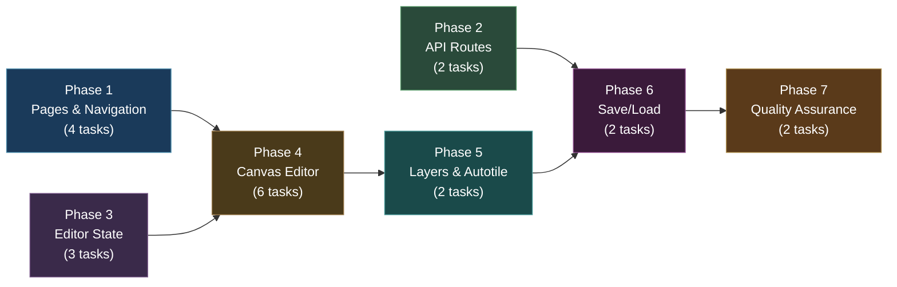
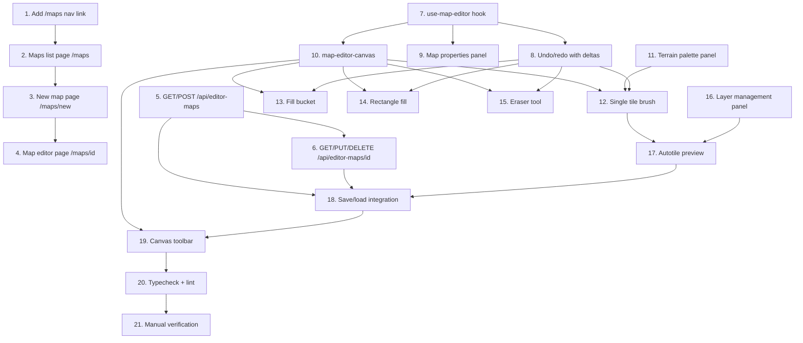

# Work Plan: Map Editor Batch 3 -- Core Map Editor UI

Created Date: 2026-02-19
Type: feature
Estimated Duration: 5 days
Estimated Impact: 25 files (2 modified, 23 new)
Related Issue/PR: N/A

## Related Documents

- PRD: [docs/prd/prd-007-map-editor.md](../prd/prd-007-map-editor.md) (FR-3.1 through FR-3.11)
- Design Doc: [docs/design/design-007-map-editor.md](../design/design-007-map-editor.md) (Batch 3, sections 3.1-3.7)
- ADR: [docs/adr/adr-006-map-editor-architecture.md](../adr/adr-006-map-editor-architecture.md)

## Objective

Implement the core map editor UI for the genmap admin app, enabling level designers to create, paint, and save terrain maps using all 26 terrain types with real-time autotile preview, undo/redo, layer management, and map persistence via API routes.

## Background

Batches 1 and 2 established the foundation: `@nookstead/map-lib` provides the autotile engine, terrain definitions, and map generation pipeline; `@nookstead/db` provides the editor_maps, map_templates, and map_zones schemas with CRUD services. Batch 3 builds the visual editor on top of these foundations -- the first user-facing component of the map editor feature. The editor uses HTML5 Canvas 2D (consistent with existing genmap canvas components like `atlas-zone-canvas.tsx`), not Phaser (which is deferred to Batch 6 preview).

## Prerequisites

- Batch 1 (Shared Map Library) completed: `@nookstead/map-lib` package exists with autotile engine, terrain definitions, and generation pipeline
- Batch 2 (DB Schema + Services) completed: `editor_maps` table and CRUD services in `@nookstead/db`
- All 26 tileset PNG files available as static assets in `apps/genmap/public/tilesets/`

## Phase Structure Diagram



## Task Dependency Diagram



## Risks and Countermeasures

### Technical Risks

- **Risk**: Canvas rendering performance on 64x64 maps (4,096 cells per layer, multiple layers)
  - **Impact**: Paint operations exceeding 16ms target, sluggish user experience
  - **Countermeasure**: Implement viewport culling (only render visible tiles) from the start, as specified in Design Doc section 3.4. Profile early with 64x64 maps.

- **Risk**: Undo/redo memory consumption with deep stacks on large maps
  - **Impact**: Browser memory pressure, potential crashes on long editing sessions
  - **Countermeasure**: Use differential delta-based undo (store only changed cells, not full grid clones) as specified in Design Doc section 3.3. Cap stack at 50 commands.

- **Risk**: Autotile recomputation taking more than 16ms for cells plus 8 neighbors
  - **Impact**: Visible lag during paint operations
  - **Countermeasure**: Recompute only affected cells (not full grid) using the `recomputeAutotileLayers` function from Design Doc section 3.5. Batch updates during drag operations.

- **Risk**: Tileset images failing to load (missing PNGs, wrong paths)
  - **Impact**: Blank canvas, broken editor
  - **Countermeasure**: Add loading state with progress indicator. Show placeholder checkerboard pattern for missing tilesets. Validate tileset availability on editor mount.

### Schedule Risks

- **Risk**: Complex state management in `useMapEditor` hook delays canvas implementation
  - **Impact**: Phase 3 blocks Phase 4
  - **Countermeasure**: Start with minimal reducer (paint, tool selection) and add features incrementally. Phase 2 (API Routes) can proceed in parallel.

## Implementation Phases

### Phase 1: Pages and Navigation (Estimated commits: 4)

**Purpose**: Establish the routing structure and page shells for the map editor within the genmap app. Provides navigable entry points before editor functionality is built.

#### Tasks

- [ ] **Task 1: Add /maps navigation to genmap app layout**
  - Description: Add "Maps" entry to the `navItems` array in the navigation component so users can navigate to the maps section.
  - Input files:
    - `apps/genmap/src/components/navigation.tsx` (existing, modify)
  - Output files:
    - `apps/genmap/src/components/navigation.tsx` (modified)
  - Implementation:
    - Add `{ href: '/maps', label: 'Maps' }` to the `navItems` array after "Objects"
  - Acceptance criteria:
    - Given the genmap app is open, the navigation bar shows "Sprites", "Objects", "Maps" links
    - Given the user is on the /maps page, the "Maps" link has the active styling
  - Dependencies: None

- [ ] **Task 2: Create maps list page (/maps) with table of maps**
  - Description: Create a page that lists all editor maps with name, map type, dimensions, and last modified date. Follows the pattern from `apps/genmap/src/app/objects/page.tsx`.
  - Input files:
    - `apps/genmap/src/app/objects/page.tsx` (reference pattern)
  - Output files:
    - `apps/genmap/src/app/maps/page.tsx` (new)
    - `apps/genmap/src/hooks/use-editor-maps.ts` (new)
  - Implementation:
    - `use-editor-maps` hook: `useState` + `useCallback` + `useEffect` pattern matching `use-sprites.ts`. Fetches from `/api/editor-maps` with pagination (limit/offset).
    - Page: lists maps in a table/grid layout with columns for name, mapType, dimensions (WxH), updatedAt. Filter dropdown for mapType (`player_homestead`, `town_district`, `template`). "New Map" button links to `/maps/new`. Each row links to `/maps/[id]`. Delete button with confirmation dialog.
  - Acceptance criteria (from FR-3.11):
    - Given 10 editor maps exist (5 homesteads, 3 town districts, 2 templates), when the list page is opened with no filter, then all 10 are displayed
    - Given the "player_homestead" filter is applied, then only 5 maps are shown
    - Given a map row is clicked, then the browser navigates to `/maps/[id]`
  - Dependencies: Task 1 (navigation)

- [ ] **Task 3: Create new map page (/maps/new)**
  - Description: A form page for creating a new map. Collects name, map type, width, height. On submit, POSTs to `/api/editor-maps` with an initialized empty grid and redirects to `/maps/[id]`.
  - Input files:
    - `apps/genmap/src/app/objects/new/page.tsx` (reference pattern, if exists)
  - Output files:
    - `apps/genmap/src/app/maps/new/page.tsx` (new)
  - Implementation:
    - Form fields: name (text input), mapType (select: player_homestead, town_district, template), width (number, constrained by mapType), height (number, constrained by mapType)
    - On submit: generate empty grid (`Cell[][]` with default terrain `deep_water`), empty layers array, walkable boolean grid. POST to `/api/editor-maps`. On success, redirect to `/maps/[created_id]`.
    - Use `validateMapDimensions()` from `@nookstead/map-lib` for client-side validation.
  - Acceptance criteria:
    - Given the user fills in name "Test Farm", selects "player_homestead", width 32, height 32, and clicks Create, then a new map record is created and the browser redirects to the editor page
    - Given the user enters width 128 for a player_homestead, then a validation error shows "Width must be 32-64 for player_homestead"
  - Dependencies: Task 2 (list page exists to navigate back to)

- [ ] **Task 4: Create map editor page (/maps/[id])**
  - Description: Shell page that loads a map by ID and renders the editor layout. Initially a placeholder with the map name and dimensions displayed; actual editor components are added in later phases.
  - Input files: None (new)
  - Output files:
    - `apps/genmap/src/app/maps/[id]/page.tsx` (new)
  - Implementation:
    - Client component that fetches map by ID from `/api/editor-maps/[id]` on mount
    - Renders a `MapEditorLayout` container with left sidebar, center canvas area, and right sidebar placeholders
    - Shows loading skeleton while fetching, 404 message if not found
  - Acceptance criteria:
    - Given a valid map ID is in the URL, when the page loads, then the map name and dimensions are displayed
    - Given an invalid map ID, then a "Map not found" message is shown
  - Dependencies: Task 3 (so a map can be created to navigate to)

#### Phase 1 Completion Criteria

- [ ] Navigation shows "Maps" link with active state detection
- [ ] `/maps` page lists editor maps with filtering and pagination
- [ ] `/maps/new` creates maps with dimension validation
- [ ] `/maps/[id]` loads and displays map data
- [ ] All pages follow existing genmap patterns (use-client, shadcn components, Sonner toasts)

#### Operational Verification Procedures

1. Start genmap dev server (`pnpm nx dev genmap`)
2. Click "Maps" in navigation -- page loads without errors
3. Click "New Map" -- form appears with constrained dimension inputs
4. Create a 32x32 player_homestead -- redirects to editor page showing map name
5. Navigate back to /maps -- newly created map appears in the list
6. Filter by "player_homestead" -- only homestead maps shown

---

### Phase 2: API Routes (Estimated commits: 2)

**Purpose**: Create the Next.js Route Handler endpoints that the editor UI uses to persist and retrieve map data. These follow the exact pattern from `apps/genmap/src/app/api/objects/route.ts` and `apps/genmap/src/app/api/sprites/route.ts`.

#### Tasks

- [ ] **Task 5: Create GET/POST /api/editor-maps route**
  - Description: API route for listing and creating editor maps. Follows the genmap API pattern with inline validation, `getDb()` from `@nookstead/db`, and `NextResponse.json()`.
  - Input files:
    - `apps/genmap/src/app/api/sprites/route.ts` (reference pattern)
    - `apps/genmap/src/app/api/objects/route.ts` (reference pattern)
  - Output files:
    - `apps/genmap/src/app/api/editor-maps/route.ts` (new)
  - Implementation (from Design Doc section 3.7):
    - `GET`: Parse `mapType`, `limit`, `offset` from searchParams. Call `listEditorMaps(db, params)`. Return JSON array.
    - `POST`: Parse body. Validate: name (required string), mapType (one of `player_homestead`, `town_district`, `template`), width/height (positive integers). Call `createEditorMap(db, data)`. Return 201 with created record.
  - Acceptance criteria:
    - Given a POST with valid data `{name: "Test", mapType: "player_homestead", width: 32, height: 32, grid: [...], layers: [...], walkable: [...]}`, then 201 is returned with the created record including a UUID id
    - Given a POST with missing name, then 400 is returned with `{error: "name is required"}`
    - Given a GET with `?mapType=town_district`, then only town district maps are returned
  - Dependencies: None (can run parallel with Phase 1)

- [ ] **Task 6: Create GET/PATCH/DELETE /api/editor-maps/[id] route**
  - Description: API route for fetching, updating, and deleting a single editor map by ID.
  - Input files:
    - `apps/genmap/src/app/api/objects/[id]/route.ts` (reference pattern, if exists)
  - Output files:
    - `apps/genmap/src/app/api/editor-maps/[id]/route.ts` (new)
  - Implementation (from Design Doc section 3.7):
    - `GET`: Extract `id` from params. Call `getEditorMap(db, id)`. Return 404 if null, else JSON.
    - `PATCH`: Extract `id` from params, parse body. Call `updateEditorMap(db, id, body)`. Return 404 if null, else updated JSON.
    - `DELETE`: Extract `id` from params. Call `deleteEditorMap(db, id)`. Return 204 No Content.
    - Use `{ params }: { params: Promise<{ id: string }> }` signature (Next.js 16 pattern).
  - Acceptance criteria:
    - Given a valid map ID, GET returns the full map data including grid, layers, walkable
    - Given an invalid map ID, GET returns 404 with `{error: "Map not found"}`
    - Given a PATCH with `{name: "Updated Name"}`, then the name is updated and updatedAt changes
    - Given a DELETE, then the map and its cascade-deleted zones are removed, 204 is returned
  - Dependencies: Task 5 (same API route group)

#### Phase 2 Completion Criteria

- [ ] POST /api/editor-maps creates maps with validation
- [ ] GET /api/editor-maps lists maps with optional mapType filter and pagination
- [ ] GET /api/editor-maps/:id returns full map data or 404
- [ ] PATCH /api/editor-maps/:id updates map fields
- [ ] DELETE /api/editor-maps/:id removes map with 204 response
- [ ] Error responses use `{error: string}` format with correct HTTP status codes

#### Operational Verification Procedures

1. Use curl or the maps list page to verify:
   - `POST /api/editor-maps` with valid body returns 201
   - `GET /api/editor-maps` returns the created map
   - `GET /api/editor-maps/:id` returns the specific map
   - `PATCH /api/editor-maps/:id` with `{name: "Updated"}` returns updated record
   - `DELETE /api/editor-maps/:id` returns 204
   - Subsequent GET returns 404

---

### Phase 3: Editor State Management (Estimated commits: 3)

**Purpose**: Implement the core state management for the map editor using `useReducer` with the command pattern for undo/redo. This is the central nervous system of the editor that all UI components interact with.

#### Tasks

- [ ] **Task 7: Create use-map-editor hook with state management**
  - Description: The main editor state hook using `useReducer` with the `MapEditorState` and `MapEditorAction` types from Design Doc section 3.2. Manages grid data, tool selection, layer state, undo/redo stacks, and dirty/saving status.
  - Input files:
    - `apps/genmap/src/hooks/use-sprites.ts` (reference pattern)
    - Design Doc section 3.2 (EditorState, EditorAction types)
  - Output files:
    - `apps/genmap/src/hooks/use-map-editor.ts` (new)
    - `apps/genmap/src/hooks/map-editor-types.ts` (new, type definitions)
  - Implementation:
    - Define `MapEditorState`, `MapEditorAction`, `EditorTool`, `EditorLayer` types from Design Doc
    - Implement `mapEditorReducer(state, action)` handling: `SET_TOOL`, `SET_TERRAIN`, `SET_ACTIVE_LAYER`, `LOAD_MAP`, `SET_SAVING`, `MARK_SAVED`, `SET_NAME`
    - Paint actions (`PAINT_CELL`, `PAINT_CELLS`, `FILL`, `RECTANGLE_FILL`, `ERASE_CELL`) are handled via command pattern (deferred to Task 8)
    - Layer actions (`ADD_LAYER`, `REMOVE_LAYER`, `TOGGLE_LAYER_VISIBILITY`, `SET_LAYER_OPACITY`, `REORDER_LAYERS`)
    - Hook returns: `state`, `dispatch`, and convenience methods (`setTool`, `setTerrain`, `setActiveLayer`, `loadMap`)
    - Initial state: empty 32x32 grid, activeTool: 'brush', activeLayerIndex: 0
  - Acceptance criteria:
    - Given the hook is initialized, then the state has default values (brush tool, empty grid)
    - Given `dispatch({type: 'SET_TOOL', tool: 'fill'})` is called, then `state.activeTool` is `'fill'`
    - Given `dispatch({type: 'LOAD_MAP', map: editorMap, zones: []})` is called, then state reflects the loaded map data
    - Given `dispatch({type: 'ADD_LAYER', name: 'roads', terrainKey: 'terrain-25'})` is called, then a new layer is appended
  - Dependencies: None

- [ ] **Task 8: Implement undo/redo with differential deltas**
  - Description: Implement the command pattern for undo/redo using `CellDelta`-based commands as specified in Design Doc section 3.3. Commands store only changed cells, not full grid copies, keeping memory proportional to edit size.
  - Input files:
    - Design Doc section 3.3 (EditorCommand, CellDelta, PaintCommand, FillCommand)
  - Output files:
    - `apps/genmap/src/hooks/map-editor-commands.ts` (new)
    - `apps/genmap/src/hooks/use-map-editor.ts` (modified to integrate commands)
  - Implementation:
    - `CellDelta` interface: `{ x, y, oldTerrain, newTerrain }`
    - `EditorCommand` interface: `{ execute(state), undo(state), description }`
    - `PaintCommand` class: stores deltas for painted cells, applies/reverses via `applyDeltas`
    - `FillCommand` class: stores deltas for flood-filled cells
    - `applyDeltas(state, deltas, direction)`: mutates grid terrain, calls `recomputeAutotileLayers` and `recomputeWalkability`
    - Reducer handles `UNDO` and `REDO` actions by popping from undoStack/redoStack
    - `MAX_UNDO_STACK = 50`: oldest commands are discarded when limit is reached
    - Keyboard handler: Ctrl+Z for undo, Ctrl+Y / Ctrl+Shift+Z for redo
  - Acceptance criteria (from FR-3.8):
    - Given 3 paint operations, when Ctrl+Z is pressed, then the last paint reverts
    - Given Ctrl+Z is pressed again, then the second paint reverts
    - Given Ctrl+Y is pressed, then the second paint is re-applied
    - Given 60 operations, then the first 10 are no longer undoable (stack capped at 50)
    - Given undo is performed, then `isDirty` remains true
  - Dependencies: Task 7 (hook exists to integrate into)

- [ ] **Task 9: Create map properties panel component**
  - Description: A sidebar panel showing map metadata (name, type, dimensions, seed) with inline editing for name and seed. Map type is read-only after creation. Resize triggers a confirmation dialog.
  - Input files:
    - Design Doc section 3.1 (component hierarchy: MapPropertiesPanel)
  - Output files:
    - `apps/genmap/src/components/map-editor/map-properties-panel.tsx` (new)
  - Implementation:
    - Display: name (editable text input), mapType (read-only badge), width x height (read-only, with "Resize" button), seed (editable number input)
    - Name changes dispatch `SET_NAME` action
    - Resize button opens a confirmation dialog explaining expansion/truncation effects
    - Resize dispatches `RESIZE_MAP` action
    - Uses shadcn `Input`, `Label`, `Badge`, `Button`, `Dialog` components
  - Acceptance criteria (from FR-3.9):
    - Given a map named "Farm Template A", when the name is changed to "Farm Template B", then `state.name` updates and `isDirty` becomes true
    - Given dimensions 32x32, "Resize" is clicked, and 48x48 is entered, then a confirmation dialog appears explaining expansion
    - Given mapType is "player_homestead", then it is displayed as a badge but not editable
  - Dependencies: Task 7 (uses dispatch from hook)

#### Phase 3 Completion Criteria

- [ ] `useMapEditor` hook manages editor state with all action types
- [ ] Command pattern stores cell deltas, not full grid copies
- [ ] Undo/redo works with 50-command stack limit
- [ ] Keyboard shortcuts (Ctrl+Z, Ctrl+Y) bound correctly
- [ ] Map properties panel displays and edits metadata inline

#### Operational Verification Procedures

1. Mount the hook in the editor page, verify initial state
2. Dispatch tool and terrain changes, verify state updates
3. Perform paint operations (once canvas is connected), verify undo/redo
4. Verify undo stack limit: perform 55 operations, undo all -- only last 50 are undoable
5. Change map name in properties panel, verify isDirty flag

---

### Phase 4: Canvas Editor (Estimated commits: 6)

**Purpose**: Build the core HTML5 Canvas 2D rendering and painting tools. This is the primary visual interface where level designers interact with the map grid.

#### Tasks

- [ ] **Task 10: Create map-editor-canvas component**
  - Description: The main canvas component that renders the tile grid using HTML5 Canvas 2D. Loads tileset PNG images, renders layers with viewport culling, handles mouse events for coordinate tracking, and supports camera pan/zoom.
  - Input files:
    - `apps/genmap/src/components/atlas-zone-canvas.tsx` (reference canvas pattern)
    - Design Doc section 3.4 (renderMapCanvas function, CanvasConfig)
  - Output files:
    - `apps/genmap/src/components/map-editor/map-editor-canvas.tsx` (new)
    - `apps/genmap/src/components/map-editor/use-tileset-images.ts` (new, tileset loader hook)
    - `apps/genmap/src/components/map-editor/canvas-renderer.ts` (new, rendering logic)
  - Implementation:
    - `useTilesetImages` hook: preloads all 26 tileset PNG files as `HTMLImageElement` objects. Returns `Map<string, HTMLImageElement>` and loading state.
    - `renderMapCanvas(ctx, state, tilesetImages, camera, config)`: clears canvas, applies camera transform, calculates visible tile range for viewport culling, iterates visible layers (skip hidden), draws tiles from tileset sprite sheets at correct positions. Source position: `(frame % 12) * 16` for x, `Math.floor(frame / 12) * 16` for y, 16x16 source size.
    - Canvas component: uses `useRef` for canvas element, `requestAnimationFrame` for render loop, mouse event handlers that convert pixel coordinates to tile coordinates accounting for camera position and zoom.
    - Camera state: `{ x, y, zoom }`. Pan with right-click drag or middle-mouse drag. Zoom with scroll wheel (0.25x to 4x in 0.25 steps).
    - Grid overlay: optional grid lines at tile boundaries.
    - Cursor indicator: highlights the tile under the cursor.
  - Acceptance criteria:
    - Given a 32x32 map with 3 layers is loaded, when the canvas renders, then all visible tiles are drawn correctly from tileset images
    - Given the user scrolls the mouse wheel, then the canvas zooms in/out
    - Given the user right-click drags, then the canvas pans
    - Given a 64x64 map, then the canvas renders within 200ms (NFR target)
    - Given the camera is zoomed in, then only visible tiles are rendered (viewport culling)
  - Dependencies: Task 7 (reads state from hook)

- [ ] **Task 11: Implement terrain palette panel**
  - Description: A sidebar panel showing all 26 terrain types organized into 8 collapsible groups. Each terrain shows its name and a preview swatch. Clicking selects it as the active paint terrain.
  - Input files:
    - Design Doc section 3.1 (TerrainPalette, TerrainGroup, TerrainItem)
    - `packages/map-lib/src/core/terrain.ts` (TERRAINS, TILESETS arrays)
  - Output files:
    - `apps/genmap/src/components/map-editor/terrain-palette.tsx` (new)
  - Implementation:
    - Import `TERRAINS`, `TILESETS` from `@nookstead/map-lib`
    - Render 8 collapsible groups (grassland, water, sand, forest, stone, road, props, misc)
    - Each group header shows group name and member count
    - Each terrain item shows: small canvas preview (render SOLID_FRAME from tileset image), terrain name from TERRAIN_NAMES, terrain key
    - Clicking a terrain dispatches `SET_TERRAIN` action
    - Active terrain is highlighted with a distinct border/background
    - Uses shadcn `Collapsible` or custom accordion component
  - Acceptance criteria (from FR-3.5):
    - Given the terrain palette is open, then all 26 terrains are listed in 8 groups
    - Given the "stone" group is expanded, then 7 terrains are visible (ice_blue, light_stone, warm_stone, gray_cobble, slate, dark_brick, steel_floor)
    - Given `gray_cobble` is clicked, then it becomes the active terrain and the brush tool paints with `gray_cobble`
  - Dependencies: Task 7 (dispatches SET_TERRAIN)

- [ ] **Task 12: Implement single tile brush tool**
  - Description: The default paint tool. Click to paint a single cell; click-drag to paint continuously along the mouse path. Creates a `PaintCommand` with cell deltas.
  - Input files:
    - Design Doc sections 3.3 (PaintCommand) and 3.5 (recomputeAutotileLayers)
  - Output files:
    - `apps/genmap/src/components/map-editor/tools/brush-tool.ts` (new)
    - `apps/genmap/src/components/map-editor/map-editor-canvas.tsx` (modified, integrate tool)
  - Implementation:
    - On mousedown: start collecting painted cells. Record `oldTerrain` for each cell.
    - On mousemove (while pressed): paint cells along path using Bresenham's line to avoid gaps during fast drags.
    - On mouseup: create `PaintCommand(layerIndex, deltas)`, push to undoStack, clear redoStack.
    - Paint only on the active layer.
    - After command execution: call `recomputeAutotileLayers` for affected cells, update `walkable` grid, trigger canvas re-render.
  - Acceptance criteria (from FR-3.1):
    - Given brush tool is active with `grass` selected, when cell (5,3) is clicked, then that cell's terrain is `grass`
    - Given click-drag from (5,3) to (8,3), then all cells along the path are painted
    - Given layer "ground" is selected, then only the ground layer is affected
    - Given the paint completes, then autotile frames are recomputed for painted cells and their 8 neighbors
  - Dependencies: Task 8 (command pattern), Task 10 (canvas mouse events), Task 11 (terrain selection)

- [ ] **Task 13: Implement fill bucket (flood fill)**
  - Description: A flood fill tool using 4-directional BFS that replaces contiguous cells of the same terrain type with the selected type.
  - Input files:
    - Design Doc section 3.6 (floodFill algorithm with index-based dequeue)
  - Output files:
    - `apps/genmap/src/components/map-editor/tools/fill-tool.ts` (new)
    - `apps/genmap/src/components/map-editor/map-editor-canvas.tsx` (modified, integrate tool)
  - Implementation:
    - `floodFill(grid, startX, startY, newTerrain, width, height)`: BFS with visited Set, index-based dequeue (head pointer, no Array.shift()), 4-directional neighbors. Returns array of `{x, y, previousTerrain}`.
    - Early return if target terrain equals new terrain.
    - On click: run flood fill, convert results to `CellDelta[]`, create `FillCommand`, push to undoStack.
    - After fill: recompute autotile layers for all affected cells.
  - Acceptance criteria (from FR-3.2):
    - Given a 10x10 area of `water` surrounded by `grass`, when fill is clicked on any water cell with `sand_alpha` selected, then all contiguous water cells become `sand_alpha`
    - Given grass cells surround the filled area, then grass cells are unchanged
    - Given the filled area is 100 cells, then the operation completes within 100ms
    - Given the fill operation is undone, then all cells revert to `water`
  - Dependencies: Task 8 (command pattern), Task 10 (canvas click events)

- [ ] **Task 14: Implement rectangle select-and-fill**
  - Description: A rectangle tool that fills a rectangular region. Click to set one corner, drag to show preview rectangle, release to fill.
  - Input files:
    - Design Doc section 3.1 (ToolSelector includes 'rectangle')
  - Output files:
    - `apps/genmap/src/components/map-editor/tools/rectangle-tool.ts` (new)
    - `apps/genmap/src/components/map-editor/map-editor-canvas.tsx` (modified, integrate tool)
  - Implementation:
    - On mousedown: record start corner (tile coordinates)
    - On mousemove (while pressed): compute rectangle bounds, render semi-transparent preview overlay on canvas
    - On mouseup: compute all cells in the rectangle, collect `CellDelta[]` for each cell where terrain differs, create `PaintCommand`, push to undoStack
    - After fill: recompute autotile for affected cells
  - Acceptance criteria (from FR-3.3):
    - Given rectangle tool is active with `gray_cobble` selected, when drag from (2,2) to (6,4), then a 5x3 rectangle is filled
    - Given the rectangle preview is shown during drag, then the affected area is visually highlighted before release
    - Given undo is pressed, then the rectangle fill reverts
  - Dependencies: Task 8 (command pattern), Task 10 (canvas drag events)

- [ ] **Task 15: Implement eraser tool**
  - Description: An eraser that removes terrain from cells, setting them to the default/empty terrain type. Supports click and click-drag like the brush.
  - Input files: None specific (mirrors brush tool)
  - Output files:
    - `apps/genmap/src/components/map-editor/tools/eraser-tool.ts` (new)
    - `apps/genmap/src/components/map-editor/map-editor-canvas.tsx` (modified, integrate tool)
  - Implementation:
    - Same interaction model as brush (click and click-drag)
    - Sets terrain to configurable default (e.g., `deep_water`)
    - Creates `PaintCommand` with deltas where `newTerrain` is the default terrain
    - Recomputes autotile after erasing
  - Acceptance criteria (from FR-3.4):
    - Given a cell at (3,3) has terrain `grass`, when the eraser is applied, then the cell reverts to `deep_water`
    - Given the eraser is dragged across 5 cells, then all 5 are cleared to default terrain
    - Given undo is pressed, then the erased cells are restored
  - Dependencies: Task 8 (command pattern), Task 10 (canvas events)

#### Phase 4 Completion Criteria

- [ ] Canvas renders map grid using tileset images with viewport culling
- [ ] Camera supports pan (right-click drag) and zoom (scroll wheel, 0.25x to 4x)
- [ ] Terrain palette shows 26 terrains in 8 collapsible groups
- [ ] Brush tool paints single cells and continuous paths
- [ ] Fill bucket performs 4-directional flood fill within 100ms for 100 cells
- [ ] Rectangle tool previews and fills rectangular regions
- [ ] Eraser clears cells to default terrain
- [ ] All paint operations create undoable commands with delta storage
- [ ] Paint operations complete within 16ms (NFR target)

#### Operational Verification Procedures

1. Open a 32x32 map in the editor
2. Select `grass` from the terrain palette -- verify it highlights
3. Use brush tool to paint cells -- verify terrain changes and autotile frames update
4. Use fill tool on a contiguous area -- verify all matching cells change
5. Use rectangle tool to fill a region -- verify preview during drag and fill on release
6. Use eraser to clear cells -- verify they revert to default terrain
7. Press Ctrl+Z to undo each operation -- verify correct reversal
8. Zoom in/out with scroll wheel -- verify viewport culling renders correctly
9. Pan with right-click drag -- verify camera movement

---

### Phase 5: Layers and Autotile (Estimated commits: 2)

**Purpose**: Add layer management UI and real-time autotile frame computation, completing the multi-layer rendering pipeline.

#### Tasks

- [ ] **Task 16: Implement layer management panel**
  - Description: A sidebar panel listing all map layers with controls for add, remove, reorder, visibility toggle, and opacity slider.
  - Input files:
    - Design Doc section 3.1 (LayerPanel, LayerItem)
  - Output files:
    - `apps/genmap/src/components/map-editor/layer-panel.tsx` (new)
  - Implementation:
    - Display layers as a vertical list, bottom-to-top render order
    - Each layer item shows: name, terrain key, visibility toggle (eye icon), opacity slider (0-100%)
    - Selected layer has highlighted background; only selected layer receives paint
    - Add button: opens mini dialog for layer name and terrain key
    - Remove button: confirmation if layer has non-empty frame data
    - Drag-and-drop reorder using pointer events (no external lib dependency)
    - Dispatches: `ADD_LAYER`, `REMOVE_LAYER`, `TOGGLE_LAYER_VISIBILITY`, `SET_LAYER_OPACITY`, `REORDER_LAYERS`, `SET_ACTIVE_LAYER`
  - Acceptance criteria (from FR-3.6):
    - Given a map has 3 layers, when "Add Layer" is clicked with name "roads" and terrain key "terrain-25", then a new layer appears in the list
    - Given the "water" layer visibility is toggled off, then water terrain is not rendered on the canvas but data is preserved
    - Given "grass" layer opacity is set to 50%, then grass terrain renders semi-transparently
    - Given only the "roads" layer is selected, then paint operations affect only that layer
  - Dependencies: Task 7 (dispatches layer actions)

- [ ] **Task 17: Implement real-time autotile preview**
  - Description: When a cell's terrain changes, recompute autotile frames for the cell and its 8 neighbors in real-time, providing immediate visual feedback with correct tile transitions.
  - Input files:
    - Design Doc section 3.5 (recomputeAutotileLayers, computeNeighborMask)
    - `@nookstead/map-lib` autotile engine (getFrame, neighbor mask constants)
  - Output files:
    - `apps/genmap/src/hooks/autotile-utils.ts` (new)
    - `apps/genmap/src/hooks/use-map-editor.ts` (modified, integrate autotile recomputation)
  - Implementation:
    - `recomputeAutotileLayers(grid, layers, affectedCells)`: for each affected cell and its 8 neighbors, check terrain presence in each layer, compute neighbor mask using `@nookstead/map-lib` constants (N, NE, E, SE, S, SW, W, NW), call `getFrame(mask)` to get correct autotile frame index (0-47).
    - `computeNeighborMask(grid, x, y, width, height, terrainKey)`: check each of 8 neighbors, set mask bits for matching terrain.
    - `checkTerrainPresence(terrain, terrainKey)`: determines if a terrain type belongs to a layer's terrain key (using TERRAINS lookup from map-lib).
    - `recomputeWalkability(grid)`: regenerate `boolean[][]` using `isWalkable()` from `@nookstead/map-lib`.
    - Integrate into command execution: `applyDeltas` calls `recomputeAutotileLayers` for affected cells after modifying grid.
  - Acceptance criteria (from FR-3.7):
    - Given a single grass cell is painted surrounded by water, then the grass cell shows the correct isolated-tile autotile frame (all neighbors different)
    - Given a second grass cell is painted adjacent to the first, then both cells update their frames to show correct edge/corner transitions
    - Given 50 cells are painted in a drag, then all autotile updates complete within 100ms
    - Given autotile frames match `getFrame()` output from `@nookstead/map-lib`, then visual consistency with game client is maintained
  - Dependencies: Task 12 (brush tool triggers autotile), Task 16 (layers exist to recompute)

#### Phase 5 Completion Criteria

- [ ] Layer panel shows all layers with visibility, opacity, and reorder controls
- [ ] Adding/removing layers works with proper confirmation
- [ ] Only selected layer receives paint operations
- [ ] Autotile frames recompute in real-time for painted cells and 8 neighbors
- [ ] Autotile frame computation uses `@nookstead/map-lib` engine (consistency with game client)
- [ ] Walkability grid updates when terrain changes
- [ ] 50-cell drag operation autotile recomputation completes within 100ms

#### Operational Verification Procedures

1. Open a map with multiple layers
2. Toggle layer visibility -- hidden layers disappear from canvas, data preserved
3. Adjust layer opacity -- verify semi-transparent rendering
4. Add a new layer -- verify it appears in the panel and can be selected
5. Select different layers -- paint operations affect only the selected layer
6. Paint grass cells next to water -- verify autotile transitions show correct frames
7. Paint a line of grass -- verify all autotile frames update correctly
8. Compare autotile output to `getFrame()` unit test results for consistency

---

### Phase 6: Save/Load Integration (Estimated commits: 2)

**Purpose**: Connect the editor to the API routes for persisting map data. Add the canvas toolbar for tool switching and zoom controls.

#### Tasks

- [ ] **Task 18: Implement save/load functionality connecting to API**
  - Description: Wire the editor to save map data via PATCH API and load via GET API. Save triggered by Ctrl+S or Save button. Shows confirmation/error indicators.
  - Input files:
    - Design Doc section 3.7 (API routes)
    - `apps/genmap/src/hooks/use-map-editor.ts` (add save/load methods)
  - Output files:
    - `apps/genmap/src/hooks/use-map-editor.ts` (modified, add save/load)
    - `apps/genmap/src/app/maps/[id]/page.tsx` (modified, connect save/load)
  - Implementation:
    - `save()` method on hook: sets `isSaving: true`, calls `PATCH /api/editor-maps/:id` with `{name, grid, layers, walkable, seed}`, on success dispatches `MARK_SAVED`, on error shows toast
    - `load(id)` method: calls `GET /api/editor-maps/:id`, dispatches `LOAD_MAP` with response data
    - Keyboard handler: Ctrl+S calls `save()`, prevents browser default save dialog
    - Save button in toolbar (Task 19) also calls `save()`
    - Visual indicator: "Saved" timestamp or "Unsaved changes" warning
    - Guard: if `isDirty` is true and user navigates away, show browser confirmation (beforeunload)
  - Acceptance criteria (from FR-3.10):
    - Given a map is being edited, when Ctrl+S is pressed, then map data is PATCHed to the API and a confirmation indicator appears
    - Given the API returns success, then `isDirty` becomes false and `lastSavedAt` updates
    - Given the API returns error, then an error toast appears and local state is preserved
    - Given unsaved changes exist and the user navigates away, then a browser confirmation dialog appears
  - Dependencies: Task 6 (API routes exist), Task 17 (autotile integration complete)

- [ ] **Task 19: Add canvas toolbar with tool switching**
  - Description: A toolbar above the canvas with tool selection buttons, undo/redo buttons, save button, and zoom controls. Follows the pattern from `apps/genmap/src/components/canvas-toolbar.tsx`.
  - Input files:
    - `apps/genmap/src/components/canvas-toolbar.tsx` (reference pattern)
    - Design Doc section 3.1 (MapEditorToolbar)
  - Output files:
    - `apps/genmap/src/components/map-editor/map-editor-toolbar.tsx` (new)
    - `apps/genmap/src/app/maps/[id]/page.tsx` (modified, integrate toolbar)
  - Implementation:
    - Tool buttons: Brush, Fill, Rectangle, Eraser (icon + label, active state highlighted)
    - Undo/Redo buttons with disabled state when stack is empty
    - Save button with "saving" spinner and "saved/unsaved" indicator
    - Zoom controls: zoom in (+), zoom out (-), fit-to-view, zoom percentage display
    - Grid toggle button
    - Keyboard shortcuts displayed as tooltips (B=brush, F=fill, R=rect, E=eraser)
    - Dispatches: `SET_TOOL`, `UNDO`, `REDO`; calls `save()` for save button
  - Acceptance criteria:
    - Given the toolbar is visible, then all tool buttons are displayed with icons
    - Given brush tool is selected, then the Brush button has active styling
    - Given undo stack is empty, then the Undo button is disabled
    - Given the user presses 'B', then the brush tool is activated
    - Given the save button is clicked, then save is triggered
  - Dependencies: Task 10 (canvas exists), Task 18 (save functionality)

#### Phase 6 Completion Criteria

- [ ] Ctrl+S saves map data to API with confirmation indicator
- [ ] Error handling shows toast on save failure, preserves local state
- [ ] Load on page mount fetches and populates editor state
- [ ] Navigation guard warns on unsaved changes
- [ ] Toolbar provides tool switching, undo/redo, save, and zoom controls
- [ ] Keyboard shortcuts work: B (brush), F (fill), R (rect), E (eraser), Ctrl+Z (undo), Ctrl+Y (redo), Ctrl+S (save)

#### Operational Verification Procedures (E2E -- from Design Doc)

1. Open editor, paint terrain, press Ctrl+S -- verify save success indicator
2. Refresh page -- verify map reloads with persisted changes
3. Make changes, try to navigate away -- verify browser confirmation dialog
4. Use toolbar to switch tools -- verify correct tool behavior
5. Use undo/redo toolbar buttons -- verify state changes match keyboard shortcuts
6. Test zoom controls -- verify canvas zoom updates

---

### Phase 7: Quality Assurance (Estimated commits: 2)

**Purpose**: Final verification that all components work together, pass type checking and linting, and meet the Design Doc acceptance criteria.

#### Tasks

- [ ] **Task 20: Run typecheck and lint across affected packages**
  - Description: Ensure all new code passes TypeScript strict mode and ESLint rules.
  - Input files: All files created in Phases 1-6
  - Output files: Fix any type or lint errors in created files
  - Implementation:
    - Run `pnpm nx typecheck genmap`
    - Run `pnpm nx lint genmap`
    - Fix all errors (no suppressions or type assertions unless documented)
    - Verify imports from `@nookstead/map-lib` and `@nookstead/db` resolve correctly
  - Acceptance criteria:
    - Given `pnpm nx typecheck genmap` runs, then zero type errors
    - Given `pnpm nx lint genmap` runs, then zero lint errors
    - Given `pnpm nx build genmap` runs, then build succeeds
  - Dependencies: All previous tasks

- [ ] **Task 21: Manual testing of full editor flow**
  - Description: End-to-end manual verification that the complete editor workflow functions correctly, matching Design Doc acceptance criteria.
  - Input files: None
  - Output files: None (verification only)
  - Implementation:
    - Execute the operational verification procedures from all phases
    - Test the complete workflow: create map, paint terrain, manage layers, save, reload, verify persistence
    - Test error cases: invalid map ID, save failure (disconnect DB), missing tilesets
    - Performance check: paint 50 cells in drag on 64x64 map within 100ms
  - Acceptance criteria (from Design Doc E2E Verification, Level L1):
    - Open editor, paint terrain, save, reload -- map data persists
    - All Batch 3 acceptance criteria from Design Doc section 3 verified
    - Canvas renders 64x64 map within 200ms
    - Single paint + autotile completes within 16ms
    - Flood fill on 64x64 completes within 200ms
  - Dependencies: Task 20 (quality checks pass first)

#### Phase 7 Completion Criteria

- [ ] `pnpm nx typecheck genmap` passes with zero errors
- [ ] `pnpm nx lint genmap` passes with zero errors
- [ ] `pnpm nx build genmap` succeeds
- [ ] All Design Doc Batch 3 acceptance criteria verified:
  - [ ] Brush paints cell and updates autotile for cell + 8 neighbors within 16ms
  - [ ] Flood fill replaces contiguous cells (4-directional) within 200ms
  - [ ] Ctrl+Z undoes last operation; Ctrl+Y redoes
  - [ ] Ctrl+S saves to API with confirmation indicator
- [ ] E2E: create map, paint, save, reload -- data persists

#### Operational Verification Procedures

1. Run quality checks:
   ```bash
   pnpm nx typecheck genmap
   pnpm nx lint genmap
   pnpm nx build genmap
   ```
2. Full editor workflow test:
   - Navigate to /maps, create new 32x32 homestead
   - Paint terrain using brush, fill, rectangle, eraser
   - Manage layers (add, toggle visibility, adjust opacity)
   - Undo/redo multiple operations
   - Save with Ctrl+S, refresh page, verify persistence
3. Performance validation:
   - Open a 64x64 map, measure canvas render time (<200ms)
   - Paint single cell, measure update time (<16ms)
   - Flood fill entire 64x64 area, measure time (<200ms)

---

## Quality Assurance Summary

- [ ] All Design Doc and PRD acceptance criteria for Batch 3 (FR-3.1 through FR-3.11) verified
- [ ] TypeScript strict mode passes for all new files
- [ ] ESLint passes with zero errors
- [ ] Build succeeds
- [ ] Performance targets met:
  - [ ] Canvas render for 64x64 map: <200ms
  - [ ] Single paint + autotile: <16ms
  - [ ] Flood fill 64x64 worst case: <200ms
  - [ ] Undo/redo per operation: <50ms
- [ ] Existing genmap patterns followed:
  - [ ] Pages use `'use client'` with shadcn components
  - [ ] Hooks use `useState` + `useCallback` + `useEffect` pattern
  - [ ] API routes use `getDb()` + service functions + `NextResponse.json()`
  - [ ] Navigation uses `navItems` array with `usePathname` active detection

## Completion Criteria

- [ ] All 7 phases completed
- [ ] Each phase's operational verification procedures executed
- [ ] Design Doc Batch 3 acceptance criteria satisfied
- [ ] Quality checks completed (zero errors)
- [ ] All 21 tasks checked off
- [ ] User review approval obtained

## File Summary

### Modified Files (2)

| File | Change |
|------|--------|
| `apps/genmap/src/components/navigation.tsx` | Add "Maps" nav item |
| `apps/genmap/src/app/maps/[id]/page.tsx` | Integrate all editor components (iteratively across phases) |

### New Files (23)

| File | Phase | Purpose |
|------|-------|---------|
| `apps/genmap/src/app/maps/page.tsx` | 1 | Maps list page |
| `apps/genmap/src/app/maps/new/page.tsx` | 1 | New map creation form |
| `apps/genmap/src/app/maps/[id]/page.tsx` | 1 | Map editor page shell |
| `apps/genmap/src/hooks/use-editor-maps.ts` | 1 | Maps list data fetching hook |
| `apps/genmap/src/app/api/editor-maps/route.ts` | 2 | GET/POST editor maps API |
| `apps/genmap/src/app/api/editor-maps/[id]/route.ts` | 2 | GET/PATCH/DELETE editor map API |
| `apps/genmap/src/hooks/use-map-editor.ts` | 3 | Editor state management hook |
| `apps/genmap/src/hooks/map-editor-types.ts` | 3 | Editor state type definitions |
| `apps/genmap/src/hooks/map-editor-commands.ts` | 3 | Command pattern for undo/redo |
| `apps/genmap/src/components/map-editor/map-properties-panel.tsx` | 3 | Map metadata editing panel |
| `apps/genmap/src/components/map-editor/map-editor-canvas.tsx` | 4 | HTML5 Canvas 2D editor |
| `apps/genmap/src/components/map-editor/use-tileset-images.ts` | 4 | Tileset image preloader hook |
| `apps/genmap/src/components/map-editor/canvas-renderer.ts` | 4 | Canvas rendering logic |
| `apps/genmap/src/components/map-editor/terrain-palette.tsx` | 4 | 26-terrain selection panel |
| `apps/genmap/src/components/map-editor/tools/brush-tool.ts` | 4 | Single tile brush tool |
| `apps/genmap/src/components/map-editor/tools/fill-tool.ts` | 4 | Flood fill tool |
| `apps/genmap/src/components/map-editor/tools/rectangle-tool.ts` | 4 | Rectangle select-and-fill |
| `apps/genmap/src/components/map-editor/tools/eraser-tool.ts` | 4 | Eraser tool |
| `apps/genmap/src/components/map-editor/layer-panel.tsx` | 5 | Layer management panel |
| `apps/genmap/src/hooks/autotile-utils.ts` | 5 | Autotile recomputation utilities |
| `apps/genmap/src/components/map-editor/map-editor-toolbar.tsx` | 6 | Toolbar with tools, save, zoom |
| *No new files in Phase 7* | 7 | Quality assurance only |

## Progress Tracking

### Phase 1: Pages & Navigation
- Start: ____-__-__ __:__
- Complete: ____-__-__ __:__
- Notes:

### Phase 2: API Routes
- Start: ____-__-__ __:__
- Complete: ____-__-__ __:__
- Notes:

### Phase 3: Editor State Management
- Start: ____-__-__ __:__
- Complete: ____-__-__ __:__
- Notes:

### Phase 4: Canvas Editor
- Start: ____-__-__ __:__
- Complete: ____-__-__ __:__
- Notes:

### Phase 5: Layers & Autotile
- Start: ____-__-__ __:__
- Complete: ____-__-__ __:__
- Notes:

### Phase 6: Save/Load Integration
- Start: ____-__-__ __:__
- Complete: ____-__-__ __:__
- Notes:

### Phase 7: Quality Assurance
- Start: ____-__-__ __:__
- Complete: ____-__-__ __:__
- Notes:

## Notes

- **HTML5 Canvas, not Phaser**: The editor uses HTML5 Canvas 2D for the tile painting interface. Phaser is used only in Batch 6 (Live Preview). This is consistent with existing genmap canvas components (`atlas-zone-canvas.tsx`, `object-grid-canvas.tsx`).
- **Tileset images**: The 26 tileset PNG files must be available at `apps/genmap/public/tilesets/terrain-01.png` through `terrain-26.png` before the canvas can render. If these are not present, the `useTilesetImages` hook should handle the missing image gracefully.
- **Zone tools stub**: The editor state includes zone-related actions (`ADD_ZONE`, `UPDATE_ZONE`, `DELETE_ZONE`, `TOGGLE_ZONE_VISIBILITY`) in the reducer, but the zone drawing UI is deferred to Batch 4. The type definitions are included now for forward compatibility.
- **Phase 2 parallelism**: Phase 2 (API Routes) has no dependency on Phase 1 (Pages) and can be implemented in parallel. Both feed into later phases independently.
- **Performance profiling**: If paint operations exceed 16ms targets during Phase 4 implementation, consider: (1) reducing canvas redraws to only the dirty region, (2) using `OffscreenCanvas` for layer compositing, (3) implementing double buffering.
