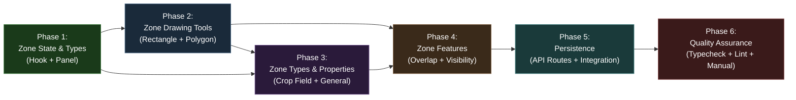

# Work Plan: Map Editor Batch 4 -- Zone Markup Tools

Created Date: 2026-02-19
Type: feature
Estimated Duration: 3-4 days
Estimated Impact: 14 files (10 new, 4 modified)
Related Issue/PR: PRD-007 / Design-007

## Related Documents

- PRD: [docs/prd/prd-007-map-editor.md](../prd/prd-007-map-editor.md) (FR-4.1 through FR-4.8)
- Design Doc: [docs/design/design-007-map-editor.md](../design/design-007-map-editor.md) (Batch 4: Zone Markup Tools)
- ADR: [docs/adr/adr-006-map-editor-architecture.md](../adr/adr-006-map-editor-architecture.md)

## Objective

Add zone markup tools to the map editor so level designers can draw, configure, validate, and persist functional zones (crop fields, spawn points, transitions, NPC locations, etc.) on maps. Zones are the spatial metadata that tells the game engine where gameplay mechanics apply.

## Background

Batch 3 (Core Map Editor UI) delivers the canvas painting tools, terrain palette, layer management, undo/redo, and save/load via API. Batch 4 extends this editor with zone drawing (rectangle and polygon), a zone editor panel, zone-type-specific property editing, overlap detection/validation, colored overlay rendering, and zone CRUD API routes. The zone system is required by Batch 5 (Templates -- constraint validation references zones) and Batches 7-8 (farm/town tools create specialized zones).

**Prerequisite**: Batch 3 (Core Map Editor UI) must be completed. The following Batch 3 outputs are consumed:
- `useMapEditor` hook with `MapEditorState` (includes `zones: ZoneData[]`, `zoneVisibility: boolean`, zone-related actions)
- `EditorTool` type (includes `'zone-rect'` and `'zone-poly'` tool values)
- `MapEditorCanvas` component (HTML5 Canvas with mouse event handling)
- Editor map API routes (`/api/editor-maps` CRUD)
- `@nookstead/map-lib` types: `ZoneType`, `ZoneShape`, `ZoneData`, `ZoneBounds`, `ZoneVertex`, `ZONE_COLORS`, `ZONE_OVERLAP_ALLOWED`
- `packages/db` services: `createMapZone`, `getZonesForMap`, `updateMapZone`, `deleteMapZone` (from Batch 2)

## Phase Structure Diagram

## Task Dependency Diagram

```mermaid
graph TD
    T1["T1: use-zones hook<br/>Zone state management"]
    T2["T2: Zone editor panel<br/>List + type selector"]
    T3["T3: Rectangle zone drawing<br/>Click-drag on canvas"]
    T4["T4: Polygon zone drawing<br/>Click-vertex on canvas"]
    T5["T5: Crop field zone type<br/>soilQuality, irrigated, maxCropSlots"]
    T6["T6: General zone types<br/>path, water, spawn, transition, npc"]
    T7["T7: Zone overlap detection<br/>Validation rules"]
    T8["T8: Zone visibility overlay<br/>Colored overlay by type"]
    T9["T9: Zone API routes<br/>GET/POST/PATCH/DELETE"]
    T10["T10: Zone save/load integration<br/>Map save includes zones"]
    T11["T11: Typecheck + lint"]
    T12["T12: Manual testing"]

    T1 --> T2
    T1 --> T3
    T1 --> T4
    T2 --> T5
    T2 --> T6
    T3 --> T7
    T4 --> T7
    T5 --> T7
    T6 --> T7
    T3 --> T8
    T4 --> T8
    T7 --> T9
    T8 --> T9
    T9 --> T10
    T10 --> T11
    T11 --> T12

    subgraph Phase1["Phase 1: Zone State & Types"]
        T1
        T2
    end

    subgraph Phase2["Phase 2: Zone Drawing Tools"]
        T3
        T4
    end

    subgraph Phase3["Phase 3: Zone Types & Properties"]
        T5
        T6
    end

    subgraph Phase4["Phase 4: Zone Features"]
        T7
        T8
    end

    subgraph Phase5["Phase 5: Persistence"]
        T9
        T10
    end

    subgraph Phase6["Phase 6: Quality Assurance"]
        T11
        T12
    end

    style Phase1 fill:#0d1f0d,stroke:#4a8a4a
    style Phase2 fill:#0d1520,stroke:#4a6a8a
    style Phase3 fill:#150d1f,stroke:#6a4a8a
    style Phase4 fill:#1f150d,stroke:#8a6a4a
    style Phase5 fill:#0d1f1f,stroke:#4a8a8a
    style Phase6 fill:#1f0d0d,stroke:#8a4a4a
```

## Risks and Countermeasures

### Technical Risks

- **Risk**: Zone overlap validation is O(n^2) for pairwise checking and may degrade for maps with many zones.
  - **Impact**: Medium -- maps with 100+ zones could see validation latency above 100ms target.
  - **Countermeasure**: Design Doc specifies simple pairwise checking is acceptable up to 500 zones. Start with the straightforward implementation. Profile on 100-zone maps. If slow, add spatial indexing (grid-based) in a follow-up.

- **Risk**: Polygon rasterization (converting polygon vertices to covered tiles) is needed for overlap detection and visibility overlay but has edge cases (concave polygons, self-intersecting).
  - **Impact**: Medium -- incorrect rasterization means overlap detection and overlay rendering are wrong.
  - **Countermeasure**: Implement scanline rasterization for polygon-to-tile conversion. Restrict polygons to simple (non-self-intersecting) shapes. Validate polygon simplicity on close. Test with convex and concave polygon cases.

- **Risk**: Zone drawing interaction conflicts with existing paint tools on the canvas.
  - **Impact**: Low -- tool selection is exclusive (only one active tool at a time).
  - **Countermeasure**: The `EditorTool` type already includes `'zone-rect'` and `'zone-poly'` as distinct values. Canvas mouse event handlers dispatch based on active tool. No interaction conflict when tool switching is working correctly.

### Schedule Risks

- **Risk**: Batch 3 is not yet implemented, so Batch 4 cannot be executed until Batch 3 is complete.
  - **Impact**: Medium -- this plan is blocked until prerequisite is delivered.
  - **Countermeasure**: This plan documents all Batch 4 work independently. Implementation begins only after Batch 3 completion is verified. Zone utility functions (overlap detection, rasterization) can be developed and tested in isolation before Batch 3 is done.

## Implementation Phases

### Phase 1: Zone State & Types (Estimated commits: 2)

**Purpose**: Establish zone state management in the editor and create the zone editor panel UI component. This is the foundation that all subsequent zone tasks build on.

#### Tasks

- [ ] **Task 1: Create `use-zones` hook for zone state management**
  - File: `apps/genmap/src/hooks/use-zones.ts`
  - Create a custom hook that manages zone state within the editor, wrapping the zone-related actions from the existing `useMapEditor` hook reducer
  - State managed: `zones: ZoneData[]`, `selectedZoneId: string | null`, `zoneVisibility: boolean`, `isDrawing: boolean`, `drawingVertices: ZoneVertex[]`
  - Exposed actions: `addZone(zone)`, `updateZone(zoneId, data)`, `deleteZone(zoneId)`, `selectZone(zoneId)`, `toggleZoneVisibility()`, `startDrawing()`, `addVertex(vertex)`, `cancelDrawing()`
  - The hook dispatches `ADD_ZONE`, `UPDATE_ZONE`, `DELETE_ZONE`, `TOGGLE_ZONE_VISIBILITY` actions to the `useMapEditor` reducer
  - Completion criteria: Hook compiles, exports all specified actions, zone state is reactive
  - References: Design Doc Section 3.2 (`MapEditorState` zone fields, `MapEditorAction` zone actions)

- [ ] **Task 2: Create zone editor panel component**
  - File: `apps/genmap/src/components/map-editor/zone-panel.tsx`
  - Displays a list of all zones on the current map with name, type, and a colored indicator (using `ZONE_COLORS`)
  - Zone type selector dropdown populated from `ZoneType` union values
  - Click a zone in the list to select it (highlights on map, opens properties editor)
  - Delete zone button with confirmation dialog
  - Zone properties editor placeholder (renders type-specific fields; actual fields added in Phase 3)
  - Integrates with `use-zones` hook for state
  - Completion criteria: Panel renders zone list, type selector works, selection highlights zone, delete removes zone from state
  - References: PRD FR-4.3, Design Doc Section 4.2

- [ ] Quality check: TypeScript compiles (`pnpm nx typecheck genmap`)

#### Phase Completion Criteria

- [ ] `use-zones` hook exports all zone state management actions
- [ ] Zone panel component renders in the editor sidebar (added to `MapEditorSidebar`)
- [ ] Zone list displays zone name, type, and colored indicator
- [ ] Zone type selector dropdown includes all 11 `ZoneType` values
- [ ] Selecting a zone in the list updates `selectedZoneId` state
- [ ] Deleting a zone removes it from the zone list

#### Operational Verification Procedures

1. Import `use-zones` hook in a test component; verify `addZone` adds a zone to the list and `deleteZone` removes it
2. Render `ZonePanel` with mock zone data; verify all zones appear with correct names and type colors
3. Click a zone in the list; verify `selectedZoneId` updates

---

### Phase 2: Zone Drawing Tools (Estimated commits: 2)

**Purpose**: Implement the two zone drawing modes (rectangle and polygon) on the map editor canvas. These are the primary user interaction tools for creating zones.

#### Tasks

- [ ] **Task 3: Implement tile-based rectangle zone drawing on canvas**
  - File: `apps/genmap/src/components/map-editor/zone-drawing.ts` (utility) + canvas event handler updates
  - When `EditorTool` is `'zone-rect'`:
    - Mouse down records start tile position `(startX, startY)`
    - Mouse move renders a preview rectangle overlay (semi-transparent, snapped to tile grid)
    - Mouse up calculates `ZoneBounds: { x, y, width, height }` from start and end positions
    - Opens a zone creation dialog (name input, type selector)
    - On dialog confirm, dispatches `addZone` with shape `'rectangle'` and computed bounds
  - Coordinates are snapped to tile boundaries (integer tile positions)
  - Completion criteria: User can draw a rectangle zone on the canvas, dialog appears, zone is added to state with correct bounds
  - AC validation: Dragging from tile (3,3) to (8,6) produces bounds `{x:3, y:3, width:6, height:4}` (FR-4.1)
  - References: Design Doc Section 4.1 (Rectangle zone tool)

- [ ] **Task 4: Implement free-form polygon zone drawing on canvas**
  - File: extends `zone-drawing.ts` + canvas event handler updates
  - When `EditorTool` is `'zone-poly'`:
    - Each click adds a vertex snapped to tile corners to `drawingVertices`
    - Canvas renders a semi-transparent filled polygon preview connecting current vertices with a line to cursor position
    - Double-click or Enter key closes the polygon
    - If fewer than 3 vertices when closing, show warning and discard
    - On close with 3+ vertices, opens zone creation dialog
    - On dialog confirm, dispatches `addZone` with shape `'polygon'` and computed `vertices` array
  - Completion criteria: User can draw a polygon zone, preview renders during drawing, minimum 3-vertex validation works
  - AC validation: Clicking at tiles (2,2), (8,2), (8,6), (5,8), (2,6) creates a 5-vertex polygon zone (FR-4.2)
  - References: Design Doc Section 4.1 (Polygon zone tool)

- [ ] Quality check: TypeScript compiles, zone creation dialog renders correctly

#### Phase Completion Criteria

- [ ] Rectangle zone drawing works with tile-snapped coordinates
- [ ] Rectangle preview renders during drag
- [ ] Polygon zone drawing works with click-to-add-vertex
- [ ] Polygon preview renders as filled semi-transparent shape during drawing
- [ ] Polygon rejects fewer than 3 vertices with warning
- [ ] Zone creation dialog appears on completion with name and type fields
- [ ] Created zones appear in the zone panel list

#### Operational Verification Procedures

1. Select zone-rect tool, drag from tile (3,3) to (8,6), verify preview rectangle appears, release and confirm dialog, verify zone with bounds `{x:3, y:3, width:6, height:4}` appears in zone list
2. Select zone-poly tool, click 5 vertices, press Enter, verify dialog appears and 5-vertex zone is created
3. Select zone-poly tool, click 2 vertices, press Enter, verify warning is shown and no zone is created

---

### Phase 3: Zone Types & Properties (Estimated commits: 2)

**Purpose**: Implement zone-type-specific property schemas and editors so each zone type has meaningful configuration fields. This extends the zone panel with type-aware property editing.

#### Tasks

- [ ] **Task 5: Implement farm-specific zone type -- crop_field with properties**
  - File: `apps/genmap/src/components/map-editor/zone-properties/crop-field-properties.tsx`
  - Property interface (from Design Doc Section 4.2):
    - `soilQuality`: number 1-5 (slider or number input)
    - `irrigated`: boolean (checkbox)
    - `maxCropSlots`: number (derived from zone area, read-only display)
  - `maxCropSlots` auto-calculation: for rectangle zones `= bounds.width * bounds.height`, for polygon zones = number of rasterized tiles
  - Visual: crop_field zones render with brown overlay (`#8B4513` from `ZONE_COLORS`)
  - Irrigated toggle changes overlay to slightly different shade to indicate irrigation status
  - Wire into zone panel: when a crop_field zone is selected, render `CropFieldProperties` editor
  - Completion criteria: crop_field zone type renders custom property editor, `maxCropSlots` auto-calculates from area, `soilQuality` and `irrigated` are editable and persist in zone properties
  - AC validation: A 4x3 rectangle crop_field zone has `maxCropSlots = 12` (FR-4.4)
  - References: PRD FR-4.4, Design Doc Section 4.2 (`CropFieldProperties`)

- [ ] **Task 6: Implement general zone types with property editors**
  - Files:
    - `apps/genmap/src/components/map-editor/zone-properties/path-properties.tsx`
    - `apps/genmap/src/components/map-editor/zone-properties/water-feature-properties.tsx`
    - `apps/genmap/src/components/map-editor/zone-properties/spawn-point-properties.tsx`
    - `apps/genmap/src/components/map-editor/zone-properties/transition-properties.tsx`
    - `apps/genmap/src/components/map-editor/zone-properties/npc-location-properties.tsx`
    - `apps/genmap/src/components/map-editor/zone-properties/index.ts` (barrel export + type-to-component mapping)
  - Property interfaces per Design Doc Section 4.2:
    - `path`: `surfaceType: string`, `width: number`
    - `water_feature`: `waterType: 'pond' | 'river' | 'irrigation' | 'well'`, `depth: number`
    - `spawn_point`: `direction: 'up' | 'down' | 'left' | 'right'`, `priority: number`
    - `transition`: `targetMapId: string`, `targetX: number`, `targetY: number`, `transitionType: 'walk' | 'door' | 'portal' | 'transport'`
    - `npc_location`: `npcId: string`, `scheduleTime: string`, `behavior: string`
  - Remaining zone types (`decoration`, `animal_pen`, `building_footprint`, `transport_point`, `lighting`) get a generic property editor with JSON key-value editing (full editors deferred to Batches 7-8)
  - Wire into zone panel: type-to-component mapping dispatches correct property editor based on `zone.zoneType`
  - Completion criteria: Each implemented zone type renders its property editor when selected, properties are stored in `zone.properties`
  - AC validation: spawn_point zone stores direction and priority; transition zone stores targetMapId and coordinates (FR-4.5)
  - References: PRD FR-4.5, Design Doc Section 4.2

- [ ] Quality check: TypeScript compiles, property editors render correctly for each zone type

#### Phase Completion Criteria

- [ ] crop_field zone type renders soilQuality slider, irrigated checkbox, maxCropSlots read-only display
- [ ] maxCropSlots auto-calculates from zone area (width * height for rectangles)
- [ ] path, water_feature, spawn_point, transition, npc_location each have dedicated property editors
- [ ] Remaining zone types (decoration, animal_pen, building_footprint, transport_point, lighting) have generic key-value editors
- [ ] Property changes update `zone.properties` in editor state via `updateZone` action
- [ ] Zone panel correctly dispatches to the right property editor based on zone type

#### Operational Verification Procedures

1. Create a 4x3 rectangle crop_field zone, verify maxCropSlots displays 12, change soilQuality to 3 and irrigated to true, verify properties update
2. Create a spawn_point zone, set direction to 'down' and priority to 1, verify properties persist
3. Create a transition zone, set targetMapId, targetX, targetY, verify all fields store correctly
4. Create a decoration zone, verify generic key-value editor appears

---

### Phase 4: Zone Features (Estimated commits: 2)

**Purpose**: Implement zone overlap detection with configurable validation rules, and the zone visibility overlay that renders zones as colored shapes on the canvas.

#### Tasks

- [ ] **Task 7: Implement zone overlap detection and validation**
  - File: `apps/genmap/src/lib/zone-validation.ts`
  - Implement `detectZoneOverlap(zoneA, zoneB, allowedOverlaps)` per Design Doc Section 4.3:
    - Convert both zones to tile sets using `getZoneTiles(zone)`
    - For rectangle zones: iterate bounds to generate tile array
    - For polygon zones: implement `rasterizePolygon(vertices)` using scanline algorithm to convert polygon to covered tiles
    - Compute intersection of tile sets
    - Check if overlap is allowed per `ZONE_OVERLAP_ALLOWED` rules from `@nookstead/map-lib`
    - Return `{ overlaps: boolean; allowed: boolean; tiles: Array<{x, y}> }`
  - Implement `validateAllZones(zones, allowedOverlaps)`:
    - Run pairwise overlap detection for all zone pairs
    - Return array of validation errors with zone names and overlapping tile coordinates
  - Allowed overlap pairs (from Design Doc):
    - `decoration` over `path`, `crop_field`
    - `lighting` over `path`, `crop_field`, `decoration`, `spawn_point`, `npc_location`, `building_footprint`, `transport_point`
  - Disallowed overlaps (errors): `crop_field` over `water_feature`, `spawn_point` over `spawn_point`, and all other pairs not in allowed list
  - Add "Validate Zones" button to zone panel that runs validation and displays results
  - Validation also runs automatically on save (Phase 5)
  - Completion criteria: Overlap detection correctly identifies overlapping tiles, allowed overlaps produce warnings (not errors), disallowed overlaps produce errors with zone names and tile list
  - AC validation: crop_field overlapping water_feature reports error; decoration overlapping path reports no error (FR-4.6)
  - Performance target: Validation completes within 100ms for maps with up to 100 zones
  - References: PRD FR-4.6, Design Doc Section 4.3

- [ ] **Task 8: Implement zone visibility layer (colored overlay by type)**
  - File: `apps/genmap/src/components/map-editor/zone-overlay.ts` (canvas rendering utility)
  - Toggleable overlay rendering on the editor canvas:
    - When `zoneVisibility` is true, render all zones as colored semi-transparent shapes
    - Rectangle zones: draw filled rectangle with type-specific color at 30% opacity
    - Polygon zones: draw filled polygon with type-specific color at 30% opacity
    - Colors from `ZONE_COLORS` constant (crop_field = `#8B4513` brown, spawn_point = `#00FF00` green, transition = `#0000FF` blue, npc_location = `#FFD700` gold, etc.)
    - Draw zone name labels centered within each zone area
    - Selected zone renders with a highlighted border (e.g., 2px solid border in zone color at full opacity)
  - Toggle button in the editor toolbar or zone panel
  - Overlay renders on top of terrain but below cursor/selection indicators
  - Completion criteria: Zone overlay renders all zones with correct type colors, labels are visible, toggle show/hide works, selected zone has highlighted border
  - AC validation: Zone visibility toggled on shows all zones with type-specific colors; toggled off hides overlay (FR-4.7)
  - References: PRD FR-4.7, Design Doc zone color constants

- [ ] Quality check: TypeScript compiles, overlap detection unit-testable in isolation

#### Phase Completion Criteria

- [ ] `detectZoneOverlap` correctly identifies overlapping tiles between two zones
- [ ] Allowed overlaps (decoration/path, lighting/*) do not produce errors
- [ ] Disallowed overlaps (crop_field/water_feature) produce errors with tile coordinates
- [ ] `validateAllZones` runs pairwise on all zones and returns structured results
- [ ] "Validate Zones" button in zone panel triggers validation and displays results
- [ ] Zone overlay renders all zones with correct `ZONE_COLORS` colors at 30% opacity
- [ ] Zone name labels render centered within each zone
- [ ] Zone visibility toggle shows/hides the overlay
- [ ] Selected zone renders with highlighted border

#### Operational Verification Procedures

1. Create a crop_field zone and a water_feature zone that overlap by 3 tiles, click "Validate Zones", verify error is reported listing overlapping tile coordinates and both zone names
2. Create a decoration zone overlapping a path zone, click "Validate Zones", verify no error is reported
3. Toggle zone visibility on, verify all zones render with colored overlays and labels
4. Toggle zone visibility off, verify overlay disappears
5. Select a zone, verify highlighted border appears on the selected zone overlay

---

### Phase 5: Persistence (Estimated commits: 2)

**Purpose**: Create Next.js API routes for zone CRUD operations and integrate zone save/load with the existing map save/load workflow.

#### Tasks

- [ ] **Task 9: Create zone API routes (GET/POST/PATCH/DELETE)**
  - Files:
    - `apps/genmap/src/app/api/editor-maps/[mapId]/zones/route.ts` (POST + GET)
    - `apps/genmap/src/app/api/editor-maps/[mapId]/zones/[zoneId]/route.ts` (PATCH + DELETE)
    - `apps/genmap/src/app/api/editor-maps/[id]/validate-zones/route.ts` (POST)
  - Follow existing genmap API pattern (`apps/genmap/src/app/api/objects/route.ts`): `getDb()`, inline validation, call service, return `NextResponse.json()`
  - **POST `/api/editor-maps/[mapId]/zones`**:
    - Validate: `name` (string, required), `zoneType` (valid ZoneType), `shape` ('rectangle' | 'polygon'), bounds/vertices per shape, zIndex (integer, optional)
    - Validate zone coordinates are within map bounds (fetch map dimensions first)
    - Call `createMapZone(db, data)` from `@nookstead/db`
    - Return 201 with created zone
  - **GET `/api/editor-maps/[mapId]/zones`**:
    - Call `getZonesForMap(db, mapId)`
    - Return zone array ordered by zIndex
  - **PATCH `/api/editor-maps/[mapId]/zones/[zoneId]`**:
    - Validate partial update fields
    - Call `updateMapZone(db, id, data)`
    - Return updated zone or 404
  - **DELETE `/api/editor-maps/[mapId]/zones/[zoneId]`**:
    - Call `deleteMapZone(db, id)`
    - Return 204
  - **POST `/api/editor-maps/[id]/validate-zones`**:
    - Call `getZonesForMap(db, mapId)`, convert to `ZoneData[]`, run `validateAllZones`
    - Return validation results array
  - Completion criteria: All 4 CRUD endpoints work, validate-zones endpoint returns structured validation results, zone coordinates are validated against map bounds
  - AC validation: POST creates zone persisted in DB, GET returns ordered zones, DELETE removes zone, validate-zones checks all overlap rules (FR-4.8)
  - References: PRD FR-4.8, Design Doc Section 3.7 API pattern, PRD API endpoint summary

- [ ] **Task 10: Integrate zone save/load with map save/load**
  - File: update `apps/genmap/src/hooks/use-zones.ts` (or create `apps/genmap/src/hooks/use-zone-api.ts`)
  - **Load integration**: When a map is loaded in the editor (via `LOAD_MAP` action), automatically fetch zones from `GET /api/editor-maps/[mapId]/zones` and populate the zone state
  - **Save integration**: On map save (Ctrl+S), after saving map data, sync zone changes:
    - New zones (no ID from DB yet) -> POST to create
    - Modified zones -> PATCH to update
    - Deleted zones -> DELETE to remove
  - Track zone modification state: `newZones`, `modifiedZones`, `deletedZoneIds` for efficient sync
  - Run zone validation before save; display validation errors as warnings (non-blocking) or errors (blocking for disallowed overlaps)
  - Completion criteria: Opening a map loads its zones, saving a map persists zone changes, validation runs on save
  - AC validation: Map open fetches and renders zones on overlay; save persists new/changed zones; delete removes zone from DB (FR-4.8)
  - References: PRD FR-4.8, Design Doc data flow

- [ ] Quality check: All API routes return correct HTTP status codes, zone data round-trips correctly

#### Phase Completion Criteria

- [ ] POST `/api/editor-maps/[mapId]/zones` creates a zone linked to the correct map
- [ ] GET `/api/editor-maps/[mapId]/zones` returns all zones ordered by zIndex
- [ ] PATCH updates zone properties and returns updated record
- [ ] DELETE removes zone and returns 204
- [ ] POST validate-zones returns validation results with overlap errors
- [ ] Zone coordinates are validated against map bounds on creation
- [ ] Opening a map in the editor automatically loads its zones
- [ ] Saving a map persists all zone additions, modifications, and deletions
- [ ] Validation runs on save; disallowed overlaps block save with error message

#### Operational Verification Procedures

1. Create a map, draw 3 zones (rectangle crop_field, polygon spawn_point, rectangle transition), save the map, verify zones appear in the database
2. Reload the map, verify all 3 zones are loaded and rendered on the overlay with correct properties
3. Modify a zone's properties, save, reload, verify changes persisted
4. Delete a zone, save, reload, verify zone is removed
5. Create overlapping crop_field and water_feature zones, save, verify validation error is displayed
6. Call `GET /api/editor-maps/[mapId]/zones` directly, verify zones are returned in zIndex order

---

### Phase 6: Quality Assurance (Estimated commits: 1)

**Purpose**: Final quality verification -- typecheck, lint, and manual end-to-end testing of the complete zone workflow.

#### Tasks

- [ ] **Task 11: Run typecheck and lint**
  - Run `pnpm nx typecheck genmap` -- zero errors
  - Run `pnpm nx lint genmap` -- zero errors
  - Verify no unused imports, no type assertion bypasses
  - Fix any issues found

- [ ] **Task 12: Manual testing of zone workflow**
  - End-to-end zone workflow test:
    1. Open the map editor with an existing map
    2. Select zone-rect tool, draw a rectangle crop_field zone (3x4), verify bounds and maxCropSlots = 12
    3. Select zone-poly tool, draw a 5-vertex polygon spawn_point zone, verify vertices stored
    4. Open zone panel, verify both zones listed with correct names, types, colors
    5. Select crop_field zone, edit soilQuality to 4, irrigated to true, verify properties update
    6. Select spawn_point zone, set direction to 'down', priority to 1, verify properties update
    7. Create a water_feature zone overlapping the crop_field, click "Validate Zones", verify error
    8. Create a decoration zone overlapping a path zone, validate, verify no error
    9. Toggle zone visibility on/off, verify overlay shows/hides
    10. Save the map (Ctrl+S), verify success
    11. Reload the page, open same map, verify all zones load with correct data
    12. Delete a zone, save, reload, verify zone is gone
  - Verify performance: zone operations respond within 100ms for validation on maps with up to 50 zones

- [ ] Verify all Design Doc acceptance criteria achieved (Batch 4 section)
- [ ] Verify integration: zone state is correctly part of the undo/redo system (zone add/delete are undoable commands)

#### Phase Completion Criteria

- [ ] `pnpm nx typecheck genmap` passes with zero errors
- [ ] `pnpm nx lint genmap` passes with zero errors
- [ ] Complete zone workflow (draw, configure, validate, save, load, delete) functions correctly
- [ ] Zone overlay renders all types with correct colors
- [ ] Overlap validation correctly classifies allowed vs disallowed overlaps
- [ ] Zone data round-trips through API (create -> save -> reload -> verify)

#### Operational Verification Procedures

(Copied from Design Doc E2E Verification for Batch 4)

1. **L1 Verification**: Draw zone, save, reload -- zone appears on map with correct type, bounds/vertices, and properties
2. **L2 Verification**: Zone overlap detection correctly identifies and classifies all overlap pairs per `ZONE_OVERLAP_ALLOWED` rules
3. **L3 Verification**: `pnpm nx typecheck genmap` and `pnpm nx lint genmap` pass with zero errors

---

## Files Affected

### New Files (10)

| File | Phase | Description |
|------|-------|-------------|
| `apps/genmap/src/hooks/use-zones.ts` | 1 | Zone state management hook |
| `apps/genmap/src/components/map-editor/zone-panel.tsx` | 1 | Zone editor panel (list, selector, properties) |
| `apps/genmap/src/components/map-editor/zone-drawing.ts` | 2 | Rectangle and polygon drawing utilities |
| `apps/genmap/src/components/map-editor/zone-properties/crop-field-properties.tsx` | 3 | Crop field property editor |
| `apps/genmap/src/components/map-editor/zone-properties/index.ts` | 3 | Property editor barrel + type mapping |
| `apps/genmap/src/components/map-editor/zone-properties/*.tsx` (5 files) | 3 | Property editors for path, water_feature, spawn_point, transition, npc_location |
| `apps/genmap/src/lib/zone-validation.ts` | 4 | Overlap detection and validation logic |
| `apps/genmap/src/components/map-editor/zone-overlay.ts` | 4 | Canvas overlay rendering for zones |
| `apps/genmap/src/app/api/editor-maps/[mapId]/zones/route.ts` | 5 | Zone CRUD API (POST + GET) |
| `apps/genmap/src/app/api/editor-maps/[mapId]/zones/[zoneId]/route.ts` | 5 | Zone CRUD API (PATCH + DELETE) |
| `apps/genmap/src/app/api/editor-maps/[id]/validate-zones/route.ts` | 5 | Zone validation API |

### Modified Files (4)

| File | Phase | Change |
|------|-------|--------|
| `apps/genmap/src/components/map-editor/map-editor-canvas.tsx` | 2 | Add zone drawing mouse event handlers |
| `apps/genmap/src/components/map-editor/map-editor-sidebar.tsx` | 1 | Add ZonePanel to sidebar |
| `apps/genmap/src/components/map-editor/toolbar.tsx` | 2 | Add zone-rect and zone-poly tool buttons |
| `apps/genmap/src/hooks/use-map-editor.ts` | 1,5 | Integrate zone loading/saving into map lifecycle |

## Completion Criteria

- [ ] All 6 phases completed
- [ ] Each phase's operational verification procedures executed
- [ ] Design Doc acceptance criteria satisfied (Batch 4):
  - [ ] When user drags from tile (3,3) to (8,6) in zone rectangle mode, zone is created with bounds `{x:3, y:3, width:6, height:4}`
  - [ ] When crop_field zone overlaps water_feature zone, validation reports error
  - [ ] When zone visibility is toggled on, all zones render with type-specific colors
- [ ] PRD acceptance criteria satisfied (FR-4.1 through FR-4.8)
- [ ] Typecheck and lint pass with zero errors
- [ ] Zone data persists through save/load cycle
- [ ] Zone overlay renders correctly for all 11 zone types

## Progress Tracking

### Phase 1: Zone State & Types
- Start:
- Complete:
- Notes:

### Phase 2: Zone Drawing Tools
- Start:
- Complete:
- Notes:

### Phase 3: Zone Types & Properties
- Start:
- Complete:
- Notes:

### Phase 4: Zone Features
- Start:
- Complete:
- Notes:

### Phase 5: Persistence
- Start:
- Complete:
- Notes:

### Phase 6: Quality Assurance
- Start:
- Complete:
- Notes:

## Notes

- **Dependency on Batch 2**: Zone CRUD services (`createMapZone`, `getZonesForMap`, `updateMapZone`, `deleteMapZone`) in `packages/db/src/services/map-zone.ts` and the `map_zones` table schema are defined in Batch 2. This plan assumes they are implemented before Phase 5 begins.
- **Dependency on Batch 3**: The map editor canvas, `useMapEditor` hook, terrain tools, and editor map API routes must be complete before any Phase in this plan can be executed.
- **Zone types deferred to later batches**: `animal_pen` (Batch 7), `building_footprint` (Batch 8), `transport_point` (Batch 8), `lighting` (Batch 8) have full property editors deferred. They get generic key-value editors in this batch.
- **Undo/redo for zones**: The `useMapEditor` reducer already includes `ADD_ZONE`, `UPDATE_ZONE`, `DELETE_ZONE` action types. Zone operations should be wrapped as `EditorCommand` instances for undo/redo support, consistent with paint commands. This is handled via the existing command pattern infrastructure.
- **Polygon rasterization**: The `rasterizePolygon` function needed for polygon-to-tile conversion is referenced in the Design Doc (Section 4.3) but not fully specified. Implementation should use a standard scanline fill algorithm. If complexity is high, start with convex-only polygon support and add concave support as a follow-up.
