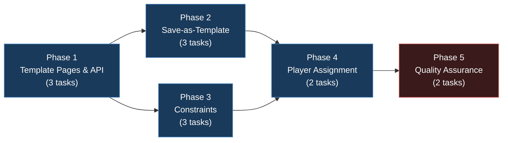
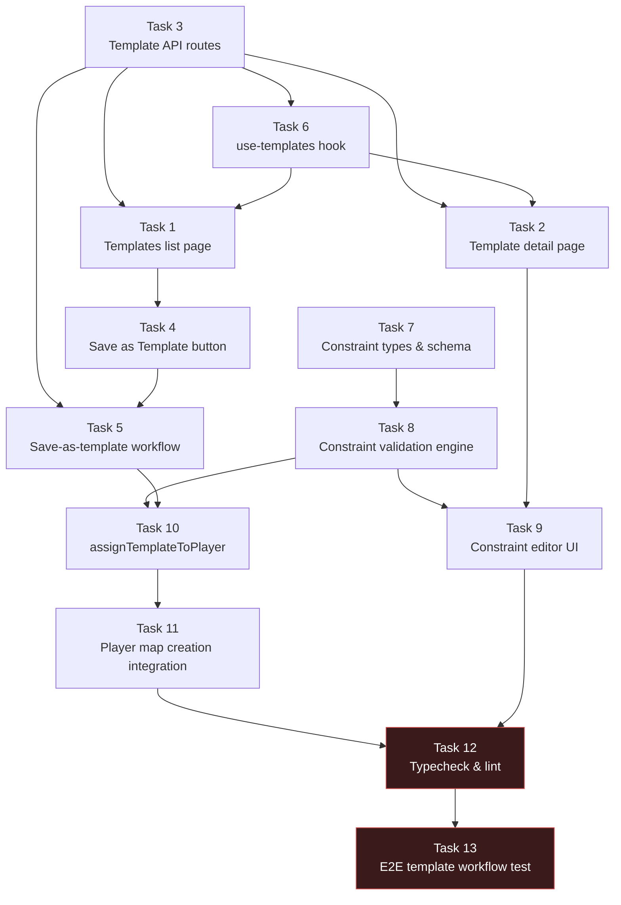

# Work Plan: Map Editor Batch 5 -- Template System

Created Date: 2026-02-19
Type: feature
Estimated Duration: 3-4 days
Estimated Impact: ~18 files (new and modified)
Related Issue/PR: N/A

## Related Documents

- Design Doc: [docs/design/design-007-map-editor.md](../design/design-007-map-editor.md) (Batch 5 sections: 5.1-5.3)
- PRD: [docs/prd/prd-007-map-editor.md](../prd/prd-007-map-editor.md) (FR-5.1 through FR-5.4)
- ADR: [docs/adr/adr-006-map-editor-architecture.md](../adr/adr-006-map-editor-architecture.md) (ADR-0009)

## Objective

Implement the Template System for the Nookstead Map Editor, enabling level designers to save editor maps as reusable templates, manage templates through dedicated pages, validate templates against constraint rules, and assign random published templates to new players to generate unique homesteads.

## Background

Batches 1-4 established the shared map library (`packages/map-lib`), database schema with `editor_maps`/`map_templates`/`map_zones` tables, the core map editor UI, and zone markup tools. The `map_templates` table and `map-template` CRUD service already exist from Batch 2. This batch builds the UI workflows, constraint validation logic, and player assignment integration that make the template system functional end-to-end.

**Prerequisites (must be complete before starting)**:
- Batch 2: DB schema (`map_templates` table, `map-template.ts` service) deployed
- Batch 3: Map editor UI with save/load functionality operational
- Batch 4: Zone markup tools and zone API routes functional (zones are needed for constraint validation)

**Current state of Batch 5 prerequisites in `packages/db/`**:
- `packages/db/src/schema/map-templates.ts` -- Drizzle schema defined (Design Doc section 2.1)
- `packages/db/src/services/map-template.ts` -- CRUD + `publishTemplate` + `getPublishedTemplates` implemented (Design Doc section 2.3)
- `packages/db/src/index.ts` -- Needs export additions for template services

**Current state in `packages/map-lib/`**:
- `packages/map-lib/src/types/template-types.ts` -- `MapTemplate`, `TemplateParameter`, `TemplateConstraint` types defined (Design Doc section 1.4)

## Risks and Countermeasures

### Technical Risks

- **Risk**: Template seed variation produces invalid maps (unreachable areas, broken constraints)
  - **Impact**: High -- players could receive unplayable homesteads
  - **Countermeasure**: `applyTerrainVariation` only modifies terrain noise within zones while preserving zone boundaries. Template constraints validate structural requirements (spawn_point reachable, required zones present) before publishing. Seed variation is terrain-only (zones are preserved exactly).

- **Risk**: Constraint validation complexity grows with zone type count
  - **Impact**: Medium -- validation could become slow or hard to maintain
  - **Countermeasure**: Start with 4 simple constraint types (`zone_required`, `min_zone_count`, `min_zone_area`, `dimension_match`). Each is an independent check. O(n) complexity per constraint where n = number of zones. Target: <100ms for 100 zones.

- **Risk**: `assignTemplateToPlayer` race condition if called concurrently for many new users
  - **Impact**: Low -- genmap is single-user tool; player assignment is called from server during account creation
  - **Countermeasure**: Each call is an independent DB transaction. Random template selection is stateless. No shared mutable state.

### Schedule Risks

- **Risk**: Zone data serialization mismatch between `map_zones` table records and template `zones` JSONB column
  - **Impact**: Medium -- could block save-as-template workflow
  - **Countermeasure**: Both use the same `ZoneData` interface from `@nookstead/map-lib`. The save-as-template workflow queries `map_zones` for the source map and maps records to `ZoneData[]` before storing in template.

## Phase Structure Diagram

## Task Dependency Diagram

## Implementation Phases

### Phase 1: Template Pages & API (Estimated commits: 3-4)

**Purpose**: Establish the API routes for template CRUD operations and the management UI pages. This creates the foundation for all subsequent template workflows.

#### Tasks

- [ ] **Task 1: Create templates list page (`/templates`)**
  - **Description**: New Next.js page at `apps/genmap/src/app/templates/page.tsx` listing all templates. Display name, map type, dimensions (`baseWidth x baseHeight`), version, published status (badge). Add filtering by `isPublished` and `mapType`. Add "Create Template" button (disabled -- templates are created via save-as-template from maps). Add navigation item "Templates" to `apps/genmap/src/components/navigation.tsx`.
  - **Input files**:
    - `apps/genmap/src/components/navigation.tsx` (add Templates nav item)
    - `apps/genmap/src/hooks/use-game-objects.ts` (reference for hook pattern)
    - `apps/genmap/src/app/objects/page.tsx` (reference for page layout pattern)
  - **Output files**:
    - `apps/genmap/src/app/templates/page.tsx` (new)
    - `apps/genmap/src/components/navigation.tsx` (modified: add `{ href: '/templates', label: 'Templates' }`)
  - **Acceptance criteria**:
    - [ ] `/templates` page renders and lists all templates from the API
    - [ ] Each row shows: name, map type, `baseWidth x baseHeight`, version number, published status (green/gray badge)
    - [ ] Filter by `isPublished` (All / Published / Draft) works
    - [ ] Filter by `mapType` works
    - [ ] Click on a template row navigates to `/templates/[id]`
    - [ ] "Templates" nav item appears in navigation bar
  - **Dependencies**: Task 3 (API routes), Task 6 (use-templates hook)

- [ ] **Task 2: Create template detail/edit page (`/templates/[id]`)**
  - **Description**: New page at `apps/genmap/src/app/templates/[id]/page.tsx` showing template detail. Display map preview (rendered grid as canvas thumbnail), metadata (name, description, dimensions, version, publish status), parameters list, constraints list. Edit name/description inline. "Publish" / "Unpublish" button. "Delete" button with confirmation dialog. Back link to `/templates`.
  - **Input files**:
    - `apps/genmap/src/app/objects/[id]/page.tsx` (reference for detail page pattern)
    - `apps/genmap/src/components/confirm-dialog.tsx` (reuse for delete confirmation)
  - **Output files**:
    - `apps/genmap/src/app/templates/[id]/page.tsx` (new)
  - **Acceptance criteria**:
    - [ ] Template detail page renders with all metadata fields
    - [ ] Name and description are editable inline (PATCH on blur/Enter)
    - [ ] "Publish" button calls `POST /api/templates/:id/publish` and updates UI badge
    - [ ] "Delete" button shows confirmation dialog, then calls `DELETE /api/templates/:id` and navigates back to `/templates`
    - [ ] Parameters section displays template parameters (read-only for now)
    - [ ] Constraints section displays configured constraints (editable in Task 9)
  - **Dependencies**: Task 3 (API routes), Task 6 (use-templates hook)

- [ ] **Task 3: Create template API routes**
  - **Description**: Next.js Route Handlers following the existing genmap API pattern (`apps/genmap/src/app/api/objects/route.ts`). Wire up to the existing `map-template.ts` service functions in `@nookstead/db`. Ensure template service functions are exported from `packages/db/src/index.ts`.
  - **Input files**:
    - `apps/genmap/src/app/api/objects/route.ts` (reference for API route pattern)
    - `apps/genmap/src/app/api/objects/[id]/route.ts` (reference for dynamic route pattern)
    - `packages/db/src/services/map-template.ts` (existing service functions)
    - `packages/db/src/index.ts` (needs new exports)
  - **Output files**:
    - `apps/genmap/src/app/api/templates/route.ts` (new: GET list + POST create)
    - `apps/genmap/src/app/api/templates/[id]/route.ts` (new: GET + PATCH + DELETE)
    - `apps/genmap/src/app/api/templates/[id]/publish/route.ts` (new: POST publish)
    - `packages/db/src/index.ts` (modified: add template service exports)
  - **Acceptance criteria**:
    - [ ] `GET /api/templates` returns list of templates with optional `?mapType=` and `?isPublished=` filters
    - [ ] `POST /api/templates` creates a template with required fields: `name`, `mapType`, `baseWidth`, `baseHeight`, `grid`, `layers`. Returns 201 with created record.
    - [ ] `GET /api/templates/:id` returns template by ID or 404
    - [ ] `PATCH /api/templates/:id` updates template fields (name, description, parameters, constraints). Returns updated record or 404.
    - [ ] `DELETE /api/templates/:id` deletes template. Returns 204 or 404.
    - [ ] `POST /api/templates/:id/publish` calls `publishTemplate` service, returns updated record with `isPublished: true` and incremented version
    - [ ] Input validation: reject missing required fields with 400; reject invalid mapType with 400
    - [ ] `packages/db/src/index.ts` exports: `createTemplate`, `getTemplate`, `updateTemplate`, `deleteTemplate`, `listTemplates`, `publishTemplate`, `getPublishedTemplates`
  - **Dependencies**: None (uses existing Batch 2 services)

- [ ] **Task 6: Create `use-templates` hook**
  - **Description**: Custom React hook at `apps/genmap/src/hooks/use-templates.ts` following the `use-game-objects.ts` pattern. Provides: `templates` list, `isLoading`, `error`, `fetchTemplates(filters?)`, `deleteTemplate(id)`, `publishTemplate(id)`, `updateTemplate(id, data)`. Supports pagination with `PAGE_SIZE = 20`.
  - **Input files**:
    - `apps/genmap/src/hooks/use-game-objects.ts` (reference pattern)
  - **Output files**:
    - `apps/genmap/src/hooks/use-templates.ts` (new)
  - **Acceptance criteria**:
    - [ ] Hook fetches templates from `/api/templates` on mount
    - [ ] Supports filter parameters: `mapType`, `isPublished`
    - [ ] `deleteTemplate(id)` calls DELETE and removes from local state
    - [ ] `publishTemplate(id)` calls POST publish and updates local state
    - [ ] `updateTemplate(id, data)` calls PATCH and updates local state
    - [ ] Loading and error states are correctly managed
    - [ ] Pagination with `limit`/`offset` works
  - **Dependencies**: Task 3 (API routes must exist)

#### Phase 1 Completion Criteria

- [ ] All 4 template API routes respond correctly (GET list, GET by ID, POST create, PATCH update, DELETE, POST publish)
- [ ] Templates list page renders at `/templates` and navigates to detail pages
- [ ] Template detail page renders at `/templates/[id]` with edit/publish/delete actions
- [ ] `use-templates` hook provides data fetching, mutation, and pagination
- [ ] `packages/db/src/index.ts` exports all template service functions
- [ ] Navigation bar shows "Templates" link

#### Operational Verification Procedures

1. Start genmap dev server (`pnpm nx dev genmap`)
2. Navigate to `/templates` -- verify empty state renders
3. Create a template via `POST /api/templates` with test data (e.g., via curl or API client)
4. Verify the template appears in the list page with correct metadata
5. Click the template -- verify detail page loads with all fields
6. Edit the name -- verify PATCH is called and name updates
7. Click "Publish" -- verify version increments and published badge appears
8. Click "Delete" -- verify confirmation dialog appears, confirm, verify redirect to `/templates` and template is gone

---

### Phase 2: Save-as-Template (Estimated commits: 3)

**Purpose**: Implement the workflow for creating templates from existing editor maps, which is the primary way templates are authored. This is the core of FR-5.1.

#### Tasks

- [ ] **Task 4: Add "Save as Template" button to map editor**
  - **Description**: Add a "Save as Template" button to the map editor toolbar/header (the map edit page at `/maps/[id]`). Clicking opens a dialog collecting: template name (pre-filled with map name + " Template"), description (textarea), and parameter definitions (initially empty, can add later). The dialog has "Save" and "Cancel" buttons.
  - **Input files**:
    - `apps/genmap/src/app/maps/[id]/page.tsx` (map editor page -- add button)
    - `apps/genmap/src/components/ui/dialog.tsx` (reuse shadcn dialog)
    - `apps/genmap/src/components/ui/input.tsx` (form fields)
    - `apps/genmap/src/components/ui/textarea.tsx` (description field)
  - **Output files**:
    - `apps/genmap/src/components/map-editor/save-as-template-dialog.tsx` (new)
    - `apps/genmap/src/app/maps/[id]/page.tsx` (modified: add button + dialog)
  - **Acceptance criteria**:
    - [ ] "Save as Template" button is visible on the map editor page
    - [ ] Clicking opens a dialog with name, description, and parameter fields
    - [ ] Name is pre-filled with `"{mapName} Template"`
    - [ ] Cancel closes the dialog without side effects
    - [ ] Save button is disabled if name is empty
  - **Dependencies**: Task 1 (templates page must exist for navigation after save)

- [ ] **Task 5: Implement save-as-template workflow**
  - **Description**: When the user confirms the save-as-template dialog, the system: (1) reads the current map's grid and layers from editor state, (2) fetches all zones for the current map via `GET /api/editor-maps/:mapId/zones`, (3) maps zone records to `ZoneData[]` format, (4) calls `POST /api/templates` with `{ name, description, mapType, baseWidth: width, baseHeight: height, grid, layers, zones, parameters: [], constraints: [] }`, (5) on success shows a toast notification and optionally navigates to the new template's detail page.
  - **Input files**:
    - `apps/genmap/src/components/map-editor/save-as-template-dialog.tsx` (from Task 4)
    - `apps/genmap/src/hooks/use-templates.ts` (from Task 6, for API calls)
    - Design Doc section 5.1 workflow steps
  - **Output files**:
    - `apps/genmap/src/components/map-editor/save-as-template-dialog.tsx` (modified: add save logic)
    - `apps/genmap/src/hooks/use-templates.ts` (add `createTemplate` function if not already present)
  - **Acceptance criteria**:
    - [ ] Given map "Homestead Draft" is open, when "Save as Template" is clicked and confirmed with name "Starter Farm", then a new template record is created with the map's grid, layers, and zones
    - [ ] The source editor map "Homestead Draft" remains unchanged after the operation
    - [ ] The template is created with `isPublished: false` and `version: 1`
    - [ ] Zone data from `map_zones` table is copied into the template's `zones` JSONB column
    - [ ] Success toast appears with link to new template
    - [ ] Error toast appears if the API call fails, with the error message
  - **Dependencies**: Task 3 (API routes), Task 4 (dialog UI)

- [ ] Quality check: Verify save-as-template creates correct template record with matching grid/layers/zones data

#### Phase 2 Completion Criteria

- [ ] "Save as Template" button is present on the map editor page
- [ ] Save-as-template workflow creates a new template from an existing map
- [ ] Source map is not modified
- [ ] Template record contains grid, layers, zones from the source map
- [ ] Template is created as unpublished draft (version 1)

#### Operational Verification Procedures

1. Open an existing editor map with at least 2 zones at `/maps/[id]`
2. Click "Save as Template" -- verify dialog opens with pre-filled name
3. Enter a description, click Save
4. Verify success toast appears
5. Navigate to `/templates` -- verify new template appears in list
6. Open the template detail page -- verify grid dimensions match source map
7. Return to the source map -- verify it is unchanged (same name, same data)
8. Verify the template's zones field contains the same zone data as the source map's zones

---

### Phase 3: Constraints (Estimated commits: 3)

**Purpose**: Implement constraint types, the validation engine, and the constraint editor UI. This enables game designers to define rules that templates must satisfy before publishing (FR-5.4).

#### Tasks

- [ ] **Task 7: Define constraint types and validation schema**
  - **Description**: The `TemplateConstraint` type is already defined in `packages/map-lib/src/types/template-types.ts`. This task ensures it covers all 4 required constraint types and adds a utility function to create default constraints. Add a `DEFAULT_HOMESTEAD_CONSTRAINTS` constant with recommended defaults (e.g., at least 1 spawn_point required).
  - **Input files**:
    - `packages/map-lib/src/types/template-types.ts` (existing type definition)
  - **Output files**:
    - `packages/map-lib/src/core/template-constraints.ts` (new: constraint helpers and defaults)
    - `packages/map-lib/src/index.ts` (modified: export constraint utilities)
  - **Acceptance criteria**:
    - [ ] `TemplateConstraint` type supports: `zone_required`, `min_zone_count`, `min_zone_area`, `max_zone_overlap`, `dimension_match`
    - [ ] `DEFAULT_HOMESTEAD_CONSTRAINTS` is an array containing `{ type: 'zone_required', target: 'spawn_point', value: 1, message: 'Template must have at least one spawn_point zone' }`
    - [ ] `createConstraint(type, target, value, message)` factory function is exported
    - [ ] All constraint types are documented with JSDoc
  - **Dependencies**: None (uses existing types)

- [ ] **Task 8: Implement constraint validation engine (`validateTemplateConstraints`)**
  - **Description**: Implement the `validateTemplateConstraints` function as specified in Design Doc section 5.2. The function takes a `MapTemplate` and `ZoneData[]`, evaluates each constraint, and returns `ConstraintResult[]`. Place in `packages/map-lib/src/core/template-constraints.ts`. Also implement `getZoneArea` helper that computes area for both rectangle and polygon zones. Wire the validation into the `POST /api/templates/:id/publish` route so publishing is blocked if any constraint fails.
  - **Input files**:
    - Design Doc section 5.2 (full code specification)
    - `packages/map-lib/src/types/template-types.ts` (types)
    - `apps/genmap/src/app/api/templates/[id]/publish/route.ts` (from Task 3, needs constraint check)
  - **Output files**:
    - `packages/map-lib/src/core/template-constraints.ts` (modified: add validateTemplateConstraints + getZoneArea)
    - `apps/genmap/src/app/api/templates/[id]/publish/route.ts` (modified: add constraint validation before publish)
  - **Acceptance criteria**:
    - [ ] `validateTemplateConstraints(template, zones)` returns `ConstraintResult[]` with `passed` boolean and `message` for each constraint
    - [ ] `zone_required` constraint: passes when zones of target type >= value, fails otherwise with constraint's message
    - [ ] `min_zone_count` constraint: passes when zone count of target type >= value
    - [ ] `min_zone_area` constraint: passes when total area of target zone type >= value tiles
    - [ ] `dimension_match` constraint: passes when template dimensions match `MAP_TYPE_CONSTRAINTS` for its mapType
    - [ ] `getZoneArea(zone)` correctly computes area for rectangle zones (width * height) and polygon zones (via rasterization)
    - [ ] Unknown constraint types return `{ passed: true, message: 'Unknown constraint type' }` (forward-compatible)
    - [ ] `POST /api/templates/:id/publish` runs constraint validation and returns 400 with failed constraint messages if any fail
    - [ ] Constraint validation completes within 100ms for 100 zones
  - **Dependencies**: Task 7 (constraint types)

- [ ] **Task 9: Add constraint editor UI to template detail page**
  - **Description**: Add a "Constraints" section to the template detail page (`/templates/[id]`) with: (1) list of current constraints with type, target, value, message, and pass/fail indicator; (2) "Add Constraint" button opening a form with type dropdown, target input, value input, message input; (3) "Remove" button per constraint; (4) "Validate Now" button that runs validation against the template's zones and shows results inline. Changes are saved via `PATCH /api/templates/:id` with updated constraints array.
  - **Input files**:
    - `apps/genmap/src/app/templates/[id]/page.tsx` (from Task 2)
    - `apps/genmap/src/components/ui/select.tsx` (for type dropdown)
    - `apps/genmap/src/components/ui/badge.tsx` (for pass/fail indicators)
  - **Output files**:
    - `apps/genmap/src/components/template-constraint-editor.tsx` (new)
    - `apps/genmap/src/app/templates/[id]/page.tsx` (modified: integrate constraint editor)
  - **Acceptance criteria**:
    - [ ] Constraints section shows all configured constraints with type, target, value, message
    - [ ] "Add Constraint" opens a form with: type dropdown (zone_required, min_zone_count, min_zone_area, max_zone_overlap, dimension_match), target text input, value number input, message text input
    - [ ] Adding a constraint calls PATCH to update the template's constraints array
    - [ ] Removing a constraint calls PATCH to update without the removed constraint
    - [ ] "Validate Now" button runs validation and shows pass/fail badges next to each constraint
    - [ ] Failed constraints display in red with their error messages
    - [ ] Passed constraints display in green with success messages
  - **Dependencies**: Task 2 (template detail page), Task 8 (validation engine)

#### Phase 3 Completion Criteria

- [ ] All 5 constraint types are defined with correct validation logic
- [ ] `validateTemplateConstraints` function is exported from `@nookstead/map-lib`
- [ ] Publishing is blocked when constraints fail (returns 400 with constraint failure details)
- [ ] Constraint editor UI allows adding, removing, and validating constraints on the template detail page
- [ ] `DEFAULT_HOMESTEAD_CONSTRAINTS` provides a sensible starting set

#### Operational Verification Procedures

1. Open a template at `/templates/[id]`
2. Click "Add Constraint" and add: type=`zone_required`, target=`spawn_point`, value=`1`, message="Must have spawn point"
3. Verify the constraint appears in the list
4. Click "Validate Now" -- if the template has no spawn_point zone, verify red failure badge with message
5. If the template has a spawn_point zone, verify green pass badge
6. Attempt to publish a template with a failing constraint -- verify publish is blocked with 400 error and constraint message
7. Fix the constraint (add the required zone to the source map and re-save-as-template, or remove the constraint)
8. Publish again -- verify success

---

### Phase 4: Player Assignment (Estimated commits: 2)

**Purpose**: Implement the server-side service that assigns a random published template to a new player, generating their initial homestead. This is the production integration point (FR-5.3).

#### Tasks

- [ ] **Task 10: Implement `assignTemplateToPlayer` service**
  - **Description**: Service function in `packages/db/src/services/map-template.ts` (or a new `packages/db/src/services/player-template-assignment.ts`) as specified in Design Doc section 5.3. The function: (1) queries `getPublishedTemplates(db, 'player_homestead')`, (2) selects one randomly, (3) generates a seed (provided or `Date.now()`), (4) applies terrain variation via `applyTerrainVariation(grid, seed)`, (5) recomputes autotile layers, (6) computes walkability grid, (7) saves to the player's `maps` record via `saveMap`. Also requires implementing `applyTerrainVariation` and `recomputeAllAutotileLayers` helper functions in `packages/map-lib`.
  - **Input files**:
    - Design Doc section 5.3 (full code specification)
    - `packages/db/src/services/map-template.ts` (existing: getPublishedTemplates)
    - `packages/db/src/services/map.ts` (existing: saveMap)
    - `packages/map-lib/src/` (needs terrain variation + autotile recomputation helpers)
  - **Output files**:
    - `packages/map-lib/src/generation/terrain-variation.ts` (new: `applyTerrainVariation`)
    - `packages/map-lib/src/generation/walkability.ts` (new: `computeWalkabilityGrid`)
    - `packages/map-lib/src/index.ts` (modified: export new functions)
    - `packages/db/src/services/player-template-assignment.ts` (new: `assignTemplateToPlayer`)
    - `packages/db/src/index.ts` (modified: export `assignTemplateToPlayer`)
  - **Acceptance criteria**:
    - [ ] Given 3 published homestead templates exist, when `assignTemplateToPlayer(db, 'newUser123')` is called, then one template is randomly selected
    - [ ] A seed is generated (or uses provided seed) and applied to produce terrain variation
    - [ ] Zone layouts are preserved exactly (zones are not affected by seed)
    - [ ] The generated map is saved to the player's `maps` record via `saveMap`
    - [ ] Given 0 published templates exist, then the function throws `Error('No published homestead templates available')`
    - [ ] Given the same template is assigned to two users with different seeds, then grid data differs but zone positions are identical
    - [ ] `applyTerrainVariation(grid, seed)` modifies terrain values using seeded noise while preserving the general terrain type category (e.g., grass variants remain grassy)
    - [ ] `computeWalkabilityGrid(grid)` returns `boolean[][]` using `isWalkable()` from terrain-properties
    - [ ] Template generation completes within 500ms (per PRD success criteria)
  - **Dependencies**: Task 5 (templates must exist), Task 8 (constraints validated before publish means only valid templates are published)

- [ ] **Task 11: Integrate with existing player map creation flow**
  - **Description**: Integrate `assignTemplateToPlayer` into the existing player creation flow on the server side. When a new player account is created and no map exists, the system can call `assignTemplateToPlayer` instead of (or as a fallback alongside) the existing procedural `MapGenerator`. This is a server-side integration point in `apps/server/`. Add a configuration flag to switch between procedural generation and template-based generation.
  - **Input files**:
    - `apps/server/src/` (server-side map creation code)
    - `packages/db/src/services/player-template-assignment.ts` (from Task 10)
  - **Output files**:
    - Server-side map creation handler (modified: add template-based generation path)
    - Configuration for template vs. procedural generation mode
  - **Acceptance criteria**:
    - [ ] When a new player joins and template-based generation is enabled, `assignTemplateToPlayer` is called
    - [ ] When template-based generation is enabled but no published templates exist, fallback to procedural `MapGenerator`
    - [ ] Configuration flag (environment variable or config constant) controls which generation mode is active
    - [ ] Existing procedural generation path continues to work unchanged when templates are disabled
  - **Dependencies**: Task 10 (`assignTemplateToPlayer`)

#### Phase 4 Completion Criteria

- [ ] `assignTemplateToPlayer` service function works end-to-end: selects template, applies seed, generates map, saves to player record
- [ ] Terrain variation produces visually different maps from the same template
- [ ] Zone layouts are preserved across seed variations
- [ ] Server-side integration allows template-based or procedural map generation
- [ ] Fallback to procedural generation when no published templates exist
- [ ] Template generation completes within 500ms

#### Operational Verification Procedures

1. Publish at least 2 homestead templates via the template management UI
2. Call `assignTemplateToPlayer(db, 'testUser1')` -- verify a map is created in the `maps` table
3. Call `assignTemplateToPlayer(db, 'testUser2')` -- verify a different (or same) template is selected, and the grid data differs from testUser1 due to different seeds
4. Verify both player maps have valid walkability grids
5. Verify zone data is not stored in player maps (zones are template metadata only; player maps store grid/layers/walkable)
6. Delete all published templates, call `assignTemplateToPlayer` -- verify it throws with the expected error message
7. Test server-side integration: create a new player account with template mode enabled, verify homestead is generated

---

### Phase 5: Quality Assurance (Required) (Estimated commits: 1-2)

**Purpose**: Overall quality assurance, Design Doc consistency verification, and end-to-end workflow testing.

#### Tasks

- [ ] **Task 12: Run typecheck and lint**
  - **Description**: Run `pnpm nx run-many -t lint typecheck` across all affected projects (`genmap`, `db`, `map-lib`, `server`). Fix any type errors, lint violations, or unused imports introduced by Batch 5 changes.
  - **Input files**: All files created/modified in Tasks 1-11
  - **Output files**: Any files needing lint/type fixes
  - **Acceptance criteria**:
    - [ ] `pnpm nx lint genmap` passes with 0 errors
    - [ ] `pnpm nx typecheck genmap` passes with 0 errors
    - [ ] `pnpm nx lint db` passes (if applicable as separate target)
    - [ ] `pnpm nx typecheck` passes for all affected projects
    - [ ] No unused imports or variables
    - [ ] All new files follow Prettier formatting (single quotes, 2-space indent)
  - **Dependencies**: All Tasks 1-11 complete

- [ ] **Task 13: Test template workflow end-to-end**
  - **Description**: Manual E2E verification of the complete template workflow: (1) create an editor map with terrain and zones, (2) save as template, (3) add constraints, (4) validate constraints, (5) publish template, (6) call `assignTemplateToPlayer` to generate a player homestead. Verify each step produces correct results. Document any issues found and fix them.
  - **Input files**: All Batch 5 output
  - **Output files**: Fixes for any issues discovered
  - **Acceptance criteria**:
    - [ ] Complete workflow succeeds: create map -> add zones -> save as template -> add constraints -> validate -> publish -> assign to player
    - [ ] Template record matches source map's grid/layers/zones
    - [ ] Constraint validation correctly blocks publishing when constraints fail
    - [ ] Published template is selectable by `assignTemplateToPlayer`
    - [ ] Generated player homestead has valid grid, layers, and walkability data
    - [ ] All API endpoints return correct HTTP status codes (201, 200, 204, 400, 404)
  - **Dependencies**: Task 12

#### Phase 5 Completion Criteria

- [ ] All Design Doc Batch 5 acceptance criteria verified (FR-5.1, FR-5.2, FR-5.3, FR-5.4)
- [ ] `pnpm nx run-many -t lint typecheck` passes for genmap, db, map-lib, server
- [ ] All API routes handle error cases (404, 400) correctly
- [ ] E2E template workflow completes successfully
- [ ] No regressions in existing genmap functionality (sprites, objects pages still work)

#### Operational Verification Procedures

(Copied from Design Doc E2E Verification for Batch 5)
1. Open genmap and navigate to `/maps` -- create or open an editor map
2. Paint terrain and draw at least one spawn_point zone and one crop_field zone
3. Click "Save as Template" -- enter name and description, confirm
4. Navigate to `/templates` -- verify template appears
5. Open template detail -- add constraint: `zone_required`, target=`spawn_point`, value=`1`
6. Click "Validate Now" -- verify constraint passes (green badge)
7. Click "Publish" -- verify template is now published (version incremented)
8. From server/CLI: call `assignTemplateToPlayer(db, 'testPlayer')` -- verify player map is created
9. Verify the player map's grid differs from template (due to seed variation) but zone structure is logically preserved
10. Run `pnpm nx run-many -t lint typecheck` -- verify 0 errors

---

## Quality Assurance

- [ ] Implement staged quality checks per phase (refer to ai-development-guide skill)
- [ ] All tests pass (existing + new)
- [ ] Static check pass (`pnpm nx typecheck`)
- [ ] Lint check pass (`pnpm nx lint`)
- [ ] Build success (`pnpm nx build genmap`)

## Completion Criteria

- [ ] All 5 phases completed
- [ ] Each phase's operational verification procedures executed
- [ ] Design Doc Batch 5 acceptance criteria satisfied:
  - [ ] FR-5.1: Save-as-template creates template from editor map without modifying source
  - [ ] FR-5.2: Templates management pages list/detail with publish/unpublish
  - [ ] FR-5.3: `assignTemplateToPlayer` generates unique homestead from random published template
  - [ ] FR-5.4: Template constraints block publishing when unsatisfied
- [ ] Staged quality checks completed (zero errors)
- [ ] All tests pass
- [ ] Necessary documentation updated
- [ ] User review approval obtained

## File Impact Summary

### New Files (~14)

| File | Phase | Description |
|------|-------|-------------|
| `apps/genmap/src/app/templates/page.tsx` | 1 | Templates list page |
| `apps/genmap/src/app/templates/[id]/page.tsx` | 1 | Template detail/edit page |
| `apps/genmap/src/app/api/templates/route.ts` | 1 | GET list + POST create |
| `apps/genmap/src/app/api/templates/[id]/route.ts` | 1 | GET + PATCH + DELETE |
| `apps/genmap/src/app/api/templates/[id]/publish/route.ts` | 1 | POST publish |
| `apps/genmap/src/hooks/use-templates.ts` | 1 | Template data hook |
| `apps/genmap/src/components/map-editor/save-as-template-dialog.tsx` | 2 | Save-as-template dialog |
| `packages/map-lib/src/core/template-constraints.ts` | 3 | Constraint validation engine + defaults |
| `apps/genmap/src/components/template-constraint-editor.tsx` | 3 | Constraint editor UI component |
| `packages/map-lib/src/generation/terrain-variation.ts` | 4 | Seed-based terrain variation |
| `packages/map-lib/src/generation/walkability.ts` | 4 | Walkability grid computation |
| `packages/db/src/services/player-template-assignment.ts` | 4 | Player template assignment service |

### Modified Files (~6)

| File | Phase | Change |
|------|-------|--------|
| `apps/genmap/src/components/navigation.tsx` | 1 | Add "Templates" nav item |
| `packages/db/src/index.ts` | 1, 4 | Export template + assignment services |
| `packages/map-lib/src/index.ts` | 3, 4 | Export constraint utilities + terrain variation |
| `apps/genmap/src/app/maps/[id]/page.tsx` | 2 | Add "Save as Template" button |
| `apps/genmap/src/app/api/templates/[id]/publish/route.ts` | 3 | Add constraint validation |
| Server-side player creation handler | 4 | Add template-based generation path |

## Progress Tracking

### Phase 1: Template Pages & API
- Start:
- Complete:
- Notes:

### Phase 2: Save-as-Template
- Start:
- Complete:
- Notes:

### Phase 3: Constraints
- Start:
- Complete:
- Notes:

### Phase 4: Player Assignment
- Start:
- Complete:
- Notes:

### Phase 5: Quality Assurance
- Start:
- Complete:
- Notes:

## Notes

- **Strategy B (Implementation-First)** is used since no test design information was provided. Tests are added as needed during implementation phases.
- Phases 2 and 3 can run partially in parallel since Task 7 (constraint types) has no dependency on Phase 2. However, Task 9 (constraint editor UI) depends on Task 2 (template detail page).
- The `applyTerrainVariation` function scope is a known unknown (Design Doc "Undetermined Items"). The initial implementation should apply simplex noise variation to terrain within the same terrain family (e.g., grass -> dirt_light_grass -> orange_grass) without crossing terrain categories. This can be refined after playtesting.
- `max_zone_overlap` constraint type is defined but may not be fully implemented in the initial pass if polygon overlap detection proves complex. Rectangle-rectangle overlap is straightforward and should be implemented first.
