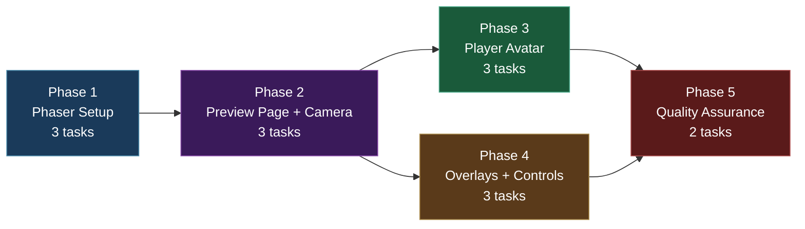
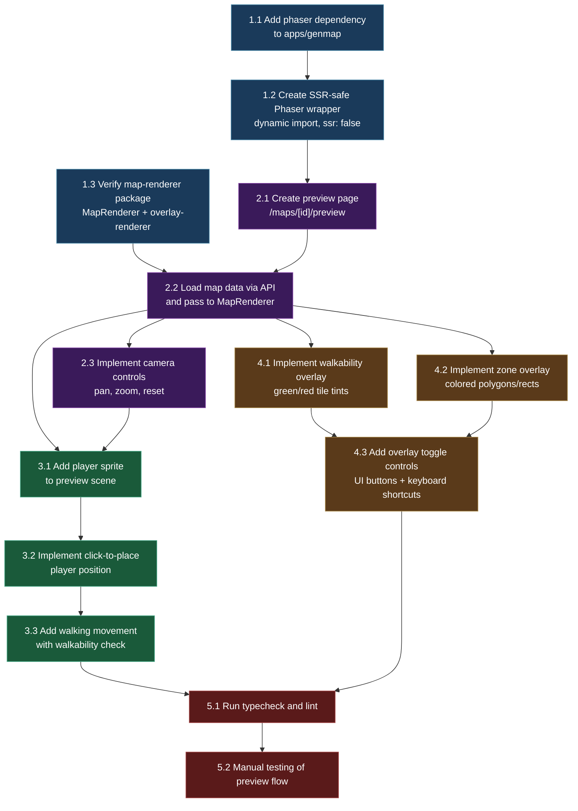

# Work Plan: Map Editor Batch 6 -- Phaser 3 Live Preview

Created Date: 2026-02-19
Type: feature
Estimated Duration: 3 days
Estimated Impact: 15+ files (3 modified, 12+ new)
Related Issue/PR: N/A

## Related Documents

- PRD: [docs/prd/prd-007-map-editor.md](../prd/prd-007-map-editor.md) (FR-6.1 through FR-6.6)
- ADR: [docs/adr/adr-006-map-editor-architecture.md](../adr/adr-006-map-editor-architecture.md) (Decision 4: Dynamic Import with SSR-Safe Wrapper)
- Design Doc: [docs/design/design-007-map-editor.md](../design/design-007-map-editor.md) (Batch 6: Sections 6.1-6.3)

## Objective

Add a live Phaser 3 preview to the genmap map editor, allowing level designers to see exactly how their maps will appear in the game client. This includes an SSR-safe Phaser wrapper, a dedicated preview page with camera controls, a player avatar that respects walkability, and toggleable walkability/zone overlays. The preview uses the shared `packages/map-renderer` package (created in Batch 1) to ensure visual parity between the editor preview and the game client.

## Background

The map editor (Batches 1-4) provides HTML5 Canvas-based terrain painting and zone markup. However, level designers need to verify that their maps look correct in the actual Phaser 3 game engine -- with proper autotile rendering, sprite scaling, and layer compositing -- before publishing. The game client (`apps/game`) already integrates Phaser via a dynamic import pattern (`PhaserGame.tsx`), and the `MapRenderer` class in `packages/map-renderer` encapsulates the RenderTexture-based map rendering logic extracted from `Game.ts`.

Batch 6 brings Phaser into the genmap app for the first time, following the same SSR-safe dynamic import pattern from ADR-0009 Decision 4. The preview page loads map data via the existing API (Batch 3), renders it through `MapRenderer`, and adds interactive features: camera pan/zoom, player avatar placement with walking, and overlay toggles.

No test design information is provided from a previous process, so Strategy B (implementation-first) applies.

## Prerequisites

Before starting this plan:

- [ ] Batch 1 complete: `packages/map-renderer` package exists with `MapRenderer`, `camera-utils`, and `overlay-renderer` modules
- [ ] Batch 1 complete: `packages/map-lib` package exists with terrain definitions, autotile engine, and `ZoneData`/`ZONE_COLORS` exports
- [ ] Batch 3 complete: Map editor CRUD API working (`GET /api/editor-maps/:id` returns full map data with grid, layers, walkable)
- [ ] Batch 4 complete: Zone CRUD API working (`GET /api/editor-maps/:mapId/zones` returns zones for overlay rendering)
- [ ] Tileset PNG assets available as static assets in `apps/genmap/public/assets/tilesets/` (or accessible via a shared path)
- [ ] All existing tests pass (`pnpm nx run-many -t lint test build typecheck`)

## Risks and Countermeasures

### Technical Risks

- **Risk**: Phaser memory leaks in long-running editor sessions from repeated mount/unmount cycles
  - **Impact**: Browser tab becomes sluggish or crashes after navigating between editor and preview multiple times
  - **Countermeasure**: Strict lifecycle management -- destroy Phaser game instance on component unmount via React ref cleanup. Test with repeated mount/unmount cycles during verification. Use `game.destroy(true)` to remove canvas and all textures.

- **Risk**: Tileset assets not available in genmap app (they currently live under `apps/game/public/assets/`)
  - **Impact**: Phaser preview shows empty/broken map with missing texture errors
  - **Countermeasure**: Task 1 explicitly addresses asset availability. Options: symlink `public/assets/tilesets/` from game app, copy assets to genmap public dir, or serve from a shared static route. Verify asset loading in Phase 1 before building features.

- **Risk**: MapRenderer class from `packages/map-renderer` may not exist yet or may have a different API than designed
  - **Impact**: Preview scene cannot render maps, blocking all subsequent tasks
  - **Countermeasure**: Phase 1 includes verifying the map-renderer package exists and its API matches expectations. If the package is incomplete, create a minimal MapRenderer inline in the preview scene and refactor later.

- **Risk**: Phaser bundle size (~1MB) increases genmap app load time
  - **Impact**: Editor feels slow on initial page load
  - **Countermeasure**: Phaser is only loaded on the preview page via dynamic import with `ssr: false`. The import is lazy -- it does not affect other genmap pages. The loading state shows a skeleton placeholder while Phaser initializes.

### Schedule Risks

- **Risk**: packages/map-renderer API differs from Design Doc specification
  - **Impact**: Need to adapt preview code to actual API, adding 0.5 days
  - **Countermeasure**: Read the actual map-renderer source in Phase 1 before implementing the preview scene. Adapt to the real API rather than the designed one.

## Phase Structure Diagram

## Task Dependency Diagram

## Implementation Phases

### Phase 1: Phaser Setup in Genmap (Estimated commits: 3)

**Purpose**: Establish Phaser 3 as a dependency in the genmap app, create an SSR-safe wrapper component following the game app pattern and ADR-0009 Decision 4, and verify that the map-renderer package provides the expected API.

**Owner**: mechanics-developer

#### Tasks

- [ ] **Task 1.1**: Add phaser dependency to `apps/genmap/package.json` and add `@nookstead/map-renderer` + `@nookstead/map-lib` workspace dependencies
  - Add `"phaser": "^3.80.0"` to dependencies
  - Add `"@nookstead/map-renderer": "workspace:*"` to dependencies
  - Add `"@nookstead/map-lib": "workspace:*"` to dependencies (if not already present)
  - Run `pnpm install` to resolve
  - Verify no SSR compilation errors by running `pnpm nx build genmap` (Phaser should not be imported at top level yet)
  - **Completion**: `pnpm install` succeeds, package.json has all three dependencies, build does not fail

- [ ] **Task 1.2**: Create SSR-safe Phaser wrapper component using `next/dynamic` with `ssr: false`
  - Create `apps/genmap/src/components/map-editor/phaser-preview-wrapper.tsx`:
    - `'use client'` directive at top
    - Use `dynamic(() => import('./phaser-preview'), { ssr: false, loading: () => <LoadingSkeleton /> })`
    - Export `PhaserPreview` component
  - Create `apps/genmap/src/components/map-editor/phaser-preview.tsx` (the actual Phaser component):
    - Accept props: `mapData: GeneratedMap`, `walkable: boolean[][]`, `zones: ZoneData[]`, `showWalkability: boolean`, `showZones: boolean`
    - Use `useRef` for container div and Phaser game instance
    - Use `useEffect` for lifecycle: create Phaser `Game` on mount, `game.destroy(true)` on unmount
    - Phaser config: `type: Phaser.AUTO`, `backgroundColor: '#215c81'`, parent from ref
    - Scene with `preload()` (load tilesets), `create()` (render map), `update()` (avatar movement)
  - Pattern reference: `apps/game/src/components/game/PhaserGame.tsx` for lifecycle management
  - **Completion**: Component compiles without errors. `PhaserPreview` can be imported in a page without SSR crashes.

- [ ] **Task 1.3**: Verify `packages/map-renderer` package API and tileset asset availability
  - Read `packages/map-renderer/src/index.ts` to confirm exports: `MapRenderer`, `fitToViewport`, `zoomIn`, `zoomOut`, `constrainCamera`, `renderWalkabilityOverlay`, `renderZoneOverlay`
  - If map-renderer package does not exist yet: create minimal inline rendering in the preview scene (flag as tech debt to refactor when package is available)
  - Verify tileset PNG files are accessible from genmap app. If not in `apps/genmap/public/assets/tilesets/`:
    - Option A: Copy tilesets to genmap public dir
    - Option B: Configure Next.js to serve from shared assets path
    - Option C: Symlink from game app assets
  - Document which option was used
  - **Completion**: All 26 tileset PNGs loadable from the genmap app. Map-renderer API verified or inline fallback documented.

#### Phase Completion Criteria

- [ ] `apps/genmap/package.json` includes `phaser`, `@nookstead/map-renderer`, and `@nookstead/map-lib` dependencies
- [ ] SSR-safe wrapper component exists and does not cause build errors
- [ ] `pnpm nx build genmap` succeeds
- [ ] Tileset assets accessible from genmap app at a known path
- [ ] Map-renderer API verified or inline fallback in place

#### Operational Verification Procedures

1. Run `pnpm nx build genmap` -- must succeed without Phaser SSR errors
2. Import `PhaserPreview` in a test page -- page should server-render with loading skeleton, then mount Phaser canvas client-side
3. Open browser DevTools console on the test page -- no `window is not defined` or `document is not defined` errors during SSR
4. Verify tileset files load by checking browser Network tab for `tilesets/terrain-01.png` through `terrain-26.png`

---

### Phase 2: Preview Page + Camera Controls (Estimated commits: 3)

**Purpose**: Create the preview page route, load map data from the API, render it via MapRenderer, and add camera controls for navigation.

**Owner**: mechanics-developer
**Depends on**: Phase 1 (Phaser setup complete)

#### Tasks

- [ ] **Task 2.1**: Create preview page at `/maps/[id]/preview`
  - Create `apps/genmap/src/app/maps/[id]/preview/page.tsx`:
    - Server component that receives `params.id` (map UUID)
    - Renders the `PhaserPreview` wrapper in a full-viewport container
    - Include a "Back to Editor" link/button
    - Include toolbar for overlay toggles (placeholder buttons initially)
  - Add page layout with proper CSS: full-height Phaser canvas below a minimal toolbar
  - **Completion**: Navigating to `/maps/{uuid}/preview` renders a page with loading skeleton that transitions to Phaser canvas. AC: FR-6.2 -- preview page exists and loads.

- [ ] **Task 2.2**: Load map data via API and pass to MapRenderer for rendering
  - In the preview component, fetch map data: `GET /api/editor-maps/${id}` for grid/layers/walkable
  - Fetch zones: `GET /api/editor-maps/${id}/zones` for zone overlay data
  - Pass data to `PhaserPreview` component as props
  - In the Phaser scene `preload()`: load all 26 tileset spritesheets using the `TERRAINS` array from `@nookstead/map-lib`
  - In the Phaser scene `create()`: instantiate `MapRenderer` and call `renderer.render(mapData)` to draw all tilemap layers
  - Handle loading states (show spinner while API fetches, show Phaser loading bar during asset preload)
  - Handle error states (map not found, API failure)
  - **Completion**: Opening a preview page for a saved map renders all terrain layers identically to how the game client would render them. AC: FR-6.2 -- Phaser scene renders all layers correctly. FR-6.1 -- same MapRenderer produces identical output.

- [ ] **Task 2.3**: Implement camera controls (pan, zoom, reset)
  - In the Phaser scene `create()`:
    - Call `constrainCamera(scene, mapWidth, mapHeight, tileSize)` to bound camera to map
    - Call `fitToViewport(scene, mapWidth, mapHeight, tileSize)` for initial view
  - Pan controls:
    - Middle mouse button drag: `scene.input.on('pointermove', ...)` with `pointer.middleButtonDown()` for camera scroll
    - WASD keys: `scene.input.keyboard.createCursorKeys()` + WASD bindings, move camera in `update()`
  - Zoom controls:
    - Mouse wheel: `scene.input.on('wheel', ...)` using `Phaser.Math.Clamp(cam.zoom +/- delta, 0.25, 4)`
    - Use `zoomIn()` / `zoomOut()` from camera-utils where applicable
  - Reset button: call `fitToViewport()` to reset to default view. Bind to Home key and a toolbar button.
  - **Completion**: Camera pans with WASD/middle-mouse, zooms with scroll wheel (0.25x-4x range), resets with Home key or button. AC: FR-6.3 -- all camera controls functional.

#### Phase Completion Criteria

- [ ] Preview page loads at `/maps/[id]/preview` and renders the map in Phaser
- [ ] Map data fetched from API and rendered through MapRenderer with all layers
- [ ] Camera pan (WASD + middle mouse), zoom (scroll wheel, 0.25x-4x), and reset (Home key + button) all functional
- [ ] Camera constrained to map bounds -- cannot scroll past map edges
- [ ] Preview maintains 60fps during camera operations on a 64x64 map

#### Operational Verification Procedures

1. Navigate to `/maps/{id}/preview` for a saved 32x32 map -- Phaser canvas appears and renders all terrain layers
2. Press W/A/S/D -- camera pans in the corresponding direction smoothly
3. Scroll mouse wheel up -- map zooms in; scroll down -- map zooms out
4. Zoom to max (4x) and scroll up again -- zoom does not exceed 4x
5. Press Home key -- camera resets to show full map in viewport
6. Open DevTools Performance tab -- camera operations maintain 60fps
7. Refresh the preview page -- latest saved map data is displayed (not stale)

---

### Phase 3: Player Avatar (Estimated commits: 3)

**Purpose**: Add a player avatar sprite to the preview scene that can be placed at a spawn point or clicked location, and moved with arrow keys/WASD while respecting tile walkability.

**Owner**: game-feel-developer
**Depends on**: Phase 2 (map rendering and camera working)

#### Tasks

- [ ] **Task 3.1**: Add player sprite to preview scene
  - In the Phaser scene `preload()`: load a default player spritesheet (reuse one of the preset character skins from `apps/game/public/assets/characters/`)
  - In `create()`: place a player sprite at the spawn_point zone location (from zones data) or at the center of the map if no spawn_point zone exists
  - Sprite positioning: convert tile coordinates to pixel coordinates using `tileX * tileSize + tileSize / 2` for center-of-tile
  - Set sprite depth above the map RenderTexture but below overlays
  - Camera follows player sprite with lerp smoothing: `cam.startFollow(player, true, 0.1, 0.1)`
  - **Completion**: Player avatar sprite appears at spawn point (or map center). Camera follows the player. AC: FR-6.4 -- avatar placed at spawn_point zone tile position.

- [ ] **Task 3.2**: Implement click-to-place player position
  - On `pointerup` event (with click threshold to distinguish from drag):
    - Convert pointer world coordinates to tile coordinates
    - Check if target tile is walkable using the `walkable[][]` array
    - If walkable, teleport the player sprite to the new tile position
    - If not walkable, show brief visual feedback (e.g., red flash or shake)
  - Distinguish click from camera drag using pointer distance threshold (match `CLICK_THRESHOLD` from game app)
  - **Completion**: Clicking a walkable tile moves the player there. Clicking a non-walkable tile shows feedback. AC: FR-6.4 -- avatar can be placed at clicked position.

- [ ] **Task 3.3**: Add basic walking movement with walkability checking
  - Arrow keys and WASD move the avatar one tile at a time in the pressed direction
  - Before moving, check if the target tile is walkable via `walkable[targetY][targetX]`
  - If walkable: animate sprite to new position (simple tween or instant move with direction-facing update)
  - If not walkable: avatar does not move (optionally show blocked indicator)
  - Use a simple cooldown or step timing (e.g., 150ms per tile step) to prevent too-fast movement
  - Sprite faces the direction of movement (flip sprite horizontally for left/right)
  - Camera continues to follow the player smoothly
  - **Completion**: Arrow keys/WASD move avatar tile-by-tile respecting walkability. Avatar cannot walk on non-walkable tiles. AC: FR-6.4 -- arrow keys move avatar, walkability respected.

#### Phase Completion Criteria

- [ ] Player avatar sprite renders at spawn_point zone or map center
- [ ] Click-to-place moves avatar to clicked walkable tile
- [ ] Arrow keys/WASD move avatar one tile at a time respecting walkability
- [ ] Avatar cannot move onto non-walkable tiles (deep_water, etc.)
- [ ] Camera follows avatar smoothly during movement
- [ ] Avatar has basic directional facing (left/right flip)

#### Operational Verification Procedures

1. Open preview for a map with a `spawn_point` zone -- avatar appears at the spawn tile
2. Open preview for a map without a spawn_point zone -- avatar appears at the center of the map
3. Press right arrow key -- avatar moves one tile right (if walkable)
4. Press right arrow key toward a water tile -- avatar does not move
5. Click on a distant walkable grass tile -- avatar teleports there
6. Click on a deep_water tile -- avatar stays, visual feedback shown
7. Move avatar to map edge -- camera scrolls to keep avatar visible

---

### Phase 4: Overlays + Toggle Controls (Estimated commits: 3)

**Purpose**: Implement walkability and zone overlays as toggleable Phaser graphics layers, and provide UI controls for enabling/disabling them.

**Owner**: ui-ux-agent
**Depends on**: Phase 2 (map rendering), Phase 3 can proceed in parallel

#### Tasks

- [ ] **Task 4.1**: Implement walkability overlay (green/red tile tints)
  - Use `renderWalkabilityOverlay(scene, walkable, tileSize)` from `@nookstead/map-renderer/overlay-renderer` (or implement inline if package unavailable)
  - Create a `Phaser.GameObjects.Graphics` object at high depth (100)
  - Iterate over the `walkable[][]` array:
    - Walkable tiles: fill with `0x00ff00` (green) at 0.25 alpha
    - Non-walkable tiles: fill with `0xff0000` (red) at 0.25 alpha
  - Start with overlay hidden (not added to scene or set invisible)
  - Toggle controlled by `showWalkability` prop: when prop changes, show/hide the graphics object
  - **Completion**: When enabled, all tiles have green (walkable) or red (non-walkable) tint overlay. When disabled, overlay is hidden. AC: FR-6.5 -- walkability overlay shows correct tints.

- [ ] **Task 4.2**: Implement zone overlay (colored polygons/rects by zone type)
  - Use `renderZoneOverlay(scene, zones, tileSize)` from `@nookstead/map-renderer/overlay-renderer` (or implement inline)
  - Create a `Phaser.GameObjects.Graphics` object at depth 101 (above walkability)
  - For each zone:
    - Get color from `ZONE_COLORS[zone.zoneType]` (from `@nookstead/map-lib`)
    - Rectangle zones: `graphics.fillRect()` and `graphics.strokeRect()` using zone bounds converted to pixel coordinates
    - Polygon zones: `graphics.beginPath()`, `graphics.moveTo()`, `graphics.lineTo()`, `graphics.closePath()`, `graphics.fillPath()`, `graphics.strokePath()`
    - Add zone name labels using `scene.add.text()` positioned at zone center
  - Toggle controlled by `showZones` prop
  - Use same color scheme as editor zone visibility layer (FR-4.7): crop_field=brown, spawn_point=green, transition=blue, npc_location=gold, etc.
  - **Completion**: When enabled, all zones render as colored semi-transparent shapes with labels. AC: FR-6.6 -- zone overlay with type-specific colors. Same color scheme as FR-4.7.

- [ ] **Task 4.3**: Add overlay toggle controls (UI buttons + keyboard shortcuts)
  - Add toolbar buttons above the Phaser canvas:
    - "Walkability" toggle button (with green/red icon) -- toggles `showWalkability` state
    - "Zones" toggle button (with zone icon) -- toggles `showZones` state
    - "Reset Camera" button -- calls `fitToViewport()`
    - "Back to Editor" link -- navigates to `/maps/[id]`
  - Keyboard shortcuts within the Phaser scene:
    - `G` key: toggle walkability overlay
    - `Z` key: toggle zone overlay
    - `Home` key: reset camera (already in Phase 2)
  - Button visual state reflects overlay status (pressed/active when overlay is on)
  - Overlay state managed via React `useState` and passed to `PhaserPreview` as props
  - When props change, the Phaser scene responds by showing/hiding the corresponding graphics objects
  - **Completion**: Toggle buttons in toolbar and keyboard shortcuts control overlay visibility. Button state reflects current overlay state. AC: FR-6.5, FR-6.6 -- overlays are toggleable.

#### Phase Completion Criteria

- [ ] Walkability overlay renders green tint on walkable tiles, red on non-walkable
- [ ] Zone overlay renders colored shapes matching ZONE_COLORS for each zone type
- [ ] Zone names displayed as labels within zone areas
- [ ] Toolbar buttons toggle overlays with visual active/inactive state
- [ ] Keyboard shortcuts G (walkability) and Z (zones) toggle overlays
- [ ] Both overlays can be active simultaneously without z-fighting (walkability at depth 100, zones at depth 101)
- [ ] Overlays do not affect camera controls or avatar movement

#### Operational Verification Procedures

1. Click "Walkability" toolbar button -- all tiles get green or red overlay tint
2. Click "Walkability" again -- overlay disappears, map renders normally
3. Press G key -- walkability overlay toggles
4. Click "Zones" toolbar button -- all zones render as colored shapes with labels
5. Enable both overlays simultaneously -- both visible, zones drawn above walkability
6. Move avatar with overlays active -- movement still works correctly
7. Zoom in/out with overlays active -- overlays scale correctly with camera
8. Verify zone colors: crop_field=brown, spawn_point=green, transition=blue (match ZONE_COLORS)

---

### Phase 5: Quality Assurance (Estimated commits: 1)

**Purpose**: Overall quality assurance, Design Doc consistency verification, and manual testing of the full preview workflow.

**Owner**: qa-agent
**Depends on**: Phases 3 and 4 complete

#### Tasks

- [ ] **Task 5.1**: Run typecheck, lint, and build verification
  - Run `pnpm nx typecheck genmap` -- zero type errors
  - Run `pnpm nx lint genmap` -- zero lint errors
  - Run `pnpm nx build genmap` -- build succeeds
  - Run `pnpm nx run-many -t lint test build typecheck` for affected projects (game, server, genmap) -- all pass
  - Verify no unused imports or dead code in new files
  - Verify Prettier formatting compliance on all new files
  - **Completion**: All static analysis and build checks pass with zero errors.

- [ ] **Task 5.2**: Manual end-to-end testing of preview flow
  - Test scenario 1: Create a map in the editor (Batch 3), save it, navigate to preview -- map renders correctly
  - Test scenario 2: Map with 3+ terrain types -- all autotile frames render correctly in Phaser preview
  - Test scenario 3: Map with zones (Batch 4) -- zone overlay displays correctly in preview
  - Test scenario 4: Preview a 64x64 map -- initial render within 1 second, camera operations at 60fps
  - Test scenario 5: Repeated navigation between editor and preview pages -- no memory leaks (check DevTools Memory tab for growing heap)
  - Test scenario 6: Close and reopen preview -- Phaser instance fully destroyed and recreated cleanly
  - Test scenario 7: Avatar walkability -- verify avatar cannot pass through water/deep_water tiles
  - Performance verification: 64x64 map renders in Phaser within 1 second (NFR from PRD)
  - **Completion**: All scenarios pass. Performance meets NFR targets. No console errors or warnings.

#### Phase Completion Criteria

- [ ] `pnpm nx typecheck genmap` -- zero errors
- [ ] `pnpm nx lint genmap` -- zero errors
- [ ] `pnpm nx build genmap` -- succeeds
- [ ] All 7 manual test scenarios pass
- [ ] Performance: 64x64 map renders in Phaser within 1 second
- [ ] Performance: Camera operations maintain 60fps
- [ ] No memory leaks on repeated preview mount/unmount
- [ ] No console errors or warnings during preview operation

#### Operational Verification Procedures

1. Run `pnpm nx run-many -t lint test build typecheck` -- all targets pass for all affected projects
2. Open a saved map in the editor, click "Preview" -- Phaser canvas loads and renders the map
3. Walk the avatar around the map -- movement respects walkability on every tile type
4. Toggle walkability overlay -- correctly identifies walkable vs non-walkable tiles
5. Toggle zone overlay -- all zones render with correct colors and labels
6. Navigate back to editor, then back to preview -- no stale state, no memory warnings
7. Open DevTools Performance tab, record 30 seconds of camera operations -- no frame drops below 60fps on 64x64 map

## Completion Criteria

- [ ] All phases completed (Phase 1 through Phase 5)
- [ ] Each phase's operational verification procedures executed
- [ ] Design Doc acceptance criteria satisfied:
  - [x] AC FR-6.1: Phaser game canvas appears in React component; destroyed on unmount; same MapRenderer as game app
  - [x] AC FR-6.2: Preview page loads map from API and renders all layers in Phaser
  - [x] AC FR-6.3: Camera pan (WASD/middle-mouse), zoom (scroll, 0.25x-4x), reset (Home/button)
  - [x] AC FR-6.4: Avatar at spawn_point, arrow keys move respecting walkability
  - [x] AC FR-6.5: Walkability overlay green/red tints, toggleable
  - [x] AC FR-6.6: Zone overlay with type-specific colors, toggleable
- [ ] Staged quality checks completed (zero errors from typecheck, lint, build)
- [ ] All new files follow Prettier formatting (single quotes, 2-space indent)
- [ ] No Phaser memory leaks on repeated mount/unmount
- [ ] Documentation updated (navigation link to preview from map editor page)

## Quality Checklist

- [ ] Design Doc and GDD consistency verification
- [ ] Phase dependencies correctly mapped (Phase 1 before 2, Phase 2 before 3/4, Phases 3+4 before 5)
- [ ] All FR-6.x requirements converted to tasks with correct phase assignment
- [ ] Performance targets specified: 1s initial render (64x64), 60fps camera ops
- [ ] Quality assurance exists in Phase 5
- [ ] Phaser lifecycle management verified (create on mount, destroy on unmount)
- [ ] Asset availability verified (tileset PNGs accessible from genmap)
- [ ] SSR safety verified (no server-side Phaser imports)
- [ ] Overlay colors match ZONE_COLORS from map-lib
- [ ] Camera bounds constrained to map dimensions
- [ ] Walkability data correctly consumed from API

## New Files Created

| File | Purpose |
|------|---------|
| `apps/genmap/src/components/map-editor/phaser-preview-wrapper.tsx` | SSR-safe dynamic import wrapper for Phaser preview |
| `apps/genmap/src/components/map-editor/phaser-preview.tsx` | Phaser game component with scene, avatar, overlays |
| `apps/genmap/src/app/maps/[id]/preview/page.tsx` | Preview page route with toolbar and Phaser container |
| `apps/genmap/src/hooks/use-map-preview.ts` | Hook for fetching map data + zones for preview |

## Modified Files

| File | Change |
|------|--------|
| `apps/genmap/package.json` | Add phaser, @nookstead/map-renderer, @nookstead/map-lib dependencies |
| `apps/genmap/src/app/maps/[id]/page.tsx` | Add "Preview" button/link to navigate to preview page (if editor page exists from Batch 3) |
| `apps/genmap/src/components/navigation.tsx` | No change needed (Maps link should already exist from Batch 3) |

## Progress Tracking

### Phase 1: Phaser Setup in Genmap
- Start:
- Complete:
- Notes:

### Phase 2: Preview Page + Camera Controls
- Start:
- Complete:
- Notes:

### Phase 3: Player Avatar
- Start:
- Complete:
- Notes:

### Phase 4: Overlays + Toggle Controls
- Start:
- Complete:
- Notes:

### Phase 5: Quality Assurance
- Start:
- Complete:
- Notes:

## Notes

- **Asset sharing strategy**: The tileset PNGs are currently under `apps/game/public/assets/tilesets/`. The chosen approach for making them available in genmap should be documented in Task 1.3. A symlink or shared static serving configuration is preferred over copying to avoid asset duplication.
- **map-renderer package availability**: If Batch 1 has not completed the map-renderer package, Tasks 2.2, 4.1, and 4.2 should implement rendering inline and flag for refactoring when the package becomes available.
- **Player sprite**: For the preview, a single default character skin is sufficient. The full skin selection system from the game app is not needed.
- **No multiplayer**: The preview scene does not connect to Colyseus or manage multiplayer state. It is a single-player preview environment.
- **ADR kill criteria**: After this batch, evaluate whether `packages/map-renderer` has 3+ modules (map-renderer.ts, camera-utils.ts, overlay-renderer.ts). If yes, the separate package is justified. If fewer than 3, consider merging into map-lib per ADR-0009.
