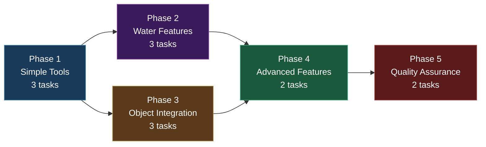
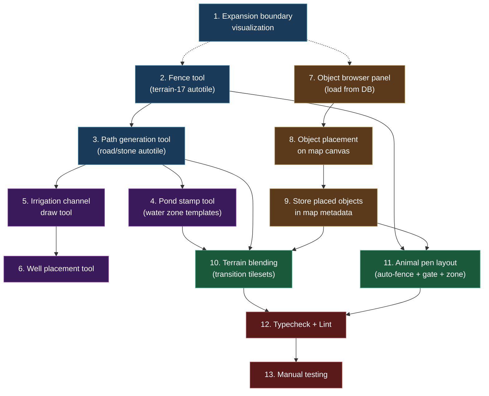

# Work Plan: Map Editor Batch 7 -- Advanced Farm Features

Created Date: 2026-02-19
Type: feature
Estimated Duration: 4 days
Estimated Impact: 15+ files (2 modified, 13+ new)
Related Issue/PR: N/A

## Related Documents

- PRD: [docs/prd/prd-007-map-editor.md](../prd/prd-007-map-editor.md) (FR-7.1 through FR-7.7)
- Design Doc: [docs/design/design-007-map-editor.md](../design/design-007-map-editor.md) (Batch 7: Sections 7.1-7.3)
- ADR: [docs/adr/adr-006-map-editor-architecture.md](../adr/adr-006-map-editor-architecture.md) (Decisions 1-2)
- ADR: ADR-0008 (Game object collision zone schema)

## Objective

Implement advanced farm layout tools for the map editor including path generation with autotile, water feature placement, fence drawing, game object placement, terrain blending, expansion boundary visualization, and animal pen layout. These tools extend the core editor (Batch 3) and zone system (Batch 4) to support the specific needs of player homestead design, enabling level designers to rapidly construct rich farm environments with correct autotile transitions, functional zones, and object integration.

## Background

The core map editor (Batch 3) provides general-purpose terrain painting, and the zone system (Batch 4) provides rectangular and polygon zone markup. However, farm homestead design requires specialized compound tools that combine terrain painting with zone creation and autotile-aware path/fence generation. The GDD envisions player homesteads with fenced animal pens, irrigated crop fields, stone paths, ponds, and placed objects (houses, barns, decorations) -- all of which require purpose-built editor tools beyond basic terrain brushing.

The implementation follows a vertical slice (feature-driven) approach per batch: each phase delivers independently usable tools. No test design information is provided from a previous process, so Strategy B (implementation-first) applies. All tools are built within `apps/genmap/src/components/map-editor/` and integrate with the existing `useMapEditor` hook and Canvas-based rendering established in Batch 3.

## Prerequisites

Before starting this plan:

- [ ] Batch 1 (Shared Map Library) complete -- `@nookstead/map-lib` exports autotile engine, terrain definitions, and all 26 terrain types
- [ ] Batch 3 (Core Map Editor UI) complete -- Canvas-based editor with brush, fill, rectangle tools, undo/redo, layer management, save/load
- [ ] Batch 4 (Zone Markup) complete -- Rectangle/polygon zone drawing, zone editor panel, zone types including `path`, `water_feature`, `animal_pen`, zone overlap validation, zone visibility overlay
- [ ] `packages/db/src/schema/game-objects.ts` exists with `GameObjectLayer` and `CollisionZone` interfaces
- [ ] `packages/db/src/services/game-object.ts` exists with game object query functions
- [ ] All existing tests pass (`pnpm nx run-many -t lint test build typecheck`)

## Phase Structure Diagram



## Task Dependency Diagram



## Risks and Countermeasures

### Technical Risks

- **Risk**: Autotile junction frames for paths/fences not rendering correctly at T-intersections and crossings
  - **Impact**: High -- visual glitches make the tools unusable for level designers
  - **Detection**: Visual inspection during Phase 1 testing; compare autotile output against known-good blob-47 frame indices for junction configurations
  - **Countermeasure**: Reuse the existing `getFrame(mask)` function from `@nookstead/map-lib` which already handles all 47 blob configurations correctly. Path and fence tools only need to paint terrain and let the autotile engine compute frames. Do not implement custom junction logic.

- **Risk**: Game object collision zones from `game_objects` table produce incorrect walkability updates when objects have non-rectangular or offset collision areas
  - **Impact**: Medium -- placed objects do not block movement correctly
  - **Detection**: Compare walkability grid before and after object placement; verify collision zone bounds are applied at correct tile coordinates
  - **Countermeasure**: The `CollisionZone` interface uses axis-aligned rectangles with explicit `x`, `y`, `width`, `height` in pixel coordinates. Convert to tile coordinates using `Math.floor(pixel / tileSize)`. Apply collision zones relative to the object's placement tile position.

- **Risk**: Terrain blending auto-detection incorrectly selects transition tilesets for complex multi-terrain boundaries
  - **Impact**: Medium -- visual artifacts at zone boundaries where 3+ terrain types meet
  - **Detection**: Test with boundary configurations involving grass-water, grass-sand, and triple-terrain corners
  - **Countermeasure**: Use the existing `getInverseTileset()` and `canLayerTogether()` functions from `@nookstead/map-lib` terrain definitions. Apply blending only at two-terrain boundaries (the standard case). For corners where 3+ terrains meet, let the autotile engine handle it naturally without special blending logic.

- **Risk**: Object browser panel performance with large numbers of game objects (100+)
  - **Impact**: Low -- UI becomes sluggish when scrolling through many objects
  - **Detection**: Load testing with the full game_objects table
  - **Countermeasure**: Follow the existing `use-game-objects.ts` pagination pattern (PAGE_SIZE constant). Filter by `category` and `objectType` to reduce result sets. Lazy-load object preview images.

### Schedule Risks

- **Risk**: Terrain blending (Task 10) is more complex than estimated due to edge cases with multiple terrain pairs
  - **Impact**: Phase 4 takes 50% longer than estimated
  - **Countermeasure**: Implement blending only for the most common terrain pairs first (grass-water, grass-sand). Mark additional pairs as future enhancement if time is constrained.

## Implementation Phases

### Phase 1: Simple Tools (Estimated commits: 3)

**Purpose**: Implement the three foundational farm tools -- expansion boundary visualization, fence drawing, and path generation. These are the simplest tools because they extend existing editor capabilities (Canvas overlays and terrain painting) with specialized configurations. They establish the patterns that water features and animal pens build upon.

**Derives from**: Design Doc Section 7.1, 7.3; FR-7.1, FR-7.3, FR-7.6
**ACs covered**: FR-7.1 (path generation), FR-7.3 (fence tool), FR-7.6 (expansion boundary)

#### Tasks

- [ ] **Task 1: Implement expansion boundary visualization (dashed rectangle overlay)**
  - **Input files**:
    - `apps/genmap/src/components/map-editor/` (existing editor Canvas component)
    - `packages/map-lib/src/types/map-types.ts` (MAP_TYPE_CONSTRAINTS for dimension thresholds)
  - **Output files**:
    - `apps/genmap/src/components/map-editor/overlays/expansion-boundary.ts` (new)
  - **Description**: Create a Canvas overlay renderer that draws two boundary indicators on homestead maps:
    - Solid border at 32x32 tiles (core starting area), using `ctx.setLineDash([])` and a prominent color (e.g., white with 80% opacity)
    - Dashed border at 64x64 tiles (maximum expansion), using `ctx.setLineDash([8, 4])` and a lighter color (e.g., white with 50% opacity)
    The overlay is only shown when `mapType === 'player_homestead'` and is toggleable via a toolbar button. For 32x32 maps, only the solid border is shown (no dashed border since it would be at the map edge). For 64x64 maps, the solid border is at the inner 32x32 quadrant and the dashed border is at the map edge. The core area is always centered at tile (0,0) to tile (31,31).
    Export a `renderExpansionBoundary(ctx, mapWidth, mapHeight, tileSize, camera)` function that the editor Canvas calls during its render loop when the overlay is enabled.
  - **Dependencies**: None (first task, uses existing Canvas context)
  - **Acceptance criteria**:
    - Given a 64x64 homestead map, the inner 32x32 area has a solid white border and the outer expansion ring has a dashed white border
    - Given a 32x32 homestead map, only the solid border is shown
    - Given a town_district map, the overlay is not available (button hidden or disabled)
    - Given the visualization is toggled off, no borders are drawn
  - **Completion**: Implementation + integration with editor toolbar toggle

- [ ] **Task 2: Implement fence tool (terrain-17 with autotile)**
  - **Input files**:
    - `apps/genmap/src/components/map-editor/` (existing tool infrastructure -- brush tool pattern)
    - `packages/map-lib/src/core/autotile.ts` (getFrame for fence autotile)
    - `packages/map-lib/src/core/terrain.ts` (terrain-17: alpha_props_fence definition)
  - **Output files**:
    - `apps/genmap/src/components/map-editor/tools/fence-tool.ts` (new)
  - **Description**: Create a specialized terrain painting tool for the `alpha_props_fence` tileset (terrain-17). The fence tool works like the brush tool but is hardcoded to paint `alpha_props_fence` terrain. Key behaviors:
    - Click-and-drag paints fence terrain along the mouse path (single-tile wide)
    - The autotile engine automatically computes correct frames for corners, T-junctions, straight segments, and endpoints (blob-47 handles this natively)
    - Gate placement: holding Shift while clicking an existing fence segment erases that tile (creates a 1-tile gap), producing a gate. The adjacent fence tiles update their autotile frames to show dead-ends at the gate opening.
    The tool dispatches `PaintCommand` objects to the existing undo/redo system. Each fence segment drag is a single undoable command.
    Register the fence tool in the editor toolbar alongside existing tools (brush, fill, rectangle, eraser).
  - **Dependencies**: Task 1 (establishes overlay pattern; fence can start in parallel but ordered for review flow)
  - **Acceptance criteria**:
    - Given the fence tool is active, when the user draws a rectangle perimeter from (2,2) to (8,6), a fence with correct corner and straight-edge autotile frames appears
    - Given the user holds Shift and clicks a fence segment, a 1-tile gap (gate) appears at that position and adjacent tiles update frames
    - Given Ctrl+Z is pressed after drawing a fence, the entire fence segment reverts
    - FR-7.3 AC: fence perimeter with correct autotile frames, gate via Shift+click
  - **Completion**: Implementation + undo/redo integration + toolbar registration

- [ ] **Task 3: Implement path generation tool (road/stone tilesets with autotile between waypoints)**
  - **Input files**:
    - `apps/genmap/src/components/map-editor/tools/fence-tool.ts` (pattern reference)
    - `packages/map-lib/src/core/terrain.ts` (terrain-19 through terrain-26 for road/stone tilesets)
    - `packages/map-lib/src/core/autotile.ts` (getFrame)
  - **Output files**:
    - `apps/genmap/src/components/map-editor/tools/path-tool.ts` (new)
  - **Description**: Create a path tool that paints connected paths using road tilesets (`terrain-25`: asphalt_white_line, `terrain-26`: asphalt_yellow_line) or stone tilesets (`terrain-19`: ice_blue, `terrain-20`: light_stone, `terrain-21`: gray_cobble, `terrain-22`: slate, `terrain-23`: dark_brick, `terrain-24`: steel_floor). The user selects the specific terrain from a dropdown within the path tool options.
    Path painting behavior:
    - Click-and-drag draws a path along the mouse trajectory (1-tile wide by default)
    - The path connects points using Bresenham line interpolation for straight segments between mouse samples
    - The autotile engine computes junction frames automatically -- painting near existing path segments of the same terrain creates T-intersections and crossings
    - A `path` zone is automatically created covering the painted cells (zone type from Batch 4)
    The tool dispatches `PaintCommand` for terrain changes and creates/extends a `path` zone via the zone system. Each path draw operation is a single undoable command that includes both terrain and zone changes.
    Register in toolbar with a "Path" icon. Show terrain selector dropdown when tool is active.
  - **Dependencies**: Task 2 (fence tool establishes the specialized-painting-tool pattern)
  - **Acceptance criteria**:
    - Given the path tool with `asphalt_white_line` selected, when drawing from (5,5) to (5,10), a vertical road is created with correct straight-segment autotile frames
    - Given a branch drawn from (5,7) to (8,7), the junction at (5,7) shows a T-intersection frame
    - Given the path is drawn, a `path` zone is created covering the painted cells
    - FR-7.1 AC: vertical road with correct autotile, T-intersection at junction
  - **Completion**: Implementation + zone auto-creation + undo/redo + toolbar registration

- [ ] Quality check: Verify autotile frames render correctly for fence and path tools using known blob-47 configurations

#### Phase Completion Criteria

- [ ] Expansion boundary overlay renders correctly on 32x32 and 64x64 homestead maps
- [ ] Fence tool paints `alpha_props_fence` terrain with correct autotile and supports gate placement via Shift+click
- [ ] Path tool paints road/stone terrain with correct autotile and auto-creates `path` zones
- [ ] All three tools integrate with the existing undo/redo command system
- [ ] All tools registered in the editor toolbar
- [ ] `pnpm nx typecheck genmap` passes

#### Operational Verification Procedures

1. Open a 64x64 homestead map in the editor. Verify the expansion boundary overlay shows a solid 32x32 inner border and a dashed 64x64 outer border. Toggle the overlay off and verify borders disappear.
2. Select the fence tool. Draw a rectangular fence from (2,2) to (8,6). Verify correct corner frames at (2,2), (8,2), (8,6), (2,6) and straight segments along edges. Hold Shift and click a fence segment -- verify a 1-tile gap appears.
3. Select the path tool with `gray_cobble`. Draw a straight path from (10,5) to (10,15). Draw a branch from (10,10) to (15,10). Verify the T-intersection at (10,10) renders correctly. Check that a `path` zone was created in the zone panel.
4. Press Ctrl+Z to undo the branch. Verify the T-intersection reverts to a straight segment.

---

### Phase 2: Water Features (Estimated commits: 3)

**Purpose**: Implement the three water feature tools -- pond stamps, irrigation channels, and well placement. These tools combine terrain painting (water terrain) with zone creation (`water_feature` zone type). They build on the autotile and zone patterns established in Phase 1 and Batch 4.

**Derives from**: Design Doc Section 7.1 (water features); FR-7.2
**ACs covered**: FR-7.2 (pond stamp, irrigation channel, well)

#### Tasks

- [ ] **Task 4: Create pond stamp tool (pre-configured water zone templates)**
  - **Input files**:
    - `packages/map-lib/src/core/terrain.ts` (water terrain definitions)
    - `apps/genmap/src/components/map-editor/tools/` (existing tool pattern)
  - **Output files**:
    - `apps/genmap/src/components/map-editor/tools/pond-stamp-tool.ts` (new)
    - `apps/genmap/src/components/map-editor/tools/pond-templates.ts` (new -- oval pattern definitions)
  - **Description**: Create a stamp tool that places pre-defined oval/circular water areas. Three size options:
    - Small: 3x3 oval (center tile + 4 cardinal neighbors = 5 water tiles in cross pattern)
    - Medium: 5x5 oval (approximately 13 tiles in a rounded shape)
    - Large: 7x7 oval (approximately 29 tiles in a rounded shape)
    The `pond-templates.ts` file defines the tile patterns as 2D boolean arrays (true = paint water, false = leave unchanged). When stamped:
    1. The selected oval pattern is centered on the clicked tile
    2. All pattern-true tiles are painted with `water` terrain
    3. The autotile engine recalculates all affected cells and their neighbors for smooth water-to-surrounding transitions
    4. A `water_feature` zone is created covering the pond area with properties `{ waterType: 'pond', depth: 1 }`
    The tool shows a semi-transparent preview of the stamp pattern while hovering before placement. Size selector appears in the tool options bar.
  - **Dependencies**: Task 3 (path tool establishes terrain+zone compound tool pattern)
  - **Acceptance criteria**:
    - Given the pond stamp with "medium" selected, when clicking at (10,10), a 5x5 oval water area is placed centered at (10,10)
    - Given the pond is placed, autotile transitions to surrounding terrain are correct (no hard pixel edges)
    - Given the pond is placed, a `water_feature` zone with `waterType: 'pond'` is created
    - Given a stamp preview is shown while hovering, it accurately represents the area that will be filled
    - FR-7.2 AC: medium 5x5 oval with correct autotile transitions
  - **Completion**: Implementation + stamp preview + zone auto-creation + undo/redo

- [ ] **Task 5: Create irrigation channel draw tool**
  - **Input files**:
    - `apps/genmap/src/components/map-editor/tools/path-tool.ts` (similar draw pattern)
  - **Output files**:
    - `apps/genmap/src/components/map-editor/tools/irrigation-tool.ts` (new)
  - **Description**: Create a 1-tile-wide water path drawing tool for irrigation channels. Behavior is similar to the path tool but paints `water` terrain instead of road/stone. Key differences from the path tool:
    - Always 1 tile wide (no width option)
    - Always uses `water` terrain type
    - Creates a `water_feature` zone with `{ waterType: 'irrigation', depth: 0.5 }`
    - Autotile handles water-to-terrain transitions automatically
    The irrigation channel connects to ponds and other water features seamlessly since they share the same terrain type (`water`), and the autotile engine merges contiguous water tiles.
  - **Dependencies**: Task 4 (pond stamp establishes water-feature tool pattern)
  - **Acceptance criteria**:
    - Given the irrigation tool draws from (5,5) to (5,15), a 1-tile-wide water channel is created with correct autotile frames
    - Given the channel connects to an existing pond, the autotile frames merge smoothly (no visible boundary between pond and channel)
    - Given the channel is drawn, a `water_feature` zone with `waterType: 'irrigation'` is created
    - FR-7.2 AC: 1-tile-wide water channel with correct autotile frames
  - **Completion**: Implementation + zone auto-creation + undo/redo

- [ ] **Task 6: Create well placement tool**
  - **Input files**:
    - `apps/genmap/src/components/map-editor/tools/` (existing tool pattern)
  - **Output files**:
    - `apps/genmap/src/components/map-editor/tools/well-tool.ts` (new)
  - **Description**: Create a single-tile water source placement tool. The well is a single-tile `water` terrain placement with specific zone metadata:
    - Click to place: sets the target cell terrain to `water`
    - Creates a `water_feature` zone (1x1 rectangle) with `{ waterType: 'well', depth: 2 }`
    - The surrounding tiles get autotile transitions as with any water placement
    This is the simplest water feature tool -- it is essentially a single-click brush preset.
  - **Dependencies**: Task 5 (irrigation tool establishes narrow water feature pattern)
  - **Acceptance criteria**:
    - Given the well tool is active, when clicking tile (8,8), that tile becomes `water` terrain
    - Given the well is placed, a `water_feature` zone with `waterType: 'well'` is created at that tile
    - Given the well is surrounded by grass, autotile transitions are correct
  - **Completion**: Implementation + zone auto-creation + undo/redo

- [ ] Quality check: Verify water terrain autotile transitions are correct at pond edges, channel endpoints, and well placements

#### Phase Completion Criteria

- [ ] Pond stamp places pre-defined oval water patterns (3x3, 5x5, 7x7) with correct autotile
- [ ] Irrigation tool draws 1-tile-wide water channels with correct autotile
- [ ] Well tool places single-tile water sources
- [ ] All water tools auto-create `water_feature` zones with appropriate `waterType` property
- [ ] All water tools integrate with undo/redo
- [ ] Water features connect to each other seamlessly via autotile

#### Operational Verification Procedures

1. Select the pond stamp tool with "medium" size. Click on tile (15,15). Verify a 5x5 oval water area appears with smooth autotile transitions to the surrounding grass. Check the zone panel -- a `water_feature` zone with `waterType: 'pond'` should exist.
2. Select the irrigation tool. Draw a channel from the pond edge at (15,17) to (15,25). Verify the channel is 1-tile wide and connects to the pond with merged autotile (no visible seam). Check the zone panel -- a second `water_feature` zone with `waterType: 'irrigation'` should exist.
3. Select the well tool. Click on tile (20,20). Verify a single water tile appears with correct surrounding transitions. Check the zone panel -- a `water_feature` zone with `waterType: 'well'` should exist.
4. Press Ctrl+Z three times to undo well, irrigation, and pond placements in reverse order.

---

### Phase 3: Object Integration (Estimated commits: 3)

**Purpose**: Integrate the existing game objects system (from PRD-006/Batch 2) into the map editor, allowing level designers to browse, place, and persist game objects on maps. Objects are stored in the map's `metadata.placedObjects` array per the Design Doc specification.

**Derives from**: Design Doc Section 7.2; FR-7.4
**ACs covered**: FR-7.4 (object placement with collision zones and walkability)

#### Tasks

- [ ] **Task 7: Create object browser panel (load game objects from existing DB)**
  - **Input files**:
    - `apps/genmap/src/hooks/use-game-objects.ts` (existing hook pattern for fetching game objects)
    - `apps/genmap/src/app/api/objects/route.ts` (existing API for game objects)
    - `packages/db/src/schema/game-objects.ts` (GameObjectLayer, CollisionZone interfaces)
  - **Output files**:
    - `apps/genmap/src/components/map-editor/panels/object-browser.tsx` (new)
    - `apps/genmap/src/hooks/use-object-browser.ts` (new)
  - **Description**: Create an object browser panel for the map editor that loads game objects from the existing `game_objects` table via the existing API (`/api/objects`). The panel includes:
    - Category filter dropdown (uses `category` field from game_objects)
    - Object type filter dropdown (uses `objectType` field)
    - Search by name text input
    - Paginated list of matching objects (follow `use-game-objects.ts` PAGE_SIZE pattern)
    - Each list item shows: object name, category, preview thumbnail (rendered from the object's `layers` sprite references), and collision zone indicator
    - Click to select an object for placement (sets it as the active placement item)
    The `use-object-browser.ts` hook manages filter state, pagination, selected object, and delegates fetching to the existing game objects API. No new API endpoints are needed.
  - **Dependencies**: None within Batch 7 (can run parallel with Phase 1, but ordered here for clarity)
  - **Acceptance criteria**:
    - Given the object browser is opened, game objects are loaded from the API with pagination
    - Given the "Furniture" category filter is selected, only furniture objects appear
    - Given an object is clicked, it becomes the active placement item (highlighted in the panel)
    - Given 50+ objects exist, pagination controls allow browsing through pages
  - **Completion**: Implementation + filter/pagination + selection state

- [ ] **Task 8: Implement object placement on map canvas**
  - **Input files**:
    - `apps/genmap/src/components/map-editor/panels/object-browser.tsx` (selected object)
    - `packages/db/src/schema/game-objects.ts` (GameObjectLayer for rendering, CollisionZone for walkability)
    - `apps/genmap/src/components/map-editor/` (existing Canvas rendering)
  - **Output files**:
    - `apps/genmap/src/components/map-editor/tools/object-placement-tool.ts` (new)
  - **Description**: Create an object placement tool that works with the object browser panel. When an object is selected in the browser and the placement tool is active:
    - Hovering shows a ghost preview of the object at the cursor position (snapped to tile grid)
    - The preview also shows the object's collision zones as semi-transparent red rectangles
    - Click to place the object at the current tile position
    - On placement:
      1. The object's `collisionZones` (from `game_objects.collisionZones`) are applied to the walkability grid: collision zones of type `'collision'` mark tiles as non-walkable, zones of type `'walkable'` leave tiles walkable
      2. Collision zone coordinates are relative to the object origin -- convert `CollisionZone.x/y/width/height` (pixel coordinates) to tile coordinates using `Math.floor(pixel / tileSize)` and offset by the placement tile position
      3. The placed object reference is added to a local state array (persisted in Task 9)
    - A placed object can be selected (click on it) and deleted (Delete key or context menu)
    - Undo/redo support: placing an object is a single undoable command that includes both the walkability changes and the object reference
    The `PlacedObject` interface per Design Doc: `{ objectId: string, x: number, y: number, rotation: number }`. Rotation defaults to 0 (no rotation support in MVP -- rotation values are stored but only 0 is used).
  - **Dependencies**: Task 7 (object browser provides the selected object)
  - **Acceptance criteria**:
    - Given a "Small House" object with 3x2 tile collision zone is selected, hovering shows a ghost preview at the cursor
    - Given the user clicks tile (5,5), the object is placed and the walkability grid updates (3x2 area marked non-walkable)
    - Given a placed object is selected and Delete is pressed, the object is removed and walkability reverts
    - Given Ctrl+Z is pressed after placement, the object and walkability changes revert
    - FR-7.4 AC: object placed at tile position using layer offsets, collision zones applied to walkability
  - **Completion**: Implementation + ghost preview + walkability update + undo/redo

- [ ] **Task 9: Store placed objects in map metadata**
  - **Input files**:
    - `apps/genmap/src/components/map-editor/tools/object-placement-tool.ts` (placement state)
    - Existing map save/load flow (Batch 3: save/load via API, `PATCH /api/editor-maps/:id`)
  - **Output files**:
    - `apps/genmap/src/components/map-editor/tools/object-placement-tool.ts` (modified -- add persistence)
    - `apps/genmap/src/hooks/use-map-editor.ts` (modified -- include placedObjects in save/load)
  - **Description**: Persist placed objects in the `editor_maps.metadata` JSONB field under the key `placedObjects`. The `metadata` column is already defined as `JSONB, nullable` in the `editor_maps` table (Batch 2).
    Data format (per Design Doc Section 7.2):
    ```
    metadata: {
      placedObjects: PlacedObject[]  // { objectId, x, y, rotation }
    }
    ```
    On save (`Ctrl+S`): include `metadata.placedObjects` array in the PATCH request body alongside grid/layers/walkable data.
    On load: read `metadata.placedObjects` from the loaded map data, re-render objects on the Canvas, and re-apply their collision zones to the walkability grid.
    Integration with the `useMapEditor` hook:
    - Add `placedObjects` to the editor state
    - Include in save payload
    - Parse from load response
    - Recalculate walkability on load based on placed object collision zones
  - **Dependencies**: Task 8 (placement tool provides the local state to persist)
  - **Acceptance criteria**:
    - Given objects are placed on the map and saved (Ctrl+S), the `metadata.placedObjects` array is stored in the database
    - Given the map is reloaded, all placed objects appear at their saved positions with correct walkability
    - Given a placed object is deleted and saved, it is removed from the `metadata.placedObjects` array
    - Given a map with no placed objects is loaded, `metadata.placedObjects` is empty or undefined (no error)
  - **Completion**: Implementation + save/load integration + walkability restoration on load

- [ ] Quality check: Verify object placement, walkability updates, and save/load persistence round-trip correctly

#### Phase Completion Criteria

- [ ] Object browser panel loads game objects from existing API with category/type filtering and pagination
- [ ] Object placement tool shows ghost preview, places objects with collision zone walkability updates
- [ ] Placed objects are persisted in `metadata.placedObjects` and restored on map load
- [ ] Undo/redo works for object placement and deletion
- [ ] Walkability grid is correct after placing, deleting, saving, and reloading objects

#### Operational Verification Procedures

1. Open a map in the editor. Open the object browser panel. Verify game objects load from the database. Apply a category filter -- verify the list filters correctly. Select an object from the list.
2. Activate the object placement tool. Hover over the map -- verify a ghost preview appears at the cursor, snapped to the tile grid. Click to place. Verify the object appears on the map and the walkability grid updates (toggle walkability overlay if available).
3. Select a placed object and press Delete. Verify it is removed and walkability reverts.
4. Place 3 objects. Press Ctrl+S to save. Reload the map (navigate away and back, or refresh). Verify all 3 objects appear at their saved positions.
5. Verify Ctrl+Z undoes the last object placement.

---

### Phase 4: Advanced Features (Estimated commits: 2)

**Purpose**: Implement the two most complex farm tools -- terrain blending (automatic transition tilesets at zone boundaries) and animal pen layout (compound tool combining fence, gate, and zone creation). These require capabilities from both Phase 1 (fence tool) and Phase 2-3 (zone integration, walkability).

**Derives from**: Design Doc Section 7.1 (blending), FR-7.5, FR-7.7
**ACs covered**: FR-7.5 (terrain blending), FR-7.7 (animal pen layout)

#### Tasks

- [ ] **Task 10: Implement terrain blending (auto-detect and apply transition tilesets around zones)**
  - **Input files**:
    - `packages/map-lib/src/core/terrain.ts` (getInverseTileset, canLayerTogether, terrain relationships)
    - `packages/map-lib/src/core/autotile.ts` (getFrame for transition tilesets)
    - Existing zone data from Batch 4 (zone boundaries)
    - `apps/genmap/src/components/map-editor/` (existing editor state)
  - **Output files**:
    - `apps/genmap/src/components/map-editor/tools/terrain-blending.ts` (new)
  - **Description**: Implement automatic terrain blending at zone boundaries. When a zone boundary exists between two different terrain types, the editor applies the appropriate inverse/transition tileset for smooth visual transitions instead of hard pixel edges. The blending algorithm:
    1. Iterate over all zone boundaries (cells where a zone edge meets a different terrain)
    2. For each boundary cell pair (zone terrain A, neighbor terrain B):
       a. Look up the relationship using `getInverseTileset(terrainA)` or `canLayerTogether(terrainA, terrainB)` from `@nookstead/map-lib`
       b. If a transition tileset exists (e.g., `grass_water` / terrain-15 for grass-to-water), apply it on a transition layer
       c. The autotile engine computes the correct frame for the transition tileset based on the boundary shape
    3. Blending is applied automatically when:
       - A zone is created or resized
       - The "Apply Blending" button is clicked in the toolbar
    4. Blending operates on a separate transition layer so it does not overwrite the base terrain
    The tool provides a toolbar button "Apply Terrain Blending" that triggers blending across all zone boundaries on the current map. It can also be configured to auto-apply on zone changes.
  - **Dependencies**: Tasks 3, 4, 9 (requires path/water/object tools to produce realistic farm layouts to blend; uses zone boundary data from Batch 4)
  - **Acceptance criteria**:
    - Given a crop_field zone on grass meets a pond on water, the boundary cells use a water-grass transition tileset for smooth visual transitions
    - Given blending is applied, the transitions are rendered on a separate layer (base terrain preserved)
    - Given a zone is moved or resized, blending can be re-applied to update transitions
    - FR-7.5 AC: boundary cells use appropriate transition tileset (e.g., grass_water / terrain-15)
  - **Completion**: Implementation + toolbar button + auto-apply option

- [ ] **Task 11: Implement animal pen layout (auto-fence generation, gate placement, capacity visualization)**
  - **Input files**:
    - `apps/genmap/src/components/map-editor/tools/fence-tool.ts` (fence painting logic to reuse)
    - `packages/map-lib/src/types/map-types.ts` (ZoneType: 'animal_pen', AnimalPenProperties)
    - Existing zone creation flow from Batch 4
  - **Output files**:
    - `apps/genmap/src/components/map-editor/tools/animal-pen-tool.ts` (new)
  - **Description**: Create a compound tool that draws an animal pen in a single operation. The user draws a rectangle (click-drag like the rectangle tool) and the system automatically:
    1. Paints a fence perimeter using `alpha_props_fence` (terrain-17) with correct autotile (reuse fence tool painting logic)
    2. Places a gate (1-tile gap) on the bottom edge of the rectangle, centered
    3. Creates an `animal_pen` zone covering the interior of the fenced area
    4. Zone properties include:
       - `animalType`: selected from a dropdown before drawing ('chicken' | 'cow' | 'pig' | 'sheep')
       - `capacity`: calculated from interior area (`(width - 2) * (height - 2)` tiles, accounting for the fence perimeter, with a multiplier per animal type: chicken=2/tile, cow=0.5/tile, pig=0.5/tile, sheep=1/tile)
    5. A capacity label is shown on the zone overlay (e.g., "Chicken Pen: 8 capacity")
    After the pen is drawn, the fence tool's autotile ensures correct frame rendering. The gate position is adjustable by Shift+clicking a different fence segment (same as the fence tool gate mechanic).
    The entire pen creation (fence + gate + zone) is a single undoable command.
  - **Dependencies**: Task 2 (fence tool for fence painting logic), Task 9 (zone creation pattern from Phase 3)
  - **Acceptance criteria**:
    - Given the animal pen tool draws a 6x6 area with `animalType: 'chicken'`, a fence perimeter with one gate is created, the interior is marked as `animal_pen` zone, and capacity is calculated as `(4 * 4) * 2 = 32`
    - Given `animalType: 'cow'` is selected, capacity formula uses 0.5/tile multiplier
    - Given the pen is drawn, the zone properties store the animal type and capacity
    - Given the user Shift+clicks a different fence segment, the gate moves to that position
    - Given Ctrl+Z is pressed, the entire pen (fence + zone) reverts
    - FR-7.7 AC: fenced rectangle with gate, animal_pen zone, capacity derived from area
  - **Completion**: Implementation + capacity calculation + undo/redo + gate repositioning

- [ ] Quality check: Verify terrain blending produces correct transition frames and animal pen capacity calculations are accurate

#### Phase Completion Criteria

- [ ] Terrain blending applies transition tilesets at zone boundaries (e.g., grass-water uses grass_water tileset)
- [ ] Blending operates on a separate layer, preserving base terrain
- [ ] Animal pen tool creates fence perimeter + gate + animal_pen zone in a single operation
- [ ] Animal pen capacity calculated correctly per animal type
- [ ] Both tools integrate with undo/redo
- [ ] All Phase 4 tools work correctly with Phase 1-3 tools (e.g., animal pen with placed objects inside)

#### Operational Verification Procedures

1. Create a crop_field zone on grass terrain. Place a pond stamp next to it. Click "Apply Terrain Blending." Verify the boundary between grass and water shows smooth transition tiles (not hard pixel edges). Verify the base terrain layer is preserved (only a transition layer added).
2. Select the animal pen tool. Set animal type to "chicken." Draw a 6x6 rectangle. Verify: fence perimeter appears with correct autotile, a gate appears on the bottom edge, an `animal_pen` zone exists in the zone panel with `animalType: 'chicken'` and `capacity: 32`.
3. Shift+click a different fence segment to move the gate. Verify the old gate fills in and the new gate opens.
4. Press Ctrl+Z to undo the animal pen. Verify the fence, gate, and zone all revert together.

---

### Phase 5: Quality Assurance (Estimated commits: 1)

**Purpose**: Verify all Batch 7 tools pass static analysis, type checking, and work correctly through manual integration testing. Ensure no regressions to existing editor functionality from Batches 3 and 4.

**Derives from**: Design Doc E2E verification; documentation-criteria Phase 4 requirement
**ACs covered**: All FR-7.x acceptance criteria verified end-to-end

#### Tasks

- [ ] **Task 12: Run typecheck and lint across all projects**
  - **Input files**: All TypeScript files in workspace
  - **Output files**: None (verification only)
  - **Description**: Execute workspace-wide quality checks:
    - `pnpm nx typecheck genmap` -- the genmap app must pass TypeScript strict mode with all new tool files
    - `pnpm nx lint genmap` -- all new files must pass ESLint rules
    - `pnpm nx run-many -t typecheck lint` -- verify no regressions across the entire workspace
    Pay particular attention to:
    - Correct imports from `@nookstead/map-lib` (autotile, terrain, types)
    - Correct imports from `@nookstead/db` (game-objects schema)
    - No unused variables or imports in new tool files
    - Consistent code style (single quotes, 2-space indent per .prettierrc)
  - **Dependencies**: Tasks 10, 11 (all implementation complete)
  - **Acceptance criteria**: `pnpm nx run-many -t typecheck lint` exits 0 with zero errors across all projects. No warnings in new Batch 7 files.

- [ ] **Task 13: Manual testing of all farm tools (integration verification)**
  - **Input files**: All Batch 7 tool files
  - **Output files**: None (verification only)
  - **Description**: Execute the following manual test scenarios to verify end-to-end tool functionality:

    **Scenario A: Complete Farm Layout**
    1. Create a new 64x64 homestead map
    2. Verify expansion boundary overlay shows 32x32 solid + 64x64 dashed borders
    3. Draw a fence perimeter around tiles (5,5) to (25,25) -- verify correct autotile
    4. Add a gate by Shift+clicking a fence segment -- verify gap appears
    5. Draw a gray_cobble path from the gate to (15,30) -- verify autotile and path zone
    6. Place a medium pond at (30,10) -- verify oval water area and zone
    7. Draw an irrigation channel from the pond to (20,10) -- verify connection
    8. Place a well at (10,10) -- verify water tile and zone
    9. Open the object browser, select a house object, place it at (15,8) -- verify walkability update
    10. Create a chicken pen from (5,28) to (11,34) -- verify fence, gate, zone, capacity
    11. Apply terrain blending -- verify smooth transitions at all zone boundaries
    12. Save the map (Ctrl+S) -- verify save succeeds
    13. Reload the map -- verify all tools' output persists correctly (terrain, zones, objects, fences, paths)

    **Scenario B: Undo/Redo Stress Test**
    1. Perform 10 operations using different farm tools
    2. Ctrl+Z 10 times -- verify clean undo to initial state
    3. Ctrl+Y 5 times -- verify correct redo of 5 operations
    4. Perform a new operation -- verify redo stack is cleared

    **Scenario C: Edge Cases**
    1. Place a pond at the map edge -- verify no out-of-bounds errors
    2. Draw a fence that wraps around existing terrain -- verify autotile handles mixed neighbors
    3. Place an object on top of a zone -- verify both coexist
    4. Create overlapping water features (pond + irrigation) -- verify they merge via autotile
  - **Dependencies**: Task 12 (static analysis passes first)
  - **Acceptance criteria**:
    - All three scenarios complete without errors
    - All FR-7.1 through FR-7.7 acceptance criteria verified through the scenarios
    - No regressions to existing Batch 3 (brush, fill, rectangle, eraser, undo/redo, save/load) or Batch 4 (zone drawing, overlap validation) functionality
    - Save/load round-trip preserves all Batch 7 data (terrain, zones, placed objects, metadata)

#### Phase Completion Criteria

- [ ] `pnpm nx run-many -t typecheck lint` passes with zero errors
- [ ] Manual Scenario A (complete farm layout) completes successfully
- [ ] Manual Scenario B (undo/redo stress test) completes successfully
- [ ] Manual Scenario C (edge cases) completes without errors
- [ ] No regressions to Batch 3 or Batch 4 functionality
- [ ] All FR-7.1 through FR-7.7 acceptance criteria satisfied

#### Operational Verification Procedures

1. Run `pnpm nx run-many -t typecheck lint` and confirm exit code 0 with zero errors
2. Execute manual Scenario A end-to-end. Verify the final saved map contains correct terrain, 5+ zones (crop field, path, water features, animal pen), and placed objects in metadata
3. Execute manual Scenario B. Verify undo stack handles 10 operations and redo restores correctly
4. Execute manual Scenario C. Verify no JavaScript errors in the browser console during edge case testing

---

## Quality Checklist

- [ ] Design Doc and PRD consistency verification (FR-7.1 through FR-7.7 addressed)
- [ ] Phase dependencies correctly mapped (Simple Tools -> Water Features + Objects -> Advanced -> QA)
- [ ] All requirements converted to tasks with correct phase assignment
- [ ] Quality assurance exists in Phase 5
- [ ] Integration point verification at each phase boundary
- [ ] Autotile engine reused from @nookstead/map-lib (no custom junction logic)
- [ ] Zone types match Design Doc definitions (path, water_feature, animal_pen)
- [ ] PlacedObject interface matches Design Doc specification (objectId, x, y, rotation)
- [ ] Collision zone to walkability conversion uses correct pixel-to-tile coordinate mapping
- [ ] Terrain blending uses existing getInverseTileset/canLayerTogether functions
- [ ] All tools integrate with existing undo/redo command system
- [ ] Object browser follows existing use-game-objects.ts pagination pattern
- [ ] Animal pen capacity calculation formula documented per animal type
- [ ] Expansion boundary dimensions match MAP_TYPE_CONSTRAINTS (32x32 core, 64x64 max)

## Files Summary

### New Files Created

| File | Phase | Description |
|------|-------|-------------|
| `apps/genmap/src/components/map-editor/overlays/expansion-boundary.ts` | 1 | Expansion boundary Canvas overlay |
| `apps/genmap/src/components/map-editor/tools/fence-tool.ts` | 1 | Fence drawing tool (terrain-17 autotile) |
| `apps/genmap/src/components/map-editor/tools/path-tool.ts` | 1 | Path generation tool (road/stone autotile) |
| `apps/genmap/src/components/map-editor/tools/pond-stamp-tool.ts` | 2 | Pond stamp placement tool |
| `apps/genmap/src/components/map-editor/tools/pond-templates.ts` | 2 | Oval pattern definitions for pond stamps |
| `apps/genmap/src/components/map-editor/tools/irrigation-tool.ts` | 2 | Irrigation channel draw tool |
| `apps/genmap/src/components/map-editor/tools/well-tool.ts` | 2 | Well placement tool |
| `apps/genmap/src/components/map-editor/panels/object-browser.tsx` | 3 | Object browser panel component |
| `apps/genmap/src/hooks/use-object-browser.ts` | 3 | Object browser state management hook |
| `apps/genmap/src/components/map-editor/tools/object-placement-tool.ts` | 3 | Object placement tool with collision zones |
| `apps/genmap/src/components/map-editor/tools/terrain-blending.ts` | 4 | Automatic terrain blending at zone boundaries |
| `apps/genmap/src/components/map-editor/tools/animal-pen-tool.ts` | 4 | Compound animal pen layout tool |

### Modified Files

| File | Phase | Change |
|------|-------|--------|
| `apps/genmap/src/hooks/use-map-editor.ts` | 3 | Add placedObjects to editor state, include in save/load |
| Editor toolbar component (Batch 3) | 1-4 | Register new tools in toolbar |

## Completion Criteria

- [ ] All phases completed
- [ ] Each phase's operational verification procedures executed
- [ ] Design Doc acceptance criteria satisfied (FR-7.1 through FR-7.7)
- [ ] Staged quality checks completed (zero errors)
- [ ] No regressions to Batch 3 (core editor) or Batch 4 (zones) functionality
- [ ] All farm tools work together in a combined workflow (Scenario A)
- [ ] Save/load round-trip preserves all Batch 7 data

## Progress Tracking

### Phase 1: Simple Tools
- Start: YYYY-MM-DD HH:MM
- Complete: YYYY-MM-DD HH:MM
- Notes:

### Phase 2: Water Features
- Start: YYYY-MM-DD HH:MM
- Complete: YYYY-MM-DD HH:MM
- Notes:

### Phase 3: Object Integration
- Start: YYYY-MM-DD HH:MM
- Complete: YYYY-MM-DD HH:MM
- Notes:

### Phase 4: Advanced Features
- Start: YYYY-MM-DD HH:MM
- Complete: YYYY-MM-DD HH:MM
- Notes:

### Phase 5: Quality Assurance
- Start: YYYY-MM-DD HH:MM
- Complete: YYYY-MM-DD HH:MM
- Notes:

## Notes

- **No new database tables or migrations** are required for Batch 7. All data is stored using existing structures: terrain in the grid, zones in `map_zones`, and placed objects in `editor_maps.metadata` (JSONB).
- **No new API endpoints** are required. Object browser uses the existing `/api/objects` endpoint. Map save/load uses the existing `/api/editor-maps/:id` endpoints. Zone operations use the existing zone API.
- **Phaser 2 and 3 are parallel**: Phases 2 (Water Features) and 3 (Object Integration) can be worked on in parallel since they have no cross-dependencies. Both feed into Phase 4.
- **Animal pen capacity multipliers** (chicken=2, cow=0.5, pig=0.5, sheep=1) are initial values. These should be configurable or referenced from game balance data in a future iteration.
- **Terrain blending complexity**: The initial implementation targets two-terrain boundaries only. Triple-terrain corners where 3+ terrains meet are handled by the autotile engine's natural fallback behavior. More sophisticated multi-terrain blending is a potential future enhancement.
