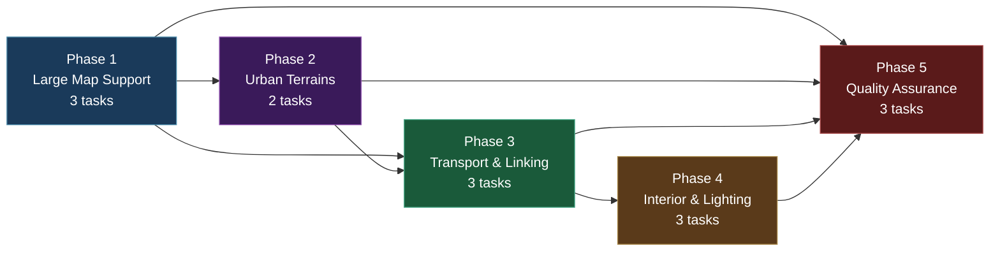
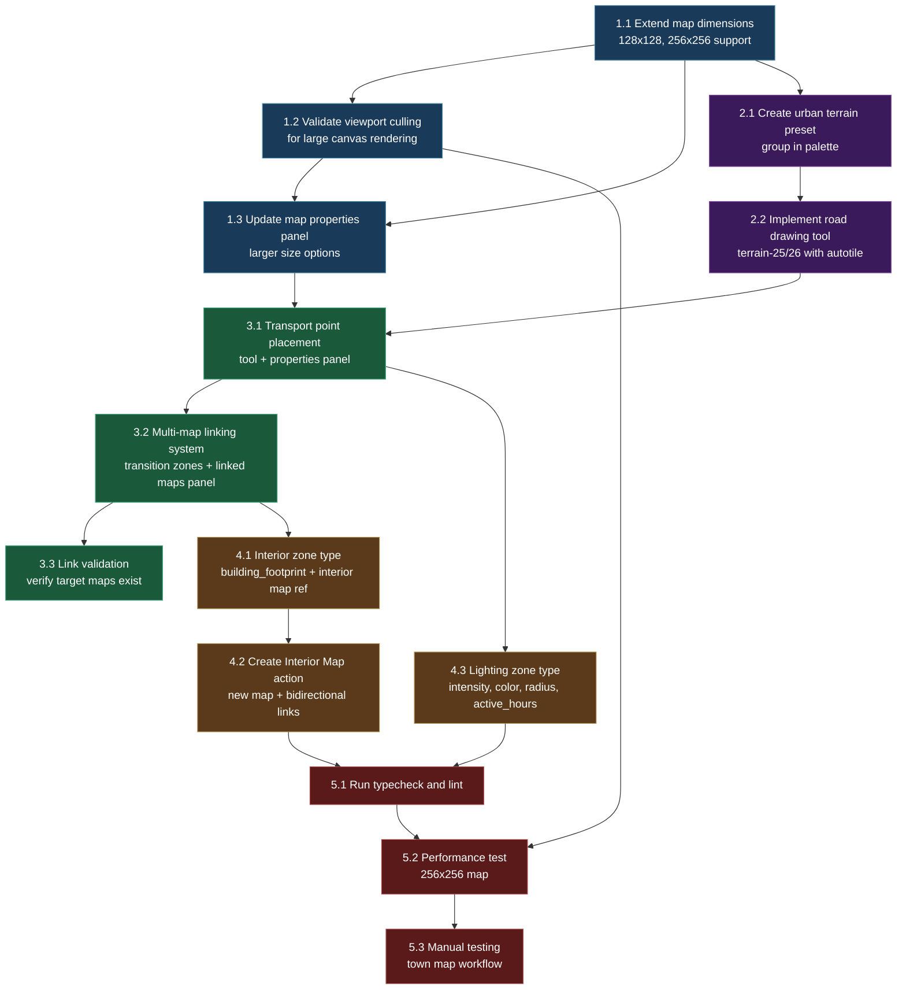

# Work Plan: Map Editor Batch 8 -- Town Map Editing

Created Date: 2026-02-19
Type: feature
Estimated Duration: 3 days
Estimated Impact: 15+ files (5 modified, 10+ new)
Related Issue/PR: N/A

## Related Documents

- PRD: [docs/prd/prd-007-map-editor.md](../prd/prd-007-map-editor.md) (FR-8.1 through FR-8.6)
- ADR: [docs/adr/adr-006-map-editor-architecture.md](../adr/adr-006-map-editor-architecture.md) (Decision 1: three-package architecture)
- Design Doc: [docs/design/design-007-map-editor.md](../design/design-007-map-editor.md) (Batch 8: Sections 8.1-8.3)

## Objective

Extend the map editor to support town district map authoring, including large canvas sizes (128x128, 256x256), urban terrain presets, transport point placement, multi-map linking, interior zone management, and lighting zones. This batch delivers the tools level designers need to build the connected town districts of Quiet Haven as described in the GDD.

## Background

Batches 1-4 established the shared map library, database services, core editor canvas with terrain painting, and zone markup tools. Batch 6 added Phaser preview with camera controls for map visualization. The editor currently supports maps up to 64x64 (homestead max), but town districts defined in the GDD require maps up to 256x256 tiles. Town maps also need specialized tooling: transport point placement (bus stops, ferry docks, district exits), multi-map linking for district transitions, interior zones for buildings, and lighting zones for the day/night cycle.

The existing `MAP_TYPE_CONSTRAINTS` type system already allows `town_district` maps up to 256x256 (defined in Batch 1), but the editor canvas rendering and map properties panel only offer 32x32 and 64x64 options. The `renderMapCanvas` function in Batch 3 already includes viewport culling logic (`getVisibleRange`), but has not been validated at 256x256 scale. Zone types `transport_point`, `lighting`, and `building_footprint` are defined in the type system (Batch 1) with their property interfaces (`TransportPointProperties`, `LightingProperties`) but have no dedicated editor tooling or UI.

The implementation follows Strategy B (implementation-first) since no test design information is provided. The approach is horizontal slice (foundation-driven) within this batch: large map support first (it affects all subsequent features), then urban terrains, then transport/linking, then interior/lighting zones, then verification.

## Prerequisites

Before starting this plan:

- [ ] Batch 1 complete: `@nookstead/map-lib` exists with autotile engine, terrain definitions, and all 26 terrain types including urban terrains (terrain-21 `gray_cobble`, terrain-23 `dark_brick`, terrain-24 `steel_floor`, terrain-25 `asphalt_white_line`, terrain-26 `asphalt_yellow_line`)
- [ ] Batch 2 complete: `editor_maps` and `map_zones` tables exist with CRUD services
- [ ] Batch 3 complete: Core editor UI with canvas rendering, terrain palette, layer management, map properties panel, save/load
- [ ] Batch 4 complete: Zone markup tools (rectangle/polygon drawing, zone editor panel, zone types including `transition`, `transport_point`, `lighting`, `building_footprint`)
- [ ] Batch 6 complete: Phaser preview with camera controls (needed for large map preview validation)
- [ ] All existing tests pass (`pnpm nx run-many -t lint test build typecheck`)

## Phase Structure Diagram

## Task Dependency Diagram

## Risks and Countermeasures

### Technical Risks

- **Risk**: Large map JSONB payloads (256x256 = 65,536 cells) degrade API save/load performance
  - **Impact**: High -- save operations timeout or exceed memory limits; API response exceeds 500ms target
  - **Detection**: Performance test in Phase 5 (Task 5.2) measures save/load times for 256x256 map
  - **Countermeasure**: The existing delta-based undo system (Design Doc Section 3.3) avoids full grid copies in memory. For API transfer, the grid is a single JSONB column -- PostgreSQL JSONB compression applies automatically. If load times exceed 3s target, profile serialization and consider chunked grid storage for maps >128x128. The PRD states <500ms for 64x64 loads; the 256x256 target is <3s (FR-8.6).

- **Risk**: Canvas rendering performance degrades on 256x256 maps (65K cells x multiple layers)
  - **Impact**: Medium -- paint operations exceed 32ms target, editor feels sluggish
  - **Detection**: Performance test in Phase 5 (Task 5.2) measures paint + autotile recalculation time
  - **Countermeasure**: The `renderMapCanvas` function from Batch 3 already implements viewport culling (only renders visible tiles). Task 1.2 explicitly validates this at 256x256 scale. If paint operations exceed 32ms, optimize the autotile recalculation to only recompute layers for the affected cell's 3x3 neighborhood (already the design -- see `recomputeAutotileLayers` in Design Doc Section 3.5). For further optimization, consider offscreen canvas buffering or WebWorker-based autotile computation.

- **Risk**: Multi-map linking creates dangling references when target maps are deleted
  - **Impact**: Medium -- transition zones reference non-existent maps, causing errors when navigating
  - **Detection**: Task 3.3 implements link validation that catches this; cascade delete in `editor_maps` does not propagate to zones in OTHER maps
  - **Countermeasure**: Link validation (Task 3.3) checks that all target map IDs in transition zones resolve to existing editor maps. Validation runs on save and displays warnings for broken links. A future enhancement could add foreign key constraints or event-driven cleanup, but for this batch, manual validation is sufficient.

- **Risk**: Interior map creation fails if building footprint zone has unusual dimensions
  - **Impact**: Low -- interior maps must meet minimum dimension constraints (32x32 per MAP_TYPE_CONSTRAINTS)
  - **Detection**: Task 4.2 attempts to create interior maps from footprint zones of various sizes
  - **Countermeasure**: Interior map dimensions are derived from the building footprint zone but clamped to the minimum 32x32 constraint. If the footprint is smaller than 32x32, the interior map is created at 32x32 with the footprint area centered.

### Schedule Risks

- **Risk**: Performance optimization for 256x256 maps takes longer than estimated
  - **Impact**: Phase 1 extends, delaying all subsequent phases
  - **Countermeasure**: Task 1.2 focuses on validating existing viewport culling, not building new optimization. The viewport culling code is already implemented in Batch 3's `renderMapCanvas`. If performance is acceptable with the existing code, no additional optimization is needed.

## Implementation Phases

### Phase 1: Large Map Support (Estimated commits: 3)

**Purpose**: Extend the map editor to support 128x128 and 256x256 map dimensions for town district maps. Validate that the existing viewport culling renders efficiently at these sizes. Update the map properties panel to offer the larger dimension options.

**Derives from**: Design Doc Section 8.1; FR-8.6
**ACs covered**: FR-8.6 (large map support: 128x128 and 256x256 maps)

#### Tasks

- [ ] **Task 1.1**: Extend map dimensions to support 128x128 and 256x256
  - **Input files**:
    - `apps/genmap/src/components/map-editor/map-properties-panel.tsx` (existing -- contains dimension options)
    - `packages/map-lib/src/types/map-types.ts` (existing -- `MAP_TYPE_CONSTRAINTS` already allows town_district up to 256x256)
  - **Output files**:
    - `apps/genmap/src/app/maps/new/page.tsx` (modified -- add 128x128, 256x256 to new map dialog dimension choices)
    - `apps/genmap/src/components/map-editor/map-properties-panel.tsx` (modified -- add 128x128, 256x256 to resize options)
  - **Description**: The `MAP_TYPE_CONSTRAINTS` type system from Batch 1 already allows `town_district` maps up to 256x256. This task exposes those dimensions in the editor UI. Update the new map creation dialog to include 128x128 and 256x256 as selectable dimension presets when `mapType` is `'town_district'`. Update the resize dialog in the map properties panel to allow resizing up to 256x256 for town districts. The dimension validation function `validateMapDimensions` from `@nookstead/map-lib` already enforces the constraints per map type, so no validation logic changes are needed.
  - **Dependencies**: None (first task in batch)
  - **Acceptance criteria**: Given a new map creation dialog with `mapType: 'town_district'`, the dimension options include 32x32, 64x64, 128x128, and 256x256. Given `mapType: 'player_homestead'`, 128x128 and 256x256 are NOT available. Given a 256x256 map is created, `validateMapDimensions('town_district', 256, 256)` returns `{ valid: true }`. Given the map is saved via the API, all 65,536 cells persist correctly.

- [ ] **Task 1.2**: Validate and optimize viewport culling for large canvas rendering
  - **Input files**:
    - `apps/genmap/src/components/map-editor/use-map-editor-canvas.ts` (existing -- contains `renderMapCanvas` with viewport culling)
    - `apps/genmap/src/hooks/use-map-editor.ts` (existing -- editor state management)
  - **Output files**:
    - `apps/genmap/src/components/map-editor/use-map-editor-canvas.ts` (modified if optimization needed)
  - **Description**: Validate that the existing `renderMapCanvas` viewport culling implementation (Design Doc Section 3.4) performs within the 3-second initial render target and 32ms paint target for 256x256 maps. The function already calculates `startX/startY/endX/endY` based on camera position and viewport dimensions, then only iterates over visible tiles. Test by creating a 256x256 map filled with terrain, scrolling to various positions, and measuring render time via `performance.now()`. If render exceeds targets, apply optimizations: (a) ensure `requestAnimationFrame` is used for canvas updates, (b) add dirty-region tracking so only changed tiles are re-drawn (not the entire visible viewport), (c) reduce autotile recalculation scope for paint operations to the 3x3 neighborhood of the painted cell. The delta-based undo system (Design Doc Section 3.3) already limits paint impact to changed cells only.
  - **Dependencies**: Task 1.1
  - **Acceptance criteria**: A 256x256 map renders initial view within 3 seconds. Paint operations (single cell + autotile recalculation of 9 neighbors) complete within 32ms. Panning the viewport on a 256x256 map maintains at least 30fps canvas updates. Only tiles within the visible viewport are iterated during rendering (verified by adding a counter or console.log in the render loop).

- [ ] **Task 1.3**: Update map properties panel with larger size options
  - **Input files**:
    - `apps/genmap/src/components/map-editor/map-properties-panel.tsx` (existing)
  - **Output files**:
    - `apps/genmap/src/components/map-editor/map-properties-panel.tsx` (modified)
  - **Description**: Update the map properties panel to display large dimension values correctly and offer resize options appropriate for town district maps. When the current map is a `town_district`, the resize dropdown includes 32x32, 64x64, 128x128, and 256x256. The panel shows the total cell count (e.g., "65,536 cells") and a warning for dimensions >64x64 that large maps may affect editor performance. The resize operation from Batch 3 (expand adds empty cells, shrink truncates with warning) continues to work for large dimensions.
  - **Dependencies**: Task 1.1, Task 1.2
  - **Acceptance criteria**: Given a 128x128 town district map is open, the properties panel shows "128 x 128 (16,384 cells)". Given the user selects resize to 256x256, a warning message appears: "Large maps (256x256) may affect editor performance." Given the resize is confirmed, the grid expands to 256x256 with new cells set to the default terrain.

#### Phase Completion Criteria

- [ ] 128x128 and 256x256 maps can be created for `town_district` type
- [ ] Viewport culling renders 256x256 maps within 3 seconds initial render
- [ ] Paint operations on 256x256 maps complete within 32ms
- [ ] Map properties panel shows correct dimension options per map type
- [ ] Existing 32x32 and 64x64 maps continue to work without regression

#### Operational Verification Procedures

1. Create a new `town_district` map at 256x256. Verify the grid is created with 65,536 cells and the canvas renders without freezing.
2. Fill a 20x20 area with `gray_cobble` terrain on the 256x256 map. Verify paint completes quickly (no visible lag) and autotile frames are correct.
3. Pan and zoom on the 256x256 map. Verify the viewport culling only renders visible tiles (canvas does not stutter).
4. Save the 256x256 map via Ctrl+S, reload the page, and verify all 65,536 cells persist correctly.
5. Open the map properties panel and verify dimensions show "256 x 256 (65,536 cells)".

---

### Phase 2: Urban Terrains (Estimated commits: 2)

**Purpose**: Add urban terrain presets and a road drawing tool optimized for town map editing. This surfaces the road, cobblestone, brick, and steel floor terrains prominently when editing town district maps.

**Derives from**: Design Doc (terrain groups from Batch 1); FR-8.3
**ACs covered**: FR-8.3 (urban terrain focus: roads, cobblestone, brick, town palette mode)

#### Tasks

- [ ] **Task 2.1**: Create urban terrain preset group in the terrain palette
  - **Input files**:
    - `apps/genmap/src/components/map-editor/terrain-palette.tsx` (existing -- displays 8 terrain groups from TILESETS)
    - `packages/map-lib/src/core/terrain.ts` (existing -- TILESETS groups)
  - **Output files**:
    - `apps/genmap/src/components/map-editor/terrain-palette.tsx` (modified -- add "Town" mode and urban preset group)
  - **Description**: Add a "Town" mode toggle to the terrain palette. When activated (automatically when a `town_district` map is opened, or manually via toggle button), a virtual "Urban" terrain group appears at the top of the palette above the existing 8 groups. This group contains: `asphalt_white_line` (terrain-25), `asphalt_yellow_line` (terrain-26), `gray_cobble` (terrain-21), `dark_brick` (terrain-23), `steel_floor` (terrain-24). These terrains are not removed from their original groups (stone, road) -- the Urban group is a curated shortcut. The mode toggle is a button in the palette header that switches between "Default" and "Town" modes. In "Default" mode, the urban group is hidden and the standard 8 groups display normally.
  - **Dependencies**: Task 1.1 (town district map type must be creatable)
  - **Acceptance criteria**: Given a `town_district` map is opened, "Town" mode is automatically activated and the "Urban" preset group appears at the top of the palette containing 5 terrains. Given the user clicks `gray_cobble` in the Urban group, it becomes the active terrain for painting. Given the mode is toggled to "Default", the Urban group disappears. Given a `player_homestead` map is opened, "Town" mode is not activated by default but can be toggled on manually.

- [ ] **Task 2.2**: Implement road drawing tool with autotile
  - **Input files**:
    - `apps/genmap/src/components/map-editor/use-map-editor-canvas.ts` (existing -- brush tool handler)
    - `packages/map-lib/src/core/autotile.ts` (existing -- blob-47 getFrame)
  - **Output files**:
    - `apps/genmap/src/components/map-editor/use-map-editor-canvas.ts` (modified -- road-specific brush behavior)
  - **Description**: Enhance the existing brush tool to support road-specific autotile behavior when painting with terrain-25 (`asphalt_white_line`) or terrain-26 (`asphalt_yellow_line`). The road brush works identically to the standard brush (single cell paint and click-drag) but the autotile computation uses the road terrains' neighbor relationships to produce correct road segments: straight sections, T-intersections, crossroads, dead ends, and curves. This already works via the existing blob-47 autotile algorithm in `@nookstead/map-lib` -- the road tilesets follow the same 47-frame layout as all other terrains. The task validates that road autotile produces visually correct results and fixes any relationship mappings in `terrain.ts` if needed. The road brush is not a separate tool -- it is the standard brush used with road terrain selected.
  - **Dependencies**: Task 2.1 (urban terrains visible in palette)
  - **Acceptance criteria**: Given the brush tool is active with `asphalt_white_line` selected, when the user draws from (5, 5) to (5, 10), a vertical road path is created with correct autotile frames (straight segments). Given a branch is drawn from (5, 7) to (8, 7), the junction at (5, 7) shows a T-intersection autotile frame. Given a single road cell is placed surrounded by grass, it shows the isolated-tile frame. Given two adjacent road cells are placed, both update to show correct connected frames.

#### Phase Completion Criteria

- [ ] "Town" mode toggle exists in terrain palette with Urban preset group
- [ ] Town mode auto-activates for `town_district` maps
- [ ] Road terrains (terrain-25, terrain-26) produce correct autotile frames for all junction types
- [ ] Urban terrains (gray_cobble, dark_brick, steel_floor) are accessible from the Urban group
- [ ] Existing terrain palette behavior unchanged in "Default" mode

#### Operational Verification Procedures

1. Open a `town_district` map. Verify the "Urban" group appears at the top of the terrain palette with 5 terrains listed.
2. Select `asphalt_white_line` from the Urban group. Draw a straight horizontal road of 10 tiles. Verify all tiles show correct straight-segment autotile frames.
3. Draw a perpendicular branch off the road. Verify the junction tile shows a T-intersection frame.
4. Switch to "Default" mode. Verify the Urban group disappears and the standard 8 groups are shown.
5. Open a `player_homestead` map. Verify "Default" mode is active initially.

---

### Phase 3: Transport Points and Multi-Map Linking (Estimated commits: 3)

**Purpose**: Implement transport point placement for town maps (bus stops, ferry docks, district exits) and multi-map linking so that transition zones connect town district maps into a navigable network.

**Derives from**: Design Doc Sections 8.2; FR-8.1, FR-8.2
**ACs covered**: FR-8.1 (transport point placement), FR-8.2 (multi-map linking), partial FR-8.4 (link validation)

#### Tasks

- [ ] **Task 3.1**: Implement transport point placement tool with properties panel
  - **Input files**:
    - `apps/genmap/src/components/map-editor/zone-panel.tsx` (existing -- zone editor panel from Batch 4)
    - `packages/map-lib/src/types/map-types.ts` (existing -- `ZoneType` includes `'transport_point'`, `TransportPointProperties` interface defined in Design Doc)
  - **Output files**:
    - `apps/genmap/src/components/map-editor/zone-panel.tsx` (modified -- add transport_point properties form)
    - `apps/genmap/src/components/map-editor/transport-point-form.tsx` (new -- property editor for transport points)
  - **Description**: Extend the zone editor panel to support the `transport_point` zone type with a dedicated properties form. Transport points use the existing rectangle zone drawing tool (from Batch 4) -- they are zones of type `transport_point` with specific properties. The transport point properties form includes:
    - `transportType`: Select dropdown with options `'bus_stop'`, `'ferry_dock'`, `'district_exit'` (from `TransportPointProperties` interface)
    - `routeName`: Text input (optional, for bus stops -- e.g., "Route A")
    - `schedule`: Text input (optional, for bus stops -- e.g., "Every 30 min")
    - `destination`: Text input (optional, for ferry docks -- e.g., "Coral Cove")
    - `travelTime`: Number input (optional, for ferry docks -- minutes)
    When a zone is created with type `transport_point`, the form appears in the zone properties editor. Transport point zones are rendered with the tomato color (`#FF6347`) from `ZONE_COLORS`.
  - **Dependencies**: Task 1.3, Task 2.2 (town map infrastructure ready)
  - **Acceptance criteria**: Given the zone tool is active in rectangle mode and `transport_point` is selected as the zone type, when the user draws a zone at (20, 15), a `transport_point` zone is created. Given the zone's properties panel shows the transport form, when `transportType: 'bus_stop'`, `routeName: 'Route A'`, `schedule: 'Every 30 min'` are entered and saved, the zone's `properties` object stores `{ transportType: 'bus_stop', routeName: 'Route A', schedule: 'Every 30 min' }`. Given the zone overlay is enabled, the transport point zone is rendered in tomato color.

- [ ] **Task 3.2**: Implement multi-map linking system with linked maps panel
  - **Input files**:
    - `apps/genmap/src/components/map-editor/zone-panel.tsx` (existing -- transition zone already supports `targetMapId` via TransitionProperties)
    - `packages/db/src/services/editor-map.ts` (existing -- `getEditorMap`, `listEditorMaps`)
  - **Output files**:
    - `apps/genmap/src/components/map-editor/linked-maps-panel.tsx` (new -- displays all maps connected to current map via transition zones)
    - `apps/genmap/src/components/map-editor/map-link-selector.tsx` (new -- dropdown/search for selecting target maps in transition zone properties)
    - `apps/genmap/src/components/map-editor/map-editor-layout.tsx` (modified -- add linked maps panel to sidebar)
  - **Description**: Implement the multi-map linking system described in Design Doc Section 8.2. This has two parts:
    1. **Map link selector**: When editing a `transition` zone's properties (Batch 4 already shows `targetMapId`, `targetX`, `targetY`, `transitionType` fields), replace the raw UUID text input for `targetMapId` with a searchable dropdown that lists all editor maps by name. The dropdown fetches maps via `listEditorMaps` and filters by typing. Selecting a map sets `targetMapId` to the selected map's UUID.
    2. **Linked maps panel**: A new panel in the editor sidebar (below zone panel) that lists all maps connected to the current map. It queries the current map's zones, filters for `zoneType: 'transition'` (and `'transport_point'` with `transportType: 'district_exit'`), and displays each target map's name with a link icon. Clicking a linked map navigates to `/maps/[targetMapId]` to open it in the editor. If the target map does not exist (broken link), it shows a warning icon and "(deleted)" text.
  - **Dependencies**: Task 3.1 (transport points provide district_exit links)
  - **Acceptance criteria**: Given map "Central Square" has a transition zone with `targetMapId` referencing "Market Street", the linked maps panel lists "Market Street" with a link icon. Given the user clicks "Market Street" in the panel, the editor navigates to the Market Street map. Given the transition zone's `targetMapId` is edited, the map link selector dropdown shows all editor maps searchable by name. Given a transition zone references a deleted map, the linked maps panel shows "(deleted)" with a warning icon.

- [ ] **Task 3.3**: Implement link validation (verify target maps exist)
  - **Input files**:
    - `packages/db/src/services/map-zone.ts` (existing -- `validateZones` function from Batch 4)
    - `packages/db/src/services/editor-map.ts` (existing -- `getEditorMap`)
  - **Output files**:
    - `packages/db/src/services/map-zone.ts` (modified -- extend `validateZones` to check transition/transport zone target map references)
    - `apps/genmap/src/components/map-editor/zone-panel.tsx` (modified -- display link validation results)
  - **Description**: Extend the existing `validateZones` function (Batch 4 -- FR-4.6) to validate that transition and transport_point zones reference existing editor maps. For each zone with `zoneType: 'transition'` or `zoneType: 'transport_point'` where the properties contain a `targetMapId`, query `getEditorMap(db, targetMapId)` to verify the target exists. If the target map does not exist, add a validation warning: `"Zone '[zone name]' references non-existent map (ID: [targetMapId])"`. This validation runs alongside existing zone overlap validation when the user clicks "Validate" or saves the map. Display validation results in the zone panel with a list of warnings/errors.
  - **Dependencies**: Task 3.2 (multi-map linking produces zones with targetMapId)
  - **Acceptance criteria**: Given a transition zone references map ID `abc-123` that exists, when `validateZones` runs, no warning is reported for that zone. Given a transition zone references map ID `deleted-456` that does not exist, when `validateZones` runs, a warning is reported: "Zone 'East Exit' references non-existent map (ID: deleted-456)". Given a `transport_point` zone with `transportType: 'district_exit'` and a `destination` referencing a map ID that does not exist, a similar warning is reported. Given 5 zones are validated (3 with valid links, 2 with broken links), the validation report shows 2 warnings.

#### Phase Completion Criteria

- [ ] Transport point zones can be created with bus_stop, ferry_dock, and district_exit types
- [ ] Transport point properties (routeName, schedule, destination, travelTime) are editable and persist
- [ ] Transition zone target maps are selectable via searchable dropdown (not raw UUID input)
- [ ] Linked maps panel shows all connected maps and supports click-to-navigate
- [ ] Link validation detects and reports broken map references
- [ ] All zone CRUD operations for transport_point and transition types work correctly via API

#### Operational Verification Procedures

1. Create two `town_district` maps: "Central Square" and "Market Street".
2. On "Central Square", create a `transition` zone at the east edge. Use the map link selector to set target to "Market Street" with targetX: 0, targetY: 15.
3. Verify the linked maps panel shows "Market Street" with a link icon.
4. Click "Market Street" in the linked maps panel. Verify the editor navigates to the Market Street map.
5. On "Market Street", create a `transport_point` zone with `transportType: 'bus_stop'`, `routeName: 'Route A'`. Save and reload. Verify the properties persist.
6. Delete "Market Street". Return to "Central Square" and run zone validation. Verify a warning appears for the broken link.
7. Copy from Design Doc E2E verification: Create 256x256 map, edit, save, link to another map (L1 verification).

---

### Phase 4: Interior Zones and Lighting Zones (Estimated commits: 3)

**Purpose**: Implement interior zone support for building interiors and lighting zones for the day/night cycle. Interior zones allow building footprints on town maps to link to separate interior map instances. Lighting zones define light sources with properties for the day/night system.

**Derives from**: Design Doc Section 8.3; FR-8.4, FR-8.5
**ACs covered**: FR-8.4 (interior zones and "Create Interior" action), FR-8.5 (lighting zones)

#### Tasks

- [ ] **Task 4.1**: Implement interior zone type (building_footprint with interior map reference)
  - **Input files**:
    - `apps/genmap/src/components/map-editor/zone-panel.tsx` (existing -- zone properties editor)
    - `packages/map-lib/src/types/map-types.ts` (existing -- `ZoneType` includes `'building_footprint'`)
  - **Output files**:
    - `apps/genmap/src/components/map-editor/zone-panel.tsx` (modified -- add building_footprint properties and "Create Interior" button)
    - `apps/genmap/src/components/map-editor/building-footprint-form.tsx` (new -- property editor for building footprints)
  - **Description**: Extend the zone panel to support the `building_footprint` zone type with properties specific to buildings:
    - `buildingName`: Text input (e.g., "General Store", "Town Hall")
    - `interiorMapId`: Read-only UUID field (set by "Create Interior" action, or manually if interior already exists)
    - `entranceX`, `entranceY`: Number inputs for the entrance tile on the exterior map
    When a `building_footprint` zone is selected and has no `interiorMapId`, a "Create Interior" button is displayed (implemented in Task 4.2). When `interiorMapId` is set, the panel shows the interior map name with a "Go to Interior" link that navigates to `/maps/[interiorMapId]`. Building footprint zones are rendered with the dark gray color (`#A9A9A9`) from `ZONE_COLORS`.
  - **Dependencies**: Task 3.2 (multi-map linking infrastructure for navigation)
  - **Acceptance criteria**: Given a `building_footprint` zone is created on a town map, the zone properties panel shows `buildingName`, `interiorMapId`, `entranceX`, and `entranceY` fields. Given `buildingName: 'General Store'` is entered and saved, the property persists. Given `interiorMapId` is set, a "Go to Interior" link appears that navigates to the interior map.

- [ ] **Task 4.2**: Implement "Create Interior Map" action with bidirectional links
  - **Input files**:
    - `apps/genmap/src/components/map-editor/zone-panel.tsx` (modified in Task 4.1 -- "Create Interior" button location)
    - `packages/db/src/services/editor-map.ts` (existing -- `createEditorMap`)
    - `packages/db/src/services/map-zone.ts` (existing -- `createMapZone`)
  - **Output files**:
    - `apps/genmap/src/hooks/use-create-interior.ts` (new -- hook for interior map creation logic)
    - `apps/genmap/src/app/api/editor-maps/[id]/create-interior/route.ts` (new -- API endpoint for creating interior map from footprint)
  - **Description**: Implement the "Create Interior Map" action described in Design Doc Section 8.3. When the user clicks "Create Interior" on a `building_footprint` zone:
    1. Calculate interior map dimensions from the footprint zone area. If the zone bounds are smaller than 32x32, create a 32x32 interior (minimum dimension per `MAP_TYPE_CONSTRAINTS`). Otherwise, use the zone's width and height.
    2. Call `POST /api/editor-maps/[mapId]/create-interior` with the zone ID. The API handler:
       a. Creates a new editor map (`map_type: 'town_district'`, dimensions from step 1, default terrain fill).
       b. Creates a `transition` zone on the new interior map near the entrance (e.g., at (1, height/2)) with `targetMapId` pointing back to the exterior map, `transitionType: 'door'`.
       c. Updates the original `building_footprint` zone's properties to set `interiorMapId` to the new interior map's UUID.
       d. Creates a `transition` zone on the exterior map at the building entrance (using `entranceX`/`entranceY` from the footprint zone properties) with `targetMapId` pointing to the interior map, `transitionType: 'door'`.
    3. Returns the new interior map ID. The UI updates the footprint zone's `interiorMapId` and shows the "Go to Interior" link.
    This establishes the bidirectional link: exterior entrance -> interior map, interior exit -> exterior map.
  - **Dependencies**: Task 4.1 (building_footprint zone type with properties)
  - **Acceptance criteria**: Given a `building_footprint` zone of 5x4 tiles exists on a town map, when "Create Interior" is clicked, a new 32x32 editor map is created (minimum dimension). Given the interior map is created, the footprint zone's `interiorMapId` is set to the new map's UUID. Given the interior map is opened, it contains a `transition` zone at the exit pointing back to the exterior map. Given the exterior map is examined, a new `transition` zone exists at the building entrance pointing to the interior map. Given the linked maps panel is viewed on either map, the other map appears as a linked map.

- [ ] **Task 4.3**: Implement lighting zone type with properties
  - **Input files**:
    - `apps/genmap/src/components/map-editor/zone-panel.tsx` (existing -- zone properties editor)
    - `packages/map-lib/src/types/map-types.ts` (existing -- `ZoneType` includes `'lighting'`, `LightingProperties` interface defined in Design Doc)
  - **Output files**:
    - `apps/genmap/src/components/map-editor/lighting-zone-form.tsx` (new -- property editor for lighting zones)
    - `apps/genmap/src/components/map-editor/zone-panel.tsx` (modified -- add lighting properties form)
    - `apps/genmap/src/components/map-editor/use-map-editor-canvas.ts` (modified -- render lighting zone overlay as circles)
  - **Description**: Extend the zone panel to support the `lighting` zone type with the `LightingProperties` interface from the Design Doc:
    - `lightType`: Select dropdown with options `'point'` (streetlights) and `'ambient'` (area lighting)
    - `radius`: Number input (tile radius for light coverage, e.g., 3 = 3 tiles in each direction)
    - `intensity`: Number input (0.0 - 1.0, brightness)
    - `color`: Color picker input (hex color, e.g., `#FFDD88` for warm light)
    - `activeFrom`: Number input (game hour 0-23, when light turns on)
    - `activeTo`: Number input (game hour 0-23, when light turns off)
    For the zone overlay rendering, point-type lighting zones are rendered as yellow circles (`ZONE_COLORS.lighting = '#FFFF00'`) with the configured radius. Ambient-type lighting zones use the standard rectangle/polygon overlay. The circle is centered on the zone's position and drawn with a semi-transparent fill using the configured `color` property.
  - **Dependencies**: Task 3.1 (zone panel infrastructure for new property forms)
  - **Acceptance criteria**: Given a `lighting` zone is created with `lightType: 'point'`, `radius: 3`, `intensity: 0.8`, `color: '#FFDD88'`, `activeFrom: 19`, `activeTo: 5`, the zone represents a streetlight active from 7 PM to 5 AM. Given the zone overlay is active, point-type lighting zones are rendered as yellow circles with their radius visualized. Given the zone is saved and reloaded, all 6 properties persist correctly. Given an `ambient` lighting zone is created, it renders as a standard rectangle/polygon overlay in yellow.

#### Phase Completion Criteria

- [ ] Building footprint zones have `buildingName`, `interiorMapId`, `entranceX`, `entranceY` properties
- [ ] "Create Interior" button creates a new map with bidirectional transition zones
- [ ] Interior maps are navigable from the exterior map's zone panel and linked maps panel
- [ ] Lighting zones support both point and ambient types with all 6 properties
- [ ] Point-type lighting zones render as circles on the zone overlay
- [ ] All zone data persists correctly via the existing zone CRUD API

#### Operational Verification Procedures

1. Create a `town_district` map "Main Street". Draw a `building_footprint` zone (6x4 tiles). Enter buildingName "Bakery" and entranceX: 3, entranceY: 6.
2. Click "Create Interior". Verify a new 32x32 map is created. Verify the footprint zone now shows `interiorMapId` and a "Go to Interior" link.
3. Click "Go to Interior". Verify the interior map opens with a `transition` zone at the exit pointing back to "Main Street".
4. Return to "Main Street". Verify the linked maps panel lists the bakery interior map.
5. Create a `lighting` zone on "Main Street" with `lightType: 'point'`, `radius: 5`, `activeFrom: 18`, `activeTo: 6`, `color: '#FFDD88'`.
6. Toggle zone overlay. Verify the lighting zone appears as a yellow circle.
7. Save the map, reload, and verify all zone properties persist.

---

### Phase 5: Quality Assurance (Estimated commits: 1)

**Purpose**: Verify all Batch 8 features pass type checking, linting, and performance targets. Execute manual testing of the complete town map editing workflow. Ensure Design Doc acceptance criteria and PRD requirements FR-8.1 through FR-8.6 are satisfied.

**Derives from**: Design Doc E2E Verification Per Batch (Batch 8: L1 -- Create 256x256 map, edit, save, link to another map); PRD non-functional requirements

#### Tasks

- [ ] **Task 5.1**: Run typecheck and lint across all projects
  - **Input files**: All files modified or created in Phases 1-4
  - **Output files**: None (verification only)
  - **Description**: Run `pnpm nx run-many -t lint typecheck` across all affected projects (`game`, `server`, `genmap`). Fix any TypeScript errors, ESLint violations, or Prettier formatting issues introduced by Batch 8 changes. Ensure no regressions in existing projects. Check that all new interfaces (`TransportPointProperties`, `LightingProperties`, building footprint properties) are correctly typed. Verify all new components (`transport-point-form.tsx`, `linked-maps-panel.tsx`, `map-link-selector.tsx`, `building-footprint-form.tsx`, `lighting-zone-form.tsx`) pass lint and typecheck.
  - **Dependencies**: Task 4.2, Task 4.3 (all implementation complete)
  - **Acceptance criteria**: `pnpm nx run-many -t lint typecheck` exits with code 0. Zero TypeScript errors. Zero ESLint errors. All new files follow project coding style (single quotes, 2-space indent, strict mode).

- [ ] **Task 5.2**: Performance test with 256x256 map
  - **Input files**: Complete Batch 8 implementation
  - **Output files**: None (verification only, results logged)
  - **Description**: Execute performance validation against the targets from PRD FR-8.6 and Design Doc Section 8.1:
    1. **Initial render**: Create a 256x256 town district map with mixed terrain (50% grass, 30% gray_cobble, 20% water). Measure time from `render()` call to canvas update. Target: <3 seconds.
    2. **Paint operation**: On the 256x256 map, paint a single cell and measure time for paint + autotile recalculation of 9 neighbors + canvas update. Target: <32ms.
    3. **Flood fill**: Fill a 20x20 area on the 256x256 map. Measure total time. Should be well within 200ms (existing target from PRD, designed for 64x64 worst case).
    4. **Save/load**: Save the 256x256 map via API and measure response time. Target: save <3s, load <3s (extrapolated from 64x64 <500ms target with 16x more data).
    5. **Viewport pan**: Pan across the 256x256 map and verify no frame drops (canvas updates at 30fps+).
    Record results. If any target is missed, file optimization tasks (not blocking for this batch unless performance is unusable).
  - **Dependencies**: Task 1.2 (viewport culling validated), Task 5.1 (code quality verified)
  - **Acceptance criteria**: 256x256 map initial render completes within 3 seconds. Single-cell paint completes within 32ms. Flood fill on 20x20 area completes within 200ms. Save and load complete without timeout. Viewport panning maintains at least 30fps.

- [ ] **Task 5.3**: Manual testing of complete town map workflow
  - **Input files**: Complete Batch 8 implementation
  - **Output files**: None (verification only)
  - **Description**: Execute the Design Doc E2E verification for Batch 8: "Create 256x256 map, edit, save, link to another map" (L1 verification). Full workflow:
    1. Create a 256x256 `town_district` map named "Central Square".
    2. Activate "Town" mode in the terrain palette. Verify Urban group appears.
    3. Paint roads using `asphalt_white_line`. Verify autotile junctions are correct.
    4. Paint `gray_cobble` plazas and `dark_brick` building areas.
    5. Place a `transport_point` zone (bus stop) with route name and schedule.
    6. Create a second map "Market Street" (128x128).
    7. On "Central Square", create a `transition` zone linking to "Market Street" via the map link selector.
    8. Verify the linked maps panel shows "Market Street".
    9. Navigate to "Market Street" via the linked maps panel.
    10. Draw a `building_footprint` zone on "Market Street". Click "Create Interior".
    11. Verify the interior map is created with bidirectional transition zones.
    12. Create a `lighting` zone (point type, radius 3) on "Market Street".
    13. Toggle zone overlay. Verify all zone types render with correct colors.
    14. Save both maps. Reload. Verify all data persists.
    15. Run zone validation on "Central Square". Verify no broken links.
    16. Delete "Market Street". Run zone validation on "Central Square". Verify the broken link warning appears.
  - **Dependencies**: Task 5.2 (performance validated)
  - **Acceptance criteria**: All 16 workflow steps complete successfully. All zone types (transport_point, transition, building_footprint, lighting) create, save, and load correctly. Multi-map linking navigation works. Link validation detects broken references. Town mode activates automatically for town district maps.

#### Phase Completion Criteria

- [ ] `pnpm nx run-many -t lint typecheck` passes with zero errors
- [ ] 256x256 map meets all performance targets (render <3s, paint <32ms)
- [ ] Complete town map workflow passes end-to-end manual testing
- [ ] All PRD functional requirements FR-8.1 through FR-8.6 verified

#### Operational Verification Procedures (from Design Doc)

1. Create 256x256 map, edit terrain, save, reload -- all data persists (L1 verification).
2. Link two maps via transition zones. Navigate between them via linked maps panel. Verify bidirectional navigation works.
3. Run `pnpm nx run-many -t lint typecheck` -- zero errors (L3 verification).

---

### Quality Assurance

- [ ] Implement staged quality checks per phase (types, lint, format)
- [ ] All existing tests pass (no regressions from Batch 8 changes)
- [ ] Static check pass (`pnpm nx typecheck genmap`)
- [ ] Lint check pass (`pnpm nx lint genmap`)
- [ ] Build success (`pnpm nx build genmap`)

## Completion Criteria

- [ ] All 5 phases completed
- [ ] Each phase's operational verification procedures executed
- [ ] Design Doc acceptance criteria satisfied (FR-8.1 through FR-8.6)
- [ ] Staged quality checks completed (zero errors)
- [ ] All existing tests pass
- [ ] 256x256 map performance targets met
- [ ] Town map workflow end-to-end verification passed
- [ ] User review approval obtained

## Progress Tracking

### Phase 1: Large Map Support
- Start: YYYY-MM-DD HH:MM
- Complete: YYYY-MM-DD HH:MM
- Notes:

### Phase 2: Urban Terrains
- Start: YYYY-MM-DD HH:MM
- Complete: YYYY-MM-DD HH:MM
- Notes:

### Phase 3: Transport & Linking
- Start: YYYY-MM-DD HH:MM
- Complete: YYYY-MM-DD HH:MM
- Notes:

### Phase 4: Interior & Lighting Zones
- Start: YYYY-MM-DD HH:MM
- Complete: YYYY-MM-DD HH:MM
- Notes:

### Phase 5: Quality Assurance
- Start: YYYY-MM-DD HH:MM
- Complete: YYYY-MM-DD HH:MM
- Notes:

## Notes

- **No test design information provided**: Strategy B (implementation-first) applies. Tests are added as needed within each phase rather than starting with Red-state tests.
- **Viewport culling already implemented**: The `renderMapCanvas` function from Batch 3 (Design Doc Section 3.4) already calculates visible tile ranges. Task 1.2 validates this at scale rather than implementing new culling logic.
- **Zone types already defined**: `transport_point`, `lighting`, and `building_footprint` zone types were defined in Batch 1 (map-types.ts) with their property interfaces. This batch adds the editor UI to create and manage these zone types.
- **Delta-based undo at scale**: The command pattern from Batch 3 (Design Doc Section 3.3) stores only changed cells per operation, keeping memory proportional to edit size rather than map size. This is critical for 256x256 maps where full grid copies would be prohibitive.
- **Interior map minimum dimensions**: The `MAP_TYPE_CONSTRAINTS` for `town_district` enforce a minimum of 32x32. Interior maps created from small building footprints are clamped to this minimum.
- **Lighting zones are data-only**: This batch defines lighting zone data (position, radius, intensity, active hours) in the editor. The actual lighting rendering in the game client (shaders, dynamic lighting) is a future feature outside this batch's scope.
