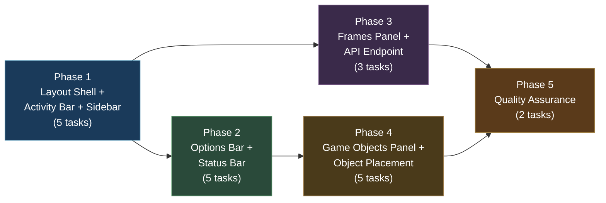

# Work Plan: Map Editor UI Redesign -- Photoshop-Style Layout

Status: PENDING
Created Date: 2026-02-19
Type: refactoring
Estimated Duration: 5-7 days
Estimated Impact: 17 files (7 new, 9 modified, 1 new API)
Related Issue/PR: N/A

## Related Documents

- Design Doc: [docs/design/design-009-map-editor-ui-redesign.md](../design/design-009-map-editor-ui-redesign.md)
- UXRD: [docs/uxrd/uxrd-003-map-editor-photoshop-redesign.md](../uxrd/uxrd-003-map-editor-photoshop-redesign.md)
- ADR: [docs/adr/adr-006-map-editor-architecture.md](../adr/adr-006-map-editor-architecture.md)

## Objective

Replace the map editor's rigid 3-column layout with a professional Photoshop-style UI featuring an Activity Bar, collapsible push sidebar, context-sensitive Options Bar, compact header, and status bar. Add two new panels (Frames browser and Game Objects browser with object placement) to expand editor capabilities. Introduce a discriminated union layer system (`TileLayer | ObjectLayer`) to store placed objects as first-class layers within the existing `layers` JSONB column, eliminating the need for a separate `placed_objects` DB column. Existing panel components (TerrainPalette, MapPropertiesPanel, ZonePanel) are reused without modification; `LayerPanel` is extended to handle both layer types.

## Background

The current 3-column layout wastes 21% of horizontal space on permanent sidebars (200px left + 200px right), has no panel collapsibility, scatters content across distant screen regions, and lacks Frames and Game Objects panels. The redesign follows the VS Code Activity Bar + Sidebar pattern with Photoshop-style Options Bar, used successfully by professional editors. The editor must remain fully functional throughout the migration -- all existing terrain painting, layer management, zone tools, undo/redo, save, export, and template features continue working at every phase.

## Prerequisites

- Batch 3 (Core Map Editor UI) completed: `page.tsx`, `useMapEditor` hook, canvas, terrain palette, layer panel, map properties panel, toolbar, save/load
- Batch 4 (Zone Markup Tools) completed: zone panel, zone drawing tools, zone overlay, zone API routes
- All existing editor features functional
- shadcn/ui components available: Button, Tooltip, Input, Dialog

## Phase Structure Diagram



## Task Dependency Diagram

```mermaid
graph TD
    T1["1.1: SidebarTab type +<br/>EditorTool extension"]
    T2["1.2: EditorHeader<br/>component"]
    T3["1.3: ActivityBar<br/>component"]
    T4["1.4: EditorSidebar<br/>component"]
    T5["1.5: Rewrite page.tsx<br/>layout shell"]

    T6["2.1: EditorOptionsBar<br/>component"]
    T7["2.2: Add onCursorMove<br/>to MapEditorCanvas"]
    T8["2.3: EditorStatusBar<br/>component"]
    T9["2.4: Add MARK_DIRTY<br/>reducer action"]
    T10["2.5: Delete old<br/>MapEditorToolbar"]

    T11["3.1: getFramesByFilename<br/>DB service"]
    T12["3.2: GET /api/frames/<br/>by-filename route"]
    T13["3.3: FramesPanel<br/>component"]

    T15["4.1: GameObjectsPanel<br/>component"]
    T16["4.2: Object placement<br/>state via reducer"]
    T17["4.3: Canvas layer-type<br/>rendering"]
    T18["4.4: Save/load<br/>layer-aware"]
    T19["4.5: Object placement<br/>integration test"]

    T20["5.1: Typecheck +<br/>lint + build"]
    T21["5.2: Manual E2E<br/>verification"]

    T1 --> T3
    T1 --> T4
    T2 --> T5
    T3 --> T5
    T4 --> T5

    T5 --> T6
    T5 --> T7
    T7 --> T8
    T5 --> T9
    T6 --> T10

    T11 --> T12
    T12 --> T13
    T5 --> T13

    T1 --> T15
    T9 --> T16
    T15 --> T16
    T16 --> T17
    T16 --> T18
    T17 --> T19
    T18 --> T19

    T10 --> T20
    T13 --> T20
    T19 --> T20
    T20 --> T21

    subgraph Phase1["Phase 1: Layout Shell"]
        T1
        T2
        T3
        T4
        T5
    end

    subgraph Phase2["Phase 2: Options + Status Bar"]
        T6
        T7
        T8
        T9
        T10
    end

    subgraph Phase3["Phase 3: Frames Panel"]
        T11
        T12
        T13
    end

    subgraph Phase4["Phase 4: Game Objects + Placement"]
        T15
        T16
        T17
        T18
        T19
    end

    subgraph Phase5["Phase 5: QA"]
        T20
        T21
    end

    style Phase1 fill:#0d1f2d,stroke:#4a8aaa
    style Phase2 fill:#15251d,stroke:#5a9a6a
    style Phase3 fill:#1d1525,stroke:#7a5a8a
    style Phase4 fill:#251d0d,stroke:#9a7a4a
    style Phase5 fill:#2d1d0d,stroke:#aa8a4a
```



## Risks and Countermeasures

### Technical Risks

- **Risk**: Canvas resize jank during 200ms sidebar open/close animation (ResizeObserver fires mid-transition)
  - **Impact**: Medium -- visible visual stutter during sidebar transitions
  - **Countermeasure**: 50ms debounce on ResizeObserver callback. Add `will-change: width` on sidebar for GPU acceleration. The existing `MapEditorCanvas` already uses ResizeObserver internally. Add `@media (prefers-reduced-motion: reduce)` to disable animation.

- **Risk**: Existing panel components may not fit within 280px sidebar width
  - **Impact**: Low -- panels currently work at 200px; 280px is wider
  - **Countermeasure**: Test all 4 existing panels (TerrainPalette, LayerPanel, MapPropertiesPanel, ZonePanel) at 280px width. If any panel overflows, add horizontal scroll within the sidebar panel content area.

- **Risk**: Breaking the container CSS (`container mx-auto px-6 py-6`) may affect other genmap pages
  - **Impact**: Low -- the CSS override uses a specific `.editor-page` class scoped to the page root div
  - **Countermeasure**: Use negative margins on the page root (`margin: -1.5rem; width: calc(100% + 3rem)`) rather than modifying the root layout. Verify other genmap pages (/sprites, /objects, /maps list) are unaffected.

- **Risk**: Object placement state interaction with existing undo/redo system
  - **Impact**: Medium -- placed objects now live inside the reducer as ObjectLayer data within the layers array, which means layer mutations go through the same undo/redo stack as tile painting
  - **Countermeasure**: New reducer actions (`ADD_OBJECT_LAYER`, `PLACE_OBJECT`, `REMOVE_OBJECT`, `MOVE_OBJECT`) follow the same `PUSH_COMMAND` pattern as tile operations. Guard object placement: only allow when active layer is an `ObjectLayer`; show a toast message if the user attempts placement on a `TileLayer`. The `MARK_DIRTY` action remains for edge cases where dirty state must be set without a command.

- **Risk**: Layer panel complexity increase from handling two layer types
  - **Impact**: Medium -- `layer-panel.tsx` must now differentiate `TileLayer` (terrain key, frames) from `ObjectLayer` (objects array) in both display and "Add Layer" dialog
  - **Countermeasure**: Use discriminated union `type` field for exhaustive switch. Add a type selector to the "Add Layer" dialog. Show different icons per layer type (grid icon for tile, box icon for object). Terrain-specific UI (terrain key, opacity-via-frame check) only renders for `TileLayer`.

- **Risk**: Large number of game objects slows GameObjectsPanel render
  - **Impact**: Medium -- could degrade if 200+ objects loaded at once
  - **Countermeasure**: Initial implementation loads all objects. If performance is poor, add virtual scrolling or pagination. Profile with 200+ objects.

### Schedule Risks

- **Risk**: Phase 3 (Frames Panel) and Phase 4 (Game Objects Panel) introduce new data-fetching patterns that may require debugging
  - **Impact**: Low -- both panels follow existing genmap API patterns
  - **Countermeasure**: Phase 3 has no dependencies on Phase 2 and can run in parallel. Phase 4 depends on Phase 2 (for Options Bar integration) but the GameObjectsPanel component itself can be developed independently.

## Implementation Phases

### Phase 1: Layout Shell + Activity Bar + Sidebar (Estimated commits: 5)

**Purpose**: Replace the entire page layout with the new Photoshop-style structure. Create the foundational layout components (EditorHeader, ActivityBar, EditorSidebar) and move all 4 existing panel components into sidebar tabs without modifying them. After this phase, the editor has the new layout with all existing functionality preserved.

#### Tasks

- [ ] **Task 1.1: Add SidebarTab type, discriminated union layer types, and extend EditorTool union**
  - Description: Define the `SidebarTab` type union, convert the existing `EditorLayer` to a discriminated union layer system (`TileLayer | ObjectLayer`), add `PlacedObject` interface, add `'object-place'` to the `EditorTool` union, and add new reducer actions for object layer management.
  - Input files:
    - `apps/genmap/src/hooks/map-editor-types.ts` (existing, 111 lines)
  - Output files:
    - `apps/genmap/src/hooks/map-editor-types.ts` (modified)
  - Implementation:
    - Add `SidebarTab` type: `'terrain' | 'layers' | 'properties' | 'zones' | 'frames' | 'game-objects'`
    - Add `'object-place'` to `EditorTool` union (now 7 members)
    - Add `PlacedObject` interface: `{ id: string; objectId: string; gridX: number; gridY: number; rotation: number }`
    - Convert existing `EditorLayer` to discriminated union:
      - `TileLayer`: existing `EditorLayer` fields + `type: 'tile'` discriminant
      - `ObjectLayer`: `{ type: 'object'; id: string; name: string; visible: boolean; opacity: number; objects: PlacedObject[] }`
      - `EditorLayer = TileLayer | ObjectLayer` (union type, preserves backward compat for the `layers` array)
    - Add new reducer action variants to `MapEditorAction`:
      - `| { type: 'ADD_OBJECT_LAYER'; name: string }`
      - `| { type: 'PLACE_OBJECT'; layerIndex: number; object: PlacedObject }`
      - `| { type: 'REMOVE_OBJECT'; layerIndex: number; objectId: string }`
      - `| { type: 'MOVE_OBJECT'; layerIndex: number; objectId: string; gridX: number; gridY: number }`
    - Export `SIDEBAR_TABS` constant array for validation
    - Update `MapEditorState.layers` type from `EditorLayer[]` to `(TileLayer | ObjectLayer)[]` (or keep as `EditorLayer[]` since the union covers both)
    - Update `LoadMapPayload.layers` to accept the discriminated union
  - Acceptance criteria:
    - Given `map-editor-types.ts` is imported, then `SidebarTab`, `PlacedObject`, `TileLayer`, `ObjectLayer`, `EditorLayer` (union), and the extended `EditorTool` types are available
    - Given `SET_TOOL` is dispatched with `'object-place'`, the existing reducer handles it without errors (default case)
    - Given a layer with `type: 'tile'`, TypeScript narrows to `TileLayer` with `terrainKey` and `frames` fields
    - Given a layer with `type: 'object'`, TypeScript narrows to `ObjectLayer` with `objects: PlacedObject[]` field
    - Given `PLACE_OBJECT` action is dispatched, it is a valid `MapEditorAction` variant
  - Estimated complexity: Medium (up from Low due to discriminated union refactor)
  - Dependencies: None

- [x] **Task 1.2: Create EditorHeader component**
  - Description: Compact 36px header with back arrow, inline-editable map name, and action buttons (Export, Template, Settings).
  - Input files:
    - Design Doc: EditorHeader interface (`mapName`, `onNameChange`, `isDirty`, `onExport`, `onSaveAsTemplate`)
    - UXRD: Feature 2 specifications
  - Output files:
    - `apps/genmap/src/components/map-editor/editor-header.tsx` (new)
  - Implementation:
    - 36px height, `--card` background, 1px `--border` bottom border
    - Left: `ArrowLeft` icon button (16x16) linking to `/maps`, followed by inline-editable map name (11px semibold)
    - Map name inline editing: click to edit, Enter/blur to commit (`onNameChange`), Escape to revert
    - Right: Export (`Upload` icon), Template (`Copy` icon), Settings (`Settings` icon) -- all ghost buttons, 28px height
    - Uses shadcn/ui `Button`, `Input`, `Tooltip`
  - Acceptance criteria (from FR-002):
    - Given the header renders, then back arrow, map name, and action buttons are visible at 36px height
    - Given user clicks the map name, then an input field replaces it
    - Given user presses Enter after editing, then `onNameChange` is called with new value
    - Given user presses Escape while editing, then the previous value is restored
  - Estimated complexity: Medium
  - Dependencies: None

- [x] **Task 1.3: Create ActivityBar component**
  - Description: 40px vertical icon strip with 6 tab buttons (Terrain, Layers, Properties, Zones, Frames, Game Objects). Toggle behavior: click active tab = close, click inactive = open.
  - Input files:
    - Design Doc: ActivityBar interface (`activeTab`, `onTabChange`)
    - UXRD: Feature 4 Activity Bar specifications
  - Output files:
    - `apps/genmap/src/components/map-editor/activity-bar.tsx` (new)
  - Implementation:
    - 40px width, vertical flex, `--muted` background
    - 6 icon buttons: Mountain, Layers, SlidersHorizontal, Map, Frame, Gamepad2 (all from Lucide, 20x20)
    - Each button 40x40px, centered icon. Default: `--muted-foreground`. Hover: `--foreground` + `--accent` bg
    - Active state: 2px `--primary` left border, `--foreground` icon, `--accent` bg
    - Toggle logic: `onTabChange(clickedTab === activeTab ? null : clickedTab)`
    - Tooltips with keyboard shortcut: "Terrain (1)", "Layers (2)", etc.
    - ARIA: `role="navigation"`, `aria-label="Editor sidebar navigation"`, each button `role="tab"` with `aria-selected`
  - Acceptance criteria (from FR-004):
    - Given the Activity Bar renders, then 6 icon buttons are visible in a vertical strip
    - Given user clicks the Terrain tab, then `onTabChange('terrain')` is called
    - Given user clicks the currently active tab, then `onTabChange(null)` is called (close)
    - Given the Layers tab is active, then it shows a 2px primary left border
  - Estimated complexity: Medium
  - Dependencies: Task 1.1 (SidebarTab type)

- [ ] **Task 1.4: Create EditorSidebar component**
  - Description: Animated-width container (0 or 280px) that renders the active panel with a header and close button. Includes scroll position preservation per panel.
  - Input files:
    - Design Doc: EditorSidebar interface and behavior spec
    - UXRD: Feature 4 Sidebar Panel specifications
  - Output files:
    - `apps/genmap/src/components/map-editor/editor-sidebar.tsx` (new)
  - Implementation:
    - CSS transition: `width 200ms ease-in-out`, `overflow: hidden`, `flex-shrink: 0`
    - When `activeTab !== null`: width 280px, 1px `--border` right border
    - Panel header: 28px height, tab name (11px semibold uppercase), right-aligned close button (Lucide `X`, 14x14)
    - Panel content: scrollable container with 8px padding
    - Conditional rendering via switch on `activeTab`:
      - `'terrain'` -> `<TerrainPalette state={state} dispatch={dispatch} tilesetImages={tilesetImages} />`
      - `'layers'` -> `<LayerPanel state={state} dispatch={dispatch} />`
      - `'properties'` -> `<MapPropertiesPanel state={state} dispatch={dispatch} />`
      - `'zones'` -> `<ZonePanel zoneState={zoneState} />`
      - `'frames'` -> placeholder (Phase 3)
      - `'game-objects'` -> placeholder (Phase 4)
    - Scroll position preservation: `Map<SidebarTab, number>` ref tracking each panel's `scrollTop`. Save on tab switch out, restore on tab switch in.
    - Panel content fade: 100ms opacity transition on tab switch
    - `@media (prefers-reduced-motion: reduce)`: disable all transitions
  - Acceptance criteria (from FR-004):
    - Given `activeTab` is `'terrain'`, then the sidebar is 280px wide and TerrainPalette renders
    - Given `activeTab` changes from `'terrain'` to `'layers'`, then panel content switches without width animation
    - Given `activeTab` is `null`, then the sidebar width is 0
    - Given user scrolls in the Terrain panel, switches to Layers, then back to Terrain, the scroll position is restored
  - Estimated complexity: High
  - Dependencies: Task 1.1 (SidebarTab type)

- [x] **Task 1.5: Rewrite page.tsx with new full-width layout**
  - Description: Complete rewrite of the `page.tsx` JSX to use the new Photoshop-style layout. Break out of the genmap container. Wire up EditorHeader, ActivityBar, EditorSidebar, and Canvas. Add keyboard shortcuts 1-6 for tabs and Escape to close sidebar. Add localStorage persistence for active tab.
  - Input files:
    - `apps/genmap/src/app/maps/[id]/page.tsx` (existing, 507 lines -- complete rewrite)
    - Design Doc: Component hierarchy, CSS layout architecture, state management
  - Output files:
    - `apps/genmap/src/app/maps/[id]/page.tsx` (rewritten)
  - Implementation:
    - Page root div with `.editor-page` class: `margin: -1.5rem; width: calc(100% + 3rem); height: 100vh; display: flex; flex-direction: column; overflow: hidden`
    - Layout: EditorHeader (36px) + placeholder div for EditorOptionsBar (32px) + editor-body (flex row, flex: 1) + placeholder div for EditorStatusBar (24px)
    - Editor body: ActivityBar (40px) + EditorSidebar (0/280px) + canvas-area (flex: 1, min-width: 0)
    - New state: `activeTab: SidebarTab | null` with localStorage init from `genmap-editor-sidebar-tab`
    - localStorage sync: `useEffect` writing activeTab on change
    - Keyboard shortcuts: `useEffect` with `keydown` handler for number keys 1-6 (when no input focused) and Escape (close sidebar)
    - Preserve all existing state/hooks: `useMapEditor`, `useZones`, `useZoneApi`, `useTilesetImages`, camera, grid, walkability, export/template dialogs
    - Move existing panel component renders into EditorSidebar
    - Keep MapEditorToolbar temporarily in a placeholder position (replaced in Phase 2)
  - Acceptance criteria (from FR-001, FR-004, FR-010):
    - Given the editor page mounts, then the layout fills 100vh with no scrollbar
    - Given user presses key "1", then the Terrain sidebar opens
    - Given user presses Escape with sidebar open, then the sidebar closes
    - Given user opens Terrain tab, closes browser, reopens, then Terrain tab is restored from localStorage
    - Given all existing features (paint, fill, layers, zones, save), they continue working in the new layout
  - Estimated complexity: High
  - Dependencies: Task 1.2 (EditorHeader), Task 1.3 (ActivityBar), Task 1.4 (EditorSidebar)

- [ ] Quality check: `pnpm nx typecheck genmap` passes

#### Phase 1 Completion Criteria

- [ ] Editor page fills 100vh viewport, breaking out of genmap container
- [ ] EditorHeader renders at 36px with back arrow, inline-editable map name, and action buttons
- [ ] ActivityBar renders 6 icon tabs in a 40px vertical strip
- [ ] EditorSidebar opens/closes with 200ms CSS transition
- [ ] All 4 existing panels render correctly in their respective sidebar tabs
- [ ] Canvas auto-resizes via flexbox when sidebar opens/closes
- [ ] Keyboard shortcuts 1-6 toggle tabs, Escape closes sidebar
- [ ] Active tab persists in localStorage across page loads
- [ ] All existing editor features (terrain painting, layer management, zone tools, undo/redo, save) continue working
- [ ] Scroll position preserved per panel when switching tabs

#### Operational Verification Procedures

1. Open the map editor -- verify full-viewport layout renders without page scrollbar
2. Click each Activity Bar tab (1-6) -- verify sidebar opens showing the correct panel
3. Click the currently active tab -- verify sidebar closes and canvas expands
4. Switch between tabs -- verify no width animation, only content changes
5. Press number keys 1-6 -- verify sidebar toggles the correct tab
6. Press Escape with sidebar open -- verify sidebar closes
7. Open Terrain tab, scroll down, switch to Layers, switch back to Terrain -- verify scroll position preserved
8. Paint terrain with brush -- verify canvas responds correctly with sidebar open
9. Close sidebar -- verify canvas expands to fill remaining space
10. Click the map name in header -- verify inline editing works (Enter commits, Escape reverts)
11. Reload page -- verify active tab restored from localStorage

---

### Phase 2: Options Bar + Status Bar (Estimated commits: 5)

**Purpose**: Replace the existing `MapEditorToolbar` with the compact `EditorOptionsBar` (32px, context-sensitive) and add the `EditorStatusBar` (24px) with real-time cursor coordinates, zoom, layer name, and save status. Add cursor position tracking to the canvas.

#### Tasks

- [x] **Task 2.1: Create EditorOptionsBar component**
  - Description: Context-sensitive 32px toolbar that replaces `MapEditorToolbar`. Shows tool-specific controls, undo/redo, save, zoom, and toggles. Handles all existing keyboard shortcuts.
  - Input files:
    - `apps/genmap/src/components/map-editor/map-editor-toolbar.tsx` (existing, 362 lines -- reference for functionality to port)
    - Design Doc: EditorOptionsBar interface and behavior spec
    - UXRD: Feature 3 Options Bar specifications
  - Output files:
    - `apps/genmap/src/components/map-editor/editor-options-bar.tsx` (new)
  - Implementation:
    - 32px height, `--card` background, 1px `--border` bottom border
    - Left section (variable width): Active tool name label + tool-specific controls
      - Brush: "Size: [placeholder]" (future feature)
      - Zone Rect/Poly: zone type selector dropdown
      - Others: no additional controls
      - CSS transition: `max-width + opacity, 150ms ease` for tool-specific section
    - Dividers: 1px vertical rules in `--border` color
    - Undo (`Undo2`) / Redo (`Redo2`) buttons with disabled state
    - Save button with status dot (green = saved, amber = unsaved)
    - Zoom controls: minus, percentage (tabular-nums), plus, Fit button
    - Grid (`Grid3x3`) and Walkability (`Footprints`) toggle buttons with `--accent` active background
    - All buttons: 24px height, 6px horizontal padding, 11px font, 14x14 icons
    - Keyboard shortcuts (ported from MapEditorToolbar): B, F, R, E, Z, P, G, W, Ctrl+Z, Ctrl+Y, Ctrl+S
    - Props identical to `MapEditorToolbar`: `state, dispatch, save, camera, onCameraChange, showGrid, onToggleGrid, showWalkability, onToggleWalkability`
    - ARIA: `role="toolbar"`, `aria-label="Editor options"`, `aria-orientation="horizontal"`
  - Acceptance criteria (from FR-003):
    - Given the Options Bar renders, then tool name, undo/redo, save, zoom, and toggles are visible at 32px
    - Given user switches from Brush to Zone Rect, then zone type selector appears with 150ms transition
    - Given user presses B, then brush tool activates
    - Given user presses Ctrl+S, then save is triggered
    - Given undo stack is empty, then Undo button is disabled
  - Estimated complexity: High
  - Dependencies: Task 1.5 (page layout exists)

- [x] **Task 2.2: Add `onCursorMove` callback to MapEditorCanvas**
  - Description: Add an optional `onCursorMove` prop to MapEditorCanvas that reports tile coordinates on mouse move and `null` on mouse leave. Also add placeholder props for object placement.
  - Input files:
    - `apps/genmap/src/components/map-editor/map-editor-canvas.tsx` (existing)
    - Design Doc: Canvas cursor callback extension
  - Output files:
    - `apps/genmap/src/components/map-editor/map-editor-canvas.tsx` (modified)
  - Implementation:
    - New optional prop: `onCursorMove?: (position: { x: number; y: number } | null) => void`
    - In existing `onMouseMove` handler: convert pixel coordinates to tile coordinates (`Math.floor(px / TILE_SIZE)`), call `onCursorMove({ x: tileX, y: tileY })`
    - In `onMouseLeave` handler: call `onCursorMove(null)`
    - Filter out NaN coordinates (return null)
    - New optional props (placeholders for Phase 4): `placedObjects?: PlacedObject[]`, `onObjectPlace?: (gridX: number, gridY: number) => void`, `objectRenderData?: Map<string, ...>`
  - Acceptance criteria:
    - Given `onCursorMove` is provided, when mouse moves over canvas, then callback fires with tile coordinates
    - Given mouse leaves canvas, then callback fires with `null`
    - Given `onCursorMove` is not provided, then no errors occur (optional prop)
  - Estimated complexity: Low
  - Dependencies: Task 1.5 (page layout wired)

- [x] **Task 2.3: Create EditorStatusBar component**
  - Description: 24px bottom strip showing zoom percentage (clickable dropdown), cursor tile coordinates, active layer name, and save status.
  - Input files:
    - Design Doc: EditorStatusBar interface
    - UXRD: Feature 7 Status Bar specifications
  - Output files:
    - `apps/genmap/src/components/map-editor/editor-status-bar.tsx` (new)
  - Implementation:
    - 24px height, `--muted` background, 1px `--border` top border
    - Font: 11px, `--muted-foreground` color, monospace for numeric values
    - Sections separated by 1px vertical dividers:
      1. Zoom: percentage text, clickable to open dropdown with presets (25%, 50%, 75%, 100%, 150%, 200%, 400%)
      2. Cursor: `(x, y)` or `(--)` when cursor not on canvas
      3. Layer: "Layer: [name]" or "No layers"
      4. Save: "Not yet saved" / "Unsaved changes" / "Saving..." / "Saved [time]"
    - ARIA: `role="status"`, `aria-label="Editor status"`, `aria-live="polite"`
  - Acceptance criteria (from FR-007):
    - Given cursor is on canvas at tile (12, 8), then status bar shows `(12, 8)`
    - Given cursor is not on canvas, then status bar shows `(--)`
    - Given user clicks zoom percentage, then dropdown shows preset zoom levels
    - Given user selects 200% from dropdown, then `onZoomChange(2)` is called
    - Given map was saved at 2:34 PM, then status bar shows "Saved 2:34 PM"
    - Given map has unsaved changes, then status bar shows "Unsaved changes"
  - Estimated complexity: Medium
  - Dependencies: Task 2.2 (cursor position data available)

- [ ] **Task 2.4: Add MARK_DIRTY action to reducer**
  - Description: Add a `MARK_DIRTY` action to the `MapEditorAction` union and reducer to explicitly mark the map as dirty from external state changes (e.g., placed objects).
  - Input files:
    - `apps/genmap/src/hooks/map-editor-types.ts` (existing)
    - `apps/genmap/src/hooks/use-map-editor.ts` (existing, 598 lines)
  - Output files:
    - `apps/genmap/src/hooks/map-editor-types.ts` (modified)
    - `apps/genmap/src/hooks/use-map-editor.ts` (modified)
  - Implementation:
    - Add `| { type: 'MARK_DIRTY' }` to `MapEditorAction` union
    - Add reducer case: `case 'MARK_DIRTY': return { ...state, isDirty: true }`
  - Acceptance criteria:
    - Given `dispatch({ type: 'MARK_DIRTY' })` is called, then `state.isDirty` becomes `true`
    - Given `state.isDirty` is already true, then it remains true
  - Estimated complexity: Low
  - Dependencies: Task 1.5 (page layout exists for wiring)

- [x] **Task 2.5: Delete old MapEditorToolbar and wire new components into page**
  - Description: Remove the old `map-editor-toolbar.tsx` file (dead code after replacement). Wire `EditorOptionsBar` and `EditorStatusBar` into `page.tsx`, replacing the temporary placeholder and the old toolbar import. Add `cursorPosition` state to page.
  - Input files:
    - `apps/genmap/src/components/map-editor/map-editor-toolbar.tsx` (existing, to be deleted)
    - `apps/genmap/src/app/maps/[id]/page.tsx` (existing, from Phase 1)
  - Output files:
    - `apps/genmap/src/components/map-editor/map-editor-toolbar.tsx` (deleted)
    - `apps/genmap/src/app/maps/[id]/page.tsx` (modified)
  - Implementation:
    - Delete `map-editor-toolbar.tsx`
    - Replace EditorOptionsBar placeholder with actual `<EditorOptionsBar />` component
    - Replace EditorStatusBar placeholder with actual `<EditorStatusBar />` component
    - Add `cursorPosition` state: `useState<{ x: number; y: number } | null>(null)`
    - Pass `onCursorMove={setCursorPosition}` to `<MapEditorCanvas />`
    - Pass `cursorPosition` to `<EditorStatusBar />`
    - Derive `activeLayerName` from `state.layers[state.activeLayerIndex]?.name`
  - Acceptance criteria:
    - Given the old toolbar file is deleted, then no import references remain
    - Given the editor loads, then EditorOptionsBar renders at 32px and EditorStatusBar at 24px
    - Given mouse moves over canvas, then status bar coordinates update in real-time
    - Given all keyboard shortcuts (B, F, R, E, Z, P, G, W, Ctrl+Z, Ctrl+Y, Ctrl+S), they work via EditorOptionsBar
  - Estimated complexity: Medium
  - Dependencies: Task 2.1 (EditorOptionsBar), Task 2.2 (cursor callback), Task 2.3 (EditorStatusBar), Task 2.4 (MARK_DIRTY)

- [ ] Quality check: `pnpm nx typecheck genmap` passes, no references to deleted toolbar

#### Phase 2 Completion Criteria

- [ ] EditorOptionsBar renders at 32px with tool-specific controls, undo/redo, save, zoom, and toggles
- [ ] Tool-specific section transitions with 150ms animation on tool switch
- [ ] All existing keyboard shortcuts (B, F, R, E, Z, P, G, W, Ctrl+Z, Ctrl+Y, Ctrl+S) work
- [ ] EditorStatusBar renders at 24px with zoom, cursor, layer, and save status
- [ ] Cursor coordinates update in real-time on mouse move over canvas
- [ ] Zoom preset dropdown works from status bar
- [ ] Save status shows correct state (Not yet saved / Unsaved changes / Saving... / Saved [time])
- [ ] Old `map-editor-toolbar.tsx` is deleted with no remaining references
- [ ] `MARK_DIRTY` action added to reducer

#### Operational Verification Procedures

1. Open editor -- verify EditorOptionsBar renders below header at 32px
2. Select each tool (B, F, R, E, Z, P) -- verify tool name updates and tool-specific controls appear/disappear
3. Click Save button -- verify save executes, status dot changes
4. Use zoom controls (-, +, Fit) -- verify zoom changes on canvas
5. Toggle Grid (G) and Walkability (W) -- verify toggles work
6. Undo/Redo (Ctrl+Z, Ctrl+Y) -- verify buttons enable/disable and operations execute
7. Move mouse over canvas -- verify status bar coordinates update in real-time
8. Move mouse off canvas -- verify coordinates show `(--)`
9. Click zoom percentage in status bar -- verify preset dropdown appears
10. Select 200% from dropdown -- verify canvas zooms to 200%
11. Verify status bar shows correct layer name, save status
12. Verify Ctrl+S saves map and status updates

---

### Phase 3: Frames Panel + API Endpoint (Estimated commits: 3)

**Purpose**: Add the Frames browser panel to the sidebar, backed by a new API endpoint for fetching frames by atlas filename. Users can search for atlas filenames, expand to see frame thumbnails, and click to copy frame IDs.

#### Tasks

- [ ] **Task 3.1: Add `getFramesByFilename` service function**
  - Description: Add a new DB service function to `packages/db` that retrieves all atlas frames for a given filename, ordered by frame coordinates.
  - Input files:
    - `packages/db/src/services/atlas-frame.ts` (existing -- add new function)
    - `packages/db/src/schema/atlas-frames.ts` (existing -- reference)
    - `packages/db/src/index.ts` (existing -- add export)
  - Output files:
    - `packages/db/src/services/atlas-frame.ts` (modified)
    - `packages/db/src/index.ts` (modified)
  - Implementation:
    - Function: `getFramesByFilename(db: DrizzleClient, filename: string): Promise<AtlasFrame[]>`
    - Query: `db.select().from(atlasFrames).where(eq(atlasFrames.filename, filename)).orderBy(atlasFrames.frameX, atlasFrames.frameY)`
    - Export from `packages/db/src/index.ts`
  - Acceptance criteria (from FR-008):
    - Given filename `"terrain-autumn.png"` with 48 frames in DB, then function returns 48 frames ordered by coordinates
    - Given filename `"nonexistent.png"`, then function returns empty array
  - Estimated complexity: Low
  - Dependencies: None (can start in parallel with Phase 1)

- [ ] **Task 3.2: Create GET /api/frames/by-filename route**
  - Description: New Next.js Route Handler endpoint that accepts a `filename` query parameter and returns all frames for that atlas.
  - Input files:
    - `apps/genmap/src/app/api/frames/search/route.ts` (existing -- reference pattern)
  - Output files:
    - `apps/genmap/src/app/api/frames/by-filename/route.ts` (new)
  - Implementation:
    - Parse `filename` from `searchParams`
    - Validate: if missing or empty, return 400 `{ error: 'filename query parameter is required' }`
    - Call `getFramesByFilename(db, filename.trim())`
    - Return `NextResponse.json(frames)`
  - Acceptance criteria (from FR-008):
    - Given `GET /api/frames/by-filename?filename=terrain-autumn.png`, then frames array is returned
    - Given `GET /api/frames/by-filename` (no param), then 400 is returned with error message
    - Given `GET /api/frames/by-filename?filename=nonexistent.png`, then empty array is returned
  - Estimated complexity: Low
  - Dependencies: Task 3.1 (service function exists)

- [x] **Task 3.3: Create FramesPanel component**
  - Description: Atlas frame browser panel with search, grouped by filename, collapsible atlas groups, lazy-loaded frame details, and 32x32 canvas thumbnails.
  - Input files:
    - Design Doc: FramesPanel interface and data fetching strategy
    - UXRD: Feature 5 Frames Panel specifications
  - Output files:
    - `apps/genmap/src/components/map-editor/frames-panel.tsx` (new)
  - Implementation:
    - Self-contained component (no props)
    - Internal state: `searchQuery`, `filenames: string[]`, `expandedAtlases: Set<string>`, `frameCache: Map<string, AtlasFrame[]>`, `spriteImageCache: Map<string, HTMLImageElement>`, `isLoading`
    - On mount: `GET /api/frames/search` to load all filenames
    - Search input: 28px, placeholder "Search frames...", debounced 300ms API call to `GET /api/frames/search?q=term`
    - Results: list of atlas filename rows (collapsible)
      - Collapsed: `>` chevron + filename + frame count in parentheses, 28px height
      - Expanded: `v` chevron + filename, followed by 32x32 frame thumbnail grid (4 columns, 4px gap)
    - On expand atlas: lazy-fetch `GET /api/frames/by-filename?filename=xxx` (cached in `frameCache`)
    - On expand atlas: fetch sprite image via `GET /api/sprites/{spriteId}` for thumbnail rendering (cached)
    - Frame thumbnails: `<canvas>` elements using atlas image and frame source coordinates, pixelated rendering
    - On click frame: copy frame ID to clipboard, show toast
    - Escape in search input: clear query
    - Empty state: "No frames found" in `--muted-foreground`
    - Loading: skeleton shimmer on rows
    - ARIA: `aria-label="Search atlas frames"` on search, `aria-expanded` on atlas rows
  - Acceptance criteria (from FR-005):
    - Given Frames tab is opened, then all atlas filenames are listed
    - Given user types "terrain" in search, then only filenames containing "terrain" appear (debounced 300ms)
    - Given user clicks an atlas filename, then it expands showing 32x32 frame thumbnails in a 4-column grid
    - Given user clicks a frame thumbnail, then the frame ID is copied to clipboard with toast notification
    - Given user clicks an expanded atlas, then it collapses
    - Given frame details for an atlas were previously loaded, they are served from cache on re-expand
  - Estimated complexity: High
  - Dependencies: Task 1.5 (sidebar exists), Task 3.2 (API endpoint)

- [x] Wire FramesPanel into EditorSidebar for the `'frames'` tab (replace placeholder)
- [x] Quality check: `pnpm nx typecheck genmap` passes

#### Phase 3 Completion Criteria

- [ ] `getFramesByFilename` service function returns frames ordered by coordinates
- [ ] `GET /api/frames/by-filename` endpoint works with filename validation
- [x] FramesPanel renders in the Frames sidebar tab
- [x] Search filters atlas filenames via debounced API call
- [x] Atlas groups expand to show frame thumbnail grid
- [x] Frame thumbnails render correctly from atlas image using canvas elements
- [x] Click-to-copy frame ID works with toast notification
- [x] Frame data cached on first expand (no re-fetch)
- [x] Escape clears search input

#### Operational Verification Procedures

1. Open editor, click Frames tab (or press 5) -- verify panel loads and shows atlas filenames
2. Type a search query -- verify results filter with ~300ms delay
3. Click an atlas filename -- verify it expands to show frame thumbnails in 4-column grid
4. Hover over a frame thumbnail -- verify 2px primary outline appears
5. Click a frame thumbnail -- verify frame ID is copied to clipboard and toast appears
6. Click the expanded atlas again -- verify it collapses
7. Clear search -- verify all filenames reappear
8. Press Escape in search input -- verify query clears
9. Collapse and re-expand an atlas -- verify frame data loads from cache (no network call)
10. Call `GET /api/frames/by-filename?filename=test.png` directly -- verify response

---

### Phase 4: Game Objects Panel + Object Placement (Estimated commits: 5)

**Purpose**: Add the Game Objects browser panel with search, category grouping, and click-to-place functionality. Extend the canvas renderer to handle both `TileLayer` and `ObjectLayer` types. Objects are stored as part of the existing `layers` JSONB column via the new `ObjectLayer` type -- no database migration needed. Update the Layer Panel to support adding and displaying both layer types. This phase introduces a new editor tool type, layer-aware canvas rendering, and layer panel modifications.

**Architecture note**: Objects are NOT stored in a separate `placed_objects` DB column. Instead, they are first-class layers within the existing `layers` array. The save/load already serializes `layers` as JSONB, so `ObjectLayer` entries are automatically persisted. This eliminates the need for a DB migration, a separate API field, and separate save/load logic.

**Phaser 3 Export consideration** (future Batch 6): The discriminated union layer system maps cleanly to Phaser 3 concepts: `TileLayer` -> `Phaser.Tilemaps.TilemapLayer`, `ObjectLayer` -> `Phaser.GameObjects.Group` with `Sprite` children. The data model supports this mapping now, but export implementation is deferred.

#### Tasks

- [x] **Task 4.1: LOAD_MAP layer normalization + object layer reducer actions**
  - Description: Game object browser panel with search, category grouping, collapsible categories, 48x48 thumbnails, and selected object detail panel.
  - Input files:
    - Design Doc: GameObjectsPanel interface and data source
    - UXRD: Feature 6 Game Objects Panel specifications
    - `apps/genmap/src/app/api/objects/route.ts` (existing API)
  - Output files:
    - `apps/genmap/src/components/map-editor/game-objects-panel.tsx` (new)
  - Implementation:
    - Props: `onObjectSelect: (objectId: string) => void`
    - Internal state: `searchQuery`, `objects: GameObject[]`, `expandedCategories: Set<string>`, `selectedObjectId: string | null`, `isLoading`
    - On mount: `GET /api/objects` to load all objects
    - Search input: 28px, placeholder "Search objects...", client-side filter by `name`, `category`, `tags`
    - Category groups: objects grouped by `category` field. `null` -> "Uncategorized". Collapsible headers with count.
    - Object thumbnails: 48x48 canvas rendered from first layer's frame data. 1px `--border`. Hover: 2px `--primary`. Below: 10px truncated name.
    - Selected object detail panel at bottom: name, dimensions, collision info
    - Click thumbnail: call `onObjectSelect(objectId)`, set `selectedObjectId`
    - ARIA: `aria-label="Search game objects"` on search, `aria-expanded` on categories, `aria-pressed` on selected
  - Acceptance criteria (from FR-006):
    - Given Game Objects tab is opened, then all objects load grouped by category
    - Given user types "chair" in search, then only objects matching "chair" in name/category/tags are shown
    - Given user clicks a category header, then it expands/collapses
    - Given user clicks an object thumbnail, then `onObjectSelect` is called and the object shows as selected
    - Given an object is selected, then detail panel shows at the bottom
  - Estimated complexity: High
  - Dependencies: Task 1.1 (discriminated union types including PlacedObject)

- [ ] **Task 4.2: Add object placement state management via reducer actions**
  - Description: Implement the new reducer actions (`ADD_OBJECT_LAYER`, `PLACE_OBJECT`, `REMOVE_OBJECT`, `MOVE_OBJECT`) in `use-map-editor.ts`. Wire `selectedObjectId` state and object placement handlers into `page.tsx`. Objects are placed into the active `ObjectLayer` via reducer dispatch -- NOT as separate page-level state.
  - Input files:
    - `apps/genmap/src/hooks/use-map-editor.ts` (existing, 598 lines)
    - `apps/genmap/src/app/maps/[id]/page.tsx` (existing, from Phase 2)
    - `apps/genmap/src/components/map-editor/editor-sidebar.tsx` (existing)
    - `apps/genmap/src/components/map-editor/layer-panel.tsx` (existing, 369 lines)
    - Design Doc: Object placement state management
  - Output files:
    - `apps/genmap/src/hooks/use-map-editor.ts` (modified -- add reducer cases)
    - `apps/genmap/src/app/maps/[id]/page.tsx` (modified -- wire handlers)
    - `apps/genmap/src/components/map-editor/editor-sidebar.tsx` (modified -- wire GameObjectsPanel)
    - `apps/genmap/src/components/map-editor/layer-panel.tsx` (modified -- handle both layer types)
  - Implementation:
    - **Reducer cases in `use-map-editor.ts`**:
      - `ADD_OBJECT_LAYER`: creates a new `ObjectLayer` with `{ type: 'object', id: crypto.randomUUID(), name, visible: true, opacity: 1, objects: [] }` and appends to `state.layers`
      - `PLACE_OBJECT`: guards that `state.layers[action.layerIndex].type === 'object'`, then appends `action.object` to that layer's `objects` array. Sets `isDirty: true`.
      - `REMOVE_OBJECT`: filters out object by `objectId` from the specified ObjectLayer. Sets `isDirty: true`.
      - `MOVE_OBJECT`: updates `gridX`/`gridY` of the specified object in the specified ObjectLayer. Sets `isDirty: true`.
    - **Page-level state** (only `selectedObjectId` at page level):
      - `selectedObjectId: string | null` via `useState`
      - `handleObjectSelect(objectId)`: set `selectedObjectId`, dispatch `SET_TOOL` with `'object-place'`
      - `handleObjectPlace(gridX, gridY)`: if `selectedObjectId` is set AND `state.layers[state.activeLayerIndex].type === 'object'`, dispatch `PLACE_OBJECT` with a new `PlacedObject`. If active layer is a `TileLayer`, show a toast message "Select an object layer to place objects" and do NOT place.
      - Escape key: if in `'object-place'` mode, clear `selectedObjectId`, switch tool to `'brush'`
    - **Layer Panel changes (`layer-panel.tsx`)**:
      - "Add Layer" dialog gets a type selector: radio buttons or dropdown for "Tile Layer" vs "Object Layer"
      - When "Tile Layer" selected: show name + terrain key fields (existing behavior)
      - When "Object Layer" selected: show name field only, dispatch `ADD_OBJECT_LAYER` instead of `ADD_LAYER`
      - Display: different icons per layer type (grid icon for `TileLayer`, box/package icon for `ObjectLayer`)
      - Terrain key and opacity slider: only render for `TileLayer` (guard with `layer.type === 'tile'`)
      - Object count shown for `ObjectLayer` (e.g., "3 objects")
      - `layerHasData` check: for `TileLayer` checks frames, for `ObjectLayer` checks `objects.length > 0`
    - **EditorSidebar**: wire GameObjectsPanel for `'game-objects'` tab, pass `onObjectSelect`
    - **Load**: `ObjectLayer` data is loaded automatically because it is part of the `layers` array in the DB response. The `LOAD_MAP` action already populates `state.layers`. Ensure the `LoadMapPayload.layers` type accepts the discriminated union (updated in Task 1.1).
  - Acceptance criteria (from FR-006):
    - Given user clicks object in Game Objects panel, then tool switches to `'object-place'`
    - Given active layer is an `ObjectLayer` and user clicks canvas in object-place mode, then object is placed into that layer's `objects` array and `isDirty` becomes true
    - Given active layer is a `TileLayer` and user clicks canvas in object-place mode, then a toast message appears and no object is placed
    - Given user dispatches `ADD_OBJECT_LAYER`, a new `ObjectLayer` is appended to `state.layers`
    - Given user presses Escape in object-place mode, then mode exits and tool reverts
    - Given map is loaded with existing ObjectLayers, then objects are restored (they are part of `layers` JSONB)
    - Given user opens "Add Layer" dialog, then a type selector is available for "Tile Layer" or "Object Layer"
    - Given an `ObjectLayer` is active in the layer panel, then its icon and metadata differ from a `TileLayer`
  - Estimated complexity: High (covers reducer, page, layer panel, and sidebar changes)
  - Dependencies: Task 2.4 (MARK_DIRTY), Task 4.1 (GameObjectsPanel)

- [ ] **Task 4.3: Add canvas rendering for layer-type-aware drawing and object placement**
  - Description: Update the canvas renderer to iterate layers by type: `TileLayer` uses existing rendering, `ObjectLayer` renders `PlacedObject` entries using game object frame data. Show ghost preview of selected object at cursor position in object-place mode. Apply per-layer `opacity` and `visible` for both types. Render order follows `layers` array index (same as existing behavior).
  - Input files:
    - `apps/genmap/src/components/map-editor/map-editor-canvas.tsx` (existing, from Phase 2)
    - `apps/genmap/src/components/map-editor/canvas-renderer.ts` (existing)
  - Output files:
    - `apps/genmap/src/components/map-editor/map-editor-canvas.tsx` (modified)
    - `apps/genmap/src/components/map-editor/canvas-renderer.ts` (modified)
  - Implementation:
    - **canvas-renderer.ts**: Modify the layer rendering loop to use the discriminated union:
      ```
      for (const layer of state.layers) {
        if (!layer.visible) continue;
        ctx.globalAlpha = layer.opacity;
        if (layer.type === 'tile') {
          // existing TileLayer rendering (unchanged)
        } else if (layer.type === 'object') {
          // ObjectLayer rendering: iterate layer.objects, draw each using objectRenderData
        }
      }
      ```
    - Add `objectRenderData: Map<string, ObjectRenderEntry>` parameter to `renderMapCanvas`
    - `ObjectRenderEntry`: `{ image: HTMLImageElement; frameX: number; frameY: number; frameW: number; frameH: number }`
    - Apply `rotation` and any per-layer transform if needed
    - Ghost preview (50% opacity) of selected object at cursor's grid-snapped position, drawn after all layers but before zone overlays
    - On click in object-place mode: call `onObjectPlace(gridX, gridY)` instead of paint operation
    - **Backward compatibility**: existing layers without a `type` field should be treated as `TileLayer` (add `?? 'tile'` fallback)
    - Snap to grid: round to nearest tile position
  - Acceptance criteria (from FR-009):
    - Given an `ObjectLayer` with placed objects exists, then objects render on the canvas at their grid positions
    - Given a `TileLayer` exists, then existing tile rendering is unchanged
    - Given layers are `[TileLayer, ObjectLayer, TileLayer]`, render order follows array index (tile, objects, tile)
    - Given object-place mode is active with cursor on canvas, then ghost preview renders at grid-snapped position
    - Given user clicks canvas in object-place mode, then `onObjectPlace` fires with grid coordinates
    - Given an `ObjectLayer` has `visible: false`, its objects are not rendered
    - Given an `ObjectLayer` has `opacity: 0.5`, its objects render at 50% opacity
  - Estimated complexity: High
  - Dependencies: Task 4.2 (placement state and layer type system wired)

- [x] **Task 4.4: Verify save/load for object layers (layer-aware persistence)**
  - Description: Verify that `ObjectLayer` data round-trips through the existing save/load workflow. Since objects are stored as part of the `layers` JSONB column and the save/load already serializes `layers`, this task is primarily verification with minimal code changes. Ensure `LOAD_MAP` properly handles the discriminated union, and the save handler serializes `ObjectLayer` entries correctly.
  - Input files:
    - `apps/genmap/src/app/maps/[id]/page.tsx` (existing, from Task 4.2)
    - `apps/genmap/src/app/api/editor-maps/[id]/route.ts` (existing)
  - Output files:
    - `apps/genmap/src/app/maps/[id]/page.tsx` (minor modifications if needed)
  - Implementation:
    - Verify that the existing PATCH request body includes `layers` (which now contains both `TileLayer` and `ObjectLayer` entries) -- this should already work since the save handler sends `state.layers`
    - Verify that the GET response `layers` field is deserialized and the `type` discriminant is preserved through JSON round-trip
    - Add `type` field defaulting to `'tile'` when loading old maps that have layers without a `type` field (backward compatibility in `LOAD_MAP` reducer case)
    - No API route changes needed -- the existing PATCH handler already persists whatever is in the `layers` JSONB column
    - No DB migration needed -- `layers` is already a JSONB column that accepts any valid JSON
  - Acceptance criteria:
    - Given user creates an ObjectLayer, places 3 objects, and saves, then `layers` JSONB contains the ObjectLayer with 3 objects
    - Given map is reloaded after save, then the ObjectLayer and its 3 objects are restored
    - Given an old map with layers that lack a `type` field, then `LOAD_MAP` defaults them to `'tile'` and the map loads without errors
    - Given a map with mixed TileLayer and ObjectLayer entries, save and reload preserves all layer data
  - Estimated complexity: Low (mostly verification, small backward-compat fix in reducer)
  - Dependencies: Task 4.2 (placement state), Task 4.3 (canvas rendering confirms visual correctness)

- [ ] **Task 4.5: Object placement integration verification**
  - Description: End-to-end verification of the object placement workflow: select, place into ObjectLayer, render, save, reload. Also verify layer panel interaction with both layer types.
  - Input files: All Phase 4 outputs
  - Output files: None (verification only)
  - Implementation:
    - Verify select -> place -> render -> save -> reload cycle
    - Verify multiple objects can be placed in the same ObjectLayer
    - Verify placing on a TileLayer shows toast and is prevented
    - Verify adding a new ObjectLayer via layer panel works
    - Verify grid snapping works correctly
    - Verify ghost preview renders during placement
    - Verify Escape exits object-place mode
    - Verify ObjectLayer visibility toggle hides/shows placed objects
    - Verify ObjectLayer opacity affects rendered objects
    - Verify layer ordering: objects in higher-index layers render on top
    - Verify mixed TileLayer + ObjectLayer ordering is respected
    - Verify old maps without `type` field load correctly (backward compat)
  - Acceptance criteria (from Integration Point 5 in Design Doc):
    - Select object, click canvas with ObjectLayer active, object appears at grid position, save, reload, object persists
    - Attempt placement on TileLayer shows toast, no object placed
    - Layer panel shows correct icons and metadata for both layer types
  - Estimated complexity: Low
  - Dependencies: Task 4.3 (canvas rendering), Task 4.4 (save/load verification)

- [ ] Quality check: `pnpm nx typecheck genmap` passes

#### Phase 4 Completion Criteria

- [ ] GameObjectsPanel renders in Game Objects sidebar tab with search, category grouping, thumbnails
- [ ] Object selection switches tool to `'object-place'` mode
- [ ] `ADD_OBJECT_LAYER` reducer action creates a new ObjectLayer in `state.layers`
- [ ] `PLACE_OBJECT` reducer action adds object to the active ObjectLayer's `objects` array
- [ ] Placement on a `TileLayer` is prevented with a toast message
- [ ] Click-to-place works on canvas with grid snapping (when active layer is ObjectLayer)
- [ ] Ghost preview renders at cursor position during object-place mode
- [ ] Canvas renderer handles both `TileLayer` and `ObjectLayer` in the layer loop
- [ ] ObjectLayer visibility and opacity controls work correctly
- [ ] Layer panel shows different icons for tile vs object layers
- [ ] "Add Layer" dialog includes a type selector (Tile Layer / Object Layer)
- [ ] Layer ordering respected: objects in higher-index layers render on top
- [ ] Escape exits object-place mode
- [x] Objects persist through save/load cycle (stored in `layers` JSONB, no separate column)
- [ ] `isDirty` set to true on object placement via reducer
- [x] Backward compatibility: old maps without `type` field on layers default to `'tile'`

#### Operational Verification Procedures

1. Open editor, click Game Objects tab (or press 6) -- verify objects load grouped by category
2. Search for an object by name -- verify client-side filter works
3. Click an object thumbnail -- verify tool switches to object-place mode, detail panel shows
4. Move cursor over canvas -- verify ghost preview follows at grid-snapped position
5. Click on canvas -- verify object is placed at the grid position
6. Place 3 different objects -- verify all render correctly on canvas
7. Verify placed objects appear above terrain but below zone overlays
8. Press Escape -- verify object-place mode exits, tool reverts
9. Save (Ctrl+S) -- verify save succeeds
10. Reload page -- verify all 3 placed objects are restored at correct positions
11. Load an old map (no placed objects) -- verify it loads without errors

---

### Phase 5: Quality Assurance (Estimated commits: 2)

**Purpose**: Final verification that all components work together, pass type checking and linting, and meet the Design Doc and UXRD acceptance criteria.

#### Tasks

- [ ] **Task 5.1: Run typecheck, lint, and build across affected packages**
  - Description: Ensure all new and modified code passes TypeScript strict mode, ESLint rules, and builds successfully.
  - Input files: All files created and modified in Phases 1-4
  - Output files: Fix any type or lint errors in created files
  - Implementation:
    - Run `pnpm nx typecheck genmap`
    - Run `pnpm nx lint genmap`
    - Run `pnpm nx build genmap`
    - Verify no unused imports, no type assertion bypasses
    - Verify `packages/db` typecheck passes (new service function + schema change)
  - Acceptance criteria:
    - Given `pnpm nx typecheck genmap` runs, then zero type errors
    - Given `pnpm nx lint genmap` runs, then zero lint errors
    - Given `pnpm nx build genmap` runs, then build succeeds
  - Estimated complexity: Low
  - Dependencies: All previous tasks

- [ ] **Task 5.2: Manual end-to-end verification**
  - Description: Complete manual testing of the redesigned editor UI, covering all acceptance criteria from the Design Doc and UXRD.
  - Input files: None
  - Output files: None (verification only)
  - Implementation:
    - Execute all operational verification procedures from Phases 1-4
    - Test complete workflow: open editor, navigate layout, switch sidebar tabs, paint terrain, manage layers, create zones, browse frames, place objects, save, reload
    - Verify backward compatibility: open an existing map created before the redesign
    - Verify all keyboard shortcuts work
    - Performance checks:
      - Sidebar open/close animation: no frame drops during 200ms transition
      - Canvas re-render after sidebar transition: < 50ms
      - FramesPanel initial load: < 500ms
      - GameObjectsPanel with all objects: < 500ms
  - Acceptance criteria (from Design Doc):
    - FR-001: Editor fills 100vh, no scrollbar
    - FR-002: Header renders at 36px with inline-editable name
    - FR-003: Options Bar at 32px with context-sensitive tool controls
    - FR-004: Activity Bar with 6 tabs, sidebar opens/closes with 200ms transition
    - FR-005: Frames panel with search, atlas grouping, frame thumbnails
    - FR-006: Game Objects panel with search, category grouping, click-to-place
    - FR-007: Status bar with zoom, cursor, layer, save status
    - FR-008: Frames by filename API returns correct data
    - FR-009: Object placement with ghost preview and grid snapping
    - FR-010: Sidebar tab persists in localStorage
  - Estimated complexity: Medium
  - Dependencies: Task 5.1 (quality checks pass)

- [ ] Verify all Design Doc acceptance criteria achieved (FR-001 through FR-010)
- [ ] Verify all integration points from Design Doc verified:
  - [ ] Integration Point 1 (Layout Shell): All existing panels functional in sidebar tabs
  - [ ] Integration Point 2 (Options Bar): All 6 tools selectable, undo/redo, save, zoom, grid/walkability
  - [ ] Integration Point 3 (Status Bar): Cursor coordinates, zoom %, layer name, save status update
  - [ ] Integration Point 4 (Frames API): Search returns results, expand shows thumbnails
  - [ ] Integration Point 5 (Object Placement): Select, place, render, save, reload -- all work

#### Phase 5 Completion Criteria

- [ ] `pnpm nx typecheck genmap` passes with zero errors
- [ ] `pnpm nx lint genmap` passes with zero errors
- [ ] `pnpm nx build genmap` passes
- [ ] All Design Doc acceptance criteria (FR-001 through FR-010) verified
- [ ] All 5 integration points verified
- [ ] Performance targets met:
  - [ ] Sidebar transition: no frame drops
  - [ ] Canvas re-render after transition: < 50ms
  - [ ] Frames panel load: < 500ms
  - [ ] Game Objects panel load: < 500ms
- [ ] Backward compatibility: existing maps load without errors
- [ ] All keyboard shortcuts functional

#### Operational Verification Procedures

1. Run quality checks:
   ```bash
   pnpm nx typecheck genmap
   pnpm nx lint genmap
   pnpm nx build genmap
   ```
2. Full editor workflow test:
   - Open an existing map in the editor
   - Verify full-viewport layout (no scrollbar)
   - Click each Activity Bar tab, verify correct panel renders in sidebar
   - Paint terrain using brush, fill, rectangle, eraser -- verify all tools work
   - Manage layers (add, toggle visibility, adjust opacity)
   - Create a zone using zone-rect tool -- verify zone overlay renders
   - Open Frames tab, search for an atlas, expand, verify thumbnails
   - Open Game Objects tab, search for an object, click to select
   - Place object on canvas -- verify ghost preview and placement
   - Save with Ctrl+S, reload, verify all data persists (terrain, layers, zones, placed objects)
   - Undo/redo multiple operations
3. Performance validation:
   - Open sidebar, measure transition smoothness (no jank)
   - Move cursor over canvas, verify status bar updates without lag
   - Load Frames panel with 100+ filenames -- verify < 500ms
4. Keyboard shortcuts:
   - Test 1-6 for tab switching
   - Test B, F, R, E, Z, P for tools
   - Test G for grid, W for walkability
   - Test Ctrl+Z, Ctrl+Y for undo/redo
   - Test Ctrl+S for save
   - Test Escape for close sidebar / exit object-place mode
5. Backward compatibility:
   - Load a map created before the redesign -- verify it opens correctly

---

## Files Affected

### New Files (10)

| File | Phase | Description |
|------|-------|-------------|
| `apps/genmap/src/components/map-editor/editor-header.tsx` | 1 | Compact 36px header with inline name editing |
| `apps/genmap/src/components/map-editor/activity-bar.tsx` | 1 | 40px vertical icon tab strip |
| `apps/genmap/src/components/map-editor/editor-sidebar.tsx` | 1 | Animated-width sidebar container |
| `apps/genmap/src/components/map-editor/editor-options-bar.tsx` | 2 | Context-sensitive 32px toolbar |
| `apps/genmap/src/components/map-editor/editor-status-bar.tsx` | 2 | 24px bottom status strip |
| `apps/genmap/src/app/api/frames/by-filename/route.ts` | 3 | Frames by filename API endpoint |
| `apps/genmap/src/components/map-editor/frames-panel.tsx` | 3 | Atlas frame browser panel |
| `apps/genmap/src/components/map-editor/game-objects-panel.tsx` | 4 | Game object browser with placement |
| _(no migration needed)_ | — | Object layers stored in existing `layers` JSONB column |

### Modified Files (8)

| File | Phase | Change |
|------|-------|--------|
| `apps/genmap/src/hooks/map-editor-types.ts` | 1, 2 | Add `SidebarTab`, `PlacedObject`, `'object-place'` to EditorTool, `MARK_DIRTY` action |
| `apps/genmap/src/app/maps/[id]/page.tsx` | 1, 2, 4 | Complete layout rewrite, wire all new components, add placement state |
| `apps/genmap/src/components/map-editor/map-editor-canvas.tsx` | 2, 4 | Add `onCursorMove`, `placedObjects`, `onObjectPlace`, `objectRenderData` props |
| `apps/genmap/src/components/map-editor/canvas-renderer.ts` | 4 | Add placed object rendering in draw loop |
| `apps/genmap/src/hooks/use-map-editor.ts` | 2 | Add `MARK_DIRTY` case to reducer |
| `packages/db/src/services/atlas-frame.ts` | 3 | Add `getFramesByFilename` function |
| `packages/db/src/index.ts` | 3 | Export new service function |
| `packages/db/src/schema/editor-maps.ts` | 4 | Add `placedObjects` column |

### Deleted Files (1)

| File | Phase | Reason |
|------|-------|--------|
| `apps/genmap/src/components/map-editor/map-editor-toolbar.tsx` | 2 | Replaced by EditorOptionsBar |

### Unchanged Files (reused in sidebar without modification)

| File | Description |
|------|-------------|
| `apps/genmap/src/components/map-editor/terrain-palette.tsx` | Moved to Terrain sidebar tab |
| `apps/genmap/src/components/map-editor/layer-panel.tsx` | Moved to Layers sidebar tab |
| `apps/genmap/src/components/map-editor/map-properties-panel.tsx` | Moved to Properties sidebar tab |
| `apps/genmap/src/components/map-editor/zone-panel.tsx` | Moved to Zones sidebar tab |

## Quality Assurance Summary

- [ ] All Design Doc acceptance criteria (FR-001 through FR-010) verified
- [ ] TypeScript strict mode passes for all new and modified files
- [ ] ESLint passes with zero errors
- [ ] Build succeeds
- [ ] Performance targets met:
  - [ ] Sidebar transition: 200ms, no frame drops
  - [ ] Canvas re-render after transition: < 50ms debounce
  - [ ] Object placement preview: 60fps
  - [ ] FramesPanel load: < 500ms
  - [ ] GameObjectsPanel load: < 500ms
- [ ] Existing genmap patterns followed:
  - [ ] Components use shadcn/ui primitives
  - [ ] API routes use `getDb()` + service functions + `NextResponse.json()`
  - [ ] Hooks use `useState` + `useCallback` + `useEffect` pattern
  - [ ] TypeScript strict mode, no implicit any
- [ ] All existing editor features work without regression:
  - [ ] Terrain painting (brush, fill, rectangle, eraser)
  - [ ] Layer management (add, remove, visibility, opacity, reorder)
  - [ ] Zone drawing and editing (rectangle, polygon, properties)
  - [ ] Undo/redo (Ctrl+Z, Ctrl+Y)
  - [ ] Save/load (Ctrl+S)
  - [ ] Export and template dialogs
  - [ ] Keyboard shortcuts (B, F, R, E, Z, P, G, W)

## Completion Criteria

- [ ] All 5 phases completed
- [ ] Each phase's operational verification procedures executed
- [ ] Design Doc acceptance criteria satisfied (FR-001 through FR-010)
- [ ] All integration points verified (5 integration points from Design Doc)
- [ ] Quality checks completed (zero errors)
- [ ] All 21 tasks checked off
- [ ] Backward compatibility verified (existing maps load correctly)
- [ ] User review approval obtained

## Progress Tracking

### Phase 1: Layout Shell + Activity Bar + Sidebar
- Start: 2026-02-19
- Complete:
- Notes: Task 1.2 (EditorHeader) completed. useInlineEdit hook extracted for inline name editing.

### Phase 2: Options Bar + Status Bar
- Start: 2026-02-19
- Complete:
- Notes: Task 2.1 (EditorOptionsBar) completed. All keyboard shortcuts ported from MapEditorToolbar. Uses Lucide icons (Undo2, Redo2, Grid3X3, Footprints, Minus, Plus). Zone type selector shown for zone-rect/zone-poly tools with 150ms maxWidth transition.

### Phase 3: Frames Panel + API Endpoint
- Start:
- Complete:
- Notes:

### Phase 4: Game Objects Panel + Object Placement
- Start:
- Complete:
- Notes:

### Phase 5: Quality Assurance
- Start:
- Complete:
- Notes:

## Notes

- **NO dark theme**: Removed per user decision. The editor uses the existing genmap app light theme. No theme scoping CSS is needed.
- **Existing panel reuse**: All 4 existing panel components (TerrainPalette, LayerPanel, MapPropertiesPanel, ZonePanel) are moved into sidebar tabs WITHOUT any modifications to their internals. The EditorSidebar passes their existing props through.
- **Canvas ResizeObserver**: The existing `MapEditorCanvas` already handles resize via an internal ResizeObserver. The sidebar transition triggers this automatically via flexbox. A 50ms debounce prevents jank.
- **Phase parallelism**: Phase 3 (Frames Panel) has no dependency on Phase 2 (Options Bar + Status Bar) and can be developed in parallel. The DB service (Task 3.1) can even start during Phase 1.
- **Manual commit strategy**: The user decides when to commit. Each phase is independently testable and committable.
- **Object placement via reducer**: Placed objects are managed through the `useMapEditor` reducer via `PLACE_OBJECT`, `REMOVE_OBJECT`, `MOVE_OBJECT` actions. Objects live inside `ObjectLayer.objects` within `state.layers`. Only `selectedObjectId` is page-level state.
- **Placed objects persistence**: Objects are stored as `ObjectLayer` entries within the existing `editor_maps.layers` JSONB column. No DB migration needed — existing maps without a `type` field default to `TileLayer` on load.
- **Responsive behavior**: Desktop-only for now. No responsive/mobile layout (future concern per Design Doc).
