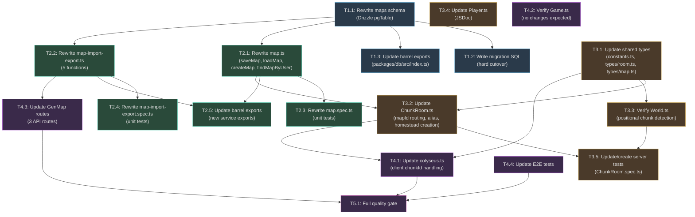

# Work Plan: Map Entity Model Refactor

Created Date: 2026-03-02
Type: refactor
Estimated Duration: 5 days
Estimated Impact: 21 files across 6 layers
Related Issue/PR: N/A

## Related Documents

- PRD: [docs/prd/prd-009-map-entity-model.md](../prd/prd-009-map-entity-model.md)
- ADR: [docs/adr/adr-006-map-entity-model.md](../adr/adr-006-map-entity-model.md)
- Design Doc: [docs/design/design-009-map-entity-model.md](../design/design-009-map-entity-model.md)

## Objective

Refactor the `maps` table from a user-keyed 1:1 extension (userId as PK) into an independent entity with its own UUID identity, a `map_type` discriminator, and an optional owner. Update all 21 consuming files across database services, game server, shared types, game client, and GenMap API to use `mapId`-based addressing and the unified `map:{mapId}` chunkId convention.

## Background

The current `maps` table uses `userId` as its primary key, limiting the system to one map per user, preventing city/open-world maps, and creating schema inconsistency with `editor_maps` and `map_templates` (which already use UUID PKs). This refactor gives maps first-class entity identity, enabling house interiors, city maps, and open-world chunks in the future. The implementation follows a horizontal slice (foundation-driven) approach per the Design Doc, building from the database layer upward.

## Risks and Countermeasures

| Risk | Impact | Probability | Countermeasure |
|------|--------|-------------|----------------|
| Data migration corrupts existing map data | High | Low | Wrap migration in single transaction with rollback. Verify row counts and sample data before/after. |
| 21-file refactor introduces subtle bugs in room join flow | High | Medium | Comprehensive unit tests per phase. Manual join flow testing after Phase 3. |
| ChunkId format change breaks client-server protocol | High | Low | Update client and server atomically in adjacent phases. Shared constants ensure both use same format. |
| Old `player:{userId}` chunkIds in saved positions cause routing failures | Medium | Low | FR-2b migrates all positions in Phase 1. Post-migration verification query confirms zero stale rows. |
| Import/export flows in GenMap break due to API contract change | Medium | Medium | Update GenMap API routes in Phase 4 and test with manual import/export cycle. |
| Concurrent first-login creates duplicate homesteads | Medium | Low | Check for existing homestead before creation in ChunkRoom. Consider advisory lock if race is observed. |
| `city:capital` alias resolution fails (no city map seeded) | Medium | Low | Document that city map must be seeded. Alias resolution returns clear error when no city map exists. |

---

## Phase Structure Diagram


## Task Dependency Diagram



---

## Phase 1: Foundation (Database) -- Estimated commits: 2

**Purpose**: Establish the new `maps` table schema, run the data migration, standardize `map_type` values, migrate `player_positions.chunkId`, and update barrel exports. This phase provides the database foundation that all subsequent phases depend on.

**Dependencies**: None (starting phase).

### Tasks

#### T1.1: Rewrite maps schema definition

- **Affected files**: `packages/db/src/schema/maps.ts`
- **What changes**: Replace the current `maps` table (userId as PK) with new schema using `id: uuid('id').defaultRandom().primaryKey()`, add `name`, `mapType`, `userId` (optional FK), `seed` (nullable), `metadata`, `createdAt`, `updatedAt`. Follow `editor-maps.ts` pattern exactly.
- **AC coverage**: AC-1.1 (column definitions), AC-1.2 (UUID PK + mapType), AC-1.3 (nullable userId)
- **Test requirements**: Typecheck passes (L3)
- **Complexity**: S

---

#### T1.2: Write and apply migration SQL

- **Affected files**: New migration file (Drizzle migration directory)
- **What changes**: Single-transaction migration containing 8 steps per Design Doc:
  1. Rename `maps` to `maps_old`
  2. Create new `maps` table with UUID PK schema
  3. Create indexes on `user_id` and `map_type`
  4. Migrate data from `maps_old` (generate UUIDs, set `map_type='homestead'`)
  5. Migrate `player_positions.chunkId` from `player:{userId}` to `map:{mapId}`
  6. Standardize `map_type` in sibling tables (`player_homestead` -> `homestead` in `editor_maps` and `map_templates`)
  7. Drop `maps_old`
  8. Reset orphaned `player_positions` rows with stale `player:` prefix to `city:capital`
- **AC coverage**: AC-2.1 (data migration), AC-2.2 (transaction rollback), AC-2b.1 (chunkId migration), AC-2b.2 (non-modified rows), AC-1a.1 (mapType standardization)
- **Test requirements**: Migration runs without error; post-migration verification query returns 0 rows for stale `player:` prefixes
- **Complexity**: L

---

#### T1.3: Update barrel exports for schema changes

- **Affected files**: `packages/db/src/index.ts`
- **What changes**: Update the `maps` schema export to reflect the new table definition. The `MapRecord` and `NewMapRecord` inferred types change shape (new columns: `id`, `name`, `mapType`, `metadata`, `createdAt`; `userId` becomes nullable). Remove any stale type exports tied to the old schema.
- **AC coverage**: Supports all phases (exports must be correct for downstream consumers)
- **Test requirements**: Typecheck passes (L3)
- **Complexity**: S

---

### Phase 1 Completion Criteria

- [ ] New `maps` schema compiles with `id` UUID PK, `map_type`, nullable `user_id`, `metadata`, `name`, `createdAt` columns
- [ ] Migration SQL runs in single transaction: old data migrated, `player_positions.chunkId` updated, `map_type` standardized
- [ ] Post-migration verification: `SELECT count(*) FROM player_positions WHERE chunk_id LIKE 'player:%'` returns 0
- [ ] Post-migration verification: `SELECT count(*) FROM editor_maps WHERE map_type = 'player_homestead'` returns 0
- [ ] Post-migration verification: `SELECT count(*) FROM map_templates WHERE map_type = 'player_homestead'` returns 0
- [ ] Row count before and after migration matches (no data loss)
- [ ] Barrel exports updated; `pnpm nx typecheck game` passes (or build-level check)

### Operational Verification Procedures

1. Run migration against development database
2. Execute post-migration verification queries:
   ```sql
   SELECT count(*) FROM maps WHERE id IS NOT NULL AND map_type = 'homestead';
   SELECT count(*) FROM player_positions WHERE chunk_id LIKE 'player:%';
   SELECT count(*) FROM editor_maps WHERE map_type = 'player_homestead';
   SELECT count(*) FROM map_templates WHERE map_type = 'player_homestead';
   ```
3. Spot-check 3 random map rows: verify UUID id, map_type='homestead', grid/layers/walkable data intact
4. Verify `player_positions` rows with former `player:{userId}` now show `map:{mapId}` where mapId exists in the new `maps` table

---

## Phase 2: Core Services (DB Functions + Tests) -- Estimated commits: 2

**Purpose**: Rewrite the database service functions to use `mapId`-based addressing and add new functions (`createMap`, `findMapByUser`, `listMapsByUser`, `listMapsByUserAndType`). Rewrite unit tests to cover all new signatures.

**Dependencies**: Phase 1 (schema must exist for service functions to reference it).

### Tasks

#### T2.1: Rewrite map.ts service functions

- **Affected files**: `packages/db/src/services/map.ts`
- **What changes**:
  - `saveMap(db, data)`: Change `SaveMapData.userId` to `SaveMapData.mapId`. Change `onConflictDoUpdate` target from `maps.userId` to `maps.id`. Make `seed` optional in `SaveMapData`.
  - `loadMap(db, mapId)`: Change parameter from `userId` to `mapId`. Query by `eq(maps.id, mapId)`. Return `LoadMapResult` with new fields (`id`, `name`, `mapType`, `userId`, `metadata`).
  - **New** `createMap(db, data)`: Insert with `CreateMapData` (name, mapType, userId, seed, width, height, grid, layers, walkable, metadata). Return the created `MapRecord` including generated UUID.
  - **New** `findMapByUser(db, userId, mapType?)`: Query by `eq(maps.userId, userId)` with optional `mapType` filter. Return `MapRecord[]`.
  - **New** `listMapsByUser(db, userId)`: List all maps for a user.
  - **New** `listMapsByUserAndType(db, userId, mapType)`: List maps filtered by user and type.
- **AC coverage**: AC-4.1 (loadMap by mapId), AC-4.2 (saveMap by mapId), AC-4.3 (listMapsByUser), FR-11 (query by user and type)
- **Test requirements**: Unit tests in T2.3
- **Complexity**: M

---

#### T2.2: Rewrite map-import-export.ts service functions

- **Affected files**: `packages/db/src/services/map-import-export.ts`
- **What changes**:
  - `listPlayerMaps(db)`: Update join to use `maps.userId` FK (not PK). Add `id`, `mapType` to returned fields.
  - `importPlayerMap(db, mapId)`: Change parameter from `userId` to `mapId`. Query maps by `eq(maps.id, mapId)`. Change hardcoded `'player_homestead'` to `'homestead'` when creating editor map.
  - `exportToPlayerMap(db, editorMapId, mapId)`: **Behavioral change** -- replace `onConflictDoUpdate` upsert on `maps.userId` with pure UPDATE on `maps.id`. Throw `Error('Target map not found: {mapId}')` if map does not exist. Throw `Error('Editor map not found: {editorMapId}')` if editor map missing.
  - `editPlayerMapDirect(db, mapId)`: Change parameter from `userId` to `mapId`. Query by `eq(maps.id, mapId)`.
  - `savePlayerMapDirect(db, data)`: Change `userId` to `mapId` in data parameter. Update WHERE on `maps.id`.
- **AC coverage**: AC-10.1 (list with mapId), AC-10.2 (import by mapId), AC-10.3 (export by mapId)
- **Test requirements**: Unit tests in T2.4
- **Complexity**: M

---

#### T2.3: Rewrite map.spec.ts unit tests

- **Affected files**: `packages/db/src/services/map.spec.ts`
- **What changes**: Rewrite all test cases to use mapId-based fixtures. Add tests for:
  - `saveMap`: Verify upsert on `maps.id` target
  - `loadMap(mapId)`: Returns map data for valid mapId; returns null for unknown
  - `createMap`: Verify insert with correct columns; returns created record with UUID
  - `findMapByUser(userId)`: Verify WHERE clause on `maps.userId` FK
  - `findMapByUser(userId, mapType)`: Verify both filters applied
  - `listMapsByUser`: Returns all maps for a user
  - `listMapsByUserAndType`: Returns filtered list
- **AC coverage**: AC-4.1, AC-4.2, AC-4.3, FR-11
- **Test requirements**: All tests pass; coverage 80%+ for `map.ts`
- **Complexity**: M

---

#### T2.4: Rewrite map-import-export.spec.ts unit tests

- **Affected files**: `packages/db/src/services/map-import-export.spec.ts`
- **What changes**: Rewrite all test cases to use mapId-based fixtures. Add tests for:
  - `listPlayerMaps`: Verify response includes `id`, `mapType` fields
  - `importPlayerMap(mapId)`: Verify query by mapId; editor map created with `'homestead'` type
  - `exportToPlayerMap(editorMapId, mapId)`: Verify UPDATE targets mapId; verify throws when mapId not found; verify throws when editorMapId not found
  - `editPlayerMapDirect(mapId)`: Verify query by mapId
  - `savePlayerMapDirect({mapId, ...})`: Verify update WHERE on mapId
- **AC coverage**: AC-10.1, AC-10.2, AC-10.3
- **Test requirements**: All tests pass; coverage 80%+ for `map-import-export.ts`
- **Complexity**: M

---

#### T2.5: Update barrel exports for new service exports

- **Affected files**: `packages/db/src/index.ts`
- **What changes**: Add new exports from `./services/map`:
  - `createMap`, `findMapByUser`, `listMapsByUser`, `listMapsByUserAndType`
  - `CreateMapData`, `MapType` type
  - Verify `SaveMapData`, `LoadMapResult` exports reflect updated interfaces
- **AC coverage**: Supports all downstream consumers
- **Test requirements**: Typecheck passes (L3)
- **Complexity**: S

---

### Phase 2 Completion Criteria

- [ ] All 7 service functions in `map.ts` compile and use mapId-based signatures
- [ ] All 5 functions in `map-import-export.ts` compile and use mapId-based signatures
- [ ] `exportToPlayerMap` uses pure UPDATE (not upsert); throws on missing map
- [ ] `importPlayerMap` uses `'homestead'` (not `'player_homestead'`)
- [x] All unit tests in `map.spec.ts` pass (80%+ coverage)
- [ ] All unit tests in `map-import-export.spec.ts` pass (80%+ coverage)
- [x] Barrel exports include all new functions and types
- [x] `pnpm nx test @nookstead/db` passes with zero failures

### Operational Verification Procedures

1. Run `pnpm nx test @nookstead/db` -- all tests pass
2. Run `pnpm nx typecheck @nookstead/db` -- no type errors
3. Verify `loadMap` returns `LoadMapResult` with `id`, `name`, `mapType`, `userId`, `metadata` fields
4. Verify `createMap` returns a record with auto-generated UUID `id`
5. Verify `exportToPlayerMap` throws when target mapId does not exist

---

## Phase 3: Server Integration (Shared Types + Server) -- Estimated commits: 2-3

**Purpose**: Update shared types and constants to reflect the new `map:{mapId}` / `world:{x}:{y}` convention, then update ChunkRoom to load maps by mapId, resolve the `city:capital` alias, and create homestead maps for new players. Verify World.ts positional chunk detection. Update server unit tests.

**Dependencies**: Phase 2 (service functions must have new signatures). Phase 1 (schema must exist).

### Tasks

#### T3.1: Update shared types and constants

- **Affected files**:
  - `packages/shared/src/constants.ts`
  - `packages/shared/src/types/room.ts`
  - `packages/shared/src/types/map.ts`
- **What changes**:
  - **constants.ts**: Replace `LocationType` enum values from `CITY`/`PLAYER`/`OPEN_WORLD` to `MAP`/`WORLD`. Add `MapType` type alias (`'homestead' | 'city' | 'open_world'`). Retain `DEFAULT_SPAWN` with `chunkId: 'city:capital'` unchanged. Update any chunkId-related constants referencing `player:` prefix.
  - **types/room.ts**: Update `PlayerState` and `Location` types to reflect the `map:`/`world:` chunkId conventions. Update JSDoc/comments referencing old prefixes.
  - **types/map.ts**: Optionally add `mapId` field to `MapDataPayload` if needed by downstream consumers.
- **AC coverage**: AC-7.1 (MapType importable), AC-7.2 (LocationType MAP/WORLD), AC-7.3 (DEFAULT_SPAWN unchanged)
- **Test requirements**: Typecheck passes (L3)
- **Complexity**: M

---

#### T3.2: Update ChunkRoom.ts

- **Affected files**: `apps/server/src/rooms/ChunkRoom.ts`
- **What changes**: This is the most complex single-file change. Key modifications in `onJoin`:
  1. **ChunkId parsing**: Parse incoming `chunkId` to determine routing:
     - `map:{uuid}` -- extract `mapId`, call `loadMap(db, mapId)`
     - `city:capital` -- resolve alias by querying `findMapByType('city', 'capital')` (or equivalent), get `mapId`, call `loadMap(db, mapId)`
     - `world:{x}:{y}` -- existing spatial logic (no change)
  2. **Returning player**: Load saved position, extract `mapId` from `map:{mapId}` chunkId, call `loadMap(db, mapId)`
  3. **No saved position fallback**: Instead of `player:${userId}`, look up user's homestead via `findMapByUser(db, userId, 'homestead')`
  4. **New player homestead creation**: Call `createMap(db, {...templateData, mapType: 'homestead', userId})` to get the new map with generated UUID. Then `loadMap(db, newMapId)` to get full data. Set `chunkId = 'map:${newMapId}'`.
  5. **Template query**: Change `getPublishedTemplates(db, 'player_homestead')` to `getPublishedTemplates(db, 'homestead')`
  6. **Map save on leave**: Call `saveMap(db, {mapId, ...})` instead of `saveMap(db, {userId, ...})`
  7. **Update all log messages**: Replace userId references with mapId where applicable
- **AC coverage**: AC-5.1 (map:{uuid} routing), AC-5.2 (city:capital alias), AC-5.3 (old convention removed), AC-3.1 (homestead creation), AC-3.2 (position references mapId), AC-6.1 (position persistence), AC-1a.2 (template query uses 'homestead')
- **Test requirements**: Unit tests in T3.5
- **Complexity**: L

---

#### T3.3: Verify and update World.ts

- **Affected files**: `apps/server/src/world/World.ts`
- **What changes**: Verify that `isPositionalChunk` already uses `startsWith('world:')` for spatial chunk detection. The `map:` prefix is automatically non-positional (no spatial transitions). Update any references to old `player:` prefix in comments or fallback logic. Update `LocationType` references from `CITY`/`PLAYER`/`OPEN_WORLD` to `MAP`/`WORLD`.
- **AC coverage**: AC-8.1 (map: is non-positional), AC-8.2 (world: triggers transitions)
- **Test requirements**: Verify existing World.ts tests still pass; add test for `map:` prefix non-positional behavior
- **Complexity**: S

---

#### T3.4: Update Player.ts model

- **Affected files**: `apps/server/src/models/Player.ts`
- **What changes**: Update JSDoc comments for `chunkId` field to document the `map:{mapId}` and `world:{x}:{y}` conventions. Update any `LocationType` references if the `ServerPlayer` interface references the enum. No functional logic change expected.
- **AC coverage**: Documentation accuracy
- **Test requirements**: Typecheck passes (L3)
- **Complexity**: S

---

#### T3.5: Update/create server unit tests

- **Affected files**: `apps/server/src/rooms/ChunkRoom.spec.ts`
- **What changes**: Update test fixtures and add test cases:
  - **New player join**: Verify homestead created with `createMap`, MAP_DATA sent with correct mapId-derived data
  - **Returning player join**: Verify position loaded, map loaded by mapId from `map:{mapId}` chunkId
  - **City alias resolution**: `city:capital` resolved to city map UUID, correct map loaded
  - **Map save on leave**: Verify `saveMap` called with `mapId` (not userId)
  - **Template query**: Verify `'homestead'` (not `'player_homestead'`) used
  - **World.ts verification**: Verify `map:` prefix is non-positional, `world:` triggers transitions
- **AC coverage**: AC-5.1, AC-5.2, AC-5.3, AC-3.1, AC-3.2, AC-6.1, AC-6.2, AC-8.1, AC-8.2
- **Test requirements**: All tests pass; coverage 80%+ for ChunkRoom join/leave flow
- **Complexity**: L

---

### Phase 3 Completion Criteria

- [ ] `LocationType` enum has `MAP` and `WORLD` values (not CITY/PLAYER/OPEN_WORLD)
- [ ] `MapType` type is importable from `@nookstead/shared`
- [ ] `DEFAULT_SPAWN` retains `chunkId: 'city:capital'`
- [x] ChunkRoom parses `map:{uuid}` chunkIds and loads maps by UUID
- [x] ChunkRoom resolves `city:capital` alias to actual city map UUID
- [x] ChunkRoom creates homestead maps for new players using `createMap` + template
- [x] ChunkRoom saves maps by `mapId` on leave (not `userId`)
- [x] ChunkRoom queries templates using `'homestead'` (not `'player_homestead'`)
- [ ] World.ts treats `map:` prefix as non-positional
- [ ] No references to `player:` chunkId prefix remain in server code
- [ ] `pnpm nx test @nookstead/server` passes with zero failures

### Operational Verification Procedures

(Copied from Design Doc Integration Points)

1. **Integration Point 1: New Player Join Flow**
   - Start dev server, authenticate as new user with no maps
   - Verify: homestead created, MAP_DATA received with valid map from template
   - Verify: `player_positions` row saved with `chunkId = 'map:{newMapId}'`

2. **Integration Point 2: Returning Player Join Flow**
   - Use a user with saved position (`map:{mapId}` format)
   - Verify: correct map loaded by UUID, MAP_DATA received

3. **Integration Point 3: City Alias Resolution**
   - Seed a city map in DB, join with `chunkId='city:capital'`
   - Verify: city map data received

4. **Integration Point 5: Position Persistence**
   - Join room, disconnect
   - Verify: `player_positions.chunkId` saved as `map:{mapId}`

---

## Phase 4: Client & GenMap -- Estimated commits: 2

**Purpose**: Update the game client's Colyseus service for the new chunkId format, update GenMap API routes for mapId-based addressing, and update E2E tests.

**Dependencies**: Phase 3 (server must be ready to serve rooms with new conventions).

### Tasks

#### T4.1: Update colyseus.ts client service

- **Affected files**: `apps/game/src/services/colyseus.ts`
- **What changes**: Update `joinChunkRoom` and `handleChunkTransition` to work with `map:{mapId}` and `world:{x}:{y}` chunkId formats. The client already works with opaque chunkId strings, so changes are minimal:
  - Remove any references to `player:` prefix in comments or logging
  - Update any `LocationType` references from `CITY`/`PLAYER` to `MAP`/`WORLD`
  - Verify `CHUNK_TRANSITION` handler passes the new chunkId format correctly
- **AC coverage**: AC-9.1 (client handles map:{mapId} transitions)
- **Test requirements**: Typecheck passes; manual test with server
- **Complexity**: S

---

#### T4.2: Verify Game.ts scene

- **Affected files**: `apps/game/src/game/scenes/Game.ts`
- **What changes**: Per Design Doc, Game.ts receives `MapDataPayload` unchanged and requires no functional changes. Verify this is the case. Update any comments referencing old chunkId conventions.
- **AC coverage**: Non-functional (verification only)
- **Test requirements**: Typecheck passes (L3)
- **Complexity**: S

---

#### T4.3: Update GenMap API routes

- **Affected files**:
  - `apps/genmap/.../player-maps/route.ts`
  - `apps/genmap/.../player-maps/import/route.ts`
  - `apps/genmap/.../editor-maps/[id]/export/route.ts`
- **What changes**:
  - **player-maps/route.ts (GET list)**: Update to return `id`, `mapType`, and optional `userId` in the response. The `listPlayerMaps` return shape already changed in Phase 2.
  - **player-maps/import/route.ts (POST import)**: Change request body from `{ userId }` to `{ mapId }`. Call `importPlayerMap(db, mapId)` instead of `importPlayerMap(db, userId)`.
  - **editor-maps/[id]/export/route.ts (POST export)**: Change `exportToPlayerMap(db, id, userId)` call to `exportToPlayerMap(db, id, mapId)`. Accept `mapId` from request body instead of `userId`.
- **AC coverage**: AC-10.1 (list with UUIDs), AC-10.2 (import by mapId), AC-10.3 (export by mapId)
- **Test requirements**: Manual API call test; typecheck passes
- **Complexity**: S

---

#### T4.4: Update E2E tests

- **Affected files**: `apps/game-e2e/` (test files)
- **What changes**: Update test fixtures and assertions for:
  - `map:{mapId}` chunkId format in room join flows
  - Verify MAP_DATA received after room join
  - Update any hardcoded `player:` chunkId references
- **AC coverage**: Supports all AC (E2E validation)
- **Test requirements**: `pnpm nx e2e game-e2e` passes
- **Complexity**: M

---

### Phase 4 Completion Criteria

- [ ] Client `colyseus.ts` handles `map:{mapId}` and `world:{x}:{y}` chunkIds
- [ ] No references to `player:` prefix remain in client code
- [ ] GenMap list endpoint returns maps with UUID `id` and `mapType`
- [ ] GenMap import endpoint accepts `mapId` parameter
- [ ] GenMap export endpoint calls `exportToPlayerMap` with mapId
- [x] E2E tests pass with new chunkId format
- [ ] `pnpm nx typecheck game` passes

### Operational Verification Procedures

(Copied from Design Doc Integration Points)

1. **Integration Point 4: GenMap Import/Export**
   - Call list endpoint: verify response includes `id`, `mapType`
   - Import a map by mapId into editor: verify editor map created
   - Export editor map to a player map by mapId: verify map data updated

2. **Full Join Flow (E2E)**
   - Client authenticates -> joins room -> receives MAP_DATA with valid map
   - Disconnect, reconnect -> routed to same map

---

## Phase 5: Quality Assurance -- Estimated commits: 1

**Purpose**: Comprehensive quality gate ensuring all acceptance criteria are met, all tests pass, and the refactor is complete across all 21 files.

### Tasks

- [ ] Verify all Design Doc acceptance criteria achieved (AC-1.1 through AC-10.3)
- [ ] Run full quality check: `pnpm nx run-many -t lint test build typecheck`
- [ ] Run E2E tests: `pnpm nx e2e game-e2e`
- [ ] Verify zero references to old patterns:
  - [ ] No `player:` chunkId prefix in application code (search codebase)
  - [ ] No `player_homestead` string in application code or DB data
  - [ ] No `LocationType.CITY`, `LocationType.PLAYER`, or `LocationType.OPEN_WORLD` references
  - [ ] No `maps.userId` as PK reference (only as FK)
- [ ] Verify 21 files updated (cross-reference with PRD affected files list)
- [ ] Coverage check: 80%+ for service functions

### Phase 5 Completion Criteria

- [ ] All AC from Design Doc verified (checklist above)
- [ ] `pnpm nx run-many -t lint test build typecheck` passes with zero errors
- [ ] E2E tests pass
- [ ] No stale references to old patterns remain
- [ ] All 21 affected files have been updated

### Operational Verification Procedures

(Full E2E verification from Design Doc)

1. **New Player Join Flow**: Client authenticates -> joins room -> homestead created from template -> MAP_DATA received
2. **Returning Player Join Flow**: Player with saved `map:{mapId}` position -> routed to correct map
3. **City Alias Resolution**: Join with `city:capital` -> city map data received
4. **GenMap Import/Export**: Import map by mapId -> edit -> export back to same mapId
5. **Position Persistence**: Join, disconnect -> `player_positions.chunkId` is `map:{mapId}` -> reconnect to same map
6. **World Movement**: Player in `map:` room -> no chunk transition on movement. Player in `world:` room -> chunk transition at boundary.

---

## Completion Criteria

- [ ] All 5 phases completed
- [ ] Each phase's operational verification procedures executed
- [ ] Design Doc acceptance criteria satisfied (AC-1.1 through AC-10.3)
- [ ] All quality checks pass (lint, test, build, typecheck) with zero errors
- [ ] All 21 files updated to use mapId-based model
- [ ] Zero references to old `player:` chunkId convention in application code
- [ ] Zero references to `player_homestead` in code or DB data
- [ ] E2E tests pass
- [ ] User review approval obtained

## Task Summary

| Task | Phase | Files | Complexity | AC Coverage |
|------|-------|-------|------------|-------------|
| T1.1: Rewrite maps schema | 1 | `schema/maps.ts` | S | AC-1.1, AC-1.2, AC-1.3 |
| T1.2: Write migration SQL | 1 | New migration file | L | AC-2.1, AC-2.2, AC-2b.1, AC-2b.2, AC-1a.1 |
| T1.3: Update barrel exports (schema) | 1 | `db/src/index.ts` | S | -- |
| T2.1: Rewrite map.ts services | 2 | `services/map.ts` | M | AC-4.1, AC-4.2, AC-4.3, FR-11 |
| T2.2: Rewrite map-import-export.ts | 2 | `services/map-import-export.ts` | M | AC-10.1, AC-10.2, AC-10.3 |
| T2.3: Rewrite map.spec.ts tests | 2 | `services/map.spec.ts` | M | AC-4.1, AC-4.2, AC-4.3 |
| T2.4: Rewrite map-import-export.spec.ts | 2 | `services/map-import-export.spec.ts` | M | AC-10.1, AC-10.2, AC-10.3 |
| T2.5: Update barrel exports (services) | 2 | `db/src/index.ts` | S | -- |
| T3.1: Update shared types | 3 | `constants.ts`, `types/room.ts`, `types/map.ts` | M | AC-7.1, AC-7.2, AC-7.3 |
| T3.2: Update ChunkRoom.ts | 3 | `rooms/ChunkRoom.ts` | L | AC-5.1, AC-5.2, AC-5.3, AC-3.1, AC-3.2, AC-6.1, AC-1a.2 |
| T3.3: Verify/update World.ts | 3 | `world/World.ts` | S | AC-8.1, AC-8.2 |
| T3.4: Update Player.ts model | 3 | `models/Player.ts` | S | -- |
| T3.5: Update server tests | 3 | `ChunkRoom.spec.ts` | L | AC-5.1, AC-5.2, AC-3.1, AC-6.1, AC-8.1, AC-8.2 |
| T4.1: Update colyseus.ts | 4 | `services/colyseus.ts` | S | AC-9.1 |
| T4.2: Verify Game.ts | 4 | `game/scenes/Game.ts` | S | -- |
| T4.3: Update GenMap routes | 4 | 3 route files | S | AC-10.1, AC-10.2, AC-10.3 |
| T4.4: Update E2E tests | 4 | `apps/game-e2e/` | M | E2E validation |
| T5.1: Full quality gate | 5 | All 21 files | M | All AC |

**Total tasks**: 18 (8 S-complexity, 7 M-complexity, 3 L-complexity)

## Progress Tracking

### Phase 1: Foundation (Database)
- Start: 2026-03-02
- Complete:
- Notes:
  - T1.1: [x] Schema rewrite complete (`packages/db/src/schema/maps.ts`)
  - T1.2: [x] Migration file generated and edited (`packages/db/src/migrations/0011_hot_red_shift.sql`) — pending DB execution
  - T1.3: In progress

### Phase 2: Core Services
- Start: 2026-03-02
- Complete:
- Notes:
  - T2.3: [x] Rewrite map.spec.ts unit tests complete (15 tests, 100% coverage on map.ts)

### Phase 3: Server Integration
- Start: 2026-03-02
- Complete:
- Notes:
  - T3.1: [x] Shared types updated: LocationType MAP/WORLD, MapType added, MapDataPayload.mapId added, JSDoc updated. Typecheck passes.

### Phase 4: Client & GenMap
- Start:
- Complete:
- Notes:

### Phase 5: Quality Assurance
- Start:
- Complete:
- Notes:

## Notes

- **Implementation approach**: Horizontal slice (foundation-driven) per Design Doc. Each phase builds on the one before it.
- **Migration strategy**: Hard cutover in single transaction. No dual-write. Appropriate for early-stage project with no production users.
- **ChunkRoom is the most complex change** (T3.2, complexity L). It touches map loading, homestead creation, alias resolution, position persistence, and template querying. Allow extra review time for this task.
- **city:capital alias**: Requires a city map to be seeded in the database. If no city map exists, the alias resolution will throw a clear error. Consider implementing FR-13 (city map seeding) as a follow-up.
- **No room architecture changes**: ChunkRoom stays as the single room type for all map types. This refactor is a data model change, not a room architecture overhaul.
