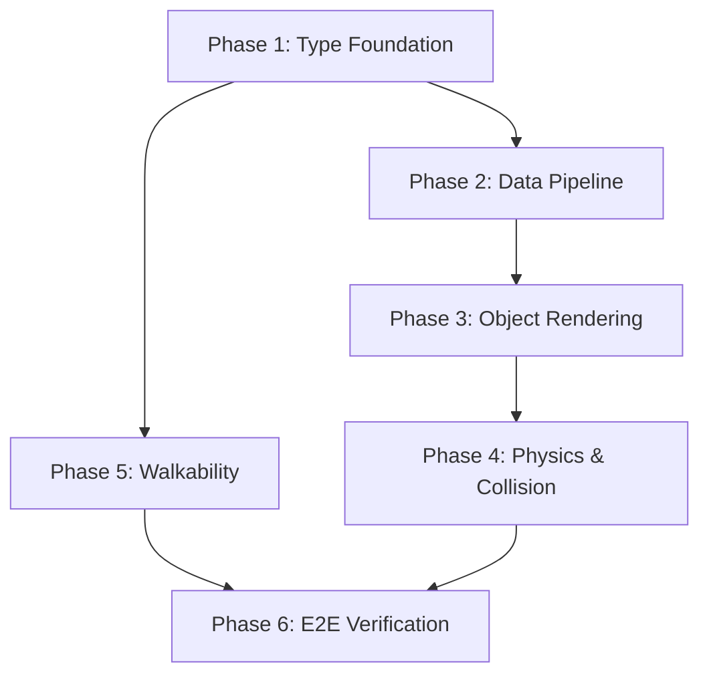
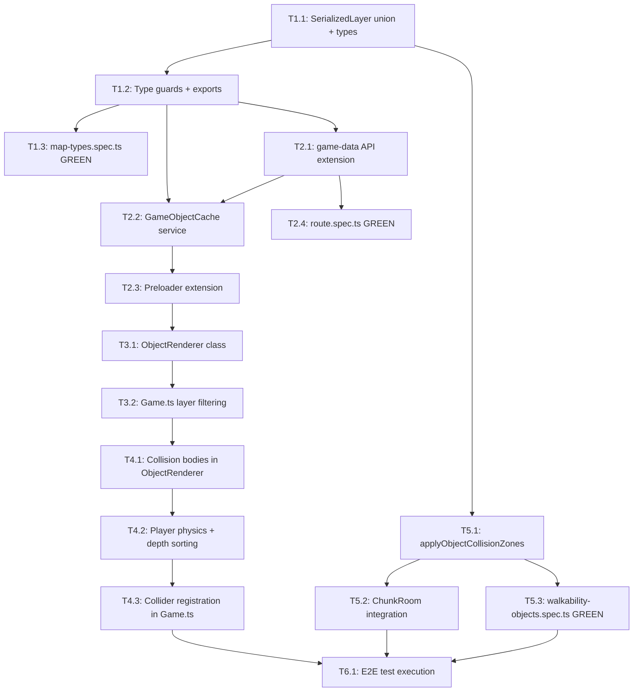

# Work Plan: Game Object Client Rendering Implementation

Created Date: 2026-03-01
Type: feature
Estimated Duration: 3-5 days
Estimated Impact: 12 files (7 modified, 5 new)
Related Issue/PR: N/A

## Related Documents
- Design Doc: [docs/design/design-011-game-object-client-rendering.md](../design/design-011-game-object-client-rendering.md)
- ADR: [docs/adr/ADR-0008-object-editor-collision-zones-and-metadata.md](../adr/ADR-0008-object-editor-collision-zones-and-metadata.md)
- ADR: [docs/adr/ADR-0007-sprite-management-storage-and-schema.md](../adr/ADR-0007-sprite-management-storage-and-schema.md)

## Objective

Enable rendering of game objects (trees, buildings, furniture, etc.) placed on maps in the genmap editor so they become visible to players in the Phaser game client. This includes the full pipeline: shared type definitions, API data delivery, asset loading, multi-layer sprite rendering, physics collision bodies, and server-side walkability grid updates.

## Background

Map designers place game objects on maps using the genmap editor. These objects are saved in the map template's `layers` JSONB array and are transmitted to the game client via the `MAP_DATA` WebSocket message. However, the client currently skips all non-tile layers silently (`MapRenderer` line 42: `if (!layerData.frames) continue`). As a result, players see terrain but no objects.

The full pipeline has six gaps: (1) no type discriminator on `SerializedLayer`, (2) no object definition resolution via API, (3) no spritesheet loading for objects, (4) no object rendering code, (5) no physics bodies from collision zones, and (6) incomplete walkability computation that ignores object collision zones.

## Testing Strategy

**Approach**: Strategy A (TDD) -- test skeletons are provided. Integration tests are implemented alongside their corresponding implementation tasks. E2E tests run after all implementation is complete.

### Test Skeleton Files

| File | Type | Category | Dependency | Complexity | Cases |
|------|------|----------|------------|------------|-------|
| `packages/shared/src/__tests__/map-types.spec.ts` | Integration | core-functionality | `@nookstead/shared` | low | 6 |
| `apps/game/src/app/api/game-data/__tests__/route.spec.ts` | Integration | integration | `@nookstead/db`, `@nookstead/s3` | medium | 4 |
| `packages/map-lib/src/core/walkability-objects.integration.spec.ts` | Integration | core-functionality | walkability module | medium | 7 |
| `apps/game-e2e/src/game-objects.spec.ts` | E2E | e2e | full-system | high | 1 |

### Cumulative Test Resolution Progress

| Phase | New GREEN | Cumulative GREEN | Total |
|-------|-----------|-----------------|-------|
| Phase 1 | 6 | 6 | 18 |
| Phase 2 | 4 | 10 | 18 |
| Phase 3 | 0 | 10 | 18 |
| Phase 4 | 0 | 10 | 18 |
| Phase 5 | 7 | 17 | 18 |
| Phase 6 | 1 | 18 | 18 |

## Risks and Countermeasures

### Technical Risks

- **Risk**: Large number of Phaser game objects (containers + child sprites + physics bodies) degrades FPS on maps with many placed objects
  - **Impact**: High -- core gameplay experience degraded
  - **Countermeasure**: Profile early with 50+ objects at 2x zoom. If FPS drops below 60, consider object culling (only render objects within viewport + margin), or RenderTexture batching for distant objects
  - **Detection**: Manual FPS check in Phase 3; formal performance test in Phase 6

- **Risk**: Breaking `MapDataPayload` backward compatibility causes crashes for clients not yet updated
  - **Impact**: High -- existing clients crash
  - **Countermeasure**: Discriminated union is additive; `isTileLayer()` handles legacy layers without `type` field. No breaking change to `MapDataPayload` structure
  - **Detection**: Type guard tests in Phase 1 verify backward compatibility

- **Risk**: Player physics body interferes with existing tile-based movement system
  - **Impact**: Medium -- player movement breaks
  - **Countermeasure**: Enable physics body as non-immovable; test movement system thoroughly. Walkability grid remains primary blocker; physics is secondary enforcement
  - **Detection**: Manual movement testing in Phase 4

- **Risk**: Sprite loading from S3 presigned URLs adds latency to game start
  - **Impact**: Medium -- delayed game loading
  - **Countermeasure**: Object sprites load in parallel with tileset sprites in Preloader; progress bar already shown. Failed sprite loads log warning and skip (graceful degradation)
  - **Detection**: Loading time measurement in Phase 2

### Schedule Risks

- **Risk**: Shared types in `packages/shared` may not have a jest config for running `map-types.spec.ts`
  - **Impact**: Low -- test file location may need adjustment
  - **Countermeasure**: Add jest config to `packages/shared/`, or move tests to `packages/map-lib/` which already has jest configured
  - **Detection**: Immediate in Phase 1 when running tests

## Implementation Phases

### Phase Structure Diagram

### Task Dependency Diagram

---

### Phase 1: Type Foundation (Estimated commits: 2)

**Purpose**: Define the discriminated union for `SerializedLayer` and all shared type definitions needed by every downstream component. Verify backward compatibility with integration tests.

**Depends on**: None (foundation phase)

**AC coverage**: AC-1.1, AC-1.2, AC-1.3

#### Tasks

- [x] **T1.1**: Add discriminated union and new types to `packages/shared/src/types/map.ts`
  - **Description**: Add `SerializedTileLayer`, `SerializedObjectLayer`, `SerializedPlacedObject` interfaces. Change `SerializedLayer` from a single interface to a discriminated union (`SerializedTileLayer | SerializedObjectLayer`). Add `GameObjectDefinition`, `GameObjectLayerDef`, `CollisionZoneDef`, `SpriteMeta`, `AtlasFrameMeta` types.
  - **Files to modify**: `packages/shared/src/types/map.ts`
  - **Dependencies**: None
  - **Acceptance criteria**:
    - `SerializedLayer` is a discriminated union with `type: 'tile' | 'object'` (AC-1.1)
    - `SerializedTileLayer` has `type: 'tile'`, `name`, `terrainKey`, `frames`, optional `tilesetKeys`
    - `SerializedObjectLayer` has `type: 'object'`, `name`, `objects: SerializedPlacedObject[]`
    - `SerializedPlacedObject` has `id`, `objectId`, `objectName`, `gridX`, `gridY`, `rotation`, `flipX`, `flipY`
    - `GameObjectDefinition` has `id`, `name`, `layers: GameObjectLayerDef[]`, `collisionZones: CollisionZoneDef[]`
    - All types compile without errors
  - **Complexity**: S

- [x] **T1.2**: Add `isTileLayer()` and `isObjectLayer()` type guards and export all new types
  - **Description**: Implement type guard functions that handle both new discriminated union values and legacy layers without a `type` field. Legacy layers (no `type` field) are treated as tile layers for backward compatibility (AC-1.3). Export all new types and functions from `packages/shared/src/index.ts`.
  - **Files to modify**: `packages/shared/src/types/map.ts`, `packages/shared/src/index.ts`
  - **Dependencies**: T1.1
  - **Acceptance criteria**:
    - `isTileLayer()` returns `true` for `{ type: 'tile' }` and for layers without `type` field
    - `isObjectLayer()` returns `true` for `{ type: 'object' }` and `false` for legacy layers
    - Both functions are exported from `@nookstead/shared`
    - `pnpm nx typecheck shared` passes (if target exists) or `pnpm nx typecheck game` passes with the new imports
  - **Complexity**: S

- [ ] **T1.3**: Implement integration tests in `map-types.spec.ts` -- make all 6 tests GREEN
  - **Description**: Implement the 6 test skeletons in `packages/shared/src/__tests__/map-types.spec.ts`. Ensure jest config exists for the shared package (add one if needed, or relocate tests). Tests cover `isTileLayer()` with explicit tile, legacy (no type field), and object layer inputs; `isObjectLayer()` with object, tile, and legacy inputs.
  - **Files to modify**: `packages/shared/src/__tests__/map-types.spec.ts` (implement test bodies). Possibly add `packages/shared/jest.config.ts` if none exists.
  - **Dependencies**: T1.2
  - **Acceptance criteria**:
    - All 6 tests in `map-types.spec.ts` pass (GREEN)
    - Test resolution: 0/6 -> 6/6
  - **Complexity**: S

#### Phase Completion Criteria
- [x] `SerializedLayer` discriminated union compiles (AC-1.1)
- [x] Type guards handle legacy layers (AC-1.3)
- [x] All new types exported from `@nookstead/shared`
- [ ] 6/6 `map-types.spec.ts` tests GREEN
- [ ] `pnpm nx typecheck game` and `pnpm nx typecheck map-lib` pass

#### Operational Verification Procedures
1. Run `pnpm nx typecheck game` -- must pass without errors
2. Run tests for shared package (or map-lib if tests were relocated) -- all 6 tests pass
3. Verify type guard behavior manually: import `isTileLayer` in a scratch file, test with `{ name: 'test', terrainKey: 'grass', frames: [] }` (no type field) -- should return `true`

---

### Phase 2: Data Pipeline (Estimated commits: 3)

**Purpose**: Extend the `game-data` API to return game object definitions, sprite metadata, and atlas frame data. Create the `GameObjectCache` client-side service. Extend the Preloader to load object sprite images and define frame regions.

**Depends on**: Phase 1 (shared types must exist)

**AC coverage**: AC-2.1, AC-2.2, AC-2.3, AC-3.1, AC-3.2

#### Tasks

- [ ] **T2.1**: Extend `game-data` API route to include game objects, sprites, and atlas frames
  - **Description**: Modify the existing `GET /api/game-data` route handler to fetch all game objects from the database via `listGameObjects()`. For each game object, resolve referenced sprite IDs to `SpriteMeta` (with presigned S3 URLs) and frame IDs to `AtlasFrameMeta`. Return `gameObjects`, `sprites`, and `atlasFrames` maps alongside existing `materials` and `tilesets`.
  - **Files to modify**: `apps/game/src/app/api/game-data/route.ts`
  - **Dependencies**: T1.2 (shared types for `GameObjectDefinition`, `SpriteMeta`, `AtlasFrameMeta`)
  - **Acceptance criteria**:
    - Response includes `gameObjects` map keyed by objectId (AC-2.1)
    - Response includes `sprites` map keyed by spriteId with presigned S3 URLs (AC-2.2)
    - Response includes `atlasFrames` map keyed by frameId with frame coordinates (AC-2.3)
    - Every `spriteId` in `gameObjects[x].layers` exists as a key in `sprites`
    - Every `frameId` in `gameObjects[x].layers` exists as a key in `atlasFrames`
    - Existing `materials` and `tilesets` fields are unchanged
    - HTTP 500 returned on database failure
  - **Complexity**: M

- [ ] **T2.2**: Create `GameObjectCache` service
  - **Description**: Create a simple cache class that stores the maps from the game-data API response: `gameObjects` (objectId -> `GameObjectDefinition`), `sprites` (spriteId -> `SpriteMeta`), `atlasFrames` (frameId -> `AtlasFrameMeta`). Provide typed getters: `getObjectDefinition(objectId)`, `getSpriteUrl(spriteId)`, `getFrameData(frameId)`. The cache is populated once during Preloader and consumed by ObjectRenderer.
  - **Files to create**: `apps/game/src/game/services/game-object-cache.ts`
  - **Dependencies**: T1.2 (shared types)
  - **Acceptance criteria**:
    - `getObjectDefinition(objectId)` returns the definition or `undefined`
    - `getSpriteUrl(spriteId)` returns the presigned URL string or `undefined`
    - `getFrameData(frameId)` returns `AtlasFrameMeta` or `undefined`
    - Cache is populated from the API response shape
  - **Complexity**: S

- [ ] **T2.3**: Extend Preloader to load object sprites and define frame regions
  - **Description**: After the existing `fetchGameData()` call in `Preloader.create()`, populate the `GameObjectCache` with the response data. Identify all unique sprite IDs from the response. Load each object sprite as a Phaser image via `this.load.image(spriteId, s3Url)`. After images load, define named frame regions on each texture via `texture.add(frameId, 0, frameX, frameY, frameW, frameH)`. Handle sprite load failures gracefully: log a warning and continue (AC-3.2).
  - **Files to modify**: `apps/game/src/game/scenes/Preloader.ts`
  - **Dependencies**: T2.1 (API returns object data), T2.2 (GameObjectCache exists)
  - **Acceptance criteria**:
    - All unique sprite images are loaded as Phaser images (AC-3.1)
    - Frame regions are defined on each loaded texture (AC-3.1)
    - `GameObjectCache` is populated and accessible to subsequent scenes
    - Failed sprite loads log a warning and do not crash (AC-3.2)
    - Existing tileset and character loading is unchanged
  - **Complexity**: M

- [ ] **T2.4**: Implement integration tests in `route.spec.ts` -- make all 4 tests GREEN
  - **Description**: Implement the 4 test skeletons in `apps/game/src/app/api/game-data/__tests__/route.spec.ts`. Mock `@nookstead/db` (`listGameObjects`, `getSprite`, etc.) and `@nookstead/s3` (`generatePresignedGetUrl`). Verify response includes `gameObjects`, `sprites`, `atlasFrames` with correct structure. Verify HTTP 500 on database failure.
  - **Files to modify**: `apps/game/src/app/api/game-data/__tests__/route.spec.ts` (implement test bodies)
  - **Dependencies**: T2.1 (API implementation)
  - **Acceptance criteria**:
    - All 4 tests in `route.spec.ts` pass (GREEN)
    - Test resolution: 0/4 -> 4/4
    - Cumulative: 10/18
  - **Complexity**: M

#### Phase Completion Criteria
- [ ] `GET /api/game-data` returns `gameObjects`, `sprites`, `atlasFrames` (AC-2.1, AC-2.2, AC-2.3)
- [ ] `GameObjectCache` service created and functional
- [ ] Preloader loads object sprites and defines frame regions (AC-3.1)
- [ ] Sprite load failures handled gracefully (AC-3.2)
- [ ] 4/4 `route.spec.ts` tests GREEN
- [ ] `pnpm nx typecheck game` passes

#### Operational Verification Procedures
1. Start the dev server: `pnpm nx dev game`
2. Navigate to `http://localhost:3000/api/game-data` in browser
3. Verify JSON response contains `gameObjects`, `sprites`, `atlasFrames` keys
4. Verify `sprites` entries have `s3Url` starting with `https://`
5. Run `pnpm nx test game --testFile=src/app/api/game-data/__tests__/route.spec.ts` -- all 4 tests pass

---

### Phase 3: Object Rendering (Estimated commits: 2)

**Purpose**: Create the `ObjectRenderer` class that renders placed game objects as Phaser Containers with child sprites. Update `Game.ts` to filter layers by type and use ObjectRenderer for object layers.

**Depends on**: Phase 2 (sprite textures must be loaded and cache populated)

**AC coverage**: AC-4.1, AC-4.2, AC-4.3, AC-4.4, AC-4.5

#### Tasks

- [ ] **T3.1**: Create `ObjectRenderer` class
  - **Description**: Create a new `ObjectRenderer` class in `apps/game/src/game/objects/ObjectRenderer.ts`. The constructor takes `scene`, `objectLayers: SerializedObjectLayer[]`, `cache: GameObjectCache`, and `tileSize: number`. For each `SerializedPlacedObject` in each object layer:
    1. Look up the `GameObjectDefinition` from the cache by `objectId`
    2. Skip objects whose definitions are not found (log warning)
    3. Create a `Phaser.GameObjects.Container` positioned at `(gridX * tileSize, gridY * tileSize)`
    4. For each `GameObjectLayerDef` (sorted by `layerOrder` ascending), create a child `Phaser.GameObjects.Sprite` at `(xOffset, yOffset)` using `spriteId` as the texture key and `frameId` as the frame name
    5. Skip sprites whose textures are not loaded (log warning)
    6. Apply `flipX` to the container if `PlacedObject.flipX` is true
    7. Apply `rotation` to the container if non-zero
    8. Set container depth to `gridY * tileSize + tileSize` (y-sorted depth)
    9. Provide a `destroy()` method for cleanup
  - **Files to create**: `apps/game/src/game/objects/ObjectRenderer.ts`
  - **Dependencies**: T2.2 (GameObjectCache), T2.3 (sprites loaded)
  - **Acceptance criteria**:
    - Each placed object renders as a Container at `(gridX * TILE_SIZE, gridY * TILE_SIZE)` (AC-4.1)
    - Child sprites are ordered by `layerOrder` (AC-4.2)
    - `flipX: true` flips the container horizontally (AC-4.3)
    - Non-zero `rotation` rotates the container (AC-4.4)
    - Container depth is y-sorted: `gridY * tileSize + tileSize` (AC-4.5)
    - Missing definitions/textures log warnings but do not crash
  - **Complexity**: L

- [ ] **T3.2**: Update `Game.ts` to filter layers and use ObjectRenderer
  - **Description**: Modify `apps/game/src/game/scenes/Game.ts` to:
    1. Remove the `as unknown as GeneratedMap` cast
    2. Store raw `MapDataPayload` in `init()`
    3. In `create()`, filter `mapData.layers` using `isTileLayer()` and `isObjectLayer()` type guards
    4. Build a `GeneratedMap`-compatible structure from tile layers for `MapRenderer.render()`
    5. Create `ObjectRenderer` with the object layers and `GameObjectCache`
  - **Files to modify**: `apps/game/src/game/scenes/Game.ts`
  - **Dependencies**: T3.1 (ObjectRenderer exists), T1.2 (type guards)
  - **Acceptance criteria**:
    - Tile layers render via MapRenderer (unchanged behavior)
    - Object layers render via ObjectRenderer (new behavior)
    - No `as unknown as GeneratedMap` cast
    - Empty object layers produce no ObjectRenderer errors
  - **Complexity**: M

#### Phase Completion Criteria
- [ ] Objects render visually at correct grid positions (AC-4.1)
- [ ] Layer ordering within objects is correct (AC-4.2)
- [ ] `flipX` and `rotation` applied to rendered objects (AC-4.3, AC-4.4)
- [ ] Objects use y-sorted depth (AC-4.5)
- [ ] Game scene does not crash with zero or many object layers
- [ ] `pnpm nx typecheck game` passes

#### Operational Verification Procedures
1. Start the dev server with a map template containing placed objects
2. Load the game in browser -- objects should be visible on the map
3. Verify objects appear at correct grid positions (compare with genmap editor placement)
4. Verify objects render with correct layer ordering (multi-layer objects look correct)
5. Check browser console for any warning logs about missing definitions/textures
6. Verify FPS counter shows 60 FPS (browser DevTools Performance panel)

---

### Phase 4: Physics & Collision (Estimated commits: 2)

**Purpose**: Add invisible static physics bodies for collision zones, enable Arcade Physics on the player, register the collider between player and collision group, and implement y-sorted player depth.

**Depends on**: Phase 3 (ObjectRenderer must exist to add collision bodies)

**AC coverage**: AC-4.6, AC-5.1, AC-5.2, AC-5.3

#### Tasks

- [x] **T4.1**: Add collision body creation to `ObjectRenderer`
  - **Description**: Extend `ObjectRenderer` to create a `Phaser.Physics.Arcade.StaticGroup` during construction. For each placed object, iterate its `collisionZones`. For zones with `type: 'collision'`, create an invisible static physics body positioned at `(objectPixelX + zone.x + zone.width/2, objectPixelY + zone.y + zone.height/2)` with size `(zone.width, zone.height)`. Skip zones with `type: 'walkable'` (they do not create physics bodies). Expose `getCollisionGroup()` method to return the StaticGroup.
  - **Files to modify**: `apps/game/src/game/objects/ObjectRenderer.ts`
  - **Dependencies**: T3.1 (ObjectRenderer base)
  - **Acceptance criteria**:
    - Each `type: 'collision'` zone creates an invisible static body at correct position (AC-5.1)
    - `type: 'walkable'` zones do NOT create physics bodies (AC-5.3)
    - `getCollisionGroup()` returns the StaticGroup
    - Static bodies are correctly sized per zone `width` and `height`
  - **Complexity**: M

- [x] **T4.2**: Update Player with physics body and y-sorted depth
  - **Description**: Modify `apps/game/src/game/entities/Player.ts` to:
    1. Replace the static `this.setDepth(2)` in the constructor
    2. Add `this.setDepth(this.y)` in `preUpdate()` after `super.preUpdate()` (AC-4.6)
    3. Ensure the player has an Arcade Physics body (either via `scene.physics.add.existing(player)` in Game.ts or by configuration)
  - **Files to modify**: `apps/game/src/game/entities/Player.ts`
  - **Dependencies**: None (can be done in parallel with T4.1)
  - **Acceptance criteria**:
    - Player depth updates every frame to `this.y` (AC-4.6)
    - Player has a physics body suitable for collider registration
    - Existing movement system still works correctly
  - **Complexity**: S

- [x] **T4.3**: Register collider between player and collision group in `Game.ts`
  - **Description**: In `Game.ts create()`, after creating ObjectRenderer and Player:
    1. Enable Arcade Physics on the player if not already enabled: `this.physics.add.existing(this.player)`
    2. Register the collider: `this.physics.add.collider(this.player, this.objectRenderer.getCollisionGroup())`
    3. Ensure the physics world is configured for Arcade Physics (check `apps/game/src/game/config.ts` or equivalent)
  - **Files to modify**: `apps/game/src/game/scenes/Game.ts`
  - **Dependencies**: T4.1 (collision group), T4.2 (player physics body)
  - **Acceptance criteria**:
    - Player sprite collides with collision-type static bodies (AC-5.2)
    - Player movement is blocked at collision zone boundaries
    - Player can walk through areas without collision zones
  - **Complexity**: S

#### Phase Completion Criteria
- [x] Collision zones create invisible static physics bodies (AC-5.1)
- [x] Player collides with collision bodies (AC-5.2)
- [x] Walkable zones do not create physics bodies (AC-5.3)
- [x] Player depth is y-sorted per frame (AC-4.6)
- [x] Existing movement system still functions correctly
- [x] `pnpm nx typecheck game` passes

#### Operational Verification Procedures
1. Start the dev server with a map containing objects with collision zones
2. Move the player toward an object's collision zone -- player should be blocked
3. Move the player toward an object's walkable zone (if any) -- player should pass through
4. Walk the player behind an object (lower y) -- player should render behind the object
5. Walk the player in front of an object (higher y) -- player should render in front
6. Verify no physics errors in browser console
7. Verify player movement speed and feel is unchanged from before

---

### Phase 5: Walkability (Estimated commits: 2)

**Purpose**: Add `applyObjectCollisionZones()` to the walkability module so the server-computed walkability grid accounts for object collision and walkable zones. Update ChunkRoom to recompute walkability with object data on every join.

**Depends on**: Phase 1 (shared types for `CollisionZoneDef`). Independent of Phases 2-4 (client-side changes).

**AC coverage**: AC-7.1, AC-7.2, AC-7.3

#### Tasks

- [ ] **T5.1**: Implement `applyObjectCollisionZones()` in walkability module
  - **Description**: Add a new exported function `applyObjectCollisionZones(walkable, placedObjects, objectDefinitions, tileSize)` to `packages/map-lib/src/core/walkability.ts`. The function:
    1. Iterates all placed objects across all object layers
    2. Looks up each object's definition by `objectId` in `objectDefinitions` (skip if not found)
    3. First pass: for each `type: 'collision'` zone, compute the tile cells covered by the zone's pixel footprint relative to the object's grid position, and set those cells to `false` in the walkable grid
    4. Second pass: for each `type: 'walkable'` zone, compute the tile cells covered and set those cells to `true` (overriding collision)
    5. Clamp all tile coordinates to valid grid bounds (no out-of-bounds array access)

    Pixel-to-tile conversion:
    - Zone starts at pixel `objectGridX * tileSize + zone.x`
    - Zone ends at pixel `objectGridX * tileSize + zone.x + zone.width`
    - Tile start: `Math.floor(pixelStart / tileSize)`
    - Tile end: `Math.ceil(pixelEnd / tileSize)`

    Export updated types from `packages/map-lib/src/index.ts`.
  - **Files to modify**: `packages/map-lib/src/core/walkability.ts`, `packages/map-lib/src/index.ts`
  - **Dependencies**: T1.1 (CollisionZoneDef type)
  - **Acceptance criteria**:
    - Collision zones mark overlapping tile cells as non-walkable (AC-7.1)
    - Walkable zones mark overlapping tile cells as walkable, overriding terrain and collision (AC-7.2)
    - Walkable zones applied after collision zones (AC-7.3)
    - Out-of-bounds zones are clamped without errors
    - Objects with missing definitions are skipped
    - Grid dimensions unchanged after function call
  - **Complexity**: M

- [ ] **T5.2**: Update ChunkRoom to recompute walkability with object collision zones
  - **Description**: Modify `apps/server/src/rooms/ChunkRoom.ts` `onJoin()` to:
    1. After loading the map (saved or template), extract all `objectId` values from object layers in the map's `layers` array
    2. Batch-fetch current `game_objects` from the database for those object IDs
    3. After calling `recomputeWalkability()` for terrain, call `applyObjectCollisionZones()` with the placed objects and fetched definitions
    4. This applies to BOTH new players (template) and returning players (saved map) -- always recompute, never trust cached `walkable` grid
    5. For returning players: fire-and-forget update of saved `walkable` grid in DB if changed
  - **Files to modify**: `apps/server/src/rooms/ChunkRoom.ts`
  - **Dependencies**: T5.1 (applyObjectCollisionZones function)
  - **Acceptance criteria**:
    - Walkable grid sent in MAP_DATA includes object collision zone data
    - Walkability is always recomputed from scratch (terrain + objects)
    - Stale saved walkable grids are overwritten
    - Objects with unknown objectIds are skipped
  - **Complexity**: M

- [ ] **T5.3**: Implement integration tests in `walkability-objects.integration.spec.ts` -- make all 7 tests GREEN
  - **Description**: Implement the 7 test skeletons in `packages/map-lib/src/core/walkability-objects.integration.spec.ts`. Tests cover: collision zone marking cells non-walkable, walkable zone overriding terrain, walkable-after-collision ordering, pixel-to-tile coordinate mapping, out-of-bounds clamping, multiple overlapping objects, and missing object definitions.
  - **Files to modify**: `packages/map-lib/src/core/walkability-objects.integration.spec.ts` (implement test bodies)
  - **Dependencies**: T5.1 (function implementation)
  - **Acceptance criteria**:
    - All 7 tests pass (GREEN)
    - Test resolution: 0/7 -> 7/7
    - Cumulative: 17/18
  - **Complexity**: M

#### Phase Completion Criteria
- [ ] `applyObjectCollisionZones()` correctly modifies walkable grid (AC-7.1, AC-7.2, AC-7.3)
- [ ] ChunkRoom recomputes walkability with object data on every join
- [ ] 7/7 `walkability-objects.integration.spec.ts` tests GREEN
- [ ] `pnpm nx test map-lib` passes
- [ ] `pnpm nx typecheck map-lib` passes

#### Operational Verification Procedures
1. Run `pnpm nx test map-lib` -- all walkability tests pass including the 7 new ones
2. Start game server and client with a map containing objects with collision zones
3. Join the game -- verify player cannot walk into collision zones (server-computed walkable grid blocks movement)
4. Verify ChunkRoom log: `Walkability updated with N object collision zones`
5. Rejoin the game -- verify walkability is recomputed (not stale)

---

### Phase 6: E2E Verification and Quality Assurance (Estimated commits: 1)

**Purpose**: Execute end-to-end tests to verify the full pipeline works from server data transmission through client rendering and physics. Verify all acceptance criteria, run quality checks, measure performance.

**Depends on**: All previous phases (Phases 1-5 must be complete)

**AC coverage**: All ACs (verification)

#### Tasks

- [ ] **T6.1**: Execute E2E test from `game-objects.spec.ts`
  - **Description**: Run the Playwright E2E test in `apps/game-e2e/src/game-objects.spec.ts`. Prerequisites: game server running on port 2567, Next.js client on port 3000, database seeded with at least one map template containing object layers, at least one `game_object` with collision zones, S3 accessible. The test verifies: game objects render at correct positions, collision zones block player movement, walkable zones allow passage.
  - **Files to execute**: `apps/game-e2e/src/game-objects.spec.ts`
  - **Dependencies**: All previous phases complete
  - **Acceptance criteria**:
    - E2E test passes (GREEN)
    - Test resolution: 0/1 -> 1/1
    - Cumulative: 18/18
  - **Complexity**: L (environment setup complexity)

- [ ] **T6.2**: Verify all Design Doc acceptance criteria
  - **Description**: Walk through each AC and verify it is met:
    - AC-1.1: SerializedLayer discriminated union
    - AC-1.2: Object layers in MapDataPayload
    - AC-1.3: Legacy layer backward compatibility
    - AC-2.1, AC-2.2, AC-2.3: game-data API response shape
    - AC-3.1, AC-3.2: Sprite loading and error handling
    - AC-4.1 through AC-4.6: Rendering position, layer order, flip, rotation, depth sorting
    - AC-5.1, AC-5.2, AC-5.3: Physics bodies and collisions
    - AC-7.1, AC-7.2, AC-7.3: Walkability grid
  - **Dependencies**: T6.1
  - **Acceptance criteria**: All ACs checked off
  - **Complexity**: S

- [ ] **T6.3**: Run quality checks
  - **Description**: Run full quality pipeline:
    1. `pnpm nx typecheck game` -- TypeScript strict mode
    2. `pnpm nx typecheck map-lib` -- TypeScript strict mode
    3. `pnpm nx lint game` -- ESLint
    4. `pnpm nx lint map-lib` -- ESLint
    5. `pnpm nx test game` -- all unit/integration tests
    6. `pnpm nx test map-lib` -- all unit/integration tests
    7. `pnpm nx build game` -- production build succeeds
  - **Dependencies**: All implementation phases
  - **Acceptance criteria**:
    - All type checks pass (zero errors)
    - All lint checks pass (zero errors)
    - All tests pass (zero failures)
    - Build succeeds
  - **Complexity**: S

- [ ] **T6.4**: Performance validation
  - **Description**: Manually test with a map containing 50+ placed objects at 2x zoom. Measure FPS using browser DevTools Performance panel. Verify 60 FPS sustained. Profile Phaser scene object count and draw calls.
  - **Dependencies**: All implementation phases
  - **Acceptance criteria**:
    - 60 FPS sustained with 50+ objects at 2x zoom
    - No visible rendering glitches
    - No memory leaks (check for container/sprite cleanup on scene change)
  - **Complexity**: M

#### Phase Completion Criteria
- [ ] E2E test passes (18/18 total tests GREEN)
- [ ] All Design Doc acceptance criteria verified
- [ ] Quality checks pass (types, lint, tests, build)
- [ ] Performance meets 60 FPS target with 50+ objects

#### Operational Verification Procedures
1. Run `pnpm nx e2e game-e2e -- --grep "Game object rendering"` -- E2E test passes
2. Run `pnpm nx run-many -t lint test typecheck -p game map-lib shared` -- all pass
3. Run `pnpm nx build game` -- production build succeeds
4. Manual: load game with 50+ objects, open DevTools Performance tab, record 10 seconds of gameplay at 2x zoom, verify average FPS >= 60

---

## Files Summary

### Files to Create (5)

| File | Phase | Description |
|------|-------|-------------|
| `apps/game/src/game/objects/ObjectRenderer.ts` | 3 | Object rendering class with Container/Sprite creation and physics bodies |
| `apps/game/src/game/services/game-object-cache.ts` | 2 | Client-side cache for game object definitions, sprites, frames |
| `packages/shared/jest.config.ts` | 1 | Jest config for shared package (if not already present) |

### Files to Modify (7)

| File | Phase | Description |
|------|-------|-------------|
| `packages/shared/src/types/map.ts` | 1 | Discriminated union, new type definitions, type guards |
| `packages/shared/src/index.ts` | 1 | Export new types and functions |
| `apps/game/src/app/api/game-data/route.ts` | 2 | Add gameObjects/sprites/atlasFrames to API response |
| `apps/game/src/game/scenes/Preloader.ts` | 2 | Load object sprites, define frame regions, populate cache |
| `apps/game/src/game/scenes/Game.ts` | 3, 4 | Layer filtering, ObjectRenderer creation, physics collider |
| `apps/game/src/game/entities/Player.ts` | 4 | Physics body, y-sorted depth in preUpdate |
| `packages/map-lib/src/core/walkability.ts` | 5 | `applyObjectCollisionZones()` function |
| `packages/map-lib/src/index.ts` | 5 | Export updated walkability types |
| `apps/server/src/rooms/ChunkRoom.ts` | 5 | Resolve object definitions, recompute walkability with objects |

### Test Files (4)

| File | Phase | Type | Cases | Status |
|------|-------|------|-------|--------|
| `packages/shared/src/__tests__/map-types.spec.ts` | 1 | Integration | 6 | Skeleton exists, needs implementation |
| `apps/game/src/app/api/game-data/__tests__/route.spec.ts` | 2 | Integration | 4 | Skeleton exists, needs implementation |
| `packages/map-lib/src/core/walkability-objects.integration.spec.ts` | 5 | Integration | 7 | Skeleton exists, needs implementation |
| `apps/game-e2e/src/game-objects.spec.ts` | 6 | E2E | 1 | Skeleton exists, execute only |

## Completion Criteria
- [ ] All 6 phases completed
- [ ] Each phase's operational verification procedures executed
- [ ] All 19 Design Doc acceptance criteria satisfied (AC-1.1 through AC-7.3)
- [ ] All quality checks pass (types, lint, tests, build -- zero errors)
- [ ] All 18 tests pass (6 + 4 + 7 + 1)
- [ ] Performance target met (60 FPS with 50+ objects at 2x zoom)
- [ ] No regressions in existing tile rendering or player movement
- [ ] User review approval obtained

## Progress Tracking

### Phase 1: Type Foundation
- Start:
- Complete:
- Notes:

### Phase 2: Data Pipeline
- Start:
- Complete:
- Notes:

### Phase 3: Object Rendering
- Start:
- Complete:
- Notes:

### Phase 4: Physics & Collision
- Start: 2026-03-01
- Complete: 2026-03-01
- Notes: Arcade Physics enabled in main.ts config. ObjectRenderer creates StaticGroup with invisible collision bodies. Player depth is now y-sorted via this.setDepth(this.y) in preUpdate(). Collider registered in Game.ts create(). Typecheck passes.

### Phase 5: Walkability
- Start:
- Complete:
- Notes:

### Phase 6: E2E Verification and QA
- Start:
- Complete:
- Notes:

## Notes

- **Shared package jest config**: The shared package (`packages/shared`) may not have a jest config. The test skeleton file (`map-types.spec.ts`) notes this and suggests either adding a config or moving the tests to `packages/map-lib`. Determine the best approach in Phase 1.
- **Phase 5 independence**: The walkability work (Phase 5) depends only on Phase 1 (shared types) and is independent of the client-side Phases 2-4. It could be implemented in parallel with client-side work if desired.
- **Known limitations from Design Doc**: (1) `flipY` not rendered, (2) collision zones not transformed for rotation/flip, (3) all game objects loaded eagerly, (4) static depth for objects. These are documented but out of scope for this work plan.
