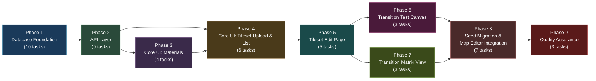

# Work Plan: Tileset Management System

Status: PENDING
Created Date: 2026-02-20
Type: feature
Estimated Duration: 12-15 days
Estimated Impact: 45+ files (30+ new, 10+ modified, 2 removed post-migration)
Related Issue/PR: N/A

## Related Documents

- Design Doc: [docs/design/design-011-tileset-management.md](../design/design-011-tileset-management.md)
- PRD: [docs/prd/prd-008-tileset-management.md](../prd/prd-008-tileset-management.md) (28 functional requirements)
- ADR: [docs/adr/ADR-0009-tileset-management-architecture.md](../adr/ADR-0009-tileset-management-architecture.md) (4 architecture decisions)
- UXRD: [docs/uxrd/uxrd-004-tileset-management-ui.md](../uxrd/uxrd-004-tileset-management-ui.md) (7 UI features)

## Objective

Replace the 26 hardcoded terrain definitions in `packages/map-lib/src/core/terrain.ts` with a fully database-driven tileset registry. Introduce three new database tables (`materials`, `tilesets`, `tileset_tags`), REST API endpoints for CRUD operations, server-side image splitting for multi-tileset uploads, materials management UI, tileset upload/configuration UI, an interactive autotile test canvas, a transition matrix view, and a seed migration that imports the existing 26 tilesets. After migration, the map editor terrain palette loads tilesets from the database API instead of static constants.

## Background

The map editor's 26 terrain tilesets are defined as compile-time constants in `packages/map-lib/src/core/terrain.ts`. Adding, modifying, or reordering terrain types requires source code changes, a rebuild, and a redeployment. There is no upload workflow for tileset images, no centralized material registry, no visual transition testing, and no coverage analysis for material-pair transitions.

The genmap app already has established patterns for asset management (S3 upload in `apps/genmap/src/lib/s3.ts`, Drizzle ORM schemas in `packages/db/src/schema/`, CRUD services in `packages/db/src/services/`). This feature extends those patterns to tilesets and materials.

**Implementation Approach**: Vertical Slice (Feature-driven) with Foundation-First Database Layer. The database schema and services form a common foundation, then features are delivered as vertical slices: materials CRUD, tileset upload, tileset configuration, test canvas, transition matrix, and seed migration with palette integration. (Design Doc: Implementation Plan section)

## Prerequisites

- [x] `packages/db/` exists with Drizzle ORM, DrizzleClient pattern, existing schema/services
- [x] `apps/genmap/src/lib/s3.ts` provides S3 upload/presign/delete functions
- [x] `apps/genmap/src/lib/sprite-url.ts` provides `withSignedUrl`/`withSignedUrls` helpers
- [x] `apps/genmap/src/lib/validation.ts` provides `generateS3Key`, `sanitizeFileName`
- [x] `packages/map-lib/src/core/terrain.ts` has 26 terrain definitions to migrate
- [x] `packages/map-lib/src/core/terrain-properties.ts` has `SURFACE_PROPERTIES` to migrate
- [x] `packages/map-lib/src/core/autotile.ts` provides `getFrame` for test canvas
- [x] `apps/genmap/src/components/navigation.tsx` exists for nav item additions
- [x] shadcn/ui components available (Button, Card, Dialog, Input, Select, Badge, etc.)

## Phase Structure Diagram



## Task Dependency Diagram

```mermaid
graph TD
    T1_1["1.1: materials schema"]
    T1_2["1.2: tilesets schema"]
    T1_3["1.3: tileset-tags schema"]
    T1_4["1.4: Export schemas<br/>from index.ts"]
    T1_5["1.5: Drizzle migration"]
    T1_6["1.6: material service"]
    T1_7["1.7: tileset service"]
    T1_8["1.8: tileset-tag service"]
    T1_9["1.9: Export services<br/>from index.ts"]
    T1_10["1.10: Service unit tests"]

    T2_1["2.1: Install sharp"]
    T2_2["2.2: Image splitting util"]
    T2_3["2.3: Frame validation util"]
    T2_4["2.4: Materials API routes"]
    T2_5["2.5: Tilesets API routes<br/>(upload + list)"]
    T2_6["2.6: Tileset detail routes<br/>(get/patch/delete)"]
    T2_7["2.7: Tileset tag routes"]
    T2_8["2.8: Matrix + Usage routes"]
    T2_9["2.9: Tileset URL helper"]

    T3_1["3.1: useMaterials hook"]
    T3_2["3.2: Material form component"]
    T3_3["3.3: Materials page"]
    T3_4["3.4: Add Materials to nav"]

    T4_1["4.1: useTilesets hook"]
    T4_2["4.2: TagEditor component"]
    T4_3["4.3: TilesetUploadForm"]
    T4_4["4.4: TilesetCard component"]
    T4_5["4.5: Tilesets list page"]
    T4_6["4.6: Add Tilesets to nav"]

    T5_1["5.1: TilesetImageCanvas"]
    T5_2["5.2: AutotilePreview"]
    T5_3["5.3: Properties form"]
    T5_4["5.4: Tileset edit page"]
    T5_5["5.5: Validation display"]

    T6_1["6.1: TransitionTestCanvas"]
    T6_2["6.2: Autotile integration"]
    T6_3["6.3: Wire into edit page"]

    T7_1["7.1: Matrix data hook"]
    T7_2["7.2: TransitionMatrix component"]
    T7_3["7.3: Matrix page"]

    T8_1["8.1: Seed migration script"]
    T8_2["8.2: Run migration + verify"]
    T8_3["8.3: Update terrain-palette.tsx"]
    T8_4["8.4: Update use-tileset-images.ts"]
    T8_5["8.5: Update canvas-renderer.ts"]
    T8_6["8.6: Remove hardcoded constants"]
    T8_7["8.7: Integration verification"]

    %% Phase 1 internal
    T1_1 --> T1_2
    T1_2 --> T1_3
    T1_3 --> T1_4
    T1_4 --> T1_5
    T1_1 --> T1_6
    T1_2 --> T1_7
    T1_3 --> T1_8
    T1_6 --> T1_9
    T1_7 --> T1_9
    T1_8 --> T1_9
    T1_5 --> T1_10
    T1_9 --> T1_10

    %% Phase 1 to Phase 2
    T1_9 --> T2_4
    T1_9 --> T2_5
    T1_9 --> T2_6
    T1_9 --> T2_7
    T1_9 --> T2_8
    T2_1 --> T2_2
    T2_2 --> T2_3
    T2_2 --> T2_5
    T2_3 --> T2_5
    T1_9 --> T2_9

    %% Phase 2 to Phase 3
    T2_4 --> T3_1
    T3_1 --> T3_2
    T3_2 --> T3_3
    T3_3 --> T3_4

    %% Phase 2 to Phase 4
    T2_5 --> T4_1
    T2_9 --> T4_1
    T4_1 --> T4_3
    T3_1 --> T4_3
    T4_1 --> T4_4
    T4_3 --> T4_5
    T4_4 --> T4_5
    T4_2 --> T4_3
    T4_5 --> T4_6

    %% Phase 4 to Phase 5
    T4_1 --> T5_3
    T5_1 --> T5_4
    T5_2 --> T5_4
    T5_3 --> T5_4
    T5_4 --> T5_5

    %% Phase 5 to Phase 6
    T5_4 --> T6_1
    T6_1 --> T6_2
    T6_2 --> T6_3

    %% Phase 5 to Phase 7
    T2_8 --> T7_1
    T7_1 --> T7_2
    T7_2 --> T7_3

    %% Phases 6,7 to Phase 8
    T6_3 --> T8_1
    T7_3 --> T8_1
    T8_1 --> T8_2
    T8_2 --> T8_3
    T8_2 --> T8_4
    T8_3 --> T8_5
    T8_4 --> T8_5
    T8_5 --> T8_6
    T8_6 --> T8_7

    subgraph Phase1["Phase 1: Database Foundation"]
        T1_1; T1_2; T1_3; T1_4; T1_5; T1_6; T1_7; T1_8; T1_9; T1_10
    end
    subgraph Phase2["Phase 2: API Layer"]
        T2_1; T2_2; T2_3; T2_4; T2_5; T2_6; T2_7; T2_8; T2_9
    end
    subgraph Phase3["Phase 3: Materials UI"]
        T3_1; T3_2; T3_3; T3_4
    end
    subgraph Phase4["Phase 4: Tileset Upload & List"]
        T4_1; T4_2; T4_3; T4_4; T4_5; T4_6
    end
    subgraph Phase5["Phase 5: Tileset Edit Page"]
        T5_1; T5_2; T5_3; T5_4; T5_5
    end
    subgraph Phase6["Phase 6: Test Canvas"]
        T6_1; T6_2; T6_3
    end
    subgraph Phase7["Phase 7: Transition Matrix"]
        T7_1; T7_2; T7_3
    end
    subgraph Phase8["Phase 8: Seed Migration"]
        T8_1; T8_2; T8_3; T8_4; T8_5; T8_6; T8_7
    end

    style Phase1 fill:#0d1f2d,stroke:#4a8aaa
    style Phase2 fill:#15251d,stroke:#5a9a6a
    style Phase3 fill:#1d1525,stroke:#7a5a8a
    style Phase4 fill:#251d0d,stroke:#9a7a4a
    style Phase5 fill:#0d2525,stroke:#4a9a9a
    style Phase6 fill:#250d1d,stroke:#9a4a7a
    style Phase7 fill:#1d250d,stroke:#7a9a4a
    style Phase8 fill:#251515,stroke:#9a5a5a
```



## Risks and Countermeasures

### Technical Risks

- **Risk**: Seed migration breaks existing editor maps referencing `terrain-XX` keys
  - **Impact**: High -- maps fail to load or render incorrectly after migration
  - **Detection**: Load all existing editor maps post-migration and verify terrain palette displays same tilesets
  - **Countermeasure**: Preserve exact `terrain-XX` key format in migration. Verify by loading all saved maps after migration. Implement API-loaded palette alongside static version during development; compare output visually.

- **Risk**: Terrain palette regression after switching from static to API-loaded data
  - **Impact**: High -- map editor becomes non-functional for terrain painting
  - **Detection**: Visual comparison of terrain palette before and after migration
  - **Countermeasure**: Implement Phase 8 (integration) only after all CRUD operations are verified. Keep hardcoded definitions until Phase 8.6. Run side-by-side comparison before removing static definitions.

- **Risk**: `sharp` image splitting produces incorrect results (pixel drift, color space conversion)
  - **Impact**: Medium -- tileset frames render incorrectly in autotile system
  - **Detection**: Unit test splitting with known PNG inputs; verify pixel-perfect output
  - **Countermeasure**: Use `sharp.extract()` with explicit PNG output and no color space conversion. Unit tests compare output dimensions and pixel data.

- **Risk**: S3 upload failure during multi-tileset batch leaves partial data
  - **Impact**: Medium -- orphaned S3 objects or DB records without images
  - **Detection**: S3 upload returns error; cleanup logic attempts to delete already-uploaded objects
  - **Countermeasure**: Upload all splits to S3 first, then create DB records in a transaction. If any S3 upload fails, clean up already-uploaded objects (best effort). No partial DB records created.

- **Risk**: Bidirectional inverse tileset link consistency under concurrent updates
  - **Impact**: Medium -- A.inverse = B but B.inverse != A
  - **Detection**: Service unit tests for all inverse link edge cases
  - **Countermeasure**: Use database transaction for all bidirectional updates. Clear any existing inverse partners before setting new links. Comprehensive unit tests.

- **Risk**: Transition matrix unusable with 50+ materials (rendering performance)
  - **Impact**: Low -- matrix page becomes slow to render
  - **Detection**: Manual testing with seed data of 20+ materials
  - **Countermeasure**: At expected scale (20-30 materials), matrix fits on screen. Implement sticky headers and horizontal scroll for larger sets.

### Schedule Risks

- **Risk**: Phase 8 (seed migration + integration) is the highest-risk phase and depends on all prior phases
  - **Impact**: Medium -- delay in final integration delays the entire feature
  - **Countermeasure**: Phase 8 tasks are designed to be individually reversible. Keep hardcoded definitions available until the final verification step. The migration script is idempotent (safe to re-run).

- **Risk**: Image processing (`sharp`) introduces platform-specific build issues in CI
  - **Impact**: Low -- `sharp` is already a project dependency
  - **Countermeasure**: `sharp` is already installed and working in the project. Pin version and verify in development environment before CI.

## Implementation Phases

### Phase 1: Database Foundation (Estimated commits: 5)

**Purpose**: Create the three new database tables (`materials`, `tilesets`, `tileset_tags`) using Drizzle ORM schemas, generate and run migrations, create CRUD services for all three entities, and verify with unit tests. After this phase, all database operations are functional and tested in isolation.

**Derives from**: Design Doc -- Database Schema section, Service functions section; PRD FR-22; ADR-0009 Decisions 2, 4
**ACs covered**: FR-22 (database tables), FR-5 (material CRUD -- service layer), FR-9 (inverse linking -- service layer)

#### Tasks

- [x] **Task 1.1: Create `materials` table schema**
  - **Output file**: `packages/db/src/schema/materials.ts` (new)
  - **Description**: Create Drizzle ORM schema for the `materials` table following the established pattern from `sprites.ts`. Columns: `id` (UUID PK), `name` (varchar 100, unique), `key` (varchar 100, unique), `color` (varchar 7), `walkable` (boolean, default true), `speedModifier` (real, default 1.0), `swimRequired` (boolean, default false), `damaging` (boolean, default false), `createdAt`/`updatedAt` (timestamptz). Export `Material` and `NewMaterial` types.
  - **Acceptance criteria**: Schema file compiles. `Material` and `NewMaterial` types are exported. Column types match Design Doc specification.
  - **Estimated complexity**: S
  - **Dependencies**: None

- [x] **Task 1.2: Create `tilesets` table schema**
  - **Output file**: `packages/db/src/schema/tilesets.ts` (new)
  - **Description**: Create Drizzle ORM schema for the `tilesets` table with FK references to `materials` and self-referencing FK for `inverseTilesetId`. Define Drizzle `relations` for `fromMaterial`, `toMaterial`, `inverseTileset`, and `tags`. Columns per Design Doc: `id`, `name`, `key` (unique), `s3Key` (unique), `s3Url`, `width`, `height`, `fileSize`, `mimeType`, `fromMaterialId`, `toMaterialId`, `inverseTilesetId`, `sortOrder`, `createdAt`/`updatedAt`. Export `Tileset`, `NewTileset`, and relations.
  - **Acceptance criteria**: Schema compiles with FK references to materials table. Relations defined for from/to materials, inverse tileset, and tags. `onDelete: 'set null'` on material FKs and inverse FK.
  - **Estimated complexity**: M
  - **Dependencies**: Task 1.1 (imports materials table)

- [x] **Task 1.3: Create `tileset_tags` table schema**
  - **Output file**: `packages/db/src/schema/tileset-tags.ts` (new)
  - **Description**: Create Drizzle ORM schema for the `tileset_tags` join table with composite primary key on `(tilesetId, tag)`. FK to `tilesets.id` with cascade delete. Define Drizzle `relations` back to tilesets. Export `TilesetTag` and `NewTilesetTag` types.
  - **Acceptance criteria**: Schema compiles with composite PK and cascade delete FK. Relations defined.
  - **Estimated complexity**: S
  - **Dependencies**: Task 1.2 (imports tilesets table)

- [x] **Task 1.4: Export new schemas from `packages/db/src/schema/index.ts`**
  - **Output file**: `packages/db/src/schema/index.ts` (modified -- append 3 exports)
  - **Description**: Add barrel exports for materials, tilesets, and tileset-tags schemas. Append `export * from './materials'`, `export * from './tilesets'`, `export * from './tileset-tags'`.
  - **Acceptance criteria**: All new schema types and table definitions importable from `@nookstead/db` schema barrel.
  - **Estimated complexity**: S
  - **Dependencies**: Tasks 1.1, 1.2, 1.3

- [x] **Task 1.5: Generate and run Drizzle migration**
  - **Description**: Run `drizzle-kit generate` to create the migration SQL for the 3 new tables. Run `drizzle-kit push` (or `drizzle-kit migrate`) to apply the migration to the development database. Verify all 3 tables exist with correct columns, types, and constraints.
  - **Acceptance criteria**: Migration SQL generated. Tables `materials`, `tilesets`, `tileset_tags` exist in PostgreSQL with correct columns and constraints. FK constraints validated. Composite PK on tileset_tags validated.
  - **Estimated complexity**: S
  - **Dependencies**: Task 1.4

- [x] **Task 1.6: Create material service (`packages/db/src/services/material.ts`)**
  - **Output file**: `packages/db/src/services/material.ts` (new)
  - **Description**: Implement material CRUD service following the `DrizzleClient` first-param pattern from `sprite.ts`. Functions: `createMaterial`, `getMaterial`, `getMaterialByKey`, `listMaterials`, `updateMaterial`, `deleteMaterial`, `countTilesetsByMaterial`, `getTilesetsReferencingMaterial`. All function signatures per Design Doc.
  - **Acceptance criteria**: All 8 functions implemented. `listMaterials` returns results ordered by name. `countTilesetsByMaterial` counts from both `fromMaterialId` and `toMaterialId` columns.
  - **Estimated complexity**: M
  - **Dependencies**: Task 1.1 (materials schema)

- [x] **Task 1.7: Create tileset service (`packages/db/src/services/tileset.ts`)**
  - **Output file**: `packages/db/src/services/tileset.ts` (new)
  - **Description**: Implement tileset CRUD + specialized operations. Functions: `createTileset`, `getTileset`, `listTilesets` (with filter params: materialId, tag, search, sort, limit, offset), `updateTileset`, `deleteTileset`, `setInverseTileset` (bidirectional transaction), `removeInverseTileset`, `getTransitionMatrix`, `getTilesetUsage`. All function signatures per Design Doc.
  - **Acceptance criteria**: All 9 functions implemented. `setInverseTileset` uses a transaction for bidirectional update. `getTransitionMatrix` returns materials array and cells with counts. `getTilesetUsage` scans `editor_maps.layers` JSONB. `listTilesets` supports all filter combinations.
  - **Estimated complexity**: L
  - **Dependencies**: Task 1.2 (tilesets schema)

- [x] **Task 1.8: Create tileset-tag service (`packages/db/src/services/tileset-tag.ts`)**
  - **Output file**: `packages/db/src/services/tileset-tag.ts` (new)
  - **Description**: Implement tag management service. Functions: `setTags` (replace all tags in transaction), `getTags`, `addTag` (with onConflictDoNothing), `removeTag`, `listDistinctTags` (with count per tag). All function signatures per Design Doc.
  - **Acceptance criteria**: All 5 functions implemented. `setTags` deletes existing and inserts new in a transaction. `addTag` is idempotent (no duplicate). `listDistinctTags` returns sorted tags with counts.
  - **Estimated complexity**: M
  - **Dependencies**: Task 1.3 (tileset-tags schema)

- [x] **Task 1.9: Export new services from `packages/db/src/index.ts`**
  - **Output file**: `packages/db/src/index.ts` (modified -- append service exports)
  - **Description**: Add barrel exports for all new service functions and types from material, tileset, and tileset-tag services.
  - **Acceptance criteria**: All service functions and their input/output types importable from `@nookstead/db`.
  - **Estimated complexity**: S
  - **Dependencies**: Tasks 1.6, 1.7, 1.8

- [ ] **Task 1.10: Unit tests for all services**
  - **Output files**:
    - `packages/db/src/services/__tests__/material.spec.ts` (new)
    - `packages/db/src/services/__tests__/tileset.spec.ts` (new)
    - `packages/db/src/services/__tests__/tileset-tag.spec.ts` (new)
  - **Description**: Write unit tests against a test database for all service functions. Coverage target: 80% for service code.
    - **material.spec.ts**: create, get, getByKey, list (ordered), update, delete, countTilesetsByMaterial, getTilesetsReferencingMaterial, duplicate name handling
    - **tileset.spec.ts**: create, get, list (all filter combos), update, delete, setInverseTileset (bidirectional verify, clear, self-reference error), removeInverseTileset, getTransitionMatrix, getTilesetUsage
    - **tileset-tag.spec.ts**: setTags (replace), getTags, addTag (idempotent), removeTag, listDistinctTags, duplicate tag handling
  - **Acceptance criteria**: All tests pass. Tests verify bidirectional inverse link consistency. Tests verify material deletion sets FK to null on tilesets. Tests verify cascade delete of tags on tileset deletion.
  - **Estimated complexity**: L
  - **Dependencies**: Task 1.5 (migration applied), Task 1.9 (services exported)

- [ ] Quality check: `pnpm nx typecheck db` passes (or equivalent for packages/db)

#### Phase 1 Completion Criteria

- [ ] 3 new schema files exist in `packages/db/src/schema/`
- [ ] Schema barrel exports all new types and table definitions
- [ ] Drizzle migration applied: 3 tables exist in PostgreSQL
- [ ] 3 new service files exist in `packages/db/src/services/`
- [ ] Service barrel exports all new functions and types
- [ ] All service unit tests pass (80%+ coverage)
- [ ] Bidirectional inverse link tested with transaction verification
- [ ] FK cascade behavior verified (material delete -> tileset FK null, tileset delete -> tags cascade)

#### Operational Verification Procedures

1. Connect to PostgreSQL and verify `materials`, `tilesets`, `tileset_tags` tables exist with correct columns
2. Run `pnpm nx test db` (or the appropriate test command) -- verify all service unit tests pass
3. Manually insert a material, a tileset referencing it, and tags -- verify FK constraints work
4. Delete the material -- verify tileset's `from_material_id` is set to null
5. Delete the tileset -- verify `tileset_tags` rows are cascade-deleted

---

### Phase 2: API Layer (Estimated commits: 5)

**Purpose**: Create all REST API route handlers for materials, tilesets, tags, matrix, and usage. Install `sharp` and create image splitting/validation utilities. After this phase, all backend operations are functional via HTTP endpoints.

**Derives from**: Design Doc -- Contract Definitions, Image Processing, Error Handling sections; PRD FR-17 through FR-21
**ACs covered**: FR-1 (upload with auto-split), FR-2 (registration), FR-3 (dimension validation), FR-4 (frame validation), FR-17 (tileset API), FR-18 (material API), FR-19 (tag API), FR-20 (matrix API), FR-21 (usage API)

#### Tasks

- [ ] **Task 2.1: Install `sharp` dependency in `apps/genmap`**
  - **Output file**: `apps/genmap/package.json` (modified)
  - **Description**: Add `sharp` as a dependency to the genmap app. Run `pnpm install`. Verify `sharp` imports work in a Next.js API route context.
  - **Acceptance criteria**: `sharp` is listed in `apps/genmap/package.json` dependencies. `import sharp from 'sharp'` resolves without error in an API route file.
  - **Estimated complexity**: S
  - **Dependencies**: None

- [ ] **Task 2.2: Create image splitting utility**
  - **Output file**: `apps/genmap/src/lib/tileset-image.ts` (new)
  - **Description**: Implement `splitTilesetImage(buffer: Buffer, tilesetCount: number): Promise<SplitResult[]>` using `sharp.extract()`. Each split produces a 192x64 PNG buffer. Also implement `validateTilesetDimensions(width: number, height: number): { valid: boolean; error?: string; tilesetCount: number }` that checks width === 192 and height % 64 === 0. Per Design Doc Image Processing section.
  - **Acceptance criteria**: `splitTilesetImage` produces `tilesetCount` buffers each with correct dimensions. `validateTilesetDimensions(192, 128)` returns `{ valid: true, tilesetCount: 2 }`. `validateTilesetDimensions(160, 64)` returns `{ valid: false, error: "Width must be exactly 192..." }`.
  - **Estimated complexity**: M
  - **Dependencies**: Task 2.1 (sharp installed)

- [ ] **Task 2.3: Create frame content validation utility**
  - **Output file**: `apps/genmap/src/lib/tileset-image.ts` (modified -- add function)
  - **Description**: Implement `validateFrameContent(buffer: Buffer): Promise<{ valid: number[]; empty: number[] }>` that checks each of the 48 frames (16x16 tiles in a 12x4 grid) for non-transparent pixels. Uses `sharp.extract()` per frame and checks alpha channel. Per Design Doc Image Processing section.
  - **Acceptance criteria**: A fully opaque 192x64 PNG reports all 48 frames as valid. A fully transparent PNG reports all 48 as empty. A PNG with frame 0 transparent and frames 1-47 opaque reports correctly.
  - **Estimated complexity**: M
  - **Dependencies**: Task 2.2

- [x] **Task 2.4: Create Materials API routes**
  - **Output files**:
    - `apps/genmap/src/app/api/materials/route.ts` (new -- POST + GET)
    - `apps/genmap/src/app/api/materials/[id]/route.ts` (new -- GET + PATCH + DELETE)
  - **Description**: Implement material CRUD endpoints following the established pattern from `apps/genmap/src/app/api/sprites/route.ts`. POST creates a material (auto-generate key from name if not provided). GET lists all materials sorted by name. GET by ID returns single material. PATCH updates material fields. DELETE checks tileset dependencies first, returns affected tilesets list, then deletes (sets FK to null). Per Design Doc Contract Definitions.
  - **Acceptance criteria**: POST /api/materials with `{ name: "Lava", color: "#ff4400" }` creates material with key "lava". GET /api/materials returns sorted list. DELETE /api/materials/:id with dependent tilesets returns affected list. Duplicate name returns 409.
  - **Estimated complexity**: M
  - **Dependencies**: Task 1.9 (services exported)

- [x] **Task 2.5: Create Tilesets API routes (upload + list)**
  - **Output file**: `apps/genmap/src/app/api/tilesets/route.ts` (new -- POST + GET)
  - **Description**: POST handles FormData upload: parse file, validate MIME type (PNG/WebP) and size (max 10MB), validate dimensions, split with sharp if multi-tileset, upload each split to S3, create DB records. GET lists tilesets with query params: `materialId`, `tag`, `search`, `sort`, `order`, `limit`, `offset`. Follow the existing sprite upload route pattern for FormData parsing and S3 upload. Per Design Doc Upload Flow.
  - **Acceptance criteria**: POST with 192x256 PNG creates 4 S3 objects and 4 DB records. POST with 192x64 PNG creates 1. Invalid width returns 400. GET with `?tag=water&search=grass` returns filtered results. On S3 failure mid-batch, already-uploaded objects are cleaned up.
  - **Estimated complexity**: L
  - **Dependencies**: Tasks 2.2, 2.3, 1.9

- [x] **Task 2.6: Create Tileset detail API routes (get/patch/delete)**
  - **Output file**: `apps/genmap/src/app/api/tilesets/[id]/route.ts` (new -- GET + PATCH + DELETE)
  - **Description**: GET returns tileset with material details and tags. PATCH updates metadata (name, fromMaterialId, toMaterialId, inverseTilesetId, tags). Handle inverseTilesetId specially: if provided, call `setInverseTileset` for bidirectional link; if null, call `removeInverseTileset`. Validate same from/to material. Validate self-referencing inverse. DELETE removes S3 object, clears inverse link, cascade-deletes tags, deletes DB record.
  - **Acceptance criteria**: PATCH with `{ inverseTilesetId: "B" }` updates both A and B bidirectionally. PATCH with same from/to material returns 400. DELETE clears inverse partner's reference.
  - **Estimated complexity**: M
  - **Dependencies**: Task 1.9

- [x] **Task 2.7: Create Tileset tag API routes**
  - **Output files**:
    - `apps/genmap/src/app/api/tilesets/[id]/tags/route.ts` (new -- POST)
    - `apps/genmap/src/app/api/tilesets/[id]/tags/[tag]/route.ts` (new -- DELETE)
    - `apps/genmap/src/app/api/tilesets/tags/route.ts` (new -- GET)
  - **Description**: POST /api/tilesets/:id/tags adds a tag (idempotent). DELETE /api/tilesets/:id/tags/:tag removes a tag. GET /api/tilesets/tags returns all distinct tags with counts, sorted alphabetically. Per Design Doc Contract Definitions.
  - **Acceptance criteria**: Adding same tag twice does not create duplicate. GET /api/tilesets/tags returns `[{ tag: "road", count: 2 }, { tag: "water", count: 3 }]` sorted alphabetically.
  - **Estimated complexity**: S
  - **Dependencies**: Task 1.9

- [x] **Task 2.8: Create Matrix and Usage API routes**
  - **Output files**:
    - `apps/genmap/src/app/api/tilesets/matrix/route.ts` (new -- GET)
    - `apps/genmap/src/app/api/tilesets/[id]/usage/route.ts` (new -- GET)
  - **Description**: GET /api/tilesets/matrix returns `{ materials, cells }` with transition matrix data. GET /api/tilesets/:id/usage scans `editor_maps.layers` JSONB for `terrainKey` references and returns `{ maps, count }`.
  - **Acceptance criteria**: Matrix endpoint returns correct counts for material pairs. Usage endpoint returns maps referencing a specific tileset key.
  - **Estimated complexity**: S
  - **Dependencies**: Task 1.9

- [x] **Task 2.9: Create tileset URL helper (extend `sprite-url.ts` pattern)**
  - **Output file**: `apps/genmap/src/lib/tileset-url.ts` (new)
  - **Description**: Create `withTilesetSignedUrl` and `withTilesetSignedUrls` helpers following the same pattern as `apps/genmap/src/lib/sprite-url.ts`. These attach presigned S3 GET URLs to tileset records for client-side image loading.
  - **Acceptance criteria**: `withTilesetSignedUrl(tileset)` returns tileset with a valid presigned URL. Works with the same `s3Key`/`s3Url` record shape.
  - **Estimated complexity**: S
  - **Dependencies**: Task 1.9

- [ ] Quality check: Test each API endpoint manually with `curl` or API client. Verify HTTP status codes and response shapes.

#### Phase 2 Completion Criteria

- [ ] `sharp` installed and functional in genmap API routes
- [ ] Image splitting produces pixel-perfect 192x64 PNGs
- [ ] Frame validation correctly identifies empty/valid frames
- [ ] Materials: POST, GET (list), GET (by ID), PATCH, DELETE endpoints functional
- [ ] Tilesets: POST (upload + split), GET (list with filters) endpoints functional
- [ ] Tilesets: GET (by ID), PATCH (with inverse linking), DELETE endpoints functional
- [ ] Tags: POST (add), DELETE (remove), GET (distinct list) endpoints functional
- [ ] Matrix: GET returns correct material-pair counts
- [ ] Usage: GET scans JSONB layers for terrain key references
- [ ] Tileset URL helper generates presigned URLs
- [ ] All endpoints return correct HTTP status codes per Design Doc error handling table

#### Operational Verification Procedures

1. POST /api/materials with `{ name: "Test Water", color: "#3b82f6", walkable: false }` -- verify 201 response with auto-generated key "test_water"
2. POST /api/tilesets with a 192x128 PNG -- verify 2 tileset records created and 2 S3 objects uploaded
3. GET /api/tilesets -- verify list returns with S3 presigned URLs
4. PATCH /api/tilesets/:id with `{ inverseTilesetId: "other-id" }` -- verify both tilesets updated
5. POST /api/tilesets/:id/tags with `{ tag: "nature" }` -- verify tag added
6. GET /api/tilesets/tags -- verify distinct tags with counts
7. GET /api/tilesets/matrix -- verify matrix data structure
8. POST /api/tilesets with a 160x64 PNG -- verify 400 error with dimension message
9. DELETE /api/materials/:id that has dependent tilesets -- verify dependency warning returned

---

### Phase 3: Core UI -- Materials Management (Estimated commits: 3)

**Purpose**: Create the materials management page with full CRUD, color picker, property editing, and dependency-aware deletion. After this phase, materials can be created and managed before tileset configuration.

**Derives from**: UXRD-004 Feature 5 (Materials Management Page); PRD FR-5, FR-6, FR-7
**ACs covered**: FR-5 (material CRUD), FR-6 (material list page), FR-7 (material deletion with dependency check)

#### Tasks

- [x] **Task 3.1: Create `useMaterials` data fetching hook**
  - **Output file**: `apps/genmap/src/hooks/use-materials.ts` (new)
  - **Description**: React hook for fetching and mutating materials. Functions: `materials` (list), `createMaterial`, `updateMaterial`, `deleteMaterial`, `isLoading`, `error`, `refresh`. Uses `fetch` to call materials API endpoints. Optimistic updates for list mutations.
  - **Acceptance criteria**: Hook returns materials list on mount. `createMaterial` calls POST and refreshes list. `deleteMaterial` calls DELETE. Loading and error states handled.
  - **Estimated complexity**: M
  - **Dependencies**: Task 2.4 (materials API routes)

- [x] **Task 3.2: Create Material form component**
  - **Output file**: `apps/genmap/src/components/material-form.tsx` (new)
  - **Description**: Inline form for creating/editing materials. Fields: name (Input), key (auto-generated, read-only with edit toggle), color (Input type="color" + swatch preview), walkable (Checkbox), speedModifier (Input type="number", 0-2 range, step 0.05). Auto-generates key from name on change (lowercase, spaces to underscores). Save and cancel action buttons. Per UXRD Feature 5 Add Material Form specification.
  - **Acceptance criteria**: Entering "Deep Water" auto-generates key "deep_water". Color picker updates swatch. Speed modifier validates range 0-2. Save calls `onSave` with form data.
  - **Estimated complexity**: M
  - **Dependencies**: Task 3.1

- [x] **Task 3.3: Create Materials management page**
  - **Output file**: `apps/genmap/src/app/(app)/materials/page.tsx` (new)
  - **Description**: Full materials page per UXRD Feature 5. Components: page header with "Add Material" button, material palette (horizontal color swatch row), materials table (color swatch, name, key, walkable badge, speed, tileset count, edit/delete actions), inline edit mode, delete confirmation dialog with dependency warning. Uses `useMaterials` hook.
  - **Acceptance criteria**: All materials listed with correct properties and badges. Add form appears at top of table. Inline edit replaces row with form. Delete with dependent tilesets shows warning dialog listing affected tilesets. Delete without dependencies proceeds directly.
  - **Estimated complexity**: L
  - **Dependencies**: Tasks 3.1, 3.2

- [x] **Task 3.4: Add "Materials" to navigation**
  - **Output file**: `apps/genmap/src/components/navigation.tsx` (modified -- add nav item)
  - **Description**: Add `{ href: '/materials', label: 'Materials' }` to the navigation items array.
  - **Acceptance criteria**: "Materials" link appears in top navigation. Clicking navigates to `/materials`.
  - **Estimated complexity**: S
  - **Dependencies**: Task 3.3

- [ ] Quality check: `pnpm nx typecheck genmap` passes

#### Phase 3 Completion Criteria

- [ ] Materials page renders at `/materials` with table of all materials
- [ ] Material palette (color swatch row) displays at top of page
- [ ] Create material with name, color, walkable, speed -- record created in DB
- [ ] Edit material inline -- fields update, save persists to DB
- [ ] Delete material with 0 tileset references -- deletes directly
- [ ] Delete material with N tileset references -- shows warning with affected tilesets list
- [ ] Key auto-generated from name on creation
- [ ] Navigation includes "Materials" link

#### Operational Verification Procedures

1. Navigate to `/materials` -- verify page loads with empty state (if no materials) or table
2. Click "Add Material" -- verify form appears with color picker, name, key, walkable, speed fields
3. Enter name "Test Grass" -- verify key auto-generates as "test_grass"
4. Save -- verify material appears in table and palette
5. Click edit on the material -- verify inline edit mode with pre-populated fields
6. Change walkable to false, save -- verify badge updates to "Blocked"
7. Click delete -- verify confirmation dialog (or direct delete if no tilesets reference it)

---

### Phase 4: Core UI -- Tileset Upload and List (Estimated commits: 4)

**Purpose**: Create the tileset upload form with dimension validation and auto-split detection, the tileset card component, and the tilesets list page with search/filter/sort. After this phase, tilesets can be uploaded and browsed.

**Derives from**: UXRD-004 Features 1 (List Page) and 2 (Upload Flow); PRD FR-1, FR-2, FR-3, FR-4, FR-10, FR-11
**ACs covered**: FR-1 (upload with auto-split), FR-2 (registration), FR-3 (dimension validation), FR-4 (frame validation), FR-10 (tagging -- upload), FR-11 (tileset list)

#### Tasks

- [x] **Task 4.1: Create `useTilesets` data fetching hook**
  - **Output file**: `apps/genmap/src/hooks/use-tilesets.ts` (new)
  - **Description**: React hook for fetching tilesets with filters. State: `tilesets`, `isLoading`, `error`. Params: `search`, `materialId`, `tag`, `sort`, `order`. Also `uploadTileset` (FormData POST), `deleteTileset`, `refresh`. Fetches from tilesets API with query string construction from params.
  - **Acceptance criteria**: Hook fetches tilesets on mount. Params trigger re-fetch. `uploadTileset` sends FormData and refreshes on success.
  - **Estimated complexity**: M
  - **Dependencies**: Tasks 2.5, 2.9

- [x] **Task 4.2: Create `TagEditor` reusable component**
  - **Output file**: `apps/genmap/src/components/tag-editor.tsx` (new)
  - **Description**: Reusable inline tag editor with Badge chips (with remove X), text input for adding new tags, autocomplete from existing tags via GET /api/tilesets/tags. Enter to add tag. Backspace on empty input removes last tag. Per UXRD Feature 2 Tags editor spec.
  - **Acceptance criteria**: Displays existing tags as Badge chips. Adding a tag updates the tags array. Removing a tag via X button updates the array. Autocomplete shows existing tags as user types.
  - **Estimated complexity**: M
  - **Dependencies**: Task 2.7 (tags API for autocomplete)

- [x] **Task 4.3: Create `TilesetUploadForm` component**
  - **Output file**: `apps/genmap/src/components/tileset-upload-form.tsx` (new)
  - **Description**: Upload dialog per UXRD Feature 2. File input (PNG, max 10MB), client-side dimension validation on file select (via Image.onload), auto-detect tileset count (height/64), image preview canvas with 12x4 grid overlay per tileset, frame validation feedback (valid/empty counts), name input (pre-populated from filename), from/to material Select dropdowns (from `useMaterials`), TagEditor, upload button (disabled until valid). For multi-tileset: vertical list of detected sub-tilesets with individual naming and material assignment. Supports `preselectedFromMaterial` and `preselectedToMaterial` props for matrix-initiated uploads.
  - **Acceptance criteria**: File selection validates dimensions client-side. Width != 192 shows error. Height not multiple of 64 shows error. Multi-tileset (height > 64) shows per-tileset forms. Upload calls POST /api/tilesets with FormData. Success closes dialog and triggers refresh.
  - **Estimated complexity**: L
  - **Dependencies**: Tasks 4.1, 4.2, 3.1 (materials for dropdowns)

- [x] **Task 4.4: Create `TilesetCard` component**
  - **Output file**: `apps/genmap/src/components/tileset-card.tsx` (new)
  - **Description**: Card component for tileset list per UXRD Feature 1. Shows: canvas thumbnail (96x64, rendering a representative subset of tileset frames), tileset name (truncated), material pair with color swatch circles ("From -> To"), up to 3 tag Badges (overflow "+N more"), usage count ("N maps"). Card is a clickable Link to `/tilesets/[id]`. Hover: shadow-md and primary border.
  - **Acceptance criteria**: Card renders all metadata. Thumbnail renders from tileset image. Material swatches show correct colors. Click navigates to edit page.
  - **Estimated complexity**: M
  - **Dependencies**: Task 4.1 (tileset data shape)

- [x] **Task 4.5: Create Tilesets list page**
  - **Output file**: `apps/genmap/src/app/(app)/tilesets/page.tsx` (new)
  - **Description**: Full tilesets list page per UXRD Feature 1. Page header ("Tileset Library") with "Transition Matrix" button (outline) and "Upload" button (primary). Search input (debounced 300ms). Tag filter chips (from GET /api/tilesets/tags). Sort dropdown (Name A-Z, Name Z-A, Date newest, Date oldest). Responsive card grid (2-5 columns). Empty state with Mountain icon. Upload dialog overlay (uses TilesetUploadForm). Uses `useTilesets` hook.
  - **Acceptance criteria**: All tilesets displayed as cards in responsive grid. Search filters by name. Tag chips filter by tag (toggle on/off, clear all). Sort changes order. Empty state shown when no results. Upload dialog opens and triggers list refresh on success.
  - **Estimated complexity**: L
  - **Dependencies**: Tasks 4.3, 4.4

- [x] **Task 4.6: Add "Tilesets" to navigation**
  - **Output file**: `apps/genmap/src/components/navigation.tsx` (modified -- add nav item)
  - **Description**: Add `{ href: '/tilesets', label: 'Tilesets' }` to the navigation items array.
  - **Acceptance criteria**: "Tilesets" link appears in top navigation. Clicking navigates to `/tilesets`.
  - **Estimated complexity**: S
  - **Dependencies**: Task 4.5

- [x] Quality check: `pnpm nx typecheck genmap` passes

#### Phase 4 Completion Criteria

- [x] Tilesets list page renders at `/tilesets` with card grid
- [x] Search input filters tilesets by name (debounced)
- [x] Tag filter chips toggle filtering
- [x] Sort dropdown changes display order
- [x] Upload dialog: file validation, multi-tileset detection, material assignment
- [x] Upload creates correct number of tileset records (1 per 192x64 strip)
- [x] TilesetCard renders thumbnail, name, material pair, tags, usage count
- [x] Card click navigates to `/tilesets/[id]`
- [x] Empty state shown when no tilesets exist
- [x] Navigation includes "Tilesets" link

#### Operational Verification Procedures

1. Navigate to `/tilesets` -- verify page loads (empty state if no tilesets)
2. Click "Upload" -- verify dialog opens with file input
3. Select a valid 192x128 PNG -- verify "2 tilesets detected" message and preview
4. Fill in names and materials, click Upload -- verify 2 tileset cards appear in list
5. Type in search input -- verify list filters as you type (300ms debounce)
6. Click a tag chip -- verify list filters to that tag
7. Click Sort dropdown, select "Name (Z-A)" -- verify order reverses
8. Click a tileset card -- verify navigation to `/tilesets/[id]`
9. Upload a 160x64 PNG -- verify error "Width must be exactly 192px..."

---

### Phase 5: Tileset Edit Page (Estimated commits: 4)

**Purpose**: Create the tileset edit page with image display, grid overlay, autotile preview, properties form (name, materials, inverse, tags), and validation results. After this phase, individual tilesets can be configured.

**Derives from**: UXRD-004 Feature 3 (Tileset Edit Page); PRD FR-8, FR-9, FR-10, FR-13, FR-14
**ACs covered**: FR-8 (material assignment), FR-9 (inverse linking), FR-10 (tagging -- edit), FR-13 (auto-preview), FR-14 (usage tracking display)

#### Tasks

- [x] **Task 5.1: Create `TilesetImageCanvas` component**
  - **Output file**: `apps/genmap/src/components/tileset-image-canvas.tsx` (new)
  - **Description**: Canvas displaying the tileset's 192x64 image with 12x4 grid overlay (1px white lines at 25% opacity). Frame hover: 2px primary border overlay on the frame under cursor. Frame click: shows frame detail (index, pixel coordinates). Frame index tooltip on hover. Reuses zoom/pan patterns from `AtlasZoneCanvas` where applicable. Per UXRD Feature 3 Tileset Image Display.
  - **Acceptance criteria**: Tileset image renders at correct size. Grid overlay shows 12x4 grid. Hovering a frame highlights it with primary border. Frame index shown in tooltip.
  - **Estimated complexity**: M
  - **Dependencies**: None (standalone canvas component)

- [x] **Task 5.2: Create `AutotilePreview` component**
  - **Output file**: `apps/genmap/src/components/autotile-preview.tsx` (new)
  - **Description**: 8x6 grid displaying all 48 autotile variants (frames 0-47) from the tileset image. Each cell is 24x24px, rendered via canvas from the tileset spritesheet using frame index to source coordinates (col = frame % 12, row = Math.floor(frame / 12), src = col*16, row*16, 16, 16). Frame index label below each cell (9px muted-foreground). Hover: 2px primary border. Tooltip: variant description. Checkerboard background. Per UXRD Feature 3 Autotile Preview.
  - **Acceptance criteria**: All 48 frames render in an 8x6 grid. Frame indices displayed. Hover highlights frame. Checkerboard visible behind transparent frames.
  - **Estimated complexity**: M
  - **Dependencies**: None (standalone component)

- [x] **Task 5.3: Create tileset properties form**
  - **Output file**: `apps/genmap/src/components/tileset-properties-form.tsx` (new)
  - **Description**: Properties panel for tileset edit page. Fields: name (Input), from material (Select with color swatches, from useMaterials), to material (Select with color swatches), inverse tileset (Select listing tilesets with swapped material pair), TagEditor. Validation: from and to materials must differ. Self-referencing inverse blocked. Per UXRD Feature 3 Properties Panel.
  - **Acceptance criteria**: Material dropdowns populated from API. Selecting same from/to shows validation error. Inverse dropdown shows only compatible tilesets (to=current.from, from=current.to). Save calls PATCH /api/tilesets/:id.
  - **Estimated complexity**: M
  - **Dependencies**: Tasks 4.1, 3.1

- [x] **Task 5.4: Create tileset edit page**
  - **Output file**: `apps/genmap/src/app/(app)/tilesets/[id]/page.tsx` (new)
  - **Description**: Full edit page per UXRD Feature 3. Layout: back link to /tilesets, page title (tileset name), Save + Delete buttons. Two-column layout: left column has TilesetImageCanvas and AutotilePreview, right column has properties form. Below: TransitionTestCanvas (Phase 6 placeholder). Usage count display ("Used in N maps" with list). Delete confirmation dialog with usage warning. Fetches tileset data via GET /api/tilesets/:id on mount. Save calls PATCH. Delete calls DELETE and navigates to /tilesets.
  - **Acceptance criteria**: Page loads tileset data and displays image, preview, and properties. Save persists changes. Delete with usage shows warning. Delete without usage proceeds directly. Back link navigates to /tilesets.
  - **Estimated complexity**: L
  - **Dependencies**: Tasks 5.1, 5.2, 5.3

- [x] **Task 5.5: Create validation results display**
  - **Output file**: `apps/genmap/src/components/tileset-validation.tsx` (new)
  - **Description**: Validation checklist component shown on the tileset edit page. Items: "47 frames valid" (green check or red X with count), "Frame 0 is empty" (green check), "Inverse tileset linked" (green check or amber warning). Calls POST /api/tilesets/:id/validate (or computes client-side from frame data). Per UXRD Feature 3 Validation results.
  - **Acceptance criteria**: Validation items render with correct icons. Frame counts accurate. Warning shown for missing inverse.
  - **Estimated complexity**: S
  - **Dependencies**: Task 5.4

- [x] Quality check: `pnpm nx typecheck genmap` passes

#### Phase 5 Completion Criteria

- [x] Tileset edit page renders at `/tilesets/[id]`
- [x] Tileset image displayed with 12x4 grid overlay and frame hover
- [x] Autotile preview shows all 48 frames in 8x6 grid
- [x] Properties form: name, from/to materials, inverse tileset, tags
- [x] Validation: same from/to material blocked, self-inverse blocked
- [x] Save persists all changes (name, materials, inverse, tags)
- [x] Delete with usage warning, without usage proceeds directly
- [x] Usage count displayed
- [x] Validation results displayed (frame validity, inverse link status)

#### Operational Verification Procedures

1. Navigate to `/tilesets/[id]` -- verify page loads with tileset data
2. Hover over tileset image frames -- verify grid overlay and frame highlight
3. Verify autotile preview shows all 48 frames
4. Change from material in dropdown -- verify selection persists on save
5. Set inverse tileset -- verify bidirectional link (check both tilesets)
6. Add/remove tags -- verify changes persist
7. Select same material for from and to -- verify validation error
8. Click Delete on a tileset used by maps -- verify warning dialog
9. Click Save -- verify PATCH request succeeds and page updates

---

### Phase 6: Transition Test Canvas (Estimated commits: 2)

**Purpose**: Create the interactive 10x10 grid canvas where users can paint with two materials and see autotile frames render in real time. After this phase, tileset transitions can be visually verified before use.

**Derives from**: UXRD-004 Feature 4 (Transition Test Canvas); PRD FR-12
**ACs covered**: FR-12 (transition test canvas)

#### Tasks

- [x] **Task 6.1: Create `TransitionTestCanvas` component**
  - **Output file**: `apps/genmap/src/components/transition-test-canvas.tsx` (new)
  - **Description**: Interactive 10x10 tile grid canvas per UXRD Feature 4. Props: `tilesetImage`, `inverseTilesetImage`, `fromMaterialColor`, `toMaterialColor`. State: `grid` (10x10 'A'|'B' array, default all 'B'), `frameGrid` (10x10 frame indices), `activeBrush` ('A'|'B'), `zoom` (100-600%, step 100, default 200%). Toolbar: paint buttons (Material A, Material B with color swatches), Clear button, zoom controls. Click/drag painting. Grid lines at 1px white 15% opacity.
  - **Acceptance criteria**: 10x10 grid renders with "to" material color. Paint mode toggles between A and B. Click paints single cell. Drag paints multiple cells. Clear resets all cells to B. Zoom controls scale the canvas.
  - **Estimated complexity**: L
  - **Dependencies**: Task 5.4 (edit page exists as host)

- [x] **Task 6.2: Integrate autotile algorithm with test canvas**
  - **Output file**: `apps/genmap/src/components/transition-test-canvas.tsx` (modified)
  - **Description**: After each paint operation (mouseup), run the Blob-47 autotile algorithm (`getFrame` from `@nookstead/map-lib`) on the 10x10 grid. For each cell: compute 8-neighbor bitmask based on whether neighbors are the same material ('A'), gate diagonals, lookup frame index. Render Material A cells using the tileset image (extract 16x16 frame by index), Material B cells as solid color fill (or inverse tileset frame if available). Target: recalculation within 16ms (60fps). Per Design Doc Integration Boundary Contracts (Test Canvas -> Autotile Engine).
  - **Acceptance criteria**: Painting cell (5,5) as A with all neighbors B shows ISOLATED_FRAME (frame 47). Painting a cross pattern shows correct cardinal frame. Clear resets to all B (no autotile frames visible). Performance: recalculation for 100 cells under 16ms.
  - **Estimated complexity**: M
  - **Dependencies**: Task 6.1

- [x] **Task 6.3: Wire TransitionTestCanvas into tileset edit page**
  - **Output file**: `apps/genmap/src/app/(app)/tilesets/[id]/page.tsx` (modified)
  - **Description**: Replace the Phase 5 placeholder with the actual TransitionTestCanvas. Pass loaded tileset image, inverse tileset image (if linked), and material colors. Only render when both from and to materials are assigned. Show message "Assign from and to materials to enable the test canvas" when materials are missing.
  - **Acceptance criteria**: Test canvas appears below the properties form when both materials assigned. Canvas hidden with message when materials missing. Painting works and autotile frames render correctly.
  - **Estimated complexity**: S
  - **Dependencies**: Task 6.2

- [x] Quality check: `pnpm nx typecheck genmap` passes

#### Phase 6 Completion Criteria

- [x] 10x10 grid renders with correct initial state (all "to" material)
- [x] Paint brush A paints "from" material, brush B paints "to" material
- [x] Click and drag painting works
- [x] Autotile algorithm recalculates frame indices after each paint action
- [x] Tileset frames render correctly from spritesheet image
- [x] Clear button resets grid
- [x] Zoom controls work (100-600%)
- [x] Performance: autotile recalculation under 16ms for 100 cells
- [x] Canvas only appears when both materials are assigned

#### Operational Verification Procedures

1. Open a tileset edit page with both materials assigned -- verify test canvas renders
2. Click Material A button, then click cell (5,5) -- verify cell shows isolated frame (47)
3. Paint a 3x3 block of A -- verify correct edge, corner, and center frames
4. Click Clear -- verify all cells reset to B
5. Use zoom controls -- verify canvas scales correctly
6. Paint rapidly across cells -- verify no visual lag (60fps target)
7. Open a tileset with no materials assigned -- verify message instead of canvas

---

### Phase 7: Transition Matrix View (Estimated commits: 2)

**Purpose**: Create the transition matrix page showing material-pair coverage as a grid with clickable cells. After this phase, gap analysis for missing tileset transitions is possible.

**Derives from**: UXRD-004 Feature 6 (Transition Matrix View); PRD FR-15, FR-20
**ACs covered**: FR-15 (transition matrix view), FR-20 (matrix API display)

#### Tasks

- [x] **Task 7.1: Create matrix data hook**
  - **Output file**: `apps/genmap/src/hooks/use-transition-matrix.ts` (new)
  - **Description**: React hook that fetches matrix data from GET /api/tilesets/matrix. Returns: `materials`, `matrixData` (Map<fromId, Map<toId, count>>), `coverage` ({total, covered, percentage}), `isLoading`, `error`. Computes coverage stats: total = N*(N-1) excluding diagonal, covered = cells with count > 0.
  - **Acceptance criteria**: Hook returns matrix data on mount. Coverage calculated correctly. Loading and error states handled.
  - **Estimated complexity**: M
  - **Dependencies**: Task 2.8 (matrix API)

- [x] **Task 7.2: Create `TransitionMatrix` component**
  - **Output file**: `apps/genmap/src/components/transition-matrix.tsx` (new)
  - **Description**: Matrix grid per UXRD Feature 6. HTML table with sticky header row and sticky first column. Row/column headers: material name with 16x16 color swatch. Cell styling: diagonal = muted "---" (non-interactive), populated (count > 0) = green tint with count, empty (count = 0) = red tint with "0". Hover tooltip: "From [A] to [B]: N tileset(s)". Click populated cell: navigate to `/tilesets?from={key}&to={key}`. Click empty cell: navigate to tileset upload with pre-selected materials. Coverage summary with progress bar above matrix.
  - **Acceptance criteria**: Matrix renders correct grid. Diagonal cells disabled. Populated cells show count with green tint. Empty cells show "0" with red tint. Click navigates correctly. Coverage percentage displayed.
  - **Estimated complexity**: L
  - **Dependencies**: Task 7.1

- [x] **Task 7.3: Create Transition Matrix page**
  - **Output file**: `apps/genmap/src/app/(app)/tilesets/matrix/page.tsx` (new)
  - **Description**: Page wrapper for transition matrix. Back link to /tilesets. "Transition Matrix" heading. Coverage summary line. TransitionMatrix component. Uses `useTransitionMatrix` hook.
  - **Acceptance criteria**: Page renders at `/tilesets/matrix`. Coverage summary shows N/M pairs (P%). Matrix grid displays correctly.
  - **Estimated complexity**: S
  - **Dependencies**: Task 7.2

- [ ] Quality check: `pnpm nx typecheck genmap` passes

#### Phase 7 Completion Criteria

- [ ] Matrix page renders at `/tilesets/matrix`
- [ ] Materials on both axes with color swatches
- [ ] Diagonal cells (same material) disabled with "---"
- [ ] Populated cells show count with green tint
- [ ] Empty cells show "0" with red tint
- [ ] Hover shows tooltip with material pair and count
- [ ] Click populated cell navigates to filtered tileset list
- [ ] Click empty cell navigates to upload with pre-selected materials
- [ ] Coverage summary with progress bar
- [ ] Sticky headers for scrolling large matrices

#### Operational Verification Procedures

1. Navigate to `/tilesets/matrix` -- verify matrix renders
2. Verify coverage summary shows correct N/M pairs and percentage
3. Hover a cell -- verify tooltip shows "From [A] to [B]: N tileset(s)"
4. Click a populated cell (count > 0) -- verify navigation to `/tilesets?from=...&to=...`
5. Click an empty cell (count = 0) -- verify navigation to upload with materials pre-selected
6. Click diagonal cell -- verify no action (disabled)
7. With 3+ materials, verify matrix is scrollable with sticky headers

---

### Phase 8: Seed Migration and Map Editor Integration (Estimated commits: 5)

**Purpose**: Import the 26 hardcoded tilesets into the database, upload their PNGs to S3, update the map editor terrain palette to load from the API, and remove the hardcoded definitions. This is the final integration phase that makes the system fully database-driven.

**Derives from**: Design Doc -- Migration Strategy section; PRD FR-16; ADR-0009 Decision 1
**ACs covered**: FR-16 (seed data migration), terrain palette integration

**RISK NOTE**: This phase has the highest risk. Each task is individually reversible. Hardcoded definitions are kept until the final verification step (Task 8.7). The migration script is idempotent.

#### Tasks

- [ ] **Task 8.1: Create seed migration script**
  - **Output file**: `packages/db/src/seeds/seed-tilesets.ts` (new)
  - **Description**: Script that reads the 26 terrain definitions from `packages/map-lib/src/core/terrain.ts` (TERRAINS array) and `terrain-properties.ts` (SURFACE_PROPERTIES). For each unique material (from/to strings): create a material record with properties from SURFACE_PROPERTIES. For each tileset: read the PNG from `apps/genmap/public/tilesets/terrain-XX.png`, upload to S3 with key `tilesets/{uuid}.png`, create tileset record preserving `terrain-XX` key format. Set inverse links from `relationship.inverseOf`. Create tags from TILESETS group assignments (grassland, water, sand, forest, stone, road, props, misc). Idempotent: check for existing records by key before inserting.
  - **Acceptance criteria**: Script creates material records for all unique materials (~21 materials per ADR seed list). Script uploads 26 PNGs to S3. Script creates 26 tileset records with correct names, keys, S3 references, material assignments. Script sets inverse links matching hardcoded `inverseOf`. Script creates tags from group assignments. Running twice does not create duplicates.
  - **Estimated complexity**: L
  - **Dependencies**: All Phase 1-7 (all services and APIs must work)

- [ ] **Task 8.2: Run migration and verify**
  - **Description**: Execute the seed migration script against the development database. Verify: 26 tileset records exist. All materials created. Inverse links correct. Tags applied. S3 objects accessible via presigned URLs.
  - **Acceptance criteria**: Database inspection shows 26 tilesets, ~21 materials, tags matching group assignments. S3 bucket contains 26 tileset PNGs. Presigned URLs load images correctly.
  - **Estimated complexity**: M
  - **Dependencies**: Task 8.1

- [ ] **Task 8.3: Update `terrain-palette.tsx` to load from API**
  - **Output file**: `apps/genmap/src/components/map-editor/terrain-palette.tsx` (modified)
  - **Description**: Replace `import { TERRAINS, TILESETS, SOLID_FRAME } from '@nookstead/map-lib'` with API data fetching. On mount: `GET /api/tilesets` to load all tilesets. Group tilesets by their first tag (replacing hardcoded TILESETS groups). Each terrain item shows: canvas swatch (24x24 from SOLID_FRAME), tileset name, material pair with color swatch circles. Maintain the existing active selection behavior (`state.activeTerrainKey`). Search filter (client-side by name and material). Per UXRD Feature 7 and Design Doc Integration Point 3.
  - **Acceptance criteria**: Terrain palette displays the same 26 tilesets loaded from API. Groups match tag-based organization. Search filters tilesets. Active terrain selection works for painting. Visual comparison with pre-migration palette shows identical tilesets.
  - **Estimated complexity**: L
  - **Dependencies**: Task 8.2

- [ ] **Task 8.4: Update `use-tileset-images.ts` to load from S3 presigned URLs**
  - **Output file**: `apps/genmap/src/components/map-editor/use-tileset-images.ts` (modified)
  - **Description**: Replace hardcoded `/tilesets/${key}.png` paths with presigned S3 URLs from the API. The tileset API returns `s3Url` (presigned). Load each tileset image as `HTMLImageElement` using the presigned URL. Maintain the same `Map<string, HTMLImageElement>` interface so `canvas-renderer.ts` works unchanged (keyed by `terrainKey`). Per Design Doc Integration Point 4.
  - **Acceptance criteria**: All 26 tileset images load from S3 presigned URLs. `tilesetImages.get('terrain-03')` returns the correct HTMLImageElement. Images load and display in terrain palette and canvas.
  - **Estimated complexity**: M
  - **Dependencies**: Task 8.2

- [ ] **Task 8.5: Update `canvas-renderer.ts` for dynamic tileset loading (if needed)**
  - **Output file**: `apps/genmap/src/components/map-editor/canvas-renderer.ts` (modified, if needed)
  - **Description**: Verify that `canvas-renderer.ts` works unchanged with the new tileset image loading. The renderer uses `tilesetImages.get(layer.terrainKey)` which should work as long as the map is populated from API data. If any changes are needed (e.g., handling loading states, fallback for missing images), implement them here.
  - **Acceptance criteria**: Canvas renders terrain correctly with API-loaded tileset images. `tilesetImages.get(layer.terrainKey)` returns correct images for all existing terrain keys.
  - **Estimated complexity**: S
  - **Dependencies**: Tasks 8.3, 8.4

- [ ] **Task 8.6: Remove hardcoded terrain definitions**
  - **Output files**:
    - `packages/map-lib/src/core/terrain.ts` (modified -- remove TERRAINS, TERRAIN_NAMES, TILESETS constants)
    - `packages/map-lib/src/core/terrain-properties.ts` (modified -- remove SURFACE_PROPERTIES)
  - **Description**: After verifying that the terrain palette and canvas renderer work entirely from API data, remove the hardcoded constants: `TERRAINS`, `TERRAIN_NAMES`, `TILESETS`, `setRelationship` calls from `terrain.ts`, and `SURFACE_PROPERTIES` from `terrain-properties.ts`. Keep the autotile engine (`autotile.ts`) and any utility functions that are still needed (e.g., `getFrame`, constants like `SOLID_FRAME`, `ISOLATED_FRAME`). Update `map-lib/src/index.ts` barrel to remove the deleted exports.
  - **Risk note**: This is the point of no return. Only execute after Task 8.5 verification succeeds.
  - **Acceptance criteria**: No compilation errors after removing constants. Map editor terrain palette still shows 26 tilesets from API. Canvas rendering unchanged. No remaining imports of removed constants.
  - **Estimated complexity**: M
  - **Dependencies**: Task 8.5

- [ ] **Task 8.7: End-to-end integration verification**
  - **Description**: Complete verification that the system works end-to-end:
    1. Open map editor -- verify terrain palette shows 26 tilesets from API
    2. Paint terrain -- verify canvas renders correctly with API-loaded images
    3. Open an existing saved map -- verify terrain keys resolve to correct tilesets
    4. Save and reload a map -- verify no data loss
    5. Open materials page -- verify all seed materials present
    6. Open tilesets page -- verify all 26 tilesets listed with correct metadata
    7. Open transition matrix -- verify correct coverage
    8. Upload a new tileset -- verify it appears in palette
    9. Create a new material -- verify it appears in tileset dropdowns
  - **Acceptance criteria**: All 9 verification steps pass. No visual or functional regression from pre-migration state.
  - **Estimated complexity**: M
  - **Dependencies**: Task 8.6

#### Phase 8 Completion Criteria

- [ ] 26 tileset records in database with correct names, keys, S3 references, material assignments
- [ ] ~21 material records with correct properties
- [ ] Inverse links match hardcoded `inverseOf` relationships
- [ ] Tags match group assignments (grassland, water, sand, forest, stone, road, props, misc)
- [ ] Terrain palette loads tilesets from API (not static imports)
- [ ] Tileset images load from S3 presigned URLs (not static paths)
- [ ] Canvas renderer works with dynamically loaded images
- [ ] Hardcoded TERRAINS, TERRAIN_NAMES, TILESETS, SURFACE_PROPERTIES removed
- [ ] Existing saved maps load and render correctly (terrain-XX keys preserved)
- [ ] New tilesets can be uploaded and appear in the terrain palette

#### Operational Verification Procedures

1. Run seed migration script -- verify no errors, check DB for 26 tilesets and ~21 materials
2. Open `/tilesets` -- verify all 26 tilesets listed with thumbnails and metadata
3. Open `/materials` -- verify all seed materials with correct properties
4. Open `/tilesets/matrix` -- verify matrix shows correct coverage
5. Open map editor -- verify terrain palette shows 26 tilesets grouped by tags
6. Paint terrain on canvas -- verify correct rendering with S3-loaded images
7. Open an existing saved map -- verify terrain renders correctly
8. Save the map, reload -- verify persistence
9. Upload a new 192x64 tileset -- verify it appears in the palette
10. Run `pnpm nx typecheck genmap` -- verify no errors after removing hardcoded constants
11. Grep for `TERRAINS`, `TERRAIN_NAMES`, `TILESETS`, `SURFACE_PROPERTIES` imports -- verify none remain

---

### Phase 9: Quality Assurance (Estimated commits: 2)

**Purpose**: Final quality verification across the entire feature. Typecheck, lint, build, and comprehensive manual testing against all acceptance criteria.

**Derives from**: Design Doc -- Test Strategy section; documentation-criteria Phase 4 requirement
**ACs covered**: All FRs verified end-to-end

#### Tasks

- [ ] **Task 9.1: Run typecheck, lint, and build**
  - **Description**: Execute workspace-wide quality checks:
    - `pnpm nx typecheck genmap` -- all TypeScript compiles
    - `pnpm nx lint genmap` -- all ESLint rules pass
    - `pnpm nx build genmap` -- production build succeeds
    - `pnpm nx typecheck db` (or equivalent) -- packages/db compiles
    - Verify no unused imports, no type assertion bypasses in new code
  - **Acceptance criteria**: Zero type errors. Zero lint errors. Build succeeds.
  - **Estimated complexity**: S
  - **Dependencies**: All previous phases

- [ ] **Task 9.2: Manual end-to-end verification against Design Doc ACs**
  - **Description**: Verify all Design Doc acceptance criteria:
    - FR-1: Upload 192x256 PNG -> 4 tileset records and S3 objects created
    - FR-3: Upload 160x64 -> 400 error; Upload 192x63 -> 400 error
    - FR-4: Validate frame content on uploaded tileset
    - FR-5: Create material "Shallow Water" -> key "shallow_water" auto-generated
    - FR-7: Delete material with 5 tileset references -> warning shown
    - FR-8: Assign from=water, to=grass -> tileset updated
    - FR-9: Set A.inverse=B -> both A and B updated; Clear -> both null
    - FR-10: Add tag "coastal" -> tileset has 3 tags; Filter by tag works
    - FR-12: Test canvas: paint cell (5,5) -> isolated frame (47); Clear resets
    - FR-15: 3 materials, 2 tilesets -> 3x3 matrix with 2 non-zero cells
    - FR-16: After migration, 26 tilesets in DB, terrain palette shows same tilesets
  - **Acceptance criteria**: All acceptance criteria pass.
  - **Estimated complexity**: M
  - **Dependencies**: Task 9.1

- [ ] **Task 9.3: Verify all Design Doc integration points**
  - **Description**: Verify all 6 integration points from Design Doc:
    - Integration Point 1 (Schema Registration): 3 new schema exports, migration generated
    - Integration Point 2 (Service -> Database): All CRUD operations succeed
    - Integration Point 3 (API Route -> Service): All endpoints return correct data
    - Integration Point 4 (Upload -> sharp -> S3): Multi-tileset upload pipeline
    - Integration Point 5 (Inverse Linking Transaction): Bidirectional update verified
    - Integration Point 6 (Terrain Palette API Integration): Palette loads from API, canvas renders
  - **Acceptance criteria**: All 6 integration points verified.
  - **Estimated complexity**: M
  - **Dependencies**: Task 9.1

#### Phase 9 Completion Criteria

- [ ] `pnpm nx typecheck genmap` -- zero errors
- [ ] `pnpm nx lint genmap` -- zero errors
- [ ] `pnpm nx build genmap` -- build succeeds
- [ ] All Design Doc acceptance criteria (FR-1 through FR-22) verified
- [ ] All 6 integration points verified
- [ ] Backward compatibility: existing saved maps load and render correctly
- [ ] Service unit tests pass with 80%+ coverage

#### Operational Verification Procedures

1. Run quality checks:
   ```bash
   pnpm nx typecheck genmap
   pnpm nx lint genmap
   pnpm nx build genmap
   ```
2. Execute full workflow test:
   - Create materials with various properties
   - Upload single and multi-tileset images
   - Configure tilesets (materials, inverse, tags)
   - Test canvas: paint patterns and verify autotile
   - View transition matrix
   - Run seed migration
   - Verify terrain palette loads from API
   - Verify existing maps work after migration
3. Run service unit tests: verify all pass

---

## Files Affected

### New Files (30+)

| File | Phase | Description |
|------|-------|-------------|
| `packages/db/src/schema/materials.ts` | 1 | Materials table Drizzle schema |
| `packages/db/src/schema/tilesets.ts` | 1 | Tilesets table Drizzle schema |
| `packages/db/src/schema/tileset-tags.ts` | 1 | Tileset tags join table schema |
| `packages/db/src/services/material.ts` | 1 | Material CRUD service |
| `packages/db/src/services/tileset.ts` | 1 | Tileset CRUD + matrix + usage service |
| `packages/db/src/services/tileset-tag.ts` | 1 | Tag management service |
| `packages/db/src/services/__tests__/material.spec.ts` | 1 | Material service tests |
| `packages/db/src/services/__tests__/tileset.spec.ts` | 1 | Tileset service tests |
| `packages/db/src/services/__tests__/tileset-tag.spec.ts` | 1 | Tag service tests |
| `apps/genmap/src/lib/tileset-image.ts` | 2 | Image splitting + frame validation |
| `apps/genmap/src/lib/tileset-url.ts` | 2 | Tileset presigned URL helper |
| `apps/genmap/src/app/api/materials/route.ts` | 2 | Materials POST + GET |
| `apps/genmap/src/app/api/materials/[id]/route.ts` | 2 | Material GET + PATCH + DELETE |
| `apps/genmap/src/app/api/tilesets/route.ts` | 2 | Tilesets POST (upload) + GET (list) |
| `apps/genmap/src/app/api/tilesets/[id]/route.ts` | 2 | Tileset GET + PATCH + DELETE |
| `apps/genmap/src/app/api/tilesets/[id]/tags/route.ts` | 2 | Add tag to tileset |
| `apps/genmap/src/app/api/tilesets/[id]/tags/[tag]/route.ts` | 2 | Remove tag from tileset |
| `apps/genmap/src/app/api/tilesets/[id]/usage/route.ts` | 2 | Tileset usage tracking |
| `apps/genmap/src/app/api/tilesets/tags/route.ts` | 2 | List distinct tags |
| `apps/genmap/src/app/api/tilesets/matrix/route.ts` | 2 | Transition matrix data |
| `apps/genmap/src/hooks/use-materials.ts` | 3 | Materials data hook |
| `apps/genmap/src/components/material-form.tsx` | 3 | Material create/edit form |
| `apps/genmap/src/app/(app)/materials/page.tsx` | 3 | Materials management page |
| `apps/genmap/src/hooks/use-tilesets.ts` | 4 | Tilesets data hook |
| `apps/genmap/src/components/tag-editor.tsx` | 4 | Reusable tag editor |
| `apps/genmap/src/components/tileset-upload-form.tsx` | 4 | Tileset upload form |
| `apps/genmap/src/components/tileset-card.tsx` | 4 | Tileset card component |
| `apps/genmap/src/app/(app)/tilesets/page.tsx` | 4 | Tilesets list page |
| `apps/genmap/src/components/tileset-image-canvas.tsx` | 5 | Tileset image with grid overlay |
| `apps/genmap/src/components/autotile-preview.tsx` | 5 | 48-frame autotile preview |
| `apps/genmap/src/components/tileset-properties-form.tsx` | 5 | Tileset properties form |
| `apps/genmap/src/app/(app)/tilesets/[id]/page.tsx` | 5 | Tileset edit page |
| `apps/genmap/src/components/tileset-validation.tsx` | 5 | Validation results display |
| `apps/genmap/src/components/transition-test-canvas.tsx` | 6 | Interactive 10x10 test canvas |
| `apps/genmap/src/hooks/use-transition-matrix.ts` | 7 | Matrix data hook |
| `apps/genmap/src/components/transition-matrix.tsx` | 7 | Transition matrix grid |
| `apps/genmap/src/app/(app)/tilesets/matrix/page.tsx` | 7 | Matrix page |
| `packages/db/src/seeds/seed-tilesets.ts` | 8 | Seed migration script |

### Modified Files (10)

| File | Phase | Change |
|------|-------|--------|
| `packages/db/src/schema/index.ts` | 1 | Add 3 new schema exports |
| `packages/db/src/index.ts` | 1 | Add new service exports |
| `apps/genmap/package.json` | 2 | Add `sharp` dependency |
| `apps/genmap/src/components/navigation.tsx` | 3, 4 | Add "Materials" and "Tilesets" nav items |
| `apps/genmap/src/components/map-editor/terrain-palette.tsx` | 8 | Replace hardcoded imports with API data |
| `apps/genmap/src/components/map-editor/use-tileset-images.ts` | 8 | Replace static paths with S3 presigned URLs |
| `apps/genmap/src/components/map-editor/canvas-renderer.ts` | 8 | Minor updates for dynamic loading (if needed) |
| `packages/map-lib/src/core/terrain.ts` | 8 | Remove TERRAINS, TERRAIN_NAMES, TILESETS constants |
| `packages/map-lib/src/core/terrain-properties.ts` | 8 | Remove SURFACE_PROPERTIES |
| `packages/map-lib/src/index.ts` | 8 | Update barrel exports (remove deleted constants) |

### Unchanged Files (reused as-is)

| File | Description |
|------|-------------|
| `apps/genmap/src/lib/s3.ts` | S3 upload/presign/delete (reused) |
| `apps/genmap/src/lib/sprite-url.ts` | Signed URL helper pattern reference |
| `apps/genmap/src/lib/validation.ts` | S3 key generation, filename sanitization |
| `packages/map-lib/src/core/autotile.ts` | Blob-47 autotile engine (reused by test canvas) |
| `packages/db/src/schema/editor-maps.ts` | Editor maps (read-only for usage tracking) |

## Quality Assurance Summary

- [ ] All Design Doc acceptance criteria verified (FR-1 through FR-22)
- [ ] All 6 Design Doc integration points verified
- [ ] TypeScript strict mode passes for all new and modified files
- [ ] ESLint passes with zero errors
- [ ] Build succeeds
- [ ] Service unit tests pass (80%+ coverage)
- [ ] Existing genmap patterns followed:
  - [ ] Drizzle ORM schemas follow sprites.ts pattern
  - [ ] Services follow DrizzleClient first-param pattern
  - [ ] API routes use `getDb()` + service functions + `NextResponse.json()`
  - [ ] UI components use shadcn/ui primitives with `cn()` utility
  - [ ] Hooks use `useState` + `useCallback` + `useEffect` pattern
- [ ] Backward compatibility:
  - [ ] Existing saved maps load and render correctly after migration
  - [ ] `terrain-XX` keys preserved in seed migration
  - [ ] No existing tables modified
- [ ] Performance guidelines verified:
  - [ ] Test canvas autotile recalculation under 16ms (60fps)
  - [ ] API CRUD endpoints respond under 200ms

## Completion Criteria

- [ ] All 9 phases completed
- [ ] Each phase's operational verification procedures executed
- [ ] Design Doc acceptance criteria satisfied (FR-1 through FR-22)
- [ ] All integration points verified
- [ ] Quality checks completed (zero errors)
- [ ] Service unit tests pass (80%+ coverage)
- [ ] Seed migration executed successfully with all 26 tilesets
- [ ] Terrain palette loads entirely from database API
- [ ] Hardcoded terrain definitions removed
- [ ] Backward compatibility verified (existing maps work)
- [ ] User review approval obtained

## Progress Tracking

### Phase 1: Database Foundation
- Start: 2026-02-20
- Complete: In progress (5/10 tasks done: schemas + exports + migration)
- Notes: Tasks 1.1-1.5 completed. Schemas for materials, tilesets, tileset_tags created. Barrel exports added. Migration 0007_tranquil_shocker.sql generated. Remaining: services (1.6-1.9) and unit tests (1.10).

### Phase 2: API Layer
- Start: 2026-02-20
- Complete: In progress (6/9 tasks done: 2.4-2.9)
- Notes: Tasks 2.4-2.9 completed. Materials API (POST/GET/PATCH/DELETE), Tilesets API (upload/list/detail/tags/matrix/usage), and tileset URL helper all created. Also created tileset-image.ts (tasks 2.2/2.3 content) as dependency for upload route. Remaining: tasks 2.1 (sharp install), 2.2 (image splitting - parallel agent), 2.3 (frame validation - parallel agent).

### Phase 3: Core UI -- Materials
- Start: 2026-02-20
- Complete: 2026-02-20 (4/4 tasks done)
- Notes: Tasks 3.1-3.4 completed. useMaterials hook, MaterialForm component, Materials page with table/palette/inline-edit/delete-dialog, and navigation link all implemented. TypeScript compiles with zero errors.

### Phase 4: Core UI -- Tileset Upload & List
- Start:
- Complete:
- Notes:

### Phase 5: Tileset Edit Page
- Start:
- Complete:
- Notes:

### Phase 6: Transition Test Canvas
- Start:
- Complete:
- Notes:

### Phase 7: Transition Matrix View
- Start:
- Complete:
- Notes:

### Phase 8: Seed Migration & Map Editor Integration
- Start:
- Complete:
- Notes:

### Phase 9: Quality Assurance
- Start:
- Complete:
- Notes:

## Notes

- **No authentication**: This is an internal tool on a trusted network. No login or permissions required.
- **Fixed tileset dimensions**: All tilesets are exactly 192x64 pixels (12 columns x 4 rows of 16x16 tiles). This is dictated by the Blob-47 autotile engine.
- **Phase parallelism**: Phase 3 (Materials UI) and Phase 4 (Tileset UI) can partially overlap -- materials must be created first, but their UI development can proceed in parallel once the API layer (Phase 2) is complete. Phase 6 (Test Canvas) and Phase 7 (Matrix) are independent of each other and can run in parallel.
- **Migration is one-way**: The seed migration in Phase 8 is a permanent change. After Task 8.6, the system is fully database-driven. Git preserves the old code for rollback if needed.
- **Existing services unchanged**: No modifications to existing `sprite.ts`, `atlas-frame.ts`, `game-object.ts` services or their tables.
- **S3 bucket reuse**: Tileset images use the same S3 bucket as sprite images, with a `tilesets/` key prefix for namespace separation.
- **sharp already in project**: The `sharp` library is already a dependency in the project. Task 2.1 ensures it is properly listed in `apps/genmap/package.json` specifically.
