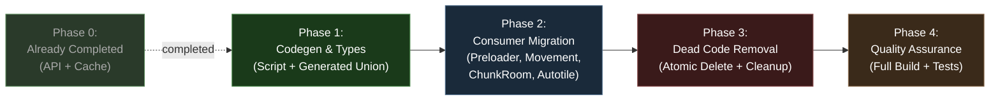
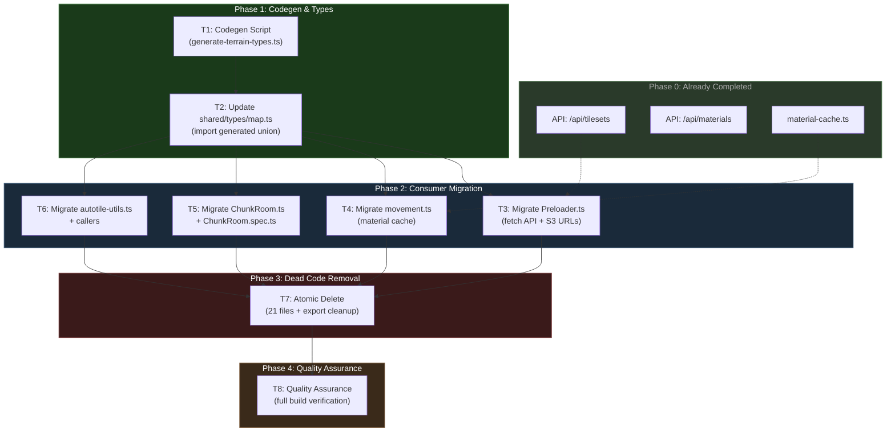

# Work Plan: Remove Local Tiles & Map Generator -- Full DB Migration

Created Date: 2026-02-21
Type: refactor
Estimated Duration: 2-3 days
Estimated Impact: 36 files (2 new, 10 modified, 21 deleted, 3 already completed)
Related Issue/PR: Design-012

## Related Documents

- Design Doc: [docs/design/design-012-remove-local-tiles-db-migration.md](../design/design-012-remove-local-tiles-db-migration.md)
- ADR: [docs/adr/ADR-0009-tileset-management-architecture.md](../adr/ADR-0009-tileset-management-architecture.md)
- Design-011: [docs/design/design-011-tileset-management.md](../design/design-011-tileset-management.md)

## Objective

Remove all hardcoded terrain definitions and the procedural map generator from `map-lib`, rewiring all consumers to use database-driven tileset and material services. After this migration, terrain data flows exclusively from PostgreSQL via API endpoints and DB services, eliminating 21 dead-code files and the `@nookstead/map-lib` generation pipeline.

## Background

The current codebase has dual sources of truth for terrain data: hardcoded arrays in `map-lib` (TERRAINS, SURFACE_PROPERTIES) and the new database-driven tileset/material services introduced in Design-011. The game client Preloader loads spritesheets from local file paths, the movement system uses `getSurfaceProperties()` from map-lib, and new player map provisioning uses a procedural generator. All of these must be migrated to use DB-backed services while the genmap editor (already partially migrated) needs its autotile utilities updated to accept DB data as parameters.

## Risks and Countermeasures

### Technical Risks

- **Risk**: S3 CORS blocks Phaser spritesheet loading from presigned URLs
  - **Impact**: Game client cannot load tileset images; blank/broken rendering
  - **Countermeasure**: Verify S3/R2 bucket CORS headers include the game domain. Test with a manual fetch before full integration.

- **Risk**: No editor maps exist in DB when a new player joins
  - **Impact**: New player onJoin fails with no template map available
  - **Countermeasure**: Explicit check in ChunkRoom.onJoin; return clear error message to client. Ensure at least one editor map is seeded before deployment.

- **Risk**: Async fetch in Preloader fails (network error, server down)
  - **Impact**: Game stuck on loading screen
  - **Countermeasure**: Add error handling and retry logic in Loading scene. Design Doc specifies graceful degradation.

- **Risk**: Generated TerrainCellType gets out of sync with DB materials
  - **Impact**: TypeScript build errors or runtime type mismatches
  - **Countermeasure**: Add `generate:terrain-types` npm script. Document in README that this must be run after material changes.

- **Risk**: Movement regression from material cache miss (unknown terrain key)
  - **Impact**: Player movement speed incorrect for unmapped terrains
  - **Countermeasure**: Default to `{ walkable: true, speedModifier: 1.0, swimRequired: false, damaging: false }` for unknown keys (already implemented in material-cache.ts).

### Schedule Risks

- **Risk**: Steps 9-11 (file deletions + export cleanup) cause cascading build failures if done non-atomically
  - **Impact**: Intermediate commits may break the build
  - **Countermeasure**: These steps are grouped as a single atomic commit. All deletions and export updates happen together.

- **Risk**: Genmap autotile-utils refactoring touches many callers
  - **Impact**: Missed caller causes runtime crash in map editor
  - **Countermeasure**: Systematic caller enumeration documented in design doc. Grep for all imports of affected functions before committing.

## Phase Structure Diagram

## Task Dependency Diagram

---

## Phase 0: Already Completed (No Action Required)

These tasks correspond to Design Doc steps 1-2 and are already implemented and functional.

- [x] **T0.1**: Create `/api/tilesets` endpoint (`apps/game/src/app/api/tilesets/route.ts`)
  - Fetches tilesets from DB via `listTilesets()`, generates presigned S3 URLs
- [x] **T0.2**: Create `/api/materials` endpoint (`apps/game/src/app/api/materials/route.ts`)
  - Fetches materials from DB via `listMaterials()`, returns properties (walkable, speedModifier, etc.)
- [x] **T0.3**: Create material cache service (`apps/game/src/game/services/material-cache.ts`)
  - In-memory `Map<string, MaterialProperties>` loaded once via `loadMaterialCache()`
  - Exports `getMaterialProperties()` and `isMaterialWalkable()`

---

## Phase 1: Codegen and Type Generation (Estimated commits: 2)

**Purpose**: Create the codegen script that auto-generates `TerrainCellType` from the database, and update the shared types to use it. This must happen first because all consumers depend on the `TerrainCellType` union.

### Tasks

- [ ] **T1: Create codegen script and generate terrain types** (Design Doc step 3)
  - **Create**: `scripts/generate-terrain-types.ts`
    - Connects to PostgreSQL via `createDrizzleClient(process.env.DATABASE_URL)`
    - Calls `listMaterials(db)` to get all material keys
    - Writes `packages/shared/src/types/terrain-cell-type.generated.ts` with a TypeScript union type
    - Includes header comment: `// AUTO-GENERATED -- do not edit manually.`
    - Includes generation command hint: `// Run: pnpm generate:terrain-types`
  - **Create**: `packages/shared/src/types/terrain-cell-type.generated.ts` (output of running the script)
  - **Update**: Add `"generate:terrain-types"` script to root `package.json`
  - **Completion criteria**:
    - Script runs successfully against local DB
    - Generated file contains a union type matching all material keys in the database
    - Generated output compiles without errors

- [ ] **T2: Update shared/types/map.ts to import generated TerrainCellType** (Design Doc step 4)
  - **Modify**: `packages/shared/src/types/map.ts`
    - Remove the hardcoded 29-value `TerrainCellType` union (lines 6-16)
    - Replace with: `export type { TerrainCellType } from './terrain-cell-type.generated';`
  - **Completion criteria**:
    - `TerrainCellType` is re-exported from the generated file
    - All existing imports of `TerrainCellType` from `@nookstead/shared` continue to resolve
    - `pnpm nx typecheck game` passes (verify no downstream breakage)

### Phase 1 Completion Criteria

- [ ] Codegen script exists and produces valid TypeScript output
- [ ] `TerrainCellType` in shared package sources from generated file
- [ ] Typecheck passes for shared package consumers

### Operational Verification Procedures

1. Run `pnpm generate:terrain-types` and verify `terrain-cell-type.generated.ts` is created
2. Inspect generated file: confirm union matches DB material count
3. Run `pnpm nx typecheck game` to verify type resolution works end-to-end

---

## Phase 2: Consumer Migration (Estimated commits: 4)

**Purpose**: Migrate all files that currently import from the deprecated `map-lib` terrain/generation modules to use the new DB-backed services. Each task is one commit. Tasks T3-T6 can be done in any order (all depend on T2 only), but are numbered to match the Design Doc implementation order.

### Tasks

- [ ] **T3: Migrate Preloader.ts to fetch tileset metadata from API** (Design Doc step 5)
  - **Modify**: `apps/game/src/game/scenes/Preloader.ts`
    - Remove: `import { TERRAINS } from '@nookstead/map-lib';` (line 11)
    - Change `preload()` to `async preload()` or move fetch logic to `create()`
    - Fetch tileset metadata: `const res = await fetch('/api/tilesets');`
    - Parse response: array of `{ key, name, s3Url }`
    - For each tileset: `this.load.spritesheet(key, s3Url, { frameWidth: FRAME_SIZE, frameHeight: FRAME_SIZE })`
    - Add error handling for fetch failure (log error, emit event for Loading scene to handle)
  - **Dependencies**: T0.1 (API endpoint -- already done), T2 (types)
  - **Completion criteria**:
    - Preloader no longer imports from `@nookstead/map-lib`
    - Spritesheets are loaded from S3 presigned URLs
    - Error handling covers network failure case
    - `pnpm nx typecheck game` passes

- [ ] **T4: Migrate movement.ts to use material cache** (Design Doc step 6)
  - **Modify**: `apps/game/src/game/systems/movement.ts`
    - Remove: `import { getSurfaceProperties } from '@nookstead/map-lib';` (line 11)
    - Add: `import { getMaterialProperties } from '../services/material-cache';`
    - Update `getTerrainSpeedModifier()` (line 113):
      - Before: `return getSurfaceProperties(terrain).speedModifier;`
      - After: `return getMaterialProperties(terrain).speedModifier;`
  - **Dependencies**: T0.3 (material cache -- already done), T2 (types)
  - **Completion criteria**:
    - `movement.ts` no longer imports from `@nookstead/map-lib`
    - Speed modifier lookup uses material cache (same O(1) Map lookup)
    - Existing movement unit tests still pass (update mocks if needed)
    - `pnpm nx test game` passes

- [ ] **T5: Migrate ChunkRoom.ts and ChunkRoom.spec.ts to DB-based map provisioning** (Design Doc step 7)
  - **Modify**: `apps/server/src/rooms/ChunkRoom.ts`
    - Remove: `import { createMapGenerator } from '@nookstead/map-lib';` (line 9)
    - Add: `import { listEditorMaps } from '@nookstead/db';`
    - Replace the "new player" branch (lines 144-177) with:
      - Call `listEditorMaps(db, { mapType: 'player_homestead' })`
      - If empty: send `ServerMessage.ERROR` with `'No template maps available'`
      - Otherwise: pick random map, construct `mapPayload` from template data
      - Save as player's map via `saveMap(db, { userId, ...mapData })`
  - **Modify**: `apps/server/src/rooms/ChunkRoom.spec.ts`
    - Remove the `@nookstead/map-lib` mock (lines 122-138: `mockGenerate`, `mockCreateMapGenerator`, `jest.mock('@nookstead/map-lib', ...)`)
    - Add mock for `listEditorMaps` in the `@nookstead/db` mock block
    - Update test "onJoin new player: generates map, saves to DB, sends MAP_DATA":
      - Mock `listEditorMaps` to return a template map array
      - Verify `listEditorMaps` was called (not `createMapGenerator`)
      - Verify `saveMap` was called with the template data
    - Update test "onJoin map generation failure: sends ERROR, does not crash":
      - Change to test the "no editor maps available" case
      - Mock `listEditorMaps` to return empty array
      - Verify `ServerMessage.ERROR` sent with appropriate message
    - Keep existing tests for returning player, movement, and disconnect unchanged
  - **Dependencies**: T2 (types)
  - **Completion criteria**:
    - `ChunkRoom.ts` no longer imports from `@nookstead/map-lib`
    - New player gets a random editor map from DB instead of procedurally generated map
    - All ChunkRoom tests pass with updated mocks
    - `pnpm nx test server` passes

- [ ] **T6: Migrate autotile-utils.ts and update all callers** (Design Doc step 8)
  - **Modify**: `apps/genmap/src/hooks/autotile-utils.ts`
    - Remove imports: `TERRAINS`, `isWalkable` from `@nookstead/map-lib` (lines 6-7)
    - Keep imports: `getFrame`, direction constants, `EMPTY_FRAME` from `@nookstead/map-lib`
    - Update `checkTerrainPresence(terrain, terrainKey)` signature:
      - Add parameter: `tilesets: Array<{ key: string; name: string }>`
      - Replace: `TERRAINS.find(...)` with `tilesets.find(t => t.key === terrainKey)`
    - Update `computeNeighborMask(...)` signature:
      - Add parameter: `tilesets: Array<{ key: string; name: string }>`
      - Pass `tilesets` through to `checkTerrainPresence`
    - Update `recomputeAutotileLayers(...)` signature:
      - Add parameter: `tilesets: Array<{ key: string; name: string }>`
      - Pass `tilesets` through to `checkTerrainPresence` and `computeNeighborMask`
    - Update `recomputeWalkability(grid, width, height)` signature:
      - Add parameter: `materials: Map<string, { walkable: boolean }>`
      - Replace: `isWalkable(grid[y][x].terrain as TerrainCellType)` with `materials.get(grid[y][x].terrain)?.walkable ?? true`
  - **Modify**: `apps/genmap/src/hooks/map-editor-commands.ts`
    - Update `applyDeltas()` function signature to accept `tilesets` and `materials` parameters
    - Pass `tilesets` to `recomputeAutotileLayers()` call (line 75)
    - Pass `materials` to `recomputeWalkability()` call (line 82)
    - Update callers of `applyDeltas` (PaintCommand.execute/undo, FillCommand.execute/undo) -- these need `tilesets` and `materials` in their state or passed through
  - **Modify**: `apps/genmap/src/app/(app)/maps/new/page.tsx`
    - Remove: `import { isWalkable } from '@nookstead/map-lib'` (or wherever it is imported)
    - Update `buildWalkableGrid()` (line 73): Replace `isWalkable('deep_water')` with a direct `false` (deep_water is never walkable) or fetch materials and use lookup
  - **Dependencies**: T2 (types)
  - **Completion criteria**:
    - `autotile-utils.ts` no longer imports `TERRAINS` or `isWalkable` from `@nookstead/map-lib`
    - All callers updated to pass tilesets/materials parameters
    - `map-editor-commands.ts` passes tilesets/materials through the call chain
    - `maps/new/page.tsx` no longer uses `isWalkable` from map-lib
    - `pnpm nx typecheck genmap` passes
    - Genmap build succeeds

### Phase 2 Completion Criteria

- [ ] No file in `apps/game`, `apps/server`, or `apps/genmap` imports terrain, terrain-properties, or generation modules from `@nookstead/map-lib`
- [ ] All existing tests pass with updated mocks/implementations
- [ ] Typecheck passes for all three apps

### Operational Verification Procedures

1. Verify Preloader: Start dev server, confirm tileset spritesheets load from S3 URLs in browser network tab
2. Verify movement: Walk on different terrain types, confirm speed modifiers apply correctly
3. Verify ChunkRoom: Connect as a new player (no saved map), confirm a random editor map is received
4. Verify autotile: Open genmap editor, paint terrain, confirm autotile frames compute correctly
5. Run `pnpm nx run-many -t typecheck -p game server genmap` -- all pass

---

## Phase 3: Dead Code Removal -- Atomic Commit (Estimated commits: 1)

**Purpose**: Delete all deprecated files and clean up exports. This phase is a single atomic commit because intermediate states (e.g., files deleted but exports not updated, or exports removed but files still referenced) will cause build failures.

**CRITICAL**: Steps 9-11 from the Design Doc must be done in a single commit.

### Tasks

- [ ] **T7: Delete deprecated files and update all package exports** (Design Doc steps 9-11)
  - **Delete 21 files**:
    - `packages/map-lib/src/core/terrain.ts`
    - `packages/map-lib/src/core/terrain-properties.ts`
    - `packages/map-lib/src/generation/index.ts`
    - `packages/map-lib/src/generation/map-generator.ts`
    - `packages/map-lib/src/generation/passes/island-pass.ts`
    - `packages/map-lib/src/generation/passes/connectivity-pass.ts`
    - `packages/map-lib/src/generation/passes/water-border-pass.ts`
    - `packages/map-lib/src/generation/passes/autotile-pass.ts`
    - `apps/server/src/mapgen/index.ts`
    - `apps/server/src/mapgen/index.spec.ts`
    - `apps/server/src/mapgen/autotile.ts`
    - `apps/server/src/mapgen/terrain-properties.ts`
    - `apps/server/src/mapgen/types.ts`
    - `apps/server/src/mapgen/passes/island-pass.ts`
    - `apps/server/src/mapgen/passes/connectivity-pass.ts`
    - `apps/server/src/mapgen/passes/water-border-pass.ts`
    - `apps/server/src/mapgen/passes/autotile-pass.ts`
    - `apps/game/src/game/terrain.ts`
    - `apps/game/src/game/terrain-properties.ts`
    - `apps/game/src/game/autotile.ts`
    - `apps/game/src/game/mapgen/types.ts`
  - **Modify**: `packages/map-lib/src/index.ts`
    - Remove lines 14-30 (terrain, terrain-properties, generation exports)
    - Keep lines 1-12 (shared type re-exports + autotile engine exports)
    - Keep lines 32-42 (map types, zone types, template types)
  - **Modify**: `packages/shared/src/constants.ts`
    - Remove lines 86-100: `NOISE_OCTAVES`, `NOISE_LACUNARITY`, `NOISE_PERSISTENCE`, `NOISE_SCALE`, `ELEVATION_EXPONENT`, `DEEP_WATER_THRESHOLD`, `WATER_THRESHOLD`, `MIN_WATER_BORDER`
  - **Modify**: `packages/shared/src/index.ts`
    - Remove noise/generation constant exports (lines 36-43): `NOISE_OCTAVES`, `NOISE_LACUNARITY`, `NOISE_PERSISTENCE`, `NOISE_SCALE`, `ELEVATION_EXPONENT`, `DEEP_WATER_THRESHOLD`, `WATER_THRESHOLD`, `MIN_WATER_BORDER`
    - Remove type exports: `GenerationPass`, `LayerPass` (lines 57-58)
  - **Modify**: `packages/shared/src/types/map.ts`
    - Remove `GenerationPass` and `LayerPass` type definitions (generation-only types no longer needed)
  - **Pre-commit verification**: Run `pnpm nx run-many -t typecheck -p game server genmap map-lib shared` before committing to catch any missed references
  - **Completion criteria**:
    - All 21 files deleted
    - No dangling imports remain (grep for deleted module paths returns zero results)
    - `packages/map-lib/src/index.ts` only exports autotile engine + map/zone/template types
    - `packages/shared/src/constants.ts` has no generation constants
    - `packages/shared/src/index.ts` has no generation type/constant exports
    - Full typecheck passes

### Phase 3 Completion Criteria

- [ ] 21 deprecated files deleted from repository
- [ ] Package exports cleaned (map-lib, shared)
- [ ] No file in the monorepo imports any deleted module
- [ ] `pnpm nx run-many -t typecheck` passes for all projects

### Operational Verification Procedures

1. `grep -r "createMapGenerator\|TERRAINS\b\|getSurfaceProperties\|isWalkable.*map-lib\|SURFACE_PROPERTIES\|terrain-properties\|NOISE_OCTAVES\|GenerationPass\|LayerPass" packages/ apps/ --include="*.ts" --include="*.tsx"` returns zero matches (excluding test snapshots and this plan)
2. `pnpm nx run-many -t typecheck` -- all projects pass
3. `pnpm nx run-many -t build -p game server genmap` -- all builds succeed

---

## Phase 4: Quality Assurance (Estimated commits: 1)

**Purpose**: Full verification that the entire monorepo builds, passes all tests, and has no lint errors after the migration.

### Tasks

- [ ] **T8: Full build and test verification** (Design Doc step 12)
  - Run: `pnpm nx run-many -t lint test build typecheck`
  - Verify all projects pass all targets
  - Fix any regressions discovered
  - **Completion criteria**:
    - Zero lint errors across all projects
    - All unit tests pass
    - All integration tests pass
    - All projects build successfully
    - All typechecks pass

### Phase 4 Completion Criteria

- [ ] `pnpm nx run-many -t lint test build typecheck` exits with code 0
- [ ] No skipped or commented-out tests
- [ ] No TODO/FIXME comments related to this migration remain

### Operational Verification Procedures

1. Run `pnpm nx run-many -t lint test build typecheck` and capture output
2. Verify exit code is 0
3. Spot-check: Start game dev server (`pnpm nx dev game`), verify loading screen completes
4. Spot-check: Open genmap editor, verify terrain palette and autotile still function

---

## Completion Criteria

- [ ] All phases completed (Phase 1 through Phase 4)
- [ ] Each phase's operational verification procedures executed
- [ ] Design Doc implementation order (steps 1-12) fully covered
- [ ] 21 deprecated files deleted
- [ ] No imports from deleted map-lib modules remain in the codebase
- [ ] Terrain data flows exclusively from PostgreSQL
- [ ] `pnpm nx run-many -t lint test build typecheck` passes with zero errors
- [ ] User review approval obtained

## Progress Tracking

### Phase 0 (Already Completed)
- Status: COMPLETED
- Notes: API endpoints and material cache implemented prior to this plan

### Phase 1
- Start: pending
- Complete: pending
- Notes: Approved 2026-02-21

### Phase 2
- Start:
- Complete:
- Notes:

### Phase 3
- Start:
- Complete:
- Notes:

### Phase 4
- Start:
- Complete:
- Notes:

## Notes

- **Commit strategy**: Per-task commits (one commit per task T1-T8). Ask user before each implementation commit.
- **Migration approach**: Big bang (single branch). All changes land together.
- **Atomic constraint**: Tasks T7 (Phase 3) must be a single atomic commit. Do not split file deletions and export cleanup into separate commits.
- **Material cache load timing**: `loadMaterialCache()` must be called during the Loading scene (after Preloader). This is already the intended flow per Design Doc section 2.
- **Codegen re-run**: After any material is added/removed in the DB, `pnpm generate:terrain-types` must be re-run and the generated file committed. Document this in the project README.
- **Genmap state threading**: The `tilesets` and `materials` parameters added to autotile-utils functions must be threaded through `MapEditorState` or provided by React context/hooks. The genmap editor already loads tilesets via `useTilesets()` hook, so the data is available -- it just needs to be passed through the call chain.
