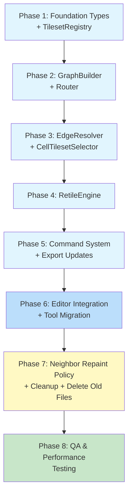
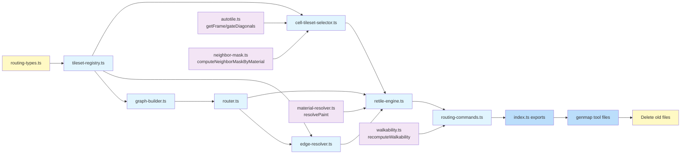

# Work Plan: Autotile Routing System Implementation

Created Date: 2026-02-23
Type: refactor
Estimated Duration: 6-8 days
Estimated Impact: 19 files (8 new, 4 deleted, 7 modified)
Related Issue/PR: N/A

## Related Documents
- Design Doc: [docs/design/design-015-autotile-routing-system.md](../design/design-015-autotile-routing-system.md)
- ADR: [docs/adr/ADR-0011-autotile-routing-architecture.md](../adr/ADR-0011-autotile-routing-architecture.md)
- Neighbor Repaint Policy: [docs/design/design-015-neighbor-repaint-policy-v2-ru.md](../design/design-015-neighbor-repaint-policy-v2-ru.md)
- Prerequisite ADRs: ADR-0010 (map-lib extraction), ADR-0009 (tileset management), ADR-0006 (map editor architecture)

## Objective

Replace the current dominant-neighbor autotile pipeline with a graph-based BFS routing system. The new system resolves three fundamental limitations of the current approach: no multi-hop routing, no multi-material background consensus, and no conflict resolution at T-junctions.

The routing architecture provides: optimal tileset selection for arbitrary material graphs via BFS shortest-path routing, per-cell background consensus with virtual boundary materials, configurable material priority for conflict resolution (S1/S2), and an incremental RetileEngine with per-cell caching for performance.

## Background

The current `recomputeAutotileLayers()` pipeline uses `findDominantNeighbor` + `findIndirectTileset` (1-hop search). As more biome materials are added, the number of unreachable material pairs grows combinatorially. The new system builds a compatibility graph from tileset metadata, computes all-pairs BFS routing tables, resolves background consensus per cell, and selects the correct transition tileset -- all orchestrated by an incremental RetileEngine with per-cell caching.

**Implementation Approach**: Horizontal Slice (Foundation-driven), per Design Doc. The 8 new modules form a strict dependency chain where each layer can be implemented and fully tested in isolation before the next layer builds on top.

**Development Strategy**: TDD -- all spec files are already written and committed. Each implementation task takes a RED spec file and makes it GREEN by creating the corresponding implementation module.

### Current State

**Spec files already committed (RED -- tests exist, implementations do not):**

| Spec File | Tests | Lines |
|-----------|-------|-------|
| `tileset-registry.spec.ts` | 14 | 215 |
| `graph-builder.spec.ts` | 9 | 155 |
| `router.spec.ts` | 13 | 241 |
| `edge-resolver.spec.ts` | 7 | 218 |
| `cell-tileset-selector.spec.ts` | 18 | 367 |
| `retile-engine.spec.ts` | 23 | 460 |
| `retile-engine.integration.spec.ts` | 18 | 417 |
| `routing-pipeline.integration.spec.ts` | 20 | 455 |
| **Total** | **122** | **2,528** |

**Implementation files to CREATE:** 8 files (routing-types.ts, tileset-registry.ts, graph-builder.ts, router.ts, edge-resolver.ts, cell-tileset-selector.ts, retile-engine.ts, routing-commands.ts)

**Files to DELETE:** 4 files (autotile-layers.ts, autotile-layers.spec.ts, commands.ts, commands.spec.ts)

**Files to UPDATE:** 7 files (index.ts, neighbor-mask.ts, use-map-editor.ts, brush-tool.ts, fill-tool.ts, eraser-tool.ts, rectangle-tool.ts)

## Risks and Countermeasures

### Technical Risks

- **Risk**: S1 conflict resolution non-convergence producing infinite iteration loops
  - **Impact**: High -- incorrect or flickering tiles at multi-material junctions
  - **Countermeasure**: Max 4 iterations with deterministic top-to-bottom left-to-right order; S2 fallback always terminates; exhaustive unit tests for conflict scenarios (AC5)

- **Risk**: Performance regression on large maps (256x256) during batch paint or full rebuild
  - **Impact**: High -- editor becomes unusable if single-cell paint exceeds 16ms frame budget
  - **Countermeasure**: Incremental dirty propagation (R=2 Chebyshev); full-pass threshold at 50% of map; benchmark before/after; target <5ms for brush, <500ms for full rebuild (AC6)

- **Risk**: Breaking existing undo/redo behavior during command system migration
  - **Impact**: Medium -- data loss for users relying on undo stack
  - **Countermeasure**: New commands implement same EditorCommand interface; round-trip test (execute -> undo -> verify === original) for every command type (AC8)

- **Risk**: BFS routing table incorrect for complex graphs with tie-breaking
  - **Impact**: High -- wrong tileset selection across the entire map
  - **Countermeasure**: Exhaustive unit tests with known-correct expected paths from Design Doc worked examples; deterministic preference array tie-breaking (AC2)

- **Risk**: Edge ownership disagrees across adjacent cells
  - **Impact**: Medium -- visible seam artifacts at cell boundaries
  - **Countermeasure**: resolveEdge is called symmetrically; unit tests verify resolveEdge(A,B,N) and resolveEdge(B,A,S) consistency (AC3)

### Schedule Risks

- **Risk**: Conflict resolution (S1) complexity underestimated
  - **Impact**: Phase 3 extends by 1-2 days
  - **Countermeasure**: S2-only fallback provides working (if suboptimal) results; S1 can be deferred to a follow-up if needed

- **Risk**: Integration with use-map-editor.ts reducer exposes unforeseen coupling
  - **Impact**: Phase 6 extends by 1 day
  - **Countermeasure**: Old and new code coexist during phases 1-5; switchover is a single reducer update

## Migration Strategy

The Design Doc specifies a 4-step migration:

1. **During Phases 1-4**: Implement all new modules alongside existing code. Old modules (`autotile-layers.ts`, `commands.ts`) remain functional.
2. **Phase 5**: Add new exports to `index.ts`, add routing-commands.
3. **Phase 6**: Switch `use-map-editor.ts` and all tool files to use new commands and RetileEngine. Remove old imports.
4. **Phase 7**: Delete old modules, clean up deprecated exports.

**Rollback Plan**: During Phases 1-6, the old system remains fully functional alongside new modules. If the new system fails integration testing, revert the `use-map-editor.ts` and tool file import changes (Phase 6 rollback) to restore the old pipeline. **After Phase 7** (old files deleted), rollback requires `git revert` of the Phase 7 commit to restore deleted modules. Therefore: Phase 7 must only proceed after Phase 6 integration is fully verified and stable.

## Phase Structure Diagram

## Task Dependency Diagram

**Legend**: Yellow = types/cleanup, Blue = new modules, Light blue = integration, Purple = existing reused modules.

## Implementation Phases

---

### Phase 1: Foundation Types + TilesetRegistry (Estimated commits: 2)

**Purpose**: Establish all shared type definitions and the leaf-node data access layer. Every subsequent module depends on these types and the registry.

**Depends on**: Nothing (foundation layer)

**Test resolution**: 0/14 -> 14/14 (tileset-registry.spec.ts)

#### Tasks

- [ ] **Task 1.1**: Create `packages/map-lib/src/types/routing-types.ts` with all routing type definitions
  - Types from Design Doc contract definitions: `CompatGraph`, `RenderGraph`, `MaterialPriorityMap`, `RoutingTable` interface, `NeighborDirection`, `CellCacheEntry`, `CellCache`, `CellPatchEntry`, `RetileResult`, `RetileEngineOptions`
  - Edge direction constants: `EDGE_N`, `EDGE_E`, `EDGE_S`, `EDGE_W`
  - Import `EditorLayer` from `editor-types.ts`, `Cell` from `@nookstead/shared`, `TilesetInfo`/`MaterialInfo` from `material-types.ts`
  - All types use `readonly` modifiers and `ReadonlyArray`/`ReadonlyMap`
  - JSDoc on every exported type
  - **Success criteria**: File compiles with `pnpm nx typecheck map-lib`

- [x] **Task 1.2**: Create `packages/map-lib/src/core/tileset-registry.ts` -- make `tileset-registry.spec.ts` GREEN
  - Implement `TilesetRegistry` class per Design Doc contract
  - Constructor accepts `ReadonlyArray<TilesetInfo>`, validates and indexes entries
  - Entries without `fromMaterialKey` are skipped
  - Base tilesets: `fromMaterialKey === toMaterialKey` or `toMaterialKey` absent
  - Transition tilesets: both keys present and different
  - API: `hasTileset(fg, bg)`, `getTilesetKey(fg, bg)`, `getBaseTilesetKey(material)`, `getAllMaterials()`, `getAllTransitionPairs()`, `getTilesetInfo(key)`
  - Internal indexing uses `"from:to"` key format
  - Immutable after construction; JSDoc on all public methods
  - **Success criteria**: All 14 tests in `tileset-registry.spec.ts` pass
  - **Verify**: `pnpm nx test map-lib --testFile=src/core/tileset-registry.spec.ts`

- [ ] **Task 1.3**: Quality check -- `pnpm nx typecheck map-lib && pnpm nx lint map-lib`

#### Phase 1 Completion Criteria

- [ ] All routing types defined and exported from `routing-types.ts`
- [ ] `tileset-registry.spec.ts`: 14/14 tests GREEN (AC1 partial)
- [ ] `pnpm nx typecheck map-lib` passes
- [ ] `pnpm nx lint map-lib` passes

#### Operational Verification Procedures

1. Run `pnpm nx test map-lib --testFile=src/core/tileset-registry.spec.ts` -- all 14 tests pass
2. Run `pnpm nx typecheck map-lib` -- no type errors
3. Verify `routing-types.ts` exports are importable from spec files
4. Verify TilesetRegistry correctly handles the reference tileset set from Design Doc (11 tilesets, 10 materials)

---

### Phase 2: GraphBuilder + Router (Estimated commits: 2)

**Purpose**: Build the material compatibility graph (undirected) and render graph (directed) from the registry, then compute the BFS all-pairs shortest-path routing table with configurable tie-break preferences.

**Depends on**: Phase 1 (TilesetRegistry, routing types)

**Test resolution**: 14/14 -> 36/36 (graph-builder: +9, router: +13)

#### Tasks

- [x] **Task 2.1**: Create `packages/map-lib/src/core/graph-builder.ts` -- make `graph-builder.spec.ts` GREEN
  - Implement `buildGraphs(registry)` returning `MaterialGraphs { compatGraph, renderGraph }`
  - `compatGraph` (undirected): if A_B or B_A tileset exists, both A->B and B->A edges
  - `renderGraph` (directed): A->B only if A_B tileset exists
  - Self-edges excluded (base tilesets where `from === to`)
  - Export `MaterialGraphs` type
  - JSDoc on all exports
  - **Success criteria**: All 9 tests in `graph-builder.spec.ts` pass
  - **Verify**: `pnpm nx test map-lib --testFile=src/core/graph-builder.spec.ts`

- [x] **Task 2.2**: Create `packages/map-lib/src/core/router.ts` -- make `router.spec.ts` GREEN
  - Implement `computeRoutingTable(compatGraph, preferences)` returning `RoutingTable`
  - BFS from each material to all others on compatGraph
  - Store `nextHop[from][to]` -- first step on shortest path
  - Tie-break equal-length paths using preferences array (earlier index = preferred)
  - `nextHop(A, A)` returns `null`; unreachable pairs return `null`
  - Routing table immutable after construction
  - JSDoc on all exports
  - **Success criteria**: All 13 tests in `router.spec.ts` pass
  - **Verify**: `pnpm nx test map-lib --testFile=src/core/router.spec.ts`

- [ ] **Task 2.3**: Quality check -- `pnpm nx typecheck map-lib && pnpm nx lint map-lib`

#### Phase 2 Completion Criteria

- [ ] `graph-builder.spec.ts`: 9/9 tests GREEN (AC1)
- [ ] `router.spec.ts`: 13/13 tests GREEN (AC2)
- [ ] `nextHop('deep_water', 'soil') === 'water'` with reference tileset set (AC2)
- [ ] Tie-breaking is deterministic via preference array
- [ ] `pnpm nx test map-lib` passes (all existing + phases 1-2)

#### Operational Verification Procedures

1. Run `pnpm nx test map-lib --testFile=src/core/graph-builder.spec.ts` -- all 9 tests pass
2. Run `pnpm nx test map-lib --testFile=src/core/router.spec.ts` -- all 13 tests pass
3. Verify the routing table matches all 10 entries in Design Doc "Reference: Routing Table"
4. Verify `computeRoutingTable` returns `null` for disconnected materials

---

### Phase 3: EdgeResolver + CellTilesetSelector (Estimated commits: 2)

**Purpose**: Implement per-edge ownership determination and per-cell tileset selection with S1/S2 conflict resolution. These are the core decision-making modules of the routing pipeline.

**Depends on**: Phase 2 (Router, RoutingTable), Phase 1 (TilesetRegistry, types)

**Test resolution**: 36/36 -> 61/61 (edge-resolver: +7, cell-tileset-selector: +18)

#### Tasks

- [x] **Task 3.1**: Create `packages/map-lib/src/core/edge-resolver.ts` -- make `edge-resolver.spec.ts` GREEN
  - Implement `resolveEdge(materialA, materialB, dir, router, registry, priorities)` -> `EdgeOwner | null`
  - Compute `virtualBG_A = nextHop(A, B)` and `virtualBG_B = nextHop(B, A)`
  - Check if matching transition tileset exists via `registry.hasTileset`
  - If only one candidate valid: that candidate owns
  - If both valid: higher `materialPriority` wins
  - If neither valid: return `null`
  - Same-material edges return early
  - Define and export `EdgeOwner` type, `EdgeDirection` type
  - JSDoc on all exports
  - **Success criteria**: All 7 tests in `edge-resolver.spec.ts` pass
  - **Verify**: `pnpm nx test map-lib --testFile=src/core/edge-resolver.spec.ts`

- [x] **Task 3.2**: Create `packages/map-lib/src/core/cell-tileset-selector.ts` -- make `cell-tileset-selector.spec.ts` GREEN
  - Implement three functions per Design Doc contract:
    - `selectTilesetForCell(fg, ownedEdges, registry)` -> `{ selectedTilesetKey, bg }`
      - Per-Cell BG Resolution Algorithm (Design Doc Steps 1-4)
      - S1 Owner Reassign (max 4 iterations) then S2 BG Priority Fallback
    - `computeCellFrame(grid, x, y, width, height, fg)` -> `{ mask47, frameId }`
      - Uses `computeNeighborMaskByMaterial` + `getFrame` from existing modules
      - Mask ALWAYS from FG comparison only (Design Doc invariant 2)
    - `resolveRenderTilesetKey(fg, selectedTilesetKey, frameId, materials, registry)` -> `string`
      - Default policy: if frameId === SOLID_FRAME and baseTilesetKey exists, use it
  - JSDoc on all exports
  - **Success criteria**: All 18 tests in `cell-tileset-selector.spec.ts` pass
  - **Verify**: `pnpm nx test map-lib --testFile=src/core/cell-tileset-selector.spec.ts`

- [ ] **Task 3.3**: Quality check -- `pnpm nx typecheck map-lib && pnpm nx lint map-lib`

#### Phase 3 Completion Criteria

- [ ] `edge-resolver.spec.ts`: 7/7 tests GREEN (AC3)
- [ ] `cell-tileset-selector.spec.ts`: 18/18 tests GREEN (AC4, AC5 partial)
- [ ] Preset A (water-side owns) and Preset B (land-side owns) produce correct results
- [ ] S1 converges within 4 iterations; S2 fallback deterministic
- [ ] Blob-47 mask by FG only; diagonal gating preserved
- [ ] `pnpm nx test map-lib` passes

#### Operational Verification Procedures

1. Run `pnpm nx test map-lib --testFile=src/core/edge-resolver.spec.ts` -- all 7 tests pass
2. Run `pnpm nx test map-lib --testFile=src/core/cell-tileset-selector.spec.ts` -- all 18 tests pass
3. Verify Design Doc Worked Example 1: deep_water|soil edge produces correct tilesets and frames
4. Verify switching to Preset B produces different but correct results

---

### Phase 4: RetileEngine (Estimated commits: 2-3)

**Purpose**: Implement the orchestrator that maintains per-cell cache, propagates dirty sets via Chebyshev R=2, and calls EdgeResolver/CellTilesetSelector for each dirty cell. This is the central module that replaces `recomputeAutotileLayers`.

**Depends on**: Phase 3 (EdgeResolver, CellTilesetSelector), Phase 2 (Router), Phase 1 (TilesetRegistry)

**Test resolution**: 61/61 -> 102/102 (retile-engine: +23, retile-engine.integration: +18)

#### Tasks

- [x] **Task 4.1**: Create `packages/map-lib/src/core/retile-engine.ts` -- make `retile-engine.spec.ts` GREEN
  - Implement `RetileEngine` class per Design Doc contract
  - Constructor accepts `RetileEngineOptions`, internally constructs TilesetRegistry, runs buildGraphs, computeRoutingTable
  - Maintains `CellCache[][]` and two reverse indices: `cellsBySelectedTilesetKey: Map<string, Set<number>>` and `cellsByRenderTilesetKey: Map<string, Set<number>>` for fast T3a lookups (Design Doc AC6)
  - API methods (all per Design Doc):
    - `applyMapPatch(state, patch)` -> `RetileResult` (T1/T2 triggers)
    - `updateTileset(state, tilesetKey, newMaskToTile)` -> `RetileResult` (T3a)
    - `removeTileset(state, tilesetKey)` -> `RetileResult` (T3b)
    - `addTileset(state, tilesetInfo)` -> `RetileResult` (T3b)
    - `switchTilesetGroup(state, tilesets)` -> `RetileResult` (T4)
    - `rebuild(state, mode, changedCells?)` -> `RetileResult`
  - Dirty propagation: R=2 Chebyshev; >50% triggers full-pass
  - Max 4 S1 iterations per rebuild; input state NEVER mutated
  - Empty grid returns unchanged layers; OOB coordinates skipped
  - **Success criteria**: All 23 tests in `retile-engine.spec.ts` pass
  - **Verify**: `pnpm nx test map-lib --testFile=src/core/retile-engine.spec.ts`

- [x] **Task 4.2**: Make `retile-engine.integration.spec.ts` GREEN
  - These integration tests exercise the full pipeline (registry -> graphs -> router -> edge resolver -> cell selector -> engine)
  - May require adjustments to the engine implementation from Task 4.1
  - **Success criteria**: All 18 tests in `retile-engine.integration.spec.ts` pass
  - **Verify**: `pnpm nx test map-lib --testFile=src/core/retile-engine.integration.spec.ts`

- [ ] **Task 4.3**: Quality check -- `pnpm nx typecheck map-lib && pnpm nx lint map-lib`

#### Phase 4 Completion Criteria

- [ ] `retile-engine.spec.ts`: 23/23 tests GREEN (AC6, AC7)
- [ ] `retile-engine.integration.spec.ts`: 18/18 tests GREEN
- [ ] T1-T4 triggers all functional; dirty propagation R=2 Chebyshev
- [ ] Cache consistency: `cache[y][x].frameId === layers[layerIdx].frames[y][x]` for all cached cells
- [ ] Cache consistency: `cache[y][x].selectedTilesetKey` is a valid key in TilesetRegistry for all cached cells
- [ ] Cache consistency: `cache[y][x].renderTilesetKey` is a valid key in TilesetRegistry for all cached cells
- [ ] Index consistency: `cellsBySelectedTilesetKey` and `cellsByRenderTilesetKey` are consistent with cache entries at all times
- [ ] Output format: `layers[].frames[y][x]` and `layers[].tilesetKeys[y][x]` (canvas-renderer compatible)
- [ ] All editor API methods functional (AC7)
- [ ] `pnpm nx test map-lib` passes

#### Operational Verification Procedures

1. Run `pnpm nx test map-lib --testFile=src/core/retile-engine.spec.ts` -- all 23 tests pass
2. Run `pnpm nx test map-lib --testFile=src/core/retile-engine.integration.spec.ts` -- all 18 tests pass
3. Verify T1 on 5x5 grid: paint cell (2,2) from deep_water to soil produces correct dirty set (R=2 Chebyshev)
4. Verify T4 full rebuild: switchTilesetGroup recomputes all cells
5. Verify patches array enables full undo (reversing patches restores original state)

---

### Phase 5: Command System + Export Updates (Estimated commits: 2)

**Purpose**: Create new `RoutingPaintCommand`/`RoutingFillCommand` classes implementing `EditorCommand`, and update `index.ts` exports to expose all new modules while deprecating old ones.

**Depends on**: Phase 4 (RetileEngine)

**Test resolution**: 102/102 -> 122/122 (routing-pipeline.integration: +20)

#### Tasks

- [x] **Task 5.1**: Create `packages/map-lib/src/core/routing-commands.ts` and `routing-commands.spec.ts`
  - `RoutingPaintCommand` implements `EditorCommand`:
    - Constructor: patch entries + RetileEngine reference
    - `execute(state)`: calls `engine.applyMapPatch(state, patch)`, stores undo data, returns new state with updated grid/layers/walkable
    - `undo(state)`: restores old materials + old cache from stored patches
    - `description`: human-readable (e.g., "Paint 5 cell(s) with soil")
  - `RoutingFillCommand`: same structure, semantic distinction in description
  - Both store `CellPatchEntry[]` for undo/redo; never mutate input state
  - Integrate with `recomputeWalkability` for walkable grid update
  - JSDoc on all exports
  - Write spec file with tests for: execute, undo, round-trip (execute->undo->verify), redo (execute->undo->execute), EditorCommand interface compliance, immutability, description format
  - **Success criteria**: All routing-commands.spec.ts tests pass

- [x] **Task 5.2**: Make `routing-pipeline.integration.spec.ts` GREEN
  - Full pipeline integration tests: painting scenarios P1-P3, undo/redo cycles, full workflow
  - May require adjustments to commands or engine
  - **Success criteria**: All 20 tests in `routing-pipeline.integration.spec.ts` pass
  - **Verify**: `pnpm nx test map-lib --testFile=src/core/routing-pipeline.integration.spec.ts`

- [x] **Task 5.3**: Update `packages/map-lib/src/index.ts` -- add new exports, deprecate old
  - Add exports for all new modules:
    - `TilesetRegistry` from `./core/tileset-registry`
    - `buildGraphs`, type `MaterialGraphs` from `./core/graph-builder`
    - `computeRoutingTable` from `./core/router`
    - `resolveEdge` from `./core/edge-resolver`
    - `selectTilesetForCell`, `computeCellFrame`, `resolveRenderTilesetKey` from `./core/cell-tileset-selector`
    - `RetileEngine` from `./core/retile-engine`
    - `RoutingPaintCommand`, `RoutingFillCommand` from `./core/routing-commands`
  - Add type exports: `CompatGraph`, `RenderGraph`, `MaterialPriorityMap`, `RoutingTable`, `NeighborDirection`, `CellCacheEntry`, `CellCache`, `CellPatchEntry`, `RetileResult`, `RetileEngineOptions`
  - Mark old exports with `/** @deprecated Use RetileEngine instead */` JSDoc:
    - `recomputeAutotileLayers`, `applyDeltas`, `PaintCommand`, `FillCommand`
  - Keep `computeNeighborMaskByMaterial`, `computeNeighborMask` exports (still used)
  - **Success criteria**: `pnpm nx typecheck map-lib` passes; all new modules importable from `@nookstead/map-lib`

- [ ] **Task 5.4**: Quality check -- `pnpm nx typecheck map-lib && pnpm nx lint map-lib`

#### Phase 5 Completion Criteria

- [ ] `routing-commands.spec.ts` tests all GREEN (AC8)
- [ ] `routing-pipeline.integration.spec.ts`: 20/20 tests GREEN (AC9)
- [ ] Undo restores old materials + old cell cache (AC8)
- [ ] EditorCommand interface unchanged: execute, undo, description (AC8)
- [ ] All new modules importable from `@nookstead/map-lib` (Integration Point 3)
- [ ] Old exports marked `@deprecated` but still functional
- [ ] `pnpm nx test map-lib` passes (all 122+ tests)

#### Operational Verification Procedures

1. Run `pnpm nx test map-lib --testFile=src/core/routing-commands.spec.ts` -- all tests pass
2. Run `pnpm nx test map-lib --testFile=src/core/routing-pipeline.integration.spec.ts` -- all 20 tests pass
3. Verify execute -> undo round-trip: state after undo === original state
4. Verify `import { RetileEngine, RoutingPaintCommand } from '@nookstead/map-lib'` compiles
5. Verify old exports still work: `import { PaintCommand } from '@nookstead/map-lib'` compiles

---

### Phase 6: Editor Integration + Tool Migration (Estimated commits: 2)

**Purpose**: Wire the new routing system into the genmap editor by switching all tool files and the reducer to use new commands and RetileEngine. This is the actual switchover from old to new system.

**Depends on**: Phase 5 (Commands, exports)

#### Tasks

- [x] **Task 6.1**: Update `apps/genmap/src/hooks/use-map-editor.ts` -- switch to RetileEngine
  - Replace `recomputeAutotileLayers` import with `RetileEngine`
  - In LOAD_MAP handler: construct RetileEngine and call `rebuild('full')` instead of `recomputeAutotileLayers`
  - Manage RetileEngine instance lifecycle (create in LOAD_MAP / SET_TILESETS)
  - Note: PUSH_COMMAND handler delegates to `command.execute(state)` -- no change needed since new commands implement same EditorCommand interface

- [x] **Task 6.2**: Update `apps/genmap/src/components/map-editor/tools/brush-tool.ts`
  - Replace `import { PaintCommand } from '@nookstead/map-lib'` with `import { RoutingPaintCommand } from '@nookstead/map-lib'`
  - Update command construction: `new RoutingPaintCommand(patches, engine)` instead of `new PaintCommand(deltas)`
  - Adapt CellDelta-based collection to patch-based collection (`{ x, y, fg }` format)

- [x] **Task 6.3**: Update `apps/genmap/src/components/map-editor/tools/fill-tool.ts`
  - Replace `import { FillCommand } from '@nookstead/map-lib'` with `import { RoutingFillCommand } from '@nookstead/map-lib'`
  - Update command construction accordingly

- [x] **Task 6.4**: Update `apps/genmap/src/components/map-editor/tools/eraser-tool.ts`
  - Replace `import { PaintCommand } from '@nookstead/map-lib'` with `import { RoutingPaintCommand } from '@nookstead/map-lib'`
  - Update command construction

- [x] **Task 6.5**: Update `apps/genmap/src/components/map-editor/tools/rectangle-tool.ts`
  - Replace `import { PaintCommand } from '@nookstead/map-lib'` with `import { RoutingPaintCommand } from '@nookstead/map-lib'`
  - Update command construction

- [x] **Task 6.6**: Verify `canvas-renderer.ts` works without changes
  - Reads `state.layers[].frames[y][x]` and `state.layers[].tilesetKeys?.[y]?.[x]`
  - New system produces identical output format -- no code changes required

- [x] **Task 6.7**: Quality check -- typecheck and lint across both map-lib AND genmap
  - `pnpm nx typecheck map-lib`
  - `pnpm nx lint map-lib`
  - `pnpm nx typecheck genmap` (if target exists)
  - `pnpm nx lint genmap` (if target exists)

#### Phase 6 Completion Criteria

- [x] `use-map-editor.ts` uses RetileEngine for LOAD_MAP recompute (Integration Point 1)
- [x] All 4 tool files use `RoutingPaintCommand`/`RoutingFillCommand` instead of old commands
- [x] Canvas renderer works without changes (Integration Point 2)
- [x] `pnpm nx typecheck map-lib` passes
- [x] `pnpm nx test map-lib` passes

#### Operational Verification Procedures

1. Verify Integration Point 1: LOAD_MAP handler calls RetileEngine.rebuild('full')
2. Verify Integration Point 2: canvas renderer reads layers unchanged
3. Verify Integration Point 4: resolvePaint still called correctly within RetileEngine
4. All imports resolve: `pnpm nx typecheck genmap` (or equivalent)
5. Manual test (if dev server available): open genmap editor, load map, paint cells, verify rendering

---

### Phase 7: Neighbor Repaint Policy + Cleanup + Delete Old Files (Estimated commits: 3-4)

**Purpose**: Implement the post-recompute neighbor commit policy based on the five-class edge classification system (v2 neighbor repaint policy), then delete the old autotile-layers and commands modules now that all consumers have been migrated, and remove deprecated exports from index.ts.

**Depends on**: Phase 6 (all consumers migrated)

**References**: [design-015-neighbor-repaint-policy-v2-ru.md](../design/design-015-neighbor-repaint-policy-v2-ru.md), ADR-0011 Decision 9

#### Tasks

- [ ] **Task 7.1**: Implement `classifyEdge()` utility function
  - Location: `packages/map-lib/src/core/edge-resolver.ts` (co-located with EdgeResolver — classifyEdge extends edge ownership with stability classification)
  - Implements the 5-class classification algorithm from v2 Section 4.3 (conditions) and Section 10.4 (pseudocode)
  - Inputs: `(a: string, b: string, router: RoutingTable, registry: TilesetRegistry)`
  - Output: `'C1' | 'C2' | 'C3' | 'C4' | 'C5'`
  - Classification logic:
    - C1: `a === b`
    - C5: `pairA === null || pairB === null`
    - C4: not both direct
    - C2: both direct AND `hopA === b && hopB === a`
    - C3: both direct AND `hopA === hopB`
    - C4 (remaining): different bridges
  - Success criteria: Unit tests for all 5 classes with reference dataset (1 C2, 22 C3, 22 C4, 0 C5)

- [ ] **Task 7.2**: Add post-recompute commit policy to RetileEngine
  - After `rebuildCells()` computes results for all dirty cells, apply commit filter:
    - Center cells (painted cells): ALWAYS committed
    - Neighbor cells where edge to painted cell is C1/C2/C3: committed
    - Neighbor cells where edge to painted cell is C4/C5: previous visual state preserved
  - This does NOT change the dirty set or the recompute logic -- only controls which results are applied to output layers
  - Success criteria: Integration tests verify center always updates, C2/C3 neighbors update, C4 neighbors optionally stable

- [ ] **Task 7.3**: Add unit tests for edge classification
  - Location: `packages/map-lib/src/core/edge-resolver.spec.ts` (extend existing spec file with new edge classification tests)
  - Test all 5 classes with representative material pairs from the reference dataset (v2 Section 10.2)
  - Test C1: grass <-> grass
  - Test C2: grass <-> water
  - Test C3: deep_water <-> grass (bridge through water)
  - Test C4: deep_water <-> water (reverse pair)
  - Test C5: hypothetical disconnected pair
  - Verify reference dataset statistics: 1 C2, 22 C3, 22 C4, 0 C5
  - **Verify**: `pnpm nx test map-lib --testFile=src/core/edge-resolver.spec.ts`

- [ ] **Task 7.4**: Add integration tests from v2 Section 15.1 and 15.2
  - Location: `packages/map-lib/src/core/retile-engine.integration.spec.ts` (extend existing integration spec with commit policy tests)
  - 9 class-based tests:
    1. C2: Paint grass in water field -- all 4 cardinal neighbors update
    2. C3: Paint deep_sand in deep_water field -- neighbors update through water bridge
    3. C4 (reverse): Paint deep_water in water field -- center updates, neighbors not mandatory
    4. C4 (bridge): Paint deep_sand in water field -- center updates, water stable
    5. Owner-side contract: edge open only on owner cell
    6. Diagonal gating: NE bit cannot survive when N=0 or E=0
    7. Reverse orientation: frame via getFrame((~mask) & 0xFF)
    8. Determinism: repeated operations produce identical results
    9. Batch: Fill 100 cells grass in water field
  - 3 regression tests (P1/P2/P3 from design-015 AC9):
    10. P1: deep-water fill + soil rectangle -- correct deep_water_water transitions
    11. P2: soil square + water lake -- correct water_grass blob-47 corners
    12. P3: deep-water | soil | sand strips -- routing through bridges
  - **Verify**: `pnpm nx test map-lib --testFile=src/core/retile-engine.integration.spec.ts`

- [ ] **Task 7.5**: Delete old implementation files
  - Delete `packages/map-lib/src/core/autotile-layers.ts`
  - Delete `packages/map-lib/src/core/autotile-layers.spec.ts`
  - Delete `packages/map-lib/src/core/commands.ts`
  - Delete `packages/map-lib/src/core/commands.spec.ts`

- [ ] **Task 7.6**: Delete `apps/genmap/src/hooks/map-editor-commands.ts` (if it exists)

- [ ] **Task 7.7**: Update `packages/map-lib/src/index.ts` -- remove deprecated exports
  - Remove: `export { recomputeAutotileLayers } from './core/autotile-layers'`
  - Remove: `export { applyDeltas, PaintCommand, FillCommand } from './core/commands'`
  - Keep `computeTransitionMask` in `neighbor-mask.ts` but mark `@deprecated` (not removed yet)

- [ ] **Task 7.8**: Update `packages/map-lib/src/core/neighbor-mask.ts` -- mark @deprecated
  - Mark `computeTransitionMask` as `@deprecated` (superseded by routing pipeline)
  - Keep export for now (backward compat)

- [x] **Task 7.9**: Quality check -- verify no broken imports
  - `pnpm nx typecheck map-lib` -- PASS
  - `pnpm nx test map-lib` -- 298 tests, 0 failures, PASS
  - `pnpm nx lint map-lib` -- 0 errors (111 warnings), PASS

#### Phase 7 Completion Criteria

- [x] `classifyEdge()` implemented and tested for all 5 classes (C1, C2, C3, C4, C5)
- [x] Post-recompute commit policy integrated into RetileEngine (center always commits, C1/C2/C3 neighbors commit, C4/C5 neighbors optional)
- [x] Edge class integration tests pass (v2 Section 15 tests: 9 class-based + 3 regression)
- [x] Reference dataset verified: 1 C2, 22 C3, 22 C4, 0 C5 out of 45 material pairs
- [x] Old files deleted: autotile-layers.ts, autotile-layers.spec.ts, commands.ts, commands.spec.ts
- [x] Old exports removed from index.ts
- [x] `computeTransitionMask` marked `@deprecated`
- [x] No broken imports anywhere in the workspace
- [x] `pnpm nx test map-lib` passes (298 tests, 0 failures)
- [x] Dirty set computation (expandDirtySet, Chebyshev R=2, 50% threshold) is NOT modified by the commit policy implementation

#### Operational Verification Procedures

1. Run `classifyEdge` unit tests -- all 5 classes verified with representative pairs
2. Run edge class integration tests -- 9 class-based + 3 regression tests pass
3. Verify commit policy: center always updates; C2/C3 neighbors update; C4 neighbors optionally stable
4. `pnpm nx test map-lib` -- all tests pass (old test files deleted, new specs + edge class tests pass)
5. `pnpm nx typecheck map-lib` -- no type errors
6. `pnpm nx typecheck genmap` -- no broken imports
7. Verify no other files in the workspace import from deleted modules

---

### Phase 8: QA + Performance Testing (Required) (Estimated commits: 1-2)

**Purpose**: Comprehensive QA including all painting scenarios (P1-P3), performance benchmarks, regression testing, and final verification of all Design Doc acceptance criteria.

**Depends on**: All previous phases complete

#### Tasks

- [ ] **Task 8.1**: Verify all Design Doc acceptance criteria achieved
  - [ ] AC1: Graph Construction -- compatGraph and renderGraph correct (verified by graph-builder.spec.ts)
  - [ ] AC2: BFS Routing Table -- nextHop correct, tie-break deterministic (verified by router.spec.ts)
  - [ ] AC3: Edge Ownership -- symmetry, priority-based, preset-switchable (verified by edge-resolver.spec.ts)
  - [ ] AC4: Cell Tileset Selection -- base/transition/conflict, mask by FG only, gating, AND frame-source fallback: `renderTilesetKey = materials[fg].baseTilesetKey` when `frameId === SOLID_FRAME` while `selectedTilesetKey` is preserved unchanged (verified by cell-tileset-selector.spec.ts)
  - [ ] AC5: Conflict Resolution -- S1 max 4 iterations, S2 fallback, logging (verified by cell-tileset-selector.spec.ts)
  - [ ] AC6: Incremental Retile Engine -- T1-T4, cache, dirty propagation (verified by retile-engine.spec.ts + integration)
  - [ ] AC7: Editor API -- all 6 methods functional (verified by retile-engine.spec.ts)
  - [ ] AC8: Command System -- execute/undo/redo, EditorCommand interface (verified by routing-commands.spec.ts)
  - [ ] AC9: Painting Scenarios -- P1, P2, P3 verified (verified by routing-pipeline.integration.spec.ts)
  - [ ] AC10: Neighbor Repaint Policy -- dirty set R=2 recomputed fully, center always committed, C1/C2/C3 neighbor committed, C4/C5 neighbor optional. Edge classification correct for all 45 reference pairs (1 C2, 22 C3, 22 C4, 0 C5).

- [ ] **Task 8.2**: Create performance benchmark tests (new file: `retile-engine.performance.spec.ts`)
  - Benchmark T1: single-cell paint on 256x256 grid -- target <5ms
  - Benchmark T4: full rebuild on 256x256 grid (6 materials, 15 tilesets) -- target <500ms
  - Benchmark BFS: `computeRoutingTable` with 30 materials, 100 tilesets -- target <10ms
  - Benchmark flood fill: 10,000 cells on 256x256 grid -- target <50ms
  - Record results in test output; fail if >2x target

- [ ] **Task 8.3**: Run full quality gate
  - `pnpm nx typecheck map-lib` -- passes
  - `pnpm nx lint map-lib` -- passes
  - `pnpm nx test map-lib` -- all tests pass
  - Verify no `@ts-ignore` or explicit `any` in new code
  - Verify JSDoc present on all public exports
  - Verify immutability discipline: no input mutation in any new function
  - Verify `ReadonlyArray`/`ReadonlyMap` on all input parameters

- [ ] **Task 8.4**: Final regression verification
  - `pnpm nx run-many -t lint test typecheck` across affected packages
  - Verify canvas-renderer reads new output correctly
  - Verify no regressions in existing non-routing functionality
  - Verify edge classification tests pass: all 5 classes (C1-C5) with representative material pairs
  - Verify v2 Section 15 integration tests pass: 9 class-based + 3 regression tests
  - Verify commit policy: center always commits, C1/C2/C3 neighbors commit, C4/C5 neighbors optional

#### Phase 8 Completion Criteria

- [ ] All 10 acceptance criteria (AC1-AC10) verified
- [ ] Performance benchmarks: brush <5ms, fill <50ms, rebuild <500ms on 256x256
- [ ] All tests pass: `pnpm nx test map-lib` (122+ unit/integration + performance)
- [ ] Type checking passes: `pnpm nx typecheck map-lib`
- [ ] Lint passes: `pnpm nx lint map-lib`
- [ ] No regressions in existing functionality
- [ ] Coverage: TilesetRegistry 100%, GraphBuilder 100%, Router 100%, EdgeResolver 100%, CellTilesetSelector 100%, RetileEngine 90%+ (including edge classification), RoutingCommands 100%

#### Operational Verification Procedures

1. **Integration Point 1 (RetileEngine -> EditorLayer output)**: Paint a cell, verify `layer.frames[y][x]` and `layer.tilesetKeys[y][x]` produce correct values
2. **Integration Point 2 (RoutingPaintCommand -> Undo/Redo stack)**: Execute paint, undo, redo -- verify state roundtrip
3. **Integration Point 3 (RetileEngine -> resolvePaint)**: After applyMapPatch, `grid[y][x].terrain` equals painted material
4. **Integration Point 4 (New exports -> genmap imports)**: TypeScript compilation succeeds
5. **Performance verification**: Run benchmarks, confirm all targets met
6. **Regression verification**: `pnpm nx run-many -t lint test typecheck` across all affected packages

---

## Quality Assurance (Cross-Phase)

- [ ] Staged quality checks after each phase (typecheck, lint)
- [ ] All tests pass after each phase (`pnpm nx test map-lib`)
- [ ] Static check pass (`pnpm nx typecheck map-lib`)
- [ ] Lint check pass (`pnpm nx lint map-lib`)
- [ ] No `@ts-ignore` or explicit `any` in new code
- [ ] JSDoc on all public exports
- [ ] Immutability discipline: no input mutation
- [ ] `ReadonlyArray`/`ReadonlyMap` on all input parameters
- [ ] Deterministic output: same input always produces same output

## Testing Strategy Summary

| Module | Spec File | Tests | Status | Target Coverage |
|--------|-----------|-------|--------|-----------------|
| `tileset-registry.ts` | `tileset-registry.spec.ts` | 14 | RED | 100% |
| `graph-builder.ts` | `graph-builder.spec.ts` | 9 | RED | 100% |
| `router.ts` | `router.spec.ts` | 13 | RED | 100% |
| `edge-resolver.ts` | `edge-resolver.spec.ts` | 7 | RED | 100% |
| `cell-tileset-selector.ts` | `cell-tileset-selector.spec.ts` | 18 | RED | 100% |
| `retile-engine.ts` | `retile-engine.spec.ts` | 23 | RED | 90%+ |
| `retile-engine.ts` | `retile-engine.integration.spec.ts` | 18 | RED | N/A |
| `routing-commands.ts` | `routing-commands.spec.ts` | TBD | Not written | 100% |
| Full pipeline | `routing-pipeline.integration.spec.ts` | 20 | RED | N/A |
| `edge-resolver.ts` (edge classification) | `edge-resolver.spec.ts` (extended) | ~6 | Not written | 100% |
| Performance | `retile-engine.performance.spec.ts` | TBD | Not written | N/A |

**Test case resolution by phase:**

| Phase | Cumulative GREEN | New Tests Resolved |
|-------|------------------|--------------------|
| Phase 1 | 14 / 122 | tileset-registry: 14 |
| Phase 2 | 36 / 122 | graph-builder: 9, router: 13 |
| Phase 3 | 61 / 122 | edge-resolver: 7, cell-tileset-selector: 18 |
| Phase 4 | 102 / 122 | retile-engine: 23, retile-engine.integration: 18 |
| Phase 5 | 122 / 122 | routing-commands: TBD, routing-pipeline.integration: 20 |
| Phase 7 | 134+ / 140+ | edge-classification: ~6, commit-policy integration: ~12 |
| Phase 8 | 140+ | performance benchmarks (new) |

## Files Created/Modified/Deleted Summary

### New Files (8 implementation + 2 spec + 1 performance)

| File | Phase | Description |
|------|-------|-------------|
| `packages/map-lib/src/types/routing-types.ts` | 1 | All routing type definitions |
| `packages/map-lib/src/core/tileset-registry.ts` | 1 | TilesetRegistry class |
| `packages/map-lib/src/core/graph-builder.ts` | 2 | buildGraphs() function |
| `packages/map-lib/src/core/router.ts` | 2 | computeRoutingTable() + RoutingTable |
| `packages/map-lib/src/core/edge-resolver.ts` | 3 | resolveEdge() function |
| `packages/map-lib/src/core/cell-tileset-selector.ts` | 3 | selectTilesetForCell, computeCellFrame, resolveRenderTilesetKey |
| `packages/map-lib/src/core/retile-engine.ts` | 4 | RetileEngine class (orchestrator) |
| `packages/map-lib/src/core/routing-commands.ts` | 5 | RoutingPaintCommand, RoutingFillCommand |
| `packages/map-lib/src/core/routing-commands.spec.ts` | 5 | Command unit tests (new spec file) |
| `packages/map-lib/src/core/routing-exports.spec.ts` | 5 | Export verification tests (if needed) |
| `packages/map-lib/src/core/retile-engine.performance.spec.ts` | 8 | Performance benchmarks |

### Modified Files (7)

| File | Phase | Change |
|------|-------|--------|
| `packages/map-lib/src/index.ts` | 5, 7 | Add new exports (P5), remove old exports (P7) |
| `packages/map-lib/src/core/neighbor-mask.ts` | 7 | Mark `computeTransitionMask` as `@deprecated` |
| `apps/genmap/src/hooks/use-map-editor.ts` | 6 | Switch to RetileEngine for LOAD_MAP |
| `apps/genmap/src/components/map-editor/tools/brush-tool.ts` | 6 | RoutingPaintCommand |
| `apps/genmap/src/components/map-editor/tools/fill-tool.ts` | 6 | RoutingFillCommand |
| `apps/genmap/src/components/map-editor/tools/eraser-tool.ts` | 6 | RoutingPaintCommand |
| `apps/genmap/src/components/map-editor/tools/rectangle-tool.ts` | 6 | RoutingPaintCommand |

### Deleted Files (4)

| File | Phase | Replacement |
|------|-------|-------------|
| `packages/map-lib/src/core/autotile-layers.ts` | 7 | RetileEngine, Router, TilesetRegistry |
| `packages/map-lib/src/core/autotile-layers.spec.ts` | 7 | New spec files for each module |
| `packages/map-lib/src/core/commands.ts` | 7 | routing-commands.ts |
| `packages/map-lib/src/core/commands.spec.ts` | 7 | routing-commands.spec.ts |

### Unchanged Files (Confirmed)

| File | Reason |
|------|--------|
| `packages/map-lib/src/core/autotile.ts` | Reused (getFrame, gateDiagonals, FRAME_TABLE) |
| `packages/map-lib/src/core/material-resolver.ts` | Reused (resolvePaint called by RetileEngine) |
| `packages/map-lib/src/core/walkability.ts` | Reused (recomputeWalkability called by commands) |
| `packages/map-lib/src/types/editor-types.ts` | Unchanged (EditorLayer, MapEditorState, EditorCommand) |
| `packages/map-lib/src/types/material-types.ts` | Unchanged (TilesetInfo, MaterialInfo) |
| `apps/genmap/src/components/map-editor/canvas-renderer.ts` | Read-only consumer; no code changes |

## Completion Criteria

- [ ] All 8 phases completed
- [ ] Each phase's operational verification procedures executed
- [ ] Design Doc acceptance criteria AC1-AC10 satisfied
- [ ] Staged quality checks completed (zero errors)
- [ ] All tests pass (122+ unit/integration tests + performance benchmarks)
- [ ] Test resolution: 122/122 existing spec tests GREEN (unresolved: 0)
- [ ] Performance benchmarks within targets
- [ ] Old files deleted, old exports removed
- [ ] User review approval obtained

## Progress Tracking

### Phase 1: Foundation Types + TilesetRegistry
- Start: ____-__-__ __:__
- Complete: ____-__-__ __:__
- Notes:

### Phase 2: GraphBuilder + Router
- Start: ____-__-__ __:__
- Complete: ____-__-__ __:__
- Notes:

### Phase 3: EdgeResolver + CellTilesetSelector
- Start: ____-__-__ __:__
- Complete: ____-__-__ __:__
- Notes:

### Phase 4: RetileEngine
- Start: 2026-02-23
- Complete: 2026-02-23
- Notes: All 23 unit tests + 18 integration tests GREEN. Key insight: edge ownership (resolveEdge) is NOT used for pre-filtering in the engine. Each cell independently computes virtualBG = nextHop(fg, neighborFg) and checks hasTileset(fg, virtualBG). S1/S2 conflict resolution happens inside selectTilesetForCell. Full map-lib suite: 244 tests pass.

### Phase 5: Command System + Export Updates
- Start: 2026-02-23
- Complete: 2026-02-23
- Notes: RoutingPaintCommand/RoutingFillCommand created (14 unit tests). Pipeline integration spec implemented (20 tests with full assertions). All new modules exported from index.ts. Old exports deprecated. Total: 258 tests GREEN.

### Phase 6: Editor Integration + Tool Migration
- Start: 2026-02-23
- Complete: 2026-02-23
- Notes: Module-level RetileEngine pattern used (getRetileEngine() exported from use-map-editor.ts). LOAD_MAP, SET_TILESETS, SET_MATERIALS all reconstruct engine. Tools import getRetileEngine and pass to RoutingPaintCommand/RoutingFillCommand. Brush tool simplified: removed resolvePaint dependency, CellPatchEntry collected directly. Fixed pre-existing window reference in autotile-layers.ts to allow declaration generation. All 258 map-lib tests pass, genmap typecheck clean.

### Phase 7: Neighbor Repaint Policy + Cleanup + Delete Old Files
- Start: 2026-02-24
- Complete: 2026-02-24
- Notes: All tasks complete. Performance benchmarks within thresholds (T1: 1.20-1.47ms, T4: 60.93-67.92ms, BFS: 0.43-0.48ms, Fill: 22.01-26.72ms). AC1-AC10 verified. 298 tests, 0 failures. Minor lint fix (no-inferrable-types) and JSDoc addition for EdgeClass type.

### Phase 8: QA + Performance Testing
- Start: ____-__-__ __:__
- Complete: ____-__-__ __:__
- Notes:

## Notes

### Key Design Invariants (from Design Doc)

1. **Routing is tileset SELECTION, never cell insertion.** The grid always contains exactly the materials the user painted.
2. **The 47-mask is ALWAYS computed from FG material comparison only.** Virtual BG never affects mask computation.
3. **Diagonals follow the gating rule regardless of virtual BG.** `gateDiagonals()` operates solely on FG mask bits.
4. **Single-layer constraint: ONE logical selection (`selectedTilesetKey`) and ONE render source (`renderTilesetKey`) per cell per frame.** No compositing or blending. The two keys may differ when frame-source fallback applies (e.g., `SOLID_FRAME` borrows from `baseTilesetKey`).
5. **Both cells at a boundary independently compute their own transition.** They may select different tilesets.
6. **Edge ownership is for conflict resolution, not transition gating.** Ownership only matters during S1/S2 pipeline.
7. **Frame fallback does not alter routing.** `renderTilesetKey` may differ from `selectedTilesetKey` for SOLID_FRAME only.
8. **Post-recompute commit policy operates at render-level, not engine-level.** The dirty set (R=2 Chebyshev) is NEVER filtered. Classification is analytics overlay for commit decisions.
9. **Edge classification is an overlay on EdgeResolver, not a replacement.** EdgeResolver determines ownership; classifyEdge() determines visual stability class.

### Key Constraints

- Zero-build TS source pattern: map-lib exports `.ts` directly, no compile step
- No browser/DOM dependencies in map-lib (pure algorithms, server-importable)
- Immutability: never mutate inputs, return new objects/arrays
- `ReadonlyArray`/`ReadonlyMap` for all input parameters
- Backward-compatible `EditorCommand` interface for undo/redo stacks
- Deterministic: same input always produces same output
- Co-located test files: `module.spec.ts` next to `module.ts`
- Follow existing test patterns: `makeCell`, `makeMaterial` factory helpers

### Performance Targets

| Benchmark | Target | Fail Threshold (2x) |
|-----------|--------|---------------------|
| Single-cell paint (T1) on 256x256 | <5ms | <10ms |
| Full rebuild (T4) on 256x256 | <500ms | <1000ms |
| BFS routing table (30 materials) | <10ms | <20ms |
| Flood fill 10,000 cells on 256x256 | <50ms | <100ms |
