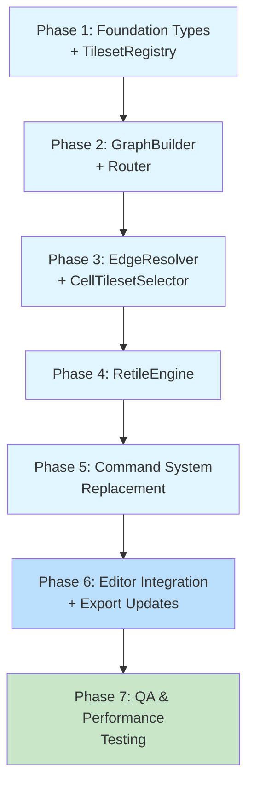
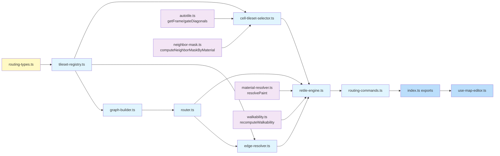

# Work Plan: Autotile Routing System Implementation

Created Date: 2026-02-22
Type: refactor
Estimated Duration: 8-10 days
Estimated Impact: 14 files (7 new, 7 modified/replaced)
Related Issue/PR: N/A

## Related Documents
- Design Doc: [docs/design/design-015-autotile-routing-system.md](../design/design-015-autotile-routing-system.md)
- ADR: [docs/adr/ADR-0011-autotile-routing-architecture.md](../adr/ADR-0011-autotile-routing-architecture.md)
- Prerequisite ADRs: ADR-0010 (map-lib extraction), ADR-0009 (tileset management), ADR-0006 (map editor architecture)

## Objective

Replace the current dominant-neighbor autotile pipeline with a graph-based BFS routing system. The new system resolves three fundamental limitations: no multi-hop routing, no multi-material background consensus, and no conflict resolution at T-junctions. The routing architecture provides optimal tileset selection for arbitrary material graphs via BFS shortest-path routing, per-edge ownership with configurable priority presets, and S1/S2 conflict resolution.

## Background

The current `recomputeAutotileLayers()` pipeline uses `findDominantNeighbor` + `findIndirectTileset` (1-hop search). As more biome materials are added, the number of unreachable material pairs grows combinatorially. The new system builds a compatibility graph from tileset metadata, computes all-pairs BFS routing tables, resolves background consensus per cell, and selects the correct transition tileset -- all orchestrated by an incremental RetileEngine with per-cell caching.

**Implementation Approach**: Horizontal Slice (Foundation-driven), per Design Doc. The 6 new modules form a strict dependency chain where each layer can be implemented and fully tested in isolation before the next layer builds on top.

## Risks and Countermeasures

### Technical Risks

- **Risk**: S1 conflict resolution non-convergence producing infinite iteration loops
  - **Impact**: High -- incorrect or flickering tiles at multi-material junctions
  - **Countermeasure**: Max 4 iterations with deterministic top-to-bottom left-to-right order; S2 fallback always terminates; exhaustive unit tests for conflict scenarios (AC5)

- **Risk**: Performance regression on large maps (256x256) during batch paint or full rebuild
  - **Impact**: High -- editor becomes unusable if single-cell paint exceeds 16ms frame budget
  - **Countermeasure**: Incremental dirty propagation (R=2 Chebyshev); full-pass threshold at 50% of map; benchmark before/after; target <5ms for brush, <500ms for full rebuild (AC6)

- **Risk**: Breaking existing undo/redo behavior during command system migration
  - **Impact**: Medium -- data loss for users relying on undo stack
  - **Countermeasure**: New commands implement same EditorCommand interface; round-trip test (execute -> undo -> verify === original) for every command type (AC8)

- **Risk**: BFS routing table incorrect for complex graphs with tie-breaking
  - **Impact**: High -- wrong tileset selection across the entire map
  - **Countermeasure**: Exhaustive unit tests with known-correct expected paths from Design Doc worked examples; deterministic preference array tie-breaking (AC2)

- **Risk**: Edge ownership disagrees across adjacent cells
  - **Impact**: Medium -- visible seam artifacts at cell boundaries
  - **Countermeasure**: resolveEdge is called symmetrically; unit tests verify resolveEdge(A,B,N) and resolveEdge(B,A,S) consistency (AC3)

### Schedule Risks

- **Risk**: Conflict resolution (S1) complexity underestimated
  - **Impact**: Phase 3 extends by 1-2 days
  - **Countermeasure**: S2-only fallback provides working (if suboptimal) results; S1 can be deferred to a follow-up if needed

- **Risk**: Integration with use-map-editor.ts reducer exposes unforeseen coupling
  - **Impact**: Phase 6 extends by 1 day
  - **Countermeasure**: Old and new code coexist during phases 1-5; switchover is a single reducer update

## Migration Strategy

The Design Doc specifies a 4-step migration:

1. **During Phases 1-4**: Implement all new modules alongside existing code. Old modules (`autotile-layers.ts`, `commands.ts`) remain functional.
2. **Phase 5**: Add new exports to `index.ts` with `@deprecated` JSDoc tags on old exports.
3. **Phase 6**: Switch `use-map-editor.ts` reducer to use new commands and RetileEngine. Remove old imports.
4. **Phase 7**: Verify all old code paths are unused. Mark for deletion in follow-up (or delete if confirmed safe).

**Rollback Plan**: At any phase, the old system remains fully functional. If the new system fails integration testing, revert the `use-map-editor.ts` import changes (single-file rollback) to restore the old pipeline.

## Phase Structure Diagram

## Task Dependency Diagram

**Legend**: Yellow = types, Blue = new modules, Light blue = integration, Purple = existing reused modules.

## Implementation Phases

---

### Phase 1: Foundation Types + TilesetRegistry (Estimated commits: 2)

**Purpose**: Establish all shared type definitions and the leaf-node data access layer. Every subsequent module depends on these types and the registry.

**Depends on**: Nothing (foundation layer)

**Complexity**: S-M

#### Tasks

- [ ] **Task 1.1**: Create `packages/map-lib/src/types/routing-types.ts` with all routing type definitions
  - Types: `CompatGraph`, `RenderGraph`, `MaterialPriorityMap`, `RoutingTable`, `NeighborDirection`, `CellCacheEntry`, `CellCache`, `CellPatchEntry`, `RetileResult`, `RetileEngineOptions`, edge direction constants (`EDGE_N`, `EDGE_E`, `EDGE_S`, `EDGE_W`)
  - Import `EditorLayer` from `editor-types.ts` and `Cell` from `@nookstead/shared`
  - Import `TilesetInfo`, `MaterialInfo` from `material-types.ts`
  - All types use `readonly` modifiers and `ReadonlyArray`/`ReadonlyMap` where applicable
  - JSDoc on every exported type

- [ ] **Task 1.2**: Create `packages/map-lib/src/core/tileset-registry.ts` implementing `TilesetRegistry` class
  - Constructor accepts `ReadonlyArray<TilesetInfo>`, validates and indexes entries
  - Entries without `fromMaterialKey` are skipped (excluded from routing graph)
  - Base tilesets: entries where `fromMaterialKey === toMaterialKey` or `toMaterialKey` is absent
  - Transition tilesets: entries where both `fromMaterialKey` and `toMaterialKey` are present and different
  - API: `hasTileset(fg, bg)`, `getTilesetKey(fg, bg)`, `getBaseTilesetKey(material)`, `getAllMaterials()`, `getAllTransitionPairs()`, `getTilesetInfo(key)`
  - Internal indexing uses `"from:to"` key format (consistent with existing `buildTilesetPairMap`)
  - Immutable after construction
  - JSDoc on all public methods

- [ ] **Task 1.3**: Create `packages/map-lib/src/core/tileset-registry.spec.ts` with unit tests
  - Test: constructor with various tileset configs (empty, base-only, transition-only, mixed)
  - Test: `hasTileset`/`getTilesetKey` for existing pairs, missing pairs, reversed pairs
  - Test: `getBaseTilesetKey` for materials with and without base tilesets
  - Test: `getAllMaterials` returns correct set
  - Test: `getAllTransitionPairs` returns correct tuples
  - Test: entries without `fromMaterialKey` are excluded
  - Test: self-edge tilesets (`from === to`) treated as base, not graph edge
  - Use factory helpers following `makeCell`/`makeMaterial` pattern from existing tests
  - Target: 100% coverage

- [ ] **Task 1.4**: Quality check -- typecheck, lint, format pass for new files

#### Phase 1 Completion Criteria

- [ ] All routing types defined and exported from `routing-types.ts`
- [ ] TilesetRegistry constructed from test tileset data; all public methods return correct results
- [ ] `hasTileset(A, B) === true` iff a tileset with `from=A, to=B` was provided (AC1 partial)
- [ ] `getBaseTilesetKey(A)` returns correct key for standalone tilesets
- [ ] All 8+ unit tests pass with 100% coverage on tileset-registry.ts
- [ ] `pnpm nx test map-lib` passes (existing + new tests)
- [ ] `pnpm nx typecheck map-lib` passes

#### Operational Verification Procedures

1. Run `pnpm nx test map-lib --testPathPattern=tileset-registry` -- all tests pass
2. Run `pnpm nx typecheck map-lib` -- no type errors
3. Verify `routing-types.ts` exports are importable from other test files
4. Verify TilesetRegistry correctly handles the reference tileset set from Design Doc (11 tilesets, 10 materials)

---

### Phase 2: GraphBuilder + Router (Estimated commits: 2)

**Purpose**: Build the material compatibility graph (undirected) and render graph (directed) from the registry, then compute the BFS all-pairs shortest-path routing table with configurable tie-break preferences.

**Depends on**: Phase 1 (TilesetRegistry, routing types)

**Complexity**: M

#### Tasks

- [ ] **Task 2.1**: Create `packages/map-lib/src/core/graph-builder.ts` implementing `buildGraphs(registry)` function
  - Builds `compatGraph: CompatGraph` (undirected) -- if A_B or B_A tileset exists, both A->B and B->A edges added
  - Builds `renderGraph: RenderGraph` (directed) -- A->B only if A_B tileset exists
  - Self-edges excluded (base tilesets where `from === to`)
  - Uses `Map<string, Set<string>>` internally, returns `ReadonlyMap<string, ReadonlySet<string>>`
  - Returns `MaterialGraphs` type: `{ compatGraph, renderGraph }`
  - JSDoc on all exports

- [ ] **Task 2.2**: Create `packages/map-lib/src/core/graph-builder.spec.ts` with unit tests
  - Test: single transition pair creates bidirectional compat edge and unidirectional render edge
  - Test: multiple pairs build correct graph
  - Test: undirected symmetry of compatGraph (`A in compatGraph[B]` iff `B in compatGraph[A]`)
  - Test: directed renderGraph is NOT symmetric
  - Test: base tilesets (`from === to`) produce no graph edges
  - Test: empty registry produces empty graphs
  - Test: renderGraph edges are a subset of compatGraph edges
  - Target: 100% coverage

- [ ] **Task 2.3**: Create `packages/map-lib/src/core/router.ts` implementing `computeRoutingTable(compatGraph, preferences)` function
  - BFS from each material node to all other nodes on the compatGraph
  - Stores `nextHop[from][to]` -- the first step on the shortest path from `from` to `to`
  - When multiple equal-length paths exist, tie-break using the `preferences` array (earlier index = preferred)
  - Materials not in preferences array have lowest priority for tie-breaking
  - `nextHop(A, A)` returns `null` (same material, no route needed)
  - Returns an object implementing the `RoutingTable` interface: `nextHop(from, to)`, `hasRoute(from, to)`
  - Routing table is immutable after construction
  - JSDoc on all exports

- [ ] **Task 2.4**: Create `packages/map-lib/src/core/router.spec.ts` with unit tests
  - Test: direct neighbor hop (`nextHop(water, grass) = grass` when water-grass compat edge exists)
  - Test: 2-hop path (`nextHop(deep_water, grass) = water` via deep_water-water-grass)
  - Test: 3-hop path (`nextHop(deep_water, soil) = water` via deep_water-water-grass-soil)
  - Test: tie-break with preferences (verify preference array order determines winner)
  - Test: unreachable pair returns `null`
  - Test: `nextHop(A, A)` returns `null`
  - Test: `hasRoute(A, B)` consistency with `nextHop`
  - Test: routing table with the reference tileset set from Design Doc (verify all entries in routing table reference)
  - Test: routing table immutability
  - Target: 100% coverage

- [ ] **Task 2.5**: Quality check -- typecheck, lint, format pass for new files

#### Phase 2 Completion Criteria

- [ ] `buildGraphs()` produces correct undirected compat and directed render graphs (AC1)
- [ ] `computeRoutingTable()` produces correct `nextHop` for all reachable pairs (AC2)
- [ ] `nextHop('deep_water', 'soil') === 'water'` with the reference tileset set (AC2 specific)
- [ ] Tie-breaking is deterministic via preference array (AC2)
- [ ] Unreachable pairs return `null` (AC2)
- [ ] All unit tests pass with 100% coverage on both modules
- [ ] `pnpm nx test map-lib` passes

#### Operational Verification Procedures

1. Run `pnpm nx test map-lib --testPathPattern="graph-builder|router"` -- all tests pass
2. Construct a graph from the Design Doc reference tileset set and verify the routing table matches all 10 entries in the "Reference: Routing Table" section
3. Verify that `computeRoutingTable` returns `null` for disconnected materials (e.g., a material with no tilesets)
4. Verify BFS completes in <10ms for 30 materials / 100 tilesets (performance sanity)

---

### Phase 3: EdgeResolver + CellTilesetSelector (Estimated commits: 2-3)

**Purpose**: Implement per-edge ownership determination and per-cell tileset selection with S1/S2 conflict resolution. These are the core decision-making modules of the routing system.

**Depends on**: Phase 2 (Router, RoutingTable), Phase 1 (TilesetRegistry, types)

**Complexity**: L (conflict resolution logic)

#### Tasks

- [ ] **Task 3.1**: Create `packages/map-lib/src/core/edge-resolver.ts` implementing `resolveEdge()` function
  - `resolveEdge(materialA, materialB, dir, router, registry, priorities)` -> `EdgeOwner | null`
  - Computes `virtualBG_A = nextHop(A, B)` and `virtualBG_B = nextHop(B, A)`
  - Checks if matching transition tileset exists in render graph (via `registry.hasTileset`)
  - If only one candidate valid, that candidate owns the edge
  - If both valid, higher `materialPriority` wins
  - If neither valid, returns `null` (unresolved, logged)
  - Same-material edges return early (no resolution needed)
  - Define `EdgeOwner` type and `EdgeDirection` type
  - JSDoc on all exports

- [ ] **Task 3.2**: Create `packages/map-lib/src/core/edge-resolver.spec.ts` with unit tests
  - Test: one valid candidate owns the edge
  - Test: both valid -- higher priority wins (Preset A: water > grass)
  - Test: both valid -- higher priority wins (Preset B: grass > water)
  - Test: neither valid returns `null`
  - Test: same material returns early (no ownership needed)
  - Test: edge ownership symmetry -- `resolveEdge(A, B, N)` consistent with `resolveEdge(B, A, S)`
  - Test: switchable presets produce different ownership outcomes
  - Target: 100% coverage

- [ ] **Task 3.3**: Create `packages/map-lib/src/core/cell-tileset-selector.ts` implementing `selectTilesetForCell()` and `computeCellFrame()` functions
  - `selectTilesetForCell(fg, boundaryMaterials, registry, priorities)` -> `{ tilesetKey, bg }`
    - Per-Cell BG Resolution Algorithm from Design Doc:
      1. For each cardinal direction, compute `virtualBG = nextHop(fg, neighborFg)` and check `registry.hasTileset(fg, virtualBG)`
      2. If zero valid BGs: use base tileset
      3. If one unique BG: use transition tileset `fg_bg`
      4. If multiple distinct BGs: CONFLICT -- apply S1 then S2
    - S1 (Owner Reassign, max 4 iterations): for each conflicting edge, check if neighbor has higher materialPriority; reassign edge ownership if so; remove that BG requirement
    - S2 (BG Priority Fallback): pick BG with highest priority from preference array
    - Log warnings at `console.warn` level when S2 is applied
  - `computeCellFrame(grid, x, y, width, height, fg)` -> `{ mask47, frameId }`
    - Uses `computeNeighborMaskByMaterial` from `neighbor-mask.ts` for FG-only comparison
    - Uses `getFrame` from `autotile.ts` for diagonal gating and frame lookup
    - Mask is ALWAYS computed from FG material comparison only (Design Doc invariant 2)
  - JSDoc on all exports

- [ ] **Task 3.4**: Create `packages/map-lib/src/core/cell-tileset-selector.spec.ts` with unit tests
  - Test: no owned edges -> base tileset selected
  - Test: one BG material -> correct transition tileset selected
  - Test: multiple BGs, S1 resolves -> correct single BG remains (V4 scenario)
  - Test: multiple BGs, S1 fails -> S2 picks highest-priority BG
  - Test: S1 max iterations capped at 4
  - Test: mask computation for solid cell (all same FG, mask=255, frame=1)
  - Test: mask computation for isolated cell (no same FG neighbors, mask=0)
  - Test: mask computation for corner cells (L-corner, T-junction patterns)
  - Test: diagonal gating preserved (NW set only if N and W both set)
  - Test: out-of-bounds neighbors treated as matching (bit=1) by default
  - Test: Design Doc Worked Example 1 -- deep_water|soil edge
  - Test: Design Doc Worked Example 2 -- deep_water|soil|sand conflict resolution
  - Test: V3 no corner holes in island/bay/inlet patterns
  - Target: 100% coverage on selectTilesetForCell, 100% on computeCellFrame

- [ ] **Task 3.5**: Quality check -- typecheck, lint, format pass for new files

#### Phase 3 Completion Criteria

- [ ] Edge ownership resolves correctly for all valid/invalid candidate combinations (AC3)
- [ ] Preset A (water-side owns) and Preset B (land-side owns) produce correct results (AC3)
- [ ] Cell tileset selection handles 0-BG, 1-BG, and multi-BG scenarios (AC4)
- [ ] S1 conflict resolution converges within 4 iterations for all tested scenarios (AC5)
- [ ] S2 fallback is deterministic and selects highest-priority BG (AC5)
- [ ] Blob-47 mask computed by FG comparison only; diagonal gating preserved (AC4)
- [ ] No corner holes in island/bay/inlet patterns (AC4)
- [ ] All unit tests pass; target 100% coverage on both modules
- [ ] `pnpm nx test map-lib` passes

#### Operational Verification Procedures

1. Run `pnpm nx test map-lib --testPathPattern="edge-resolver|cell-tileset-selector"` -- all tests pass
2. Verify Design Doc Worked Example 1 produces: cell(1,1)=deep-water_water frame 25, cell(2,1)=soil_grass frame 35
3. Verify Design Doc Worked Example 2 (three-material): sand cell at (2,2) resolves via S1 to sand_grass under Preset A
4. Verify Design Doc T-junction example: sand at (2,2) with N=soil, S=dw, W=dw resolves to sand_grass via S1 under Preset A
5. Verify that switching to Preset B produces different but correct results (sand_water instead of sand_grass for Worked Example 2)

---

### Phase 4: RetileEngine (Estimated commits: 2-3)

**Purpose**: Implement the orchestrator that maintains per-cell cache, propagates dirty sets via Chebyshev R=2, and calls EdgeResolver/CellTilesetSelector for each dirty cell to produce updated layers. This is the central module that replaces `recomputeAutotileLayers`.

**Depends on**: Phase 3 (EdgeResolver, CellTilesetSelector), Phase 2 (Router), Phase 1 (TilesetRegistry, types)

**Complexity**: L (cache management, dirty propagation, 4 retile triggers)

#### Tasks

- [ ] **Task 4.1**: Create `packages/map-lib/src/core/retile-engine.ts` implementing `RetileEngine` class
  - Constructor accepts `RetileEngineOptions` (width, height, tilesets, materials, materialPriority, preferences)
  - Internally constructs `TilesetRegistry`, runs `buildGraphs`, `computeRoutingTable`
  - Maintains `CellCache[][]` (per-cell cache) and `cellsByTilesetKey: Map<string, Set<number>>` index
  - Cell index uses flat index `y * width + x` for `cellsByTilesetKey` Set values
  - **API methods**:
    - `applyMapPatch(state, patch)` -> `RetileResult` (T1/T2)
      - Updates grid terrain for each patch entry
      - Computes dirty set: `expand(changedCells, R=2)` Chebyshev
      - If changed cells exceed 50% of map: full-pass instead of incremental
      - For each dirty cell: resolveEdges -> selectTileset -> computeFrame -> updateCache
      - Max 4 S1 iterations per rebuild operation
      - Returns updated layers, grid, changedCells, patches (for undo)
    - `updateTileset(state, tilesetKey, newMaskToTile)` -> `RetileResult` (T3a)
      - Finds cells using that tilesetKey via `cellsByTilesetKey` index
      - Recomputes frameId only (no tileset reselection needed)
    - `removeTileset(state, tilesetKey)` -> `RetileResult` (T3b)
      - Rebuilds graphs + routing table
      - Dirties cells near affected materials + R=2
    - `addTileset(state, tilesetInfo)` -> `RetileResult` (T3b)
      - Rebuilds graphs + routing table
      - Dirties cells near affected materials + R=2
    - `switchTilesetGroup(state, tilesets)` -> `RetileResult` (T4)
      - Full rebuild: new registry, graphs, routing table, clear cache, recompute all cells
    - `rebuild(state, mode, changedCells?)` -> `RetileResult`
      - `'local'` mode: dirty propagation from changedCells
      - `'full'` mode: complete recompute of all cells
  - Input state is NEVER mutated; returns new references
  - Empty grid (width=0 or height=0) returns unchanged layers immediately
  - Out-of-bounds coordinates in patch are silently skipped
  - JSDoc on all public methods

- [ ] **Task 4.2**: Create `packages/map-lib/src/core/retile-engine.spec.ts` with unit tests
  - Test T1: single-cell paint on 5x5 grid -- verify dirty set is R=2 Chebyshev around painted cell
  - Test T1: verify cache entries updated for all dirty cells
  - Test T1: verify `layers[].frames` and `layers[].tilesetKeys` updated correctly
  - Test T2: batch paint (multiple cells) -- verify dirty set is union of R=2 per cell
  - Test T2: >50% changed cells triggers full-pass
  - Test T3a: `updateTileset` finds cells via index and recomputes frameId only
  - Test T3b: `addTileset` rebuilds graphs and dirties affected cells
  - Test T3b: `removeTileset` rebuilds graphs and dirties affected cells
  - Test T4: `switchTilesetGroup` performs full rebuild, clears cache
  - Test: cache consistency -- `cache[y][x].frameId === layers[layerIdx].frames[y][x]` for all cached cells
  - Test: `cellsByTilesetKey` index consistency with cache entries
  - Test: deterministic output (same input produces same output)
  - Test: immutability -- input state not mutated
  - Test: empty grid returns unchanged layers
  - Test: out-of-bounds coordinates skipped silently
  - Test: patches array enables full undo (verify reverting patches restores original state)
  - Use factory helpers to construct 5x5 and 8x8 test grids with known material layouts
  - Target: 90%+ coverage

- [ ] **Task 4.3**: Quality check -- typecheck, lint, format pass for new files

#### Phase 4 Completion Criteria

- [ ] T1 (single-cell paint) produces correct dirty set with R=2 Chebyshev (AC6)
- [ ] T2 (batch paint) produces union of R=2 dirty sets; >50% triggers full-pass (AC6)
- [ ] T3a (maskToTile change) finds affected cells via `cellsByTilesetKey` index (AC6)
- [ ] T3b (tileset add/remove) rebuilds graphs and routing table (AC6)
- [ ] T4 (theme switch) performs full rebuild (AC6)
- [ ] Per-cell cache stores: `{ fg, selectedTilesetKey, bg, mask47, frameId, boundaryMaterialsHash }` (AC6)
- [ ] Cache consistency invariant holds: `cache[y][x].frameId === layers[layerIdx].frames[y][x]` (AC6)
- [ ] Output format compatible with canvas-renderer.ts: `layers[].frames[y][x]` and `layers[].tilesetKeys[y][x]`
- [ ] All editor API methods functional: applyMapPatch, updateTileset, removeTileset, addTileset, switchTilesetGroup, rebuild (AC7)
- [ ] All unit tests pass; target 90%+ coverage
- [ ] `pnpm nx test map-lib` passes

#### Operational Verification Procedures

1. Run `pnpm nx test map-lib --testPathPattern=retile-engine` -- all tests pass
2. Verify T1 on a 5x5 grid: paint cell (2,2) from deep_water to soil, verify:
   - Dirty cells include (0,0)-(4,4) region (R=2 Chebyshev from (2,2))
   - Cell (2,2) gets soil_grass tileset (routing through grass to deep_water neighbors)
   - Adjacent deep_water cells get deep-water_water tileset at border
   - Interior deep_water cells unchanged (still base tileset, solid frame)
3. Verify T4 full rebuild: construct engine, call switchTilesetGroup with new tileset set, verify all cells recomputed
4. Verify patches array: apply patch, then manually reverse each CellPatchEntry, verify state restored
5. Run `pnpm nx typecheck map-lib` -- no type errors

---

### Phase 5: Command System Replacement (Estimated commits: 2)

**Purpose**: Create new `RoutingPaintCommand` and `RoutingFillCommand` classes that implement the `EditorCommand` interface and delegate all recomputation to the `RetileEngine`. These replace the current `PaintCommand`, `FillCommand`, and `applyDeltas`.

**Depends on**: Phase 4 (RetileEngine)

**Complexity**: M

#### Tasks

- [ ] **Task 5.1**: Create `packages/map-lib/src/core/routing-commands.ts` implementing new command classes
  - `RoutingPaintCommand` implements `EditorCommand`:
    - Constructor accepts patch entries and a `RetileEngine` reference
    - `execute(state)`: calls `engine.applyMapPatch(state, patch)`, stores undo data (old materials + old cache via patches array), returns new state with updated grid/layers/walkable
    - `undo(state)`: restores old materials and old cell cache entries from stored patches, returns original state
    - `description`: human-readable string (e.g., "Paint 5 cell(s) with soil")
  - `RoutingFillCommand` implements `EditorCommand`:
    - Same structure as RoutingPaintCommand; semantic distinction for description
    - `description`: e.g., "Fill 120 cell(s) with deep_water"
  - Both commands:
    - Store both old and new material + old and new cell cache for each affected cell (via `CellPatchEntry[]`)
    - Never mutate input state
    - Integrate with `recomputeWalkability` for walkable grid update
    - Implement same `EditorCommand` interface (`execute`, `undo`, `description`)
  - JSDoc on all exports

- [ ] **Task 5.2**: Create `packages/map-lib/src/core/routing-commands.spec.ts` with unit tests
  - Test: `RoutingPaintCommand.execute()` produces updated grid, layers, and walkable
  - Test: `RoutingPaintCommand.undo()` restores original grid, layers, and walkable
  - Test: execute -> undo -> verify state equals original (round-trip)
  - Test: execute -> undo -> execute (redo) -> verify state equals first execute
  - Test: `RoutingFillCommand.execute()` and `undo()` same correctness
  - Test: `EditorCommand` interface compliance (description, execute, undo are present)
  - Test: commands store correct CellPatchEntry data for undo
  - Test: immutability -- input state not mutated by execute or undo
  - Test: description string is correctly formed
  - Target: 100% coverage

- [ ] **Task 5.3**: Quality check -- typecheck, lint, format pass for new files

#### Phase 5 Completion Criteria

- [ ] `RoutingPaintCommand` calls `RetileEngine.applyMapPatch()` for execution (AC8)
- [ ] `RoutingFillCommand` calls `RetileEngine.applyMapPatch()` for execution (AC8)
- [ ] Undo restores old materials and old cell cache entries (AC8)
- [ ] Redo reapplies new materials and new cell cache entries (AC8)
- [ ] `EditorCommand` interface unchanged: `execute`, `undo`, `description` (AC8)
- [ ] Commands store both old and new material + cache for each affected cell (AC8)
- [ ] Round-trip test passes: execute -> undo -> state === original
- [ ] All unit tests pass with 100% coverage
- [ ] `pnpm nx test map-lib` passes

#### Operational Verification Procedures

1. Run `pnpm nx test map-lib --testPathPattern=routing-commands` -- all tests pass
2. Verify execute -> undo round-trip on an 8x8 grid:
   - Initial state: all deep_water
   - Execute: paint 4x4 soil rectangle at (2,2)-(5,5)
   - Undo: verify all cells return to deep_water, all frames return to solid (255), all tilesetKeys return to base
3. Verify execute -> undo -> execute (redo):
   - State after redo matches state after first execute exactly (frame-by-frame comparison)

---

### Phase 6: Editor Integration + Export Updates (Estimated commits: 2)

**Purpose**: Wire the new routing system into the editor by updating `index.ts` exports and switching the `use-map-editor.ts` reducer to use the new commands. Verify the canvas renderer works without changes.

**Depends on**: Phase 5 (RoutingPaintCommand, RoutingFillCommand)

**Complexity**: M

#### Tasks

- [ ] **Task 6.1**: Update `packages/map-lib/src/index.ts` to add new exports and deprecate old exports
  - Add exports for new modules:
    - `TilesetRegistry` from `./core/tileset-registry`
    - `buildGraphs` from `./core/graph-builder`
    - `computeRoutingTable` from `./core/router`
    - `resolveEdge` from `./core/edge-resolver`
    - `selectTilesetForCell`, `computeCellFrame` from `./core/cell-tileset-selector`
    - `RetileEngine` from `./core/retile-engine`
    - `RoutingPaintCommand`, `RoutingFillCommand` from `./core/routing-commands`
  - Add type exports for routing types:
    - `CompatGraph`, `RenderGraph`, `MaterialPriorityMap`, `RoutingTable`, `NeighborDirection`, `CellCacheEntry`, `CellCache`, `CellPatchEntry`, `RetileResult`, `RetileEngineOptions`
    - `MaterialGraphs` from `./core/graph-builder`
  - Mark old exports with `@deprecated` JSDoc:
    - `recomputeAutotileLayers` -- deprecate, add note: "Use RetileEngine.rebuild() instead"
    - `applyDeltas` -- deprecate, add note: "Use RoutingPaintCommand/RoutingFillCommand instead"
    - `PaintCommand` -- deprecate, add note: "Use RoutingPaintCommand instead"
    - `FillCommand` -- deprecate, add note: "Use RoutingFillCommand instead"
  - Keep `computeNeighborMaskByMaterial`, `computeNeighborMask`, `computeTransitionMask` exports (still used)

- [ ] **Task 6.2**: Update `apps/genmap/src/hooks/use-map-editor.ts` to use new routing system
  - Replace `recomputeAutotileLayers` import with `RetileEngine` (or remove if only used in LOAD_MAP)
  - In LOAD_MAP handler: construct a `RetileEngine` and call `rebuild('full')` instead of `recomputeAutotileLayers`
  - Note: PUSH_COMMAND handler already delegates to `command.execute(state)` -- no change needed here since new commands implement same `EditorCommand` interface
  - Paint tool and fill tool callers (in React components) must construct `RoutingPaintCommand`/`RoutingFillCommand` instead of old `PaintCommand`/`FillCommand`
  - Need to manage RetileEngine instance: create in LOAD_MAP or SET_TILESETS, store in state or as module-level variable
  - Determine integration approach: either store `RetileEngine` in state (breaks serialization) or create per-operation (simple but slightly less efficient)
  - The component callers that create PaintCommand/FillCommand will need updating -- identify these files

- [ ] **Task 6.3**: Verify `apps/genmap/src/components/map-editor/canvas-renderer.ts` works without changes
  - Canvas renderer reads `state.layers[].frames[y][x]` and `state.layers[].tilesetKeys?.[y]?.[x]`
  - New system produces identical output format
  - No code changes required -- verification only
  - Test: run genmap editor, paint cells, verify rendering is correct

- [ ] **Task 6.4**: Quality check -- typecheck and lint pass across map-lib AND genmap app
  - Run `pnpm nx typecheck map-lib`
  - Run `pnpm nx typecheck genmap` (or the genmap app target)
  - Run `pnpm nx lint map-lib`

#### Phase 6 Completion Criteria

- [ ] All new modules importable from `@nookstead/map-lib` (Integration Point 3 from Design Doc)
- [ ] Old exports marked `@deprecated` but still functional
- [ ] `use-map-editor.ts` reducer uses RetileEngine for LOAD_MAP recompute (Integration Point 1)
- [ ] Paint/fill tool callers create `RoutingPaintCommand`/`RoutingFillCommand` instead of old commands (Integration Point 1)
- [ ] Canvas renderer works without changes (Integration Point 2, read-only verification)
- [ ] Undo/redo cycle in the editor produces identical state (Integration Point 2)
- [ ] `pnpm nx typecheck map-lib` passes
- [ ] `pnpm nx typecheck genmap` passes (if applicable)
- [ ] `pnpm nx test map-lib` passes (all existing + new tests)

#### Operational Verification Procedures

1. Run `pnpm nx typecheck map-lib` -- all new exports compile
2. Run `pnpm nx test map-lib` -- all tests pass (existing + new)
3. Verify Integration Point 1: in `use-map-editor.ts`, LOAD_MAP handler calls RetileEngine.rebuild('full')
4. Verify Integration Point 2: canvas renderer reads `layers[].frames` and `layers[].tilesetKeys` without change
5. Verify Integration Point 3: `import { RetileEngine, RoutingPaintCommand } from '@nookstead/map-lib'` compiles
6. Verify Integration Point 4: `resolvePaint` is still called correctly for grid mutation within RetileEngine
7. Manual test (if dev server available): open genmap editor, load a map, paint cells, verify tiles render correctly

---

### Phase 7: Quality Assurance + Performance Testing (Required) (Estimated commits: 1-2)

**Purpose**: Comprehensive QA including integration tests for painting scenarios P1-P3, performance benchmarks, regression testing, and final verification of all Design Doc acceptance criteria.

**Depends on**: All previous phases complete

**Complexity**: M-L

#### Tasks

- [ ] **Task 7.1**: Create integration tests for painting scenario P1 (deep-water fill + soil rectangle)
  - Build 8x8 grid: fill all cells with deep_water, then paint 4x4 soil rectangle at (2,2)-(5,5)
  - Verify: deep_water border cells use `deep-water_water` tileset (BG=water)
  - Verify: soil border cells use `soil_grass` tileset (BG=grass)
  - Verify: soil interior cells use base tileset, frame=1 (solid)
  - Verify: corner deep_water cells (diagonal-only to soil) use base tileset
  - Verify: all frames and tilesetKeys match Design Doc Worked Example 4

- [ ] **Task 7.2**: Create integration tests for painting scenario P2 (soil square + water lake inside)
  - Build 8x8 grid: fill with deep_water, paint 4x4 soil rectangle, paint 2x2 water patch at (3,3)-(4,4)
  - Verify: water cells use `water_grass` tileset with correct blob-47 corner frames
  - Verify: soil cells bordering water use `soil_grass` (routing through grass)
  - Verify: outer deep_water | soil border unchanged from P1

- [ ] **Task 7.3**: Create integration tests for painting scenario P3 (deep-water | soil | sand strips)
  - Build 6x4 grid with deep_water border, soil strip (row 1), sand strip (row 2)
  - Verify: deep_water cells at border use `deep-water_water` (BG=water)
  - Verify: soil cells use `soil_grass` (BG=grass) -- route to dw and sand both go through grass
  - Verify: sand cells bordering both soil (N) and dw (S, W) resolve via S1 to `sand_grass` (BG=grass) under Preset A
  - Verify: Design Doc three-material worked example cell-by-cell

- [ ] **Task 7.4**: Create integration tests for painting workflow (fill -> rectangle -> lake)
  - Full step-by-step verification from Design Doc Worked Example 4
  - Step 1: fill with deep_water
  - Step 2: paint soil rectangle
  - Step 3: paint water lake
  - After each step, verify all cell tilesets and frames match expected values

- [ ] **Task 7.5**: Create blob-47 mask correctness regression tests
  - Test all 47 valid mask configurations produce correct frameId via `computeCellFrame`
  - Test diagonal gating: NW only set when N+W both set
  - Test OOB handling: edge cells and corner cells
  - Verify no corner holes in island/bay/inlet patterns for various grid configurations

- [ ] **Task 7.6**: Create performance benchmarks
  - Benchmark T1: single-cell paint on 256x256 grid -- target <5ms
  - Benchmark T4: full rebuild on 256x256 grid with 6 materials and 15 tilesets -- target <500ms
  - Benchmark BFS: `computeRoutingTable` with 30 materials, 100 tilesets -- target <10ms
  - Benchmark flood fill: 10,000 cells on 256x256 grid -- target <50ms
  - Record results in test output; fail test if >2x target (10ms, 1000ms, 20ms, 100ms)

- [ ] **Task 7.7**: Verify all Design Doc acceptance criteria achieved
  - [ ] AC1: Graph Construction -- compatGraph and renderGraph correct
  - [ ] AC2: BFS Routing Table -- nextHop correct for all pairs, tie-break deterministic
  - [ ] AC3: Edge Ownership -- symmetry, priority-based, preset-switchable
  - [ ] AC4: Cell Tileset Selection -- base/transition/conflict, mask by FG only, diagonal gating
  - [ ] AC5: Conflict Resolution -- S1 max 4 iterations, S2 fallback deterministic, logging
  - [ ] AC6: Incremental Retile Engine -- T1-T4 triggers, cache, dirty propagation
  - [ ] AC7: Editor API -- all 6 methods functional
  - [ ] AC8: Command System -- execute/undo/redo, EditorCommand interface, CellPatchEntry storage
  - [ ] AC9: Painting Scenarios -- P1, P2, P3 verified end-to-end

- [ ] **Task 7.8**: Run full quality gate
  - `pnpm nx typecheck map-lib` -- passes
  - `pnpm nx lint map-lib` -- passes
  - `pnpm nx test map-lib` -- all tests pass
  - `pnpm nx typecheck genmap` -- passes (if applicable)
  - Verify no `@ts-ignore` or `any` casts in new code
  - Verify JSDoc present on all public exports

#### Phase 7 Completion Criteria

- [ ] Painting scenarios P1, P2, P3 produce correct results end-to-end (AC9)
- [ ] All 47 blob-47 mask configurations produce correct frames
- [ ] Performance benchmarks: brush <5ms, flood fill <50ms, full rebuild <500ms on 256x256
- [ ] All 9 acceptance criteria (AC1-AC9) verified
- [ ] All tests pass: `pnpm nx test map-lib`
- [ ] Type checking passes: `pnpm nx typecheck map-lib`
- [ ] Lint passes: `pnpm nx lint map-lib`
- [ ] No regressions in existing functionality
- [ ] Coverage on new modules: TilesetRegistry 100%, GraphBuilder 100%, Router 100%, EdgeResolver 100%, CellTilesetSelector 100%, RetileEngine 90%+, RoutingCommands 100%

#### Operational Verification Procedures

Copy from Design Doc integration points:

1. **Integration Point 1 (RetileEngine -> EditorLayer output)**: Paint a cell, verify `layer.frames[y][x]` and `layer.tilesetKeys[y][x]` produce correct rendering values
2. **Integration Point 2 (RoutingPaintCommand -> Undo/Redo stack)**: Execute paint, undo, redo -- verify grid and layers return to expected states
3. **Integration Point 3 (RetileEngine -> resolvePaint)**: After applyMapPatch, `grid[y][x].terrain` equals the painted material
4. **Integration Point 4 (New exports -> genmap imports)**: TypeScript compilation succeeds; old and new exports coexist
5. **Performance verification**: Run benchmarks, confirm all targets met
6. **Regression verification**: Run `pnpm nx run-many -t lint test typecheck` across affected packages

---

## Quality Assurance (Cross-Phase)

- [ ] Implement staged quality checks after each phase (typecheck, lint, format)
- [ ] All tests pass after each phase (`pnpm nx test map-lib`)
- [ ] Static check pass (`pnpm nx typecheck map-lib`)
- [ ] Lint check pass (`pnpm nx lint map-lib`)
- [ ] Build success (zero-build pattern; TS source exported directly)
- [ ] No `@ts-ignore` or explicit `any` in new code
- [ ] JSDoc on all public exports
- [ ] Immutability discipline: no input mutation in any new function
- [ ] `ReadonlyArray`/`ReadonlyMap` on all input parameters
- [ ] Deterministic output: same input always produces same output

## Testing Strategy Summary

| Module | Test Type | Key Scenarios | Target Coverage |
|--------|-----------|---------------|-----------------|
| `tileset-registry.ts` | Unit | Constructor, lookups, edge cases | 100% |
| `graph-builder.ts` | Unit | Symmetry, directed vs undirected, empty input | 100% |
| `router.ts` | Unit | 1-hop, 2-hop, 3-hop, tie-break, unreachable | 100% |
| `edge-resolver.ts` | Unit | Valid/invalid candidates, presets, symmetry | 100% |
| `cell-tileset-selector.ts` | Unit | Base/transition/conflict, S1/S2, mask, gating | 100% |
| `retile-engine.ts` | Unit + Integration | T1-T4 triggers, cache, dirty propagation | 90%+ |
| `routing-commands.ts` | Unit | Execute/undo/redo round-trip, interface compliance | 100% |
| Integration tests | Integration | P1, P2, P3 painting scenarios, workflow | N/A |
| Performance tests | Benchmark | Brush <5ms, fill <50ms, rebuild <500ms | N/A |

## Files Created/Modified Summary

### New Files (7)

| File | Phase | Description |
|------|-------|-------------|
| `packages/map-lib/src/types/routing-types.ts` | 1 | All routing type definitions |
| `packages/map-lib/src/core/tileset-registry.ts` | 1 | TilesetRegistry class |
| `packages/map-lib/src/core/graph-builder.ts` | 2 | GraphBuilder (buildGraphs) |
| `packages/map-lib/src/core/router.ts` | 2 | Router (BFS routing table) |
| `packages/map-lib/src/core/edge-resolver.ts` | 3 | EdgeResolver (per-edge ownership) |
| `packages/map-lib/src/core/cell-tileset-selector.ts` | 3 | CellTilesetSelector (tileset + frame) |
| `packages/map-lib/src/core/retile-engine.ts` | 4 | RetileEngine (orchestrator) |
| `packages/map-lib/src/core/routing-commands.ts` | 5 | RoutingPaintCommand, RoutingFillCommand |

### New Test Files (7)

| File | Phase | Tests |
|------|-------|-------|
| `packages/map-lib/src/core/tileset-registry.spec.ts` | 1 | 8+ unit tests |
| `packages/map-lib/src/core/graph-builder.spec.ts` | 2 | 7+ unit tests |
| `packages/map-lib/src/core/router.spec.ts` | 2 | 9+ unit tests |
| `packages/map-lib/src/core/edge-resolver.spec.ts` | 3 | 7+ unit tests |
| `packages/map-lib/src/core/cell-tileset-selector.spec.ts` | 3 | 13+ unit tests |
| `packages/map-lib/src/core/retile-engine.spec.ts` | 4 | 16+ unit tests |
| `packages/map-lib/src/core/routing-commands.spec.ts` | 5 | 9+ unit tests |

### Modified Files (3)

| File | Phase | Change |
|------|-------|--------|
| `packages/map-lib/src/index.ts` | 6 | Add new exports, deprecate old exports |
| `apps/genmap/src/hooks/use-map-editor.ts` | 6 | Switch to RetileEngine for LOAD_MAP; callers switch to new commands |
| Component files that construct PaintCommand/FillCommand | 6 | Switch to RoutingPaintCommand/RoutingFillCommand |

### Unchanged Files (Confirmed)

| File | Reason |
|------|--------|
| `packages/map-lib/src/core/autotile.ts` | Reused as-is (getFrame, gateDiagonals, FRAME_TABLE) |
| `packages/map-lib/src/core/neighbor-mask.ts` | Reused (computeNeighborMaskByMaterial); computeTransitionMask superseded but not removed |
| `packages/map-lib/src/core/material-resolver.ts` | Reused (resolvePaint called by RetileEngine) |
| `packages/map-lib/src/core/walkability.ts` | Reused (recomputeWalkability called by commands) |
| `packages/map-lib/src/types/editor-types.ts` | Unchanged (EditorLayer, MapEditorState, EditorCommand) |
| `packages/map-lib/src/types/material-types.ts` | Unchanged (TilesetInfo, MaterialInfo) |
| `apps/genmap/src/components/map-editor/canvas-renderer.ts` | Read-only consumer; no code changes |

### Deprecated Files (Not Deleted in This Plan)

| File | Functions Deprecated | Replacement |
|------|---------------------|-------------|
| `packages/map-lib/src/core/autotile-layers.ts` | `recomputeAutotileLayers`, `findDominantNeighbor`, `findIndirectTileset`, `buildTilesetPairMap` | RetileEngine, Router, TilesetRegistry |
| `packages/map-lib/src/core/commands.ts` | `applyDeltas`, `PaintCommand`, `FillCommand` | RoutingPaintCommand, RoutingFillCommand |

## Completion Criteria

- [ ] All 7 phases completed
- [ ] Each phase's operational verification procedures executed
- [ ] Design Doc acceptance criteria AC1-AC9 satisfied
- [ ] Staged quality checks completed (zero errors)
- [ ] All tests pass (70+ new unit tests + integration tests)
- [ ] Performance benchmarks within targets
- [ ] Necessary documentation updated (index.ts deprecation notices)
- [ ] User review approval obtained

## Progress Tracking

### Phase 1: Foundation Types + TilesetRegistry
- Start: ____-__-__ __:__
- Complete: ____-__-__ __:__
- Notes:

### Phase 2: GraphBuilder + Router
- Start: ____-__-__ __:__
- Complete: ____-__-__ __:__
- Notes:

### Phase 3: EdgeResolver + CellTilesetSelector
- Start: ____-__-__ __:__
- Complete: ____-__-__ __:__
- Notes:

### Phase 4: RetileEngine
- Start: ____-__-__ __:__
- Complete: ____-__-__ __:__
- Notes:

### Phase 5: Command System Replacement
- Start: ____-__-__ __:__
- Complete: ____-__-__ __:__
- Notes:

### Phase 6: Editor Integration + Export Updates
- Start: ____-__-__ __:__
- Complete: ____-__-__ __:__
- Notes:

### Phase 7: QA + Performance Testing
- Start: ____-__-__ __:__
- Complete: ____-__-__ __:__
- Notes:

## Notes

### Key Design Invariants (from Design Doc)

1. **Routing is tileset SELECTION, never cell insertion.** The grid always contains exactly the materials the user painted.
2. **The 47-mask is ALWAYS computed from FG material comparison only.** Virtual BG never affects mask computation.
3. **Diagonals follow the gating rule regardless of virtual BG.** `gateDiagonals()` operates solely on FG mask bits.
4. **Single-layer constraint: ONE tileset per cell per frame.** No compositing or blending.
5. **Both cells at a boundary independently compute their own transition.** They may select different tilesets.
6. **Edge ownership is for conflict resolution, not transition gating.** Ownership only matters during S1/S2 pipeline.

### Important Constraints

- Zero-build TS source pattern: map-lib exports `.ts` directly, no compile step
- No browser/DOM dependencies in map-lib (pure algorithms, server-importable)
- Immutability: never mutate inputs, return new objects/arrays
- `ReadonlyArray`/`ReadonlyMap` for all input parameters
- Backward-compatible `EditorCommand` interface for undo/redo stacks
- Deterministic: same input always produces same output
- Co-located test files: `module.spec.ts` next to `module.ts`
- Follow existing test patterns: `makeCell`, `makeMaterial` factory helpers
