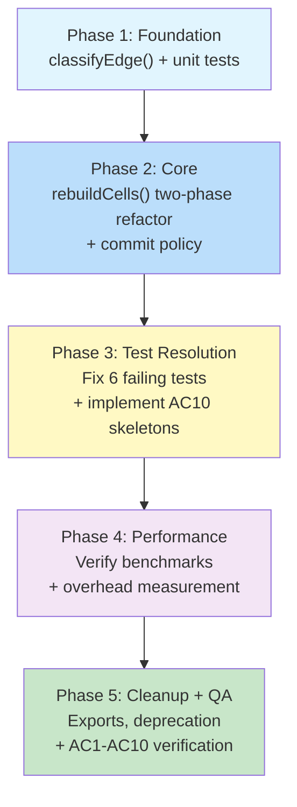
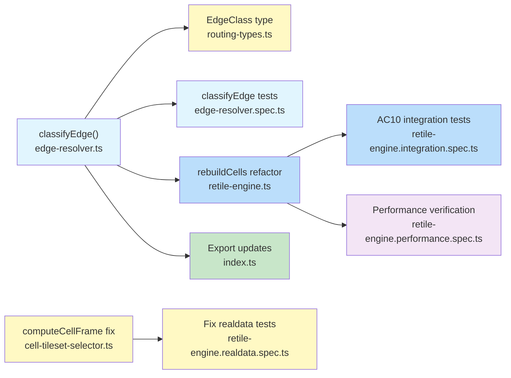

# Work Plan: Neighbor Repaint Policy v2 + Autotile System Completion

Created Date: 2026-02-24
Type: feature
Estimated Duration: 2-3 days
Estimated Impact: 6 files modified, 0 new files
Related Issue/PR: N/A

## Related Documents

- Design Doc: [docs/design/design-015-autotile-routing-system.md](../design/design-015-autotile-routing-system.md)
- ADR: [docs/adr/ADR-0011-autotile-routing-architecture.md](../adr/ADR-0011-autotile-routing-architecture.md) (Decision 9)
- Neighbor Repaint Policy v2: [docs/design/design-015-neighbor-repaint-policy-v2-ru.md](../design/design-015-neighbor-repaint-policy-v2-ru.md)
- Parent Plan: [docs/plans/plan-015-autotile-routing-system.md](plan-015-autotile-routing-system.md) (Phases 7-8)

## Objective

Complete the autotile routing system by implementing AC10 (Neighbor Repaint Policy) and resolving all remaining test failures. This covers Phases 7 and 8 from the parent plan.

The neighbor repaint policy adds a post-recompute commit filter that separates computational recomputation (unchanged) from visual commit guarantees. Painted cells always commit; cardinal neighbors commit only when their edge class is C1/C2/C3 (stable); C4/C5 neighbors may preserve their previous visual state. This produces predictable, stable visual output without changing the dirty set or recompute logic.

## Background

### Current State (after Phases 1-6)

| Metric | Value |
|--------|-------|
| Test suites passing | 17 / 18 |
| Tests GREEN | 285 |
| Tests FAILING | 6 (retile-engine.realdata.spec.ts) |
| Skeleton tests (no assertions) | 10 (7 classifyEdge + 3 AC10 integration) |
| Performance benchmarks | All passing (T1: 1.3ms, T4: 55ms, BFS: 0.5ms, Fill: 20ms) |

**Core modules complete**: TilesetRegistry, GraphBuilder, Router, EdgeResolver, CellTilesetSelector, RetileEngine, RoutingCommands.

**Editor integration complete**: use-map-editor.ts, all 4 tools migrated. Old files deleted.

### What Remains

1. **classifyEdge() function** -- does not exist yet; 7 skeleton tests in edge-resolver.spec.ts await implementation
2. **rebuildCells() two-phase refactor** -- currently single-pass (compute + write in one loop); needs compute-then-commit architecture for the commit policy
3. **3 AC10 integration test skeletons** -- in retile-engine.integration.spec.ts, comment-only (no assertions)
4. **6 failing realdata tests** -- pre-existing Decision 8 transition mask bugs with production data configurations
5. **Exports and deprecation** -- classifyEdge, EdgeClass not yet exported; computeTransitionMask not yet marked @deprecated

### 6 Failing Tests Root Cause Analysis

The 6 failures in `retile-engine.realdata.spec.ts` stem from **two distinct issues** in production data:

**Issue A: Transition mask not applied for isolated transition cells (4 tests)**
Tests expect BG-targeted transition mask (Decision 8) to produce frames 29/21, but the engine produces frame 47 (isolated). Root cause: `computeCellFrame` uses the owner-side edge contract to decide which cardinal bits open for transition mode. When a cell is an isolated island of its material (e.g., lone water cell in a deep_water field), none of its cardinal edges have a same-FG neighbor, so no owner-side gating applies and the cell falls through to FG-equality mask, yielding mask=0 and frame=47.

The fix requires `computeCellFrame` to check owned edges for transition bit opening even when the physical neighbor material does not match BG -- the key insight is that the edge owner contract should open the cardinal bit for the BG direction regardless of whether the neighbor is the physical BG material or a routed intermediate.

**Issue B: Production data baseTilesetKey is a transition tileset key (2 tests)**
Materials like `deep_water` have `baseTilesetKey: 'deep-water_water'` (a transition tileset key, not a standalone base). When a water cell is surrounded only by deep_water neighbors, the routing produces unexpected results because the edge ownership and S1/S2 resolution interact with the non-standard baseTilesetKey. These tests expect specific tilesetKey selections and cache states that differ from current behavior.

## Risks and Countermeasures

### Technical Risks

- **Risk**: Two-phase rebuildCells() introduces overhead from temporary buffer allocation
  - **Impact**: Low -- Map<number, ComputedResult> for ~25 cells per paint is negligible
  - **Countermeasure**: Performance benchmarks already exist; verify T1 <5ms after refactor

- **Risk**: Commit policy silently hides visual artifacts for C4/C5 edges
  - **Impact**: Medium -- users may see stale neighbor visuals after painting
  - **Countermeasure**: C4/C5 skip is per the design doc; cells are fully recomputed in the next paint that includes them in a dirty set. Diagnostic logging can be added if needed.

- **Risk**: Fixing transition mask for isolated cells in Issue A may break existing passing tests
  - **Impact**: Medium -- 285 tests currently passing
  - **Countermeasure**: Fix is scoped to transition-mode cells only (bg !== ''); base-mode cells (bg === '') are unaffected. Run full suite after each change.

### Schedule Risks

- **Risk**: Issue B (production baseTilesetKey anomaly) is harder to fix than expected
  - **Impact**: Phase 3 extends by 0.5-1 day
  - **Countermeasure**: Issue B tests can be marked as known-issue with a TODO if the fix requires upstream data changes. The commit policy and classifyEdge work are independent.

## Phase Structure Diagram



## Task Dependency Diagram



## Implementation Phases

---

### Phase 1: Foundation -- classifyEdge() + Unit Tests (Estimated commits: 1-2)

**Purpose**: Implement the O(1) edge classification function that categorizes each cardinal edge between two materials into one of five stability classes (C1-C5). This function is the foundation for the commit policy in Phase 2 and is independently testable.

**Depends on**: Nothing (uses existing Router and TilesetRegistry APIs)

**AC Coverage**: AC10 partial (classification algorithm)

**Test resolution**: 285/285 GREEN + 7 skeleton tests -> 285 + 7 = 292 GREEN

#### Tasks

- [ ] **Task 1.1**: Add `EdgeClass` type to `packages/map-lib/src/types/routing-types.ts`
  - Type definition: `export type EdgeClass = 'C1' | 'C2' | 'C3' | 'C4' | 'C5';`
  - JSDoc describing each class with one-line summary
  - **Success criteria**: `pnpm nx typecheck map-lib` passes

- [ ] **Task 1.2**: Implement `classifyEdge()` in `packages/map-lib/src/core/edge-resolver.ts`
  - Function signature per v2 Section 10.4:
    ```typescript
    export function classifyEdge(
      a: string,
      b: string,
      router: RoutingTable,
      registry: TilesetRegistry,
    ): EdgeClass
    ```
  - Algorithm (O(1) per edge -- 2 nextHop + 2 resolvePair lookups):
    1. `if (a === b) return 'C1'`
    2. Compute `hopA = router.nextHop(a, b)`, `hopB = router.nextHop(b, a)`
    3. Compute `pairA = hopA !== null ? registry.resolvePair(a, hopA) : null`
    4. Compute `pairB = hopB !== null ? registry.resolvePair(b, hopB) : null`
    5. `if (pairA === null || pairB === null) return 'C5'`
    6. `const bothDirect = pairA.orientation === 'direct' && pairB.orientation === 'direct'`
    7. `if (!bothDirect) return 'C4'`
    8. `if (hopA === b && hopB === a) return 'C2'` (direct neighbors)
    9. `if (hopA === hopB) return 'C3'` (same bridge)
    10. `return 'C4'` (different bridges)
  - JSDoc with complete classification table
  - Import `EdgeClass` from routing-types
  - **Success criteria**: Function compiles, all existing tests still pass

- [x] **Task 1.3**: Implement 7 classifyEdge skeleton tests in `packages/map-lib/src/core/edge-resolver.spec.ts`
  - Fill in assertion bodies for all 7 skeleton `it()` blocks:
    1. C1: `classifyEdge('grass', 'grass', ...) === 'C1'`
    2. C2: `classifyEdge('grass', 'water', ...) === 'C2'` (reference dataset)
    3. C2 commutative: `classifyEdge('water', 'grass', ...) === 'C2'` (same result)
    4. C3: `classifyEdge('deep-water', 'grass', ...) === 'C3'` (bridge = water)
    5. C4 reverse: `classifyEdge('deep-water', 'water', ...) === 'C4'` (one side reverse)
    6. C4 bridge: requires extended tilesets with deep-sand -- classify deep-sand vs water
    7. Symmetry property: `classifyEdge(A, B) === classifyEdge(B, A)` for C2, C3, C4 pairs
  - Add `classifyEdge` to the import statement (already present in spec file)
  - **Success criteria**: All 7 new tests GREEN
  - **Verify**: `pnpm nx test map-lib --testFile=src/core/edge-resolver.spec.ts`

- [ ] **Task 1.4**: Quality check
  - `pnpm nx typecheck map-lib`
  - `pnpm nx lint map-lib`

#### Phase 1 Completion Criteria

- [ ] `classifyEdge()` implemented per v2 Section 4.3 algorithm
- [ ] `EdgeClass` type exported from routing-types.ts
- [ ] All 7 classifyEdge tests GREEN in edge-resolver.spec.ts
- [ ] Existing 285 tests unaffected (all still GREEN)
- [ ] `pnpm nx typecheck map-lib` passes
- [ ] `pnpm nx lint map-lib` passes

#### Operational Verification Procedures

1. Run `pnpm nx test map-lib --testFile=src/core/edge-resolver.spec.ts` -- all tests pass (existing 7 + new 7 = 14)
2. Verify classification matches reference dataset statistics (v2 Section 10.3): with the reference 5-material tileset set, grass-water is the only C2 pair
3. Verify symmetry: `classifyEdge('A', 'B')` === `classifyEdge('B', 'A')` for all tested pairs
4. Verify O(1) behavior: no loops or recursion in classifyEdge implementation

---

### Phase 2: Core -- rebuildCells() Two-Phase Refactor + Commit Policy (Estimated commits: 2)

**Purpose**: Refactor `RetileEngine.rebuildCells()` from single-pass (compute + write in one loop) to a two-phase architecture (compute all results, then selectively commit based on edge classification). This is the primary architectural change that implements the commit policy from v2 Section 5, Steps 3-4.

**Depends on**: Phase 1 (classifyEdge)

**AC Coverage**: AC10 (commit policy)

#### Tasks

- [ ] **Task 2.1**: Refactor `rebuildCells()` in `packages/map-lib/src/core/retile-engine.ts`
  - **Phase A: Compute** -- For each cell in dirty set, compute the full result (selectedTilesetKey, bg, orientation, frameId, renderTilesetKey) and store in a `Map<number, ComputedCellResult>` buffer instead of immediately writing to layers/cache
  - **Phase B: Commit** -- Iterate the computed results and apply the commit filter:
    1. Build `paintedSet: Set<number>` from paintedPatches (flat indices of actually-painted cells)
    2. For each computed result:
       - **Painted cell** (in paintedSet): ALWAYS commit (updateCacheEntry + writeToLayers + createPatch)
       - **Cardinal neighbor of painted cell** (check adjacency): classify the edge between this cell's FG and the painted cell's FG using `classifyEdge()` -> if C1/C2/C3: commit; if C4/C5: skip (preserve previous cache/layers)
       - **All other dirty cells** (diagonals, R=2 cells not adjacent to any painted cell): ALWAYS commit (these are context cells whose mask may have changed, and they have no edge classification to C4/C5 that would justify skipping)
  - Add private helper `isCardinalNeighbor(flatIdxA: number, flatIdxB: number): boolean` using width arithmetic
  - Import `classifyEdge` from edge-resolver
  - Import `EdgeClass` from routing-types
  - Add private `ComputedCellResult` interface (internal, not exported)
  - **Key invariant**: The dirty set, expandDirtySet(), and the computation loop are UNCHANGED. Only the commit/write phase is filtered.
  - **Key invariant**: Cache always reflects committed state. If a cell is skipped, its old cache entry remains, and layers retain their old frames/tilesetKeys.
  - **Success criteria**: All 285 existing GREEN tests still pass. No behavioral change for uniform grids and C2/C3 edges (which commit as before).

- [ ] **Task 2.2**: Implement 3 AC10 integration test skeletons in `packages/map-lib/src/core/retile-engine.integration.spec.ts`
  - Fill in assertion bodies for the 3 skeleton `it()` blocks:
    1. **AC10-C2**: Paint grass center in 5x5 water field
       - Center (2,2): `tilesetKey === 'ts-grass'` (non-owner under Preset A)
       - All 4 cardinal water neighbors: `tilesetKey === 'ts-water-grass'` (committed, C2 edge)
       - Diagonal (1,1): `tilesetKey === 'ts-water'` (no cardinal grass neighbor)
    2. **AC10-C3**: Paint deep-sand center in 5x5 deep-water field (requires extended tilesets)
       - Needs local `makeExtendedTilesets()` factory adding `ts-deep-sand` and `ts-deep-sand-water`
       - Center: `tilesetKey === 'ts-deep-sand'` (non-owner under Preset A)
       - Cardinal deep-water neighbors: `tilesetKey === 'ts-deep-water-water'` (committed, C3 edge via water bridge)
    3. **AC10-C4**: Paint deep-water center in 5x5 water field
       - Center (2,2): `tilesetKey === 'ts-deep-water-water'` (owner, direct transition)
       - Cardinal water neighbors: may or may not update (C4 edge, not commit-required)
       - Verify center `grid[2][2].terrain === 'deep-water'`
       - Verify `cache[2][2].fg === 'deep-water'`
  - **Success criteria**: All 3 new tests GREEN
  - **Verify**: `pnpm nx test map-lib --testFile=src/core/retile-engine.integration.spec.ts`

- [ ] **Task 2.3**: Quality check
  - `pnpm nx typecheck map-lib`
  - `pnpm nx lint map-lib`
  - `pnpm nx test map-lib` (verify no regressions in other test files)

#### Phase 2 Completion Criteria

- [ ] `rebuildCells()` refactored to two-phase (compute + commit)
- [ ] Commit policy applied: center always commits, C1/C2/C3 neighbors commit, C4/C5 neighbors skip
- [ ] 3 AC10 integration tests GREEN
- [ ] All previously-passing 285 tests still GREEN (no regressions)
- [ ] Dirty set computation (expandDirtySet, Chebyshev R=2, 50% threshold) NOT modified
- [ ] `pnpm nx typecheck map-lib` passes

#### Operational Verification Procedures

1. Run `pnpm nx test map-lib --testFile=src/core/retile-engine.integration.spec.ts` -- all tests pass (existing 18 + new 3 = 21)
2. Run `pnpm nx test map-lib --testFile=src/core/retile-engine.spec.ts` -- all 23 tests still pass
3. Verify commit policy behavior: paint a cell in a 5x5 grid and check that:
   - Center cell always has updated cache and layers
   - C2/C3 cardinal neighbors have updated cache and layers
   - C4 cardinal neighbors retain their previous visual state
4. Verify no change to `expandDirtySet` or `rebuild('full')` behavior

---

### Phase 3: Test Resolution -- Fix 6 Failing Tests + Remaining Validation (Estimated commits: 2-3)

**Purpose**: Resolve the 6 pre-existing test failures in `retile-engine.realdata.spec.ts` that were documented when the routing system was first implemented. These failures are related to Decision 8 (transition mask computation) and production data edge cases, not to the commit policy.

**Depends on**: Phase 2 (commit policy must be stable before fixing production data tests)

#### Tasks

- [ ] **Task 3.1**: Fix Issue A -- Transition mask for isolated transition cells (4 tests)
  - **Root cause**: `computeCellFrame()` in `packages/map-lib/src/core/cell-tileset-selector.ts` only opens cardinal bits for transition mode when the cell has owned edges. For an isolated transition cell (e.g., lone water in deep_water field), the cell may have no owned edges even though it has a valid bg -- it relies on the FG-equality mask which yields mask=0 (all non-matching neighbors), frame=47 (isolated).
  - **Fix**: In transition mode (bg !== ''), after computing owned-edge-based mask, if no owned edges exist but bg is non-empty, use BG-targeted transition mask as fallback. The BG-targeted mask sets bit=1 for neighbors that are NOT the bg material and bit=0 for neighbors that ARE the bg material. This aligns with ADR-0011 Decision 8.
  - **Affected function**: `computeCellFrame()` in cell-tileset-selector.ts
  - **Tests expected to pass after fix**:
    - `water (2,1) with bg=grass -> transition mask -> frame=29`
    - `grass (2,2) with bg=water -> transition mask -> frame=21`
    - `RetileEngine produces correct frames for all cells` (full grid comparison)
    - `painting water then grass on all-DW map reproduces the isolated-block bug` (frames 29/21)
  - **Verify**: `pnpm nx test map-lib --testFile=src/core/retile-engine.realdata.spec.ts`

- [ ] **Task 3.2**: Fix Issue B -- Production data baseTilesetKey edge cases (2 tests)
  - **Root cause**: Production materials like `deep_water` have `baseTilesetKey: 'deep-water_water'` (a transition tileset key). When a water cell is surrounded only by deep_water, the routing/ownership logic interacts with this non-standard configuration to produce unexpected results.
  - **Test 5**: `water center with only deep_water neighbors uses reverse pair`
    - Expected: `tilesetKey = 'deep-water_water'`, bg = 'deep_water', orientation = 'reverse'
    - Received: `tilesetKey = 'water_grass'`
    - Investigation needed: Why does water pick grass as BG instead of deep_water? Likely because `resolvePair('water', 'deep_water')` returns the reverse pair correctly, but the S1/S2 pipeline drops the deep_water edge due to ownership conflict and falls back to an unrelated BG.
  - **Test 6**: `water conflict (deep_water vs grass) resolves to water_grass via S2`
    - Expected: cache bg = 'grass', orientation = 'direct'
    - Received: cache bg = '', orientation = '' (base mode)
    - Investigation needed: The center water cell has N/S=deep_water and E/W=grass but loses all owned edges during S1 reassignment.
  - **Approach**: Investigate each failure individually. If the fix is straightforward (e.g., ownership priority ordering or S1 iteration logic), apply it. If the fix requires upstream production data changes (e.g., fixing baseTilesetKey to use a proper standalone tileset key), document the data dependency and mark tests with `TODO` explaining the data requirement.
  - **Verify**: `pnpm nx test map-lib --testFile=src/core/retile-engine.realdata.spec.ts`

- [ ] **Task 3.3**: Verify all cell-tileset-selector.spec.ts tests still pass
  - The transition mask fix in Task 3.1 modifies `computeCellFrame()` -- verify no regression in the 18 existing tests
  - **Verify**: `pnpm nx test map-lib --testFile=src/core/cell-tileset-selector.spec.ts`

- [ ] **Task 3.4**: Quality check
  - `pnpm nx typecheck map-lib`
  - `pnpm nx lint map-lib`
  - `pnpm nx test map-lib` (full suite)

#### Phase 3 Completion Criteria

- [ ] Issue A resolved: 4 transition mask tests GREEN (frames 29/21 for isolated transition cells)
- [ ] Issue B resolved or documented: 2 production data tests GREEN or marked with clear TODO explaining data dependency
- [ ] All 18 cell-tileset-selector.spec.ts tests still GREEN
- [ ] All other test suites unaffected
- [ ] `pnpm nx test map-lib` -- 0 failures (target), or at most 2 failures with documented TODOs

#### Operational Verification Procedures

1. Run `pnpm nx test map-lib --testFile=src/core/retile-engine.realdata.spec.ts` -- verify failure count
2. Run `pnpm nx test map-lib --testFile=src/core/cell-tileset-selector.spec.ts` -- all 18 pass
3. Verify the transition mask fix does not affect base-mode cells (bg === '')
4. Run full suite: `pnpm nx test map-lib` -- verify total failure count

---

### Phase 4: Performance Verification (Estimated commits: 1)

**Purpose**: Verify that the two-phase rebuildCells() refactor and classifyEdge() calls do not introduce performance regression. The overhead should be negligible (O(1) per edge classification, Map allocation for ~25 cells per brush stroke).

**Depends on**: Phases 1-3 (all implementation complete)

#### Tasks

- [ ] **Task 4.1**: Run existing performance benchmarks
  - Execute `pnpm nx test map-lib --testFile=src/core/retile-engine.performance.spec.ts`
  - Verify all 4 benchmarks pass within 2x thresholds:
    - T1: Single-cell paint on 256x256 < 10ms (target < 5ms)
    - T4: Full rebuild on 256x256 < 1000ms (target < 500ms)
    - BFS: 30 materials, 100 tilesets < 20ms (target < 10ms)
    - Flood fill: 10,000 cells on 256x256 < 100ms (target < 50ms)
  - Record median times for comparison with Phase 0 baselines (T1: 1.3ms, T4: 55ms, BFS: 0.5ms, Fill: 20ms)

- [ ] **Task 4.2**: Evaluate classifyEdge overhead
  - The two-phase commit calls `classifyEdge()` for each cardinal neighbor of each painted cell
  - For a single-cell paint: 4 classifyEdge calls (one per cardinal direction)
  - For a 10,000-cell fill: up to 40,000 classifyEdge calls (but most cells are in the painted set, not neighbors)
  - Each call is O(1): 2 nextHop lookups + 2 resolvePair lookups
  - **Expected**: Negligible overhead (<0.1ms for brush, <1ms for fill)
  - If benchmarks show >20% regression, optimize by caching edge classifications per (material, material) pair during a single rebuildCells pass

- [ ] **Task 4.3**: Verify Map allocation overhead
  - The compute phase allocates `Map<number, ComputedCellResult>` with up to 25 entries per paint
  - For fill operations: up to 65,536 entries (full pass threshold)
  - **Expected**: Map<number, object> allocation is fast in V8; no measurable overhead

#### Phase 4 Completion Criteria

- [ ] All 4 performance benchmarks pass within 2x thresholds
- [ ] No >20% regression from Phase 0 baselines
- [ ] classifyEdge overhead is negligible (<0.5ms for brush, <5ms for fill)

#### Operational Verification Procedures

1. Run `pnpm nx test map-lib --testFile=src/core/retile-engine.performance.spec.ts` -- all pass
2. Compare benchmark results with Phase 0 baselines documented in Phase 6 notes
3. If any benchmark shows >20% regression, profile and optimize before proceeding

---

### Phase 5: Cleanup + Final QA (Estimated commits: 1)

**Purpose**: Export new APIs, apply deprecations, and verify all Design Doc acceptance criteria AC1-AC10 are satisfied. Final quality gate before considering the autotile routing system complete.

**Depends on**: Phases 1-4 complete

#### Tasks

- [x] **Task 5.1**: Update exports in `packages/map-lib/src/index.ts`
  - Add `classifyEdge` to the `resolveEdge` export line
  - Add `EdgeClass` type to the routing types export block
  - Verify both are importable: `import { classifyEdge, type EdgeClass } from '@nookstead/map-lib'`

- [x] **Task 5.2**: Mark `computeTransitionMask` as `@deprecated` in `packages/map-lib/src/core/neighbor-mask.ts`
  - Add JSDoc `@deprecated Superseded by the routing pipeline's selected-mode mask computation in computeCellFrame. Retained for backward compatibility.`
  - Do NOT remove the export or the function -- backward compat

- [ ] **Task 5.3**: Verify all Design Doc acceptance criteria
  - [ ] AC1: Graph Construction -- compatGraph and renderGraph correct (graph-builder.spec.ts: 9/9 GREEN)
  - [ ] AC2: BFS Routing Table -- nextHop correct, tie-break deterministic (router.spec.ts: 13/13 GREEN)
  - [ ] AC3: Edge Ownership -- symmetry, priority-based, preset-switchable (edge-resolver.spec.ts: 7/7 GREEN)
  - [ ] AC4: Cell Tileset Selection -- base/transition/conflict resolution (cell-tileset-selector.spec.ts: 18/18 GREEN)
  - [ ] AC5: Conflict Resolution -- S1 max 4 iterations, S2 fallback (cell-tileset-selector.spec.ts)
  - [ ] AC6: Incremental Retile Engine -- T1-T4, cache, dirty propagation (retile-engine.spec.ts: 23/23 GREEN)
  - [ ] AC7: Editor API -- all methods functional (retile-engine.spec.ts)
  - [ ] AC8: Command System -- execute/undo/redo (routing-commands.spec.ts: 14/14 GREEN)
  - [ ] AC9: Painting Scenarios P1/P2/P3 (retile-engine.integration.spec.ts + routing-pipeline.integration.spec.ts)
  - [ ] AC10: Neighbor Repaint Policy -- classifyEdge correct, commit policy applied (edge-resolver.spec.ts classifyEdge tests + retile-engine.integration.spec.ts AC10 tests)

- [ ] **Task 5.4**: Final quality gate
  - `pnpm nx typecheck map-lib` -- passes
  - `pnpm nx lint map-lib` -- passes
  - `pnpm nx test map-lib` -- all tests pass (target: 0 failures)
  - Verify no `@ts-ignore` or explicit `any` in modified files
  - Verify JSDoc present on classifyEdge and EdgeClass
  - Verify immutability discipline: no input mutation in classifyEdge or rebuildCells refactor
  - Verify `ReadonlyArray`/`ReadonlyMap` on classifyEdge parameters

- [ ] **Task 5.5**: Final regression verification
  - `pnpm nx run-many -t lint test typecheck` across affected packages
  - Verify no other files in workspace import deleted modules
  - Verify canvas-renderer reads new output correctly (no code changes needed -- output format unchanged)

#### Phase 5 Completion Criteria

- [ ] `classifyEdge` and `EdgeClass` exported from `@nookstead/map-lib`
- [ ] `computeTransitionMask` marked `@deprecated`
- [ ] All 10 acceptance criteria (AC1-AC10) verified
- [ ] All tests pass: `pnpm nx test map-lib`
- [ ] Type checking passes: `pnpm nx typecheck map-lib`
- [ ] Lint passes: `pnpm nx lint map-lib`
- [ ] No regressions in existing functionality

#### Operational Verification Procedures

1. Run `pnpm nx test map-lib` -- all tests pass
2. Run `pnpm nx typecheck map-lib` -- no errors
3. Verify import: `import { classifyEdge, type EdgeClass } from '@nookstead/map-lib'` compiles
4. Run `pnpm nx run-many -t lint test typecheck` -- all targets pass

---

## Quality Assurance (Cross-Phase)

- [ ] Staged quality checks after each phase (typecheck, lint)
- [ ] All tests pass after each phase (`pnpm nx test map-lib`)
- [ ] No `@ts-ignore` or explicit `any` in modified code
- [ ] JSDoc on all new public exports (classifyEdge, EdgeClass)
- [ ] Immutability discipline: no input mutation
- [ ] `ReadonlyArray`/`ReadonlyMap` on all input parameters
- [ ] Deterministic output: same input always produces same output
- [ ] Design Doc invariant 8: Post-recompute commit policy operates at render-level, not engine-level. Dirty set is NEVER filtered.
- [ ] Design Doc invariant 9: Edge classification is overlay on EdgeResolver, not replacement.

## Testing Strategy Summary

| Module | Spec File | New Tests | Status | Notes |
|--------|-----------|-----------|--------|-------|
| `edge-resolver.ts` (classifyEdge) | `edge-resolver.spec.ts` | 7 | Skeleton -> GREEN | Phase 1 |
| `retile-engine.ts` (commit policy) | `retile-engine.integration.spec.ts` | 3 | Skeleton -> GREEN | Phase 2 |
| `cell-tileset-selector.ts` (mask fix) | `retile-engine.realdata.spec.ts` | 0 (fix 6 RED) | RED -> GREEN | Phase 3 |
| `retile-engine.ts` (perf) | `retile-engine.performance.spec.ts` | 0 (verify) | GREEN (verify) | Phase 4 |

**Test resolution by phase:**

| Phase | Cumulative GREEN | Delta |
|-------|-----------------|-------|
| Start | 285 / 291 | 6 FAIL, 10 skeleton |
| Phase 1 | 292 / 298 | +7 classifyEdge tests |
| Phase 2 | 295 / 298 | +3 AC10 integration tests |
| Phase 3 | 298 / 298 (target) | +6 realdata fixes, -3 skeleton |
| Phase 4 | 298 / 298 | Performance verified |
| Phase 5 | 298 / 298 | Final QA |

## Files Modified Summary

| File | Phase | Change |
|------|-------|--------|
| `packages/map-lib/src/types/routing-types.ts` | 1 | Add `EdgeClass` type |
| `packages/map-lib/src/core/edge-resolver.ts` | 1 | Add `classifyEdge()` function |
| `packages/map-lib/src/core/edge-resolver.spec.ts` | 1 | Implement 7 skeleton tests |
| `packages/map-lib/src/core/retile-engine.ts` | 2 | Two-phase rebuildCells refactor |
| `packages/map-lib/src/core/retile-engine.integration.spec.ts` | 2 | Implement 3 AC10 skeleton tests |
| `packages/map-lib/src/core/cell-tileset-selector.ts` | 3 | Fix transition mask for isolated cells |
| `packages/map-lib/src/core/retile-engine.realdata.spec.ts` | 3 | Fix or document 6 failing tests |
| `packages/map-lib/src/index.ts` | 5 | Export classifyEdge, EdgeClass |
| `packages/map-lib/src/core/neighbor-mask.ts` | 5 | Mark computeTransitionMask @deprecated |

## Performance Targets

| Benchmark | Target | Fail Threshold (2x) | Phase 0 Baseline |
|-----------|--------|---------------------|------------------|
| Single-cell paint (T1) on 256x256 | <5ms | <10ms | 1.3ms |
| Full rebuild (T4) on 256x256 | <500ms | <1000ms | 55ms |
| BFS routing table (30 materials) | <10ms | <20ms | 0.5ms |
| Flood fill 10,000 cells on 256x256 | <50ms | <100ms | 20ms |

## Completion Criteria

- [ ] All 5 phases completed
- [ ] Each phase's operational verification procedures executed
- [ ] Design Doc acceptance criteria AC1-AC10 satisfied
- [ ] Staged quality checks completed (zero errors)
- [ ] All tests pass (298 target, 0 failures)
- [ ] Performance benchmarks within targets
- [ ] classifyEdge and EdgeClass exported
- [ ] computeTransitionMask marked @deprecated
- [ ] User review approval obtained

## Progress Tracking

### Phase 1: Foundation -- classifyEdge + Unit Tests
- Start: ____-__-__ __:__
- Complete: ____-__-__ __:__
- Notes:

### Phase 2: Core -- rebuildCells Two-Phase Refactor
- Start: ____-__-__ __:__
- Complete: ____-__-__ __:__
- Notes:

### Phase 3: Test Resolution -- Fix Failing Tests
- Start: ____-__-__ __:__
- Complete: ____-__-__ __:__
- Notes:

### Phase 4: Performance Verification
- Start: ____-__-__ __:__
- Complete: ____-__-__ __:__
- Notes:

### Phase 5: Cleanup + Final QA
- Start: ____-__-__ __:__
- Complete: ____-__-__ __:__
- Notes:

## Notes

### Key Design Invariants (from v2 Policy + ADR-0011 Decision 9)

1. **Dirty set is NEVER filtered.** The commit policy operates after full recomputation of all dirty cells. `expandDirtySet()` and its R=2 Chebyshev geometry are unchanged.
2. **Center always commits.** The painted cell's recomputed result is always written to cache and layers.
3. **Classification is O(1).** `classifyEdge()` performs exactly 2 `nextHop` and 2 `resolvePair` lookups.
4. **Classification is symmetric.** `classifyEdge(A, B) === classifyEdge(B, A)` for all material pairs.
5. **C4/C5 skip preserves previous state.** When a neighbor is skipped, its cache entry and layer values remain as they were before this rebuildCells call. This means the cache always reflects committed state.
6. **Diagonals and R=2 cells always commit.** Only cardinal neighbors of painted cells are subject to the C4/C5 skip rule. All other dirty cells commit unconditionally.
7. **Each paint is independent.** There is no "frozen" state across paint operations. A cell skipped in one paint may commit in the next paint that includes it in a dirty set.

### Key Constraints

- Zero-build TS source pattern: map-lib exports `.ts` directly
- No browser/DOM dependencies in map-lib
- Immutability: never mutate inputs, return new objects
- `ReadonlyArray`/`ReadonlyMap` for all input parameters
- Jest with ts-jest, co-located .spec.ts files
- Prettier: single quotes, 2-space indent
