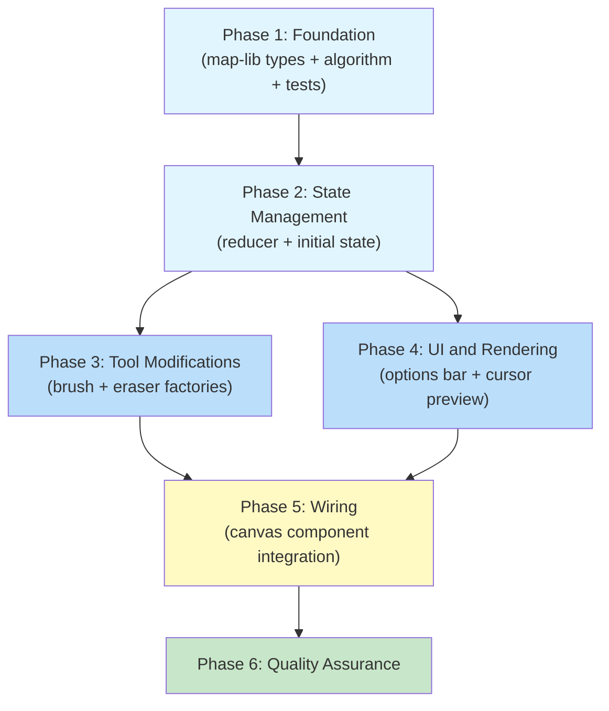
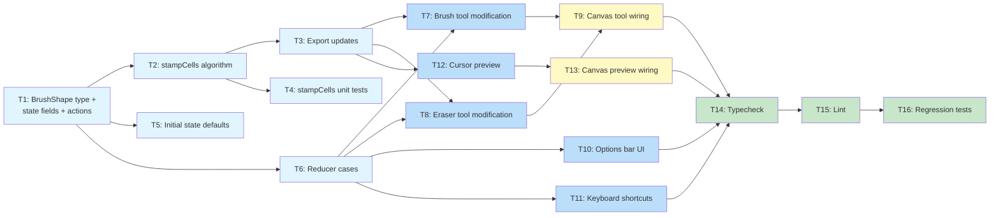

# Work Plan: Brush Thickness and Fill UI Implementation

Created Date: 2026-02-27
Type: feature
Estimated Duration: 1-2 days
Estimated Impact: 10 files (9 modified, 1 test file extended)
Related Issue/PR: N/A

## Related Documents
- Design Doc: [docs/design/design-016-brush-thickness-and-fill-ui.md](../design/design-016-brush-thickness-and-fill-ui.md)
- Prerequisite ADRs: ADR-0011 (autotile routing), ADR-0010 (map-lib extraction), ADR-0006 (map editor architecture)

## Objective

Add configurable brush thickness (1-15 cell diameter) with circle/square shape toggle to brush and eraser tools, add fill tool label to the options bar UI, add multi-cell cursor preview on the canvas, and add `[`/`]` keyboard shortcuts for brush size adjustment. This eliminates the tedium of single-cell painting on large maps (64x64 through 256x256).

## Background

The brush and eraser tools currently paint exactly one cell per stroke point. For large maps, this makes terrain painting slow and tedious. The fill tool backend is fully implemented (`floodFill` + `RoutingFillCommand`) but has no visible button in the options bar, making it non-discoverable.

**Implementation Approach**: Vertical Slice (Feature-driven), per Design Doc. The core algorithm (`stampCells`) has zero dependencies, type changes are additive, and each modified file can be updated independently. Each phase delivers testable value.

**Development Strategy**: Implementation-First (Strategy B). No pre-existing test skeletons; tests are added alongside the `stampCells` implementation in Phase 1.

## Risks and Countermeasures

### Technical Risks

- **Risk**: Large brush (diameter 15) + fast drag causes frame drops
  - **Impact**: Low -- max stamp is 225 cells; dedup Map limits unique cells
  - **Countermeasure**: Existing `Map<string, CellPatchEntry>` dedup already prevents redundant computation; worst-case unique cells per drag ~2000

- **Risk**: Even/odd brush size confusion for users
  - **Impact**: Low -- `brushSize=4` produces same stamp as `brushSize=5` (both use `r=2`)
  - **Countermeasure**: Documented in code comments; consistent with pixel art editor conventions

- **Risk**: `[`/`]` keyboard shortcut conflicts
  - **Impact**: Low -- these keys are not used by any existing shortcut
  - **Countermeasure**: Shortcuts only fire when no input element is focused

### Schedule Risks

- **Risk**: None identified -- all changes are additive with no migration needed

## Phase Structure Diagram



## Task Dependency Diagram



**Legend**: Light blue = foundation, Blue = implementation, Yellow = integration wiring, Green = QA.

## Implementation Phases

---

### Phase 1: Foundation -- map-lib Types + Algorithm + Tests (Estimated commits: 1-2)

**Purpose**: Establish all new types, the pure `stampCells` algorithm, public exports, and unit tests. Everything else depends on these.

**Depends on**: Nothing (foundation layer)

#### Tasks

- [ ] **Task 1 (T1)**: Add `BrushShape` type, `brushSize`/`brushShape` state fields, and new actions to `editor-types.ts`
  - **File**: `packages/map-lib/src/types/editor-types.ts`
  - **Changes**:
    - Add `export type BrushShape = 'circle' | 'square';` after the `EditorTool` type
    - Add `brushSize: number;` and `brushShape: BrushShape;` to `MapEditorState` in the editor UI state section
    - Add `| { type: 'SET_BRUSH_SIZE'; size: number }`, `| { type: 'ADJUST_BRUSH_SIZE'; delta: number }`, `| { type: 'SET_BRUSH_SHAPE'; shape: BrushShape }` to `MapEditorAction` union
  - **Dependencies**: None
  - **Verification**: `pnpm nx typecheck map-lib` passes
  - **AC coverage**: FR7 (shared state fields)

- [ ] **Task 2 (T2)**: Add `stampCells()` function to `drawing-algorithms.ts`
  - **File**: `packages/map-lib/src/core/drawing-algorithms.ts`
  - **Changes**:
    - Import `BrushShape` from `../types/editor-types`
    - Add `stampCells(cx, cy, brushSize, shape, width, height): Array<{x: number; y: number}>` per Design Doc section 2
    - Circle: `dx*dx + dy*dy <= r*r` where `r = Math.floor(brushSize / 2)`
    - Square: `[cx-r, cx+r] x [cy-r, cy+r]`
    - Bounds clipping: all cells satisfy `0 <= x < width` and `0 <= y < height`
  - **Dependencies**: T1 (BrushShape type)
  - **Verification**: Function compiles, typecheck passes
  - **AC coverage**: FR1 (multi-cell painting area), FR2 (circle/square shapes)

- [ ] **Task 3 (T3)**: Export `stampCells` and `BrushShape` from `index.ts`
  - **File**: `packages/map-lib/src/index.ts`
  - **Changes**:
    - Add `export type { BrushShape } from './types/editor-types';` to editor-types export block
    - Add `stampCells` to the drawing-algorithms export line
  - **Dependencies**: T1, T2
  - **Verification**: `pnpm nx typecheck map-lib` passes

- [ ] **Task 4 (T4)**: Add `stampCells` unit tests
  - **File**: `packages/map-lib/src/core/drawing-algorithms.spec.ts`
  - **Changes**: Add `describe('stampCells', ...)` block with 7 test cases from Design Doc:
    1. Single cell for brushSize=1 (circle) -- backward compatibility (AC: FR1)
    2. Single cell for brushSize=1 (square) -- backward compatibility (AC: FR1)
    3. Circle stamp for brushSize=5 -- 13 cells, all within r^2 (AC: FR2)
    4. Square stamp for brushSize=5 -- 25 cells in [3,7]x[3,7] (AC: FR2)
    5. Boundary clipping at (0,0) with brushSize=5 -- 9 cells (AC: FR1)
    6. Fully OOB center returns empty array (AC: FR1)
    7. No duplicate entries for brushSize=7 circle (AC: FR1)
    8. Even brushSize=4 produces same stamp as brushSize=5 (design invariant)
  - **Dependencies**: T2, T3
  - **Verification**: `pnpm nx test map-lib --testFile=src/core/drawing-algorithms.spec.ts` -- all tests GREEN
  - **AC coverage**: FR1 (backward compat, multi-cell), FR2 (circle/square shapes)

- [ ] **Quality check**: `pnpm nx typecheck map-lib && pnpm nx lint map-lib`

#### Phase 1 Completion Criteria

- [ ] `BrushShape` type, state fields, and action variants added to `editor-types.ts`
- [ ] `stampCells` function implemented in `drawing-algorithms.ts`
- [ ] `stampCells` and `BrushShape` exported from `index.ts`
- [ ] 8 unit tests for `stampCells` pass (AC: FR1, FR2 partial)
- [ ] `pnpm nx typecheck map-lib` and `pnpm nx lint map-lib` pass

#### Operational Verification Procedures

1. Run `pnpm nx test map-lib --testFile=src/core/drawing-algorithms.spec.ts` -- all 8 new tests pass
2. Verify `stampCells(5, 5, 1, 'circle', 10, 10)` returns `[{x:5, y:5}]` (backward compat)
3. Verify `stampCells(5, 5, 5, 'square', 20, 20)` returns 25 cells (square stamp)
4. Verify `stampCells(0, 0, 5, 'square', 10, 10)` returns 9 cells (boundary clipping)

---

### Phase 2: State Management -- Reducer + Initial State (Estimated commits: 1)

**Purpose**: Wire brush state into the editor reducer so all downstream consumers (tools, UI, renderer) can read and update brush settings.

**Depends on**: Phase 1 (BrushShape type, MapEditorAction variants)

#### Tasks

- [ ] **Task 5 (T5)**: Add `brushSize: 1` and `brushShape: 'circle'` to initial state
  - **File**: `apps/genmap/src/hooks/use-map-editor.ts`
  - **Changes**:
    - Add `brushSize: 1,` and `brushShape: 'circle' as const,` to `createInitialState()` in the editor UI state section
  - **Dependencies**: T1
  - **Verification**: Typecheck passes; initial state includes new fields
  - **AC coverage**: FR7 (shared state), FR1 (brushSize=1 default = backward compat)

- [ ] **Task 6 (T6)**: Add `SET_BRUSH_SIZE`, `ADJUST_BRUSH_SIZE`, `SET_BRUSH_SHAPE` reducer cases
  - **File**: `apps/genmap/src/hooks/use-map-editor.ts`
  - **Changes**: Add three cases to `mapEditorReducer` per Design Doc section 4:
    - `SET_BRUSH_SIZE`: clamp to [1, 15] via `Math.max(1, Math.min(15, Math.round(action.size)))`
    - `ADJUST_BRUSH_SIZE`: `Math.max(1, Math.min(15, state.brushSize + action.delta))`
    - `SET_BRUSH_SHAPE`: `{ ...state, brushShape: action.shape }`
  - **Dependencies**: T1, T5
  - **Verification**: Typecheck passes; reducer handles all new action types without exhaustiveness errors
  - **AC coverage**: FR6 (keyboard shortcuts will dispatch ADJUST_BRUSH_SIZE), FR3 (UI will dispatch SET_BRUSH_SIZE/SET_BRUSH_SHAPE)

- [ ] **Quality check**: `pnpm nx typecheck genmap`

#### Phase 2 Completion Criteria

- [ ] Initial state includes `brushSize: 1` and `brushShape: 'circle'`
- [ ] Reducer handles SET_BRUSH_SIZE (clamped), ADJUST_BRUSH_SIZE (relative), SET_BRUSH_SHAPE
- [ ] No TypeScript exhaustiveness errors
- [ ] `pnpm nx typecheck genmap` passes

#### Operational Verification Procedures

1. Run `pnpm nx typecheck genmap` -- passes without errors
2. Verify reducer pattern: dispatching `{type: 'SET_BRUSH_SIZE', size: 20}` clamps to 15
3. Verify reducer pattern: dispatching `{type: 'ADJUST_BRUSH_SIZE', delta: -1}` from size=1 stays at 1

---

### Phase 3: Tool Modifications -- Brush + Eraser Factories (Estimated commits: 1)

**Purpose**: Modify brush and eraser tool factories to accept brush size/shape parameters and use `stampCells` for multi-cell painting. This is the core behavior change.

**Depends on**: Phase 1 (stampCells, BrushShape), Phase 2 (state fields)

#### Tasks

- [ ] **Task 7 (T7)**: Modify `createBrushTool` to use `stampCells`
  - **File**: `apps/genmap/src/components/map-editor/tools/brush-tool.ts`
  - **Changes** per Design Doc section 5:
    - Add import: `import { bresenhamLine, stampCells, RoutingPaintCommand } from '@nookstead/map-lib';` and `import type { BrushShape } from '@nookstead/map-lib';`
    - Extend factory signature: add `brushSize: number` and `brushShape: BrushShape` parameters
    - In `onMouseDown`: replace `tryPaint(tile.x, tile.y)` with `stampCells(tile.x, tile.y, brushSize, brushShape, state.width, state.height)` loop calling `tryPaint` per cell
    - In `onMouseMove`: wrap the inner Bresenham loop -- for each point, call `stampCells` then `tryPaint` per cell
  - **Dependencies**: T2, T3
  - **Verification**: Typecheck passes; call site in map-editor-canvas.tsx will be updated in Phase 5
  - **AC coverage**: FR1 (multi-cell brush painting), FR2 (shape support in brush tool)

- [ ] **Task 8 (T8)**: Modify `createEraserTool` to use `stampCells`
  - **File**: `apps/genmap/src/components/map-editor/tools/eraser-tool.ts`
  - **Changes** per Design Doc section 6:
    - Identical changes as brush tool: add imports, extend factory signature with `brushSize`/`brushShape`, use `stampCells` in `onMouseDown` and `onMouseMove`
    - `tryErase` function itself is unchanged
  - **Dependencies**: T2, T3
  - **Verification**: Typecheck passes; call site in map-editor-canvas.tsx will be updated in Phase 5
  - **AC coverage**: FR1 (multi-cell eraser), FR7 (eraser shares same brush settings)

#### Phase 3 Completion Criteria

- [ ] Both tool factories accept `brushSize` and `brushShape` parameters
- [ ] Both tools use `stampCells` to expand each paint/erase point to a multi-cell stamp
- [ ] Existing dedup via `Map<string, CellPatchEntry>` unchanged -- handles overlapping stamps automatically
- [ ] Note: typecheck may show errors at call sites in `map-editor-canvas.tsx` until Phase 5

#### Operational Verification Procedures

1. Verify brush-tool.ts and eraser-tool.ts compile individually (no syntax errors)
2. Verify `stampCells` import resolves correctly from `@nookstead/map-lib`
3. Confirm factory signature change: `createBrushTool(state, dispatch, brushSize, brushShape)`

---

### Phase 4: UI and Rendering -- Options Bar + Cursor Preview (Estimated commits: 1-2)

**Purpose**: Add user-facing controls for brush settings and visual feedback for the brush stamp area. Can be worked in parallel with Phase 3 since both depend only on Phase 2.

**Depends on**: Phase 1 (stampCells, BrushShape), Phase 2 (reducer actions)

#### Tasks

- [ ] **Task 10 (T10)**: Add brush size slider + shape toggle to options bar
  - **File**: `apps/genmap/src/components/map-editor/editor-options-bar.tsx`
  - **Changes** per Design Doc section 7:
    - Add `import type { BrushShape } from '@nookstead/map-lib';`
    - Add conditional UI block for `state.activeTool === 'brush' || state.activeTool === 'eraser'`:
      - Range input slider: min=1, max=15, value=`state.brushSize`, dispatches `SET_BRUSH_SIZE`
      - Size label: `{state.brushSize}` in `text-[11px] tabular-nums`
      - Circle/square toggle buttons using inline SVGs, active state via `bg-accent` class
      - Dispatches `SET_BRUSH_SHAPE` with `'circle'` or `'square'`
    - Add fill tool label: when `state.activeTool === 'fill'`, display "Fill" text
  - **Dependencies**: T6 (reducer handles actions)
  - **Verification**: Visual verification in browser; typecheck passes
  - **AC coverage**: FR3 (options bar controls), FR4 (fill tool label)

- [ ] **Task 11 (T11)**: Add `[`/`]` keyboard shortcuts for brush size
  - **File**: `apps/genmap/src/components/map-editor/editor-options-bar.tsx`
  - **Changes** per Design Doc section 7:
    - Add two cases to existing `handleKeyDown` in the `useEffect` keydown handler:
      - `case '[': dispatch({ type: 'ADJUST_BRUSH_SIZE', delta: -1 }); break;`
      - `case ']': dispatch({ type: 'ADJUST_BRUSH_SIZE', delta: 1 }); break;`
    - No change to `useEffect` dependency array -- `ADJUST_BRUSH_SIZE` is relative
  - **Dependencies**: T6 (reducer handles ADJUST_BRUSH_SIZE)
  - **Verification**: Press `[` and `]` in browser; verify size changes
  - **AC coverage**: FR6 (keyboard shortcuts)

- [ ] **Task 12 (T12)**: Add `BrushPreview` interface and multi-cell cursor preview to canvas renderer
  - **File**: `apps/genmap/src/components/map-editor/canvas-renderer.ts`
  - **Changes** per Design Doc section 8:
    - Add import: `import { stampCells, type BrushShape } from '@nookstead/map-lib';`
    - Add `BrushPreview` interface: `{ brushSize: number; brushShape: BrushShape; activeTool: string }`
    - Add optional `brushPreview?: BrushPreview` parameter to `renderMapCanvas` signature
    - Replace cursor highlight section with:
      - If `isBrushLike` (brush/eraser tool with brushSize > 1): call `stampCells` for cell list, fill each cell with `rgba(255, 255, 255, 0.15)`, draw outer boundary edges with `rgba(255, 255, 255, 0.5)` stroke using shared-edge detection via Set lookup
      - Else: existing single-cell highlight (unchanged)
  - **Dependencies**: T2, T3 (stampCells)
  - **Verification**: Typecheck passes; visual verification in browser
  - **AC coverage**: FR5 (cursor preview matches stamp area)

- [ ] **Quality check**: `pnpm nx typecheck genmap`

#### Phase 4 Completion Criteria

- [ ] Options bar shows brush size slider + shape toggle for brush/eraser tools (AC: FR3)
- [ ] Options bar shows "Fill" label for fill tool (AC: FR4)
- [ ] `[`/`]` shortcuts dispatch ADJUST_BRUSH_SIZE (AC: FR6)
- [ ] `renderMapCanvas` accepts optional `brushPreview` parameter
- [ ] Multi-cell cursor preview renders stamp area with fill + outer boundary stroke (AC: FR5)
- [ ] Single-cell highlight preserved for brushSize=1 and non-brush tools

#### Operational Verification Procedures

1. Run `pnpm nx typecheck genmap` -- passes
2. Visual check: select brush tool, verify slider and shape toggle appear in options bar
3. Visual check: select fill tool, verify "Fill" label appears
4. Visual check: select rectangle tool, verify no brush controls shown
5. Press `]` key several times, verify brush size increments (visible in slider)
6. Hover cursor on canvas with brushSize > 1, verify multi-cell preview

---

### Phase 5: Wiring -- Canvas Component Integration (Estimated commits: 1)

**Purpose**: Connect all pieces through the canvas component: pass brush state to tool factories and renderer.

**Depends on**: Phase 3 (tool signature changes), Phase 4 (renderer signature change)

#### Tasks

- [ ] **Task 9 (T9)**: Wire brush params to tool factories in `map-editor-canvas.tsx`
  - **File**: `apps/genmap/src/components/map-editor/map-editor-canvas.tsx`
  - **Changes** per Design Doc section 9:
    - In the `useMemo` for `toolHandlers`, update brush and eraser cases:
      - `case 'brush': return createBrushTool(state, dispatch, state.brushSize, state.brushShape);`
      - `case 'eraser': return createEraserTool(state, dispatch, state.brushSize, state.brushShape);`
    - Add `state.brushSize` and `state.brushShape` to the `useMemo` dependency array
  - **Dependencies**: T7, T8
  - **Verification**: Typecheck passes; brush/eraser tools receive new params
  - **AC coverage**: FR1 (tool integration), FR7 (shared settings passed to both tools)

- [ ] **Task 13 (T13)**: Wire `brushPreview` parameter to `renderMapCanvas`
  - **File**: `apps/genmap/src/components/map-editor/map-editor-canvas.tsx`
  - **Changes** per Design Doc section 9:
    - In the render callback, pass `brushPreview` as final argument to `renderMapCanvas`:
      ```
      { brushSize: state.brushSize, brushShape: state.brushShape, activeTool: state.activeTool }
      ```
  - **Dependencies**: T12 (renderer accepts brushPreview)
  - **Verification**: Typecheck passes; cursor preview updates when brush settings change
  - **AC coverage**: FR5 (cursor preview integration)

- [ ] **Quality check**: `pnpm nx typecheck genmap`

#### Phase 5 Completion Criteria

- [ ] Tool factories receive `brushSize`/`brushShape` from state
- [ ] Tool handlers recreated when `brushSize` or `brushShape` changes (useMemo deps)
- [ ] `renderMapCanvas` receives `brushPreview` from state
- [ ] Full feature functional: painting, preview, and UI all connected
- [ ] `pnpm nx typecheck genmap` passes with zero errors

#### Operational Verification Procedures

(Design Doc Integration Points verification)

**Integration Point 1: stampCells -> Tool Factories**
1. Select brush tool, set size to 5 (circle), paint on canvas
2. Verify a circle-shaped area of ~13 cells is painted
3. Switch to square shape, paint again -- verify 5x5 square area painted

**Integration Point 2: Reducer -> Options Bar**
1. Move slider to size 8 -- verify state.brushSize updates
2. Press `]` -- verify size increments to 9
3. Press `[` three times -- verify size decrements to 6

**Integration Point 3: State -> Canvas Renderer**
1. Set brush size to 7 (circle), hover cursor over canvas
2. Verify cursor preview shows ~29 highlighted cells in circle shape
3. Verify preview boundary outline follows the outer edge of the stamp
4. Paint and verify the painted area matches the preview exactly

---

### Phase 6: Quality Assurance (Estimated commits: 1)

**Purpose**: Full quality verification across both packages. Verify all acceptance criteria.

**Depends on**: All previous phases

#### Tasks

- [ ] **Task 14 (T14)**: Run typecheck and fix any type errors
  - **Commands**: `pnpm nx typecheck map-lib && pnpm nx typecheck genmap`
  - **Dependencies**: All tasks T1-T13
  - **Verification**: Zero type errors

- [ ] **Task 15 (T15)**: Run lint and fix any lint issues
  - **Commands**: `pnpm nx lint map-lib && pnpm nx lint genmap`
  - **Dependencies**: T14
  - **Verification**: Zero lint errors

- [ ] **Task 16 (T16)**: Run tests to verify no regressions
  - **Commands**: `pnpm nx test map-lib`
  - **Dependencies**: T15
  - **Verification**: All existing tests pass + 8 new stampCells tests pass

- [ ] Verify all Design Doc acceptance criteria achieved (checklist below)

#### Acceptance Criteria Verification

**FR1: Multi-cell brush/eraser painting**
- [ ] Brush tool at brushSize=5, brushShape='circle' paints ~13 cells per stamp point
- [ ] Eraser tool at brushSize=5 erases same stamp pattern
- [ ] brushSize=1 paints exactly one cell (backward compatible)
- [ ] Drag painting applies stampCells at each Bresenham line point with dedup

**FR2: Brush shape toggle**
- [ ] brushSize=5, shape='square' paints 5x5 = 25 cells
- [ ] brushSize=5, shape='circle' paints cells where dx^2+dy^2 <= 4

**FR3: Options bar brush controls**
- [ ] Active tool = brush or eraser: slider + shape toggle visible
- [ ] Active tool = fill, rectangle, zone, object-place: brush controls hidden

**FR4: Fill tool label**
- [ ] Active tool = fill: "Fill" label displayed in options bar

**FR5: Cursor preview**
- [ ] Brush/eraser with brushSize > 1: multi-cell stamp preview with fill + boundary stroke
- [ ] Other tools or brushSize=1: single-cell cursor highlight

**FR6: Keyboard shortcuts**
- [ ] `]` increments brushSize by 1 (clamped to 15)
- [ ] `[` decrements brushSize by 1 (clamped to 1)

**FR7: Shared brush settings**
- [ ] Changing brushSize on brush tool persists when switching to eraser
- [ ] brushSize and brushShape are global MapEditorState properties

#### Phase 6 Completion Criteria

- [ ] `pnpm nx typecheck map-lib` -- zero errors
- [ ] `pnpm nx typecheck genmap` -- zero errors
- [ ] `pnpm nx lint map-lib` -- zero errors
- [ ] `pnpm nx lint genmap` -- zero errors
- [ ] `pnpm nx test map-lib` -- all tests pass (including 8 new stampCells tests)
- [ ] All 7 FRs verified via acceptance criteria checklist above

#### Operational Verification Procedures

(Full E2E visual verification from Design Doc)

1. Select brush tool, set size to 5, paint on canvas -- verify 5-diameter circle is painted
2. Switch to square shape -- verify square is painted
3. Press `]` three times -- verify size increments to 8
4. Switch to eraser -- verify eraser uses same brush size
5. Verify cursor preview matches actual painted area
6. Set size to 1 -- verify single-cell behavior identical to pre-change behavior

---

## Completion Criteria

- [ ] All 6 phases completed
- [ ] Each phase's operational verification procedures executed
- [ ] Design Doc acceptance criteria satisfied (FR1-FR7)
- [ ] Staged quality checks completed (zero typecheck/lint errors)
- [ ] All tests pass (8 new + all existing)
- [ ] User review approval obtained

## Files Modified Summary

| File | Phase | Changes |
|------|-------|---------|
| `packages/map-lib/src/types/editor-types.ts` | P1 | BrushShape type, brushSize/brushShape fields, SET_BRUSH_* actions |
| `packages/map-lib/src/core/drawing-algorithms.ts` | P1 | stampCells() function |
| `packages/map-lib/src/index.ts` | P1 | Export stampCells, BrushShape |
| `packages/map-lib/src/core/drawing-algorithms.spec.ts` | P1 | 8 stampCells unit tests |
| `apps/genmap/src/hooks/use-map-editor.ts` | P2 | Initial state defaults + 3 reducer cases |
| `apps/genmap/src/components/map-editor/tools/brush-tool.ts` | P3 | brushSize/brushShape params + stampCells usage |
| `apps/genmap/src/components/map-editor/tools/eraser-tool.ts` | P3 | brushSize/brushShape params + stampCells usage |
| `apps/genmap/src/components/map-editor/editor-options-bar.tsx` | P4 | Slider, shape toggle, fill label, [/] shortcuts |
| `apps/genmap/src/components/map-editor/canvas-renderer.ts` | P4 | BrushPreview interface, multi-cell cursor preview |
| `apps/genmap/src/components/map-editor/map-editor-canvas.tsx` | P5 | Pass brushSize/brushShape to tools + renderer |

## Progress Tracking

### Phase 1: Foundation
- Start:
- Complete:
- Notes:

### Phase 2: State Management
- Start:
- Complete:
- Notes:

### Phase 3: Tool Modifications
- Start:
- Complete:
- Notes:

### Phase 4: UI and Rendering
- Start:
- Complete:
- Notes:

### Phase 5: Wiring
- Start:
- Complete:
- Notes:

### Phase 6: Quality Assurance
- Start:
- Complete:
- Notes:

## Notes

- All changes are additive. `brushSize=1` default produces identical behavior to current implementation -- no migration or rollback plan needed.
- The `brushPreview` parameter in `renderMapCanvas` is optional, so the renderer signature remains backward-compatible.
- Phases 3 and 4 can be worked in parallel since they depend only on Phases 1 and 2.
- Total new test count: 8 unit tests for `stampCells` in `drawing-algorithms.spec.ts`.
