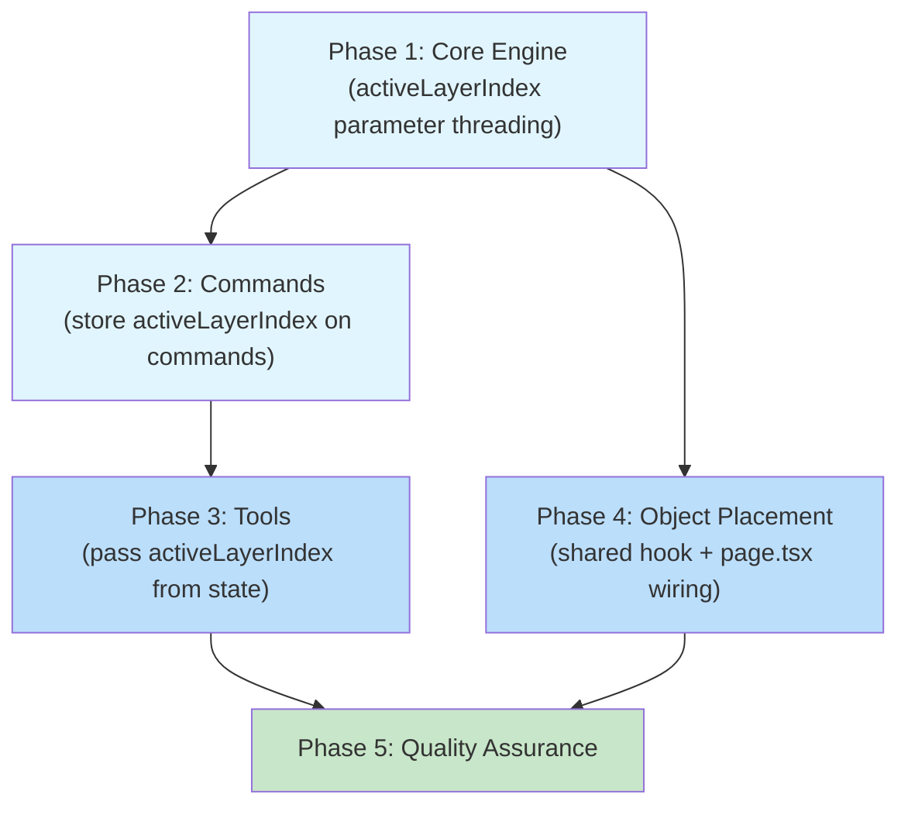
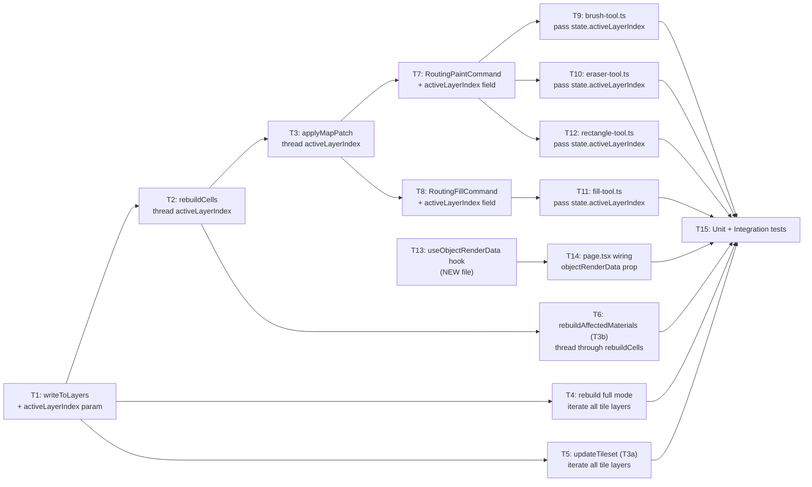

# Work Plan: Multi-Layer Painting and Object Placement

Created Date: 2026-02-28
Type: fix + feature
Estimated Duration: 1-2 days
Estimated Impact: 11 files (7 modified, 1 new, 3 test files extended/created)
Related Issue/PR: N/A

## Related Documents
- Design Doc: [docs/design/design-017-multi-layer-painting-and-object-placement.md](../design/design-017-multi-layer-painting-and-object-placement.md)
- ADR: [docs/adr/ADR-0012-multi-layer-painting-pipeline.md](../adr/ADR-0012-multi-layer-painting-pipeline.md)
- Prerequisite ADRs: ADR-0011 (autotile routing architecture)

## Objective

Fix two interconnected defects in the genmap map editor:

1. **Bug fix (layer-targeted painting)**: Drawing tools (brush, fill, rectangle, eraser) always write frame data to `layer[0]` regardless of `activeLayerIndex`. Root cause: `writeToLayers()` in RetileEngine uses `.find()` instead of respecting the active layer. This makes the multi-layer system non-functional for painting.

2. **Feature (object visibility)**: Object placement dispatch works correctly but placed objects are invisible because `objectRenderData` is never populated in `page.tsx`. The canvas renderer already handles `objectRenderData` -- it just needs the data.

## Background

The RetileEngine pipeline flows: Tool -> Command -> `applyMapPatch()` -> `rebuildCells()` -> `writeToLayers()`. At no point in this chain is `activeLayerIndex` threaded through. The `writeToLayers()` method at line 1125-1144 of `retile-engine.ts` uses `layers.find(l => type !== 'object')` to always target the first tile layer.

For undo correctness, `activeLayerIndex` must be captured at command creation time (not at execution time), because the user may switch layers between an operation and its undo.

For object rendering, the `GameObjectsPanel` component loads sprite images and atlas frames internally but does not expose them. A shared `useObjectRenderData` hook will extract and expose this data.

**Implementation Approach**: Vertical Slice (Feature-driven), per Design Doc. The two work items (layer targeting and object rendering) are independent vertical slices that each deliver user-visible value.

**Development Strategy**: Implementation-First (Strategy B). No pre-existing test skeletons; tests are added in the final phase.

## Risks and Countermeasures

### Technical Risks

- **Risk**: `activeLayerIndex` out of bounds during undo (layer deleted after paint)
  - **Impact**: Medium -- undo would target a non-existent layer
  - **Countermeasure**: `writeToLayers` falls back to first tile layer if target is invalid (same as current behavior)

- **Risk**: Full rebuild performance with many layers
  - **Impact**: Low -- full rebuilds are infrequent (tileset change only); O(layers) multiplier is negligible for 2-5 layers
  - **Countermeasure**: No action needed; monitor if layer counts grow beyond 10

- **Risk**: Existing tests break from signature change
  - **Impact**: High if it happens -- 19 spec files
  - **Countermeasure**: All new parameters have defaults (backward compatible); no existing call sites change

- **Risk**: Sprite S3 URL expiration during long editing sessions
  - **Impact**: Medium -- objects would become invisible after URL expiry
  - **Countermeasure**: Hook can be extended with refresh-on-error logic in a future iteration; not blocking for initial implementation

### Schedule Risks

- **Risk**: None identified -- all changes are additive with no migration needed

## Phase Structure Diagram



Note: Phase 4 (Object Placement) is independent of Phases 2-3 (layer targeting) and can be done in parallel after Phase 1 completes. Both converge at Phase 5 (QA).

## Task Dependency Diagram



## Implementation Phases

### Phase 1: Core Engine -- activeLayerIndex Parameter Threading (Estimated commits: 1)

**Purpose**: Add `activeLayerIndex` parameter to the RetileEngine pipeline so that frame/tilesetKey writes target the correct layer. Also update full-rebuild and T3a/T3b paths to write to ALL tile layers.

**Acceptance Criteria**: AC -- FR-1 (partial: engine layer), FR-3, Backward Compatibility

#### Tasks

- [x] T1: Add `activeLayerIndex?: number` parameter to `writeToLayers()` (default 0)
  - File: `packages/map-lib/src/core/retile-engine.ts` (line 1136)
  - Change: Replace `layers.find(l => type !== 'object')` with `layers[activeLayerIndex]` plus fallback to first tile layer if target is invalid or is an object layer
  - Layer type check uses existing casting pattern: `(layer as unknown as { type: string }).type === 'object'`
- [x] T2: Add `activeLayerIndex?: number` parameter to `rebuildCells()` (default 0)
  - File: `packages/map-lib/src/core/retile-engine.ts` (line 458)
  - Change: Accept parameter, pass through to `writeToLayers` at line 692
- [x] T3: Add `activeLayerIndex?: number` parameter to `applyMapPatch()` (default 0)
  - File: `packages/map-lib/src/core/retile-engine.ts` (line 146)
  - Change: Accept parameter, pass through to `rebuildCells` at line 200
- [x] T4: Update `rebuild('full')` to iterate ALL tile layers
  - File: `packages/map-lib/src/core/retile-engine.ts` (line 377-416)
  - Change: In full mode, after `rebuildCells` computes frames, iterate all tile layers and call `writeToLayers` for each tile layer's index
  - Note: Object layers (where `type === 'object'`) are skipped during iteration
- [x] T5: Update `updateTileset()` to iterate ALL tile layers (T3a trigger)
  - File: `packages/map-lib/src/core/retile-engine.ts` (line 219-287)
  - Change: The `writeToLayers` call at line 276 must iterate all tile layers instead of writing to a single layer
- [x] T6: Update `rebuildAffectedMaterials()` to thread through `rebuildCells` for all tile layers (T3b trigger)
  - File: `packages/map-lib/src/core/retile-engine.ts` (line 1063-1088)
  - Change: The `rebuildCells` call at line 1080 must write to all tile layers (same policy as full rebuild)
  - This affects `addTileset()` (line 326-340) and `removeTileset()` (line 299-314) indirectly
- [ ] Quality check: TypeScript typecheck passes (`pnpm nx typecheck map-lib`)

#### Phase Completion Criteria

- [x] `writeToLayers()` accepts `activeLayerIndex` and targets `layers[activeLayerIndex]`
- [x] `writeToLayers()` with omitted `activeLayerIndex` defaults to layer 0 (backward compat)
- [x] `writeToLayers()` falls back to first tile layer if target is invalid or object layer
- [ ] `applyMapPatch()` -> `rebuildCells()` -> `writeToLayers()` chain threads `activeLayerIndex`
- [x] `rebuild('full')` writes frames to every tile layer
- [ ] `updateTileset()` writes frames to every tile layer (T3a)
- [x] `rebuildAffectedMaterials()` writes frames to every tile layer (T3b)
- [ ] `pnpm nx typecheck map-lib` passes
- [ ] All 19 existing spec files pass without modification: `pnpm nx test map-lib`

#### Operational Verification Procedures

1. Run `pnpm nx typecheck map-lib` -- expect zero errors
2. Run `pnpm nx test map-lib` -- expect all 19 spec files pass (zero failures, zero modifications)
3. Manually verify no existing callers of `applyMapPatch`, `rebuild`, `writeToLayers`, `rebuildCells` were missed by searching for all call sites

---

### Phase 2: Commands -- Store activeLayerIndex (Estimated commits: 1)

**Purpose**: Add `activeLayerIndex` as a readonly field on `RoutingPaintCommand` and `RoutingFillCommand`, captured at construction time and passed to `engine.applyMapPatch()` during execute/undo.

**Acceptance Criteria**: AC -- FR-2 (undo/redo layer correctness)

**Depends on**: Phase 1 (engine API must accept `activeLayerIndex`)

#### Tasks

- [ ] T7: Add `activeLayerIndex` to `RoutingPaintCommand`
  - File: `packages/map-lib/src/core/routing-commands.ts`
  - Changes:
    - Add `activeLayerIndex: number = 0` as third constructor parameter (optional, default 0)
    - Store as `private readonly activeLayerIndex: number`
    - Pass `this.activeLayerIndex` to `this.engine.applyMapPatch(state, mapPatches, this.activeLayerIndex)` in both `execute()` (line 59) and `undo()` (line 93)
- [ ] T8: Add `activeLayerIndex` to `RoutingFillCommand`
  - File: `packages/map-lib/src/core/routing-commands.ts`
  - Changes:
    - Add `activeLayerIndex: number = 0` as third constructor parameter (optional, default 0)
    - Store as `private readonly activeLayerIndex: number`
    - Pass `this.activeLayerIndex` to `this.engine.applyMapPatch(state, mapPatches, this.activeLayerIndex)` in both `execute()` (line 157) and `undo()` (line 188)
- [ ] Quality check: TypeScript typecheck passes (`pnpm nx typecheck map-lib`)

#### Phase Completion Criteria

- [ ] `RoutingPaintCommand` stores `activeLayerIndex` from constructor, passes to `applyMapPatch`
- [ ] `RoutingFillCommand` stores `activeLayerIndex` from constructor, passes to `applyMapPatch`
- [ ] Existing code that creates commands without `activeLayerIndex` continues to work (default 0)
- [ ] Commands never read `activeLayerIndex` from `state` parameter -- only from stored field
- [ ] `pnpm nx typecheck map-lib` passes
- [ ] All existing spec files pass: `pnpm nx test map-lib`

#### Operational Verification Procedures

1. Run `pnpm nx typecheck map-lib` -- expect zero errors
2. Run `pnpm nx test map-lib` -- expect all spec files pass
3. Verify by code inspection that `execute()` and `undo()` both use `this.activeLayerIndex`, never `state.activeLayerIndex`

---

### Phase 3: Tools -- Pass activeLayerIndex from State (Estimated commits: 1)

**Purpose**: Update all four tool files to pass `state.activeLayerIndex` when constructing commands, completing the layer-targeting pipeline from UI to engine.

**Acceptance Criteria**: AC -- FR-1 (complete: all tools)

**Depends on**: Phase 2 (command constructors must accept `activeLayerIndex`)

#### Tasks

- [x] T9: Update `brush-tool.ts` to pass `state.activeLayerIndex`
  - File: `apps/genmap/src/components/map-editor/tools/brush-tool.ts`
  - Change: Line 83-86, update constructor call:
    ```typescript
    const command = new RoutingPaintCommand(
      Array.from(paintedCells.values()),
      engine,
      state.activeLayerIndex,
    );
    ```
- [ ] T10: Update `eraser-tool.ts` to pass `state.activeLayerIndex`
  - File: `apps/genmap/src/components/map-editor/tools/eraser-tool.ts`
  - Change: Line 85-88, update constructor call:
    ```typescript
    const command = new RoutingPaintCommand(
      Array.from(erasedCells.values()),
      engine,
      state.activeLayerIndex,
    );
    ```
- [x] T11: Update `fill-tool.ts` to pass `state.activeLayerIndex`
  - File: `apps/genmap/src/components/map-editor/tools/fill-tool.ts`
  - Change: Line 45, update constructor call:
    ```typescript
    const command = new RoutingFillCommand(patches, engine, state.activeLayerIndex);
    ```
- [x] T12: Update `rectangle-tool.ts` to pass `state.activeLayerIndex`
  - File: `apps/genmap/src/components/map-editor/tools/rectangle-tool.ts`
  - Change: Line 86, update constructor call:
    ```typescript
    const command = new RoutingPaintCommand(patches, engine, state.activeLayerIndex);
    ```
- [ ] Quality check: TypeScript typecheck passes for genmap app

#### Phase Completion Criteria

- [ ] All 4 tools pass `state.activeLayerIndex` to command constructors
- [ ] Layer targeting pipeline complete: user selects layer N -> tool captures N -> command stores N -> engine writes to layer N
- [ ] No tool reads `activeLayerIndex` from any source other than `state.activeLayerIndex` at construction time
- [ ] Typecheck passes

#### Operational Verification Procedures

1. Search all tool files for `new RoutingPaintCommand` and `new RoutingFillCommand` -- verify all pass `state.activeLayerIndex`
2. Run `pnpm nx typecheck map-lib` -- expect zero errors
3. Manual verification: In the editor, create 2 tile layers, select layer[1], paint with brush -- verify layer[1] frames updated, layer[0] unchanged

---

### Phase 4: Object Placement -- Shared Hook + Wiring (Estimated commits: 1)

**Purpose**: Create the `useObjectRenderData` hook and wire it into `page.tsx` so placed game objects become visible on the canvas.

**Acceptance Criteria**: AC -- FR-4 (object rendering)

**Depends on**: Phase 1 only (independent of Phases 2-3)

#### Tasks

- [x] T13: Create `useObjectRenderData` hook
  - File: `apps/genmap/src/hooks/use-object-render-data.ts` (NEW)
  - Interface: `useObjectRenderData(objectIds: string[]): Map<string, ObjectRenderEntry>`
  - Implementation:
    - Accept array of unique object IDs
    - For each object ID, fetch sprite data from `/api/sprites/{id}` and frame data from `/api/sprites/{id}/frames`
    - Load sprite images via `Image()` constructor
    - Return `Map<string, ObjectRenderEntry>` with loaded image and frame coordinates
    - Use `useRef` or `useMemo` for referential stability
    - Cache loaded images to avoid redundant fetches
    - Individual fetch failures silently skipped (partial results returned)
  - Extract pattern from `GameObjectsPanel` at lines 383-458 (do not duplicate logic)
- [x] T14: Wire `useObjectRenderData` into `page.tsx`
  - File: `apps/genmap/src/app/(editor)/maps/[id]/page.tsx`
  - Changes:
    - Derive `objectIds` using `useMemo`: iterate `state.layers`, filter layers where `(layer as unknown as { type: string }).type === 'object'`, flatMap their `objects` arrays, collect unique `objectId` values
    - Call `useObjectRenderData(objectIds)` to get render data
    - Pass `objectRenderData` prop to `MapEditorCanvas` component (at line 533-550)
  - Note: `MapEditorCanvas` already accepts `objectRenderData?: Map<string, ObjectRenderEntry>` (no component change needed)
  - Note: `canvas-renderer.ts` already renders objects when `objectRenderData` is populated (lines 134-155, no renderer change needed)
- [ ] Quality check: TypeScript typecheck passes

#### Phase Completion Criteria

- [x] `useObjectRenderData` hook created and exported
- [ ] `page.tsx` derives `objectIds` from state layers and passes `objectRenderData` to canvas
- [ ] Placed game objects are visible on the canvas
- [ ] Missing sprites do not crash the editor (graceful degradation)
- [ ] Typecheck passes

#### Operational Verification Procedures

1. Run typecheck -- expect zero errors
2. Manual verification: Open map editor, add object layer, place an object, verify it appears on the canvas
3. Verify that removing a placed object makes it disappear from the canvas
4. Verify that switching to object-place mode shows ghost preview at cursor

---

### Phase 5: Quality Assurance (Required) (Estimated commits: 1)

**Purpose**: Add unit and integration tests for all new behavior. Verify all acceptance criteria. Run full quality checks.

**Acceptance Criteria**: All AC items (FR-1, FR-2, FR-3, FR-4, Backward Compatibility)

**Depends on**: Phases 1-4

#### Tasks

- [ ] T15a: Backward compatibility verification
  - Run `pnpm nx test map-lib` and verify all 19 existing spec files pass without modification
  - Expected: Zero failures, zero test modifications

- [ ] T15b: Add `writeToLayers` unit tests
  - File: `packages/map-lib/src/core/retile-engine.spec.ts` (extend existing) or new `retile-engine.multilayer.spec.ts`
  - Tests:
    - `writeToLayers` with `activeLayerIndex=1` writes to `layers[1]`, not `layers[0]` (AC: FR-1)
    - `writeToLayers` with `activeLayerIndex=undefined` writes to first tile layer (AC: backward compat)
    - `writeToLayers` with invalid index falls back to first tile layer
    - `writeToLayers` skips object layers when targeting by index

- [ ] T15c: Add multi-layer painting integration tests
  - File: `packages/map-lib/src/core/retile-engine.integration.spec.ts` (extend existing)
  - Tests:
    - Paint on `layer[1]` in a 2-tile-layer map: verify `layer[1].frames[y][x]` updated, `layer[0].frames[y][x]` unchanged (AC: FR-1)
    - Fill on `layer[1]`: verify fill results written to correct layer (AC: FR-1)

- [ ] T15d: Add undo-across-layer-switch test
  - File: `packages/map-lib/src/core/routing-commands.spec.ts` (extend existing)
  - Tests:
    - Create `RoutingPaintCommand` with `activeLayerIndex=1`, verify stored value is used in `execute()` and `undo()` (AC: FR-2)
    - Paint on `layer[1]`, switch state to `layer[2]`, call undo, verify `layer[1]` restored (not `layer[2]`) (AC: FR-2)
    - Verify `redo` also writes to `layer[1]` (AC: FR-2)

- [ ] T15e: Add full rebuild multi-layer test
  - File: `packages/map-lib/src/core/retile-engine.integration.spec.ts` (extend existing)
  - Tests:
    - Create 3-tile-layer map, trigger `rebuild('full')`, verify all 3 layers have consistent frames (AC: FR-3)
    - Verify object layers are skipped during full rebuild iteration (AC: FR-3)

- [ ] T15f: Add T3a/T3b all-layers tests
  - File: `packages/map-lib/src/core/retile-engine.integration.spec.ts` (extend existing)
  - Tests:
    - Call `updateTileset()` on a 2-tile-layer map, verify both layers updated (T3a)
    - Call `addTileset()`/`removeTileset()` on a 2-tile-layer map, verify both layers updated (T3b)

- [ ] T15g: Quality checks
  - Run `pnpm nx typecheck map-lib` -- expect zero errors
  - Run `pnpm nx lint map-lib` -- expect zero errors (or pre-existing only)
  - Run `pnpm nx test map-lib` -- expect all tests pass including new ones

- [ ] T15h: Verify all Design Doc acceptance criteria
  - [ ] FR-1: Layer-targeted drawing (all 4 tools write to correct layer)
  - [ ] FR-2: Undo/redo layer correctness (stored index used, not current)
  - [ ] FR-3: Full rebuild all layers (full rebuild + T3a + T3b write to all tile layers)
  - [ ] FR-4: Object rendering (placed objects visible on canvas)
  - [ ] Backward compatibility: All 19 existing spec files pass without modification

#### Phase Completion Criteria

- [ ] All new tests pass
- [ ] All 19 existing spec files pass without modification
- [ ] TypeScript typecheck passes: `pnpm nx typecheck map-lib`
- [ ] Lint passes: `pnpm nx lint map-lib`
- [ ] All Design Doc acceptance criteria verified
- [ ] No regressions in any game system

#### Operational Verification Procedures

1. Run `pnpm nx test map-lib` -- expect ALL tests pass (existing + new)
2. Run `pnpm nx typecheck map-lib` -- expect zero errors
3. Run `pnpm nx lint map-lib` -- expect zero errors
4. Manual E2E verification in browser:
   - Create map with 2 tile layers
   - Paint on layer[1] with brush -- verify layer[1] updated, layer[0] unchanged
   - Fill on layer[1] -- verify correct layer
   - Rectangle on layer[1] -- verify correct layer
   - Erase on layer[1] -- verify correct layer
   - Switch to layer[0], undo last paint on layer[1] -- verify layer[1] restored
   - Add object layer, place object -- verify object visible on canvas
   - Remove object -- verify object disappears

## Testing Strategy

### Test Distribution

| Test Type | Count | Files |
|-----------|-------|-------|
| Unit tests (writeToLayers targeting) | 4 | `retile-engine.spec.ts` or new `.multilayer.spec.ts` |
| Integration tests (multi-layer paint) | 2 | `retile-engine.integration.spec.ts` |
| Integration tests (undo across layers) | 3 | `routing-commands.spec.ts` |
| Integration tests (full rebuild) | 2 | `retile-engine.integration.spec.ts` |
| Integration tests (T3a/T3b all-layers) | 2 | `retile-engine.integration.spec.ts` |
| Backward compatibility | 19 | All existing spec files |
| **Total new tests** | **13** | |

### Backward Compatibility Guarantee

All new parameters are optional with default value `0`. The following contract ensures zero-modification backward compatibility:

- `applyMapPatch(state, patches)` -- continues to work (defaults to layer 0)
- `rebuild(state, 'full')` -- continues to work (writes to all layers, which is correct even for single-layer maps)
- `new RoutingPaintCommand(patches, engine)` -- continues to work (defaults to layer 0)
- `new RoutingFillCommand(patches, engine)` -- continues to work (defaults to layer 0)

## File Impact Summary

| File | Change Type | Phase | Description |
|------|-------------|-------|-------------|
| `packages/map-lib/src/core/retile-engine.ts` | Modified | P1 | Add `activeLayerIndex` to `writeToLayers`, `rebuildCells`, `applyMapPatch`, `rebuild`, `updateTileset`, `rebuildAffectedMaterials` |
| `packages/map-lib/src/core/routing-commands.ts` | Modified | P2 | Add `activeLayerIndex` field to `RoutingPaintCommand` and `RoutingFillCommand` |
| `apps/genmap/src/components/map-editor/tools/brush-tool.ts` | Modified | P3 | Pass `state.activeLayerIndex` to command constructor |
| `apps/genmap/src/components/map-editor/tools/fill-tool.ts` | Modified | P3 | Pass `state.activeLayerIndex` to command constructor |
| `apps/genmap/src/components/map-editor/tools/rectangle-tool.ts` | Modified | P3 | Pass `state.activeLayerIndex` to command constructor |
| `apps/genmap/src/components/map-editor/tools/eraser-tool.ts` | Modified | P3 | Pass `state.activeLayerIndex` to command constructor |
| `apps/genmap/src/hooks/use-object-render-data.ts` | New | P4 | Shared hook for loading object sprite/frame data |
| `apps/genmap/src/app/(editor)/maps/[id]/page.tsx` | Modified | P4 | Derive objectIds, call hook, pass to canvas |
| `packages/map-lib/src/core/retile-engine.spec.ts` | Extended | P5 | writeToLayers targeting unit tests |
| `packages/map-lib/src/core/retile-engine.integration.spec.ts` | Extended | P5 | Multi-layer paint, full rebuild, T3a/T3b tests |
| `packages/map-lib/src/core/routing-commands.spec.ts` | Extended | P5 | Undo-across-layer-switch tests |

## Completion Criteria

- [ ] All phases completed (P1 through P5)
- [ ] Each phase's operational verification procedures executed
- [ ] Design Doc acceptance criteria satisfied:
  - [ ] FR-1: Layer-targeted drawing (all 4 tools)
  - [ ] FR-2: Undo/redo layer correctness
  - [ ] FR-3: Full rebuild all layers (including T3a/T3b triggers)
  - [ ] FR-4: Object rendering
  - [ ] Backward compatibility: All existing tests pass without modification
- [ ] Quality checks completed:
  - [ ] `pnpm nx typecheck map-lib` -- zero errors
  - [ ] `pnpm nx lint map-lib` -- zero errors
  - [ ] `pnpm nx test map-lib` -- all tests pass
- [ ] User review approval obtained

## Progress Tracking

### Phase 1: Core Engine
- Start:
- Complete:
- Notes:

### Phase 2: Commands
- Start:
- Complete:
- Notes:

### Phase 3: Tools
- Start:
- Complete:
- Notes:

### Phase 4: Object Placement
- Start:
- Complete:
- Notes:

### Phase 5: Quality Assurance
- Start:
- Complete:
- Notes:

## Notes

- The `EditorLayer` interface does not have a direct `type` discriminator field. Layer type discrimination throughout the engine uses the casting pattern: `(layer as unknown as { type: string }).type === 'object'`. This is an existing pattern (see `cloneLayers` at line 1107) and must be followed consistently.
- The `useObjectRenderData` hook should extract its sprite loading logic from `GameObjectsPanel` (lines 383-458) to avoid code duplication. The panel can optionally be refactored to consume the shared hook, but this is not required for the initial implementation.
- The canvas renderer at `canvas-renderer.ts` line 134 and `map-editor-canvas.tsx` line 83 already support `objectRenderData` -- no changes needed in the rendering pipeline.
