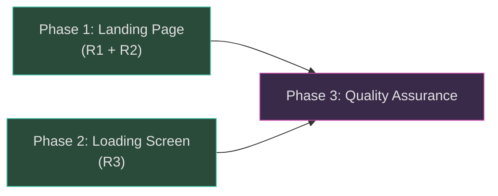

# Work Plan: Login/Loader Redesign

Created Date: 2026-03-01
Type: feature
Estimated Duration: 1 day
Estimated Impact: 4 files
Related Issue/PR: N/A

## Related Documents

- Design Doc: [docs/design/design-018-login-loader-redesign.md](../design/design-018-login-loader-redesign.md)
- ADR: [docs/adr/adr-002-nextauth-authentication.md](../adr/adr-002-nextauth-authentication.md) (prerequisite, unchanged)

## Objective

Make the landing page auth-aware (welcome greeting + Enter button for returning players), replace the fragile `isLocalhost` registration gate with a server-side `REGISTRATION_OPEN` env var, and visually unify the loading screen with the landing page by reusing the `HeroDayCycle` component.

## Background

Authenticated users are currently silently redirected to `/game` via `redirect('/game')`, bypassing the landing page entirely. Registration gating is hardcoded to hostname detection. The loading screen uses its own star/cloud rendering that duplicates logic from the landing page and creates a jarring visual transition.

## Risks and Countermeasures

| Risk | Impact | Countermeasure |
|------|--------|----------------|
| HeroDayCycle setInterval during Phaser loading adds CPU overhead | Low | 1-second interval is minimal; already proven on landing page. Defer start if issues arise. |
| `REGISTRATION_OPEN` env var not set in deployment | Medium | Default to "closed" (coming soon badge). Document clearly in `.env.example`. |
| `session.user.name` is null for some OAuth providers | Low | Render "Welcome back" without name when null. |
| Removing redirect breaks deep-link expectations | Low | Users navigate via Enter button; middleware still protects `/game`. |

## Phase Dependency Diagram

Phases 1 and 2 are independent and can be implemented in parallel or in either order.

---

## Phase 1: Auth-Aware Landing Page (R1 + R2) -- Estimated commits: 1

**Purpose**: Make the landing page show a welcome greeting and Enter button for authenticated users, and replace `isLocalhost` with `REGISTRATION_OPEN` env var for registration gating.

**Files modified**: `apps/game/src/app/page.tsx`, `apps/game/src/app/global.css`, `.env.example`

### Tasks

- [x] Remove `redirect` import from `next/navigation` and `headers` import from `next/headers`
- [x] Remove `redirect('/game')` block (lines 16-18) and `isLocalhost` computation (lines 11-14)
- [x] Add `Link` import from `next/link`
- [x] Add `isAuthenticated`, `displayName`, and `registrationOpen` derived variables
- [x] Implement conditional rendering in JSX:
  - Authenticated: "Welcome back, [name]" greeting + Enter button (AC: R1)
  - Unauthenticated + `REGISTRATION_OPEN=true`: Login buttons (AC: R2)
  - Unauthenticated + not open: Coming soon badge (AC: R2)
- [x] Update footer hint text per auth state:
  - Authenticated: "Ready to continue your adventure"
  - Unauthenticated + open: "Sign in to start your adventure"
  - Unauthenticated + closed: "We're working hard to open the gates"
- [x] Hide all login buttons while authenticated (AC: R1)
- [x] Handle null `session.user.name` gracefully -- display "Welcome back" without name (AC: R1)
- [x] Add CSS classes to `global.css`:
  - `.landing-hero__welcome` for greeting text
  - `.landing-hero__enter-btn` with hover, active, and focus-visible states (keyboard accessible)
- [x] Add `REGISTRATION_OPEN` entry to `.env.example` with documentation comment
- [x] Quality check: `pnpm nx lint game && pnpm nx typecheck game`

### Phase Completion Criteria

- [x] Authenticated users see "Welcome back, [name]" and Enter button on `/` (AC: R1)
- [x] Login buttons hidden for authenticated users (AC: R1)
- [x] Enter button navigates to `/game` (AC: R1)
- [x] `REGISTRATION_OPEN=true` shows login buttons for unauthenticated users (AC: R2)
- [x] `REGISTRATION_OPEN` unset shows coming soon badge (AC: R2)
- [x] Authenticated users see Enter button regardless of `REGISTRATION_OPEN` value (AC: R2)
- [x] No `redirect('/game')` call exists in `page.tsx` (AC: R1)
- [x] Enter button has `focus-visible` outline for keyboard accessibility
- [x] Lint and typecheck pass

### Operational Verification Procedures

1. Start dev server: `pnpm nx dev game`
2. **Authenticated path**: Sign in with Google OAuth, navigate to `/` -- verify "Welcome back, [name]" text, Enter button visible, no login buttons
3. **Enter button**: Click Enter -- verify navigation to `/game`
4. **Unauthenticated + open**: Sign out, set `REGISTRATION_OPEN=true` in `.env`, navigate to `/` -- verify login buttons visible
5. **Unauthenticated + closed**: Remove or unset `REGISTRATION_OPEN`, navigate to `/` -- verify "Coming soon" badge visible
6. **Keyboard nav**: Tab to Enter button -- verify focus outline visible

---

## Phase 2: Loading Screen Redesign (R3) -- Estimated commits: 1

**Purpose**: Replace the loading screen's custom stars/clouds/text-logo with the shared `HeroDayCycle` component, logo image, and tagline for visual consistency with the landing page.

**Files modified**: `apps/game/src/components/game/LoadingScreen.tsx`, `apps/game/src/app/global.css`

### Tasks

- [x] Remove `useMemo` import (no longer needed)
- [x] Remove `stars` and `clouds` useMemo blocks
- [x] Add `HeroDayCycle` import from `@/components/landing/HeroDayCycle`
- [x] Add `Image` import from `next/image`
- [x] Replace stars/clouds DOM rendering with `<HeroDayCycle />` as background sky (AC: R3)
- [x] Replace `<h1>NOOKSTEAD</h1>` text logo with `<Image src="/logo.png" width={400} height={98} />` (AC: R3)
- [x] Remove `.loading-screen__logo-shadow` element
- [x] Add tagline `
` with text "Build your homestead in a living world" (AC: R3)
- [x] Retain pixel divider, progress bar, and "Loading..." text (AC: R3)
- [x] Update CSS in `global.css`:
  - Remove `.loading-screen__clouds`, `.loading-screen__stars`, `.loading-screen__star` rules
  - Remove `.loading-screen__logo`, `.loading-screen__logo-shadow` rules
  - Update `.loading-screen` background to dark fallback (HeroDayCycle provides gradient)
  - Add `.loading-screen__logo-img` styles
  - Add `.loading-screen__tagline` styles
- [x] Verify `LoadingScreen` interface remains `{ visible: boolean }` (unchanged)
- [x] Quality check: `pnpm nx lint game && pnpm nx typecheck game`

### Phase Completion Criteria

- [x] Loading screen renders `HeroDayCycle` as background sky (AC: R3)
- [x] Logo image `/logo.png` displayed at 400x98 instead of CSS text (AC: R3)
- [x] Tagline "Build your homestead in a living world" visible below logo (AC: R3)
- [x] Progress bar (animated) still visible (AC: R3)
- [x] Pixel divider retained (AC: R3)
- [x] No star or cloud rendering in LoadingScreen (AC: R3) -- replaced by HeroDayCycle
- [x] `LoadingScreen` prop interface unchanged (`{ visible: boolean }`)
- [x] `GameApp.tsx` integration unchanged (no modifications needed)
- [x] Lint and typecheck pass

### Operational Verification Procedures

1. Start dev server: `pnpm nx dev game`
2. Sign in and navigate to `/game`
3. Verify loading screen shows:
   - Animated day/night sky background (HeroDayCycle)
   - Logo image (not text)
   - Tagline text
   - Pixel divider
   - Animated progress bar
   - "Loading..." text
4. Verify transition to game when Phaser finishes loading
5. Verify no console errors related to HeroDayCycle cleanup on unmount

---

## Phase 3: Quality Assurance (Required) -- Estimated commits: 1

**Purpose**: Overall quality assurance and design doc consistency verification.

### Tasks

- [ ] Verify all design doc acceptance criteria achieved (R1: 5 criteria, R2: 4 criteria, R3: 6 criteria)
- [ ] Run full quality checks: `pnpm nx run-many -t lint typecheck build -p game`
- [ ] Verify no regressions in existing landing page features (clouds, LandingContent, etc.)
- [ ] Verify `HeroDayCycle` cleanup on LoadingScreen unmount (no setInterval leak)
- [ ] Verify visual consistency between landing hero and loading screen (shared sky, logo, tagline)

### Acceptance Criteria Checklist

#### R1: Auth-Aware Landing Page
- [ ] Authenticated user sees "Welcome back, [name]" on `/`
- [ ] Authenticated user sees Enter button navigating to `/game`
- [ ] Login buttons hidden for authenticated users
- [ ] Null `session.user.name` renders "Welcome back" without name
- [ ] No `redirect('/game')` call for authenticated users

#### R2: Coming Soon Gate
- [ ] `REGISTRATION_OPEN` unset shows "Coming soon" badge for unauthenticated users
- [ ] `REGISTRATION_OPEN=true` shows login buttons for unauthenticated users
- [ ] Authenticated users see Enter button regardless of `REGISTRATION_OPEN`
- [ ] `REGISTRATION_OPEN` is server-side only (no `NEXT_PUBLIC_` prefix)

#### R3: Loading Screen Redesign
- [ ] Loading screen renders `HeroDayCycle` as background
- [ ] Logo image `/logo.png` (400x98) replaces CSS text logo
- [ ] Tagline "Build your homestead in a living world" displayed
- [ ] Progress bar retained and visible
- [ ] Pixel divider retained
- [ ] Custom star/cloud rendering removed

### Operational Verification Procedures

1. Full flow test: Visit `/` unauthenticated with `REGISTRATION_OPEN=true` -> sign in -> verify welcome page -> click Enter -> verify loading screen -> verify game loads
2. Full flow test: Visit `/` unauthenticated with `REGISTRATION_OPEN` unset -> verify coming soon badge
3. Build verification: `pnpm nx build game` completes without errors
4. Lint verification: `pnpm nx lint game` passes
5. Typecheck verification: `pnpm nx typecheck game` passes

---

## Completion Criteria

- [ ] All phases completed
- [ ] Each phase's operational verification procedures executed
- [ ] Design doc acceptance criteria satisfied (15 total: 5 R1 + 4 R2 + 6 R3)
- [ ] Quality checks pass (lint, typecheck, build)
- [ ] `.env.example` updated with `REGISTRATION_OPEN` documentation
- [ ] No regressions in existing functionality
- [ ] User review approval obtained

## Progress Tracking

### Phase 1: Auth-Aware Landing Page (R1 + R2)
- Start: 2026-03-01
- Complete: 2026-03-01
- Notes: All tasks and completion criteria satisfied. Lint and typecheck pass.

### Phase 2: Loading Screen Redesign (R3)
- Start: 2026-03-01
- Complete: 2026-03-01
- Notes: All tasks completed. LoadingScreen rewritten with HeroDayCycle, logo image, tagline. CSS updated. Lint and typecheck pass.

### Phase 3: Quality Assurance
- Start:
- Complete:
- Notes:

## Notes

- **Implementation strategy**: Vertical slice per design doc -- R1+R2 together (same file), R3 independently
- **No test skeletons**: Strategy B (implementation-first), tests added as needed
- **HeroDayCycle reuse**: Used as-is, no modifications. The `useDayCycle` hook has proper cleanup (returns clearInterval in useEffect).
- **CSS approach**: Global CSS with BEM-like naming per project convention. No CSS Modules or Tailwind.
- **Phases 1 and 2 are independent**: Can be implemented in any order or in parallel.
