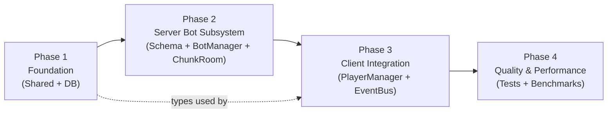
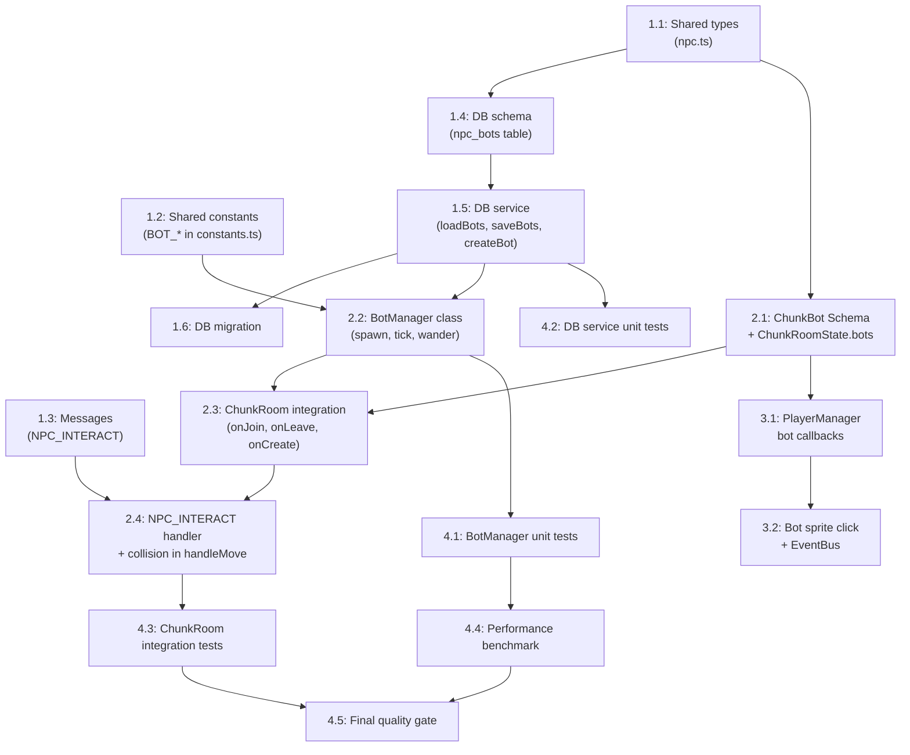

# Work Plan: NPC Bot-Companion System

Created Date: 2026-03-01
Type: feature
Estimated Duration: 5-7 days
Estimated Impact: ~18 files (8 existing + 10 new)
Related Issue/PR: N/A

## Related Documents
- Design Doc: [docs/design/design-019-npc-bot-companion.md](../design/design-019-npc-bot-companion.md)
- ADR: [docs/adr/ADR-0013-npc-bot-entity-architecture.md](../adr/ADR-0013-npc-bot-entity-architecture.md)
- PRD: [docs/prd/prd-009-npc-bot-companion.md](../prd/prd-009-npc-bot-companion.md)

## Objective

Добавить серверно-управляемых бот-компаньонов на хоумстеды игроков. Боты -- персистентные NPC-сущности с блужданием, физическими столкновениями и базовой интерактивностью. Реализация является фундаментом для полноценной NPC-системы (M0.3 DialogueEngine, M0.4 MemoryStream).

## Background

Хоумстеды игроков в Nookstead пусты -- нет NPC-сущностей в проекте. Colyseus ChunkRoomState содержит только `players` MapSchema. Отсутствуют NPC-таблицы в БД, серверная NPC-логика и клиентский NPC-рендеринг. Бот-компаньоны оживят хоумстеды и заложат архитектурную основу для npc-service.

### Текущее состояние кодовой базы
- **ChunkRoom.ts** (448 строк): onJoin определяет homestead по `player:` prefix, имеет доступ к `mapWalkable`
- **ChunkRoomState.ts** (22 строки): ChunkPlayer extends Schema, `players` MapSchema
- **PlayerManager.ts** (191 строка): callbacks onAdd/onChange/onRemove для `players`, создание PlayerSprite
- **PlayerSprite.ts** (169 строк): constructor(scene, worldX, worldY, skinKey, name, isLocal, sessionId)
- **packages/db**: Drizzle ORM, паттерн pgTable + service-функции
- **packages/shared**: types/messages.ts, constants.ts

## Risks and Countermeasures

### Technical Risks
- **Risk**: Боты застревают в непроходимых зонах из-за отсутствия A* pathfinding
  - **Impact**: Бот визуально "зависает", ухудшая UX
  - **Countermeasure**: Stuck detection (5 сек таймаут) + принудительный выбор новой цели. `MAX_WANDER_TARGET_ATTEMPTS = 20` ограничивает цикл поиска проходимого тайла
- **Risk**: Race condition при одновременном входе двух игроков на один хоумстед
  - **Impact**: Дублирование ботов или ошибки спавна
  - **Countermeasure**: Боты спавнятся при создании комнаты (не при каждом onJoin). Проверка: если `state.bots.size > 0`, спавн пропускается
- **Risk**: Деградация серверного тика при обработке ботов
  - **Impact**: Лаг для всех игроков в комнате
  - **Countermeasure**: Performance target: < 2 мс на все боты комнаты. Лимит `MAX_BOTS_PER_HOMESTEAD = 5`. Benchmark в Phase 4

### Schedule Risks
- **Risk**: Интеграция с ChunkRoom сложнее ожидаемого
  - **Impact**: Задержка Phase 2 (BotManager + ChunkRoom)
  - **Countermeasure**: BotManager полностью изолирован, интеграция через 3 точки (onJoin, onLeave, onCreate). Каждая точка тестируется отдельно

## Implementation Strategy

**Подход**: Foundation-driven (Horizontal Slice) с 4 фазами

**Обоснование**: Хотя Design Doc описывает вертикальный подход, для work plan используем горизонтальную декомпозицию по слоям, т.к. каждый слой имеет чёткие зависимости: Shared Types -> DB -> Server -> Client. Это минимизирует переключение контекста и позволяет изолированно тестировать каждый слой.

## Phase Structure Diagram

## Task Dependency Diagram

## Implementation Phases

---

### Phase 1: Foundation -- Shared Types + Database (Estimated commits: 3)

**Purpose**: Создать общие типы, константы и слой персистентности, от которых зависят все остальные компоненты.

**Owner**: mechanics-developer

#### Tasks

- [x] **Task 1.1**: Создать `packages/shared/src/types/npc.ts` -- типы `BotState`, `NpcInteractPayload`, `NpcInteractResult`
  - AC coverage: AC-7.1, AC-7.2, AC-7.3 (типы payload/result)
  - Dependencies: none
  - Files: `packages/shared/src/types/npc.ts` (new), `packages/shared/src/index.ts` (export)

- [x] **Task 1.2**: Добавить BOT_* константы в `packages/shared/src/constants.ts`
  - Constants: `BOT_SPEED`, `BOT_WANDER_RADIUS`, `BOT_WANDER_INTERVAL_TICKS`, `MAX_BOTS_PER_HOMESTEAD`, `DEFAULT_BOT_COUNT`, `BOT_INTERACTION_RADIUS`, `BOT_STUCK_TIMEOUT_MS`, `MAX_WANDER_TARGET_ATTEMPTS`, `BOT_NAMES`
  - AC coverage: AC-2.1 (interval), AC-2.2 (speed), AC-4.1 (names), AC-7.1 (radius), AC-8.1 (max bots)
  - Dependencies: none
  - Files: `packages/shared/src/constants.ts` (modify)

- [x] **Task 1.3**: Добавить `NPC_INTERACT` в `ClientMessage` и `NPC_INTERACT_RESULT` в `ServerMessage`
  - AC coverage: AC-7.1, AC-7.2, AC-7.3 (протокол взаимодействия)
  - Dependencies: none
  - Files: `packages/shared/src/types/messages.ts` (modify)

- [x] **Task 1.4**: Создать Drizzle-схему `npc_bots` в `packages/db/src/schema/npc-bots.ts`
  - Fields: id (uuid PK), mapId (FK maps.userId, cascade), name, skin, worldX (real), worldY (real), direction, createdAt, updatedAt
  - AC coverage: AC-5.1 (персистентность)
  - Dependencies: Task 1.1 (shared types)
  - Files: `packages/db/src/schema/npc-bots.ts` (new), `packages/db/src/schema/index.ts` (export)

- [x] **Task 1.5**: Создать DB-сервис `packages/db/src/services/npc-bot.ts` -- функции `loadBots()`, `saveBotPositions()`, `createBot()`
  - Pattern: аналогично `packages/db/src/services/player.ts` (DrizzleClient как параметр, upsert)
  - AC coverage: AC-5.1 (createBot), AC-5.2 (saveBotPositions), AC-5.3 (loadBots), AC-1.3 (errors don't block)
  - Dependencies: Task 1.4 (DB schema)
  - Files: `packages/db/src/services/npc-bot.ts` (new), `packages/db/src/index.ts` (export)

- [x] **Task 1.6**: Выполнить DB-миграцию для таблицы `npc_bots`
  - Command: `cd packages/db && pnpm db:generate && pnpm db:migrate`
  - Dependencies: Task 1.5
  - Files: `packages/db/src/migrations/0011_dizzy_mojo.sql` (generated)

- [ ] **Quality check**: `pnpm nx typecheck shared && pnpm nx typecheck db && pnpm nx lint shared && pnpm nx lint db`

#### Phase Completion Criteria
- [ ] Все типы (`BotState`, `NpcInteractPayload`, `NpcInteractResult`) экспортируются из `@nookstead/shared`
- [ ] Все BOT_* константы экспортируются из `@nookstead/shared`
- [ ] `NPC_INTERACT` / `NPC_INTERACT_RESULT` добавлены в message enums
- [ ] `npcBots` schema определена с корректными типами полей (worldX/worldY = real)
- [ ] DB-сервис компилируется и экспортируется из `@nookstead/db`
- [ ] Миграция применена к dev-базе
- [ ] Typecheck и lint проходят для shared и db пакетов

#### Operational Verification Procedures
1. `pnpm nx typecheck shared` -- без ошибок
2. `pnpm nx typecheck db` -- без ошибок
3. Проверить что `import { BotState, BOT_SPEED, NPC_INTERACT } from '@nookstead/shared'` резолвится
4. Проверить что `import { loadBots, saveBots, createBot } from '@nookstead/db'` резолвится
5. Применить миграцию: `pnpm nx migrate-latest db` -- таблица `npc_bots` создана

---

### Phase 2: Server Bot Subsystem (Estimated commits: 4)

**Purpose**: Реализовать серверную логику ботов -- Colyseus Schema, BotManager с блужданием, интеграцию с ChunkRoom lifecycle и обработку взаимодействий.

**Owner**: mechanics-developer

#### Tasks

- [x] **Task 2.1**: Создать `ChunkBot` Colyseus Schema класс и добавить `bots` MapSchema в `ChunkRoomState`
  - ChunkBot fields: id, worldX, worldY, direction, skin, name, state, ownerId (все @type декораторы)
  - AC coverage: AC-9.1 (Colyseus sync), AC-10.1 (skin field)
  - Dependencies: Phase 1 complete (shared types)
  - Files: `apps/server/src/rooms/ChunkRoomState.ts` (modify)

- [x] **Task 2.2**: Создать `BotManager` класс в `apps/server/src/npc-service/lifecycle/BotManager.ts`
  - Methods: `init()`, `tick()`, `getBotUpdates()`, `isTileOccupiedByBot()`, `validateInteraction()`, `getBotPositions()`, `destroy()`
  - Internal: `pickRandomWalkableTile()`, stuck detection, state machine (IDLE/WALKING)
  - Включает серверные типы `apps/server/src/npc-service/types/bot-types.ts` (ServerBot, BotUpdate, BotPosition, InteractionResult, BotManagerConfig)
  - AC coverage: AC-2.1..AC-2.5 (wander), AC-3.1 (collision check), AC-4.1 (name generation), AC-7.1..AC-7.3 (interaction validation), AC-8.1..AC-8.2 (multiple bots)
  - Dependencies: Task 1.2 (constants), Task 1.5 (DB service interfaces)
  - Files: `apps/server/src/npc-service/lifecycle/BotManager.ts` (new), `apps/server/src/npc-service/types/bot-types.ts` (new), `apps/server/src/npc-service/index.ts` (new)

- [x] **Task 2.3**: Интегрировать BotManager в ChunkRoom lifecycle
  - **onJoin**: После загрузки карты, если homestead room (`player:` prefix) -- загрузить ботов из БД или генерировать новых (первый вход). Добавить в `state.bots`
  - **onLeave**: Если последний игрок (`this.clients.length === 0`) -- сохранить бот-позиции в БД, очистить `state.bots`
  - **onCreate**: Добавить `setSimulationInterval` для `botManager.tick()` (100ms)
  - Race condition guard: если `state.bots.size > 0`, пропустить повторный спавн
  - AC coverage: AC-1.1 (first join spawn), AC-1.2 (rejoin load), AC-1.3 (error resilience), AC-6.1 (despawn)
  - Dependencies: Task 2.1 (ChunkBot), Task 2.2 (BotManager)
  - Files: `apps/server/src/rooms/ChunkRoom.ts` (modify)

- [x] **Task 2.4**: Реализовать NPC_INTERACT message handler и коллизию ботов в handleMove
  - **NPC_INTERACT handler**: получить botId, вызвать `botManager.validateInteraction()`, отправить `NPC_INTERACT_RESULT`
  - **handleMove collision**: после `world.movePlayer()`, проверить `botManager.isTileOccupiedByBot()`, откатить если занят
  - AC coverage: AC-3.1 (collision blocks movement), AC-7.1..AC-7.3 (interaction)
  - Dependencies: Task 2.3 (ChunkRoom integration), Task 1.3 (messages)
  - Files: `apps/server/src/rooms/ChunkRoom.ts` (modify)

- [ ] **Quality check**: `pnpm nx typecheck server && pnpm nx lint server`

#### Phase Completion Criteria
- [x] `ChunkBot` schema с 8 полями (@type декораторы) + `bots` MapSchema в ChunkRoomState
- [x] `BotManager` реализует полный lifecycle: init -> tick (wander state machine) -> destroy
- [x] `pickRandomWalkableTile()` возвращает проходимый тайл или null
- [x] Stuck detection: WALKING -> IDLE при таймауте 5 секунд
- [x] `isTileOccupiedByBot()` корректно проверяет тайловые координаты
- [x] `validateInteraction()` проверяет существование бота и радиус 3 тайла
- [x] ChunkRoom спавнит ботов при onJoin на homestead, деспавнит при onLeave последнего
- [x] `NPC_INTERACT` handler зарегистрирован, отправляет `NPC_INTERACT_RESULT`
- [x] Коллизия с ботами откатывает движение игрока
- [x] Typecheck и lint проходят для server

#### Operational Verification Procedures
1. `pnpm nx typecheck server` -- без ошибок
2. Запустить dev-сервер: `pnpm nx dev server`
3. Вручную подключиться к homestead room -- проверить в логах:
   - `[BotManager] Bots loaded from DB: ...` или `[BotManager] Bot created: ...`
   - `[BotManager] Bot spawned: ...`
4. Наблюдать обновление позиций ботов в Colyseus state (через Colyseus Monitor, если доступен)
5. Проверить что MOVE handler продолжает работать для игроков (regression)

---

### Phase 3: Client Integration (Estimated commits: 2)

**Purpose**: Отобразить ботов на клиенте через PlayerManager/PlayerSprite и реализовать клик-взаимодействие через EventBus.

**Owner**: mechanics-developer

#### Tasks

- [x] **Task 3.1**: Расширить `PlayerManager` -- добавить `setupBotCallbacks()` для `state.bots`
  - **onAdd**: Создать `PlayerSprite` (isLocal=false, sessionId=bot.id) с bot.skin, bot.name, bot.worldX, bot.worldY
  - **onChange**: Вызвать `sprite.setTarget(bot.worldX, bot.worldY)` и `sprite.updateAnimation(bot.direction, animState)` (idle/walk из bot.state)
  - **onRemove**: Уничтожить sprite
  - Вызвать `setupBotCallbacks()` после `setupCallbacks()` в `init()`
  - AC coverage: AC-4.2 (name label), AC-9.1 (interpolation), AC-9.2 (animation), AC-10.1 (skin)
  - Dependencies: Task 2.1 (ChunkBot schema для Colyseus sync)
  - Files: `apps/game/src/game/multiplayer/PlayerManager.ts` (modify)

- [x] **Task 3.2**: Реализовать клик-взаимодействие с ботами
  - В `onAdd` для ботов: включить `setInteractive()` на спрайте, добавить `pointerdown` handler
  - При клике: отправить `room.send(ClientMessage.NPC_INTERACT, { botId })`
  - Добавить обработчик `room.onMessage(ServerMessage.NPC_INTERACT_RESULT, ...)` -- emit через `EventBus.emit('npc:interact-result', data)`
  - AC coverage: AC-7.1..AC-7.3 (клиентская часть interaction)
  - Dependencies: Task 3.1 (bot sprites exist)
  - Files: `apps/game/src/game/multiplayer/PlayerManager.ts` (modify)

- [ ] **Quality check**: `pnpm nx typecheck game && pnpm nx lint game`

#### Phase Completion Criteria
- [ ] Бот-спрайты появляются на клиенте при подключении к homestead room
- [ ] Имена ботов отображаются над спрайтами (через PlayerSprite name label)
- [ ] Бот-спрайты плавно интерполируют позицию при onChange (аналогично remote players)
- [ ] Анимации ботов переключаются: idle при state='idle', walk при state='walking'
- [x] Клик по боту отправляет NPC_INTERACT на сервер
- [x] NPC_INTERACT_RESULT обрабатывается и emit через EventBus
- [ ] Бот-спрайты удаляются при onRemove
- [ ] Существующие player callbacks НЕ затронуты (regression)
- [ ] Typecheck и lint проходят для game

#### Operational Verification Procedures (Integration Point 3: Colyseus -> Client)
1. Запустить dev: `pnpm nx dev server` + `pnpm nx dev game`
2. Войти на хоумстед в браузере
3. Проверить визуально:
   - Бот виден на карте с именем над спрайтом
   - Бот перемещается (не стоит неподвижно дольше 10 секунд)
   - Анимация корректна (idle при остановке, walk при движении)
4. Кликнуть на бота:
   - В console log: EventBus emit `npc:interact-result`
   - Данные содержат `success: true, bot: { id, name, state }`
5. Попытаться пройти через бота:
   - Движение игрока блокируется (бот = solid body)
6. Выйти и войти снова:
   - Тот же бот (то же имя, тот же скин) появляется

---

### Phase 4: Quality Assurance & Performance (Required) (Estimated commits: 2)

**Purpose**: Обеспечить полное покрытие критериев приёмки тестами, валидировать производительность, убедиться в отсутствии регрессий.

**Owner**: qa-agent

#### Tasks

- [ ] **Task 4.1**: Unit-тесты BotManager (`apps/server/src/npc-service/lifecycle/BotManager.spec.ts`)
  - Tests:
    - AC-2.1: Бот в IDLE переходит в WALKING после wander interval (30 тиков)
    - AC-2.2: Бот перемещается к цели со скоростью BOT_SPEED (60 px/s)
    - AC-2.3: Бот переходит в IDLE по достижении цели (distance < 2px)
    - AC-2.4: Заблокированный бот выбирает новую цель
    - AC-2.5: Stuck detection (5 секунд без движения -> IDLE)
    - AC-3.1: `isTileOccupiedByBot()` returns true/false correctly
    - AC-4.1: Уникальность имён при генерации нескольких ботов
    - AC-7.1: `validateInteraction()` success с валидным расстоянием
    - AC-7.3: `validateInteraction()` error с невалидным botId / далёким игроком
    - AC-8.1: `generateBots()` не создаёт > MAX_BOTS_PER_HOMESTEAD ботов
  - Dependencies: Task 2.2 (BotManager)
  - Files: `apps/server/src/npc-service/lifecycle/BotManager.spec.ts` (new)

- [x] **Task 4.2**: Unit-тесты DB Service (`packages/db/src/services/npc-bot.spec.ts`)
  - Tests:
    - AC-5.1: `createBot()` сохраняет бота в БД, возвращает NpcBot
    - AC-5.2: `saveBotPositions()` обновляет worldX/worldY/direction
    - AC-5.3: `loadBots()` возвращает всех ботов владельца
    - Edge: `loadBots()` возвращает пустой массив если ботов нет
  - Dependencies: Task 1.5 (DB service)
  - Files: `packages/db/src/services/npc-bot.spec.ts` (new)

- [x] **Task 4.3**: Integration-тесты ChunkRoom (`apps/server/src/npc-service/__tests__/bot-integration.spec.ts`)
  - Tests:
    - AC-1.1: Спавн ботов при первом входе на homestead
    - AC-1.2: Загрузка ботов при повторном входе (bots из DB восстановлены)
    - AC-1.3: Ошибка loadBots не блокирует onJoin
    - AC-3.1: handleMove отклоняет перемещение на тайл с ботом
    - AC-6.1: Деспавн при выходе последнего игрока (saveBotPositions + clear state.bots)
    - Regression: onJoin/onLeave для игроков работает как раньше
  - Dependencies: Task 2.4 (ChunkRoom full integration)
  - Files: `apps/server/src/rooms/ChunkRoom.spec.ts` (new or modify)

- [ ] **Task 4.4**: Performance benchmark -- тик 10 ботов < 2 мс
  - Benchmark: создать BotManager с 10 ботами на карте 64x64, выполнить 1000 тиков, замерить среднее/p99
  - AC coverage: AC-8.2 (tick performance)
  - Target: average < 1 мс, p99 < 2 мс
  - Dependencies: Task 4.1 (BotManager tests passing)
  - Files: `apps/server/src/npc-service/lifecycle/BotManager.bench.ts` (new, optional) или в составе BotManager.spec.ts

- [ ] **Task 4.5**: Final quality gate
  - [ ] Все AC (AC-1.1 .. AC-10.1) покрыты тестами или проверены вручную
  - [ ] `pnpm nx run-many -t typecheck lint test` -- все проходят
  - [ ] Coverage >= 70% для новых файлов
  - [ ] Проверить Design Doc acceptance criteria checklist (все 27 AC)

#### Phase Completion Criteria
- [ ] Unit-тесты BotManager: 10+ тестов, все GREEN
- [ ] Unit-тесты DB Service: 4+ тестов, все GREEN
- [ ] Integration-тесты ChunkRoom: 6+ тестов, все GREEN
- [ ] Performance: тик 10 ботов < 2 мс (p99)
- [ ] `pnpm nx run-many -t typecheck lint test` -- zero errors
- [ ] Coverage новых файлов >= 70%

#### Operational Verification Procedures (Final)

**Automated verification**:
1. `pnpm nx test server` -- все тесты (unit + integration) GREEN
2. `pnpm nx test db` -- DB service тесты GREEN
3. `pnpm nx typecheck shared && pnpm nx typecheck db && pnpm nx typecheck server && pnpm nx typecheck game` -- zero errors
4. `pnpm nx lint shared && pnpm nx lint db && pnpm nx lint server && pnpm nx lint game` -- zero errors

**Manual E2E verification** (copy from Design Doc Integration Points):
1. Войти на хоумстед впервые -> бот спавнится за < 200 мс
2. Бот совершает минимум 1 перемещение за 10 секунд
3. Выйти и войти снова -> тот же бот (имя, скин, id) восстановлен
4. Кликнуть на бота -> получить NPC_INTERACT_RESULT с данными
5. Попытаться пройти через бота -> движение заблокировано
6. Второй игрок входит -> видит тех же ботов
7. Все игроки выходят -> логи: бот-позиции сохранены в БД

---

## Acceptance Criteria Traceability Matrix

| AC | Description | Phase | Task | Test Type |
|----|-------------|-------|------|-----------|
| AC-1.1 | First join: create N bots | P2 | 2.3 | Integration |
| AC-1.2 | Rejoin: load from DB | P2 | 2.3 | Integration |
| AC-1.3 | DB error doesn't block join | P2 | 2.3 | Integration |
| AC-2.1 | IDLE -> WALKING after interval | P2 | 2.2 | Unit |
| AC-2.2 | Move at BOT_SPEED | P2 | 2.2 | Unit |
| AC-2.3 | WALKING -> IDLE on target reached | P2 | 2.2 | Unit |
| AC-2.4 | Blocked -> new target | P2 | 2.2 | Unit |
| AC-2.5 | Stuck detection (5s) | P2 | 2.2 | Unit |
| AC-3.1 | Solid body collision | P2 | 2.4 | Unit + Integration |
| AC-4.1 | Unique names from BOT_NAMES | P1+P2 | 1.2, 2.2 | Unit |
| AC-4.2 | Name displayed over sprite | P3 | 3.1 | Manual E2E |
| AC-5.1 | createBot saves to DB | P1 | 1.5 | Unit |
| AC-5.2 | saveBotPositions on last leave | P1+P2 | 1.5, 2.3 | Unit + Integration |
| AC-5.3 | loadBots restores bots | P1+P2 | 1.5, 2.3 | Unit + Integration |
| AC-6.1 | Despawn on last player leave | P2 | 2.3 | Integration |
| AC-7.1 | NPC_INTERACT validates distance | P2 | 2.4 | Unit |
| AC-7.2 | NPC_INTERACT_RESULT with bot data | P2 | 2.4 | Unit |
| AC-7.3 | NPC_INTERACT error responses | P2 | 2.4 | Unit |
| AC-8.1 | MAX_BOTS_PER_HOMESTEAD limit | P2 | 2.2 | Unit |
| AC-8.2 | All bots in single tick cycle | P4 | 4.4 | Benchmark |
| AC-9.1 | Client interpolation via setTarget | P3 | 3.1 | Manual E2E |
| AC-9.2 | Client animation updates | P3 | 3.1 | Manual E2E |
| AC-10.1 | Bot uses assigned skin | P3 | 3.1 | Manual E2E |

## Testing Strategy

### Test Resolution Progress by Phase

| Phase | Unit Tests | Integration Tests | E2E/Manual | Cumulative |
|-------|-----------|------------------|------------|------------|
| Phase 1 | 0/4 (DB) | 0 | 0 | 0/4 |
| Phase 2 | 0/10 (BotManager) | 0/6 (ChunkRoom) | 0 | 0/20 |
| Phase 3 | 0 | 0 | 0/5 (manual) | 0/25 |
| Phase 4 | 14/14 | 6/6 | 5/5 | **25/25** |

### Test File Mapping

| Test File | Test Count | AC Coverage |
|-----------|-----------|-------------|
| `BotManager.spec.ts` | 10 | AC-2.1..2.5, AC-3.1, AC-4.1, AC-7.1, AC-7.3, AC-8.1 |
| `npc-bot.spec.ts` | 4 | AC-5.1, AC-5.2, AC-5.3 |
| `ChunkRoom.spec.ts` | 6 | AC-1.1..1.3, AC-3.1, AC-6.1, regression |
| Manual E2E | 5 | AC-4.2, AC-9.1, AC-9.2, AC-10.1, AC-8.2 |

## New Files Summary

| File | Phase | Type | Purpose |
|------|-------|------|---------|
| `packages/shared/src/types/npc.ts` | P1 | New | BotState, NpcInteractPayload, NpcInteractResult |
| `packages/db/src/schema/npc-bots.ts` | P1 | New | Drizzle schema for npc_bots table |
| `packages/db/src/services/npc-bot.ts` | P1 | New | loadBots, saveBotPositions, createBot |
| `apps/server/src/npc-service/index.ts` | P2 | New | NPC service barrel export |
| `apps/server/src/npc-service/types/bot-types.ts` | P2 | New | ServerBot, BotManagerConfig, etc. |
| `apps/server/src/npc-service/lifecycle/BotManager.ts` | P2 | New | Core bot logic |
| `apps/server/src/npc-service/lifecycle/BotManager.spec.ts` | P4 | New | BotManager unit tests |
| `packages/db/src/services/npc-bot.spec.ts` | P4 | New | DB service unit tests |

## Modified Files Summary

| File | Phase | Change Description |
|------|-------|--------------------|
| `packages/shared/src/constants.ts` | P1 | Add BOT_* constants and BOT_NAMES |
| `packages/shared/src/types/messages.ts` | P1 | Add NPC_INTERACT, NPC_INTERACT_RESULT |
| `packages/shared/src/index.ts` | P1 | Export new types |
| `packages/db/src/schema/index.ts` | P1 | Export npc-bots schema |
| `packages/db/src/index.ts` | P1 | Export npc-bot service functions |
| `apps/server/src/rooms/ChunkRoomState.ts` | P2 | Add ChunkBot class + bots MapSchema |
| `apps/server/src/rooms/ChunkRoom.ts` | P2 | Bot spawn/despawn/tick/interaction/collision |
| `apps/game/src/game/multiplayer/PlayerManager.ts` | P3 | setupBotCallbacks + click interaction |

## Completion Criteria

- [ ] All phases (1-4) completed
- [ ] Each phase's operational verification procedures executed
- [ ] All 27 Design Doc acceptance criteria (AC-1.1 .. AC-10.1) satisfied
- [ ] Staged quality checks completed (zero errors)
- [ ] All tests pass: `pnpm nx run-many -t typecheck lint test`
- [ ] Test coverage >= 70% for new files
- [ ] Performance: bot tick < 2 мс for 10 bots (p99)
- [ ] No regressions in existing player functionality
- [ ] User review approval obtained

## Progress Tracking

### Phase 1: Foundation
- Start:
- Complete:
- Notes:

### Phase 2: Server Bot Subsystem
- Start:
- Complete:
- Notes:

### Phase 3: Client Integration
- Start:
- Complete:
- Notes:

### Phase 4: Quality & Performance
- Start:
- Complete:
- Notes:

## Notes

- **Architecture alignment**: Все новые серверные файлы размещаются в `apps/server/src/npc-service/` для алигнмента с будущей NPC-системой (npc-service.md)
- **No PlayerSprite modification**: PlayerSprite.ts НЕ модифицируется -- боты переиспользуют его as-is через PlayerManager
- **Backward compatibility**: Клиенты без поддержки ботов не ломаются -- пустая MapSchema `bots` игнорируется старыми клиентами
- **Future M0.3 integration**: BotManager и NPC_INTERACT_RESULT готовы к расширению для DialogueEngine (добавление `dialogueAvailable` field)
