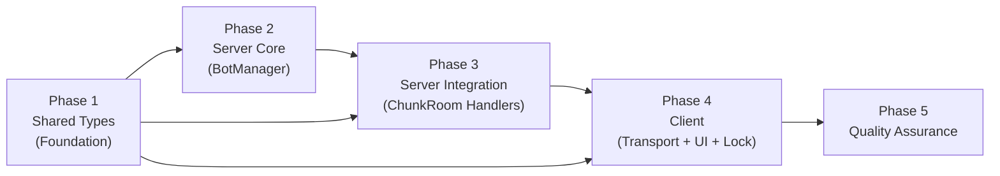
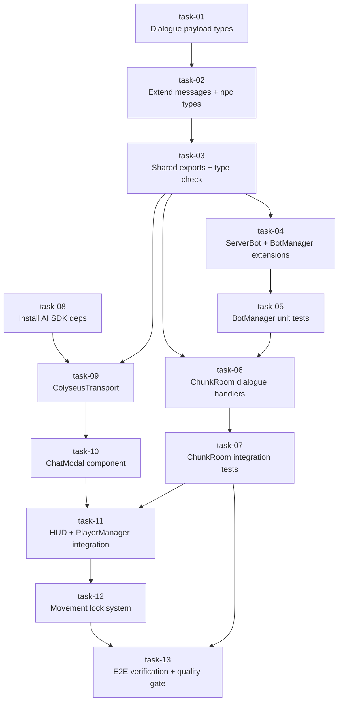

# Work Plan: NPC Dialogue System

Created Date: 2026-03-02
Type: feature
Estimated Duration: 3-4 days
Estimated Impact: 16 files (10 existing + 3 new + 3 config/style)
Related Issue/PR: N/A

## Related Documents
- Design Doc: [docs/design/design-020-npc-dialogue-system.md](../design/design-020-npc-dialogue-system.md)
- ADR: [docs/adr/ADR-0013-npc-bot-entity-architecture.md](../adr/ADR-0013-npc-bot-entity-architecture.md)

## Objective

Add player-bot dialogue with a chat modal UI. Players click a bot, a chat modal opens, and messages are echoed back via pseudo-streaming. This establishes the AI SDK transport layer for future real AI-powered NPC conversations. Bot stops moving during dialogue, player movement is locked.

## Background

Players can click on NPC bots and receive `NPC_INTERACT_RESULT`, but there is no dialogue or chat experience. The interaction is a dead end. This feature adds:
1. Chat modal UI using AI SDK `useChat` hook with custom Colyseus WebSocket transport
2. Server-side pseudo-streaming echo (word-by-word chunks, no real AI for MVP)
3. Bot `interacting` state (stops wandering during dialogue)
4. Player movement lock on both client (input disabled) and server (MOVE rejected)
5. Cleanup on disconnect, abort, and close

### Current Codebase State
- **ChunkRoom.ts**: Has `NPC_INTERACT` handler, `handleMove()`, `onLeave()` cleanup
- **BotManager.ts**: `tickBot()` dispatches on `bot.state` (idle/walking), has `transitionToIdle()`, `validateInteraction()`
- **PlayerManager.ts**: Listens for `NPC_INTERACT_RESULT`, emits via EventBus
- **HUD.tsx**: Modal state via `useState(false)`, renders `GameModal`
- **IdleState.ts / WalkState.ts**: Check `inputController.isMoving()` and `moveTarget`
- **Game.ts**: Click-to-move handler on `pointerup`

## Risks and Countermeasures

### Technical Risks
- **Risk**: AI SDK ChatTransport interface incompatibility -- custom transport must produce correct stream format
  - **Impact**: High -- ChatModal won't render streaming messages
  - **Countermeasure**: Research exact `ChatTransport.sendMessages()` contract before implementation (task-06). If incompatible, fall back to raw Colyseus messages with manual React state management
- **Risk**: Timer leak in pseudo-streaming (setTimeout chain not cancelled)
  - **Impact**: Medium -- orphaned timers send messages to disconnected clients
  - **Countermeasure**: Store timer IDs in dialogue session Map, cancel all in endDialogue/onLeave/onDispose
- **Risk**: Movement lock flag stuck after crash (EventBus `dialogue:unlock-movement` never fired)
  - **Impact**: Medium -- player cannot move until page reload
  - **Countermeasure**: Cleanup in `onLeave` sends unlock event. Client-side timeout fallback if needed

### Schedule Risks
- **Risk**: AI SDK `@ai-sdk/react` interface differs from documented examples
  - **Impact**: Task-06 (ColyseusTransport) may take longer than estimated
  - **Countermeasure**: Spike implementation in task-06, isolate transport from UI so ChatModal can be tested with mock transport

## Implementation Strategy

**Approach**: Foundation-driven (Horizontal Slice) with 5 phases

**Rationale**: The dialogue system has strict layer dependencies: Shared Types -> Server Core -> Server Integration -> Client -> Cross-cutting. Each layer must be complete before the next can integrate. This matches the Design Doc's implementation order and minimizes rework.

## Phase Structure Diagram

## Task Dependency Diagram

## Implementation Phases

---

### Phase 1: Shared Types (Foundation) -- Estimated commits: 1

**Purpose**: Define all dialogue-related types and message constants shared between client and server. This is the foundation all other phases depend on.

#### Tasks
- [x] **task-01**: Create `packages/shared/src/types/dialogue.ts` with dialogue payload types (`DialogueMessagePayload`, `DialogueStartPayload`, `DialogueStreamChunkPayload`)
- [x] **task-02**: Extend `messages.ts` with 5 new message types and extend `npc.ts` (`BotAnimState` + `NpcInteractResult`)
- [x] **task-03**: Update `packages/shared/src/index.ts` exports and verify TypeScript compilation

#### Phase Completion Criteria
- [x] All 3 new payload types defined and exported from `@nookstead/shared`
- [x] `BotAnimState` includes `'interacting'`
- [x] `NpcInteractResult` success variant includes `dialogueStarted: true`
- [x] `ClientMessage` has `DIALOGUE_MESSAGE`, `DIALOGUE_END`
- [x] `ServerMessage` has `DIALOGUE_START`, `DIALOGUE_STREAM_CHUNK`, `DIALOGUE_END_TURN`
- [x] `pnpm nx typecheck shared` passes (L3 verification)

#### Operational Verification Procedures
1. Run `pnpm nx typecheck shared` -- zero errors
2. Verify exported types are accessible: import from `@nookstead/shared` in a scratch file
3. Verify backward compatibility: existing imports in `apps/server` and `apps/game` still compile

---

### Phase 2: Server Core -- BotManager Extensions -- Estimated commits: 1-2

**Purpose**: Extend BotManager with `interacting` state support and dialogue session management methods. This is server-side pure logic with no Colyseus dependency.

#### Tasks
- [x] **task-04**: Extend `ServerBot` interface with `interactingPlayerId`, update `createServerBot()` factory, add 4 new BotManager methods (`startInteraction`, `endInteraction`, `isInteracting`, `endAllInteractionsForPlayer`), extend `tickBot()` and `validateInteraction()`
- [x] **task-05**: Write BotManager unit tests for all dialogue-related methods (7 test cases from Design Doc test strategy)

#### Phase Completion Criteria
- [x] `ServerBot.interactingPlayerId` field exists (nullable)
- [x] `startInteraction()` sets bot state to `interacting`, records playerId, returns true
- [x] `startInteraction()` on busy bot returns false
- [x] `endInteraction()` returns bot to `idle`, clears `interactingPlayerId`
- [x] `tickBot()` skips interacting bots (returns false)
- [x] `validateInteraction()` returns `{ success: false, error: 'Bot is busy' }` for interacting bots
- [x] All 7 unit tests pass (L2 verification)
- [x] `pnpm nx typecheck server` passes (L3 verification)

#### Operational Verification Procedures
1. Run `pnpm nx test server --testPathPattern=BotManager` -- all tests pass
2. Run `pnpm nx typecheck server` -- zero errors
3. Verify `createServerBot()` includes `interactingPlayerId: null` in output

---

### Phase 3: Server Integration -- ChunkRoom Dialogue Handlers -- Estimated commits: 1-2

**Purpose**: Add dialogue message handlers to ChunkRoom, implement pseudo-streaming echo, enforce server-side movement lock during dialogue, and handle cleanup on disconnect/dispose.

#### Tasks
- [x] **task-06**: Add `DIALOGUE_MESSAGE` and `DIALOGUE_END` handlers to ChunkRoom, implement pseudo-streaming echo (word-by-word with ~100ms delays), add dialogue session Map, extend `handleNpcInteract()` success path to call `startInteraction()` and send `DIALOGUE_START`, add movement lock in `handleMove()`, add cleanup in `onLeave()` and `onDispose()`
- [x] **task-07**: Write ChunkRoom integration tests for dialogue flow (6 test cases from Design Doc test strategy)

#### Phase Completion Criteria
- [x] `NPC_INTERACT` success starts dialogue: bot enters `interacting` state, `DIALOGUE_START` sent
- [x] `DIALOGUE_MESSAGE` triggers word-by-word echo via `DIALOGUE_STREAM_CHUNK` + `DIALOGUE_END_TURN`
- [x] `DIALOGUE_END` cancels streaming timers, returns bot to `idle`
- [x] `MOVE` during dialogue is rejected (no position change)
- [x] Player disconnect during dialogue cleans up session and returns bot to `idle`
- [x] Second player interact on busy bot gets error response
- [x] All 6 integration tests pass (L2 verification)
- [x] Pseudo-streaming starts within 200ms of message receipt (NFR check)
- [x] `pnpm nx typecheck server` passes (L3 verification)

#### Operational Verification Procedures
1. Run `pnpm nx test server --testPathPattern=bot-integration` -- all tests pass
2. Run `pnpm nx typecheck server` -- zero errors
3. **Integration Point 1 (Shared Types -> Server)**: Verify new message types compile correctly in ChunkRoom handlers
4. **Integration Point 2 (BotManager <-> ChunkRoom)**: Verify `startInteraction()`/`endInteraction()` calls from ChunkRoom work correctly
5. **Integration Point 3 (Movement Lock)**: Verify `handleMove()` rejects moves during active dialogue

---

### Phase 4: Client -- Transport, UI, and Movement Lock -- Estimated commits: 2-3

**Purpose**: Build the client-side dialogue experience: custom AI SDK transport bridging Colyseus to `useChat`, chat modal component, HUD integration, PlayerManager event forwarding, and movement lock system.

#### Tasks
- [x] **task-08**: Install `ai` and `@ai-sdk/react` dependencies in `apps/game`
- [x] **task-09**: Create `ColyseusTransport` class implementing AI SDK `ChatTransport` interface -- bridge Colyseus WebSocket messages to `ReadableStream`
- [x] **task-10**: Create `ChatModal` component using `useChat` hook + `GameModal` wrapper, with message list, input field, send button, typing indicator
- [x] **task-11**: Integrate ChatModal into HUD (EventBus listeners for `dialogue:start`/`dialogue:end`), extend PlayerManager to forward `DIALOGUE_START`, `DIALOGUE_STREAM_CHUNK`, `DIALOGUE_END_TURN` via EventBus
- [x] **task-12**: Implement movement lock system -- EventBus `dialogue:lock-movement`/`dialogue:unlock-movement`, modify `IdleState.update()`, `WalkState.update()`, `Game.ts` click-to-move handler, add chat modal CSS styles

#### Phase Completion Criteria
- [x] `ColyseusTransport.sendMessages()` sends `DIALOGUE_MESSAGE` and returns `ReadableStream` of text deltas
- [x] AbortSignal cancellation sends `DIALOGUE_END` to server
- [x] ChatModal opens on `dialogue:start` EventBus event with bot name
- [ ] ChatModal displays user messages and streamed bot responses
- [ ] Typing indicator shown during streaming, send button disabled
- [ ] Close button and Escape key send `DIALOGUE_END` and close modal
- [x] WASD/arrows and click-to-move disabled during dialogue
- [x] Movement restored after dialogue closes
- [x] `pnpm nx typecheck game` passes (L3 verification)
- [x] `pnpm nx lint game` passes

#### Operational Verification Procedures
1. Run `pnpm nx typecheck game` -- zero errors
2. Run `pnpm nx lint game` -- zero errors
3. **Integration Point 2 (Server -> Client Transport)**: Start dev server, click bot, verify `DIALOGUE_START` received and modal opens
4. **Integration Point 3 (Transport -> ChatModal)**: Type message, verify echo response streams word-by-word in modal
5. **Integration Point 4 (Movement Lock)**: During dialogue, press WASD -- no movement. Click map -- no movement. Close modal -- movement restored
6. **Manual E2E test**: Click bot -> modal opens with bot name -> type "hello world" -> see "hello world" echoed word-by-word -> close modal -> movement works again

---

### Phase 5: Quality Assurance (Required) -- Estimated commits: 1

**Purpose**: Overall quality assurance, Design Doc acceptance criteria verification, and cleanup.

#### Tasks
- [ ] **task-13**: Verify all Design Doc acceptance criteria (FR-1 through FR-7), run all tests, verify type/lint/build checks pass, verify cleanup on disconnect/abort/dispose

#### Phase Completion Criteria
- [ ] All 11 acceptance criteria from Design Doc verified (FR-1 through FR-7)
- [ ] All unit tests pass (`pnpm nx test server`)
- [ ] All integration tests pass
- [ ] TypeScript compilation clean (`pnpm nx run-many -t typecheck`)
- [ ] ESLint clean (`pnpm nx run-many -t lint`)
- [ ] Build succeeds (`pnpm nx build game`)
- [ ] No skipped or commented-out tests
- [ ] Pseudo-streaming response starts within 200ms (NFR)

#### Operational Verification Procedures

**AC Verification Checklist (from Design Doc)**:

FR-1: Dialogue Initiation
- [ ] AC: `NPC_INTERACT` success -> bot `interacting` state + `DIALOGUE_START` sent + chat modal opens with bot name
- [ ] AC: Bot already interacting -> `NPC_INTERACT_RESULT { success: false, error: 'Bot is busy' }`
- [ ] AC: Bot renders as idle (no walking animation) while interacting

FR-2: Message Exchange
- [ ] AC: Player submits message -> `DIALOGUE_MESSAGE` sent -> message displayed in chat
- [ ] AC: Server echoes back via `DIALOGUE_STREAM_CHUNK` (one per word, ~100ms) + `DIALOGUE_END_TURN`
- [ ] AC: Typing indicator shown during streaming, send button disabled

FR-3: Bot State During Dialogue
- [ ] AC: Interacting bot skips tick processing (no wandering, no stuck detection)
- [ ] AC: Dialogue end -> bot returns to `idle` with `idleTicks` reset to 0

FR-4: Player Movement Lock
- [ ] AC: Server rejects `MOVE` during dialogue session
- [ ] AC: Client disables keyboard and click-to-move during dialogue

FR-5: Dialogue Termination
- [ ] AC: Close button / Escape -> `DIALOGUE_END` sent + modal closes
- [ ] AC: Server cancels streaming + bot returns to `idle`

FR-6: Disconnect Cleanup
- [ ] AC: Player disconnect during dialogue -> streaming cancelled, session cleaned, bot idle
- [ ] AC: Room dispose -> all sessions cleaned

FR-7: Exclusive Access
- [ ] AC: Second player interact on busy bot -> error response

---

## Testing Strategy

### Test Distribution

| Phase | Test Type | Count | Cumulative |
|-------|-----------|-------|------------|
| Phase 2 | Unit (BotManager) | 7 | 7 |
| Phase 3 | Integration (ChunkRoom) | 6 | 13 |
| Phase 4 | Smoke (manual E2E) | 1 | 14 |
| Phase 5 | AC verification (manual) | 11 | 25 |

### Unit Tests (Phase 2 -- task-05)
- `startInteraction()` sets bot state to `interacting`, records playerId -> returns true
- `startInteraction()` on already-interacting bot -> returns false
- `endInteraction()` returns bot to `idle`, clears `interactingPlayerId`
- `endInteraction()` with wrong playerId -> no-op
- `endAllInteractionsForPlayer()` cleans up all bots for that player
- `tickBot()` on interacting bot -> returns false (skip)
- `validateInteraction()` on interacting bot -> returns `{ success: false, error: 'Bot is busy' }`

### Integration Tests (Phase 3 -- task-07)
- NPC_INTERACT success -> bot `interacting`, `DIALOGUE_START` sent
- DIALOGUE_MESSAGE -> echo chunks word-by-word, `DIALOGUE_END_TURN` sent
- DIALOGUE_END -> bot returns to `idle`
- MOVE during dialogue -> rejected
- Player disconnect during dialogue -> bot returns to `idle`
- Second player interact on busy bot -> error response

---

## Quality Assurance
- [ ] Staged quality checks at each phase (types, lint)
- [ ] All tests pass (`pnpm nx run-many -t test`)
- [ ] Static check pass (`pnpm nx run-many -t typecheck`)
- [ ] Lint check pass (`pnpm nx run-many -t lint`)
- [ ] Build success (`pnpm nx build game`)

## Completion Criteria
- [ ] All phases completed
- [ ] Each phase's operational verification procedures executed
- [ ] Design Doc acceptance criteria satisfied (all 11 ACs)
- [ ] Staged quality checks completed (zero errors)
- [ ] All tests pass (7 unit + 6 integration)
- [ ] Manual E2E flow verified
- [ ] User review approval obtained

## Progress Tracking
### Phase 1
- Start:
- Complete:
- Notes:

### Phase 2
- Start:
- Complete:
- Notes:

### Phase 3
- Start:
- Complete:
- Notes:

### Phase 4
- Start:
- Complete:
- Notes:

### Phase 5
- Start:
- Complete:
- Notes:

## Notes
- **AI SDK research**: Task-09 (ColyseusTransport) has the highest uncertainty. The `ChatTransport` interface is not widely documented for custom WebSocket transports. If the interface proves incompatible, fallback is raw Colyseus messages with manual React state management (Alternative 2 from Design Doc).
- **No real AI**: MVP echoes user messages back. The transport layer is designed to be swappable -- only the ChunkRoom handler changes when real AI is integrated.
- **Commit strategy**: Manual -- user decides when to commit. Tasks are logical units but multiple tasks can be committed together.
- **Backward compatibility**: `NPC_INTERACT_RESULT` adds `dialogueStarted: true` to success variant. Existing clients that don't check this field are unaffected.
