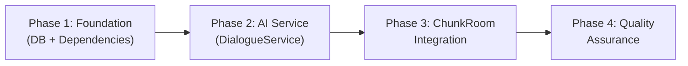
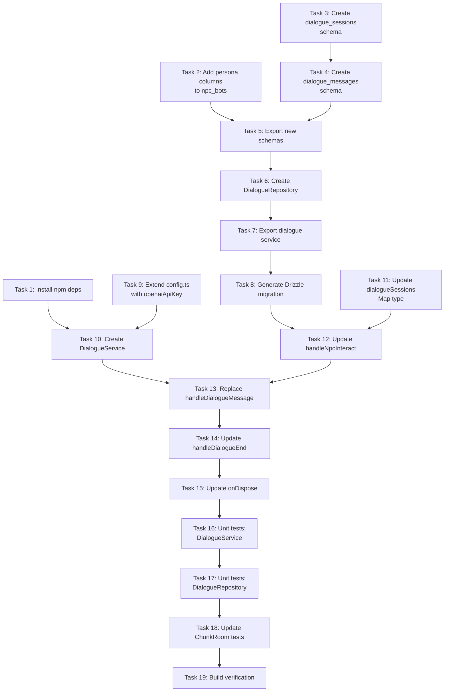

# Work Plan: AI Dialogue Integration with Persistence

Created Date: 2026-03-03
Type: feature
Estimated Duration: 2-3 days
Estimated Impact: 10 files (6 existing + 4 new)
Related Issue/PR: N/A

## Related Documents
- Design Doc: [docs/design/design-021-ai-dialogue-integration.md](../design/design-021-ai-dialogue-integration.md)
- ADR: [docs/adr/ADR-0014-ai-dialogue-openai-sdk.md](../adr/ADR-0014-ai-dialogue-openai-sdk.md)
- Predecessor: [docs/plans/plan-020-npc-dialogue-system.md](plan-020-npc-dialogue-system.md)

## Objective

Replace the pseudo-streaming echo handler from Design-020 with real AI-generated NPC responses via OpenAI GPT-4o-mini through Vercel AI SDK. Add dialogue persistence to PostgreSQL and NPC persona system. Zero client changes -- server-only implementation.

## Background

Design-020 established a dialogue system where the server echoes player messages word-by-word via setTimeout chains. This plan implements the next step: real AI responses, conversation history persistence, and NPC personality. The existing Colyseus WebSocket protocol (DIALOGUE_STREAM_CHUNK / DIALOGUE_END_TURN) remains unchanged -- the client cannot distinguish echo from AI.

## Phase Structure

## Task Dependency Diagram

## Risks and Countermeasures

### Technical Risks
- **Risk**: OpenAI API timeout/rate limit during streaming
  - **Impact**: Player sees no AI response; conversation stalls
  - **Countermeasure**: 30s timeout + graceful fallback message ("*shrugs*") via DialogueService. Fallback always yields at least one chunk. (FR-6)

- **Risk**: Fire-and-forget DB writes lose messages on crash
  - **Impact**: Gap in dialogue history; NPC "forgets" parts of conversation
  - **Countermeasure**: Acceptable for MVP. Log all DB errors. Messages are non-critical -- AI response has already been sent to client. Future: retry queue.

- **Risk**: AI SDK v5 API differences (Responses API vs Chat Completions API)
  - **Impact**: Unexpected behavior if default provider settings change
  - **Countermeasure**: Use `openai.chat('gpt-4o-mini')` explicitly for Chat Completions API. Pin `ai` and `@ai-sdk/openai` versions in package.json.

- **Risk**: Context window size -- loading too many history messages slows AI response
  - **Impact**: Increased latency and API cost
  - **Countermeasure**: Limit to 20 most recent messages. GPT-4o-mini has 128K context -- 20 messages is well within budget.

- **Risk**: esbuild bundling issues with `ai` or `@ai-sdk/openai` packages
  - **Impact**: Server build fails
  - **Countermeasure**: Mark packages as external in esbuild config if needed. These are Node.js server-side packages, compatible with ESM.

### Schedule Risks
- **Risk**: Prompt engineering iterations for NPC personality quality
  - **Impact**: AI responses feel generic or out of character
  - **Countermeasure**: Start with simple persona template. Prompt tuning is iterative and can continue after initial integration is working.

## Implementation Phases

### Phase 1: Foundation -- DB + Dependencies (Estimated commits: 2-3)
**Purpose**: Establish database schema, repository layer, and install AI SDK dependencies. This is the foundation that all subsequent phases depend on.

**Acceptance Criteria Coverage**: FR-3 (persistence), FR-5 (persona columns)

#### Tasks
- [ ] **Task 1**: Install npm dependencies (`ai`, `@ai-sdk/openai`) in `apps/server/package.json`
  - Run: `cd apps/server && pnpm add ai @ai-sdk/openai`
  - Verify: packages appear in `apps/server/package.json` dependencies
  - **Files**: `apps/server/package.json`, `pnpm-lock.yaml`

- [ ] **Task 2**: Add persona columns to `packages/db/src/schema/npc-bots.ts`
  - Add `text` to imports from `drizzle-orm/pg-core`
  - Add 3 nullable columns: `personality` (text), `role` (varchar 64), `speechStyle` (text, column name `speech_style`)
  - **AC**: FR-5 -- `npc_bots` table has nullable persona columns
  - **Files**: `packages/db/src/schema/npc-bots.ts`

- [ ] **Task 3**: Create `packages/db/src/schema/dialogue-sessions.ts`
  - Table: `dialogue_sessions` with `id` (uuid PK), `botId` (FK to npc_bots.id, cascade), `playerId` (varchar 255), `userId` (FK to users.id, set null), `startedAt` (timestamp, default now), `endedAt` (timestamp, nullable)
  - Indexes: `idx_ds_bot_player` on (botId, playerId), `idx_ds_ended_at` on (endedAt)
  - Export `DialogueSession` and `NewDialogueSession` types
  - **AC**: FR-3 -- dialogue_sessions table defined
  - **Files**: `packages/db/src/schema/dialogue-sessions.ts` (new)

- [ ] **Task 4**: Create `packages/db/src/schema/dialogue-messages.ts`
  - Table: `dialogue_messages` with `id` (uuid PK), `sessionId` (FK to dialogue_sessions.id, cascade), `role` (varchar 16), `content` (text), `createdAt` (timestamp, default now)
  - Indexes: `idx_dm_session_id` on (sessionId), `idx_dm_created_at` on (createdAt)
  - Export `DialogueMessage` and `NewDialogueMessage` types
  - **AC**: FR-3 -- dialogue_messages table defined
  - **Files**: `packages/db/src/schema/dialogue-messages.ts` (new)

- [ ] **Task 5**: Export new schemas from `packages/db/src/schema/index.ts`
  - Add barrel exports for `dialogue-sessions` and `dialogue-messages` modules
  - **Files**: `packages/db/src/schema/index.ts`

- [ ] **Task 6**: Create `packages/db/src/services/dialogue.ts` (DialogueRepository)
  - Functions following existing `fn(db: DrizzleClient, ...)` pattern:
    - `createSession(db, { botId, playerId, userId? })` -- INSERT, return session record (fail-fast)
    - `endSession(db, sessionId)` -- UPDATE endedAt to now (fail-fast)
    - `addMessage(db, { sessionId, role, content })` -- INSERT, return message record (fail-fast; caller handles fire-and-forget)
    - `getRecentHistory(db, botId, userId, limit=20)` -- SELECT messages across all sessions for bot-user pair, ORDER BY createdAt DESC, LIMIT, then reverse for chronological order
    - `getSessionMessages(db, sessionId)` -- SELECT messages for specific session, ORDER BY createdAt ASC
  - **AC**: FR-3 (all CRUD ops), FR-4 (getRecentHistory for context)
  - **Files**: `packages/db/src/services/dialogue.ts` (new)

- [ ] **Task 7**: Export dialogue service from `packages/db/src/index.ts`
  - Add re-exports for dialogue repository functions
  - **Files**: `packages/db/src/index.ts`

- [x] **Task 8**: Generate Drizzle migration
  - Run: `pnpm drizzle-kit generate`
  - Verify: migration SQL contains CREATE TABLE dialogue_sessions, CREATE TABLE dialogue_messages, ALTER TABLE npc_bots ADD COLUMN personality/role/speech_style
  - Review generated SQL for correctness
  - **Files**: `packages/db/src/migrations/0013_loving_felicia_hardy.sql` (generated)

- [ ] Quality check: `pnpm nx typecheck db` passes

#### Phase Completion Criteria
- [ ] Both new schema files exist and export types correctly
- [ ] `npc-bots.ts` has 3 new nullable persona columns
- [ ] DialogueRepository has all 5 functions with correct signatures
- [ ] All exports are wired through barrel files (schema/index.ts, index.ts)
- [ ] Drizzle migration generated and reviewed
- [ ] `pnpm nx typecheck db` passes (zero type errors)

#### Operational Verification Procedures
1. Run `pnpm nx typecheck db` -- zero errors
2. Inspect generated migration SQL -- verify CREATE TABLE and ALTER TABLE statements match Design Doc schema
3. Verify barrel exports: import { dialogueSessions, dialogueMessages, createSession, addMessage, endSession, getRecentHistory, getSessionMessages } from `@nookstead/db` compiles

---

### Phase 2: AI Service (Estimated commits: 1-2)
**Purpose**: Create the DialogueService that encapsulates all AI SDK calls, system prompt building, and fallback handling. Isolated from ChunkRoom -- testable independently.

**Acceptance Criteria Coverage**: FR-1 (AI responses), FR-2 (streaming), FR-6 (fallback + input validation)

**Dependencies**: Phase 1 (npm deps installed)

#### Tasks
- [x] **Task 9**: Extend `apps/server/src/config.ts` with `openaiApiKey`
  - Add `openaiApiKey: string` to `ServerConfig` interface
  - Add env var parsing: `process.env['OPENAI_API_KEY']` with fail-fast throw if missing
  - Include in return object
  - **AC**: OPENAI_API_KEY required -- server does not start without it
  - **Files**: `apps/server/src/config.ts`

- [x] **Task 10**: Create `apps/server/src/npc-service/ai/DialogueService.ts`
  - Class `DialogueService` with constructor accepting `{ apiKey, model?, provider? }`
  - Method `streamResponse(params: StreamResponseParams): AsyncIterable<string>`
  - System prompt builder:
    - With persona: include personality, role, speechStyle in structured template
    - Without persona: use default prompt ("You are a friendly NPC in a farming RPG")
  - AI call: `streamText({ model: openai.chat(this.model), system, messages: [...history, { role: 'user', content: playerText }], abortSignal, maxTokens: 300 })`
  - Fallback: wrap in try-catch; on error, yield single fallback message `"*shrugs*"` and log error
  - Input validation: truncate playerText to 500 chars
  - Logging: `[DialogueService]` prefix for all console.log calls
  - **AC**: FR-1 (AI responses), FR-2 (streaming via textStream), FR-6 (fallback + truncation)
  - **Files**: `apps/server/src/npc-service/ai/DialogueService.ts` (new)

- [ ] Quality check: `pnpm nx typecheck server` passes

#### Phase Completion Criteria
- [ ] `DialogueService` class created with `streamResponse()` method
- [ ] System prompt builder handles both persona and default cases
- [ ] Fallback mechanism yields single chunk on AI error
- [ ] Input truncation at 500 chars implemented
- [ ] `config.ts` validates OPENAI_API_KEY presence
- [ ] `pnpm nx typecheck server` passes

#### Operational Verification Procedures
1. Run `pnpm nx typecheck server` -- zero errors
2. Verify DialogueService can be instantiated (import check)
3. Verify config.ts throws on missing OPENAI_API_KEY (manual env check or unit test)

---

### Phase 3: ChunkRoom Integration (Estimated commits: 2-3)
**Purpose**: Wire DialogueService and DialogueRepository into ChunkRoom, replacing the echo handler with real AI streaming and DB persistence. This is the highest-risk phase -- it touches the core game loop.

**Acceptance Criteria Coverage**: FR-1 through FR-7 (all functional requirements)

**Dependencies**: Phase 1 (DB schema + repository), Phase 2 (DialogueService)

#### Tasks
- [x] **Task 11**: Update `dialogueSessions` Map type in ChunkRoom
  - Change Map value from `{ botId: string; streamTimers: NodeJS.Timeout[] }` to `{ botId: string; dbSessionId: string; abortController: AbortController | null; persona: { personality?: string | null; role?: string | null; speechStyle?: string | null } | null }`
  - Remove `streamTimers` references
  - **AC**: Data structure aligned with Design Doc section "Компонент 6"
  - **Files**: `apps/server/src/rooms/ChunkRoom.ts`

- [x] **Task 12**: Update `handleNpcInteract()` -- create DB session, cache persona
  - After successful interaction (existing BotManager.startInteraction), create DB session via `createSession(db, { botId, playerId, userId })`
  - Wrap createSession in try-catch: on failure, call `BotManager.endInteraction()` to rollback bot state and send `NPC_INTERACT_RESULT { success: false, error: 'Failed to initialize dialogue' }`
  - Cache persona from bot record: `{ personality, role, speechStyle }`
  - Store `dbSessionId`, `abortController: null`, `persona` in dialogueSessions Map
  - Logging: `[ChunkRoom] Dialogue session created: sessionId={sid}, botId={bid}, dbSessionId={dbSid}`
  - **AC**: FR-3 (session created), FR-5 (persona cached)
  - **Files**: `apps/server/src/rooms/ChunkRoom.ts`

- [x] **Task 13**: Replace `handleDialogueMessage()` with AI stream implementation
  - Full replacement of method body:
    1. Validate message text (non-empty string)
    2. Save user message to DB: `addMessage(db, { sessionId: dbSessionId, role: 'user', content: text })` -- fire-and-forget (try-catch, log error)
    3. Load conversation history: `getRecentHistory(db, botId, userId, 20)` -- try-catch, fallback to empty array
    4. Create AbortController, store in session
    5. Call `dialogueService.streamResponse({ botName, persona, playerText, conversationHistory, abortSignal })`
    6. `for await (const chunk of textStream)`: send `client.send(DIALOGUE_STREAM_CHUNK, { text: chunk })`
    7. Accumulate full text from chunks
    8. After stream ends: send `DIALOGUE_END_TURN`
    9. Save assistant message: `addMessage(db, { sessionId, role: 'assistant', content: fullText })` -- fire-and-forget
    10. Set abortController to null in session
  - **AC**: FR-1 (AI response), FR-2 (streaming chunks), FR-3 (messages saved), FR-4 (history loaded), FR-6 (input validation, DB error non-blocking)
  - **Files**: `apps/server/src/rooms/ChunkRoom.ts`

- [x] **Task 14**: Update `handleDialogueEnd()` -- abort + endSession
  - Replace `clearTimeout` cleanup with `session.abortController?.abort()`
  - Add `endSession(db, session.dbSessionId)` call (fire-and-forget, log error)
  - Keep existing `BotManager.endInteraction()` call
  - Remove session from dialogueSessions Map
  - Logging: `[ChunkRoom] Dialogue ended: sessionId={sid}, botId={bid}, reason=close`
  - **AC**: FR-7 (abort on close), FR-3 (session endedAt updated)
  - **Files**: `apps/server/src/rooms/ChunkRoom.ts`

- [x] **Task 15**: Update `onDispose()` -- abort all active streams + cleanup
  - Replace `clearTimeout` loop with `abortController?.abort()` for all active sessions
  - Call `endSession(db, dbSessionId)` for each active session (fire-and-forget)
  - Logging: `[ChunkRoom] Dialogue ended: sessionId={sid}, botId={bid}, reason=leave`
  - **AC**: FR-7 (abort on disconnect)
  - **Files**: `apps/server/src/rooms/ChunkRoom.ts`

- [ ] Quality check: `pnpm nx typecheck server` passes

#### Phase Completion Criteria
- [ ] Echo handler fully replaced with AI streaming
- [ ] All 5 integration points from Design Doc implemented:
  - [x] handleDialogueMessage() -- AI stream
  - [x] dialogueSessions type -- extended
  - [x] handleNpcInteract() -- DB session + persona
  - [x] handleDialogueEnd() -- abort + endSession
  - [x] onDispose() -- abort all + cleanup
- [ ] Fire-and-forget pattern applied to non-critical DB writes (addMessage)
- [ ] Fail-fast applied to critical operations (createSession)
- [ ] AbortController lifecycle managed correctly (create -> store -> abort -> null)
- [ ] `pnpm nx typecheck server` passes

#### Operational Verification Procedures (from Design Doc Integration Points)
1. **Integration Point 1 (DB Schema + Repository)**: Already verified in Phase 1
2. **Integration Point 2 (DialogueService + OpenAI)**: Already verified in Phase 2
3. **Integration Point 3 (ChunkRoom Full Flow)**:
   - Start server with `OPENAI_API_KEY` set
   - Open game client, interact with NPC
   - Send message -- verify AI-generated response appears (not echo)
   - Verify DIALOGUE_STREAM_CHUNK messages arrive word-by-word
   - Verify DIALOGUE_END_TURN sent after stream completes
   - Close dialogue -- verify no errors in server console
   - Check DB: dialogue_sessions has record with startedAt and endedAt
   - Check DB: dialogue_messages has user and assistant entries
4. **Integration Point 4 (Config)**: Server fails to start without OPENAI_API_KEY

---

### Phase 4: Quality Assurance (Estimated commits: 1-2)
**Purpose**: Verify all acceptance criteria through tests, build verification, and manual validation.

**Dependencies**: Phase 3 (all implementation complete)

#### Tasks
- [x] **Task 16**: Unit tests for DialogueService (mock streamText)
  - Test: `streamResponse()` with mock `streamText` yields text chunks
  - Test: `streamResponse()` on AI error yields fallback message `"*shrugs*"`
  - Test: `streamResponse()` with AbortSignal -- stream stops
  - Test: `streamResponse()` with persona -- system prompt contains personality, role, speechStyle
  - Test: `streamResponse()` without persona -- system prompt contains default prompt
  - Test: `streamResponse()` with conversation history -- messages array includes history
  - Test: `streamResponse()` truncates playerText exceeding 500 chars
  - **AC**: FR-1, FR-2, FR-5, FR-6, FR-7 verified via unit tests
  - **Files**: `apps/server/src/npc-service/ai/__tests__/DialogueService.spec.ts` (new)

- [x] **Task 17**: Unit tests for DialogueRepository (mock DB)
  - Test: `createSession()` inserts record and returns session
  - Test: `endSession()` updates endedAt
  - Test: `addMessage()` inserts record and returns message
  - Test: `getRecentHistory()` returns messages for bot-user pair sorted chronologically
  - Test: `getRecentHistory()` respects limit parameter
  - Test: `getSessionMessages()` returns messages for specific session
  - **AC**: FR-3, FR-4 verified via unit tests
  - **Files**: `packages/db/src/services/dialogue.spec.ts` (new, follows .spec.ts convention)

- [ ] **Task 18**: Update existing ChunkRoom tests for new dialogue flow
  - Update existing dialogue-related tests to work with new AI flow (mock DialogueService)
  - Add test: DIALOGUE_MESSAGE triggers AI stream, not echo
  - Add test: DB session created on NPC_INTERACT
  - Add test: Fallback message sent on AI error
  - Add test: AbortController.abort() called on DIALOGUE_END
  - Add test: Disconnect during AI stream triggers abort + cleanup
  - **AC**: FR-1 through FR-7 integration coverage
  - **Files**: `apps/server/src/rooms/__tests__/ChunkRoom.test.ts` (update)

- [ ] **Task 19**: Build verification
  - Run: `pnpm nx build server`
  - Verify: zero build errors
  - Verify: esbuild bundles `ai` and `@ai-sdk/openai` correctly (or they are marked external)
  - Run: `pnpm nx typecheck server && pnpm nx typecheck db`
  - **AC**: Build and type checking pass

#### Phase Completion Criteria
- [ ] All Design Doc acceptance criteria achieved:
  - [ ] FR-1: AI-generated responses (not echo) -- verified
  - [ ] FR-2: Streaming via DIALOGUE_STREAM_CHUNK + DIALOGUE_END_TURN -- verified
  - [ ] FR-3: Persistence (sessions + messages in DB) -- verified
  - [ ] FR-4: History context loaded into AI prompt -- verified
  - [ ] FR-5: Persona columns in npc_bots, used in system prompt -- verified
  - [ ] FR-6: Graceful fallback on AI error, input truncation, DB error non-blocking -- verified
  - [ ] FR-7: AbortController cancels AI on close/disconnect -- verified
- [ ] All unit tests pass
- [ ] Build succeeds: `pnpm nx build server`
- [ ] Type checking passes: `pnpm nx typecheck server && pnpm nx typecheck db`

#### Operational Verification Procedures
1. Run full test suite: `pnpm nx test server` -- all tests pass
2. Run build: `pnpm nx build server` -- zero errors
3. Run type checks: `pnpm nx typecheck server && pnpm nx typecheck db` -- zero errors
4. Manual E2E verification:
   - Set OPENAI_API_KEY env var
   - Start server: `pnpm nx dev server`
   - Open game client, walk to NPC, interact
   - Send message -- AI response appears with streaming effect
   - Send multiple messages -- conversation has context (NPC "remembers")
   - Close dialogue -- verify server logs show clean session end
   - Restart server -- interact with same NPC -- history persists across sessions
   - Verify fallback: temporarily use invalid API key -- NPC responds with fallback message

## Completion Criteria
- [ ] All 4 phases completed
- [ ] Each phase's operational verification procedures executed
- [ ] Design Doc acceptance criteria FR-1 through FR-7 satisfied
- [ ] All tests pass (unit + existing integration)
- [ ] Build succeeds (`pnpm nx build server`)
- [ ] Type checking passes (`pnpm nx typecheck server && pnpm nx typecheck db`)
- [ ] Zero client changes verified (no files modified in `apps/game/`)
- [ ] User review approval obtained

## File Change Summary

| File | Action | Phase | Description |
|------|--------|-------|-------------|
| `apps/server/package.json` | Modify | 1 | Add `ai`, `@ai-sdk/openai` deps |
| `packages/db/src/schema/npc-bots.ts` | Modify | 1 | Add personality, role, speechStyle columns |
| `packages/db/src/schema/dialogue-sessions.ts` | New | 1 | dialogue_sessions table schema |
| `packages/db/src/schema/dialogue-messages.ts` | New | 1 | dialogue_messages table schema |
| `packages/db/src/schema/index.ts` | Modify | 1 | Export new schemas |
| `packages/db/src/services/dialogue.ts` | New | 1 | DialogueRepository (5 functions) |
| `packages/db/src/index.ts` | Modify | 1 | Export dialogue service |
| `packages/db/drizzle/*.sql` | New | 1 | Generated Drizzle migration |
| `apps/server/src/config.ts` | Modify | 2 | Add openaiApiKey to ServerConfig |
| `apps/server/src/npc-service/ai/DialogueService.ts` | New | 2 | AI service with streamResponse() |
| `apps/server/src/rooms/ChunkRoom.ts` | Modify | 3 | Replace echo with AI, add DB persistence |
| `apps/server/src/npc-service/ai/__tests__/DialogueService.test.ts` | New | 4 | DialogueService unit tests |
| `packages/db/src/services/__tests__/dialogue.test.ts` | New | 4 | DialogueRepository unit tests |
| `apps/server/src/rooms/__tests__/ChunkRoom.test.ts` | Modify | 4 | Update dialogue tests for AI flow |

## Progress Tracking

### Phase 1: Foundation (DB + Dependencies)
- Start:
- Complete:
- Notes:

### Phase 2: AI Service
- Start:
- Complete:
- Notes:

### Phase 3: ChunkRoom Integration
- Start:
- Complete:
- Notes:

### Phase 4: Quality Assurance
- Start:
- Complete:
- Notes:

## Notes
- **Commit strategy**: Manual -- user decides when to commit. Tasks within a phase can be grouped into a single commit or split as preferred.
- **Migration**: Run `pnpm drizzle-kit generate` after schema changes (Phase 1), then `pnpm drizzle-kit migrate` to apply. All new columns are nullable -- backward compatible.
- **Testing without API key**: DialogueService tests mock `streamText()` entirely. No real API calls needed for unit tests.
- **esbuild compatibility**: If `ai` or `@ai-sdk/openai` cause bundling issues, add them to `external` in the esbuild config (`apps/server/esbuild.config.mjs` or equivalent).
- **Provider switching**: To switch from OpenAI to Anthropic Claude (per GDD), change one import in DialogueService: `openai.chat('gpt-4o-mini')` to `anthropic('claude-3-haiku')`. No other changes needed (ADR-0014).
