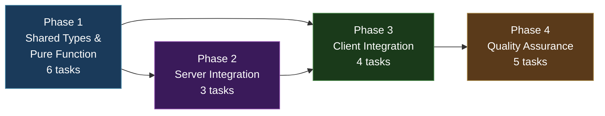
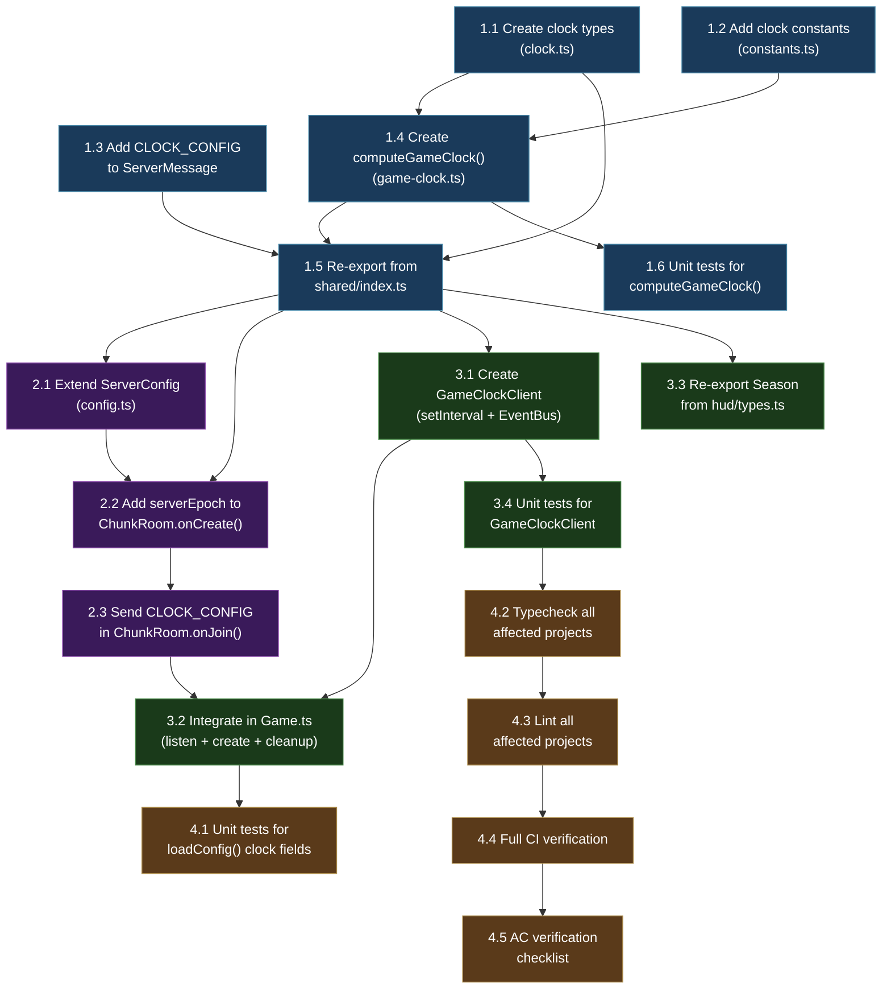

# Work Plan: Game Clock System

Created Date: 2026-03-14
Type: feature
Estimated Duration: 1 day
Estimated Impact: 10 files (3 new, 7 modified)
Related Issue/PR: N/A

## Related Documents

- Design Doc: [docs/design/design-023-game-clock-system.md](../design/design-023-game-clock-system.md)
- ADR: [docs/adr/ADR-0016-game-clock-architecture.md](../adr/ADR-0016-game-clock-architecture.md)

## Objective

Implement the game clock system so that the HUD displays real game time (day, time, season) instead of hardcoded defaults. The server sends a one-time `CLOCK_CONFIG` message on player join; the client computes game time locally from `Date.now()` and the config, emitting `hud:time` events every ~1 second. This unblocks the NPC World Context (ADR-0015) and enables time-aware gameplay.

## Background

The HUD currently displays hardcoded default values (day=1, time="08:00", season="spring") because no game clock implementation exists. `useHeaderState` already listens for `hud:time` EventBus events, but nothing emits them with real data. The NPC system (ADR-0015) requires dynamic World Context (time of day, season) for prompts but receives static strings. Without a working clock: no day/night cycle awareness, no seasonal content, no NPC schedule behavior.

The implementation follows a vertical slice (feature-driven) approach per the Design Doc: shared types and pure function first (testable in isolation), then server integration (sends config), then client integration (computes and displays).

## Phase Structure Diagram



## Task Dependency Diagram



## Risks and Countermeasures

### Technical Risks

- **Risk**: Client clock skew causes different time periods between players at boundary hours (5:00, 7:00, 17:00, 19:00)
  - **Impact**: Low -- visual-only effect, 1-5s skew at 1x speed is imperceptible
  - **Detection**: Manual comparison of two browser windows
  - **Countermeasure**: Acceptable for MVP. Kill criteria per ADR-0016: if drift > 30s at 60x, add periodic sync

- **Risk**: `setInterval(1000)` drift over long sessions causes cumulative offset
  - **Impact**: Low -- sub-second drift, EventBus emission is best-effort display update
  - **Detection**: Extended play session monitoring
  - **Countermeasure**: Acceptable. `computeGameClock()` recomputes from `Date.now()` each tick, so the displayed time is always correct -- only the update frequency drifts slightly

- **Risk**: Multiple `CLOCK_CONFIG` messages on reconnect/redirect could leak intervals
  - **Impact**: Medium -- setInterval leak causes increasing CPU usage
  - **Detection**: GameClockClient created without destroying previous instance
  - **Countermeasure**: Destroy existing `gameClock` before creating new instance (guard in Game.ts). Design Doc specifies `destroy()` guard on reconnect/redirect

- **Risk**: Barrel import from `@nookstead/shared` does not resolve `computeGameClock` at runtime
  - **Impact**: Medium -- client crash on CLOCK_CONFIG receipt
  - **Detection**: Runtime import error in browser console
  - **Countermeasure**: Verify re-export in `shared/index.ts` includes both types and functions. Use barrel imports from `@nookstead/shared` (not deep paths like `@nookstead/shared/systems/game-clock`)

### Schedule Risks

- **Risk**: Existing `ServerConfig` interface or `loadConfig()` pattern has changed since Design Doc was written
  - **Impact**: Tasks 2.1 may need adjustment
  - **Countermeasure**: Read current `config.ts` before implementing; follow existing patterns exactly

## Implementation Phases

### Phase 1: Shared Types, Constants, and Pure Function (Estimated commits: 2)

**Purpose**: Create the foundation layer in `@nookstead/shared` -- type definitions, constants, and the pure `computeGameClock()` function. This establishes the single source of truth for time computation that both server and client depend on.

**Derives from**: Design Doc Components 1 and 2, Technical Dependency 1
**ACs covered**: AC-3.1, AC-3.2, AC-5, AC-5.1, AC-5.2, AC-6, AC-6.1, AC-7, AC-7.1 (via unit tests)

#### Tasks

- [x] **Task 1.1**: Create clock types in `packages/shared/src/types/clock.ts`
  - **File(s)**: `packages/shared/src/types/clock.ts` (new)
  - **Description**: Create type definitions per Design Doc contract:
    - `TimePeriod` type: `'dawn' | 'day' | 'dusk' | 'night'`
    - `Season` type: `'spring' | 'summer' | 'autumn' | 'winter'`
    - `GameClockConfig` interface: `serverEpoch: number`, `dayDurationSeconds: number`, `seasonDurationDays: number`
    - `GameClockState` interface: `day: number`, `hour: number`, `minute: number`, `season: Season`, `timePeriod: TimePeriod`, `timeString: string`
  - **Dependencies**: None (leaf module)
  - **Completion**: Types compile without errors; all fields match Design Doc contract exactly

- [x] **Task 1.2**: Add clock constants to `packages/shared/src/constants.ts`
  - **File(s)**: `packages/shared/src/constants.ts` (modify)
  - **Description**: Append clock configuration constants per Design Doc:
    - `DEFAULT_DAY_DURATION_SECONDS = 86400`
    - `DEFAULT_SEASON_DURATION_DAYS = 7`
    - `MIN_DAY_DURATION_SECONDS = 60`
    - `MAX_DAY_DURATION_SECONDS = 604800`
    - `MIN_SEASON_DURATION_DAYS = 1`
    - `MAX_SEASON_DURATION_DAYS = 365`
    - `TIME_PERIOD_DAWN_START = 5`
    - `TIME_PERIOD_DAY_START = 7`
    - `TIME_PERIOD_DUSK_START = 17`
    - `TIME_PERIOD_NIGHT_START = 19`
    Add JSDoc comments for each constant describing its purpose and units.
  - **Dependencies**: None
  - **Completion**: Constants exported from `constants.ts`; values match Design Doc

- [x] **Task 1.3**: Add `CLOCK_CONFIG` to `ServerMessage` enum
  - **File(s)**: `packages/shared/src/types/messages.ts` (modify)
  - **Description**: Add `CLOCK_CONFIG: 'clock_config'` entry to the `ServerMessage` const object, following the existing `as const` pattern. Place after existing entries.
  - **Dependencies**: None
  - **Completion**: `ServerMessage.CLOCK_CONFIG` accessible; TypeScript compilation succeeds

- [x] **Task 1.4**: Create `computeGameClock()` pure function
  - **File(s)**: `packages/shared/src/systems/game-clock.ts` (new)
  - **Description**: Implement per Design Doc contract definition:
    - Import types from `../types/clock` and constants from `../constants`
    - Define `SEASONS` readonly array: `['spring', 'summer', 'autumn', 'winter']`
    - `computeGameClock(nowMs: number, config: GameClockConfig): GameClockState`:
      - `elapsedMs = Math.max(0, nowMs - config.serverEpoch)` (handles future epoch edge case)
      - `dayDurationMs = config.dayDurationSeconds * 1000`
      - `day = Math.floor(elapsedMs / dayDurationMs) + 1` (1-based)
      - `dayProgressMs = elapsedMs % dayDurationMs`
      - `dayFraction = dayProgressMs / dayDurationMs`
      - `totalMinutes = Math.floor(dayFraction * 1440)` (24 * 60)
      - `hour = Math.floor(totalMinutes / 60)`, `minute = totalMinutes % 60`
      - `seasonIndex = Math.floor((day - 1) / config.seasonDurationDays) % 4`
      - `timePeriod` via helper: dawn (5 <= h < 7), day (7 <= h < 17), dusk (17 <= h < 19), night (h >= 19 or h < 5)
      - `timeString` zero-padded: `"HH:MM"` format
    - Helper function `getTimePeriod(hour: number): TimePeriod` (internal, not exported)
  - **Dependencies**: Task 1.1 (types), Task 1.2 (constants)
  - **Completion**: Function compiles; pure (no side effects, deterministic output)

- [x] **Task 1.5**: Re-export clock types, function, and constants from `packages/shared/src/index.ts`
  - **File(s)**: `packages/shared/src/index.ts` (modify)
  - **Description**: Add re-exports organized in a "Game Clock" section:
    - `export type { TimePeriod, Season, GameClockConfig, GameClockState } from './types/clock';`
    - `export { computeGameClock } from './systems/game-clock';`
    - Clock constants are already exported via the existing `'./constants'` re-export (verify).
    Ensure barrel import pattern works: `import { computeGameClock, GameClockConfig } from '@nookstead/shared'`.
  - **Dependencies**: Task 1.1 (types), Task 1.3 (messages), Task 1.4 (function)
  - **Completion**: All clock exports accessible from `@nookstead/shared` barrel import

- [ ] **Task 1.6**: Unit tests for `computeGameClock()`
  - **File(s)**: `packages/shared/src/systems/game-clock.spec.ts` (new)
  - **Description**: Implement test cases from Design Doc test strategy covering all ACs. Use a fixed `serverEpoch` (e.g., `1000000`) for deterministic tests:
    - **Real-time default**: nowMs = epoch + 14h at dayDuration=86400 -> hour=14, timePeriod='day' (AC-7)
    - **Day boundary**: nowMs = epoch + 86400000ms -> day=2 (AC-3.1)
    - **Midnight wrapping**: nowMs = epoch + 23h59m -> hour=23, minute=59 (AC-4.1)
    - **Time string format**: nowMs = epoch + 5.5h -> timeString="05:30" (AC-4.1)
    - **Season spring** (day 1, seasonDays=7): season='spring' (AC-6)
    - **Season summer** (day 8, seasonDays=7): season='summer' (AC-6.1)
    - **Season autumn** (day 15, seasonDays=7): season='autumn' (AC-6.1)
    - **Season winter** (day 22, seasonDays=7): season='winter' (AC-6.1)
    - **Season cycle wrap** (day 29, seasonDays=7): season='spring' (AC-6.1)
    - **Dawn period**: hour=5 -> timePeriod='dawn' (AC-5)
    - **Dawn period end**: hour=6 -> timePeriod='dawn' (AC-5)
    - **Day period start**: hour=7 -> timePeriod='day' (AC-5)
    - **Day period**: hour=16 -> timePeriod='day' (AC-5)
    - **Dusk period**: hour=17 -> timePeriod='dusk' (AC-5)
    - **Night period start**: hour=19 -> timePeriod='night' (AC-5.2)
    - **Night period**: hour=4 -> timePeriod='night' (AC-5)
    - **Night-to-dawn transition**: hour 4->5 -> night->dawn (AC-5.1)
    - **Dusk-to-night transition**: hour 18->19 -> dusk->night (AC-5.2)
    - **Future epoch** (nowMs < serverEpoch): day=1, hour=0, minute=0 (AC-3.2)
    - **60x speed**: dayDuration=1440, 12 real min elapsed -> hour=12 (AC-7.1)
    - **Day starts at 1**: nowMs = epoch -> day=1 (AC-3.1)
  - **Dependencies**: Task 1.4
  - **Completion**: All 21+ test cases pass; `pnpm nx test shared --testFile=src/systems/game-clock.spec.ts` exits 0

#### Phase Completion Criteria

- [x] `packages/shared/src/types/clock.ts` exports `TimePeriod`, `Season`, `GameClockConfig`, `GameClockState`
- [x] `packages/shared/src/constants.ts` exports all 10 clock constants with correct values
- [x] `ServerMessage.CLOCK_CONFIG` equals `'clock_config'`
- [x] `computeGameClock()` is a pure function matching Design Doc specification
- [x] All clock types, function, and constants accessible via `@nookstead/shared` barrel import
- [ ] All 21+ unit tests for `computeGameClock()` pass

#### Operational Verification Procedures

1. Run `pnpm nx test shared --testFile=src/systems/game-clock.spec.ts` and confirm all tests pass
2. Run `pnpm nx typecheck shared` and confirm zero errors
3. Verify barrel import: inspect `packages/shared/src/index.ts` contains clock re-exports

---

### Phase 2: Server Integration (Estimated commits: 1)

**Purpose**: Extend the server to load clock configuration from environment variables and send `CLOCK_CONFIG` to clients on room join. This wires up the server half of the data flow.

**Derives from**: Design Doc Components 3 and 4, Technical Dependency 2
**ACs covered**: AC-1, AC-1.1, AC-1.2, AC-2, AC-2.1

#### Tasks

- [x] **Task 2.1**: Extend `ServerConfig` with clock fields in `apps/server/src/config.ts`
  - **File(s)**: `apps/server/src/config.ts` (modify)
  - **Description**: Following the existing `loadConfig()` pattern:
    - Add `dayDurationSeconds: number` and `seasonDurationDays: number` to `ServerConfig` interface
    - In `loadConfig()`, parse `GAME_DAY_DURATION_SECONDS` and `GAME_SEASON_DURATION_DAYS` from `process.env`
    - Apply clamping: `dayDurationSeconds` to `[MIN_DAY_DURATION_SECONDS, MAX_DAY_DURATION_SECONDS]` (60-604800)
    - Apply clamping: `seasonDurationDays` to `[MIN_SEASON_DURATION_DAYS, MAX_SEASON_DURATION_DAYS]` (1-365)
    - Default values: `DEFAULT_DAY_DURATION_SECONDS` (86400), `DEFAULT_SEASON_DURATION_DAYS` (7)
    - Import constants from `@nookstead/shared` (barrel import)
  - **Dependencies**: Task 1.5 (shared constants available)
  - **Completion**: `loadConfig()` returns clock fields with correct defaults and clamping

- [x] **Task 2.2**: Add `serverEpoch` to `ChunkRoom.onCreate()` in `apps/server/src/rooms/ChunkRoom.ts`
  - **File(s)**: `apps/server/src/rooms/ChunkRoom.ts` (modify)
  - **Description**: In `ChunkRoom` class:
    - Add private fields: `private serverEpoch!: number` and `private clockConfig!: { dayDurationSeconds: number; seasonDurationDays: number }`
    - In `onCreate()`, after existing setup: `this.serverEpoch = Date.now()` and store clock config from `loadConfig()` result
    - The `serverEpoch` is set once per room instance and shared across all player joins
  - **Dependencies**: Task 2.1 (config provides clock fields)
  - **Completion**: `serverEpoch` stored in `onCreate()`; value is a valid `Date.now()` timestamp

- [x] **Task 2.3**: Send `CLOCK_CONFIG` message in `ChunkRoom.onJoin()`
  - **File(s)**: `apps/server/src/rooms/ChunkRoom.ts` (modify, same file as 2.2)
  - **Description**: In `onJoin()`, after the existing `client.send(ServerMessage.MAP_DATA, ...)` call (~line 528):
    - Add `client.send(ServerMessage.CLOCK_CONFIG, { serverEpoch: this.serverEpoch, dayDurationSeconds: this.clockConfig.dayDurationSeconds, seasonDurationDays: this.clockConfig.seasonDurationDays })`
    - Add log: `console.log('[ChunkRoom] CLOCK_CONFIG sent: sessionId=%s, serverEpoch=%d, dayDuration=%ds, seasonDuration=%dd', client.sessionId, this.serverEpoch, ...)`
    - Import `ServerMessage` from `@nookstead/shared` (likely already imported)
  - **Dependencies**: Task 2.2 (serverEpoch and clockConfig stored)
  - **Completion**: `CLOCK_CONFIG` sent after `MAP_DATA` for every joining client; log message confirms

#### Phase Completion Criteria

- [x] `loadConfig()` returns `dayDurationSeconds` (default 86400) and `seasonDurationDays` (default 7)
- [x] Clamping works: values below minimum or above maximum are clamped to valid range
- [x] `serverEpoch` stored once in `onCreate()` -- identical value for all clients joining that room
- [x] `CLOCK_CONFIG` message sent in `onJoin()` after `MAP_DATA` with all three fields
- [x] `pnpm nx typecheck server` passes

#### Operational Verification Procedures

**Integration Point 1: Server Config**
1. Start server with no `GAME_DAY_DURATION_SECONDS` env var
2. Confirm `loadConfig()` returns `dayDurationSeconds: 86400` and `seasonDurationDays: 7`
3. Set `GAME_DAY_DURATION_SECONDS=1440` and restart
4. Confirm `loadConfig()` returns `dayDurationSeconds: 1440`

**Integration Point 2: CLOCK_CONFIG Message**
1. Start server with `pnpm nx serve server`
2. Connect a client (join a room)
3. Confirm server log: `[ChunkRoom] CLOCK_CONFIG sent: sessionId=..., serverEpoch=..., dayDuration=...s, seasonDuration=...d`

---

### Phase 3: Client Integration (Estimated commits: 2)

**Purpose**: Create the client-side `GameClockClient` class, integrate it into the Game scene, and re-export the `Season` type from `hud/types.ts` for backward compatibility. After this phase, the HUD displays real game time.

**Derives from**: Design Doc Component 5, Technical Dependency 3
**ACs covered**: AC-3, AC-4, AC-4.1, AC-4.2

#### Tasks

- [x] **Task 3.1**: Create `GameClockClient` class in `apps/game/src/game/systems/GameClockClient.ts`
  - **File(s)**: `apps/game/src/game/systems/GameClockClient.ts` (new)
  - **Description**: Implement per Design Doc contract:
    - Import `EventBus` from `'../EventBus'`
    - Import `computeGameClock` and types from `@nookstead/shared` (barrel import, not deep path)
    - Class `GameClockClient`:
      - `private config: GameClockConfig`
      - `private intervalId: ReturnType<typeof setInterval> | null = null`
      - `private currentState: GameClockState`
      - `constructor(config: GameClockConfig)`: compute initial state, emit immediately, start `setInterval(1000)`
      - `getState(): GameClockState`: return cached current state (for NPC World Context)
      - `destroy(): void`: `clearInterval` if intervalId is not null, set to null
      - `private emit(state: GameClockState): void`: `EventBus.emit('hud:time', state.day, state.timeString, state.season)`
    - Export the class
  - **Dependencies**: Task 1.5 (shared exports available)
  - **Completion**: Class compiles; no Phaser dependencies beyond EventBus

- [x] **Task 3.2**: Integrate `GameClockClient` in `apps/game/src/game/scenes/Game.ts`
  - **File(s)**: `apps/game/src/game/scenes/Game.ts` (modify)
  - **Description**: Three changes to the Game scene:
    1. **Class field**: Add `private gameClock: GameClockClient | null = null`
    2. **In `create()`**, after `playerManager.connect()`: Register CLOCK_CONFIG listener on `this.room`:
       ```
       this.room.onMessage(ServerMessage.CLOCK_CONFIG, (data: GameClockConfig) => {
         // Destroy existing clock on reconnect/redirect (guard per review condition)
         if (this.gameClock) {
           this.gameClock.destroy();
         }
         this.gameClock = new GameClockClient(data);
       });
       ```
       Log receipt: `console.log('[Game] CLOCK_CONFIG received:', data)`
    3. **In `shutdown()`**: Add cleanup before existing EventBus cleanup:
       ```
       if (this.gameClock) {
         this.gameClock.destroy();
         this.gameClock = null;
       }
       ```
    - Import `GameClockClient` from `'../systems/GameClockClient'`
    - Import `ServerMessage` and `GameClockConfig` from `@nookstead/shared` (barrel import)
  - **Dependencies**: Task 3.1 (GameClockClient exists), Task 2.3 (server sends CLOCK_CONFIG)
  - **Completion**: CLOCK_CONFIG listener registered; GameClockClient created on receipt; cleanup in shutdown; destroy() guard on reconnect

- [x] **Task 3.3**: Re-export `Season` from `apps/game/src/components/hud/types.ts`
  - **File(s)**: `apps/game/src/components/hud/types.ts` (modify)
  - **Description**: Replace the local `Season` type definition with a re-export from `@nookstead/shared`:
    - Remove: `export type Season = 'spring' | 'summer' | 'autumn' | 'winter';`
    - Add: `export type { Season } from '@nookstead/shared';`
    - `HeaderState` interface remains unchanged (still uses `Season` and `time: string`)
    - This preserves all existing imports from `hud/types.ts` (backward compatible)
  - **Dependencies**: Task 1.5 (Season exported from shared)
  - **Completion**: Existing imports from `hud/types.ts` still resolve; `Season` type comes from `@nookstead/shared`

- [x] **Task 3.4**: Unit tests for `GameClockClient`
  - **File(s)**: `apps/game/src/game/systems/GameClockClient.spec.ts` (new)
  - **Description**: Test cases from Design Doc test strategy:
    - **Initial emission**: Constructor emits `hud:time` event immediately (mock EventBus)
    - **Periodic update**: After `jest.advanceTimersByTime(1000)`, emits updated values (mock `Date.now`)
    - **getState()**: Returns current `GameClockState` matching last computation
    - **destroy()**: Clears interval; no further emissions after destroy
    - **EventBus args**: Verify `EventBus.emit` called with positional args `('hud:time', day: number, timeString: string, season: string)`
    Use `jest.useFakeTimers()` and `jest.spyOn(Date, 'now')` for deterministic behavior. Mock EventBus as `jest.fn()`.
  - **Dependencies**: Task 3.1 (GameClockClient exists)
  - **Completion**: All 5 test cases pass; `pnpm nx test game --testFile=src/game/systems/GameClockClient.spec.ts` exits 0

#### Phase Completion Criteria

- [x] `GameClockClient` class created with constructor, getState(), destroy(), and emit()
- [x] Game.ts registers CLOCK_CONFIG listener with destroy() guard on reconnect/redirect
- [x] Game.ts cleans up GameClockClient in shutdown()
- [x] `Season` re-exported from `hud/types.ts` via `@nookstead/shared`
- [x] All 5 GameClockClient unit tests pass
- [ ] HUD displays real day, time, and season after CLOCK_CONFIG receipt (L1 verification)

#### Operational Verification Procedures

**Integration Point: CLOCK_CONFIG -> GameClockClient -> EventBus -> HUD**
1. Start server: `pnpm nx serve server`
2. Start client: `pnpm nx dev game`
3. Log in and enter the game
4. Verify browser console: `[Game] CLOCK_CONFIG received: { serverEpoch: ..., dayDurationSeconds: ..., seasonDurationDays: ... }`
5. Verify HUD displays real time (not "08:00") and day number (not always 1)
6. Wait 10+ seconds and verify HUD time updates incrementally
7. With `GAME_DAY_DURATION_SECONDS=1440` (60x speed), verify time advances ~1 game minute per real second

**Reconnect Guard Verification**
1. While in-game, trigger a room reconnect (e.g., simulate network drop)
2. Verify no console errors; new GameClockClient replaces old; HUD continues updating

---

### Phase 4: Quality Assurance (Estimated commits: 1)

**Purpose**: Verify all acceptance criteria, run full CI pipeline, and confirm no regressions in existing projects.

**ACs verified**: All Design Doc acceptance criteria (AC-1 through AC-7.1)

#### Tasks

- [x] **Task 4.1**: Unit tests for `loadConfig()` clock fields
  - **File(s)**: `apps/server/src/config.spec.ts` (modify existing test file)
  - **Description**: Add test cases for the new clock config fields:
    - **Default values**: No env vars set -> `dayDurationSeconds: 86400`, `seasonDurationDays: 7`
    - **Custom values**: `GAME_DAY_DURATION_SECONDS=1440` -> `dayDurationSeconds: 1440`
    - **Clamping low dayDuration**: `GAME_DAY_DURATION_SECONDS=0` -> clamped to 60 (AC-1.1)
    - **Clamping high dayDuration**: `GAME_DAY_DURATION_SECONDS=999999` -> clamped to 604800 (AC-1.1)
    - **Clamping low seasonDuration**: `GAME_SEASON_DURATION_DAYS=0` -> clamped to 1 (AC-1.2)
    - **Clamping high seasonDuration**: `GAME_SEASON_DURATION_DAYS=999` -> clamped to 365 (AC-1.2)
    - **Non-numeric value**: `GAME_DAY_DURATION_SECONDS=abc` -> falls back to default (86400)
  - **Dependencies**: Task 2.1 (config implementation complete)
  - **Completion**: All 7 test cases pass; `pnpm nx test server --testFile=src/config.spec.ts` exits 0

- [ ] **Task 4.2**: Verify typecheck passes for all affected projects
  - **File(s)**: No new files; fix any type errors
  - **Description**: Run TypeScript type checking on all affected projects:
    - `pnpm nx typecheck shared`
    - `pnpm nx typecheck server`
    - `pnpm nx typecheck game`
    Fix any type errors found.
  - **Dependencies**: All Phase 1-3 tasks complete
  - **Completion**: All three typecheck commands exit 0

- [ ] **Task 4.3**: Verify lint passes for all affected projects
  - **File(s)**: No new files; fix any lint errors
  - **Description**: Run ESLint on all affected projects:
    - `pnpm nx lint shared`
    - `pnpm nx lint server`
    - `pnpm nx lint game`
    Fix any lint errors or warnings.
  - **Dependencies**: Task 4.2
  - **Completion**: All three lint commands exit 0

- [ ] **Task 4.4**: Full CI verification
  - **File(s)**: No new files; fix any regressions
  - **Description**: Run the full CI command: `pnpm nx run-many -t lint test build typecheck`. Verify that adding clock system code does not break any existing targets. All targets must pass with zero errors.
  - **Dependencies**: Task 4.3
  - **Completion**: `pnpm nx run-many -t lint test build typecheck` exits 0 for all projects

- [ ] **Task 4.5**: Acceptance criteria verification checklist
  - **File(s)**: No new files; verification only
  - **Description**: Walk through all Design Doc acceptance criteria and verify each one:

    | AC | Verification Method | Status |
    |---|---|---|
    | AC-1: loadConfig() loads clock env vars with defaults | Unit test: default values (86400, 7) | [ ] |
    | AC-1.1: dayDurationSeconds clamped to [60, 604800] | Unit test: clamping at both ends | [ ] |
    | AC-1.2: seasonDurationDays clamped to [1, 365] | Unit test: clamping at both ends | [ ] |
    | AC-2: CLOCK_CONFIG sent on onJoin after MAP_DATA | Server log on client join | [ ] |
    | AC-2.1: serverEpoch set once in onCreate | Code review: serverEpoch = Date.now() in onCreate | [ ] |
    | AC-3: GameClockClient created on CLOCK_CONFIG receipt | Console log "[Game] CLOCK_CONFIG received" | [ ] |
    | AC-3.1: computeGameClock returns all fields, day starts at 1 | Unit test: 21+ test cases | [ ] |
    | AC-3.2: Future epoch handled (elapsed = 0) | Unit test: nowMs < serverEpoch | [ ] |
    | AC-4: EventBus emits hud:time every ~1 second | GameClockClient unit test + manual HUD verification | [ ] |
    | AC-4.1: timeString in "HH:MM" format, zero-padded | Unit test: "05:30", "14:00" | [ ] |
    | AC-4.2: Defaults shown if CLOCK_CONFIG not received | Existing behavior -- no change to useHeaderState | [ ] |
    | AC-5: Time periods correct for all hour ranges | Unit tests: all boundary hours | [ ] |
    | AC-5.1: Night-to-dawn at hour 5 | Unit test: hour 4->5 transition | [ ] |
    | AC-5.2: Dusk-to-night at hour 19 | Unit test: hour 18->19 transition | [ ] |
    | AC-6: Season from day number | Unit test: seasonIndex formula | [ ] |
    | AC-6.1: Season cycle: days 1-7 spring, 8-14 summer, etc. | Unit tests: all 4 seasons + wrap | [ ] |
    | AC-7: Default config (86400s) = UTC time | Unit test: 14h elapsed = hour 14 | [ ] |
    | AC-7.1: 60x speed (1440s) = 24 real min per day | Unit test: 12 real min = hour 12 | [ ] |

  - **Dependencies**: Task 4.4
  - **Completion**: All 18 AC items verified and checked

#### Phase Completion Criteria

- [ ] All unit tests pass: `computeGameClock()` (21+ tests), `GameClockClient` (5 tests), `loadConfig()` clock fields (7 tests)
- [ ] TypeScript typecheck passes for shared, server, and game
- [ ] ESLint passes for shared, server, and game
- [ ] Full CI pipeline passes with zero errors
- [ ] All 18 acceptance criteria verified
- [ ] No regressions in existing projects

#### Operational Verification Procedures

**Full CI Verification**
1. Run `pnpm nx run-many -t lint test build typecheck` and confirm all targets pass
2. Run `pnpm nx test shared` -- confirm `game-clock.spec.ts` all pass
3. Run `pnpm nx test game` -- confirm `GameClockClient.spec.ts` all pass
4. Run `pnpm nx test server` -- confirm `config.spec.ts` clock tests all pass

---

## Completion Criteria

- [ ] All 4 phases completed
- [ ] Each phase's operational verification procedures executed
- [ ] Design Doc acceptance criteria satisfied (AC-1 through AC-7.1 -- 18 items)
- [ ] All unit tests pass (33+ total: 21 computeGameClock + 5 GameClockClient + 7 loadConfig)
- [ ] All quality checks pass (lint, typecheck, build -- zero errors)
- [ ] No regressions in existing projects (game, game-e2e, server, shared)
- [ ] HUD displays real day, time (HH:MM), and season in-game (L1 verification)
- [ ] Barrel imports from `@nookstead/shared` used throughout (not deep paths)
- [ ] `destroy()` guard on reconnect/redirect prevents interval leaks

## File Summary

### New Files (3)

| File | Phase | Description |
|------|-------|-------------|
| `packages/shared/src/types/clock.ts` | 1 | TimePeriod, Season, GameClockConfig, GameClockState types |
| `packages/shared/src/systems/game-clock.ts` | 1 | `computeGameClock()` pure function |
| `apps/game/src/game/systems/GameClockClient.ts` | 3 | Client clock wrapper with setInterval + EventBus |

### Modified Files (7)

| File | Phase | Description |
|------|-------|-------------|
| `packages/shared/src/types/messages.ts` | 1 | Add `CLOCK_CONFIG: 'clock_config'` to ServerMessage |
| `packages/shared/src/constants.ts` | 1 | Add 10 clock constants (defaults, boundaries) |
| `packages/shared/src/index.ts` | 1 | Re-export clock types, function, constants |
| `apps/server/src/config.ts` | 2 | Add `dayDurationSeconds`, `seasonDurationDays` to ServerConfig |
| `apps/server/src/rooms/ChunkRoom.ts` | 2 | Add `serverEpoch` in onCreate, send CLOCK_CONFIG in onJoin |
| `apps/game/src/game/scenes/Game.ts` | 3 | CLOCK_CONFIG listener, GameClockClient field, shutdown cleanup |
| `apps/game/src/components/hud/types.ts` | 3 | Re-export Season from `@nookstead/shared` |

### Test Files (3, new)

| File | Phase | Tests |
|------|-------|-------|
| `packages/shared/src/systems/game-clock.spec.ts` | 1 | 21+ tests for computeGameClock() |
| `apps/game/src/game/systems/GameClockClient.spec.ts` | 3 | 5 tests for GameClockClient |
| `apps/server/src/config.spec.ts` | 4 | 7 tests added (file may already exist) |

## Progress Tracking

### Phase 1: Shared Types and Pure Function
- Start: 2026-03-14
- Complete: In progress (tasks 1.1-1.5 done, 1.6 unit tests written and passing)
- Notes: All 21 unit tests for computeGameClock() pass. Typecheck passes.

### Phase 2: Server Integration
- Start: 2026-03-14
- Complete: 2026-03-14
- Notes: Task 2.1 done -- ServerConfig extended with dayDurationSeconds and seasonDurationDays, clamping to valid ranges using shared constants. Tasks 2.2+2.3 done -- serverEpoch and clockConfig fields added to ChunkRoom, CLOCK_CONFIG sent in onJoin() after MAP_DATA. Typecheck passes.

### Phase 3: Client Integration
- Start: 2026-03-14
- Complete: 2026-03-14
- Notes: GameClockClient class created with all 5 unit tests passing. Season re-exported from hud/types.ts. Game.ts integration (task 3.2) done -- CLOCK_CONFIG listener wired, destroy() guard on reconnect, shutdown cleanup. Typecheck passes.

### Phase 4: Quality Assurance
- Start: 2026-03-14
- Complete:
- Notes: Task 4.1 done -- 8 new clock config tests added to config.spec.ts (defaults, custom values, clamping, NaN fallback). Also fixed pre-existing toEqual assertion in complete configuration test to include new clock fields. All 164 server tests pass.

## Notes

- **Barrel imports only**: All imports from `@nookstead/shared` must use the barrel import (e.g., `import { computeGameClock } from '@nookstead/shared'`), not deep paths (e.g., NOT `@nookstead/shared/systems/game-clock`). This follows the project's module boundary enforcement via `@nx/enforce-module-boundaries`.
- **destroy() guard**: The Game.ts CLOCK_CONFIG handler must destroy any existing `GameClockClient` before creating a new one. This prevents interval leaks on reconnect/redirect scenarios.
- **No visual tinting**: This plan does not include Phaser camera tinting for day/night cycle. That is a separate task per Design Doc non-scope.
- **No useHeaderState changes**: The existing `useHeaderState` hook already listens for `hud:time` events with the correct signature `(day, time, season)`. No changes needed -- once `GameClockClient` emits, the HUD displays real data.
- **No landing page changes**: The `useDayCycle` hook is an independent cosmetic system for the landing page. It is unrelated to the game clock.
- **Ephemeral time**: Game time resets to day=1 on server restart. This is by design (ADR-0016 Decision 3). No DB persistence.
- **Parallel task potential**: Tasks 1.1, 1.2, and 1.3 have no dependencies on each other and can be implemented in parallel. Tasks 3.1 and 3.3 can also run in parallel.
