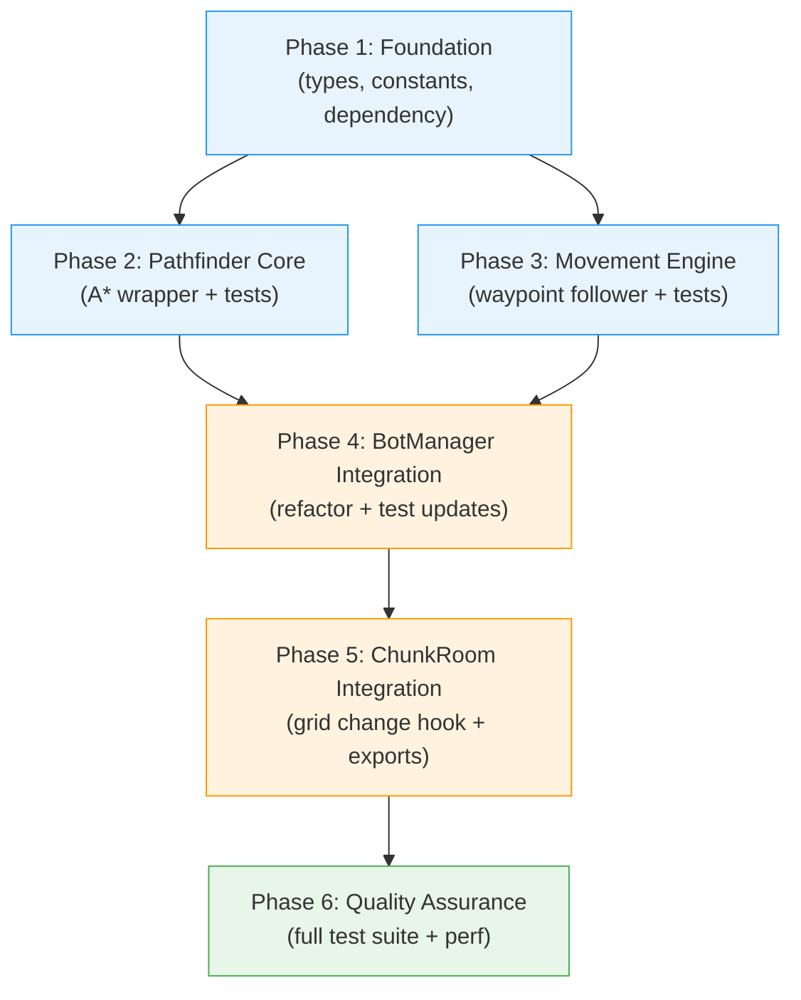
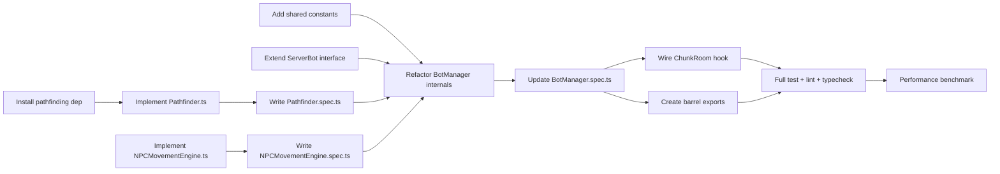

# Work Plan: NPC A* Pathfinding Navigation

Created Date: 2026-03-14
Type: feature
Estimated Duration: 2 days
Estimated Impact: 12 files (5 new, 7 modified)
Related Issue/PR: N/A

## Related Documents
- Design Doc: [docs/design/design-023-npc-astar-navigation.md](../design/design-023-npc-astar-navigation.md)
- ADR: [docs/adr/ADR-0013-npc-bot-entity-architecture.md](../adr/ADR-0013-npc-bot-entity-architecture.md) (Decision #5: Wandering Algorithm)
- ADR: [docs/adr/ADR-0006-chunk-based-room-architecture.md](../adr/ADR-0006-chunk-based-room-architecture.md)

## Objective

Replace NPC straight-line movement with A* pathfinding so bots navigate around obstacles naturally. NPCs will compute waypoint paths on the existing `boolean[][]` walkability grid using the `pathfinding` npm library, follow waypoints one by one, and recalculate when the grid changes dynamically.

## Background

NPCs currently move in straight lines toward randomly selected walkable tiles. When obstacles exist between an NPC and its target, the bot walks into the obstacle, detects a non-walkable tile, and picks a new random target. This produces unnatural "bump into walls" movement patterns. The Bresenham line-of-sight check partially mitigates this but cannot handle L-shaped obstacles, buildings, or fenced areas. ADR-0013 Decision #5 explicitly planned this A* upgrade for M0.3.

## Risks and Countermeasures

### Technical Risks

- **Risk**: `pathfinding` library grid clone is slow on large maps
  - **Impact**: Medium -- per-tick performance budget exceeded
  - **Countermeasure**: Benchmark on 64x64 grid in Phase 6 (target <0.3ms per clone). Library uses optimized internal structures. If slow, implement manual clone.

- **Risk**: A* paths look "robotic" (grid-aligned, right-angle turns only)
  - **Impact**: Low -- visual quality concern
  - **Countermeasure**: Acceptable for pixel art 2D game. Path smoothing can be added in a future iteration.

- **Risk**: Many simultaneous path recalculations on grid change
  - **Impact**: Medium -- 10 bots recalculating could cause 10ms spike
  - **Countermeasure**: Max 10 bots per map; each findPath <1ms. Acceptable worst case.

- **Risk**: `pathfinding` library is unmaintained (last publish 10+ years ago)
  - **Impact**: Low -- no updates expected
  - **Countermeasure**: Library is stable and feature-complete (API frozen). Can fork if critical bug found.

### Schedule Risks

- **Risk**: Unfamiliarity with `pathfinding` npm library API
  - **Impact**: Low -- possible minor delays in Phase 2
  - **Countermeasure**: Library has well-documented API and visual demo. Phase 2 is isolated and testable independently.

## Implementation Strategy

**Selected Approach**: Vertical Slice (Feature-driven)

**Rationale**: The feature is self-contained within the server NPC movement system. Each phase delivers testable functionality: Phase 1 establishes foundation types and constants, Phase 2 delivers the pathfinding primitive, Phase 3 delivers waypoint movement, Phase 4 integrates into BotManager, Phase 5 wires ChunkRoom, and Phase 6 validates quality and performance. The existing test infrastructure (Jest, test helpers) is already in place.

**Migration Strategy**: Direct replacement with no parallel operation period. BotManager's public API remains unchanged, so rollback is a single-file revert of `BotManager.ts`.

## Phase Structure Diagram

## Task Dependency Diagram

## Implementation Phases

### Phase 1: Foundation (Estimated commits: 1)

**Purpose**: Establish the dependency, shared constants, and type extensions needed by all subsequent phases. No logic changes -- pure scaffolding.

**AC Coverage**: Partial FR-2 (constants), partial FR-4 (constants)

#### Tasks

- [x] **T1.1**: Install `pathfinding` npm package in `apps/server/package.json`
  - Run `pnpm add pathfinding` in `apps/server`
  - Verify `@types/pathfinding` exists or add inline type declarations
- [x] **T1.2**: Add pathfinding constants to `packages/shared/src/constants.ts`
  - `BOT_ROUTE_CACHE_TTL_MS = 30_000`
  - `BOT_MAX_PATH_LENGTH = 100`
  - `BOT_WAYPOINT_THRESHOLD = 2`
  - `BOT_MAX_PATHFIND_FAILURES = 3`
  - `BOT_EXTENDED_IDLE_TICKS = 100`
- [x] **T1.3**: Export new constants from `packages/shared/src/index.ts`
- [x] **T1.4**: Extend `ServerBot` interface in `apps/server/src/npc-service/types/bot-types.ts`
  - Add fields: `waypoints`, `currentWaypointIndex`, `routeComputedAt`, `failedWanderAttempts`
  - Update `createServerBot()` factory with default values (empty array, 0, 0, 0)
- [x] **T1.5**: Quality check -- typecheck passes: `pnpm nx typecheck server`

#### Phase Completion Criteria

- [x] `pathfinding` listed in `apps/server/package.json` dependencies
- [x] All 5 new constants exported from `@nookstead/shared`
- [x] `ServerBot` interface has 4 new fields with correct types
- [x] `createServerBot()` initializes new fields with safe defaults
- [x] Typecheck passes with zero errors

#### Operational Verification Procedures

1. Run `pnpm nx typecheck server` -- must pass with zero errors
2. Verify `import { BOT_MAX_PATH_LENGTH } from '@nookstead/shared'` resolves in server code
3. Verify `createServerBot()` output includes new fields with defaults

---

### Phase 2: Pathfinder Core (Estimated commits: 1)

**Purpose**: Implement the A* pathfinding wrapper module with full unit test coverage. This module is the foundation for all path computation. It has zero dependency on existing NPC code.

**AC Coverage**: AC FR-1 (A* path computation), AC FR-5 (grid update methods)

#### Tasks

- [x] **T2.1**: Create `apps/server/src/npc-service/movement/Pathfinder.ts`
  - `Point` interface export (x, y)
  - `Pathfinder` class: constructor takes `boolean[][]`, creates internal `PF.Grid`
  - `findPath(startX, startY, endX, endY)` -- clones grid per call, uses `AStarFinder` with `DiagonalMovement.Never`, converts `number[][]` result to `Point[]`, truncates to `BOT_MAX_PATH_LENGTH`
  - `updateGrid(walkable)` -- replaces internal grid
  - `setWalkableAt(x, y, walkable)` -- updates single tile on internal grid
  - Returns empty array on any error (never throws)
  - Added manual `isWalkableAt` guards (library ignores start/end walkability)
- [x] **T2.2**: Create `apps/server/src/npc-service/movement/Pathfinder.spec.ts`
  - Test: finds path on open 4x4 grid (AC FR-1)
  - Test: navigates around vertical wall (AC FR-1)
  - Test: returns empty for unreachable target (AC FR-4)
  - Test: returns empty for non-walkable start (AC FR-1)
  - Test: returns empty for non-walkable end (AC FR-1)
  - Test: 4-directional only -- consecutive waypoints differ by 1 in x or y (AC FR-2)
  - Test: respects `BOT_MAX_PATH_LENGTH` truncation (AC FR-1)
  - Test: `setWalkableAt` updates grid -- path avoids newly blocked tile (AC FR-5)
  - Test: `updateGrid` replaces entire grid -- new paths reflect changes (AC FR-5)
  - Bonus: returns empty array when start equals end
- [x] **T2.3**: Quality check -- all Pathfinder tests GREEN: `pnpm nx test server --testPathPatterns=Pathfinder` (10/10 pass)

#### Phase Completion Criteria

- [x] `Pathfinder` class implements all 3 public methods per Design Doc contract
- [x] `findPath()` returns 4-directional-only paths (no diagonals)
- [x] `findPath()` returns empty array when no path exists (never throws)
- [x] Path length capped at `BOT_MAX_PATH_LENGTH` (100)
- [x] 10 unit tests pass (10/10 GREEN, 9 specified + 1 bonus)
- [x] `Point` type exported for use by NPCMovementEngine

#### Operational Verification Procedures

1. Run `pnpm nx test server --testPathPattern=Pathfinder` -- all 9 tests pass
2. Manual verification: create a 5x5 grid with wall at column 2, verify `findPath(0,0, 4,0)` returns path going around the wall
3. Verify `findPath` with same start and end returns empty array (zero-length path edge case)

---

### Phase 3: Movement Engine (Estimated commits: 1)

**Purpose**: Implement the per-bot waypoint-following engine with full unit test coverage. Pure calculation module -- no state machine logic, no Colyseus dependency.

**AC Coverage**: AC FR-2 (waypoint following), AC FR-3 (path completion), partial AC FR-5 (blocked waypoint detection)

#### Tasks

- [x] **T3.1**: Create `apps/server/src/npc-service/movement/NPCMovementEngine.ts`
  - `MovementResult` interface export
  - `NPCMovementEngine` class:
    - `setPath(waypoints: Point[])` -- stores waypoints, resets index to 0
    - `tick(currentWorldX, currentWorldY, deltaMs, speed, tileSize)` -- moves toward current waypoint at `speed` px/sec, returns `MovementResult`
    - `hasPath()` -- returns true if waypoints set and not complete
    - `isComplete()` -- returns true if all waypoints reached
    - `clearPath()` -- resets all internal state
    - `getRemainingWaypoints()` -- returns waypoints from current index onward
    - `isWaypointBlocked(blockedX, blockedY)` -- checks if any remaining waypoint matches
  - Direction computed from movement delta (up/down/left/right)
  - Waypoint reached when within `BOT_WAYPOINT_THRESHOLD` pixels
  - Returns `{ moved: false }` when no path set (never throws)
- [x] **T3.2**: Create `apps/server/src/npc-service/movement/NPCMovementEngine.spec.ts`
  - Test: moves toward first waypoint at correct speed (AC FR-2)
  - Test: advances to next waypoint when within threshold (AC FR-2)
  - Test: signals `reachedDestination: true` at final waypoint (AC FR-3)
  - Test: computes correct direction for each axis (right, left, up, down) (AC FR-2)
  - Test: returns `moved: false` with no path set (AC FR-2)
  - Test: `clearPath` resets state, `hasPath()` returns false (AC FR-3)
  - Test: `isWaypointBlocked` detects blocked tile in remaining path (AC FR-5)
- [x] **T3.3**: Quality check -- all NPCMovementEngine tests GREEN: `pnpm nx test server --testPathPattern=NPCMovementEngine`

#### Phase Completion Criteria

- [x] `NPCMovementEngine` class implements all 7 public methods per Design Doc contract
- [x] Movement uses pixel-based position with tile-coordinate waypoints
- [x] Direction computed correctly for all 4 cardinal directions
- [x] `BOT_WAYPOINT_THRESHOLD` (2px) used for waypoint reached detection
- [x] 12 unit tests pass (12/12 GREEN, 7 specified + 5 additional: 2 extra direction tests, overshoot clamp, getRemainingWaypoints subset)
- [x] `MovementResult` type exported for use by BotManager

#### Operational Verification Procedures

1. Run `pnpm nx test server --testPathPattern=NPCMovementEngine` -- all 7 tests pass
2. Verify: set 3-waypoint path, tick with large deltaMs, confirm bot reaches each waypoint in sequence
3. Verify: `isWaypointBlocked(x, y)` only checks remaining (not already-passed) waypoints

---

### Phase 4: BotManager Integration (Estimated commits: 1-2)

**Purpose**: Refactor BotManager internals to use Pathfinder + NPCMovementEngine for all NPC movement. Replace straight-line logic with waypoint following. Remove `hasLineOfSight()`. Add failure handling and stuck-teleport behavior. Update all BotManager tests.

**AC Coverage**: AC FR-1 through FR-7 (full feature integration)

#### Tasks

- [x] **T4.1**: Refactor `BotManager.init()` in `apps/server/src/npc-service/lifecycle/BotManager.ts`
  - Create `Pathfinder` instance from `config.mapWalkable`
  - Create per-bot `NPCMovementEngine` instances (stored in a Map keyed by bot id)
- [x] **T4.2**: Replace `tickWalking()` with `tickWalkingWaypoint()`
  - Delegate movement to `NPCMovementEngine.tick()`
  - Handle `MovementResult`: update bot position, direction
  - On `reachedWaypoint`: advance `currentWaypointIndex`
  - On `reachedDestination`: call `transitionToIdle(bot)`
  - Stuck detection: if bot hasn't moved >1 tile in `BOT_STUCK_TIMEOUT_MS`, teleport to nearest walkable tile via `findAnyWalkableTile()` (AC FR-6)
- [x] **T4.3**: Modify `startWander()`
  - Remove `hasLineOfSight()` call
  - After `pickRandomWalkableTile()`, call `pathfinder.findPath()`
  - If path found: set `bot.waypoints`, `bot.currentWaypointIndex = 0`, `bot.state = 'walking'`, reset `failedWanderAttempts` to 0
  - If no path: increment `failedWanderAttempts`; if >= `BOT_MAX_PATHFIND_FAILURES`, set extended idle (AC FR-4)
- [x] **T4.4**: Remove `hasLineOfSight()` method entirely (Bresenham LOS no longer needed)
- [x] **T4.5**: Extend `transitionToIdle()` to clear waypoint data
  - Reset `bot.waypoints = []`, `bot.currentWaypointIndex = 0`
  - Clear NPCMovementEngine path via `engine.clearPath()`
- [x] **T4.6**: Add `onWalkabilityChanged(x, y, walkable)` public method
  - Call `pathfinder.setWalkableAt(x, y, walkable)`
  - If tile became non-walkable: iterate walking bots, check `engine.isWaypointBlocked(x, y)`
  - For affected bots: recompute path from current position to original target
  - If new path found: replace waypoints; if no path: `transitionToIdle(bot)` (AC FR-5)
- [x] **T4.7**: Add logging per Design Doc (path computed, no path found, stuck/teleport, extended idle, path recalculated, path invalidated)
- [x] **T4.8**: Update `apps/server/src/npc-service/lifecycle/BotManager.spec.ts`
  - Update: bot navigates around obstacle via A* (AC FR-1)
  - Update: bot reaches target via waypoints and transitions to IDLE (AC FR-2, FR-3)
  - New: no-path increments `failedWanderAttempts` (AC FR-4)
  - New: extended idle after 3 consecutive failures (AC FR-4)
  - Update: stuck bot teleports to nearest walkable tile (AC FR-6)
  - New: `onWalkabilityChanged` triggers path recalculation (AC FR-5)
  - New: grid change with no alternative path transitions to IDLE (AC FR-5)
  - Verify: interacting bot skips movement (no regression)
  - Verify: dialogue system unaffected (no regression)
  - Remove: `hasLineOfSight` tests (method deleted)
- [x] **T4.9**: Quality check -- all BotManager tests GREEN: `pnpm nx test server --testPathPatterns=BotManager`

#### Phase Completion Criteria

- [x] BotManager public API unchanged: `init()`, `tick()`, `getBotPositions()` signatures identical
- [x] `tickWalkingWaypoint()` replaces `tickWalking()` for all movement logic
- [x] `hasLineOfSight()` removed (no dead code)
- [x] `startWander()` uses Pathfinder instead of Bresenham LOS
- [x] `onWalkabilityChanged()` added as new public method
- [x] Failure handling: 3 consecutive failures triggers extended idle (100 ticks)
- [x] Stuck detection: teleports bot to nearest walkable tile after 5s
- [x] All BotManager tests pass (existing updated + new tests GREEN)
- [x] Zero Colyseus imports in Pathfinder and NPCMovementEngine (decoupling maintained)

#### Operational Verification Procedures

1. Run `pnpm nx test server --testPathPattern=BotManager` -- all tests pass
2. Verify: create a grid with L-shaped obstacle, init BotManager with 1 bot, tick until bot wanders -- bot path goes around obstacle (not through it)
3. Verify: call `onWalkabilityChanged()` to block a waypoint tile -- bot gets new path or transitions to IDLE
4. Verify: `BotManager.tick()` still returns `BotUpdate[]` with correct shape

---

### Phase 5: ChunkRoom Integration and Exports (Estimated commits: 1)

**Purpose**: Wire the `onWalkabilityChanged` hook in ChunkRoom and create barrel exports for the new movement module. This completes the feature integration.

**AC Coverage**: AC FR-5 (dynamic grid change propagation from ChunkRoom)

#### Tasks

- [x] **T5.1**: Create `apps/server/src/npc-service/movement/index.ts`
  - Export `Pathfinder`, `Point` from `./Pathfinder`
  - Export `NPCMovementEngine`, `MovementResult` from `./NPCMovementEngine`
- [x] **T5.2**: Wire `onWalkabilityChanged` in `apps/server/src/rooms/ChunkRoom.ts`
  - When walkability grid changes (future: object placement/removal), call `this.botManager.onWalkabilityChanged(x, y, walkable)`
  - Non-critical operation: wrap in try/catch, log warning on error
- [x] **T5.3**: Quality check -- typecheck and lint pass: `pnpm nx typecheck server && pnpm nx lint server`

#### Phase Completion Criteria

- [x] Barrel exports expose `Pathfinder`, `Point`, `NPCMovementEngine`, `MovementResult`
- [x] ChunkRoom has `onWalkabilityChanged` wiring (even if trigger point is future object placement)
- [x] Typecheck passes
- [x] Lint passes

#### Operational Verification Procedures

1. Run `pnpm nx typecheck server` -- zero errors
2. Run `pnpm nx lint server` -- zero errors
3. Verify: `import { Pathfinder, NPCMovementEngine } from '../movement'` resolves in BotManager

---

### Phase 6: Quality Assurance (Estimated commits: 1)

**Purpose**: Full quality validation, performance benchmarking, build verification, and Design Doc acceptance criteria sign-off.

**AC Coverage**: All acceptance criteria verified end-to-end

#### Tasks

- [ ] **T6.1**: Run full test suite: `pnpm nx test server`
  - All Pathfinder tests pass (9/9)
  - All NPCMovementEngine tests pass (7/7)
  - All BotManager tests pass (existing + new)
  - All other server tests pass (no regression)
- [ ] **T6.2**: Run typecheck: `pnpm nx typecheck server`
- [ ] **T6.3**: Run lint: `pnpm nx lint server`
- [ ] **T6.4**: Run build: `pnpm nx build server`
- [ ] **T6.5**: Performance benchmark
  - Run `BotManager.bench.ts`: verify 5 bots on 64x64 grid, 1000 ticks
  - Target: avg tick <1ms, p99 <2ms
  - Measure `findPath()` latency on 64x64 grid with 0%, 25%, 50% obstacle density
  - Target: single `findPath()` <1ms
- [ ] **T6.6**: Verify acceptance criteria checklist
  - [ ] AC FR-1: A* path computation with 4-directional movement
  - [ ] AC FR-2: Waypoint following at BOT_SPEED with direction tracking
  - [ ] AC FR-3: Path completion transitions bot to IDLE
  - [ ] AC FR-4: Path failure handling with backoff (3 failures -> extended idle)
  - [ ] AC FR-5: Dynamic grid update triggers path recalculation
  - [ ] AC FR-6: Stuck bot teleport to nearest walkable tile after 5s
  - [ ] AC FR-7: Players are not obstacles (bypass without stopping)
- [ ] **T6.7**: Verify no dead code remains
  - `hasLineOfSight()` removed from BotManager
  - No unused imports related to Bresenham LOS
  - No commented-out code
- [ ] **T6.8**: Verify Design Doc constraints
  - [ ] 4-directional movement only (`DiagonalMovement.Never`)
  - [ ] BotManager public API unchanged (`tick()` returns `BotUpdate[]`)
  - [ ] Pathfinder and NPCMovementEngine have zero Colyseus imports
  - [ ] NPC-NPC collision avoidance NOT implemented (deferred)

#### Phase Completion Criteria

- [ ] All tests pass (zero failures)
- [ ] Zero lint errors
- [ ] Zero typecheck errors
- [ ] Build succeeds
- [ ] Performance benchmarks meet targets (avg <1ms, p99 <2ms)
- [ ] All 7 acceptance criteria verified
- [ ] No dead code (hasLineOfSight removed)
- [ ] All Design Doc constraints satisfied

#### Operational Verification Procedures

1. Run `pnpm nx run-many -t test typecheck lint build -p server` -- all pass
2. Run `BotManager.bench.ts` -- performance within budget
3. Review git diff to confirm `hasLineOfSight()` fully removed
4. Verify no `DiagonalMovement.Always` or similar in any file

---

## Testing Strategy

### Test Classification

| Category | Count | Phase | Approach |
|----------|-------|-------|----------|
| Pathfinder unit tests | 9 | Phase 2 | Implementation-first (write alongside code) |
| NPCMovementEngine unit tests | 7 | Phase 3 | Implementation-first (write alongside code) |
| BotManager unit tests (updated) | ~9 | Phase 4 | Update existing + add new |
| Integration tests | 1 new | Phase 5 | Add INT-5 for onWalkabilityChanged flow |
| Performance benchmarks | 2 | Phase 6 | Run existing bench + add findPath bench |

### Cumulative Test Resolution

| Phase | New GREEN | Cumulative GREEN |
|-------|-----------|-----------------|
| Phase 1 | 0 | 0/26 |
| Phase 2 | 9 | 9/26 |
| Phase 3 | 7 | 16/26 |
| Phase 4 | ~9 | ~25/26 |
| Phase 5 | 1 | ~26/26 |
| Phase 6 | 0 (verify all) | 26/26 |

## File Impact Summary

| File | Action | Phase |
|------|--------|-------|
| `apps/server/package.json` | Modify (add dependency) | 1 |
| `packages/shared/src/constants.ts` | Modify (add 5 constants) | 1 |
| `packages/shared/src/index.ts` | Modify (add exports) | 1 |
| `apps/server/src/npc-service/types/bot-types.ts` | Modify (extend interface + factory) | 1 |
| `apps/server/src/npc-service/movement/Pathfinder.ts` | **Create** | 2 |
| `apps/server/src/npc-service/movement/Pathfinder.spec.ts` | **Create** | 2 |
| `apps/server/src/npc-service/movement/NPCMovementEngine.ts` | **Create** | 3 |
| `apps/server/src/npc-service/movement/NPCMovementEngine.spec.ts` | **Create** | 3 |
| `apps/server/src/npc-service/lifecycle/BotManager.ts` | Modify (major refactor) | 4 |
| `apps/server/src/npc-service/lifecycle/BotManager.spec.ts` | Modify (update + new tests) | 4 |
| `apps/server/src/npc-service/movement/index.ts` | **Create** | 5 |
| `apps/server/src/rooms/ChunkRoom.ts` | Modify (add hook wiring) | 5 |

## Completion Criteria

- [ ] All phases completed (1-6)
- [ ] Each phase's operational verification procedures executed
- [ ] Design Doc acceptance criteria satisfied (FR-1 through FR-7)
- [ ] All tests pass (zero failures, zero skipped)
- [ ] Typecheck, lint, build all pass
- [ ] Performance benchmarks within budget (avg <1ms, p99 <2ms for 5 bots on 64x64)
- [ ] `hasLineOfSight()` removed (no dead code)
- [ ] BotManager public API unchanged (zero breaking changes)
- [ ] User review approval obtained

## Commit Strategy

Manual -- user decides when to commit. Suggested commit points:

| Phase | Suggested Commit Message |
|-------|-------------------------|
| Phase 1 | `feat(server): add pathfinding dependency, constants, and ServerBot waypoint fields` |
| Phase 2 | `feat(server): implement Pathfinder A* wrapper with unit tests` |
| Phase 3 | `feat(server): implement NPCMovementEngine waypoint follower with unit tests` |
| Phase 4 | `feat(server): integrate A* pathfinding into BotManager, replace straight-line movement` |
| Phase 5 | `feat(server): wire ChunkRoom walkability change hook and barrel exports` |
| Phase 6 | `test(server): verify all acceptance criteria and performance benchmarks` |

## Progress Tracking

### Phase 1: Foundation
- Start: 2026-03-14
- Complete: 2026-03-14
- Notes: `pathfinding` was already in dependencies. Installed `@types/pathfinding@0.1.0` as devDependency. Added `"pathfinding"` to tsconfig types arrays. Pre-existing `db` package typecheck failure (drizzle-orm) unrelated to changes. Server source files typecheck cleanly. All 156 existing tests pass.

### Phase 2: Pathfinder Core
- Start: 2026-03-14
- Complete: 2026-03-14
- Notes: 10 tests pass (9 specified + 1 bonus for start===end). Discovery: `pathfinding` library ignores walkability of start/end nodes -- added manual `isWalkableAt` guards. Pre-existing db:typecheck failure blocks `pnpm nx typecheck server` but Pathfinder files have zero type errors verified via direct tsc invocation.

### Phase 3: Movement Engine
- Start: 2026-03-14
- Complete: 2026-03-14
- Notes: 12 tests pass (7 specified + 5 additional: left direction, down direction, overshoot clamping, getRemainingWaypoints subset, total direction coverage). MovementResult follows Design Doc contract with required fields (not optional as in task file). No BotDirection type exists in codebase; direction field uses `string` matching Design Doc. Pre-existing db:typecheck failure blocks `pnpm nx typecheck server` but NPCMovementEngine files have zero type errors verified via direct tsc invocation.

### Phase 4: BotManager Integration
- Start: 2026-03-14
- Complete: 2026-03-14
- Notes: 46 tests pass (40 existing updated + 6 new). hasLineOfSight() fully removed. tickWalking() replaced with tickWalkingWaypoint(). startWander() uses Pathfinder.findPath() instead of Bresenham LOS. onWalkabilityChanged() added as new public method. 6 log events present. Stuck detection now teleports to nearest walkable tile. Extended idle after 3 pathfind failures. engines Map kept in sync with bots Map (addBot creates engine, destroy clears engines). Pre-existing db:typecheck failure blocks `pnpm nx typecheck server` but BotManager source files have zero type errors verified via direct tsc invocation. All 184 server tests pass (zero regressions).

### Phase 5: ChunkRoom Integration
- Start: 2026-03-14
- Complete: 2026-03-14
- Notes: Barrel export created with all 4 exports (Pathfinder, Point, NPCMovementEngine, MovementResult). ChunkRoom.notifyWalkabilityChanged() added as private method with try/catch and console.warn. Comment added at mapWalkable storage site documenting future hook usage. BotManager imports updated to use barrel (no circular dependency). Server typecheck passes (direct tsc --noEmit). Lint passes (0 errors, only pre-existing warnings). All 184 tests pass (zero regressions).

### Phase 6: Quality Assurance
- Start:
- Complete:
- Notes:

## Notes

- **No test skeletons provided**: Using Strategy B (Implementation-First Development). Tests written alongside implementation in each phase.
- **Parallel phases**: Phases 2 and 3 can be implemented in parallel since `NPCMovementEngine` only depends on the `Point` type from Pathfinder (not the class itself). However, for sequential workflow clarity, they are ordered 2 then 3.
- **`pathfinding` npm types**: The `pathfinding` library does not ship its own TypeScript types. Check if `@types/pathfinding` exists on npm; if not, create a minimal local declaration file in `apps/server/src/types/pathfinding.d.ts`.
- **Grid coordinate convention**: The walkability grid uses `grid[y][x]` (row-major), matching the `pathfinding` library's internal convention. The `Point` type uses `{ x, y }` for tile coordinates.
- **Deferred work**: NPC-NPC collision avoidance, diagonal movement, and path smoothing are explicitly out of scope per Design Doc non-scope items.
