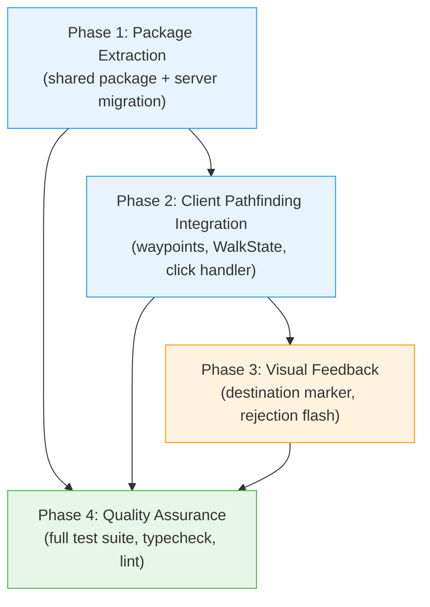
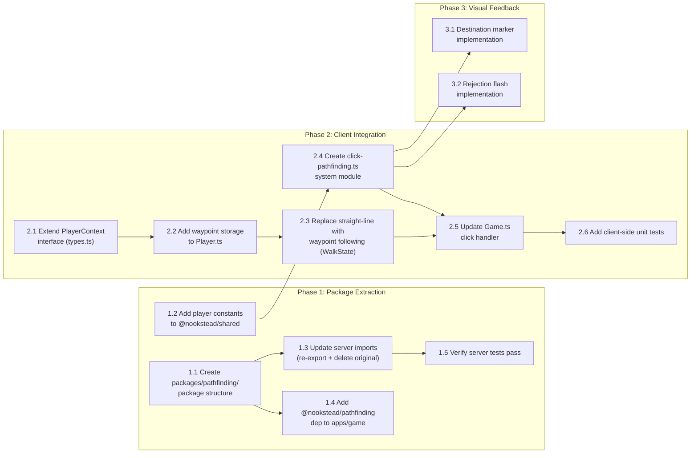

# Work Plan: Player Click-to-Move A* Pathfinding

Created Date: 2026-03-14
Type: feature
Estimated Duration: 1.5 days
Estimated Impact: 16 files (6 new, 10 modified)
Related Issue/PR: N/A

## Related Documents
- Design Doc: [docs/design/design-024-player-click-pathfinding.md](../design/design-024-player-click-pathfinding.md)
- ADR: [docs/adr/ADR-0017-player-client-side-pathfinding.md](../adr/ADR-0017-player-client-side-pathfinding.md)
- ADR: [docs/adr/ADR-0016-npc-astar-pathfinding.md](../adr/ADR-0016-npc-astar-pathfinding.md) (original pathfinding decision)

## Objective

Add A* pathfinding to the player's click-to-move system so that clicking a tile computes a waypoint path around obstacles instead of walking in a straight line. Extract the server-side `Pathfinder` class to a shared `@nookstead/pathfinding` package so both server (NPC navigation) and client (player click-to-move) reuse the same implementation.

## Background

Players currently click a tile and the player character walks in a straight line toward it. When obstacles block the path, the player walks into the wall and stops. The `Pathfinder` class (A* wrapper around the `pathfinding` npm library) already exists in `apps/server/src/npc-service/movement/Pathfinder.ts` but is embedded in the server NPC code despite having zero server-specific dependencies. Extracting it to a shared package enables client-side reuse.

## Risks and Countermeasures

### Technical Risks

- **Risk**: Package extraction breaks existing server NPC imports
  - **Impact**: Medium -- server tests fail, NPC movement broken
  - **Countermeasure**: Re-export from `movement/index.ts` preserves all existing import paths. Run `pnpm nx test server` immediately after extraction.

- **Risk**: Waypoint following feels "robotic" (grid-aligned right-angle turns)
  - **Impact**: Low -- visual quality concern
  - **Countermeasure**: Use sub-pixel movement toward tile centers via `calculateMovement()`. Path smoothing can be added in a future iteration if needed.

- **Risk**: Mid-path walkability changes leave player on stale path
  - **Impact**: Low -- player stops at an obstacle
  - **Countermeasure**: `calculateMovement()` blocks movement into non-walkable tiles per-frame. Player can click again to recompute path.

- **Risk**: Bundle size increase on client
  - **Impact**: Low -- `pathfinding` library is ~3KB gzipped vs Phaser ~1MB
  - **Countermeasure**: Negligible impact. Monitor bundle size in Phase 4.

### Schedule Risks

- **Risk**: Unfamiliarity with shared package Nx configuration
  - **Impact**: Low -- possible minor delays in Phase 1
  - **Countermeasure**: Follow established pattern from `packages/shared/` (package.json, tsconfig.json, tsconfig.lib.json).

## Implementation Strategy

**Selected Approach**: Vertical Slice (Feature-driven)

**Rationale**: The feature has a clear vertical boundary -- package extraction is a prerequisite, followed by client integration, then visual polish. Each phase delivers a testable, verifiable outcome. The feature has low inter-dependency with other ongoing work.

**Migration Strategy**: Non-breaking. Server re-exports maintain all existing import paths. Client `moveTarget` field is preserved -- `WalkState.update()` checks waypoints first, then falls back to `moveTarget`.

## Phase Structure Diagram

## Task Dependency Diagram

## Implementation Phases

### Phase 1: Package Extraction (Estimated commits: 2-3)

**Purpose**: Extract `Pathfinder.ts` to a new `@nookstead/pathfinding` shared package. Update server to import from the shared package. Add player pathfinding constants to `@nookstead/shared`. Ensure all existing server behavior is preserved.

**AC Coverage**: AC-8.1, AC-8.2, AC-8.3, AC-8.4, AC-9.1, AC-9.2, AC-9.3

#### Tasks

- [x] **1.1** Create `packages/pathfinding/` package structure
  - `package.json` (`name: @nookstead/pathfinding`, `type: module`, deps: `pathfinding`, devDeps: `@types/pathfinding`, nx tags: `scope:shared, type:lib`)
  - `tsconfig.json` (extends `../../tsconfig.base.json`, references `tsconfig.lib.json`)
  - `tsconfig.lib.json` (rootDir: `src`, outDir: `dist`, emitDeclarationOnly, include `src/**/*.ts`, exclude specs)
  - `src/Pathfinder.ts` -- copy from server, modify constructor to accept optional `maxPathLength` parameter (defaults to `BOT_MAX_PATH_LENGTH`)
  - `src/index.ts` -- barrel export: `export { Pathfinder } from './Pathfinder.js'` and `export type { Point } from './Pathfinder.js'`
  - **AC-8.1**: Package exports `Pathfinder` class and `Point` type
  - **AC-8.2**: Package uses `pathfinding` npm library as its dependency
  - **AC-8.3**: Package follows shared package pattern (`workspace:*`, barrel exports, `tsconfig.lib.json`)

- [x] **1.2** Add player pathfinding constants to `@nookstead/shared`
  - Add to `packages/shared/src/constants.ts`: `PLAYER_MAX_PATH_LENGTH = 200`, `PLAYER_WAYPOINT_THRESHOLD = 2`
  - Add exports to `packages/shared/src/index.ts`

- [x] **1.3** Update server imports and dependencies
  - `apps/server/src/npc-service/movement/index.ts`: re-export `Pathfinder` and `Point` from `@nookstead/pathfinding` (replace local `./Pathfinder.js` imports)
  - `apps/server/package.json`: add `@nookstead/pathfinding: workspace:*`, remove `pathfinding` from dependencies, remove `@types/pathfinding` from devDependencies
  - DELETE `apps/server/src/npc-service/movement/Pathfinder.ts` (moved to shared package)
  - Update `apps/server/src/npc-service/movement/Pathfinder.spec.ts` imports to use `@nookstead/pathfinding` or the re-exported path from `./index.js`
  - **AC-9.1**: `movement/index.ts` re-exports `Pathfinder` and `Point` from `@nookstead/pathfinding`
  - **AC-9.2**: All existing server code importing from `../movement/index.js` continues to work

- [ ] **1.4** Add `@nookstead/pathfinding` dependency to `apps/game`
  - `apps/game/package.json`: add `@nookstead/pathfinding: workspace:*`
  - Run `pnpm install` to update lockfile
  - **AC-8.4**: Both `apps/game` and `apps/server` depend on `@nookstead/pathfinding`

- [ ] **1.5** Verify server tests and typecheck pass
  - Run `pnpm nx test server` -- all 8 Pathfinder tests pass with updated imports
  - Run `pnpm nx typecheck server` -- compiles without errors
  - **AC-9.3**: Existing Pathfinder tests pass after extraction

- [ ] Quality check: `pnpm nx lint server` passes

#### Phase Completion Criteria
- [ ] `@nookstead/pathfinding` package exists with `Pathfinder` class and `Point` type exported
- [ ] `Pathfinder` constructor accepts optional `maxPathLength` parameter
- [ ] `apps/server/src/npc-service/movement/Pathfinder.ts` is deleted
- [ ] Server `movement/index.ts` re-exports from `@nookstead/pathfinding`
- [ ] `PLAYER_MAX_PATH_LENGTH` and `PLAYER_WAYPOINT_THRESHOLD` constants exported from `@nookstead/shared`
- [ ] `pnpm nx test server` passes (all 8 Pathfinder tests green)
- [ ] `pnpm nx typecheck server` passes
- [ ] `pnpm nx typecheck game` passes (new dependency resolves)

#### Operational Verification Procedures
1. Run `pnpm nx test server` -- all existing tests pass (no regressions)
2. Run `pnpm nx typecheck server` -- zero errors
3. Run `pnpm nx typecheck game` -- zero errors (verifies `@nookstead/pathfinding` resolves from client)
4. Verify `BotManager.ts` import chain: `import { Pathfinder } from '../movement/index.js'` still resolves via re-export
5. Run `pnpm nx build server` -- build succeeds

---

### Phase 2: Client Pathfinding Integration (Estimated commits: 3-4)

**Purpose**: Wire up A* pathfinding on the client. Extend `PlayerContext` with waypoint fields, add waypoint storage to `Player.ts`, replace straight-line movement in `WalkState.ts` with waypoint following, create the `click-pathfinding.ts` system module, and update the `Game.ts` click handler to compute paths.

**AC Coverage**: AC-1.1, AC-1.2, AC-1.3, AC-1.4, AC-2.1, AC-2.2, AC-2.3, AC-2.4, AC-3.1, AC-4.1

#### Tasks

- [x] **2.1** Extend `PlayerContext` interface in `apps/game/src/game/entities/states/types.ts`
  - Import `Point` from `@nookstead/pathfinding`
  - Add fields: `waypoints: Point[]`, `currentWaypointIndex: number`
  - Add methods: `setWaypoints(waypoints: Point[]): void`, `clearWaypoints(): void`

- [x] **2.2** Add waypoint storage to `apps/game/src/game/entities/Player.ts`
  - Add public fields: `waypoints: Point[] = []`, `currentWaypointIndex: number = 0`
  - Implement `setWaypoints(waypoints: Point[])`: stores array, sets index to 0, transitions to walk if idle
  - Implement `clearWaypoints()`: empties array, resets index to 0
  - **AC-2.1** (partial): `setWaypoints()` stores array and transitions to walk

- [x] **2.3** Replace straight-line movement with waypoint following in `apps/game/src/game/entities/states/WalkState.ts`
  - In `update()`: check `this.context.waypoints.length > 0` before `this.context.moveTarget`
  - New private method `moveAlongWaypoints(delta)`:
    - Get current waypoint: `this.context.waypoints[this.context.currentWaypointIndex]`
    - Convert tile coords to pixel: `waypoint.x * tileSize + tileSize / 2`, `(waypoint.y + 1) * tileSize`
    - Compute direction vector from player position to waypoint pixel position
    - Update facing direction (AC-2.3)
    - Call `applyMovement(normalizedDir, delta)` (reuses existing method)
    - Check distance to waypoint: if within `PLAYER_WAYPOINT_THRESHOLD`, advance `currentWaypointIndex` (AC-2.2)
    - If `currentWaypointIndex >= waypoints.length`: call `clearWaypoints()`, `clearMoveTarget()`, transition to idle (AC-3.1)
  - In keyboard input branch: call `this.context.clearWaypoints()` alongside `clearMoveTarget()` (AC-4.1)
  - In movement locked branch: call `this.context.clearWaypoints()` alongside `clearMoveTarget()`
  - Import `PLAYER_WAYPOINT_THRESHOLD` from `@nookstead/shared`
  - **AC-2.1**: Player moves toward each waypoint using `calculateMovement()`
  - **AC-2.2**: Advances to next waypoint within threshold
  - **AC-2.3**: Facing direction updates per waypoint
  - **AC-2.4**: Walk animation plays during waypoint following (handled by existing `enter()`)
  - **AC-3.1**: Transitions to idle when all waypoints exhausted
  - **AC-4.1**: Keyboard input clears waypoints

- [x] **2.4** Create `apps/game/src/game/systems/click-pathfinding.ts` system module
  - `createClickPathfindingSystem(scene, mapWidth, mapHeight, tileSize)` factory function
  - `handleClick(worldX, worldY, player, pathfinder, scene)`:
    - Convert pixel coords to tile coords: `Math.floor(worldX / tileSize)`, `Math.floor(worldY / tileSize)`
    - Check walkability: `player.mapData.walkable[tileY][tileX]`
    - If non-walkable: call rejection flash, return (AC-5.2)
    - Compute player's current tile from pixel position
    - Call `pathfinder.findPath(playerTileX, playerTileY, tileX, tileY)`
    - If empty result: call rejection flash, return (AC-7.1, AC-7.2)
    - If path found: call `player.setWaypoints(path)` (AC-1.1)
    - Show destination marker at target tile (AC-6.1)
  - `clearMarker()`: remove destination marker
  - `destroy()`: clean up graphics objects
  - **AC-1.1**: Computes A* path from player tile to clicked tile
  - **AC-1.2**: 4-directional only (inherited from Pathfinder configuration)
  - **AC-1.3**: Path capped at `PLAYER_MAX_PATH_LENGTH` (inherited from Pathfinder constructor)
  - **AC-1.4**: Truncated path followed for distant targets

- [x] **2.5** Update `apps/game/src/game/scenes/Game.ts` click handler
  - Import `Pathfinder` from `@nookstead/pathfinding`
  - Import `createClickPathfindingSystem` from `../systems/click-pathfinding`
  - Import `PLAYER_MAX_PATH_LENGTH` from `@nookstead/shared`
  - In `create()`: instantiate `Pathfinder` with `this.mapData.walkable` and `PLAYER_MAX_PATH_LENGTH`
  - In `create()`: instantiate click-pathfinding system
  - Replace `this.player.setMoveTarget(targetX, targetY)` in pointerup handler with `clickPathSystem.handleClick(pointer.worldX, pointer.worldY, this.player, pathfinder, this)`
  - In `shutdown()`: call `clickPathSystem.destroy()`

- [ ] **2.6** Add client-side unit tests
  - Test `click-pathfinding.ts`: path computation for walkable target, no path for non-walkable, no path for unreachable, truncated path for distant targets
  - Test `WalkState` waypoint following (mock PlayerContext): moves toward current waypoint, advances on threshold, transitions to idle on completion, keyboard clears waypoints
  - Test `Player` waypoint methods: `setWaypoints()` stores and transitions, `clearWaypoints()` resets

- [ ] Quality check: `pnpm nx typecheck game` and `pnpm nx lint game` pass

#### Phase Completion Criteria
- [ ] `PlayerContext` interface extended with `waypoints`, `currentWaypointIndex`, `setWaypoints()`, `clearWaypoints()`
- [ ] `Player.ts` implements waypoint storage and methods
- [ ] `WalkState.ts` follows waypoints in sequence, falls back to `moveTarget`, keyboard cancels waypoints
- [ ] `click-pathfinding.ts` computes paths and manages visual feedback lifecycle
- [ ] `Game.ts` click handler uses pathfinding system instead of direct `setMoveTarget()`
- [ ] Clicking a tile behind a wall navigates the player around the wall
- [ ] Keyboard input cancels active path
- [ ] Client typecheck and lint pass

#### Operational Verification Procedures
1. Run `pnpm nx typecheck game` -- zero errors
2. Manual test: Click a tile behind a wall in-game -- player navigates around the wall to reach the tile
3. Manual test: Click a walkable tile -- player walks along computed path and stops at destination (idle)
4. Manual test: Click a distant tile, press WASD mid-path -- path cancels, keyboard movement takes over
5. Manual test: Click while already following a path -- old path replaced with new path
6. Manual test: Click a non-walkable tile (water/wall) -- no movement occurs
7. Verify walk animation plays throughout waypoint following
8. Verify facing direction updates correctly at each waypoint turn

---

### Phase 3: Visual Feedback (Estimated commits: 1-2)

**Purpose**: Add visual feedback for click-to-move: destination marker on valid clicks, red rejection flash on invalid clicks. Both managed within `click-pathfinding.ts`.

**AC Coverage**: AC-3.2, AC-4.2, AC-5.1, AC-6.1, AC-6.2, AC-6.3, AC-7.1

#### Tasks

- [x] **3.1** Implement destination marker in `click-pathfinding.ts`
  - Create `Phaser.GameObjects.Graphics` rectangle/crosshair at tile center
  - Set depth above tiles but below player sprite
  - Persistent while player follows waypoints (AC-6.2)
  - Removed on arrival (AC-3.2), keyboard cancel (AC-4.2), or new click (AC-6.3)
  - At most one marker exists at any time (invariant from design doc)
  - **AC-6.1**: Destination marker displayed at clicked tile center
  - **AC-6.2**: Marker persists during waypoint following
  - **AC-6.3**: Old marker removed when new tile clicked

- [x] **3.2** Implement rejection flash in `click-pathfinding.ts`
  - Red-tinted rectangle overlay on clicked tile (`Phaser.GameObjects.Graphics`)
  - 300ms duration with alpha fade-out tween (AC-5.1)
  - Self-destructs after animation completes
  - Triggered for non-walkable tile clicks (AC-5.1) and unreachable walkable tile clicks (AC-7.1)
  - At most one flash exists at any time (invariant from design doc)

- [x] **3.3** Wire marker lifecycle to waypoint events
  - `WalkState`: when all waypoints exhausted, call `clearMarker()` on the click-pathfinding system (AC-3.2)
  - `WalkState`: when keyboard cancels, call `clearMarker()` (AC-4.2)
  - Approach: pass a callback or expose the system via scene data/registry

- [x] Quality check: Visual feedback visible and disappears appropriately

#### Phase Completion Criteria
- [x] Clicking a walkable tile with valid path shows destination marker
- [x] Marker persists during movement, removed on arrival
- [x] Clicking a new tile while moving replaces the marker
- [x] Keyboard cancellation removes the marker
- [x] Clicking a non-walkable tile shows 300ms red flash
- [x] Clicking an unreachable tile shows 300ms red flash
- [x] No orphaned graphics objects after marker/flash lifecycle

#### Operational Verification Procedures
1. Manual test: Click walkable tile -- destination marker appears at tile center
2. Manual test: Walk to destination -- marker disappears on arrival
3. Manual test: Click tile A, then click tile B mid-path -- marker moves from A to B
4. Manual test: Click distant tile, press WASD -- marker disappears
5. Manual test: Click water/wall tile -- red flash appears and fades out within ~300ms
6. Manual test: Click a walkable tile surrounded by walls (unreachable) -- red flash appears
7. Verify no lingering graphics objects after scene transitions

---

### Phase 4: Quality Assurance (Estimated commits: 1)

**Purpose**: Full quality assurance pass. Verify all acceptance criteria, run complete test suite across all affected projects, validate types and lint, and confirm no regressions.

**AC Coverage**: All (AC-1.1 through AC-9.3)

#### Tasks

- [ ] Verify all Design Doc acceptance criteria achieved (checklist below)
- [ ] Run `pnpm nx test server` -- all tests pass (including moved Pathfinder tests)
- [ ] Run `pnpm nx test game` -- all tests pass (including new click-pathfinding tests)
- [ ] Run `pnpm nx typecheck server` -- zero errors
- [ ] Run `pnpm nx typecheck game` -- zero errors
- [ ] Run `pnpm nx lint server` -- zero errors
- [ ] Run `pnpm nx lint game` -- zero errors
- [ ] Run `pnpm nx build server` -- build succeeds
- [ ] Run `pnpm nx build game` -- build succeeds
- [ ] Verify `@nookstead/pathfinding` package structure is correct (barrel exports, tsconfig)
- [ ] Verify no server-specific code remains in `packages/pathfinding/`
- [ ] Verify `pathfinding` npm dependency is in `packages/pathfinding/package.json`, not `apps/server/package.json`

#### Acceptance Criteria Verification Checklist

**FR-1: A* Path Computation**
- [ ] AC-1.1: Clicking walkable tile computes A* path via `@nookstead/pathfinding`
- [ ] AC-1.2: Path uses 4-directional movement only
- [ ] AC-1.3: Path does not exceed `PLAYER_MAX_PATH_LENGTH` (200)
- [ ] AC-1.4: Distant tile click follows truncated path

**FR-2: Waypoint Following**
- [ ] AC-2.1: Player moves toward each waypoint in sequence via `calculateMovement()`
- [ ] AC-2.2: Advances waypoint within `PLAYER_WAYPOINT_THRESHOLD` (2px)
- [ ] AC-2.3: Facing direction updates per waypoint
- [ ] AC-2.4: Walk animation plays during following

**FR-3: Path Completion**
- [ ] AC-3.1: Final waypoint reached -- clear waypoints, transition to idle
- [ ] AC-3.2: Destination marker removed on arrival

**FR-4: Keyboard Cancellation**
- [ ] AC-4.1: Keyboard input clears waypoints
- [ ] AC-4.2: Marker removed on keyboard cancel

**FR-5: Non-Walkable Click Feedback**
- [ ] AC-5.1: Red overlay on non-walkable tile for 300ms
- [ ] AC-5.2: No path computed, no movement

**FR-6: Destination Marker**
- [ ] AC-6.1: Marker at clicked tile center on valid path
- [ ] AC-6.2: Marker persists during following
- [ ] AC-6.3: New click replaces old marker

**FR-7: Unreachable Target Feedback**
- [ ] AC-7.1: Red flash for walkable but unreachable tile
- [ ] AC-7.2: No waypoints set, no movement

**FR-8: Shared Package Extraction**
- [ ] AC-8.1: Package exports `Pathfinder` and `Point`
- [ ] AC-8.2: Package depends on `pathfinding` npm
- [ ] AC-8.3: Follows shared package pattern
- [ ] AC-8.4: Both `apps/game` and `apps/server` depend on it

**FR-9: Server Backward Compatibility**
- [ ] AC-9.1: `movement/index.ts` re-exports from `@nookstead/pathfinding`
- [ ] AC-9.2: Existing server imports work unchanged
- [ ] AC-9.3: Pathfinder tests pass after extraction

#### Operational Verification Procedures
1. Run full test suite: `pnpm nx run-many -t test --projects=server,game`
2. Run full typecheck: `pnpm nx run-many -t typecheck --projects=server,game`
3. Run full lint: `pnpm nx run-many -t lint --projects=server,game`
4. Run full build: `pnpm nx run-many -t build --projects=server,game`
5. End-to-end manual verification: Start dev server, click tile behind wall, verify player navigates around it, arrives, and idles
6. Verify keyboard cancellation mid-path
7. Verify visual feedback (marker + flash) lifecycle

---

## Completion Criteria
- [ ] All phases completed (Phase 1 through Phase 4)
- [ ] Each phase's operational verification procedures executed
- [ ] All 27 acceptance criteria verified (AC-1.1 through AC-9.3)
- [ ] All tests pass across server and game projects
- [ ] TypeScript strict mode -- zero errors
- [ ] ESLint -- zero errors
- [ ] Builds succeed for both server and game
- [ ] No regressions in existing NPC pathfinding behavior
- [ ] User review approval obtained

## File Impact Summary

| File | Phase | Action | Description |
|------|-------|--------|-------------|
| `packages/pathfinding/package.json` | 1 | NEW | Shared package manifest |
| `packages/pathfinding/tsconfig.json` | 1 | NEW | TypeScript project config |
| `packages/pathfinding/tsconfig.lib.json` | 1 | NEW | TypeScript build config |
| `packages/pathfinding/src/Pathfinder.ts` | 1 | NEW | Extracted Pathfinder (+ `maxPathLength` param) |
| `packages/pathfinding/src/index.ts` | 1 | NEW | Barrel exports |
| `packages/shared/src/constants.ts` | 1 | MODIFY | Add `PLAYER_MAX_PATH_LENGTH`, `PLAYER_WAYPOINT_THRESHOLD` |
| `packages/shared/src/index.ts` | 1 | MODIFY | Export new constants |
| `apps/server/src/npc-service/movement/Pathfinder.ts` | 1 | DELETE | Moved to shared package |
| `apps/server/src/npc-service/movement/Pathfinder.spec.ts` | 1 | MODIFY | Update imports |
| `apps/server/src/npc-service/movement/index.ts` | 1 | MODIFY | Re-export from `@nookstead/pathfinding` |
| `apps/server/package.json` | 1 | MODIFY | Add shared pkg dep, remove `pathfinding` npm dep |
| `apps/game/package.json` | 1 | MODIFY | Add `@nookstead/pathfinding` dep |
| `apps/game/src/game/entities/states/types.ts` | 2 | MODIFY | Add waypoint fields to `PlayerContext` |
| `apps/game/src/game/entities/Player.ts` | 2 | MODIFY | Add waypoint storage and methods |
| `apps/game/src/game/entities/states/WalkState.ts` | 2 | MODIFY | Waypoint following replaces straight-line |
| `apps/game/src/game/systems/click-pathfinding.ts` | 2-3 | NEW | Path computation + visual feedback |
| `apps/game/src/game/scenes/Game.ts` | 2 | MODIFY | Click handler uses pathfinding system |
| `pnpm-lock.yaml` | 1 | MODIFY | Dependency changes |

## Progress Tracking

### Phase 1: Package Extraction
- Start: 2026-03-15
- Complete:
- Notes: Task 1.1 completed -- @nookstead/pathfinding package created with Pathfinder class, Point type, maxPathLength param, 14 tests passing. Task 1.2 completed -- PLAYER_MAX_PATH_LENGTH and PLAYER_WAYPOINT_THRESHOLD added to shared. Task 1.3 completed -- server re-exports from @nookstead/pathfinding, Pathfinder.ts deleted, all 184 server tests pass.

### Phase 2: Client Pathfinding Integration
- Start: 2026-03-15
- Complete:
- Notes: Tasks 2.1-2.5 completed. PlayerContext extended with waypoint fields/methods. Player.ts implements setWaypoints/clearWaypoints. WalkState follows waypoints (priority: lock > keyboard > waypoints > moveTarget > idle). click-pathfinding.ts system module created with Pathfinder instance, handleClick, and visual stubs. Game.ts click handler delegates to pathfinding system. All 314 tests pass, typecheck clean, lint 0 errors. Task 2.6 (additional client-side unit tests) pending.

### Phase 3: Visual Feedback
- Start: 2026-03-15
- Complete: 2026-03-15
- Notes: Tasks 3.1-3.3 completed. Destination marker (white semi-transparent rect with border, depth 10) implemented in showMarker(). Rejection flash (red rect, 300ms alpha tween to 0, self-destructs) implemented in showRejectionFlash(). flashGraphics tracking variable added alongside markerGraphics. destroy() cleans up both. Marker lifecycle wired via scene data registry: Game.ts sets 'clickPathClearMarker' callback, WalkState.clearPathMarker() retrieves and calls it on arrival, keyboard cancel, and movement lock. Mock scene in click-pathfinding.spec.ts updated with graphics methods + tweens mock. All 314 tests pass, typecheck clean, lint 0 errors.

### Phase 4: Quality Assurance
- Start:
- Complete:
- Notes:

## Notes

- **No test skeletons provided**: Using Strategy B (Implementation-First Development). Tests are added alongside implementation in each phase.
- **Pathfinder `maxPathLength` parameterization**: The constructor gains an optional second parameter. Existing server usage (`new Pathfinder(walkable)`) continues to work with the default value (`BOT_MAX_PATH_LENGTH = 100`). Client usage passes `PLAYER_MAX_PATH_LENGTH = 200`.
- **`moveTarget` preserved**: The existing `moveTarget` field and `setMoveTarget()` method remain on `Player.ts`. `WalkState.update()` checks waypoints first, then falls back to `moveTarget`, ensuring backward compatibility for any future code that calls `setMoveTarget()` directly.
- **Waypoint threshold values**: Intermediate waypoints use `PLAYER_WAYPOINT_THRESHOLD` (2px) for tight grid following. The final waypoint uses the existing `ARRIVAL_THRESHOLD` (8px) for natural stopping feel.
- **`NPCMovementEngine.ts` unchanged**: Server-side NPC movement engine is not modified. It imports `Point` from `./Pathfinder.js` which will be updated to import from the re-exported path.
