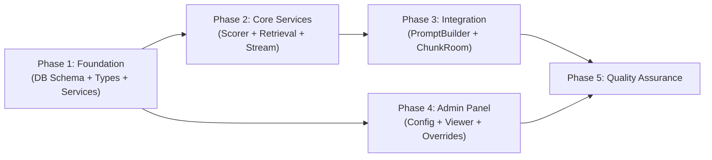
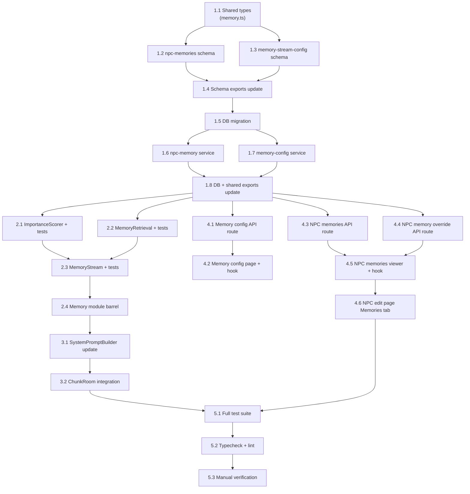

# Work Plan: Memory Stream NPC Memory System (Phase 0)

Created Date: 2026-03-14
Type: feature
Estimated Duration: 4-5 days
Estimated Impact: 25 files (18 new + 7 modified)
Related Issue/PR: N/A

## Related Documents
- Design Doc: [docs/design/design-023-memory-stream.md](../design/design-023-memory-stream.md)
- ADR-0013: NPC Bot Entity Architecture
- ADR-0014: AI Dialogue via OpenAI + Vercel AI SDK
- ADR-0015: NPC Prompt Architecture (Character-Card / Scene-Contract)
- Feature Spec: [docs/design/mechanics/feature-spec-m04-npc-remembers.md](../design/mechanics/feature-spec-m04-npc-remembers.md)

## Objective

Implement Phase 0 of the Memory Stream system so that NPCs remember past interactions with players. After a dialogue session ends, an LLM-generated summary is stored as a memory record. On the next dialogue start, top-K memories are retrieved (scored by recency + importance) and injected into the NPC system prompt. Admin tooling provides config management and memory inspection.

## Background

NPCs currently have no memory of past interactions. `buildMemorySection()` in `SystemPromptBuilder.ts` returns a static placeholder "(Пока нет воспоминаний)". Every dialogue starts from zero context, breaking the core value proposition: "a world that notices what you do." The dialogue infrastructure (sessions, messages, streaming) is already in place via ADR-0014/0015.

## Risks and Countermeasures

### Technical Risks
- **Risk**: LLM summary generation latency on dialogue end may delay next dialogue start
  - **Impact**: User-perceived slowdown between dialogues
  - **Countermeasure**: Fire-and-forget pattern (`.catch()`) ensures memory creation never blocks dialogue flow (AC-1)

- **Risk**: Memory retrieval adds latency to dialogue start path (~50-100ms)
  - **Impact**: Delay before first NPC response
  - **Countermeasure**: Single indexed DB query + in-app scoring; fallback to empty array on error; measurable target < 200ms (AC-2)

- **Risk**: Token budget overflow produces truncated or oversized prompt
  - **Impact**: NPC context window exceeded; degraded response quality
  - **Countermeasure**: `estimateTokens()` enforcement in `retrieveMemories()` with hard limit at `tokenBudget` (default 400); boundary case unit tests (AC-5)

- **Risk**: LLM summary quality is poor for Russian-language dialogues
  - **Impact**: Memory content is unhelpful or incoherent
  - **Countermeasure**: Summary prompt explicitly requests Russian output from gpt-4o-mini (same model used for dialogues); 500-char hard limit; empty summary skips memory creation

- **Risk**: Memory table grows unbounded
  - **Impact**: DB performance degradation over time
  - **Countermeasure**: `maxMemoriesPerNpc` cap (default 1000) with automatic cleanup of oldest memories (AC-1)

- **Risk**: Global config changes affect all NPCs unexpectedly
  - **Impact**: Unintended behavior changes across NPCs
  - **Countermeasure**: Per-NPC overrides provide escape hatch; admin UI shows current values before save (AC-6, AC-7)

### Schedule Risks
- **Risk**: Genmap admin UI complexity (config form + memory viewer + override controls)
  - **Impact**: Phase 4 may take longer than estimated
  - **Countermeasure**: Follow established genmap hook/page patterns exactly; reuse Radix UI components

## Phase Structure Diagram

## Task Dependency Diagram

## Testing Strategy

**Strategy B: Implementation-First Development** -- no pre-existing test spec files. Unit tests are written alongside each component; integration verification in Phase 5.

| Phase | New Tests | Cumulative |
|-------|-----------|------------|
| Phase 1 | 0 (DB services tested implicitly via consumers) | 0 |
| Phase 2 | ~20 unit tests (3 spec files) | ~20 |
| Phase 3 | ~4 unit tests (buildMemorySection) | ~24 |
| Phase 4 | 0 (API routes tested via manual + E2E) | ~24 |
| Phase 5 | Integration + regression | ~24+ |

## Implementation Phases

### Phase 1: Foundation -- DB Schema, Types, and Services (Estimated commits: 4-5)

**Purpose**: Establish the data layer -- shared types, Drizzle schemas for all 3 tables, DB services for memory CRUD and config management, and DB migration.

**Owner**: mechanics-developer
**AC Coverage**: AC-1 (table structure), AC-4 (config defaults), AC-6 (config storage)

#### Tasks

- [ ] **Task 1.1**: Create shared memory types (`packages/shared/src/types/memory.ts`)
  - Define `MemoryType` union type: `'interaction' | 'observation' | 'reflection' | 'gossip'`
  - Define `NpcMemory` interface (id, botId, userId, type, content, importance, dialogueSessionId, createdAt)
  - Define `MemoryStreamConfig` interface (topK, halfLifeHours, weights, importance values, maxMemoriesPerNpc, tokenBudget)
  - Define `NpcMemoryOverride` interface (botId + nullable override fields)
  - **Completion**: Types compile with strict mode, match Design Doc contract definitions exactly

- [ ] **Task 1.2**: Create npc_memories Drizzle schema (`packages/db/src/schema/npc-memories.ts`)
  - Define `npcMemories` pgTable with columns: id (uuid PK), botId (FK npcBots cascade), userId (FK users cascade), type (varchar 32), content (text), importance (smallint), dialogueSessionId (FK dialogueSessions set null), createdAt (timestamp tz)
  - Define 3 indexes: `idx_nm_bot_user`, `idx_nm_bot_created`, `idx_nm_bot_importance`
  - Export `NpcMemoryRow` and `NewNpcMemory` types via `$inferSelect` / `$inferInsert`
  - **Completion**: Schema matches Design Doc table definition; types export cleanly
  - **Dependencies**: Task 1.1 (for type alignment reference)

- [ ] **Task 1.3**: Create memory-stream-config Drizzle schemas (`packages/db/src/schema/memory-stream-config.ts`)
  - Define `memoryStreamConfig` pgTable (single-row global config) with all numeric fields and defaults matching AC-4
  - Define `npcMemoryOverrides` pgTable with botId (unique FK cascade) and nullable override fields
  - Export `MemoryStreamConfigRow` and `NpcMemoryOverrideRow` types
  - **Completion**: Schemas match Design Doc; default values match AC-4 (topK=10, halfLife=48, etc.)
  - **Dependencies**: Task 1.1

- [ ] **Task 1.4**: Update schema barrel exports (`packages/db/src/schema/index.ts`)
  - Add `export * from './npc-memories'`
  - Add `export * from './memory-stream-config'`
  - **Completion**: All new schema types importable via `@nookstead/db` schema barrel
  - **Dependencies**: Tasks 1.2, 1.3

- [ ] **Task 1.5**: Generate and apply DB migration
  - Run `drizzle-kit generate` to create migration SQL for the 3 new tables
  - Run `drizzle-kit push` to apply migration to development DB
  - Verify tables created with correct columns, indexes, and FK constraints
  - **Completion**: Tables exist in DB; FK constraints verified; indexes present
  - **Dependencies**: Task 1.4

- [ ] **Task 1.6**: Create npc-memory DB service (`packages/db/src/services/npc-memory.ts`)
  - `createMemory(db, data: CreateMemoryData): Promise<NpcMemoryRow>` -- insert single memory
  - `getMemoriesForBot(db, botId, userId): Promise<NpcMemoryRow[]>` -- all memories for bot-user pair
  - `getMemoryCount(db, botId): Promise<number>` -- count all memories for a bot
  - `deleteOldestMemories(db, botId, keepCount): Promise<void>` -- delete oldest exceeding limit
  - `deleteMemory(db, id): Promise<void>` -- admin delete single memory
  - `listMemoriesAdmin(db, botId, params?): Promise<NpcMemoryRow[]>` -- paginated list for admin
  - Follow `(db: DrizzleClient, ...) => Promise<T>` pattern from `npc-bot.ts`
  - **Completion**: All 6 functions implemented; follows existing DB service pattern; `result[0] ?? null` for single-row returns
  - **Dependencies**: Task 1.5

- [ ] **Task 1.7**: Create memory-config DB service (`packages/db/src/services/memory-config.ts`)
  - `getGlobalConfig(db): Promise<MemoryStreamConfig>` -- get or create defaults
  - `updateGlobalConfig(db, data: Partial<MemoryStreamConfig>): Promise<MemoryStreamConfig>` -- update config
  - `getNpcOverride(db, botId): Promise<NpcMemoryOverrideRow | null>` -- get per-NPC override
  - `upsertNpcOverride(db, botId, data): Promise<NpcMemoryOverrideRow>` -- create/update override
  - `deleteNpcOverride(db, botId): Promise<void>` -- remove override
  - `getEffectiveConfig(db, botId): Promise<MemoryStreamConfig>` -- merge global + override (null = use global)
  - **Completion**: All 6 functions implemented; `getEffectiveConfig` correctly merges override nulls with global defaults; follows existing pattern
  - **Dependencies**: Task 1.5

- [ ] **Task 1.8**: Update DB and shared package exports
  - `packages/db/src/index.ts` -- add named exports for all functions/types from `npc-memory.ts` and `memory-config.ts`
  - `packages/shared/src/index.ts` -- add `export type { MemoryType, NpcMemory, MemoryStreamConfig, NpcMemoryOverride } from './types/memory'`
  - **Completion**: All new types and services importable from `@nookstead/db` and `@nookstead/shared`
  - **Dependencies**: Tasks 1.6, 1.7

#### Phase 1 Completion Criteria
- [ ] 3 new Drizzle schema files compile with strict TypeScript
- [ ] DB migration applied; tables verified with correct columns, indexes, and FKs
- [ ] All 12 DB service functions implemented following existing `(db, data) => Promise<T>` pattern
- [ ] Shared types exported from `@nookstead/shared`
- [ ] DB services exported from `@nookstead/db`
- [ ] `pnpm nx typecheck` passes for `db` and `shared` packages

#### Operational Verification Procedures
1. Run `pnpm nx typecheck` on `db` and `shared` packages -- zero errors
2. Verify `drizzle-kit push` succeeds without conflicts
3. Manually query DB to confirm 3 tables exist: `npc_memories`, `memory_stream_config`, `npc_memory_overrides`
4. Verify FK cascade: insert a test memory row with a valid botId; delete the bot; confirm the memory row is cascade-deleted

---

### Phase 2: Core Services -- Server Memory Module (Estimated commits: 3-4)

**Purpose**: Implement the business logic for importance scoring, memory retrieval with recency/importance scoring, and memory creation via LLM summary generation. Include unit tests for all 3 components.

**Owner**: mechanics-developer
**AC Coverage**: AC-1 (memory creation), AC-4 (importance scoring), AC-5 (retrieval algorithm)
**Dependencies**: Phase 1 complete (DB services and types available)

#### Tasks

- [ ] **Task 2.1**: Implement ImportanceScorer with unit tests
  - Create `apps/server/src/npc-service/memory/ImportanceScorer.ts`
  - Export `ImportanceScorerConfig` interface (firstMeeting, normalDialogue, emotionalDialogue, giftReceived, questRelated)
  - Export `scoreImportance(config, context: { isFirstMeeting: boolean }): number`
  - Phase 0 logic: returns `config.firstMeeting` when `isFirstMeeting === true`, else `config.normalDialogue`
  - Create `apps/server/src/npc-service/memory/__tests__/ImportanceScorer.spec.ts`
    - Test: returns `firstMeeting` value when `isFirstMeeting === true` (AC-4)
    - Test: returns `normalDialogue` value when `isFirstMeeting === false` (AC-4)
    - Test: default config values produce expected scores (7 for first meeting, 4 for normal) (AC-4)
  - **Completion**: 3 unit tests GREEN; function matches AC-4 exactly

- [ ] **Task 2.2**: Implement MemoryRetrieval with unit tests
  - Create `apps/server/src/npc-service/memory/MemoryRetrieval.ts`
  - Export `RetrievalConfig` interface (topK, halfLifeHours, recencyWeight, importanceWeight, tokenBudget)
  - Export `ScoredMemory` interface (memory, recencyScore, importanceScore, totalScore)
  - Export `retrieveMemories(db, botId, userId, config): Promise<ScoredMemory[]>`
  - Algorithm: (1) fetch all memories for pair, (2) recency = `exp(-0.693 * hoursElapsed / halfLifeHours)`, (3) importance = `importance / 10`, (4) total = weighted sum, (5) sort desc + topK, (6) trim to tokenBudget via `estimateTokens()`
  - Create `apps/server/src/npc-service/memory/__tests__/MemoryRetrieval.spec.ts` (mock DB service)
    - Test: returns empty array when no memories exist (AC-2)
    - Test: recency score = 1.0 for memory created now (AC-5)
    - Test: recency score ~ 0.5 for memory created `halfLifeHours` ago (AC-5)
    - Test: recency score approaches 0.0 for very old memories (AC-5)
    - Test: importance score = `importance / 10` (AC-5)
    - Test: total score = `recencyWeight * recencyScore + importanceWeight * importanceScore` (AC-5)
    - Test: result sorted by totalScore descending (AC-5)
    - Test: result limited to topK entries (AC-5)
    - Test: result trimmed to fit within tokenBudget (AC-5)
    - Test: memories exceeding entire tokenBudget individually are excluded (AC-5)
  - **Completion**: 10 unit tests GREEN; retrieval algorithm matches AC-5 formulas exactly

- [ ] **Task 2.3**: Implement MemoryStream with unit tests
  - Create `apps/server/src/npc-service/memory/MemoryStream.ts`
  - `MemoryStream` class with constructor accepting `{ apiKey, model? }` config
  - Uses `createOpenAI` from `@ai-sdk/openai` and `generateText` from `ai` package (not DialogueService)
  - `createDialogueMemory(params)`: load messages -> skip if empty -> generate LLM summary -> score importance -> create memory -> cleanup if over limit
  - Private `generateSummary(botName, playerName, messages)`: format dialogue, call `generateText` with Russian prompt, hard limit 500 chars
  - SUMMARY_PROMPT in Russian matching Design Doc
  - 15-second timeout on `generateText` call (I010)
  - Create `apps/server/src/npc-service/memory/__tests__/MemoryStream.spec.ts` (mock `generateText`, DB services)
    - Test: calls `getDialogueSessionMessages` with correct sessionId (AC-1)
    - Test: skips memory creation when messages array is empty (AC-1)
    - Test: calls LLM with correct prompt format (Russian) (AC-1)
    - Test: calls `createMemory` with correct importance from scorer (AC-1, AC-4)
    - Test: calls `deleteOldestMemories` when count exceeds limit (AC-1)
    - Test: does NOT call `deleteOldestMemories` when count is within limit (AC-1)
  - **Completion**: 6 unit tests GREEN; MemoryStream class matches Design Doc exactly
  - **Dependencies**: Tasks 2.1, 2.2

- [ ] **Task 2.4**: Create memory module barrel export (`apps/server/src/npc-service/memory/index.ts`)
  - Re-export: `ImportanceScorer` types and function, `MemoryRetrieval` types and function, `MemoryStream` class
  - **Completion**: All memory module exports accessible via single import path
  - **Dependencies**: Task 2.3

#### Phase 2 Completion Criteria
- [ ] 19 unit tests GREEN across 3 spec files
- [ ] `ImportanceScorer` matches AC-4 binary distinction (first meeting vs. normal)
- [ ] `retrieveMemories` algorithm matches AC-5 formulas exactly (recency decay, importance normalization, weighted scoring, topK, token budget trim)
- [ ] `MemoryStream.createDialogueMemory` orchestrates the full creation pipeline per AC-1
- [ ] `pnpm nx test server` passes (all existing + new tests)

#### Operational Verification Procedures
1. Run `pnpm nx test server` -- all tests pass, zero failures
2. Verify ImportanceScorer: `scoreImportance({ firstMeeting: 7, normalDialogue: 4, ... }, { isFirstMeeting: true })` returns 7
3. Verify MemoryRetrieval: mock a memory created 48 hours ago with halfLifeHours=48 -- recency score should be ~0.5
4. Verify MemoryStream: mock `generateText` to return a summary -- verify `createMemory` is called with correct data

---

### Phase 3: Integration -- SystemPromptBuilder + ChunkRoom (Estimated commits: 2-3)

**Purpose**: Wire the memory module into the existing dialogue pipeline. Modify SystemPromptBuilder to format memories into the system prompt. Modify ChunkRoom to retrieve memories on dialogue start and create memories on dialogue end.

**Owner**: mechanics-developer
**AC Coverage**: AC-1 (creation on end), AC-2 (retrieval on start), AC-3 (prompt injection)
**Dependencies**: Phase 2 complete (memory module available)

#### Tasks

- [ ] **Task 3.1**: Update SystemPromptBuilder for memory injection
  - Modify `apps/server/src/npc-service/ai/SystemPromptBuilder.ts`
  - Add `memories?: ScoredMemory[]` to `PromptContext` interface (backward-compatible optional field)
  - Update `buildMemorySection(memories?: ScoredMemory[], playerName?: string): string`
    - If no memories or empty array: return `''` (empty string, omit section entirely) (AC-3)
    - If memories present: return header `ТВОИ ВОСПОМИНАНИЯ О {playerName}` + bullet list (AC-3)
  - Update `buildSystemPrompt()` to pass `context.memories` and `context.playerName` to `buildMemorySection()`
  - Unit tests (can add to existing spec file or new one):
    - Test: returns empty string when memories is undefined (AC-3)
    - Test: returns empty string when memories is empty array (AC-3)
    - Test: formats memories as Russian-language bullet list with correct header (AC-3)
    - Test: uses playerName in header; falls back to "этом человеке" when undefined (AC-3)
  - **Completion**: 4 unit tests GREEN; `buildMemorySection` matches Design Doc format; backward compatible
  - **Dependencies**: Task 2.4

- [ ] **Task 3.2**: Integrate memory retrieval and creation into ChunkRoom
  - Modify `apps/server/src/rooms/ChunkRoom.ts`
  - **onCreate**: Initialize `MemoryStream` instance with API key from env (store as `this.memoryStream`)
  - **dialogueSessions Map**: Extend value type to include `memories: ScoredMemory[]`
  - **handleNpcInteract** (after session creation, before DIALOGUE_START):
    - Load effective config via `getEffectiveConfig(db, botId)`
    - Retrieve memories via `retrieveMemories(db, botId, userId, config)`
    - Wrap in try/catch with fallback to empty array (AC-2)
    - Store memories in `dialogueSessions` map entry
  - **handleDialogueMessage**: Pass stored `memories` to `PromptContext` when calling `buildSystemPrompt`
  - **handleDialogueEnd** (fire-and-forget, after existing cleanup):
    - Capture all data into local variables BEFORE `this.dialogueSessions.delete()` (I003)
    - Fire-and-forget: `getEffectiveConfig` -> `getSessionCountForPair` -> `this.memoryStream.createDialogueMemory()`
    - `.catch()` logs error with `[ChunkRoom] Memory creation failed:` prefix
  - **Completion**: ChunkRoom retrieves memories on interact, passes them through to prompt, creates memory on dialogue end; all fire-and-forget patterns correct
  - **Dependencies**: Task 3.1

#### Phase 3 Completion Criteria
- [ ] `buildMemorySection` returns empty string for no/empty memories (AC-3)
- [ ] `buildMemorySection` formats memories as Russian bullet list with header (AC-3)
- [ ] `PromptContext` extended with optional `memories` field (backward compatible)
- [ ] ChunkRoom retrieves memories on dialogue start with error fallback (AC-2)
- [ ] ChunkRoom creates memory on dialogue end via fire-and-forget (AC-1)
- [ ] Memory data captured into locals before session cleanup (I003)
- [ ] `pnpm nx test server` passes (all existing + new tests)
- [ ] `pnpm nx typecheck server` passes

#### Operational Verification Procedures

**Integration Point 1: Memory Creation Pipeline** (from Design Doc)
1. Start a dialogue with an NPC (triggers handleNpcInteract)
2. Exchange at least 2 messages
3. End the dialogue (triggers handleDialogueEnd)
4. Query `npc_memories` table -- verify a new row exists with:
   - Correct `botId` and `userId`
   - Non-empty `content` (LLM summary)
   - `type = 'interaction'`
   - `importance` matching first-meeting (7) or normal (4)

**Integration Point 2: Memory Retrieval Pipeline** (from Design Doc)
1. After creating a memory (via point 1), start a new dialogue with the same NPC
2. Observe server logs for `[MemoryRetrieval] Retrieved N memories`
3. Verify the system prompt sent to the LLM contains the memory content under "ТВОИ ВОСПОМИНАНИЯ"

**Integration Point 3: Fire-and-Forget Correctness**
1. Verify dialogue end completes immediately (no delay waiting for memory creation)
2. Verify server logs show `[MemoryStream] Memory created` after dialogue end
3. Force an LLM error (e.g., invalid API key) -- verify error is logged but dialogue flow is unaffected

---

### Phase 4: Admin Panel -- Genmap Config and Memory Viewer (Estimated commits: 4-5)

**Purpose**: Build the admin tooling for memory configuration management, memory inspection, and per-NPC overrides.

**Owner**: ui-ux-agent
**AC Coverage**: AC-6 (config page), AC-7 (memory viewer)
**Dependencies**: Phase 1 complete (DB services available); can run in parallel with Phases 2-3

#### Tasks

- [ ] **Task 4.1**: Create memory config API route (`apps/genmap/src/app/api/npcs/memory-config/route.ts`)
  - `GET` handler: call `getGlobalConfig(db)`, return JSON response (AC-6)
  - `PATCH` handler: parse body as `Partial<MemoryStreamConfig>`, call `updateGlobalConfig(db, data)`, return updated config (AC-6)
  - Error handling: return 500 with `{ error: string }` on failure
  - **Completion**: Both endpoints return correct JSON; error cases return 500
  - **Dependencies**: Task 1.8

- [ ] **Task 4.2**: Create memory config page and hook
  - Create `apps/genmap/src/hooks/use-memory-config.ts`
    - Follow `use-npc-dialogues.ts` pattern: `useState` + `useCallback` + `fetch`
    - Exports: `useMemoryConfig()` hook returning `{ config, loading, error, save }`
  - Create `apps/genmap/src/app/(app)/npcs/memory-config/page.tsx`
    - Form with number inputs for all `MemoryStreamConfig` fields
    - Each input has min/max/step constraints (topK: 1-50, halfLifeHours: 1-720, weights: 0-10 step 0.1, importance values: 1-10, maxMemoriesPerNpc: 10-5000, tokenBudget: 50-2000)
    - Save button calls PATCH via hook
    - Success/error toast feedback
    - Uses Radix UI + Tailwind (matching existing genmap patterns)
  - **Completion**: Config page loads, displays all fields with correct defaults, save persists values (AC-6)
  - **Dependencies**: Task 4.1

- [ ] **Task 4.3**: Create NPC memories API route (`apps/genmap/src/app/api/npcs/[id]/memories/route.ts`)
  - `GET` handler: `listMemoriesAdmin(db, id, { limit, offset })` from query params, return `NpcMemory[]` (AC-7)
  - `DELETE` handler: parse `{ memoryId }` from body, call `deleteMemory(db, memoryId)`, return `{ success: true }` (AC-7)
  - **Completion**: GET returns paginated memories; DELETE removes specific memory
  - **Dependencies**: Task 1.8

- [ ] **Task 4.4**: Create NPC memory override API route (`apps/genmap/src/app/api/npcs/[id]/memory-override/route.ts`)
  - `GET` handler: `getNpcOverride(db, id)`, return override or null (AC-7)
  - `PUT` handler: `upsertNpcOverride(db, id, body)`, return override (AC-7)
  - `DELETE` handler: `deleteNpcOverride(db, id)`, return `{ success: true }` (AC-7)
  - **Completion**: All 3 HTTP methods work correctly; null override returns null (not error)
  - **Dependencies**: Task 1.8

- [ ] **Task 4.5**: Create NPC memories viewer component and hook
  - Create `apps/genmap/src/hooks/use-npc-memories.ts`
    - Follow `use-npc-dialogues.ts` pattern: paginated fetch, delete support
    - Exports: `useNpcMemories(id)` hook returning `{ memories, loading, error, deleteMemory, loadMore, override, saveOverride, deleteOverride }`
  - Build memory viewer UI (to be used as TabsContent in NPC edit page):
    - Table with columns: content (text), type (badge), importance (colored badge 1-10), createdAt (formatted date)
    - Delete button per memory row (AC-7)
    - Per-NPC override section at bottom: nullable number inputs matching global config fields, save/reset buttons (AC-7)
    - Empty state when no memories exist
  - **Completion**: Memory list displays correctly; delete works; override controls functional
  - **Dependencies**: Tasks 4.3, 4.4

- [ ] **Task 4.6**: Add Memories tab to NPC edit page (`apps/genmap/src/app/(app)/npcs/[id]/page.tsx`)
  - Add third `<TabsTrigger value="memories">Memories</TabsTrigger>` to existing Radix Tabs
  - Add corresponding `<TabsContent value="memories">` with memory viewer component
  - **Completion**: Memories tab appears alongside Details and Dialogues; tab switching works; memory data loads on tab activation
  - **Dependencies**: Task 4.5

#### Phase 4 Completion Criteria
- [ ] Memory config page at `/npcs/memory-config` loads and displays all fields with defaults (AC-6)
- [ ] Config save persists values and round-trips correctly (AC-6)
- [ ] NPC edit page has 3 tabs: Details, Dialogues, Memories (AC-7)
- [ ] Memory viewer shows all memories for selected NPC with content, type badge, importance badge, date (AC-7)
- [ ] Individual memory delete works (AC-7)
- [ ] Per-NPC override controls display at bottom of Memories tab (AC-7)
- [ ] Override save/reset works; null values fall through to global defaults
- [ ] All API routes return correct JSON; error cases return 500
- [ ] `pnpm nx typecheck genmap` passes

#### Operational Verification Procedures

**Integration Point 3: Admin Config Pipeline** (from Design Doc)
1. Navigate to `/npcs/memory-config` in genmap admin
2. Verify all fields show default values (topK=10, halfLifeHours=48, etc.)
3. Change topK to 5, save
4. Reload page -- verify topK shows 5
5. Verify next dialogue retrieval uses topK=5

**Integration Point 4: Admin Memory Viewer** (from Design Doc)
1. Create memories via dialogue (Phase 3 integration)
2. Navigate to NPC edit page, click Memories tab
3. Verify memories appear in table with correct data
4. Delete a memory -- verify it disappears from the list
5. Set a per-NPC override (e.g., topK=3) -- verify it persists on reload

---

### Phase 5: Quality Assurance (Estimated commits: 1-2)

**Purpose**: Full quality validation -- run all tests, typecheck, lint, and verify all acceptance criteria are met.

**Owner**: qa-agent
**AC Coverage**: All ACs (AC-1 through AC-7)
**Dependencies**: Phases 3 and 4 complete

#### Tasks

- [ ] **Task 5.1**: Run full test suite
  - Run `pnpm nx test server` -- all unit tests pass (ImportanceScorer, MemoryRetrieval, MemoryStream, SystemPromptBuilder)
  - Verify test count: ~24 tests across 3-4 spec files
  - Check for flaky tests -- run suite 3 times
  - **Completion**: All tests pass consistently; zero failures; zero skipped

- [ ] **Task 5.2**: Run typecheck and lint across all affected packages
  - `pnpm nx run-many -t typecheck -p db shared server genmap` -- zero errors
  - `pnpm nx run-many -t lint -p db shared server genmap` -- zero errors
  - **Completion**: All static analysis clean

- [ ] **Task 5.3**: Manual integration verification and AC walkthrough
  - Verify each acceptance criterion end-to-end:
    - **AC-1**: End dialogue -> memory created in DB with correct fields
    - **AC-2**: Start dialogue with existing memories -> memories retrieved without error
    - **AC-3**: Verify system prompt contains "ТВОИ ВОСПОМИНАНИЯ О {playerName}" section
    - **AC-4**: First meeting produces importance=7; subsequent produces importance=4
    - **AC-5**: Verify scoring formula (manual calculation vs. actual scores in logs)
    - **AC-6**: Config page CRUD works end-to-end
    - **AC-7**: Memory viewer displays, deletes, and override controls work
  - Performance check: memory retrieval < 200ms (check server logs for timing)
  - Fire-and-forget check: dialogue end not blocked by memory creation
  - Backward compatibility: NPC with zero memories still functions normally
  - **Completion**: All 7 ACs verified; performance target met; no regressions

#### Phase 5 Completion Criteria
- [ ] All unit tests pass (19+ tests across ImportanceScorer, MemoryRetrieval, MemoryStream spec files + buildMemorySection tests)
- [ ] `pnpm nx run-many -t typecheck -p db shared server genmap` -- zero errors
- [ ] `pnpm nx run-many -t lint -p db shared server genmap` -- zero errors
- [ ] All 7 acceptance criteria verified manually
- [ ] Memory retrieval performance < 200ms
- [ ] Fire-and-forget memory creation does not block dialogue flow
- [ ] Backward compatibility: NPCs without memories work normally (empty string from buildMemorySection)

#### Operational Verification Procedures (from Design Doc)

1. **Memory Creation Pipeline**: Start dialogue -> exchange messages -> end dialogue -> query DB for new memory row
2. **Memory Retrieval Pipeline**: Create memory -> start new dialogue -> verify memory in system prompt logs
3. **Admin Config Pipeline**: Change config in admin -> verify retrieval uses new values
4. **Admin Memory Viewer**: Create memories -> view in admin -> delete -> verify removal
5. **Error Resilience**: Kill LLM API access -> end dialogue -> verify error logged but dialogue flow unaffected
6. **Empty State**: Start dialogue with NPC that has zero memories -> verify no errors, `buildMemorySection` returns empty string

---

## Quality Assurance Summary

- [ ] All unit tests pass (19+ tests)
- [ ] `pnpm nx run-many -t typecheck -p db shared server genmap` -- zero errors
- [ ] `pnpm nx run-many -t lint -p db shared server genmap` -- zero errors
- [ ] All 7 Design Doc acceptance criteria verified
- [ ] E2E integration points verified (4 integration points from Design Doc)
- [ ] Performance: memory retrieval < 200ms
- [ ] Fire-and-forget: memory creation non-blocking
- [ ] Backward compatibility: existing dialogues unaffected

## Completion Criteria

- [ ] All 5 phases completed
- [ ] Each phase's operational verification procedures executed
- [ ] Design Doc acceptance criteria satisfied (AC-1 through AC-7)
- [ ] All quality checks completed (zero errors)
- [ ] All tests pass
- [ ] DB migration applied successfully

## Rollback Plan

Since this is a purely additive feature with no data migration:
1. **Code rollback**: Revert all commits (new files deleted, modified files restored)
2. **DB rollback**: Drop 3 new tables (`npc_memories`, `memory_stream_config`, `npc_memory_overrides`)
3. **No data loss**: Existing dialogue data is untouched; no schema modifications to existing tables
4. **Backward compatibility**: `buildMemorySection()` reverts to returning placeholder text

## Progress Tracking

### Phase 1: Foundation
- Start: ____-__-__ __:__
- Complete: ____-__-__ __:__
- Notes:

### Phase 2: Core Services
- Start: ____-__-__ __:__
- Complete: ____-__-__ __:__
- Notes:

### Phase 3: Integration
- Start: ____-__-__ __:__
- Complete: ____-__-__ __:__
- Notes:

### Phase 4: Admin Panel
- Start: ____-__-__ __:__
- Complete: ____-__-__ __:__
- Notes:

### Phase 5: Quality Assurance
- Start: ____-__-__ __:__
- Complete: ____-__-__ __:__
- Notes:

## Notes

- **Implementation Strategy**: Horizontal slice (foundation-driven) per Design Doc -- DB layer first, then services, then integration, then UI
- **Parallel work**: Phase 4 (Admin Panel) can begin as soon as Phase 1 completes, running in parallel with Phases 2-3
- **Fire-and-forget pattern**: Critical for memory creation -- must use `.catch()` pattern matching existing ChunkRoom convention (lines 769-778)
- **Russian-language prompts**: All memory-related prompt text must be in Russian, matching existing SystemPromptBuilder convention
- **I003 warning**: ChunkRoom handleDialogueEnd must capture all data into local variables before `this.dialogueSessions.delete()` runs
- **I010 note**: Apply 15-second timeout to `generateText` call to prevent resource exhaustion
- **No pgvector**: Phase 0 uses no semantic search; retrieval is recency + importance only (gamma = 0 for relevance)
