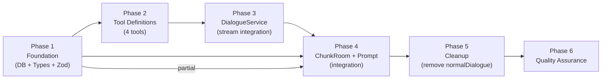
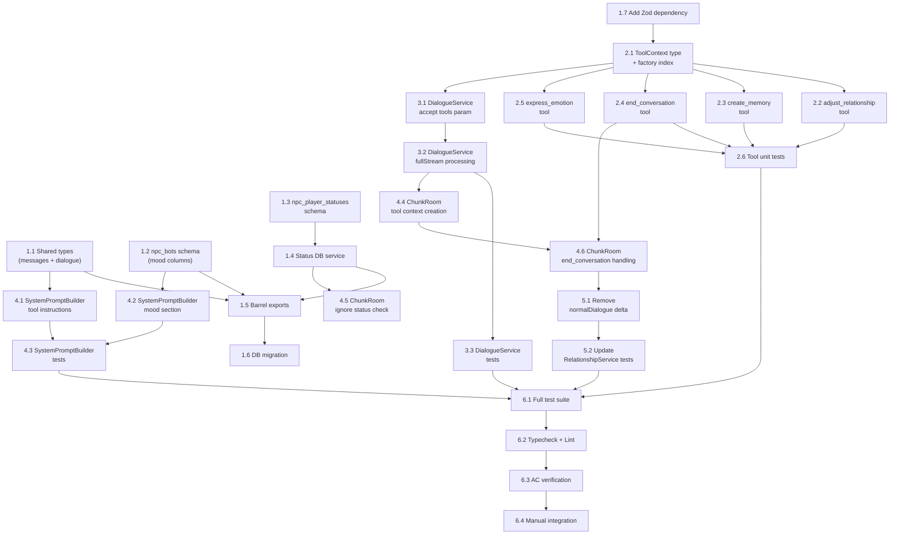

# Work Plan: NPC AI Tools Implementation

Created Date: 2026-03-15
Updated Date: 2026-03-15
Type: feature
Estimated Duration: 4-6 days
Estimated Impact: 14 files (6 new, 8 modified)
Related Issue/PR: N/A

## Change History

| Date | Reason | Changes |
|------|--------|---------|
| 2026-03-15 | Design Doc updated: personality-driven tool instructions added (AC-1 new criterion, buildToolInstructionsSection references persona.traits) | Updated Task 4.1 (personality-driven behavior guidance in tool instructions), Task 4.3 (personality trait tests), Phase 4 AC coverage and completion criteria, AC-to-Phase mapping (AC-1 now includes 4.1), Phase 6 AC-1 verification (personality criterion), Phase 6 manual integration step 15 (forgiving vs distrustful comparison), new risk (LLM ignoring personality calibration), Phase 6 operational verification point 6 (personality calibration), Quality Assurance Checklist (personality items), Notes (personality-driven approach details) |

## Related Documents
- Design Doc: [docs/design/design-025-npc-ai-tools.md](../design/design-025-npc-ai-tools.md)
- ADR-0014: AI Dialogue OpenAI SDK
- ADR-0015: NPC Prompt Architecture
- ADR-0017: NPC AI Tools and Mood System

## Objective

Enable NPCs to autonomously update game state during dialogue by providing AI SDK tools to the LLM via `streamText()`. Replace the fixed +2 relationship delta with dynamic, AI-driven scoring through four tools (`adjust_relationship`, `create_memory`, `end_conversation`, `express_emotion`). Introduce NPC mood persistence and status effects (ignore) with behavioral consequences.

## Background

Currently, relationship scoring is a fixed +2 delta applied unconditionally in `handleDialogueEnd()`. NPCs cannot react to player behavior with actions beyond text. There is no emotional persistence across conversations and no mechanism to block dialogue based on NPC-player status. This feature addresses all four gaps by introducing LLM tool use, mood columns, and status effects.

## Implementation Approach

**Selected**: Vertical Slice (Feature-driven) per Design Doc.

Each phase delivers a testable vertical: (1) DB + types enable persistence, (2) tool definitions are self-contained units, (3) DialogueService wiring makes tools executable, (4) ChunkRoom + prompt integration makes it live, (5) normalDialogue removal completes the transition, (6) QA validates everything end-to-end.

**Strategy**: Implementation-First Development (Strategy B) -- no test skeleton files provided.

## Phase Structure Diagram

## Task Dependency Diagram

## Risks and Countermeasures

### Technical Risks

- **Risk**: LLM over-uses `adjust_relationship` on every dialogue turn
  - **Impact**: Relationship scores change too rapidly, undermining progression pacing
  - **Countermeasure**: Russian-language prompt instructs "only significant moments"; per-turn cumulative delta cap (-10/+5) enforced in execute function; monitor call frequency via logging
  - **Detection**: Review tool execution logs in dev environment

- **Risk**: Mid-stream tool execution DB failure crashes the text stream
  - **Impact**: Player sees incomplete/broken dialogue response
  - **Countermeasure**: All tool execute functions wrap operations in try/catch, return error string to LLM, never throw; follows existing fire-and-forget pattern
  - **Detection**: Unit tests verify execute returns string on simulated DB failure

- **Risk**: Token budget exceeded with tool definitions (~200 tokens added)
  - **Impact**: NPC responses truncated or system prompt too large for model context
  - **Countermeasure**: Tool schemas are compact (Zod); current budget has margin; monitor total prompt size via `estimateTokens()`
  - **Detection**: Log prompt token estimate in dev

- **Risk**: Mood decay math produces unexpected values (NaN, negative intensity)
  - **Impact**: Invalid mood state in prompt, confusing NPC behavior
  - **Countermeasure**: Clamp intensity to [0, 10]; reset mood to null when decayed intensity < 1; unit test boundary conditions
  - **Detection**: Unit tests for decay edge cases (zero elapsed, very large elapsed, null timestamp)

- **Risk**: LLM ignores personality-driven calibration guidance in tool instructions
  - **Impact**: All NPCs react identically regardless of personality traits (forgiving NPC penalizes as harshly as distrustful NPC)
  - **Countermeasure**: Tool instructions include explicit archetype examples with concrete ranges ("отходчивый: -1..-3 за грубость", "злопамятный: -4..-7"); the "ВАЖНО" block is placed prominently before individual tool descriptions; `buildIdentitySection()` already renders the NPC's actual traits earlier in the prompt, so the LLM has full context. Monitor tool call deltas across different NPC archetypes in dev.
  - **Detection**: Manual integration test (Phase 6 step 15): compare tool call behavior between forgiving and distrustful NPCs given identical offensive player messages

- **Risk**: `end_conversation` tool races with concurrent tool calls in same LLM response
  - **Impact**: Session torn down while other tools still writing to DB
  - **Countermeasure**: Deferred processing -- `end_conversation` sets `endRequested` flag on ToolContext; actual session cleanup occurs only after all tools in current stream iteration complete (F004 pattern from Design Doc)
  - **Detection**: Integration test with multiple tools in single response

### Schedule Risks

- **Risk**: Phase 4 (ChunkRoom + Prompt integration) is the largest and most complex phase
  - **Impact**: May take longer than estimated due to multiple integration points
  - **Countermeasure**: Phase 4 is decomposed into 6 atomic tasks; each can be verified independently; status check (4.5) is independent of tool context (4.4)

## Implementation Phases

### Phase 1: Foundation (DB + Types + Zod) (Estimated commits: 2-3)

**Purpose**: Establish all type contracts, database schema changes (mood columns, status effects table), DB services, Zod dependency, and barrel exports. After this phase, the data model is complete and ready for tool definitions.

**AC Coverage**: AC-3 (status effects schema), AC-5 (mood columns), AC-6 (resilience infrastructure)

#### Tasks

- [x] **1.1**: Extend shared types -- add `DIALOGUE_SCORE_CHANGE` and `DIALOGUE_EMOTION` to `ServerMessage` in `packages/shared/src/types/messages.ts`; add `DialogueScoreChangePayload` and `DialogueEmotionPayload` interfaces to `packages/shared/src/types/dialogue.ts`
  - Completion: New message types added without changing existing entries; new payload types compile with strict mode
  - AC: AC-1 (score change notification type), AC-4 (emotion notification type)

- [x] **1.2**: Extend `npc_bots` schema in `packages/db/src/schema/npc-bots.ts` -- add three nullable columns: `mood` (varchar(32), null = neutral), `moodIntensity` (smallint, default 0, range 0-10), `moodUpdatedAt` (timestamp with timezone, nullable)
  - Completion: Schema compiles; existing NpcBot/NewNpcBot types updated; columns nullable so no data migration needed
  - AC: AC-5 (mood persistence columns)

- [x] **1.3**: Create DB schema `packages/db/src/schema/npc-player-statuses.ts` with `npcPlayerStatuses` pgTable -- uuid PK, botId FK (cascade to npc_bots), userId FK (cascade to users), status varchar(32) NOT NULL, reason text nullable, expiresAt timestamp with timezone NOT NULL, createdAt/updatedAt timestamps; composite index on (botId, userId, status)
  - Completion: Schema follows existing pgTable patterns; `$inferSelect`/`$inferInsert` types exported
  - AC: AC-3 (status effects table)

- [x] **1.4**: Create DB service `packages/db/src/services/npc-player-status.ts` with functions: `hasActiveStatus(db, botId, userId, statusType)` returns boolean (WHERE expiresAt > NOW()), `createPlayerStatus(db, botId, userId, status, reason, durationMinutes)` inserts row with computed expiresAt, `cleanupExpiredStatuses(db)` deletes expired rows
  - Completion: Functions follow `fn(db: DrizzleClient, ...)` pattern; `hasActiveStatus` returns false on query error (fail-open per Design Doc)
  - Dependencies: Task 1.3
  - AC: AC-3 (status check, status creation)

- [x] **1.5**: Update barrel exports -- `packages/db/src/schema/index.ts` (add npcPlayerStatuses), `packages/db/src/index.ts` (add status service exports), `packages/shared/src/index.ts` (add new payload type exports)
  - Completion: All new types and services importable via package root
  - Dependencies: Tasks 1.1, 1.2, 1.3, 1.4

- [x] **1.6**: Generate DB migration via `pnpm drizzle-kit generate` for mood columns on npc_bots and new npc_player_statuses table
  - Completion: Migration SQL adds 3 columns to npc_bots and creates npc_player_statuses table with index
  - Dependencies: Task 1.5

- [x] **1.7**: Add Zod dependency to `apps/server` -- `pnpm add zod --filter @nookstead/server`
  - Completion: `zod` appears in apps/server/package.json dependencies; imports resolve

- [x] Quality check: `pnpm nx typecheck db` and `pnpm nx typecheck shared` pass with zero errors

#### Phase Completion Criteria

- [x] ServerMessage includes `DIALOGUE_SCORE_CHANGE` and `DIALOGUE_EMOTION` entries
- [x] DialogueScoreChangePayload and DialogueEmotionPayload types compile under strict TypeScript
- [x] npc_bots schema has mood, moodIntensity, moodUpdatedAt columns (all nullable)
- [x] npc_player_statuses schema has correct columns, FKs, and composite index
- [x] hasActiveStatus returns boolean; createPlayerStatus creates row with computed expiry
- [x] Zod is installed in apps/server
- [x] Migration generated successfully
- [x] All barrel exports updated

#### Operational Verification Procedures

1. Run `pnpm nx typecheck shared` -- verify zero errors
2. Run `pnpm nx typecheck db` -- verify zero errors
3. Import `DialogueScoreChangePayload`, `DialogueEmotionPayload` from `@nookstead/shared` in a scratch file -- verify types resolve
4. Import `hasActiveStatus`, `createPlayerStatus` from `@nookstead/db` -- verify functions exist
5. Verify migration SQL contains `ALTER TABLE npc_bots ADD COLUMN mood` and `CREATE TABLE npc_player_statuses` with composite index
6. Run `node -e "require('zod')"` in apps/server context -- verify Zod resolves

---

### Phase 2: Tool Definitions (Estimated commits: 2-3)

**Purpose**: Create all 4 AI tool definitions with Zod schemas and execute functions, plus the shared ToolContext type and tool factory. After this phase, all tools are self-contained, testable units with mock-able dependencies.

**AC Coverage**: AC-1 (adjust_relationship), AC-2 (create_memory), AC-3 (end_conversation), AC-4 (express_emotion), AC-5 (mood update in adjust_relationship), AC-6 (resilience in execute functions)

#### Tasks

- [x] **2.1**: Create `apps/server/src/npc-service/ai/tools/index.ts` -- define `ToolContext` interface (db, botId, userId, playerName, sendToClient, endConversation, persona, cumulativeDelta, endRequested); export `createNpcTools(context: ToolContext)` factory function that returns a tools map for AI SDK `streamText()`
  - Completion: ToolContext interface matches Design Doc contract exactly; factory returns Record with all 4 tool keys
  - AC: AC-6 (tool infrastructure)

- [x] **2.2**: Create `apps/server/src/npc-service/ai/tools/adjust-relationship.ts` -- Zod schema: `{ delta: z.number().int().min(-7).max(3), reason: z.string().max(200) }`; execute function: check per-turn cumulative delta cap (-10/+5), call `adjustRelationshipScore()`, call `evaluateProgression()`, update mood on npc_bots (derive mood direction from delta sign/magnitude), send `DIALOGUE_SCORE_CHANGE` to client via `sendToClient`, update `context.cumulativeDelta`; wrap all in try/catch, return result string to LLM, never throw
  - Completion: Execute handles DB error gracefully (returns error string); cumulative cap enforced; mood updated proportionally
  - Dependencies: Task 2.1
  - AC: AC-1 (score adjustment, asymmetric range, client notification), AC-5 (mood update)

- [x] **2.3**: Create `apps/server/src/npc-service/ai/tools/create-memory.ts` -- Zod schema: `{ content: z.string().min(1).max(500), importance: z.number().int().min(1).max(10) }`; execute function: call `createMemory()` from DB service with type='tool', link to current dialogue session; wrap in try/catch, return confirmation string to LLM
  - Completion: Memory created with correct fields; errors return string to LLM
  - Dependencies: Task 2.1
  - AC: AC-2 (memory creation, importance validation)

- [x] **2.4**: Create `apps/server/src/npc-service/ai/tools/end-conversation.ts` -- Zod schema: `{ reason: z.string().min(1).max(200), setIgnore: z.boolean().optional().default(false), ignoreDurationMinutes: z.number().int().min(5).max(1440).optional().default(60) }`; execute function: set `context.endRequested = true` (deferred processing, F004), if setIgnore create status via `createPlayerStatus()`, return farewell string to LLM; wrap in try/catch
  - Completion: End flag set but session NOT torn down in execute (deferred); ignore status created when requested
  - Dependencies: Task 2.1
  - AC: AC-3 (conversation end, ignore status creation, duration clamping)

- [x] **2.5**: Create `apps/server/src/npc-service/ai/tools/express-emotion.ts` -- Zod schema: `{ emotion: z.enum(['happy', 'sad', 'angry', 'surprised', 'disgusted', 'fearful', 'neutral', 'amused', 'grateful', 'annoyed', 'shy', 'proud']), intensity: z.number().int().min(1).max(5) }`; execute function: send `DIALOGUE_EMOTION` to client via `sendToClient`, return confirmation string to LLM
  - Completion: All 12 emotions defined; message sent to client; no DB writes
  - Dependencies: Task 2.1
  - AC: AC-4 (emotion expression, intensity validation)

- [x] **2.6**: Create `apps/server/src/npc-service/ai/tools/__tests__/tools.spec.ts` -- unit tests covering: each tool's Zod schema (valid/invalid inputs), each execute function with mock ToolContext (verify correct service calls, verify return strings, verify error handling), cumulative delta cap enforcement on adjust_relationship, deferred end flag on end_conversation, all 12 emotion enum values on express_emotion
  - Completion: All tool behaviors tested in isolation; mock DB used; AAA pattern
  - Dependencies: Tasks 2.2, 2.3, 2.4, 2.5
  - AC: AC-1 through AC-6 (tool-level verification)

- [x] Quality check: `pnpm nx test server --testFile=tools.spec.ts` passes; `pnpm nx typecheck server` passes

#### Phase Completion Criteria

- [x] ToolContext interface matches Design Doc contract (db, botId, userId, playerName, sendToClient, endConversation, persona, cumulativeDelta, endRequested)
- [x] createNpcTools returns a tools map with 4 entries (adjust_relationship, create_memory, end_conversation, express_emotion)
- [x] Each tool has Zod schema matching Design Doc ranges exactly
- [x] adjust_relationship: cumulative delta cap (-10/+5) enforced; mood updated; DIALOGUE_SCORE_CHANGE sent
- [x] create_memory: memory created with type='tool'; importance validated
- [x] end_conversation: sets endRequested flag (deferred); creates ignore status when setIgnore=true
- [x] express_emotion: DIALOGUE_EMOTION sent; all 12 emotions supported
- [x] All execute functions catch errors and return strings (never throw)
- [x] All Phase 2 unit tests pass

#### Operational Verification Procedures

1. Run `pnpm nx test server --testFile=tools.spec.ts` -- all tests GREEN
2. Verify Zod schema rejects delta=4 for adjust_relationship (max is 3)
3. Verify Zod schema rejects delta=-8 for adjust_relationship (min is -7)
4. Verify Zod schema rejects importance=0 for create_memory (min is 1)
5. Verify Zod schema rejects ignoreDurationMinutes=4 for end_conversation (min is 5)
6. Verify execute functions return string result (not void, not throw) on simulated DB error
7. Verify cumulative delta tracking: two calls with delta=3 each should succeed (cumulative 6 <= 5 cap? No -- cap is +5, so second call should return error string). Verify the second call is rejected.

---

### Phase 3: DialogueService Integration (Estimated commits: 1-2)

**Purpose**: Modify DialogueService to accept tools parameter and process `fullStream` instead of `textStream`, routing tool-call chunks to execute functions while continuing to yield text chunks. After this phase, the streaming pipeline supports tool execution.

**AC Coverage**: AC-1 (tool call processing), AC-6 (stream resilience)

#### Tasks

- [x] **3.1**: Extend `StreamResponseParams` in `apps/server/src/npc-service/ai/DialogueService.ts` -- add optional `tools` field (type: Record<string, Tool> from AI SDK); pass tools to `streamText()` call alongside existing parameters
  - Completion: Backward compatible -- when tools is undefined, streamText works as before
  - Dependencies: Task 2.1
  - AC: AC-6 (backward compatibility)
  - Note: AI SDK exports `Tool` (not `CoreTool`). Used conditional spread to avoid passing undefined.

- [x] **3.2**: Modify stream processing in DialogueService -- switch from `result.textStream` to `result.fullStream`; in the async loop, handle chunks by type: `text-delta` yields the text string via `chunk.text` (existing behavior), `tool-call` chunks are logged (execution happens automatically via AI SDK's tool execute functions)
  - Completion: Text streaming unchanged for callers; tool execution happens via AI SDK callbacks; fullStream correctly routes both chunk types
  - Dependencies: Task 3.1
  - AC: AC-1 (tool calls processed mid-stream), AC-6 (text streaming continues during tool execution)
  - Note: AI SDK v6 uses `chunk.text` (not `chunk.textDelta`) for text-delta chunks in fullStream.

- [x] **3.3**: Extend DialogueService tests in `apps/server/src/npc-service/ai/__tests__/DialogueService.spec.ts` -- updated all existing mocks from textStream to fullStream; added 3 new tests: no-tools regression, tools forwarding, mixed chunk handling with console.log spy
  - Completion: Both with-tools and without-tools paths tested; existing tests still pass; 12 total tests GREEN
  - Dependencies: Tasks 3.1, 3.2

- [x] Quality check: `pnpm nx test server --testFile=DialogueService.spec.ts` passes; `pnpm nx typecheck server` passes

#### Phase Completion Criteria

- [x] DialogueService accepts optional tools parameter
- [x] streamText receives tools when provided
- [x] fullStream used instead of textStream; text-delta chunks yielded as strings
- [x] Tool execute functions invoked by AI SDK during streaming
- [x] Backward compatible: existing dialogues without tools work unchanged
- [x] Existing DialogueService tests pass (no regressions)
- [x] New tests cover tool forwarding and mixed chunk handling

#### Operational Verification Procedures

**Integration Point 1: Tool Infrastructure -> DialogueService**
1. Unit test: call streamResponse without tools parameter -- verify text chunks yielded normally
2. Unit test: call streamResponse with mock tools -- verify tools forwarded to streamText call
3. Unit test: mock fullStream to emit text-delta and tool-call chunks -- verify text-delta yielded, tool-call logged

---

### Phase 4: ChunkRoom + SystemPromptBuilder Integration (Estimated commits: 3-4)

**Purpose**: Wire all server components together: create ToolContext in ChunkRoom, add ignore status check to handleNpcInteract, handle deferred end_conversation, extend SystemPromptBuilder with tool instructions (including personality-driven behavior guidance) and mood sections. After this phase, the feature is fully functional on the server side.

**AC Coverage**: AC-1 (end-to-end scoring, personality-calibrated tool instructions), AC-3 (ignore status gate, deferred end), AC-5 (mood in prompt), AC-6 (resilience)

#### Tasks

- [ ] **4.1**: Add `buildToolInstructionsSection()` to `SystemPromptBuilder.ts` -- returns the Russian-language tool usage instructions text from Design Doc section "Prompt Engineering". The function receives `PromptContext` (or at minimum `persona.traits` and `persona.personality`) and includes personality-driven behavior guidance: each tool description contains character-dependent guidelines (e.g., forgiving NPC = small penalties `-1..-3`, distrustful NPC = large penalties `-4..-7`, reserved NPC = low emotion intensity `1-2`, emotional NPC = high intensity `3-5`). The "ВАЖНО" block instructs the LLM to calibrate reaction intensity based on character traits. Note: `buildIdentitySection()` already renders the NPC's actual trait list via `capTraits()`, so this section references "свой характер" knowing traits are visible earlier in the prompt -- no trait duplication needed. Add to `buildSystemPrompt()` sections array between Memory and Guardrails sections.
  - Completion: Prompt includes "ИНСТРУМЕНТЫ" section with all 4 tool descriptions in Russian; "ВАЖНО" block includes personality-driven calibration guidance (forgiving/distrustful/hot-tempered/proud archetypes); each tool has character-dependent usage guidelines
  - Dependencies: Task 1.1
  - AC: AC-1 (personality traits referenced in tool instructions), AC-5 (tool instructions in prompt)

- [ ] **4.2**: Add `buildMoodSection(mood, moodIntensity, moodUpdatedAt)` to `SystemPromptBuilder.ts` -- compute decayed intensity using half-life formula: `decayedIntensity = storedIntensity * 2^(-elapsedHours / halfLifeHours)`; if decayed intensity < 1, return empty string (neutral); otherwise return Russian text describing NPC's current mood and intensity tier. Add `mood`, `moodIntensity`, `moodUpdatedAt` as optional fields on `PromptContext`. Add mood section to `buildSystemPrompt()` sections array after Relationship section.
  - Completion: Mood section appears when mood is non-null and intensity > 0 after decay; pure function with no side effects
  - Dependencies: Task 1.2
  - AC: AC-5 (mood in prompt, lazy decay)

- [ ] **4.3**: Extend SystemPromptBuilder tests in `apps/server/src/npc-service/ai/__tests__/SystemPromptBuilder.spec.ts` -- test: buildToolInstructionsSection returns Russian text containing all 4 tool names; buildToolInstructionsSection includes personality-driven "ВАЖНО" block with character archetype guidance (forgiving/distrustful/hot-tempered/proud); buildToolInstructionsSection references "свой характер" (relies on traits visible from identity section); each tool description contains character-dependent guidelines (e.g., adjust_relationship mentions penalty ranges varying by character, express_emotion mentions intensity varying by character, end_conversation mentions ignore duration varying by character); buildMoodSection with null mood returns empty; buildMoodSection with recent mood returns mood text; buildMoodSection with old mood (decayed below threshold) returns empty; buildSystemPrompt includes tool instructions and mood sections in correct order
  - Completion: All new sections tested; personality-driven guidance verified in tool instructions; section ordering verified
  - Dependencies: Tasks 4.1, 4.2

- [ ] **4.4**: Extend `ChunkRoom.handleDialogueMessage()` -- create `ToolContext` object with db, botId, userId, playerName, sendToClient (wrapping `client.send()`), endConversation callback, persona, cumulativeDelta=0, endRequested=false; pass tools (via `createNpcTools(toolContext)`) to `dialogueService.streamResponse()`; after stream completes, check `toolContext.endRequested` and if true, call `handleDialogueEnd(client, 'npc_end')`. Load NPC mood from npc_bots at dialogue start and include in PromptContext.
  - Completion: Tool context created per dialogue turn; tools passed to streamResponse; deferred end handled after stream completes; mood loaded and included in prompt
  - Dependencies: Tasks 2.1, 3.2
  - AC: AC-1 (end-to-end tool execution), AC-3 (deferred end), AC-5 (mood in prompt context)

- [ ] **4.5**: Extend `ChunkRoom.handleNpcInteract()` -- before `botManager.startInteraction()`, call `hasActiveStatus(db, botId, userId, 'ignore')`; if true, send error message to client with descriptive text (e.g., "NPC is ignoring you") and return early; if status query fails, log warning and allow interaction (fail-open per Design Doc)
  - Completion: Interaction blocked when active ignore status exists; fail-open on query error
  - Dependencies: Task 1.4
  - AC: AC-3 (ignore status gate, fail-open)

- [ ] **4.6**: Handle `end_conversation` deferred processing -- after all tool executions complete in handleDialogueMessage stream loop, check `toolContext.endRequested`; if true, trigger `handleDialogueEnd(client, 'npc_end')`; ensure this happens AFTER the last text chunk is sent to the client so the player sees the NPC's farewell text before dialogue closes
  - Completion: Session ends only after stream completes; farewell text delivered before close; progression evaluated at end
  - Dependencies: Tasks 2.4, 4.4
  - AC: AC-3 (deferred end, ordering guarantee)

- [ ] Quality check: `pnpm nx typecheck server` passes; existing ChunkRoom tests still pass; SystemPromptBuilder tests pass

#### Phase Completion Criteria

- [ ] SystemPromptBuilder produces tool instructions section in Russian with all 4 tool descriptions
- [ ] Tool instructions include personality-driven "ВАЖНО" block with character archetype guidance (forgiving = small penalties, distrustful = large penalties, hot-tempered = sharp reactions, proud = remembers insults longer)
- [ ] Each tool description includes character-dependent guidelines (adjust_relationship penalty/bonus ranges, express_emotion intensity ranges, end_conversation ignore duration ranges all vary by NPC personality)
- [ ] Tool instructions reference "свой характер" to connect with identity section traits (no duplication of trait list)
- [ ] Mood section appears in prompt when NPC has non-neutral mood (after decay computation)
- [ ] Mood decay formula produces correct values (verified by unit tests)
- [ ] ToolContext created correctly in handleDialogueMessage with all required fields
- [ ] Tools passed to streamResponse via createNpcTools factory
- [ ] Ignore status check blocks interaction when active status exists
- [ ] Ignore status check fails open on DB query error
- [ ] Deferred end_conversation fires after stream completes (farewell text delivered first)
- [ ] All existing server tests pass (no regressions)

#### Operational Verification Procedures

**Integration Point 2: DialogueService -> ChunkRoom**
1. Start dialogue with an NPC via NPC_INTERACT message
2. Send DIALOGUE_MESSAGE -- verify tool context is created and tools passed to streamResponse
3. If LLM calls adjust_relationship -- verify DIALOGUE_SCORE_CHANGE sent to client with delta, newScore, reason, newSocialType
4. If LLM calls express_emotion -- verify DIALOGUE_EMOTION sent to client with emotion and intensity

**Integration Point 3: Status Effects -> handleNpcInteract**
1. Create an active ignore status row in npc_player_statuses for a bot-user pair
2. Attempt NPC_INTERACT for that pair -- verify interaction rejected with descriptive error message
3. Wait for status to expire (or delete row) -- verify interaction succeeds
4. Simulate DB query failure -- verify interaction allowed (fail-open)

**Integration Point 4: Personality Traits -> Tool Instructions**
1. Build tool instructions for an NPC with traits ["добродушный", "отходчивый"] -- verify output contains "ВАЖНО" block with character-dependent calibration guidance
2. Verify adjust_relationship section references penalty ranges varying by character (forgiving vs vindictive)
3. Verify express_emotion section references intensity ranges varying by character (reserved vs emotional)
4. Verify end_conversation section references ignore duration varying by character (forgiving vs grudge-holding)
5. Verify tool instructions reference "свой характер" (traits are visible from earlier identity section, no duplication)

**Integration Point 5: Mood -> SystemPromptBuilder**
1. Set mood='angry', moodIntensity=8, moodUpdatedAt=now on an NPC
2. Start dialogue -- verify system prompt contains mood description in Russian
3. Set moodUpdatedAt to 6 hours ago with halfLife=2 -- verify mood decayed to ~1 (8 * 2^(-6/2) = 1.0), borderline
4. Set moodUpdatedAt to 12 hours ago -- verify mood decayed below 1, prompt contains no mood section

**Integration Point: end_conversation Deferred Processing**
1. Trigger a dialogue where LLM calls end_conversation
2. Verify NPC's farewell text is delivered to client BEFORE DIALOGUE_END_TURN
3. Verify dialogue session is cleaned up after text delivery
4. Verify relationship progression evaluated at dialogue end

---

### Phase 5: Cleanup -- Remove normalDialogue Delta (Estimated commits: 1)

**Purpose**: Remove the fixed +2 normalDialogue score delta from `handleDialogueEnd()` and the `SCORE_DELTAS.normalDialogue` constant. This must be the last functional change to avoid a gap where neither fixed nor tool-based scoring is active. After this phase, all relationship scoring is exclusively tool-driven.

**AC Coverage**: AC-1 (normalDialogue removed)

#### Tasks

- [ ] **5.1**: Remove normalDialogue delta from `ChunkRoom.handleDialogueEnd()` -- delete the code block at ~line 971-988 that applies `SCORE_DELTAS.normalDialogue` to relationship score; retain progression evaluation (`evaluateProgression`) which is still needed (tools may have changed the score during dialogue, progression should still be checked at end); remove `normalDialogue` from `SCORE_DELTAS` constant in `RelationshipService.ts`
  - Completion: No fixed score delta applied at dialogue end; progression evaluation retained; SCORE_DELTAS has only `hire` and `dismiss` entries
  - Dependencies: Task 4.4 (tool-based scoring verified working)
  - AC: AC-1 (normalDialogue removed)

- [ ] **5.2**: Update RelationshipService tests in `RelationshipService.spec.ts` -- update test for `SCORE_DELTAS` constant (remove normalDialogue assertion); verify existing hire/dismiss delta tests still pass; add test verifying normalDialogue is not in SCORE_DELTAS
  - Completion: All RelationshipService tests pass; no reference to normalDialogue remains
  - Dependencies: Task 5.1

- [ ] Quality check: `pnpm nx test server` passes; `pnpm nx typecheck server` passes

#### Phase Completion Criteria

- [ ] `SCORE_DELTAS` object no longer contains `normalDialogue` key
- [ ] `handleDialogueEnd()` does not apply any fixed score delta
- [ ] Progression evaluation still runs at dialogue end (evaluateProgression call retained)
- [ ] All existing tests pass (updated where needed)
- [ ] No references to `normalDialogue` remain in codebase

#### Operational Verification Procedures

1. Run `pnpm nx test server --testFile=RelationshipService.spec.ts` -- all tests GREEN
2. Search codebase for `normalDialogue` -- verify zero references
3. Start and end a dialogue without any tool calls -- verify relationship score unchanged (no +2 applied)
4. Start and end a dialogue where LLM calls adjust_relationship with delta=+2 -- verify score increases by exactly 2 (tool-based, not fixed)

---

### Phase 6: Quality Assurance (Required) (Estimated commits: 1)

**Purpose**: Overall quality assurance, Design Doc consistency verification, comprehensive test execution, and manual verification of all integration points.

**AC Coverage**: All ACs (AC-1 through AC-6) verified

#### Tasks

- [ ] **6.1**: Run full test suite -- all existing tests pass (no regressions); tool tests pass; DialogueService tests pass; SystemPromptBuilder tests pass; RelationshipService tests pass
  - Completion: Zero test failures across all packages

- [ ] **6.2**: Run typecheck and lint across all packages -- `pnpm nx run-many -t typecheck` with zero errors; `pnpm nx run-many -t lint` with zero errors
  - Completion: Zero TypeScript errors; zero ESLint errors; no module boundary violations

- [ ] **6.3**: Verify all Design Doc acceptance criteria achieved:
  - [ ] AC-1: adjust_relationship tool works with delta in [-7, +3]; Zod rejects out-of-range; score clamped to [-50, 100]; DIALOGUE_SCORE_CHANGE sent to client; normalDialogue removed; tool instructions reference NPC personality traits so LLM calibrates reaction intensity (forgiving NPC = small penalties, distrustful = large penalties, etc.)
  - [ ] AC-2: create_memory tool creates NPC memory with content and importance; Zod rejects importance outside [1, 10]; memory linked to dialogue session
  - [ ] AC-3: end_conversation tool ends dialogue session; ignore status created when setIgnore=true with correct expiry; player blocked from interaction during active ignore; dialogue end is deferred until after all tools complete
  - [ ] AC-4: express_emotion tool sends DIALOGUE_EMOTION to client with emotion and intensity; Zod rejects intensity outside [1, 5]; all 12 emotions supported
  - [ ] AC-5: NPC mood updated by adjust_relationship; mood persists in npc_bots table; mood included in system prompt for all players; mood decays toward neutral via half-life; mood restored from DB on server restart
  - [ ] AC-6: Tool execution DB failures logged and swallowed (stream continues); invalid tool arguments return validation error to LLM; cumulative delta cap enforced per turn

- [ ] **6.4**: Manual integration verification -- walk through complete player journey:
  1. Start dialogue with new NPC (relationship exists from earlier feature)
  2. Send a kind message -- verify LLM may call adjust_relationship with positive delta
  3. Verify DIALOGUE_SCORE_CHANGE received by client with correct payload
  4. Send an offensive message -- verify LLM may call adjust_relationship with negative delta
  5. Verify mood updated on NPC (check npc_bots table)
  6. Start new dialogue with same NPC -- verify mood appears in system prompt
  7. Offend NPC severely -- verify LLM calls end_conversation with setIgnore=true
  8. Verify DIALOGUE_END_TURN received after farewell text
  9. Attempt new dialogue -- verify interaction blocked (ignore status active)
  10. Wait for ignore to expire (or manually expire) -- verify interaction succeeds
  11. Send message that triggers create_memory -- verify memory in npc_memories table
  12. Verify no fixed +2 delta at dialogue end
  13. Verify express_emotion sends DIALOGUE_EMOTION to client
  14. Verify per-turn cumulative delta cap works (rapid adjust_relationship calls in one turn)
  15. Compare behavior of a forgiving NPC vs a distrustful NPC: offend both equally and verify the forgiving NPC applies smaller negative deltas and shorter ignore durations, while the distrustful NPC applies larger negative deltas and longer ignore durations (personality-calibrated tool use)

#### Phase Completion Criteria

- [ ] All tests pass across all packages
- [ ] Zero TypeScript errors
- [ ] Zero ESLint errors
- [ ] All 6 acceptance criteria verified
- [ ] Manual integration walkthrough completed successfully
- [ ] No regressions in existing functionality (dialogue, relationship actions, memory stream, admin panel)

#### Operational Verification Procedures

(Copied from Design Doc integration points)

1. **Tool Execution Chain**: Send DIALOGUE_MESSAGE -> LLM calls tool -> tool execute runs -> DB updated -> client notified (DIALOGUE_SCORE_CHANGE or DIALOGUE_EMOTION) -> text streaming continues
2. **Ignore Status Gate**: end_conversation with setIgnore -> status row created -> next NPC_INTERACT blocked -> expiry reached -> interaction allowed
3. **Mood Persistence**: adjust_relationship with negative delta -> mood set to angry/annoyed -> start new dialogue -> prompt includes mood -> time passes -> mood decays toward neutral
4. **Deferred End**: LLM calls end_conversation + adjust_relationship in same response -> adjust_relationship executes first -> end_conversation sets flag -> after stream completes, session ends -> farewell text delivered before close
5. **No Fixed Delta**: Dialogue ends without tool calls -> relationship score unchanged (no +2)
6. **Personality Calibration**: Forgiving NPC receives insult -> LLM calls adjust_relationship with small negative delta (-1..-3) and express_emotion with low intensity (1-2); Distrustful NPC receives same insult -> LLM calls adjust_relationship with large negative delta (-4..-7) and may call end_conversation with longer ignore duration. Tool instructions guide this behavior via character archetype examples.
7. **Resilience**: Simulate DB failure during tool execute -> error logged -> error string returned to LLM -> text streaming continues without interruption

---

## Acceptance Criteria to Phase Mapping

| AC | Description | Phase | Tasks |
|----|-------------|-------|-------|
| AC-1 | Tool-based relationship scoring (adjust_relationship, no normalDialogue, personality-calibrated tool instructions) | Phase 2, Phase 4, Phase 5 | 2.2, 4.1, 4.4, 5.1 |
| AC-2 | AI-driven memory creation (create_memory) | Phase 2, Phase 4 | 2.3, 4.4 |
| AC-3 | NPC-initiated conversation end (end_conversation, ignore status) | Phase 1, Phase 2, Phase 4 | 1.3, 1.4, 2.4, 4.5, 4.6 |
| AC-4 | Emotional expression (express_emotion) | Phase 1, Phase 2, Phase 4 | 1.1, 2.5, 4.4 |
| AC-5 | NPC mood persistence (mood columns, prompt, decay) | Phase 1, Phase 2, Phase 4 | 1.2, 2.2, 4.2, 4.4 |
| AC-6 | Tool execution resilience (try/catch, fire-and-forget, validation) | Phase 2, Phase 3 | 2.2-2.5, 3.2 |

## Quality Assurance Checklist

- [ ] Design Doc and acceptance criteria consistency verified
- [ ] 6-phase composition aligned with Design Doc implementation order
- [ ] Phase dependencies correctly mapped (Foundation -> Tools -> DialogueService -> ChunkRoom+Prompt -> Cleanup -> QA)
- [ ] All requirements converted to tasks with correct phase assignment
- [ ] Quality assurance exists in Phase 6
- [ ] E2E verification procedures placed at integration points (Phases 3, 4, 5)
- [ ] Event schema defined for message protocol (DIALOGUE_SCORE_CHANGE, DIALOGUE_EMOTION)
- [ ] Backward compatibility maintained (tools parameter is optional; mood fields are optional)
- [ ] Tool execution resilience verified (try/catch in every execute, cumulative delta cap)
- [ ] Russian-language prompt text matches Design Doc Appendix
- [ ] Tool instructions include personality-driven behavior guidance per Design Doc (character-dependent delta ranges, intensity ranges, ignore durations)
- [ ] buildToolInstructionsSection() references persona traits from PromptContext (no new data flow needed, traits already available)

## Completion Criteria

- [ ] All 6 phases completed
- [ ] Each phase's operational verification procedures executed
- [ ] Design Doc acceptance criteria AC-1 through AC-6 satisfied
- [ ] Staged quality checks completed (zero errors)
- [ ] All tests pass (existing + new)
- [ ] `pnpm nx run-many -t typecheck lint` clean
- [ ] User review approval obtained

## Progress Tracking

### Phase 1: Foundation (DB + Types + Zod)
- Start: ____-__-__ __:__
- Complete: ____-__-__ __:__
- Notes:

### Phase 2: Tool Definitions
- Start: 2026-03-15
- Complete: 2026-03-15
- Notes: AI SDK v6 uses `inputSchema` (not `parameters`) for tool definitions. Tool factory functions return `Tool` type. evaluateProgression imported from RelationshipService (app-level), not from @nookstead/db.

### Phase 3: DialogueService Integration
- Start: 2026-03-15
- Complete: 2026-03-15
- Notes: AI SDK v6 text-delta chunks use `.text` property (not `.textDelta`). Type is `Tool` (not `CoreTool`). Updated existing test mocks from textStream to fullStream. Added 3 new test cases. Updated "6-section prompt" test to not assert exact section count (fragile after tool instructions were added to SystemPromptBuilder).

### Phase 4: ChunkRoom + SystemPromptBuilder Integration
- Start: ____-__-__ __:__
- Complete: ____-__-__ __:__
- Notes:

### Phase 5: Cleanup (Remove normalDialogue)
- Start: ____-__-__ __:__
- Complete: ____-__-__ __:__
- Notes:

### Phase 6: Quality Assurance
- Start: ____-__-__ __:__
- Complete: ____-__-__ __:__
- Notes:

## Notes

- **Strategy B (Implementation-First)**: No test skeletons provided. Tests are created alongside implementation (Phase 2 task 2.6 for tools, Phase 3 task 3.3 for DialogueService, Phase 4 task 4.3 for SystemPromptBuilder, Phase 5 task 5.2 for RelationshipService).
- **Phase ordering follows Design Doc**: The 7-step implementation order from the Design Doc maps to 6 work plan phases: steps 1-2 combine into Phase 1 (Foundation), step 3 is Phase 2 (Tools), step 4 is Phase 3 (DialogueService), steps 5-6 combine into Phase 4 (ChunkRoom + Prompt), step 7 is Phase 5 (Cleanup), with Phase 6 (QA) added per work plan requirements.
- **Russian language**: All prompt text (tool instructions, mood descriptions) is in Russian per existing SystemPromptBuilder conventions and Design Doc prompt section.
- **Fire-and-forget**: Tool execute functions use try/catch with error logging, returning error strings to the LLM. This matches the existing ChunkRoom pattern for non-critical DB writes.
- **Deferred end_conversation (F004)**: The end_conversation tool does NOT tear down the session immediately. It sets `endRequested=true` on the ToolContext. The ChunkRoom checks this flag after the stream completes and handles session cleanup then. This prevents races with concurrent tool executions.
- **Per-turn cumulative delta cap (F005)**: adjust_relationship tracks cumulative delta on the ToolContext per stream iteration. Max cumulative: -10 (negative) / +5 (positive). Exceeding the cap returns an error string to the LLM and skips the DB write.
- **Migration**: Additive only. New columns on npc_bots are nullable. New npc_player_statuses table is created. No existing data affected.
- **Zod dependency**: New to the project. Added to apps/server only. No conflicts expected with AI SDK (which already supports Zod schemas).
- **Backward compatibility**: DialogueService works without tools (parameter is optional). SystemPromptBuilder works without mood (fields are optional). handleNpcInteract works without status check (fail-open on error).
- **Personality-driven tool instructions (Design Doc update)**: The `buildToolInstructionsSection()` includes a "ВАЖНО" block with character archetype guidance. Each tool description contains character-dependent guidelines: `adjust_relationship` penalty/bonus ranges vary by NPC personality (forgiving = -1..-3, vindictive = -4..-7), `express_emotion` intensity varies (reserved = 1-2, emotional = 3-5), `end_conversation` ignore duration varies (forgiving = 5-15 min, grudge-holding = 30-120 min). The function references "свой характер" knowing that `buildIdentitySection()` already renders the NPC's actual traits via `capTraits()` earlier in the prompt. No trait duplication needed. `persona.traits` and `persona.personality` are already available on `PromptContext` -- no new data flow required.
