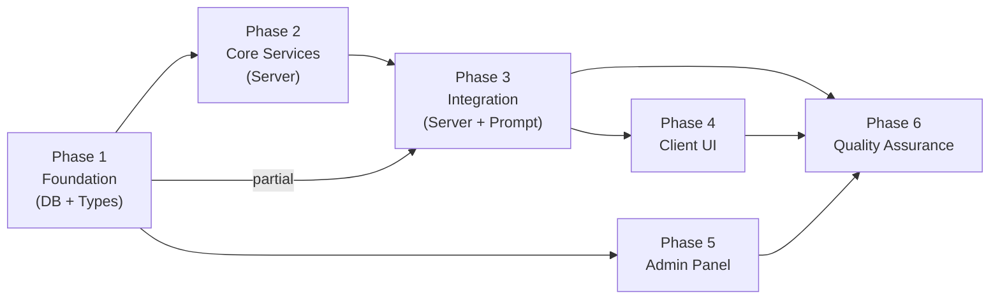
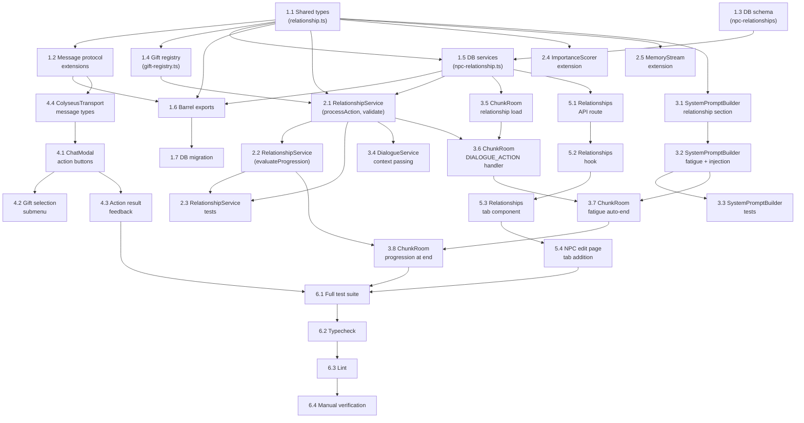

# Work Plan: NPC Relationships & Dialogue Actions Implementation

Created Date: 2026-03-14
Type: feature
Estimated Duration: 4-5 days
Estimated Impact: 17 files (8 new, 9 modified)
Related Issue/PR: N/A

## Related Documents
- Design Doc: [docs/design/design-024-npc-relationships-dialogue-actions.md](../design/design-024-npc-relationships-dialogue-actions.md)
- ADR-0013: NPC Bot Entity Architecture
- ADR-0014: AI Dialogue OpenAI SDK
- ADR-0015: NPC Prompt Architecture

## Objective

Add a composable relationship system between players and NPCs, interactive dialogue actions (give_gift, hire, dismiss, ask_about), an NPC fatigue/busy system, relationship-aware prompt injection, and supporting admin UI. This transforms NPCs from one-dimensional chat partners into entities that remember, react to, and grow with the player.

## Background

Currently NPCs treat every player interaction identically. There is no concept of relationship progression, no actions beyond text chat, and no mechanism to prevent endless conversations. The meeting count in the prompt provides minimal relationship context. This feature addresses all four gaps: relationship state, player agency, dialogue limits, and prompt depth.

## Implementation Approach

**Selected**: Vertical Slice (Feature-driven) per Design Doc.

Each phase delivers a testable vertical of value: (1) DB schema enables persistence, (2) shared types + service enable action processing, (3) ChunkRoom integration makes it live, (4) client UI exposes it to players. The foundation layer is small, so vertical slice overhead is minimal.

**Strategy**: Implementation-First Development (Strategy B) -- no test skeleton files provided.

## Phase Structure Diagram

## Task Dependency Diagram

## Risks and Countermeasures

### Technical Risks

- **Risk**: Prompt injection degrades LLM response quality
  - **Impact**: NPC responses may become incoherent when action injection is added to system prompt
  - **Countermeasure**: Keep injection to 1-2 sentences; test with various persona types; remove injection if quality drops
  - **Detection**: Manual review of NPC responses during Phase 3 verification

- **Risk**: Fatigue auto-end loses in-flight streaming data
  - **Impact**: Player sees incomplete NPC response before dialogue closes
  - **Countermeasure**: Wait for stream completion before triggering auto-end; use AbortController only on explicit close
  - **Detection**: Test with long NPC responses at turn boundary

- **Risk**: Relationship DB writes add latency to action processing
  - **Impact**: Player perceives delay between action and NPC reaction
  - **Countermeasure**: Single UPDATE query; index on (botId, userId); target < 50ms; fire-and-forget for memory creation
  - **Detection**: Console.log timestamps in dev environment

- **Risk**: Score manipulation via rapid gift-giving
  - **Impact**: Player bypasses intended progression pacing
  - **Countermeasure**: Client-side cooldown on gift actions; server tracks last gift timestamp per session

### Schedule Risks

- **Risk**: ChunkRoom integration complexity (Phase 3 is the largest phase)
  - **Impact**: Phase 3 may take longer than estimated due to dialogue flow complexity
  - **Countermeasure**: Phase 3 is decomposed into 8 atomic tasks; each can be verified independently

## Implementation Phases

### Phase 1: Foundation (DB + Types) (Estimated commits: 2-3)

**Purpose**: Establish all type contracts, database schema, gift definitions, and DB service layer. After this phase, the relationship data model is complete and queryable.

**AC Coverage**: AC-1 (persistence), AC-6 (gift definitions)

#### Tasks

- [ ] **1.1**: Create shared types file `packages/shared/src/types/relationship.ts` with RelationshipSocialType, RelationshipData, GiftId, GiftCategory, GiftDefinition, DialogueActionType, DialogueAction, DialogueActionResult, DialogueActionPayload, DialogueActionResultPayload, DialogueStartWithRelationshipPayload
  - Completion: Types compile with strict mode; no `any` types
  - AC: AC-1 (type foundation), AC-3 (action types), AC-6 (gift types)

- [ ] **1.2**: Extend message protocol in `packages/shared/src/types/messages.ts` -- add `DIALOGUE_ACTION` to ClientMessage and `DIALOGUE_ACTION_RESULT` to ServerMessage; extend `packages/shared/src/types/dialogue.ts` with action payload types
  - Completion: Existing message types unchanged; new entries added
  - AC: AC-3 (action protocol)

- [ ] **1.3**: Create DB schema `packages/db/src/schema/npc-relationships.ts` with npcRelationships pgTable -- uuid PK, botId FK (cascade), userId FK (cascade), socialType varchar default 'stranger', isWorker boolean default false, score integer default 0, hiredAt timestamp nullable, createdAt/updatedAt timestamps; UNIQUE(botId, userId) constraint; indexes on (botId, userId) and (botId, socialType)
  - Completion: Schema follows npc-memories pattern; $inferSelect/$inferInsert types exported
  - AC: AC-1 (UNIQUE constraint, default values)

- [ ] **1.4**: Create gift registry `apps/server/src/npc-service/relationships/gift-registry.ts` with GIFT_DEFINITIONS const array (15 gifts, 7 categories), getGift(id), getGiftsByCategory(category) functions per Design Doc Appendix A
  - Completion: All 15 gifts defined; getGift throws on invalid id
  - AC: AC-6 (15 gift types, 7 categories)

- [ ] **1.5**: Create DB service `packages/db/src/services/npc-relationship.ts` with functions: getOrCreateRelationship(db, botId, userId), updateRelationship(db, id, data), listRelationshipsForBot(db, botId, params?) -- all follow `fn(db: DrizzleClient, ...)` pattern
  - Completion: Functions follow npc-memory service pattern; getOrCreateRelationship uses upsert
  - Dependencies: Task 1.3
  - AC: AC-1 (CRUD operations)

- [ ] **1.6**: Update barrel exports -- `packages/db/src/schema/index.ts` (add npcRelationships), `packages/db/src/index.ts` (add relationship service exports), `packages/shared/src/index.ts` (add relationship type exports)
  - Completion: All new types and services importable via package root
  - Dependencies: Tasks 1.1, 1.2, 1.3, 1.5

- [ ] **1.7**: Generate DB migration via `pnpm drizzle-kit generate` for npc_relationships table
  - Completion: Migration SQL creates table with all columns, indexes, and UNIQUE constraint
  - Dependencies: Task 1.6

- [ ] Quality check: `pnpm nx typecheck db` and `pnpm nx typecheck shared` pass with zero errors

#### Phase Completion Criteria

- [ ] All shared types compile under strict TypeScript
- [ ] DB schema matches Design Doc contract exactly (column types, defaults, constraints)
- [ ] 15 gift definitions present with correct scoreBonus and importance values
- [ ] DB service functions follow existing patterns (DrizzleClient first param, error propagation)
- [ ] All barrel exports updated; packages importable from root
- [ ] Migration generated successfully

#### Operational Verification Procedures

1. Run `pnpm nx typecheck shared` -- verify zero errors
2. Run `pnpm nx typecheck db` -- verify zero errors
3. Import `RelationshipSocialType`, `GiftDefinition`, `DialogueAction` from `@nookstead/shared` in a test file -- verify types resolve
4. Import `getOrCreateRelationship` from `@nookstead/db` -- verify function exists
5. Verify migration SQL contains `CREATE TABLE npc_relationships` with UNIQUE constraint

---

### Phase 2: Core Services (Server) (Estimated commits: 2-3)

**Purpose**: Implement RelationshipService business logic (action processing, validation, progression), extend ImportanceScorer for gift-aware scoring, and extend MemoryStream for action memory creation. After this phase, all relationship business logic is testable in isolation.

**AC Coverage**: AC-2 (progression), AC-3 (action processing), AC-6 (gift scoring)

#### Tasks

- [ ] **2.1**: Create `apps/server/src/npc-service/relationships/RelationshipService.ts` with processAction(db, botId, userId, action, relationship) and validateAction(action, relationship) -- action processing for give_gift (lookup gift, update score, generate promptInjection), hire (validate friend+, set isWorker=true), dismiss (validate isWorker, set isWorker=false), ask_about (validate close_friend+, inject topic); returns DialogueActionResult; never throws (returns success=false on error)
  - Completion: All 4 action types handled; validation rejects invalid preconditions
  - Dependencies: Tasks 1.1, 1.4, 1.5
  - AC: AC-3 (all 4 actions), AC-2 (score updates)

- [ ] **2.2**: Add evaluateProgression(relationship) and getAvailableActions(relationship) to RelationshipService -- progression evaluates score against RELATIONSHIP_THRESHOLDS and returns new socialType if threshold crossed; handles rival transition at score < 0; caps at close_friend if NPC lacks 'romanceable' trait; getAvailableActions returns array based on current socialType (stranger: none, acquaintance+: give_gift, friend+: hire, close_friend+: ask_about, worker: dismiss)
  - Completion: All threshold transitions verified; romantic cap enforced
  - Dependencies: Task 2.1
  - AC: AC-2 (threshold transitions, rival path, romantic cap), AC-7 (available actions)

- [ ] **2.3**: Create `apps/server/src/npc-service/relationships/RelationshipService.spec.ts` -- unit tests covering: score increment per action type (normalDialogue +2, hire +3, dismiss -5, each gift's scoreBonus); all 6 threshold transitions; rival transition; romantic cap without romanceable trait; validateAction rejection cases (give_gift as stranger, hire as acquaintance, dismiss when not worker, ask_about as friend); processAction returns correct promptInjection format; getAvailableActions per socialType
  - Completion: All tests pass; covers AC-2 and AC-3 edge cases
  - Dependencies: Tasks 2.1, 2.2

- [ ] **2.4**: Extend ImportanceScorer in `apps/server/src/npc-service/memory/ImportanceScorer.ts` -- add optional `hasGift` and `giftImportance` fields to ImportanceContext; when hasGift is true, return giftImportance value; existing behavior unchanged when fields absent
  - Completion: Backward compatible; existing tests still pass
  - AC: AC-6 (gift importance scoring)

- [ ] **2.5**: Extend MemoryStream in `apps/server/src/npc-service/memory/MemoryStream.ts` -- add createActionMemory function that accepts gift/action context and creates a memory with the gift's memoryTemplate and importance value; fire-and-forget pattern with error logging
  - Completion: Memory created with correct content and importance; errors logged but not propagated
  - AC: AC-6 (gift memory creation), AC-3 (action memory)

- [ ] **2.6**: Create barrel export `apps/server/src/npc-service/relationships/index.ts` exporting RelationshipService functions, gift-registry, and constants (RELATIONSHIP_THRESHOLDS, SCORE_DELTAS, FATIGUE_DEFAULTS)
  - Completion: All relationship module exports accessible from index
  - Dependencies: Tasks 2.1, 2.2

- [ ] Quality check: `pnpm nx test server --testFile=RelationshipService.spec.ts` passes; `pnpm nx typecheck server` passes

#### Phase Completion Criteria

- [ ] RelationshipService handles all 4 action types with correct score deltas
- [ ] All 6 threshold transitions verified by unit tests
- [ ] Rival transition and romantic cap edge cases covered
- [ ] validateAction rejects all invalid precondition combinations
- [ ] ImportanceScorer backward compatible (existing tests pass)
- [ ] MemoryStream action memory creation uses fire-and-forget pattern
- [ ] All Phase 2 unit tests pass

#### Operational Verification Procedures

1. Run `pnpm nx test server --testFile=RelationshipService.spec.ts` -- all tests GREEN
2. Run existing ImportanceScorer tests -- verify no regressions
3. Verify processAction returns `{ success: false, message: '...' }` for invalid actions (not throws)
4. Verify evaluateProgression returns correct socialType for score boundaries: 9->stranger, 10->acquaintance, 29->acquaintance, 30->friend, 59->friend, 60->close_friend, 89->close_friend, 90->romantic (with trait), 90->close_friend (without trait), -1->rival

---

### Phase 3: Integration (Server + Prompt) (Estimated commits: 3-4)

**Purpose**: Wire all server components together: extend SystemPromptBuilder with relationship/fatigue/injection sections, update DialogueService context passing, integrate relationship loading + action handling + fatigue + progression into ChunkRoom. After this phase, the feature is fully functional on the server side.

**AC Coverage**: AC-2 (progression at end), AC-3 (action flow), AC-4 (fatigue), AC-5 (prompt integration)

#### Tasks

- [ ] **3.1**: Extend `SystemPromptBuilder.buildRelationshipSection` to accept optional `relationship?: RelationshipData` parameter -- when present, include socialType description (mapped to Russian via socialTypePromptMap), score tier (low/medium/high/very high), isWorker status; retain existing meetingCount text; backward compatible when relationship is undefined
  - Completion: Prompt includes socialType-specific text per Design Doc Appendix C examples
  - Dependencies: Task 1.1
  - AC: AC-5 (relationship in prompt)

- [ ] **3.2**: Add `buildFatigueSection(turnCount, config)` and `buildActionInjectionSection(injection)` to SystemPromptBuilder -- fatigue section: no output below maxTurnsBeforeTired, tired hint at threshold, end-conversation directive at maxTurnsBeforeEnd; injection section: includes injection text exactly once then caller clears; add both sections to `buildSystemPrompt` composition array in correct order (Identity -> World -> Relationship -> Memory -> [ActionInjection] -> [Fatigue] -> Guardrails -> Format)
  - Completion: Prompt structure order matches Design Doc data contract
  - Dependencies: Task 3.1
  - AC: AC-4 (fatigue prompts), AC-5 (injection section)

- [ ] **3.3**: Extend SystemPromptBuilder tests in existing spec file -- test buildRelationshipSection with/without relationship data; test buildFatigueSection at each of 3 states (available, tired, end); test buildActionInjectionSection includes injection text; test section ordering in buildSystemPrompt output
  - Completion: All new prompt sections have unit test coverage
  - Dependencies: Tasks 3.1, 3.2
  - AC: AC-4, AC-5

- [ ] **3.4**: Update DialogueService context passing -- extend PromptContext interface (or equivalent) with optional `relationship`, `turnCount`, `pendingInjection` fields; no changes to streamResponse itself (prompt is built before call)
  - Completion: Backward compatible; existing dialogues work without new fields
  - Dependencies: Task 2.1
  - AC: AC-5

- [ ] **3.5**: Extend ChunkRoom.handleNpcInteract -- after dialogue session creation, call `getOrCreateRelationship(db, botId, userId)`; store relationship in dialogueSessions Map entry; initialize turnCount=0, pendingInjection=null; include relationship and availableActions in DIALOGUE_START response; if DB load fails, default to stranger relationship (log error, do not block dialogue)
  - Completion: Relationship loaded for every dialogue start; stored in session data
  - Dependencies: Task 1.5
  - AC: AC-1 (auto-create on first interaction), AC-7 (available actions in start response)

- [ ] **3.6**: Add DIALOGUE_ACTION message handler in ChunkRoom.onCreate -- validate session exists, validate not currently streaming (reject with 'NPC is speaking'), extract action from payload, call RelationshipService.processAction, store promptInjection in session if present, fire-and-forget createActionMemory for gift actions, send DIALOGUE_ACTION_RESULT to client with success/failure + updatedRelationship + availableActions
  - Completion: Action handler follows existing handleDialogueMessage pattern; errors return success=false
  - Dependencies: Tasks 2.1, 3.5
  - AC: AC-3 (all action flows), AC-3 (reject during streaming)

- [ ] **3.7**: Extend ChunkRoom.handleDialogueMessage -- increment turnCount on each call; pass turnCount to SystemPromptBuilder for fatigue section; pass pendingInjection to SystemPromptBuilder for action injection section; clear pendingInjection after use (one-turn consumption); after stream completes, check if turnCount >= maxTurnsBeforeEnd and auto-trigger handleDialogueEnd (wait for stream completion first)
  - Completion: Turn counting works; fatigue prompts injected at correct thresholds; auto-end fires after max turns
  - Dependencies: Tasks 3.2, 3.6
  - AC: AC-4 (fatigue system), AC-5 (injection consumed once)

- [ ] **3.8**: Extend ChunkRoom.handleDialogueEnd -- before session cleanup, capture relationship from session; call evaluateProgression to check threshold transitions; apply normalDialogue score delta (+2); if socialType changed, call updateRelationship; follows existing pattern of capturing locals before cleanup (I003 pattern from Design Doc)
  - Completion: Relationship score and type updated at dialogue end; existing memory creation flow unchanged
  - Dependencies: Tasks 2.2, 3.7
  - AC: AC-2 (score increment on dialogue, progression at end)

- [ ] Quality check: `pnpm nx typecheck server` passes; existing ChunkRoom tests still pass; manual test of dialogue flow with action

#### Phase Completion Criteria

- [ ] SystemPromptBuilder produces correct prompt text for all relationship states (stranger through romantic + rival)
- [ ] Fatigue section appears at correct turn thresholds (8 = tired, 12 = end)
- [ ] Action injection consumed after one NPC turn (cleared from session)
- [ ] DIALOGUE_ACTION handler processes all 4 action types
- [ ] Actions rejected during NPC streaming with descriptive error
- [ ] Relationship loaded at dialogue start, updated at dialogue end
- [ ] Auto-end fires at maxTurnsBeforeEnd after stream completes
- [ ] All existing server tests pass (no regressions)

#### Operational Verification Procedures

**Integration Point 1: Relationship Load at Dialogue Start**
1. Start dialogue with an NPC via NPC_INTERACT message
2. Verify npc_relationships row created in DB with socialType='stranger', score=0
3. Verify DIALOGUE_START response includes relationship data and availableActions

**Integration Point 2: Action Processing in Dialogue**
1. Send DIALOGUE_ACTION with type='give_gift', params={ giftId: 'flowers' } (requires acquaintance+ -- test with score >= 10)
2. Verify DIALOGUE_ACTION_RESULT received with success=true, updatedRelationship with incremented score
3. Verify DB row updated with new score
4. Verify memory created in npc_memories table with gift template content

**Integration Point 3: Prompt Enhancement**
1. Send next DIALOGUE_MESSAGE after gift action
2. Verify NPC response reflects gift (injection consumed)
3. Send another DIALOGUE_MESSAGE -- verify no gift reference (injection cleared)

**Integration Point 4: Fatigue Auto-End**
1. Send 12+ DIALOGUE_MESSAGE messages in one session
2. Verify NPC responses become shorter after turn 8 (tired prompt injected)
3. Verify dialogue auto-closes after turn 12 with NPC farewell
4. Verify relationship score incremented by +2 at end

---

### Phase 4: Client UI (Estimated commits: 2-3)

**Purpose**: Add action buttons panel to ChatModal, gift selection submenu, action result feedback display, and ColyseusTransport message type support. After this phase, players can interact with the relationship system through the game client.

**AC Coverage**: AC-7 (client UI)

#### Tasks

- [x] **4.1**: Update ColyseusTransport in `apps/game/src/` -- add DIALOGUE_ACTION send method and DIALOGUE_ACTION_RESULT listener; handle new message types from ServerMessage; parse DialogueActionResultPayload
  - Completion: Transport can send actions and receive results
  - Dependencies: Task 1.2
  - AC: AC-7 (message transport)

- [x] **4.2**: Add action buttons panel to ChatModal `apps/game/src/components/hud/ChatModal.tsx` -- render available actions based on relationship data from DIALOGUE_START; buttons for give_gift, hire, dismiss, ask_about; disable all buttons while NPC is streaming; show/hide based on availableActions array
  - Completion: Buttons appear based on relationship type; disabled during streaming
  - Dependencies: Task 4.1
  - AC: AC-7 (display available actions, disable during stream)

- [x] **4.3**: Implement gift selection submenu -- when player clicks give_gift button, show submenu with all 15 gifts (label + category); on selection, send DIALOGUE_ACTION message with selected giftId; close submenu after selection
  - Completion: All 15 gifts selectable; submenu closes on selection or outside click
  - Dependencies: Task 4.2
  - AC: AC-7 (gift selection submenu)

- [x] **4.4**: Implement action result feedback -- on DIALOGUE_ACTION_RESULT received, display success/failure feedback inline or via toast; on success, update local relationship state with updatedRelationship; refresh available actions
  - Completion: User sees clear feedback for success and failure cases
  - Dependencies: Task 4.2
  - AC: AC-7 (action result feedback)

- [x] Quality check: `pnpm nx typecheck game` passes; `pnpm nx lint game` passes

#### Phase Completion Criteria

- [x] Action buttons visible during active dialogue based on relationship type
- [x] Gift submenu shows all 15 gifts with labels
- [x] All buttons disabled while NPC is streaming
- [x] Success and failure feedback displayed to player
- [x] Local relationship state updates on action success
- [x] No TypeScript errors in game package

#### Operational Verification Procedures

**Integration Point 5: Client Action Flow**
1. Open ChatModal with an NPC
2. Verify action buttons appear (or do not appear for stranger with no actions)
3. Progress relationship to acquaintance (score >= 10) -- verify give_gift button appears
4. Click give_gift -- verify gift submenu appears with 15 options
5. Select a gift -- verify DIALOGUE_ACTION sent, DIALOGUE_ACTION_RESULT received
6. Verify success toast/feedback shown, score display updated
7. During NPC streaming, verify all action buttons are disabled
8. Test failure case: attempt hire as acquaintance -- verify error feedback shown

---

### Phase 5: Admin Panel (Estimated commits: 1-2)

**Purpose**: Add Relationships tab to genmap admin NPC edit page with API route, data hook, and tab component. After this phase, admins can view all player-NPC relationships.

**AC Coverage**: AC-8 (admin panel)

#### Tasks

- [x] **5.1**: Create API route `apps/genmap/src/app/api/npcs/[id]/relationships/route.ts` -- GET handler returning paginated relationships for the given NPC (botId); query params: page, limit (default 20); response: { relationships: NpcRelationshipRow[], total: number }; uses listRelationshipsForBot from DB service
  - Completion: GET returns paginated data; 404 for invalid botId
  - Dependencies: Task 1.5
  - AC: AC-8 (GET endpoint)

- [x] **5.2**: Create data hook `apps/genmap/src/app/(app)/npcs/[id]/use-relationships.ts` (or equivalent) -- fetches relationships from API route; manages loading/error state; supports pagination
  - Completion: Hook returns relationships array, loading state, error state, pagination controls
  - Dependencies: Task 5.1

- [x] **5.3**: Create relationships tab component `apps/genmap/src/app/(app)/npcs/[id]/relationships-tab.tsx` -- displays table with columns: Player Name, Social Type, Score, Is Worker, Hired At, Last Updated; uses Radix UI + Tailwind styling consistent with existing admin tabs
  - Completion: Table renders with all columns; empty state shown when no relationships
  - Dependencies: Task 5.2
  - AC: AC-8 (display relationships with socialType, score, isWorker, hiredAt)

- [x] **5.4**: Add Relationships tab to NPC edit page `apps/genmap/src/app/(app)/npcs/[id]/page.tsx` -- add fourth TabsTrigger "Relationships" and TabsContent rendering RelationshipsTab component
  - Completion: Tab visible alongside existing Details, Dialogues, Memories tabs
  - Dependencies: Task 5.3
  - AC: AC-8 (Relationships tab on NPC edit page)

- [x] Quality check: `pnpm nx typecheck genmap` passes; `pnpm nx lint genmap` passes

#### Phase Completion Criteria

- [x] GET /api/npcs/[id]/relationships returns paginated relationship data
- [x] Relationships tab visible on NPC edit page alongside existing tabs
- [x] Table displays socialType, score, isWorker, hiredAt, updatedAt per relationship row
- [x] Empty state handled gracefully
- [x] No TypeScript errors in genmap package

#### Operational Verification Procedures

1. Navigate to genmap admin -> NPCs -> select an NPC -> verify "Relationships" tab appears
2. Click Relationships tab -- verify table renders (empty state if no relationships yet)
3. After creating a relationship via game client, refresh admin -- verify row appears with correct data
4. Test pagination: if many relationships exist, verify page controls work

---

### Phase 6: Quality Assurance (Required) (Estimated commits: 1)

**Purpose**: Overall quality assurance, Design Doc consistency verification, comprehensive test execution, and manual verification of all integration points.

**AC Coverage**: All ACs (AC-1 through AC-8) verified

#### Tasks

- [ ] **6.1**: Run full test suite -- all existing tests pass (no regressions); RelationshipService tests pass; SystemPromptBuilder extended tests pass; any ChunkRoom tests pass
  - Completion: Zero test failures across all packages

- [ ] **6.2**: Run typecheck across all packages -- `pnpm nx run-many -t typecheck` with zero errors
  - Completion: Zero TypeScript errors in server, game, genmap, shared, db packages

- [ ] **6.3**: Run lint across all packages -- `pnpm nx run-many -t lint` with zero errors
  - Completion: Zero ESLint errors; no module boundary violations

- [ ] **6.4**: Verify all Design Doc acceptance criteria achieved:
  - [ ] AC-1: Relationship row created on first interaction (stranger, score=0, isWorker=false); UNIQUE constraint enforced
  - [ ] AC-2: Score increments correct (+2 dialogue, +scoreBonus gift, +3 hire, -5 dismiss); threshold transitions fire at correct boundaries; rival at score < 0; romantic capped without trait
  - [ ] AC-3: All 4 actions work (give_gift, hire, dismiss, ask_about); precondition validation rejects invalid actions; actions rejected during streaming
  - [ ] AC-4: No fatigue below turn 8; tired hint at turn 8; auto-end at turn 12; turnCount resets on new session
  - [ ] AC-5: Prompt includes socialType + score tier + isWorker; injection consumed after one turn; meetingCount still present
  - [ ] AC-6: 15 gifts across 7 categories; romantic gift to non-romanceable NPC processed but capped; gift memory created with template
  - [ ] AC-7: Action buttons based on relationship; gift submenu; buttons disabled during stream; result feedback
  - [ ] AC-8: Admin tab shows relationships with all fields; API returns paginated data

- [ ] **6.5**: Manual integration verification -- walk through complete player journey:
  1. Start dialogue with new NPC (stranger created)
  2. Send several messages (verify turn counting, no fatigue at turn 7)
  3. End dialogue (verify +2 score)
  4. Start new dialogue (still stranger, score=2)
  5. Repeat until score >= 10 (acquaintance threshold)
  6. Verify give_gift action now available
  7. Give a gift (verify score increase, prompt injection, memory)
  8. Send message after gift (verify NPC reacts to gift)
  9. Continue to friend threshold (score >= 30)
  10. Hire NPC (verify isWorker=true)
  11. Continue to close_friend (score >= 60)
  12. Use ask_about action
  13. Send 12+ messages in one session (verify fatigue auto-end)
  14. Check admin panel -- verify all relationship data correct

#### Phase Completion Criteria

- [ ] All tests pass across all packages
- [ ] Zero TypeScript errors
- [ ] Zero ESLint errors
- [ ] All 8 acceptance criteria verified
- [ ] Manual integration walkthrough completed successfully
- [ ] No regressions in existing functionality

#### Operational Verification Procedures

(Copied from Design Doc integration points)

1. **Relationship Load**: Start dialogue -> verify relationship row created -> verify session contains relationship data
2. **Action Processing**: Send give_gift -> verify score update in DB -> verify memory created -> verify result sent to client
3. **Prompt Enhancement**: Send message after action -> verify NPC response reflects context -> verify injection cleared after one turn
4. **Fatigue Auto-End**: Send 12+ messages -> verify tired prompt at turn 8 -> verify auto-close at turn 12 -> verify progression evaluated
5. **Client Action Flow**: Click gift button -> select gift -> verify result feedback -> verify score display updated
6. **Admin Relationships**: Navigate to admin -> verify tab visible -> verify data correct after game interactions

---

## Acceptance Criteria to Phase Mapping

| AC | Description | Phase | Tasks |
|----|-------------|-------|-------|
| AC-1 | Relationship persistence (create, load, UNIQUE) | Phase 1, Phase 3 | 1.3, 1.5, 3.5 |
| AC-2 | Relationship progression (score deltas, thresholds, rival, romantic cap) | Phase 2, Phase 3 | 2.1, 2.2, 3.8 |
| AC-3 | Dialogue actions (give_gift, hire, dismiss, ask_about, validation, streaming reject) | Phase 2, Phase 3 | 2.1, 3.6 |
| AC-4 | NPC fatigue (tired, end, turnCount reset, busy) | Phase 3 | 3.2, 3.7 |
| AC-5 | Prompt integration (relationship section, injection, one-turn consumption) | Phase 3 | 3.1, 3.2, 3.4 |
| AC-6 | Gift system (15 types, romantic cap, gift memory) | Phase 1, Phase 2 | 1.4, 2.1, 2.4, 2.5 |
| AC-7 | Client UI (action buttons, gift submenu, disable during stream, feedback) | Phase 4 | 4.1-4.4 |
| AC-8 | Admin panel (relationships tab, API endpoint) | Phase 5 | 5.1-5.4 |

## Quality Assurance Checklist

- [ ] Design Doc and acceptance criteria consistency verified
- [ ] 6-phase composition aligned with Design Doc implementation order
- [ ] Phase dependencies correctly mapped (Foundation -> Core Services -> Integration -> Client UI / Admin -> QA)
- [ ] All requirements converted to tasks with correct phase assignment
- [ ] Quality assurance exists in Phase 6
- [ ] E2E verification procedures placed at integration points (Phases 3, 4, 5)
- [ ] Event schema defined for message protocol (DIALOGUE_ACTION, DIALOGUE_ACTION_RESULT)
- [ ] Backward compatibility maintained (all interface extensions are optional params/fields)
- [ ] No performance targets required per Design Doc (Phase 0, monitoring via logs)

## Completion Criteria

- [ ] All 6 phases completed
- [ ] Each phase's operational verification procedures executed
- [ ] Design Doc acceptance criteria AC-1 through AC-8 satisfied
- [ ] Staged quality checks completed (zero errors)
- [ ] All tests pass (existing + new)
- [ ] `pnpm nx run-many -t typecheck lint` clean
- [ ] User review approval obtained

## Progress Tracking

### Phase 1: Foundation (DB + Types)
- Start: ____-__-__ __:__
- Complete: ____-__-__ __:__
- Notes:

### Phase 2: Core Services (Server)
- Start: ____-__-__ __:__
- Complete: ____-__-__ __:__
- Notes:

### Phase 3: Integration (Server + Prompt)
- Start: ____-__-__ __:__
- Complete: ____-__-__ __:__
- Notes:

### Phase 4: Client UI
- Start: ____-__-__ __:__
- Complete: ____-__-__ __:__
- Notes:

### Phase 5: Admin Panel
- Start: ____-__-__ __:__
- Complete: ____-__-__ __:__
- Notes:

### Phase 6: Quality Assurance
- Start: ____-__-__ __:__
- Complete: ____-__-__ __:__
- Notes:

## Notes

- **Strategy B (Implementation-First)**: No test skeletons provided. Tests are created alongside implementation (Phase 2 task 2.3 for RelationshipService, Phase 3 task 3.3 for SystemPromptBuilder).
- **Parallel phases**: Phase 5 (Admin Panel) depends only on Phase 1 (DB service) and can run in parallel with Phases 2-4. However, for a single implementer, sequential execution is recommended.
- **Russian language**: All prompt text (relationship descriptions, fatigue hints, action injections) is in Russian per existing SystemPromptBuilder conventions and Design Doc Appendix C.
- **Fire-and-forget**: Gift memory creation (Task 2.5) and relationship update at dialogue end (Task 3.8) use fire-and-forget with error logging, per existing project pattern.
- **Migration**: No data migration needed. New table only. Existing dialogues default to stranger when no relationship row exists.
