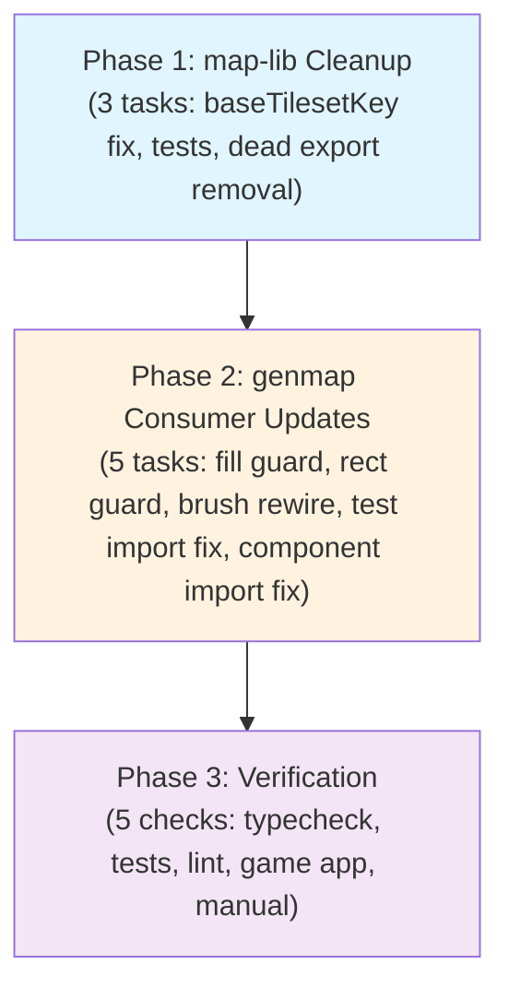
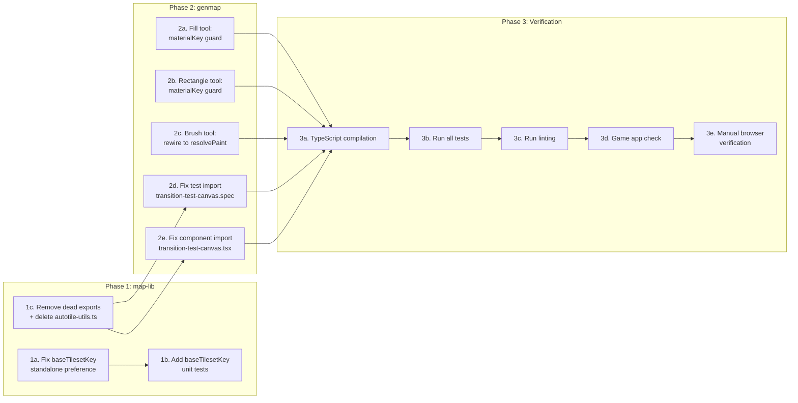

# Work Plan: Single-Layer Material Resolver Pipeline Completion

Created Date: 2026-02-22
Type: refactor
Estimated Duration: 1 day
Estimated Impact: 10 files modified, 1 file deleted across 2 packages
Commit Strategy: Manual (user decides when to commit)
Related Issue/PR: N/A

## Related Documents

- Design Doc: [docs/design/design-014-single-layer-material-resolver.md](../design/design-014-single-layer-material-resolver.md)
- ADR (prereq): [docs/adr/ADR-0010-map-lib-algorithm-extraction.md](../adr/ADR-0010-map-lib-algorithm-extraction.md)
- ADR (prereq): [docs/adr/ADR-0009-tileset-management-architecture.md](../adr/ADR-0009-tileset-management-architecture.md)
- ADR (prereq): [docs/adr/adr-006-map-editor-architecture.md](../adr/adr-006-map-editor-architecture.md)

## Objective

Complete the single-layer material painting pipeline by wiring tools to the canonical `resolvePaint()` function, fixing the `baseTilesetKey` selection algorithm, and removing all dead exports and backward-compatibility shims.

## Background

The design doc (v2.0) specifies the full pipeline from user click to rendered frame. Prior work already completed the type renames (`activeMaterialKey`, `SET_MATERIAL`), simplified `resolvePaint` (no layers, no `createTransitionLayer`), and updated test fixtures. What remains is:

1. **`resolvePaint` is dead code**: All three paint tools bypass it. The brush tool must be rewired; fill and rectangle tools need materialKey validation guards.
2. **`baseTilesetKey` selection is flawed**: `buildMapEditorData()` takes the first tileset with matching `fromMaterialKey` regardless of standalone vs transition status.
3. **Dead exports persist**: `checkTerrainPresence` and `computeNeighborMask` are still exported from `index.ts`. The `autotile-utils.ts` re-export shim file has zero consumers and should be deleted entirely.

### Critical Constraints

- **No backward compatibility**: Old logic that conflicts with the design doc gets removed completely. No shims, no re-exports, no fallbacks.
- **Unified code for game and genmap**: Both `apps/game` and `apps/genmap` use the same `map-lib` code. Game app only imports `MaterialProperties` type -- dead export removal does not affect it.
- **materialKey is the only key**: Everything operates on materialKey.
- **Undo/redo must not change**: `applyDeltas` and `recomputeAutotileLayers` are NOT modified.

## Phase Structure Diagram



## Task Dependency Diagram



## Risks and Countermeasures

### Technical Risks

- **Risk**: Brush tool rewiring breaks stroke accumulation (cells painted twice, undo restores wrong state)
  - **Impact**: High (paint behavior broken)
  - **Probability**: Medium
  - **Countermeasure**: Track `currentGrid` separately from `state.grid`. Use `state.grid` for `oldTerrain` in CellDelta (original state for undo). Design doc section "Phase 2d: Brush Tool Rewiring" specifies the exact pattern.
  - **Detection**: Existing `commands.spec.ts` undo/redo tests + manual brush stroke testing.

- **Risk**: baseTilesetKey fix changes rendered palette swatches unexpectedly
  - **Impact**: Low (cosmetic, editor still functional)
  - **Probability**: Medium
  - **Countermeasure**: The fix is specifically to improve correctness -- standalone tilesets have the correct SOLID_FRAME for palette display. Compare before/after palette rendering manually.

- **Risk**: Removing `computeNeighborMask` export breaks `transition-test-canvas.spec.ts` and `transition-test-canvas.tsx`
  - **Impact**: High (test AND production component compilation failure)
  - **Probability**: Confirmed (both files import from `@nookstead/map-lib`)
  - **Countermeasure**: Task 2d updates the test import; Task 2e updates the production component import. Both must be done alongside or after Task 1c. Recommended: combine Tasks 1c, 2d, and 2e into a single commit.

- **Risk**: Undiscovered consumers of removed exports (`computeNeighborMask`, `checkTerrainPresence`)
  - **Impact**: High (compilation failure in unidentified files)
  - **Probability**: Low (grep-verified two known consumers: transition-test-canvas.spec.ts and transition-test-canvas.tsx; game app verified to only import `MaterialProperties` type)
  - **Countermeasure**: Run `pnpm nx run-many -t typecheck` immediately after export removal (Task 1c). If additional consumers surface, add import-fix tasks to Commit B before merging. The zero-build pattern means TypeScript will catch any broken import at typecheck time.
  - **Detection**: `pnpm nx run-many -t typecheck` across all projects.

- **Risk**: Fill/rectangle with empty materials map causes silent no-op
  - **Impact**: Low (user confusion only)
  - **Probability**: Low (materials loaded on editor init)
  - **Countermeasure**: Guard clause matches current behavior when materials are not loaded (no regression).

- **Risk**: Per-cell grid copy in brush tool causes performance degradation during long strokes
  - **Impact**: Medium (UI jank on very long strokes)
  - **Probability**: Low (maps are small, < 256x256; only modified row is shallow-copied)
  - **Countermeasure**: If profiling shows issues, a batch `resolvePaintBatch` variant can be introduced (documented in design doc Future Extensibility).

### Schedule Risks

- **Risk**: None identified. All changes are well-scoped with clear specifications from the design doc. The most complex task (brush tool rewiring) has detailed target code in the design doc.

---

## Implementation Phases

### Phase 1: map-lib Cleanup and Fix (Estimated commits: 2-3)

**Purpose**: Fix the `baseTilesetKey` selection algorithm and remove dead exports from the `map-lib` public API. These changes are internal to `map-lib` and do not change any consumer-facing behavior (except fixing baseTilesetKey correctness).

**Dependencies**: None (first phase)

**Implementation Approach**: Horizontal Slice (Foundation-driven), per Design Doc.

#### Tasks

- [ ] **Task 1a**: Fix `buildMapEditorData` baseTilesetKey to prefer standalone tilesets
  - **File**: `packages/map-lib/src/core/map-editor-data.ts`
  - **Change**: Replace the single-pass `baseTilesetMap` logic (lines 59-64) with a two-pass algorithm:
    1. First pass: collect standalone tilesets (`fromMaterialKey` set, `toMaterialKey` null/undefined) into `standaloneMap`
    2. First pass (same loop): collect transition tilesets (both keys set) into `fallbackMap`
    3. After loop: merge maps -- standalone wins, fallback fills gaps
  - **Target code** (from Design Doc Phase 1a):
    ```typescript
    const standaloneMap = new Map<string, string>();
    const fallbackMap = new Map<string, string>();

    for (const ts of rawTilesets) {
      // ... existing tilesetInfos.push ...
      if (fromKey) {
        const isStandalone = !toKey;
        if (isStandalone && !standaloneMap.has(fromKey)) {
          standaloneMap.set(fromKey, ts.key);
        } else if (!isStandalone && !fallbackMap.has(fromKey)) {
          fallbackMap.set(fromKey, ts.key);
        }
      }
    }

    // Merge: standalone preferred, fallback fills gaps
    const baseTilesetMap = new Map<string, string>();
    for (const [key, value] of fallbackMap) baseTilesetMap.set(key, value);
    for (const [key, value] of standaloneMap) baseTilesetMap.set(key, value);
    ```
  - **AC coverage**: AC-3 (baseTilesetKey standalone preference)
  - **Completion**: `buildMapEditorData` prefers standalone tilesets. Existing `baseTilesetMap` variable replaced with the two-pass algorithm. JSDoc comment updated.
  - **Verification level**: L3 (Build Success)

- [x] **Task 1b**: Add unit tests for baseTilesetKey standalone preference
  - **File**: `packages/map-lib/src/core/map-editor-data.spec.ts` (NEW file)
  - **Tests** (from Design Doc Test Strategy):
    1. "should prefer standalone tileset for baseTilesetKey" -- input has one standalone + one transition tileset for same material; expect baseTilesetKey = standalone key
    2. "should fall back to transition tileset when no standalone exists" -- input has only transition tileset; expect baseTilesetKey = transition key
    3. "should set baseTilesetKey to undefined when no tileset references material" -- input has material with no matching tileset; expect baseTilesetKey = undefined
  - **AC coverage**: AC-3 (baseTilesetKey tests)
  - **Completion**: 3 new tests pass. Test file follows project conventions (Jest, direct module import).
  - **Verification level**: L2 (Test Operation)

- [ ] **Task 1c**: Remove dead exports from `index.ts` and delete `autotile-utils.ts` shim
  - **Files**:
    - `packages/map-lib/src/index.ts` -- Remove `computeNeighborMask` and `checkTerrainPresence` from the export line (line 54). Keep `NEIGHBOR_OFFSETS`, `computeNeighborMaskByMaterial`, `computeNeighborMaskByPriority` (active functions).
    - `apps/genmap/src/hooks/autotile-utils.ts` -- DELETE entire file. Zero consumers import from this file (verified by grep). User constraint: "No shims, no re-exports, no fallbacks."
  - **Functions remain in source**: `checkTerrainPresence` and `computeNeighborMask` remain in `packages/map-lib/src/core/neighbor-mask.ts` with their tests in `neighbor-mask.spec.ts` (tests import directly from the module file, not from `index.ts`).
  - **Dependency note**: This task removes `computeNeighborMask` from the `@nookstead/map-lib` public API. Two files import it from `@nookstead/map-lib` and will break: `apps/genmap/specs/transition-test-canvas.spec.ts` (test) and `apps/genmap/src/components/transition-test-canvas.tsx` (production component). Tasks 2d and 2e (Phase 2) must be done in the same commit or before this task. **Recommended: combine Tasks 1c, 2d, and 2e into a single commit.**
  - **Game app impact**: None. `apps/game` only imports `MaterialProperties` type from `@nookstead/map-lib` (verified: `Preloader.ts` line 12, `material-cache.ts` line 1).
  - **AC coverage**: AC-4 (dead export removal)
  - **Completion**: `computeNeighborMask` and `checkTerrainPresence` not importable from `@nookstead/map-lib`. `autotile-utils.ts` file does not exist. `neighbor-mask.spec.ts` tests still pass (import directly from module).
  - **Verification level**: L3 (Build Success)

#### Phase 1 Completion Criteria

- [ ] `buildMapEditorData` prefers standalone tilesets for `baseTilesetKey` (AC-3)
- [ ] 3 new unit tests for baseTilesetKey selection pass
- [ ] `computeNeighborMask` and `checkTerrainPresence` removed from `index.ts` exports
- [ ] `autotile-utils.ts` shim file deleted
- [ ] `neighbor-mask.spec.ts` tests still pass (direct imports unaffected)
- [ ] `pnpm nx test map-lib` passes

#### Operational Verification

1. Run `pnpm nx test map-lib` -- all tests must pass including new baseTilesetKey tests
2. Verify `computeNeighborMask` is not exported: grep `packages/map-lib/src/index.ts` for `computeNeighborMask` -- must find zero matches in export lines
3. Verify `checkTerrainPresence` is not exported: grep `packages/map-lib/src/index.ts` for `checkTerrainPresence` -- must find zero matches in export lines
4. Verify `autotile-utils.ts` does not exist: `ls apps/genmap/src/hooks/autotile-utils.ts` -- must not exist
5. Note: `pnpm nx typecheck` across all projects may FAIL at this point if Tasks 2d and 2e have not been done yet (transition-test-canvas.spec.ts and transition-test-canvas.tsx). This is expected and resolved in Phase 2.

---

### Phase 2: genmap Consumer Updates (Estimated commits: 2-3)

**Purpose**: Wire genmap paint tools to the canonical `resolvePaint` pipeline and fix the test and production component imports broken by Phase 1 export removal.

**Dependencies**: Phase 1 complete (map-lib API must be finalized first)

#### Tasks

- [x] **Task 2a**: Add materialKey validation guard to `fill-tool.ts`
  - **File**: `apps/genmap/src/components/map-editor/tools/fill-tool.ts`
  - **Change**: Add guard clause at the start of `onMouseDown` before calling `floodFill`:
    ```typescript
    onMouseDown(tile: { x: number; y: number }) {
      if (!state.materials.has(state.activeMaterialKey)) return;
      // ... existing floodFill call ...
    }
    ```
  - **Rationale**: Material validation for fill tool happens via guard clause, not via `resolvePaint`. Drawing algorithms are pure geometry functions and should not depend on MaterialInfo (Design Doc Alternative 1 rejection rationale).
  - **AC coverage**: AC-2 (fill tool materialKey validation)
  - **Completion**: Fill tool validates materialKey before calling floodFill. Invalid materialKey causes silent no-op (consistent with current behavior when materials not loaded).
  - **Verification level**: L3 (Build Success)

- [x] **Task 2b**: Add materialKey validation guard to `rectangle-tool.ts`
  - **File**: `apps/genmap/src/components/map-editor/tools/rectangle-tool.ts`
  - **Change**: Add guard clause at the start of `onMouseUp` before calling `rectangleFill`:
    ```typescript
    onMouseUp(tile: { x: number; y: number }) {
      if (!isDrawing || !startTile) return;
      isDrawing = false;
      setPreviewRect(null);

      if (!state.materials.has(state.activeMaterialKey)) return;
      // ... existing rectangleFill call ...
    }
    ```
  - **AC coverage**: AC-2 (rectangle tool materialKey validation)
  - **Completion**: Rectangle tool validates materialKey before calling rectangleFill. Preview rect still clears on mouseUp even if materialKey is invalid.
  - **Verification level**: L3 (Build Success)

- [x] **Task 2c**: Rewire `brush-tool.ts` to call `resolvePaint` for each painted cell
  - **File**: `apps/genmap/src/components/map-editor/tools/brush-tool.ts`
  - **Changes** (from Design Doc Phase 2d specification):
    1. Add import: `import { resolvePaint } from '@nookstead/map-lib';`
    2. Add `currentGrid` variable initialized from `state.grid` on `onMouseDown`
    3. Replace `tryPaint` body with `resolvePaint` call:
       - Remove inline bounds check (delegated to `resolvePaint`)
       - Keep Map key deduplication check
       - Add same-terrain check against `currentGrid` (accumulated state)
       - Call `resolvePaint({ grid: currentGrid, x, y, materialKey: state.activeMaterialKey, width: state.width, height: state.height, materials: state.materials })`
       - If `result.affectedCells.length === 0`, return (no-op)
       - Update `currentGrid = result.updatedGrid` for subsequent stroke cells
       - Derive CellDelta using `state.grid[y][x].terrain` for `oldTerrain` (ORIGINAL grid for correct undo)
    4. Reset `currentGrid` in `onMouseDown` (fresh copy per stroke)
  - **Key invariants**:
    - Each cell painted at most once per stroke (Map key deduplication preserved)
    - `oldTerrain` comes from `state.grid` (original), NOT `currentGrid` (accumulated)
    - `newFrame: 0` is a placeholder, overridden by `recomputeAutotileLayers` in `applyDeltas`
    - `state` is not mutated
  - **AC coverage**: AC-1 (resolvePaint as canonical paint function), AC-2 (brush tool calls resolvePaint)
  - **Completion**: Brush tool calls `resolvePaint` per cell. Material validation delegated to `resolvePaint`. Same-terrain skip still works. Stroke accumulation works correctly.
  - **Verification level**: L1 (Functional Operation -- verifiable by painting in browser)

- [x] **Task 2d**: Update `transition-test-canvas.spec.ts` import path
  - **File**: `apps/genmap/specs/transition-test-canvas.spec.ts`
  - **Change**: Update import on line 1 from:
    ```typescript
    import { computeNeighborMask, getFrame } from '@nookstead/map-lib';
    ```
    to:
    ```typescript
    import { computeNeighborMask } from '../../../packages/map-lib/src/core/neighbor-mask';
    import { getFrame } from '@nookstead/map-lib';
    ```
    `getFrame` remains imported from `@nookstead/map-lib` (still exported). `computeNeighborMask` switches to a direct module import since it is no longer part of the public API.
  - **Dependency**: Must be done in the same commit as Task 1c, or before it. If done after, TypeScript compilation will fail.
  - **AC coverage**: AC-4 (transition-test-canvas.spec.ts import fixed)
  - **Completion**: Test file compiles. All 8 tests in transition-test-canvas.spec.ts pass. Import references direct module path.
  - **Verification level**: L2 (Test Operation)

- [x] **Task 2e**: Update `transition-test-canvas.tsx` import path
  - **File**: `apps/genmap/src/components/transition-test-canvas.tsx`
  - **Change**: Update import on line 6 from:
    ```typescript
    import { getFrame, computeNeighborMask } from '@nookstead/map-lib';
    ```
    to:
    ```typescript
    import { getFrame } from '@nookstead/map-lib';
    import { computeNeighborMask } from '../../../packages/map-lib/src/core/neighbor-mask';
    ```
    `getFrame` remains imported from `@nookstead/map-lib` (still exported). `computeNeighborMask` switches to a direct module import since it is no longer part of the public API.
  - **Dependency**: Must be done in the same commit as Task 1c, or before it. If done after, TypeScript compilation will fail. This is the production component counterpart of the test file fix in Task 2d.
  - **AC coverage**: AC-4 (all consumers of removed exports updated)
  - **Completion**: Production component compiles. `computeNeighborMask` import uses direct module path. Component renders correctly in browser.
  - **Verification level**: L3 (Build Success)

#### Phase 2 Completion Criteria

- [x] Fill tool has materialKey guard clause before `floodFill` call
- [x] Rectangle tool has materialKey guard clause before `rectangleFill` call
- [x] Brush tool calls `resolvePaint` per cell instead of inline delta creation
- [x] `transition-test-canvas.spec.ts` imports `computeNeighborMask` directly from module path
- [ ] `transition-test-canvas.tsx` imports `computeNeighborMask` directly from module path
- [ ] `pnpm nx typecheck` passes across all projects (genmap + game + map-lib)

#### Operational Verification

1. Run `pnpm nx typecheck` across all projects -- must pass with zero errors
2. Grep for `computeNeighborMask` in `index.ts` export lines -- zero matches
3. Verify `apps/genmap/src/hooks/autotile-utils.ts` does not exist (file was deleted in Phase 1, Task 1c)
4. Verify brush-tool.ts contains `resolvePaint` import and call

---

### Phase 3: Verification and Quality Assurance (Required) (Estimated commits: 0)

**Purpose**: Comprehensive verification that all changes are correct, no regressions exist, and all Design Doc acceptance criteria are satisfied. This phase produces no code changes.

**Dependencies**: Phase 1 + Phase 2 complete

#### Tasks

- [ ] **Task 3a**: TypeScript compilation verification
  - Run `pnpm nx run-many -t typecheck`
  - **Expected**: Zero type errors across all projects (map-lib, genmap, game, game-e2e)
  - **AC coverage**: All ACs (type correctness)
  - **Verification level**: L3 (Build Success)

- [ ] **Task 3b**: Run all tests
  - Run `pnpm nx test map-lib` (material-resolver, commands, neighbor-mask, map-editor-data tests)
  - Run `pnpm nx test game` (game app has 16 spec files; none import removed exports, but run to confirm no regressions)
  - Verify `transition-test-canvas.spec.ts` tests pass (8 tests)
  - **Expected**: All tests pass, zero failures, zero skipped
  - **AC coverage**: AC-5 (undo/redo tests pass), AC-3 (baseTilesetKey tests pass)
  - **Verification level**: L2 (Test Operation)

- [ ] **Task 3c**: Run linting
  - Run `pnpm nx run-many -t lint`
  - **Expected**: Zero lint errors
  - **Verification level**: L3 (Build Success)

- [ ] **Task 3d**: Verify game app is not broken
  - Run `pnpm nx typecheck game`
  - Run `pnpm nx build game`
  - **Expected**: Game app compiles and builds successfully. Only imports `MaterialProperties` type from `@nookstead/map-lib`, which is unaffected by this refactoring.
  - **AC coverage**: Unified code constraint
  - **Verification level**: L3 (Build Success)

- [ ] **Task 3e**: Manual browser verification
  - Open map editor in browser (`pnpm nx dev game` or genmap dev server)
  - Verify:
    1. Palette shows material swatches (standalone tileset SOLID_FRAME, not transition tileset)
    2. Select a material, paint with brush tool -- cells change terrain
    3. Undo brush stroke -- cells revert
    4. Redo -- cells change again
    5. Select a different material, use fill tool -- connected region fills
    6. Undo fill -- region reverts
    7. Use rectangle tool -- rectangle fills
    8. Undo rectangle -- rectangle reverts
    9. Palette swatches render correctly (not blank/wrong tileset)
  - **AC coverage**: AC-1 (paint works), AC-2 (all tools work), AC-5 (undo/redo)
  - **Verification level**: L1 (Functional Operation)

#### Verify Design Doc Acceptance Criteria

- [ ] **AC-1**: resolvePaint as Canonical Paint Function
  - [ ] `resolvePaint` updates `grid[y][x].terrain` to `materialKey` (already implemented)
  - [x] Brush tool calls `resolvePaint` for each painted cell (Task 2c)
  - [ ] Out-of-bounds returns original grid with empty `affectedCells` (already implemented + tested)
  - [ ] Unknown materialKey returns warning and empty `affectedCells` (already implemented + tested)

- [ ] **AC-2**: Tools Call resolvePaint
  - [x] Brush tool calls `resolvePaint()` per cell (Task 2c)
  - [x] Fill tool validates materialKey via guard clause (Task 2a)
  - [ ] Rectangle tool validates materialKey via guard clause (Task 2b)
  - [ ] Eraser tool NOT modified (confirmed: uses hardcoded `DEFAULT_TERRAIN`)

- [ ] **AC-3**: buildMapEditorData baseTilesetKey Fix
  - [ ] Standalone tilesets preferred over transition tilesets (Task 1a)
  - [ ] Falls back to transition tileset when no standalone exists (Task 1b test)
  - [ ] `baseTilesetKey` undefined when no tileset references material (Task 1b test)

- [ ] **AC-4**: Dead Export Removal
  - [ ] `checkTerrainPresence` removed from `index.ts` exports (Task 1c)
  - [ ] `computeNeighborMask` removed from `index.ts` exports (Task 1c)
  - [ ] `autotile-utils.ts` shim file deleted entirely (Task 1c)
  - [ ] `transition-test-canvas.spec.ts` import updated to direct module path (Task 2d)
  - [ ] `transition-test-canvas.tsx` import updated to direct module path (Task 2e)
  - [ ] Functions remain in `neighbor-mask.ts` source (not deleted, just not exported publicly)

- [ ] **AC-5**: Undo/Redo Preservation
  - [ ] `applyDeltas` NOT modified (verified: no task touches `commands.ts`)
  - [ ] `recomputeAutotileLayers` NOT modified (verified: no task touches `autotile-layers.ts`)
  - [ ] Undo/redo works correctly in browser (Task 3e manual verification)

- [ ] **AC-6**: TerrainCellType Documentation
  - [ ] Migration path documented in Design Doc section "TerrainCellType Migration Path (Deferred)"
  - [ ] No runtime changes to `TerrainCellType` in this refactoring (confirmed)

#### Phase 3 Completion Criteria

- [ ] `pnpm nx run-many -t typecheck lint test` passes with zero errors
- [ ] All 6 acceptance criteria (AC-1 through AC-6) verified
- [ ] Manual browser verification confirms paint tools and undo/redo work
- [ ] Game app compiles and builds successfully
- [ ] No regressions in existing test suite

#### Operational Verification

1. Run `pnpm nx run-many -t typecheck lint test` -- all pass with zero errors
2. Run `pnpm nx build game` -- build succeeds
3. Grep verification:
   - `computeNeighborMask` not in `index.ts` export lines
   - `checkTerrainPresence` not in `index.ts` export lines
   - `autotile-utils.ts` file does not exist
   - `resolvePaint` appears in `brush-tool.ts` imports
4. Manual browser verification per Task 3e steps

---

## Acceptance Criteria Traceability

| AC | Description | Phase | Tasks |
|----|-------------|-------|-------|
| AC-1 | resolvePaint as canonical paint function | Phase 2 (brush rewiring) | 2c |
| AC-2 | Tools call resolvePaint / validate materialKey | Phase 2 (all tools) | 2a, 2b, 2c |
| AC-3 | baseTilesetKey standalone preference | Phase 1 (fix + tests) | 1a, 1b |
| AC-4 | Dead export removal | Phase 1 (exports) + Phase 2 (import fixes) | 1c, 2d, 2e |
| AC-5 | Undo/Redo preservation | Phase 3 (verify only) | 3b, 3e |
| AC-6 | TerrainCellType documentation | Already in Design Doc | (none -- no code change) |

## Files Affected Summary

| File | Phase | Task | Change Type |
|------|-------|------|-------------|
| `packages/map-lib/src/core/map-editor-data.ts` | 1 | 1a | Fix baseTilesetKey selection algorithm |
| `packages/map-lib/src/core/map-editor-data.spec.ts` | 1 | 1b | NEW: 3 unit tests for baseTilesetKey |
| `packages/map-lib/src/index.ts` | 1 | 1c | Remove `computeNeighborMask`, `checkTerrainPresence` exports |
| `apps/genmap/src/hooks/autotile-utils.ts` | 1 | 1c | DELETE entire file (zero-consumer shim) |
| `apps/genmap/src/components/map-editor/tools/fill-tool.ts` | 2 | 2a | Add materialKey guard clause |
| `apps/genmap/src/components/map-editor/tools/rectangle-tool.ts` | 2 | 2b | Add materialKey guard clause |
| `apps/genmap/src/components/map-editor/tools/brush-tool.ts` | 2 | 2c | Rewire to call `resolvePaint` |
| `apps/genmap/specs/transition-test-canvas.spec.ts` | 2 | 2d | Update import path for `computeNeighborMask` |
| `apps/genmap/src/components/transition-test-canvas.tsx` | 2 | 2e | Update import path for `computeNeighborMask` |

### Files Explicitly NOT Modified

| File | Reason |
|------|--------|
| `packages/map-lib/src/core/commands.ts` | Already correct -- `applyDeltas` unchanged (AC-5) |
| `packages/map-lib/src/core/autotile-layers.ts` | Already correct -- processes ALL layers (AC-5) |
| `packages/map-lib/src/core/material-resolver.ts` | Already simplified in prior iteration (AC-1 implementation done) |
| `packages/map-lib/src/core/material-resolver.spec.ts` | Already updated in prior iteration |
| `packages/map-lib/src/core/neighbor-mask.ts` | Functions remain; only public API exports change |
| `packages/map-lib/src/core/neighbor-mask.spec.ts` | Tests import directly from module (not affected by export removal) |
| `packages/map-lib/src/core/commands.spec.ts` | Already uses `activeMaterialKey` |
| `packages/map-lib/src/types/editor-types.ts` | Already has `activeMaterialKey`, `SET_MATERIAL` |
| `packages/map-lib/src/types/material-types.ts` | Already has `baseTilesetKey` |
| `apps/genmap/src/hooks/use-map-editor.ts` | Already uses `SET_MATERIAL`, `activeMaterialKey` |
| `apps/genmap/src/components/map-editor/terrain-palette.tsx` | Already material-oriented |
| `apps/genmap/src/components/map-editor/canvas-renderer.ts` | Already does per-cell baseTilesetKey lookup |
| `apps/genmap/src/components/map-editor/map-editor-canvas.tsx` | Already references `activeMaterialKey` |
| `apps/genmap/src/components/map-editor/tools/eraser-tool.ts` | Uses hardcoded `DEFAULT_TERRAIN`, does not call `resolvePaint` |
| `apps/game/src/game/scenes/Preloader.ts` | Only imports `MaterialProperties` type (unaffected) |
| `apps/game/src/game/services/material-cache.ts` | Only imports `MaterialProperties` type (unaffected) |

## Recommended Commit Groupings

While each task is designed as a logical single-commit unit, some tasks have tight dependencies that make combining them into a single commit cleaner:

1. **Commit A**: Tasks 1a + 1b (baseTilesetKey fix with its tests)
2. **Commit B**: Tasks 1c + 2d + 2e (remove dead exports + fix test import + fix component import -- must be atomic to avoid compilation break)
3. **Commit C**: Tasks 2a + 2b (fill and rectangle guard clauses -- small, independent changes)
4. **Commit D**: Task 2c (brush tool rewiring -- complex enough to warrant its own commit)
5. **Commit E**: Phase 3 verification (no code changes, just checks)

## Constraints

- **Zero-build pattern**: `map-lib` exports TypeScript source directly (no `dist/`). All imports use `@nookstead/source` condition.
- **Immutable state updates**: All state changes create new objects; never mutate.
- **`applyDeltas` and `recomputeAutotileLayers` UNCHANGED**: These are the critical undo/redo path and must not be modified.
- **`resolvePaint` is a pure function**: No side effects. Validation, grid update, affected cell computation only.
- **SOLID block rule**: Painting always sets the target cell to the solid material, never complex transitions. This is enforced by `resolvePaint` setting `grid[y][x].terrain = materialKey`.
- **`buildTransitionMap` retained**: Not deleted. Useful for future transition warnings.

## Completion Criteria

- [ ] All phases (1-3) completed
- [ ] Each phase's operational verification procedures executed
- [ ] Design Doc acceptance criteria (AC-1 through AC-6) satisfied
- [ ] `pnpm nx run-many -t typecheck lint test` passes with zero errors
- [ ] `pnpm nx build game` succeeds (game app not broken)
- [ ] Manual browser verification confirms brush, fill, rectangle tools and undo/redo work
- [ ] User review approval obtained

## Progress Tracking

### Phase 1: map-lib Cleanup and Fix
- Start:
- Complete:
- Notes:

### Phase 2: genmap Consumer Updates
- Start:
- Complete:
- Notes:

### Phase 3: Verification and Quality Assurance
- Start:
- Complete:
- Notes:

## Notes

- **Implementation approach**: Horizontal Slice (Foundation-driven) per Design Doc. map-lib cleanup first, then genmap consumer updates.
- **What was already done**: The previous iteration completed type renames (`activeMaterialKey`, `SET_MATERIAL`), `resolvePaint` simplification (no layers, no `createTransitionLayer`), test fixture updates, and palette material orientation. This plan covers the REMAINING work.
- **Tool-level asymmetry (by design)**: The brush tool calls `resolvePaint()` per cell because it needs per-cell grid tracking and material validation. Fill and rectangle tools validate via a simple `state.materials.has()` guard clause because their drawing algorithms are pure geometry functions that should not depend on MaterialInfo.
- **autotile-utils.ts deletion**: The file is a backward-compatibility re-export shim with zero consumers (verified by grep). The user constraint "No shims, no re-exports, no fallbacks" mandates its deletion rather than selective cleanup.
- **Predecessor plan**: This plan supersedes the previous version of `single-layer-material-resolver.md` which described the now-completed type rename and `resolvePaint` simplification work.
