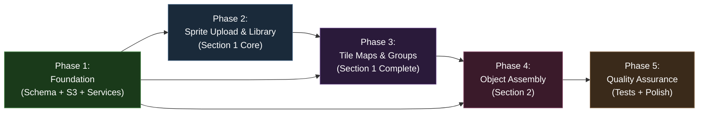
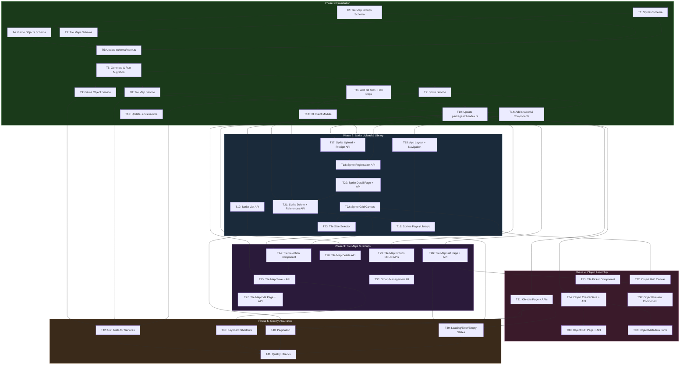

# Work Plan: Sprite Management and Object Assembly Implementation

Created Date: 2026-02-17
Completed Date: 2026-02-19
Status: COMPLETED
Type: feature
Estimated Duration: 8-10 days
Estimated Impact: ~50 files (45+ new, 3 modified)
Related Issue/PR: PRD-006 / ADR-0007 / Design-007

## Related Documents

- PRD: [docs/prd/prd-006-sprite-management.md](../prd/prd-006-sprite-management.md)
- ADR: [docs/adr/ADR-0007-sprite-management-storage-and-schema.md](../adr/ADR-0007-sprite-management-storage-and-schema.md)
- Design Doc: [docs/design/design-007-sprite-management.md](../design/design-007-sprite-management.md)

## Objective

Build the Sprite Management and Object Assembly tool -- an internal browser-based application at `apps/genmap/` for uploading sprite sheets to S3-compatible storage, extracting tile selections via interactive grid overlay, organizing tiles into named maps and groups, and assembling multi-tile game objects on a visual canvas. This establishes the content pipeline from raw sprite sheet artwork to usable game objects.

## Background

There is no tooling for managing the sprite-to-game-object pipeline. Artists produce sprite sheets (PNG/WebP images containing grids of tiles), but cataloging tiles, selecting subsets, and composing multi-tile objects is handled manually. This creates friction in the content pipeline and introduces errors when tile coordinates are transcribed by hand. The genmap app (`apps/genmap/`) is a separate Next.js 16 app within the Nx monorepo using shadcn/ui, with database persistence in `packages/db/` and S3-compatible object storage for sprite files.

## Phase Structure Diagram

## Task Dependency Diagram

## Risks and Countermeasures

### Technical Risks

- **Risk**: S3 presigned URL incompatibility with MinIO
  - **Impact**: Medium -- sprite upload fails on local development environments
  - **Detection**: Test presigned URL flow against MinIO during Phase 2 (T17)
  - **Countermeasure**: Use only standard S3 API operations. If MinIO fails, fall back to server-side upload proxy (Option 2 in ADR-0007). Kill criteria: >5% failure rate.

- **Risk**: Orphan S3 files from failed registration after upload
  - **Impact**: Low -- wasted storage space
  - **Detection**: Log registration failures in sprite registration API (T18)
  - **Countermeasure**: Accept for MVP. Plan reconciliation script or S3 lifecycle rule for future cleanup.

- **Risk**: Canvas performance degradation with large sprite sheets (2048x2048+)
  - **Impact**: Medium -- slow grid overlay interaction
  - **Detection**: Manual testing with large sprites during Phase 2 (T22)
  - **Countermeasure**: Render at actual pixel dimensions. If slow, downsample display image while keeping tile coordinates accurate. Use `requestAnimationFrame` and selective layer redraws.

- **Risk**: Stale sprite references in game_objects.tiles JSONB after sprite deletion
  - **Impact**: Medium -- broken object previews
  - **Detection**: Reference check API (T21) queries for affected objects before delete
  - **Countermeasure**: Warn user listing affected objects before sprite deletion. Render placeholder tiles with visual "missing" indicator in object preview (T36).

- **Risk**: CORS misconfiguration blocks S3 uploads from browser
  - **Impact**: Medium -- sprite upload completely blocked
  - **Detection**: First presigned URL upload test in Phase 2
  - **Countermeasure**: Document CORS setup per provider (S3, R2, MinIO) in .env.example. Verify in development setup.

### Schedule Risks

- **Risk**: S3 SDK integration more complex than estimated
  - **Impact**: Low -- blocks Phase 2 sprite upload
  - **Countermeasure**: S3 client module (T12) is isolated. If presigned URLs fail, implement server-side proxy as fallback (1 day additional).

- **Risk**: shadcn/ui component installation issues
  - **Impact**: Low -- blocks UI development
  - **Countermeasure**: shadcn/ui is already configured in `apps/genmap/components.json`. Components install via `pnpm dlx shadcn@latest add <component>`.

- **Risk**: Canvas interaction logic more complex than estimated (drag selection, hover states)
  - **Impact**: Medium -- delays Phase 2-3
  - **Countermeasure**: Start with click-only selection (Must Have). Drag-to-select (FR-22) is Should Have and can be deferred.

## Implementation Phases

### Phase 1: Foundation -- Database Schema, S3 Integration, and Services (Estimated commits: 14)

**Purpose**: Establish all backend infrastructure: database tables via Drizzle ORM, S3 client module, CRUD service functions, and package dependencies. After this phase, all API routes have their underlying data layer ready.

#### Tasks

- [ ] **T1: Create sprites schema file** (`packages/db/src/schema/sprites.ts`)
  - **Description**: Define `sprites` pgTable with columns: `id` (UUID PK, defaultRandom), `name` (varchar 255, not null), `s3Key` (text, not null, unique), `s3Url` (text, not null), `width` (integer, not null), `height` (integer, not null), `fileSize` (integer, not null), `mimeType` (varchar 50, not null), `createdAt` (timestamp with timezone, defaultNow, not null), `updatedAt` (timestamp with timezone, defaultNow, not null). Export `Sprite` and `NewSprite` inferred types.
  - **Files**: Create `packages/db/src/schema/sprites.ts`
  - **Dependencies**: None
  - **Complexity**: Simple
  - **AC**: FR-21 -- sprites table exists with correct columns, types, and constraints
  - **Pattern reference**: Follow `packages/db/src/schema/users.ts` for pgTable, UUID PK, and timestamp patterns

- [ ] **T2: Create tile_map_groups schema file** (`packages/db/src/schema/tile-map-groups.ts`)
  - **Description**: Define `tileMapGroups` pgTable with columns: `id` (UUID PK), `name` (varchar 255, not null), `description` (text, nullable), `createdAt`, `updatedAt`. Export `TileMapGroup` and `NewTileMapGroup` types.
  - **Files**: Create `packages/db/src/schema/tile-map-groups.ts`
  - **Dependencies**: None
  - **Complexity**: Simple
  - **AC**: FR-21 -- tile_map_groups table exists with correct columns

- [ ] **T3: Create tile_maps schema file** (`packages/db/src/schema/tile-maps.ts`)
  - **Description**: Define `tileMaps` pgTable with columns: `id` (UUID PK), `spriteId` (UUID FK to sprites.id, not null, cascade delete), `groupId` (UUID FK to tileMapGroups.id, nullable, set null on delete), `name` (varchar 255, not null), `tileWidth` (integer, not null), `tileHeight` (integer, not null), `selectedTiles` (jsonb, not null), `createdAt`, `updatedAt`. Define `tileMapsRelations` for sprite and group relations. Export `TileMap` and `NewTileMap` types.
  - **Files**: Create `packages/db/src/schema/tile-maps.ts`
  - **Dependencies**: T1 (sprites schema), T2 (tile-map-groups schema)
  - **Complexity**: Medium -- FK constraints and relations
  - **AC**: FR-21 -- tile_maps table with correct FK constraints; sprite deletion cascades to tile maps; group deletion sets group_id null
  - **Pattern reference**: Follow `packages/db/src/schema/accounts.ts` for FK references and relations patterns

- [ ] **T4: Create game_objects schema file** (`packages/db/src/schema/game-objects.ts`)
  - **Description**: Define `gameObjects` pgTable with columns: `id` (UUID PK), `name` (varchar 255, not null), `description` (text, nullable), `widthTiles` (integer, not null), `heightTiles` (integer, not null), `tiles` (jsonb, not null), `tags` (jsonb, nullable), `metadata` (jsonb, nullable), `createdAt`, `updatedAt`. Export `GameObject` and `NewGameObject` types.
  - **Files**: Create `packages/db/src/schema/game-objects.ts`
  - **Dependencies**: None
  - **Complexity**: Simple
  - **AC**: FR-21 -- game_objects table exists with correct columns and JSONB fields
  - **Pattern reference**: Follow `packages/db/src/schema/maps.ts` for JSONB column pattern (untyped jsonb without .$type<>)

- [ ] **T5: Update schema/index.ts exports** (`packages/db/src/schema/index.ts`)
  - **Description**: Append 4 new exports to the barrel file: `export * from './sprites'; export * from './tile-map-groups'; export * from './tile-maps'; export * from './game-objects';`
  - **Files**: Modify `packages/db/src/schema/index.ts`
  - **Dependencies**: T1, T2, T3, T4
  - **Complexity**: Simple
  - **AC**: All new schemas importable from `@nookstead/db`. TypeScript compilation passes.

- [ ] **T6: Generate and run Drizzle migration** (`packages/db/`)
  - **Description**: Run `pnpm drizzle-kit generate` to produce the migration SQL for the 4 new tables. Run `pnpm drizzle-kit push` (or `migrate`) to apply to the database. Verify all 4 tables exist with correct columns, types, and constraints. Confirm existing tables (`users`, `accounts`, `player_positions`, `maps`) are unaffected.
  - **Files**: New migration file in `packages/db/drizzle/` (auto-generated)
  - **Dependencies**: T5
  - **Complexity**: Simple
  - **AC**: FR-21 -- migration runs without errors; all 4 tables visible in database; existing tables unaffected; FK constraints enforced (sprite cascade, group set null)

- [ ] **T7: Create sprite service** (`packages/db/src/services/sprite.ts`)
  - **Description**: Implement CRUD service functions following the DrizzleClient-first-param pattern: `createSprite(db, data)`, `getSprite(db, id)`, `listSprites(db, params?)`, `deleteSprite(db, id)`, `countTileMapsBySprite(db, spriteId)`, `findGameObjectsReferencingSprite(db, spriteId)`. Export `CreateSpriteData` interface.
  - **Files**: Create `packages/db/src/services/sprite.ts`
  - **Dependencies**: T6 (migration applied)
  - **Complexity**: Medium -- includes JSONB containment query for findGameObjectsReferencingSprite
  - **AC**: FR-2 (sprite creation), FR-3 (list sprites), FR-4 (delete sprite with reference checks)
  - **Pattern reference**: Follow `packages/db/src/services/player.ts` and `packages/db/src/services/map.ts` for service patterns

- [ ] **T8: Create tile map service** (`packages/db/src/services/tile-map.ts`)
  - **Description**: Implement CRUD functions for both tile_maps and tile_map_groups: `createTileMap`, `getTileMap`, `listTileMaps(params?)` (with optional groupId filter), `updateTileMap`, `deleteTileMap`, `createGroup`, `listGroups`, `updateGroup`, `deleteGroup`. Delete group sets group_id to null on associated tile maps. Export interfaces: `CreateTileMapData`, `UpdateTileMapData`, `CreateGroupData`, `UpdateGroupData`.
  - **Files**: Create `packages/db/src/services/tile-map.ts`
  - **Dependencies**: T6 (migration applied)
  - **Complexity**: Medium -- two entities in one service file, group deletion with nullification
  - **AC**: FR-7 (tile map save), FR-8 (tile map edit), FR-9 (groups CRUD with nullification on delete), FR-10 (tile map listing with group filter)

- [ ] **T9: Create game object service** (`packages/db/src/services/game-object.ts`)
  - **Description**: Implement CRUD functions: `createGameObject`, `getGameObject`, `listGameObjects(params?)`, `updateGameObject`, `deleteGameObject`, `validateTileReferences(db, tiles)`. The `validateTileReferences` function extracts unique spriteId values from tiles array, queries sprites table, and returns any IDs that do not exist. Export interfaces: `CreateGameObjectData`, `UpdateGameObjectData`.
  - **Files**: Create `packages/db/src/services/game-object.ts`
  - **Dependencies**: T6 (migration applied)
  - **Complexity**: Medium -- validateTileReferences requires querying sprites table against JSONB data
  - **AC**: FR-13 (object save), FR-14 (object listing), FR-15 (object edit), FR-20 (sprite reference validation returns 400 for invalid IDs)

- [ ] **T10: Update packages/db/index.ts exports** (`packages/db/src/index.ts`)
  - **Description**: Add exports for new sprite, tile-map, and game-object service functions and their type interfaces. Follow the existing explicit export pattern (named exports, not wildcard).
  - **Files**: Modify `packages/db/src/index.ts`
  - **Dependencies**: T7, T8, T9
  - **Complexity**: Simple
  - **AC**: All new services and types importable from `@nookstead/db`

- [ ] **T11: Add S3 SDK and DB dependencies to genmap** (`apps/genmap/`)
  - **Description**: Add `@aws-sdk/client-s3` and `@aws-sdk/s3-request-presigner` as dependencies to `apps/genmap/package.json`. Add `@nookstead/db` as a workspace dependency. Run `pnpm install` to resolve.
  - **Files**: Modify `apps/genmap/package.json`, update `pnpm-lock.yaml`
  - **Dependencies**: None
  - **Complexity**: Simple
  - **AC**: `pnpm install` succeeds; imports resolve at build time

- [ ] **T12: Create S3 client module** (`apps/genmap/src/lib/s3.ts`)
  - **Description**: Implement S3 client configuration with configurable endpoint. Functions: `generatePresignedUploadUrl(params)`, `deleteS3Object(key)`, `buildS3Url(key)`. Export constants: `ALLOWED_MIME_TYPES`, `MAX_FILE_SIZE`. Singleton S3Client initialized from env vars (`S3_ENDPOINT`, `S3_BUCKET`, `S3_ACCESS_KEY_ID`, `S3_SECRET_ACCESS_KEY`, `S3_REGION`). Fail fast with descriptive error if required env vars missing. Presigned URLs have 5-minute expiry.
  - **Files**: Create `apps/genmap/src/lib/s3.ts`
  - **Dependencies**: T11 (AWS SDK installed)
  - **Complexity**: Medium -- presigned URL generation with content-type/length conditions
  - **AC**: FR-1 (presigned URL with 5min expiry), FR-17 (presign API infrastructure)
  - **Pattern reference**: Design Doc Section "S3 Client Module" has full implementation

- [ ] **T13: Update .env.example with S3 variables**
  - **Description**: Add S3 configuration variables to `.env.example` (or create `apps/genmap/.env.example`): `S3_ENDPOINT`, `S3_BUCKET`, `S3_ACCESS_KEY_ID`, `S3_SECRET_ACCESS_KEY`, `S3_REGION`. Include comments documenting each variable and example values for MinIO local development.
  - **Files**: Create or modify `.env.example` or `apps/genmap/.env.example`
  - **Dependencies**: None
  - **Complexity**: Simple
  - **AC**: Developer can configure S3 from example file

- [ ] **T14: Add necessary shadcn/ui components to genmap**
  - **Description**: Install required shadcn/ui components via `pnpm dlx shadcn@latest add`: button, card, input, label, select, dialog, alert, badge, separator, dropdown-menu, table, tabs, toast, tooltip. These are UI primitives used across all pages.
  - **Files**: Creates files in `apps/genmap/src/components/ui/`
  - **Dependencies**: None
  - **Complexity**: Simple
  - **AC**: All shadcn/ui components importable from `@/components/ui/`

- [ ] Quality check: `pnpm nx typecheck db`
- [ ] Quality check: `pnpm nx lint db`

#### Phase Completion Criteria

- [ ] All 4 schema files created with correct column definitions, types, and constraints
- [ ] `packages/db/src/schema/index.ts` exports all 8 schema modules
- [ ] Drizzle migration generated and applied; all 4 tables exist in database
- [ ] All 3 service files created with CRUD functions following existing patterns
- [ ] `packages/db/src/index.ts` exports all new services and types
- [ ] S3 client module created with presigned URL generation and object deletion
- [ ] AWS SDK and @nookstead/db dependencies added to genmap
- [ ] shadcn/ui components installed
- [ ] `pnpm nx typecheck db` passes
- [ ] `pnpm nx lint db` passes

#### Operational Verification Procedures

1. Run `pnpm nx typecheck db` -- verify zero type errors for schema and service files
2. Run `pnpm nx lint db` -- verify zero lint errors
3. Verify migration applies: `pnpm drizzle-kit push` runs without errors
4. Verify database state: all 4 tables (`sprites`, `tile_maps`, `tile_map_groups`, `game_objects`) exist with correct columns
5. Verify FK constraints: attempt to insert a `tile_maps` row with non-existent `sprite_id` -- should fail with FK violation
6. Verify cascade: delete a sprite row -- associated tile_maps rows should be removed
7. Verify set-null: delete a tile_map_groups row -- associated tile_maps should have `group_id` set to null
8. Verify S3 module: import `generatePresignedUploadUrl` from `apps/genmap/src/lib/s3.ts` -- should throw if env vars missing (fail fast)
9. Verify imports: `import { createSprite, createTileMap, createGameObject } from '@nookstead/db'` resolves

---

### Phase 2: Sprite Upload and Library -- Section 1 Core (Estimated commits: 9)

**Purpose**: Implement the sprite upload workflow end-to-end (presigned URL, S3 upload, registration) and the sprite library (list, detail, delete). This delivers a usable vertical slice: content creators can upload, browse, and manage sprite sheets.

#### Tasks

- [ ] **T15: Create app layout with sidebar navigation** (`apps/genmap/src/app/layout.tsx`, `apps/genmap/src/components/navigation.tsx`)
  - **Description**: Update the root layout to include a navigation header/sidebar with links to `/sprites`, `/tile-maps`, `/objects`. Create a `navigation.tsx` component with shadcn/ui sidebar or horizontal nav. Update `page.tsx` to redirect to `/sprites` or serve as a navigation hub.
  - **Files**: Modify `apps/genmap/src/app/layout.tsx`, `apps/genmap/src/app/page.tsx`; Create `apps/genmap/src/components/navigation.tsx`
  - **Dependencies**: T14 (shadcn/ui components)
  - **Complexity**: Simple
  - **AC**: Navigation links to all 3 sections visible; layout consistent across pages

- [ ] **T16: Create sprites page (library view)** (`apps/genmap/src/app/sprites/page.tsx`)
  - **Description**: Create the sprite library page displaying all uploaded sprites in a card grid. Each card shows: thumbnail (from S3 URL), name, dimensions (WxH px), file size (human-readable), upload date. Sorted by newest first. Includes an upload button that opens the upload form. Create `sprite-card.tsx` component for individual sprite entries.
  - **Files**: Create `apps/genmap/src/app/sprites/page.tsx`, `apps/genmap/src/components/sprite-card.tsx`, `apps/genmap/src/hooks/use-sprites.ts`
  - **Dependencies**: T15 (layout), T19 (sprite list API)
  - **Complexity**: Medium
  - **AC**: FR-3 -- all uploaded sprites shown with thumbnails, names, metadata; newest first; clicking navigates to detail view

- [ ] **T17: Create sprite upload component and presign API route** (`apps/genmap/src/components/sprite-upload-form.tsx`, `apps/genmap/src/app/api/sprites/presign/route.ts`)
  - **Description**: Create the upload form component with file picker (accepts PNG/WebP/JPEG), client-side validation (max 10MB, MIME type), progress indication. Create the presign API route: POST /api/sprites/presign accepts `{fileName, mimeType, fileSize}`, validates MIME type against `ALLOWED_MIME_TYPES` and fileSize against `MAX_FILE_SIZE`, generates a presigned PUT URL via S3 client, returns `{uploadUrl, s3Key}`. S3 key format: `sprites/{uuid}/{sanitizedFileName}`.
  - **Files**: Create `apps/genmap/src/components/sprite-upload-form.tsx`, `apps/genmap/src/app/api/sprites/presign/route.ts`, `apps/genmap/src/lib/validation.ts`
  - **Dependencies**: T12 (S3 client), T10 (DB exports)
  - **Complexity**: Medium -- presigned URL flow, client-to-S3 direct upload
  - **AC**: FR-1 -- presigned URL generated for valid files; 400 error for invalid MIME type or oversized files; client uploads directly to S3

- [ ] **T18: Create sprite registration API route** (`apps/genmap/src/app/api/sprites/route.ts` -- POST handler)
  - **Description**: Implement POST /api/sprites handler. Accepts `{name, s3Key, s3Url, width, height, fileSize, mimeType}`. Validates all required fields (non-empty strings, positive integers, valid MIME type). Calls `createSprite(db, data)` from the sprite service. Returns 201 with created sprite record. Returns 400 with field-specific errors for invalid input.
  - **Files**: Create `apps/genmap/src/app/api/sprites/route.ts` (POST handler)
  - **Dependencies**: T10 (service exports), T17 (presign API provides s3Key to client)
  - **Complexity**: Simple
  - **AC**: FR-2 -- sprite record created with all metadata; 400 for missing fields

- [ ] **T19: Create sprite list API route** (`apps/genmap/src/app/api/sprites/route.ts` -- GET handler)
  - **Description**: Implement GET /api/sprites handler in the same route file as T18. Supports optional `?limit=N&offset=N` query params. Calls `listSprites(db, params)`. Returns 200 with array of sprite records sorted by createdAt descending.
  - **Files**: Modify `apps/genmap/src/app/api/sprites/route.ts` (add GET handler)
  - **Dependencies**: T10 (service exports)
  - **Complexity**: Simple
  - **AC**: FR-3, FR-17 -- all sprites returned sorted newest first; pagination supported

- [ ] **T20: Create sprite detail page and API route** (`apps/genmap/src/app/sprites/[id]/page.tsx`, `apps/genmap/src/app/api/sprites/[id]/route.ts`)
  - **Description**: Implement GET /api/sprites/:id handler returning single sprite record or 404. Create the sprite detail page that loads the sprite image from S3 URL and displays it. This page will be extended in T22 with the grid canvas overlay.
  - **Files**: Create `apps/genmap/src/app/sprites/[id]/page.tsx`, `apps/genmap/src/app/api/sprites/[id]/route.ts` (GET handler)
  - **Dependencies**: T18 (sprites exist in DB), T15 (layout)
  - **Complexity**: Simple
  - **AC**: FR-17 -- GET /api/sprites/:id returns sprite or 404; sprite detail page displays image

- [ ] **T21: Create sprite delete and references check APIs** (`apps/genmap/src/app/api/sprites/[id]/route.ts`, `apps/genmap/src/app/api/sprites/[id]/references/route.ts`)
  - **Description**: Implement DELETE /api/sprites/:id handler: calls `deleteS3Object(sprite.s3Key)` (best effort, log errors), calls `deleteSprite(db, id)`, returns 204. If S3 delete fails, DB record is still removed (orphan accepted for MVP). Implement GET /api/sprites/:id/references handler: calls `countTileMapsBySprite` and `findGameObjectsReferencingSprite`, returns `{tileMapCount, affectedObjects}`. Add delete button to sprite detail page with confirmation dialog that first fetches references and warns user.
  - **Files**: Modify `apps/genmap/src/app/api/sprites/[id]/route.ts` (add DELETE handler); Create `apps/genmap/src/app/api/sprites/[id]/references/route.ts`; Create `apps/genmap/src/components/confirm-dialog.tsx`
  - **Dependencies**: T20 (sprite detail page), T7 (sprite service with reference check functions), T12 (S3 delete)
  - **Complexity**: Medium -- S3 deletion, reference checking, confirmation UI
  - **AC**: FR-4 -- sprite deleted from S3 and DB; warning shown for referenced sprites; cascade deletes tile maps

- [ ] **T22: Create sprite grid canvas component** (`apps/genmap/src/components/sprite-grid-canvas.tsx`)
  - **Description**: Create an HTML5 Canvas component that renders a sprite image with a configurable grid overlay. Rendering layers: (1) sprite image via `drawImage()`, (2) semi-transparent grid lines at tile intervals, (3) hover highlight on cell under cursor. Canvas listens to `mousemove` for hover, converts cursor position to grid cell via `col = Math.floor(x / tileWidth)`. Partial cells (where sprite dimensions not evenly divisible by tile size) are excluded from interaction. Uses `requestAnimationFrame` for smooth rendering.
  - **Files**: Create `apps/genmap/src/components/sprite-grid-canvas.tsx`
  - **Dependencies**: T20 (sprite detail page provides image)
  - **Complexity**: Complex -- Canvas 2D API, coordinate math, event handling, performance considerations
  - **AC**: FR-5 -- grid overlay displayed at correct tile size; grid updates when tile size changes; partial cells visible but not interactive

- [ ] **T23: Create tile size selector component** (`apps/genmap/src/components/tile-size-selector.tsx`)
  - **Description**: Create a UI component (radio group or segmented control) for selecting tile size from standard values: 8, 16, 32, 48, 64 pixels. Default to 16px. Changing the value updates the grid canvas overlay immediately.
  - **Files**: Create `apps/genmap/src/components/tile-size-selector.tsx`
  - **Dependencies**: T22 (grid canvas accepts tileSize prop)
  - **Complexity**: Simple
  - **AC**: FR-5 -- tile size selectable from 5 standard values; grid updates immediately on change

- [ ] Quality check: `pnpm nx typecheck genmap`
- [ ] Quality check: `pnpm nx lint genmap`

#### Phase Completion Criteria

- [ ] Sprite upload flow works end-to-end: presign -> S3 upload -> register -> appears in library
- [ ] Sprite library displays all sprites with thumbnails, sorted by newest first
- [ ] Sprite detail page loads and displays sprite image
- [ ] Sprite deletion removes S3 object and DB record; warns about references
- [ ] Grid overlay renders correctly on sprite canvas at all 5 tile sizes
- [ ] All API endpoints return correct HTTP status codes (200, 201, 204, 400, 404)
- [ ] `pnpm nx typecheck genmap` passes
- [ ] `pnpm nx lint genmap` passes

#### Operational Verification Procedures

1. Upload a 5MB PNG file: verify presigned URL generated (<200ms), file uploaded to S3, sprite appears in library
2. Upload a 15MB file: verify client rejects before network request
3. Upload a text file: verify presign API returns 400 with "Unsupported MIME type"
4. Open sprite library: verify all sprites displayed with thumbnails, names, dimensions, newest first
5. Open sprite detail page: verify image loaded from S3 URL
6. Change tile size from 16px to 32px: verify grid overlay updates immediately
7. On 128x128 sprite at 16px: verify 8x8 grid (64 cells)
8. On 100x100 sprite at 32px: verify 3x3 full cells with partial edge cells (not selectable)
9. Delete sprite with no tile maps: verify S3 object removed, DB record deleted
10. Delete sprite with tile maps: verify warning dialog lists affected tile maps; on confirm, cascade deletion

---

### Phase 3: Tile Maps and Groups -- Section 1 Complete (Estimated commits: 7)

**Purpose**: Implement tile selection on the grid canvas, tile map CRUD (save, list, edit, delete), and tile map groups (create, assign, filter). After this phase, the entire Section 1 (Sprite Upload and Tile Extraction) is complete.

#### Tasks

- [ ] **T24: Create tile selection component** (enhance `sprite-grid-canvas.tsx`)
  - **Description**: Extend the sprite grid canvas with click-to-select/deselect functionality. Clicking a grid cell toggles its selection state. Selected cells are highlighted with a colored overlay (`rgba(59, 130, 246, 0.4)`). Selection tracked in React state as `Set<string>` keyed by `"${col},${row}"`. When editing an existing tile map, previously selected tiles are pre-highlighted on load.
  - **Files**: Modify `apps/genmap/src/components/sprite-grid-canvas.tsx`
  - **Dependencies**: T22 (grid canvas exists), T23 (tile size selector)
  - **Complexity**: Medium -- click-to-toggle interaction, selection state management, visual feedback
  - **AC**: FR-6 -- clicking cell toggles selection with visual highlight; multiple cells selectable; coordinate array tracks selection; FR-8 -- previously selected tiles pre-highlighted on edit

- [ ] **T25: Create tile map save flow and API route** (`apps/genmap/src/app/api/tile-maps/route.ts`)
  - **Description**: Implement POST /api/tile-maps handler: accepts `{name, spriteId, groupId?, tileWidth, tileHeight, selectedTiles}`. Validates spriteId references existing sprite (FK handles, but explicit check for better error message). Validates tileWidth/tileHeight from allowed set {8,16,32,48,64}. Calls `createTileMap(db, data)`. Returns 201. Add save UI to sprite detail page: name input, optional group selector, save button. On save, convert `Set<string>` to `TileCoordinate[]` array and POST to API.
  - **Files**: Create `apps/genmap/src/app/api/tile-maps/route.ts` (POST handler); Modify `apps/genmap/src/app/sprites/[id]/page.tsx` (add save form)
  - **Dependencies**: T24 (tile selection), T10 (tile-map service)
  - **Complexity**: Medium -- form UI, coordinate conversion, API validation
  - **AC**: FR-7 -- tile map created with name, sprite ref, tile size, selected coordinates; API returns created record with ID

- [ ] **T26: Create tile map list page and API route** (`apps/genmap/src/app/tile-maps/page.tsx`, `apps/genmap/src/app/api/tile-maps/route.ts`)
  - **Description**: Implement GET /api/tile-maps handler (in same file as T25): supports optional `?groupId=UUID` filter. Returns array of tile map records sorted by createdAt desc. Create the tile map listing page showing: name, sprite name with thumbnail, tile size, number of selected tiles, group name. Create `tile-map-card.tsx` and `tile-map-list.tsx` components. Clicking a tile map navigates to its edit page.
  - **Files**: Create `apps/genmap/src/app/tile-maps/page.tsx`, `apps/genmap/src/components/tile-map-card.tsx`, `apps/genmap/src/components/tile-map-list.tsx`, `apps/genmap/src/hooks/use-tile-maps.ts`; Modify `apps/genmap/src/app/api/tile-maps/route.ts` (add GET handler)
  - **Dependencies**: T25 (tile maps exist), T15 (layout)
  - **Complexity**: Medium -- list with filter, card component, data fetching hook
  - **AC**: FR-10 -- all tile maps listed with metadata; group filter works; clicking navigates to edit

- [ ] **T27: Create tile map edit page and API route** (`apps/genmap/src/app/api/tile-maps/[id]/route.ts`)
  - **Description**: Implement GET /api/tile-maps/:id (returns tile map or 404) and PATCH /api/tile-maps/:id (updates name, groupId, selectedTiles; returns updated record). Create edit UI: load tile map, display sprite with previously selected tiles highlighted, allow adding/removing tiles, renaming, changing group. Save triggers PATCH. The edit page can be integrated into the sprite detail page (navigate via `/sprites/[spriteId]?tileMapId=[id]`) or as a standalone page.
  - **Files**: Create `apps/genmap/src/app/api/tile-maps/[id]/route.ts` (GET, PATCH handlers); Modify sprite detail page or create dedicated edit page
  - **Dependencies**: T25 (tile map save), T26 (tile map list for navigation)
  - **Complexity**: Medium -- pre-populating selection state from existing data, PATCH semantics
  - **AC**: FR-8 -- existing tile map opened with selections pre-highlighted; changes saved via PATCH; ID unchanged

- [ ] **T28: Create tile map delete API route** (`apps/genmap/src/app/api/tile-maps/[id]/route.ts`)
  - **Description**: Implement DELETE /api/tile-maps/:id handler in the same route file as T27. Returns 204 on success, 404 if not found. Add delete button to tile map list cards with confirmation.
  - **Files**: Modify `apps/genmap/src/app/api/tile-maps/[id]/route.ts` (add DELETE handler); Modify tile map list to include delete action
  - **Dependencies**: T27 (tile-maps/[id] route exists)
  - **Complexity**: Simple
  - **AC**: FR-10 -- tile map deletable; removed from list and database

- [ ] **T29: Create tile map groups CRUD API routes** (`apps/genmap/src/app/api/tile-map-groups/`)
  - **Description**: Implement all 4 group endpoints. POST /api/tile-map-groups: create group with `{name, description?}`, return 201. GET /api/tile-map-groups: list all groups sorted by name. PATCH /api/tile-map-groups/:id: update name/description, return updated record or 404. DELETE /api/tile-map-groups/:id: delete group, set group_id null on associated tile maps (handled by DB FK set-null), return 204.
  - **Files**: Create `apps/genmap/src/app/api/tile-map-groups/route.ts` (GET, POST); Create `apps/genmap/src/app/api/tile-map-groups/[id]/route.ts` (PATCH, DELETE)
  - **Dependencies**: T10 (tile-map service with group functions)
  - **Complexity**: Simple -- straightforward CRUD
  - **AC**: FR-9, FR-19 -- group CRUD works; deleting group nullifies tile map group_id

- [ ] **T30: Create group management UI** (`apps/genmap/src/components/group-selector.tsx`)
  - **Description**: Create a group selector dropdown component (used in tile map save and edit). Create group management UI in the tile map list page: create new group dialog, rename/delete group actions. Filter tile map list by selected group. Create `use-tile-map-groups.ts` data fetching hook.
  - **Files**: Create `apps/genmap/src/components/group-selector.tsx`, `apps/genmap/src/hooks/use-tile-map-groups.ts`; Modify tile map list page to include group filter and management
  - **Dependencies**: T29 (group APIs), T26 (tile map list page)
  - **Complexity**: Medium -- dropdown with create-new option, filter integration
  - **AC**: FR-9 -- groups creatable, renamable, deletable; tile maps assignable to groups; list filterable by group

- [ ] Quality check: `pnpm nx typecheck genmap`
- [ ] Quality check: `pnpm nx lint genmap`

#### Phase Completion Criteria

- [ ] Clicking grid cells toggles tile selection with visual feedback
- [ ] Tile maps can be saved with name, sprite reference, tile size, and selected coordinates
- [ ] Tile map list displays all tile maps with metadata and group filter
- [ ] Tile maps can be edited (add/remove tiles, rename, change group) via PATCH
- [ ] Tile maps can be deleted
- [ ] Groups can be created, listed, updated, and deleted
- [ ] Group deletion nullifies tile map group_id (not cascade delete)
- [ ] All 10 tile map API endpoints return correct status codes
- [ ] `pnpm nx typecheck genmap` passes
- [ ] `pnpm nx lint genmap` passes

#### Operational Verification Procedures

1. Select 8 tiles on a sprite grid, enter name "Grass Tiles", save: verify tile_maps record created with 8 coordinates
2. Open saved tile map for editing: verify 8 tiles pre-highlighted
3. Add 2 tiles, rename to "Grass + Flowers", save: verify record updated with 10 tiles, same ID
4. Create group "Terrain", assign "Grass + Flowers" to it: verify group_id updated
5. Filter tile map list by "Terrain": verify only assigned tile maps shown
6. Delete "Terrain" group: verify tile maps still exist with group_id = null
7. Delete a tile map: verify removed from list and database
8. GET /api/tile-maps?groupId=nonexistent: verify empty array returned
9. POST /api/tile-maps with non-existent spriteId: verify 400 error

---

### Phase 4: Object Assembly -- Section 2 (Estimated commits: 7)

**Purpose**: Implement the object assembly workflow: grid canvas for placing tiles, tile picker from tile maps, object CRUD, and live preview. After this phase, both sections are complete and the content pipeline is end-to-end functional.

#### Tasks

- [ ] **T31: Create objects page (list view) and API routes** (`apps/genmap/src/app/objects/page.tsx`, `apps/genmap/src/app/api/objects/`)
  - **Description**: Implement GET /api/objects handler: returns all objects sorted by createdAt desc, supports `?limit=N&offset=N`. Implement DELETE /api/objects/:id handler: returns 204 or 404. Implement GET /api/objects/:id handler: returns object record or 404. Create the object listing page with cards showing: name, dimensions (WxH tiles), tile count, tags as badges, creation date. Create `object-card.tsx` component. Clicking navigates to edit page. Create `use-game-objects.ts` data fetching hook.
  - **Files**: Create `apps/genmap/src/app/objects/page.tsx`, `apps/genmap/src/app/api/objects/route.ts` (GET), `apps/genmap/src/app/api/objects/[id]/route.ts` (GET, DELETE), `apps/genmap/src/components/object-card.tsx`, `apps/genmap/src/hooks/use-game-objects.ts`
  - **Dependencies**: T10 (game-object service), T15 (layout)
  - **Complexity**: Medium -- list page with cards, 3 API endpoints
  - **AC**: FR-14, FR-20 -- all objects listed with metadata; objects deletable; GET returns full record or 404

- [ ] **T32: Create object grid canvas component** (`apps/genmap/src/components/object-grid-canvas.tsx`)
  - **Description**: Create an HTML5 Canvas component for the object composition grid. Renders a grid at specified dimensions (widthTiles x heightTiles). Each cell can hold one tile reference. Rendering layers: (1) neutral background, (2) placed tiles drawn via `drawImage(spriteImg, sx, sy, sw, sh, dx, dy, dw, dh)`, (3) grid lines, (4) active cell hover highlight, (5) dashed border for empty cells. Maintain `Map<string, HTMLImageElement>` cache for sprite images. Clicking a cell places the active tile or clears it.
  - **Files**: Create `apps/genmap/src/components/object-grid-canvas.tsx`
  - **Dependencies**: T22 (sprite grid canvas provides Canvas patterns to follow)
  - **Complexity**: Complex -- multi-sprite image loading, sub-region drawing, image caching, click-to-place interaction
  - **AC**: FR-11 -- empty grid at specified dimensions; clicking with active tile places it; clicking occupied cell replaces tile; cells clearable

- [ ] **T33: Create tile picker component** (`apps/genmap/src/components/tile-picker.tsx`)
  - **Description**: Create a panel that lists all available tile maps (fetched from GET /api/tile-maps). Each tile map is expandable to show individual tile previews. Tile previews are rendered by cropping sub-regions from the source sprite image (loaded from S3 URL) based on tile coordinates and tile size. Clicking a tile sets it as the "active tile" for placement. Active tile is visually highlighted.
  - **Files**: Create `apps/genmap/src/components/tile-picker.tsx`
  - **Dependencies**: T26 (tile maps exist and are listable)
  - **Complexity**: Complex -- expandable panels, sprite image loading, sub-region rendering for previews, active tile state management
  - **AC**: FR-12 -- tile picker lists all tile maps; expanding shows individual tile previews; clicking tile sets active tile

- [ ] **T34: Create object create/save flow and API route** (`apps/genmap/src/app/objects/new/page.tsx`, `apps/genmap/src/app/api/objects/route.ts`)
  - **Description**: Implement POST /api/objects handler: accepts `{name, description?, widthTiles, heightTiles, tiles, tags?, metadata?}`. Validates required fields. If `tiles` array present, calls `validateTileReferences(db, tiles)` and returns 400 with invalid spriteId list if any fail. Calls `createGameObject(db, data)`. Returns 201. Create the new object page with: dimension inputs (width x height in tiles), object grid canvas, tile picker panel, metadata form, save button.
  - **Files**: Create `apps/genmap/src/app/objects/new/page.tsx`; Modify `apps/genmap/src/app/api/objects/route.ts` (add POST handler)
  - **Dependencies**: T32 (object grid canvas), T33 (tile picker), T10 (game-object service)
  - **Complexity**: Medium -- form assembly, tile placement state, API validation with sprite reference check
  - **AC**: FR-13, FR-20 -- object created with name, dimensions, tiles JSONB; 400 error for non-existent sprite references

- [ ] **T35: Create object edit page and API route** (`apps/genmap/src/app/objects/[id]/page.tsx`, `apps/genmap/src/app/api/objects/[id]/route.ts`)
  - **Description**: Implement PATCH /api/objects/:id handler: updates name, description, widthTiles, heightTiles, tiles, tags, metadata. If `tiles` is present, validates sprite references. Returns updated record or 404. Create edit page: loads existing object, renders grid with placed tiles, allows adding/replacing/clearing tiles, editing metadata. Dimension changes: expanding adds empty cells, shrinking shows confirmation warning about tile loss.
  - **Files**: Create `apps/genmap/src/app/objects/[id]/page.tsx`; Modify `apps/genmap/src/app/api/objects/[id]/route.ts` (add PATCH handler)
  - **Dependencies**: T34 (object create page provides reusable components), T31 (object list for navigation)
  - **Complexity**: Medium -- pre-populating grid from existing data, dimension resize logic with confirmation
  - **AC**: FR-15 -- existing object opened with tiles in place; tiles addable/replaceable/clearable; dimension resize with warning; PATCH updates record

- [ ] **T36: Create object preview component** (`apps/genmap/src/components/object-preview.tsx`)
  - **Description**: Create a read-only Canvas component that composites all placed tiles into a pixel-accurate preview at actual dimensions (`widthTiles * tileWidth` x `heightTiles * tileHeight`). No grid lines, no interaction. Updates live when tiles change (via `useEffect` dependency on tiles array). Missing sprites (stale references) render as colored placeholder with "X" pattern.
  - **Files**: Create `apps/genmap/src/components/object-preview.tsx`
  - **Dependencies**: T32 (object grid canvas provides sprite image cache), T34 (tiles data available)
  - **Complexity**: Medium -- sprite image compositing, placeholder rendering for missing sprites
  - **AC**: FR-16 -- preview composites all tiles at actual pixel size; updates live; stale references show placeholder

- [ ] **T37: Create object metadata form** (`apps/genmap/src/components/object-metadata-form.tsx`)
  - **Description**: Create a form component for object metadata: name (required text input), description (optional textarea), tags (tag input with add/remove), dimensions (width and height number inputs). Used in both new object and edit object pages. Tags displayed as removable badges.
  - **Files**: Create `apps/genmap/src/components/object-metadata-form.tsx`
  - **Dependencies**: T34 (integrated into object create flow)
  - **Complexity**: Simple
  - **AC**: FR-13 -- name, description, tags editable; dimensions configurable

- [ ] Quality check: `pnpm nx typecheck genmap`
- [ ] Quality check: `pnpm nx lint genmap`

#### Phase Completion Criteria

- [ ] Object creation flow works end-to-end: set dimensions, pick tiles, place on grid, save
- [ ] Object list displays all objects with metadata and thumbnail previews
- [ ] Tile picker lists all tile maps with expandable tile previews
- [ ] Tile placement works: select tile from picker, click grid cell, tile appears
- [ ] Object preview composites tiles at actual pixel dimensions
- [ ] Objects can be edited (tiles, metadata, dimensions) via PATCH
- [ ] Objects can be deleted
- [ ] Sprite reference validation returns 400 for non-existent sprite IDs
- [ ] All 5 object API endpoints return correct status codes
- [ ] `pnpm nx typecheck genmap` passes
- [ ] `pnpm nx lint genmap` passes

#### Operational Verification Procedures

1. Create a 3x2 object: verify 6-cell empty grid renders
2. Expand tile map in picker: verify individual tile previews visible (cropped from sprite)
3. Select tile from picker, click cell (1, 0): verify tile image appears in cell
4. Click same cell with different tile: verify tile replaced
5. Clear cell: verify cell becomes empty
6. Save object "Small House" with tags ["building", "residential"]: verify DB record with correct JSONB
7. POST /api/objects with non-existent spriteId in tiles: verify 400 error listing invalid IDs
8. Open existing object for editing: verify grid shows previously placed tiles
9. Resize object from 3x2 to 2x2: verify confirmation warning about tile loss
10. Object preview: verify composite image at 48x32 pixels (3x2 at 16px tiles)
11. Delete a sprite that is referenced in a game object: verify object preview shows placeholder for missing tile

---

### Phase 5: Quality Assurance (Required) (Estimated commits: 5)

**Purpose**: Add keyboard shortcuts, polish UI states (loading, error, empty), add pagination, write unit tests for services, and run comprehensive quality checks. This phase ensures production readiness.

#### Tasks

- [ ] **T38: Add keyboard shortcuts** (`apps/genmap/src/hooks/use-keyboard-shortcuts.ts`)
  - **Description**: Create a keyboard shortcut hook and integrate into relevant pages. Shortcuts: `Ctrl+S` / `Cmd+S` saves current tile map or object (prevent default browser save); `Escape` closes modals or cancels current operation; `Delete` / `Backspace` clears selected cell on object grid.
  - **Files**: Create `apps/genmap/src/hooks/use-keyboard-shortcuts.ts`; Modify sprite detail page and object editor pages
  - **Dependencies**: T25 (tile map save), T34 (object save)
  - **Complexity**: Simple
  - **AC**: FR-23 -- Ctrl+S saves; Escape closes; Delete clears

- [ ] **T39: Add loading states, error toasts, and empty states**
  - **Description**: Add loading skeletons/spinners to sprite library, tile map list, and object list pages. Add error toast notifications using shadcn/ui toast for API failures (upload, save, delete). Add empty state illustrations/messages when no sprites, tile maps, or objects exist.
  - **Files**: Modify `apps/genmap/src/app/sprites/page.tsx`, `apps/genmap/src/app/tile-maps/page.tsx`, `apps/genmap/src/app/objects/page.tsx`; Create `apps/genmap/src/lib/api.ts` (fetch wrapper with error handling)
  - **Dependencies**: T16 (sprite library), T26 (tile map list), T31 (object list)
  - **Complexity**: Simple
  - **AC**: Loading states visible during data fetch; error toasts on failures; empty states when no data

- [ ] **T40: Add pagination to sprite and object lists**
  - **Description**: Add pagination controls to sprite library and object list pages. Use limit/offset query params on GET endpoints. Show page numbers or "Load More" button. Display total count or indicate more items available.
  - **Files**: Modify sprite library page, object list page, and their corresponding API routes
  - **Dependencies**: T19 (sprite list API supports pagination), T31 (object list API supports pagination)
  - **Complexity**: Simple
  - **AC**: FR-3, FR-17 -- paginated sprite list; paginated object list

- [ ] **T41: Run quality checks (lint, typecheck, build)**
  - **Description**: Run comprehensive quality checks across all affected packages. Fix any issues found.
    - `pnpm nx typecheck genmap` -- TypeScript strict mode compliance
    - `pnpm nx lint genmap` -- ESLint flat config compliance
    - `pnpm nx typecheck db` -- DB package type checking
    - `pnpm nx lint db` -- DB package linting
    - `pnpm nx build genmap` -- Production build succeeds
    - `pnpm nx build db` -- DB package builds
  - **Files**: Any files requiring fixes
  - **Dependencies**: All previous tasks
  - **Complexity**: Medium -- may require fixing multiple issues
  - **AC**: All quality targets pass with zero errors

- [ ] **T42: Write unit tests for service layer** (`packages/db/src/services/`)
  - **Description**: Write unit tests for all 3 new service files following existing `player.spec.ts` and `map.spec.ts` patterns (mock DrizzleClient):
    - `sprite.spec.ts`: createSprite (valid), getSprite (found/not found), listSprites (with/without pagination), deleteSprite, countTileMapsBySprite, findGameObjectsReferencingSprite
    - `tile-map.spec.ts`: createTileMap, getTileMap, listTileMaps (with/without groupId filter), updateTileMap, deleteTileMap, createGroup, listGroups, updateGroup, deleteGroup (with nullification)
    - `game-object.spec.ts`: createGameObject, getGameObject, listGameObjects, updateGameObject, deleteGameObject, validateTileReferences (valid/invalid/mixed)
  - **Files**: Create `packages/db/src/services/sprite.spec.ts`, `packages/db/src/services/tile-map.spec.ts`, `packages/db/src/services/game-object.spec.ts`
  - **Dependencies**: T7, T8, T9 (service implementations)
  - **Complexity**: Medium -- comprehensive test coverage for 3 services
  - **AC**: 80% coverage target for service functions; all tests pass; zero skipped tests

- [ ] Verify all Design Doc acceptance criteria achieved
- [ ] All quality checks pass (types, lint, format, build)
- [ ] All tests pass
- [ ] Zero test failures, zero skipped tests

#### Operational Verification Procedures

1. Press Ctrl+S on tile map editor: verify tile map saved without browser save dialog
2. Press Escape with modal open: verify modal closes
3. Press Delete on selected object grid cell: verify cell cleared
4. Navigate to empty sprite library: verify empty state message displayed
5. Trigger API error (e.g., network disconnect): verify error toast displayed
6. Sprite library with 20+ sprites: verify pagination controls work (next page loads more)
7. Run `pnpm nx run-many -t lint typecheck build` on genmap and db packages -- all pass
8. Run `pnpm nx test db` -- all service tests pass (sprite, tile-map, game-object)
9. Run `pnpm nx build genmap` -- production build succeeds

---

## Quality Assurance Summary

- [ ] All staged quality checks completed (zero errors)
- [ ] All unit tests pass (service functions: sprite, tile-map, game-object)
- [ ] Static analysis pass (typecheck across genmap and db packages)
- [ ] Lint pass (ESLint across genmap and db packages)
- [ ] Build success (genmap, db)
- [ ] Design Doc acceptance criteria satisfied (FR-1 through FR-21, FR-23)

## Completion Criteria

- [ ] All phases completed (Phase 1 through Phase 5)
- [ ] Each phase's operational verification procedures executed
- [ ] Design Doc acceptance criteria satisfied (all ACs checked)
- [ ] Staged quality checks completed (zero errors)
- [ ] All tests pass
- [ ] `pnpm nx run-many -t lint typecheck build` passes for genmap and db
- [ ] User review approval obtained

## AC-to-Task Traceability Matrix

| Acceptance Criteria | Task | Verification |
|---|---|---|
| FR-1: Presigned URL upload flow | T17, T18 | Upload 5MB PNG; verify presigned URL -> S3 -> register |
| FR-2: Sprite registration with metadata | T18 | POST /api/sprites with all fields; verify DB record |
| FR-3: Sprite library with thumbnails | T16, T19 | List page shows all sprites with thumbnails, sorted newest first |
| FR-4: Sprite deletion with cascade | T21 | Delete sprite; verify S3 + DB cleanup; warning for references |
| FR-5: Grid overlay on canvas | T22, T23 | Grid at 5 tile sizes; partial cells not selectable |
| FR-6: Tile selection on grid | T24 | Click toggles selection; coordinate array tracked |
| FR-7: Tile map save | T25 | Save selection as named tile map; API returns record with ID |
| FR-8: Tile map edit | T27 | Open existing; selections pre-highlighted; PATCH updates |
| FR-9: Tile map groups | T29, T30 | Group CRUD; delete nullifies; filter works |
| FR-10: Tile map listing | T26 | List all with metadata; group filter; click to edit |
| FR-11: Object grid canvas | T32 | Empty grid renders; tiles placeable/replaceable/clearable |
| FR-12: Tile picker from tile maps | T33 | Lists tile maps; expandable; tile previews; active tile |
| FR-13: Object save | T34 | Object saved with name, dimensions, tiles JSONB, tags |
| FR-14: Object listing | T31 | All objects listed with metadata |
| FR-15: Object edit | T35 | Grid shows placed tiles; resize with warning; PATCH |
| FR-16: Object preview | T36 | Live composite at actual pixel size; placeholder for stale refs |
| FR-17: Sprite API endpoints | T17, T18, T19, T20, T21 | All 6 sprite endpoints with correct status codes |
| FR-18: Tile map API endpoints | T25, T26, T27, T28 | All 5 tile map endpoints with correct status codes |
| FR-19: Group API endpoints | T29 | All 4 group endpoints with correct status codes |
| FR-20: Object API endpoints | T31, T34, T35 | All 5 object endpoints; sprite ref validation |
| FR-21: Database schema | T1-T6 | 4 tables with correct columns, FK constraints, cascade behavior |
| FR-23: Keyboard shortcuts | T38 | Ctrl+S, Escape, Delete shortcuts functional |

## Test Case Resolution Tracking

| Phase | Unit Tests | Integration Tests | Manual Verification |
|-------|-----------|-------------------|---------------------|
| Phase 1 | -- (services created, tested in Phase 5) | -- | Schema + migration verification |
| Phase 2 | -- | -- | Sprite upload, library, detail, delete (10 checks) |
| Phase 3 | -- | -- | Tile selection, save, list, edit, groups (9 checks) |
| Phase 4 | -- | -- | Object grid, picker, save, edit, preview (11 checks) |
| Phase 5 | ~25 (sprite: 7, tile-map: 11, game-object: 7) | -- | Keyboard, loading, pagination, quality (9 checks) |
| **Total** | **~25** | **--** | **39 manual checks** |

## Progress Tracking

### Phase 1: Foundation
- Start: YYYY-MM-DD HH:MM
- Complete: YYYY-MM-DD HH:MM
- Notes:

### Phase 2: Sprite Upload & Library
- Start: YYYY-MM-DD HH:MM
- Complete: YYYY-MM-DD HH:MM
- Notes:

### Phase 3: Tile Maps & Groups
- Start: YYYY-MM-DD HH:MM
- Complete: YYYY-MM-DD HH:MM
- Notes:

### Phase 4: Object Assembly
- Start: YYYY-MM-DD HH:MM
- Complete: YYYY-MM-DD HH:MM
- Notes:

### Phase 5: Quality Assurance
- Start: YYYY-MM-DD HH:MM
- Complete: YYYY-MM-DD HH:MM
- Notes:

## Notes

- **Implementation strategy**: Vertical Slice (Feature-driven) per Design Doc. Phase 1 is horizontal (foundation), then Phases 2-4 are vertical slices that each deliver usable functionality.
- **Commit strategy**: Manual (user decides when to commit). Each task is designed as a logical 1-commit unit.
- **Test strategy**: Strategy B (Implementation-First). No test design information was provided. Unit tests for services are written in Phase 5 after implementation is complete. Canvas/UI components are verified via manual testing (Canvas testing with Jest is not practical).
- **E2E tests**: Deferred for MVP. Manual testing covers all primary workflows.
- **No authentication**: Internal tool on trusted network. No login or session management needed.
- **S3 CORS**: Must be configured on the S3 bucket before Phase 2 sprite uploads will work. Configuration is provider-specific (S3, R2, MinIO).
- **shadcn/ui components**: Installed via CLI in T14. New York style with Tailwind CSS, matching existing `apps/genmap/components.json` configuration.
- **Database shared with game server**: All 4 new tables are isolated from existing game tables. No FK cross-references. Additive-only migrations. Safe to run while game server is operating.
- **Design Doc compliance**: All schema definitions, service interfaces, S3 client implementation, and API contracts follow the Design Doc specifications exactly. The Design Doc provides complete implementation code for schema files and S3 client module.
